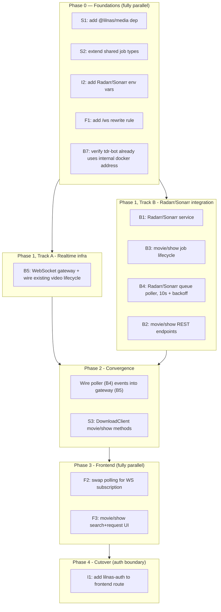

# Media Download Unification — Plan

## Goal

Repurpose `apps/download` from a yt-dlp-only video downloader into a unified media download service with two surfaces:

1. **Frontend** — web UI for downloading yt-dlp-supported videos (YouTube, etc.), movies, and shows.
2. **Backend** — a unified download API (REST + WebSocket) that becomes the shared entry point other services use to trigger and observe downloads, starting with `apps/tdr-bot` and open to future integrations.

## Key decisions

1. **Realtime transport: real WebSocket, not SSE.** The repo has an existing SSE convention (`apps/auth/src/sse/sse.controller.ts`, `apps/tdr-code/src/sse/sse.controller.ts`) that would've cost nothing (built into `@nestjs/common`, no new dependency), but the requirement is live cross-user broadcast — any user watching the downloads page should see *other users'* downloads update in real time, not just their own. Going with a real WebSocket means this will be the first WebSocket implementation in the monorepo (no existing `socket.io`/`ws`/`@nestjs/websockets` dependency anywhere today).
2. **WebSocket topology: browser → frontend → backend, proxied for free by Next.js.** The browser never connects to the backend directly — it opens a same-origin WebSocket to the frontend (e.g. `wss://download.lilnas.io/ws/...`). **Verified by spike:** Next.js's built-in `rewrites()`, when the destination is an external URL, already proxies WebSocket upgrade requests end-to-end — confirmed empirically against a real `output: 'standalone'` build. No custom server needed.
3. **Radarr/Sonarr integration scope: additive now, migration is the confirmed eventual direction.** `apps/tdr-bot` already has a full, tested Radarr/Sonarr integration (`apps/tdr-bot/src/media/`, `apps/tdr-bot/src/media-operations/request-handling/strategies/`) with unit/characterization/integration test coverage. We are **not** touching or migrating that in this pass — `apps/download` gets its own, separate Radarr/Sonarr service built on `@lilnas/media`, with some near-term duplication accepted. **Resolved:** this duplication is transitional, not permanent — the end goal is `apps/download`'s integration becoming canonical, with tdr-bot's conversational strategies eventually rewired to call it instead of `RadarrService`/`SonarrService` directly, and tdr-bot's own copies retired at that point. Not scheduled; tracked as future work.
4. **Auth: the backend has no auth of its own — the entire security boundary is `lilnas-auth` at the frontend's Traefik router.** Resolved (see below): the backend (`apps/download`'s NestJS process) gets **no API key, no guard, on REST or the WebSocket gateway.** Every real caller — the frontend's own server-side code (loopback, same container), `tdr-bot` (internal Docker network), and any future integration co-located on that network — reaches it with no credential, protected purely by the fact that the backend has never had, and will not get, a public Traefik route (confirmed: `apps/download/deploy.yml` only routes port 8080, the frontend, today). The one and only perimeter is `traefik.http.routers.download.middlewares=lilnas-auth` on the frontend's router. Because `lilnas-auth` is Traefik's native `forwardauth` middleware (`infra/proxy.yml`), it intercepts *every* request matching that router — including the browser's initial WebSocket upgrade request, since at the point Traefik evaluates middleware it's still a plain HTTP request with `Upgrade` headers, before the protocol switch happens. So landing `lilnas-auth` on the frontend route (I1) covers both normal page loads and the WS handshake — nothing extra needs to be built for the WS path specifically.
5. **No Radarr/Sonarr container upgrade, no `@lilnas/media` codegen regeneration.** The existing generated client already covers everything needed (search, add/monitor, queue/status, delete, quality profiles, commands) — confirmed because `tdr-bot` already exercises exactly these endpoints successfully in production today. Separately, and not required for this work: `packages/media`'s codegen pipeline is currently broken (`openapi-ts.config.ts` points at `apis/{radarr,sonarr}.json`, which were never committed to git) — flagged for awareness, not a blocker.

## Current state (for reference)

- `apps/download` is yt-dlp/ffmpeg only. Job model: `DownloadType` has a single member, `Video` (`packages/utils/src/download/types.ts:10-12`). Jobs are in-memory only (`apps/download/src/download/download-state.service.ts`, a `Map`, no DB) — state is lost on restart. No progress percentage, only coarse status transitions (`Pending → Downloading → Converting → Uploading → Cleaning → Completed/Failed/Cancelled`).
- No push mechanism exists today: the frontend polls every 1s (`apps/download/src/components/DownloadById.tsx:33-44`), and `tdr-bot` polls via a recursive `setTimeout` (`apps/tdr-bot/src/commands/download-command.service.ts`).
- `apps/download`'s **frontend** is fully open today — no Traefik `lilnas-auth` middleware on its route (`apps/download/deploy.yml`), no guards in code. Its **backend** has likewise never had a Traefik route at all — the deploy file only ever routed port 8080. That backend-is-internal-only fact is what decision 4 relies on going forward.
- The shared client, `DownloadClient` (`packages/utils/src/download/client.ts`), is 100% video-job shaped — `getVideoJob`/`createVideoJob`/`cancelVideoJob` only. It already has `dockerInstance` (`http://download:8081`, internal) and `remoteInstance` (`https://download.lilnas.io`, external) factories; `tdr-bot`'s existing slash command already uses `dockerInstance` for its actual API calls (`apps/tdr-bot/src/commands/download-command.service.ts:70`) — `remoteInstance`'s URL is only ever used for the human-facing Discord link text, never for a real request.
- `apps/download` is actually **two processes in one container**: a NestJS backend (`nest start`, port 8081) and a separate Next.js frontend (`next dev`/`next start`, port 8080, `output: 'standalone'`). `apps/download/next.config.js` already proxies `/api/:path*` to `http://localhost:8081/:path*` via Next's `rewrites()`, and — per the spike below — the same mechanism already carries WebSocket traffic too.
- Radarr/Sonarr integration lives entirely inside `tdr-bot`, driven by natural-language Discord messages (`IntentDetectionNode` → `MediaRequestHandler` → strategy classes), using `@lilnas/media`'s generated Radarr/Sonarr clients.

## Verified via spike

Built a minimal, isolated reproduction (Next.js 15.5.20 App Router frontend with `output: 'standalone'`, plain Node `http`+`ws` backend) to answer the one open question in this plan: does a WebSocket connection survive Next's `rewrites()` proxy, or does it need a custom server?

- Added a second rewrite rule alongside the existing `/api/:path*` one: `{ source: '/ws/:path*', destination: 'http://localhost:<backend-port>/:path*' }`.
- Built with `next build` (standard `output: 'standalone'`, **no custom server file** — the generated `.next/standalone/server.js` was run as-is).
- Ran the built standalone server and a plain backend `ws` server, then connected a real WebSocket client to the frontend's rewritten path.
- **Result: full bidirectional round trip worked** — the client received a message the backend pushed on connect, sent a message, and received the backend's echo back, all through the frontend's standalone server with zero custom relay code.

Also confirmed by Next's own source (`packages/next/src/server/lib/router-server.ts`): the upgrade handler resolves the request through the same route-matching Next uses for normal requests, and when it matches an external rewrite, it calls `proxyRequest`, which uses `http-proxy` with `ws: true` and `proxy.ws(req, res, upgradeHead)`. This runs in both `next dev` and `next start` (and therefore the standalone-output server, which shares the same code) — it isn't dev-only or custom-server-only behavior.

**Practical consequence: no custom Next.js server, no hand-rolled proxy code.** Add a rewrite rule; the browser connects same-origin; Next relays it.

## Changes required

Each item has an ID used in the Sequencing section below.

### Infra / deploy

- **I1** — Add the `lilnas-auth` Traefik middleware to `apps/download/deploy.yml`'s frontend route. Per decision 4, this is now the sole security boundary for the entire feature (page loads and the WS handshake alike) — not just a nice-to-have.
- **I2** — Add new env vars: `RADARR_URL`, `RADARR_API_KEY`, `SONARR_URL`, `SONARR_API_KEY` (mirror `apps/tdr-bot/src/env.ts`) — for calling Radarr/Sonarr's own APIs. No download-service-specific API key needed (see decision 4).

### Shared packages

- **S1** — Add `@lilnas/media` as a dependency of `apps/download`.
- **S2** — Extend the job model in `packages/utils/src/download/types.ts`. **How:** model it as a discriminated union on `type` (`DownloadType.Video | Movie | Show`) rather than widening the existing single interface — keeps `downloadUrls`/`file` exclusive to `Video`, and gives movie/show jobs their own fields (e.g. `radarrId`/`sonarrId`, `mediaTitle`, `posterUrl`, queue status) with proper type narrowing. No MinIO fields on movie/show jobs — Radarr/Sonarr/Emby own that file permanently in `/storage/media-library`.
- **S3** — Extend `DownloadClient` (`packages/utils/src/download/client.ts`) with movie/show search/request/status/delete methods matching the new backend endpoints (B2). No auth-header support needed (see decision 4).
- No changes needed to `packages/media` itself.

### Backend (`apps/download`)

- **B1** — New service(s) wrapping `@lilnas/media`'s Radarr/Sonarr clients. **How:** mirror `apps/tdr-bot/src/media/clients.ts`'s provider pattern (`createClient` from `@lilnas/media/radarr/client` / `/sonarr/client`, configured with `baseUrl` + `X-Api-Key` header) — don't reinvent that wiring.
- **B2** — New REST endpoints for movie/show search, request, status, delete — alongside the existing 3 video endpoints in `apps/download/src/download/download.controller.ts`. **Delete semantics (resolved):** mirror tdr-bot's `unmonitorAndDeleteMovie`/`unmonitorAndDeleteSeries` exactly, for behavioral consistency across both surfaces.
- **B3** — New job lifecycle for movie/show jobs in `DownloadStateService`: requested → searching → downloading → importing → completed/failed, tracked by polling rather than owning a process.
- **B4** — New poller for Radarr/Sonarr's `/queue` endpoints. **How:** use `@nestjs/schedule`'s `@Interval()` — already a dependency (used today by `ytdlp-update`), no new package needed. **Interval (resolved):** 10s, with exponential backoff on error up to a ~2min cap — avoids hammering a down Radarr/Sonarr instance with a tight retry loop. Keep a last-seen snapshot per tracked job and diff each tick; only emit on change.
- **B5** — New WebSocket gateway, broadcasting job status/events to all connected clients. **How:** use `@nestjs/platform-ws` (the lightweight `ws`-based adapter), not socket.io — the requirement is plain broadcast-to-everyone, no rooms/namespaces, so socket.io's extra abstraction buys nothing. Mount it at a path the frontend's `/ws/:path*` rewrite (F1) forwards to. This is the first WebSocket usage in the repo; keep it minimal. Wire the *existing* yt-dlp job lifecycle to emit on this gateway first — that can be built and tested using current video-only functionality, with no Radarr/Sonarr dependency. No auth check on the handshake (see decision 4) — the boundary is I1, not this gateway.

### Cross-app (`apps/tdr-bot`)

- **B7** — Verification only, no code expected: confirm `tdr-bot`'s existing `DownloadClient` calls use `dockerInstance` (internal), not `remoteInstance` (external) — per the current code (`download-command.service.ts:70`) this is already true. Worth an explicit check during implementation, and optionally a guard (lint rule or comment) against a future regression to `remoteInstance` for programmatic calls.

### Frontend (`apps/download`)

- **F1** — Add a `/ws/:path*` rewrite rule to `apps/download/next.config.js`, alongside the existing `/api/:path*` one, pointing at the backend's WebSocket gateway path. **Confirmed by spike: this is the entire "relay" — no custom server code required.**
- **F2** — Replace the 1s `setInterval` poll in `DownloadById.tsx` with a native browser `WebSocket` connecting to the same-origin `/ws/...` path. **How:** mirror the shape of `apps/tdr-code`'s `use-live-stream.ts` hook (subscribe on mount, invalidate/update state on message, handle reconnect), adapted for `ws` instead of `EventSource`.
- **F3** — New movie/show search + request UI alongside the existing yt-dlp form (`apps/download/src/components/Home/*`).

## Sequencing

**Phase 0 — Foundations.** S1, S2, I2, F1, and the B7 verification are independent of each other and of everything downstream — do all five in parallel. None of this involves auth infrastructure anymore — there's nothing to build there.

**Phase 1 — Two independent tracks, run in parallel.**
- *Track A (realtime infra)* — just B5 now. Build and test it entirely against the *existing* yt-dlp job lifecycle, with zero Radarr/Sonarr dependency.
- *Track B (Radarr/Sonarr integration)* — B1, B3, B4, B2. Disjoint files from Track A; the only shared touchpoint is `DownloadStateService`, and neither track needs the other's output yet.

**Corrections/clarifications (found while implementing Phase 0):** B4's poller should use `@Cron('*/10 * * * * *')`, not `@Interval()` as its "How" note above says — this repo has no `@Interval()` usage anywhere; `@Cron` is the only scheduling precedent (`apps/download/src/ytdlp-update/ytdlp-update.service.ts:36`). B5's WebSocket gateway mounts at `path: '/ws'`, matching the frontend rewrite `{ source: '/ws/:path*', destination: 'http://localhost:8081/ws/:path*' }` (prefix preserved on both sides). Also, wiring the *existing* video job lifecycle into the gateway happens in **Phase 2** together with B4's wiring, not alongside building the gateway itself in Phase 1 as B5's bullet above currently implies — this avoids two parallel Phase-1 units (Track A's B5, Track B's B3) both editing `download-state.service.ts`.

**Phase 2 — Convergence.** Once both tracks land, wire B4's poller output through B5's gateway, and finish S3's movie/show client methods against the now-real B2 endpoints.

**Phase 3 — Frontend, fully parallel.** F2 (swap the polling call site for a WS subscription) and F3 (movie/show UI) have no dependency on each other — both just need Phase 2's outputs.

**Phase 4 — Cutover.** Add the `lilnas-auth` middleware (I1). One explicit tradeoff worth naming: until this lands, the frontend (and therefore the WS broadcast feed behind it) is reachable by anyone who can reach `download.lilnas.io` — no worse than today's baseline, but worth landing before treating the feature as done rather than leaving it for "later cleanup." Sequencing it last is about not fighting auth friction during manual testing, not about it being optional.

## Explicitly out of scope (this pass)

- Migrating `apps/tdr-bot`'s existing Radarr/Sonarr conversational flow to call the new unified API — confirmed as the eventual direction (decision 3), just not scheduled here.
- Any Radarr/Sonarr container version changes.
- Fixing `packages/media`'s broken codegen pipeline.

## Open questions / follow-ups

- **Future external (non-Docker-colocated) integrations.** Decision 4's model assumes every caller is either the frontend itself or something co-located on the same internal Docker network. If a genuinely external integration ever needs this API, it has no way in today (correctly — there's no auth to bypass), and something will need to be designed then: adding it to the network, or building real auth at that point. Not blocking now; just don't forget this constraint exists when "future integrations" comes up again.
