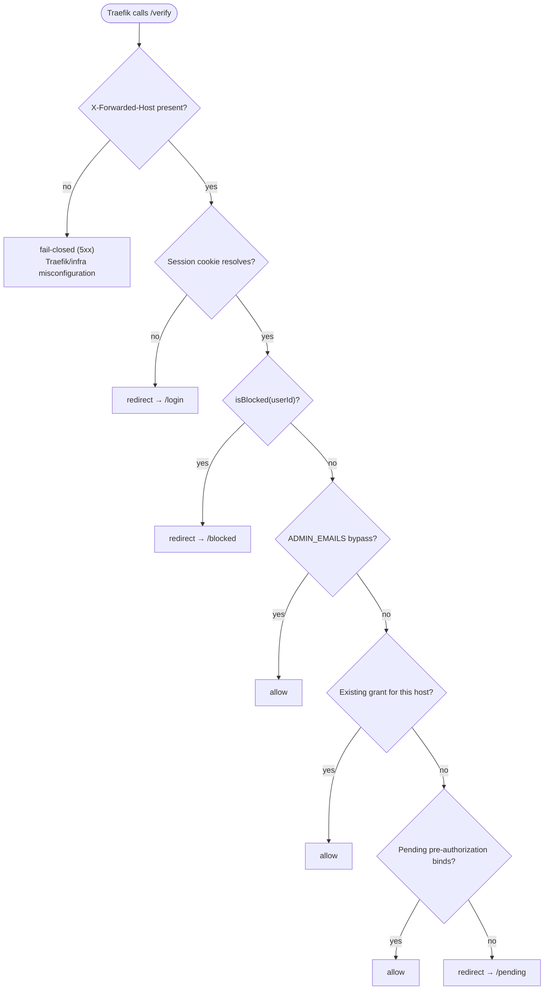

# @lilnas/auth

Self-hosted ForwardAuth provider for lilnas. Every gated `*.lilnas.io` (and `*.dev.lilnas.io`) router delegates its authentication decision to this app instead of running its own login flow. Sign-in is Google OAuth via [Better Auth](https://www.better-auth.com/); access to each individual service is a separate, admin-managed grant.

## Request flow

1. A browser requests a Traefik-routed host that carries the `lilnas-auth` middleware (see `infra/proxy.yml`).
2. Traefik's ForwardAuth check calls this app's **backend** directly — `http://auth:8081/verify` — before the real request is ever forwarded. This bypasses the Next.js frontend entirely; the frontend only ever serves pages a human browses to directly (`/login`, `/pending`, `/blocked`, `/admin`).
3. Traefik forwards `X-Forwarded-Host` / `X-Forwarded-Proto` / `X-Forwarded-Uri` and the original `Cookie` header on that subrequest. `VerifyController` reads them and calls `VerifyService.decide()` (`src/verify/verify.service.ts`).
4. `decide()` returns one of three outcomes:
   - **Allow** — Traefik lets the real request through. The response also carries `X-Forwarded-User` / `X-Forwarded-User-Id` (`authResponseHeaders` in `infra/proxy.yml`), so a downstream service can read the caller's identity without doing its own lookup.
   - **Redirect** — an absolute `Location` back to this app's own `/login`, `/pending`, or `/blocked` page. Absolute is load-bearing: Traefik's `preserveLocationHeader` defaults to `false`, so a relative redirect out of `/verify` would otherwise be rewritten into a container-internal, browser-unreachable URL.
   - **Fail-closed (5xx)** — only when `X-Forwarded-Host` itself is missing, which means Traefik/infra is misconfigured, not that the caller is anonymous. `/verify` never fails open.

## The `/verify` decision

`VerifyService.decide()`'s branch order is load-bearing — each check runs only after the ones above it have been ruled out:

Two orderings are deliberate, not incidental:

- **Blocked beats admin bypass.** A blocked `ADMIN_EMAILS` address is denied exactly like any other blocked account — blocking takes effect before the unconditional admin allowance is ever considered. (This is the opposite of `AdminGuard`'s own posture on `/admin`, which is intentionally independent of blocked/grant state so an admin can never lock themselves out of the one place that can undo a block. See `admin.guard.ts` and `verify.service.ts`'s own header comments for the full rationale.)
- **Grant beats pre-authorization bind.** A pre-authorization only ever binds on the already-rare "no grant found" branch, and only once — see `AccessCacheService.bindPreAuthorizedGrant()`'s own header comment for why this runs lazily here instead of from an auth-time hook (the direct approach is circular: the hook would need `AccessCacheService` injected into the module that constructs `AccessCacheService`).

## Two-process topology

This app runs as **two separate Node processes** behind one Traefik router:

| Process  | Framework | Port | Role                                                                                              |
| -------- | --------- | ---- | ------------------------------------------------------------------------------------------------- |
| Frontend | Next.js   | 8080 | Public-facing. Serves `/login`, `/pending`, `/blocked`, `/admin`.                                 |
| Backend  | NestJS    | 8081 | Internal only. Owns `/verify`, `/api/auth/*` (Better Auth), `/requests/*`, `/admin/*`, `/health`. |

Both run in the same container (`deploy.yml` / `deploy.dev.yml`), started as concurrent processes via `run-p` — production's `pnpm start` (`ENTRYPOINT` in the `Dockerfile`) races `start:backend`/`start:frontend`; dev goes through the `lilnas dev` CLI (`pnpm --filter=auth dev`), which wraps `dev:backend`/`dev:frontend`. Traefik's health check and its ForwardAuth address both target the **backend** (`:8081`) directly, never the frontend — a crashed Next.js process must not restart the container or interrupt `/verify` for every other gated service.

The frontend reaches the backend three different ways, depending on who's asking:

- **Server Components / Server Actions** call the backend directly over the loopback interface — `callBackend()` (`src/app/admin/actions.ts`, `src/app/pending/actions.ts`) builds `http://localhost:${BACKEND_PORT}${path}`, forwards the incoming `Cookie` header, and never touches the browser. This is how `/admin` and `/pending` server-side mutations work.
- **`next.config.js` rewrites** proxy two specific browser-facing paths straight to the backend, preserving the path (non-stripping, unlike `apps/download`'s app-wide rewrite):
  - `/api/auth/:path*` → `http://localhost:8081/api/auth/:path*` — Better Auth's own mount. Non-stripping is what lets `basePath` and the internally-derived router prefix agree on both sides with no URL-rewriting middleware in between.
  - `/api/sse/:path*` → `http://localhost:8081/sse/:path*` — the pending page's live `EventSource` connection, which the browser opens directly and so needs an actual browser-reachable route.
- **Traefik's ForwardAuth check** talks to the backend directly (`http://auth:8081/verify`) and never touches the frontend at all — see [Request flow](#request-flow) above.

One env var quirk worth knowing: `.env.example` documents `FRONTEND_PORT=8080`, but nothing in `src/` ever reads it — there is no `EnvKeys.FRONTEND_PORT`. In dev, the frontend's port is hardcoded via `next dev -p 8080` (`package.json`). In production, `start:frontend` runs `next`'s standalone-build `server.js`, which reads the standard `PORT` env var (default `3000`) — that ends up `8080` because the `lilnas-nextjs-runtime` base image (`infra/base-images/lilnas-node-runtime.Dockerfile`) sets `ENV PORT=8080`, not because of anything this app's own config does. `BACKEND_PORT`, by contrast, is a real, actively-read env var (`src/bootstrap.ts`, `callBackend()`, `require-admin.ts`, `require-session.ts` all call `env(EnvKeys.BACKEND_PORT)`).

## Environment variables

Source of truth for keys: `src/env.ts`'s `EnvKeys`. Source of truth for dev values: `.env.example`.

| Variable                  | Dev value               | Prod value                                                    | Purpose                                                                                                                                                                                                                                                            |
| ------------------------- | ----------------------- | ------------------------------------------------------------- | ------------------------------------------------------------------------------------------------------------------------------------------------------------------------------------------------------------------------------------------------------------------ |
| `BACKEND_PORT`            | `8081`                  | `8081`                                                        | NestJS backend's own listen port; also how the frontend addresses it (`callBackend()`).                                                                                                                                                                            |
| `DATABASE_PATH`           | `./lilnas-auth.db`      | `/data/lilnas-auth.db` (set in `deploy.yml`, not `.env.prod`) | SQLite file path.                                                                                                                                                                                                                                                  |
| `NODE_ENV`                | `development`           | `production`                                                  | Standard Node environment flag.                                                                                                                                                                                                                                    |
| `AUTH_HOST`               | `http://auth.localhost` | `https://auth.lilnas.io`                                      | This app's own full origin — scheme + host, no path, no trailing slash. Reused verbatim everywhere this app builds a URL against itself (redirect validation's own-host guard, `/verify`'s absolute `Location` headers, Better Auth's `baseURL`/`trustedOrigins`). |
| `GOOGLE_CLIENT_ID`        | `changeme`              | real client ID                                                | Google OAuth client.                                                                                                                                                                                                                                               |
| `GOOGLE_CLIENT_SECRET`    | `changeme`              | real client secret                                            | Google OAuth client.                                                                                                                                                                                                                                               |
| `BETTER_AUTH_SECRET`      | `changeme`              | generated secret (e.g. `openssl rand -base64 32`)             | Session-signing secret, unrelated to Google.                                                                                                                                                                                                                       |
| `COOKIE_DOMAIN`           | `.localhost`            | `.lilnas.io`                                                  | `Domain` attribute for the cross-subdomain session cookie (`advanced.crossSubDomainCookies`). Not hardcoded in code since dev sign-in runs on `*.localhost`.                                                                                                       |
| `REDIRECT_ALLOWED_SUFFIX` | `localhost`             | `lilnas.io`                                                   | Domain family a post-sign-in `redirect` candidate's hostname must equal or be a subdomain of. Already covers `*.dev.lilnas.io` in prod, since that's a nested subdomain of `lilnas.io`.                                                                            |
| `SSE_KEEPALIVE_MS`        | `25000`                 | `25000`                                                       | Keepalive interval for the pending page's live SSE channel.                                                                                                                                                                                                        |
| `ADMIN_EMAILS`            | `changeme@example.com`  | real comma-separated list                                     | Admin allowlist. Read independently by `AdminGuard` (throws if unset — only breaks `/admin`) and `VerifyService` (defaults to `''` — must never throw, since it gates every request on the hot path).                                                              |

`.env` (dev) and `.env.prod` (prod) are both gitignored; copy `.env.example` to start either one. See root `CLAUDE.md`'s Environment Variables section for the general convention.

## Fix identifiers

Comments throughout `src/` cite short IDs from a structured code review of this app, each mapping to a real git commit — `git log --oneline | grep <id>` finds it:

| ID  | Fix                                                                       |
| --- | ------------------------------------------------------------------------- |
| S1  | Narrow compose bind mounts to individual files                            |
| S2a | `isBlocked` beats the admin bypass on `/verify`                           |
| S2b | Admin-initiated session revocation                                        |
| S3  | Validate admin request bodies with Zod                                    |
| S4  | One host-normalization rule for the grant keyspace                        |
| S5  | Rate limit `/admin`, `/requests`, `/me`, excluding the `/verify` hot path |
| S6  | Block/unblock must not lie about nonexistent users                        |
| S7  | Enforce the `authResponseHeaders` invariant with a test                   |
| P1  | Dedup concurrent `resolveSession()` calls for the same cookie             |
| P2  | Key the session cache on the session cookie, not the whole header         |
| P3  | Count prior decisions instead of fetching full rows                       |
| M1  | Comment-density pass + this README                                        |
| M2  | Split Add-person / Edit-access modals into their own files                |
| M3  | Batch access-change writes, drop optimistic UI state                      |
| M4  | Make `test:cov`'s coverage table deterministic                            |
| M5  | Dedupe `jest.config.js`'s shared project config                           |
| M6  | Delete dead seed-whitelist code                                           |

If you spot an older `U<n>` / `R<n>` / `AE<n>`-style tag instead (e.g. `U9`, `R15`, `AE6`), that's a leftover from this app's original, now-archived build-out plan (`docs/archive/`) — a different, unrelated numbering scheme, not a typo'd version of the table above. Those tags don't resolve to anything a current reader can follow up on; treat them as historical noise and prefer whatever technical explanation surrounds them in the same comment.
