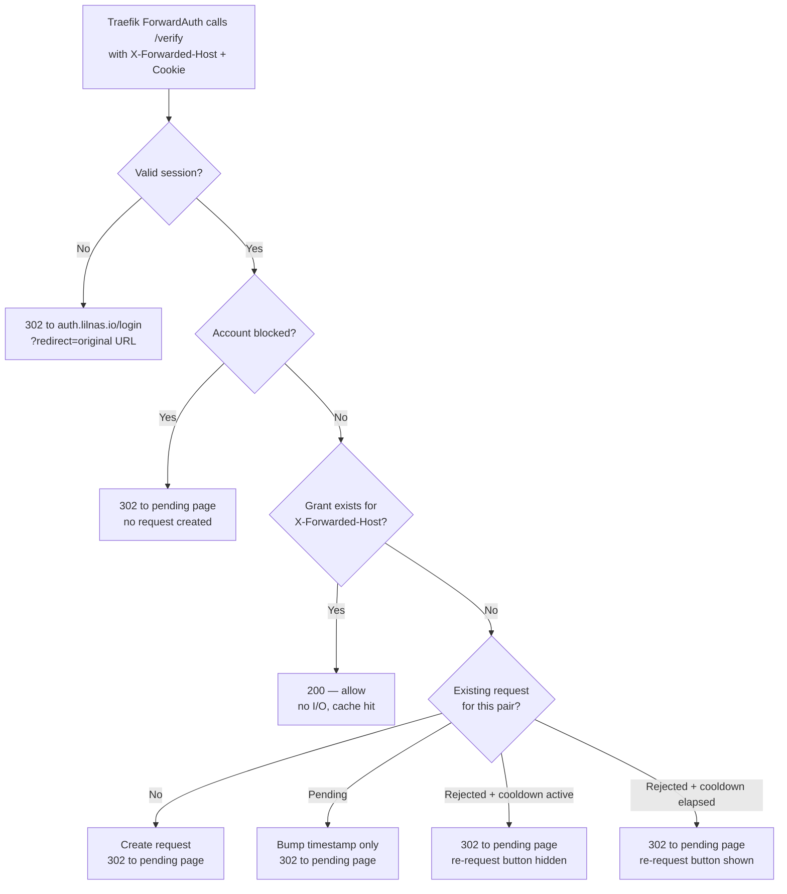

# lilnas-auth — Custom Forward Auth with Per-Service Access Requests

## Problem Frame

lilnas currently authenticates via `thomseddon/traefik-forward-auth:2.1.0` (`infra/proxy.yml:61`), configured
with Google OAuth and a single global `WHITELIST` env var. Access is binary: an email is either on the list
and can reach every protected service, or it is not on the list and can reach none of them. Adding a person
means editing `infra/.env.forward-auth` and restarting the container.

This produces four distinct problems, all of which the user confirmed as drivers:

1. **Operator toil** — the admin is a manual bottleneck for every access change.
2. **No least privilege** — a person who should only see Emby currently gets Grafana, Prometheus, the Traefik
   dashboard, and Yacht as well.
3. **A whole audience is inadmissible** — there are people who should get exactly one service, and today the
   only options are "everything" or "nothing," so they get nothing.
4. **Dependency risk** — `thomseddon/traefik-forward-auth` is effectively unmaintained and sits on the
   critical path of every protected request.

`lilnas-auth` replaces it with an owned service that keeps Google OAuth but adds per-service grants and a
self-service request → approve → access loop.

**The sharpest framing:** per-service access control is nearly free without any of this — running N
`thomseddon` containers with different `WHITELIST`s and different middleware names achieves it with zero code,
and the commented-out `truereflection-forward-auth` block at `infra/proxy.yml:78` is that exact pattern
already known to this repo. What that cannot produce is the self-service request loop, the live approval
redirect, and the admin UI. **The onboarding loop is the entire product value here.** The authorization check
itself should stay boring, fast, and unremarkable.

---

## Actors

- A1. **End user** — a person with a Google account who reaches a lilnas hostname. May be already granted,
  granted for other services but not this one, previously rejected, or entirely unknown to the system.
- A2. **Admin** — the operator. Reviews the request queue, approves and rejects, manages users and grants.
  Authorized by env allowlist, not by data in the grants table.
- A3. **Traefik** — calls `/verify` synchronously via ForwardAuth middleware before proxying any request to a
  protected service. Treats 2xx as allow and returns any other response to the client verbatim.

---

## Key Flows

- F1. **Unknown user reaches an ungranted service**
  - **Trigger:** A1 requests `https://swole.lilnas.io/some/path` with no session.
  - **Actors:** A1, A3
  - **Steps:** Traefik calls `/verify` → no session → 302 to `auth.lilnas.io` with the original URL preserved
    → Google OAuth → callback → grant lookup for `swole.lilnas.io` finds nothing → an access request is
    created → the pending page renders.
  - **Outcome:** A pending request exists in the admin queue; A1 sits on the pending page holding an open
    live channel.
  - **Covered by:** R1, R2, R3, R5, R9

- F2. **Admin approves while the user is waiting**
  - **Trigger:** A2 clicks approve on a queued request whose requester is currently on the pending page.
  - **Actors:** A1, A2
  - **Steps:** Grant written → cache invalidated → live channel pushes to A1's open pending page → A1's
    browser redirects to the originally requested URL → `/verify` now allows.
  - **Outcome:** A1 lands on the service they asked for without reloading or being told to.
  - **Covered by:** R9, R11, R2

- F3. **Rejection and retry**
  - **Trigger:** A2 rejects a queued request.
  - **Actors:** A1, A2
  - **Steps:** Request marked rejected → **no notification of any kind** → A1's page continues to show the
    same pending state, indistinguishable from a request still awaiting review → after the cooldown elapses,
    the pending page offers a re-request → re-requesting creates a fresh queue item carrying its own history
    ("4th request, rejected 3×").
  - **Outcome:** A1 has no signal that a decision was made. A2 can see persistence and reconsider.
  - **Escape path:** A2 noticing repeat requests in the history view is the *only* recovery route for a
    mis-clicked rejection. This is a deliberate accepted cost of R7 — see Key Decisions.
  - **Covered by:** R7, R8, R11, R12

- F4. **Returning granted user**
  - **Trigger:** A1 with a valid session and an existing grant requests a protected host.
  - **Actors:** A1, A3
  - **Steps:** Traefik calls `/verify` → session cookie verified from cache → grant found in cache → 2xx.
  - **Outcome:** Request proceeds with no interstitial, no redirect, and no I/O on the verify path.
  - **Covered by:** R2, R4

---

## The verify decision

Note that the pending page is the destination for every non-allowed outcome, and looks the same in all of
them. That visual identity is the mechanism behind R7.

---

## Requirements

**Session and the verify hop**

- R1. Google OAuth sign-in via `better-auth`, with the session cookie scoped to `.lilnas.io` so one sign-in
  covers every subdomain.
- R2. A `/verify` endpoint implementing Traefik's ForwardAuth contract, keyed on `X-Forwarded-Host` as the
  service identity. 2xx allows; any other status is returned to the client verbatim. In steady state this
  path performs no I/O — grants and sessions are served from an in-memory cache invalidated on write.
- R3. After sign-in, the user returns to the URL they originally requested. The redirect target must be
  validated against `*.lilnas.io` — an unvalidated `redirect` parameter here is an open-redirect on a domain
  users are being trained to trust.
- R4. A signed-in user with an existing grant passes through with no interstitial page and no extra redirect.

**The request loop**

- R5. A signed-in user with no grant for the requested host is shown a pending page, and an access request is
  created for that `(user, service)` pair.
- R6. The pending state is **absorbing**: re-requesting while a request is already pending bumps a timestamp
  and never creates a second queue item. This bounds any single account's maximum queue contribution to one
  item per service by construction, independent of rate limiting.
- R7. Rejection is silent and indistinguishable from pending. No email, no banner, no status change visible
  to the user.
- R8. After rejection, a re-request is permitted once a cooldown on that `(user, service)` pair elapses. The
  window is configurable; default 24–48h. There is no lifetime cap.
- R9. The pending page holds a live channel and redirects automatically when a grant is written, without a
  reload or a poll-driven delay.

**Admin — request queue**

- R10. A queue view of pending requests showing requester, service, and age, with bulk select and dismiss.
- R11. Approve and reject actions on individual requests.
- R12. Per-`(user, service)` request history surfaced inline in the queue, so repeat requests after rejection
  are visible as such.

**Admin — services and users**

- R13. The service registry is auto-discovered from Traefik labels rather than hand-maintained, so adding a
  label is sufficient for a service to appear in the admin UI. Extends the existing discovery in
  `apps/portal/src/utils/hosts.ts`, which already reads labels from both the Docker socket and the compose
  files but does not yet correlate router names to middleware chains.
- R14. The user list shows only users with at least one grant, current or historical. Users whose only
  history is unapproved requests do not appear.
- R15. Admins can add a user by email (pre-authorizing before that person's first sign-in), remove a user, and
  edit which services a user may access.
- R16. Admins can block an account. A blocked account generates no further requests and reaches no service.

**Operations and cutover**

- R17. Admin authorization derives from an `ADMIN_EMAILS` env allowlist, evaluated without reading the grants
  table, so a corrupt or half-migrated grants table cannot lock the admin out of the tool needed to fix it.
- R18. `lilnas-auth` is introduced as a **new** Traefik middleware defined alongside the existing
  `forward-auth`, not as a replacement for it. Routers migrate one at a time, each a one-line label change
  with a one-line revert. `thomseddon` is deleted only after the last router moves.
- R19. Existing `WHITELIST` members are seeded into the grants table with access to the services they can
  currently reach, before the first router is migrated. Nobody currently working gets bounced to a pending
  page at cutover.
- R20. A health endpoint plus explicit failure behavior for the verify path. ForwardAuth cannot fail open —
  if `/verify` is unreachable, Traefik returns 502 and every migrated service is down — so liveness,
  restart policy, and startup ordering are correctness concerns, not operational polish.

---

## Acceptance Examples

- AE1. **Covers R6.** Given a user with a pending request for `swole.lilnas.io`, when they close the tab,
  return an hour later, and are again shown the pending page, then the admin queue still contains exactly one
  request for that pair, with an updated last-seen timestamp.
- AE2. **Covers R7, R8.** Given an admin rejects a user's request at 09:00, when that user reloads the pending
  page at 09:01, then the page is byte-identical to what a still-pending user sees, and the re-request control
  is absent until the cooldown elapses.
- AE3. **Covers R2, R9.** Given a user is on the pending page for `swole.lilnas.io` and the admin approves,
  when the grant is written, then the user's browser navigates to their originally requested path without
  interaction, and that navigation's `/verify` call returns 2xx from cache rather than reading the database.
- AE4. **Covers R3.** Given a crafted link `auth.lilnas.io/login?redirect=https://evil.example.com`, when the
  user completes Google sign-in, then they are returned to a default lilnas destination and never to the
  external origin.
- AE5. **Covers R17.** Given the grants table is empty or fails to open, when an address in `ADMIN_EMAILS`
  signs in at `auth.lilnas.io`, then the admin UI loads and remains usable.
- AE6. **Covers R16.** Given a blocked account, when that account signs in and requests any protected host,
  then no new request row is created for any service and the account reaches nothing.

---

## Success Criteria

- Adding a person to one service takes an approval click, not an env edit and a container restart.
- A family member can be given Emby-equivalent access with no path to Grafana, Prometheus, Yacht, or the
  Traefik dashboard.
- A person who was previously inadmissible under the all-or-nothing whitelist now has a way in that does not
  require the admin to be present at the moment they ask.
- No period during migration where a protected service is reachable unauthenticated, and no migration step
  whose rollback is more than one label change.
- `thomseddon/traefik-forward-auth` is removed from `infra/proxy.yml` at the end, not carried indefinitely.
- Planning can proceed without inventing product behavior: the request state machine, the rejection
  semantics, the rate-limit shape, and the cutover sequencing are all decided here.

---

## Scope Boundaries

- **Not expanding the footprint in v1.** The 13 hostnames not currently carrying `forward-auth` — `sonarr`,
  `radarr`, `sabnzbd`, `emby`, `immich`, `storage`, `storage-admin`, `turbo`, `dashcam`, `download`,
  `equations`, `theater`, `tdr-code` — stay as they are. Bringing them in is a per-service decision made
  after v1 ships, deliberately deferred because of the double-login problem (below).
- **Not solving double-login.** Emby, Immich, and MinIO have their own user systems. Fronting them with
  `lilnas-auth` means signing in twice with no SSO between the two. Grafana can accept `X-WEBAUTH-USER`
  proxy auth and is the exception. Header-based SSO into third-party services is out of scope.
- **`tdr-code` stays as it is.** It deliberately left forward-auth for app-owned Discord OAuth
  (`docs/archive/runbooks/tdr-code-phase-d-forward-auth-cutover.md`). It is not migrated onto `lilnas-auth`.
- **No groups or roles.** Grants are per-`(user, service)`. A role layer is a plausible later addition but
  adds a concept for a user population that does not yet need it.
- **No notification channel.** Silent rejection is a requirement, not an omission, and there is no email or
  push for approvals either — the live redirect covers the case that matters.
- **No API tokens or service accounts.** Machine-to-machine access continues to use the internal Docker
  network, as it does today for Prometheus scraping.
- **No lifetime request cap.** Explicitly rejected — see Key Decisions.
- **No path-level authorization.** A grant is per-hostname. Path-scoped rules within a service are out of
  scope; the existing `swole-metrics-deny` IP-allowlist pattern (`apps/swole/deploy.yml:45-50`) remains the
  tool for that.

---

## Key Decisions

- **Approach A (replace in place) over B (authorization layer on top of thomseddon).** B is roughly 40% of
  the build and skips OAuth, session management, and the open-redirect surface entirely. It was rejected
  because chaining `forward-auth,lilnas-authz` requires the outer `WHITELIST` to become permissive so the
  inner gate can do the real work — an outer gate that admits everyone is strictly worse than one gate doing
  both jobs, and it fails driver #4 outright.
- **Approach A over C (replace and expand simultaneously).** C's value is real — the per-service model only
  pays off when there is something to grant that users cannot already reach — but the double-login problem
  should be discovered on one piloted service rather than committed to across 13 hostnames up front.
- **Cooldown only, no per-account pending cap.** A per-account cap does not defend against the actual
  fully-open threat, which is many free Google accounts rather than one noisy account; it reduces a
  100-bot fan-out from 800 items to 300, which is equally unusable. It also punishes the best-case legitimate
  user — a new family member wanting three services on day one hits the ceiling and gets an error implying
  they did something wrong. The absorbing pending state (R6) already bounds per-account queue contribution
  structurally.
- **Block action instead of a rate-limit ceiling.** Blocking an account is strictly more effective against a
  determined actor than any cap, is adjacent to the already-required remove-user capability, and costs almost
  nothing.
- **No lifetime cap on re-requests.** The silent-rejection dead end is a worse failure mode than a slow
  spammer. A mis-clicked rejection under a lifetime cap permanently and invisibly locks out a real person
  with no recourse and no signal to anyone.
- **Cooldown default 24–48h rather than 7 days.** The cooldown only bites after a rejection; a week is a long
  time for someone rejected by mistake. It is configuration, easy to tighten if abuse ever appears.
- **Service registry derived, never hand-maintained.** A manual registry table drifts from the compose labels
  that actually govern routing, and the drift is silent. Deriving it means adding a label is the single
  action needed to register a service.
- **Admin authorization independent of application data.** Directly informed by
  `docs/archive/runbooks/tdr-code-phase-d-forward-auth-cutover.md` §5.1, which documents that re-adding the Traefik
  label restores the edge gate but does nothing when app-owned auth is present-but-broken. Recovery paths must
  not depend on the thing that broke.
- **In-memory cache on the verify path is a design requirement, not an optimization.** `/verify` runs on every
  request to every migrated service, including static assets. Grants change a few times a month; there is no
  justification for per-asset database reads on the critical path of the entire homelab.

---

## Dependencies / Assumptions

- **Reused, already proven in this repo:** `better-auth@1.6.23` with `@better-auth/drizzle-adapter` and
  `@thallesp/nestjs-better-auth` (`apps/tdr-code`); `drizzle-orm` + `better-sqlite3` with a migrations
  directory (`apps/tdr-code`, `apps/swole`); an SSE module at `apps/tdr-code/src/sse/sse.module.ts` for R9;
  Traefik-label host discovery at `apps/portal/src/utils/hosts.ts` for R13; the SQLite deploy pattern in
  `apps/swole/deploy.yml` (UID 1000 volume ownership, `stop_grace_period`, in-process health check).
- **`apps/tdr-code/src/auth/auth.ts` carries hard-won `better-auth` knowledge** about the `basePath` vs
  `baseURL` split and how the Nest adapter's gate differs from better-auth's internal router. That comment
  block is directly relevant prior art and should be read before wiring the mount.
- **Assumption: homelab scale.** Tens of users, tens of services. In-process SQLite with an in-memory cache is
  correct at this scale; nothing here needs Redis or a separate datastore. Revisit only if the user population
  changes by an order of magnitude.
- **Verified: wildcard TLS certs.** Traefik issues `*.lilnas.io` and `*.dev.lilnas.io` via DNS-01
  (`infra/proxy.yml:20-21, 43-45`), so individual hostnames do not appear in Certificate Transparency logs.
  This materially bounds the practical exposure of the fully-open request model. A future per-host cert would
  make that host publicly enumerable the moment it is issued.
- **Verified: `auth.lilnas.io` is currently behind `forward-auth` itself** (`infra/proxy.yml:76`). The
  replacement must not gate its own admin UI on its own grants table — this is the concrete instance R17
  addresses.
- **Verified: Traefik runs `--api=true` without `--api.insecure`**, so the Traefik API is reachable only
  through `traefik.lilnas.io`, itself behind the auth being replaced. This is why R13 uses label scanning
  rather than the Traefik API.
- **Assumption, unverified:** that `getHostsFromDocker()` in portal runs against a mounted Docker socket in
  production. Portal's `deploy.yml` was not inspected for the mount.

---

## Outstanding Questions

### Resolve Before Planning

_None._

### Deferred to Planning

- [Affects R1, R2][Technical] Confirm Traefik forwards the `Cookie` header on the ForwardAuth subrequest in
  this configuration, and that `better-auth`'s cross-subdomain cookie settings produce a cookie readable from
  the `/verify` handler. The whole design assumes this; it should be proven early rather than discovered late.
- [Affects R9][Technical] SSE behavior through Traefik — buffering and idle-timeout defaults on a long-lived
  pending-page connection. Prior art exists in `apps/tdr-code/src/sse/sse.module.ts` but not necessarily
  through this middleware chain.
- [Affects R13][Technical] Docker socket versus compose-file parsing for label discovery. Mounting
  `/var/run/docker.sock` into an internet-facing container grants it effective host root. `hosts.ts` already
  implements both paths (`getHostsFromDocker` / `getHostsFromFiles`), so the safer option exists — decide
  deliberately rather than copying portal's prod branch by default.
- [Affects R2, R17, R20][Technical] Whether `/verify` shares a process with the OAuth flow and admin UI, or
  runs as a separate minimal process. One process is simpler; splitting means a crash in the admin UI or SSE
  layer cannot take down the verify path for every migrated service.
- [Affects R18][Technical] Migration ordering. The `traefik` and `auth` routers are the highest-risk and
  should almost certainly move last; a low-stakes router should go first.
- [Affects R19][Needs research] The current `WHITELIST` contents and how they map to per-service grants at
  seed time — whether everyone gets all 9 services or a narrower initial set.
- [Needs research] Whether `dashcam`, `download`, `equations`, and `theater` have their own authentication or
  are genuinely open today. Absence of the `forward-auth` middleware was verified; presence of app-level auth
  was not. This determines whether v1 should quietly include any of them.
- [Affects post-v1 scope][User decision, non-blocking] Which service to pilot for the Approach C expansion.
  Emby is the natural candidate given driver #3, but it is also a worst case for double-login.

---

## Next Steps

-> `/ce-plan` for structured implementation planning
