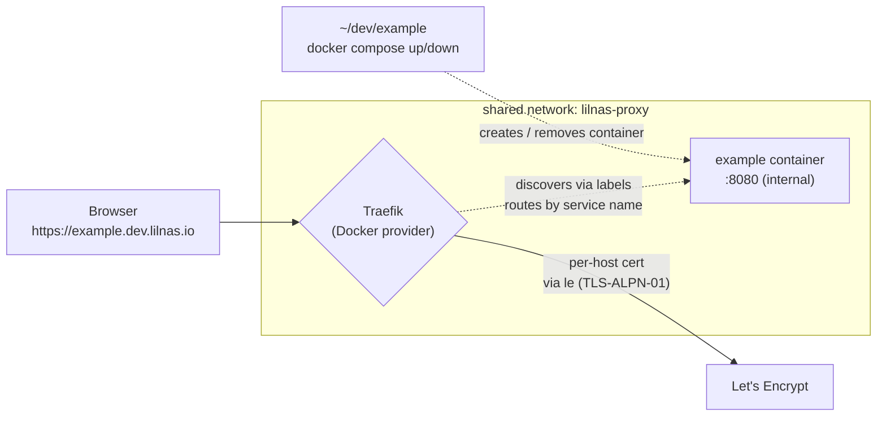

# lilnas-expose — dev compose exposure via a shared proxy network

> **Supersedes** the CLI/file-provider design in `docs/brainstorms/2026-06-24-lilnas-expose-requirements.md` and `docs/research/lilnas-expose.md` (on branch `feat/lilnas-expose`). Where they differ, this document wins. The pivot: route external dev **compose projects** through Traefik's existing Docker provider over a shared network, instead of routing a host **port** through the file provider + host-gateway. The net effect is a documented convention with **no bespoke tooling** rather than a 316-line bash CLI.

## Problem Frame

A dev-mode service running in a Docker Compose project **outside** the lilnas monorepo (e.g. `~/dev/example`, service `example` on container port `8080`) has no clean way to get an externally reachable URL through the existing Traefik proxy. The options today are bad: hand-roll Traefik labels and guess at cross-project networking, or stand up the superseded `lilnas-expose` CLI that routes a published host port via Traefik's file provider and host-gateway.

The goal is a single, documented convention so that **any** compose project on the NAS host can opt into `https://<name>.dev.lilnas.io` by (1) joining a shared proxy network and (2) carrying the same Traefik labels every lilnas app already uses — with `docker compose up` / `down` as the entire lifecycle. It serves one operator: the NAS developer who wants to reach an in-progress dev server from another device or hand a teammate a link.

---

## Key Flows

- F1. One-time platform setup
  - **Trigger:** Operator prepares the NAS to accept external dev projects.
  - **Steps:** Define a named external Docker network (`lilnas-proxy`) → attach Traefik to it → revert the branch's redirect swap so `infra/proxy.yml` keeps its original HTTP→HTTPS redirect.
  - **Outcome:** Any compose project on the host can be discovered and routed by joining `lilnas-proxy`.
  - **Covered by:** R1, R2, R3

- F2. Expose a project
  - **Trigger:** Operator wants `~/dev/example` reachable externally.
  - **Steps:** Attach the service to `lilnas-proxy` and add the standard Traefik label set (host rule + `websecure` + `tls.certresolver=le` + container-internal port) → `docker compose up`.
  - **Outcome:** `https://example.dev.lilnas.io` serves the dev server within ~1s; a cert is issued on first hit. No host port published.
  - **Covered by:** R4, R5, R6, R7, R8, R10

- F3. Tear down
  - **Trigger:** Operator runs `docker compose down` (or stops the service).
  - **Steps:** Container goes away → Traefik's Docker provider drops the router automatically.
  - **Outcome:** The route stops resolving within ~1s; nothing lingers.
  - **Covered by:** R8, R9

---

## Requirements

**Platform setup (one-time)**

- R1. A named external Docker network (working name `lilnas-proxy`) exists and Traefik is attached to it, so containers from *other* compose projects on the same host are discoverable and routable by the existing Docker provider.
- R2. The production HTTP→HTTPS redirect in `infra/proxy.yml` stays intact. Because dev routes use the `websecure` entrypoint, no redirect swap is needed; the superseded file-provider redirect (`redirect.yml`) is not used.
- R3. Dev routes are served by the existing `le` (TLS-ALPN-01) certificate resolver — no new resolver, no DNS API, no wildcard certificate.

**Per-project convention**

- R4. A compose project exposes a service by (a) attaching it to the `lilnas-proxy` external network and (b) adding the standard Traefik label set: `traefik.enable=true`, a `Host(`<name>.dev.lilnas.io`)` router on `entrypoints=websecure` with `tls.certresolver=le`, and `loadbalancer.server.port=<container-internal-port>` — identical in shape to every `apps/*/deploy.yml`.
- R5. The exposed service does **not** publish a host port; Traefik reaches it over the shared network at its container-internal port.
- R6. `<name>` is chosen by the operator in the label (defaulting to the service name) and must be a valid DNS label; it determines the subdomain.
- R7. The convention is delivered as documentation plus a copy-paste example (e.g. a small compose override snippet), **not** as an installed command.

**Lifecycle & visibility**

- R8. `docker compose up` makes the route live within ~1s (Docker provider hot-reload, no Traefik restart); `docker compose down` removes it automatically. No separate start/stop/list command exists.
- R9. Currently-exposed dev routes are observable via the existing Traefik dashboard (`traefik.lilnas.io`); no bespoke listing tool is provided.

**Transport & access**

- R10. Routes are HTTPS (`https://<name>.dev.lilnas.io`), with a per-host Let's Encrypt certificate issued automatically on first request.
- R11. Routes are public by default. A project may gate its route behind the existing OAuth by adding the `forward-auth` middleware label — opt-in, per project, no extra infra.
- R12. Existing production (`*.lilnas.io`) and dev (`*.localhost`) routes are unaffected: this adds a network and a convention, and changes no existing service's labels.

---

## Acceptance Examples

- AE1. **Covers R4, R5, R8, R10.** In `~/dev/example` with service `example` listening on container port 8080, after attaching it to `lilnas-proxy` and adding the labels, `docker compose up` makes `https://example.dev.lilnas.io` serve the dev server within ~1s, with a valid cert issued on first hit — and no host port is published.
- AE2. **Covers R8, R9.** After `docker compose down`, `https://example.dev.lilnas.io` stops resolving to the service within ~1s and the Traefik dashboard no longer lists the router.
- AE3. **Covers R2, R12.** An HTTP request to any production host still returns a 301 to HTTPS, and all `*.lilnas.io` routes behave exactly as before the change.
- AE4. **Covers R11.** Adding the `forward-auth` middleware label to `example` requires OAuth login before the dev server is reachable; removing it makes the route public again.

---

## Success Criteria

- A compose project outside `~/dev/lilnas` is reachable at `https://<name>.dev.lilnas.io` after a one-time per-project edit and `docker compose up`, with no bespoke tooling installed.
- `up` / `down` is the entire lifecycle — nothing lingers after `down`, and there is no route file or command to clean up.
- The production HTTP→HTTPS redirect and every existing `*.lilnas.io` / `*.localhost` route are verified unchanged.
- Clean handoff: planning can implement without inventing product behavior — the network convention, label set, transport (HTTPS per-host), public-by-default access, and `up`/`down` lifecycle are all specified.

---

## Scope Boundaries

- **No CLI / no installed command.** This supersedes the `feat/lilnas-expose` bash tool, file provider, host-gateway wiring, and `redirect.yml` — all dropped, not merged.
- **Same-host only.** The compose project must run on the NAS Docker host alongside Traefik. This is not a tunnel for laptops or remote machines; the shared network spans one host.
- **HTTPS per-host only.** No `*.dev.lilnas.io` wildcard cert in v1 — DNS-01 is deferred (Namecheap's API is gated and its whole-zone `setHosts` model is risky for the production zone).
- **Public by default.** No authentication unless a project opts into `forward-auth`.
- **No automatic name-collision detection.** Duplicate subdomains across projects are operator-managed (Traefik treats duplicate router names as a conflict).
- **Production exposure unchanged.** `*.lilnas.io` services keep their existing labels; this convention is dev-only.

---

## Key Decisions

- **Docker provider (labels) over file provider.** Reuses the exact mechanism every lilnas app already uses; `docker compose up`/`down` drives the route lifecycle for free. The file-provider + host-gateway design is dropped.
- **Shared external network over host-port + host-gateway.** Traefik routes to the container directly over `lilnas-proxy`; no host-port publishing. The unit of exposure is the compose service, not a port.
- **Pure compose convention over a CLI.** Once the shared network exists, a command is redundant for long-lived projects and would re-introduce the lingering-route lifecycle we're escaping. Eliminates ~316 lines of bash + a bats suite to maintain.

> **Update (2026-06-25, during planning — superseded delivery form):** the *delivery form* was later changed from "documentation + copy-paste example" to a **`lilnas` Claude plugin** (`/lilnas:expose`) — see `docs/plans/2026-06-25-001-feat-lilnas-expose-shared-proxy-network-plan.md` for the authoritative, amended R7. The *substance* of this decision still holds: no stateful CLI, no file provider, no host-gateway, no lingering routes; `docker compose up`/`down` remains the entire lifecycle. A plugin skill is agent-readable knowledge + a guided authoring workflow, not a route-owning daemon — so the lingering-route problem this decision avoided is not reintroduced.
- **HTTPS per-host (B) over HTTP-only (A) and wildcard DNS-01 (C).** TLS-ALPN-01 already works in production, needs zero DNS-API integration, and gives working secure contexts (secure cookies, OAuth callbacks, service workers, `crypto.subtle`). HTTP-only's only edge — keeping dev hostnames out of CT logs — wasn't worth the lost capability; wildcard via Namecheap was gated and risky to the production zone.
- **Supersede `feat/lilnas-expose`.** The redirect swap reverts and the CLI/file-provider artifacts are removed rather than carried forward.

---

## Dependencies / Assumptions

- **DNS — already satisfied.** `*.dev.lilnas.io` resolves to the NAS public IP via the existing `*.lilnas.io` Namecheap wildcard (verified by `dig` in `docs/research/lilnas-expose.md`); no DNS change needed. Caveat unchanged: if any explicit record is hand-added under `dev`, the wildcard stops covering `*.dev.lilnas.io` and an explicit `*.dev` wildcard must be added.
- **Same Docker host.** The external compose project runs on the NAS host where Traefik runs; the shared network only spans one host.
- **Docker provider already enabled.** Verified in `infra/proxy.yml`: `--providers.docker=true`, `--providers.docker.exposedByDefault=false` — so `traefik.enable=true` plus the router/service labels are required.
- **Ports 80/443 publicly reachable** on the NAS (existing production assumption).
- **Let's Encrypt rate limits** (~50 certs/week per registered domain) bound how many *new* dev subdomains can be minted per week; reusing a hostname reuses its existing cert.
- **Container bind address.** The exposed container must listen on `0.0.0.0` on the declared port inside the container (normal for containerized servers).

---

## Outstanding Questions

### Resolve Before Planning

- _(none — all product decisions are made)_

### Deferred to Planning

- [Affects R1][Technical] **Exact network wiring.** Add a new `external: true` `lilnas-proxy` network and attach Traefik to it (and confirm whether a `traefik.docker.network=lilnas-proxy` label is needed when a service also sits on its own project network), vs. reusing the root project's implicit default network. Also decide how the network is created/seeded on a fresh NAS.
- [Affects R7][Technical] **How and where to ship the example.** A docs page, a sample `docker-compose` override snippet, and whether to update `docs/semantic-storage.md` / READMEs to point at it.
- [Affects R4, R10][Needs research] **HMR/WebSocket over HTTPS behind the proxy.** Vite/Next dev servers on a different origin often need `server.hmr` host/clientPort config to connect over `wss://`; document per-framework guidance so live reload works.
- [Affects Scope][Technical] **Cleanup of superseded artifacts.** Confirm the removal/revert plan for the `feat/lilnas-expose` CLI, bats suite, `redirect.yml`, and the file-provider + host-gateway lines in `infra/proxy.yml`.
- [Affects future C][Needs research] **Wildcard upgrade path.** If per-host issuance or LE rate limits ever bite, the clean upgrade is delegating `dev.lilnas.io` to a DNS-01-friendly provider so wildcard issuance never touches the production zone.

---

## Next Steps

-> `/ce-plan` for structured implementation planning.
