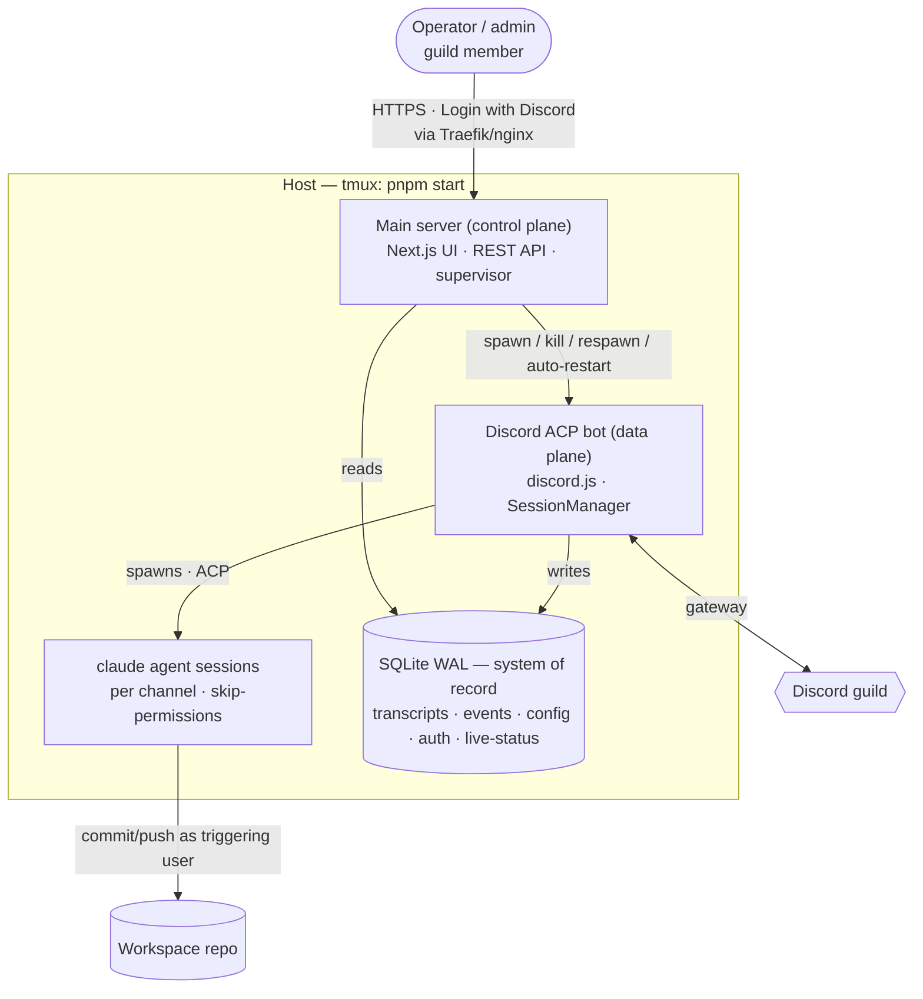

# tdr-code Web Admin Console

## Problem Frame

`@lilnas/tdr-code` is a Discord bot that runs an ACP-driven `claude` coding agent per channel. Today the only interface is @mentioning the bot in Discord, and **nothing about the bot is observable or controllable from outside Discord**:

- All state is in-memory — live agent sessions (`apps/tdr-code/src/agent/session-manager.service.ts`) and per-channel streaming state (`apps/tdr-code/src/discord/discord-handler.service.ts`). Nothing is persisted (`apps/tdr-code/src/db/schema.ts` is an empty stub).
- There is no way to see what the agent is doing right now, read what it did in the past, spot errors, recover a wedged session, restart the bot, or change its configuration without editing env and redeploying.
- The Next.js frontend is a stub (`apps/tdr-code/src/app/page.tsx` renders a heading) and the NestJS backend has **no HTTP controllers** — it only handles Discord events.

This work builds a **web admin console** (Tailwind) to observe, control, and configure the bot. The north star is a full admin surface; the decisions below define the target and the substrate it needs. The single largest decision is architectural: split the app into a **control plane** (web UI + API + storage + supervisor) and a **data plane** (the Discord bot), so the console can observe and restart the bot without going down itself.

This is a sibling to the `tdr-code-stop-clear` brainstorm (`docs/brainstorms/2026-06-27-tdr-code-stop-clear-requirements.md`), which adds Discord-side Stop/`/clear`. The console reuses the same `cancel()` / `teardown()` machinery for its lifecycle controls.

---

## Architecture

The decisive shape is a two-process split sharing one SQLite database:

- The **main server** is the always-up process you keep alive in tmux; it serves the UI, owns SQLite, and supervises the bot.
- The **bot process** is where "bad state" accumulates (wedged gateway, leaked sessions); it is a managed child that can be killed and respawned.
- **Shared SQLite is the only coupling.** Durable data survives bot restarts; the UI reads it even while the bot is down.

---

## Actors

- A1. **Operator / admin** — a human using the web console (a guild member; full admin). Observes activity, recovers/restarts, and edits config. May also be a Discord participant who @mentions the bot.
- A2. **Main server (control plane)** — serves the UI + REST API, owns the SQLite system-of-record, and supervises the bot process.
- A3. **Discord ACP bot (data plane)** — discord.js gateway + `SessionManagerService`; the restartable unit. Writes transcripts/events/live-status to SQLite.
- A4. **claude agent session** — the per-channel `claude` process; produces the work, runs its own git, and is attributed to the triggering Discord user.

---

## Key Flows

- F1. **See live activity and recover a stuck session**
  - **Trigger:** A1 opens the console; a channel's agent appears wedged.
  - **Actors:** A1, A2, A3
  - **Steps:** UI shows active sessions (channel, triggering user, prompting/idle, queue depth, last activity, age) from the bot's live-status rows → A1 identifies the stuck channel → clicks "tear down session" → main server signals the bot → bot `teardown()`s just that channel → live view and event feed update.
  - **Outcome:** The one channel's agent is gone; other channels are untouched; next @mention there starts fresh.
  - **Covered by:** R5, R11, R10

- F2. **Read a past session's transcript**
  - **Trigger:** A1 wants to know what the agent did earlier.
  - **Actors:** A1, A2
  - **Steps:** A1 browses past sessions by channel/time → opens one → reads the full persisted transcript (prompts, agent text, tool calls, diffs) → optionally reconciles against claude's own JSONL.
  - **Outcome:** A1 understands exactly what happened, with confidence the record is complete.
  - **Covered by:** R6, R7, R8

- F3. **Configure your git identity**
  - **Trigger:** A1 (or any guild member) wants the agent's commits attributed to them.
  - **Actors:** A1, A3, A4
  - **Steps:** A1 logs in with Discord → opens git settings → enters name, email, and an SSH key → key is stored encrypted; UI shows only fingerprint/status → later, when that Discord user drives a turn, the bot applies their identity to git operations.
  - **Outcome:** Commits/pushes are attributed to the right human. A user with no identity configured has the agent's git writes blocked with a prompt to configure.
  - **Covered by:** R14, R15, R16

- F4. **Restart the bot after it wedges**
  - **Trigger:** A1 sees the bot misbehaving (dead gateway, leaked sessions).
  - **Actors:** A1, A2, A3, A4
  - **Steps:** A1 clicks "restart bot" → main server signals the bot to shut down gracefully (tear down sessions, reaping `claude` process trees) → bot exits → main server respawns it → UI reflects the transition and logs an event.
  - **Outcome:** A fresh bot, with the console never having gone down.
  - **Escape path:** If the bot is fully hung and ignores graceful shutdown, the main server force-kills it; orphaned `claude` trees must then be reaped (deferred mechanism). If the *main server itself* dies, recovery is manual at the tmux pane.
  - **Covered by:** R2, R3, R12

---

## Requirements

**Process architecture & deployment**
- R1. The system runs as two processes: a **main server** (web UI + REST API + SQLite owner + supervisor) and a **Discord ACP bot** (discord.js gateway + session manager + `claude` agents).
- R2. The main server spawns and supervises the bot: it can kill and respawn it on demand, and automatically restarts it if it exits unexpectedly.
- R3. The main server and UI remain available — durable data readable — while the bot is down or restarting, and the UI indicates bot status (e.g. "bot offline, last seen …").
- R4. Both processes share one SQLite database as the system of record (bot writes, main server reads); durable data survives bot restarts. `pnpm start` launches the main server, which brings up the bot as its managed child; Traefik/nginx continues to route to the main server.

**Live observability**
- R5. The UI shows currently active agent sessions — channel, triggering user, prompting/idle status, queue depth, last activity, session age — sourced from a live-status table the bot upserts. The view is poll-fresh (updates within a few seconds) and degrades to last-known state plus an offline indicator when the bot is down.

**History & transcripts**
- R6. The bot persists a durable per-turn transcript to SQLite: user prompts, agent message text, tool calls (title / kind / status), and diffs.
- R7. The UI lets an operator browse past sessions and read full transcripts after a session has ended, organized by channel and time.
- R8. Each persisted session records the linkage needed to locate claude's own on-disk JSONL transcript, so captured data can be reconciled/verified against the agent's ground truth.

**Event & error feed**
- R9. The bot records structured events to SQLite — session created/evicted, turn started/completed/cancelled/errored (with error context), and bot restarts.
- R10. The UI shows a filterable event/error feed, each entry linkable to the session/channel it belongs to.

**Lifecycle control**
- R11. From the UI, an operator can tear down a single channel's agent session (per-session recovery) without affecting other channels.
- R12. From the UI, an operator can restart the whole bot process; a graceful restart tears down sessions (reaping `claude` process trees) before exit, then the main server respawns it. Transitions are reflected in the UI and the event feed.

**Configuration — global**
- R13. The UI exposes the global agent settings currently set via env (working directory, idle timeout, max concurrent sessions, claude command/args) for viewing and editing, persisted to SQLite, without requiring a redeploy.

**Configuration — per-user git identity**
- R14. The UI manages a mapping of Discord user ID → git identity (name, email, SSH key).
- R15. SSH private keys are stored encrypted at rest; the API/UI never return a stored key — only status plus fingerprint. Saving a key replaces the prior one.
- R16. When the bot runs a turn, it applies the triggering user's git identity to that turn's git operations. When the triggering user has no configured identity, the bot **blocks the agent's git write operations** (commit/push) and surfaces a message telling them to configure it in the UI; non-git work proceeds.

**Authentication & access**
- R17. The web UI requires authentication via Login with Discord (Better Auth Discord provider, Drizzle/SQLite adapter sharing the same database). Traefik `forward-auth` is removed for tdr-code; the app owns auth.
- R18. Sign-in is restricted to members of the configured Discord guild; non-members are rejected.
- R19. Every authenticated user is a full admin (view all sessions/history/events, edit any user's git creds, change global config, control bot lifecycle). There are no in-UI sub-roles.

**Scope**
- R20. The console is observe-and-control only; it does not send prompts to the agent. Conversing with the agent happens in Discord.

---

## Acceptance Examples

- AE1. **Covers R3.** Given the bot process is down, when A1 opens the console, then the UI still loads and shows last-known sessions plus a clear "bot offline" indicator (it does not error out).
- AE2. **Covers R12.** Given the agent is mid-turn in two channels, when A1 restarts the bot, then both `claude` process trees are reaped, the sessions are gone, and a fresh bot is running with the console never having gone offline.
- AE3. **Covers R16.** Given a triggering user with no git identity configured, when the agent attempts a commit/push, then the git write is blocked and the user is told to configure their identity, while non-git work in the same turn still proceeds.
- AE4. **Covers R8.** Given a completed session, when its persisted transcript is reconciled against claude's on-disk JSONL, then the captured prompts/messages/tool-calls match the agent's ground truth (discrepancies are detectable).
- AE5. **Covers R18.** Given a Discord user who is not a member of the configured guild, when they complete the Discord OAuth flow, then sign-in is rejected and no session/account is provisioned.
- AE6. **Covers R15.** Given an SSH key was saved for a user, when A1 views that user's git settings, then only a fingerprint/status is shown and the private key is never returned by the API.

---

## Success Criteria

- An operator can see what every channel's agent is doing right now, and recover a stuck one, without SSHing to the box.
- An operator can read exactly what the agent did in any past session — and trust the record, because it reconciles against claude's own transcripts.
- When the bot wedges, the operator restarts it from a dashboard that itself stays up; a true crash self-heals via the supervisor.
- Commits the agent makes are attributed to the correct human, or blocked when the human's identity is unknown.
- The console is reachable only by guild members, with Discord as the single identity that also keys git attribution.
- Downstream handoff: planning can sequence this (two-process architecture first, then the surfaces on top) without inventing product behavior; every requirement is observable or has a stated structural reason.

---

## Scope Boundaries

- **No per-channel configuration.** "Channel settings" from the original ask is reinterpreted as *global* settings (one shared workspace). Channels are observed, not individually configured.
- **No multi-repo / per-channel workspaces.** A single global working directory remains.
- **No driving the agent from the web.** No prompt input or live web chat; conversing stays in Discord.
- **No in-UI roles/permissions.** Every authenticated guild member is a full admin.
- **No raw log viewer in v1.** "Logging" is the structured event/error feed; a Grafana/Loki deep-link for raw logs is a possible later add, not in scope now.
- **No transcript retention/pruning policy in v1.** Transcripts accumulate; pruning is deferred.
- **No mid-turn steering or pause/resume.** (Stop/`/clear` live in the sibling brainstorm.)
- **No app-provided recovery for the main server itself.** The main server is the always-up supervisor; if it dies, recovery is manual at the tmux pane (supervising the supervisor is a possible later hardening).

---

## Key Decisions

- **Two-process split (control plane / data plane).** Gives a restart button that always works (the control plane isn't the thing that's hung), keeps the dashboard up precisely when the bot is sick, and yields crash auto-recovery for free. Chosen over in-process "soft restart," which can't survive a truly hung process, and over an OS-level restart button, which is self-defeating without an external supervisor (`pnpm start` in tmux has none).
- **Shared SQLite as the boundary, UI polls.** Least machinery; durable data survives bot restarts; live view keeps working (last-known + offline) while the bot is down. A thin internal bot HTTP API for true live streaming is a possible later add.
- **Full transcript persistence to SQLite, verified against claude's JSONL.** The bot owns its data (captured from ACP events); claude's own session transcripts are the reconciliation/ground-truth source. Chosen over live-only (no history) and over sourcing history solely from claude's files (ownership/queryability).
- **Global workspace + per-user git identity.** Keep one working directory; attribute commits to the human who drove the turn, keyed by Discord ID (which the bot already tracks per turn).
- **SSH keys encrypted, write-only.** Stored encrypted at rest; API returns only status/fingerprint; edits replace. Matters more now that the app is the sole security boundary (forward-auth removed).
- **Block git writes when identity is unconfigured.** Explicit beats silently-wrong attribution; chosen over a default bot identity or local-commit/push-blocked middle ground.
- **Dashboard-only (no agent driving).** Avoids doubling the frontend into a full alternate Discord client.
- **Better Auth + Login with Discord, guild-gated, flat admin.** Unifies web identity with the per-user git mapping (same Discord ID), and makes "add users" = "be in the guild." Forward-auth is removed because it can't supply the Discord identity the git mapping needs.

---

## Dependencies / Assumptions

- **Cancel/teardown machinery exists and is reusable** [verified]: `SessionManagerService.cancel()` / `teardown()` (process-tree kill) back the per-session and restart controls.
- **Nothing is persisted today** [verified]: `apps/tdr-code/src/db/schema.ts` is an empty stub; Drizzle + better-sqlite3 are wired but unused. All new persistence is net-new schema.
- **Frontend↔backend wiring exists** [verified]: Next.js rewrites `/api/*` → backend (`apps/tdr-code/next.config.js`); the backend currently has no controllers (net-new).
- **Better Auth supports Drizzle + SQLite and stores the Discord user ID on the account record** [grounded in docs]: its tables (`user`/`session`/`account`/`verification`) share the same SQLite DB; the account's Discord ID is the same identity the bot sees as the message author.
- **Removing forward-auth makes the app the sole security boundary** [verified from `apps/tdr-code/deploy.yml`], in front of an agent that runs `--dangerously-skip-permissions` and can push to git as users.
- **claude (ACP mode) writes its own JSONL session transcripts and the ACP session id maps to them** [ASSUMPTION — needs verification]; this underpins R8's reconciliation story.
- **An encryption master key must live somewhere** (env var or host file) for R15; "encrypted at rest" is only as strong as where that key sits.

---

## Outstanding Questions

### Resolve Before Planning

- _(none — all product decisions are resolved)_

### Deferred to Planning

- [Affects R8][Needs research] Does ACP-spawned `claude` write the same on-disk JSONL transcripts as interactive claude, and does the ACP `sessionId` map to claude's on-disk session id? Determines feasibility/shape of reconciliation.
- [Affects R16][Technical] Mechanism to actually block the agent's git writes when identity is unconfigured (pre-commit/pre-push hook vs. git shim in the workspace) plus withholding the SSH key.
- [Affects R16][Technical] How per-user git identity is applied to a persistent, shared-cwd `claude` process that runs its own git — per-turn `git config` / `GIT_AUTHOR_*` / `GIT_SSH_COMMAND`. Turns are serialized per channel, so it's tractable; confirm no mid-turn race.
- [Affects R12][Technical] Reaping orphaned `claude` process trees on a force-restart (SIGKILL of a wedged bot that spawned detached children).
- [Affects R4, R5][Technical] Shared-SQLite concurrency (WAL) under two processes, and the write cadence/shape of the live-status table.
- [Affects R15][Technical] Encryption-at-rest scheme and where the master key lives.
- [Affects R13][Technical] Apply semantics for global-setting changes — applied to new sessions only, or via a bot restart.
- [Affects R18][Technical] Guild-membership gate in Better Auth — requesting the `guilds` scope and rejecting non-members in a sign-in/`before` hook, vs. an allowlist fallback.
- [Affects R3, R17][Technical] Production deploy rework: today `apps/tdr-code/deploy.yml` is an nginx container proxying to a host process behind `forward-auth`. The two-process model + removed forward-auth needs the nginx/Traefik config reworked (route to the main server; drop the forward-auth middleware; app owns auth).

---

## Next Steps

-> `/ce-plan` for structured implementation planning. The build is large and naturally phased — recommend planning sequence the **two-process architecture + shared SQLite** first (it unblocks every other surface), then observability/history, then config + per-user git, then auth + forward-auth removal.
