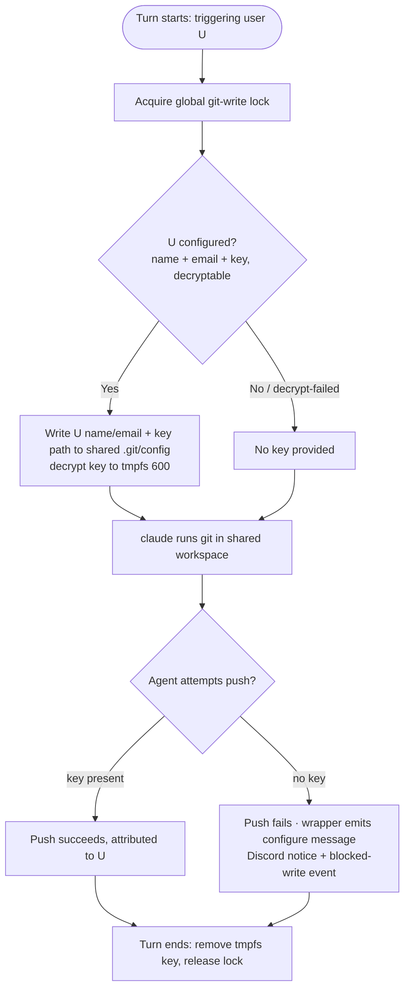

# tdr-code Phase C — Global Config & Per-User Git Identity

## Problem Frame

Phases A (two-process substrate) and B (observability + history read surfaces) have shipped. `@lilnas/tdr-code` now has a supervised bot, a shared SQLite system-of-record, generation-stamped rows, and a console that shows live activity, transcripts, an event feed, and lifecycle controls. Those are all **read/recover** surfaces. Phase C adds the two **write** surfaces the console still lacks:

- **Global config is frozen in env at construction.** `SessionManagerService` caches cwd / idle timeout / max sessions / claude command from `env()` in its constructor (`apps/tdr-code/src/agent/session-manager.service.ts:73-75`). Changing any of them today requires editing env and redeploying.
- **The agent has no per-user git identity.** It commits/pushes with whatever ambient identity the host `.git` happens to have. Under `--dangerously-skip-permissions`, that means commits are not tied to the human who triggered the turn, and there is no attribution or push-authorization boundary per user.

This phase makes global config editable from the console (persisted to SQLite, no redeploy) and adds a per-user git identity (Discord ID → name/email/SSH key) that the bot applies per turn, blocking pushes when the triggering user has no identity configured.

**Sequencing note (shapes the whole git-identity half):** Phase C ships **before** auth (Phase D). The console is not deployed to production yet, so `forward-auth` can simply be removed with no interim exposure. The consequence: during Phase C the console has no notion of "who is logged in," so the git-identity UI is **admin-managed by Discord ID** (an operator enters/selects a snowflake), not self-service. Because the API is keyed by snowflake either way, self-service is a small UI change when Phase D lands — the API does not change.

---

## Architecture

Phase C attaches to the existing two-process split. The main server owns the new `config` and `git_identity` writes; the bot re-reads config on signal and applies identity per turn inside the single shared workspace.

```mermaid
flowchart TB
  Operator([Operator])
  DiscordUser([Triggering Discord user])
  Repo[(Single shared workspace .git)]

  subgraph Host["Host — tmux: pnpm start"]
    Main["Main server (control plane)<br/>config + git_identity API/UI · owns SQLite"]
    Bot["Discord ACP bot (data plane)<br/>re-reads config · applies identity per turn · global write-lock"]
    Claude["claude session (shared cwd)<br/>runs git"]
    DB[("SQLite — config · git_identity (encrypted)")]
  end

  Operator -->|edit config / manage identities by Discord ID| Main
  Main -->|write config + identity rows| DB
  Main -.->|signal: re-read config| Bot
  Bot -->|read config + decrypt key at turn start| DB
  DiscordUser -->|@mention drives a turn| Bot
  Bot -->|apply name/email + key to .git/config; key to tmpfs| Claude
  Claude -->|commit / push as triggering user| Repo
```

---

## Actors

- A1. **Operator** — human at the console. Edits global config; manages git identities by Discord ID (until Phase D makes it self-service).
- A2. **Main server (control plane)** — serves the config + git-identity API/UI, owns SQLite, writes config/identity rows, and signals the bot to re-read config.
- A3. **Discord ACP bot (data plane)** — re-reads config on signal; at each turn start applies the triggering user's git identity to the shared workspace, holds the global git-write lock, and surfaces blocked pushes to Discord + the event feed.
- A4. **claude agent session** — runs git in the shared workspace; its pushes succeed only when the triggering user's key is present for that turn.
- A5. **Triggering Discord user** — the human whose message drives a turn. Their configured identity is what the turn's git operations use. Same snowflake the bot already tracks per turn and the same id Phase D auth will key on.

---

## Key Flows

- F1. **Edit global config without a redeploy**
  - **Trigger:** A1 changes a setting (e.g. idle timeout) in the console.
  - **Actors:** A1, A2, A3
  - **Steps:** A1 edits the field → main server validates and persists to the `config` row → main server signals the bot → bot re-reads and replaces its cached value. The UI labels each field with when it takes effect.
  - **Outcome:** The new value is live on the documented timing, with no redeploy.
  - **Covered by:** R1, R2, R3, R4

- F2. **Configure a user's git identity (interim admin-by-snowflake)**
  - **Trigger:** A1 wants turns from a given Discord user attributed to that human.
  - **Actors:** A1, A2
  - **Steps:** A1 enters the Discord ID + name + email + SSH private key → main server validates the key (parse, reject passphrase-protected, size cap), encrypts it, stores fingerprint + ciphertext → UI shows only fingerprint + status.
  - **Outcome:** That Discord ID is "configured"; the API never returns the key.
  - **Covered by:** R5, R6, R7, R9, R10, R11

- F3. **Per-turn identity application under the global write-lock**
  - **Trigger:** A5 drives a git-writing turn.
  - **Actors:** A3, A4, A5
  - **Steps:** Bot acquires the global git-write lock at turn start → decrypts A5's key to a `chmod 600` tmpfs file, writes A5's name/email + key path into the shared `.git/config` → claude runs git → at turn end the tmpfs key is removed and the lock released.
  - **Outcome:** The turn's commits/pushes are attributed to A5; a concurrent git-writing turn in another channel waited for the lock, so identities never interleave in the shared `.git/config`.
  - **Covered by:** R14, R15

- F4. **Blocked push when identity is unconfigured or unreadable**
  - **Trigger:** A5 (no configured identity, or a key that fails to decrypt) drives a turn that tries to push.
  - **Actors:** A3, A4, A5
  - **Steps:** No key is provided for the turn → the push fails at the SSH layer → the SSH-command wrapper emits a "configure your git identity at `<console>`" message the agent reports → a Discord notice is posted → a blocked-write event is logged (a decrypt failure logs a distinct event type).
  - **Outcome:** No silent mis-attribution; the user has a clear path to fix it. Any local commits made in the turn are not force-blocked but remain unpushed (inert).
  - **Escape path:** none needed — the block is the intended terminal state until the user configures an identity.
  - **Covered by:** R16, R17, R18



---

## Requirements

**Global configuration**

- R1. Editable global config persisted to SQLite: **cwd, idle timeout, max concurrent sessions, claude command/args** — exactly these four, all global (no per-channel overrides). *(origin R13; catalog C1)*
- R2. Config changes apply without a redeploy: the main server writes the config row and signals the bot to re-read; the bot replaces its cached values. *(catalog C2)*
- R3. Apply timing is per-setting and surfaced in the UI as a "takes effect when" label:
  - cwd + claude command/args → **new sessions only** (a running `claude` child keeps its spawn-time values).
  - idle timeout → **next idle-timer reset**.
  - max sessions → **next create**; lowering it below the current active count never evicts running sessions, it only pauses new creates.
- R4. Config input is validated before persistence (cwd is a usable path, numeric fields in range); invalid input is rejected with a message and nothing is persisted.

**Git identity — data & encryption**

- R5. A git-identity mapping keyed by Discord user ID: name, email, encrypted SSH private key, key fingerprint, `key_version`, timestamps. *(origin R14; catalog C3)*
- R6. Identity is **all-or-nothing**: name + email + key together constitute "configured." Missing any part → treated as unconfigured. Modeled as a discriminated union + type guard, not a nullable column with `!`.
- R7. SSH private keys are encrypted at rest with **AES-256-GCM** (`crypto.createCipheriv`): per-row random 12-byte IV + 16-byte auth tag + ciphertext stored as separate blobs; AAD binds the ciphertext to its `discord_user_id` row; a `key_version` column reserves future rotation. *(origin R15; catalog C4)*
- R8. The 32-byte master key lives in a `chmod 600` host file, validated at boot; it is not read from the process environment. *(catalog C4)*

**Identity management UX**

- R9. **Write-only:** the API never returns a stored private key. The UI shows only the fingerprint (`sshpk` sha256, matching `ssh-keygen -lf`) plus status. *(origin R15 / AE6; catalog C5)*
- R10. On entry the key is parse-validated; **passphrase-protected keys are rejected** with a clear message; a size cap is enforced. A bad key is rejected and nothing is stored. *(catalog C5)*
- R11. The UI shows one of **three** per-user states: **Configured** (fingerprint shown, pushes work), **Not configured** (pushes blocked), **Decrypt/parse-failed** (a key exists but is unreadable — treated as unconfigured for enforcement, shown distinctly so the operator knows to re-enter). *(catalog C6 / C9)*
- R12. An identity can be **replaced** (overwrite bumps `key_version`) or **cleared** back to unconfigured. Identity changes take effect on the **next turn**, not mid-turn (same rule as config).
- R13. Until Phase D auth, the git-identity UI is **admin-managed by Discord ID** (operator enters/selects a snowflake). The API is keyed by snowflake regardless, so Phase D changes only the UI's *source* of the snowflake (session-derived), not the API contract.

**Per-turn application & concurrency**

- R14. At turn start the bot applies the triggering user's identity to the shared workspace's git for that turn: name/email + an SSH key path via an out-of-band channel git reads per invocation (decrypted key written to a `chmod 600` tmpfs file, removed at turn end). Env vars are frozen at `claude` spawn and cannot carry per-turn identity. *(origin R16; catalog C7)*
- R15. A **single global write-lock** serializes git-writing turns across all channels; the single shared workspace is preserved (no per-channel worktrees). Because identity is applied via the shared `.git/config`, the lock spans a git-writing turn's duration, so concurrent git work in another channel waits. *(Decision 2 → global write-lock)*

**Git-write enforcement**

- R16. The enforcement boundary is **push** (the SSH key). When the triggering user is unconfigured (or their key fails to decrypt), no key is provided for the turn → pushes fail. Local commits are **not** hard-blocked (they are inert without a push). There is **no fallback/bot identity**. *(origin R16 / AE3; catalog C8)*
- R17. A blocked push surfaces three ways: the agent receives a clear "configure your git identity at `<console>`" message (via the SSH-command wrapper's nonzero exit), a Discord message tells the user, and a structured **blocked-write event** is logged. *(catalog C8)*
- R18. A decrypt/parse failure of a stored key is treated as effectively-unconfigured (push blocked) and logged as a **distinct event type** from "never configured." *(catalog C9)*

---

## Acceptance Examples

- AE1. **Covers R2, R3.** Given a running session in a channel, when A1 changes cwd in the console, then the running session keeps its old cwd and only the next new session uses the new cwd; the UI had labeled the field "applies to new sessions."
- AE2. **Covers R16, R17.** Given a triggering user with no configured identity, when the agent attempts a push, then the push fails, the agent gets a "configure your git identity" message, the Discord user is told, and a blocked-write event is logged; any local commits in that turn are not force-blocked but remain unpushed.
- AE3. **Covers R9, R10.** Given a user pastes a passphrase-protected key, when they save, then it is rejected with a clear message and nothing is stored; given a valid key, only its fingerprint is shown and the API never returns the key.
- AE4. **Covers R15.** Given two channels drive git-writing turns at overlapping times, when each commits/pushes, then the global lock serializes them so each turn's identity is applied cleanly, with no interleaving of identities in the shared `.git/config`.
- AE5. **Covers R11, R18.** Given a stored key that can no longer be decrypted (master key changed), when that user drives a git-writing turn, then it is treated as unconfigured (push blocked) and a distinct decrypt-failure event is logged; the UI shows that user's state as "decrypt/parse-failed," not "not configured."
- AE6. **Covers R12.** Given a user updates their key mid-turn, when the current turn later pushes, then it uses the turn-start identity; the new key applies from the next turn.

---

## Success Criteria

- An operator can change the agent's working dir / idle timeout / max sessions / claude command from the console and have it take effect on the documented timing, without a redeploy.
- Commits and pushes the agent makes are attributed to the human who triggered the turn; an unconfigured user's pushes are blocked with a clear path to fix, never silently mis-attributed.
- SSH private keys are never retrievable through the API, and a stolen DB file or backup yields no plaintext keys.
- Concurrent channels never corrupt each other's git identity in the shared workspace.
- The threat model is documented honestly (at-rest encryption = disk/backup-theft defense; server-side is the real boundary), so the app-side controls are not over-trusted.
- Downstream handoff: `ce-plan` can build this without inventing product behavior, and the git-identity UI's snowflake-entry → self-service transition is a known, small rework when Phase D lands.

---

## Scope Boundaries

- **No self-service git identity yet** — admin-managed by Discord ID until Phase D auth lands (then the snowflake field becomes session-derived; the API is unchanged).
- **No per-channel config and no per-channel workspaces/worktrees** — config is global; the single shared workspace is preserved (Decision 2 → global write-lock).
- **No fallback/bot git identity** — an unconfigured user's pushes are blocked, never pushed under a shared identity.
- **No hard block on local commits** — only pushes are enforceable; commits are inert-without-push. No attempt at an unenforceable commit block beyond the friendly hook/wrapper message.
- **No envelope encryption / KMS / HSM** — a single AES-256-GCM master key in a host file; `key_version` reserves future rotation but rotation tooling is not in this phase.
- **No passphrase-protected keys** — rejected at entry.
- **No auth (Phase D) in this phase** — no login or guild gate is added; `forward-auth` is simply removed because nothing is deployed yet. When the console does deploy, Phase D auth must be in place first.
- **No management of secrets other than git identity** — e.g. no Discord token / API key editing in the config surface.

---

## Key Decisions

- **Sequence Phase C before auth (Phase D).** Every part of C works without login: config is auth-independent, and the bot keys git identity off the Discord message author, not web auth. Only the identity-config UI is auth-sensitive, and its API is keyed by snowflake either way, so auth later is a small UI change. Not deployed yet → no interim-exposure reason to front-load auth.
- **Single shared workspace + global git-write lock (Decision 2 → option a).** Concurrent cross-channel git-writing is rare in practice; a global lock is the simplest correct fix and preserves the single-workspace boundary. Per-channel worktrees were rejected — they would change the product boundary and require an integration story for work across worktrees.
- **Strict enforcement, no fallback identity.** Push (withhold key) is the only enforceable boundary; commits are inert-without-push. A fallback bot identity would erase attribution and hand the bot's git access to anyone in any channel.
- **All-or-nothing identity.** name + email + key are one unit — simpler model, one fewer UI state. A separable "name/email without key" state was considered and rejected.
- **Master key in a `chmod 600` host file, not env.** Shrinks the accidental-exposure surface (not inherited by children, not in dumps). The agent can still read it at runtime — this only affects the disk-theft / accidental-exposure vector.
- **Honest, limited threat model.** At-rest encryption protects against disk/backup theft only, not against a `--dangerously-skip-permissions` agent that can read the master key, the tmpfs key, and the bot env. The real boundary for what gets pushed where is server-side: the git host's branch protection plus the scope of each user's key. App-side withholding + hooks are UX and disk-theft defense, not a hard wall.

---

## Dependencies / Assumptions

- **Phases A + B shipped** [verified]: two-process split, supervisor, shared SQLite with WAL pragmas, generation id, and Phase B's schema (`sessions` / `turns` / `turn_content` / `events` / `live_status`) + read surfaces exist. The new `config` and `git_identity` tables attach to the same DB with no migration churn (`src/db/schema.ts` comments already anticipate them).
- **Config is currently cached at construction** [verified: `src/agent/session-manager.service.ts:73-75`]; the re-read path is net-new.
- **The bot already tracks the triggering user's Discord snowflake per turn** [grounded — Phase B persists `sessions.triggering_user_id`; the seam is `message.author.id`], so per-turn identity application needs no web auth.
- **Per-turn identity via an out-of-band channel** [grounded in research R16]: rewrite `.git/config` `user.*` + `core.sshCommand` (atomic temp-then-rename or `git config --local`) and/or a `core.sshCommand` wrapper reading a bot-written key path; env vars are frozen at `claude` spawn.
- **Client-side git hooks are not a security boundary** against an arbitrary-shell agent [grounded in research]; the real boundary is withholding the key + server-side enforcement (`core.hooksPath` is ignored from local `.git/config`).
- **`forward-auth` can be removed with no exposure risk because the console is not deployed to production yet** [stated by operator]. When it does deploy, Phase D auth must precede exposure.
- **Chosen libraries** [grounded in research; versions pinned in the feature-landscape doc]: `sshpk` for fingerprint/validation, Node `crypto` AES-256-GCM for encryption.

---

## Outstanding Questions

### Resolve Before Planning

- _(none — all product decisions are resolved)_

### Deferred to Planning

- [Affects R14][Technical] Exact per-turn identity mechanism: `.git/config` rewrite (atomic temp-then-rename vs `git config --local`) vs a `core.sshCommand` wrapper reading a bot-written state file; tmpfs path location; guaranteed key cleanup on turn error/crash.
- [Affects R15][Technical] Where the global write-lock lives and its exact span (whole git-writing turn vs a detected git-op window, given we cannot cleanly detect in advance that a turn will push) and how it composes with the per-channel turn serialization already in `SessionManager`.
- [Affects R16, R17][Technical] The SSH-command wrapper that both withholds the key and emits the friendly nonzero-exit message; the precise allowed/blocked op set (push blocked; fetch/pull/clone/reads allowed).
- [Affects R2][Technical] The config re-read signal from main server → bot: reuse the Phase A command transport, or a lighter dedicated re-read trigger.
- [Affects R8][Technical][Needs research] Master-key file path + permissions convention on the host, boot-time validation, and how it is provisioned in the deploy (`deploy.yml` / volume).
- [Affects R7][Technical] AES-256-GCM record layout in Drizzle (blob columns), `setAAD` binding, and the discriminated-union "has-identity" type guard.

---

## Next Steps

-> `/ce-plan` for structured implementation planning. All product decisions are resolved; the remaining questions are technical and belong in the plan. Consider planning the **config half (R1–R4)** and the **git-identity half (R5–R18)** as two units within the phase — config has no auth/concurrency entanglement and is a clean early win, while the git-identity half carries the encryption + write-lock + enforcement work.
