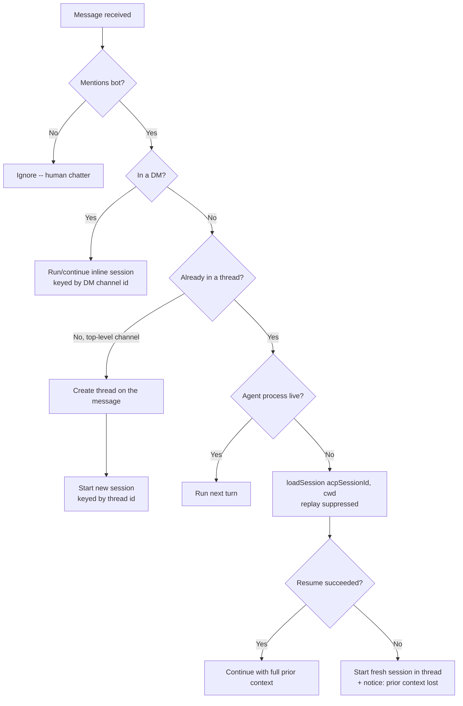

# tdr-code: Thread-Addressed Agent Sessions

## Problem Frame

Today a tdr-code agent session is identified by its Discord **channel** — `SessionManagerService` keys everything (the session map, git-write-lock holder, `TDR_CHANNEL_ID` identity dir, `live_status`, the SQLite writer's turn state, and all UI state in `DiscordHandlerService`) off `channelId`. "Continuing a conversation" is just "mention the bot again in the same channel," so a channel can hold exactly one live conversation, and there is no way to run two parallel conversations or to deliberately return to an earlier one.

We want each conversation to be its own **Discord thread**. A top-level `@mention` opens a thread and runs the session inside it; mentioning the bot in that thread continues it. Because a Discord thread has its own channel id, the thread id simply becomes the session key — the existing channel-keyed runtime keeps working unchanged, with no re-keying, no `message_id → session` map, and no "reply-chain leaf" detection. This unlocks multiple parallel sessions per channel and, combined with ACP session resume, lets a dormant thread reactivate with full memory on the next mention.

---

## Actors

- A1. Requesting user(s): Discord members who `@mention` the bot to start or continue a session. Multiple members may participate in one thread; each turn's git identity is resolved per-author as today.
- A2. Discord handler (`apps/tdr-code/src/discord/discord-handler.service.ts`): routes each mention to a session by thread id, creates threads, renders agent output.
- A3. Agent process: the spawned `claude-agent-acp` child that holds live conversation context in memory. **Ephemeral** — killed by idle-timeout, eviction, `/clear`, or bot restart.
- A4. ACP transcript store: `claude-agent-acp` persists each session's history as on-disk JSONL at `~/.claude/projects/<escaped-cwd>/<acpSessionId>.jsonl` (the path `apps/tdr-code/src/console/jsonl-locator.ts` already computes). This file is what `loadSession` replays from and is what makes A3's death recoverable.

---

## Key Flows

- F1. Start a session
  - **Trigger:** A1 posts a top-level `@mention` in a threadable channel.
  - **Actors:** A1, A2, A3
  - **Steps:** Handler creates a thread anchored to the mention message → spawns the agent → runs the mention text as turn 1 inside the thread → all output (working message, tool summary, diffs, reply) posts into the thread.
  - **Outcome:** A new session exists, keyed by the thread id; the parent channel shows Discord's "started a thread" marker.
  - **Covered by:** R1, R2, R5

- F2. Continue a live session
  - **Trigger:** A1 posts a message that mentions the bot inside an existing thread whose agent process is live.
  - **Actors:** A1, A2, A3
  - **Steps:** Handler resolves the session by thread id → runs the next turn (queues it if a turn is already in flight).
  - **Outcome:** The turn appends to the same session; no new thread or process.
  - **Covered by:** R3, R6, R7

- F3. Reactivate a dormant session
  - **Trigger:** A1 mentions the bot in a thread whose agent process has been torn down (idle-timeout, eviction, `/clear`, or bot restart).
  - **Actors:** A1, A2, A3, A4
  - **Steps:** Handler finds the stored `acpSessionId` + `cwd` for the thread → spawns a fresh agent → calls `loadSession` → **suppresses all replayed `session/update` events** → runs the new mention as the next turn.
  - **Outcome:** The session is live again with full prior context; nothing from the replay is re-posted to Discord or re-written to SQLite.
  - **Covered by:** R8, R10

- F4. Resume-failure fallback
  - **Trigger:** F3's `loadSession` fails (transcript missing, adapter error).
  - **Actors:** A1, A2, A3
  - **Steps:** Handler starts a fresh session in the same thread → posts a one-line notice that prior context was lost → runs the mention as turn 1.
  - **Outcome:** The thread is usable again, with the context gap made explicit.
  - **Covered by:** R9

---

## Requirements

**Session addressing & creation**
- R1. A top-level `@mention` of the bot in a threadable channel creates a Discord thread anchored to the mention message; the session runs entirely inside that thread, and the mention's text is turn 1's prompt.
- R2. The session key is the thread's channel id. Every existing per-`channelId` runtime site continues to work with the thread id as its key, with no change other than where the id comes from.
- R3. A `@mention` inside an existing thread (bot-created or human-created) runs/continues the session keyed by that thread id — no nested thread is created (Discord disallows it).
- R4. In a DM (threads unsupported), the session runs inline, keyed by the DM channel id — current behavior preserved as the fallback.
- R5. Multiple independent sessions may exist under the same parent channel at once (each in its own thread), bounded only by the max-concurrent-sessions cap.

**Mention-gating & continuation**
- R6. The bot only acts on messages that `@mention` it, in threads and channels alike. Un-mentioned messages in a thread are ignored as human chatter. (A Discord reply to the bot auto-mentions it, so replying naturally counts as a mention.)
- R7. Each qualifying mention inside a thread is the next turn of that thread's session, queued behind any in-flight turn per existing behavior.

**Reactivation & resume**
- R8. When a mention targets a thread whose agent process is no longer live, the bot spawns a fresh agent and resumes the stored session via ACP `loadSession(acpSessionId, cwd)`, restoring full prior context, instead of starting empty.
- R9. If resume fails, the bot starts a fresh session in the same thread and posts a one-line notice that prior context was lost.
- R10. While `loadSession` replay is in flight, all `session/update` notifications are suppressed — none are posted to Discord and none are written to the SQLite transcript. Only output from the subsequent `prompt` is treated as live.
- R11. Idle-timeout and LRU eviction may tear down any non-active session silently (no user-facing warning), because reactivation (R8) restores it transparently on the next mention.

**Naming, capacity & lifecycle**
- R12. The thread is named from the agent's own session title: the bot handles the ACP `session_info_update` notification (currently ignored in `apps/tdr-code/src/agent/acp-client.ts`) and renames the thread when the title changes, seeding a truncated first-prompt placeholder until the real title arrives.
- R13. Max-concurrent-sessions and LRU eviction continue to apply unchanged (`maxConcurrentSessions`, `idleTimeoutSec` from config), now counting and evicting sessions keyed by thread id.
- R14. `/clear` invoked inside a thread ends that thread's session, preserving current semantics re-keyed to the thread id.

---

## Acceptance Examples

- AE1. **Covers R1, R2.** Given a user posts "@TDR Code refactor the auth module" in `#general`, when the bot receives it, then it opens a thread on that message and the working message, tool calls, and reply all render inside the thread (not in `#general`).
- AE2. **Covers R6.** Given a live session thread, when a user posts a message in it without mentioning the bot, then the bot ignores it and runs no turn.
- AE3. **Covers R8, R10.** Given a thread whose session was idle-timed-out an hour ago, when a user mentions the bot in it, then the bot resumes via `loadSession` with full context and does **not** re-post the earlier transcript into the thread.
- AE4. **Covers R9.** Given a thread whose transcript file no longer exists, when a user mentions the bot in it, then the bot starts fresh and posts a notice that prior context was lost.
- AE5. **Covers R5.** Given a user already has one live session thread in `#general`, when they post another top-level mention in `#general`, then a second independent thread and session are created rather than continuing the first.
- AE6. **Covers R4.** Given a user DMs the bot with a mention, when threads are unavailable, then the session runs inline in the DM keyed by the DM channel id.

---

## Success Criteria

- Users can hold multiple parallel Claude Code conversations in a single channel, each visually isolated in its own thread, and can return to any thread — even after an eviction or a bot restart — and continue with full memory, with no visible transcript re-dump.
- A downstream planner can implement without inventing product behavior: the thread-id-as-session-key model, the reactivate-via-resume path, replay suppression, the resume-failure fallback, mention-gating, and the DM fallback are all specified here.

---

## Scope Boundaries

- **Deferred to v2 — "quote an earlier message":** replying to one of the bot's earlier messages to prepend `Responding to: "<quoted>"` to the prompt (the original edge case #2). The thread already gives the agent full context, so this is disambiguation sugar, not core.
- **No session forking/branching.** The original "response tree" idea is out — sessions stay linear per thread. (ACP exposes `forkSession`, but branching is not a goal here.)
- **No moving or merging sessions across threads.** A session is bound to the thread it was born in.
- **Mention-gating is not relaxed.** Plain un-mentioned messages never trigger the bot, even inside a thread — this is a deliberate product choice, not a limitation to fix later.
- **Creation model is fixed to always-thread.** Promote-on-continue and opt-in-button models were considered and rejected.
- **Private threads / per-session privacy config are out of scope for v1** (default public threads).
- **Resume across loss of `~/.claude` is out of scope** (e.g., host migration or a future containerization without a persistent volume) — a deployment concern, not a feature.

---

## Key Decisions

- **Threads over reply-chains:** a thread carries its own channel id, so the entire channel-keyed runtime works unchanged — no re-keying, no `message_id → session` map, no leaf detection. This is the decision that makes the feature cheap instead of a full re-architecture.
- **Always-thread (not promote-on-continue / opt-in button):** the only model that fully retires channel-keyed session identity; the accepted tradeoff is thread clutter for one-off questions.
- **Mention-gated even inside threads:** explicit and predictable; keeps the bot from reacting to human side-chatter in a shared thread.
- **Resume-on-reactivate over fresh-start:** `@agentclientprotocol/claude-agent-acp@0.54.1` advertises `loadSession: true` and implements it, and we already persist `acpSessionId` + `cwd`; transcripts persist on the host, so idle/eviction/restart all recover transparently. This also makes eviction nearly free.
- **Suppress replay:** `loadSession` replays the whole history via `session/update`, which would otherwise re-post the transcript to Discord and duplicate it in SQLite — so replayed events must be dropped.

---

## Dependencies / Assumptions

- **Bot runs as a host process** — `apps/tdr-code/deploy.yml` is an nginx shim (health-checks `host.docker.internal:8080`, notes the main server is loopback-only), so `~/.claude` lives on the host disk and survives bot restarts. *Confirm this at planning time*; if tdr-code is ever containerized, `~/.claude` must be on a persistent volume or resume breaks across container restarts.
- **Discord permissions:** the bot needs *Create Public Threads* and *Send Messages in Threads* (and unarchive-on-send for archived threads).
- **Verified capabilities:** `ClientSideConnection.loadSession` exists in `@agentclientprotocol/sdk`; the agent (`claude-agent-acp@0.54.1`, launched per `apps/tdr-code/src/db/config.repo.ts`) advertises `loadSession: true`. `loadSession` requires the JSONL transcript that `jsonl-locator.ts` already resolves.

---

## Outstanding Questions

### Resolve Before Planning

- _(none — all product decisions are made)_

### Deferred to Planning

- [Affects R2][Technical] Audit every `channelId`-keyed site — git-write-lock holder + `TDR_CHANNEL_ID` identity dir, `live_status` PK, `clearedTurnId`, `sendChains`, `typingIntervals`, `SqliteWriterService.channelState`, `commands.target`, `claude_process.channelId` — and confirm each behaves correctly when the key is a thread id and multiple sessions share a parent channel.
- [Affects R8][Technical] How to detect "process dead but session resumable" at mention time: look up the session row(s) by `channelId = threadId`, read `acpSessionId`, attempt `loadSession`. Confirm the lookup works for ended/closed session rows.
- [Affects R10][Technical] Exact mechanism to distinguish replayed `session/update` from live ones — likely a "loading" flag spanning the `loadSession` call in `SessionManagerService`, propagated so both `DiscordHandlerService` and `SqliteWriterService` drop events during replay.
- [Affects R12][Technical] Wiring `session_info_update` through `acp-client.ts` → a new handler → `thread.setName()`, including Discord thread-rename rate limits.
- [Affects R8][Needs research] Latency/cost of replaying a long transcript on resume; whether to show a "Resuming…" working message.
- [Affects R1][Technical] Threadable-channel + permission detection before `startThread`, and behavior if thread creation fails.

---

## Next Steps

-> `/ce-plan` for structured implementation planning
