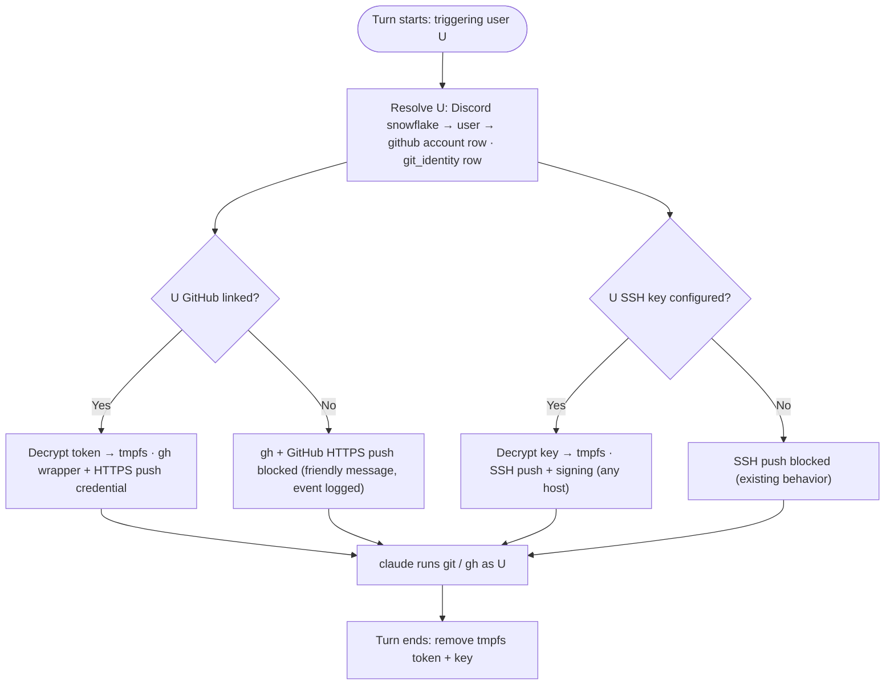

# tdr-code — Discord ↔ GitHub Identity & Unified Git Page

## Problem Frame

tdr-code already ties each turn's git work to the human who triggered it. Phase C added a per-user **SSH identity** (Discord snowflake → name/email/encrypted SSH key) that the bot applies per turn so commits/pushes are attributed to the triggering user, and blocks pushes for unconfigured users. Phase D added Better Auth (Discord OAuth + guild gate), so the console now knows who is logged in.

What the agent still **cannot** do is act on GitHub *as the user*: create repos, open PRs, open issues. Those require the GitHub API (`gh` CLI) with a per-user GitHub token, which no part of the system holds. The current `/git-identity` page only manages SSH keys, and it is still an interim "admin-by-snowflake" surface.

This feature adds a **Discord ↔ GitHub association** so the agent uses the correct user's GitHub credentials when running `gh` and pushing, and folds SSH + GitHub into a single self-service **"Git"** page (replacing "Git identity"). The headline flow: a member clicks **Link GitHub** once, then can ask tdr-code to open a PR, create a repo, or file an issue on their own GitHub account — and two or more members can contribute to each other's repos, each acting as themselves.

This is well-supported by existing infrastructure: the Better Auth `account` table already has OAuth token columns and first-class account-linking; the per-turn tmpfs + `scripts/git` PATH-wrapper mechanism generalizes directly to a `gh` wrapper; and the Discord→user→account join is already used by the session-revoke path.

---

## Actors

- A1. **Guild member (console user)** — any authenticated member. Self-service: links/unlinks their *own* GitHub, manages their *own* optional SSH key, views the shared roster, and can break-glass clear another member's credentials.
- A2. **Triggering Discord user** — the human whose message drives a turn. The turn's `git` and `gh` operations act as *this* user (same snowflake the bot already tracks per turn).
- A3. **Main server (control plane)** — serves the unified Git page, the GitHub OAuth link/unlink + roster APIs; owns SQLite; stores the encrypted GitHub token.
- A4. **Discord ACP bot (data plane)** — at each turn resolves the triggering user's GitHub token (and SSH identity), applies both to the shared workspace for that turn, and enforces block-when-unlinked.
- A5. **claude agent session** — runs `git` and `gh` in the shared workspace; HTTPS push / `gh` API succeed only when the triggering user is linked.

---

## Key Flows

- F1. **Link GitHub (self-service OAuth)**
  - **Trigger:** A1 clicks **Link GitHub** on the Git page.
  - **Actors:** A1, A3
  - **Steps:** A1 clicks the button (tooltip explains what it enables) → GitHub OAuth consent for `repo` + `workflow` → callback links a `github` `account` row to A1's existing user → the token is encrypted at rest → commit identity is auto-derived from the GitHub profile (name + `noreply` email) → the roster shows A1 as **Linked**.
  - **Outcome:** A1 can now have the agent act on GitHub as themselves, with commits attributed to their account. No manual name/email entry.
  - **Covered by:** R1, R4, R5, R6, R7, R8

- F2. **Agent acts on GitHub as the triggering user**
  - **Trigger:** A2 asks tdr-code (in Discord) to open a PR / create a repo / open an issue, or the agent pushes.
  - **Actors:** A2, A4, A5
  - **Steps:** At turn start the bot resolves A2's GitHub token (snowflake → user → `github` account row) and applies it for that turn via the per-turn tmpfs + `gh` PATH-wrapper (and a per-turn HTTPS push credential) → the agent runs plain `gh` / `git push` → the operation lands on GitHub attributed to A2 → at turn end the per-turn token file is removed.
  - **Outcome:** The repo/PR/issue/push is created under A2's GitHub account.
  - **Covered by:** R9, R10, R13, R14, R17

- F3. **Blocked GitHub op when unlinked**
  - **Trigger:** A2 (GitHub not linked) drives a turn that runs `gh` or pushes to a GitHub remote.
  - **Actors:** A2, A4, A5
  - **Steps:** No token resolves for the turn → the `gh`/HTTPS-push wrapper emits a friendly "link your GitHub at `<console>/git`" message (nonzero exit) the agent surfaces → a Discord notice is posted → a structured block event is logged. No ambient/host token and no other user's token is ever substituted.
  - **Outcome:** No silent mis-attribution; A2 has a clear path to fix it (link GitHub). Local commits remain inert-without-push.
  - **Covered by:** R11, R15, R16

- F4. **Unlink / break-glass clear**
  - **Trigger:** A1 unlinks their own GitHub, or any member clears another member's GitHub link from the roster.
  - **Actors:** A1, A3
  - **Steps:** Delete the `github` account row (best-effort revoke the token at GitHub) → roster shows **Not linked** → that user's next turn's `gh`/HTTPS-push is blocked until re-link.
  - **Outcome:** Access is cut cleanly and visibly.
  - **Covered by:** R3, R12

---

## Requirements

**Unified Git page & navigation**

- R1. A single **"Git"** page replaces the current "Git identity" page and its nav entry (`src/app/components/nav-shell.tsx`). It has a **GitHub** section (link/unlink) and an **SSH key** section (optional add-on), plus the roster. The route is renamed (e.g. `/git`); the wrapper/blocked-op messages that currently point at `/git-identity` are updated to match.
- R2. The page is **self-service**: it operates on the *logged-in* user's own credentials. GitHub linking is self-only by OAuth's nature; SSH key entry is scoped to the logged-in user (no more entering another member's key by snowflake).
- R3. A shared **read-only roster** lists all guild members with per-user status for **GitHub** (Linked / Not linked) and **SSH** (Configured / Not configured / Decrypt-failed). Any member can break-glass **clear** another member's GitHub link and/or SSH key (flat-admin, R19 precedent). *Linking* stays self-only.
- R4. A **Link GitHub** button with a tooltip explaining what it enables — e.g. "Lets tdr-code open PRs, create repos, and push on your behalf as your GitHub account."

**GitHub linking (OAuth)**

- R5. Linking uses a **classic GitHub OAuth App** via Better Auth account-linking, producing a non-expiring user-to-server token that **acts as the user**. It creates an `account` row with `providerId: 'github'` linked to the same `user` as the member's Discord account (join via `account.accountId`, mirroring the existing Discord path).
- R6. Requested scopes: **`repo` + `workflow` + `delete_repo`** — create/push/PR/issue on the user's repos (including private), edit GitHub Actions workflow files, and delete repos. The agent's system prompt requires explicit user confirmation before running `gh repo delete` (rule 4).
- R7. The GitHub token is **encrypted at rest** with the same AES-256-GCM master key used for SSH keys, is **never nulled** (unlike the Discord token, which the guild gate zeroes), and is **never returned** by any API.
- R8. On link, commit author identity is **auto-derived** from the GitHub profile: name = GitHub name/login, email = the account's `noreply` address (`<id>+<login>@users.noreply.github.com`). Private by default; GitHub-linked users need no manual name/email entry.

**GitHub-primary capability model**

- R9. Linking GitHub enables **push over HTTPS** to GitHub remotes using the token (no SSH key required for GitHub repos) **and** `gh` CLI API operations (create repo, open PR, open issue) as the user.
- R10. The **SSH key is an optional add-on**, required only for (a) pushing to non-GitHub remotes and (b) SSH commit signing. A user may be GitHub-only, SSH-only, both, or neither.
- R11. Commit-identity precedence: when GitHub is linked, the GitHub-derived identity (R8) is used; otherwise an SSH-only user's manually-entered name/email (today's behavior) is used. A user with neither is push-blocked as today.
- R12. Commits are **unsigned** for GitHub-only users; **signing is opt-in** via the optional SSH key (existing SSH-signing path). GitHub "Verified" additionally requires the user to register that SSH key as a *signing key* on their GitHub account — outside this app's control.
- R13. **Unlink GitHub** is a self-service action that deletes the `github` account row and best-effort revokes the token at GitHub; break-glass clear (R3) performs the same for another user.

**Per-turn application & enforcement**

- R14. At each turn the bot resolves the **triggering user's** GitHub token and applies it for that turn via the same per-turn tmpfs mechanism used for SSH: a **`gh` PATH wrapper** mirroring `scripts/git`, plus a per-turn HTTPS push credential. Env is frozen at `claude` spawn, so the token flows out-of-band (tmpfs + wrapper), never via spawn env. The token file is removed at turn end (with the same abort/boot-sweep guarantees as SSH keys).
- R15. **No ambient/host GitHub token fallback** and **no other-user substitution**: a turn only ever uses the triggering user's token. If none resolves, none is provided (mirrors the SSH wrapper's all-or-nothing posture).
- R16. **Block when unlinked**: if the triggering user has not linked GitHub, `gh` commands and GitHub HTTPS pushes fail with a friendly "link your GitHub at `<console>/git`" message the agent surfaces, plus a structured **block event** (parity with the SSH `git_push_blocked` event). A token that fails to decrypt is treated as unlinked and logged as a distinct event type.
- R17. The agent's system prompt (`src/agent/system-prompt.constants.ts`) gains a `gh` note mirroring the existing git-wrapper transparency: `gh` is authenticated as the triggering user; use it for PRs/issues/repos; if a `gh`/push op is blocked, tell the user to link GitHub in the console rather than working around it.

---

## Acceptance Examples

- AE1. **Covers R4, R5, R8.** Given a logged-in member with no GitHub link, when they click **Link GitHub** and complete OAuth (consent for `repo` + `workflow`), then a `github` account row is linked to their user, the roster shows **Linked**, and their commit identity is auto-set to their GitHub name + `noreply` email with no manual entry.
- AE2. **Covers R9, R14, R16.** Given a **linked** user asks tdr-code to "open a PR," when the turn runs, then `gh` runs as that user and the PR is created under their account; given an **unlinked** user asks the same, then `gh` is blocked with a "link your GitHub at `<console>/git`" message and a block event is logged.
- AE3. **Covers R9, R10.** Given a GitHub-only user (no SSH key) pushes to a GitHub repo, then the push succeeds over HTTPS via the token; when the same user tries to push to a non-GitHub SSH remote, then it is blocked (no SSH key on file).
- AE4. **Covers R7, R13.** Given a linked user, when they call the identity API, then the token is never returned; when they click **Unlink GitHub**, then the link is removed, the roster shows **Not linked**, and a re-link is required before the agent can act on GitHub again.
- AE5. **Covers R3, R15.** Given member A break-glass clears member B's GitHub link from the roster, then B shows **Not linked** and B's next turn's `gh`/HTTPS-push is blocked (never falling back to A's or an ambient token) until B re-links.
- AE6. **Covers R12.** Given a GitHub-only user's commits, then GitHub shows them **Unverified** but attributes them to the user's account (avatar/contribution graph) via the `noreply` email; after the user adds an SSH key and registers it as a GitHub signing key, subsequent commits show **Verified**.

---

## Success Criteria

- A guild member can click **Link GitHub** once and then ask tdr-code to create a repo / open a PR / open an issue on their own GitHub account, with the action attributed to them.
- Two or more members can each work on their own accounts and contribute to each other's repos (open PRs/issues, push to a fork) with **no special cross-user setup** — each turn simply acts as the triggering user.
- A GitHub-only user needs **no SSH key** to push to GitHub; the SSH key remains available for non-GitHub remotes and signing.
- An unlinked (or decrypt-failed) user is cleanly **blocked** with a friendly, actionable message and a logged event — never falling back to an ambient/host token or another user's token.
- GitHub tokens are **never retrievable via the API**, and a stolen DB file yields no plaintext tokens (same bar as SSH keys).
- Downstream: `ce-plan` can build this without inventing product behavior; the OAuth-App → GitHub-App swap is a known, documented follow-up if per-repo blast radius ever matters.

---

## Scope Boundaries

- **No GitHub App / fine-grained per-repo least-privilege.** Rejected because a GitHub App cannot create repos on a *personal* account (create-repo requires OAuth/PAT). Revisit only if repos move to a shared org.
- **Personal accounts only in v1.** Org-account support is out of scope; centralizing repos under an org would re-open the GitHub-App option and is a separate decision.
- **No PAT-paste path for GitHub** — OAuth ("Link GitHub") only.
- **No app-side `gh` verb allowlist/denylist as a security boundary.** Consistent with the codebase's honest threat model: the real boundary is the token's scope + GitHub server-side. A `--dangerously-skip-permissions` agent can do anything the token can; app-side blocks are UX/attribution, not containment.
- **No commit-signing requirement for GitHub-only users** — unsigned is accepted; signing stays opt-in via the optional SSH key.
- **No multiple-GitHub-accounts per user** — one GitHub link per Discord user.
- **No change to Discord-token handling or the guild gate** — Discord tokens are still nulled; the guild gate is unchanged (but its token-nulling must be scoped so it does not null the *GitHub* token — see Dependencies).
- **No automatic token-refresh machinery** — classic OAuth tokens don't expire; if a token is revoked at GitHub, the user re-links.

---

## Key Decisions

- **GitHub-primary capability model.** Linking GitHub powers both `gh` API ops and push-over-HTTPS; the SSH key becomes an optional add-on for non-GitHub remotes and signing. Rationale: for GitHub work, one link does everything; SSH is only needed for the long tail.
- **Classic OAuth App, not a GitHub App.** Forced by the headline "create repos on their own [personal] accounts" use case, which a GitHub App structurally cannot do. Accepts a coarse `repo` scope, which is a small *additional* exposure given the agent is already fully trusted per-turn.
- **Self-service + shared roster.** Each member manages only their own credentials (OAuth is self-only anyway); everyone sees a read-only roster and can break-glass clear — extends the existing flat-admin (R19) precedent, and suits a small trusted group.
- **Auto-derived, private commit identity.** Name/email come from the GitHub profile with the `noreply` email — zero friction, attribution guaranteed, no real email exposed. (The prefilled-but-editable / real-email variant was considered and rejected for v1.)
- **Encrypt the GitHub token like the SSH key; never null it.** Same AES-256-GCM master-key machinery and honest threat model (at-rest encryption defends disk/backup theft; the server-side is the real boundary).
- **Scopes `repo` + `workflow` + `delete_repo`.** `workflow` is included so the coding agent can modify GitHub Actions files; `delete_repo` is included so the agent can delete repos on the user's behalf. A system-prompt rule (rule 4) requires the agent to get explicit user confirmation before running `gh repo delete`. Can be narrowed to `repo` only if workflow edits aren't wanted.
- **Reuse the per-turn tmpfs + PATH-wrapper pattern for `gh`.** Mirrors `scripts/git` / `GitTurnContext` exactly (resolution, cleanup, sweep, block-when-unconfigured), rather than inventing a parallel mechanism.

---

## Dependencies / Assumptions

- **The `account` table already has token columns** [verified: `src/db/schema.ts` — `accessToken`/`refreshToken`/`scope`/`accessTokenExpiresAt`], and the Discord→user→account join is established [verified: `src/db/auth-session.repo.ts` joins via `account.accountId` scoped to `providerId`]. The GitHub path mirrors this with `providerId: 'github'`.
- **Better Auth account-linking supports adding a second social provider to an already-authenticated user** [assumption — verify `linkSocial` / multi-provider config and callback wiring under the `/api` rewrite in planning; the Discord callback path in `src/auth/auth.ts` is unusually intricate, so budget for parity].
- **The guild gate must not null the GitHub token.** Today `databaseHooks.account.create.before` nulls tokens and `account.updateAccountOnSignIn: false` prevents re-persist — both are scoped to `providerId === 'discord'` [verified: `src/auth/auth.ts`], so GitHub tokens should survive; confirm the `github` account create/update path retains (and encrypts) the token.
- **`gh` CLI must be installed on the host.** tdr-code runs as a host process (tmux `pnpm start`), not a container [verified: `deploy.yml` is an nginx shim proxying the host backend] — so `gh` is a host-provisioning step, not a Dockerfile change.
- **The per-turn tmpfs + PATH-wrapper mechanism generalizes from `git` to `gh`** [verified: `scripts/git`, `scripts/git-ssh-wrapper.sh`, `src/agent/git-turn-context.ts` — per-channel identity dir keyed on `TDR_CHANNEL_ID`, swapped per turn].
- **A classic GitHub OAuth App must be registered** (client id/secret) with its callback added alongside the Discord one [provisioning].
- **The auto-derived `noreply` email attributes commits** when the user has email privacy enabled; users who need a real email are out of scope for v1 (R8 is private-by-default).

---

## Outstanding Questions

### Resolve Before Planning

- _(none — all product decisions are resolved)_

### Deferred to Planning

- [Affects R5, R7][Needs research] Better Auth flow for linking a *second* social provider to an authenticated user (`linkSocial`), callback/redirect wiring under the `/api`-stripping rewrite, and whether the guild-gate `account.create.before` hook interferes with a `github` account create.
- [Affects R7][Technical] Where the encrypted GitHub token lives: app-side AES-256-GCM over Better Auth's `account.accessToken` (via `databaseHooks`) vs `account.encryptOAuthTokens` vs a dedicated table — and how to keep Discord-token nulling (R18/data-minimization) intact while retaining the GitHub token.
- [Affects R9, R14][Technical] Exact per-turn injection: a `gh` PATH wrapper exporting `GH_TOKEN`/pointing at a per-turn `GH_CONFIG_DIR`, plus the git HTTPS-push credential helper (e.g. `credential.helper` via `GIT_CONFIG_COUNT` reading a per-turn token file); guaranteed cleanup on turn error/crash + boot sweep (mirror `GitTurnContext.end/abort/sweep`).
- [Affects R13][Technical] Best-effort token revocation at GitHub on unlink (OAuth token-revoke API) and behavior when revoke fails.
- [Affects R3][Technical] Roster query joining `git_identity` (SSH) + `github` account rows + the guild directory into one status table.
- [Affects R16][Technical] The `gh`/HTTPS-push block wrapper (friendly message + nonzero exit) and new event type(s) for `gh`-blocked / github-token-decrypt-failed (mirror `git_push_blocked` / `git_key_decrypt_failed`).
- [Affects R6][Technical] Whether pushing workflow-file changes truly needs `workflow` scope for these users' repos, and whether to narrow to `repo` only.

---

## Next Steps

-> `/ce-plan` for structured implementation planning. All product decisions are resolved; remaining questions are technical and belong in the plan. A natural unit split: (1) **GitHub linking + unified Git page + roster** (control plane, no per-turn work), and (2) **per-turn `gh`/HTTPS-push application + enforcement** (data plane, the tmpfs/wrapper work) — the page half is a clean early win with no concurrency entanglement.
