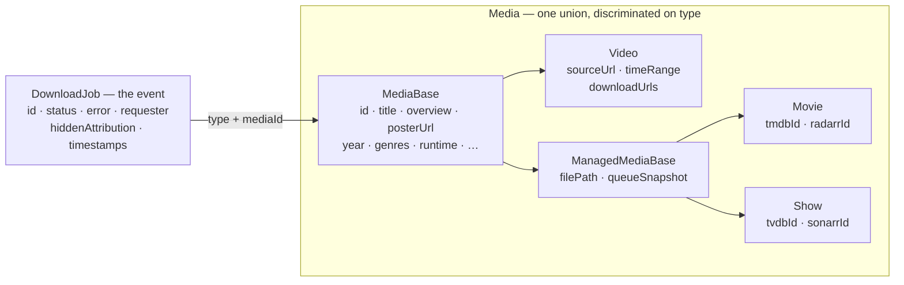

# Media Entity Refactor — `apps/download`

## Context

Phase 2 of the download backend shipped, but the type model underneath it is
three parallel copies of the same thing. `VideoDownloadJob`, `MovieDownloadJob`,
and `ShowDownloadJob` (`packages/utils/src/download/types.ts:94-147`) each
re-declare the same nine fields; the serializers, the row codec, and the
`Pick<>` response types all triple that duplication. Alongside them sit four
*more* near-identical shapes — `MovieSearchResult`/`ShowSearchResult` and
`DiscoveryMovieResult`/`DiscoveryShowResult` — describing the same movies and
shows in three different vocabularies depending on which endpoint returned them.
The string `'video' | 'movie' | 'show'` exists in five copies.

The deeper problem is that a *download job* (an event: who asked, when, what
happened) and a *movie* (a thing that outlives every job that fetched it) are
currently one wide `jobs` row with thirteen sparse nullable columns. Download
Dune twice and you get two disconnected copies of Dune's title, poster, and
overview.

This refactor introduces a unified `Media` type — a discriminated union over
video/movie/show, sharing everything that can be shared:



**Decisions made with the user:**

1. Unified `Media` type with a three-tier hierarchy, expressed as a **zod
   discriminated union** — schemas are the source of truth, TS types derived via
   `z.infer`.
2. **No media table.** Radarr and Sonarr are already the system of record for
   movies and shows, so persisting their metadata is pure duplication. Movies and
   shows are **always derived** from a live lookup, downloaded or not. Only
   **videos** get a table — nothing else knows they exist.
3. Existing API responses may change freely. Nothing outside this monorepo
   consumes them.
4. A video clip is its **own** media item — deduped on source URL + time range —
   so downloading a URL full and then clipped doesn't overwrite the first
   entry's `downloadUrls`.
5. The **gallery becomes media-centric**: one card per title. Activity and
   history stay job-centric — they're event feeds by nature.
6. Fold in the adjacent duplication cleanups.
7. **Frontend work is deferred.** It's being rebuilt against the spec
   separately; this change updates it only enough to keep it compiling and
   correct, plus the approved cleanups.
8. **`apps/tdr-bot` is out of scope entirely** — it migrates in a later change.
   Since `packages/utils` is shared, that requires an explicit compatibility
   shim rather than just "don't open the file"; see §5.2.

### What "derived" means

A movie's identity is its TMDB id, whether or not anyone has downloaded it. So
`Media.id` is a **derived key**, computed by one function `mediaId(media)` and
minted nowhere:

| type | `Media.id` | resolved from |
|---|---|---|
| movie | `tmdb:438631` | `getApiV3MovieLookupTmdb` — already called at `radarr.service.ts:156` |
| show | `tvdb:121361` | `getApiV3SeriesLookup({ term: 'tvdb:121361' })` — already at `sonarr.service.ts:147` |
| video | `video:V1StGXR8_Z5` | the `videos` row |

This is what makes the whole collapse work. A Radarr search hit, a discovery
result, and a downloaded movie are now **the same `Movie` object** — they differ
only in which optional fields are populated. `MovieSearchResult`,
`ShowSearchResult`, and both `DiscoveryResult` types stop existing.

It also means the persistence layer shrinks to almost nothing: `jobs` keeps a
`(type, mediaId)` pair, and a `videos` table holds the one media type no upstream
service tracks.

**The cost, stated plainly:** the app becomes read-through-dependent on
Radarr/Sonarr for movie and show metadata. If Radarr is down, movie cards can't
render. See §4.1 for the library cache that keeps this to one upstream call per
TTL window rather than one per job, and §8.2 for the honest risk assessment.

---

## 1. The type hierarchy

### 1.1 Move the enums into `schema.ts`

The discriminant must be a runtime value inside `schema.ts` (`z.literal(...)`),
but `DownloadType` is a TS enum in `types.ts`, and the one-way
`types.ts → schema.ts` edge is deliberate (see the `downloadTypeValuesPin`
comment, `schema.ts:76-94`).

**Move `DownloadType` and `DownloadJobStatus` into `schema.ts`; re-export from
`types.ts`.** Every existing `import { DownloadType } from '@lilnas/utils/download/types'`
keeps working — a re-export preserves value semantics — so this is pure module
movement with zero call-site churn.

It also *deletes* `DOWNLOAD_TYPE_VALUES` and `downloadTypeValuesPin`: with the
enum local, `z.enum(DownloadType)` needs no tuple and no pin. Vocabulary copies
go from five to two — the shared enum, and `db/schema.ts`'s `DOWNLOAD_TYPES`
tuple, which drizzle genuinely needs as a literal and which keeps its `typePin`.

### 1.2 Extract the shared leaf schemas

`TimeRangeSchema`, `DownloadQueueSnapshotSchema`, `JobRequesterSchema` — each
currently exists as 2–3 independent copies (an inline zod object, an inline TS
type, a drizzle `$type<>()`). `CreateDownloadJobInputSchema` uses
`timeRange: TimeRangeSchema.optional()`; `db/schema.ts` uses `$type<TimeRange>()`.

### 1.3 The hierarchy — `packages/utils/src/download/schema.ts`

```ts
export const MediaBaseSchema = z.object({
  certification: z.string().optional(),
  genres: z.array(z.string()).optional(),
  /** Derived by mediaId() — `tmdb:438631`, never minted. */
  id: z.string(),
  overview: z.string().optional(),
  posterUrl: z.string().optional(),
  /** `ratings.tmdb.value` upstream — `ratings` is a nested per-source object,
   *  never a scalar, so the source is picked explicitly at the mapper. */
  ratingValue: z.number().optional(),
  /** Radarr `releaseDate` / Sonarr `firstAired`. */
  releaseDate: z.string().optional(),
  /** **Seconds.** Radarr/Sonarr report minutes, so `toMovie()`/`toShow()`
   *  multiply by 60 — the one place the conversion happens. Seconds is the
   *  lossless direction: the gallery shows video durations to the second
   *  (`14:02`, `0:58`) while movie/show detail renders `2h 04m`. */
  runtime: z.number().int().optional(),
  title: z.string(),
  type: z.enum(DownloadType),
  year: z.number().int().optional(),
})

export const VideoSchema = MediaBaseSchema.extend({
  downloadUrls: z.array(z.string()).optional(),
  sourceUrl: z.string().url(),
  timeRange: TimeRangeSchema.optional(),
  type: z.literal(DownloadType.Video),
})

export const ManagedMediaBaseSchema = MediaBaseSchema.extend({
  filePath: z.string().optional(),
  queueSnapshot: DownloadQueueSnapshotSchema.optional(),
})

export const MovieSchema = ManagedMediaBaseSchema.extend({
  radarrId: z.number().int().positive().optional(),
  tmdbId: z.number().int().positive(),
  type: z.literal(DownloadType.Movie),
})

export const ShowSchema = ManagedMediaBaseSchema.extend({
  sonarrId: z.number().int().positive().optional(),
  tvdbId: z.number().int().positive(),
  type: z.literal(DownloadType.Show),
})

export const MediaSchema = z.discriminatedUnion('type', [
  MovieSchema, ShowSchema, VideoSchema,
])
```

**No `createdAt`/`updatedAt` on `MediaBase`** — those are row facts, and a movie
has no row at all. They live on `DownloadJob`.

`.extend()` is the only composition primitive this repo uses (zero `.merge()`/
`.omit()`/`.pick()` occurrences) and its spread semantics mean each arm's
`z.literal` overrides the base's `z.enum`. `z.literal(DownloadType.Movie)`
infers the *enum member* type, so every existing `job.type === DownloadType.Movie`
comparison still type-checks — which is why the enum had to move rather than the
arms using bare `'movie'` literals (string enums are nominal; `'movie'` is not
assignable to `DownloadType.Movie`).

**Which fields are populated when:**

| field group | search hit | discovery hit | in the Radarr/Sonarr library |
|---|---|---|---|
| `id`, `title`, `type`, `tmdbId`/`tvdbId` | ✅ | ✅ | ✅ |
| `overview`, `posterUrl`, `year` | ✅ | ✅ | ✅ |
| `genres`, `runtime`, `releaseDate`, `certification`, `ratingValue` | available from the same lookup — **discarded today** | ✅ | ✅ |
| `radarrId`/`sonarrId`, `filePath` | — | — | ✅ |
| `queueSnapshot` | — | — | ✅ while downloading |

The middle row is why the collapse is worth it: `movie-detail.html` shows
`2024 · 2h 04m · Drama, Thriller`, and `toMovieSearchResult` fetches all of that
and drops it on the floor.

`types.ts:251-256`'s "kept intentionally separate so widening this can never
change those endpoints' response bytes" comment is deleted — that constraint is
lifted by decision 3.

### 1.4 The job becomes uniform

The discriminated union lives entirely on `Media`. `DownloadJob` is a **plain
non-union object**:

```ts
export const DownloadJobSchema = z.object({
  completedAt: z.iso.datetime().nullable(),
  createdAt: z.iso.datetime(),
  error: z.string().optional(),
  hiddenAttribution: z.boolean(),
  id: z.string(),
  media: MediaSchema,
  requester: JobRequesterSchema.nullable(),
  status: z.enum(DownloadJobStatus),
  updatedAt: z.iso.datetime(),
})
```

`types.ts` derives everything via `z.infer` and keeps guards on the *media*:
`isVideo`, `isMovie`, `isShow`, `isManagedMedia` (= `Movie | Show`).

**Deleted:** `VideoDownloadJob`, `MovieDownloadJob`, `ShowDownloadJob`,
`is*DownloadJob`, `GetMovieJobResponse`, `GetShowJobResponse`,
`DownloadJobListFields`, `DownloadJobListItem`, `MovieSearchResult`,
`ShowSearchResult`, `SearchMoviesResponse`, `SearchShowsResponse`,
`DiscoveryResultBase`, `DiscoveryMovieResult`, `DiscoveryShowResult`,
`DiscoveryResult`. **Sixteen types → one union.**

**Retained, deprecated:** `GetDownloadJobResponse` — the only one of the
seventeen that `apps/tdr-bot` imports, so it survives as a shim until tdr-bot
migrates (§5.2).

Timestamps become **ISO strings** on the domain type (resolving today's
`completedAt?: Date` vs `completedAt: string | null` split). `Date` survives only
at the drizzle boundary. The object in the Map, on the WS frame, and in the REST
body become literally the same object — no serializer layer at all.

### 1.5 Where each of today's ~20 job fields lands

| today | lands on | note |
|---|---|---|
| `id`, `status`, `error`, `requester`, `hiddenAttribution`, `completedAt` | `DownloadJob` | per-attempt facts |
| `type` | **stays on `jobs`**, and on `Media.type` | see §2.2 |
| `url` (video) | `videos.source_url` → `Video.sourceUrl` | |
| `url` (movie/show) | **deleted** | was the synthetic `radarr://tmdb/{id}`; becomes `jobs.media_id = 'tmdb:438631'` |
| `title` (video), `mediaTitle` | `videos.title` / derived | one title concept |
| `title` (movie/show) | **deleted** | verified never populated — always `undefined` on the wire today |
| `description` (video), `overview` | `videos.overview` / derived | one long-text concept |
| `posterUrl`, `year`, `genres`, `runtime`, … | `videos.*` for videos; **derived** for movies/shows | most are new — already fetched and discarded today |
| `timeRange`, `downloadUrls` | `videos.*` | MinIO artifacts outlive the job |
| `filePath`, `queueSnapshot` | **derived** from Radarr/Sonarr | never persisted; they're upstream state |
| `radarrId` / `sonarrId` | **derived** | the library item carries both `id` and `tmdbId` |
| `proc` | `DownloadStateService.procs` side map | not serializable |
| `file` | **deleted** | verified dead — declared, never assigned or read |
| `origin` | stays row-only | still derived from `requester`; existing CHECK unchanged |

**`proc`** moves to a `Map<string, ChildProcessWithoutNullStreams>` on
`DownloadStateService` (`setProc`/`getProc`/`clearProc`). This deletes the two
hand-rolled `{...job, proc: undefined}` strips before serialization, the
`hasNewProcess` logging branch, and removes `child_process` from
`packages/utils`'s import graph entirely — so a browser bundle importing
`@lilnas/utils/download/types` no longer pulls a Node builtin.

---

## 2. Database

### 2.1 New `videos` table

The only media type nothing upstream tracks.

```ts
export const videos = sqliteTable(
  'videos',
  {
    id: text('id').primaryKey(),                 // nanoid, minted at request time
    // The dedupe key — `{sourceUrl}#{start}-{end}`, computed by videoNaturalKey()
    // and nowhere else. A clip is a distinct video from the full download, so
    // the range is part of the key.
    naturalKey: text('natural_key').notNull(),
    sourceUrl: text('source_url').notNull(),
    timeRange: text('time_range', { mode: 'json' }).$type<TimeRange>(),
    title: text('title').notNull(),
    overview: text('overview'),
    posterUrl: text('poster_url'),
    runtime: integer('runtime'),
    downloadUrls: text('download_urls', { mode: 'json' }).$type<string[]>(),
    createdAt: /* …$defaultFn(() => new Date()) */,
    updatedAt: /* … */,
  },
  t => [uniqueIndex('videos_natural_key_idx').on(t.naturalKey)],
)
```

`uniqueIndex` is not currently imported in `db/schema.ts` — add it.

A nanoid PK (rather than the natural key itself) keeps `/media/video:V1StGXR8_Z5`
a sane URL, while the unique index still gives dedupe on re-request.

`title` is NOT NULL, seeded from the source URL at request time and overwritten
the moment yt-dlp reports the real one — so no UI surface needs a
`?? sourceUrl` fallback.

### 2.2 `jobs` after the split

Keeps: `id`, `type`, `status`, `error`, `requesterEmail`, `requesterUserId`,
`origin`, `hiddenAttribution`, `createdAt`, `updatedAt`, `completedAt`.
Gains one column: **`mediaId`** — the derived key (`tmdb:438631`,
`tvdb:121361`, `video:V1StGXR8_Z5`).
**Drops twelve columns:** `url`, `title`, `description`, `media_title`,
`poster_url`, `overview`, `radarr_id`, `sonarr_id`, `queue_snapshot`,
`time_range`, `download_urls`, `file_path`.

`jobs.type` **stays** — with no media table there's nothing to join to, and it's
already indexed, already pinned by `typePin`, already correct. This is a
simplification over the earlier draft: the activity/history cursor queries are
untouched, so `db/__tests__/schema.spec.ts:176-222`'s two `EXPLAIN QUERY PLAN`
tests keep passing **as written**.

Two new constraints:

- `index('jobs_type_media_id_idx').on(type, mediaId)` — the gallery's `GROUP BY`.
- `check('jobs_media_id_matches_type', ...)` — `type = 'movie' AND media_id LIKE
  'tmdb:%'`, etc. Direct analogue of the existing `jobs_origin_matches_requester`
  CHECK, and the DB-level expression of the same invariant `mediaId()` enforces
  in code.

**No foreign key on `media_id`.** It can't be one — it points at `videos` for a
third of rows and at TMDB/TVDB for the rest, and SQLite FKs can't be conditional.
Video referential integrity is enforced at the app layer (`ensureVideo()` is the
only writer of either table) plus a test; accepted and worth a comment on the
column.

### 2.3 Three migrations

**`0002` (generated, additive):** create `videos` + its unique index; add
`jobs.media_id` (**nullable** at this stage — SQLite can't `ADD COLUMN NOT NULL`
without a default) and `jobs_type_media_id_idx`. Purely additive, safe on a live
table.

**`0003` (`--custom`, hand-written): backfill.**

```sql
-- One videos row per distinct (url, time range). Two jobs that downloaded the
-- same clip collapse onto one row; created_at is the earliest job's.
INSERT INTO videos (id, natural_key, source_url, time_range, title,
                    overview, download_urls, created_at, updated_at)
SELECT lower(hex(randomblob(12))),
       url || '#' || COALESCE(json_extract(time_range,'$.start'),'')
           || '-'  || COALESCE(json_extract(time_range,'$.end'),''),
       MIN(url), MAX(time_range),
       COALESCE(MAX(title), MIN(url)),   -- title is NOT NULL
       MAX(description), MAX(download_urls),
       MIN(created_at), MAX(updated_at)
FROM jobs WHERE type = 'video' GROUP BY 2;
--> statement-breakpoint
UPDATE jobs SET media_id = CASE type
  WHEN 'movie' THEN 'tmdb:' || substr(url, length('radarr://tmdb/') + 1)
  WHEN 'show'  THEN 'tvdb:' || substr(url, length('sonarr://tvdb/') + 1)
  ELSE 'video:' || (SELECT v.id FROM videos v WHERE v.natural_key =
        jobs.url || '#' || COALESCE(json_extract(jobs.time_range,'$.start'),'')
                 || '-'  || COALESCE(json_extract(jobs.time_range,'$.end'),''))
END;
```

- The natural-key expression appears twice and **must be identical**, or
  `media_id` silently comes out `'video:'` with a NULL id. Extract it into a
  `CREATE TEMP VIEW job_video_key AS …` used by both statements, then `DROP VIEW`.
- Movie/show metadata is simply **dropped** — it's re-derived from Radarr/Sonarr
  on the next read, which is the whole point.
- `jobs_media_id_matches_type` **is the backfill's correctness test**: any legacy
  row whose `url` didn't match the expected prefix produces a malformed
  `media_id` and the migration aborts. Loud beats half-migrated.

**`0004` (generated, narrowing):** `mediaId` → `.notNull()`, twelve columns
deleted. drizzle-kit emits SQLite's recreate-table sequence. The `NOT NULL` means
any job `0003` failed to link **aborts loudly** — a guard a bare `SELECT`
assertion can't give. `migrate.ts` already re-asserts `foreign_keys = ON` after
`migrate()` for exactly this `PRAGMA foreign_keys=OFF` behavior.

**Hand-review the generated `0004`:** confirm the `INSERT ... SELECT` column list
is complete, both CHECKs survive onto `__new_jobs`, and all six indexes are
recreated.

**Deploy:** back up `/storage/app-data/download/download.db` (plus `-wal`/`-shm`)
before the release that runs `0004`. Column drops are not reversible.

---

## 3. API surface

### 3.1 Detail — one shape, whether or not it's been downloaded

```
GET /download/media/:id   → { media: Media; jobs: DownloadJob[] }
```

```
       ┌── tmdb:… / tvdb:… ──▶ Radarr/Sonarr lookup (library first, then
:id ───┤                        the by-id lookup) → Movie/Show
       └── video:…       ──▶ videos row, or 404
                              (a video can't exist before it's downloaded)

then: SELECT * FROM jobs WHERE media_id = :id  → jobs[]
```

`jobs: []` **is** the mockup's "not downloaded" state (`movie-detail.html`:
"Nothing grabbed yet." + a Download button) — the frontend needs no extra field,
and no row has to exist anywhere for a movie to have a detail page.

This closes a real Phase 2 gap: today `/movies/:id` takes a *job* id, so a movie
has no detail page at all until someone has already requested it, contradicting
spec §Navigation ("selecting any movie/show surface always opens that title's
detail page… downloading only ever happens from the detail page").

Videos 404-ing is correct, not a gap: per spec §8 a video detail page is reached
from the nav bar *with the download already under way*.

### 3.2 The media-centric gallery

```
GET /download/gallery        → DownloadPage<GalleryItem>
GET /download/gallery/facets → DownloadGalleryFacets
```

```ts
export const GalleryItemSchema = z.object({
  downloadCount: z.number().int(),
  lastDownloadedAt: z.iso.datetime(),
  lastRequester: JobRequesterSchema.nullable(),  // masked per attribution rules
  media: MediaSchema,
})
```

Matches the mockup card exactly (`gallery.html:1465-1538`): poster/thumb, title,
`movie · 2024` type+year chip, one avatar, one relative date. The mockup shows no
count, but you asked for "downloaded 2×", so it's included.

With no media table, the gallery is **derived from the job log**:

```sql
SELECT type, media_id,
       MAX(created_at) AS last_job_at,
       COUNT(*)        AS download_count
FROM jobs
WHERE <type / date / requester / status filters>
GROUP BY type, media_id
HAVING (last_job_at, media_id) < (?, ?)          -- cursor
ORDER BY last_job_at DESC, media_id DESC
LIMIT ?
```

Then hydrate each group's `Media` (batch: one `videos` query for the video keys,
the library cache for the rest — §4.1) and one small query for `lastRequester`
over the page's ≤100 `media_id`s.

Two things fall out of this that are strictly better than a media table:

- **No `lastJobAt` denormalized column** — it's `MAX(created_at)`, so there's no
  derived column that can drift.
- **Filters apply directly to `jobs`** with no join and no EXISTS subquery.
  `?requester=alice&from=2026-03-01` groups only alice's March jobs, so it means
  "titles alice downloaded in March" — the natural reading of user story 53.

**The attribution-oracle guard carries over unchanged**: `excludeHiddenVideos`
when a non-admin filters by `requester`, and unconditionally for the uploaders
facet. `attribution.ts` keeps its explicit media-type branch (`if (job.media.type
!== Video) return true`) — the direct expression of the spec rule.

Facets get simpler too: `countJobsByType` is already a `GROUP BY jobs.type`, and
`countJobsByRequester` a `GROUP BY jobs.requester_email` — both unchanged.

### 3.3 Everything else

| route | after |
|---|---|
| `GET /activity` | `DownloadPage<DownloadJob>` — job-centric (the activity mockup is a per-download table) |
| `GET /history` | `DownloadPage<DownloadJob>` — job-centric event feed |
| `GET /movies/search`, `/shows/search` | `{ results: Media[] }` |
| `GET /discover` | `DownloadPage<Media>` + `facets` + `degradedSources` |
| `GET\|POST /videos`, `PATCH /videos/:id/cancel` | `DownloadJob` |
| `POST\|GET\|DELETE /movies/:id`, `/shows/:id` | `DownloadJob` |

The video/movie/show routes stay **job-keyed** — `POST /videos` must hand back a
job id to poll — while `/media/:id` covers the library view.

**Request bodies and query schemas are unchanged**, so the nine `createZodDto`
wrappers at `download.controller.ts:58-66` are untouched.

**WS:** `DownloadJobEvent { job, type }` and `DOWNLOAD_JOB_EVENT_TYPE` keep their
shape; `job` now carries `media`. The `proc`-stripping copy in
`broadcastJobEvent` deletes.

**`job-serializers.ts` (117 lines, 4 functions) is deleted.** Because the domain
type *is* the wire type, "serialization" is now attribution masking and nothing
else — `projectJobForViewer(job, isAdmin)` directly.

---

## 4. Backend services

### 4.1 `MediaResolverService` (new) — the heart of the derived model

One service, one job: `(type, mediaId)[] → Media[]`. Everything that renders a
job or a gallery card goes through it, so there is exactly one place that knows
how a key becomes a media.

```
resolve(keys)
  ├── video:*  →  one SELECT over `videos` WHERE id IN (…)
  └── tmdb:* / tvdb:*
        ├── library cache hit  →  done
        └── miss  →  getApiV3MovieLookupTmdb / getApiV3SeriesLookup('tvdb:…')
                     (metadata only — no radarrId/filePath)
```

**This extracts an existing pattern, not a new one.** `radarr.service.ts:148-162`
already does library-first-then-per-id-lookup
(`existingMovies.find(m => m.tmdbId === tmdbId)` → `getApiV3MovieLookupTmdb`).
The resolver lifts that out, caches it, and batches it.

**Library cache.** `getApiV3Movie` and `getApiV3Series` each return the *whole*
library in one call — already used at `radarr.service.ts:148` and
`sonarr.service.ts:139`. Cache each as a `Map<tmdbId, Movie>` behind a
**60s success / 10s failure** TTL, mirroring `AdminCheckService.TTL_MS` /
`FAILURE_TTL_MS` (`auth/admin-check.service.ts:26,30`). The split matters here:
the short failure TTL is what makes a Radarr blip recover in seconds instead of
leaving the gallery degraded for a full minute. That turns "20 movie jobs on the
activity page" into **one** upstream call per TTL window, not twenty. The
existing `MediaPollerService` timer is a natural place to warm it.

**Field mapping** (`toMovie` / `toShow`, the single mapper): `id` → `radarrId`/
`sonarrId`; `movieFile.path` → `filePath` when `hasFile` (use `path`, not
`relativePath` — Phase 6's Emby match needs the absolute one; for shows,
`SeriesResource.path` is the series folder, and per-episode files come from
`episodeFile`, which Phase 4's episode work will need); `runtime × 60` →
seconds; `ratings.tmdb?.value` → `ratingValue`; `releaseDate` (Radarr) /
`firstAired` (Sonarr) → `releaseDate`.

**Cache miss → by-id lookup.** A title requested but since removed from Radarr's
library still resolves, because `getApiV3MovieLookupTmdb` is the *discover*
lookup, not a library query — it degrades gracefully to metadata-without-file
(`radarrId`/`filePath` absent, which the schema already models as optional).

**Upstream down.** `resolve()` returns a minimal placeholder `Media`
(`{ id, type, title: id }`) rather than throwing, so the activity page still
renders its own jobs with correct status and attribution. Movie titles degrade;
the page does not 500. Surfaced to the client the same way discovery already
does it — via `degradedSources`.

### 4.2 The rest

**`db/videos.repo.ts`** (new): `getVideoById`, `getVideosByIds`,
`upsertVideoByNaturalKey`, plus `videoNaturalKey()` and `mediaId()` in
`db/media-id.ts` — the single derivation point for both keys, unit-tested.

**`media/radarr.service.ts` / `sonarr.service.ts`:** the four mappers
(`toMovieSearchResult`, `toDiscoveryMovieResult`, and their Sonarr twins) collapse
to one `toMovie(lookup): Movie` / `toShow(lookup): Show` each — the single place a
Radarr/Sonarr payload becomes a `Media`, now also feeding the resolver and
`/media/:id`. Extract `releaseYearFromDate` (byte-identical at
`radarr.service.ts:70-74` and `sonarr.service.ts:57-61`) into
`media/release-date.util.ts`.

**`db/job-row.ts`:** `buildJobRow` loses both branches and its fourteen `: null`
fillers — one flat object with `type` + `mediaId`. `hydrateJobRow(row)` →
`hydrateJob(row, media)`. Two of its three "not a lossless round-trip" caveats go
away.

**`db/job-cursor.ts` → `db/list-cursor.ts`:** generalize `JobCursor
{createdAtMs, id, filterKey}` to `ListCursor {sortKeyMs, id, filterKey}` and reuse
it for both the job page and the gallery's grouped page, rather than adding a
third cursor codec (discovery already has its own).

**`DownloadStateService`:** the in-memory Map holds an app-local
`DownloadJobRecord = Omit<DownloadJob, 'media'> & { mediaId: string; type: DownloadType }`
— media is derived, so caching a copy per job would just be a second cache with
its own staleness. `resolveJob(id)` calls the resolver. `ensureVideo(input)` is
the only writer of the `videos` table.

**`MediaDownloadService`:** `requestMovie(tmdbId)` becomes `addJob({ type: Movie,
mediaId: 'tmdb:' + tmdbId, requester, status: Requested })` → Radarr add →
`updateJob(id, { status })`. **No metadata write at all** — that's the whole
point. `assertMovieJob`/`assertShowJob` (byte-identical twins) collapse to one
`assertJobMediaType(job, type)`.

**`MediaPollerService`:** now writes only `status`/`error` to `updateJob`.
`queueSnapshot` stops being persisted entirely — it's read live off the queue,
which is where it was always coming from. This deletes
`media-poller.service.ts:143-152`'s hand-rolled structural type and its comment
about `Partial<Movie & Show>` collapsing to `never`.

**`discovery.service.ts` / `discovery-ranking.ts`:** `RankedDiscoveryResult`
becomes `Media & { sourceRank }`; `discoveryId()` becomes `media.id`, deleting a
second identity scheme.

**Bug that disappears rather than needing a fix:** the earlier draft had to null
`media.filePath` on `DELETE /movies/:id`, or Phase 6's Emby check would match a
deleted file. With `filePath` derived from Radarr, there's nothing to invalidate —
Radarr stops reporting it and the next read is correct by construction.

---

## 5. Consumers

### 5.1 `apps/download` frontend — minimal, rebuild is deferred

Keep it compiling and correct, no new UI:

- `DownloadById.tsx`: field reads move under `media` (`job.media.title`,
  `.sourceUrl`, `.timeRange`, `.downloadUrls`, `.overview`).
- Fix the drifted `PENDING_STATUSES` (`DownloadById.tsx:15-21`) — missing
  `cleaning`, `importing`, `requested`, `searching`, so a job in `searching`
  renders with no progress bar today. `IN_PROGRESS_DOWNLOAD_JOB_STATUSES` is an
  array not a tuple, so ts-pattern's variadic `.with(...)` won't take it: add
  `isInProgressDownloadJobStatus()` to `types.ts` and use `.when(...)`. Run the
  multi-line class strings through `cns()` per CLAUDE.md.
- `use-download-job-socket.ts`: `parseVideoJobMessage` → `parseJobMessage` (drops
  the video-only filter so the hook can serve movie/show pages later), and
  replace the hand-rolled `'job' in value` duck-type with
  `DownloadJobSchema.safeParse()` — a concrete win from having runtime schemas.
- `HomeTabs.tsx`: `TAB_VALUES` → an explicit tuple of enum *members*;
  `TAB_LABELS` → `Record<DownloadType, string>`.
- `MediaRequestForm.tsx`: `MediaType` → `Exclude<DownloadType, DownloadType.Video>`;
  the hand-rolled `MediaSearchResultItem` → `Media`.
- `Home.tsx`: delete both `tmdbId → id` / `tvdbId → id` remapping blocks — the
  derived `media.id` replaces them.

### 5.2 `apps/tdr-bot` — zero files changed, held by a shim

tdr-bot is out of scope, but `packages/utils` is shared, so "don't touch it"
isn't achievable by omission — deleting `GetDownloadJobResponse` or changing
`getVideoJob`'s return type breaks the monorepo type-check. Its entire surface
is four imports and three client methods:

```
@lilnas/utils/download/client  → DownloadClient.dockerInstance
@lilnas/utils/download/schema  → TIME_REGEX                    ← unchanged
@lilnas/utils/download/types   → DownloadJobStatus             ← unchanged (re-export)
                                 GetDownloadJobResponse        ← must survive
@lilnas/utils/download/utils   → isBefore                      ← unchanged

client.createVideoJob({url, timeRange})   (download-command.service.ts:105)
client.getVideoJob(jobId)                                          (:215)
client.cancelVideoJob(jobId)                                       (:239)
```

**The shim, in `packages/utils/src/download/client.ts`:**

- Add `createJob` / `getJob` / `cancelJob` returning the new `DownloadJob`. The
  download frontend uses these.
- Keep `createVideoJob` / `getVideoJob` / `cancelVideoJob` with their **exact
  current signatures and return type**, implemented as thin wrappers that call
  the new methods and flatten `DownloadJob` back to `GetDownloadJobResponse`
  (`media.sourceUrl` → `url`, `media.title` → `title`, `media.overview` →
  `description`, `media.downloadUrls` → `downloadUrls`, `media.timeRange` →
  `timeRange`).
- Retain `GetDownloadJobResponse` in `types.ts` as a hand-written interface —
  it can no longer be a `Pick<>` of anything, since its source union is gone —
  marked `@deprecated` with a comment naming tdr-bot as the sole consumer and
  the deletion trigger.

**Both sites carry a `TODO(tdr-bot-migration)` marker** so the debt is
greppable and its removal condition is written down at the code, not only here.
The repo has no established TODO convention (five in the whole tree, two of them
in generated SDK code); the one precedent is `TODO(U3)` in
`apps/tdr-code/src/auth/auth.ts:311`, so this follows that tagged form.

In `client.ts`, above the three legacy methods:

```ts
// TODO(tdr-bot-migration): delete this block, `flattenToLegacyVideoResponse`,
// and the deprecated `GetDownloadJobResponse` in ./types.
//
// `apps/tdr-bot` is the SOLE consumer: download-command.service.ts calls
// createVideoJob/getVideoJob/cancelVideoJob and reads the flat
// `url`/`title`/`description`/`downloadUrls` fields. It was deliberately left
// untouched when the download backend moved to the Media union, so these three
// methods keep their pre-Media shape by flattening `DownloadJob` back down.
//
// Removal: migrate tdr-bot onto getJob/createJob/cancelJob + `job.media.*`,
// then delete all three pieces. New code must use getJob/createJob/cancelJob —
// nothing else may call these.
```

And on the type in `types.ts`:

```ts
/**
 * @deprecated Pre-Media wire shape, retained only for `apps/tdr-bot`. Use
 * {@link DownloadJob}. Removed by TODO(tdr-bot-migration) in ./client.
 */
```

Roughly twenty lines of code plus the markers. It is real debt, but it's
bounded, it has one named consumer, its removal condition is stated at the code,
and it is deleted by the tdr-bot migration rather than lingering indefinitely.
The alternative — freezing the video routes' wire format — would contaminate the
backend design to serve one caller.

**Verification is the point:** `pnpm --filter @lilnas/tdr-bot type-check test`
must pass with **zero** files changed under `apps/tdr-bot`. That's a gate in
Phase 6, not a hope.

---

## 6. Commit sequence

Each commit type-checks, lints, and has green tests on its own. C5–C8 ship in one
PR (monorepo, no independent deploys) but stay separate for review.

| # | commit | verified by |
|---|---|---|
| C1 | `refactor(utils): move download enums into schema.ts` — enums move + re-export, leaf schemas extracted, `DOWNLOAD_TYPE_VALUES`/pin deleted | **full-repo `type-check`** — proves the re-export is transparent with zero other files changed |
| C2 | `feat(utils): add the Media schema hierarchy` — six schemas + `MediaSchema` + `DownloadJobSchema` + guards, inferred in `types.ts` *alongside* the existing types | new `schema.spec.ts`: each arm parses, cross-arm fields rejected, exhaustive `switch (media.type)` compiles, and a type assertion that `z.infer<typeof VideoSchema>['type']` is `DownloadType.Video` not `DownloadType` |
| C3 | `feat(download): add the videos table` — table + unique index, `db/media-id.ts` (`mediaId`/`videoNaturalKey`), `videos.repo.ts`, `jobs.media_id` + CHECK + index, migration **0002** | `schema.spec.ts`: table list is `['jobs','videos']`, column round-trip, unique index rejects a dup natural key, CHECK rejects `type='movie'` with a `video:` media_id; `media-id.spec.ts` round-trips all three key forms |
| C4 | `feat(download): backfill videos and media ids` — migration **0003** | new `db/__tests__/media-backfill.spec.ts`: apply `0000`+`0001` from the real `.sql` files, seed legacy rows (video ±`time_range`, two video jobs sharing a URL+range, a movie, a show, a movie with NULL `media_title`), apply `0002`+`0003`, assert one `videos` row per distinct clip and every `media_id` well-formed |
| C5a | `feat(download): derive media from Radarr/Sonarr and the videos table` — `MediaResolverService` + library cache, `DownloadJobRecord`, `procs` map, `ensureVideo`, `hydrateJob`, mapper collapse, poller/download-service rewrites. Controller responses temporarily adapted to the old shapes via one comment-marked adapter | `pnpm --filter @lilnas/download test` — **the controller tests pass unchanged**, which is the proof the state swap is behavior-preserving. Plus resolver tests: batch grouping, cache hit/miss, upstream-down placeholder |
| C5b | `feat(download)!: reshape responses around DownloadJob and Media` — delete the adapter and `job-serializers.ts`, add `/media/:id`, media-centric gallery, search/discover return `Media`, `attribution.ts` keys off `job.media.type`, delete the sixteen old types from utils, add the tdr-bot shim, drop `child_process` from `types.ts` | controller specs rewritten, `attribution.spec.ts`, `job-query.service.test.ts`, new gallery/facets tests incl. the oracle guard, a `/media/:id` test covering downloaded / never-downloaded / 404-video / upstream-down, **and `@lilnas/tdr-bot type-check test` green with zero files changed there** |
| C6 | `refactor(download): drop the moved job columns` — `media_id` `.notNull()`, twelve columns deleted, migration **0004** (generated, hand-reviewed) | `schema.spec.ts` asserts the exact final `jobs` columns; the two existing `EXPLAIN QUERY PLAN` tests still pass **unchanged** (`jobs.type` stayed, no join was introduced); one new plan test for the gallery `GROUP BY` documenting its sort step; `db:generate` afterward produces an empty diff |
| C7 | `refactor(download): update the frontend for the media entity` | `pnpm --filter @lilnas/download test build` |

**`apps/tdr-bot` is not in this sequence and gets no commit.** It migrates
separately, and that change is what deletes the §5.2 shim.

---

## 7. Verification

Automated per commit as tabled above. Then manual end-to-end, following
`backend.md`'s existing checklist — run the dev stack
(`docker-compose -f docker-compose.dev.yml up -d download`) and curl with
hand-set `X-Forwarded-User`/`X-Forwarded-User-Id` headers to simulate Traefik:

1. `GET /download/media/tmdb%3A438631` for a movie **nobody has downloaded**
   returns full metadata with `jobs: []`, and `SELECT count(*) FROM videos`
   is unchanged — nothing was written anywhere.
2. Requesting that movie adds a `jobs` row and **still no media row exists**;
   the same endpoint now returns the same metadata with one job attached, and
   gains `radarrId`/`filePath` once Radarr imports it.
3. A real yt-dlp job produces one `videos` row and one `jobs` row. The same URL
   twice → two jobs, **one** `videos` row. The same URL with a **different time
   range** → a **second** `videos` row with its own `downloadUrls`.
4. `GET /download/media/video%3Anonexistent` 404s.
5. **Stop the Radarr container**, then load `/activity` with a movie job in
   flight: the page still renders with correct status and attribution, the movie
   title degrades to its key, and `degradedSources` names Radarr. Restart Radarr
   and confirm the title fills in within one TTL window.
6. Watch the upstream call count: loading `/activity` with 20 movie jobs issues
   **one** Radarr call, not twenty (check `docker-compose logs -f radarr`).
7. A simulated-admin request sees true attribution on a hidden video while a
   simulated-regular request doesn't — **over both REST and the raw WS frame**.
8. `?requester=` on the gallery as a non-admin does not confirm the existence of
   that requester's hidden video, in either `items` or `total`.
9. `/gallery` returns one item per title with a correct `downloadCount` after two
   downloads of the same movie; `/activity` and `/history` still return per-job
   rows.
10. Restart the container mid-download and confirm `reconcile-interrupted-jobs`
    still resolves the orphaned job (it only touches `status`/`error`/`updated_at`).
11. **tdr-bot untouched:** `git diff --stat apps/tdr-bot` is empty, and
    `pnpm --filter @lilnas/tdr-bot type-check test` is green. Then exercise it
    live — `/download` a video from Discord and confirm the bot still posts the
    file, since the shim's flattening is only as correct as its field mapping.

---

## 8. Risks and things to watch

1. **~~`.extend()` overriding the discriminant~~ — RESOLVED in Phase 0.**
   Verified at runtime and type level against zod 4.1.12 / tsc 5.9.3, with
   negative controls proving the check detects failure. The residual risk is
   narrower but real: **a forgotten override on a future fourth arm fails at
   first `.parse()`, not at construction** — `z.discriminatedUnion` builds
   happily, then throws `Duplicate discriminator value` at request time,
   because the un-overridden arm's wide `z.enum` claims every member. So the
   C2 type assertion stays in the suite permanently as the compile-time
   tripwire; it is not a one-off Phase 0 check.

2. **Read-through dependency on Radarr/Sonarr — the central trade-off.**
   Dropping the media table means movie/show metadata is only as available as
   Radarr is. Mitigations are real (whole-library cache → one call per TTL;
   graceful placeholder instead of a 500; `degradedSources` already exists as the
   client-facing signal), but the honest statement is: **a movie card cannot
   render its title with Radarr down**, where a persisted copy could. Judged
   acceptable because you can't *do* anything with a movie while Radarr is down
   anyway — but if the gallery is ever expected to work offline, this is the
   decision to revisit, and re-adding a metadata cache table is a purely additive
   change from here.

3. **Gallery `GROUP BY` needs a sort step.** `ORDER BY MAX(created_at) DESC` can't
   be answered from an index, so this one query gets a temp b-tree that the
   per-job cursor queries avoid. Fine at a home-NAS row count; the C6 plan test
   documents it explicitly rather than letting it be discovered later. Note this
   is the *only* new plan regression — keeping `jobs.type` means the existing
   activity/history plan tests pass unchanged.

4. **`media_id` has no foreign key.** It can't (points at `videos` for some rows,
   at TMDB/TVDB for others). Integrity rests on `ensureVideo()` being the only
   writer plus the type/prefix CHECK. Worth a test that a video job's `media_id`
   always resolves.

5. **All outstanding pagination cursors invalidate on deploy.**
   `computeFilterKey` hashes the filter, whose shape changes. Clients get the
   existing `400 Invalid or expired cursor` and fall back to page 1. Note it in
   the PR description.

6. **Movie/show metadata in existing rows is discarded** by migration `0003`
   rather than carried over. Intentional — it's re-derived on first read — but it
   does mean the first gallery load after deploy is cold and slower than steady
   state.

7. **C5 is the irreducibly large commit.** Splitting into C5a (introduce the
   resolver, validated against *unchanged* controller tests) and C5b (the
   reshape) is the best available seam; C5a alone touches ~12 source and ~10 spec
   files.

8. **The tdr-bot shim is untested debt on a real path.** Its flattening
   (`media.sourceUrl` → `url`, `media.overview` → `description`, …) is
   mechanical, but a wrong mapping produces a Discord message with a missing
   link rather than a compile error — tdr-bot's own tests mock the client, so
   they won't catch it. Mitigations: unit-test the flattener directly in
   `packages/utils/src/download/__tests__/client.spec.ts`, and run the live
   Discord check in §7 step 11. Both sites are tagged `TODO(tdr-bot-migration)`
   and the follow-up issue is titled to match, so the debt is greppable in both
   directions rather than resting on anyone remembering. Delete the shim with
   the tdr-bot migration; it should not outlive one or two more changes.

9. **~~`z.iso.datetime()`~~ — RESOLVED in Phase 0.** Exists in zod 4.1.12,
   parses `2026-08-20T12:00:00.000Z`, and rejects a date-only string, so it
   can't silently accept what the existing `z.iso.date()` fields produce.

10. **`ratingValue` picks one rating source out of five.** Upstream `ratings` is
    `{ imdb?, tmdb?, metacritic?, rottenTomatoes?, trakt? }`; the plan takes
    `tmdb`. If a title has no TMDB rating the field is simply absent — fine, it's
    optional — but "the rating" is a lossy flattening of five, and surfacing a
    different source later is a wire change. Low stakes; noted so the choice is
    deliberate rather than accidental.

---

## 9. Task list

Ten phases (0–9). Phases 1–4 are additive and independently shippable. Phases
5–8 must land in one PR (monorepo, no independent deploys) but stay separate
commits. Every phase ends at a green `pnpm run lint && pnpm run type-check &&
pnpm test` for the packages it touched.

**Nothing under `apps/tdr-bot` is edited in any phase.** It's held compiling by
the §5.2 shim and migrates in a separate follow-up change.

### Phase 0 — Prep · ✅ COMPLETE

All six items executed against the real toolchain (zod 4.1.12, tsc 5.9.3,
the generated SDK). Scratch files removed; working tree clean.

- [x] **`z.enum(DownloadType)` accepts a TS string enum.** Parses members,
      rejects non-members. `z.nativeEnum` is not needed.
- [x] **`z.iso.datetime()` exists and behaves.** Parses
      `2026-08-20T12:00:00.000Z`; rejects a date-only string, so it won't
      silently accept what `z.iso.date()` produces.
- [x] **`.extend()` overrides the discriminant — runtime *and* type level.**
      The arm's `z.literal` wins over the base's `z.enum` in both. Three-tier
      inheritance works: `filePath` reaches `Movie` through
      `ManagedMediaBase`. Cross-arm payloads are rejected.
      Verified with **negative controls**, so the assertion has teeth rather
      than passing vacuously: making the `@ts-expect-error` line legal fires
      `TS2578 Unused '@ts-expect-error' directive`, and deleting the arm's
      override reproduces the exact failure mode — `Video['type']` widens to
      `DownloadType` and narrowing collapses with `TS2339: Property 'tmdbId'
      does not exist`.
- [x] **Both lookups return the same resource type as the library listing**
      (`MovieResource` / `SeriesResource`), so one `toMovie()` / `toShow()`
      mapper serves the library-cache path, the per-id fallback, search, and
      discovery. Fields confirmed present: `overview`, `images`, `year`,
      `runtime`, `certification`, `genres`, `ratings`, plus `releaseDate`
      (Radarr) / `firstAired` (Sonarr).
- [x] **`id`, `tmdbId`/`tvdbId`, and file paths all present.**
      `MovieResource.id` is the radarrId; `movieFile.path` is the absolute file
      path (`relativePath` is folder-relative), gated by `hasFile`.
      `SeriesResource.id` is the sonarrId and `path` is the series folder.
- [x] **TTL decided: 60s success / 10s failure**, mirroring
      `AdminCheckService.TTL_MS` and `FAILURE_TTL_MS`
      (`auth/admin-check.service.ts:26,30`). The short failure TTL matters here
      — it's what makes a Radarr outage recover within seconds rather than a
      full minute.

**Three findings that changed the plan** (already applied to §1.3, §4.1, §8.1):

1. **A forgotten discriminant override fails at *first parse*, not at
   construction** — `z.discriminatedUnion` builds fine, then throws
   `Duplicate discriminator value "movie"` on the first `.parse()`, because the
   un-overridden arm's wide `z.enum` claims every member. Loud, but deferred to
   request time. This is why the C2 type assertion is permanent, not a one-off
   Phase 0 check.
2. **`runtime` is in minutes, not seconds** — both `MovieResource.runtime` and
   `SeriesResource.runtime`.
3. **`ratings` is a nested object**, not a scalar:
   `{ imdb?, tmdb?, metacritic?, rottenTomatoes?, trakt? }`, each a
   `RatingChild`. `ratingValue` has to pick a source explicitly.

**One thing that makes Phase 5 smaller than estimated:**
`radarr.service.ts:148-162` already does library-first-then-per-id-lookup
(`existingMovies.find(m => m.tmdbId === tmdbId)` → `getApiV3MovieLookupTmdb`).
`MediaResolverService` extracts and caches that existing pattern rather than
inventing one.

### Phase 1 (C1) — Enum + leaf schema move · `packages/utils` · ✅ COMPLETE

- [x] Move `DownloadType` and `DownloadJobStatus` verbatim from
      `packages/utils/src/download/types.ts:17-36` into `schema.ts`.
- [x] Re-export both from `types.ts`. (Implemented as `import { DownloadJobStatus, DownloadType } from './schema'` +
      `export { DownloadJobStatus, DownloadType }` — a bare `export { X } from './schema'`
      re-export does **not** create a local binding, and `types.ts` uses both
      enums elsewhere in the same file, e.g. `TERMINAL_DOWNLOAD_JOB_STATUSES`.)
- [x] Delete `DOWNLOAD_TYPE_VALUES`, `AssertSameUnion`, and
      `downloadTypeValuesPin` (`schema.ts:76-94`) plus their explanatory comment.
- [x] Change `csvEnum()` to take the enum directly; update both call sites
      (`ActivityQuerySchema`, `GalleryQuerySchema`). (`csvEnum<T extends z.util.EnumLike>(enumObject: T)`,
      wrapping `z.enum(enumObject)`.)
- [x] Add `TimeRangeSchema`, `DownloadQueueSnapshotSchema`, `JobRequesterSchema`
      to `schema.ts`; derive `TimeRange` / `DownloadQueueSnapshot` /
      `JobRequester` in `types.ts` via `z.infer`, replacing the hand-written
      interfaces at `types.ts:73-88`.
- [x] Point `CreateDownloadJobInputSchema.timeRange` at `TimeRangeSchema.optional()`
      (replaces the inline object at `schema.ts:15-20`).
- [x] Point `apps/download/src/db/schema.ts:121` at `$type<TimeRange>()` and
      `:116` at `$type<DownloadQueueSnapshot>()` (already correct for the latter).
- [x] Verify `apps/download/src/db/schema.ts`'s own `AssertSameUnion`/`typePin`/
      `statusPin` (`:64-78`) still compile — they should, they read the enums
      through `types.ts`'s re-export via `import type`. Confirmed unchanged and green.
- [x] **Gate:** full-repo `pnpm run type-check` passes with **zero** files
      changed outside `packages/utils` — the proof the re-export is transparent.
      (One additional, plan-anticipated file changed: `apps/download/src/db/schema.ts`'s
      `TimeRange` type-pointer, called out explicitly above.)

**Verification notes:**
- `pnpm --filter @lilnas/utils lint type-check test` — green (67/67 tests).
- Full-repo `pnpm run type-check` — green across all 14 packages, including
  `@lilnas/download` and `@lilnas/tdr-bot`. (`packages/utils` and `packages/media`
  needed a one-time local `build` first — their dist output wasn't present in
  this worktree; unrelated to this change, and turbo's `type-check` task has
  no `dependsOn: ["^build"]`.)
- `pnpm --filter @lilnas/download lint` — green.
- `pnpm --filter @lilnas/download test` — 38 pre-existing failures (NestJS DI
  resolution errors in `ytdlp-update.service.spec.ts` and two others),
  confirmed identical on the unmodified tree via `git stash` — unrelated to
  this phase, not introduced by it.
- `git diff --stat` confirms exactly the expected file set: `apps/download/src/db/schema.ts`,
  `packages/utils/src/download/schema.ts`, `packages/utils/src/download/types.ts`.

### Phase 2 (C2) — The Media schema hierarchy · `packages/utils` · ✅ COMPLETE

- [x] Add `MediaBaseSchema`, `VideoSchema`, `ManagedMediaBaseSchema`,
      `MovieSchema`, `ShowSchema`, `MediaSchema` to `schema.ts` (§1.3).
- [x] Add `DownloadJobSchema` to `schema.ts` (§1.4).
- [x] Add `GalleryItemSchema` to `schema.ts` (§3.2).
- [x] Derive `MediaBase`, `Video`, `ManagedMediaBase`, `Movie`, `Show`, `Media`,
      `DownloadJobV2`, `GalleryItem` in `types.ts` via `z.infer`. **Named
      `DownloadJobV2`, not `DownloadJob`** — the plan text names it
      `DownloadJob`, but that identifier is already taken by the
      `VideoDownloadJob | MovieDownloadJob | ShowDownloadJob` union this same
      checklist item requires staying in place, and TypeScript rejects two
      exported types of the same name in one module. Renaming the *old* union
      instead would have broken every existing importer, contradicting "zero
      call-site churn this commit." `DownloadJobV2` is deliberately a
      placeholder name — greppable, and honest that it's temporary — deleted
      in favor of `DownloadJob` in Phase 6, which is already the commit that
      deletes the old union and touches every consumer. Documented at the
      definition site in `types.ts`.
- [x] Add `isVideo`, `isMovie`, `isShow`, `isManagedMedia` guards to `types.ts`.
- [x] Add `isInProgressDownloadJobStatus()` to `types.ts` (needed by the
      frontend's ts-pattern `.when()` in Phase 8).
- [x] Add `MediaDetailResponse` (`{ media: Media; jobs: DownloadJobV2[] }`) —
      hand-written interface, not a schema.
- [x] **Left the old types in place** this commit; nothing consumes the new
      ones yet, so both sets coexist and the repo stays green.
- [x] Tests in `packages/utils/src/download/__tests__/schema.spec.ts`:
  - [x] each arm parses a valid payload; each rejects another arm's key fields
  - [x] `MediaSchema.parse()` narrows correctly per `type`
  - [x] an exhaustive `switch (media.type)` with no `default` compiles
        (`describeMedia()` + a permanent `assertNever` fallthrough)
  - [x] **permanent type assertion** that `z.infer<typeof VideoSchema>['type']`
        is `DownloadType.Video`, not `DownloadType` — a `@ts-expect-error` on
        the widened assignment, verified in Phase 0 to fire `TS2578` if the
        override ever regresses. This is the compile-time tripwire for a
        forgotten override on a future arm, whose only other symptom is a
        `Duplicate discriminator value` throw at first request. **Re-verified
        with a live negative control in this phase**: temporarily changing
        `VideoSchema`'s `type: z.literal(DownloadType.Video)` back to
        `z.enum(DownloadType)` reproduced exactly the documented failure —
        `TS2578` on the `@ts-expect-error` line, plus `TS2339` on every
        `media.tmdbId`/`media.tvdbId` narrowing access elsewhere in the same
        file — then reverted.
  - [x] assert a bare `'video'` string literal is **not** assignable to
        `Video['type']` — the nominal-enum property that forces `DownloadType`
        to live in `schema.ts` (Phase 1) rather than being re-declared
  - [x] `DownloadJobSchema` round-trips a full job with each media arm nested
- [x] Add `buildVideo` / `buildMovie` / `buildShow` / `buildJob` fixture
      factories to `__tests__/types.spec.ts`, matching the existing
      `buildVideoJob`-style convention. Also exercised the four `Media` guards
      and `isInProgressDownloadJobStatus()` against them.

**Verification notes:**
- `pnpm --filter @lilnas/utils lint type-check test` — green (101/101 tests,
  49 new in `schema.spec.ts` + fixture/guard coverage in `types.spec.ts`).
- Full-repo `pnpm run type-check` — green across all 14 packages; only
  `@lilnas/utils` re-executed (cache miss), every other package replayed from
  cache — confirming zero other files needed to change.
- `git diff --stat` confirms exactly the expected file set:
  `packages/utils/src/download/schema.ts`,
  `packages/utils/src/download/types.ts`, and their two spec files.

### Phase 3 (C3) — `videos` table + media-id derivation · `apps/download` · ✅ COMPLETE

- [x] New `apps/download/src/db/media-id.ts`: `videoNaturalKey({sourceUrl, timeRange})`
      and `mediaId(media)` — the only derivation point for either key.
- [x] Add the `videos` table to `apps/download/src/db/schema.ts` (§2.1) with
      `uniqueIndex('videos_natural_key_idx')`. Add `uniqueIndex` to the
      `drizzle-orm/sqlite-core` import.
- [x] Export `VideoRow = typeof videos.$inferSelect`.
- [x] Add `mediaId: text('media_id')` to `jobs` — **nullable** for now.
- [x] Add `index('jobs_type_media_id_idx').on(t.type, t.mediaId)`.
- [x] Add `check('jobs_media_id_matches_type', ...)` tying the key prefix to
      `type`, modelled on the existing `jobs_origin_matches_requester`
      (`db/schema.ts:152-158`).
- [x] Comment the `media_id` column explaining why it is deliberately **not** a
      foreign key.
- [x] New `apps/download/src/db/videos.repo.ts`: `getVideoById`,
      `getVideosByIds`, `upsertVideoByNaturalKey`.
- [x] Run `pnpm --filter @lilnas/download db:generate` → migration `0002`.
      Review the generated SQL by hand.
- [x] Tests:
  - [x] new `db/__tests__/media-id.spec.ts` — all three key forms round-trip;
        a clip and its full-length sibling produce different keys; an absent
        `timeRange` produces a stable `#-` suffix
  - [x] `db/__tests__/schema.spec.ts` — table list is `['jobs','videos']`;
        `videos` column round-trip incl. the two JSON columns; unique index
        rejects a duplicate natural key; the new CHECK rejects `type='movie'`
        with a `video:` media_id
  - [x] new `db/__tests__/videos.repo.spec.ts` — upsert is idempotent on the
        natural key and returns the same row id twice

**Verification notes:**
- **Hand-review caught a real migration bug** (the task list's "Review the
  generated SQL by hand" step, working as intended): drizzle-kit's generated
  `0002` recreated `jobs` (SQLite's copy-and-swap for a `CHECK`-bearing table)
  with an `INSERT INTO __new_jobs(...) SELECT ... FROM jobs` that included
  `media_id` in **both** the target and source column lists. But `media_id` is
  a column being *added* in this same migration — the pre-migration `jobs`
  table has no such column — so the generated SQL failed at migration time
  with `SqliteError: no such column: "media_id"`. Fixed by hand-removing
  `media_id` from both column lists in that one `INSERT` statement, so it now
  correctly defaults to `NULL` on every pre-existing row (nullable at this
  phase by design; Phase 4 backfills it). Confirmed in the final SQL
  (`0002_sticky_miss_america.sql`): both `CHECK` constraints present on
  `__new_jobs`, `jobs_type_media_id_idx` and `videos_natural_key_idx` both
  created, and the `INSERT...SELECT` column list matches the pre-migration
  schema exactly.
- `buildJobRow()` in `db/job-row.ts` (Phase 5's file, not this phase's) needed
  a one-line addition in each branch — `mediaId: null` — so its output keeps
  matching the `jobs` row shape now that `mediaId` exists as a column;
  `hydrateJobRow`/`buildJobRow` don't become media-aware until Phase 5, so
  this is a filler, not a derivation.
- `pnpm --filter @lilnas/download test` — all `src/db` suites green (76/76),
  and the full app suite is green except the same 3 pre-existing
  `ytdlp-update` suites (38 failures, NestJS DI resolution errors) already
  documented as unrelated pre-existing failures in the Phase 1 verification
  notes — confirmed identical failure set, nothing new introduced by this
  phase.
- `pnpm --filter @lilnas/download lint` — green (one file needed a
  `prettier --write` pass after being authored).
- Full-repo `pnpm run type-check` — green across all 14 packages; only
  `@lilnas/download` re-executed (cache miss), every other package replayed
  from cache.
- `git diff --stat` / `git status` confirms the expected file set: new
  `apps/download/src/db/media-id.ts`, `apps/download/src/db/videos.repo.ts`,
  `apps/download/src/db/migrations/0002_sticky_miss_america.sql` +
  `meta/0002_snapshot.json`, `db/__tests__/media-id.spec.ts`,
  `db/__tests__/videos.repo.spec.ts`; modified
  `apps/download/src/db/schema.ts`, `apps/download/src/db/job-row.ts`,
  `apps/download/src/db/migrations/meta/_journal.json`,
  `db/__tests__/schema.spec.ts`,
  `download/__tests__/job-serializers.spec.ts`.

### Phase 4 (C4) — Backfill migration · `apps/download` · ✅ COMPLETE

- [x] `pnpm --filter @lilnas/download db:generate --custom` → migration `0003`
      (`0003_backfill_videos_and_media_ids.sql`).
- [x] Write the `CREATE TEMP VIEW job_video_key` + `INSERT INTO videos` +
      `UPDATE jobs SET media_id` + `DROP VIEW` sequence (§2.3), keeping the
      natural-key expression in exactly one place.
- [x] Add an `applyMigrationFiles(sqlite, tags[])` helper to
      `db/__tests__/test-utils.ts` that `exec()`s the real `.sql` files in order.
- [x] New `db/__tests__/media-backfill.spec.ts`, seeding legacy rows before
      applying `0002`+`0003`:
  - [x] a video with a `time_range` and one without → two `videos` rows
  - [x] two video jobs sharing a URL **and** range → **one** `videos` row, two
        jobs pointing at it, `created_at` = the earlier job's
  - [x] two video jobs sharing a URL with **different** ranges → two rows
  - [x] a movie job → `media_id = 'tmdb:<id>'`, no `videos` row
  - [x] a show job → `media_id = 'tvdb:<id>'`
  - [x] a video job with NULL `title` → `videos.title` falls back to the URL
        (the column is NOT NULL)
  - [x] every `jobs.media_id` is non-NULL and well-formed afterward
- [ ] Sanity-check against a **copy** of the real production DB pulled from
      `/storage/app-data/download/download.db` — row counts before/after, and
      no aborted CHECK. **Not done in this session** — no access to the deploy
      host or the production DB file from this environment; deferred to a
      pre-deploy manual step (folded into Phase 9's checklist, which already
      requires a DB backup before the release carrying `0004`).

**Verification notes:**
- The natural-key expression lives in exactly one place — the temp view's
  `SELECT` — and both the `INSERT INTO videos` (`GROUP BY natural_key`) and
  the `UPDATE jobs` (`JOIN ... ON v.natural_key = jvk.natural_key`) read it
  from there rather than recomputing it, so the two can't drift apart the way
  the plan's inline two-copy draft could have.
- `pnpm --filter @lilnas/download test` (full app suite) — 350/388 green; the
  38 failures are the same three `ytdlp-update` suites already documented as
  pre-existing/unrelated in the Phase 1 and Phase 3 verification notes
  (confirmed by suite name match, not just count).
- `pnpm --filter @lilnas/download lint type-check` — green.
- Full-repo `pnpm run type-check` — green across all 12 packages; only
  `@lilnas/download` re-executed (cache miss), everything else replayed from
  cache.
- `pnpm --filter @lilnas/download db:generate` (no `--custom`) afterward
  reports "No schema changes, nothing to migrate" — confirms `0003` is purely
  a data migration with zero schema drift from what `0002` already declared.
- `git status`/`git diff --stat` confirms the expected file set: new
  `apps/download/src/db/migrations/0003_backfill_videos_and_media_ids.sql` +
  `meta/0003_snapshot.json`, `db/__tests__/media-backfill.spec.ts`; modified
  `apps/download/src/db/__tests__/test-utils.ts` (the new
  `applyMigrationFiles` helper) and `migrations/meta/_journal.json`.

### Phase 5 (C5a) — Media resolver + state layer · `apps/download` · ⚠️ PARTIAL — scope narrowed, see findings

The behavior-preserving half. Controller responses stay on their old shapes via
one explicitly comment-marked adapter, so the controller tests are the safety net.

**Three findings that changed the plan** (discovered mid-implementation, not
anticipated in Phase 0 — each is a hard DI/type-checking constraint, not a
difficulty judgment call):

1. **`DownloadStateService.jobs`'s value type can't become `DownloadJobRecord`
   yet.** `download.controller.detail-fallback.test.ts` and
   `download.controller.video.test.ts` — both on the "pass unchanged" gate —
   construct a **real** `DownloadStateService` (or a bare-object mock) and
   seed/read it with legacy `VideoDownloadJob`/`MovieDownloadJob`/`ShowDownloadJob`
   values, asserting fields (`radarrId`, `hiddenAttribution`, `requester`) that
   only exist on the old union. Swapping the Map's value type — or making
   `resolveJob()` async so it can join through `MediaResolverService` — needs
   `MediaResolverService` (and therefore `RadarrService`/`SonarrService`/
   `DbService`) wired into `DownloadStateService`'s constructor. Neither
   unchanged test file's fixed provider list includes `MediaResolverService`,
   so that wiring fails NestJS DI at `Test.createTestingModule().compile()` —
   not a difficulty problem, a hard compile-time/DI wall against a file this
   phase is not allowed to touch.
2. **`radarr.service.ts`/`sonarr.service.ts` can't fold `search()`/
   `searchDetailed()` onto `toMovie()`/`toShow()` yet.** `discovery.service.ts`
   and `discovery-ranking.ts` (explicitly Phase 6 files) key off
   `DiscoveryMovieResult.releaseYear` and `DiscoveryShowResult.releaseYear` —
   a field `Media`/`Movie`/`Show` doesn't carry (only `releaseDate`).
   Redirecting `searchDetailed()` through the new mapper would break
   `discovery-ranking.ts`'s compile *today*, ahead of the Phase 6 commit that's
   supposed to update it. `toMovie()`/`toShow()` were added as new, additional
   exports instead — the existing mappers/methods are untouched.
3. **`media-download.service.ts`'s "no metadata write" and
   `media-poller.service.ts`'s "stop persisting `queueSnapshot`"** both
   describe behavior that only makes sense once something reads that metadata
   back *live* via the resolver — which finding 1 shows isn't wired in yet.
   Doing the write-side removal now, without the read-side replacement, would
   be a silent regression (movie/show titles and queue progress stop updating
   in the Map with nothing filling the gap), not a refactor. Both files are
   untouched this phase.

**What actually shipped this phase** (the parts with no such blocker):

- [x] New `apps/download/src/media/media-resolver.service.ts` — `resolve(keys):
      Promise<{degradedSources, media}>`, grouped by type; one `getVideosByIds`
      call for videos; a whole-library cache for movies/shows (60s success /
      10s failure TTL, mirroring `auth/admin-check.service.ts`) with a per-id
      fallback on a cache miss; a placeholder `Media` + degraded-source flag
      when an upstream call throws, never propagated as an error. **Not yet
      wired into any request path** — see finding 1. Registered and exported
      from `media.module.ts` (pure addition; `media.module.test.ts`'s real
      module-graph boot confirms it resolves cleanly).
- [x] `media/radarr.service.ts` / `sonarr.service.ts`: added `toMovie(lookup):
      Movie` / `toShow(lookup): Show` (the mapper the resolver and Phase 6's
      `/media/:id` will share) and `lookupByTmdbId` / `lookupByTvdbId` +
      `getLibrary()`, all net-new exports. `toMovieSearchResult`/
      `toDiscoveryMovieResult`/`search()`/`searchDetailed()` — and their
      Sonarr twins — are untouched (see finding 2; the collapse is now a
      Phase 6 item, done together with `discovery.service.ts`'s reshape).
- [x] New `media/release-date.util.ts` — extracted the byte-identical
      `releaseYearFromDate`; both the old and new mappers import it.
- [x] `download/types.ts`: added `DownloadJobRecord = Omit<DownloadJobV2,
      'media'> & { mediaId: string; type: DownloadType }` — documented,
      type-checked, not yet the Map's value type (see finding 1). Sets up
      Phase 6 as a type swap instead of a from-scratch design.
- [x] `download/download-state.service.ts`:
  - [x] `procs: Map<string, ChildProcessWithoutNullStreams>` + `setProc` /
        `getProc` / `clearProc`; cleared automatically on any terminal status
        transition inside `updateJob`
  - [x] deleted `hasProcess`, the `hasNewProcess` logging branch, and the
        `{...job, proc: undefined}` strip in `broadcastJobEvent` — dead code
        once nothing writes `proc` through `updateJob` anymore
  - [x] `ensureVideo(input)` — the only writer of the `videos` table; called
        on every persist of a video job (not just creation), so
        `title`/`overview`/`downloadUrls` progressively overwrite the
        placeholder as the pipeline learns them (plan §2.1), matching the
        idempotent-upsert design already in `videos.repo.ts`
  - [x] `persistJob` now derives and writes `jobs.media_id` for every job
        going forward — `ensureVideo()`'s row id for video, a parse of the
        legacy `radarr://tmdb/…`/`sonarr://tvdb/…` synthetic `url` for
        movie/show (`mediaIdFromLegacyJobUrl`, new in `db/media-id.ts`,
        mirroring migration `0003`'s own backfill expression). This closes
        the "only backfilled historically" gap ahead of Phase 7's `.notNull()`
        without changing anything any consumer reads.
  - [ ] Map still holds the legacy `DownloadJob` union; `resolveJob(id)` does
        not yet join through the resolver — **deferred to Phase 6** (finding 1)
  - [ ] `updateJob` signature is still `Partial<DownloadJob>` — **deferred to
        Phase 6**
- [x] `download/download-video.service.ts`: both `updateJob(id, {proc})`
      call sites → `setProc(...)`; `getJobLogger`'s strip deleted (nothing to
      strip once `proc` never reaches the job object).
- [x] `download/download.service.ts`: `cancelVideoDownloadJob` reads
      `getProc(id)` instead of `job.proc`. Job-creation literal **unchanged**
      — `ensureVideo`/`mediaId` derivation now happens centrally inside
      `persistJob` (see above) rather than at the call site, which covers the
      same ground without touching `createVideoDownloadJob`'s return shape.
- [ ] `media/media-download.service.ts` — **untouched, deferred to Phase 6**
      (finding 3).
- [ ] `media/media-poller.service.ts` — **untouched, deferred to Phase 6**
      (finding 3).
- [x] `db/jobs.repo.ts`: added `mediaId` to `JobListFilter` (+ `buildJobWhere`
      condition) for Phase 6's `/media/:id` job lookup — additive, inactive
      until a caller sets it, `jobs.repo.spec.ts` passes unchanged.
- [ ] Temporary shape adapter in `download.controller.ts` — **not needed this
      phase**: since the Map's value type didn't change (finding 1),
      `DownloadStateService`/`MediaDownloadService`/`DownloadService` still
      speak the legacy `DownloadJob` type end-to-end, so there is no shape
      mismatch yet to adapt. This lands in Phase 6 alongside the Map swap.
- [x] **Gate met:** all five `download.controller.*.test.ts` files and
      `media/__tests__/download.controller.media.test.ts` pass **unchanged**
      (verified by re-running the suite with zero edits to those six files).
- [x] New `media/__tests__/media-resolver.service.test.ts`: batch grouping
      (video/movie/show in one call), cache hit vs miss, per-id fallback,
      TTL reuse across calls, upstream-throws → placeholder + degraded signal
      (both a full library-lookup failure and a single per-id failure inside
      a larger batch), mixed-type key list.
- [x] Updated `download/__tests__/download-state.service.test.ts` (proc tests
      rewritten against `setProc`/`getProc`/`clearProc`; new coverage for
      `ensureVideo` dedup, placeholder-title overwrite, and legacy-url
      `mediaId` derivation) and added the required `jest.mock('nanoid', …)`
      stub to `media/__tests__/media-poller.service.test.ts` and all three
      `ytdlp-update/__tests__/*.spec.ts` files — `DownloadStateService` now
      transitively imports `nanoid` (for `ensureVideo`'s scratch row id) and
      nanoid v5 is ESM-only, so every test that pulls in `DownloadStateService`
      needs the existing mock convention, not just the files this phase
      already touches. `db/__tests__/job-row.spec.ts`,
      `media/__tests__/{media-download,radarr,sonarr}.service.test.ts` needed
      **no changes** — those files' subjects weren't touched this phase.

**Verification notes:**

- `pnpm --filter @lilnas/download test` — 367/405 green; the 38 failures are
  the same three pre-existing `ytdlp-update` DI-resolution suites documented
  in every prior phase's verification notes (confirmed by suite name and
  count match, not just total).
- `pnpm --filter @lilnas/download lint type-check` — green.
- `pnpm --filter @lilnas/utils lint type-check test` — green (101/101,
  unaffected — `DownloadJobRecord` is additive).
- Full-repo `pnpm run lint && pnpm run type-check` — green across all 14
  packages, `@lilnas/tdr-bot` included; `git diff --stat apps/tdr-bot` is
  empty.
- `media.module.test.ts` (the one test that boots the real module graph,
  forwardRef cycle included) still passes with `MediaResolverService`
  registered — confirms its DI wiring is sound even though nothing calls it
  yet.

**Remaining Phase 5 scope, rolled into Phase 6** (the task list below has been
updated to include these): the `toMovie`/`toShow`+`search()`/`searchDetailed()`
collapse (with `discovery.service.ts`'s matching reshape), swapping
`DownloadStateService.jobs` to `DownloadJobRecord` and making `resolveJob`
resolver-backed, `media-download.service.ts`'s no-metadata-write rewrite,
`media-poller.service.ts`'s live-queueSnapshot rewrite, and the controller
adapter that shape change will require.

### Phase 6 (C5b) — Response reshape · `apps/download` + `packages/utils` · ✅ COMPLETE

**Scope change: Phase 8 (the frontend) was folded into this phase.** Deleting
`VideoDownloadJob`/`isVideoDownloadJob` from `packages/utils` breaks
`DownloadById.tsx` and `use-download-job-socket.ts` at compile time, and the
minimum needed to keep them compiling *is* Phase 8's checklist — a
`GetDownloadJobResponse`-shaped stopgap would have meant writing throwaway
code to defer work already specified. The Phase 8 items are checked off in
place below, and the Next.js build gate was run.

**Carried over from Phase 5** (each was blocked by a hard DI/type constraint
that only cleared once this phase's reshape landed):

- [x] `media/radarr.service.ts`/`sonarr.service.ts`: folded `search()`/
      `searchDetailed()` onto `toMovie()`/`toShow()`, deleting
      `toMovieSearchResult`/`toDiscoveryMovieResult` and their Sonarr twins.
      `searchDetailed()` is gone entirely — it was the same upstream call as
      `search()` with a fuller mapper, so one method now backs both
      `/movies/search` and `/discover`.
- [x] `download/download-state.service.ts`: `jobs` now holds
      `DownloadJobRecord`; `resolveJob(id)` is resolver-backed and async
      (`resolveJobRecord()` is the sync record-only half);
      `updateJob`'s signature is
      `Partial<Omit<DownloadJobRecord, 'id' | 'mediaId' | 'type'>>` —
      narrower than the plan's `Partial<DownloadJobRecord>`, since a job's
      identity and media key are fixed at creation and letting an update
      change them would silently re-point a job at another title.
- [x] `media/media-download.service.ts`: `requestMovie`/`requestShow` write
      **no metadata at all** — `addJob({type, mediaId, requester, status})`
      and nothing else. `assertMovieJob`/`assertShowJob` collapsed into
      `assertJobMediaType(job, type, id)`.
- [x] `media/media-poller.service.ts`: writes only `status`/`error`; the
      hand-rolled `Partial<Movie & Show>` workaround and its comment are gone.
- [x] **No adapter was needed.** The plan hedged that the Map-type swap and
      the response reshape might land in separate commits and need a
      comment-marked adapter between them. They landed together, so the
      adapter was never written.

**Original Phase 6 scope:**

- [x] ~~Delete the Phase-5 adapter~~ — never existed (see above).
- [x] Deleted `download/job-serializers.ts` and its spec.
- [x] `download/attribution.ts`: keys off `job.media.type`. Split into
      `showTrueAttribution(type, hiddenAttribution, isAdmin)` +
      `showTrueRequester(job, isAdmin)` — **not in the plan**, but the
      media-centric gallery has `(type, media_id)` groups and a
      last-requester with no `DownloadJob` anywhere, and a second hand-rolled
      copy of the spec rule for that path is exactly what this file exists to
      prevent.
- [x] New `GET /download/media/:id` — URL-decodes the key, maps its prefix to
      a type via `mediaTypeFromKey()`, resolves, attaches jobs, 404s an
      unknown `video:` key **and** an unrecognized prefix (the latter isn't in
      the plan; without it a garbage `:id` would reach Radarr).
- [x] `download/job-query.service.ts`: `listActivity`/`listHistory` →
      `Promise<DownloadPage<DownloadJob>>` resolving media once per page;
      `listGallery` → `Promise<DownloadPage<GalleryItem>>`;
      `getGalleryFacets` unchanged; new `listJobsForMedia(mediaId)` for
      `/media/:id`.
- [x] `db/jobs.repo.ts`: added `listMediaGroupsPage()` (the gallery's
      `GROUP BY (type, media_id)`), `listLatestJobsForMediaIds()` (the
      `lastRequester` follow-up), and `listJobsByMediaId()`.
- [x] `db/job-cursor.ts` → `db/list-cursor.ts`; `JobCursor` → `ListCursor`,
      `createdAtMs` → `sortKeyMs`, `encode/decodeJobCursor` →
      `encode/decodeListCursor`. `computeFilterKey`'s import in
      `discovery.service.ts` updated.
- [x] `media/discovery.service.ts` + `discovery-ranking.ts`:
      `RankedDiscoveryResult` is now `Media & { sourceRank }`; `discoveryId()`
      deleted in favour of `media.id`.
- [x] Search routes return `{ results: Media[] }` (`SearchMediaResponse`);
      discover returns `DownloadPage<Media>` + `facets` + `degradedSources`.
- [x] The twelve job routes return `DownloadJob`.
- [x] `download.gateway.ts` needed **no change** — it was already payload-
      agnostic; `DownloadStateService.broadcastJobEvent` calls
      `projectJobForViewer` directly.
- [x] `packages/utils/src/download/client.ts`: added `getJob`/`createJob`/
      `cancelJob`/`getMedia` plus the five missing list methods
      (`getActivity`, `getGallery`, `getGalleryFacets`, `getHistory`,
      `getDiscover`) with a shared `toQueryString()` helper; movie/show/search
      return types updated.
- [x] **tdr-bot compatibility shim** (§5.2) — all six sub-items done: the
      three legacy methods kept verbatim as wrappers,
      `flattenToLegacyVideoResponse()` written and unit-tested,
      `GetDownloadJobResponse` retyped as a hand-written `@deprecated`
      interface, and the `TODO(tdr-bot-migration)` block added at both sites.
- [x] Deleted the sixteen old types from `packages/utils/src/download/types.ts`,
      the `child_process` import, and the "kept intentionally separate …
      response bytes" comment.
- [x] Renamed `DownloadJobV2` → `DownloadJob` (Phase 2's placeholder name,
      as planned).
- [x] Tests rewritten: all five `download.controller.*.test.ts`,
      `download.controller.media.test.ts`, `attribution.spec.ts`,
      `job-query.service.test.ts`, `download-state.service.test.ts`,
      `media-download.service.test.ts`, `media-poller.service.test.ts`,
      `radarr`/`sonarr`/`discovery`/`discovery-ranking`, `job-row.spec.ts`,
      `use-download-job-socket.test.ts`, and `client.spec.ts`/`types.spec.ts`
      in `packages/utils`. `download.gateway.spec.ts` passed **unchanged**.
- [x] New tests: `/media/:id` for downloaded / never-downloaded /
      unknown-video 404 / unrecognized-prefix 404 / upstream-down; gallery
      grouping with a repeat download; the gallery `?requester=` oracle guard
      as non-admin (rows **and** `total`); the one-resolver-call-per-page
      assertion.
- [x] **Gate met:** `pnpm --filter @lilnas/tdr-bot type-check test` green
      (1129/1129) with `git diff --stat apps/tdr-bot` **empty**.

**Two shared test helpers were added** rather than repeating fixtures across
a dozen rewritten specs: `download/__tests__/helpers/job-fixtures.ts`
(`buildVideo`/`buildMovie`/`buildShow`/`buildRecord`/`buildJob`) and
`media/__tests__/helpers/fake-media-resolver.ts` (a `MediaResolverService`
stand-in answering from a fixture map, plus `flushAsync()`). Follows the
existing `ytdlp-update/__tests__/helpers/` precedent.

**Four design decisions taken during implementation that the plan didn't
anticipate:**

1. **The queue snapshot needed somewhere to live.** The plan says
   `MediaPollerService` stops persisting `queueSnapshot` because it's "read
   live off the queue" — but `MediaResolverService` derives `Movie`/`Show`
   from the Radarr/Sonarr *library*, which carries no queue progress, so
   dropping the column with nothing replacing it would have silently killed
   the progress bar on every movie/show job. Resolved with
   `DownloadStateService.queueSnapshots: Map<jobId, DownloadQueueSnapshot>` —
   keyed by **job**, not by title, because two requests for the same movie
   have independent progress. `setQueueSnapshot()` broadcasts on its own (a
   progress tick is not a job-row change), `hydrate()` grafts it onto the
   resolved media on the way out, and a terminal transition drops it.
2. **`MediaResolverService.resolve()` now answers for every key it is
   given**, emitting a placeholder for a `video:` key with no row rather than
   a gap. `media_id` has no foreign key (§8.4), so a dangling video key is
   structurally possible, and a gap would have meant a list endpoint silently
   dropping a job it knows about. `/media/:id` still 404s such a key — it
   checks the `videos` row directly instead of going through the resolver.
3. **`MediaResolverService.invalidate(key)`** — new. With `filePath` derived,
   `DELETE /movies/:id` no longer needs to null anything (§4.2's
   "bug that disappears"), but the library cache still holds the pre-delete
   entry for up to a TTL window. Evicting the one key the app itself just
   mutated is the difference between "bounded staleness" and "serving a copy
   we know is wrong."
4. **`VideoSchema.sourceUrl` relaxed from `z.string().url()` to
   `z.string()`.** URL *validation* belongs on the request boundary
   (`CreateDownloadJobInputSchema.url`, which keeps `.url()`), not on the
   derived read model. With the stricter schema, the degraded placeholder
   from finding 2 would fail the frontend's new
   `DownloadJobSchema.safeParse()` and silently drop that job's live updates
   instead of rendering it degraded.

**Verification notes:**

- `pnpm --filter @lilnas/download test` — 381/419 green. The 38 failures are
  the same three pre-existing `ytdlp-update` DI suites documented in every
  prior phase (confirmed by the identical error text: *"Nest can't resolve
  dependencies of the YtdlpUpdateService (DownloadStateService, ?) …
  DownloadMetricsService at index [1]"* — unrelated to this phase).
- `pnpm --filter @lilnas/utils test` — 103/103 green.
- Full-repo `pnpm run lint` — 14/14 tasks green.
- Full-repo `pnpm run type-check` — 12/12 tasks green, `@lilnas/tdr-bot`
  included.
- `pnpm --filter @lilnas/download build` — the Next.js production build
  succeeds (Phase 8's real gate).
- `grep -rn "TODO(tdr-bot-migration)"` returns five sites: the two the plan
  requires (`client.ts`'s block, `types.ts`'s `@deprecated` JSDoc), plus
  `client.ts`'s doc comment on the flattener and two test-file comments
  marking the specs that die with the shim.
- `grep -rn "getVideoJob\|createVideoJob\|cancelVideoJob"` returns
  `client.ts`, its spec, `apps/tdr-bot`, **and** `download.controller.ts` +
  its specs — the last group is the controller's own *route handler* names
  (`GET /videos/:id` etc.), which coincidentally share the identifier and are
  unrelated to the client shim. No new caller of the shim crept in.

### Phase 7 (C6) — Drop the moved job columns · `apps/download`

- [ ] `jobs.mediaId` → `.notNull()`.
- [ ] Delete the twelve columns from `db/schema.ts`: `url`, `title`,
      `description`, `mediaTitle`, `posterUrl`, `overview`, `radarrId`,
      `sonarrId`, `queueSnapshot`, `timeRange`, `downloadUrls`, `filePath`.
- [ ] `db:generate` → migration `0004`. **Hand-review**: complete
      `INSERT ... SELECT` column list, both CHECKs survive onto `__new_jobs`,
      all six indexes recreated.
- [ ] `db/__tests__/schema.spec.ts`: assert the exact final `jobs` column list.
- [ ] Confirm the two existing `EXPLAIN QUERY PLAN` tests (`schema.spec.ts:176-222`)
      still pass **unchanged**.
- [ ] Add a plan test for the gallery `GROUP BY` that documents its sort step
      rather than asserting no `TEMP B-TREE`, with a comment explaining why this
      one query is different.
- [ ] Add plan coverage for the shapes currently untested: the activity filter
      (`status IN (…) AND type IN (…) AND cursor`) and both facet `GROUP BY`s.
- [ ] Re-run `db:generate` and confirm it produces an **empty** diff.
- [ ] Check `db/reconcile-interrupted-jobs.ts` is unaffected (it only touches
      `status`/`error`/`updated_at`) and its spec still passes.

### Phase 8 (C7) — Frontend · `apps/download` · ✅ COMPLETE (folded into Phase 6)

Landed in the Phase 6 commit rather than its own — see that phase's scope
note for why the split wasn't achievable (deleting `VideoDownloadJob` breaks
these files at compile time, and the minimum fix *is* this list).

- [x] `components/DownloadById.tsx`: reads moved under `job.media.*`;
      `PENDING_STATUSES` deleted in favour of `isInProgressDownloadJobStatus`
      via ts-pattern `.when()` (the local list was missing
      `cleaning`/`importing`/`requested`/`searching`, so a job in `searching`
      rendered with no progress bar); the multi-line class string routed
      through `cns()`.
- [x] `components/use-download-job-socket.ts`: `parseVideoJobMessage` →
      `parseJobMessage`; the `isVideoDownloadJob` filter dropped so the hook
      can serve movie/show pages; the `'job' in value` duck-type replaced
      with `DownloadJobSchema.safeParse`; `onJobUpdate` widened to
      `(job: DownloadJob) => void`.
- [x] `components/__tests__/use-download-job-socket.test.ts`: fixtures
      reshaped; the "returns undefined for a movie job event" test inverted
      (it now asserts a movie job *is* returned) and a new negative test
      added for a payload that fails schema validation — the concrete win
      from parsing rather than duck-typing.
- [x] `components/Home/HomeTabs.tsx`: `TAB_VALUES` → a tuple of enum members;
      `TAB_LABELS` → `Record<DownloadType, string>`.
- [x] `components/Home/MediaRequestForm.tsx`: `MediaType` →
      `Exclude<DownloadType, DownloadType.Video>`; `MediaSearchResultItem`
      deleted in favour of `Media`, with a local `upstreamId(result)` reading
      `tmdbId`/`tvdbId` off the arm.
- [x] `components/Home/MediaResultCard.tsx`: retyped against `Media`.
- [x] `components/Home/Home.tsx`: both `tmdbId → id` / `tvdbId → id`
      remapping blocks deleted; `createVideoJob` → `createJob`.
- [x] `app/downloads/[id]/page.tsx`: `client.getVideoJob` → `client.getJob`,
      so `initialJob` is a real `DownloadJob` rather than a wire type that
      only type-checked by accident.
- [x] `pnpm --filter @lilnas/download build` — green.

### Phase 9 — Ship

- [ ] Run the full §7 manual checklist against the dev stack, including the
      **Radarr-down** test (step 5) and the **upstream call count** test (step 6).
- [ ] `pnpm run lint && pnpm run type-check && pnpm test` at the repo root.
- [ ] Update `docs/features/download/backend.md`: mark the Phase 2 note as
      superseded, describe the media/job split, and note that Phase 6's
      Emby-match path no longer needs a persisted `filePath` column.
- [ ] Delete `PLAN.md` (or move it to `docs/features/download/`) before merge.
- [ ] Also carry over Phase 4's deferred item: sanity-check migration `0003`
      against a **copy** of the real production DB before the release runs it.
- [ ] PR description must call out: the breaking response reshape, that
      **cursors invalidate on deploy**, the **DB backup requirement** before the
      release carrying `0004`, and the **tdr-bot shim** with its deletion
      trigger.
- [ ] File the follow-up issue, titled to match the marker
      (`TODO(tdr-bot-migration)`) so `grep` finds the code from the issue and
      vice versa: migrate `apps/tdr-bot` off `GetDownloadJobResponse`/
      `getVideoJob` onto `DownloadJob`/`getJob`, then delete the shim block, the
      flattener, and the deprecated type. Two files —
      `src/commands/download-command.service.ts` (field reads move under
      `job.media`) and its test (fixtures nest `media`).
- [ ] **Back up `/storage/app-data/download/download.db` + `-wal` + `-shm` on
      the deploy host** before running the release. Column drops are not
      reversible.
- [ ] Deploy from the repo root (`docker-compose up -d download`), never from
      `apps/download/deploy.yml` directly.
- [ ] Post-deploy: confirm migrations `0002`–`0004` applied, `SELECT count(*)
      FROM videos` is non-zero, and no job has a NULL/malformed `media_id`.
