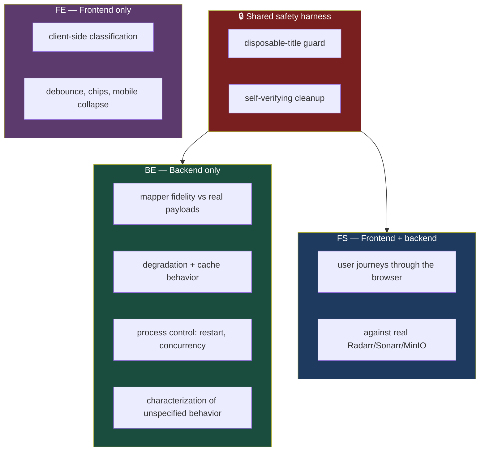
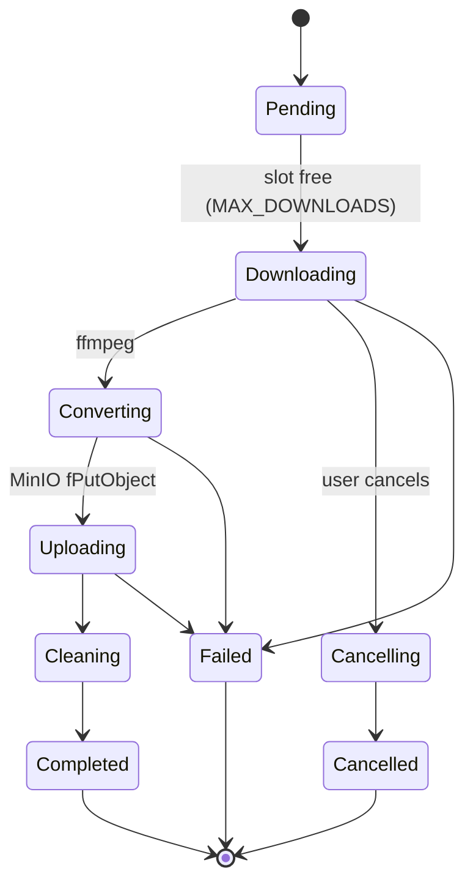
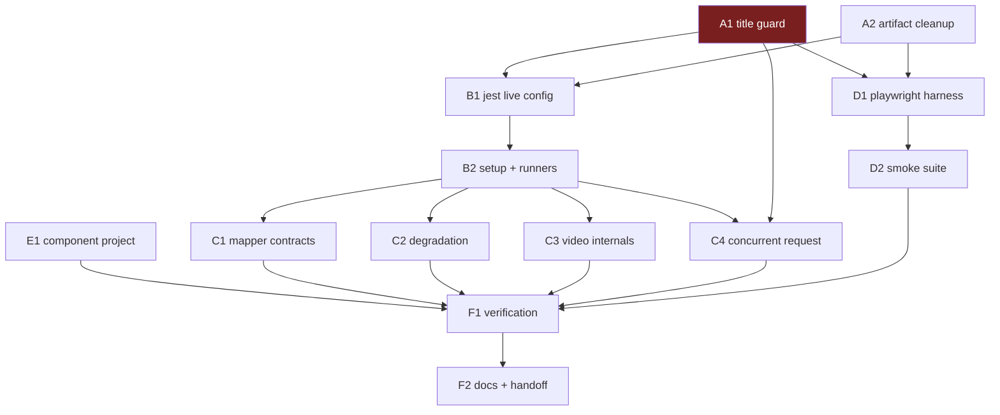

# Functional & E2E Test Plan — `apps/download`

One catalog, three harnesses. The catalog is the durable artifact — the full
functional surface from [`spec.md`](../spec.md) and
[`user-stories.md`](../user-stories.md). The harnesses are how each row gets
proven.



**The three layers, and what each answers:**

- **`BE` — backend only.** Jest, no browser, real upstreams.
  *"Do our adapters match reality?"*
- **`FS` — frontend + backend.** Playwright against the real stack.
  *"Does the user journey work?"*
- **`FE` — frontend only.** Component tests, no server.
  *"Does the UI behave without asking the server?"*

**FE is not a nice-to-have third category.** The spec requires that nav-bar
URL classification *never fires a network request* — a full-stack test can't
prove that negative nearly as cleanly as a component test can.

## ⚠️ Read this first

Both BE and FS run against your **real** Radarr/Sonarr. Both will request and
delete titles. That means one piece of code decides whether to call
`unmonitorAndDelete(deleteFiles: true)` on something you own.

> **Build the guard once, share it.** Two implementations of that decision is
> exactly the duplication you don't want.
>
> **Task A1 is the highest priority in this plan.** No test in any layer
> should request a title before it exists.

## How to read the catalog

The catalog is split into three Parts by layer, so the backend-only surface and
the full-stack surface are separately readable. Within a Part, every row is one
capability.

**Rows with no tag are buildable today.** Blocked rows carry one:

- 🚧 **FE rebuild** — the UI surface doesn't exist yet
- ⏳ **BE Phase N** — blocked on that phase of `backend.md`

## Current state — what actually exists

**Backend: Phases 0–8 are all done**, along with the media-entity refactor.
[`backend.md`](../backend.md) records the full set as complete — "Phase 8
closed the set with the audit log."

> ⚠️ **Corrected 2026-08-26 by plan
> [009](009-backend-verification-script.md).** This line previously read
> "Phases 0–2 and the media-entity refactor are done. Phases 3–8 pend."
> **Every `⏳ BE Phase N` tag in this document is therefore stale** — none of
> those surfaces is blocked any more, and rule 6 below ("Never implement a row
> tagged 🚧 or ⏳") must not be applied to them. The `⏳` tags are left in
> place rather than stripped, because which of them earn a durable test row is
> exactly the judgement plan 009's task E2 exists to make; treat each as "was
> blocked on Phase N, now buildable" until E2 rules on it.
>
> The `🚧 FE rebuild` tags are a separate question and are **not** covered by
> this correction.

**Frontend: mostly unbuilt.** `src/app` has exactly two routes:

```
src/app/page.tsx                 → home
src/app/downloads/[id]/page.tsx  → one job's status
```

Components are `Home/{DownloadForm,MediaRequestForm,MediaResultCard,
TimeRangeInput,HomeTabs}` plus `DownloadById`. The spec calls for a nav-bar
entry point on every page, a dedicated search page, three kinds of detail page,
a unified gallery, an activity page, and an admin dashboard. **None of those
exist.**

**Test infrastructure for the frontend: none.** No `@testing-library/*`, no
`jsdom`, no Playwright or Cypress anywhere in the monorepo. The repo's only
`e2e` directory (`apps/equations/__tests__/e2e`) is supertest against a Nest
app — API-level, not a browser.

### What that implies for sequencing

Most `FS` and `FE` rows are blocked by 🚧 FE rebuild. So:

- **Build the E2E harness now** — it survives the rebuild.
- **Write only a thin smoke suite** against today's UI.
- **Write the journey tests as each rebuilt surface lands**, not before.

Writing Playwright specs against `DownloadForm.tsx` when the spec moves that
entry point into a nav bar is throwaway work. The harness isn't; the catalog
isn't.

---

## Instructions for the orchestrator agent

You are orchestrating this plan. You do not implement it.

1. **Don't read or edit code yourself.** The only file you may edit is this
   plan, to check off tasks.
2. **Delegate every task to a sub-agent** — implementation, tests, and commit
   included.
3. **Sub-agents must not read this plan.** Each prompt must be self-contained:
   copy the task text, the catalog rows it implements, the relevant Context
   Pack sections, and the Definition of Done.
4. **Each sub-agent implements, tests, and commits its own task**, running
   `pnpm run lint` and `pnpm run type-check` before `/commit`.
5. **Respect the Sequencing section.** If a sub-agent fails, re-delegate with
   the failure details.
6. **Never implement a row tagged 🚧 or ⏳.** Those surfaces don't exist. A
   sub-agent that thinks it needs to build a UI or a backend capability has
   misread its task — stop and report.
7. **When done**, verify every checkbox, then report per the
   [Final report](#final-report).

### One rule specific to this plan

> **No sub-agent may execute a live or E2E suite.**
>
> Both hit production Radarr/Sonarr, download real media, and write real MinIO
> objects. They're **human checkpoints**.
>
> Sub-agents verify *statically*: type-check, lint, `pnpm test` (still passing,
> still not matching live files), `jest --listTests`, and
> `playwright test --list`.

---

## Design decisions

### Backend harness

**Why containers, not the host.** The public routes are unusable —
`radarr.lilnas.io` sits behind Traefik's `lilnas-auth` middleware, which wants
a browser SSO session, but our clients send a bare header:

```ts
// apps/download/src/media/clients.ts:19
headers: { 'X-Api-Key': env(EnvKeys.RADARR_API_KEY) }
```

No cookie, so the middleware blocks the request before Radarr sees it.
Production uses `RADARR_URL=http://radarr:7878`; matching that makes the
harness immune to container-restart IP churn.

**Why two runner services.** Video tests need binaries the base image lacks:

```ts
// download-video.service.ts:68   spawn('/usr/bin/yt-dlp', args)
// download-video.service.ts:355  bin: '/usr/bin/ffmpeg'
// download-video.service.ts:405  minioClient.fPutObject('videos', …)
```

Plus a working directory of `/download/videos`. `lilnas-node-base` is
`node:25.0.0-slim` + pnpm and nothing else. So: a plain runner for contract
tests, and a media-capable one for video internals.

**The base image must be built locally.** It's published to no registry:

```bash
./infra/base-images/build-base-images.sh   # from the repo root
```

Skip it and `docker compose run` fails trying to pull a nonexistent
`lilnas-node-base:latest`.

### E2E harness

**Playwright.** Nothing exists to extend, so this is a greenfield choice.
Playwright's trace viewer matters here specifically: an E2E failure against
real Radarr could be the DOM, the API, the mapper, or an indexer, and a trace
collapses that debugging surface.

**Run against the Docker dev stack**, not the native `lilnas dev` flow:

- Radarr/Sonarr are reachable on `lilnas_default` at their container names
- MinIO is up, so video journeys complete
- **`apps/auth` runs there** — and this one is decisive. `AdminCheckService`
  calls `AuthClient.dockerInstance` and is deliberately **fail-closed**: an
  unreachable `auth` container reads as non-admin. Under native `lilnas dev`
  the `auth` hostname doesn't resolve, so every admin assertion would silently
  pass as "not admin." Admin tests are only meaningful in Docker dev.

**Identity — use the dev fallback, not real SSO.** `resolveForwardedUser()`
already has a dev-only path, gated by two independent conditions:

```ts
// 1. NODE_ENV !== 'production'  (set to 'production' by the runtime image)
// 2. DEV_USER_EMAIL and DEV_USER_ID are both set  (.env.prod never defines them)
```

Driving a real Traefik SSO session from Playwright would add an OAuth dance to
every run for no coverage gain. Set the two dev vars instead:

- **Admin tests** use an email `apps/auth` recognizes as admin. Admin-ness
  resolves through `auth`, not a local flag, so this stays a real check rather
  than a stub.
- **Regular-user tests** use one that isn't.

**Two Playwright projects, split by blast radius:**

- **`readonly`** — parallel. Search, gallery, activity, navigation,
  detail-page rendering.
- **`mutating`** — **1 worker**. Anything that requests or deletes a title, or
  downloads a video.

Serial execution in `mutating` is the same constraint as the backend suite's
`maxWorkers: 1`: parallel workers would race each other's library.

**E2E must import `src/test-support/disposable-title.ts`** — not its own copy.

### Frontend component harness

**Jest + `@testing-library/react` + `jsdom`**, as a second Jest project inside
`apps/download`. The package already runs Jest with `ts-jest`, so this is a
`projects` entry and a `testEnvironment` override rather than a new toolchain.
Vitest would be faster but would mean two test runners in one package.

**FE tests never start a server.** If a test needs a backend, it's `FS` and
belongs in Playwright.

### Smaller decisions

- **Manual-only, both live and E2E.** Not in `pnpm test`, CI, turbo, or cron.
  A person runs them deliberately because they're expensive.
- **No confirmation env-var.** The invocation *is* the confirmation — a
  non-default filename, a separate config, a compose file excluded from
  `docker-compose.dev.yml`, and a hand-populated gitignored env file.
- **`LIVE_TEST_*` / `E2E_*` keys stay out of `src/env.ts`.** That's the
  *application's* registry; these are harness inputs the app must never read.
- **This plan adds no migrations.** A sub-agent that thinks it needs one has
  misread its task.
- **Cleanup verifies itself** in every layer — assert the object, scratch dir,
  or title is actually gone, not just that delete was called.

### Two behaviors that already exist — don't rebuild them

**`unmonitorAndDelete()` already cancels queue items.** Both services call
`getQueue([id])` then `deleteApiV3QueueById({ query: { removeFromClient: true } })`
before deleting, wrapped in `Promise.allSettled`
(`radarr.service.ts:252-287`, `sonarr.service.ts:252-287`).

**`DATABASE_PATH=:memory:` already works.** The constraint that *does* bite is
different:

```ts
// src/db/migrate.ts — resolves relative to process.cwd()
process.env.MIGRATIONS_FOLDER ?? path.resolve(process.cwd(), 'src/db/migrations')
```

⚠️ Which is why every container needs `working_dir: /source/apps/download`.

---

# Part 1 — Backend only (`BE`)

*No browser. Jest against real upstreams, or plain unit tests.*

These are the assertions a full-stack test structurally can't make: field-level
data shape, injected upstream failure, and process control.

## 1.1 Mapper & resolver fidelity

First live exercise of `toMovie()`/`toShow()` against real payloads.

- **LIB-1** — `getLibrary()` maps every real Radarr item without throwing.
  Assert the fields easiest to get wrong: `runtime` in **seconds**
  (minutes × 60), `radarrId` **`undefined` not `0`**, `genres` always an array.
- **LIB-2** — Same for Sonarr / `toShow()`. `SeriesResource.path` is the series
  *folder*, so don't assert `filePath` points at a media file.
- **LIB-3** — `resolve()` on real keys returns `degradedSources: []` and full
  `Media`, **never** the `{ id, title: id, type }` placeholder. A placeholder
  means the resolver swallowed an upstream error: that's a **failure**, not a
  pass.
- **LIB-4** — A repeat `resolve()` inside 60s is cache-served with no second
  upstream fetch; `invalidate(key)` forces a refetch.
- **LIB-11** — An empty library is a legitimate environment state. Fail with an
  explicit "library is empty" message, not a confusing assertion diff.

## 1.2 API-level behavior the UI can't reach

- **SRCH-8** — A cursor minted for one filter/sort combo is **rejected** when
  replayed against a different one.
- **SRCH-9** — A query under the 2-char threshold. Confirm whether it's
  rejected or returns empty at the API boundary, then pin it.
- **SRCH-12** — Free-text search by year, cast, or genre. Radarr's lookup drives
  this, so pin actual behavior rather than asserting a capability we don't
  control.
- **ST-3** — The queue poller diffs each tick and emits **only on change** — a
  static queue produces no frames.
- **ST-5** — A movie id on the shows route is rejected by `assertJobMediaType`,
  not returned mistyped.
- **MOV-6** — ⚠️ Two concurrent requests for the same `tmdbId`; pin the
  behavior. **The only backend test that mutates the library — it must use
  A1's guard.** It lives here rather than in E2E because two simultaneous
  POSTs are hard to trigger from a browser.

## 1.3 Video internals



- **VID-4** — ⚠️ A time range whose `end` precedes its `start`. See the note
  below.
- **VID-5** — A window extending past the video's actual duration. Pin the real
  behavior: clamp, short file, or error.
- **VID-6** — Dedupe via `videoNaturalKey`: the same URL and range reuse one
  row; the same URL with a *different* range creates a distinct one. DB-level,
  invisible from the UI.
- **VID-11** — With `MAX_DOWNLOADS` set low, extra jobs stay `Pending` and the
  queue drains in order. Needs env control.
- **VID-12** — Restart reconciliation sweeps non-terminal rows to `Failed`, so
  `jobs` never reports a status for work that can't be running. You can't
  restart the app from a browser.
- **VID-3** — A malformed time string is rejected by `TIME_REGEX` before any
  process spawns. *(Unit — plain `pnpm test`.)*

> **VID-4 is probably a real bug.** `TimeRangeSchema` validates each field
> independently and never compares them:
>
> ```ts
> export const TimeRangeSchema = z.object({
>   start: z.string().regex(TIME_REGEX),
>   end: z.string().regex(TIME_REGEX),   // nothing checks end > start
> })
> ```
>
> An inverted range reaches yt-dlp untouched. The test **pins observed
> behavior and reports it** — it does not fix the validation. That's a separate
> change, not something to slip into a testing plan.

## 1.4 Failure injection & degradation

**The section E2E is worst at.** Every row needs env or process control a
browser doesn't have.

- **FAIL-1** — With `RADARR_URL` pointed at a dead host, `resolve()` returns
  placeholder media with `degradedSources: ['movie']` and **does not throw**.
- **FAIL-2** — An invalid API key degrades the same way: not a crash, and not a
  silent empty library.
- **FAIL-3** — The failure TTL (10s) really is shorter than the success TTL
  (60s), so a recovered upstream is picked up quickly.
- **FAIL-4** — With MinIO unreachable, a video job fails at `Uploading` rather
  than reporting `Completed` with no object.
- **FAIL-5** — A missing or broken yt-dlp binary produces a useful job error,
  not an unhandled spawn rejection.
- **FAIL-6** — `checkIntegrity()` passes on a freshly migrated DB, and
  migrations resolve from the container's `working_dir`.
- **FAIL-7** — Two concurrent requests for the same media id don't violate the
  natural-key uniqueness constraint.

> FAIL-1 and FAIL-2 induce failure by **misconfiguring their own module
> instance** — never by breaking the real Radarr/Sonarr.

## 1.5 Safety harness unit tests

- **MOV-2** — `assertNotInLibrary` aborts when the fixture is already in the
  library; `removeAndVerifyGone` re-checks and throws if the title is still
  present.
- **ART-1** — Artifact cleanup is **scoped to keys the run created** and
  refuses a bucket-wide wildcard.

---

# Part 2 — Frontend + backend (`FS`)

*Playwright, real browser, real stack.*

Every row is a user journey. Rows tagged 🚧 are catalogued against `spec.md`,
but the surface doesn't exist yet.

## 2.1 Entry point & navigation

*Core Concepts · stories 9–15, 18, 32*

- **NAV-1** — The nav-bar field is present on **every** page: home, search,
  gallery, detail, activity, admin. 🚧 *FE rebuild*
- **NAV-9** — Clicking the inline Download button navigates to the video detail
  page, and the download starts *there*. 🚧 *FE rebuild*
- **NAV-10** — Clicking Search (or pressing Enter) navigates to the dedicated
  search page with results already loading. 🚧 *FE rebuild*
- **NAVM-1** — A gallery card opens its detail page; it does not download
  directly. 🚧 *FE rebuild*
- **NAVM-2** — A search result opens its detail page whether or not the title
  has been downloaded. 🚧 *FE rebuild*
- **NAVM-3** — A homepage Recently Added item opens its detail page, same as a
  gallery item. 🚧 *FE rebuild*

## 2.2 Discovery journeys

*Spec §3 · stories 26–31*

- **SRCH-1** — Movie search renders mapped results with title and type tag.
  🚧 *FE rebuild*
- **SRCH-2** — Show search likewise. 🚧 *FE rebuild*
- **SRCH-3** — Results interleave movies and shows in one list, each row
  type-tagged, in Radarr/Sonarr's own ranking. 🚧 *FE rebuild*
- **SRCH-4** — A no-match query renders "No matches for '<query>'" — a plain
  state, **not** an error. 🚧 *FE rebuild*
- **SRCH-6** — The release-year range filter narrows the rendered set.
  🚧 *FE rebuild*
- **SRCH-7** — Sorting by title, release date, or relevance reorders the
  rendered set. 🚧 *FE rebuild*
- **SRCH-10** — Unicode, punctuation, whitespace-only, and very long queries
  render cleanly rather than erroring. 🚧 *FE rebuild*
- **SRCH-11** — A title already in the library still appears, and its detail
  page shows the Watch/Delete state rather than Download. 🚧 *FE rebuild*

## 2.3 Detail pages

*Spec §4, §5, §8 · stories 20, 34–35, 42, 56–58*

- **DET-1** — Video detail shows cover art, title, author, and a link back to
  the source post — with the download **already under way** on arrival.
  🚧 *FE rebuild*
- **DET-2** — An unrecognized link renders the "not recognized" state, pointing
  back at the nav bar. 🚧 *FE rebuild*
- **DET-3** — Movie detail shows trailer, cover art, cast, and metadata, plus
  the correct action state — Download vs. Watch/Delete. 🚧 *FE rebuild*
- **DET-4** — Show detail renders seasons and the episodes within each.
  🚧 *FE rebuild*
- **DET-5** — Download and delete actions appear **only** on detail pages,
  never on a list or card surface. 🚧 *FE rebuild*

## 2.4 Video download journey

*Spec §2 · stories 19–25*

- **VID-1** — Paste → download → `Completed`, object in MinIO, metadata
  rendered. *(smoke-testable today)*
- **VID-2** — A time-window download produces a file matching the requested
  window. *(smoke-testable today)*
- **VID-14** — Progress updates render live over the WebSocket, ending on a
  terminal state. *(smoke-testable today)*
- **VID-7** — An unrecognized URL surfaces the "not recognized" state with no
  orphaned scratch dir. 🚧 *FE rebuild*
- **VID-8** — A private, removed, or geo-blocked video surfaces a useful
  failure message. 🚧 *FE rebuild*
- **VID-9** — Cancel mid-download stops it, and the UI reflects `Cancelled`.
  🚧 *FE rebuild*
- **VID-10** — Cancelling an already-finished job is a clean no-op in the UI.
  🚧 *FE rebuild*
- **VID-13** — Hidden attribution: a regular viewer sees it anonymized, an
  admin sees the true requester. 🚧 *FE rebuild*
- **PLAY-1** — A finished video plays in-app. 🚧 *FE rebuild*
- **VID-15** — Pause and resume without losing progress. ⏳ *BE Phase 5*
- **VID-16** — Save a finished video to your own device. ⏳ *BE Phase 7*

## 2.5 Movie & show request journeys

*Spec §4, §5 · stories 36–44*

⚠️ **Every row here mutates your real library and must use A1's guard.**

- **MOV-1** — Requesting a movie persists a job and renders real Radarr
  metadata. 🚧 *FE rebuild*
- **MOV-3** — The detail page and the job list agree on the title.
  🚧 *FE rebuild*
- **MOV-4** — Status moves forward: `Requested` → `Searching` → `Downloading`
  → `Importing`/`Completed`. **Time-boxed and tolerant** — real grabs depend on
  indexers, so assert forward movement through valid states, never a fixed
  timeline. 🚧 *FE rebuild*
- **MOV-5** — Deleting removes the title and cancels in-flight queue items.
  🚧 *FE rebuild*
- **MOV-7** — A nonexistent title fails cleanly, with no job stuck
  non-terminal. 🚧 *FE rebuild*
- **SHOW-1** — Requesting a series persists a job with real Sonarr metadata.
  🚧 *FE rebuild*
- **SHOW-2** — The series request is **whole-series** (see warning below), so
  the fixture must be a *small* show. 🚧 *FE rebuild*
- **SHOW-3** — Deleting the series removes it and cancels queue items.
  🚧 *FE rebuild*
- **MOV-8** — Browse available releases and pick one instead of Radarr's
  automatic choice. ⏳ *BE Phase 3*
- **MOV-9** — Replace a downloaded file with a different release in one flow,
  with no manual delete step. ⏳ *BE Phase 3*
- **MOV-10** — Flag a file bad; it shows an indicator and is excluded from
  auto-selection on re-download. ⏳ *BE Phase 3*
- **SHOW-4** — Request a single **season** without pulling the series.
  ⏳ *BE Phase 4*
- **SHOW-5** — Request a single **episode**. ⏳ *BE Phase 4*
- **SHOW-6** — Delete an episode, a season, or the series as distinct actions.
  ⏳ *BE Phase 4*
- **SHOW-7** — Pick a specific release for one episode. ⏳ *BE Phase 3 + 4*
- **SHOW-8** — A partially-downloaded series reports per-episode state rather
  than one series-wide status. ⏳ *BE Phase 4*

> **⚠️ The show path is the most expensive operation in the entire test surface.**
>
> ```ts
> // sonarr.service.ts:188-210
> monitor: 'all',
> searchForMissingEpisodes: true,
> searchForCutoffUnmetEpisodes: true,
> // …then fires a SeriesSearch command
> ```
>
> A search across **every season**. Between request and cleanup, Sonarr may
> genuinely grab releases into the download client.

## 2.6 Library surfaces & attribution

*Spec §1, §7, §10 · stories 4–5, 16–17, 51–55, 60–62*

- **LIB-5** — The gallery paginates with no overlap and no gap.
  🚧 *FE rebuild*
- **LIB-6** — Facets stay consistent with the unfiltered result set.
  🚧 *FE rebuild*
- **LIB-7** — Gallery filters by type, date, and uploader each narrow, and
  compose with one another. 🚧 *FE rebuild*
- **LIB-8** — The activity page shows in-progress downloads **across all
  users**. 🚧 *FE rebuild*
- **LIB-9** — History paginates terminal jobs, newest first. 🚧 *FE rebuild*
- **LIB-10** — A media detail page groups every job for that media id.
  🚧 *FE rebuild*
- **ATTR-1** — An attribution avatar renders everywhere media appears —
  gallery, activity, detail — with a tooltip naming the downloader.
  🚧 *FE rebuild*
- **ATTR-2** — A video with hidden attribution renders anonymized for a regular
  viewer. 🚧 *FE rebuild*
- **ATTR-3** — An admin sees the true requester **inline on the same page**,
  not through a separate view. 🚧 *FE rebuild*
- **ATTR-4** — Movies and shows always show their requester, and offer **no**
  hide toggle. 🚧 *FE rebuild*

## 2.7 Status & realtime

- **ST-1** — A job page renders the live job with hydrated media.
  *(smoke-testable today)*
- **ST-2** — WebSocket updates render for all three media types.
  🚧 *FE rebuild*
- **ST-4** — A terminal job stops updating. 🚧 *FE rebuild*
- **ST-6** — "Indexing…" shows until Emby picks the file up, then a Watch
  handoff. ⏳ *BE Phase 6*
- **PLAY-2** — "Watch" on a movie or show navigates to Emby. ⏳ *BE Phase 6*

## 2.8 Local downloads & admin

- **ADM-1** — An admin sees true attribution on the activity page for every
  download, including videos hidden from everyone else. 🚧 *FE rebuild*
- **LOC-1** — Save a video, movie, or show to your own device, distinct from
  the server-side download. ⏳ *BE Phase 7*
- **ADM-2** — System-wide metrics and aggregate stats. ⏳ *BE Phase 8*
- **ADM-3** — Per-user download history. ⏳ *BE Phase 8*
- **ADM-4** — The audit log captures user interactions, and stays correct for a
  non-user API caller. ⏳ *BE Phase 8*

---

# Part 3 — Frontend only (`FE`)

*Component tests. No server, no network.*

Every row here is 🚧 *FE rebuild* — the nav bar and search page don't exist
yet — so the tag is omitted for readability.

## 3.1 Nav-bar field classification

*Core Concepts, Entry-point model · stories 10, 12–14*

- **NAV-2** — Text that parses as a URL swaps the icon and reveals a compact
  Download button **inline in the pill**: no dropdown, no preview card.
- **NAV-3** — A bare `host/path` like `youtube.com/watch?v=…` counts as a URL.
  A scheme isn't required; `https://` is assumed.
- **NAV-4** — A URL-shaped string that still fails to parse a host is treated as
  a **search**, not a link.
- **NAV-5** — ⚠️ **Classification fires no network request.** The spec makes
  this client-side-only, so assert zero fetches originate from the field.
- **NAV-6** — Non-URL text clearing 2+ characters reveals a compact Search
  button inline, the same treatment as Download.
- **NAV-7** — Pressing Enter does the same thing as clicking Search.
- **NAV-8** — The field does **not** navigate on every keystroke — no yanking
  the user to a new page mid-type.
- **NAV-11** — On a small screen the field collapses to a tappable icon; tapping
  expands it full-width; closing it, or a redirect firing, hands the bar back.
- **NAV-12** — On desktop the field is inline at all times: no collapse, no tap
  required.

## 3.2 Search page UI

*Spec §3 · story 33*

- **SUI-1** — Search is debounced ~300ms.
- **SUI-2** — Nothing searches below 2 characters.
- **SUI-3** — Active genre and release-date filters render as **removable
  chips**.
- **SUI-4** — A single control clears all chips at once.
- **SUI-5** — Chips are visible without reopening the filter panel.

## 3.3 Structural guarantees

*Core Concepts, Navigation model*

- **NAVM-4** — **No list or card surface exposes download, delete, replace, or
  flag actions.** A structural assertion across gallery cards, search rows, and
  Recently Added.
- **NAVM-5** — The nav-bar's video Download button only *navigates*; the
  download itself starts on the detail page.

---

## Shared Context Pack

> Copy the relevant parts into every sub-agent prompt. These are pointers —
> sub-agents verify against current code.

### Conventions

- pnpm workspace + Turbo. This plan touches `apps/download` plus one docs file.
- **Lint is two checks** — `eslint src` *and* `prettier -c src`. Both must
  pass.
- Tests live in `__tests__/` next to the code. Support files go in
  `__tests__/helpers/` or `fixtures/`, which `testMatch` excludes.
- Avoid `any`.

### Jest config to mirror

```js
// apps/download/jest.config.js — copied verbatim into jest.live.config.js
preset: 'ts-jest',
testEnvironment: 'node',
roots: ['<rootDir>/src'],
moduleNameMapper: {
  '^src/(.*)$': '<rootDir>/src/$1',
  '^@lilnas/media/(.*)$': '<rootDir>/../../packages/media/src/$1',
  '^@lilnas/utils/(.*)$': '<rootDir>/../../packages/utils/src/$1',
},
transformIgnorePatterns: ['/node_modules/(?!(@lilnas|nanoid|lru-cache)/)'],
```

### Mocking — and how live tests invert it

`src/media/__tests__/radarr.service.test.ts` is the reference:

```ts
jest.mock('@lilnas/media/radarr', () => ({ … }))   // BEFORE any import
const mockGetApiV3Movie = getApiV3Movie as jest.Mock
await Test.createTestingModule({
  providers: [RadarrService, { provide: RADARR_CLIENT, useValue: {} }],
}).compile()
jest.spyOn(Logger.prototype, 'log').mockImplementation()
```

**BE live tests do the opposite** — no `jest.mock` of `@lilnas/media/*`, no
stubbed yt-dlp or MinIO, real providers throughout.

### Test DB helpers

```ts
// src/db/__tests__/test-utils.ts
createTestDb(): TestDb            // raw in-memory sqlite + drizzle, migrated
createTestDbService(): DbService  // ← the live setup module uses THIS
```

`createTestDbService()` sets `DATABASE_PATH=':memory:'`, runs migrations, then
restores the previous env value — using `delete` rather than assignment when it
was `undefined`, since Node stringifies env assignments. Follow that discipline
anywhere you touch `process.env`.

### Types & contracts

- Zod schemas in `packages/utils/src/download/schema.ts`.
- `Media` is a discriminated union on `type`. `DownloadJob` nests it at `media`
  and is simultaneously the domain type, the REST body, **and** the WebSocket
  frame payload.
- `Media.runtime` is **seconds** — both upstreams report minutes; the mappers
  multiply by 60.
- `DownloadJobStatus`: `Cancelled`, `Cancelling`, `Cleaning`, `Completed`,
  `Converting`, `Downloading`, `Failed`, `Importing`, `Paused`, `Pausing`,
  `Pending`, `Requested`, `Searching`, `Uploading`.

  > ⚠️ **Corrected 2026-08-26 by plan
  > [009](009-backend-verification-script.md).** This line previously ended
  > "**No `Paused`** — that's Phase 5." Both `Paused` and `Pausing` exist
  > today (`packages/utils/src/download/schema.ts:29,32`); Phase 5 shipped.
  > Neither is terminal — `TERMINAL_DOWNLOAD_JOB_STATUSES`
  > (`packages/utils/src/download/types.ts:56`) is exactly
  > `{Cancelled, Completed, Failed}`, so a test that waits for a job to settle
  > must not treat a paused job as finished.

### Backend services

**Media:**

- `media/clients.ts` — `RADARR_CLIENT`/`SONARR_CLIENT` symbols plus the real
  factory providers the live module must use.
- `media/radarr.service.ts` — `toMovie()`, `search`, `getLibrary`,
  `lookupByTmdbId`, `requestMovie`, `getQueue`, **`unmonitorAndDelete`**.
- `media/sonarr.service.ts` — same shape with `toShow()`, `requestShow`,
  `lookupByTvdbId`.
- `media/media-resolver.service.ts` — `resolve(keys)` →
  `{ degradedSources, media }`. Whole-library cache, **60s success / 10s
  failure TTL**. Returns a placeholder on throw and **never propagates an
  error**.
- `media/discovery.service.ts` — `/discover`: year filter → facets → genre
  filter → sort. Cursor guarded by a filter key (SRCH-8).
- `media/media-poller.service.ts` — polls queues, diffs snapshots, emits only
  on change (ST-3).
- `media/media.module.ts` — ⚠️ deliberate `forwardRef(() => DownloadModule)`
  cycle.

**Download:**

- `download/download-video.service.ts` — the yt-dlp pipeline. Hardcoded
  `/usr/bin/yt-dlp` and `/usr/bin/ffmpeg`, workdir `/download/videos`, stderr
  capped at 8000 chars, `fPutObject('videos', …)`.
- `download/download-scheduler.service.ts` — concurrency gate on
  `MAX_DOWNLOADS`; finalizes jobs to `Completed`/`Failed`.
- `download/job-query.service.ts` — `listActivity`, `listHistory`,
  `listJobsForMedia`, `listGallery`, `getGalleryFacets`.
- `download/attribution.ts` — `projectJobForViewer(job, isAdmin)` nulls
  `requester` but **preserves `hiddenAttribution`**.
- `db/reconcile-interrupted-jobs.ts` — sweeps non-terminal rows to `failed` on
  boot (VID-12).

### Identity & admin — what E2E needs

```ts
// src/auth/forwarded-user.ts
getForwardedUser(req)  // reads x-forwarded-user / x-forwarded-user-id
// Dev fallback gated by BOTH:
//   NODE_ENV !== 'production'  AND  DEV_USER_EMAIL + DEV_USER_ID both set
```

`AdminCheckService` calls `AuthClient.dockerInstance` and is **fail-closed**:
an unreachable `auth` container is treated as non-admin. ⚠️ Admin assertions
silently pass as "not admin" if `auth` isn't running, which is why E2E targets
the Docker dev stack.

### Frontend — what exists today

```
src/app/page.tsx                  → home
src/app/downloads/[id]/page.tsx   → one job's status

src/components/Home/DownloadForm.tsx       MediaRequestForm.tsx
src/components/Home/MediaResultCard.tsx    TimeRangeInput.tsx
src/components/Home/HomeTabs.tsx           Home.tsx
src/components/DownloadById.tsx  Layout.tsx  Provider.tsx
src/components/use-download-job-socket.ts
src/store/form.ts   src/lib/download-client.ts
```

**No nav bar, no search page, no gallery, no movie/show detail pages, no
activity page, no admin dashboard.** No `@testing-library/*`, no `jsdom`, no
Playwright. The only existing frontend test is
`src/components/__tests__/use-download-job-socket.test.ts`.

### Env keys

```
# app
DATABASE_PATH  MAX_DOWNLOADS  DOWNLOAD_POLL_DURATION_MS  DOWNLOAD_POLL_RETRIES
RADARR_URL  RADARR_API_KEY  SONARR_URL  SONARR_API_KEY
MINIO_HOST  MINIO_PORT  MINIO_ACCESS_KEY  MINIO_SECRET_KEY  MINIO_PUBLIC_URL
DEV_USER_EMAIL  DEV_USER_ID        # dev-only identity fallback

# harness-only — NEVER added to src/env.ts
LIVE_TEST_SHORT_VIDEO_URL  LIVE_TEST_VIDEO_URL
E2E_BASE_URL  E2E_ADMIN_EMAIL  E2E_USER_EMAIL
E2E_MOVIE_TMDB_ID  E2E_SHOW_TVDB_ID
```

### Generated SDK gotchas (`@lilnas/media`)

Every call returns a result envelope unwrapped via `unwrapSdkResult(result,
label)`. **Live tests should let these throw.** Fields that bite:

- `MovieResource.id` — returned as **`0`, not absent**, for a non-library
  lookup hit. That's why the mappers use `|| undefined`.
- Poster URL is `.images[].url` on library items but `.remoteUrl` on add
  responses.
- Release date: first present of `releaseDate`, `inCinemas`, `digitalRelease`,
  `physicalRelease`.
- `SeriesResource.path` is the series **folder**, not a per-episode file.
- `QueueResource.id` is nullable — filter on `item.id != null` first.

### 🔒 Security note

While researching reachability, `docker inspect lilnas-download-1` printed the
**real `RADARR_API_KEY` and `SONARR_API_KEY`** into an assistant transcript.
Not intentional, and not a deliberate hand-over by the user. The user was
offered a rotation and chose to proceed with the existing keys.

- Those keys are the same ones live in production, and this repo's memory
  separately records a confirmed RCE/credential-probing incident on
  `download.lilnas.io` (2026-07-14, remediation unknown). **Recommendation:
  rotate before the first real run** — this plan copies them into *two* new
  files on disk (`.env.live-test` and the E2E env), the cheapest moment to
  rotate they'll ever have.
- `.gitignore:2-4` covers `.env.*` with `.env.*.example` excepted.
- **Sub-agents must never create the real env files** — only `*.example`
  templates — and must never write a real key into any committed file.

### Definition of Done

*Include verbatim in every delegation.*

> Done means: code implemented; unit tests written/updated per the package's
> `__tests__` conventions and passing; `pnpm run lint` and
> `pnpm run type-check` clean; committed via `/commit`. Report back: files
> changed, exported names, test summary, commit hash(es).

**Addendum for harness tasks** — live and E2E files aren't executed by
`pnpm test` by design, so "tests passing" means:

1. `pnpm test` still passes with the **same test-file count** as before
2. `pnpm run type-check` covers the new files
3. `jest --config jest.live.config.js --listTests` / `playwright test --list`
   lists exactly the intended files

❌ Do **not** run `pnpm run test:live` or `pnpm run test:e2e`.

---

## Task List

### Group A — Shared safety harness *(blocks everything that mutates)*

- [ ] **A1. Disposable-title guard and cleanup script** — *implements MOV-2*

  **Files:** create `src/test-support/disposable-title.ts`,
  `src/test-support/cleanup-titles.ts`,
  `src/__tests__/disposable-title.spec.ts`; edit `package.json`.

  > **Note the location.** `src/test-support/`, **not**
  > `src/__live-tests__/` — both the BE suite and Playwright import it.

  ```ts
  findInLibrary(opts): Promise<Movie | Show | undefined>   // the other two build on this
  assertNotInLibrary(opts): Promise<void>   // THROWS if present, names the title,
                                            // explains cleanup would delete it + files
  removeAndVerifyGone(opts): Promise<void>  // unmonitorAndDelete, then re-fetch and
                                            // throw if still there
  ```

  **Build:**
  - Parameterize by `DownloadType` — **don't write movie and show twins**
  - `unmonitorAndDelete` already cancels queue items. Don't reimplement that.
  - `cleanup-titles.ts` is a standalone script: reads the fixture ids, removes
    each one present, logs what it removed, exits non-zero on failure
  - Add `"test:cleanup-titles"` to scripts — report which runner you used

  **Edge cases:**
  - An absent id is a **no-op success**, not an error — that's the normal state
    after a clean run
  - A title present with a null `radarrId`/`sonarrId` should report clearly,
    not throw a type error

  **Tests:** a normal spec with **stubbed** services: absent → resolves;
  present → throws naming the title; `removeAndVerifyGone` calls then
  re-checks; still-present re-check → throws. **This is the most important spec
  in the plan** — cover it properly.

- [ ] **A2. Artifact cleanup helper** — *implements ART-1*

  **File:** create `src/test-support/video-artifacts.ts`.

  ```ts
  listTestObjects(prefix): Promise<string[]>
  removeTestObjects(keys): Promise<void>
  assertScratchClean(jobId): Promise<void>   // /download/videos/<jobId> is gone
  ```

  Callers use these in teardown regardless of outcome, and **assert the removal
  took**. Both BE video tests and E2E video journeys need this.

  **⚠️ Edge case:** the `videos` bucket is the **real** bucket the app uses.
  Deletion must be scoped to keys the run created — **never a bucket-wide
  sweep**.

  **Tests:** a normal spec with a stubbed MinIO client covering scoped deletion
  and the refuses-to-wildcard behavior.

### Group B — Backend live harness

- [ ] **B1. Live Jest project and script**

  **Files:** create `jest.live.config.js`; edit `jest.config.js`,
  `package.json`.

  **Build:**
  - Mirror `jest.config.js` verbatim except:
    `testMatch: ['**/__live-tests__/**/*.live.ts']`, `testTimeout: 600000`,
    `maxWorkers: 1`, no coverage
  - In `jest.config.js`, add `'!**/__live-tests__/**/*'` to `testMatch` and
    `'!src/**/__live-tests__/**/*'` to `collectCoverageFrom`
  - Add `"test:live"`. **Not** in any turbo pipeline.

  **Why those overrides:** 600s because a real video download plus a
  whole-library fetch dwarf the 10s default. `maxWorkers: 1` because these
  contend for download slots and, in MOV-6's case, the library.

  **Edge cases:** `moduleNameMapper` paths are `<rootDir>`-relative — don't
  rewrite them. The `jest.config.js` exclusions are **defense-in-depth, not a
  fix**: existing patterns already can't match a `.live.ts` file outside a
  literal `__tests__` dir.

- [ ] **B2. Live setup module, runners, and env template**

  **Files:** create `src/__live-tests__/setup.ts`,
  `docker-compose.live-test.yml`, `.env.live-test.example`,
  `src/__tests__/live-test-setup.spec.ts`.

  ```ts
  export const LiveEnvKeys = {
    LIVE_TEST_SHORT_VIDEO_URL: 'LIVE_TEST_SHORT_VIDEO_URL',
    LIVE_TEST_VIDEO_URL: 'LIVE_TEST_VIDEO_URL',   // longer — for concurrency tests
  } as const

  export function requireLiveEnv(key: string): string
  export function requireLiveEnvNumber(key: string): number

  export interface LiveTestContext {
    module; dbService; radarrService; sonarrService
    mediaResolverService; downloadService; downloadVideoService
    downloadStateService; jobQueryService; discoveryService
    close(): Promise<void>
  }

  export function createLiveTestingModule(
    overrides?: Record<string, string>,   // C2 points RADARR_URL at a dead host
  ): Promise<LiveTestContext>
  ```

  **Compose file — two services:**

  ```yaml
  # download-live-test         → contract tests, plain base image
  # download-live-test-video   → video internals, adds ffmpeg + yt-dlp + /download

  working_dir: /source/apps/download    # REQUIRED — migrations resolve from cwd
  env_file: [.env.live-test]
  networks: [lilnas_default]            # declared external: true
  volumes:
    - ../..:/source
    - /source/node_modules                      # anonymous masks
    - /source/apps/download/node_modules
    - /source/packages/media/node_modules
    - /source/packages/utils/node_modules
  ```

  **Why the masks:** `better-sqlite3` is a native addon. Without masking, the
  container's rebuild and the host's copy corrupt each other across the bind
  mount.

  **Header comment must state** that the file is deliberately **not** in
  `docker-compose.dev.yml`'s `include:`, plus the two host prerequisites —
  neither of which fails usefully on its own: the `lilnas_default` network must
  exist, and base images must be built via
  `./infra/base-images/build-base-images.sh`.

  **Edge cases:**
  - ❌ No `jest.mock('@lilnas/media/*')` in `setup.ts` — that's the whole point
  - `MediaModule`'s `forwardRef` cycle: assemble providers directly rather than
    importing the module wholesale

  **Verify:** `docker compose … config` parses and lists both services.
  ❌ Do not `up` or `run` either.

### Group C — Backend live tests

- [ ] **C1. Mapper and resolver contracts** — *§1.1 + §1.2: LIB-1…4, LIB-11,
      SRCH-8, SRCH-9, SRCH-12, ST-5*

  **File:** `src/__live-tests__/media-contracts.live.ts`. No mutations.

  **Edge cases:**
  - An empty library is a legitimate environment state (LIB-11)
  - Search terms must be **stable over time** — prefer long-established titles;
    never pin counts or ordering
  - SRCH-9 and SRCH-12 are *characterization* tests: **pin what actually
    happens and report the discrepancy** rather than forcing the assertion

- [ ] **C2. Degradation and resilience** — *§1.4: FAIL-1…3, FAIL-6, plus ST-3*

  **File:** `src/__live-tests__/degradation.live.ts`. Uses
  `createLiveTestingModule()`'s `overrides` to point `RADARR_URL` at a dead host
  and supply an invalid key.

  **Edge cases:**
  - ⚠️ Never induce failure by breaking the real Radarr/Sonarr — only by
    misconfiguring this module instance
  - Keep the TTL assertion tolerant: it checks 10s < 60s in observed behavior,
    not millisecond timing

- [ ] **C3. Video internals and failure injection** — *§1.3: VID-4…6, VID-11,
      VID-12, plus FAIL-4, FAIL-5, FAIL-7*

  **File:** `src/__live-tests__/video-internals.live.ts`.

  Everything here is deliberately **not** a user journey — Playwright owns
  those. This covers what needs env or process control.

  **Setup:**
  - Header comment: **this downloads real media and writes real MinIO objects**
  - Uses `LIVE_TEST_SHORT_VIDEO_URL` — short, small, stable, public
  - Teardown via A2's helpers, **unconditionally**

  **⚠️ Edge cases:**
  - VID-4/VID-5 are characterization tests for behavior that may be a bug. Pin
    what happens and **report it — do not fix the validation** here
  - VID-12 constructs rows in a non-terminal status and re-runs
    `reconcileInterruptedJobs`; it does **not** restart a process

- [ ] **C4. Concurrent-request characterization** — *MOV-6*

  **File:** `src/__live-tests__/concurrent-request.live.ts`.

  ⚠️ **The only backend test that mutates the library.** It must:
  - `assertNotInLibrary()` in `beforeAll` and abort the file if present
  - `removeAndVerifyGone()` in `afterAll`, **regardless of outcome**
  - Use a fixture title you don't intend to watch

  Kept separate from C1–C3 so the "backend tests don't mutate" property holds
  for everything else, and so this one file can be skipped independently.

### Group D — E2E harness

- [ ] **D1. Playwright setup and fixtures**

  **Files:** create `playwright.config.ts`, `e2e/fixtures/`,
  `e2e/.env.example`; edit `package.json`.

  **Two projects, split by blast radius:**

  ```ts
  projects: [
    { name: 'readonly', /* parallel */ },
    { name: 'mutating', workers: 1 },   // requests/deletes titles, downloads video
  ]
  ```

  **Fixtures to provide:**
  - `asUser` / `asAdmin` — set `DEV_USER_EMAIL`/`DEV_USER_ID` for the target
    identity. **Admin-ness resolves through `apps/auth`, not a local flag**, so
    `asAdmin` uses an email `auth` recognizes
  - `disposableTitle` — wraps A1's guard: pre-flight assert, yield, then
    `removeAndVerifyGone` in teardown. **Any spec that requests a title must
    take this fixture**
  - `videoArtifacts` — wraps A2's helpers for the same lifecycle

  **Target the Docker dev stack**, not native `lilnas dev` — see the design
  decision. Document `E2E_BASE_URL` accordingly.

  **⚠️ Edge cases:**
  - `AdminCheckService` is **fail-closed**: if `auth` is unreachable, every
    admin assertion silently passes as "not admin." The `asAdmin` fixture must
    **verify it actually got admin** before yielding, and fail loudly if not
  - Never write real API keys into `e2e/.env.example`

  **Verify:** `playwright test --list` runs cleanly. ❌ Do not execute.

- [ ] **D2. E2E smoke suite against today's UI** — *VID-1, VID-2, VID-14, ST-1*

  **File:** `e2e/smoke.spec.ts`.

  Deliberately thin. Covers only what exists today: the home page's download
  form, a time-window download, and live progress on `/downloads/[id]`. Uses
  the `videoArtifacts` fixture for teardown.

  > **Why so small:** the spec moves the entry point into a nav bar and adds
  > detail pages. Specs written against `DownloadForm.tsx` are throwaway. The
  > *harness* survives the rebuild; these specs mostly won't.

### Group E — Frontend component harness

- [ ] **E1. Component test project**

  **Files:** edit `jest.config.js` (or add `jest.components.config.js`); add
  `@testing-library/react`, `@testing-library/user-event`,
  `jest-environment-jsdom`.

  Add a Jest `projects` entry with `testEnvironment: 'jsdom'` scoped to
  `**/__tests__/**/*.component.test.tsx`, so it runs inside the normal
  `pnpm test`. Keep the existing node-environment project unchanged.

  **Why a project rather than a new runner:** the package already runs Jest with
  `ts-jest`; Vitest would mean two test runners in one package.

  **⚠️ Edge case:** the existing `use-download-job-socket.test.ts` runs in the
  node environment today. Don't move it — verify the `projects` split leaves it
  matched by exactly one project.

  **Verify:** `pnpm test` runs both projects and reports the previous count plus
  the new ones.

### Group F — Verification and docs

- [ ] **F1. Full-repo verification sweep**

  From the repo root, confirm clean: `pnpm run build`, `pnpm run lint`,
  `pnpm run type-check`, `pnpm test`.

  Then confirm isolation holds:
  - `apps/download`'s `pnpm test` count = before + the new normal specs from
    A1, A2, B2, E1 — and **no `.live.ts` or `e2e/` files**
  - `jest --config jest.live.config.js --listTests` lists exactly the **four**
    live files
  - `playwright test --list` lists exactly the smoke spec
  - `docker-compose.dev.yml` and `docker-compose.yml` don't reference
    `docker-compose.live-test.yml`

- [ ] **F2. Documentation and handoff**

  **Files:** `docs/features/download/backend.md`, this plan.

  In `backend.md`'s Verification section, describe **both** suites: what each
  covers, that both are manual-only, their invocations, prerequisites (populated
  env files, existing `lilnas_default` network, locally-built base images,
  Docker dev stack up for E2E), and the cleanup escape hatches.

  **Also write the frontend-rebuild handoff**, the main forward-facing
  deliverable:
  - Point the frontend rebuild at Parts 2 and 3 as its acceptance criteria
  - State that any spec requesting a title **must** use the `disposableTitle`
    fixture, never its own copy
  - Add a pointer from each pending backend phase to the catalog rows it
    unblocks

  Then record what was implemented vs deferred, and every characterization
  result that differed from the catalog's expectation (**VID-4 especially**).

---

## Sequencing



### Waves

1. **A1, A2** — ⚠️ both edit `package.json`, so don't run them concurrently on
   a shared index.
2. **B1, D1, E1** — three independent harnesses. D1 and E1 both touch
   dependencies; serialize those two.
3. **B2, D2**
4. **C1, C2, C3, C4** — disjoint files.
5. **F1 → F2** — strictly sequential.

**The real constraint on waves 2–4 is commit isolation, not file isolation.**
Sub-agents running `/commit` on the same branch concurrently will interleave
staging. Use separate worktrees, or serialize the `/commit` step.

### Critical path

**A1 → B1 → B2 → C4 → F1 → F2**

A1 leads because **every mutating test in every layer is blocked on it**.
Everything else can slip; that one shouldn't.

### Human checkpoints

Five things the orchestrator cannot perform and must not delegate:

1. **After B2** — build the base images, then run **each** live container once.
2. **After C1, C2** — the first real read-only run. Cheap and safe; the natural
   first confidence check.
3. **After C3** — the first real video run. Downloads media, writes to the real
   MinIO bucket.
4. **After C4** — the first real **mutating** run. Needs a disposable title id,
   and should be preceded by the key rotation.
5. **After D2** — the first real E2E run against the Docker dev stack.

Checkpoint 1 is checking three things:

- `radarr`/`sonarr` DNS resolves from inside `lilnas_default`
- `pnpm install` resolves a `better-sqlite3` **prebuild** for node 25 rather
  than compiling on an image with no toolchain, and the video runner's
  ffmpeg/yt-dlp land at the hardcoded `/usr/bin` paths
- the **host's** `node_modules` still works afterward. A `NODE_MODULE_VERSION`
  mismatch means the masking list is incomplete — **extend it rather than
  removing it**

After checkpoints 3 and 5, verify A2's cleanup left nothing behind before
running again.

---

## Final report

1. **Per-task outcome** — status, files changed, exported names, commit hashes.
2. **Catalog coverage** — which unblocked rows are implemented, per layer
   (BE / FS / FE / Unit), and which were dropped and why.
3. **Test results** — per-package plus the repo-wide sweep from F1, including
   isolation evidence: file count before/after, and `--listTests` output for
   both harnesses.
4. **Characterization findings** — for SRCH-9, SRCH-12, VID-4, VID-5, MOV-6:
   what the behavior turned out to be, and whether it's a bug worth filing.
   **VID-4 is the most likely real gap.**
5. **Handoff status** — is `src/test-support/disposable-title.ts` in place and
   documented as the required guard for *both* harnesses? Are Parts 2 and 3
   referenced as acceptance criteria for the frontend rebuild?
6. **Deferred** — the five human checkpoints, the key rotation, every row tagged
   🚧 or ⏳.
7. **Open questions** — especially anything touching the guard, either cleanup
   path, or the `asAdmin` fixture's fail-closed verification.
