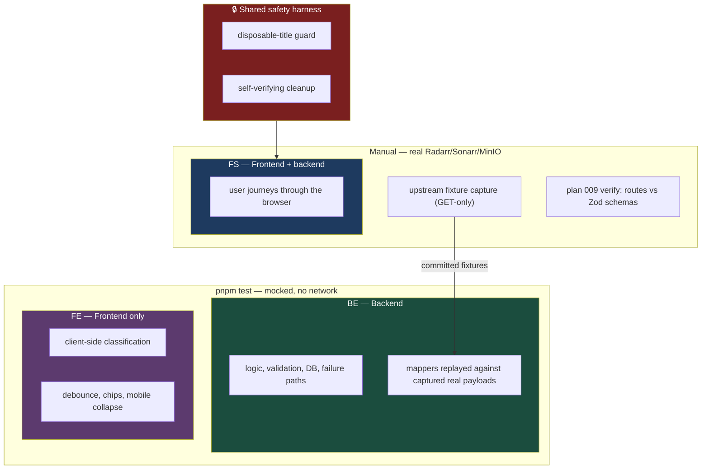
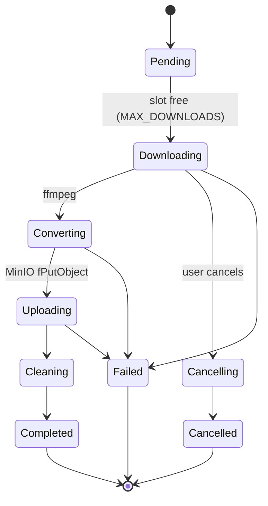
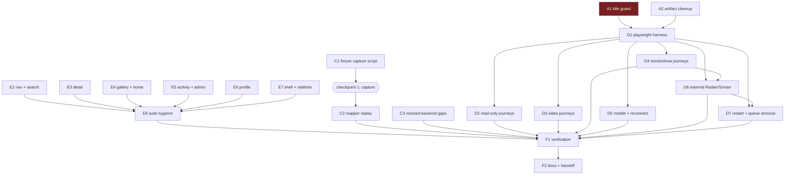

# Functional & E2E Test Plan — `apps/download`

One catalog, three harnesses. The catalog is the durable artifact — the full
functional surface from [`spec.md`](../spec.md) and
[`user-stories.md`](../user-stories.md). The harnesses are how each row gets
proven.


```mermaid
graph TB
  subgraph MOCKED["pnpm test — mocked, no network"]
    subgraph BE["BE — Backend"]
      U1["logic, validation, DB, failure paths"]
      U2["mappers replayed against captured real payloads"]
    end
    subgraph FE["FE — Frontend only"]
      E1["client-side classification"]
      E2["debounce, chips, mobile collapse"]
    end
  end
  subgraph REAL["Manual — real Radarr/Sonarr/MinIO"]
    C["upstream fixture capture (GET-only)"]
    V["plan 009 verify: routes vs Zod schemas"]
    subgraph FS["FS — Frontend + backend"]
      F1["user journeys through the browser"]
    end
  end
  subgraph SHARED["🔒 Shared safety harness"]
    G1["disposable-title guard"]
    G2["self-verifying cleanup"]
  end
  C -- "committed fixtures" --> U2
  SHARED --> FS

  style SHARED fill:#7a1f1f,color:#fff
  style BE fill:#1b4d3e,color:#fff
  style FS fill:#1e3a5f,color:#fff
  style FE fill:#5c3a6e,color:#fff
```

**The layers, and what each answers:**

- **`BE` — backend, mocked.** Jest in `pnpm test`, no network. Upstream
  responses come from fixtures captured once from the real Radarr/Sonarr and
  committed. *"Is our logic right, and do our mappers handle what the
  upstreams really send?"*
- **`FE` — frontend only.** Component tests, no server.
  *"Does the UI behave without asking the server?"*
- **Live contract check — plan [009](009-backend-verification-script.md)'s
  `scripts/verify/`.** Manual, against the running backend. *"Does every
  route answer in the shape the frontend expects?"*
- **`FS` — frontend + backend.** Playwright against the real stack, manual.
  *"Does the user journey work?"*

> ⚠️ **Revised 2026-09-28 — there is no live Jest tier.** Part 1 used to run
> Jest against the real Radarr/Sonarr from a dedicated Docker runner (Groups
> B and C). Most of its rows never needed a real upstream: a dead host, a
> bad key, a cache TTL, a migration and a restart sweep are all provable
> with mocks, fake timers and the in-memory DB, and several were already
> covered by existing specs. The rows that did need reality now live here:
>
> - **Mapper fidelity (LIB-1…3)** — mocked specs replaying real payloads
>   captured once into committed fixtures (tasks C1, C2).
> - **Route contracts** — plan 009's `scripts/verify/`, which already exists.
> - **SRCH-12, MOV-6, VID-5** — Playwright (D2, D4, D3), which already runs
>   against the real stack. MOV-6's two simultaneous requests are one
>   `Promise.all` over Playwright's `request` fixture.
>
> Group B is superseded. `jest.live.config.js`, `src/__live-tests__/`,
> `docker-compose.live-test.yml` and `.env.live-test` are no longer built.
> **The rule from here on: a Jest spec never touches the network. Anything
> that needs a real upstream is a Playwright spec, a fixture capture, or a
> plan 009 run.**

**FE is not a nice-to-have third category.** The spec requires that nav-bar
URL classification *never fires a network request* — a full-stack test can't
prove that negative nearly as cleanly as a component test can.

## ⚠️ Read this first

FS runs against your **real** Radarr/Sonarr and will request and delete
titles. BE is mocked and never does. That means one piece of code decides
whether to call `unmonitorAndDelete(deleteFiles: true)` on something you own.

> **Build the guard once, share it.** Two implementations of that decision is
> exactly the duplication you don't want.
>
> **Task A1 is the highest priority in this plan.** No test in any layer
> should request a title before it exists.

## How to read the catalog

The catalog is split into three Parts by layer, so the backend-only surface and
the full-stack surface are separately readable. Within a Part, every row is one
capability.

**Rows with no tag are buildable today.** Blocked rows carry one:

- 🚧 **FE rebuild** — the UI surface doesn't exist yet *(stale since
  2026-09-26 — see the correction below)*
- ⏳ **BE Phase N** — blocked on that phase of `backend.md` *(stale since
  2026-08-26)*

Part 3 rows (added 2026-09-26) carry a coverage marker instead:

- ✅ **covered** — a spec in `apps/download/src/**/__tests__/` already asserts
  this. Listed so the catalog is complete; no task writes it.
- 🔍 **verify** — a spec for the component exists but may not pin this exact
  edge. The task reads the spec first and extends it only if the case is
  missing.
- 🆕 **gap** — nothing tests this. The task writes it.
- 📌 **characterization** — the row pins behavior that is probably a UX gap or
  an inconsistency. Pin what happens, **report it in the final report, do not
  fix it here.**

## Current state — what actually exists

**Backend: Phases 0–8 are all done**, along with the media-entity refactor.
[`backend.md`](../backend.md) records the full set as complete — "Phase 8
closed the set with the audit log."

> ⚠️ **Corrected 2026-08-26 by plan
> [009](009-backend-verification-script.md).** This line previously read
> "Phases 0–2 and the media-entity refactor are done. Phases 3–8 pend."
> **Every `⏳ BE Phase N` tag in this document is therefore stale** — none of
> those surfaces is blocked any more, and rule 6 below ("Never implement a row
> tagged 🚧 or ⏳") must not be applied to them. The `⏳` tags are left in
> place rather than stripped, because which of them earn a durable test row is
> exactly the judgement plan 009's task E2 exists to make; treat each as "was
> blocked on Phase N, now buildable" until E2 rules on it.
>
> The `🚧 FE rebuild` tags are a separate question and are **not** covered by
> this correction.

> ⚠️ **Corrected 2026-09-26.** This section previously read "Frontend: mostly
> unbuilt … Test infrastructure for the frontend: none." Both are stale.
> **Every `🚧 FE rebuild` tag in this document is stale too** — plan
> [013](013-frontend-rewrite.md) shipped every surface in `spec.md` between
> 2026-09-14 and 2026-09-24 (all tasks checked; human checkpoints 3–4 open).
> The tags are left in place, like the `⏳` ones, so the original catalog
> stays readable. Part 3 below is **rewritten** rather than annotated because
> it was written against the spec, not the code, and now needs to say which
> rows already have a spec and which don't.
>
> Nothing in this plan's task list was ever executed: `src/test-support/`,
> `src/__live-tests__/`, `playwright.config.ts` and `e2e/` do not exist. The
> backend half was superseded by plan [009](009-backend-verification-script.md)'s
> `scripts/verify/` harness. Plan [023](023-full-verification-pass.md) (0/40)
> chose **throwaway** `playwright-core` scripts over a committed suite; its
> environment section is the reference for the E2E harness in Group D.

**Frontend: fully built.** Nine screens, every one an async Server Component
that fetches and hands data to client parts:

```
/            (home)          /search?q=      /gallery      /activity
/admin       /profile[?user=]                /movies/[tmdbId]
/shows/[tvdbId]              /videos/[videoId]
```

Client-side: `components/{shell,search,detail,gallery,activity,admin,profile,
home,live,ui}`, `lib/{url-classify,use-job-events,use-live-media,…}`,
`app/actions/*.ts` server actions, and `middleware.ts` (rewrites malformed
detail ids to a real 404).

**Test infrastructure for the frontend: component harness exists, browser
harness doesn't.**

- `jest.config.js` runs two projects: `node` for `*.ts` specs and `jsdom`
  (`@testing-library/react` + `user-event` + `jest-dom`) for `*.tsx`. This is
  what task E1 was going to build; plan 013 · A4 built it.
- **146 spec files, ~3,300 tests** in `apps/download`, all against mocked
  server actions and an injected fake WebSocket. Coverage is broad but uneven
  — see the ✅ / 🆕 markers in Part 3.
- **No Playwright, no `e2e/`.** `@playwright/test@1.54.1` and
  `playwright-core@1.54.1` are already in the pnpm store (transitive), and
  system Chrome is at `/usr/bin/google-chrome-stable`.

### What that implies for sequencing

- **Part 3 is now mostly gap-filling**, not greenfield. Tasks E2–E8 write only
  the 🆕 rows and confirm the 🔍 ones.
- **Part 2 is buildable end to end.** Nothing is blocked on a rebuild; the
  blockers are the harness (D1) and the disposable-title guard (A1).
- **The four states plan 013 never saw live** — empty library, degraded-sources
  banner, Emby `indexing…`, completed in-app player — stay component-tested;
  only the last two are reachable from a browser against real upstreams.

---

## Instructions for the orchestrator agent

You are orchestrating this plan. You do not implement it.

1. **Don't read or edit code yourself.** The only file you may edit is this
   plan, to check off tasks.
2. **Delegate every task to a sub-agent** — implementation, tests, and commit
   included.
3. **Sub-agents must not read this plan.** Each prompt must be self-contained:
   copy the task text, the catalog rows it implements, the relevant Context
   Pack sections, and the Definition of Done.
4. **Each sub-agent implements, tests, and commits its own task**, running
   `pnpm run lint` and `pnpm run type-check` before `/commit`.
5. **Respect the Sequencing section.** If a sub-agent fails, re-delegate with
   the failure details.
6. **Never implement a row tagged 🚧 or ⏳.** Those surfaces don't exist. A
   sub-agent that thinks it needs to build a UI or a backend capability has
   misread its task — stop and report.
7. **When done**, verify every checkbox, then report per the
   [Final report](#final-report).

### One rule specific to this plan

> **No sub-agent may execute the E2E suite, the upstream fixture capture, or
> plan 009's verify script.**
>
> All three reach production Radarr/Sonarr; E2E also downloads real media and
> writes real MinIO objects. They're **human checkpoints**.
>
> Sub-agents verify *statically*: type-check, lint, `pnpm test` (still
> passing, still not matching `e2e/` files), the capture script's `--dry-run`,
> and `playwright test --list`.

---

## Design decisions

### Backend harness *(revised 2026-09-28)*

**Mocked, in `pnpm test`.** The existing pattern stays: `jest.mock` the
`@lilnas/media/*` SDK before any import, build the module with
`Test.createTestingModule`, use `createTestDbService()` for the DB and fake
timers for TTLs. What changes is where the mocked upstream payloads come
from.

**Real payloads, captured once, replayed forever.** A hand-written mock
encodes what someone *believed* Radarr returns. The SDK gotchas in the
Context Pack (`id: 0` on a lookup hit, statistics zeroed on a Sonarr
lookup, nullable queue ids) were each a surprise once. So:

- A small script captures raw GET responses from Radarr and Sonarr into
  `src/media/__tests__/fixtures/upstream/`, trimmed, scrubbed, and committed.
- Mapper and resolver specs hand those files to the mocked SDK functions.
- Re-capture by hand after an upstream upgrade. The diff in the fixture
  files *is* the drift report, and the mapper specs say whether it matters.

This is different from plan 009's capture mode, which records the
**download backend's** responses, not Radarr's and Sonarr's. 009 checks our
output; the fixtures check our input.

**Why the capture runs inside the container.** The public routes are
unusable — `radarr.lilnas.io` sits behind Traefik's `lilnas-auth` middleware,
which wants a browser SSO session, but our clients send a bare header:

```ts
// apps/download/src/media/clients.ts:19
headers: { 'X-Api-Key': env(EnvKeys.RADARR_API_KEY) }
```

So the script runs `curl` inside the download container against
`http://radarr:7878` and `http://sonarr:8989`, with the container's own
`$RADARR_API_KEY` / `$SONARR_API_KEY`, using the same
`docker compose exec` spawn pattern as `scripts/verify/transport.ts`. No key
is ever read by the script's own process, and none lands on disk.

**Why not a live Jest tier.** Considered and dropped on 2026-09-28. It needed
a second Docker runner, a locally built base image, native-addon
`node_modules` masking, and a copy of the prod API keys on disk, all to prove
things a mock proves (FAIL-1…3, VID-12) or that Playwright and plan 009
already prove against the real stack.

### E2E harness

**Playwright.** Nothing exists to extend, so this is a greenfield choice.
Playwright's trace viewer matters here specifically: an E2E failure against
real Radarr could be the DOM, the API, the mapper, or an indexer, and a trace
collapses that debugging surface.

**Run against the Docker dev stack**, not the native `lilnas dev` flow:

- Radarr/Sonarr are reachable on `lilnas_default` at their container names
- MinIO is up, so video journeys complete
- **`apps/auth` runs there** — and this one is decisive. `AdminCheckService`
  calls `AuthClient.dockerInstance` and is deliberately **fail-closed**: an
  unreachable `auth` container reads as non-admin. Under native `lilnas dev`
  the `auth` hostname doesn't resolve, so every admin assertion would silently
  pass as "not admin." Admin tests are only meaningful in Docker dev.

**Identity — use the dev fallback, not real SSO.** `resolveForwardedUser()`
already has a dev-only path, gated by two independent conditions:

```ts
// 1. NODE_ENV !== 'production'  (set to 'production' by the runtime image)
// 2. DEV_USER_EMAIL and DEV_USER_ID are both set  (.env.prod never defines them)
```

Driving a real Traefik SSO session from Playwright would add an OAuth dance to
every run for no coverage gain. Set the two dev vars instead:

- **Admin tests** use an email `apps/auth` recognizes as admin. Admin-ness
  resolves through `auth`, not a local flag, so this stays a real check rather
  than a stub.
- **Regular-user tests** use one that isn't.

> ⚠️ **Corrected 2026-09-26.** Env swapping is superseded. `DEV_USER_EMAIL`
> is process-wide, so two identities can't coexist in one run — and FS-1/FS-2
> need R1, R2 and ADMIN on the same job at the same time. Plan 023 verified
> that `localhost:8090` trusts `X-Forwarded-User` / `X-Forwarded-User-Id`
> directly (the Docker network is the trust boundary), so identities are
> per-context `extraHTTPHeaders` and ADMIN is the header-less context that
> falls through to the dev fallback. D1 has the fixture table. The projects
> below are now **three** (`readonly`, `video`, `mutating`).

**Two Playwright projects, split by blast radius:**

- **`readonly`** — parallel. Search, gallery, activity, navigation,
  detail-page rendering.
- **`mutating`** — **1 worker**. Anything that requests or deletes a title, or
  downloads a video.

Serial execution in `mutating` exists because parallel workers would race
each other's library.

**E2E must import `src/test-support/disposable-title.ts`** — not its own copy.

### Frontend component harness

**Jest + `@testing-library/react` + `jsdom`**, as a second Jest project inside
`apps/download`. The package already runs Jest with `ts-jest`, so this is a
`projects` entry and a `testEnvironment` override rather than a new toolchain.
Vitest would be faster but would mean two test runners in one package.

**FE tests never start a server.** If a test needs a backend, it's `FS` and
belongs in Playwright.

> ✅ **Done 2026-09-16 by plan 013 · A4**, exactly as described: `jest.config.js`
> now carries `node` and `jsdom` projects. Task E1 is marked superseded.

### Smaller decisions

- **Manual-only: E2E, the fixture capture, and plan 009.** Not in
  `pnpm test`, CI, turbo, or cron. A person runs them deliberately because
  they touch production upstreams. Everything in `pnpm test` is mocked.
- **No confirmation env-var.** The invocation *is* the confirmation — a
  separate config, a separate script, and a hand-populated gitignored env
  file.
- **`E2E_*` keys stay out of `src/env.ts`.** That's the *application's*
  registry; these are harness inputs the app must never read.
- **This plan adds no migrations.** A sub-agent that thinks it needs one has
  misread its task.
- **Cleanup verifies itself** in every layer — assert the object, scratch dir,
  or title is actually gone, not just that delete was called.

### Two behaviors that already exist — don't rebuild them

**`unmonitorAndDelete()` already cancels queue items.** Both services call
`getQueue([id])` then `deleteApiV3QueueById({ query: { removeFromClient: true } })`
before deleting, wrapped in `Promise.allSettled`
(`radarr.service.ts:252-287`, `sonarr.service.ts:252-287`).

**`DATABASE_PATH=:memory:` already works.** The constraint that *does* bite is
different:

```ts
// src/db/migrate.ts — resolves relative to process.cwd()
process.env.MIGRATIONS_FOLDER ?? path.resolve(process.cwd(), 'src/db/migrations')
```

Jest already runs from `apps/download`, so mocked specs using
`createTestDbService()` resolve migrations correctly with no extra setup.

---

# Part 1 — Backend (`BE`)

*No browser, no network. Plain `pnpm test`: Jest with the upstream SDK
mocked, the in-memory DB, and fake timers.*

These are the assertions a full-stack test structurally can't make:
field-level data shape, injected upstream failure, and process control. A
mock gives that control for free.

> **Revised 2026-09-28.** Every row here used to be a live test against the
> real Radarr/Sonarr. They are now mocked specs and carry the Part 3 coverage
> markers (✅ covered, 🔍 verify, 🆕 gap, 📌 characterization). The markers
> come from a grep of the existing specs on 2026-09-28, so the task reads the
> named spec before trusting one. Three rows moved to layers that touch the
> real stack — see [§1.6](#16-moved-to-the-live-layers).

## 1.1 Mapper & resolver fidelity

*Replayed against the captured real payloads: C1 captures, C2 asserts.*

- **LIB-1** 🆕 — `toMovie()` maps every item in the captured Radarr library
  fixture without throwing. Assert the fields easiest to get wrong: `runtime`
  in **seconds** (minutes × 60), `radarrId` **`undefined` not `0`** (use the
  captured *lookup* fixture, where Radarr really sends `0`), `genres` always
  an array, the poster from the `poster` image's `remoteUrl` (the mapper
  reads `remoteUrl` for every response shape; a library item with no
  `remoteUrl` gets no poster, so check the fixture for one).
- **LIB-2** 🆕 — Same for Sonarr / `toShow()`. `SeriesResource.path` is the
  series *folder*, so don't assert `filePath` points at a media file.
- **LIB-3** 🆕 — `resolve()` fed the captured fixtures returns
  `degradedSources: []` and full `Media`, **never** the
  `{ id, title: id, type }` placeholder. A placeholder means the resolver
  swallowed a mapping error on real data: that's a **failure**, not a pass.
- **LIB-4** ✅ — A repeat `resolve()` inside the TTL is cache-served;
  `invalidate(key)` forces a refetch (`media-resolver.service.test.ts`).
- **LIB-11** 🔍 — The client returning `[]` is a legitimate empty library:
  the resolver and gallery read empty, **not** degraded.

## 1.2 API-level behavior the UI can't reach

- **SRCH-8** ✅ — A cursor minted for one filter/sort combo is rejected when
  replayed against another (`discovery.service.test.ts`, "throws
  BadRequestException for a cursor minted under a different query").
- **SRCH-9** 🔍 📌 — The discover query is `z.string().min(2)`
  (`packages/utils/src/download/schema.ts`). Pin at the `/download/discover`
  boundary that a 1-character query is a 400, not an empty page.
- **ST-3** ✅ — The queue poller emits **only on change**
  (`media-poller.service.test.ts`, "neither calls updateJob nor broadcasts
  when nothing has changed").
- **ST-5** ✅ — A movie id on the shows route is rejected by
  `assertJobMediaType` (`media-download.service.test.ts`, "throws when the
  job exists but is the wrong type").

## 1.3 Video internals


```mermaid
stateDiagram-v2
  [*] --> Pending
  Pending --> Downloading: slot free (MAX_DOWNLOADS)
  Downloading --> Converting: ffmpeg
  Converting --> Uploading: MinIO fPutObject
  Uploading --> Cleaning
  Cleaning --> Completed
  Downloading --> Cancelling: user cancels
  Cancelling --> Cancelled
  Downloading --> Failed
  Converting --> Failed
  Uploading --> Failed
  Completed --> [*]
  Cancelled --> [*]
  Failed --> [*]
```

- **VID-3** 🔍 — A malformed time string is rejected by `TIME_REGEX` before
  any process spawns.
- **VID-4** 🆕 📌 — A time range whose `end` precedes its `start`. A schema
  spec pins that it **parses** today, and a service spec pins that it reaches
  the yt-dlp args untouched. See the note below.
- **VID-6** 🔍 — Dedupe via `videoNaturalKey`: `media-id.spec.ts` covers the
  key and `schema.spec.ts` the unique index. Verify at the service level that
  the same URL and range reuse one row and a *different* range creates a
  distinct one.
- **VID-11** 🔍 — `download-scheduler.service.test.ts` already runs with
  `MAX_DOWNLOADS=1`. Verify extra jobs stay `Pending` and drain in creation
  order.
- **VID-12** ✅ — Restart reconciliation sweeps non-terminal rows to `Failed`
  (`reconcile-interrupted-jobs.spec.ts`).

> **VID-4 is probably a real bug.** `TimeRangeSchema` validates each field
> independently and never compares them:
>
> ```ts
> export const TimeRangeSchema = z.object({
>   start: z.string().regex(TIME_REGEX),
>   end: z.string().regex(TIME_REGEX),   // nothing checks end > start
> })
> ```
>
> An inverted range reaches yt-dlp untouched. The test **pins observed
> behavior and reports it** — it does not fix the validation. That's a separate
> change, not something to slip into a testing plan.

## 1.4 Failure injection & degradation

**The section E2E is worst at.** Every row needs env or process control a
browser doesn't have. Nothing here reaches a real upstream, so there is
nothing real to break.

- **FAIL-1** ✅ — The client throwing yields placeholder media with
  `degradedSources: ['movie']` and **no** throw
  (`media-resolver.service.test.ts`).
- **FAIL-2** 🔍 — A 401, built the way `unwrapSdkResult` surfaces it, takes
  the same degraded path: not a crash, and not a silent empty library.
- **FAIL-3** 🔍 — With fake timers, a failed library fetch is retried after
  `FAILURE_TTL_MS` (10 s) and a successful one not before `TTL_MS` (60 s)
  (`media-resolver.service.ts:145-146`).
- **FAIL-4** 🆕 — `fPutObject` rejecting ends the job `Failed` at
  `Uploading`, never `Completed` with no object, and the scratch dir is still
  cleaned.
- **FAIL-5** ✅ — A spawn `error` event (EACCES, ENOENT) produces a useful job
  error, not an unhandled rejection (`download-video.service.test.ts`).
- **FAIL-6** ✅ — `checkIntegrity()` passes on a freshly migrated DB
  (`db.service.spec.ts`).
- **FAIL-7** 🔍 — `videos_natural_key_idx` rejects a duplicate
  (`schema.spec.ts`). Verify the service turns a racing duplicate insert into
  reuse, not a 500. The movie/show version under real concurrency is MOV-6,
  now in Playwright.

## 1.5 Safety harness unit tests

- **MOV-2** — `assertNotInLibrary` aborts when the fixture is already in the
  library; `removeAndVerifyGone` re-checks and throws if the title is still
  present.
- **ART-1** — Artifact cleanup is **scoped to keys the run created** and
  refuses a bucket-wide wildcard.

## 1.6 Moved to the live layers

*Added 2026-09-28. These need the real upstream or the real yt-dlp to mean
anything.*

- **SRCH-12** → §2.2, task D2. Search by year, cast and genre through the
  browser; pin what Radarr's lookup actually does.
- **MOV-6** → §2.5, task D4. Two simultaneous `POST /api/download/movies`
  through Playwright's `request` fixture, with `disposableTitle` and
  `libraryBaseline`.
- **VID-5** → §2.4, task D3. A window past the end of VID-SHORT; yt-dlp
  decides whether it clamps, truncates or errors.
- **Route contracts** — every read route against its Zod schema — stay with
  plan 009: `verify-backend.ts capture`, then `check`.

---

# Part 2 — Frontend + backend (`FS`)

*Playwright, real browser, real stack.*

Every row is a user journey. Rows tagged 🚧 are catalogued against `spec.md`,
but the surface doesn't exist yet.

> ⚠️ **Corrected 2026-09-26.** Every 🚧 and ⏳ tag below is stale; every row in
> §2.1–2.8 is buildable. The paths changed too: there is no `/downloads/[id]`
> any more — a job lives on its media's detail page (`/videos/<id>`,
> `/movies/<tmdbId>`, `/shows/<tvdbId>`), and `/profile` exists. §2.9 adds the
> journeys the original catalog didn't foresee. Plan
> [023](023-full-verification-pass.md) Phase 1–2 checks are the closest thing
> to a dry run of this Part; where a §2.9 row and a 023 check overlap, the 023
> text is the more precise oracle.

## 2.1 Entry point & navigation

*Core Concepts · stories 9–15, 18, 32*

- **NAV-1** — The nav-bar field is present on **every** page: home, search,
  gallery, detail, activity, admin. 🚧 *FE rebuild*
- **NAV-9** — Clicking the inline Download button navigates to the video detail
  page, and the download starts *there*. 🚧 *FE rebuild*
- **NAV-10** — Clicking Search (or pressing Enter) navigates to the dedicated
  search page with results already loading. 🚧 *FE rebuild*
- **NAVM-1** — A gallery card opens its detail page; it does not download
  directly. 🚧 *FE rebuild*
- **NAVM-2** — A search result opens its detail page whether or not the title
  has been downloaded. 🚧 *FE rebuild*
- **NAVM-3** — A homepage Recently Added item opens its detail page, same as a
  gallery item. 🚧 *FE rebuild*

## 2.2 Discovery journeys

*Spec §3 · stories 26–31*

- **SRCH-1** — Movie search renders mapped results with title and type tag.
  🚧 *FE rebuild*
- **SRCH-2** — Show search likewise. 🚧 *FE rebuild*
- **SRCH-3** — Results interleave movies and shows in one list, each row
  type-tagged, in Radarr/Sonarr's own ranking. 🚧 *FE rebuild*
- **SRCH-4** — A no-match query renders "No matches for '<query>'" — a plain
  state, **not** an error. 🚧 *FE rebuild*
- **SRCH-6** — The release-year range filter narrows the rendered set.
  🚧 *FE rebuild*
- **SRCH-7** — Sorting by title, release date, or relevance reorders the
  rendered set. 🚧 *FE rebuild*
- **SRCH-10** — Unicode, punctuation, whitespace-only, and very long queries
  render cleanly rather than erroring. 🚧 *FE rebuild*
- **SRCH-11** — A title already in the library still appears, and its detail
  page shows the Watch/Delete state rather than Download. 🚧 *FE rebuild*
- **SRCH-12** 📌 — *(moved from §1.2 on 2026-09-28)* Free-text search by year,
  cast, or genre. Radarr's lookup drives this, so pin actual behavior rather
  than asserting a capability we don't control.

## 2.3 Detail pages

*Spec §4, §5, §8 · stories 20, 34–35, 42, 56–58*

- **DET-1** — Video detail shows cover art, title, author, and a link back to
  the source post — with the download **already under way** on arrival.
  🚧 *FE rebuild*
- **DET-2** — An unrecognized link renders the "not recognized" state, pointing
  back at the nav bar. 🚧 *FE rebuild*
- **DET-3** — Movie detail shows trailer, cover art, cast, and metadata, plus
  the correct action state — Download vs. Watch/Delete. 🚧 *FE rebuild*
- **DET-4** — Show detail renders seasons and the episodes within each.
  🚧 *FE rebuild*
- **DET-5** — Download and delete actions appear **only** on detail pages,
  never on a list or card surface. 🚧 *FE rebuild*

## 2.4 Video download journey

*Spec §2 · stories 19–25*

- **VID-1** — Paste → download → `Completed`, object in MinIO, metadata
  rendered. *(smoke-testable today)*
- **VID-2** — A time-window download produces a file matching the requested
  window. *(smoke-testable today)*
- **VID-14** — Progress updates render live over the WebSocket, ending on a
  terminal state. *(smoke-testable today)*
- **VID-5** 📌 — *(moved from §1.3 on 2026-09-28)* A window extending past the
  video's actual duration. Pin the real behavior: clamp, short file, or error.
- **VID-7** — An unrecognized URL surfaces the "not recognized" state with no
  orphaned scratch dir. 🚧 *FE rebuild*
- **VID-8** — A private, removed, or geo-blocked video surfaces a useful
  failure message. 🚧 *FE rebuild*
- **VID-9** — Cancel mid-download stops it, and the UI reflects `Cancelled`.
  🚧 *FE rebuild*
- **VID-10** — Cancelling an already-finished job is a clean no-op in the UI.
  🚧 *FE rebuild*
- **VID-13** — Hidden attribution: a regular viewer sees it anonymized, an
  admin sees the true requester. 🚧 *FE rebuild*
- **PLAY-1** — A finished video plays in-app. 🚧 *FE rebuild*
- **VID-15** — Pause and resume without losing progress. ⏳ *BE Phase 5*
- **VID-16** — Save a finished video to your own device. ⏳ *BE Phase 7*

## 2.5 Movie & show request journeys

*Spec §4, §5 · stories 36–44*

⚠️ **Every row here mutates your real library and must use A1's guard.**

- **MOV-1** — Requesting a movie persists a job and renders real Radarr
  metadata. 🚧 *FE rebuild*
- **MOV-3** — The detail page and the job list agree on the title.
  🚧 *FE rebuild*
- **MOV-4** — Status moves forward: `Requested` → `Searching` → `Downloading`
  → `Importing`/`Completed`. **Time-boxed and tolerant** — real grabs depend on
  indexers, so assert forward movement through valid states, never a fixed
  timeline. 🚧 *FE rebuild*
- **MOV-5** — Deleting removes the title and cancels in-flight queue items.
  🚧 *FE rebuild*
- **MOV-7** — A nonexistent title fails cleanly, with no job stuck
  non-terminal. 🚧 *FE rebuild*
- **MOV-6** 📌 — *(moved from §1.2 on 2026-09-28)* Two concurrent requests for
  the same `tmdbId`, fired together through Playwright's `request` fixture
  rather than the browser. Pin the behavior: one job or two, one Radarr add
  or an error.
- **SHOW-1** — Requesting a series persists a job with real Sonarr metadata.
  🚧 *FE rebuild*
- **SHOW-2** — The series request is **whole-series** (see warning below), so
  the fixture must be a *small* show. 🚧 *FE rebuild*
- **SHOW-3** — Deleting the series removes it and cancels queue items.
  🚧 *FE rebuild*
- **MOV-8** — Browse available releases and pick one instead of Radarr's
  automatic choice. ⏳ *BE Phase 3*
- **MOV-9** — Replace a downloaded file with a different release in one flow,
  with no manual delete step. ⏳ *BE Phase 3*
- **MOV-10** — Flag a file bad; it shows an indicator and is excluded from
  auto-selection on re-download. ⏳ *BE Phase 3*
- **SHOW-4** — Request a single **season** without pulling the series.
  ⏳ *BE Phase 4*
- **SHOW-5** — Request a single **episode**. ⏳ *BE Phase 4*
- **SHOW-6** — Delete an episode, a season, or the series as distinct actions.
  ⏳ *BE Phase 4*
- **SHOW-7** — Pick a specific release for one episode. ⏳ *BE Phase 3 + 4*
- **SHOW-8** — A partially-downloaded series reports per-episode state rather
  than one series-wide status. ⏳ *BE Phase 4*

> **⚠️ The show path is the most expensive operation in the entire test surface.**
>
> ```ts
> // sonarr.service.ts:188-210
> monitor: 'all',
> searchForMissingEpisodes: true,
> searchForCutoffUnmetEpisodes: true,
> // …then fires a SeriesSearch command
> ```
>
> A search across **every season**. Between request and cleanup, Sonarr may
> genuinely grab releases into the download client.

## 2.6 Library surfaces & attribution

*Spec §1, §7, §10 · stories 4–5, 16–17, 51–55, 60–62*

- **LIB-5** — The gallery paginates with no overlap and no gap.
  🚧 *FE rebuild*
- **LIB-6** — Facets stay consistent with the unfiltered result set.
  🚧 *FE rebuild*
- **LIB-7** — Gallery filters by type, date, and uploader each narrow, and
  compose with one another. 🚧 *FE rebuild*
- **LIB-8** — The activity page shows in-progress downloads **across all
  users**. 🚧 *FE rebuild*
- **LIB-9** — History paginates terminal jobs, newest first. 🚧 *FE rebuild*
- **LIB-10** — A media detail page groups every job for that media id.
  🚧 *FE rebuild*
- **ATTR-1** — An attribution avatar renders everywhere media appears —
  gallery, activity, detail — with a tooltip naming the downloader.
  🚧 *FE rebuild*
- **ATTR-2** — A video with hidden attribution renders anonymized for a regular
  viewer. 🚧 *FE rebuild*
- **ATTR-3** — An admin sees the true requester **inline on the same page**,
  not through a separate view. 🚧 *FE rebuild*
- **ATTR-4** — Movies and shows always show their requester, and offer **no**
  hide toggle. 🚧 *FE rebuild*

## 2.7 Status & realtime

- **ST-1** — A job page renders the live job with hydrated media.
  *(smoke-testable today)*
- **ST-2** — WebSocket updates render for all three media types.
  🚧 *FE rebuild*
- **ST-4** — A terminal job stops updating. 🚧 *FE rebuild*
- **ST-6** — "Indexing…" shows until Emby picks the file up, then a Watch
  handoff. ⏳ *BE Phase 6*
- **PLAY-2** — "Watch" on a movie or show navigates to Emby. ⏳ *BE Phase 6*

## 2.8 Local downloads & admin

- **ADM-1** — An admin sees true attribution on the activity page for every
  download, including videos hidden from everyone else. 🚧 *FE rebuild*
- **LOC-1** — Save a video, movie, or show to your own device, distinct from
  the server-side download. ⏳ *BE Phase 7*
- **ADM-2** — System-wide metrics and aggregate stats. ⏳ *BE Phase 8*
- **ADM-3** — Per-user download history. ⏳ *BE Phase 8*
- **ADM-4** — The audit log captures user interactions, and stays correct for a
  non-user API caller. ⏳ *BE Phase 8*

## 2.9 Journeys added 2026-09-26

*What the built frontend does that the original catalog didn't foresee. All
buildable; identities per the [E2E harness](#e2e-harness) decision and D1.*

**Identity & masking over the wire**

- **FS-1** — A masked video (R1 downloads with hide-attribution on) renders
  `hidden` for R2 on the gallery card, the video page, `/activity` while in
  flight, and in every **WebSocket frame** R2's browser receives —
  `requester`, `discordRequester` and `linkedDiscord` all `null`. The `/ws`
  handshake must carry R2's headers, or the test is testing the rig (plan 023
  gotcha).
- **FS-2** — The same job, viewed as ADMIN, shows R1 inline in all three
  places and R1's avatar links to `/profile?user=…`. As R2, no `href` to a
  profile exists anywhere on those pages.
- **FS-3** — `/admin` as R1 renders Not Authorized, the app bar has **no**
  admin link, and no `/download/stats`, `/audit-log` or `/history` request is
  made. As ADMIN all three load and the admin link is present.
- **FS-4** — `/profile?user=<R2>` as R1 renders the foreign-profile refusal;
  as ADMIN it renders R2's header. `/profile` with no identity at all (a
  context with neither header and the `DEV_USER_EMAIL` fallback unavailable)
  lands on the profile error boundary, not a blank page.
- **FS-5** — A Discord-only job (`x-discord-*` headers only — **plan 023
  safety rule 6 applies**) renders handle + Discord mark on `/activity`; click
  **and** tap (mobile context) open the popover with handle, snowflake and
  "No lilnas account linked yet". Hover does nothing.

**Pagination against real data**

- **FS-6** — Load more on `/gallery`, `/search`, `/activity`, `/admin` and
  `/profile`: the "Showing X of Y" line, no duplicate ids across pages, the
  button gone once the cursor is exhausted, and a double-click while pending
  issues **one** request (watch `page.on('request')`).
- **FS-7** — Gallery live removal: delete a fixture movie's file while
  `/gallery` is open in another context; its card disappears with no reload
  and the shown total drops by one. Load more afterwards does not resurrect
  it.

**Navigation & routing**

- **FS-8** — Malformed detail ids answer a real **404 status**, not a 200
  not-found page: `/movies/abc`, `/movies/0`, `/movies/%ZZ`, `/shows/1e3`,
  `/videos/<65 chars>`, `/videos/a/b`. A well-formed id the backend doesn't
  know: movie → error boundary (📌 asymmetry), video → 404.
- **FS-9** — The nav-bar field is absent on `/search` (the hero owns the
  query there) and present on every other route, including the 404 page and
  each error boundary.
- **FS-10** — Navigating away from a page with text in the nav-bar field
  clears it, its error, and the mobile overlay. Browser Back into
  `/search?q=x` refills the hero from the URL.
- **FS-11** — `/search?q=a` (one character) shows the short-query note and
  fires no `/discover` request; `?q=ab` does.

**Mobile (390×844, `isMobile`, `hasTouch`)**

- **FS-12** — Nav bar: icon → tap → full-width field with focus in the input →
  Escape or Close → focus back on the trigger. Typing a URL and tapping
  Download navigates and hands the bar back.
- **FS-13** — Gallery filter panel, search filter panel, season tabs, the
  delete dialog (confirm first, full width), and the release picker's mobile
  rows all render without horizontal scroll; every action is reachable by tap.
- **FS-14** 📌 — Search "Clear all" is hidden below `sm`; individual chips
  still remove. Gallery's inline Clear all is present at both widths.

**Realtime resilience**

- **FS-15** — Sever only the `/ws` socket (Playwright `routeWebSocket`, not
  `setOffline` — that also kills Next's HMR socket): the activity header flips
  to `reconnecting…`, detail pages show the `reconnecting…` chip **only if**
  something is in flight; restore the route and frames resume within the
  backoff window (≤ 15 s + jitter) with no reload.
- **FS-16** — A video job that finishes while its detail page is open reaches
  the `downloaded` chip, the player mounts, `play()` advances `currentTime`,
  and nothing flickers back to "Ready to grab".
- **FS-17** — `/activity` with two concurrent jobs: both rows update
  independently; a finished row dims (`data-departing`), is announced in the
  `aria-live` region, and is gone ~2.6 s later.

**Detail-page dialogs against real upstreams** *(mutating — fixtures only)*

- **FS-18** — Release picker: no `/releases` request until "Find releases";
  rows show quality · size, indexer, "current" on the grabbed guid, "bad file"
  on a flagged one with the pick button `aria-disabled` and a reason;
  "Replace with this" once a file exists. **Never open it on a non-fixture
  title — listing releases adds the movie to Radarr** (plan 009 finding 6).
- **FS-19** — Bad-file flag: report → "reported" chip → reload keeps it →
  Undo → chip gone after reload. A re-download of the fixture skips the
  flagged guid.
- **FS-20** — Import dialog on a `needs_attention` job: candidates listed,
  blocked rows not toggleable, Import with nothing ticked is inert, Discard is
  two-step. (⏭️ if no import stalls during the run — it can't be forced.)
- **FS-21** — Delete dialogs: an episode dialog warns of the season/series
  cascade only when it is the last file; confirm → file gone in Sonarr, row
  state `absent`, gallery card gone, audit row present.
- **FS-22** — Save to device from a movie, an episode and a video: `GET` with
  `Range: bytes=0-1023` → 206/200, sane `content-type`,
  `content-disposition` names the file. **Don't pull the whole file.**

## 2.10 Full lifecycle flows against production upstreams

*Added 2026-09-26. Every download flow the app has — movie, show, video —
end to end, through the browser, against the **real** Radarr, Sonarr, Emby,
MinIO and sabnzbd. Plus every way a download can start or change **outside**
the app, in Radarr's or Sonarr's own UI. These rows are the acceptance bar
for "does it actually work"; §2.4–2.6 are their per-feature detail.*

### What "production data" means here

The dev container (`lilnas-download-dev`, `localhost:8090`) already talks to
the **production** upstreams — there is no staging Radarr. So every row below
runs against real indexers, the real download client and the real media
library; what is isolated is the app's own state: a tmpfs DB and tmpfs video
scratch. Two consequences:

- **Library writes only ever touch fixture titles** that were absent before
  the run and are absent after it. A library baseline is snapshotted before
  and diffed after (`libraryBaseline` fixture, D1). Any other difference
  stops the run.
- **History-dependent surfaces need real history.** A fresh tmpfs DB has no
  jobs, so `/profile`, `/admin` and the gallery's uploader facet render empty.
  D1 adds an opt-in **prod DB snapshot** seed: a consistent, read-only copy
  of production's `download.db` taken with the SQLite backup API (never a
  raw `cp` of a WAL-mode file, never the live path) and copied into the dev
  container's tmpfs before it starts. The referenced MinIO objects exist
  because MinIO is shared. Nothing ever writes back.
- **The production container itself is a human checkpoint** (plan 023
  Phase 4): job re-adoption on a persistent DB, a video failed with
  "Interrupted by a service restart", real Google SSO, real Discord
  `/download`. No spec in this plan targets `lilnas-download-1`.

### Movie lifecycle — fixture MOVIE-A *(mutating)*

- **LC-M1** — R1 requests with the automatic release. With no reload the chip
  goes `wanted` → `searching` → `downloading` (bar with queue progress and
  `~X left`) → `importing…` → `in library`; the attempt row shows R1; the job
  ends `completed`; it **never** sits at `searching` with a file on disk
  (plan 016's wedge). `/activity` lists it while in flight, with R1 (movies
  are never hideable), and drops it ~2.6 s after completion.
- **LC-M2** — Emby: `indexing…` first; after Emby scans (reload; up to 15 min,
  then ⏭️) a Watch link equal to `embyStatus.watchUrl`, `_blank`.
- **LC-M3** — Save to device answers a ranged `GET` (FS-22).
- **LC-M4** — Release picker after LC-M1: the on-disk release carries
  `current`; pick a **different, small** release → "Replace with this" →
  the old file is gone from disk, the new one downloads and imports, the
  attempt list shows both, no manual delete step (MOV-9).
- **LC-M5** — Flag the current release bad → "reported" chip + audit row;
  Undo → gone; re-flag; delete the title through the app; re-request →
  Radarr history's grabbed `guid` is **not** a flagged guid (MOV-10). If the
  automatic path hands selection to Radarr's `triggerSearch` and can't
  honour the flag, record which path ran and ⚠️ rather than ❌.
- **LC-M6** — Upgrade: `MoviesSearch` in Radarr for the fixture. If Radarr
  grabs an upgrade, the open page shows a bar and "Radarr is upgrading…"
  with **no** new attempt row; if cutoff is met, ⏭️.
- **LC-M7** — Delete the title: the dialog says it's removed from Radarr;
  `removedFromLibrary: true`; gone from Radarr, the queue, sabnzbd, disk,
  the gallery and Recently Added; the audit row names the actor.
- **LC-M8** 📌 — Cancel on a movie stuck at `searching`: today there is
  **no** Cancel (plan 022, 0/15). Pin that the attempt shows no Cancel and
  no Retry while non-terminal; when 022 lands, this row flips to "Cancel →
  `cancelling` → `cancelled`, Retry offered".
- **LC-M9** — Queue item removed in Radarr while the app's job is
  `downloading` (`DELETE /api/v3/queue/<id>?removeFromClient=true&blocklist=false`):
  within one poll tick + ~5 s the job reads `cancelled` with "Removed from
  Radarr's queue", the media chip reads `wanted`, Retry is offered.
- **LC-M10** 🔁 — Restart mid-download (fixture MOVIE-C, **last** in the
  run): on the dev tmpfs the job disappears but the media page must still
  read `downloading` with progress straight from Radarr's queue and no
  attempt row; re-requesting attaches or restarts — record which. Persistent
  DB re-adoption is the prod human checkpoint.

### Show lifecycle — fixture SHOW-C *(mutating; the most expensive flow)*

Record Sonarr's series flag, both season flags and every episode's
`monitored` / `hasFile` after each step.

- **LC-S1** — **Fresh add by season.** A show not in Sonarr has no seasons to
  pick on the page, so `POST /api/download/shows { tvdbId, seasonNumber: 1 }`
  as R2 (tdr-bot's path). Plan 019 accepted gap: a fresh add uses
  `monitor: 'all'` — ✅ "gap as documented"; exactly one `SeasonSearch` in
  Sonarr's command history.
- **LC-S2** — **Season request on an existing show.** Unmonitor S2 via
  Sonarr's API (fixture write, allowed), then request S2 from the page: S2
  and every S2 episode go monitored, S1 unchanged; the season tab shows
  `· •{pct}%`; then unmonitor S2 again and remove its queue items so only S1
  downloads.
- **LC-S3** — **Episode request.** Request one S2 episode from its row: only
  that episode flips; its row goes `downloading` → `available` live with a
  bar; `/activity` lists it scoped `S02E0n`.
- **LC-S4** — **Series request from the page** (on a show already in
  Sonarr): every season and episode monitored, a `SeriesSearch` fired;
  remove queue items immediately so nothing more downloads.
- **LC-S5** — Per-episode state while S1 downloads: rows update
  independently; a partially downloaded season reports per-episode state,
  never one season-wide status (SHOW-8); the series header shows
  `N of M episodes · ~X left`.
- **LC-S6** — Episode release picker on one S1 episode: lists, flag,
  unflag; the indicator appears and disappears.
- **LC-S7** — **Delete cascades up.** Delete one S1 episode: file gone,
  episode unmonitored, S1 flag **unchanged**, `removedFromLibrary: false`,
  the dialog did **not** warn of a cascade. Delete the rest one at a time:
  on the last, the dialog warns "season", S1's flag goes off, the series
  stays. Delete S2 as a season: dialog warns "series", `removedFromLibrary:
  true`, series gone from Sonarr, in-flight jobs read `cancelled`.
- **LC-S8** — Whole-series delete from the page on a re-added series: dialog
  says removed from Sonarr; gone from `/api/v3/series`, the queue, sabnzbd
  and disk; gallery card gone; audit row.
- **LC-S9** — Emby Watch on a show with files (`indexing…` → Watch; ⏭️ after
  15 min) and Save to device on one episode (ranged GET).

### Video lifecycle — VID-SHORT / VID-LONG *(video project)*

- **LC-V1** — Nav bar → Download → `/videos/<id>` with the download already
  running; thumbnail, title, author and source link render; `downloaded`
  chip with no reload; the MinIO object exists; the scratch dir is gone.
- **LC-V2** — Time-window download (`00:00:00–00:00:05`): status word only,
  no bar, result plays ~5 s.
- **LC-V3** — VID-LONG: bar, `file 1 of 2`, percentage and transfer line
  updating ~1/s; flips to `file 2 of 2` at 0 % with no `finishing up`
  flicker between; then `finishing up` 100 % → `converting` → `uploading`
  → `downloaded` with no bar and no `progress` key on the job.
- **LC-V4** — Pause at ~50 % → `paused`, bar stays; resume → first new
  `downloadedBytes` ≥ the paused figure and `download.log` has "Resuming
  download at byte".
- **LC-V5** — Cancel mid-download → `cancelling` → `cancelled`, no
  `progress` key, Download offered again; cancelling a finished job is a
  no-op.
- **LC-V6** — Hidden attribution (R1 hidden, R2 and ADMIN view) — FS-1,
  FS-2.
- **LC-V7** — Unrecognized URL (`https://example.com/not-a-video`) → the
  "not recognized" state pointing at the nav bar, no orphaned scratch dir;
  a dead/private URL → a useful failure message and Retry.
- **LC-V8** — In-app playback: `currentTime` advances after `play()`; Save
  to device returns the file; Delete → object gone from MinIO, gallery card
  gone, page shows the deleted state.
- **LC-V9** — HLS-only source → `fragment i of n` (⏭️ if none found).
- **LC-V10** 🔁 — Restart mid-download: dev tmpfs loses the job (expected);
  prod shows `failed` "Interrupted by a service restart" — human checkpoint.

### External downloads — started or changed in Radarr / Sonarr *(mutating)*

*The app must reflect what Radarr and Sonarr do on their own: RSS grabs,
searches from their UI, upgrades, deletes. Today this is queue-driven
(`MediaPollerService`) plus library diffing (`LibraryWatchService`: watched
titles every second, whole library every minute). Nothing here creates a job
until plan 022 ships adoption.*

- **EXT-1** — **Movie added and searched in Radarr** (fixture MOVIE-B). Open
  `/movies/<id>` first and keep it open. Add via Radarr's API mirroring
  `ensureMovie`'s profile and root folder with `addOptions.searchForMovie:
  true`. With no reload: `wanted` → `downloading` (bar off Radarr's queue)
  → `importing` → `in library`; the page notes "Grabbed from Radarr directly
  — no attempt to show, cancel or pause here"; **no** attempt row; 📌
  `/activity` does **not** list it (plan 021 documented gap — ✅ as gap
  until 022); once the file lands, the gallery and Recently Added show it
  credited to "Radarr" (`startedUpstream`), Watch/indexing behave as LC-M2.
- **EXT-2** — **Episode searched in Sonarr** (a SHOW-C S2 episode not used
  by LC-S3): monitor it via Sonarr's API, `EpisodeSearch` it. With
  `/shows/<id>` open: that row goes `downloading` → `available` live, no
  attempt row; the season tab's `•{pct}%` reflects it.
- **EXT-3** — **Movie added in Radarr without a search** (no queue item):
  the open page flips to `wanted`/not downloaded within the watched-title
  second; the gallery does **not** list it (no file). 📌 Pin the exact chip.
- **EXT-4** — **Upgrade grabbed by Radarr for a file on disk** — LC-M6's
  external half: bar + "Radarr is upgrading…", no attempt row; when it
  imports, the release picker's `current` marker moves to the new guid.
- **EXT-5** — **Deleted in Radarr** (`DELETE /api/v3/movie/<id>?deleteFiles=true`)
  with the page and `/gallery` open in another context: the page flips to
  the not-in-library state and the gallery card disappears without a reload
  (watched: ≤ 1 s; unwatched gallery: ≤ 1 min background lane); Recently
  Added drops it.
- **EXT-6** — **Series removed in Sonarr:** the show page reads "Not in the
  library yet…", seasons empty; the gallery card is gone.
- **EXT-7** — **File deleted on disk / episode unmonitored in Sonarr** (not
  through the app): the episode row's state updates within the background
  minute; season progress recomputes.
- **EXT-8** — **Queue item removed upstream for an app-owned job** — LC-M9;
  and for a **Sonarr** episode job, the same "Removed from Sonarr's queue"
  copy.
- **EXT-9** — **Radarr RSS / automatic grab** can't be forced; EXT-1 with
  `searchForMovie` is the stand-in. Record it as such, not as ✅ for RSS.
- **EXT-10** ⏳ *plan 022* — **Adoption.** When 022 lands: EXT-1/EXT-2 gain
  an attempt row with `origin = 'upstream'`, attributed "Radarr"/"Sonarr",
  `/activity` lists them, Cancel works on them, and an upgrade of a file
  already on disk is **not** adopted (EXT-4 stays as is). Until then these
  are the flip conditions, not failures.
- **EXT-11** 🧑 — **Discord-origin jobs from tdr-bot's `/download`** are
  prod-only (production `auth` must have plan 017's routes): the activity
  row shows handle + mark, linking resolves it to a person, a rename shows on
  the next command. Human checkpoint, per plan 023 Phase 4.

> ⚠️ **Radarr/Sonarr API access for EXT rows** goes through the dev
> container's env (`docker exec lilnas-download-dev sh -c 'curl -H
> "X-Api-Key: $RADARR_API_KEY" …'`) so the keys never appear in a spec, a
> log or a transcript. A spec that needs upstream access takes an
> `upstream` fixture that wraps exactly those calls and refuses any id not
> in the fixture env.

---

# Part 3 — Frontend only (`FE`)

*Component tests. No server, no network. Jest `jsdom` project
(`**/__tests__/**/*.tsx`) plus the `node` project for pure helpers and server
actions (`*.spec.ts`).*

> **Rewritten 2026-09-26** against the shipped frontend. The original rows
> (NAV-2…12, SUI-1…5, NAVM-4…5) are kept in §3.1, §3.2 and §3.11 with
> coverage markers added; §3.3–3.10 are new. Rows are grouped by surface so
> each Group E task owns one section's files.
>
> **Two conventions every row assumes** (details in the Context Pack):
> `Button` swallows `onClick` when `aria-disabled` — so "a second click is a
> no-op" is a real assertion, not a tautology — and server actions are always
> `jest.fn()`-mocked in render tests, so a row about an action's *own*
> behavior is a `node`-project spec on the action module.

## 3.1 Nav-bar field classification

*Core Concepts, Entry-point model · stories 10, 12–14 ·
`shell/nav-search.tsx`, `lib/url-classify.ts`*

- **NAV-2** ✅ — Text that parses as a URL swaps the icon and reveals a compact
  Download button **inline in the pill**: no dropdown, no preview card.
- **NAV-3** ✅ — A bare `host/path` like `youtube.com/watch?v=…` counts as a
  URL. A scheme isn't required; `https://` is assumed **and prepended** in
  what the action receives.
- **NAV-4** ✅ — A URL-shaped string that still fails to parse a host is
  treated as a **search**, not a link.
- **NAV-5** 🔍 — ⚠️ **Classification fires no network request.** Spy
  `global.fetch` *and* the mocked action; type a URL, a search and junk;
  assert zero calls until submit.
- **NAV-6** ✅ — Non-URL text clearing 2+ characters reveals a compact Search
  button inline, the same treatment as Download.
- **NAV-7** ✅ — Pressing Enter does the same thing as clicking Search.
- **NAV-8** ✅ — The field does **not** navigate on every keystroke.
- **NAV-11** ✅ — On a small screen the field collapses to a tappable icon;
  tapping expands it full-width; closing hands the bar back.
- **NAV-12** ✅ — On desktop the field is inline at all times.
- **NAV-13** 🆕 — **Route change resets the field.** Render with a mocked
  `usePathname`, type text, trigger an action error, expand the overlay; change
  the pathname → value `''`, no alert, overlay closed. A re-render with the
  same pathname resets nothing. (`nav-search.tsx:241-248` is a render-phase
  reset — easy to regress silently.)
- **NAV-14** 🔍 — **Classification matrix**, one `it.each` over
  `classifyQuery`, pinning the kind *and* the normalized text:

  | input | kind | note |
  | --- | --- | --- |
  | `` (empty), `   ` | idle | trimmed first |
  | `a` | idle | under `SEARCH_MIN_LENGTH` |
  | `ab`, ` ab ` | search `ab` | trimmed |
  | `https://x.com/p`, `HTTP://X.COM` | url, as typed | no normalising |
  | `youtube.com/watch?v=1`, `x.io:8443/p`, `a.b.c.dev#f` | url, `https://` + text | bare authority |
  | `https://`, `http://:8080`, `https://?q=1` | search | scheme, no host |
  | `javascript:alert(1)`, `file:///etc/passwd`, `ftp://x.com`, `mailto:a@b.co` | search | non-http scheme |
  | `office`, `a.b` (1-letter TLD) | search | no dotted 2+-letter TLD |
  | `192.168.1.5/clip`, `localhost:3000/clip` | search | last label not alphabetic |
  | `someone@example.com` | search | `@` not allowed |
  | `x.com:123456/p` | search | port > 5 digits |
  | 2,000-character string | search | no length cap |

- **NAV-15** 🔍 — **Double submit:** Enter twice (and Enter + button click)
  while the action is pending calls `startVideoDownload` **once**; the button
  is `aria-disabled` while pending and re-enables after the promise settles.
- **NAV-16** 🔍 — **Action failure:** a returned `{ error }` renders
  `<p role="alert">` whose id is the input's `aria-describedby`; the next
  keystroke clears both. A **resolved** action (server `redirect`) renders no
  alert and leaves the value — the redirect unmounts it in prod.
- **NAV-17** 🔍 — Hidden when `usePathname() === '/search'` **exactly**;
  📌 pin that `/search/` (trailing slash) still renders the field.
- **NAV-18** 🔍 — **Focus choreography:** open → focus lands in the input on
  the next animation frame; close → focus returns to the trigger; open then
  close before the frame fires → only the *latest* target is focused (the
  older frame is cancelled); unmount with a queued frame → no act() warning
  and no error. Escape closes only while expanded; Escape on desktop is a
  no-op.
- **NAV-19** 🆕 — **De-flake.** "hands the bar back on close" failed once under
  full-suite load (plan 013 · E3). Replace the hand-drained
  `requestAnimationFrame` spy with fake timers +
  `jest.advanceTimersToNextFrame()` (or `await waitFor`), then run the file
  20× in a loop with `--maxWorkers=2` to prove it.

## 3.2 Search page UI

*Spec §3 · story 33 · `search/*`, `app/search/*`*

- **SUI-1** ✅ — Search is debounced ~300ms (`router.replace`,
  `scroll: false`).
- **SUI-2** ✅ — Nothing searches below 2 characters. *The page renders the
  short-query note; the hero **does** still write `?q=a` to the URL — pin
  both halves.*
- **SUI-3** ✅ — Active genre and release-date filters render as **removable
  chips**.
- **SUI-4** ✅ — A single control clears all chips at once.
- **SUI-5** ✅ — Chips are visible without reopening the filter panel.
- **SUI-6** 🔍 — **Hero pending state:** while `value.trim() !== urlQuery` a
  spinner replaces the icon and the field stays editable; Enter flushes the
  debounce immediately; `q` is **deleted** (not set empty) when the value
  trims to nothing; `genre`, `sort` and `view` survive every replace.
- **SUI-7** ✅ — URL → value resync on Back navigation (render-phase, not an
  effect); `autoFocus` only when `?q` is empty.
- **SUI-8** 🔍 — **Filter draft isolation:** toggling genres and typing years
  touches the URL only on "Show results"; a URL change while the panel is
  open discards the draft (panel keyed by query string); "Clear all" inside
  the panel closes it and clears both groups.
- **SUI-9** ✅ — **Inverted year range:** "Show results" carries a real
  `disabled` attribute (the only one in the feature), both inputs
  `aria-invalid`; the page renders the loud note and makes **no** discover
  call.
- **SUI-10** 🔍 — **Year input edge values:** `abcd`, `20`, `99999`, `-200`,
  full-width `２０２０` → parsed `null`; only *both complete and from > to*
  is invalid; `from` alone or `to` alone is valid.
- **SUI-11** 🔍 — Applied genres **absent from the facets** (stale URL) still
  render as chips, appended after the facet chips, and are removable.
- **SUI-12** 🔍 — Year chip labels `1999–2012`, `1999–`, `–2012`; "Clear
  all" keeps `q`, `sort` and `view`; 📌 "Clear all" is `hidden sm:inline-flex`,
  so a mobile viewport has no inline clear.
- **SUI-13** ✅ — Param hardening: unknown `sort` → relevance, unknown `view`
  → grid, `genre` repeated **and** comma-joined merge and de-duplicate,
  blanks dropped; `searchStateKey` ignores `view`, so switching view keeps
  loaded pages.
- **SUI-14** 🆕 — **Load more:** cursor `null` → no button; a press while
  pending fires once; a thrown action → `role="alert"` "Could not load
  more…", cleared on the next successful press; appended `total`/`cursor`
  come from the response.
- **SUI-15** 🆕 — **`loadMoreDiscoverResults`** (`app/search/actions.ts`,
  node spec, untested): invalid query or inverted range → `EMPTY_PAGE` and
  **no** client call; valid → `getDiscover` receives `limit: 24`, `cursor`,
  `sort` always and no empty filter keys; a client throw **propagates** (no
  try/catch — the component owns the alert).
- **SUI-16** 🔍 — Degraded-sources note: `[]` → nothing; one source →
  "Showing movies/shows only…" naming the *surviving* kind; both → "These
  results are incomplete…".
- **SUI-17** 🔍 — "No matches for '<q>'" is `role="status"` (not alert),
  plain tone, links to `/gallery`; with `total === 0` the view toggle is
  hidden and the count line reads `0 results`.
- **SUI-18** 🆕 — **Error boundary** (`app/search/error.tsx`): shows `digest`
  when present, never `message`; "Try again" calls `reset`. Layout: the hero
  lives in `app/search/layout.tsx` above the boundary, so it renders even
  when the page throws.
- **SUI-19** 🆕 — **Loading skeleton** picks 24 grid tiles for `?view=grid`
  (and unknown) and 5 table rows for `?view=list`; `aria-busy` on the region.
- **SUI-20** ✅ — Result table: `aria-sort` on title and year headers only; a
  header click pushes the new `sort`; runtime and genre cells render `—`
  when unknown.
- **SUI-21** 🔍 — **Query encoding round-trip:** `q` containing `&`, `+`,
  `%`, `#`, `'`, emoji and CJK survives hero → URL → page → count line → "No
  matches for '<q>'" unchanged.

## 3.3 Detail pages — shared machinery

*Spec §4, §5, §8 · `detail/{job-state,media-state,attempt-list,
detail-header,media-status}`*

- **DET-6** ✅ — `jobActionState` table, all 14 statuses × {cancel, import,
  pause, resume, retry, save}: Downloading offers pause; Paused offers
  resume; Pausing acks pause; Cancelling acks cancel; NeedsAttention offers
  import; Completed offers save; Failed/Cancelled offer retry; nothing else.
- **DET-7** ✅ — Status labels (`queued`, `needs your decision`,
  `cancelling…`, `pausing…`, `cleaning up`) and tones (uv / warn / mute / ok /
  bad).
- **DET-8** 🔍 — `jobProgress` edge values: `percent` `NaN`/`Infinity`/missing
  → no bar; `fileCount > 1` → `file i of n`; count unknown and `i > 1` →
  `file i`; fragments appended; managed media reads `queueSnapshot.progress`
  and `timeLeft`; `jobTransferLine` only for a video with bytes but no finite
  percent.
- **DET-9** 🔍 — Hand-off: Downloading at `pct >= 100` → `finishing up` with
  "All downloaded. Radarr/Sonarr imports it next."; Importing → importing
  copy; Cleaning/Converting/Uploading → processing with `null` detail.
- **DET-10** ✅ — `AttemptList`: `null` for no jobs; in-flight cards newest
  first, then terminal lines newest first; Retry only on the **newest job
  overall** and only when it is Failed/Cancelled and `retryable && onRetry`.
- **DET-11** 🔍 — **`aria-disabled` swallows clicks:** a pending or
  acknowledged action button ignores a second click (`ui/button.tsx:62-70`);
  contrast with the import dialog's raw `<button role="checkbox">` rows, which
  rely on their own guard — assert both.
- **DET-12** 🔍 — `DetailAttribution` five-way: upstream-only ("Radarr"),
  email (+ avatar), Discord handle + mark, linked `@handle` beside the email,
  hidden (dashed avatar, "hidden", **no mark, no link**).
- **DET-13** 🔍 — `reconnecting…` chip renders only when `stale &&` (media in
  flight **or** an attempt in flight); a stale page with nothing running
  shows nothing.
- **DET-14** 🆕 📌 — **Silent action failures.** `cancel*`, `pause*`,
  `resume*` and `retry*` in `app/actions/{media-job,video-job}.ts` swallow
  non-framework errors and return `void`. Pin at the component level that a
  rejected handler leaves **no** alert and re-enables the button, so the gap
  is visible in the report.

## 3.4 Movie detail

*`detail/movie-detail*.tsx`, `movie-request-button.tsx`,
`app/movies/[tmdbId]/*`*

- **DET-15** ✅ — Watch/Emby matrix: `indexed` + `watchUrl` → Watch
  (`_blank`, `noreferrer`); `indexing` → `indexing…` (uv); `unknown` or
  `indexed` without URL → `emby unavailable` (mute); no `embyStatus` →
  nothing.
- **DET-16** ✅ — Download only when the state is absent|wanted **and** no
  job is non-terminal.
- **DET-17** 🔍 📌 — `movieHasFile = filePath || embyStatus`: a movie with an
  `embyStatus` but no `filePath` shows **Delete but not Save to device**
  (`SaveLocal` needs `filePath`). Pin the asymmetry.
- **DET-18** 🔍 — Metadata-missing note when `title === id`; "Radarr is
  upgrading…" note only when a queue snapshot exists with no attempt in
  flight and no `stateReason`; 📌 Pause/Resume are **never** rendered for
  movies (the page passes no handlers).
- **DET-19** 🔍 📌 — `ReleasePicker` is mounted twice (`hidden sm:block` /
  `sm:hidden`) with **independent state**: "Find releases" in one leaves the
  other at its prompt. Pin it.
- **DET-20** 🆕 — **Inline `requestMovie` server action** (defined in
  `page.tsx`, untested): `tmdb:0`, `tmdb:-1`, `tmdb:1.5`,
  `tmdb:9007199254740993` → `{ error }` and **no** client call; valid →
  `client.requestMovie({ tmdbId })` then `revalidatePath('/movies/<id>')`; a
  thrown error with a string `digest` is re-thrown, any other becomes the
  error copy.
- **DET-21** 🆕 📌 — **Page failure asymmetries:** `listBadFiles` rejecting
  takes the whole movie page to the error boundary (shows absorb the same
  failure); `getMedia` 404 → error boundary (videos → `notFound`). Pin both.
- **DET-22** ✅ — `MovieRequestButton`: no handler → click is inert;
  `aria-disabled` while pending; `{ error }` → alert; success → nothing.

## 3.5 Show detail

*`detail/show-*.tsx`, `app/shows/[tvdbId]/*`*

- **DET-23** ✅ — `show-state` decisions: `seasonLabel(0)` = Specials;
  `episodeCode` zero-pads; `seasonEpisodeTotal = max(count, episodes.length)`;
  progress clamps to `[0, total]` and `pct = 0` when total is 0; series
  figures exclude season 0; `deleteCascade` episode → none | season | series
  by sibling files/in-flight, unknown episode → none; `defaultSeasonNumber` =
  first with files → first non-special → `seasons[0]` → `null`.
- **DET-24** 🔍 📌 — **Download series / Download season are never gated** —
  they render even when everything is already downloaded or in flight. Pin;
  report.
- **DET-25** 🔍 — Season tabs: `activationMode="automatic"`; `· •{pct}%` on a
  live season; warn dot + sr-only text for needs_attention/paused; when the
  selected season **disappears after a live frame**, selection falls back to
  `seasons[0]`; no seasons → "Not in the library yet…".
- **DET-26** 🔍 — Episode rows: one drawer open at a time; Import only when
  needs_attention **and** `imports` passed; Cancel only with a non-terminal
  job for **this** episode and cancel ≠ none; Download only when downloadable
  and no attempt; the drawer holds a scoped `ReleasePicker` and, with a file,
  Save + Delete episode with `cascadesTo`.
- **DET-27** 🆕 — **Inline `requestShowScope` server action** (untested):
  episode → `{ episodeId }`, season → `{ seasonNumber }` **with 0 kept**,
  series → `{}`; id validation and revalidation as DET-20.
- **DET-28** 🔍 📌 — `loadSeasons` maps **any** non-framework failure (500,
  network) to `[]`, so a Sonarr outage renders as "Not in the library yet…".
  Pin; report.
- **DET-29** ✅ — `ShowDetail` wires only cancel/retry (no pause/resume);
  Watch only when indexed + URL; Delete series only when `hasFiles`.

## 3.6 Video detail & player

*`detail/video-*.tsx`, `video-player*.ts(x)`, `save-local.tsx`,
`app/videos/[videoId]/*`*

- **DET-30** ✅ — The unrecognized-link state is detected from the newest
  failed job's error containing `unsupported url` or `is not a valid url`;
  the guidance note points back at the nav bar. 🔍 Case-insensitivity, and a
  job whose error merely *mentions* those words under another status.
- **DET-31** ✅ — Download re-issues the **newest** job (`onRetry(newest.id)`),
  only when absent|wanted, nothing in flight, not unrecognized. Save requires
  `available` + `downloadUrls[0]`. Delete requires saveable + a source job
  (completed, else latest).
- **DET-32** 🔍 — "View original post" renders only for `http(s)` sources; a
  `javascript:` or `data:` `sourceUrl` renders no anchor. The attribution
  prefix is "downloaded by " and never names an upstream.
- **DET-33** 🔍 — `AttemptList` on a video gets cancel/pause/resume and **no
  retry** (Download is the retry); a 5xx reaches the error boundary and a 404
  reaches `not-found.tsx` ("No such video"). 📌 The route has no
  `loading.tsx` — note it.
- **DET-34** ✅ — `VideoPlayer`: Space toggles play **except when focus is on
  a button**; `k`, arrows ±5 s, `m`, `f`; any Alt/Ctrl/Meta modifier → no-op;
  seek clamps to `[0, duration]` and to `max(0, …)` when the duration is
  unknown; `formatElapsed(NaN | -1 | Infinity)` = `0:00`;
  `formatDuration(NaN)` = `—`; `playedPct` = 0 for a non-positive duration;
  fullscreen tries standard → webkit → moz → ms and swallows a rejected
  promise.
- **DET-35** 🔍 — A caller's `onKeyDown` runs first and `defaultPrevented`
  suppresses the built-in shortcut; `aria-valuetext` reads `m:ss of m:ss`;
  Mute and Fullscreen expose `aria-pressed`.
- **DET-36** ✅ — `canSaveLocal` matrix: movie needs `filePath`, show needs
  `episodeId`, video needs `downloadUrls[part ?? 0]`; stray query keys are
  dropped per type.

## 3.7 Detail-page dialogs

*`detail/{delete-confirm,release-picker,bad-file-flag,import-dialog}.tsx`*

- **DET-37** ✅ — `DeleteConfirm`: initial focus on Cancel; mobile order
  confirm-first, full width; no handler for the scope → confirm is inert and
  the dialog stays; `{ error }` → alert, stays open; success → closes and
  `onDeleted(count | null)`; Escape/Cancel clear the error; copy includes the
  "frees X" and cascade clauses; scope → query mapping (episode, season,
  movie/series `{}`, video by `jobId`).
- **DET-38** ✅ — `ReleasePicker`: **no request before "Find releases"**;
  first-attempt error → alert with the list still `null` (prompt stays);
  empty → "No indexer had anything…"; flagged row line-through + "bad file" +
  reason; the current row has no pick button; "Replace with this" when
  `hasFile ?? currentGuid !== undefined`, else "Download this"; all rows
  blocked → note listing ≤ 3 distinct reasons; pick button `aria-describedby`
  → reason.
- **DET-39** ✅ — `BadFileFlag`: first reason preselected; submit sends
  `{ guid, indexerId, reason, title }`; error keeps the modal; success →
  chip; Undo only with `onUnflag` **and** an existing flag; episode rows use
  the episode prompt/reasons. 🆕 📌 Undo of a **prop-provided** flag leaves
  the chip until the parent re-renders after `revalidatePath`. Pin.
- **DET-40** ✅ — `ImportDialog`: exactly one `list()` per open (re-open →
  another); blocked rows `aria-disabled` and not toggleable; Import
  `aria-disabled` with nothing ticked or while pending; sends only ticked
  paths; Discard is two-step; empty list → no Import button, Discard still
  there. 🆕 **Race:** resolve `list()` **after** the dialog closed — no state
  update on an unmounted subtree, no act() warning, and re-opening shows a
  fresh spinner rather than the stale list.

## 3.8 Gallery & home

*Spec §1, §7 · `gallery/*`, `home/*`, `lib/gallery-*.ts`,
`app/actions/load-gallery-page.ts`*

- **GAL-1** ✅ — Filter parsing: `type` repeated or comma-joined, normalized
  to Video → Movie → Show order; `requester` first value only; `from`/`to`
  must be `YYYY-MM-DD` **and** a real UTC day (`2026-02-30` → `null`); an
  inverted range is **kept** (the server decides); `countGalleryFilters`
  counts the range once.
- **GAL-2** ✅ — `loadGalleryView`: a 400 whose `errors[].path` includes
  `from`/`to` → refetch facets **unwindowed**, return `items: null` +
  `rangeError`; any other error re-throws; the page renders the loud note
  with the range chip still removable.
- **GAL-3** ✅ — Controls: tabs All/Videos/Movies/Shows; several types →
  tab value `''` and the tablist gets `tabIndex=0`; uploader is single-select
  (choosing another replaces); Clear all `aria-disabled` when nothing
  applied; confirm reads "Show N result(s)" or "Close" when `total` is null.
- **GAL-4** 🆕 📌 — **Date inputs push a navigation on every change** (no
  debounce): drive `fireEvent.change` per partial value and count
  `router.push`; local `from > to` marks both inputs `aria-invalid` with a
  `role="alert"` message. Pin the count; report.
- **GAL-5** 🔍 📌 — A type present in the URL but **absent from the facets**
  renders no toggle chip in the panel yet still counts toward the badge and
  appears in the applied-chip row. Pin.
- **GAL-6** ✅ — Results: a live media frame removes a movie without
  `filePath` or a show with `episodeFileCount === 0`; videos are never
  removed; shown total = `total − removed`; the empty state only when
  `visible.length === 0 && (removed === 0 || cursor === null)`; load-more
  error → alert, cleared on success; a double press fires once.
- **GAL-7** ✅ — Card: `masked` (no requester, no Discord, no upstream) →
  "hidden · " prefix, dashed avatar, no link; Watch is a ghost `_blank` link;
  `indexing…` chip; video poster label is `null`.
- **GAL-8** 🆕 — `app/gallery/{error,loading}.tsx`: digest-only error copy,
  `reset` wired; loading has `aria-busy` and no interactive elements.
- **HOME-1** ✅ — Tiles read `0 in the library` for a type missing from the
  facets; the activity tile reads "N running now" / "Nothing running" and is
  live only when `running > 0`; six recent cards; **no input on the page**.
- **HOME-2** 🔍 📌 — **`RecentCard` vs `GalleryItemCard` divergences**, pinned
  side by side in one spec from the same item: Watch link has **no**
  `target`/`rel`; an upstream-only row shows **no** uploader; the video
  poster label is the title; no "hidden · " prefix on a masked row. Report
  as an inconsistency.
- **HOME-3** 🆕 — Root `app/error.tsx` ("Library unavailable") and
  `(home)/loading.tsx`: same assertions as GAL-8. 📌 There is no
  `global-error.tsx`, so a throw inside `layout.tsx` has no boundary — note it
  in the report.

## 3.9 Activity & admin

*Spec §10, §11 · `activity/*`, `admin/*`, `lib/{activity,admin}-*.ts`,
`app/actions/load-{activity,admin-history}-page.ts`*

- **ACT-1** ✅ — `buildActivityRows`: page + live merge with live winning;
  sort `createdAt` desc then `id` desc; unparseable dates sort as 0; the type
  filter applies to live jobs too; a terminal job is `departing` and evicted
  after 2 600 ms; the sr-only `aria-live` region announces "{title} —
  {status}".
- **ACT-2** ✅ — Header chip: "{n} in flight" (ok, live dot) when connected,
  `reconnecting…` (warn) otherwise; empty copy "Nothing in flight" vs
  "Nothing of this kind is downloading".
- **ACT-3** ✅ — `ActivityRequester`: upstream-only → plain "Radarr"/"Sonarr";
  masked → hidden avatar + "hidden" (omitted when `nameless`); Discord-only →
  initials avatar + handle + **mark even when `nameless`**; requester →
  avatar linked per the access rule (self → `/profile`, admin → `?user=`,
  else no link) + `@handle` when linked.
- **ACT-4** ✅ — `DiscordIdentityMark`: button with `aria-expanded` /
  `aria-haspopup="dialog"`; click toggles, hover does nothing; the popover
  shows the handle, a `select-all` snowflake and "No lilnas account linked
  yet"; Escape, outside click and tabbing away close it.
- **ACT-5** 🆕 — **Load more** on the feed: `loadActivityPage` (node spec,
  untested) re-parses `type`, appends with cursor, and returns `{ error }` on
  any throw **including framework signals** (📌 pin); the feed shows the
  note and uses `total = max(total, rows.length)`.
- **ACT-6** 🆕 — `ActivityTabs` optimistic value flips before `onNavigate`
  resolves; `app/activity/{error,loading}.tsx` per GAL-8.
- **ACT-7** 🔍 — **A masked row is inert end to end:** for a non-admin viewer
  a hidden job's row contains no `href`, no Discord mark, no email text and
  no `title` attribute leaking a name — one DOM-wide sweep per surface
  (activity row, gallery card, attempt line, detail header).
- **ADM-5** ✅ — `viewer` null or non-admin → sr-only h1 + `NotAuthorized`
  and **zero** client calls.
- **ADM-6** ✅ — Stats tiles: "last N day(s)" wording, recent = Σ
  `jobsPerDay`, running = Σ in-progress statuses with a live dot only when
  > 0, completed share bar, `formatCount` thousands separators.
- **ADM-7** 🆕 — `AdminLeaderboard` empty copy ("— nobody has downloaded
  anything yet"); self row ring + uv count; rank links extend the current
  filters with `requester`. `AdminFilterChips`: 📌 **"Clear all" only with
  more than one chip**; it preserves `days`; `null` when there are no chips.
- **ADM-8** 🆕 — **`loadAdminHistoryPage`** (node spec, untested): re-checks
  the viewer and returns `ADMIN_HISTORY_FORBIDDEN` for a non-admin **before**
  any client call; appends with cursor; `scope: 'all'` only when there is no
  requester; generic error copy otherwise.
- **ADM-9** ✅ — Audit log: actor variants (service / unattributed web /
  Discord + mark / email link + `@handle`); `<details>` with metadata only
  when non-empty; level tint from `AUDIT_ACTION_LEVELS`; relative time with
  an ISO `title`.
- **ADM-10** 🔍 — `days` parsing: `0`, `366`, `-5`, `abc`, `7.5`, `007` →
  the default; `1` and `365` accepted; `days` never becomes a chip and is
  ignored by `hasAdminFilters`.
- **ADM-11** 🆕 — `AdminHistory` load more + error note; the
  `admin-history-cells` filter link is **dropped** once already filtered to
  that requester; `app/admin/{error,loading}.tsx` per GAL-8.

## 3.10 Profile

*Spec §12 · stories 69–79 · `profile/*`, `lib/profile-*.ts`,
`app/actions/load-profile-history.ts`*

*None of `components/profile/*` has its own spec; everything below is
covered, if at all, only through `app/profile/__tests__/page.spec.tsx`.*

- **PRO-1** ✅ — Page: forbidden → `NotAuthorized` (foreign-profile copy);
  header, lifetime tile, by-type / by-status chips, applied pills + Clear
  all, history rows with the hidden-eye marker, both empty variants.
- **PRO-2** 🆕 📌 — `loadProfileView` **throws** when there is neither
  `?user` nor a viewer email → the profile error boundary. Pin; report (it
  should probably be the sign-in refusal the load-more action already has).
- **PRO-3** 🆕 — `ProfileHeader`: own profile with no `firstDownloadAt` →
  hidden avatar + "No downloads yet"; with history → initials avatar, ring
  when self, "First download {MMM d, yyyy UTC} · last {relative}", email
  `break-all`, "you" chip.
- **PRO-4** 🆕 — `ProfileTrend`: `windowDays = 1` renders "last 1 days" 📌;
  zero total → "No activity in the selected window."; bar heights 6 % for
  zero vs 15 % + 85 %·count/max; `fillJobsPerDay` fills every UTC day and
  extends the window end when the server's latest bucket is ahead; invalid
  `windowDays` → `[]`; the plot has `role="img"` with a label.
- **PRO-5** 🆕 — `ProfileHistory` load more: 📌 the total is **not** clamped
  to ≥ loaded (unlike activity/admin) — pin; error note; 403 →
  `FOREIGN_PROFILE_ERROR`; no identity → the sign-in copy (action side ✅).
- **PRO-6** 🔍 — Chips: labels `"{key} · {count}"` keep **lifetime** counts
  while filters are active; a type chip and a status chip compose with AND in
  the URL; several chips in one group compose; active chips carry the
  `active` styling; an empty group renders `—`.
- **PRO-7** 🆕 — `profile-filters`: `user` is trimmed and **never** split on
  commas (`a@x.io,b@y.io` stays one string); `clearProfileFilters` keeps
  `user`; toggles normalize to lifecycle order.
- **PRO-8** 🆕 — `app/profile/{error,loading}.tsx` per GAL-8.

## 3.11 Shell, routing, realtime, and structural guarantees

*Core Concepts · `shell/*`, `layout.tsx`, `middleware.ts`, `lib/{viewer,
media-route,download-client,request-instant,use-job-events}.ts`,
`live/job-events.tsx`*

- **SH-1** ✅ — Layout: sprite exactly once and before the bar; `getViewer`
  resolved once per render; admin link **only** when `viewer.isAdmin`;
  account link only with a viewer; the `NavSearch` slot rendered once.
- **SH-2** ✅ — Middleware: decodes then validates; undecodable (`%ZZ`) →
  invalid; invalid → **rewrite** to `/__not-found__` (not a redirect); the
  matcher covers exactly the three detail routes. `media-route`: movie/show
  segments `^[1-9][0-9]*$` and safe-integer; video `^[A-Za-z0-9_-]{1,64}$`;
  `mediaHref` URL-encodes.
- **SH-3** 🆕 — **`download-client.ts`** (never tested; always mocked):
  identity forwarded **only when both** `x-forwarded-user` and
  `x-forwarded-user-id` are present; one header alone → the plain
  `localInstance`; header values pass through verbatim (no lower-casing).
- **SH-4** 🆕 — `request-instant.ts`: two calls inside one request return
  the same value; a new request (new `cache` scope) returns a new one. *(Low
  priority; a five-line spec.)*
- **SH-5** ✅ — `viewer.ts`: `null` + `console.warn` on any failure including
  client construction; errors with a string `digest` re-throw.
- **SH-6** ✅ — WebSocket store: URL `ws(s)://{host}/ws` by page scheme;
  backoff `[1000, 2000, 4000, 8000, 15000]` (last repeats) ± 20 % jitter,
  attempt counter reset on open; `createSocket` throwing schedules a
  reconnect; dispose clears the timer, closes and blocks further reconnects;
  frames kept only for subscribed jobs/media or an unfiltered subscriber;
  malformed frames dropped silently; watch list sorted, capped at
  `MAX_WATCHED_MEDIA_IDS`, re-sent on change; hooks throw outside a provider;
  inline filter arrays don't resubscribe.
- **SH-7** 🆕 📌 — Two store characterizations to pin: **(a)** there is no
  `onerror` handler — an `error` event **without** a following `close`
  neither flips `connected` nor schedules a reconnect; **(b)** terminal jobs
  are never evicted from the store's map (only the activity feed hides them),
  so a long-lived `/activity` tab grows unbounded. Report both.
- **SH-8** 🆕 — **Page specs open a real jsdom `WebSocket`.** Home, activity,
  gallery and the three detail page specs mount `<JobEventsProvider>` with
  the default `new WebSocket(...)`. Add a `WebSocket` stub to
  `src/__tests__/setup-dom.ts` (a no-op class recording constructions), then
  assert in each page spec that exactly one socket was constructed at the
  expected URL and none is left open after unmount. Run the jsdom project
  once with `--detectOpenHandles` to prove nothing leaks.
- **SH-9** 🆕 — **`'use server'` export guard.** Plan 013 shipped a
  `'use server'` module exporting a non-function `const` that every spec
  missed because the module was mocked; it failed only at the dev server.
  Write one node spec that `jest.requireActual`s every file under
  `src/app/actions/` plus `src/app/search/actions.ts` and asserts every
  export is a function, and that each detail `page.tsx` exports only what
  Next allows (`default`, `generateMetadata`, `dynamic`, `revalidate`,
  `metadata`) plus any deliberately exported inline action.
- **SH-10** ✅ — Cross-cutting `keyboard-traversal.spec.tsx` (every
  interactive element reachable by Tab; links are `<a>`, actions are
  `<button>`) and `requester-access.spec.tsx` (the self-or-admin link rule on
  every attribution surface).
- **NAVM-4** 🔍 — **No list or card surface exposes download, delete,
  replace, or flag actions.** Extend the structural sweep to assert
  `queryByRole('button', { name: /download|delete|replace|report|import/i })`
  is null on gallery cards, search rows/cards, Recently Added cards and
  activity rows.
- **NAVM-5** ✅ — The nav-bar's video Download button only *navigates*; the
  field never renders progress. (As built, the server action creates the job
  and then redirects to the detail page, where progress lives.)

---

## Shared Context Pack

> Copy the relevant parts into every sub-agent prompt. These are pointers —
> sub-agents verify against current code.

### Conventions

- pnpm workspace + Turbo. This plan touches `apps/download` plus one docs file.
- **Lint is two checks** — `eslint src` *and* `prettier -c src`. Both must
  pass.
- Tests live in `__tests__/` next to the code. Support files go in
  `__tests__/helpers/` or `fixtures/`, which `testMatch` excludes.
- Avoid `any`.

### Jest config

`apps/download/jest.config.js` runs a `node` project and a `jsdom` project.
New backend specs are `*.test.ts` / `*.spec.ts` under `__tests__/` and land
in the `node` project automatically. Files under `__tests__/fixtures/` are
excluded from `testMatch`, so the upstream fixtures are never collected as
suites. Nothing to configure.

### Mocking

`src/media/__tests__/radarr.service.test.ts` is the reference:

```ts
jest.mock('@lilnas/media/radarr', () => ({ … }))   // BEFORE any import
const mockGetApiV3Movie = getApiV3Movie as jest.Mock
await Test.createTestingModule({
  providers: [RadarrService, { provide: RADARR_CLIENT, useValue: {} }],
}).compile()
jest.spyOn(Logger.prototype, 'log').mockImplementation()
```

**Fixture-backed mocks.** The LIB-1…3 specs load
`src/media/__tests__/fixtures/upstream/*.json` and return them from the
mocked SDK functions, wrapped in the same result envelope the existing specs
already use for that function. Never pin a count or an ordering from a
fixture: the files are re-captured.

### Test DB helpers

```ts
// src/db/__tests__/test-utils.ts
createTestDb(): TestDb            // raw in-memory sqlite + drizzle, migrated
createTestDbService(): DbService
```

`createTestDbService()` sets `DATABASE_PATH=':memory:'`, runs migrations, then
restores the previous env value — using `delete` rather than assignment when it
was `undefined`, since Node stringifies env assignments. Follow that discipline
anywhere you touch `process.env`.

### Types & contracts

- Zod schemas in `packages/utils/src/download/schema.ts`.
- `Media` is a discriminated union on `type`. `DownloadJob` nests it at `media`
  and is simultaneously the domain type, the REST body, **and** the WebSocket
  frame payload.
- `Media.runtime` is **seconds** — both upstreams report minutes; the mappers
  multiply by 60.
- `DownloadJobStatus`: `Cancelled`, `Cancelling`, `Cleaning`, `Completed`,
  `Converting`, `Downloading`, `Failed`, `Importing`, `Paused`, `Pausing`,
  `Pending`, `Requested`, `Searching`, `Uploading`.

  > ⚠️ **Corrected 2026-08-26 by plan
  > [009](009-backend-verification-script.md).** This line previously ended
  > "**No `Paused`** — that's Phase 5." Both `Paused` and `Pausing` exist
  > today (`packages/utils/src/download/schema.ts:29,32`); Phase 5 shipped.
  > Neither is terminal — `TERMINAL_DOWNLOAD_JOB_STATUSES`
  > (`packages/utils/src/download/types.ts:56`) is exactly
  > `{Cancelled, Completed, Failed}`, so a test that waits for a job to settle
  > must not treat a paused job as finished.

### Backend services

**Media:**

- `media/clients.ts` — `RADARR_CLIENT`/`SONARR_CLIENT` symbols plus the real
  factory providers the live module must use.
- `media/radarr.service.ts` — `toMovie()`, `search`, `getLibrary`,
  `lookupByTmdbId`, `requestMovie`, `getQueue`, **`unmonitorAndDelete`**.
- `media/sonarr.service.ts` — same shape with `toShow()`, `requestShow`,
  `lookupByTvdbId`.
- `media/media-resolver.service.ts` — `resolve(keys)` →
  `{ degradedSources, media }`. Whole-library cache, **60s success / 10s
  failure TTL**. Returns a placeholder on throw and **never propagates an
  error**.
- `media/discovery.service.ts` — `/discover`: year filter → facets → genre
  filter → sort. Cursor guarded by a filter key (SRCH-8).
- `media/media-poller.service.ts` — polls queues, diffs snapshots, emits only
  on change (ST-3).
- `media/media.module.ts` — ⚠️ deliberate `forwardRef(() => DownloadModule)`
  cycle.

**Download:**

- `download/download-video.service.ts` — the yt-dlp pipeline. Hardcoded
  `/usr/bin/yt-dlp` and `/usr/bin/ffmpeg`, workdir `/download/videos`, stderr
  capped at 8000 chars, `fPutObject('videos', …)`.
- `download/download-scheduler.service.ts` — concurrency gate on
  `MAX_DOWNLOADS`; finalizes jobs to `Completed`/`Failed`.
- `download/job-query.service.ts` — `listActivity`, `listHistory`,
  `listJobsForMedia`, `listGallery`, `getGalleryFacets`.
- `download/attribution.ts` — `projectJobForViewer(job, isAdmin)` nulls
  `requester` but **preserves `hiddenAttribution`**.
- `db/reconcile-interrupted-jobs.ts` — sweeps non-terminal rows to `failed` on
  boot (VID-12).

### Identity & admin — what E2E needs

```ts
// src/auth/forwarded-user.ts
getForwardedUser(req)  // reads x-forwarded-user / x-forwarded-user-id
// Dev fallback gated by BOTH:
//   NODE_ENV !== 'production'  AND  DEV_USER_EMAIL + DEV_USER_ID both set
```

`AdminCheckService` calls `AuthClient.dockerInstance` and is **fail-closed**:
an unreachable `auth` container is treated as non-admin. ⚠️ Admin assertions
silently pass as "not admin" if `auth` isn't running, which is why E2E targets
the Docker dev stack.

### Frontend — what exists today *(revised 2026-09-26)*

Routes and components are listed under
[Current state](#current-state--what-actually-exists). What a sub-agent
writing FE specs needs to know:

**Rendering server components.** Call the async page function and hand the
result to RTL — `render(await MoviePage({ params: Promise.resolve({ tmdbId }) }))`
(`movies/[tmdbId]/__tests__/page.spec.tsx:97`). `notFound()` paths are
asserted with `rejects.toThrow('NEXT_NOT_FOUND')` against a mocked
`next/navigation`. **`react-dom/server` is unusable in the jsdom project**
(plan 013 · C2): React 19 renders `<html>` inside RTL's container, so the
layout spec asserts on `document.documentElement` and mocks
`next/font/google` and `src/tailwind.css`.

**Mocking conventions** (`setup-dom.ts` registers only `jest-dom`; there are
no global mocks today):

- `next/navigation` — `jest.mock` per file (16 specs do this), with
  `useRouter → { push, replace }`, `usePathname`, `useSearchParams`, and
  `notFound` throwing `NEXT_NOT_FOUND`.
- `next/headers` — never mocked directly; specs mock the modules that reach
  it: `src/lib/download-client` (`getIdentifiedDownloadClient`),
  `src/lib/viewer`, `src/lib/gallery-data`, `src/lib/profile-data`, and the
  `'use server'` action modules. SH-3 is the first spec that must mock it.
- `next/cache` — mocked in the action specs and the movie/show page specs
  (`revalidatePath` is asserted on).
- Server actions are **always** `jest.fn()`; pages pass them down as props.
  A row about an action's own behavior is a `node`-project spec on the
  module — `app/actions/__tests__/*.spec.ts` is the pattern.
- WebSocket — inject via the store's `createSocket` option using
  `FakeWebSocket` / `createSocketRecorder` from
  `src/lib/__tests__/helpers/job-events.ts`, usually with `getLocation` and
  `random` too. Fake timers drive the backoff.
- `requestAnimationFrame` — spied and drained by hand in
  `nav-search.spec.tsx:55-70` (the flaky pattern NAV-19 replaces).
- `matchMedia`, `ResizeObserver`, `IntersectionObserver` — unused by source;
  nothing to stub.

**Button semantics.** `ui/button.tsx:62-70` drops `onClick` when
`aria-disabled` is true; `DeleteButton` wraps it. Raw `<button>`s (import
dialog rows) don't get that.

**Files with no spec at all** (the 🆕 rows): `app/actions/load-activity-page.ts`,
`load-admin-history.ts`, `app/search/actions.ts`, the inline `requestMovie` /
`requestShowScope` in the movie/show `page.tsx`, `lib/download-client.ts`,
`lib/request-instant.ts`, all of `components/profile/*`,
`admin/{admin-filter-chips,admin-leaderboard,admin-history*}.tsx`,
`activity/activity-tabs.tsx`, every route's `error.tsx` / `loading.tsx`
except movies/shows, `search/layout.tsx`, `search-skeletons.tsx`,
`search-filters.tsx`.

**Running Jest on this host.** It is the production server and Jest has
nearly OOM'd it (2026-09-24). A sub-agent runs **only its own spec files**
with `--maxWorkers=2`; the full `apps/download` suite runs **once**, alone,
in F1. Never `pnpm build` inside `apps/download` while `lilnas-download-dev`
is up — it clobbers the dev server's `.next`.

### Env keys

```
# app
DATABASE_PATH  MAX_DOWNLOADS  DOWNLOAD_POLL_DURATION_MS  DOWNLOAD_POLL_RETRIES
RADARR_URL  RADARR_API_KEY  SONARR_URL  SONARR_API_KEY
MINIO_HOST  MINIO_PORT  MINIO_ACCESS_KEY  MINIO_SECRET_KEY  MINIO_PUBLIC_URL
DEV_USER_EMAIL  DEV_USER_ID        # dev-only identity fallback

# harness-only — NEVER added to src/env.ts
E2E_BASE_URL  E2E_ADMIN_EMAIL  E2E_USER_EMAIL  E2E_OTHER_USER_EMAIL
E2E_MOVIE_A_TMDB_ID   # lifecycle (D4)        — absent from Radarr before the run
E2E_MOVIE_B_TMDB_ID   # external (D6)         — absent
E2E_MOVIE_C_TMDB_ID   # restart (D7)          — absent; larger file
E2E_SHOW_C_TVDB_ID    # lifecycle + external  — absent; ended, 2 seasons, ≤ 8 eps each
E2E_VIDEO_SHORT_URL  E2E_VIDEO_LONG_URL  E2E_VIDEO_DEAD_URL  E2E_VIDEO_HLS_URL
E2E_SEED_DB_SNAPSHOT  # 1 = seed the dev DB from a read-only prod backup (D1)
```

Plan 023's fixture table (criteria per slot, and the two video URLs already
chosen) is the source for these values. `.env.example` carries the slot
names and criteria only.

### Generated SDK gotchas (`@lilnas/media`)

Every call returns a result envelope unwrapped via `unwrapSdkResult(result,
label)`. **Fixture-backed mocks return that same envelope**, so the real
unwrap path runs. Fields that bite, and which the captured fixtures should
exhibit:

- `MovieResource.id` — returned as **`0`, not absent**, for a non-library
  lookup hit. That's why the mappers use `|| undefined`.
- Poster URL: both mappers read the `poster` image's `.remoteUrl` for
  every response shape. *(Corrected 2026-09-28: this line used to say
  library items use `.images[].url`; the code has never read that field.)*
- Sonarr's `/series/lookup` zeroes `statistics` even for a library series,
  which is why `toLookupShow()` drops the counts.
- Release date: first present of `releaseDate`, `inCinemas`, `digitalRelease`,
  `physicalRelease`.
- `SeriesResource.path` is the series **folder**, not a per-episode file.
- `QueueResource.id` is nullable — filter on `item.id != null` first.

### 🔒 Security note

While researching reachability, `docker inspect lilnas-download-1` printed the
**real `RADARR_API_KEY` and `SONARR_API_KEY`** into an assistant transcript.
Not intentional, and not a deliberate hand-over by the user. The user was
offered a rotation and chose to proceed with the existing keys.

- Those keys are the same ones live in production, and this repo's memory
  separately records a confirmed RCE/credential-probing incident on
  `download.lilnas.io` (2026-07-14, remediation unknown). **Recommendation:
  rotate before the first mutating run.**
- *(Revised 2026-09-28.)* With the live Jest tier gone, **no new file on
  disk holds the keys.** The fixture capture and D1's `upstream` fixture both
  run `curl` inside the container with the container's own env.
- **The captured fixtures are committed**, so C1 scrubs them first: download
  client and indexer names, `outputPath`, host paths beyond the title folder,
  and any URL carrying a key.
- `.gitignore:2-4` covers `.env.*` with `.env.*.example` excepted.
- **Sub-agents must never create the real env files** — only `*.example`
  templates — and must never write a real key into any committed file.

### Definition of Done

*Include verbatim in every delegation.*

> Done means: code implemented; unit tests written/updated per the package's
> `__tests__` conventions and passing; `pnpm run lint` and
> `pnpm run type-check` clean; committed via `/commit`. Report back: files
> changed, exported names, test summary, commit hash(es).

**Addendum for harness tasks** — live and E2E files aren't executed by
`pnpm test` by design, so "tests passing" means:

1. `pnpm test` still passes with the **same test-file count** as before
2. `pnpm run type-check` covers the new files
3. `playwright test --list` lists exactly the intended files, and the
   capture script's `--dry-run` prints the intended endpoints

❌ Do **not** run `pnpm run test:e2e`, the fixture capture, or plan 009's
verify script.

**Addendum for FE spec tasks (E2–E8)** — "tests passing" means the task's
own spec files pass under `pnpm test -- <paths> --maxWorkers=2`, plus the
20× loop for any de-flake row. The full `apps/download` suite is run only in
F1. This host is the production server; a full parallel Jest run has nearly
OOM'd it.

---

## Task List

### Group A — Shared safety harness *(blocks everything that mutates)*

- [ ] **A1. Disposable-title guard and cleanup script** — *implements MOV-2*

  **Files:** create `src/test-support/disposable-title.ts`,
  `src/test-support/cleanup-titles.ts`,
  `src/__tests__/disposable-title.spec.ts`; edit `package.json`.

  > **Note the location.** `src/test-support/` — both the Playwright
  > `disposableTitle` fixture and the cleanup script import it.

  > ⚠️ **Transport changed 2026-09-28.** This guard used to run inside the
  > live Jest tier with an in-process `RadarrService`. That tier is gone, and
  > the Playwright process must never hold an API key. Read Radarr/Sonarr the
  > way D1's `upstream` fixture does (`curl` inside the container), and
  > remove through a path that ends in the app's own `unmonitorAndDelete` —
  > confirm which backend delete route takes a media key rather than a job
  > id — so queue cancellation still isn't reimplemented in `curl`.

  ```ts
  findInLibrary(opts): Promise<Movie | Show | undefined>   // the other two build on this
  assertNotInLibrary(opts): Promise<void>   // THROWS if present, names the title,
                                            // explains cleanup would delete it + files
  removeAndVerifyGone(opts): Promise<void>  // unmonitorAndDelete, then re-fetch and
                                            // throw if still there
  ```

  **Build:**
  - Parameterize by `DownloadType` — **don't write movie and show twins**
  - `unmonitorAndDelete` already cancels queue items. Don't reimplement that.
  - `cleanup-titles.ts` is a standalone script: reads the fixture ids, removes
    each one present, logs what it removed, exits non-zero on failure
  - Add `"test:cleanup-titles"` to scripts — report which runner you used

  **Edge cases:**
  - An absent id is a **no-op success**, not an error — that's the normal state
    after a clean run
  - A title present with a null `radarrId`/`sonarrId` should report clearly,
    not throw a type error

  **Tests:** a normal spec with a **stubbed** transport: absent → resolves;
  present → throws naming the title; `removeAndVerifyGone` calls then
  re-checks; still-present re-check → throws. **This is the most important spec
  in the plan** — cover it properly.

- [ ] **A2. Artifact cleanup helper** — *implements ART-1*

  **File:** create `src/test-support/video-artifacts.ts`.

  ```ts
  listTestObjects(prefix): Promise<string[]>
  removeTestObjects(keys): Promise<void>
  assertScratchClean(jobId): Promise<void>   // /download/videos/<jobId> is gone
  ```

  Callers use these in teardown regardless of outcome, and **assert the removal
  took**. The E2E video journeys need this. They run in the Playwright host
  process, so reach MinIO and the scratch dir through the container, the way
  `upstream` reaches Radarr, rather than putting MinIO keys in `e2e/.env`.

  **⚠️ Edge case:** the `videos` bucket is the **real** bucket the app uses.
  Deletion must be scoped to keys the run created — **never a bucket-wide
  sweep**.

  **Tests:** a normal spec with a stubbed MinIO client covering scoped deletion
  and the refuses-to-wildcard behavior.

### Group B — Backend live harness *(superseded 2026-09-28)*

- [x] **B1. Live Jest project and script** — _superseded: there is no live
      Jest tier. See the revision note under the opening diagram._
- [x] **B2. Live setup module, runners, and env template** — _superseded
      for the same reason. No `docker-compose.live-test.yml`, no
      `.env.live-test`, no base-image prerequisite._

### Group C — Backend specs *(rewritten 2026-09-28: mocked, in `pnpm test`)*

- [ ] **C1. Upstream fixture capture** — *feeds LIB-1…3*

  **Files:** create `scripts/capture-upstream-fixtures.ts`,
  `src/media/__tests__/fixtures/upstream/README.md`,
  `src/__tests__/capture-upstream-fixtures.spec.ts`; edit `package.json`
  (`"fixtures:capture"`).

  **Build:**
  - **GET-only**, through `docker compose exec -T download sh -c 'curl -H
    "X-Api-Key: $RADARR_API_KEY" http://radarr:7878/…'`. Reuse the spawn
    pattern in `scripts/verify/transport.ts`; the key never enters the
    script's own process.
  - Endpoints: the Radarr library, a TMDB lookup for one title in the library
    and one not (the `id: 0` case), the Radarr queue, the Sonarr series
    list, one series' episodes, and a Sonarr lookup.
  - ❌ Never `/release`, and never any `POST`/`PUT`/`DELETE`. Listing
    releases adds the movie to Radarr (plan 009 finding 6).
  - An add response can't be captured without mutating. The mappers treat
    it like any other resource, so the library and lookup captures are
    enough; say so in the README.
  - **Trim** to about five items per library file, preferring
    long-established titles, but keep odd rows the library has: no runtime,
    no images, no file. The odd rows are the point.
  - **Scrub** before writing, per the Security note. The files are
    committed.
  - `--dry-run` prints the endpoint list and output paths without calling
    anything.
  - The README states when to re-capture (after a Radarr or Sonarr upgrade)
    and that the diff is the drift report.

  **Tests:** the trimmer and scrubber are pure functions with their own spec.
  ❌ Running the capture is human checkpoint 1.

- [ ] **C2. Mapper replay** — *§1.1: LIB-1, LIB-2, LIB-3, LIB-11*

  **Files:** extend `src/media/__tests__/{radarr,sonarr,media-resolver}.service.test.ts`,
  or create `src/media/__tests__/upstream-fixtures.test.ts` if the three
  would each need the same loader.

  **Depends on** C1's fixtures being committed (checkpoint 1).

  **Edge cases:** assert "every item maps" and field-level invariants, never
  a count. A fixture file missing on disk fails with a message naming
  `pnpm run fixtures:capture`, not a `JSON.parse` stack.

- [ ] **C3. Mocked backend gaps** — *§1.2–1.4, the 🔍 and 🆕 rows: SRCH-9,
      VID-3, VID-4, VID-6, VID-11, FAIL-2, FAIL-3, FAIL-4, FAIL-7*

  **Files:** extend the spec next to each unit —
  `download/__tests__/{download-video,download-scheduler,download-state}.service.test.ts`,
  `media/__tests__/media-resolver.service.test.ts`, the `/download/discover`
  controller validation spec, and a `TimeRangeSchema` spec in
  `packages/utils` for VID-4. ✅ rows need no work; read the named spec to
  confirm, and list any that turn out not to be covered.

  **Edge cases:**
  - VID-4 is a characterization: pin that an inverted range parses and
    reaches the spawn args, and **report it — do not fix the validation**.
  - FAIL-3 uses fake timers, never wall-clock sleeps.
  - Run only these files, with `--maxWorkers=2`.

### Group D — E2E harness *(revised 2026-09-26)*

- [ ] **D1. Playwright setup and fixtures**

  **Files:** create `playwright.config.ts`, `e2e/fixtures/`,
  `e2e/.env.example`; edit `package.json` (add `@playwright/test` — already
  in the pnpm store at 1.54.1 — and `"test:e2e"`; **not** in any turbo
  pipeline).

  **Target:** the dev container at `http://localhost:8090` (`E2E_BASE_URL`),
  per `local-verification.md` — loopback, no OAuth, real upstreams, tmpfs DB.
  **Never** `download.lilnas.io` or `lilnas-download-1`. Launch system Chrome
  (`/usr/bin/google-chrome-stable`) via `executablePath` rather than
  downloading browsers onto the NAS.

  **Three projects, split by blast radius:**

  ```ts
  projects: [
    { name: 'readonly' },              // parallel; browsing, masking, routing
    { name: 'video',    workers: 1 },  // yt-dlp jobs; writes real MinIO objects
    { name: 'mutating', workers: 1 },  // requests/deletes library titles
  ]
  ```

  **Identity fixtures — header spoofing, not env swapping.** On
  `localhost:8090` the app trusts `X-Forwarded-User` / `X-Forwarded-User-Id`
  (verified in plan 023's design decisions). Each fixture is a
  `browser.newContext({ extraHTTPHeaders })`:

  | fixture | headers | is |
  | --- | --- | --- |
  | `asAdmin` | none → `DEV_USER_EMAIL` fallback | admin (resolved via `apps/auth`) |
  | `asUser` (R1) | `verify-regular@lilnas.test` / `verify-regular-1` | regular |
  | `asOtherUser` (R2) | `verify-regular-2@lilnas.test` / `verify-regular-2` | regular |
  | `asNobody` | no headers **and** the fallback unavailable — document how, or mark FS-4's last clause ⏭️ | anonymous |

  Every fixture **verifies itself** against `/api/auth/whoami` before
  yielding: `asAdmin` fails loudly unless `isAdmin: true`
  (`AdminCheckService` is fail-closed — an unreachable `auth` silently reads
  as non-admin); `asUser`/`asOtherUser` fail unless `isAdmin: false` and the
  email matches.

  ⚠️ **WebSocket handshake headers.** FS-1 depends on the `/ws` upgrade
  carrying the context's headers. Verify once in D1 that Chromium applies
  `extraHTTPHeaders` to the upgrade (record the handshake with
  `page.on('websocket')` plus a backend log line, or a raw `ws` client). If
  it doesn't, the fixture must open the socket through `page.routeWebSocket`
  with the headers injected, and the file header must say so.

  **Other fixtures:**
  - `disposableTitle` — wraps A1's guard: pre-flight `assertNotInLibrary`,
    yield, `removeAndVerifyGone` in teardown. **Any spec that requests a
    title takes this fixture.** Ids come from `e2e/.env`
    (`E2E_MOVIE_TMDB_ID`, `E2E_SHOW_TVDB_ID`); plan 023's fixture table is
    the criteria list.
  - `videoArtifacts` — wraps A2's helpers; teardown asserts the MinIO object
    and `/download/videos/<jobId>` are gone.
  - `mobile` — `{ viewport: { width: 390, height: 844 }, isMobile: true,
    hasTouch: true }` layered on any identity fixture.
  - `upstream` — the only way a spec may reach Radarr/Sonarr/sabnzbd
    directly. Runs `curl` inside `lilnas-download-dev` using the container's
    own `$RADARR_API_KEY` / `$SONARR_API_KEY` so no key is ever read by the
    test process; exposes `addMovie`, `searchMovie`, `deleteMovie`,
    `monitorEpisodes`, `episodeSearch`, `removeQueueItem`, `queue`,
    `history`, `commandHistory`, `seriesFlags`. **Every mutating call
    re-reads its id against the fixture env immediately before issuing it**
    and throws on any other id. Never prints a key.
  - `libraryBaseline` — worker-scoped for the `mutating` project: snapshots
    every Radarr movie and Sonarr series (ids, `added`, season flags) before
    the first spec and diffs after the last. The only allowed difference is
    "nothing"; any other difference fails the run with the ids listed and
    **does not** try to fix it (plan 023 · G1).
  - `seedSnapshot` *(opt-in, `E2E_SEED_DB_SNAPSHOT=1`)* — before the run,
    takes a **consistent** copy of production's DB with the SQLite backup
    API from the host (`new Database('/storage/app-data/download/download.db',
    { readonly: true }).backup('/tmp/e2e-seed.db')` — a WAL-mode reader is
    safe; a raw `cp` is not), `docker cp`s it to the dev container's
    `/data/download.db`, and restarts the container once. Gives `/profile`,
    `/admin`, history and the uploader facet real rows for the `readonly`
    project. The snapshot holds real emails: it lives in `/tmp`, is deleted
    in teardown, and is never committed or attached to a report.

  **Edge cases:**
  - The dev DB is **tmpfs**: a container restart wipes every job. No spec
    may assume a job from another spec exists; `readonly` specs that need a
    job create a video job in `beforeAll` and cancel it in `afterAll`.
  - `/download` inside the container is 2 GiB; the `video` project never
    runs two long downloads at once (hence `workers: 1`).
  - Never write real API keys or real emails into `e2e/.env.example`.

  **Verify:** `playwright test --list` runs cleanly and lists the three
  projects. ❌ Do not execute.

- [ ] **D2. Read-only journeys** — *NAV-1, NAV-9, NAV-10, NAVM-1…3,
      SRCH-1…7, SRCH-10, SRCH-11, SRCH-12, DET-2…5, LIB-5…7, LIB-9, LIB-10, ATTR-1,
      ATTR-4, ST-1, FS-3, FS-4, FS-6, FS-8…FS-11*

  **Files:** `e2e/readonly/{nav,search,gallery,home,detail-readonly,routing,
  profile-access}.spec.ts`.

  Everything here reads. Movie/show detail pages use **library titles, never
  fixtures**, and ❌ never click "Find releases" (listing releases adds the
  movie to Radarr). Search terms must be long-established titles; never pin
  counts or ordering.

  **Edge cases:** FS-8's 404s assert `response.status()`, not just the copy —
  plan 013 · H3 fixed exactly that regression. SRCH-10's very long query must
  also survive the count-line → "No matches" round trip (SUI-21).

- [ ] **D3. Video lifecycle journeys** — *LC-V1…V9, VID-1, VID-2, VID-5, VID-7…10,
      VID-13…16, PLAY-1, ST-2, ST-4, ATTR-2, ATTR-3, ADM-1, LIB-8, FS-1,
      FS-2, FS-5, FS-16, FS-17, FS-22 (video half)*

  **Files:** `e2e/video/{happy-path,progress-pause-cancel,attribution,
  activity-live,failures}.spec.ts`, project `video`.

  Uses `videoArtifacts` unconditionally. Fixture URLs from plan 023
  (`VID-SHORT` = *Me at the zoo*, `VID-LONG` = *Big Buck Bunny*), read from
  `e2e/.env`.

  **Edge cases:**
  - FS-1's masking check reads **WebSocket frames** as R2 — see D1's
    handshake caveat; a leak seen only in a frame and not on reload is
    suspected rig error until reproduced with a raw client.
  - VID-15 pause/resume: assert the first `downloadedBytes` after resume is
    ≥ the paused figure, not a fixed number.
  - FS-5 (Discord-only job) is gated by **plan 023 safety rule 6** — probe
    `POST http://auth:8081/internal/discord-identity` from inside the
    container and proceed only on a 404; otherwise ⏭️.
  - VID-8 (private/removed/geo-blocked) needs a stable dead URL; record it in
    `e2e/.env.example` as a placeholder name, not a real link.

- [ ] **D4. Movie & show lifecycle journeys** — *LC-M1…M9, LC-S1…S9, MOV-1,
      MOV-3…10, SHOW-1…8, ST-6, PLAY-2, LOC-1, FS-7, FS-18…FS-22*

  **Files:** `e2e/mutating/{movie-lifecycle,show-lifecycle,release-picker,
  bad-file,import,delete-cascade,save-local,concurrent-request}.spec.ts`,
  project `mutating`.
  `movie-lifecycle` runs LC-M1…M7 + LC-M9 **in order in one spec file**
  (each step depends on the last; Playwright's `test.describe.configure({
  mode: 'serial' })`), and the same for `show-lifecycle` with LC-S1…S9.

  ⚠️ Every spec takes `disposableTitle`, `libraryBaseline` and, where it
  touches Radarr/Sonarr directly, `upstream`. Every destructive call
  re-reads the id against the fixture env **immediately before** issuing
  it. The show fixture must be small (plan 023: ended, exactly 2 regular
  seasons, ≤ 8 episodes each) — a series request searches every season.
  Fixture ids: `E2E_MOVIE_A_TMDB_ID` (lifecycle), `E2E_SHOW_C_TVDB_ID`.

  **Edge cases:**
  - MOV-4 / SHOW-8 are **time-boxed and tolerant**: assert forward movement
    through valid states within a window, never completion, unless the row
    is about completion — then ⏭️ with the last state seen.
  - ST-6 / PLAY-2: Emby indexing is slow and **not pushed**; reload, wait up
    to 15 min, then ⏭️.
  - FS-20 (import dialog) can't be forced; ⏭️ unless a `needs_attention`
    job appears naturally during the run.
  - FS-19's "re-download skips the flagged guid" needs a second release to
    exist; ⏭️ with the reason if the indexer only offers one.
  - MOV-6 fires both requests with `Promise.all` over the `request` fixture
    against the dev container, as one identity. It takes its own disposable
    fixture id or runs before `movie-lifecycle` adds MOVIE-A, and
    `removeAndVerifyGone` runs in `afterAll` regardless of outcome.

- [ ] **D5. Mobile & resilience journeys** — *NAV-11, FS-12…FS-15*

  **Files:** `e2e/readonly/mobile.spec.ts`, `e2e/video/reconnect.spec.ts`
  (reconnect creates and cancels one video job, so it lives in `video`).

  **Edge cases:** FS-15 uses `page.routeWebSocket` to sever only `/ws` —
  `context.setOffline(true)` also kills Next's HMR socket on the dev server
  and the page reloads (plan 013 · E2). Assert the `reconnecting…` chip on a
  detail page appears **only** while something is in flight (DET-13).

- [ ] **D6. External Radarr / Sonarr downloads** — *EXT-1…EXT-9, LC-M6*

  **Files:** `e2e/mutating/{external-movie,external-episode,
  external-delete}.spec.ts`, project `mutating`.

  Every spec opens the relevant page (and `/gallery` in a second context)
  **before** acting through `upstream`, then asserts the page changed with
  **no reload** (`page.on('load')` must not fire). Fixture ids:
  `E2E_MOVIE_B_TMDB_ID` (EXT-1, EXT-3…5) and one SHOW-C S2 episode not used
  by LC-S3 (EXT-2, EXT-7). `external-episode` runs **between** D4's LC-S2
  and LC-S7 if run in the same session; otherwise it adds SHOW-C itself via
  `POST /api/download/shows` and removes it afterwards.

  **Edge cases:**
  - EXT-1's "no attempt row" and "not on `/activity`" are ✅ **as
    documented gaps** today; the spec pins them and carries a comment
    naming plan 022 as the flip. Don't write the 022 behavior yet.
  - EXT-5's timing has two lanes: a **watched** title (a tab has its detail
    page open) refreshes every second; an unwatched gallery refreshes on
    the one-minute background lane. Assert with the matching timeout and
    say which lane each assertion exercises.
  - EXT-4 depends on Radarr finding an upgrade. Set the fixture's quality
    profile so its first grab is below cutoff (via `upstream`), or ⏭️ with
    the reason.
  - `libraryBaseline` must come out clean: every external add is followed
    by a delete in the same spec's `afterAll`, **unconditionally**.

- [ ] **D7. Restart and queue-removal journeys** 🔁 — *LC-M9, LC-M10,
      LC-V10, EXT-8*

  **Files:** `e2e/restart/{queue-removal,restart-mid-download}.spec.ts`,
  a fourth Playwright project `restart` (`workers: 1`) that is **excluded
  from the default run** and invoked explicitly
  (`playwright test --project=restart`). Fixture: `E2E_MOVIE_C_TMDB_ID`.

  `docker restart lilnas-download-dev` wipes the tmpfs DB and every job
  from every other project, so this runs **last, alone**, after D2–D6, and
  never in parallel with anything.

  **Edge cases:**
  - After the restart the dev **job** is gone (expected: tmpfs); the assert
    is that the **media** page still reads `downloading` off Radarr's queue
    with no attempt row. Job re-adoption on a persistent DB and the video
    "Interrupted by a service restart" state are prod human checkpoints —
    the spec must not claim them.
  - Wait for the container's "Nest application successfully started" log
    line before asserting; a stale backend looks like a bug (plan 023
    gotcha).
  - Tear down MOVIE-C from Radarr, the queue **and sabnzbd** in `afterAll`.

### Group E — Frontend component tests *(revised 2026-09-26)*

- [x] **E1. Component test project** — _superseded: shipped by plan 013 · A4
      as the `jsdom` project in `jest.config.js` (`**/__tests__/**/*.tsx`,
      `setup-dom.ts`). Nothing to do; kept so the history reads._

Every task below owns one Part 3 section. **Read the existing spec for a
component before touching it** — 🔍 rows are usually one `it` away from
covered, and duplicating a 54-case spec is worse than extending it. 🆕 rows
naming a file with no spec get a new spec next to it. 📌 rows go in the final
report verbatim with what was observed.

Each task runs **only its own spec files** with `--maxWorkers=2` (this host
is production; see the Context Pack), then `pnpm run lint` and
`pnpm run type-check`, then `/commit`.

- [ ] **E2. Nav-bar and search** — *§3.1 + §3.2: NAV-5, NAV-13…19, SUI-2,
      SUI-6, SUI-8, SUI-10…12, SUI-14…19, SUI-21*

  **Files:** extend `shell/__tests__/nav-search.spec.tsx`,
  `lib/__tests__/url-classify.spec.ts`, `search/__tests__/{search-hero,
  search-toolbar,search-results}.spec.tsx`,
  `app/search/__tests__/page.spec.tsx`; create
  `app/search/__tests__/{actions.spec.ts,error.spec.tsx,loading.spec.tsx,
  layout.spec.tsx}` and `search/__tests__/search-filters.spec.tsx`.

  **Edge cases:** NAV-19 is a **de-flake first** — change the rAF strategy,
  prove it with a 20× loop, *then* add cases. NAV-13's pathname change must
  be driven through the mocked `usePathname` return value across a
  `rerender`, not by remounting.

- [ ] **E3. Detail pages** — *§3.3–3.7: DET-8, DET-9, DET-11…14, DET-17…21,
      DET-24…28, DET-30 (case), DET-32, DET-33, DET-35, DET-39 (undo),
      DET-40 (race)*

  **Files:** extend the existing `detail/__tests__/*.spec.tsx`; create
  `app/movies/[tmdbId]/__tests__/request-movie.spec.ts` and
  `app/shows/[tvdbId]/__tests__/request-show-scope.spec.ts` (node project —
  import the page module with `next/cache` and the client mocked, and call
  the action; if the inline action isn't exported, **export it** — the one
  source edit this task may make, and it must not change behavior).

  **Edge cases:** DET-40's race needs a deferred promise for `list()` that
  resolves after `userEvent` closes the dialog, with
  `jest.spyOn(console, 'error')` asserting no act() warning. DET-14 asserts
  the *absence* of an alert after a rejected handler — use `queryByRole` and
  `await` a tick so a late render would have landed.

- [ ] **E4. Gallery and home** — *§3.8: GAL-4, GAL-5, GAL-8, HOME-2, HOME-3*

  **Files:** extend `gallery/__tests__/gallery-controls.spec.tsx`,
  `home/__tests__/recent-card.spec.tsx`; create
  `app/gallery/__tests__/{error,loading}.spec.tsx`,
  `app/__tests__/error.spec.tsx`, `app/(home)/__tests__/loading.spec.tsx`.

  **Edge cases:** GAL-4 counts `router.push` calls while a date is entered —
  jsdom's `type="date"` takes a whole value per `fireEvent.change`, so drive
  it with successive partial values and pin the count you observe. HOME-2 is
  one spec rendering both cards from the same item and asserting the four
  differences side by side.

- [ ] **E5. Activity and admin** — *§3.9: ACT-5…7, ADM-7, ADM-8, ADM-10,
      ADM-11*

  **Files:** extend `activity/__tests__/activity-feed.spec.tsx`,
  `components/__tests__/requester-access.spec.tsx` (ACT-7 sweep),
  `lib/__tests__/admin-filters.spec.ts`; create
  `app/actions/__tests__/{load-activity-page,load-admin-history}.spec.ts`,
  `admin/__tests__/{admin-filter-chips,admin-leaderboard,admin-history}.spec.tsx`,
  `activity/__tests__/activity-tabs.spec.tsx`,
  `app/{activity,admin}/__tests__/{error,loading}.spec.tsx`.

  **Edge cases:** ADM-8 must assert the forbidden return happens with the
  client mock **uncalled**. ACT-5's framework-signal swallow (a thrown
  `redirect` becomes `{ error }`) is 📌 — pin, don't fix.

- [ ] **E6. Profile** — *§3.10: PRO-2…8*

  **Files:** create `profile/__tests__/{profile-header,profile-trend,
  profile-history,profile-totals}.spec.tsx`,
  `app/profile/__tests__/{error,loading}.spec.tsx`; extend
  `lib/__tests__/{profile-data,profile-filters,jobs-per-day}.spec.ts`.

  **Edge cases:** PRO-4's window arithmetic is UTC — pin with fixed
  `Date.UTC` inputs and a server-day bucket one day ahead of the client
  clock. PRO-2 asserts the throw, then the page spec asserts the boundary
  catches it.

- [ ] **E7. Shell, client, and realtime** — *§3.11: SH-3, SH-4, SH-7, SH-9,
      NAVM-4 (extend)*

  **Files:** create `lib/__tests__/{download-client,request-instant}.spec.ts`,
  `src/__tests__/server-actions-exports.spec.ts` (SH-9); extend
  `lib/__tests__/use-job-events.spec.tsx` (SH-7) and
  `components/__tests__/keyboard-traversal.spec.tsx` — or a new
  `components/__tests__/no-actions-on-lists.spec.tsx` — for NAVM-4.

  **Edge cases:** SH-3 needs `next/headers` mocked for the first time in the
  suite — mock `headers()` to return a real `Headers` instance so
  case-insensitive lookup is real. SH-9 uses `jest.requireActual` and must
  **not** import `next/cache` un-mocked; mock it at the top like the action
  specs do.

- [ ] **E8. Suite hygiene** — *SH-8*

  **Files:** edit `src/__tests__/setup-dom.ts` (global `WebSocket` stub that
  records constructions and exposes `close`); extend the six page specs that
  mount `JobEventsProvider`; edit `src/__tests__/setup-dom.spec.tsx` to cover
  the stub.

  **Then:** run the jsdom project once with `--detectOpenHandles
  --maxWorkers=2` and record the output in the commit body. **Serialize this
  task after E2–E7** — it touches the shared setup file every other jsdom
  spec loads.

### Group F — Verification and docs

- [ ] **F1. Full-repo verification sweep**

  From the repo root, confirm clean: `pnpm run build`, `pnpm run lint`,
  `pnpm run type-check`, `pnpm test`. ⚠️ `pnpm run build` builds
  `apps/download` too, which clobbers a running `lilnas-download-dev`'s
  `.next` — stop that container first, or build every other package and
  `apps/download` only after the container is down. `pnpm test` is the one
  full-suite run this plan allows on this host; run it alone, with
  `--maxWorkers=2`.

  Then confirm isolation holds:
  - `apps/download`'s `pnpm test` count = before + the new specs from A1,
    A2, C1, C2, C3, E2–E8 — and **no `e2e/` files**
  - `pnpm test` passes with networking unavailable to the Jest process, or,
    if that's impractical here, a grep shows no spec under `src/` imports a
    real client factory unmocked
  - `playwright test --list` lists exactly the D2–D5 files under the three
    projects, and nothing under `src/`
  - the jsdom project passes with `--detectOpenHandles` (E8's evidence,
    re-run once here)

- [ ] **F2. Documentation and handoff**

  **Files:** `docs/features/download/backend.md`, this plan.

  In `backend.md`'s Verification section, describe the four layers: mocked
  `pnpm test`, the upstream fixture capture and when to re-run it, plan
  009's verify script, and the Playwright suite. Say which are manual-only,
  their invocations, prerequisites (populated `e2e/.env`, Docker dev stack up
  for E2E), and the cleanup escape hatches.

  **Also write the frontend-rebuild handoff**, the main forward-facing
  deliverable:
  - Point the frontend rebuild at Parts 2 and 3 as its acceptance criteria
  - State that any spec requesting a title **must** use the `disposableTitle`
    fixture, never its own copy
  - Add a pointer from each pending backend phase to the catalog rows it
    unblocks

  Then record what was implemented vs deferred, and every characterization
  result that differed from the catalog's expectation (**VID-4 especially**).

---

## Sequencing


```mermaid
graph TD
  A1[A1 title guard] --> D1[D1 playwright harness]
  A2[A2 artifact cleanup] --> D1
  C1[C1 fixture capture script] --> CP1{{checkpoint 1: capture}}
  CP1 --> C2[C2 mapper replay]
  C3[C3 mocked backend gaps]
  D1 --> D2[D2 read-only journeys]
  D1 --> D3[D3 video journeys]
  D1 --> D4[D4 movie/show journeys]
  D1 --> D5[D5 mobile + reconnect]
  D1 --> D6[D6 external Radarr/Sonarr]
  D4 --> D6
  D1 --> D7[D7 restart + queue removal]
  D6 --> D7
  E2[E2 nav + search] --> E8[E8 suite hygiene]
  E3[E3 detail] --> E8
  E4[E4 gallery + home] --> E8
  E5[E5 activity + admin] --> E8
  E6[E6 profile] --> E8
  E7[E7 shell + realtime] --> E8
  E8 --> F1[F1 verification]
  C2 --> F1
  C3 --> F1
  D2 --> F1
  D3 --> F1
  D4 --> F1
  D5 --> F1
  D6 --> F1
  D7 --> F1
  F1 --> F2[F2 docs + handoff]

  style A1 fill:#7a1f1f,color:#fff
```

### Waves

1. **A1, A2, C1** ‖ **C3** ‖ **E2–E7** — A1, A2 and C1 all edit
   `package.json`, so don't run them concurrently on a shared index. C3 and
   E2–E7 depend on nothing in Group A and touch disjoint files; they can
   start immediately in separate worktrees. ⚠️ Never run more than two Jest-running sub-agents at once on
   this host (each capped at `--maxWorkers=2`).
2. **D1** ‖ **E8** ‖ **C2** — D1 touches dependencies; E8 edits the shared
   `setup-dom.ts` and must follow every E2–E7 commit; C2 waits on
   checkpoint 1's committed fixtures.
3. **D2, D3, D4, D5** — disjoint files. **D6, D7** follow D4 (they share
   the `upstream` and `libraryBaseline` fixtures and SHOW-C's sequencing).
   Authoring order only — execution order is checkpoints 2–4.
4. **F1 → F2** — strictly sequential.

**The real constraint on waves 1–3 is commit isolation, not file isolation.**
Sub-agents running `/commit` on the same branch concurrently will interleave
staging. Use separate worktrees, or serialize the `/commit` step.

### Critical path

**A1 → D1 → D4 → D6 → D7 → F1 → F2**

A1 leads because **every mutating test is blocked on it**. Everything else
can slip; that one shouldn't. **E2–E7 are the bulk of the work** but sit off
the critical path — they only gate E8 → F1. C1–C3 are small and also off it.

### Human checkpoints

Things the orchestrator cannot perform and must not delegate:

1. **After C1** — run `pnpm run fixtures:capture -- --dry-run`, then the real
   capture. It is GET-only, but it reads production with production keys.
   Read the diff for anything the scrubber missed, then commit the fixtures
   so C2 can start.
2. **After D2–D5** — the first real E2E run against `lilnas-download-dev`.
   Run the projects in blast-radius order: `readonly`, then `video`, then
   `mutating` — and only run `mutating` after the key rotation and a
   disposable-title check. Check `df -h /download` inside the container
   before `video`.
3. **After D6** — the first external-download run. Before it: confirm every
   fixture id is absent from Radarr/Sonarr **and** both queues, and that
   sabnzbd has nothing queued for them. After it: read `libraryBaseline`'s
   diff yourself; the only acceptable answer is "no difference".
4. **After D7** — `--project=restart`, alone, with nothing else open against
   the dev container. Then re-seed the DB (D1's `seedSnapshot`) if the
   `readonly` project is to be run again.
5. **Production, human only** (plan 023 Phase 4): after landing on `main`
   and deploying — job re-adoption on the persistent DB, a video interrupted
   by a restart reads `failed`, real Google SSO, real Discord `/download`
   attribution and linking (EXT-11), the first prod delete. No spec targets
   `lilnas-download-1`.

After checkpoint 2's `video` project, verify A2's cleanup left nothing
behind before running again.

---

## Final report

1. **Per-task outcome** — status, files changed, exported names, commit hashes.
2. **Catalog coverage** — which unblocked rows are implemented, per layer
   (BE / FS / FE), and which were dropped and why. For Part 3, list
   every 🔍 row as *already covered* or *extended* (with the spec file), and
   every 📌 row with the behavior observed — **that list is the UX-gap input
   for a follow-up plan**, so include at minimum DET-14, DET-17, DET-19,
   DET-21, DET-24, DET-28, GAL-4, HOME-2, HOME-3, PRO-2, PRO-4, PRO-5, SH-7
   and ACT-5.
3. **Test results** — per-package plus the repo-wide sweep from F1, including
   isolation evidence: file count before/after, and `playwright test --list`
   output.
4. **Characterization findings** — for SRCH-9, SRCH-12, VID-4, VID-5, MOV-6:
   what the behavior turned out to be, and whether it's a bug worth filing.
   **VID-4 is the most likely real gap.**
   Plus the **lifecycle and external-download record** (§2.10): for each of
   LC-M, LC-S, LC-V and EXT, the per-row ✅/❌/⚠️/⏭️ with one line of
   evidence; the Sonarr flag table after every LC-S step; which path
   LC-M5's re-request took and whether the flag held; EXT-5's observed
   latency per lane; and the `libraryBaseline` diff stated as "no
   difference" or the exact ids. Rows pinned as documented gaps (LC-M8,
   EXT-1's activity absence, EXT-3) go in a "flips when plan 022 lands"
   list.
5. **Handoff status** — is `src/test-support/disposable-title.ts` in place and
   documented as the required guard for *both* harnesses? Are Parts 2 and 3
   referenced as acceptance criteria for the frontend rebuild?
6. **Deferred** — the five human checkpoints, the key rotation, every row tagged
   🚧 or ⏳. Also any ✅ row in Part 1 that turned out not to be covered.
7. **Open questions** — especially anything touching the guard, either cleanup
   path, or the `asAdmin` fixture's fail-closed verification.
