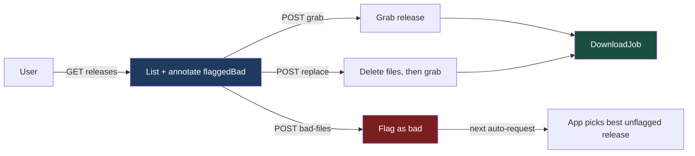
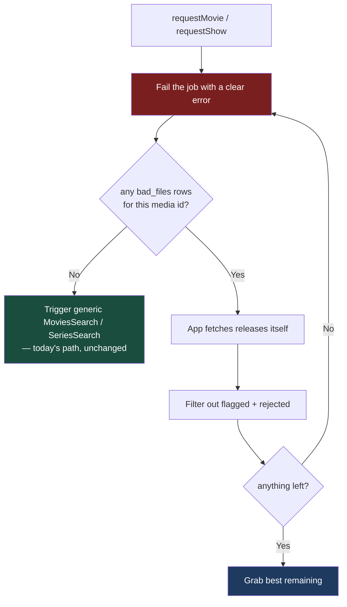
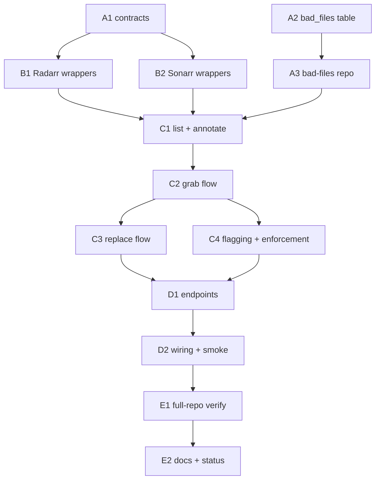

# Phase 3 — File Selection, Replacement & Bad-File Reporting — `apps/download`

**Status:** ✅ Complete — all tasks checked off.

Implements Phase 3 of [`../backend.md`](../backend.md) (spec:
[`../spec.md`](../spec.md) §6). Builds on the media entity refactor
([`001-media-entity-refactor.md`](001-media-entity-refactor.md)) — every shape
here is `DownloadJob` + `Media`, never the pre-refactor wide job row.

## What Phase 3 delivers

Today the app asks Radarr/Sonarr to "go find this" and takes whatever they
pick. Phase 3 hands that choice to the user.

| Feature            | In one sentence                                                              |
| ------------------ | ---------------------------------------------------------------------------- |
| **List releases**  | Show Radarr/Sonarr's interactive-search results, not just the auto-pick.     |
| **Grab a release** | Download the release the user chose, tracked as a normal `DownloadJob`.      |
| **Replace**        | One action: delete the existing file(s), then grab the chosen release.       |
| **Flag bad file**  | Record a bad release in a `bad_files` table; hide and avoid it from then on. |



> **Accepted gap (from the spec):** bad-file exclusion is enforced _only inside
> our app_. Radarr/Sonarr's own selection logic is untouched, so a search
> triggered from their UI can still re-pick a flagged release.

---

## Instructions for the orchestrator agent

You are an **orchestrator**. Your job is delegation, sequencing, and status
tracking — nothing else.

**Do**

- Delegate every task to a sub-agent — implementation, testing, and committing
  included. One sub-agent per task (or per parallel group, where
  [Sequencing](#sequencing) allows batching).
- Write **self-contained** delegation prompts. Copy in the task's full text,
  the relevant parts of the [Shared Context Pack](#shared-context-pack), and
  the [Definition of Done](#definition-of-done). If a task depends on names an
  earlier task produced, paste that sub-agent's reported outcomes (exported
  names, file paths, schema names) into the prompt.
- Tell every sub-agent to: implement → write/update tests → run the package's
  tests plus `pnpm run lint` and `pnpm run type-check` for touched packages →
  run `/commit`. Each must report back **files changed, exported names, test
  results, commit hash(es)**.
- Respect the sequencing graph. Launch parallel-safe tasks concurrently; never
  start a task before its dependencies report success.
- When a sub-agent fails, re-delegate with the failure details.

**Don't**

- ❌ Read or edit any code yourself — no source, no tests, no configs. The only
  file you may edit is _this plan_, to check off tasks.
- ❌ Let sub-agents read this plan. Their prompts must carry everything they
  need.
- ❌ Fix a failing task yourself.

**Finish by** verifying every checkbox is checked, then reporting the
[final status summary](#final-report).

---

## Design decisions

### One shared `Release` DTO

Radarr's and Sonarr's generated `ReleaseResource` types are _nominally_
distinct — Sonarr adds `fullSeason`, `seasonNumber`, `episodeNumbers`,
`seriesTitle`; `imdbId` is a `number` in Radarr and a `string` in Sonarr.

So: a hand-written zod `ReleaseSchema` in `@lilnas/utils/download/schema` is
the wire type, with a per-service `toRelease()` mapper on each side.

### Routes key on **media id**, not job id

Releases belong to a _title_, not to a download event:

```
GET  /download/media/tmdb:27205/releases
GET  /download/media/tvdb:81189/releases?seasonNumber=2&episodeId=4412
```

Sonarr's release endpoint natively supports `seriesId` / `episodeId` /
`seasonNumber`, so Phase 3 just passes those through. Full per-episode
_download/delete_ UX stays in Phase 4.

### Monitoring is a precondition — borrowed, not kept

Radarr/Sonarr won't surface (or let you grab) releases for a title that isn't
**in the library and monitored**. Two consequences:

- `getApiV3Release` keys on `movieId` / `seriesId`, so the title must exist
  upstream first. `MediaResolverService` only yields `radarrId` / `sonarrId`
  for _library_ entries — a discover lookup has neither. Listing releases for a
  title the user hasn't requested yet therefore has to **add it first**.
- Sonarr needs the _season/episode_ monitored, not just the series. A series
  added with `monitor: 'none'` has a monitored series row and unmonitored
  episodes.

Leaving a browsed-but-not-grabbed title monitored is not acceptable — Radarr's
RSS sync would eventually grab something nobody asked for. So the read path
**borrows** monitoring and puts it back:

```ts
// capture → monitor → act → restore
withMonitoring(mediaId, opts, fn)
```

1. Read the current monitored state (movie/series `monitored`; for Sonarr also
   the target season's episodes).
2. **If it's already monitored, change nothing** — on the way in _or_ out. This
   is the load-bearing rule: a title with a pending `requestMovie` is monitored
   on purpose, and blindly unmonitoring after a release list would silently
   kill that request. Anything already downloaded is normally monitored too, so
   this branch covers it without depending on that being true.
3. Otherwise add (`monitored: true`, `searchForMovie: false`) and/or flip
   monitoring on, run `fn`, then restore the captured state in a `finally`.
4. A failed restore logs a warning — it must never fail the caller's request.

**Grab and replace opt out of the restore.** Once the user has picked a
release, the title stays monitored so Radarr/Sonarr manage the import and
future upgrades — exactly the state `requestMovie` leaves behind today.

> **Accepted race:** the borrow window spans one interactive indexer search
> (seconds to ~a minute). If an RSS sync ticks inside that window _and_ the
> feed carries a matching release, Radarr can self-grab. Small, and strictly
> better than the permanently-monitored state `requestMovie` already leaves.

### Grab creates a real `DownloadJob`

Grab goes through the existing `DownloadStateService.addJob()` choke point, so
activity, history, and WS attribution keep working unchanged.
`MediaPollerService` drives status off the queue exactly as it does for the
generic search command — **no poller changes expected**.

### Replace = delete file(s) + grab, item stays monitored

Uses the generated-but-unwired per-file endpoints:

| Service | List files            | Delete one                   |
| ------- | --------------------- | ---------------------------- |
| Radarr  | `getApiV3Moviefile`   | `deleteApiV3MoviefileById`   |
| Sonarr  | `getApiV3Episodefile` | `deleteApiV3EpisodefileById` |

> ⚠️ **Not** `unmonitorAndDelete` — that deletes the whole movie/series.

After deletion, call `mediaResolverService.invalidate(mediaId)` so `filePath`
re-resolves correctly.

### Where bad-file enforcement kicks in

The branch happens in `requestMovie` / `requestShow`:



Media with **no** flags must keep the existing command path byte-for-byte.

### Identity requirements

| Action          | Guard                                            | Why                               |
| --------------- | ------------------------------------------------ | --------------------------------- |
| Flag a bad file | `ForwardedUserGuard` + `@CurrentUser()`          | The flag records _who_ flagged it |
| Grab / replace  | `@OptionalCurrentUser()` (request-movie pattern) | Attribution only                  |

No admin gating in this phase.

### `apps/tdr-bot` stays untouched

The compatibility shim in `packages/utils/src/download/client.ts`
(`TODO(tdr-bot-migration)`) must keep compiling and **must not be modified**.

---

## Shared Context Pack

Copy the relevant parts into every sub-agent prompt. These are pointers, not
gospel — sub-agents should verify against current code.

### Repo & conventions

- pnpm workspaces + Turbo monorepo. App: `apps/download` (`@lilnas/download`,
  NestJS + Next.js hybrid). Contracts: `packages/utils` (`@lilnas/utils`).
  Generated Radarr/Sonarr SDK: `packages/media`
  (`@lilnas/media/radarr`, `@lilnas/media/sonarr`).
- Every file must pass prettier + eslint for its package. Avoid `any`. Run
  `pnpm run lint` and `pnpm run type-check` before committing.
- Tests live in `__tests__/` alongside source (jest + ts-jest).
- DB tests use `createTestDb()` from
  `apps/download/src/db/__tests__/test-utils.ts` — in-memory better-sqlite3
  running the _real_ migration files.

In `apps/download`, SDK modules are mocked **by subpath, before imports**:

```ts
jest.mock('@lilnas/media/radarr', () => ({
  getApiV3Release: jest.fn(),
  postApiV3Release: jest.fn(),
  // …
}))
```

Canonical example (including the `jest.spyOn(Logger.prototype, …)` silencing):
`apps/download/src/media/__tests__/radarr.service.test.ts`.

### API contract layer — `packages/utils/src/download/`

- `schema.ts` holds zod schemas (source of truth); `types.ts` derives TS types
  via `z.infer`.
- Existing: `MediaSchema` (discriminated union Video/Movie/Show),
  `DownloadJobSchema`, `RequestMovieInputSchema` (`{ tmdbId }`),
  `RequestShowInputSchema` (`{ tvdbId }`), Phase-2 query schemas.
- Controllers declare DTOs with nestjs-zod:

```ts
class ListReleasesQueryDto extends createZodDto(ListReleasesQuerySchema) {}

// query params
@Query(new ZodValidationPipe(ListReleasesQueryDto)) query: ListReleasesQueryDto
// bodies use a plain @Body()
```

### Download app layout — `apps/download/src/`

| File                                 | What it is                                                                        |
| ------------------------------------ | --------------------------------------------------------------------------------- |
| `media/clients.ts`                   | `RADARR_CLIENT` / `SONARR_CLIENT` DI providers (hey-api, `X-Api-Key` header)      |
| `media/radarr.service.ts`            | Radarr SDK wrapper + `toMovie` mapper                                             |
| `media/sonarr.service.ts`            | Sonarr SDK wrapper + `toShow` mapper                                              |
| `media/media-download.service.ts`    | Job lifecycle over `DownloadStateService` (`requestMovie/Show`, `deleteXJob`)     |
| `media/media-resolver.service.ts`    | `resolve(keys)`, TTL library cache, `invalidate(mediaId)`                         |
| `download/download.controller.ts`    | `@Controller('/download')` — the HTTP surface                                     |
| `download/download-state.service.ts` | `addJob()` / `updateJob()` — the **only** job-mutation choke points               |
| `auth/`                              | `ForwardedUser`, `ForwardedUserGuard`, `@CurrentUser()`, `@OptionalCurrentUser()` |

Existing service methods: `search`, `getLibrary`,
`lookupByTmdbId`/`lookupByTvdbId`, `requestMovie`/`requestShow`, `getQueue`,
`unmonitorAndDelete`.

The SDK call pattern (from `media/sdk-result.util.ts`):

```ts
const releases = unwrapSdkResult(
  await getApiV3Release({ client: this.client, query: { movieId } }),
  'getReleases',
)
// or checkSdkError(...) when there's no payload to unwrap
```

Route patterns to imitate in `download.controller.ts`:
`GET /history` shows `@UseGuards(ForwardedUserGuard)` + `@CurrentUser()`; most
other routes use `@OptionalCurrentUser()` + `resolveIsAdmin()`.
`media.module.ts` ↔ `download.module.ts` are linked with `forwardRef`.

### DB layer — `apps/download/src/db/`

`schema.ts` is a single flat file; its header documents the conventions:

- camelCase TS props, explicit snake_case column names
- timestamps:
  `integer('col', { mode: 'timestamp_ms' }).$defaultFn(() => new Date())`
- JSON: `text('col', { mode: 'json' }).$type<T>()`
- enums: `text({ enum: TUPLE })` with an `as const` tuple + `AssertSameUnion` pin
- indexes/checks in the third callback; export `$inferSelect` row types

Existing tables: `jobs`, `videos`. `jobs.mediaId` is **deliberately not a FK**.

Other facts:

- Migrations in `db/migrations/` — 0000–0004 exist, **next is 0005**. Generate
  with `pnpm run db:generate` in `apps/download`; they run at boot via
  `db/migrate.ts` + `DbService`.
- Repos are **plain functions taking `db` as the first arg**, not injectables —
  see `db/jobs.repo.ts`, `db/videos.repo.ts`.
- Media id helpers: `db/media-id.ts` (`mediaId()`, `mediaIdSuffix()`).

### Generated SDK surface relevant to Phase 3

`packages/media/src/{radarr,sonarr}/sdk.gen.ts` + `types.gen.ts`:

| Purpose     | Radarr                                  | Sonarr                                                         |
| ----------- | --------------------------------------- | -------------------------------------------------------------- |
| List        | `getApiV3Release` — `{ movieId? }`      | `getApiV3Release` — `{ seriesId?, episodeId?, seasonNumber? }` |
| Grab        | `postApiV3Release`                      | `postApiV3Release`                                             |
| List files  | `getApiV3Moviefile` — `{ movieId? }`    | `getApiV3Episodefile` — `{ seriesId? }`                        |
| Delete file | `deleteApiV3MoviefileById` — by file id | `deleteApiV3EpisodefileById` — by file id                      |

`postApiV3Release` takes a full `ReleaseResource` body, but in practice
`{ guid, indexerId }` is all either service needs to grab.

`ReleaseResource` fields the DTO cares about: `guid`, `indexerId`, `indexer`,
`title`, `quality` (nested `QualityModel`), `customFormatScore`, `size`, `age`,
`seeders`, `leechers`, `protocol`, `releaseGroup`, `languages`, `rejected`,
`rejections`, `publishDate`, `downloadAllowed`. Sonarr adds `fullSeason`,
`seasonNumber`, `episodeNumbers`, `mappedEpisodeInfo`.

### Definition of Done

Include this **verbatim** in every delegation:

> Done means: code implemented; unit tests written/updated following the
> package's existing `__tests__` conventions and passing (`pnpm test` in the
> touched package); `pnpm run lint` and `pnpm run type-check` clean for the
> touched packages; work committed via `/commit`. Report back: files
> changed, exported names introduced, test summary, commit hash(es).

---

## Task List

Grouped by sub-phase for orientation. Check off as sub-agents report
completion.

### Group A — Contracts & persistence

- [x] **A1. Release wire contract.** In `packages/utils/src/download/`:

  Add to `schema.ts` (plus inferred types in `types.ts`):
  - `ReleaseSchema` — `guid`, `indexerId`, `indexer`, `title`, `quality`
    (flattened display string + resolution where available),
    `customFormatScore`, `size`, `age`, `seeders`, `leechers`, `protocol`,
    `releaseGroup`, `languages`, `rejected`, `rejections`, `publishDate`,
    `downloadAllowed`, `flaggedBad: boolean`, and show-only optionals
    (`fullSeason`, `seasonNumber`, `episodeNumbers`). Add
    `ReleaseProtocolSchema` etc. as needed.
  - `ListReleasesQuerySchema` — `seasonNumber?`, `episodeId?` (coerced numbers)
  - `GrabReleaseInputSchema` — `{ guid, indexerId }`
  - `ReplaceReleaseInputSchema` — same shape
  - `FlagBadFileInputSchema` — `{ guid, indexerId?, title?, reason? }`
  - `ListReleasesResponse` + bad-file response types

  ⚠️ Do **not** modify the tdr-bot shim in `download/client.ts`.

- [x] **A2. `bad_files` table + migration.** Add a `badFiles` table to
      `apps/download/src/db/schema.ts`, following the file's documented
      conventions:

  | Column                              | Notes                                            |
  | ----------------------------------- | ------------------------------------------------ |
  | `id`                                | autoincrement int PK — no app-minted id needed   |
  | `mediaType`                         | `text` enum, reuse the existing media-type tuple |
  | `mediaId`                           | text, **not** a FK — matches `jobs.mediaId`      |
  | `releaseGuid`                       | text                                             |
  | `indexerId`                         | nullable int                                     |
  | `releaseTitle`, `reason`            | nullable text                                    |
  | `flaggedByEmail`, `flaggedByUserId` | who flagged it                                   |
  | `createdAt`                         | `timestamp_ms`                                   |

  Unique index on `(mediaId, releaseGuid)`; index on `mediaId`. Export
  `BadFileRow`. Generate migration **0005** via `pnpm run db:generate` and
  sanity-check the SQL. Add/extend a schema round-trip test in
  `db/__tests__/schema.spec.ts` (or a new spec) using `createTestDb()`.

- [x] **A3. Bad-files repo.** New `apps/download/src/db/bad-files.repo.ts` —
      plain functions, db-first-arg, matching `jobs.repo.ts`:
  - `insertBadFile` — idempotent on the unique index (insert-or-ignore)
  - `listBadFilesByMediaId`
  - `getBadFileByGuid`
  - `deleteBadFile` — id-keyed, for a future unflag

  Plus `__tests__/bad-files.repo.spec.ts` against the in-memory DB.

### Group B — Radarr/Sonarr SDK wrappers

- [x] **B1. RadarrService release + file methods.** In
      `apps/download/src/media/radarr.service.ts`:

  ```ts
  getReleases(radarrId: number): Promise<Release[]>   // getApiV3Release
  grabRelease(guid: string, indexerId: number)        // postApiV3Release
  getMovieFiles(radarrId: number)                     // getApiV3Moviefile
  deleteMovieFile(fileId: number)                     // deleteApiV3MoviefileById

  // monitoring lifecycle — see "Monitoring is a precondition"
  ensureMovie(tmdbId: number): Promise<{ radarrId: number; wasMonitored: boolean }>
  setMonitored(radarrId: number, monitored: boolean): Promise<void> // putApiV3MovieById
  ```

  `ensureMovie` is an **extraction, not new logic**: the add-if-missing half is
  already inline in `requestMovie` (roughly `radarr.service.ts:158–202`). Pull
  it out so it (a) adds when absent with `monitored: true` +
  `searchForMovie: false`, (b) flips an existing-but-unmonitored row on via
  `setMonitored`, and (c) returns `wasMonitored` — the state **before** this
  call, so `false` for a fresh add. Then rewrite `requestMovie` as
  `ensureMovie()` + the existing `MoviesSearch` command. That refactor must be
  behavior-preserving; assert it with the existing `requestMovie` tests.

  Add an exported `toRelease(resource: ReleaseResource): Release` mapper —
  `flaggedBad` defaults to `false`; annotation happens upstream. Follow the
  existing `unwrapSdkResult` / `checkSdkError` pattern. Extend
  `__tests__/radarr.service.test.ts` (subpath `jest.mock` pattern) covering
  mapping, error paths, empty results, and each `ensureMovie` branch
  (absent / present-unmonitored / present-monitored).

- [x] **B2. SonarrService release + file methods.** Mirror B1 in
      `sonarr.service.ts`:

  ```ts
  getReleases(seriesId: number, opts?: { seasonNumber?: number; episodeId?: number })
  grabRelease(guid: string, indexerId: number)
  getEpisodeFiles(seriesId: number)
  deleteEpisodeFile(fileId: number)

  // monitoring lifecycle — see "Monitoring is a precondition"
  ensureSeries(tvdbId: number): Promise<{ sonarrId: number; wasMonitored: boolean }>
  setSeriesMonitored(sonarrId: number, monitored: boolean)     // putApiV3SeriesById
  getEpisodes(seriesId: number, opts?: { seasonNumber?: number }) // getApiV3Episode
  setEpisodesMonitored(episodeIds: number[], monitored: boolean)  // putApiV3EpisodeMonitor
  ```

  Same extraction as B1 for `ensureSeries` (the add-if-missing half sits at
  roughly `sonarr.service.ts:146–197`), with the extra granularity Sonarr
  needs: **series-level `monitored` is not enough** — the target season's
  episodes must be monitored too, so the capture shape carries the episode ids
  that were _already_ monitored and the restore only unmonitors the ones this
  call turned on. The existing add path uses `addOptions.monitor: 'all'`, so a
  fresh add needs no episode pass; a pre-existing series added `monitor: 'none'`
  does.

  Sonarr's own `toRelease` handles the show-only fields (`fullSeason`,
  `seasonNumber`, `episodeNumbers`) — and note `imdbId` is a _string_ here.
  Extend `__tests__/sonarr.service.test.ts`, including each `ensureSeries`
  branch and the episode-level monitor calls.

### Group C — Orchestration

- [x] **C1. ReleaseService — list + annotate.** New
      `apps/download/src/media/release.service.ts`; register and export it in
      `media.module.ts`.

  Also add the private `withMonitoring(mediaId, opts, fn)` helper described in
  [Monitoring is a precondition](#monitoring-is-a-precondition--borrowed-not-kept)
  — C2/C3/C4 all reuse it.

  `listReleases(mediaId, opts?: { seasonNumber?; episodeId? })`:
  1. Parse `mediaId` → `tmdbId` / `tvdbId` and dispatch to the right service.
     Do **not** require `MediaResolverService` to hand back a
     `radarrId` / `sonarrId`: it only has one for titles already in the
     library, and browsing releases for a not-yet-requested title is the
     primary use case. Use `ensureMovie` / `ensureSeries` to get the upstream
     id instead — the resolver stays in play only for type/metadata.
  2. Run the fetch inside `withMonitoring(..., { restore: true })`, so a title
     that wasn't monitored going in isn't left monitored coming out. Restore
     in a `finally`; a restore failure logs and is swallowed.
  3. Annotate each release with `flaggedBad` from `listBadFilesByMediaId`
     (match on guid)

  Throw `NotFoundException` for _video_ media ids — releases apply only to
  movies and shows — and let an unknown tmdb/tvdb id surface as the upstream
  lookup failure it already is. Tests in `__tests__/release.service.test.ts`
  with mocked Radarr/Sonarr/resolver, plus a real in-memory DB for the repo (or
  a mocked repo — whichever is lighter given the `DbService` seams). Cover the
  three monitoring branches explicitly: already-monitored (no writes at all),
  unmonitored (monitored then restored), and fetch-throws (still restored).

- [x] **C2. Grab flow.** `ReleaseService.grabRelease(mediaId, input, user)`:
  - Refuse flagged guids with a clear `ConflictException` — keep it simple, no
    override path
  - `withMonitoring(..., { restore: false })` — grab is a real choice, so the
    title (and for shows, the target episodes) **stays monitored** afterward so
    Sonarr/Radarr manage the import and future upgrades
  - Call the per-service `grabRelease`
  - Create the tracking `DownloadJob` through the existing
    `MediaDownloadService` / `DownloadStateService` path so
    requester / hiddenAttribution / WS events behave exactly like
    `requestMovie`

  ⚠️ Reuse or minimally extend `MediaDownloadService.request()` — **do not fork
  a second job-creation path.** The poller picks up queue progress unchanged.

  Tests: job created with correct requester + mediaId; flagged guid refused;
  monitoring left **on** after a successful grab (the one place restore is
  skipped); upstream error surfaces cleanly.

- [x] **C3. Replace flow.** `ReleaseService.replaceRelease(mediaId, input, user)`:
  1. Look up current file(s) (`getMovieFiles` / `getEpisodeFiles`, scoped by
     `seasonNumber` / `episodeId` when given)
  2. Delete them via the per-file delete endpoints — keep the movie/series
     **monitored**, do _not_ use `unmonitorAndDelete`
  3. `mediaResolverService.invalidate(mediaId)`
  4. Run the C2 grab path for the chosen release

  Deleting zero files is **not** an error — nothing to replace means a plain
  grab. Monitoring normally no-ops here (a title with files is already in the
  library and monitored), but still go through step 4's `withMonitoring` with
  `restore: false` — a downloaded-then-manually-unmonitored title is possible
  and would otherwise fail the grab.

  Tests: deletion ordering, invalidation called, zero-file path, and partial
  failure (delete succeeded, grab failed ⇒ error surfaces with no dangling job
  left in a wrong state).

- [x] **C4. Bad-file flagging + auto-select enforcement.** Two parts:

  **(a) Flag** — `ReleaseService.flagBadFile(mediaId, input, user)` inserts via
  the repo (idempotent), recording flagger identity.

  **(b) Enforce** — in `MediaDownloadService.requestMovie` / `requestShow`,
  when the target media id has bad-file rows, replace the generic
  `MoviesSearch` / `SeriesSearch` command with the fetch-and-grab path below.

  ⚠️ **Ordering.** `MediaDownloadService` has no `radarrId` / `sonarrId` — the
  add-if-missing lives one layer down, inside `RadarrService.requestMovie`.
  B1/B2 split that out as `ensureMovie` / `ensureSeries`, so the branch here
  must be **ensure first, then decide**: get the upstream id, then either fire
  the existing command (no flags) or run fetch-and-grab (flags present). No
  monitoring restore on either branch — a request is an explicit ask, same as
  today.

  ```
  fetch releases
    → filter out flagged guids and `rejected` releases
    → pick the best remaining: highest customFormatScore,
      then most seeders, then newest (simple deterministic sort)
    → grab it
  if nothing remains → fail the job with a descriptive error
  ```

  Media with no flags keeps the existing command path byte-for-byte. Test both
  branches plus the nothing-left failure.

### Group D — HTTP layer

- [x] **D1. Controller endpoints + DTOs.** In
      `apps/download/src/download/download.controller.ts` — or a new sibling
      controller if it reads cleaner; the sub-agent decides, staying consistent
      with existing style:

  | Route                                       | Input                       | Auth                                                | Returns                                     |
  | ------------------------------------------- | --------------------------- | --------------------------------------------------- | ------------------------------------------- |
  | `GET /download/media/:id/releases`          | `ListReleasesQuerySchema`   | —                                                   | Annotated release list                      |
  | `POST /download/media/:id/releases/grab`    | `GrabReleaseInputSchema`    | `@OptionalCurrentUser()`                            | `DownloadJob`, same shape as `POST /movies` |
  | `POST /download/media/:id/releases/replace` | `ReplaceReleaseInputSchema` | `@OptionalCurrentUser()`                            | `DownloadJob`                               |
  | `POST /download/media/:id/bad-files`        | `FlagBadFileInputSchema`    | `@UseGuards(ForwardedUserGuard)` + `@CurrentUser()` | Created flag                                |
  | `GET /download/media/:id/bad-files`         | —                           | admin-agnostic                                      | Flag list                                   |

  nestjs-zod DTOs at the top of the controller as today. Controller tests
  following `download.controller.media.test.ts`.

- [x] **D2. Module wiring + smoke.** The first integration checkpoint. Confirm
      `ReleaseService` and the bad-files repo path are exported/imported
      correctly across `MediaModule` / `DownloadModule` (mind the existing
      `forwardRef`), that `media.module.test.ts` still passes, and that the
      whole `apps/download` suite is green. Run the full package test suite +
      repo `lint` + `type-check`.

### Group E — Verification & docs

- [x] **E1. Full-repo verification.** From the repo root: `pnpm run build`,
      `pnpm run lint`, `pnpm run type-check`, `pnpm test`. Confirms nothing
      else broke — the tdr-bot shim especially.

- [x] **E2. Docs + status.** Update `docs/features/download/backend.md`:
  - Mark Phase 3's status line (done / partial), with commit refs and any
    deferred items
  - Note the auto-select enforcement design and the monitoring borrow/restore
    behavior as actually implemented
  - Add a short **manual verification** note listing the curl checks to run
    against a live Radarr/Sonarr: release list for a known movie → grab →
    replace → flag, then confirm a re-download skips the flagged release.
    Include the monitoring checks, which only real instances can prove:
    listing releases for a **not-yet-added** movie returns results and leaves
    it unmonitored afterward; listing for a movie with a **pending request**
    leaves it still monitored; a grab leaves it monitored. These need real
    instances and are left for the user.

---

## Sequencing



### Waves

| Wave | Run                   | Why it works                                                                     |
| ---- | --------------------- | -------------------------------------------------------------------------------- |
| 1    | **A1 ∥ A2**           | Different packages (`packages/utils` vs `apps/download/src/db`), no shared files |
| 2    | **B1 ∥ B2 ∥ A3**      | B1/B2 need A1's `Release` type; A3 needs only A2. Three disjoint files.          |
| 3    | **C1**                | The convergence point — needs B1 + B2 + A3                                       |
| 4    | **C2**                | Extends C1's service and touches the shared job-creation path                    |
| 5    | **C3 ∥ C4** ⚠️        | See the caveat below                                                             |
| 6+   | **D1 → D2 → E1 → E2** | Strictly sequential — each integrates the previous                               |

> ⚠️ **Wave 5 caveat.** C3 and C4 both build on C2 but touch different logic
> (C3: file deletion + resolver invalidation; C4: repo insert + the
> request-media branch). They're parallel-safe **only** with worktree-isolated
> agents or serialized commits — both edit `release.service.ts` and its test
> file. If you can't guarantee isolation, run **C3 → C4 sequentially**.

### Dependency table

| Task | Depends on | Parallel with         |
| ---- | ---------- | --------------------- |
| A1   | —          | A2                    |
| A2   | —          | A1                    |
| A3   | A2         | B1, B2                |
| B1   | A1         | B2, A3                |
| B2   | A1         | B1, A3                |
| C1   | B1, B2, A3 | —                     |
| C2   | C1         | —                     |
| C3   | C2         | C4 (see caveat above) |
| C4   | C2         | C3 (see caveat above) |
| D1   | C3, C4     | —                     |
| D2   | D1         | —                     |
| E1   | D2         | —                     |
| E2   | E1         | —                     |

**The short version:** Group C is the critical path — every task there extends
`release.service.ts`. D2 and E1 are integration checkpoints that must see all
prior commits. Groups A and B hold the only truly free parallelism.

---

## Final report

When every box is checked, the orchestrator reports:

- Each task's outcome and commit hash(es)
- Test suite results — per-package and repo-wide
- Any deviations from this plan, and why
- Deferred items (e.g. the manual live-instance curl checks in E2)
- Open questions discovered during implementation
