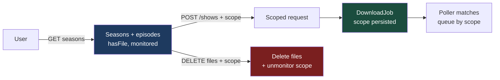
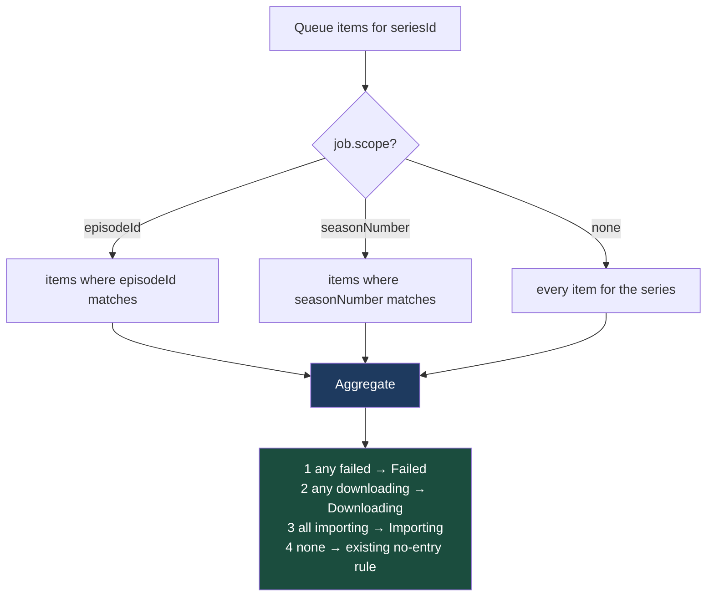
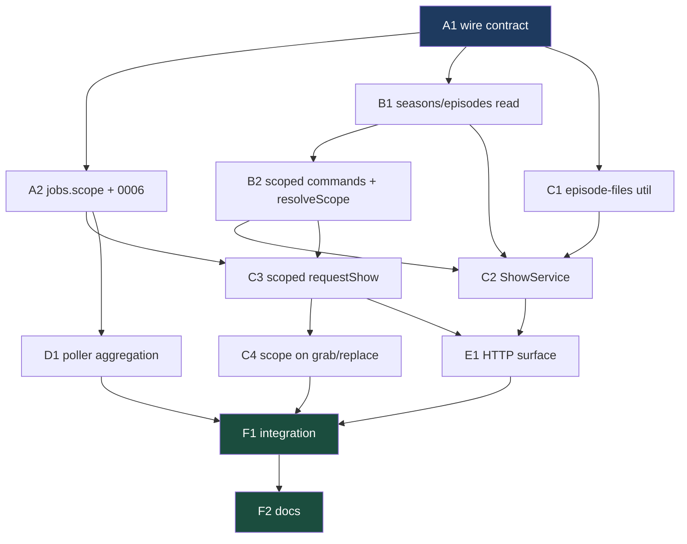

# Phase 4 — Per-Episode & Per-Season Granularity — `apps/download`

Implements Phase 4 of [`../backend.md`](../backend.md) (spec:
[`../spec.md`](../spec.md) §4; user stories 35–41). Builds on the media entity
refactor ([`001-media-entity-refactor.md`](001-media-entity-refactor.md)) and
Phase 3 ([`003-phase-3-file-selection.md`](003-phase-3-file-selection.md)) —
every shape here is `DownloadJob` + `Media`, and every media-keyed route
follows the `/download/media/:id/...` convention Phase 3 established.

## What Phase 4 delivers

Today a show is all-or-nothing: `POST /download/shows` monitors the entire
series and searches it, and `DELETE /download/shows/:jobId` removes the whole
thing. Phase 4 lets a user work one episode or one season at a time.

| Feature               | In one sentence                                                                    |
| --------------------- | ---------------------------------------------------------------------------------- |
| **Browse structure**  | `GET /media/:id/seasons` returns every season and its episodes, with file state.   |
| **Scoped download**   | `POST /shows` accepts `seasonNumber`/`episodeId` and searches only that scope.     |
| **Scoped delete**     | `DELETE /media/:id/files` removes an episode, a season, or every file of a title.  |
| **Scoped job record** | A `DownloadJob` carries the scope it was created for, so activity/history read it. |
| **Scoped polling**    | The poller matches queue items to a job's scope instead of taking the first hit.   |



> **Backend only.** As with Phase 3, nothing in the Next.js app calls these
> routes when the phase lands. The frontend rebuild consumes them later.

---

## How to work this plan

**Per task:**

1. Work tasks in [wave order](#waves). Never start one before its dependencies
   report green.
2. Implement → write or update tests → run `pnpm test`, `pnpm run lint` and
   `pnpm run type-check` for every touched package.
3. **`/commit`** — one task, one commit (or a small coherent set). `/commit`
   stages at line level, so a stray edit in the same file doesn't ride along.
4. Check the box here and append the commit hash.

**Markers:**

| Marker              | Means                                                               |
| ------------------- | ------------------------------------------------------------------- |
| `- [ ]`             | Not started                                                         |
| `- [x]` … `abc1234` | Done, with the commit that did it                                   |
| ⚠️ **PARTIAL**      | Landed with scope narrowed — say what was left and why, right there |
| ⏭️ **DROPPED**      | Not doing it — say why. **Never delete a task**                     |
| 🚧 / ⏳             | Blocked. Do not implement                                           |

**When reality disagrees with the plan** — and it will, because two command
names in here are unverified against a live Sonarr — record it inline under the
task as a short **Findings** note, then update the downstream tasks the finding
invalidates.

---

## Instructions for the orchestrator agent

You are an **orchestrator**. Your job is delegation, sequencing, and status
tracking — nothing else.

**Do**

- Delegate every task to a sub-agent — implementation, testing, and committing
  included. One sub-agent per task.
- Write **self-contained** delegation prompts. Copy in the task's full text,
  the relevant parts of the [Shared Context Pack](#shared-context-pack), and
  the [Definition of Done](#definition-of-done). When a task depends on names
  an earlier task produced, paste that sub-agent's **reported** outcomes
  (exported names, file paths, schema names) into the prompt.
- Tell every sub-agent to: implement → write/update tests → run the package's
  tests plus `pnpm run lint` and `pnpm run type-check` for touched packages →
  run `/commit`. Each must report back **files changed, exported names, test
  results, commit hash(es)**.
- Respect the sequencing graph, and the
  [file collisions](#collisions-that-the-dag-does-not-show) that it does not
  show. All work happens on one branch, so **never run two sub-agents that
  touch the same file concurrently** — their `/commit` calls will
  cross-contaminate.

**Don't**

- ❌ Read or edit any code yourself — no source, no tests, no configs. The only
  file you may edit is _this plan_, to check off tasks.
- ❌ Let sub-agents read this plan.
- ❌ Fix a failing task yourself. Re-delegate with the failure details.
- ❌ Perform any [human checkpoint](#human-checkpoints).

**Finish by** verifying every checkbox is checked, then reporting the
[final status summary](#final-report).

---

## Design decisions

### The scope lives on the **job**, not on the media id

A season or episode download is still a download _of a show_. The obvious
alternative — minting `tvdb:121361:s3e5`-style media ids — was rejected:

- `mediaIdSuffix()` + `Number()` is how every consumer parses a key
  (`media-resolver.service.ts:157`, `release.service.ts:66`); a third segment
  breaks all of them.
- The gallery groups by `(type, media_id)` — a show would fragment into one
  card per episode, which is exactly what the media entity refactor removed.
- `MediaResolverService` has nothing to resolve an episode key against;
  Sonarr's library is keyed by series.

So `media_id` stays `tvdb:121361` and the **job** gains a nullable `scope`:

```ts
type ShowScope = {
  episodeId?: number; // Sonarr's episode id — the search/grab key
  episodeNumber?: number; // display only, derived server-side
  seasonNumber?: number;
};
```

`scope` absent = the whole series, which is exactly today's behavior. Every
existing row stays correct with no backfill.

### One nullable JSON column, not three

`jobs.scope` is `text('scope', { mode: 'json' }).$type<ShowScope>()` — the
convention `videos.timeRange` and `videos.downloadUrls` already follow. Nothing
filters or sorts on a season, so three indexed integer columns would buy
nothing and cost three migrations' worth of surface. A CHECK ties it to the
type, the same way `jobs_media_id_matches_type` already does.

### `episodeNumber` is denormalized on purpose

`episodeId` is a Sonarr primary key — useless to render. Without
`episodeNumber`, an activity row for a single episode can only say "The Wire",
not "The Wire — S03E05", unless the frontend fetches the seasons endpoint per
job. So the server resolves it once at request time (one
`getApiV3EpisodeById` call it is already positioned to make) and stores it.
Same reasoning as `bad_files.release_title`: a denormalized copy so an old row
stays readable without a lookup.

### Request bodies stay flat; the job carries a nested `scope`

`GrabReleaseInputSchema` already ships `episodeId`/`seasonNumber` as flat
top-level fields, so `RequestShowInputSchema` matches it rather than inventing
a nested body shape one phase later. On the **job**, `scope` is nested — same
as `media` — because it is a sub-object of the record, not a request argument.

There is deliberately no single shared zod fragment for the two: query-param
schemas need `z.coerce.number()` and body schemas need plain `z.number()`, so
sharing one object would silently coerce strings in JSON bodies.

### Delete removes **files**, not the library entry

```
DELETE /download/media/tvdb:81189/files?seasonNumber=3&episodeId=4412
```

Scope resolution, narrowest first: `episodeId` → one file; `seasonNumber` →
that season's files; neither → every file of the title. Works for `tmdb:` keys
too (one movie file), which gives the movie detail page a delete that doesn't
require an existing job.

> ⚠️ **This is not `unmonitorAndDelete`.** The series/movie stays in
> Radarr/Sonarr. Removing the library entry entirely remains
> `DELETE /download/shows/:jobId` / `DELETE /download/movies/:jobId`, which is
> job-keyed and cancels the job as well.

**The delete must unmonitor what it deleted.** A monitored episode with no file
is, to Sonarr, a missing episode — the next RSS sync or missing-episode search
re-downloads exactly what the user just removed. Unmonitoring the deleted scope
is what makes the delete stick. Then `mediaResolverService.invalidate(mediaId)`
so `filePath` re-resolves off Radarr/Sonarr's post-delete truth instead of a
cache entry the app already knows is wrong.

### The poller has to stop taking the first match

`MediaPollerService.pollShows()` currently does
`queue.find(q => q.seriesId === job.upstreamId)` — the _first_ queue item for
the series. That is already lossy for a series-wide search (Sonarr queues one
item per episode), and with per-episode jobs it becomes wrong: two concurrent
episode jobs for one series would both read the same arbitrary item.

Phase 4 filters by scope and **aggregates** the matches:



The snapshot aggregates too: `size`/`sizeleft` summed across matches,
`timeLeft` taken from the item with the **largest `sizeleft`** — the one that
will finish last. Radarr is untouched; a movie is one file and one queue item.

### Unflagged scoped requests use Sonarr's own scoped search

The Phase 3 rule holds: a title with no `bad_files` rows keeps the
command path, byte for byte. Phase 4 only picks a _narrower_ command.

| Scope        | Command                                           |
| ------------ | ------------------------------------------------- |
| episode      | `EpisodeSearch`, body `{ episodeIds: [id] }`      |
| season       | `SeasonSearch`, body `{ seriesId, seasonNumber }` |
| whole series | `SeriesSearch` — unchanged                        |

> 🚨 **Unverified literals.** `EpisodeSearch` and `SeasonSearch` are
> well-documented Sonarr command names but are **not** in the generated SDK
> (`CommandResourceWritable.name` is a bare string). Extend them locally the
> way `SeriesSearchCommand` already does in `sonarr.service.ts:49`, then
> confirm against a running Sonarr — see
> [Human checkpoints](#human-checkpoints). A wrong literal fails silently:
> Sonarr 400s the command and the job lands in `Failed`.

When the title **does** have flagged releases, the existing fetch-and-pick path
runs unchanged — `SonarrService.getReleases(sonarrId, scope)` already accepts
the scope, so only the argument changes.

### Monitoring: `ensureSeries` already does the work

`ensureSeries(tvdbId, { monitorEpisodes: scope })` — built in Phase 3 —
monitors exactly the episodes a scope names and reports back only the ones it
switched on. A scoped request passes the scope; a series-level request keeps
passing nothing, for the reason already documented at
`sonarr.service.ts:64–75` (re-requesting a show whose season 3 alone is
monitored must not silently switch on all ten seasons).

Like `requestShow` today, a scoped request **keeps** monitoring — it is an
explicit choice, so Sonarr manages the import and future upgrades. Only the
release _read_ path borrows and restores.

> ⚠️ **Season-level `monitored` is a third layer.** `SeriesResource.seasons[]`
> carries its own `monitored` flag, separate from the series row and from each
> episode. Episode-level monitoring is what governs searching, so Phase 4 does
> not touch the season flag — but `GET /seasons` reports it, and if a live
> check shows Sonarr ignoring monitored episodes inside an unmonitored season,
> `postApiV3Seasonpass` is the escape hatch. Record a **Findings** note if so.

### `apps/tdr-bot` stays untouched

The compatibility shim in `packages/utils/src/download/client.ts`
(`TODO(tdr-bot-migration)`) must keep compiling and **must not be modified**.
Every contract change in this phase is an _optional_ field, so
`DownloadClient.requestShow({ tvdbId })` and the frontend's
`DownloadJobSchema.safeParse()` both keep working with no edit.

### Out of scope

| Not in Phase 4                                | Why                                                       |
| --------------------------------------------- | --------------------------------------------------------- |
| Any frontend surface                          | Same as Phase 3 — the rebuild consumes these later        |
| `DownloadClient` methods for the new routes   | Phase 3 added none either; nothing in-repo calls them yet |
| Season/episode summary fields on `ShowSchema` | `GET /seasons` answers it; a second copy would drift      |
| Bulk `deleteApiV3EpisodefileBulk`             | The sequential per-file loop already exists and is safer  |
| An unflag route for `bad_files`               | Still deferred from Phase 3                               |

---

## Shared Context Pack

Copy the relevant parts into every sub-agent prompt. These are pointers, not
gospel — sub-agents should verify against current code.

### Repo & conventions

- pnpm workspaces + Turbo monorepo. App: `apps/download` (`@lilnas/download`,
  NestJS + Next.js hybrid). Contracts: `packages/utils` (`@lilnas/utils`).
  Generated Radarr/Sonarr SDK: `packages/media` (`@lilnas/media/sonarr`).
- Every file must pass prettier + eslint for its package. Avoid `any`. Run
  `pnpm run lint` and `pnpm run type-check` before committing.
- Tests live in `__tests__/` alongside source (jest + ts-jest, config at
  `apps/download/jest.config.js`, `src/*` and `@lilnas/*` path-mapped).
- DB tests use `createTestDbService()` / `createTestDb()` from
  `apps/download/src/db/__tests__/test-utils.ts` — in-memory better-sqlite3
  running the **real** migration files.
- Object literal keys are alphabetized throughout this codebase (an eslint
  rule enforces it) — match it.

SDK modules are mocked **by subpath, before imports**:

```ts
jest.mock("@lilnas/media/sonarr", () => ({
  getApiV3Episode: jest.fn(),
  postApiV3Command: jest.fn(),
  // …
}));
```

Canonical example, including the `jest.spyOn(Logger.prototype, …)` silencing:
`apps/download/src/media/__tests__/sonarr.service.test.ts`.

Anything that transitively imports `nanoid` needs this **first in the file**:

```ts
jest.mock("nanoid", () => ({ nanoid: jest.fn(() => "mock-id") }));
```

(see `media/__tests__/release.service.test.ts:5`).

### API contract layer — `packages/utils/src/download/`

- `schema.ts` holds zod schemas (source of truth); `types.ts` derives TS types
  via `z.infer`. Both files are ordered by phase with `// ---- Phase N ----`
  banner comments — add a Phase 4 banner.
- Existing and relevant: `MediaSchema` (discriminated union), `ShowSchema`,
  `DownloadJobSchema`, `RequestShowInputSchema` (`{ tvdbId }`),
  `ListReleasesQuerySchema` (`{ episodeId?, seasonNumber? }`, **coerced**),
  `GrabReleaseInputSchema` (`{ guid, indexerId, episodeId?, seasonNumber? }`,
  **not** coerced).
- `MediaBaseSchema.runtime` is documented as **seconds**; Radarr/Sonarr report
  minutes and the mappers multiply by 60. New episode/season runtimes must
  follow that.
- Controllers declare DTOs with nestjs-zod:

```ts
class ListSeasonsQueryDto extends createZodDto(SomeQuerySchema) {}

// query params need the explicit pipe
@Query(new ZodValidationPipe(ListSeasonsQueryDto)) query: ListSeasonsQueryDto
// bodies use a plain @Body()
```

### Download app layout — `apps/download/src/`

| File                                 | What it is                                                                            |
| ------------------------------------ | ------------------------------------------------------------------------------------- |
| `media/clients.ts`                   | `RADARR_CLIENT` / `SONARR_CLIENT` DI providers                                        |
| `media/sonarr.service.ts`            | Sonarr SDK wrapper, `toShow`/`toRelease` mappers, `ensureSeries`                      |
| `media/radarr.service.ts`            | Radarr equivalent, `ensureMovie`, `getMovieFiles`, `deleteMovieFile`                  |
| `media/release.service.ts`           | Release list/grab/replace/flag; `withMonitoring`, private `deleteExistingFiles`       |
| `media/media-download.service.ts`    | Job lifecycle — `requestMovie/Show`, `deleteXJob`, the public `request()` choke point |
| `media/media-resolver.service.ts`    | `resolve(keys)`, TTL library cache, `invalidate(mediaId)`                             |
| `media/media-poller.service.ts`      | 10s `@Cron` queue poll driving movie/show job status                                  |
| `media/queue-status.util.ts`         | `PollableQueueItem`, `toQueueSnapshot`, `deriveStatusFromQueueItem`                   |
| `media/media.module.ts`              | Providers/exports; `forwardRef` ↔ `download.module.ts`                               |
| `download/download.controller.ts`    | `@Controller('/download')` — the whole HTTP surface                                   |
| `download/download-state.service.ts` | `addJob()` / `updateJob()` — the **only** job-mutation choke points                   |
| `db/job-row.ts`                      | `buildJobRow()` / `hydrateJobRow()` — the record ↔ row round trip                    |
| `auth/`                              | `ForwardedUser`, `ForwardedUserGuard`, `@CurrentUser()`, `@OptionalCurrentUser()`     |

The SDK call pattern (`media/sdk-result.util.ts`):

```ts
const episodes = unwrapSdkResult(
  await getApiV3Episode({ client: this.client, query: { seriesId } }),
  "getEpisodes",
);
// or checkSdkError(...) when there's no payload to unwrap
```

Route patterns in `download.controller.ts`: most routes take
`@OptionalCurrentUser()` + `resolveIsAdmin()`; `GET /history` and
`POST /media/:id/bad-files` show `@UseGuards(ForwardedUserGuard)` +
`@CurrentUser()`. `releaseActionRoute()` and `mediaJobRoute()` are the two
private helpers that wrap the common logging/projection.

### DB layer — `apps/download/src/db/`

`schema.ts` is a single flat file; its header documents the conventions:

- camelCase TS props, explicit snake_case column names
- timestamps: `integer('col', { mode: 'timestamp_ms' }).$defaultFn(() => new Date())`
- JSON: `text('col', { mode: 'json' }).$type<T>()`
- enums: `text({ enum: TUPLE })` with an `as const` tuple + `AssertSameUnion` pin
- indexes and `check()` constraints in the third callback; export
  `$inferSelect` row types

Existing tables: `jobs`, `videos`, `bad_files`. `jobs.mediaId` is deliberately
**not** a FK.

- Migrations in `db/migrations/` — `0000`–`0005` exist, **next is `0006`**.
  Generate with `pnpm run db:generate` in `apps/download` and sanity-check the
  emitted SQL; they run at boot via `db/migrate.ts` + `DbService`.
- Repos are **plain functions taking `db` as the first arg**, not injectables —
  see `db/jobs.repo.ts`, `db/bad-files.repo.ts`.
- Media id helpers: `db/media-id.ts` (`mediaId()`, `mediaIdSuffix()`).

### Generated Sonarr SDK surface relevant to Phase 4

All in `packages/media/src/sonarr/{sdk.gen,types.gen}.ts`:

| Purpose            | Function                     | Shape                                                             |
| ------------------ | ---------------------------- | ----------------------------------------------------------------- |
| Series (+ seasons) | `getApiV3SeriesById`         | `path: { id: number }` → `SeriesResource`                         |
| Episodes           | `getApiV3Episode`            | `query: { seriesId?, seasonNumber?, episodeIds?, … }`             |
| One episode        | `getApiV3EpisodeById`        | `path: { id: number }` → `EpisodeResource`                        |
| Monitor episodes   | `putApiV3EpisodeMonitor`     | `body: { episodeIds, monitored }`                                 |
| Episode files      | `getApiV3Episodefile`        | `query: { seriesId? }` — **no season filter**, narrow client-side |
| Delete one file    | `deleteApiV3EpisodefileById` | `path: { id: number }`                                            |
| Commands           | `postApiV3Command`           | `body: CommandResourceWritable & { …command-specific }`           |
| Season monitoring  | `postApiV3Seasonpass`        | escape hatch only — see the season-flag caveat                    |

Field shapes worth knowing (every field is optional in the generated types):

```ts
SeriesResource.seasons?: Array<{
  seasonNumber?: number
  monitored?: boolean
  statistics?: { episodeCount?, episodeFileCount?, totalEpisodeCount?, sizeOnDisk? }
}>

EpisodeResource: {
  id?, seriesId?, seasonNumber?, episodeNumber?, title?, airDateUtc?,
  overview?, runtime?, hasFile?, monitored?, episodeFileId?
}

QueueResource (Sonarr): { id?, seriesId?, episodeId?, seasonNumber?, … }
```

> `episodeFileId: 0` is Sonarr's "no file" — check truthiness, not
> null-ness. `release.service.ts:324` already documents this.

### Definition of Done

Include this **verbatim** in every delegation:

> **Done means:** code implemented; unit tests written or updated following the
> package's existing `__tests__` conventions and passing (`pnpm test` in the
> touched package); `pnpm run lint` and `pnpm run type-check` clean for every
> touched package; work committed via `/commit`. Report back: files changed,
> exported names introduced, test summary, commit hash(es).

---

## Task List

### Group A — Contracts & persistence

- [x] `d7fe301e` **A1. Show-scope, season and episode wire contract.** In
      `packages/utils/src/download/`, under a new
      `// ---- Phase 4: per-episode/season granularity ----` banner in both
      files:

  Add to `schema.ts`, with inferred types re-exported from `types.ts`:

  ```ts
  ShowScopeSchema; // { episodeId?, episodeNumber?, seasonNumber? } — all
  // ints, seasonNumber .min(0) (Sonarr numbers specials
  // as season 0), episodeId/episodeNumber .positive()
  EpisodeSchema; // { id, seasonNumber, episodeNumber, title?, airDate?,
  //   overview?, runtime?, hasFile, monitored,
  //   episodeFileId? }
  SeasonSchema; // { seasonNumber, monitored, episodeCount,
  //   episodeFileCount, sizeOnDisk?, episodes: Episode[] }
  DeleteMediaFilesQuerySchema; // { episodeId?, seasonNumber? } — z.coerce
  ```

  Extend two existing schemas, **additively only**:
  - `RequestShowInputSchema` gains flat `episodeId?` / `seasonNumber?` (plain
    `z.number()`, not coerced — it's a JSON body). Both stay optional so
    `DownloadClient.requestShow({ tvdbId })` keeps compiling.
  - `DownloadJobSchema` gains `scope: ShowScopeSchema.optional()`.

  Add response interfaces to `types.ts`:

  ```ts
  interface ListSeasonsResponse {
    seasons: Season[];
  }
  interface DeleteMediaFilesResponse {
    deletedCount: number;
    mediaId: string;
  }
  ```

  Edge cases and constraints:
  - `Episode.runtime` is **seconds**, matching `MediaBaseSchema.runtime`'s
    documented convention. Say so in a doc comment; the mapper does the ×60.
  - `episodeFileId` is omitted (not `0`) when there is no file.
  - Do **not** try to share one zod fragment between the coerced query schemas
    and the plain body schemas — document why in a comment (see
    [Design decisions](#request-bodies-stay-flat-the-job-carries-a-nested-scope)).
  - ⚠️ Do **not** modify the tdr-bot shim in `download/client.ts`, and do not
    add client methods.

  Tests: none required for a pure contract file if the package has no schema
  suite — confirm by looking, and if `packages/utils` does have schema tests,
  follow them.

  **Findings.** `ShowScopeSchema` is declared next to `DownloadJobSchema`
  rather than under the Phase 4 banner at the bottom of `schema.ts` —
  `DownloadJobSchema` carries it, and a `const` can't be read before its
  initializer runs. `packages/utils` does have a schema suite, so Phase 4
  cases were added to it.

- [x] `4dfbec3a` **A2. `jobs.scope` column + migration 0006 + row round-trip.** In
      `apps/download/src/db/`:
  - `schema.ts`: add `scope: text('scope', { mode: 'json' }).$type<ShowScope>()`
    to `jobs` (nullable), importing `ShowScope` as an `import type` — the file
    header explains why type-only imports matter here (drizzle-kit bundles it).
    Add a `check()` in the third callback:

    ```
    jobs_scope_only_for_shows:  scope IS NULL OR type = 'show'
    ```

    No index — nothing filters or sorts on it.

  - `job-row.ts`: carry `scope` through `buildJobRow()` (`record.scope ?? null`)
    and `hydrateJobRow()` (`row.scope ?? undefined`). Note the null/undefined
    asymmetry deliberately: the record type uses `undefined` like `error` does.
  - Generate migration **0006** with `pnpm run db:generate` and sanity-check
    the emitted SQL. SQLite cannot add a CHECK to an existing table with
    `ALTER TABLE`, so drizzle will emit a table rebuild — **read it** and
    confirm it preserves every existing row and index.

  Tests: extend `db/__tests__/schema.spec.ts` (round-trip a scoped row through
  the real migrations) and `db/__tests__/job-row.spec.ts` (a scoped show job
  and an unscoped one both survive `buildJobRow` → `hydrateJobRow`). Add a case
  proving the CHECK rejects a `scope` on a `video`/`movie` row.

  **Findings.** drizzle-kit's generated migration was **broken as emitted**:
  the table-rebuild copy step selected `scope` from the pre-0006 `jobs`
  table, failing with `no such column: "scope"` and taking every migration
  run down with it. Hand-edited to read `NULL` in that position, with the
  reason recorded in the `.sql` file. A test applies 0000–0005, writes a row,
  then applies 0006 and asserts the row and all five indexes survive.

  Also invalidated `db/__tests__/media-backfill.spec.ts`, which stops at
  migration 0003 on purpose but reads back through the _current_ drizzle
  schema. Added `applyRemainingMigrationFiles()` to `test-utils.ts`, which
  reads the migrations folder rather than hard-coding tags, so the next
  migration won't re-break it.

### Group B — Sonarr wrappers

> Both tasks edit `sonarr.service.ts` and `__tests__/sonarr.service.test.ts`.
> **They must not run concurrently.**

- [x] `144c96ff` **B1. Seasons and episodes read path.** In
      `apps/download/src/media/sonarr.service.ts`:

  ```ts
  export function toEpisode(resource: EpisodeResource): Episode
  export function toSeason(resource: SeasonResource, episodes: Episode[]): Season

  getSeriesById(sonarrId: number): Promise<SeriesResource>   // getApiV3SeriesById
  listSeasons(sonarrId: number): Promise<Season[]>
  ```

  `listSeasons` makes exactly **two** upstream calls — `getSeriesById` (for the
  season list, `monitored` flags and `statistics`) and `getEpisodes(sonarrId)`
  (unscoped) — then groups the episodes by `seasonNumber` client-side. Do not
  call `getEpisodes` once per season.

  Edge cases:
  - Sort seasons by `seasonNumber` ascending and episodes by `episodeNumber`
    ascending. Season 0 (specials) sorts first and must not be filtered out.
  - An episode whose `seasonNumber` has no entry in `series.seasons` still
    belongs somewhere — synthesize a season for it rather than dropping it.
  - A season with no episodes yet (announced, not aired) yields
    `episodes: []`, not an omitted season.
  - `episodeFileId: 0` → omit `episodeFileId`, and `hasFile: false`.
  - `runtime` is minutes upstream → ×60 on the way out.
  - Every generated field is optional; default `monitored`/`hasFile` to `false`
    and throw only if `id`/`seasonNumber`/`episodeNumber` are genuinely absent
    (they never are in practice — decide and document which).

  `setSeriesMonitored` already calls `getApiV3SeriesById` inline; refactor it to
  use the new `getSeriesById` so there is one call site. That refactor must be
  behavior-preserving — the existing tests assert it.

  Tests: extend `__tests__/sonarr.service.test.ts` covering the grouping, the
  sort, specials, an episode in an unlisted season, an empty season, the
  minutes→seconds conversion, and the two-calls-not-N assertion.

- [x] `64504e66` **B2. Scoped search commands, scope resolution, scope unmonitoring.**
      Also in `sonarr.service.ts` — **after B1 lands**:

  ```ts
  triggerEpisodeSearch(episodeIds: number[]): Promise<void>
  triggerSeasonSearch(sonarrId: number, seasonNumber: number): Promise<void>
  resolveScope(scope: ShowScope): Promise<ShowScope>
  unmonitorScope(sonarrId: number, scope: ShowScope): Promise<number>
  ```

  - The two search commands extend `CommandResourceWritable` locally, exactly
    the way `SeriesSearchCommand` does at `sonarr.service.ts:49` — add
    `EpisodeSearchCommand { episodeIds?: number[] }` and
    `SeasonSearchCommand { seriesId?: number; seasonNumber?: number }`. Command
    names: **`'EpisodeSearch'`** and **`'SeasonSearch'`**.
    🚨 Both literals are unverified against a live Sonarr — put a
    `TODO(phase-4-verify)` comment on each naming the
    [human checkpoint](#human-checkpoints).
  - `resolveScope` fills in the display fields: given `{ episodeId }`, one
    `getApiV3EpisodeById` call returns `seasonNumber` + `episodeNumber`. Given
    only `{ seasonNumber }` (or nothing) it is a **no-op returning its input**
    — no round trip. An episode id Sonarr doesn't know is a thrown error, not a
    silent partial scope.
  - `unmonitorScope` turns monitoring **off** for the episodes a scope names —
    `getEpisodes(sonarrId, { seasonNumber })`, narrowed to `episodeId` when
    present, then `setEpisodesMonitored(ids, false)`. Returns how many it
    turned off. An empty scope means every episode of the series.
    `setEpisodesMonitored` already no-ops on an empty id list.

  Tests: extend `__tests__/sonarr.service.test.ts` — each command's exact body
  shape, `resolveScope`'s three branches (episode / season-only / empty) and
  its round-trip count, `unmonitorScope`'s three scopes and its zero-match
  no-op.

### Group C — Orchestration

- [x] `7627d1cd` **C1. Shared scoped episode-file resolution.** New
      `apps/download/src/media/episode-files.util.ts`.

  `ReleaseService.deleteExistingFiles()` (private, `release.service.ts:297`)
  already resolves "which episode files does this scope name" — C2 needs the
  identical logic, and two copies would drift the first time either changed.
  Extract it:

  ```ts
  // Sonarr's episode-file list carries seasonNumber but no episode id, so a
  // single-episode scope resolves the other way round: find the episode, then
  // take the file it points at.
  resolveEpisodeFileIds(
    sonarr: Pick<SonarrService, 'getEpisodes' | 'getEpisodeFiles'>,
    sonarrId: number,
    scope: ShowScope,
  ): Promise<number[]>
  ```

  Then rewrite `ReleaseService.deleteExistingFiles`'s show branch to call it,
  keeping the **sequential** delete loop where it is — the comment at
  `release.service.ts:288` explains why these are not `Promise.all`'d, and that
  reasoning is unchanged.

  Edge cases: an `episodeId` with `episodeFileId: 0` or absent → `[]`, which is
  a success (nothing to delete), not an error. A `seasonNumber` with no files
  → `[]`. No scope → every file id for the series.

  Tests: new `media/__tests__/episode-files.util.test.ts` with a stub Sonarr
  object covering all four branches; `__tests__/release.service.test.ts` must
  stay green with no assertion changes — that is the proof the refactor was
  behavior-preserving.

- [x] `3d45f7e2` **C2. `ShowService` — seasons read + scoped file delete.** New
      `apps/download/src/media/show.service.ts`; register it in the providers
      **and** exports of `media/media.module.ts`.

  ```ts
  listSeasons(mediaId: string): Promise<Season[]>
  deleteFiles(mediaId: string, scope: ShowScope): Promise<number>
  ```

  Both parse the key with `parseReleaseTarget()` (exported from
  `release.service.ts`) — a `video:` key or garbage prefix is the same
  `NotFoundException` it already raises.

  `listSeasons`:
  - A `tmdb:` key is a `NotFoundException` — movies have no seasons.
  - The show must be **in the library**: read `sonarrId` off
    `MediaResolverService.resolve()`, and 404 when there isn't one. Do **not**
    use `ensureSeries` here — unlike a release listing, browsing a season list
    for a show nobody has added has nothing to show, and adding the series as a
    side effect of a GET would be a real surprise.

  `deleteFiles`, in order:
  1. Resolve `sonarrId`/`radarrId` off `MediaResolverService.resolve()`. No
     library entry → `NotFoundException`.
  2. **Movies** (`tmdb:`): `getMovieFiles` → `deleteMovieFile` each, then
     `setMonitored(radarrId, false)`. A scope on a movie key is a
     `BadRequestException` — silently ignoring it would let a caller think it
     deleted one episode.
  3. **Shows** (`tvdb:`): `resolveEpisodeFileIds` (C1) → `deleteEpisodeFile`
     each, sequentially, then `unmonitorScope(sonarrId, scope)` (B2).
  4. `mediaResolverService.invalidate(mediaId)`.
  5. Return the deleted count.

  Edge cases:
  - **Deleting zero files is a success**, not a 404 — the caller asked for a
    state, and the state already holds.
  - The unmonitor runs **even when zero files were deleted** — a monitored,
    file-less episode is exactly the thing that would get re-grabbed.
  - A failed unmonitor must **not** fail the request. Log a warning, the way
    `ReleaseService.restore()` does, and say what was left monitored. The files
    are already gone; failing the caller now helps nobody.
  - No job is created, cancelled or touched. Existing jobs for the title keep
    their history.

  Tests: new `media/__tests__/show.service.test.ts` — mocked
  Sonarr/Radarr/resolver, a real `createTestDbService()` only if needed.
  Cover: each key type, missing library entry, movie-with-scope rejection,
  zero-file success, unmonitor-still-runs, unmonitor-failure-is-swallowed, and
  that `invalidate` was called.

- [x] `79156215` **C3. Scoped `requestShow` + scope on the job.** In
      `apps/download/src/media/media-download.service.ts`:
  - `request()` gains an optional `scope?: ShowScope` parameter and writes it
    onto the `DownloadJobRecord` it mints. Everything else about that choke
    point is unchanged — it stays the only place a movie/show job is created.
  - `requestShow(tvdbId, requester?, scope?: ShowScope)`:

    ```
    resolveScope(scope)                     // B2 — fills episodeNumber/seasonNumber
      → ensureSeries(tvdbId, scope ? { monitorEpisodes: scope } : {})
      → flagged guids for this media id?
          no  → triggerEpisodeSearch / triggerSeasonSearch / triggerSearch
          yes → getReleases(sonarrId, scope) → pickUnflaggedRelease → grabRelease
    ```

  Edge cases and invariants:
  - **An unscoped `requestShow` must be byte-for-byte what it is today** —
    `ensureSeries(tvdbId)` with no options, `SeriesSearch`, no
    `resolveScope` round trip, no `scope` on the job. Assert it with the
    existing `requestShow` tests, unchanged.
  - `resolveScope` runs **before** `ensureSeries` only if the series is already
    in the library; an episode id cannot exist for a series Sonarr has never
    seen. Order it after `ensureSeries` instead, and say so in a comment.
  - Command selection is narrowest-wins: `episodeId` → `EpisodeSearch`;
    else `seasonNumber` → `SeasonSearch`; else `SeriesSearch`.
  - The flagged branch already works scoped —
    `getReleases(sonarrId, scope)` is the only change. `pickBestRelease`'s
    failure message stays as is.
  - `requestMovie` is untouched. A `scope` never reaches it.

  Tests: extend `media/__tests__/media-download.service.test.ts` — the three
  command branches, the unscoped no-regression path, the scope landing on the
  minted record, the flagged+scoped path, and that `monitorEpisodes` is passed
  only when a scope was given.

  **Findings.** The plan asked for `request()` to write the scope at mint
  time _and_ for `resolveScope` to run after `ensureSeries`. Those can't both
  hold — resolution happens inside `submit()`, by which point the job is
  already minted. Resolved by having `submit` return an optional
  `RequestSubmitResult { scope }` that `request()` folds into the same
  `updateJob` that moves the job to `Searching`: one broadcast for one state
  change, and `request()` stays the only thing touching
  `DownloadStateService`. The job is still minted with the _requested_
  scope, so the `created` event is never wrong.

- [x] `1c7f6eda` **C4. Persist the scope on grab and replace jobs.** In
      `apps/download/src/media/release.service.ts` — **after C3 lands**:

  `GrabReleaseInput` already carries `episodeId`/`seasonNumber`, and
  `runGrab()` already threads them into `withMonitoring`. They just never reach
  the job. Close that: build a `ShowScope` from the input, run it through
  `SonarrService.resolveScope()` for shows, and pass it to
  `MediaDownloadService.request({ … , scope })`.

  Edge cases:
  - Movies: no scope, ever. `GrabReleaseInput`'s show-only fields on a `tmdb:`
    key stay ignored exactly as they are today — do **not** start rejecting
    them here; that would be an unrelated behavior change.
  - A grab with no `episodeId`/`seasonNumber` mints an unscoped job, same as
    now.
  - `replaceRelease` gets this for free through the shared `runGrab()`. Make
    sure it does rather than duplicating.

  Tests: extend `__tests__/release.service.test.ts` — a scoped show grab
  reaches `request()` with the resolved scope; a movie grab reaches it with
  none; an unscoped show grab reaches it with none.

### Group D — Polling

- [x] `b49bdc0d` **D1. Scope-aware queue matching and aggregation.** In
      `apps/download/src/media/media-poller.service.ts` and
      `media/queue-status.util.ts`:
  - Add `episodeId?: number | null` and `seasonNumber?: number | null` to
    `PollableQueueItem` (both absent on Radarr's queue — that is fine, the
    structural type already documents itself as a shared subset).
  - New exported helper in `queue-status.util.ts`:

    ```ts
    aggregateQueueItems(items: PollableQueueItem[]): PollableQueueItem | undefined
    ```

    Returns `undefined` for an empty list, so the existing "no entry" branch of
    `deriveStatusFromQueueItem` keeps working untouched. Otherwise it folds:
    `size`/`sizeleft` summed; `status`/`trackedDownloadState`/
    `trackedDownloadStatus` taken from the **dominant** item under the
    precedence `failed > downloading > importing`; `timeleft` and
    `estimatedCompletionTime` from the item with the largest `sizeleft`
    (the one that finishes last); `statusMessages` concatenated so
    `describeQueueItemError` still reports every failure.

  - `pollShows()` filters the series' queue items by the job's scope before
    aggregating: `episodeId` → exact match; else `seasonNumber` → exact match;
    else every item for the series.
  - `pollMovies()` keeps `find(q => q.movieId === upstreamId)` — one file, one
    item — but route it through the same aggregate call for symmetry if that
    reads cleaner. Either is acceptable; say which you did.

  Edge cases:
  - `TrackedJob` needs the record's `scope`; it already carries `record`, so
    read it off there rather than widening the interface.
  - A season job whose episodes queue up over several minutes must **not** flip
    to `Completed` when the first one finishes — that is exactly what the
    aggregate prevents, and it needs an explicit test.
  - Two jobs for the same series with different scopes must get different
    snapshots from one queue response.
  - A queue item with a null `episodeId` never matches an episode-scoped job.

  Tests: extend `media/__tests__/media-poller.service.test.ts` and add
  `aggregateQueueItems` cases to
  `media/__tests__/queue-status.util.test.ts` — the precedence order, the
  summed progress, the `timeleft` pick, empty-list `undefined`, and the two
  concurrent-scoped-jobs scenario.

### Group E — HTTP surface

- [x] `2a06663e` **E1. Episode/season endpoints.** In
      `apps/download/src/download/download.controller.ts` (plus its DTO block
      at the top). Three routes, one commit — they share the file:

  | Route                              | Auth                     | Does                                                     |
  | ---------------------------------- | ------------------------ | -------------------------------------------------------- |
  | `GET /download/media/:id/seasons`  | none                     | `ShowService.listSeasons` → `{ seasons }`                |
  | `DELETE /download/media/:id/files` | `@OptionalCurrentUser()` | `ShowService.deleteFiles` → `{ deletedCount, mediaId }`  |
  | `POST /download/shows`             | `@OptionalCurrentUser()` | now forwards `episodeId`/`seasonNumber` to `requestShow` |
  - `GET /seasons` takes no identity param and no masking — a season list
    carries no attribution, exactly like `GET /media/:id/releases`. Place it
    next to the Phase 3 media-keyed routes, not with the show-job routes.
  - `DELETE /files` uses `@Query(new ZodValidationPipe(DeleteMediaFilesQueryDto))`.
    It is **not** `mediaJobRoute()` — that helper turns every failure into a
    404, which would hide a `BadRequestException` (movie + scope) as "not
    found". Let Nest's exception filter map what the service throws.
  - `POST /shows` is a pure passthrough: same guard, same
    `projectJobForViewer`, same logging shape, plus `seasonNumber`/`episodeId`
    in the log context so a scoped request is greppable.
  - Follow the existing structured-logging convention on every route:
    `{ action, mediaId, statusCode, … }` plus a `duration` where a route does
    upstream work.

  Tests: new `media/__tests__/download.controller.seasons.test.ts` (or extend
  `download.controller.media.test.ts` — pick whichever the existing file layout
  makes natural and say which). Cover: the seasons happy path, a `video:` key
  404, a movie key on `/seasons` 404, delete with each scope, delete-zero
  returning 200 with `deletedCount: 0`, movie-with-scope 400, and a scoped
  `POST /shows` reaching the service with the scope.

### Group F — Integration & documentation

- [x] `6dd7f18b` **F1. Integration checkpoint.** Must see **every** prior commit.
  - `ShowService` resolves through the real DI graph — add it to whichever
    controller test modules now need it, the same way `4baa6e26` wired
    `ReleaseService` in. Check `media/__tests__/media.module.test.ts` and every
    `download.controller.*.test.ts` `Test.createTestingModule()`.
  - `pnpm test` green in `apps/download` **and** `packages/utils`.
  - `pnpm run lint` and `pnpm run type-check` green repo-wide.
  - `pnpm run build` green repo-wide — in particular `apps/tdr-bot`, which must
    still compile against the unmodified client shim.
  - Boot the migration path once: the schema round-trip test already runs
    migration 0006, but confirm `db/migrate.ts` applies cleanly over a database
    that already has 0000–0005 (copy a fixture DB or run the test-utils helper
    twice — say which you did).

  Report anything that needed fixing as a **Findings** note under the task that
  caused it.

  **Findings.** `pnpm test` in `apps/download` was **already failing before
  Phase 4 started** — 38 tests across the three `ytdlp-update` suites.
  `YtdlpUpdateService` gained a `DownloadMetricsService` dependency in
  `09f2ff3d` and its test modules were never updated. Fixed separately in
  `02e1759a` (test-only, clearly labelled) since it blocked this task's
  stated bar. The 9 that still fail are the deliberately-real "True
  Integration Tests", which write to `/usr/bin/yt-dlp` and need root on the
  host — environmental, not a code defect.

  `pnpm run build` failed once mid-run with a TSC diagnostic and exit 143,
  then passed on a forced, uncached rebuild of both `@lilnas/download` and
  `@lilnas/tdr-bot`. Looked like a `run-p build:backend build:frontend`
  race, not a code problem.

- [x] `PENDING` **F2. Update `backend.md` and record manual verification.** In
      `docs/features/download/backend.md`:
  - Rewrite the Phase 4 section the way Phase 3's was: a **Status: done**
    line with the commit list, a "What shipped" route table, the design
    decisions that survived contact (scope-on-job, delete-unmonitors,
    poller aggregation), a **Deferred** list, and a **Manual verification**
    block of runnable `curl`s.
  - The manual block must cover, against a live Sonarr:
    seasons listing for a library show; an episode request producing a job
    whose `scope` round-trips; a season request; the two unverified command
    names actually being accepted (check Sonarr's Activity → Queue, not just
    the HTTP 201); a season job **not** completing early when its first episode
    lands; deleting one episode and confirming Sonarr shows it unmonitored and
    file-less; and a re-request after a delete.
  - Record any **Findings** the earlier tasks logged — especially anything
    about the season-level `monitored` flag.

  ⚠️ Do not _run_ the verification block. It deletes real files — that is a
  [human checkpoint](#human-checkpoints).

---

## Sequencing

### Dependency DAG



### Waves

| Wave | Run        | Why it works                                                                                                                              |
| ---- | ---------- | ----------------------------------------------------------------------------------------------------------------------------------------- |
| 1    | A1         | Nothing else can be typed until the contract exists                                                                                       |
| 2    | A2, B1, C1 | Three packages/files with no overlap: `db/`, `sonarr.service.ts`, `release.service.ts` + a new util                                       |
| 3    | B2         | Alone — it edits `sonarr.service.ts`, which B1 just rewrote                                                                               |
| 4    | C2, C3, D1 | `show.service.ts` (new) + `media.module.ts` · `media-download.service.ts` · `media-poller.service.ts` + `queue-status.util.ts` — disjoint |
| 5    | C4, E1     | `release.service.ts` vs `download.controller.ts` — disjoint                                                                               |
| 6    | F1         | Must see every prior commit                                                                                                               |
| 7    | F2         | Documents what F1 proved                                                                                                                  |

### Dependency table

| Task | Depends on | Parallel with |
| ---- | ---------- | ------------- |
| A1   | —          | —             |
| A2   | A1         | B1, C1        |
| B1   | A1         | A2, C1        |
| C1   | A1         | A2, B1        |
| B2   | B1         | —             |
| C2   | B1, B2, C1 | C3, D1        |
| C3   | A2, B2     | C2, D1        |
| D1   | A2         | C2, C3        |
| C4   | C3         | E1            |
| E1   | C2, C3     | C4            |
| F1   | C4, D1, E1 | —             |
| F2   | F1         | —             |

### Collisions that the DAG does not show

| Collision                | Where                                                                                                                                         |
| ------------------------ | --------------------------------------------------------------------------------------------------------------------------------------------- |
| **Same file**            | B1 and B2 both own `sonarr.service.ts` + its spec — serialized into waves 2 and 3. C1 and C4 both touch `release.service.ts` — waves 2 and 5. |
| **Shared manifest**      | C2 edits `media/media.module.ts`; nothing else in wave 4 does                                                                                 |
| **Sequential numbering** | Only A2 generates a migration. Nothing else may run `db:generate`                                                                             |
| **Concurrent `/commit`** | Every task commits to the **same branch**. The waves above are what keeps staging from interleaving — do not widen one                        |

### Critical path

`A1 → B1 → B2 → C3 → E1 → F1 → F2` — seven serial steps. **B1 leads**: it is
the longest single task in the chain (two mappers, a grouping join, and a
behavior-preserving refactor of `setSeriesMonitored`) and B2, C2 and everything
downstream wait on it. Start B1 the moment A1 reports.

A2, C1 and D1 are all off the critical path and can absorb slack.

---

## Human checkpoints

The executor must **not** do any of these. Stop and hand back.

1. **Verify the two Sonarr command names.** Against a running Sonarr, confirm
   `POST /api/v3/command` accepts `{ name: 'EpisodeSearch', episodeIds: [n] }`
   and `{ name: 'SeasonSearch', seriesId: n, seasonNumber: n }`, and that each
   actually queues a search (Sonarr's Activity → Queue, not just a 201).
   _Checking for:_ a wrong literal, which fails silently at the API and lands
   the job in `Failed`.
2. **Verify the season-monitored interaction.** With a series whose season 3 is
   marked unmonitored at the _season_ level but whose episodes this app
   switched on, confirm Sonarr still searches them. _Checking for:_ whether
   `postApiV3Seasonpass` needs wiring in after all — see the caveat in
   [Design decisions](#monitoring-ensureseries-already-does-the-work).
3. **Run the manual verification block** from F2. It requests and **deletes
   real files** from the live library. _Checking for:_ the borrow/restore and
   delete/unmonitor behavior that no unit test can prove.
4. **Deploy.** `docker-compose up -d download` from the repo root, per
   `CLAUDE.md` — never from `apps/download/deploy.yml` directly.

---

## Final report

When the last box is checked, report:

1. **Per-task outcome**, with commit hashes, in task-id order.
2. **Test results** — per package (`apps/download`, `packages/utils`) and
   repo-wide `lint` / `type-check` / `build`.
3. **Deviations from the plan**, and why — especially anything the two
   unverified command names forced.
4. **Deferred items**, including every human checkpoint still outstanding.
5. **Open questions** discovered during implementation.
