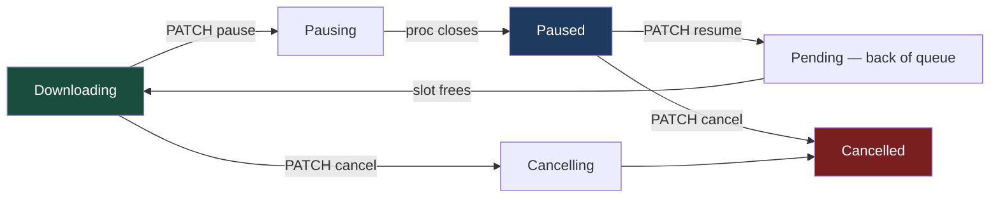
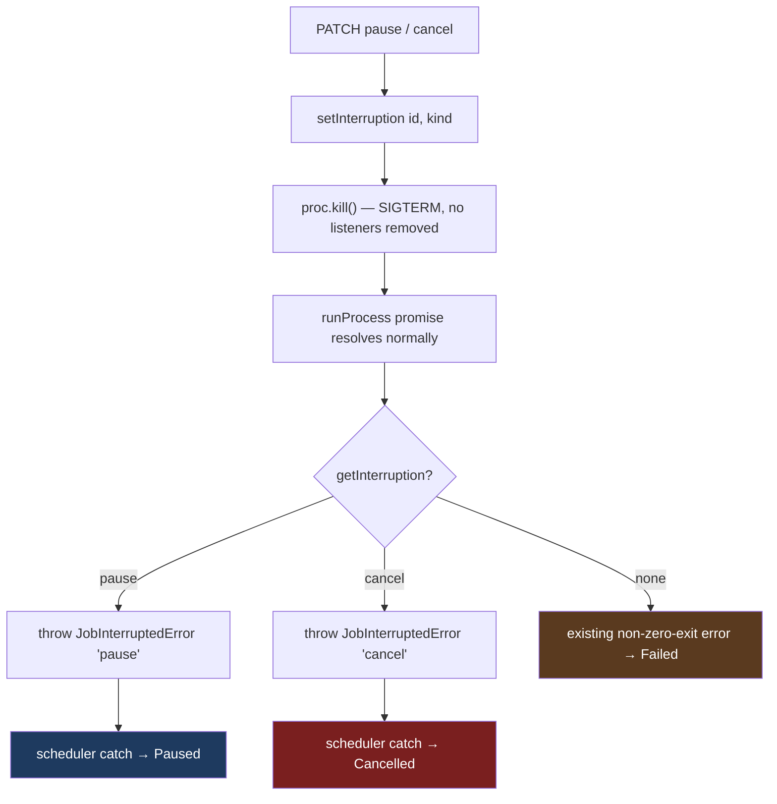
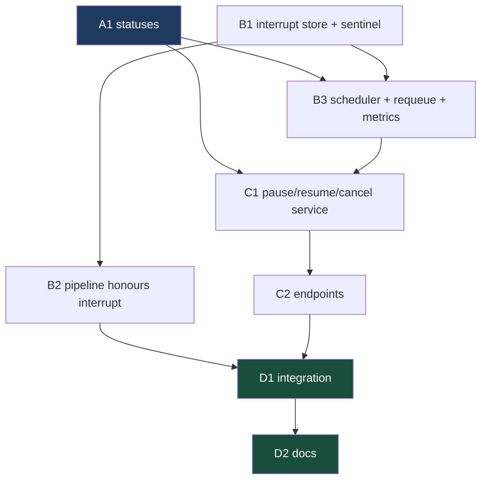

# Phase 5 — Video Pause & Resume — `apps/download`

Implements Phase 5 of [`../backend.md`](../backend.md) (spec:
[`../spec.md`](../spec.md) §2; user story 23). Unlike Phases 3–4 this phase
never touches Radarr/Sonarr — it is entirely about the yt-dlp pipeline in
`apps/download/src/download/`.

## What Phase 5 delivers

Today a video download is start-or-abandon: `PATCH /videos/:id/cancel` kills
yt-dlp and the job ends at `Cancelled`. Phase 5 adds the third option — stop
now, keep the bytes, pick it up later.

| Feature               | In one sentence                                                                    |
| --------------------- | ---------------------------------------------------------------------------------- |
| **Pause**             | `PATCH /videos/:id/pause` kills yt-dlp mid-download and parks the job at `Paused`. |
| **Resume**            | `PATCH /videos/:id/resume` re-queues it; yt-dlp continues from the byte offset.    |
| **Deliberate kills**  | One mechanism tells the pipeline "this process died on purpose", cancel included.  |
| **Cancel that lands** | Cancelling no longer wedges a download slot for the life of the process.           |



> **Backend only.** As with Phases 3 and 4, nothing in the Next.js app calls
> these routes when the phase lands — the frontend has no cancel button today
> either (`grep -rn cancel apps/download/src/app apps/download/src/components`
> is empty). The rebuild consumes them later.

---

## How to work this plan

**Per task:**

1. Work tasks in [wave order](#waves). Never start one before its dependencies
   report green.
2. Implement → write or update tests → run `pnpm test`, `pnpm run lint` and
   `pnpm run type-check` for every touched package.
3. **`/commit`** — one task, one commit (or a small coherent set). `/commit`
   stages at line level, so a stray edit in the same file doesn't ride along.
4. Check the box here and append the commit hash.

**Markers:**

| Marker              | Means                                                               |
| ------------------- | ------------------------------------------------------------------- |
| `- [ ]`             | Not started                                                         |
| `- [x]` … `abc1234` | Done, with the commit that did it                                   |
| ⚠️ **PARTIAL**      | Landed with scope narrowed — say what was left and why, right there |
| ⏭️ **DROPPED**      | Not doing it — say why. **Never delete a task**                     |
| 🚧 / ⏳             | Blocked. Do not implement                                           |

**When reality disagrees with the plan** — and the resume mechanics are the
likely place, since only a progressive-format download has been verified live
— record it inline under the task as a short **Findings** note, then update
the downstream tasks the finding invalidates.

---

## Instructions for the orchestrator agent

You are an **orchestrator**. Your job is delegation, sequencing, and status
tracking — nothing else.

**Do**

- Delegate every task to a sub-agent — implementation, testing, and committing
  included. One sub-agent per task.
- Write **self-contained** delegation prompts. Copy in the task's full text,
  the relevant parts of the [Shared Context Pack](#shared-context-pack), and
  the [Definition of Done](#definition-of-done). When a task depends on names
  an earlier task produced, paste that sub-agent's **reported** outcomes
  (exported names, file paths, method signatures) into the prompt.
- Tell every sub-agent to: implement → write/update tests → run the package's
  tests plus `pnpm run lint` and `pnpm run type-check` for touched packages →
  run `/commit`. Each must report back **files changed, exported names, test
  results, commit hash(es)**.
- Respect the sequencing graph and the
  [collisions](#collisions-that-the-dag-does-not-show) it does not show. All
  work happens on one branch, so **never run two sub-agents that touch the
  same file concurrently** — their `/commit` calls will cross-contaminate.

**Don't**

- ❌ Read or edit any code yourself — no source, no tests, no configs. The only
  file you may edit is _this plan_, to check off tasks.
- ❌ Let sub-agents read this plan.
- ❌ Fix a failing task yourself. Re-delegate with the failure details.
- ❌ Perform any [human checkpoint](#human-checkpoints).

**Finish by** verifying every checkbox is checked, then reporting the
[final status summary](#final-report).

---

## Design decisions

### Two new statuses, and **no migration**

`Pausing` (transient, while the process is dying) and `Paused` (resting,
resumable) — symmetric with the existing `Cancelling`/`Cancelled` pair, and
for the same reason: the transition is deferred to the process's `close`
event, so the HTTP response can't honestly claim the job has already stopped.

Both are **non-terminal**, so `TERMINAL_DOWNLOAD_JOB_STATUSES`
(`packages/utils/src/download/types.ts:45`) is unchanged and
`IN_PROGRESS_DOWNLOAD_JOB_STATUSES` picks them up automatically — which is
what puts a paused job on the Activity feed (`job-query.service.ts:87`).
Correct: a paused job is unfinished work someone still owns.

**Verified: adding them needs no migration.** `jobs.status` is
`text({ enum: DOWNLOAD_JOB_STATUSES })`, and drizzle's SQLite text-enum is a
TypeScript-only constraint — `0000_late_reavers.sql` emits a bare
`` `status` text NOT NULL `` with no CHECK, and `meta/0005_snapshot.json`
records the column with no enum values. So the tuple at `db/schema.ts:38` and
the enum at `packages/utils/src/download/schema.ts:9` are the whole change,
with `statusPin` (`db/schema.ts:76`) failing to compile if either is forgotten.

> ⚠️ **Do not run `pnpm run db:generate` in this phase.** Nothing here changes
> the SQL schema. If a sub-agent runs it and drizzle emits a file, that is a
> signal something went wrong — report it, don't commit it.

### One mechanism for every deliberate kill

Pause and cancel are the same primitive (`proc.kill()`, SIGTERM, no files
deleted) with different outcomes. Today the pipeline can't tell a deliberate
kill from a crash at all: `download()` sees a non-zero exit code and throws,
and `DownloadSchedulerService`'s catch marks the job `Failed`
(`download-scheduler.service.ts:274`).

So the state service grows a small intent record, read by the pipeline at the
one moment it matters:

```ts
// DownloadStateService
interruptions = new Map<string, JobInterruptKind>()   // 'cancel' | 'pause'
setInterruption(id, kind) / getInterruption(id) / clearInterruption(id)
```



`JobInterruptedError` is a sentinel the scheduler branches on before its
generic error handling. Everything else about the catch/`finally` block stays
exactly as it is.

### This fixes a real cancel bug on the way past

`cancelVideoDownloadJob` currently does
`proc.removeAllListeners('close')` (`download.service.ts:304`) before
attaching its own handler. The listener it removes is the one
`runProcess` uses to settle its promise (`download-video.service.ts:484`) — so
after a cancel, `await downloadProcess.promise` never resolves, `download()`
never returns, and the scheduler's `finally`
(`download-scheduler.service.ts:297`) never runs. `inProgressJobs` keeps the
dead job forever. With `MAX_DOWNLOADS=1`, **one cancel wedges the queue until
the process restarts.** The log file stream leaks with it.

The mechanism above removes the need for `removeAllListeners` entirely: the
close listener stays, the promise settles, `download()` throws the sentinel,
the scheduler releases the slot. The observable outcome for cancel is
unchanged (job ends at `Cancelled`) — the leak is what goes away. `convert()`
gets the same check, so cancelling during ffmpeg stops wedging too.

### Pause is only legal while `Downloading`

ffmpeg has no resume, so pausing during the `convert` phase would mean
restarting the transcode from zero — worse than not offering it. Uploading and
cleaning are seconds long. So `pauseVideoDownloadJob` rejects with a
`ConflictException` unless the job's status is exactly `Downloading`, which is
also what makes `getProc(id)` guaranteed to be the yt-dlp handle rather than
the ffmpeg one (`convert()` writes `Converting` before it spawns).

### Resume re-runs `download()` from the top

`resumeVideoDownloadJob` pushes the job id back onto the queue and lets
`maybeProcessNextJob()` pick it up like any other. `download()` then runs
unchanged: it re-fetches metadata, re-spawns yt-dlp in the same
`/download/videos/<jobId>` cwd, and yt-dlp's default `--continue` finds the
`.part` file and resumes from the byte offset.

Deliberately **not** optimized: the metadata re-fetch is a redundant couple of
seconds, and skipping it would mean a second code path through `download()`
whose only job is to be subtly different. The one change the re-entry does
need is that `runProcess` opens `download.log` with `flags: 'a'` so the second
run appends instead of truncating the first run's output.

Resume pushes to the **back** of the queue. A resumed job competes for a slot
on the same terms as a new one; with `MAX_DOWNLOADS` full it sits at `Pending`
until one frees.

### A restart still fails a paused job — on purpose

`reconcileInterruptedJobs` (`db/reconcile-interrupted-jobs.ts:22`) marks every
non-terminal row `failed` at boot, and Phase 5 does not exempt `paused`.

That looks harsh until you check where the bytes live: `VIDEO_DIR` is
`/download/videos`, and **neither `deploy.yml` nor `deploy.dev.yml` mounts a
volume there** — only `/data` (the sqlite file) is persisted. The partial file
sits in the container's writable layer. It survives a process restart inside a
live container and is destroyed by any `up -d --build` / recreate. Meanwhile
the in-memory `DownloadStateService.jobs` Map is gone either way.

So "resume after a restart" would be a promise the deployment can't keep.
Failing the job with `Interrupted by a service restart` is the honest answer,
and it costs zero new code. Making pause durable is a
[deferred item](#out-of-scope) that starts with a volume, not with a status.

### `apps/tdr-bot` stays untouched

The compatibility shim in `packages/utils/src/download/client.ts`
(`TODO(tdr-bot-migration)`) must keep compiling and **must not be modified**.
Adding enum members is additive: `GetDownloadJobResponse`'s pinned key list
(`packages/utils/src/download/__tests__/types.spec.ts:133`) is unaffected, and
tdr-bot's polling loop (`apps/tdr-bot/src/commands/download-command.service.ts`)
compares statuses with plain `===` rather than an exhaustive switch, so a
`paused` job simply keeps polling until its iteration budget runs out. tdr-bot
has no way to pause anything, so that path is unreachable in practice.

### Out of scope

| Not in Phase 5                                | Why                                                                            |
| --------------------------------------------- | ------------------------------------------------------------------------------ |
| Any frontend surface                          | Same as Phases 3–4 — the rebuild consumes these later                          |
| `DownloadClient.pauseJob`/`resumeJob`         | Phases 3–4 added no client methods either; nothing in-repo calls them yet      |
| Pause surviving a restart                     | Needs a volume for `/download/videos` + boot rehydration — see above           |
| A pause/resume timeout or auto-expiry         | No requirement in the spec; a paused job is a user's to resume or cancel       |
| Deleting partial files when a paused job dies | Cancel doesn't clean up a job dir today either — unrelated pre-existing gap    |
| Pausing movie/show jobs                       | Radarr/Sonarr own that queue; the spec scopes pause to the yt-dlp pipeline     |
| Detecting Radarr/Sonarr-side pause/resume     | Undocumented gap, not designed — see [Known gap](#known-gap-radarrsonarr-pauseresume-detection) below |

---

### Known gap: Radarr/Sonarr pause/resume detection

Radarr/Sonarr-managed downloads can be paused/resumed independently of this
app, at the backing download client (qBittorrent, SABnzbd, etc.), either from
Radarr/Sonarr's own queue UI or the client's UI directly. This app has no
design for surfacing that state change:

- The queue API Radarr/Sonarr already expose includes `status: 'paused'`
  (`QueueStatus` in `packages/media/src/{radarr,sonarr}/types.gen.ts`), and
  `MediaPollerService` (`apps/download/src/media/media-poller.service.ts`)
  already polls that queue every 10s. But `deriveStatusFromQueueItem`
  (`apps/download/src/media/queue-status.util.ts:94-125`) does not special-case
  it — `paused` currently falls into the catch-all branch and is reported as
  `Downloading`.
- Radarr/Sonarr fire no Connect-notification event for pause/resume (only
  Grab/Download/Rename/Health Issue/Manual Interaction Required), so polling
  is the only available signal — there is no webhook path to fall back on.
- If this app ever *triggers* pause/resume itself (rather than only observing
  a change made elsewhere), an immediate on-demand queue check right after
  issuing the action — with one short delayed retry, falling back to the
  regular 10s poll as the safety net — would keep the reported state closer
  to real-time than waiting for the next cron tick alone.

No plan exists for this yet; it would need its own phase (or a well-scoped
addition to a future one) rather than folding into Phase 5, which is scoped
entirely to the yt-dlp pipeline.

---

## Shared Context Pack

Copy the relevant parts into every sub-agent prompt. These are pointers, not
gospel — sub-agents should verify against current code.

### Repo & conventions

- pnpm workspaces + Turbo monorepo. App: `apps/download` (`@lilnas/download`,
  NestJS + Next.js hybrid). Contracts: `packages/utils` (`@lilnas/utils`).
- Every file must pass prettier + eslint for its package. Avoid `any`. Run
  `pnpm run lint` and `pnpm run type-check` before committing.
- Tests live in `__tests__/` alongside source (jest + ts-jest, config at
  `apps/download/jest.config.js`, `src/*` and `@lilnas/*` path-mapped).
  Naming is per-directory: `src/download/__tests__/` uses `*.test.ts`,
  `src/db/__tests__/` uses `*.spec.ts`. Match the directory you're in.
- DB tests use `createTestDbService()` / `createTestDb()` from
  `apps/download/src/db/__tests__/test-utils.ts` — in-memory better-sqlite3
  running the **real** migration files.
- Object literal keys are alphabetized throughout this codebase (an eslint
  rule enforces it) — match it, including new enum members and tuple entries.

Anything that transitively imports `nanoid` needs this **first in the file**,
before any other import:

```ts
jest.mock('nanoid', () => ({ nanoid: jest.fn(() => 'mock-id') }))
```

`DownloadService`, `DownloadStateService` and `DownloadController` all pull it
in. See `download/__tests__/download-state.service.test.ts:8` for the
counter-based variant used when a test needs distinct ids.

**Mocking a spawned child process** — the canonical pattern is in
`ytdlp-update/__tests__/ytdlp-update.service.spec.ts:24`:

```ts
jest.mock('child_process')
const mockSpawn = spawn as jest.MockedFunction<typeof spawn>

class MockChildProcess extends EventEmitter {
  stdout = new EventEmitter()
  stderr = new EventEmitter()
  kill = jest.fn()
}
```

`DownloadVideoService.runProcess` also calls `proc.stdout.pipe(stream)` and
`createWriteStream`, so a fake needs `pipe` on both streams (or `fs` mocked)
— see that spec's `jest.mock('fs-extra', …)` block for the shape.

Silence Nest logging in service tests with
`jest.spyOn(Logger.prototype, 'log').mockImplementation()` (and `warn`/`error`
/`debug`), as `media/__tests__/radarr.service.test.ts` does.

### The video pipeline — `apps/download/src/download/`

| File                            | What it is                                                                                  |
| ------------------------------- | ------------------------------------------------------------------------------------------- |
| `download.controller.ts`        | `@Controller('/download')` — the whole HTTP surface; `PATCH /videos/:id/cancel` at line 613 |
| `download.service.ts`           | `getVideoInfo`, `createVideoDownloadJob`, `cancelVideoDownloadJob` (277)                    |
| `download-scheduler.service.ts` | Queue + `maybeProcessNextJob()`; runs download→convert→upload→clean, `catch` at 274         |
| `download-video.service.ts`     | The four pipeline steps + private `runProcess()` (447); `VIDEO_DIR = '/download/videos'`    |
| `download-state.service.ts`     | `addJob()`/`updateJob()` — the **only** job-mutation choke points; `procs` helpers at 71    |
| `download-metrics.service.ts`   | prom-client counters/gauges/histograms, all module-level `register`-scoped                  |
| `job-query.service.ts`          | Activity/history/gallery reads; activity filters on `IN_PROGRESS_…_STATUSES` (87)           |
| `attribution.ts`                | `projectJobForViewer()` — every route's response passes through it                          |
| `download.module.ts`            | Providers/exports; `forwardRef` ↔ `media/media.module.ts`                                  |

Facts worth having up front:

- `DownloadService` already injects `DownloadSchedulerService`,
  `DownloadStateService` and `DownloadMetricsService` — no constructor change
  needed for pause/resume.
- `DownloadSchedulerService.maybeProcessNextJob()` is **private**. Re-queueing
  needs a new public method rather than a second caller of `add()`, which
  routes through `addJob()` and would re-broadcast a `Created` event for a job
  every client already knows about.
- `DownloadStateService.updateJob()` auto-clears the proc handle only on a
  **terminal** status (`download-state.service.ts:308`). `Paused` is not
  terminal, so the pause transition must call `clearProc(id)` itself.
- `Queue` (`packages/utils/src/queue.ts`) is a plain linked list with
  `push`/`pop`/`delete`/`size`/`isEmpty`. `push` appends.
- `getVideoFiles()` filters on `.mp4/.mkv/.webm`
  (`download-video.service.ts:26`), so yt-dlp's `.part` file is invisible to
  it — a paused job legitimately has zero video files and that is not an error.

### API contract layer — `packages/utils/src/download/`

- `schema.ts` holds zod schemas and the two enums (source of truth);
  `types.ts` derives TS types via `z.infer` and owns the terminal/in-progress
  partition. Both files carry `// ---- Phase N ----` banner comments
  (`schema.ts:175`, `:276`; `types.ts:258`).
- `DownloadJobStatus` (`schema.ts:9`) is a plain string enum, alphabetized by
  member name.
- `packages/utils/src/download/__tests__/types.spec.ts:92` asserts the
  terminal/in-progress sets partition `Object.values(DownloadJobStatus)`
  exactly — that test is derived, so it keeps passing when a member is added,
  and it is the thing that catches a member accidentally landing in the
  terminal list.
- ⚠️ Do **not** modify the `TODO(tdr-bot-migration)` shim block in `client.ts`.

### DB layer — `apps/download/src/db/`

- `schema.ts:38` — `DOWNLOAD_JOB_STATUSES`, the tuple `jobs.status` is typed
  against, pinned to the TS enum by `statusPin` at line 76 via
  `AssertSameUnion`. Alphabetized.
- `reconcile-interrupted-jobs.ts` — boot-time sweep, run from
  `bootstrap.ts:28` right after `checkIntegrity()`.
- Migrations in `db/migrations/` — `0000`–`0005` exist. **Phase 5 adds none.**
- `job-row.ts` — `buildJobRow()`/`hydrateJobRow()`. `status` round-trips as a
  bare string cast, so a new member needs no change here.

### Definition of Done

Include this **verbatim** in every delegation:

> **Done means:** code implemented; unit tests written or updated following the
> package's existing `__tests__` conventions and passing (`pnpm test` in the
> touched package); `pnpm run lint` and `pnpm run type-check` clean for every
> touched package; work committed via `/commit`. Report back: files changed,
> exported names introduced, test summary, commit hash(es).

**Addendum for every task in this phase:** do **not** run
`pnpm run db:generate`. Phase 5 changes no SQL schema; if you believe a
migration is needed, stop and report it instead of generating one.

---

## Task List

### Group A — Contracts

- [x] **A1. `Paused` / `Pausing` statuses.** Two files, no migration: — `222e61ec`
  - `packages/utils/src/download/schema.ts` — add `Paused = 'paused'` and
    `Pausing = 'pausing'` to the `DownloadJobStatus` enum (line 9), in
    alphabetical position between `Importing` and `Pending`.
  - `apps/download/src/db/schema.ts` — add `'paused'` and `'pausing'` to the
    `DOWNLOAD_JOB_STATUSES` tuple (line 38), same alphabetical position.
    `statusPin` (line 76) is what fails to compile if only one side changes;
    leave it as it is.

  Do **not** touch `TERMINAL_DOWNLOAD_JOB_STATUSES`
  (`packages/utils/src/download/types.ts:45`) — both new statuses are
  non-terminal, which is what puts them on the Activity feed and what makes a
  restart sweep them to `failed`. Add a short comment on the enum members
  saying so, and pointing at `reconcile-interrupted-jobs.ts` for the restart
  behaviour.

  Verify (and state in your report) that no migration is emitted: the
  `status` column has no CHECK in any file under `db/migrations/`, and
  `meta/0005_snapshot.json` records it as a plain `text` column with no enum
  values.

  Tests:
  - `packages/utils/src/download/__tests__/types.spec.ts` — add a case
    asserting `Paused`/`Pausing` are in-progress, not terminal, and that
    `TERMINAL_DOWNLOAD_JOB_STATUSES` still has length 3. The existing
    partition test at line 92 must pass untouched.
  - `apps/download/src/db/__tests__/reconcile-interrupted-jobs.spec.ts` — seed
    a `paused` row and assert the sweep marks it `failed` with the interruption
    error. This is a **deliberate** behaviour, not an oversight; say so in the
    test name.
  - `apps/download/src/db/__tests__/schema.spec.ts` — round-trip a job row at
    `paused` through the real migrations, proving no CHECK rejects it.

### Group B — The interrupt mechanism

- [x] **B1. Deliberate-interrupt bookkeeping + the sentinel error.** Two
      files: — `238ab01f`
  - New `apps/download/src/download/job-interrupted.error.ts`:

    ```ts
    export type JobInterruptKind = 'cancel' | 'pause'

    export class JobInterruptedError extends Error {
      constructor(
        readonly jobId: string,
        readonly kind: JobInterruptKind,
      ) { … }
    }
    ```

    Set `this.name` and call `Object.setPrototypeOf(this, new.target.prototype)`
    — ts-jest compiles to a target where `instanceof` on a subclassed `Error`
    breaks without it, and the scheduler's branch is an `instanceof` check.

  - `apps/download/src/download/download-state.service.ts` — a new
    `interruptions = new Map<string, JobInterruptKind>()` alongside `procs`,
    with `setInterruption(id, kind)`, `getInterruption(id)` and
    `clearInterruption(id)`. Document it the way `procs` and `queueSnapshots`
    are: why it exists (a killed process looks identical to a crashed one) and
    why it is never persisted (it describes an in-flight process, and a
    restart kills the process anyway).

    Clear it alongside `clearProc(id)` in `updateJob()`'s terminal-status
    branch (line 308) so a cancelled/failed/completed job can't leave a stale
    intent behind.

  Edge cases: `setInterruption` on a job id with no proc is legal — the caller
  guards, not the store. Setting an interruption twice is last-write-wins, not
  an error.

  Tests: extend `download/__tests__/download-state.service.test.ts` — set/get/
  clear round trip, and that a terminal `updateJob()` transition clears both
  the proc handle and the interruption while a non-terminal one leaves them.

- [x] **B2. The pipeline honours the interrupt.** — `4dc19883` — In
      `apps/download/src/download/download-video.service.ts`:
  - In `download()`, after `await downloadProcess.promise` resolves and
    **before** the `code !== 0` check, read
    `this.downloadStateService.getInterruption(job.id)`; if set, throw
    `new JobInterruptedError(job.id, kind)`. Order matters — a deliberate kill
    always produces a non-zero code, so the interrupt check has to win.
  - Apply the identical check in `convert()` after its process resolves. Only
    `'cancel'` can ever reach it (pause is refused outside `Downloading`), but
    the check is what stops a cancel-during-ffmpeg from being logged as a
    pipeline failure.
  - In `runProcess()` (line 447), open the log file in append mode:
    `createWriteStream(path, { encoding: 'utf-8', flags: 'a' })`. Without
    this, a resumed download truncates the first run's `download.log`.

  The existing `log('error', …, 'Download failed')` in `download()`'s catch
  must **not** fire for an interrupt — a deliberate pause is not an error.
  Re-throw the sentinel before that logging, or branch inside the catch; say
  which you did.

  Edge cases: an interrupt set *after* the process already exited cleanly
  (a pause racing a completing download) still throws — the job parks at
  `Paused` with a complete `.part`-free file on disk, and resuming it re-runs
  yt-dlp, which exits immediately with "already downloaded". Acceptable; note
  it in a comment rather than trying to detect it.

  Tests: new `download/__tests__/download-video.service.test.ts` using the
  `jest.mock('child_process')` + `MockChildProcess` pattern from
  `ytdlp-update/__tests__/ytdlp-update.service.spec.ts:24`. Cover: a clean
  exit still succeeds; a non-zero exit with no interruption still throws the
  existing stderr-tail error; a non-zero exit with a `'pause'` interruption
  throws `JobInterruptedError` carrying `kind: 'pause'`; the same for
  `'cancel'` in both `download()` and `convert()`; and that the log stream is
  opened with an append flag.

- [x] **B3. Scheduler maps the sentinel; queue re-entry; metrics.** — `5e627d77` — Two files
      — **needs A1 and B1**:

  **Findings (B3):** ① The pause branch clears the interruption too, not just
  cancel. `Paused` is non-terminal so `updateJob()`'s auto-clear never fires,
  and B2's `assertNotInterrupted()` reads the note after *every* process exit —
  a surviving `'pause'` note would make a resumed job re-pause itself the
  moment its new yt-dlp finished. Clearing is idempotent, so C1 clearing it
  again on resume is harmless. ② `requeue()` deliberately does **not** change
  the job's status; C1's resume path owns the `Paused → Pending` transition.
  ③ Cancel books no metric in the scheduler — `download.service.ts` already
  calls `metrics.jobCompleted('cancelled')` at the point of cancellation.
  ④ No `sort-keys` eslint rule actually exists in
  `packages/eslint-config-lilnas/base.js` — the alphabetized-keys convention is
  real but unenforced.
  - `apps/download/src/download/download-scheduler.service.ts` — in the
    `catch` at line 274, branch on `err instanceof JobInterruptedError`
    **before** the existing `getErrorMessage`/`Failed` handling:

    ```
    kind 'pause'  → updateJob(id, { status: Paused }),  clearProc(id), metrics.jobPaused()
    kind 'cancel' → updateJob(id, { status: Cancelled }), clearInterruption(id)
    ```

    Neither branch writes an `error` on the job — an interrupt is not a
    failure — and neither calls `metrics.jobCompleted('failed')`. Log it at
    `log` level with the existing structured shape (`action`, `jobId`,
    `mediaId`, `totalDuration`), not `error`.

    The `finally` block (line 297) is unchanged and is what makes this worth
    doing: it deletes the job from `inProgressJobs` and calls
    `maybeProcessNextJob()`, so a paused job frees its download slot
    immediately.

    `clearProc` is explicit for the pause branch because `Paused` is
    non-terminal and `updateJob()`'s auto-clear (`download-state.service.ts:308`)
    only fires on terminal statuses. The cancel branch gets it for free; clear
    the *interruption* there instead.

  - Add a public `requeue(id: string): void` — pushes an existing job id onto
    `queue`, updates the queue-depth gauge, and calls the private
    `maybeProcessNextJob()`. It must **not** route through
    `downloadStateService.addJob()`, which would re-persist and re-broadcast a
    `Created` event for a job every client already has. Log it with the same
    shape `add()` uses.

  - `apps/download/src/download/download-metrics.service.ts` — add
    `download_jobs_paused_total` and `download_jobs_resumed_total` counters
    with `jobPaused()` / `jobResumed()` methods, following the file's existing
    module-level `new Counter({ …, registers: [register] })` style. Both live
    here even though only `jobPaused()` is called from this task — C1 calls
    `jobResumed()`, and splitting them across two tasks would put two agents
    in this file.

  Edge cases: a `JobInterruptedError` for a job that is no longer in the
  `jobs` Map (deleted mid-flight) must not throw out of the catch —
  `updateJob()` throws on a missing id, so guard or catch it and log.

  Tests: new `download/__tests__/download-scheduler.service.test.ts` with a
  mocked `DownloadVideoService` whose `download()` rejects with a
  `JobInterruptedError`. Cover: pause → job ends `Paused` with no `error`
  field and the proc cleared; cancel → job ends `Cancelled`; a plain `Error`
  → still `Failed` with the message (the no-regression case); **the in-progress
  slot is released in all three** and the next queued job starts; `requeue()`
  pushes and triggers processing without emitting a `Created` event;
  `requeue()` when `MAX_DOWNLOADS` is saturated leaves the job queued.

### Group C — Service & HTTP

- [x] **C1. `pause` / `resume`, and cancel rewritten onto the shared path.** — `010a367a` —
      In `apps/download/src/download/download.service.ts` — **needs A1, B1,
      B3**:

  **Findings (C1):** ① `resumeVideoDownloadJob` returns `jobs.get(id) ?? pending`,
  not the record `updateJob(Pending)` returned. `requeue()` →
  `maybeProcessNextJob()` → `download()` run synchronously up to `download()`'s
  first `await`, and `download()` writes `Downloading` before that point
  (`download-video.service.ts:236`) — so with a free slot the `Pending` snapshot
  is already stale by the time the method returns, and the response would race
  the `Updated` broadcast from the same transition. ② `Pausing` is deliberately
  **not** resumable: pause-then-immediately-resume returns 409 during the brief
  `Pausing` window, because the old yt-dlp is still winding down and requeueing
  would run a second one against the same `.part` file. A frontend should
  disable resume until the job reads `paused`.

  ```ts
  pauseVideoDownloadJob(id: string): Promise<DownloadJob>
  resumeVideoDownloadJob(id: string): Promise<DownloadJob>
  ```

  `pauseVideoDownloadJob`:
  1. `jobs.get(id)` — a pausable job is by definition live, so no DB fallback.
     Missing → `NotFoundException`.
  2. Not a video job → `BadRequestException`.
  3. `status !== DownloadJobStatus.Downloading` → `ConflictException` naming
     the current status. This is the guard that keeps pause off the ffmpeg
     phase *and* guarantees `getProc(id)` is the yt-dlp handle.
  4. No proc → `ConflictException`.
  5. `setInterruption(id, 'pause')` → `proc.kill()` →
     `updateJob(id, { status: Pausing })`. Return the hydrated job.

  `resumeVideoDownloadJob`:
  1. `jobs.get(id)`; missing → `NotFoundException`; non-video →
     `BadRequestException`.
  2. `status !== Paused` → `ConflictException`.
  3. `clearInterruption(id)` → `updateJob(id, { status: Pending })` →
     `downloadScheduler.requeue(id)` → `metrics.jobResumed()`. Return the
     hydrated job.

  **Rewrite `cancelVideoDownloadJob` (line 277) onto the same mechanism.**
  Delete the `proc.removeAllListeners('close')` + `proc.once('close', …)`
  block entirely — that is the wedge described in
  [Design decisions](#this-fixes-a-real-cancel-bug-on-the-way-past). It
  becomes: `setInterruption(id, 'cancel')` → `proc.kill()` →
  `metrics.jobCompleted('cancelled')` → `downloadScheduler.delete(id)` →
  `updateJob(id, { status: Cancelling })`. The scheduler's catch now owns the
  `Cancelling → Cancelled` transition.

  Also: **cancelling a `Paused` job must work.** It has no proc and is not in
  the queue, so the existing "job has not started" throw would strand it as
  un-abandonable. Branch early: status `Paused` → `updateJob(id, { status:
  Cancelled })` + `metrics.jobCompleted('cancelled')` and return, with no kill
  and no scheduler call.

  Other edge cases, all of which need a test:
  - Double pause (`Pausing` or `Paused`) → `ConflictException`, not a second
    kill.
  - Resume twice → the second is a `ConflictException` (status is `Pending` or
    `Downloading` by then).
  - Pause a `Pending`, queued-but-unstarted job → `ConflictException` with a
    message that says only a downloading job can be paused. Cancelling one is
    still the existing "has not started" error — **do not** change that; it is
    a pre-existing gap and widening it here is unrelated scope.
  - Cancel/pause/resume on a movie or show job → `BadRequestException`, same
    branch as today's `job.type !== DownloadType.Video` check.

  Use Nest's `NotFoundException`/`BadRequestException`/`ConflictException`
  rather than bare `Error`s for the **new** methods, so C2's routes map
  correctly without a translation layer. Leave `cancelVideoDownloadJob`
  throwing bare `Error`s as it does today — `cancelVideoJob` in the controller
  catches everything and re-throws a 404, and changing that is C2's business
  to leave alone.

  Tests: new `download/__tests__/download.service.test.ts` (the file does not
  exist yet) with mocked `DownloadSchedulerService`, `DownloadStateService`
  and `DownloadMetricsService`. Cover every branch above, plus: pause sets the
  interruption **before** killing (assert call order — killing first races the
  close handler), and resume calls `requeue`, not `add`.

- [x] **C2. Pause/resume endpoints.** — `58ec2a43` — In
      `apps/download/src/download/download.controller.ts`:

  **Findings (C2):** ① The two routes are thin wrappers over a new private
  `videoInterruptRoute()` helper, so the "log and re-throw, don't swallow into
  a 404" divergence from `cancelVideoJob` lives in exactly one place.
  `cancelVideoJob` itself is byte-for-byte unchanged. ② The success log uses
  `inProgressJobs` as this plan specified, while `cancelVideoJob` uses
  `inProgressJobsRemaining` for the same value — a cosmetic key-name
  inconsistency across the three interrupt routes, left as spec'd.

  | Route                          | Auth                     | Returns                            |
  | ------------------------------ | ------------------------ | ---------------------------------- |
  | `PATCH /download/videos/:id/pause`  | `@OptionalCurrentUser()` | The job, `projectJobForViewer`'d  |
  | `PATCH /download/videos/:id/resume` | `@OptionalCurrentUser()` | The job, `projectJobForViewer`'d  |

  - Model them on `cancelVideoJob` (line 613): same
    `Promise.all([serviceCall, this.resolveIsAdmin(user)])` shape, same
    structured logging (`action`, `jobId`, `mediaId`, `newStatus`, `duration`,
    `statusCode`, `inProgressJobs`), same `projectJobForViewer(job, isAdmin)`
    on the way out. Place them immediately after `cancelVideoJob`.
  - ⚠️ **Do not copy `cancelVideoJob`'s catch block.** It swallows every error
    into a 404, which would turn C1's `ConflictException` ("job isn't
    downloading") into "job not found". Let Nest's exception filter map what
    the service throws; log the failure and re-throw. Say in your report that
    this is a deliberate divergence from the sibling route.
  - No new DTOs — both routes take a path param and no body.
  - No admin gate, matching cancel.

  Tests: extend `download/__tests__/download.controller.video.test.ts` (add
  `pauseVideoDownloadJob`/`resumeVideoDownloadJob` to its
  `mockDownloadService` at line 51). Cover: pause and resume happy paths for
  admin and non-admin viewers (proving `projectJobForViewer` still masks
  hidden attribution); a `ConflictException` from the service surfaces as a
  409, **not** a 404; a `NotFoundException` surfaces as a 404.

### Group D — Verification & documentation

- [x] **D1. Integration checkpoint.** — verification only, nothing needed fixing, no commit (HEAD stayed `58ec2a43`). Must see **every** prior commit.

  **Findings (D1):** ① `apps/download` `pnpm test` — 45/46 suites, 755 passed;
  the only failing suite is the pre-existing environmental
  `ytdlp-update.integration.spec.ts` (9× `EACCES` on `/usr/bin/yt-dlp`).
  `packages/utils` — 5 suites, 166 passed. Repo-wide `lint` 14/14,
  `type-check` 12/12, `build` 12/12 including a cold `0 cached` run.
  `apps/tdr-bot` compiles clean against the untouched shim
  (`git diff 959ad031..HEAD -- packages/utils/src/download/client.ts` is empty).
  No new migration; `db:generate` was never run. `media.module.test.ts` +
  all five `download.controller.*.test.ts` → 6 suites / 45 passed, no testing
  module needed a new mock. ② **Pre-existing infra hazard, not caused by this
  phase:** `turbo.json` gives `test`/`type-check` no `dependsOn: ["^build"]`,
  and `packages/utils` exports only `./dist/*.js`. Tests are insulated by
  jest's `moduleNameMapper` (source-mapped), but `type-check` fails hard from a
  genuinely cold checkout until something builds `packages/utils`. Proven by
  moving `dist` aside: tests unchanged, `type-check` exits 2 with `TS2307`.
  ③ **Pre-existing build race, not caused by this phase:** `apps/download`'s
  `build` is `run-p build:*`, so `next build` rewrites `.next/types/` while
  `nest build --type-check` enumerates it via the `.next/types/**/*.ts` include
  at `apps/download/tsconfig.json:39` → intermittent `TS6053`. Seen once, did
  not reproduce across three later builds including a clean `--force` run.
  - `pnpm test` green in `apps/download` **and** `packages/utils`.
  - `pnpm run lint` and `pnpm run type-check` green repo-wide.
  - `pnpm run build` green repo-wide — in particular `apps/tdr-bot`, which
    must still compile against the unmodified client shim.
  - Confirm `git status` shows **no new file under
    `apps/download/src/db/migrations/`**. If one exists, something ran
    `db:generate`; report it rather than committing it.
  - Confirm the whole `DownloadModule` still resolves through the real DI
    graph — no new providers were added by this phase, but
    `download-scheduler.service.ts` gained a public method and
    `download-metrics.service.ts` gained counters, so re-run
    `media/__tests__/media.module.test.ts` and every
    `download.controller.*.test.ts` to be sure nothing's testing module needs
    a new mock.

  Report anything that needed fixing as a **Findings** note under the task
  that caused it.

- [x] **D2. Update `backend.md` and record manual verification.** — `0f5e618a` — In
      `docs/features/download/backend.md`, rewrite the Phase 5 section the way
      Phase 3's is written:
  - A **Status: done** line with the commit list.
  - A "What shipped" route table.
  - The design decisions that survived contact: the single interrupt
    mechanism, the cancel-wedge fix, pause-only-while-downloading, and
    **explicitly** the restart limitation with its reason (no volume behind
    `/download/videos`), so the next reader doesn't rediscover it as a bug.
  - A **Deferred** list carrying [Out of scope](#out-of-scope) forward.
  - A **Manual verification** block of runnable `curl`s covering: start a
    long download → `PATCH pause` → confirm the job reads `paused` and the
    `.part` file's size stops growing (`docker-compose exec download ls -l
    /download/videos/<jobId>`) → `PATCH resume` → confirm `download.log`
    contains a `Resuming download at byte …` line and the file grows from
    there rather than restarting at zero → job completes. Plus: pausing a
    non-downloading job returns 409; cancelling a paused job returns it to
    `cancelled`; and — the one that proves the wedge fix — with
    `MAX_DOWNLOADS=1`, cancel a running job and confirm the **next queued job
    starts** instead of the queue stalling.
  - Record any **Findings** the earlier tasks logged, especially anything
    about fragmented-DASH or clip-range resume.

  ⚠️ Do not _run_ the verification block. It spawns real yt-dlp against real
  hosts — that is a [human checkpoint](#human-checkpoints).

---

## Sequencing

### Dependency DAG



### Waves

| Wave | Run     | Why it works                                                                                                     |
| ---- | ------- | ---------------------------------------------------------------------------------------------------------------- |
| 1    | A1 ∥ B1 | A1 owns the two schema files; B1 owns `download-state.service.ts` + a new file. Zero overlap, no dependency.     |
| 2    | B2 ∥ B3 | `download-video.service.ts` vs `download-scheduler.service.ts` + `download-metrics.service.ts`. Disjoint.        |
| 3    | C1      | Alone — it is the only consumer of both B3's `requeue()` and B1's store, and it rewrites `cancelVideoDownloadJob` |
| 4    | C2      | Needs C1's exception types to assert against                                                                     |
| 5    | D1      | Must see every prior commit                                                                                      |
| 6    | D2      | Documents what D1 proved                                                                                         |

### Dependency table

| Task | Depends on | Parallel with |
| ---- | ---------- | ------------- |
| A1   | —          | B1            |
| B1   | —          | A1            |
| B2   | B1         | B3            |
| B3   | A1, B1     | B2            |
| C1   | A1, B3     | —             |
| C2   | C1         | —             |
| D1   | B2, C2     | —             |
| D2   | D1         | —             |

### Collisions that the DAG does not show

| Collision                | Where                                                                                                                    |
| ------------------------ | ------------------------------------------------------------------------------------------------------------------------ |
| **Same file**            | Only B1 may edit `download-state.service.ts`; only C1 may edit `download.service.ts`; only C2 may edit the controller     |
| **Shared manifest**      | `download-metrics.service.ts` is B3's alone — both counters land there even though C1 calls one of them                   |
| **Sequential numbering** | None. **No task in this phase generates a migration** — if one appears, stop                                             |
| **Concurrent `/commit`** | Every task commits to the **same branch**. The waves above are what keeps staging from interleaving — do not widen one   |

### Critical path

`A1 → B3 → C1 → C2 → D1 → D2` — six serial steps. **B3 leads**: it is the
longest task in the chain (a scheduler branch, a new public method, two
counters, and a test file that has to stand up the scheduler from scratch),
and C1 can't start without its `requeue()`. Start B3 the moment A1 reports.

B1 and B2 sit off the critical path and can absorb slack, but B2 gates D1 —
don't leave it until last.

---

## Human checkpoints

The executor must **not** do any of these. Stop and hand back.

1. **Verify resume against the format the app actually downloads.** The spec's
   live test (`spec.md:45`) used a progressive format (`-f worst` → itag 18).
   The app forces no format, so a default YouTube grab may resolve to
   fragmented DASH, which resumes per-fragment through a different mechanism.
   _Checking for:_ whether resume actually continues, or silently restarts
   from zero. Record a **Findings** note either way.
2. **Verify resume for a clip job.** A `timeRange` download adds
   `--download-sections` + `--force-keyframes-at-cuts`
   (`download-video.service.ts:272`), which routes through a different
   downloader. _Checking for:_ whether the `.part` resume applies at all, or
   whether a paused clip restarts.
3. **Run the manual verification block** from D2. It spawns real yt-dlp
   against real hosts and needs a running container to inspect
   `/download/videos/<jobId>`. _Checking for:_ the byte-offset resume and the
   `MAX_DOWNLOADS=1` cancel-then-next-job behaviour, neither of which a unit
   test can prove.
4. **Decide on a `/download/videos` volume.** Making pause survive a restart
   needs one, plus the `chown 1000:1000` the `/data` mount already documents
   in `deploy.yml`. _Checking for:_ whether that's wanted at all — it is a
   deploy change with a host prerequisite, and this phase deliberately ships
   without it.
5. **Deploy.** `docker-compose up -d download` from the repo root, per
   `CLAUDE.md` — never from `apps/download/deploy.yml` directly.

---

## Final report

When the last box is checked, report:

1. **Per-task outcome**, with commit hashes, in task-id order.
2. **Test results** — per package (`apps/download`, `packages/utils`) and
   repo-wide `lint` / `type-check` / `build`.
3. **Deviations from the plan**, and why — especially anything the cancel
   rewrite forced.
4. **Deferred items**, including every human checkpoint still outstanding.
5. **Open questions** discovered during implementation.
