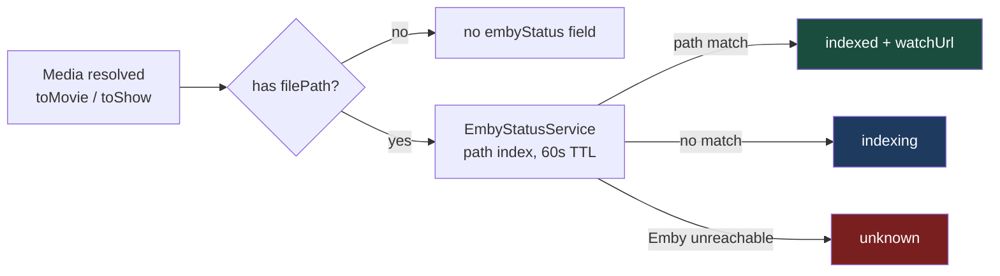
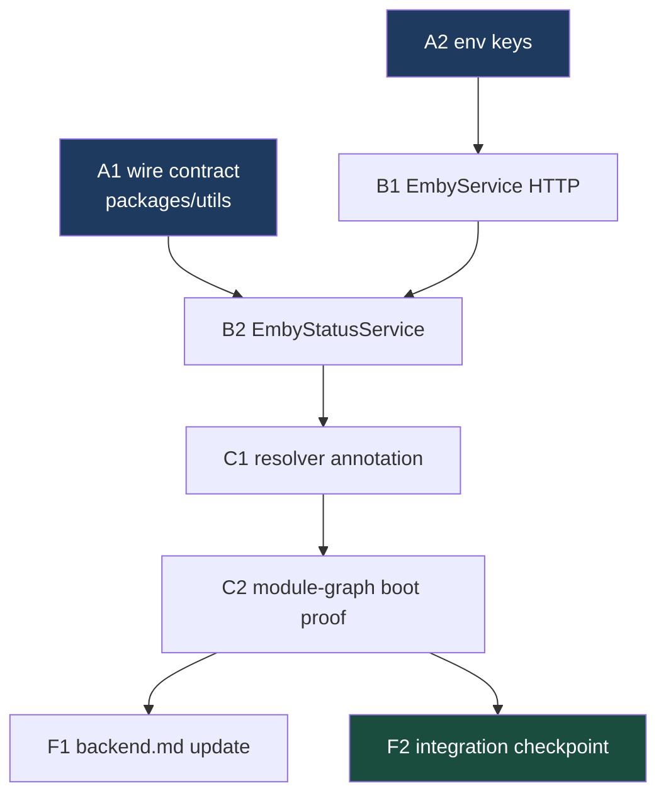

# Phase 6 — Emby Playback Handoff — `apps/download`

Implements Phase 6 of [`../backend.md`](../backend.md) (spec:
[`../spec.md`](../spec.md) Playback model + §4/§5/§7; user stories 7–8).
Builds on the media entity refactor
([`001-media-entity-refactor.md`](001-media-entity-refactor.md)) — the
indexed-check reads `media.filePath` off the resolved `Media`, never a `jobs`
column.

## What Phase 6 delivers

Today the API can say a movie/show is _downloaded_ (`filePath` on the resolved
`Media`), but not whether Emby has picked it up — so the frontend rebuild has
no way to render the spec's Watch / "Indexing…" split. Phase 6 closes that.

| Feature            | In one sentence                                                                                     |
| ------------------ | --------------------------------------------------------------------------------------------------- |
| **Indexed-check**  | Every resolved `Movie`/`Show` with a file now carries `embyStatus`, matched by on-disk path.        |
| **Watch link**     | An indexed title carries a ready-to-use `watchUrl` deep-linking into Emby's web client.             |
| **Indexing state** | A downloaded-but-not-yet-scanned title reports `indexing`, so the UI shows "Indexing…", not broken. |
| **Degradation**    | Emby down → `unknown`, never a 500 — same philosophy as `degradedSources` on the resolver.          |



> **Backend only.** As with Phases 3–5, nothing in the Next.js app renders
> these fields when the phase lands. The frontend rebuild consumes them later.
> Videos are untouched: the spec is explicit (spec.md:16-17) that videos play
> in-app and only movies/shows hand off to Emby.

---

## How to work this plan

**Per task:**

1. Work tasks in [wave order](#waves). Never start one before its dependencies
   report green.
2. Implement → write or update tests → run `pnpm test`, `pnpm run lint` and
   `pnpm run type-check` for every touched package.
3. **`/commit`** — one task, one commit (or a small coherent set). `/commit`
   stages at line level, so a stray edit in the same file doesn't ride along.
4. Check the box here and append the commit hash.

**Markers:**

| Marker              | Means                                                               |
| ------------------- | ------------------------------------------------------------------- |
| `- [ ]`             | Not started                                                         |
| `- [x]` … `abc1234` | Done, with the commit that did it                                   |
| ⚠️ **PARTIAL**      | Landed with scope narrowed — say what was left and why, right there |
| ⏭️ **DROPPED**      | Not doing it — say why. **Never delete a task**                     |
| 🚧 / ⏳             | Blocked. Do not implement                                           |

**When reality disagrees with the plan** — and the Emby API shapes are the
likely place, since no app code here has ever been exercised against the live
instance — record it inline under the task as a short **Findings** note, then
update the downstream tasks the finding invalidates.

---

## Instructions for the orchestrator agent

You are an **orchestrator**. Your job is delegation, sequencing, and status
tracking — nothing else.

**Do**

- Delegate every task to a sub-agent — implementation, testing, and committing
  included. One sub-agent per task.
- Write **self-contained** delegation prompts. Copy in the task's full text,
  the relevant Context Pack sections, the Definition of Done, and — when the
  task depends on an earlier one — the actual names the earlier sub-agent
  reported (exported names, file paths, method signatures).
- Track wave order; only start a task when its dependencies report green.
- Record each task's outcome (files changed, exports, commit hash) in this
  document before starting its dependents.

**Don't**

- ❌ Read or edit source, tests, or config yourself. The **only** file you may
  edit is this plan, to check boxes and record outcomes.
- ❌ Fix a failing task yourself — re-delegate with the failure details.
- ❌ Let sub-agents read this plan doc. Their prompts are self-contained.
- ❌ Run tasks concurrently when they collide (see
  [Collisions](#collisions-that-the-dag-does-not-show)) — and never let two
  sub-agents run `/commit` on this branch at the same time.

**Finish by** verifying every checkbox is checked, then reporting the
[final status summary](#final-report).

---

## Design decisions

### The theater `EmbyModule` does not exist — Phase 6 is greenfield

`backend.md` (Phase 6 section) claims the old theater Emby module is "intact
on the unmerged local branch `feat/theater-app`". **That is false.**
`feat/theater-app` (`832a6fde`) is a single scaffold commit with no `emby`
directory, and `git rev-list --all --objects | grep -i emby` returns zero
objects across all 565 commits. The only Emby client code ever written
(`packages/tdr-bot/src/media/clients/emby.client.ts`) was never committed,
never executed (0% coverage), doesn't typecheck against its own base class,
and survives only inside a coverage-report HTML file in another worktree. The
"hard-won gotchas" backend.md cites (`PlaybackInfo` 500s without `UserId`;
`DirectStreamUrl` mirroring `TranscodingUrl`) appear nowhere in the repo, and
neither does any `resolveUserId()` implementation.

Consequence: **do not go digging for prior art — there is none to port.**
Everything below is written fresh, and task F1 corrects backend.md's
provenance claims so the next reader isn't sent down the same hole.

### API shape follows the one verified in-repo caller

The single piece of Emby integration that has demonstrably worked against the
live instance is the design-asset fetcher
`docs/features/download/designs/assets/fetch-assets.sh` (lines 19, 29, 43):

- Base path prefix **`/emby`**: `GET {EMBY_URL}/emby/Users`,
  `GET {EMBY_URL}/emby/Users/{userId}/Items?...`.
- Auth via **`api_key` query parameter** (Emby also accepts an
  `X-Emby-Token` header, but that variant is unverified here; the calls are
  container-to-container, so the query param's log-leak surface is
  acceptable — note it in a comment).
- Items queries use `IncludeItemTypes`, `Recursive=true`, `Fields`.

The new client uses exactly these shapes. What fetch-assets.sh does **not**
prove — `Fields=Path` actually returning `Path`, whether a Movie item's
`Path` is the file or its folder, the deep-link URL resolving in a browser,
and whether an unpaged `/Items` call returns the whole library — is what
[human checkpoint 1](#human-checkpoints) pins down, ideally **before or
during Wave 2** so a wrong assumption is caught while it's cheap.

### Indexed-check: path match against a cached library index — no table, no poller

Per backend.md, matching is **by on-disk path**, not title/year (Emby can
render titles differently than Radarr/Sonarr). The mounts make this work:
`infra/media.yml` mounts `/storage/media-library/movies` as `/movies` in
**both** Radarr (line 31) and Emby (line 65), and `/storage/media-library/tv`
as `/tv` in both Sonarr (line 12) and Emby (line 64). So Radarr/Sonarr's
reported paths and Emby's `Path` should be byte-identical. The comparison
still normalizes trailing slashes and asserts nothing else — if the mounts
ever diverge, the status degrades to `indexing`, which is visible and
diagnosable, not silently wrong.

What gets matched:

| Media type | `filePath` contains (verified)                                     | Matched against Emby item             |
| ---------- | ------------------------------------------------------------------ | ------------------------------------- |
| `Movie`    | Absolute path to the movie **file** (`radarr.service.ts:111`)      | `IncludeItemTypes=Movie` item `Path`  |
| `Show`     | The **series folder**, not episode files (`sonarr.service.ts:153`) | `IncludeItemTypes=Series` item `Path` |

Series-level matching is deliberate: the spec's Watch action on a show
navigates to _the show_ in Emby; per-episode deep links are out of scope.

Freshness is read-through, mirroring `MediaResolverService`'s library caches
exactly (60s success TTL / 10s failure TTL, one whole-library fetch per
expiry): one `GET /emby/Users/{userId}/Items?IncludeItemTypes=Movie,Series&Recursive=true&Fields=Path`
builds a `Map<normalizedPath, itemId>`. **No background poller and no WS
push** when a title flips `indexing → indexed`: the flip happens minutes
after a job completes, when nothing is broadcasting that job anyway. A
refetch (or the frontend's own polling) picks it up within the TTL. If push
becomes a requirement, it's a later phase — noted in Out of scope.

### Two Emby URLs, not one

backend.md lists three env vars (`EMBY_API_KEY`, `EMBY_URL`,
`EMBY_USERNAME`). That's one short: the API is reached
container-to-container at `http://emby:8096` (both `infra/media.yml` and
`apps/download/deploy.yml` are `include:`d into one Compose project, so
service-name DNS works), but a `watchUrl` handed to a **browser** must use
the public host `https://emby.lilnas.io`. So:

| Env var             | Used for                          | Prod value                     |
| ------------------- | --------------------------------- | ------------------------------ |
| `EMBY_URL`          | API calls from the container      | `http://emby:8096`             |
| `EMBY_EXTERNAL_URL` | `watchUrl` construction           | `https://emby.lilnas.io`       |
| `EMBY_API_KEY`      | `api_key` query param             | 1Password "Emby - TDR API Key" |
| `EMBY_USERNAME`     | Resolved to a `UserId` at runtime | the shared service account     |

Task F1 records the fourth var in backend.md.

### The deep link is the whole handoff — no `PlaybackInfo`

backend.md left open whether a bare web-client link suffices or
`getPlaybackInfo` is needed. Decision: **bare link**. The spec calls Watch a
pure navigation ("navigates to the item in Emby"), so the URL is

```
{EMBY_EXTERNAL_URL}/web/index.html#!/item?id={itemId}&serverId={serverId}
```

with `serverId` fetched once from `GET /emby/System/Info` and cached for the
process lifetime. No `/PlaybackInfo`, no stream negotiation, no capability
flags. Human checkpoint 1 confirms the link resolves in a real browser;
if `serverId` turns out to be unnecessary, dropping it is a Findings note,
not a redesign.

Known limitation, accepted: Emby has its own user system
(`docs/archive/brainstorms/2026-07-31-lilnas-auth-requirements.md:216` —
"Not solving double-login"), so the link may land on Emby's login screen.
Not this phase's problem.

### Status attaches to `Media`, not a new endpoint

`embyStatus` becomes an optional field on **`ManagedMediaBaseSchema`**
(`packages/utils/src/download/schema.ts:161-164`), right beside `filePath`
and `queueSnapshot` — so it exists on `Movie | Show`, never `Video`. Because
the zod schema types _are_ the wire types (no serializer layer; controller
handlers return plain typed objects), that single edit propagates to job
payloads, gallery items, media detail, and the WS frames with **zero
controller changes** and zero new routes. There is consequently nothing to
add to `DownloadClient` — consistent with Phases 3–5, which added no client
methods either.

The annotation happens in `MediaResolverService.resolve()` after
movies/shows hydrate, via one batched `EmbyStatusService.annotate()` call —
the same "grafted at hydration, never persisted" pattern as
`queueSnapshot` (`download-state.service.ts:283-292`). A resolve with no
managed media carrying a `filePath` makes **zero** Emby calls, so
video-only pages and search/discover results (whose `lookupByTmdbId`/
`lookupByTvdbId` paths return no `filePath`) cost nothing.

### `embyStatus` semantics

| Situation                                              | Field value                              |
| ------------------------------------------------------ | ---------------------------------------- |
| No `filePath` (not downloaded, or discover/search hit) | **absent** — Emby was never consulted    |
| File on disk, Emby item with matching path             | `{ state: 'indexed', itemId, watchUrl }` |
| File on disk, no matching Emby item                    | `{ state: 'indexing' }`                  |
| File on disk, Emby unreachable / errored               | `{ state: 'unknown' }`                   |

`indexed` is the only state that carries `itemId`/`watchUrl` — an invariant
stated in a schema comment, not enforced with a discriminated union (keeps
the schema shaped like its `queueSnapshot` neighbor).

### Env is read at boot, matching the Radarr/Sonarr precedent

`env()` (`packages/utils/src/env.ts`) throws at call time. The Radarr/Sonarr
client factories call it at module init, so a missing `RADARR_URL` fails the
boot. `EMBY_*` follows the same rule — fail loudly at startup rather than
limp along half-configured. Cost: every dev `.env` and every module-graph
test that boots `MediaModule` needs the new vars (task C2 handles the tests;
human checkpoint 2 handles the host).

### Out of scope

| Not in Phase 6                             | Why                                                                       |
| ------------------------------------------ | ------------------------------------------------------------------------- |
| Any frontend surface                       | Same as Phases 3–5 — the rebuild consumes `embyStatus` later              |
| WS push when `indexing` flips to `indexed` | Read-through TTL covers it; a poller + broadcast design is its own change |
| Per-episode watch deep links               | Spec's Watch navigates to the title; series item is the target            |
| Title/year fallback matching               | Explicitly rejected by backend.md for reliability; path match or nothing  |
| Emby SSO / avoiding Emby's own login       | Known auth-stack gap, documented and accepted                             |
| Radarr/Sonarr pause/resume detection       | Phase 5's known gap, unrelated to Emby                                    |
| `bad_files` unflag route                   | Still deferred, as in Phases 3–5                                          |

---

## Shared Context Pack

Copy the relevant parts into every sub-agent prompt. These are pointers, not
gospel — sub-agents should verify against current code.

### Repo & conventions

- pnpm monorepo, Turbo builds. Node/NestJS backend + Next.js frontend hybrid
  app at `apps/download`; shared wire contracts at `packages/utils`.
- Per-package commands: `pnpm test`, `pnpm run lint`, `pnpm run type-check`
  (run in the touched package's directory). Repo-wide: same names at root.
- Tests are co-located in `__tests__/` dirs, named `*.test.ts` or `*.spec.ts`
  (`apps/download/jest.config.js` — `clearMocks` and `restoreMocks` are on;
  `moduleNameMapper` maps `src/*`, `@lilnas/media/*`, `@lilnas/utils/*` to
  source).
- Validation is `nestjs-zod`: request DTOs via `createZodDto()` in the
  controller; **responses are plain typed objects, never re-validated on the
  way out** — adding a wire field is a schema edit + mapper edit only.
- Files must pass prettier/eslint for their package (CLAUDE.md rule).
- Avoid `any`.

### Existing code to build on (all verified, with line numbers)

| What                                                                                                                                                                                                                                          | Where                                                                                                                                |
| --------------------------------------------------------------------------------------------------------------------------------------------------------------------------------------------------------------------------------------------- | ------------------------------------------------------------------------------------------------------------------------------------ |
| `Media` union: `MediaBaseSchema` → `ManagedMediaBaseSchema` (`filePath` at 162, `queueSnapshot` at 163) → `MovieSchema`/`ShowSchema`; `VideoSchema` separate                                                                                  | `packages/utils/src/download/schema.ts:119-182`                                                                                      |
| Type guards incl. `isManagedMedia(media): media is Movie \| Show`                                                                                                                                                                             | `packages/utils/src/download/types.ts:100-121`                                                                                       |
| `MediaResolverService.resolve(keys) → { degradedSources, media: Map<string, Media> }`; private `getMovieLibrary()`/`getShowLibrary()` with `TTL_MS = 60_000` / `FAILURE_TTL_MS = 10_000` (lines 63-64, 256-300); `invalidate(key)` at 248-254 | `apps/download/src/media/media-resolver.service.ts`                                                                                  |
| Movie `filePath` = absolute **file** path when `hasFile`                                                                                                                                                                                      | `apps/download/src/media/radarr.service.ts:111` (test: `__tests__/radarr.service.test.ts:187-188`, already comments the Phase-6 use) |
| Show `filePath` = **series folder**                                                                                                                                                                                                           | `apps/download/src/media/sonarr.service.ts:153` (doc comment 141-143)                                                                |
| Client-provider precedent: `Symbol` token + `FactoryProvider` reading `env(EnvKeys.…)`                                                                                                                                                        | `apps/download/src/media/clients.ts:8-30`                                                                                            |
| Hand-written fetch-wrapper precedent (`response.ok` check, `AbortSignal.timeout`, body-shape validation)                                                                                                                                      | `packages/utils/src/auth/client.ts:20-56`                                                                                            |
| TTL-cache-keyed-by-value precedent (admin check, ~60s)                                                                                                                                                                                        | `apps/download/src/auth/admin-check.service.ts:26-92`                                                                                |
| Env keys const (alphabetized) + `env()` helper that throws when unset                                                                                                                                                                         | `apps/download/src/env.ts:1-27`, `packages/utils/src/env.ts:1-11`                                                                    |
| Module wiring precedent (providers/exports; `forwardRef` only where cyclic)                                                                                                                                                                   | `apps/download/src/media/media.module.ts:22-46`                                                                                      |
| Module-graph boot test that sets `process.env` in `beforeEach`                                                                                                                                                                                | `apps/download/src/media/__tests__/media.module.test.ts:29-70`                                                                       |
| Upstream-mock service test (client token stubbed, SDK fns `jest.mock`ed, `Logger` silenced)                                                                                                                                                   | `apps/download/src/media/__tests__/radarr.service.test.ts:1-79`                                                                      |
| `global.fetch` mock precedent (nothing in apps/download does yet; repo pattern is `jest.spyOn(global, 'fetch')`)                                                                                                                              | `apps/auth/src/auth/__tests__/auth-mount.spec.ts:189`, `apps/tdr-code/src/app/__tests__/api.spec.ts:72`                              |
| The one verified live Emby caller (auth shape, `/emby` prefix, param names)                                                                                                                                                                   | `docs/features/download/designs/assets/fetch-assets.sh:19,29,43`                                                                     |

### Emby deployment facts

- Deployed in `infra/media.yml:58-76`: service `emby`, image
  `emby/embyserver`, internal port **8096**, public host
  `https://emby.lilnas.io` (Traefik + LE, **no** `lilnas-auth` middleware).
- Mounts: `/storage/media-library/tv → /tv`, `/storage/media-library/movies
→ /movies` — same container paths Radarr/Sonarr use for the same host
  dirs, so paths should compare byte-equal.
- Reachable from the download container at `http://emby:8096` (root
  `docker-compose.yml` `include:`s both files into one project → shared
  default network, service-name DNS). No `networks:` keys anywhere involved.
- Prod env goes in `apps/download/.env.prod` **on the host** (untracked),
  same as `RADARR_URL` today. API key lives in 1Password as
  **"Emby - TDR API Key"** (`docs/features/download/designs/assets/README.md:19`).
- **Do not** hunt for prior Emby app code — none exists in this repo's
  history (see Design decisions).

### New module layout (what this plan creates)

| File                                            | What it is                                                                                                  |
| ----------------------------------------------- | ----------------------------------------------------------------------------------------------------------- |
| `apps/download/src/emby/emby.schema.ts`         | Module-local zod schemas for Emby responses (`EmbyUser`, `EmbyItem`, `EmbyItemsResponse`, `EmbySystemInfo`) |
| `apps/download/src/emby/emby.service.ts`        | Raw HTTP: `getUsers()`, `getLibraryItems(userId)`, `getSystemInfo()` — fetch + `api_key` query auth         |
| `apps/download/src/emby/emby-status.service.ts` | Caches (userId, serverId, path index) + `annotate(media)` / status computation                              |
| `apps/download/src/emby/emby.module.ts`         | Providers `EmbyService`, `EmbyStatusService`; exports `EmbyStatusService`                                   |
| `apps/download/src/emby/__tests__/`             | Tests for the above                                                                                         |

### Definition of Done

Include this **verbatim** in every delegation:

> **Done means:** code implemented; unit tests written or updated following
> the package's existing `__tests__` conventions and passing (`pnpm test` in
> the touched package); `pnpm run lint` and `pnpm run type-check` clean for
> every touched package; work committed via `/commit`. Report back: files
> changed, exported names introduced, test summary, commit hash(es).

---

## Task List

### Group A — Contracts & environment

- [x] **A1. `embyStatus` wire contract.** — `34798d36`. In
      `packages/utils/src/download/`:
  - `schema.ts`: add, above `ManagedMediaBaseSchema` (~line 161):

    ```ts
    /**
     * Emby indexed-state for a downloaded movie/show. `itemId` and
     * `watchUrl` are present iff state is 'indexed'. Absent entirely when
     * the title has no file on disk (Emby is never consulted then).
     */
    export const EmbyStatusSchema = z.object({
      itemId: z.string().optional(),
      state: z.enum(["indexed", "indexing", "unknown"]),
      watchUrl: z.string().optional(),
    });
    ```

  - `schema.ts`: add `embyStatus: EmbyStatusSchema.optional()` to
    `ManagedMediaBaseSchema` (alphabetical: before `filePath`).
  - `types.ts`: export `type EmbyStatus = z.infer<typeof EmbyStatusSchema>`
    alongside the other inferred types.
  - Edge cases and constraints:
    - `Video` must **not** gain the field — it goes on
      `ManagedMediaBaseSchema`, not `MediaBaseSchema`.
    - Purely additive; `apps/tdr-bot`'s compatibility shim
      (`packages/utils/src/download/client.ts`, `TODO(tdr-bot-migration)`)
      must keep compiling untouched.
  - Tests: extend existing schema/type tests only if `packages/utils` has
    them for `schema.ts` (check first); otherwise `pnpm run type-check`
    plus the consuming tests in B2/C1 cover it — say which applied.

- [x] **A2. Emby env keys.** — `d62d460e`. In `apps/download`:
  - `src/env.ts`: add `EMBY_API_KEY`, `EMBY_EXTERNAL_URL`, `EMBY_URL`,
    `EMBY_USERNAME` to `EnvKeys` (keep alphabetical order).
  - `.env.example`: add the four vars with dev-shaped values
    (`EMBY_URL=http://localhost:8096`,
    `EMBY_EXTERNAL_URL=https://emby.lilnas.io`, `EMBY_API_KEY=key`,
    `EMBY_USERNAME=user`), matching the file's existing style.
  - Edge cases and constraints: no code reads these yet — this task is
    contracts only, so B1 and A2 don't collide in `emby.service.ts`.
  - Tests: none (constants file). Lint/type-check still required.

### Group B — Emby client & status service

> Both tasks create/edit files in `apps/download/src/emby/` including
> `emby.module.ts`. **They must not run concurrently** (the DAG already
> serializes them).

- [x] **B1. `EmbyService` — raw HTTP client.** — `bbbff14b`. Create
      `apps/download/src/emby/emby.schema.ts`, `emby.service.ts`, and
      `emby.module.ts` (module with just `EmbyService` for now):

  ```ts
  @Injectable()
  export class EmbyService {
    getUsers(): Promise<EmbyUser[]>; // GET {EMBY_URL}/emby/Users
    getLibraryItems(userId: string): Promise<EmbyItem[]>;
    // GET {EMBY_URL}/emby/Users/{userId}/Items
    //   ?IncludeItemTypes=Movie,Series&Recursive=true&Fields=Path
    getSystemInfo(): Promise<EmbySystemInfo>; // GET {EMBY_URL}/emby/System/Info
  }
  ```

  - Auth: `api_key` query param on every request (build URLs with
    `URLSearchParams`), per the verified `fetch-assets.sh` shape. One-line
    comment noting `X-Emby-Token` exists but is unverified here and the
    call is container-internal.
  - Transport: plain `fetch` + `AbortSignal.timeout(10_000)` +
    `response.ok` check, mirroring `packages/utils/src/auth/client.ts`.
    Read `env(EnvKeys.EMBY_URL)` / `EMBY_API_KEY` in the constructor
    (boot-fail on missing, same as the Radarr/Sonarr factories).
  - `emby.schema.ts`: minimal zod schemas — `EmbyUserSchema` (`Id`,
    `Name`), `EmbyItemSchema` (`Id`, `Name` optional, `Path` optional,
    `Type` optional), `EmbyItemsResponseSchema` (`Items`,
    `TotalRecordCount` optional), `EmbySystemInfoSchema` (`Id`). Parse
    responses through them so a shape drift fails loudly in one place.
  - Edge cases and constraints:
    - Emby's `/Items` is assumed unpaged here (no `Limit` sent). Log a
      warning if `TotalRecordCount` is present and exceeds
      `Items.length` — that's the signal paging is needed (human
      checkpoint 1 verifies live).
    - Non-2xx and network errors throw; classification into `unknown`
      status is B2's job, not this layer's.
  - Tests (`__tests__/emby.service.test.ts`): `jest.spyOn(global,
'fetch')` per the repo precedent — URL/query assembly including
    `api_key` and the `/emby` prefix, `Fields=Path` present, non-2xx →
    throw, zod rejection on malformed body, timeout wiring.

  **Findings (B1):**

  1. **The unpaged assumption is weaker than this plan claimed.**
     `fetch-assets.sh` confirms the `/emby` prefix and `api_key` auth
     exactly — but it always passes `&Limit=$count` to `/Items`, so the
     one live-verified call is a **paged** one. The unpaged variant this
     phase ships has never been exercised against the real library.
     Treat the `TotalRecordCount > Items.length` warning as
     expected-to-fire until [human checkpoint 1](#human-checkpoints) runs.
  2. One extra export beyond the four specified: `EmbyUsersResponseSchema`
     (`z.array(EmbyUserSchema)`) — `GET /emby/Users` returns a bare array,
     so parsing needs an array schema.
  3. `URLSearchParams` percent-encodes the comma, so the wire form is
     `IncludeItemTypes=Movie%2CSeries`, not the literal comma
     `fetch-assets.sh` sends. Standard form encoding, but it's the first
     thing to check if `getLibraryItems` ever returns an empty list.
  4. Two unbriefed additions, both tested: `EMBY_URL` trailing slashes are
     stripped in the constructor, and thrown error messages interpolate
     the path rather than the built URL so `api_key` can't reach a log.

- [x] **B2. `EmbyStatusService` — caches, matching, watch URL.** —
      `93817601`. Create
      `apps/download/src/emby/emby-status.service.ts`; extend `emby.module.ts`
      to provide + export it:

  ```ts
  @Injectable()
  export class EmbyStatusService {
    /** Batch-annotate resolved media in place. Never throws. */
    annotate(media: Iterable<Media>): Promise<void>;
  }
  ```

  - `annotate()` filters to `isManagedMedia(m) && m.filePath` — if that
    set is empty, return **without any Emby call**. Otherwise ensure the
    caches below, then set `m.embyStatus` per the semantics table in
    Design decisions.
  - Caches (all in-memory, instance fields): - **userId**: `getUsers()` → the user whose `Name` equals
    `env(EnvKeys.EMBY_USERNAME)` (exact match; log available names at
    `warn` when not found and treat as failure). Cache success for the
    process lifetime. - **serverId**: `getSystemInfo().Id`, cached for the process lifetime. - **path index**: `Map<string, string>` of normalized item `Path` →
    `Id`, from one `getLibraryItems(userId)` call; 60s success TTL /
    10s failure TTL, mirroring `media-resolver.service.ts:63-64,
256-277` (on failure, cache the failure — don't hammer Emby).
  - Path normalization: trim a single trailing `/`; comparisons stay
    case-sensitive (Linux paths). Items with no `Path` are skipped.
  - `watchUrl` = `` `${env(EnvKeys.EMBY_EXTERNAL_URL)}/web/index.html#!/item?id=${itemId}&serverId=${serverId}` ``.
  - Edge cases and constraints:
    - Any failure (users, system info, items, timeout) → every candidate
      gets `{ state: 'unknown' }`; log at `warn`; **never throw** out of
      `annotate()`.
    - A `Movie` matches by its exact (normalized) file path; a `Show` by
      its exact (normalized) series-folder path. No fuzzy fallback — a
      miss is `indexing`.
    - `indexed` entries carry both `itemId` and `watchUrl`; the other
      states carry neither.
  - Tests (`__tests__/emby-status.service.test.ts`): mock `EmbyService`
    by class token (radarr.service.test.ts pattern). Cover: movie exact
    match → `indexed` with correct `watchUrl`; show folder match
    (including trailing-slash difference on either side); miss →
    `indexing`; Emby error → `unknown` for all candidates; empty
    candidate set → zero `EmbyService` calls; TTL expiry refetches and
    failure-TTL suppresses refetch (fake timers); username not found →
    `unknown`.

  **Findings (B2):**

  1. **Mirroring `MediaResolverService`'s failure cache verbatim would
     have been a bug.** That service caches a failure as an **empty map**
     and rethrows; the next call inside the window then reads the cache
     and gets an empty map with no throw. Correct for it (empty map = fall
     back to per-id lookups), wrong here — an empty index is
     indistinguishable from an empty library and would report every title
     as `indexing` for the full 10s, a confident wrong answer where
     `unknown` is the honest one. So the cache entry's `entries` is
     optional, absent means "last lookup failed", and a cached failure
     re-throws. TTLs and read-through shape are otherwise identical.
  2. **Type-strict matching needed a composite index key.** Matching a
     `Movie`'s path against an item of `Type` Movie can't be done with a
     plain `Map<path, itemId>`, so the index is keyed
     `` `${embyType}${normalizedPath}` `` (NUL is the one byte a
     POSIX path can't contain). Items missing `Type` **or** `Path` are
     skipped and degrade to `indexing`.
  3. **`packages/utils/dist` goes stale and breaks the build.**
     `apps/download` type-checks against `@lilnas/utils`'s built `.d.ts`
     (jest's `moduleNameMapper` only redirects *runtime* resolution to
     source), so after A1 changed the schema, `tsc` couldn't see
     `embyStatus` until `pnpm --filter @lilnas/utils build` ran. Dist is
     gitignored. Run that build before `pnpm test`/`type-check` in
     `apps/download` whenever `packages/utils` has changed.
  4. `annotate()` **mutates in place**, writing through to the very
     objects held in the resolver's `movieLibraryCache`/`showLibraryCache`.
     Benign (every `resolve()` re-annotates, and `filePath` can't change
     without a library refetch) — but it is a write into the resolver's
     cache, not a copy.
  5. **A failed user lookup is not cached** (only successes are, per
     design), so a misconfigured `EMBY_USERNAME` or a down Emby costs one
     `getUsers()` call per poller tick. Intentional and tested, but it's
     the one path with no backoff. `annotate()` also has no in-flight
     de-duplication, so concurrent cold-cache calls can issue parallel
     requests — same as `MediaResolverService`.

### Group C — Resolver integration

- [x] **C1. Annotate in `MediaResolverService.resolve()`.** — `789f439f`.
      In `apps/download/src/media/`:
  - `media.module.ts`: import `EmbyModule` (plain import — `EmbyModule`
    depends on nothing in `MediaModule` or `DownloadModule`, so no
    `forwardRef`).
  - `media-resolver.service.ts`: inject `EmbyStatusService`; in
    `resolve()`, after movies/shows are resolved (after the
    `Promise.all`), `await this.embyStatusService.annotate(media.values())`
    before returning.
  - Edge cases and constraints:
    - `resolve()`'s existing guarantee — it never throws — must hold;
      `annotate()` already never throws, and a test proves the
      combination.
    - `degradedSources` is **not** extended: Emby isn't a
      `DownloadType`; the `unknown` state carries the degradation signal
      per-title.
    - Placeholder media (failed Radarr/Sonarr resolution) has no
      `filePath` and is naturally skipped — no special-casing.
    - Be aware `resolve()` runs on every poller tick (`@Cron` every 10s
      in `media-poller.service.ts`) — the 60s path-index TTL bounds Emby
      load at ~1 fetch/min; don't add per-key Emby calls.
  - Tests: extend `__tests__/media-resolver.service.test.ts` — mock
    `EmbyStatusService` by class token; resolved movies/shows get
    annotated; video-only resolves don't call it (or call it with a
    video-only set that makes no HTTP calls — assert per how B2 shaped
    the seam); an `annotate` rejection does not fail `resolve()` if the
    seam allows one (B2 says it can't reject — still assert resolve
    succeeds when the mock rejects, as a regression guard).

  **Findings (C1):**

  1. **The plan's own required test forced a code change the plan didn't
     specify.** "A rejecting `annotate` doesn't fail `resolve()`" cannot
     pass with a bare `await this.embyStatusService.annotate(...)`, so the
     call is wrapped in `try/catch` + `warn`. Deliberate deviation from
     the plan's "just the `await`", not an oversight.
  2. **The prescribed mocking pattern collides with `annotate`'s
     one-shot-iterator contract.** `resolve()` passes `media.values()`, a
     live `Map` iterator; Jest stores the argument by reference, so
     `toHaveBeenCalledWith(...)` drains an already-consumed iterator and
     sees an empty set. The mock snapshots `[...media]` at call time via a
     `captureAnnotateArgs()` helper, commented so nobody "simplifies" it
     back into a passing-but-meaningless assertion.
  3. `annotate` is called **unconditionally**, including for video-only
     resolves — "is this batch worth a round trip" is already
     `EmbyStatusService`'s decision (it returns before any HTTP call when
     no candidate has a `filePath`). A guard in `resolve()` would be a
     second copy of that predicate to keep in sync, and gating on "any
     managed media" would drift from the real predicate, which is
     `filePath`, not type.
  4. As predicted, `media/__tests__/media.module.test.ts` went red — it
     replaces `process.env` wholesale, so all four `EMBY_*` vars are
     needed. Handed to C2.

- [x] **C2. Module-graph boot proof.** — `6aa0d5f`. In `apps/download/src`:
  - Update every test that boots `MediaModule`'s graph with real env
    (`media/__tests__/media.module.test.ts` `beforeEach`, and any other
    suite that now fails for missing `EMBY_*` — run `pnpm test` to find
    them) to set/restore `EMBY_URL`, `EMBY_EXTERNAL_URL`, `EMBY_API_KEY`,
    `EMBY_USERNAME` alongside the existing `RADARR_*`/`SONARR_*`.
  - Add an assertion that `EmbyStatusService` resolves from the compiled
    module graph (same style as the existing module test's service
    lookups).
  - Edge cases and constraints: this task is **tests only** — if the graph
    doesn't boot, the fix belongs in C1/B-group; report back instead of
    patching source.
  - Tests: this task _is_ the tests; full `pnpm test` in `apps/download`
    must be green.

  **Findings (C2):**

  1. **No source fix was needed** — the graph was correct; this was purely
     a test-env gap. C1's sweep was confirmed independently: exactly one
     suite needed the vars.
  2. **The new assertion was mutation-tested rather than trusted.** A test
     whose whole purpose is catching mis-wiring is worthless if it passes
     vacuously, so `EmbyStatusService` was temporarily removed from
     `EmbyModule`'s exports: all 4 tests went red with `Nest can't resolve
     dependencies of the MediaResolverService (DbService, ?, ...)`.
  3. **`module.get(X, { strict: false })` searches the whole container**,
     so it finds a provider even when its module doesn't export it — those
     lookups alone don't prove the export. What proves it is `.compile()`
     failing outright plus `MediaResolverService` (the cross-boundary
     consumer) resolving. The test comment says so rather than
     overclaiming.

### Group F — Documentation & integration checkpoint

- [x] **F1. Correct and update `docs/features/download/backend.md` Phase 6.**
      — `c04e48f4`. Rewrite the Phase 6 section to:
  - Mark **Status: done** (backend only — no frontend surface yet), link
    this plan, and list commits once known (orchestrator supplies hashes).
  - **Correct the provenance claims**: the theater-branch `EmbyModule`
    does not exist (`feat/theater-app` is a bare scaffold; no emby objects
    anywhere in git history; the `git show feat/theater-app:...` recipe
    and commit `9c665e1` are invalid here), the two quoted gotchas are not
    in this repo, and `resolveUserId()` was written fresh. Also fix
    spec.md's implementation note if it still claims otherwise
    (spec.md:18) — smallest accurate edit, don't rewrite the spec.
  - Record the decisions: `/emby` prefix + `api_key` query auth from the
    verified fetch-assets.sh shape; the fourth env var
    `EMBY_EXTERNAL_URL`; bare deep link, no `PlaybackInfo` (open question
    resolved); series-level matching for shows; read-through 60s/10s
    cache, no poller/WS push (deferred).
  - Tests: n/a (docs). Prettier must still pass.

  **Findings (F1)** — `spec.md:18` did still claim a portable prior
  implementation and was corrected. Four **other** false or stale claims
  were found elsewhere in `backend.md` and deliberately left alone as
  out of scope, but they should be fixed by whoever touches them next:

  1. `backend.md:18` — "Phases 3–8 are still pending" is stale; 3, 4 and 5
     are marked done further down the same file.
  2. `backend.md:29-30` — foundational decision #4 says the indexed-check
     costs "one new column on the job record." The media entity refactor
     removed persisted `filePath` entirely and Phase 6 adds no column —
     the new Phase 6 text contradicts this claim three pages earlier in
     the same document.
  3. `backend.md:1016` — Phase 7 says movies/shows stream "the file at the
     path stored on the `jobs` row from Phase 1/6." No such row exists.
     Same dead `filePath`-column assumption; likely also affects
     `plans/007-phase-7-local-save.md`.
  4. `backend.md:1057` — the closing Verification section is headed
     "(once implementation starts)" and still frames Phase 6 as future
     work.
  5. **`git rev-list --all --objects | grep -i emby` now returns 11
     objects** — all from this phase's own commits. The zero-objects
     evidence for "no prior art" was true *pre-Phase-6 only*, and is
     worded that way in the doc so the next reader doesn't run the command,
     see hits, and conclude the correction was itself wrong.
  6. `spec.md` **fails prettier, pre-existing** — document-wide `*em*` vs
     `_em_` and missing blank lines before lists. Verified failing at
     `HEAD` before the edit. Not fixed, because `--write` would reformat
     all 101 lines, i.e. exactly the spec rewrite this task forbade.

- [x] **F2. Integration checkpoint.** — no-op, all green (no commit).
      From the repo root: `pnpm test`,
      `pnpm run lint`, `pnpm run type-check` across the workspace (Turbo), plus
      `pnpm run build` for `@lilnas/utils` and `@lilnas/download` — proving the
      additive schema change broke no other consumer (`tdr-bot` compiles
      against the shim untouched). Fix nothing here; report failures back for
      re-delegation to the owning task. Commit only if something needed
      changing (e.g. a lockfile-free formatting fix) — otherwise report
      "no-op, all green" and check the box with the verifying run's evidence.

  **Result:** builds, workspace `type-check` (12/12) and workspace `lint`
  (14/14) all pass, freshly computed with `turbo --force` rather than
  replayed from cache. **The additive schema change broke no consumer:**
  `git diff 0fd6c7e..HEAD -- apps/tdr-bot` is empty, the
  `TODO(tdr-bot-migration)` shim is unchanged, and tdr-bot type-checks,
  builds, and passes 54 suites / 1129 tests — including the suite that
  exercises the shim. tdr-bot is the only external consumer of
  `@lilnas/utils/download/*`.

  Phase 6 suites all pass. Per-package totals: `@lilnas/utils` 180/180,
  `@lilnas/tdr-bot` 1129/1129, `@lilnas/auth` 262/262, `@lilnas/download`
  813/822.

  **Findings (F2)** — every remaining failure was empirically proven
  pre-existing by checking out `0fd6c7e` (the commit before this phase)
  into a scratch worktree and re-running. None are Phase 6's. Phase 6
  touched 18 files, all under `apps/download/`,
  `packages/utils/src/download/` and `docs/`; `equations`, `swole` and
  `tdr-code` import zero of `@lilnas/utils/download/*`, so the schema
  change cannot mechanically reach them.

  1. `apps/download` ytdlp-update — 9 `EACCES` on `/usr/bin/yt-dlp`.
     Identical pre-phase. Environmental; needs root inside the container.
  2. **`apps/equations` — 7 failures + a suite that can't load.** Identical
     pre-phase, but two real bugs for whoever owns equations: the "Long
     Line Detection" tests get `"Excessive repetition detected"` instead of
     the length error (validator precedence in `validateLatexSafety`), and
     `__tests__/e2e/equations-controller.test.ts` **fails to run at all** on
     a broken jest `moduleNameMapper` pointing at `apps/utils/src` where it
     should be `packages/utils/src`.
  3. `apps/swole` — 4 failures / 3 suites, identical pre-phase.
  4. `apps/tdr-code` — 8 failures: 7 identical pre-phase, plus one
     `log-viewer.spec.tsx` **flake** that passes 3/3 in isolation and only
     fails under full-suite parallel load (timing-sensitive badge
     assertion; file untouched by Phase 6).
  5. **`spec.md`'s prettier failure gates nothing.** Every package's
     `lint:prettier` is scoped to `src`, there is no `docs` package and no
     husky/lint-staged hook — so it surfaces only on a manual repo-root
     prettier run. Prettier would rewrite 26 of its 100 lines, identically
     before and after this phase. `backend.md`, rewritten heavily here,
     passes clean.
  6. Turbo gotcha for future checkpoints: `pnpm run type-check -- --force`
     forwards `--force` to `tsc`, not Turbo (`error TS5093`). Use
     `pnpm exec turbo run <task> --force`.

---

## Sequencing

### Dependency DAG



### Waves

| Wave | Run    | Why it works                                                                                                    |
| ---- | ------ | --------------------------------------------------------------------------------------------------------------- |
| 1    | A1, A2 | Different packages (`packages/utils` vs `apps/download`), zero shared files — but serialize the `/commit` steps |
| 2    | B1     | Needs A2's `EnvKeys`                                                                                            |
| 3    | B2     | Needs B1's `EmbyService` + A1's `EmbyStatus` type; shares `emby.module.ts` with B1                              |
| 4    | C1     | Needs B2's exported `EmbyStatusService`                                                                         |
| 5    | C2     | Needs C1's wiring in place to boot the graph                                                                    |
| 6    | F1, F2 | Docs vs. verification run — disjoint files; serialize the `/commit` steps                                       |

### Dependency table

| Task | Depends on | Parallel with |
| ---- | ---------- | ------------- |
| A1   | —          | A2            |
| A2   | —          | A1            |
| B1   | A2         | —             |
| B2   | A1, B1     | —             |
| C1   | B2         | —             |
| C2   | C1         | —             |
| F1   | C2         | F2            |
| F2   | C2         | F1            |

### Collisions that the DAG does not show

| Collision                                 | Where                                                                                                                                          |
| ----------------------------------------- | ---------------------------------------------------------------------------------------------------------------------------------------------- |
| `emby.module.ts` edited by both B1 and B2 | Already serialized by the DAG — never reorder them apart                                                                                       |
| Same branch, concurrent `/commit`         | Waves 1 and 6 each run two tasks — let both finish implementation, then run their `/commit`s one at a time (or give each an isolated worktree) |
| `media-resolver.service.ts` + its test    | C1 owns both in one task — do not split                                                                                                        |

### Critical path

**A2 → B1 → B2 → C1 → C2 → F2** — six serial steps; every wave but the first
and last is a single task, so the chain _is_ the schedule. **A2 leads**: it's
a five-minute constants change that unblocks the longest chain, so start it
(and A1 beside it) immediately.

---

## Human checkpoints

The executor must **not** do any of these. Stop and hand back.

> **All three are still outstanding.** Checkpoint 1 was meant to run
> before Wave 2, but `ssh lilnas.io` was refused during implementation
> (`Permission denied (publickey,password)`) and the 1Password API key was
> unavailable, so **every live-API assumption in this phase shipped
> unverified**. The code is written to degrade rather than crash when an
> assumption is wrong — a path mismatch reads as `indexing`, an
> unreachable Emby as `unknown` — but checkpoint 1 is what turns
> "plausible" into "correct". Run it before trusting any `embyStatus`
> value in production, and note B1's Finding 1: the unpaged `/Items`
> assumption is the weakest of the four.

1. **Live Emby API verification** — needs the API key from 1Password
   ("Emby - TDR API Key"). Can run any time; **ideally before Wave 2**, since
   B1/B2 build on these assumptions. From a machine that can reach
   `https://emby.lilnas.io` (or `ssh lilnas.io` for `http://emby:8096`):

   ```bash
   EMBY=https://emby.lilnas.io
   KEY=<from 1Password>

   # a) api_key query auth + /emby prefix work; service account exists
   curl -s "$EMBY/emby/Users?api_key=$KEY" | jq '.[].Name'

   UID=$(curl -s "$EMBY/emby/Users?api_key=$KEY" | jq -r '.[0].Id')

   # b) Fields=Path actually returns Path; check a Movie item's Path is the
   #    FILE (matching radarr movieFile.path), and a Series item's Path is
   #    the FOLDER (matching sonarr series.path). Compare against the same
   #    title in Radarr/Sonarr's UI.
   curl -s "$EMBY/emby/Users/$UID/Items?IncludeItemTypes=Movie,Series&Recursive=true&Fields=Path&api_key=$KEY" \
     | jq '{total: .TotalRecordCount, got: (.Items | length), sample: [.Items[:4][] | {Type, Name, Path}]}'
   #    If total > got, the unpaged assumption is wrong — B1 needs paging.

   # c) serverId + deep link: open the printed URL in a browser; it must
   #    land on that item in Emby's web client.
   SID=$(curl -s "$EMBY/emby/System/Info?api_key=$KEY" | jq -r '.Id')
   ITEM=$(curl -s "$EMBY/emby/Users/$UID/Items?IncludeItemTypes=Movie&Recursive=true&api_key=$KEY" | jq -r '.Items[0].Id')
   echo "$EMBY/web/index.html#!/item?id=$ITEM&serverId=$SID"
   ```

   _Checking for:_ auth shape, path semantics per item type, unpaged-items
   assumption, and the deep-link format — each divergence becomes a Findings
   note on B1/B2.

2. **Provision env.** Add `EMBY_URL=http://emby:8096`,
   `EMBY_EXTERNAL_URL=https://emby.lilnas.io`, `EMBY_API_KEY=…`,
   `EMBY_USERNAME=…` to `apps/download/.env.prod` on the deploy host (and to
   the local `.env` for dev). _Checking for:_ the app boot-fails without
   them after this phase — deploy before provisioning would crash-loop the
   container.

3. **Deploy.** `docker-compose up -d download` from the repo root, per
   `CLAUDE.md` — never from `apps/download/deploy.yml` directly. Then the
   end-to-end proof from backend.md's verification section:
   `GET https://download.lilnas.io/download/media/<id>` for a
   **known-indexed** title → `embyStatus.state == "indexed"` and its
   `watchUrl` opens the right item in a browser; a **freshly-downloaded,
   not-yet-scanned** title → `"indexing"`, flipping to `"indexed"` within
   ~60s of Emby's scan. _Checking for:_ the whole phase, against the real
   library.

---

## Final report

When the last box is checked, report:

1. Per-task outcome, with commit hashes.
2. Test results — `apps/download` and `packages/utils` suites, plus the
   repo-wide lint/type-check/build from F2.
3. Deviations from the plan, and why (Findings notes rolled up).
4. Deferred items — the WS push on `indexing → indexed`, per-episode links,
   and every human checkpoint still outstanding.
5. Open questions discovered during implementation.
