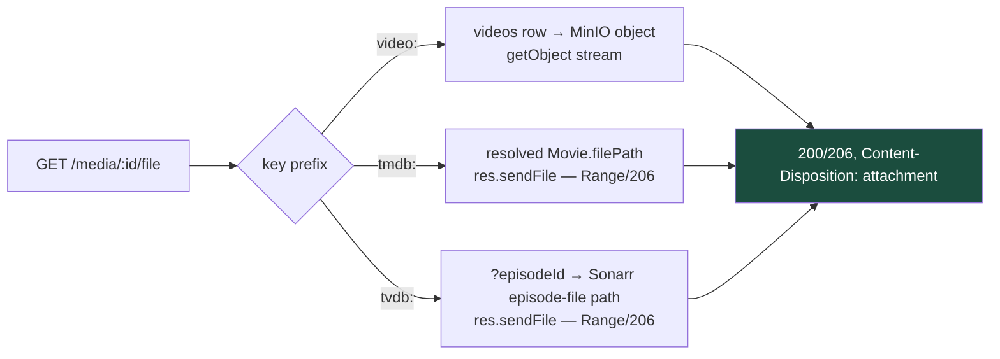
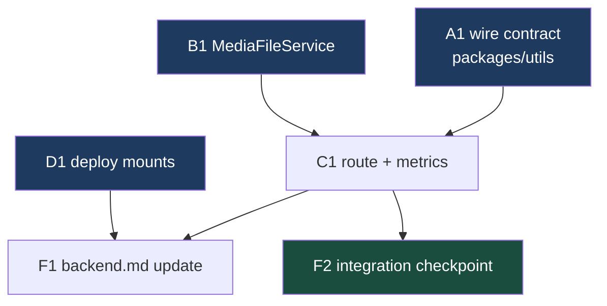

# Phase 7 — Local Save-to-Device — `apps/download`

Implements Phase 7 of [`../backend.md`](../backend.md) (spec: [`../spec.md`](../spec.md)
§9 "Local Downloads"; user stories 25 and 59). Builds on the media entity
refactor ([`001-media-entity-refactor.md`](001-media-entity-refactor.md)) —
file locations are read off the resolved `Media` / live Radarr–Sonarr APIs,
never a `jobs` column.

## What Phase 7 delivers

Today a finished download lives on the server: videos as public MinIO objects
that a browser **plays inline** rather than saves, movies/shows as files on
disk the download container **cannot even read** (no volume mount). Phase 7
adds the spec's explicit "save to your device" action for all three types.

| Feature            | In one sentence                                                                                           |
| ------------------ | --------------------------------------------------------------------------------------------------------- |
| **One save route** | `GET /download/media/:id/file` streams the file as an attachment for videos, movies, and show episodes.   |
| **Video save**     | The MinIO object is streamed through the app with `Content-Disposition: attachment` and a human filename. |
| **Movie save**     | The Radarr-managed file is streamed from disk with Range/206 support (resumable multi-GB downloads).      |
| **Episode save**   | `?episodeId=` picks one episode's file, resolved live through Sonarr's episode-file API.                  |
| **Library mounts** | `deploy.yml` gains read-only mounts of the media library at Radarr/Sonarr's exact container paths.        |



> **Backend only.** As with Phases 3–6, nothing in the Next.js app calls the
> new route when this lands — the frontend rebuild consumes it later. The
> existing public `downloadUrls` on `Video` are untouched; they remain the
> in-app _playback_ mechanism (spec §9 keeps save distinct from play).

---

## ⚠️ Read first: Phase 6 is in flight on this branch

At planning time, `jeremy/download` carries **uncommitted Phase 6 work** in
exactly the files Phase 7 also touches: `packages/utils/src/download/schema.ts`
/ `types.ts` (+ their specs), `apps/download/src/env.ts`, and
`apps/download/.env.example`. Phase 6's later waves will also edit
`apps/download/src/media/media.module.ts` and `media-resolver.service.ts`.

**Do not start Phase 7 until Phase 6's in-flight edits are committed** (they
don't have to be _finished_ — committed is enough for `/commit`'s line-level
staging to keep the histories apart). Task A1 and B1 must diff against a clean
tree. Functionally the two phases are independent — nothing here reads
`embyStatus` or the `EMBY_*` env vars.

---

## How to work this plan

**Per task:**

1. Work tasks in [wave order](#waves). Never start one before its dependencies
   report green.
2. Implement → write or update tests → run `pnpm test`, `pnpm run lint` and
   `pnpm run type-check` for every touched package.
3. **`/commit`** — one task, one commit (or a small coherent set). `/commit`
   stages at line level, so a stray edit in the same file doesn't ride along.
4. Check the box here and append the commit hash.

**Markers:**

| Marker              | Means                                                               |
| ------------------- | ------------------------------------------------------------------- |
| `- [ ]`             | Not started                                                         |
| `- [x]` … `abc1234` | Done, with the commit that did it                                   |
| ⚠️ **PARTIAL**      | Landed with scope narrowed — say what was left and why, right there |
| ⏭️ **DROPPED**      | Not doing it — say why. **Never delete a task**                     |
| 🚧 / ⏳             | Blocked. Do not implement                                           |

**When reality disagrees with the plan** — the express `res.sendFile` +
NestJS interplay and the MinIO stat/stream calls are the likely places, since
this is the repo's **first** HTTP file-streaming code — record it inline under
the task as a short **Findings** note, then update the downstream tasks the
finding invalidates.

---

## Instructions for the orchestrator agent

You are an **orchestrator**. Your job is delegation, sequencing, and status
tracking — nothing else.

**Do**

- Delegate every task to a sub-agent — implementation, testing, and committing
  included. One sub-agent per task.
- Write **self-contained** delegation prompts. Copy in the task's full text,
  the relevant Context Pack sections, the Definition of Done, and — when the
  task depends on an earlier one — the actual names the earlier sub-agent
  reported (exported names, file paths, method signatures).
- Track wave order; only start a task when its dependencies report green.
- Record each task's outcome (files changed, exports, commit hash) in this
  document before starting its dependents.

**Don't**

- ❌ Read or edit source, tests, or config yourself. The **only** file you may
  edit is this plan, to check boxes and record outcomes.
- ❌ Fix a failing task yourself — re-delegate with the failure details.
- ❌ Let sub-agents read this plan doc. Their prompts are self-contained.
- ❌ Run tasks concurrently when they collide (see
  [Collisions](#collisions-the-dag-does-not-show)) — and never let two
  sub-agents run `/commit` on this branch at the same time.

**Finish by** verifying every checkbox is checked, then reporting the
[final status summary](#final-report).

---

## Design decisions

### backend.md's framing is stale in two places — corrected here

backend.md's Phase 7 paragraph says "stream the file at the path stored on the
`jobs` row from Phase 1/6". **No such column exists** — the media entity
refactor removed per-job file locations; `jobs` carries only
id/type/status/requester/scope/timestamps (`apps/download/src/db/schema.ts:87-189`).
File locations are derived live: `Movie.filePath` ←
`radarr.service.ts:111` (`movieFile.path`, gated on `hasFile`), `Show.filePath`
← `sonarr.service.ts:153` (**the series folder, not a file**). And "videos …
likely frontend-only wiring" is also wrong for _saving_: the existing links
play inline (see next decision). Task F1 corrects backend.md.

### Everything streams through the app — no presigned redirect, no public-bucket tricks

The video `downloadUrls` are **unsigned public-bucket URLs** built by string
concatenation (`download-video.service.ts:449-455`); nothing in the repo
presigns anything. They can't serve as the save action:

- A bare `<a download>` is ignored cross-origin (`download.lilnas.io` →
  `storage.lilnas.io`), so the browser plays the file instead of saving it.
- An anonymous `response-content-disposition` override isn't honored on
  unsigned requests — it needs a **presigned** URL. But presigned URLs bake
  the signing host into the signature, and the app's MinIO client is
  configured against the internal `MINIO_HOST:MINIO_PORT`
  (`app.module.ts:25-31`, `useSSL: false`) — a browser can't reach that, so
  presigning would need a second client keyed to the public origin, plus an
  expiry story that doesn't exist today.

Streaming through the app instead costs one Node byte-pump and buys:

- **One route and one mechanism for all three media types.**
- **Consistent auth**: the route sits behind Traefik's `lilnas-auth`
  (`apps/download/deploy.yml:20`) like every other download route — unlike
  the anonymous public bucket. (The public URLs stay as-is for playback;
  tightening the bucket is out of scope.)
- **`Content-Disposition` set app-side** with a human filename — the MinIO
  objects are keyed `<jobId>/part0.mp4`, so the saved name comes from the
  video's `title`, not the key.

### One media-keyed route, `episodeId` for shows, per-file only

`GET /download/media/:id/file` keys on **media**, like every Phase 3/4 route —
a file belongs to a title, not to a download event. Type is decided by the key
prefix via the existing `mediaTypeFromKey()` (`download.controller.ts:1153-1158`).

- **Movie** (`tmdb:`): serves `Movie.filePath` — Radarr's single movie file.
- **Show** (`tvdb:`): `?episodeId=` is **required** (400 without). A "show" is
  not one file; the saveable unit is an episode, same param the delete and
  request routes already use. The episode's `episodeFileId` → path resolution
  goes through `SonarrService.getEpisodes()` / `getEpisodeFiles()`
  (`sonarr.service.ts:633-641`) — the raw `EpisodeFileResource.path` that
  `episode-files.util.ts` currently throws away. No season/series zip
  bundling — the frontend can loop episodes.
- **Video** (`video:`): `?part=` (default 0) indexes multi-part posts (one
  Instagram post can yield several objects). The object key is recovered from
  the stored URL's pathname (`new URL(u).pathname` minus the leading
  `/videos/`) — robust to a future `MINIO_PUBLIC_URL` change, unlike
  re-stripping the env prefix.

### The library is mounted read-only at Radarr/Sonarr's exact container paths

`deploy.yml` gains:

```yaml
- /storage/media-library/movies:/movies:ro
- /storage/media-library/tv:/tv:ro
```

Identical container-side paths to Radarr (`infra/media.yml:31`), Sonarr
(`:12`), and Emby (`:67-68`) — so the paths those APIs report need **zero
translation**, the same byte-identical-paths trick Phase 6's Emby match relies
on. `:ro` because this app must never write the library. Permissions are
already right: the container runs as `node` (uid/gid 1000,
`apps/download/Dockerfile:77`) and Radarr/Sonarr write as PUID/PGID 1000
(`infra/media.yml:6-7,25-26`) — no chown needed.

Dev gets no mounts: `docker-compose.dev.yml` doesn't run Radarr/Sonarr at all,
and the dev machine has no `/storage/media-library`. A dev movie-save resolves
a real path from whatever Radarr `RADARR_URL` points at, fails `fs` access,
and 404s honestly ("file not present on this host") — accepted.

### Defense-in-depth path check, even though the user never supplies a path

The client sends only a media id (prefix-parsed) and integer query params —
the actual paths come from Radarr/Sonarr API responses. Still, those are
external services (and this app has an RCE-probing incident in its history),
so before opening any disk file the service runs `path.resolve()` and requires
the result to start with `/movies/` or `/tv/`. A path outside the allowlist is
a 404 plus a `warn` log, never an open.

### Range/206 for disk files via express, plain 200 for MinIO

Movie/episode files are multi-gigabyte; a resumable download needs `Range`.
Express's `res.sendFile()` (available — `@nestjs/platform-express` is already
the HTTP adapter) provides Range/206, `Accept-Ranges`, ETag/Last-Modified, and
extension-based `Content-Type` for free, battle-tested. The controller sets
`Content-Disposition` first, then delegates. This is the repo's first `@Res()`
byte-stream — the house "no `@Res()`" preference (`health.controller.ts:26`)
is about JSON envelopes, and does not apply to a file stream, which Nest
cannot express otherwise.

The MinIO branch streams `getObject()` with explicit `Content-Type` /
`Content-Length` (from `statObject()`) and no Range support — videos are
comparatively small, and `getPartialObject()` is the documented escape hatch
if that ever changes.

### Status mapping — honest, no `mediaJobRoute()` 404-rewriter

Same rule Phase 4/5 adopted: the catch-all-to-404 helper
(`download.controller.ts:1110-1144`) is **not** used.

| Situation                                                           | Code | Notes                                                                               |
| ------------------------------------------------------------------- | ---- | ----------------------------------------------------------------------------------- |
| Unknown key prefix / unparseable id                                 | 404  | Same as every media-keyed route                                                     |
| `tvdb:` key without `episodeId`                                     | 400  | A show has no single file                                                           |
| `video:`/`tmdb:` key **with** `episodeId`, or `part` on non-video   | 400  | Scope param on the wrong type, like Phase 4                                         |
| Video row missing, `downloadUrls` empty/absent, `part` out of range | 404  | Nothing uploaded (yet) for that video/part                                          |
| Movie not in library / no file yet / episode has no file            | 404  | `hasFile` false ⇒ nothing to serve                                                  |
| Resolver degraded (Radarr/Sonarr down)                              | 503  | Don't tell the UI a file doesn't exist when the source of truth is just unreachable |
| Path outside `/movies` · `/tv`, or `ENOENT` at open time            | 404  | Allowlist miss logs a `warn`                                                        |

### Auth: no identity decorator

The route reads nothing attribution-sensitive and writes nothing — same class
as `GET /media/:id/releases` and `/media/:id/seasons`, which take no decorator
(an unused param would trip `noUnusedParameters`,
`download.controller.ts:386-387`). Traefik's `lilnas-auth` gates the edge.
Recording _who saved what_ is Phase 8's audit log, which will add its own
identity capture when it hooks this route.

### Out of scope

| Not in Phase 7                        | Why                                                                    |
| ------------------------------------- | ---------------------------------------------------------------------- |
| Any frontend surface                  | Same as Phases 3–6 — the rebuild consumes the route later              |
| Season/series bundling (zip/tar)      | Per-file is the saveable unit; bundling is its own feature             |
| Tightening the public `videos` bucket | Playback depends on it today; revisit with the frontend rebuild        |
| Presigned URLs / expiry machinery     | Ruled out above — app-streaming avoids the second-client + expiry cost |
| Range support on the MinIO branch     | `getPartialObject` exists if ever needed                               |
| `DownloadClient` methods              | Phases 3–6 added none either; nothing in-repo calls this yet           |
| Audit logging of saves                | Phase 8                                                                |
| `bad_files` unflag route              | Still deferred, as in Phases 3–6                                       |

---

## Shared Context Pack

Copy the relevant parts into every sub-agent prompt. These are pointers, not
gospel — sub-agents should verify against current code.

### Repo & conventions

- pnpm monorepo, Turbo builds. NestJS backend + Next.js frontend hybrid app at
  `apps/download`; shared wire contracts at `packages/utils`.
- Per-package commands: `pnpm test`, `pnpm run lint`, `pnpm run type-check`
  (run in the touched package's directory).
- Tests co-located in `__tests__/`; `apps/download/jest.config.js` has
  `clearMocks`/`restoreMocks` on and maps `src/*` and `@lilnas/utils/*` to
  source. `jest.mock('nanoid', …)` must precede imports in any test that
  transitively pulls `MediaDownloadService` (nanoid is ESM-only).
- Validation is `nestjs-zod`: request DTOs via `createZodDto()` one-liners at
  the top of `download.controller.ts` (`:67-82`), applied with
  `@Query(new ZodValidationPipe(XDto))`. Responses are plain typed objects —
  except this phase's byte stream, which has no response schema at all.
- Wire contracts: Zod in `packages/utils/src/download/schema.ts` under phase
  banner comments (`// ---- Phase 4: … ----` at `:469`); inferred aliases +
  hand-written response `interface`s in `types.ts` under the same banners.
  `z.coerce` **only** for query params (`schema.ts:529-543` explains why).
  Contract tests: `packages/utils/src/download/__tests__/schema.spec.ts`
  (one `describe` per schema).
- Files must pass prettier/eslint for their package (CLAUDE.md rule). Avoid
  `any`.

### Existing code to build on (all verified, with line numbers)

| What                                                                                                                            | Where                                                                                                        |
| ------------------------------------------------------------------------------------------------------------------------------- | ------------------------------------------------------------------------------------------------------------ |
| Media key prefix → type (`mediaTypeFromKey`, module-local)                                                                      | `apps/download/src/download/download.controller.ts:1153-1158`                                                |
| `mediaId()` / `mediaIdSuffix()` — `video:` suffix **is** `videos.id`                                                            | `apps/download/src/db/media-id.ts:41-61`                                                                     |
| `Movie.filePath` = absolute movie **file** path when `hasFile`                                                                  | `apps/download/src/media/radarr.service.ts:104-111`                                                          |
| `Show.filePath` = **series folder** — never serve it directly                                                                   | `apps/download/src/media/sonarr.service.ts:141-153`                                                          |
| Raw episode files with `path`/`size` (`EpisodeFileResource`)                                                                    | `sonarr.service.ts:633-641` (`getEpisodeFiles`); `packages/media/src/sonarr/types.gen.ts:237-242`            |
| Episode → `episodeFileId` mapping precedent (`EpisodeFileReader` narrow interface)                                              | `apps/download/src/media/episode-files.util.ts:10-13,32-60`                                                  |
| `MediaResolverService.resolve(keys)` → `{ degradedSources, media: Map }`; degraded placeholder has **no** `filePath`/`sonarrId` | `apps/download/src/media/media-resolver.service.ts:104-254`                                                  |
| `videos` row: `getVideoById`; `downloadUrls: string[] \| null` column                                                           | `apps/download/src/db/videos.repo.ts:7`; `apps/download/src/db/schema.ts:216`                                |
| MinIO client injection (`@Inject(MINIO_CONNECTION)`), bucket literal `'videos'`, key `${jobId}/${basename}`                     | `apps/download/src/download/download-video.service.ts:15-16,44,437-455`; `app.module.ts:25-31`               |
| `mime.lookup()` usage (dep `mime-types@^3` already present)                                                                     | `download-video.service.ts:443`                                                                              |
| Metrics counter pattern (module-level counter + one-line method)                                                                | `apps/download/src/download/download-metrics.service.ts:85-122`                                              |
| Route log-line style (`action`, `duration`, `mediaId`, `statusCode`)                                                            | `download.controller.ts:421-453` (`listSeasons`)                                                             |
| Error-mapping rule: never route through the 404-rewriting `mediaJobRoute()`                                                     | `download.controller.ts:455-468` (deleteMediaFiles), `:1063-1073`, `:1110-1144`                              |
| Auth decorator rules (none / `@OptionalCurrentUser` / `ForwardedUserGuard`)                                                     | `download.controller.ts:104-116,386-387,541-582`                                                             |
| Controller test model (providers as `useValue` mocks, `createFakeMediaResolver`, Logger silenced)                               | `apps/download/src/media/__tests__/download.controller.media.test.ts`                                        |
| Service test model (mocked Radarr/Sonarr, `resolvesTo(media)` helper)                                                           | `apps/download/src/media/__tests__/show.service.test.ts`                                                     |
| Fake resolver helper + in-memory real DB                                                                                        | `.../helpers/fake-media-resolver.ts`; `apps/download/src/db/__tests__/test-utils.ts` (`createTestDbService`) |
| Module wiring (providers/exports, `forwardRef(() => DownloadModule)`)                                                           | `apps/download/src/media/media.module.ts:22-45`                                                              |

### Deployment facts

- `apps/download/deploy.yml` mounts **only** `/storage/app-data/download:/data`
  (lines 11-15, with the uid-1000 chown comment); `deploy.dev.yml` mounts only
  the repo at `/source`. **No media path is visible in the container today.**
- Radarr/Sonarr/Emby container paths: `/movies` ↔ host
  `/storage/media-library/movies`; `/tv` ↔ host `/storage/media-library/tv`
  (`infra/media.yml:9-12,28-31,65-68`). All three run PUID/PGID 1000.
- The download container runs as `node` = uid/gid 1000
  (`apps/download/Dockerfile:73,77`) — read access to the library is clean
  with a plain `:ro` bind mount, no chown.
- Dev compose (`docker-compose.dev.yml`) does not run Radarr/Sonarr/Emby;
  `RADARR_URL`/`SONARR_URL` in dev `.env` point elsewhere.
- The route is behind Traefik `lilnas-auth` in prod
  (`apps/download/deploy.yml:20`); MinIO's public route
  (`infra/shared.yml:20-25`) has no auth middleware and the `videos` bucket is
  anonymously readable — that asymmetry is known and out of scope.
- **Never deploy from `apps/download/deploy.yml` directly** — root
  `docker-compose.yml` only (CLAUDE.md).

### New/changed surface (what this plan creates)

| File                                                     | What                                                                                                  |
| -------------------------------------------------------- | ----------------------------------------------------------------------------------------------------- |
| `packages/utils/src/download/schema.ts` + `types.ts`     | `GetMediaFileQuerySchema` (+ inferred type) under a Phase 7 banner                                    |
| `apps/download/src/media/media-file.service.ts`          | Resolves a media id (+ query) to a servable file source; path allowlist                               |
| `apps/download/src/media/media.module.ts`                | Provide + export `MediaFileService`                                                                   |
| `apps/download/src/download/download.controller.ts`      | `GET /media/:id/file` — headers + `sendFile`/object-stream mechanics                                  |
| `apps/download/src/download/download-metrics.service.ts` | `fileSaved(type)` counter                                                                             |
| `apps/download/deploy.yml`                               | Two `:ro` library mounts                                                                              |
| `apps/download/package.json`                             | `content-disposition` (+ `@types/content-disposition`; add `@types/express` if type-check demands it) |

### Definition of Done

Include this **verbatim** in every delegation:

> **Done means:** code implemented; unit tests written or updated following
> the package's existing `__tests__` conventions and passing (`pnpm test` in
> the touched package); `pnpm run lint` and `pnpm run type-check` clean for
> every touched package; work committed via `/commit`. Report back: files
> changed, exported names introduced, test summary, commit hash(es).

---

## Task List

### Group A — Wire contract

- [x] **A1. `GetMediaFileQuerySchema`.** `550d2ae` — In `packages/utils/src/download/`:
  - `schema.ts`: new banner `// ---- Phase 7: local save-to-device ----` at
    the bottom, then:

    ```ts
    /**
     * `GET /download/media/:id/file`. `episodeId` is required for `tvdb:`
     * keys and rejected for the others; `part` is video-only and indexes
     * `Video.downloadUrls` (default 0). Coerced: query params arrive as
     * strings.
     */
    export const GetMediaFileQuerySchema = z.object({
      episodeId: z.coerce.number().int().positive().optional(),
      part: z.coerce.number().int().min(0).optional(),
    });
    ```

  - `types.ts`: same banner;
    `export type GetMediaFileQuery = z.infer<typeof GetMediaFileQuerySchema>`.
    **No response interface** — the response is a byte stream; add a one-line
    comment saying exactly that so nobody "fixes" the omission.
  - Edge cases and constraints:
    - The cross-field rules (episodeId ⇄ media type) are **controller/service
      logic**, not schema refinements — matching how
      `DeleteMediaFilesQuerySchema` leaves scope-vs-type checks to the
      service (`schema.ts:529-543`).
    - Purely additive; the tdr-bot shim (`client.ts`) stays untouched.
    - ⚠️ This file carries uncommitted Phase 6 edits until those land — see
      the "Read first" section's ordering rule.
  - Tests: new `describe('GetMediaFileQuerySchema')` in
    `__tests__/schema.spec.ts` — string→number coercion for both params,
    rejection of zero/negative `episodeId`, of negative `part`, and of
    non-numeric strings; both-absent parses to `{}`.

### Group B — File-source resolution

- [x] **B1. `MediaFileService`.** `9518b16`, `ffb676e` — Create
      `apps/download/src/media/media-file.service.ts` +
      `__tests__/media-file.service.test.ts`; register (provide + export) in
      `media.module.ts`:

  ```ts
  export type MediaFileSource =
    | { kind: "disk"; path: string; fileName: string }
    | {
        kind: "object";
        bucket: string; // 'videos'
        key: string;
        size: number;
        contentType: string;
        fileName: string;
      };

  @Injectable()
  export class MediaFileService {
    resolveFileSource(
      mediaId: string,
      query: GetMediaFileQuery,
    ): Promise<MediaFileSource>;
    getObjectStream(
      source: MediaFileSource & { kind: "object" },
    ): Promise<Readable>;
  }
  ```

  Branch by `mediaTypeFromKey`-style prefix parsing (either reuse the
  controller's helper by promoting it somewhere shared, or parse locally the
  same way — report which):
  - **Video**: `mediaIdSuffix(id)` → `getVideoById(db, suffix)` (the suffix
    **is** `videos.id` — `media-id.ts:41-61`). 404 if no row or
    `downloadUrls` empty/absent; 404 if `query.part ?? 0` is out of range.
    Key recovery: `new URL(url).pathname`, require a leading `/videos/`,
    strip it, decode with `decodeURIComponent` — throw 404 (never a 500) on
    a malformed stored URL. `statObject('videos', key)` supplies `size` and
    `contentType` (fall back to `mime.lookup(key) || 'application/octet-stream'`).
    `fileName` = sanitized `row.title` (strip `/`, `\`, control chars) +
    ` (part N)` when `downloadUrls.length > 1` + `path.extname(key)`.
    MinIO client via `@Inject(MINIO_CONNECTION)` exactly like
    `download-video.service.ts:44`.
  - **Movie**: 400 if `episodeId` present. `MediaResolverService.resolve()`
    for the key; **degraded source → 503** (`ServiceUnavailableException`);
    no `filePath` → 404. `fileName` = `path.basename(filePath)`.
  - **Show**: 400 if `episodeId` absent (also 400 when `part` is present on
    a non-video key — one shared guard). Resolve for `sonarrId` (degraded →
    503, placeholder without `sonarrId` → 503 too — same outage).
    `getEpisodes(sonarrId)` → find by `episodeId` (404 unknown);
    `episodeFileId` absent/0 → 404. `getEpisodeFiles(sonarrId)` → find by
    file id → its `path` (missing → 404). `fileName` = basename.
  - **Both disk branches**: `path.resolve()` the candidate, require the
    result to start with `/movies/` or `/tv/`; a miss logs `warn` with the
    offending path and throws 404. Do **not** `fs.access` here — existence
    is proven at open/send time by the controller (avoids TOCTOU
    double-stat).
  - Edge cases and constraints:
    - Throw Nest `HttpException` subclasses (`NotFoundException`,
      `BadRequestException`, `ServiceUnavailableException`) with messages in
      the house style ("Media '<id>' has no file to save", etc.) — the
      controller adds no mapping layer.
    - `getObjectStream` is a thin `minioClient.getObject(bucket, key)`
      wrapper so the controller never touches MinIO directly.
    - Do not add release/monitoring logic — no `ReleaseService`, no
      `withMonitoring`; this is a pure read.
  - Tests (model: `show.service.test.ts` + `createFakeMediaResolver` +
    `createTestDbService` with a seeded `videos` row; MinIO client as a plain
    `useValue` mock): every 400/404/503 row of the status table that belongs
    to the service; video happy path (key recovery from a realistic stored
    URL, filename with and without part suffix, statObject fallbacks); movie
    happy path; episode happy path; allowlist rejection for a path like
    `/config/../secrets`; degraded-resolver → 503 for both managed types.

  **Findings (B1):**
  - `mediaTypeFromKey()` was **promoted to `apps/download/src/db/media-id.ts`**
    (next to `mediaId()`/`mediaIdSuffix()`, which its own doc comment already
    pointed at) with direct unit tests. The controller's module-local copy at
    `download.controller.ts:~1153` is now a **duplicate — C1 deletes it and
    imports the shared one.**
  - `@lilnas/utils` resolves through its `exports` map to `dist/`, so a stale
    `dist` makes `GetMediaFileQuery` invisible to `tsc`. **`pnpm run build` in
    `packages/utils` is required after A1** before `apps/download` type-checks.
  - Added beyond spec: `statObject` `NoSuchKey`/`NotFound` → 404 (object
    lifecycle-deleted while the `videos` row survives); every other `S3Error`
    re-throws untouched, so a MinIO outage is never mislabelled "missing file".
  - Degraded check runs **before** reading `filePath`/`sonarrId`, as specified.
    Consequence accepted: during the resolver's 10s failure TTL a title with a
    good `filePath` can 503 even though the per-id fallback would have
    succeeded; and movie-not-in-library → 404 while show-not-in-library → 503.
    That asymmetry is what the status table asks for; left as-is.
  - Pre-existing, unrelated: 9 failures in
    `src/ytdlp-update/__tests__/ytdlp-update.integration.spec.ts` (`EACCES` on
    `/usr/bin/yt-dlp` — the sandbox blocks the write). 869 passed otherwise.

### Group C — HTTP layer

- [x] **C1. `GET /media/:id/file` route + metrics.** `552e42c` — In `apps/download`:
  - `package.json`: add `content-disposition` + `@types/content-disposition`
    (dev). If `tsc` can't see express's `Response` type, add
    `@types/express` (dev) — report whether it was needed.
  - `download.controller.ts`: DTO one-liner
    `class GetMediaFileQueryDto extends createZodDto(GetMediaFileQuerySchema) {}`;
    route:

    ```ts
    @Get('/media/:id/file')
    async getMediaFile(
      @Param('id') id: string,
      @Query(new ZodValidationPipe(GetMediaFileQueryDto)) query: GetMediaFileQueryDto,
      @Res() res: Response, // first byte-stream route in the repo — @Res() is deliberate
    ): Promise<void>
    ```

    Flow: `resolveFileSource` (service exceptions propagate to Nest's filter
    untouched — with `@Res()` present Nest still runs exception filters for
    thrown `HttpException`s as long as the handler hasn't written) → set
    `Content-Disposition: contentDisposition(source.fileName)` →
    - `disk`: `res.sendFile(source.path, err => …)` — express supplies
      Range/206, ETag, Content-Type. In the callback: `ENOENT`/`EACCES` with
      headers unsent → 404 JSON in the standard Nest error shape; headers
      already sent → log `warn` and `res.end()`.
    - `object`: set `Content-Type`, `Content-Length` from the source, pipe
      `await getObjectStream(source)` into `res`; on stream `error` before
      headers → 404/500 as above, after → destroy the response.

  - `download-metrics.service.ts`: counter
    `download_media_file_saves_total` labeled by `type`
    (`video`/`movie`/`show`), exposed as `fileSaved(type)`, following the
    `jobsPausedTotal` pattern (`:95-101`). Increment once per successful
    stream **start** (after headers are committed, not on completion).
  - Log line on success start per house style: `action: 'getMediaFile'`,
    `mediaId`, `kind`, `fileName`, `statusCode`.
  - Edge cases and constraints:
    - Do **not** wrap in `mediaJobRoute()` — honest status codes (see the
      status table in Design decisions).
    - No auth decorator (matches `/releases`, `/seasons`).
    - The route must not buffer the file — no `fs.readFile`, no accumulating
      the MinIO stream.
  - Tests (extend the `download.controller.media.test.ts` module or add a
    sibling `download.controller.file.test.ts` following its setup): mock
    `MediaFileService` by class token; fake `res` object
    (`setHeader`/`sendFile`/`end`/`destroyed` jest fns). Cover: disk source →
    `sendFile` called with the resolved path and disposition header set;
    object source → headers + pipe wiring; service 404/400/503 propagate
    (assert the exception escapes the handler); `sendFile` callback `ENOENT`
    → 404 when headers unsent; metrics incremented with the right label;
    query DTO rejects `part=-1` end-to-end through the pipe.

  **Findings (C1):** the express/MinIO reality this plan asked to budget for.
  - **`content-disposition` pinned to `1.0.0`, deliberately.** `latest` is
    `3.0.0`, which is ESM-only (`"type": "module"`, `engines.node >= 22`) —
    it would reproduce the nanoid trap: unloadable by `nest build -b swc` and
    by ts-jest. `1.0.0` is CJS and is already express 5's own dependency, so
    it dedupes. **A dependabot-style bump to 2.x/3.x needs a transform first.**
  - **Header ordering deviates from the plan's step 2.** Setting
    `Content-Disposition` before opening the object is unsafe:
    `getObjectStream()` can throw *after* the header is set, and the exception
    filter then writes a small JSON body under a `Content-Length` promising
    the whole object — the client hangs instead of seeing the error. The route
    now awaits `getObjectStream()` **before** setting any header. Regression
    test: "sets no header at all when the object cannot be opened".
  - **"Increment after headers are committed" isn't achievable on the disk
    branch.** `sendFile` exposes no headers-committed hook — its callback
    fires on completion *or* error. The counter increments synchronously right
    after hand-off (`sendFile`/`pipe` called) on both branches. Consequence,
    documented in the counter comment: an immediate `ENOENT` is counted. The
    alternative (count on completion) was worse — it would drop every
    user-aborted multi-GB save.
  - **`pipe()` leaks the MinIO socket on client abort** — not in the plan.
    `stream.pipe(res)` doesn't destroy the source when the client closes, so
    every abandoned save would hold a socket open for the object's lifetime.
    Fixed with `res.once('close', () => stream.destroy())`.
  - **`end()` vs `destroy()` was load-bearing, not stylistic.** `sendFile` has
    already torn down its own file stream by callback time, so the response
    just needs closing; a failed MinIO stream is still piped into a live
    response, where only `destroy()` stops a half-written body from looking
    complete. Encoded as an `abort: 'destroy' | 'end'` param with the
    rationale in its doc comment.
  - `@types/express` was **not** needed — but `Response` resolves through the
    **workspace-root** `@types/express@5.0.3` devDependency by hoisting, not
    anything `apps/download` declares. Works for in-repo builds; declaring it
    locally is the stricter call if dependency hygiene matters later.
  - Trap for future assertions: `content-disposition` does **not** RFC 5987-
    encode Latin-1 names — `Amélie.mkv` emits `filename="Amélie.mkv"` inline.
    Only genuinely non-Latin-1 names (e.g. `君の名は`) trigger `filename*=`.

### Group D — Deployment

- [x] **D1. Read-only library mounts.** `020a19d` — Edit `apps/download/deploy.yml` only:

  ```yaml
  volumes:
    - /storage/app-data/download:/data
    # Read-only view of the media library at the SAME container paths
    # Radarr (/movies) and Sonarr (/tv) report in their file APIs - the
    # save-to-device route (Phase 7) opens those paths verbatim. ro: this
    # app must never write the library.
    - /storage/media-library/movies:/movies:ro
    - /storage/media-library/tv:/tv:ro
  ```

  - Edge cases and constraints:
    - **Do not touch `deploy.dev.yml`** — dev has no library host dirs; the
      route 404s honestly there (Design decisions).
    - No env vars, no Dockerfile change, no chown (uid 1000 both sides —
      cite the existing comment style at `deploy.yml:11-14`).
    - Deployment itself is a [human checkpoint](#human-checkpoints), not part
      of this task.
  - Tests: none possible (compose file). `docker-compose config` from the
    repo root must still parse — run it and report.

### Group F — Documentation & integration checkpoint

- [x] **F1. Update `docs/features/download/backend.md` Phase 7 section.**
      `d117d40` — Rewrite it to:
  - Mark **Status: done** (backend only — no frontend surface yet), link this
    plan, list commits (orchestrator supplies hashes).
  - **Correct the stale framing**: no `jobs` file-path column exists (media
    entity refactor); videos' `downloadUrls` are unsigned public URLs that
    play inline and cannot carry an attachment disposition cross-origin, so
    save streams through the app for all three types.
  - Record the decisions: one media-keyed route; `episodeId` required for
    shows (per-file only); `:ro` mounts at Radarr/Sonarr-identical container
    paths; path allowlist; Range/206 on disk branch only; 503-on-degraded;
    no auth decorator; the known bucket-anonymity asymmetry left standing.
  - Note the Phase-5-style "Manual verification" pointer at this plan's
    [human checkpoints](#human-checkpoints).
  - Tests: n/a (docs). Prettier must pass.

- [x] **F2. Integration checkpoint.** ✅ **no-op, all green** — no commit
      needed. Evidence: repo-wide `pnpm run lint` 14/14 ✅, `pnpm run type-check`
      12/12 ✅, `pnpm run build` clean for both `@lilnas/utils` and
      `@lilnas/download` (**no `TS6053` — the known flake did not reproduce**).
      `pnpm test`: `apps/download` 903 tests with only the 9 pre-existing
      `EACCES /usr/bin/yt-dlp` failures — **+81 new tests, all passing**.
      Additive-schema claim verified directly: `client.ts` has **zero diff**
      across all five commits, and `apps/tdr-bot`'s type-check was re-run
      cache-bypassed against the rebuilt `dist/` → exit 0, 1129 tests green.
      Three other packages fail tests (`equations` 7, `swole` 4, `tdr-code` 7);
      **all proven pre-existing** by rebuilding a scratch worktree at `84d2fce`
      and reproducing each identically (`tdr-code`'s baseline was in fact
      *worse* — 9 failures vs. 7). None reachable from a download-schema change.
      From the repo root: `pnpm test`,
      `pnpm run lint`, `pnpm run type-check` across the workspace, plus
      `pnpm run build` for `@lilnas/utils` and `@lilnas/download` — proving the
      additive schema change broke no consumer (tdr-bot compiles against the
      untouched shim). Fix nothing here; report failures back for re-delegation
      to the owning task. Known flake to not chase: the pre-existing intermittent
      `TS6053` from `next build` racing `nest build` (backend.md Phase 5
      findings). Commit only if something needed changing — otherwise report
      "no-op, all green" and check the box with the run's evidence.

---

## Sequencing

### Dependency DAG



(B1 consumes the `GetMediaFileQuery` _shape_, but takes it as a plain typed
argument — it compiles against A1's export, so start B1 alongside A1 and just
rebase its import once A1's commit lands, or serialize them; the orchestrator
picks based on tempo. The conservative reading is A1 → B1.)

### Waves

| Wave | Run        | Why it works                                                                                                                                                                                                 |
| ---- | ---------- | ------------------------------------------------------------------------------------------------------------------------------------------------------------------------------------------------------------ |
| 1    | A1, B1, D1 | Three disjoint file sets (`packages/utils` / `src/media` / `deploy.yml`) — but **serialize the `/commit` steps**; if running B1 truly parallel with A1, B1 waits for A1's export before its final type-check |
| 2    | C1         | Needs A1's schema and B1's `MediaFileService`                                                                                                                                                                |
| 3    | F1, F2     | Docs vs. verification run — disjoint files; serialize the `/commit` steps                                                                                                                                    |

### Dependency table

| Task | Depends on            | Parallel with |
| ---- | --------------------- | ------------- |
| A1   | —                     | B1, D1        |
| B1   | A1 (type import only) | D1            |
| D1   | —                     | A1, B1        |
| C1   | A1, B1                | —             |
| F1   | C1, D1                | F2            |
| F2   | C1                    | F1            |

### Collisions the DAG does not show

| Collision                                                       | Rule                                                                                             |
| --------------------------------------------------------------- | ------------------------------------------------------------------------------------------------ |
| **Uncommitted Phase 6 work** in `schema.ts`/`types.ts`/`env.ts` | Hard gate: commit Phase 6's in-flight edits before Wave 1 (see "Read first")                     |
| Phase 6's later waves also edit `media.module.ts`               | If Phase 6 execution is running concurrently, serialize B1 against its resolver-integration task |
| `download.controller.ts` + `download-metrics.service.ts`        | Owned solely by C1 — no other task touches them                                                  |
| `package.json` + lockfile (C1's new dep)                        | Only C1 edits manifests; run `pnpm install` inside that task                                     |
| Same branch, concurrent `/commit`                               | Waves 1 and 3 run multiple tasks — implementation may overlap, `/commit` steps must not          |

### Critical path

**A1 → B1 → C1 → F2** (conservative serialization) — four serial steps. **A1
leads**: it's a small schema addition that unblocks the chain; D1 can land any
time. B1 is the bulk of the engineering; C1 is where the repo's first
streaming code meets express reality, so budget Findings time there.

---

## Human checkpoints

The executor must **not** do any of these. Stop and hand back.

1. **Commit the in-flight Phase 6 work** (or explicitly decide Phase 7 goes
   first and stash it). _Checking for:_ clean diffs in
   `packages/utils/src/download/*` before A1 starts.

2. **Deploy** — after all waves: `docker-compose up -d download` from the repo
   root (never `apps/download/deploy.yml` directly). The new mounts require a
   container recreate; confirm `/movies` and `/tv` are visible read-only
   inside (`docker-compose exec download ls /movies`). _Checking for:_ the
   mount + uid-1000 read-access assumption on the real host.

3. **Live end-to-end verification** (needs real Radarr/Sonarr/MinIO data;
   ⚠️ downloads real multi-GB files — run on a connection that can take it):

   ```bash
   BASE=https://download.lilnas.io/download   # or http://download:8081/download

   # 1. Movie save: attachment header, human filename, correct size.
   curl -s -D- -o /dev/null "$BASE/media/tmdb:27205/file" | \
     grep -i 'content-disposition\|content-length\|content-type'

   # 2. Range/206 — the resumable-download proof for disk files.
   curl -s -D- -o /dev/null -H 'Range: bytes=0-1023' \
     "$BASE/media/tmdb:27205/file" | grep -i '206\|content-range'

   # 3. Episode save (get an episodeId with hasFile from the seasons route).
   EP=$(curl -s "$BASE/media/tvdb:81189/seasons" | \
     jq '[.seasons[].episodes[] | select(.hasFile)][0].id')
   curl -s -D- -o /dev/null "$BASE/media/tvdb:81189/file?episodeId=$EP" | \
     grep -i 'content-disposition'

   # 4. Show key without episodeId is a 400, not a 404.
   curl -s -o /dev/null -w '%{http_code}\n' "$BASE/media/tvdb:81189/file"   # 400

   # 5. Video save: filename from the TITLE (not part0.mp4), full body
   #    matches the object byte-for-byte.
   curl -s -D- -o /tmp/save-test.mp4 "$BASE/media/video:<id>/file"
   #    Compare size with the public URL object:
   curl -sI "<the stored downloadUrl>" | grep -i content-length

   # 6. A movie with no file yet is a 404; with Radarr stopped it's a 503.
   ```

   _Checking for:_ disposition/Range mechanics through Traefik, the
   filename UX, and the 400/404/503 split against live services.

4. **Large-file behavior through Traefik.** While a multi-GB movie save runs:
   confirm it completes (no proxy-side truncation — no custom Traefik
   timeouts exist in `infra/proxy.yml`, so defaults apply and should be fine)
   and that container memory stays flat (streaming, not buffering):
   `docker stats download --no-stream` sampled during the transfer.
   _Checking for:_ the no-buffering constraint and proxy defaults under real
   load.

---

## Final report

When the last box is checked, report:

1. Per-task outcome, with commit hashes.
2. Test results — `apps/download` and `packages/utils` suites, plus the
   repo-wide lint/type-check/build from F2.
3. Deviations from the plan, and why (Findings notes rolled up).
4. Deferred items — season/series bundling, MinIO-branch Range support, the
   public-bucket asymmetry, audit logging (Phase 8), and every human
   checkpoint still outstanding.
5. Open questions discovered during implementation.
