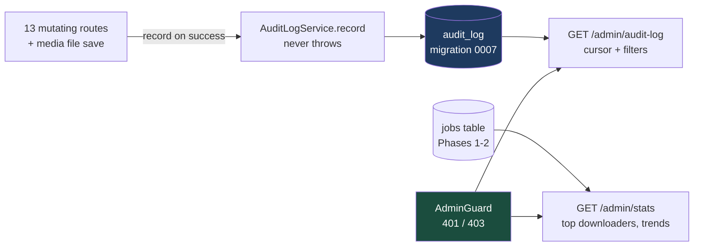
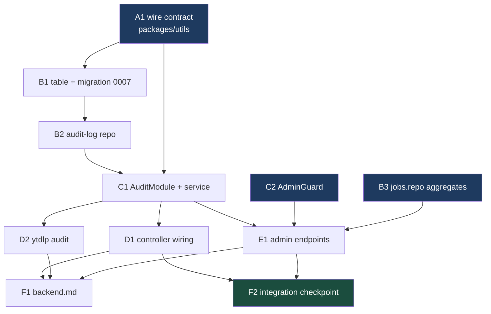

# Phase 8 — Admin Dashboard & Audit Log — `apps/download`

Implements Phase 8 of [`../backend.md`](../backend.md) (spec: [`../spec.md`](../spec.md)
§11 "Admin Dashboard"; user stories 63–67). Last backend phase of the plan.
Builds on Phase 0's identity primitive (`ForwardedUser`), Phase 1's `jobs`
attribution columns, and Phase 2's list/cursor machinery.

## What Phase 8 delivers

The spec's §11 is five bullets; two are already built (the enriched Activity
page and per-user history shipped with Phases 1–2). This phase builds the
remaining three — the audit trail and the admin-only read surface over it —
plus one piece of deferred debt: Phase 7's save route shipped with no identity
capture, explicitly leaving "who saved what" to this phase
(`backend.md:1305-1308`).

| Feature               | In one sentence                                                                                                                           |
| --------------------- | ----------------------------------------------------------------------------------------------------------------------------------------- |
| **`audit_log` table** | Append-only trail — actor, action, target, metadata — decoupled from `jobs`, extensible to future services.                               |
| **`AuditLogService`** | One `record()` write path called from every mutating controller action; a failed audit write never fails a request.                       |
| **Write-path wiring** | All 13 mutating routes record entries, plus `GET /media/:id/file` (the Phase 7 "who saved what" debt).                                    |
| **Admin gate**        | First reusable `AdminGuard` (401 no identity / 403 not admin), backed by the existing fail-closed `AdminCheckService`.                    |
| **Admin endpoints**   | `GET /download/admin/audit-log` (filterable, cursor-paginated) and `GET /download/admin/stats` (top downloaders, totals, per-day trends). |



> **Backend only.** As with Phases 3–7, nothing in the Next.js app calls the
> new routes when this lands — the frontend rebuild consumes them later. A
> design mock exists (`docs/features/download/designs/admin-dashboard.html`)
> but is out of scope here. No `DownloadClient` methods either, matching
> Phases 3–7.

---

## ⚠️ Read first: branch state at planning time

On `jeremy/download` when this plan was written:

- **Phase 7's F1 and F2 are unchecked** in
  [`007-phase-7-local-save.md`](007-phase-7-local-save.md). F1 rewrites the
  **Phase 7 section of `backend.md`** — this plan's F1 rewrites the **Phase 8
  section of the same file**. If both are pending, land Phase 7's F1 first
  (or serialize the two edits); never run them concurrently.
- The 007 plan doc itself is **untracked** (`?? docs/.../007-phase-7-local-save.md`)
  — commit it before starting, so `/commit`'s line-level staging works from a
  clean tree.
- `apps/swole/next-env.d.ts` is modified — **unrelated noise; never touch or
  commit it** from this plan.

No task here collides with Phase 7's remaining work at the code level — F1/F2
of Phase 7 touch only `backend.md` and run verification.

---

## How to work this plan

**Per task:**

1. Work tasks in [wave order](#waves). Never start one before its dependencies
   report green.
2. Implement → write or update tests → run `pnpm test`, `pnpm run lint` and
   `pnpm run type-check` for every touched package.
3. **`/commit`** — one task, one commit (or a small coherent set). `/commit`
   stages at line level, so a stray edit in the same file doesn't ride along.
4. Check the box here and append the commit hash.

**Markers:**

| Marker              | Means                                                               |
| ------------------- | ------------------------------------------------------------------- |
| `- [ ]`             | Not started                                                         |
| `- [x]` … `abc1234` | Done, with the commit that did it                                   |
| ⚠️ **PARTIAL**      | Landed with scope narrowed — say what was left and why, right there |
| ⏭️ **DROPPED**      | Not doing it — say why. **Never delete a task**                     |
| 🚧 / ⏳             | Blocked. Do not implement                                           |

**When reality disagrees with the plan** — likely spots: the generated
migration SQL, the integer-PK cursor binding (B2's warning), and the exact
seam inside the three shared controller helpers — record it inline under the
task as a short **Findings** note, then update the downstream tasks the
finding invalidates.

---

## Instructions for the orchestrator agent

You are an **orchestrator**. Your job is delegation, sequencing, and status
tracking — nothing else.

**Do**

- Delegate every task to a sub-agent — implementation, testing, and committing
  included. One sub-agent per task.
- Write **self-contained** delegation prompts. Copy in the task's full text,
  the relevant Context Pack sections, the Definition of Done, and — when the
  task depends on an earlier one — the actual names the earlier sub-agent
  reported (exported names, file paths, method signatures).
- Track wave order; only start a task when its dependencies report green.
- Record each task's outcome (files changed, exports, commit hash) in this
  document before starting its dependents.

**Don't**

- ❌ Read or edit source, tests, or config yourself. The **only** file you may
  edit is this plan, to check boxes and record outcomes.
- ❌ Fix a failing task yourself — re-delegate with the failure details.
- ❌ Let sub-agents read this plan doc. Their prompts are self-contained.
- ❌ Run tasks concurrently when they collide (see
  [Collisions](#collisions-the-dag-does-not-show)) — and never let two
  sub-agents run `/commit` on this branch at the same time.

**Finish by** verifying every checkbox is checked, then reporting the
[final status summary](#final-report).

---

## Design decisions

### Successful mutations only, recorded at the controller layer

`record()` is called **after the action succeeds**, from the controller (or
its shared route helper) — the layer that knows both the actor and the
outcome. Failed attempts are not audit entries; they're already in the
structured logs (Loki). This matches `backend.md:1401-1406`: centralize the
write path the way `DownloadStateService.addJob()`/`updateJob()` centralizes
job mutations. Five of the 13 mutating routes have no bodies of their own —
they run through three private helpers (`videoInterruptRoute`
`download.controller.ts:1176`, `releaseActionRoute` `:1255`, `mediaJobRoute`
`:1291`) — so the hook lands **once per helper**, not once per route.

### The actor is nullable, and `origin` says why — copied from `jobs`

Most mutating routes take `@OptionalCurrentUser()` because `apps/tdr-bot`
calls them service-to-service with no forwarded identity. `jobs` already
models this exactly: nullable `requester_email`/`requester_user_id` plus an
`origin: 'service' | 'web'` enum and a CHECK tying the two together
(`schema.ts:64,106,158-164`). `audit_log` copies that shape verbatim —
`origin = 'web' ⇔ actor present`. That is also what satisfies spec §11's
"extensible to future services calling into the download API" (story 67):
a future service's entries land as `origin: 'service'` today, and can carry
a service identity later without a schema change (metadata is JSON).

### Action taxonomy: a TS tuple in `@lilnas/utils`, no SQL CHECK

Actions are two-segment `<domain>.<verb>` strings:

```
video.create · video.cancel · video.pause · video.resume
movie.request · movie.delete · show.request · show.delete
media.delete_files · media.save_file
release.grab · release.replace · file.flag_bad
ytdlp.check_update
```

(`backend.md`'s examples — `video.download.create`, `file.flag_bad`,
`movie.delete` — were illustrative; this normalizes them, keeping
`file.flag_bad` and `movie.delete` as written.) The tuple lives in
`packages/utils` with the union type; the DB column is
`text({ enum: AUDIT_ACTIONS })` pinned via the house `AssertSameUnion`
pattern (`schema.ts:71-85`). Like `jobs.status`, drizzle's text-enum is
**TypeScript-only** — no CHECK is emitted, so adding an action later is
additive with no migration.

### `record()` never throws

An audit write must never fail the user's action. `record()` wraps its insert
in try/catch: on failure it logs `warn` and increments a module-level
`download_audit_write_failures_total` counter (module-level `prom-client`
singleton, same pattern as `download-metrics.service.ts:18-99` — deliberately
**not** on `DownloadMetricsService`, which would drag a `DownloadModule`
dependency into `AuditModule` and invert the import direction D1 needs).
The write itself is synchronous (better-sqlite3), so there is no queue, no
flush, no lost-on-crash window beyond the process itself.

### Target model: `(target_type, target_id)`, both nullable together

`target_type ∈ ('job', 'media', 'system')`. Job-lifecycle actions target the
job id; media-level actions (grab, replace, flag, delete-files, save-file)
target the media key (`tmdb:…`/`tvdb:…`/`video:…`); `ytdlp.check_update`
targets nothing (`system` was considered and rejected as a fake target —
null/null with `action` carrying the meaning is honest). A CHECK ties the
pair: null together or present together. Cross-references (a grab's resulting
job id, an episode scope, a deleted-file count) go in `metadata` — small
values only, never request bodies.

### The first reusable admin gate — and why `/history`'s inline check stays

No `AdminGuard` exists anywhere in the repo; the only 403 today is inline in
`getHistory` (`download.controller.ts:276-299`) because its scope check
depends on the parsed query (self-history is allowed) — a guard can't replace
that, and this plan doesn't touch it. The new admin endpoints are
unconditionally admin-only, so they get a class-level `AdminGuard` in
`src/auth/`: async `canActivate`, 401 when `resolveForwardedUser()` yields
nothing, 403 when `AdminCheckService.checkIsAdmin()` says no. Fail-closed
comes free — `AdminCheckService` already caches `false` for 10s on any auth
outage (`admin-check.service.ts:62-76`).

### Admin endpoints show true attribution, and that's safe _because_ of the gate

Spec line 12: admins always see the true requester. The audit log and the
stats aggregates therefore apply **no masking and no `excludeHiddenVideos`
filter** — which is exactly why they must sit behind `AdminGuard`. The
attribution-oracle discipline the public endpoints maintain (masked rows
_and_ guarded facets, `jobs.repo.ts:88-90`) is preserved by the 403, not by
filtering.

### "Usage trends" pinned down: jobs per UTC day, by type, over a window

The spec says "usage trends, etc." and defines nothing. This plan pins it to:
job counts grouped by UTC calendar day and `type` over a query-able window
(`?days=`, default 30, max 365) — enough for a line/stacked chart, computable
with one indexed SQL pass, and extensible later. System-level metrics
(CPU, queue depth, phase durations) stay in Prometheus/Grafana per
`backend.md:1409-1411` — the stats endpoint serves **job-log aggregates
only** and does not proxy `/metrics`.

### Cold start accepted — no backfill

The `audit_log` table starts empty; Phases 0–7 shipped without recording.
Retroactive _download_ history already exists in `jobs` (queryable via
`/history` and the new stats endpoint); retroactive _interaction_ history
(pauses, flags, saves) was never captured anywhere and cannot be
reconstructed. No backfill task exists on purpose.

### The Phase 7 debt: identity on the save route, still no guard

`GET /media/:id/file` gains `@OptionalCurrentUser()` **only** so the audit
entry can carry an actor — not a guard, because service callers and the
no-identity dev path must keep working, same reasoning as every other
`@OptionalCurrentUser()` route. Recording fires once per successful stream
start, next to the existing `fileSaved(type)` metric call
(`download.controller.ts:1077-1097`).

### `POST /api/ytdlp-update/check` is mutating, so it's audited too

It can replace the yt-dlp binary and currently has **no identity capture at
all** (`ytdlp-update.controller.ts:15`). It gains `@OptionalCurrentUser()`
and records `ytdlp.check_update`. Its GET routes stay untouched.

### Out of scope

| Not in Phase 8                                         | Why                                                              |
| ------------------------------------------------------ | ---------------------------------------------------------------- |
| Any frontend surface                                   | Same as Phases 3–7 — the rebuild consumes the routes later       |
| `DownloadClient` methods                               | Phases 3–7 added none; nothing in-repo calls these yet           |
| Recording failed/denied attempts                       | Logs/Loki already carry them; revisit if investigation needs it  |
| Audit retention / pruning / export                     | Spec asks for a "full trail"; SQLite rows are cheap              |
| Backfilling historical entries                         | Impossible for non-job interactions — see Design decisions       |
| Proxying Prometheus metrics through the stats endpoint | Grafana is the systems view (`backend.md:1409-1411`)             |
| `bad_files` unflag route                               | Still deferred, as in Phases 3–7                                 |
| Radarr/Sonarr external pause detection                 | Known gap with its own future phase (`backend.md` Phase 5 notes) |

---

## Shared Context Pack

Copy the relevant parts into every sub-agent prompt. These are pointers, not
gospel — sub-agents should verify against current code.

### Repo & conventions

- pnpm monorepo, Turbo builds. NestJS backend + Next.js frontend hybrid app at
  `apps/download`; shared wire contracts at `packages/utils`.
- Per-package commands: `pnpm test`, `pnpm run lint`, `pnpm run type-check`
  (run in the touched package's directory). After editing `packages/utils`,
  run `pnpm run build` there — `@lilnas/utils` resolves through its `exports`
  map to `dist/`, so a stale build makes new exports invisible to `tsc`
  (Phase 7 finding).
- Tests co-located in `__tests__/`. DB tests: `createTestDb()` from
  `apps/download/src/db/__tests__/test-utils.ts` in a `try/finally` calling
  `close()` (model: `bad-files.repo.spec.ts`). Service/controller tests:
  `createTestDbService()` + `{ provide: X, useValue: mock }` providers.
- Wire contracts: Zod in `packages/utils/src/download/schema.ts` under phase
  banner comments; inferred type aliases + hand-written response `interface`s
  in `types.ts` under the same banners. `z.coerce` **only** for query params.
  Contract tests: `packages/utils/src/download/__tests__/schema.spec.ts`
  (one `describe` per schema).
- Validation is `nestjs-zod`: DTO one-liners via `createZodDto()` at the top
  of the controller, applied per-param with
  `@Query(new ZodValidationPipe(XDto))`. **There is no global pipe** — every
  new query param needs the explicit pipe.
- DB conventions (stated at `apps/download/src/db/schema.ts:4-20`): camelCase
  TS props, explicit snake_case column names; PK
  `integer('id', { mode: 'number' }).primaryKey({ autoIncrement: true })`;
  timestamps `integer('col', { mode: 'timestamp_ms' })` defaulted via
  `.$defaultFn(() => new Date())`, never SQL-side; JSON via
  `text('col', { mode: 'json' }).$type<T>()`; enum pinning via
  `AssertSameUnion` (`typePin`/`statusPin`, `schema.ts:71-85`) because
  drizzle-kit bundles the file and only `import type` from `@lilnas/utils`
  is allowed there.
- Repos are **free functions taking `db: Db` first** (`Db` from
  `src/db/db.service`), synchronous, using `.get()`/`.all()`/`.run()` —
  no `@Injectable()` repo classes. Services inject `DbService` (its module is
  `@Global()`; never add `imports: [DbModule]`).
- Files must pass prettier/eslint for their package (CLAUDE.md rule). Avoid
  `any`.

### Existing code to build on (all verified, with line numbers)

| What                                                                                    | Where                                                                                                                                                                          |
| --------------------------------------------------------------------------------------- | ------------------------------------------------------------------------------------------------------------------------------------------------------------------------------ |
| DB schema conventions header + `jobs` origin/requester CHECK pattern                    | `apps/download/src/db/schema.ts:4-20,64,106,158-164`                                                                                                                           |
| `bad_files` — closest table analogue (append-only, autoincrement PK, actor cols, CHECK) | `apps/download/src/db/schema.ts:235-293`                                                                                                                                       |
| Enum-pin pattern (`AssertSameUnion`, `typePin`, `statusPin`)                            | `apps/download/src/db/schema.ts:71-85`                                                                                                                                         |
| Hard-coded table-name list test — **will fail when `audit_log` is added; update it**    | `apps/download/src/db/__tests__/schema.spec.ts:12-29`                                                                                                                          |
| Repo template (insert `.returning().get()`, list, get, delete)                          | `apps/download/src/db/bad-files.repo.ts`                                                                                                                                       |
| Canonical page query (transaction, limit+1, row-value cursor predicate, total)          | `apps/download/src/db/jobs.repo.ts:113-147` (`listJobsPage`)                                                                                                                   |
| Existing facet aggregates — "top downloaders" already exists                            | `apps/download/src/db/jobs.repo.ts:328-345` (`countJobsByRequester`), `:353-364` (`countJobsByType`)                                                                           |
| Shared `WHERE` builder pattern (page/count/facets can't diverge)                        | `apps/download/src/db/jobs.repo.ts:71-94` (`buildJobWhere`)                                                                                                                    |
| Cursor codec (opaque base64url, filter-keyed) — reuse verbatim                          | `apps/download/src/db/list-cursor.ts` (`encodeListCursor`, `decodeListCursor`, `computeFilterKey`)                                                                             |
| Cursor consumption in a service (decode → page → encode next)                           | `apps/download/src/download/job-query.service.ts:243-289`                                                                                                                      |
| Migration mechanics: config, boot sequence, test helpers                                | `apps/download/drizzle.config.ts`; `src/bootstrap.ts:22-28`; `src/db/__tests__/test-utils.ts` (`createTestDb`, `applyRemainingMigrationFiles`)                                 |
| Identity: `ForwardedUser { email, userId }`, `resolveForwardedUser`, guard, decorators  | `apps/download/src/auth/forwarded-user.ts:19-22,66-88`; `forwarded-user.guard.ts:18-29`; `current-user.decorator.ts`; `optional-current-user.decorator.ts`                     |
| Admin check (60s/10s TTL, fail-closed, keyed lowercase email)                           | `apps/download/src/auth/admin-check.service.ts:26-76`                                                                                                                          |
| The controller's admin funnel + inline `/history` 403 (leave both alone)                | `apps/download/src/download/download.controller.ts:118-120,276-299`                                                                                                            |
| The three shared route helpers (audit hook points)                                      | `download.controller.ts:1176-1242` (pause/resume), `:1255-1283` (grab/replace), `:1291-1325` (get/delete movie & show — **mixes reads and deletes; only deletes get audited**) |
| Save-route body + `recordFileSave` (where `media.save_file` hooks in)                   | `download.controller.ts:488-540,1077-1097`                                                                                                                                     |
| ytdlp check route (no identity today)                                                   | `apps/download/src/ytdlp-update/ytdlp-update.controller.ts:15`                                                                                                                 |
| Module-level Prometheus singleton pattern                                               | `apps/download/src/download/download-metrics.service.ts:18-99`                                                                                                                 |
| Module wiring: `@Global()` DbModule; AuthModule exports guard + AdminCheckService       | `apps/download/src/db/db.module.ts`; `src/auth/auth.module.ts:7-12`; `src/app.module.ts:16-36`; `src/download/download.module.ts:24-37`                                        |
| Wire-contract shared helpers (`LimitSchema`, `csvEnum`, date transforms, range refine)  | `packages/utils/src/download/schema.ts:265-346`                                                                                                                                |
| `DownloadPage<T>` / `JobRequesterSchema` — reuse for audit page + actor                 | `packages/utils/src/download/types.ts:253-257`; `schema.ts` (JobRequesterSchema)                                                                                               |
| Stateless upstream admin endpoint (already deployed)                                    | `apps/auth/src/admin/admin-check.controller.ts` (`GET /admin/check?email=` → `{ isAdmin }`)                                                                                    |

### Deployment facts

- No new env vars, no volume changes — `audit_log` lives in the existing
  SQLite file at `/data` (`apps/download/deploy.yml`). Deploying is a plain
  redeploy; migration 0007 runs at boot.
- The admin routes ride the existing Traefik `lilnas-auth` edge in prod, and
  `AdminGuard` adds the app-side check on top. Container-to-container callers
  (no forwarded headers) get 401 from the guard — intended.
- **Never deploy from `apps/download/deploy.yml` directly** — root
  `docker-compose.yml` only (CLAUDE.md).

### Definition of Done

Include this **verbatim** in every delegation:

> **Done means:** code implemented; unit tests written or updated following
> the package's existing `__tests__` conventions and passing (`pnpm test` in
> the touched package); `pnpm run lint` and `pnpm run type-check` clean for
> every touched package; work committed via `/commit`. Report back: files
> changed, exported names introduced, test summary, commit hash(es).

---

## Task List

### Group A — Wire contract

- [ ] **A1. Audit + admin schemas in `packages/utils`.** In
      `packages/utils/src/download/`:
  - `schema.ts`, new banner `// ---- Phase 8: admin dashboard & audit log ----`
    at the bottom:

    ```ts
    export const AUDIT_ACTIONS = [
      'video.create', 'video.cancel', 'video.pause', 'video.resume',
      'movie.request', 'movie.delete', 'show.request', 'show.delete',
      'media.delete_files', 'media.save_file',
      'release.grab', 'release.replace', 'file.flag_bad',
      'ytdlp.check_update',
    ] as const;
    export const AUDIT_TARGET_TYPES = ['job', 'media'] as const;

    export const AuditLogEntrySchema = z.object({
      action: z.enum(AUDIT_ACTIONS),
      actor: JobRequesterSchema.nullable(),   // { email, userId } | null
      createdAt: z.iso.datetime(),
      id: z.number().int(),
      metadata: z.record(z.string(), z.unknown()).nullable(),
      origin: z.enum(['service', 'web']),
      targetId: z.string().nullable(),
      targetType: z.enum(AUDIT_TARGET_TYPES).nullable(),
    });

    export const AuditLogQuerySchema = z.object({
      action: z.enum(AUDIT_ACTIONS).optional(),
      actor: z.string().min(1).optional(),          // email, matched case-insensitively
      cursor: z.string().optional(),
      from: /* same z.iso.date() + startOfDayUtc transform as GalleryQuerySchema */,
      limit: LimitSchema,
      to: /* endOfDayUtc transform */,
    }); // + the same from<=to .refine() as GalleryQuerySchema (schema.ts:308-311)

    export const AdminStatsQuerySchema = z.object({
      days: z.coerce.number().int().min(1).max(365).default(30),
    });
    ```

  - `types.ts`, same banner: `AuditAction`, `AuditLogEntry`, `AuditLogQuery`,
    `AdminStatsQuery` as `z.infer` aliases, plus plain interfaces (responses
    are never runtime-validated — house rule):

    ```ts
    export interface AdminStatsResponse {
      jobsPerDay: Array<{
        count: number;
        day: string /* YYYY-MM-DD, UTC */;
        type: DownloadType;
      }>;
      topRequesters: Array<{ count: number; requesterEmail: string }>;
      totalsByStatus: Array<{ count: number; status: DownloadJobStatus }>;
      totalsByType: Array<{ count: number; type: DownloadType }>;
      totalJobs: number;
      windowDays: number;
    }
    ```

    The audit list response is `DownloadPage<AuditLogEntry>` — reuse the
    existing generic, no new envelope.

  - Edge cases and constraints:
    - Purely additive; the tdr-bot shim (`client.ts`) stays untouched — no
      client methods.
    - Reuse `JobRequesterSchema`, `LimitSchema`, the UTC date transforms and
      the range `.refine()` — do not duplicate them.
  - Tests: new `describe` blocks in `__tests__/schema.spec.ts` — action enum
    rejects unknown strings; actor/metadata nullability; query coercion
    (`days` string→number, bounds, default 30); `from`/`to` transform to
    day-start/day-end and inverted range rejects; cursor optional.
  - **After committing: `pnpm run build` in `packages/utils`** (stale-`dist`
    trap, see Context Pack).

### Group B — Persistence

- [ ] **B1. `audit_log` table + migration 0007.** Edit
      `apps/download/src/db/schema.ts`; run `pnpm run db:generate` in
      `apps/download`:
  - Table `audit_log`, drizzle export `auditLog`, following the file's stated
    conventions and the `bad_files`/`jobs` precedents:

    ```ts
    id: integer('id', { mode: 'number' }).primaryKey({ autoIncrement: true }),
    origin: text({ enum: JOB_ORIGINS }).notNull(),          // reuse the existing tuple
    actorEmail: text('actor_email'),                        // nullable — service origin
    actorUserId: text('actor_user_id'),
    action: text({ enum: AUDIT_ACTIONS_LOCAL }).notNull(),  // local tuple + pin, see below
    targetType: text('target_type', { enum: ['job', 'media'] }),
    targetId: text('target_id'),
    metadata: text('metadata', { mode: 'json' }).$type<Record<string, unknown>>(),
    createdAt: integer('created_at', { mode: 'timestamp_ms' })
      .$defaultFn(() => new Date()).notNull(),
    ```

    Indexes: `audit_log_created_at_id_idx` on `(createdAt, id)` (the cursor
    index, mirroring `jobs_created_at_id_idx`), `audit_log_actor_email_idx`,
    `audit_log_action_idx`. CHECKs: `audit_log_origin_matches_actor`
    (`origin = 'web'` ⇔ both actor columns NOT NULL; `'service'` ⇔ both NULL
    — copy the `jobs_origin_matches_requester` shape) and
    `audit_log_target_pair` (`target_type` and `target_id` null together or
    present together). Export `AuditLogRow = typeof auditLog.$inferSelect`.

  - drizzle-kit bundles this file: define a **local**
    `AUDIT_ACTIONS_LOCAL` tuple and pin it against `AuditAction` from
    `@lilnas/utils/download/types` with the existing `AssertSameUnion`
    pattern (`typePin`/`statusPin`, `schema.ts:71-85`) — `import type` only.
  - Inspect the generated `0007_*.sql`: a brand-new table should be a plain
    `CREATE TABLE` + `CREATE INDEX`s, **no table rebuild**. If drizzle emits
    a rebuild touching existing tables, stop and re-read migration 0006's
    hand-edit warning before proceeding.
  - Edge cases and constraints:
    - **Update `schema.spec.ts:12-29`** — it hard-asserts
      `['bad_files', 'jobs', 'videos']`; the new list is
      `['audit_log', 'bad_files', 'jobs', 'videos']`.
    - `applyRemainingMigrationFiles` in test-utils reads the folder, so
      existing backfill tests pick up 0007 automatically — run the full
      `apps/download` suite to confirm nothing else pins migration tags.
  - Tests: extend `schema.spec.ts` (table list, and a round-trip insert/read
    through `createTestDb()` proving the CHECKs — a `web` row without an
    actor must throw, a `service` row with one must throw, a `targetType`
    without `targetId` must throw).

- [ ] **B2. `audit-log.repo.ts`.** Create
      `apps/download/src/db/audit-log.repo.ts` +
      `__tests__/audit-log.repo.spec.ts`:

  ```ts
  export interface InsertAuditLogInput {
    action: AuditAction;
    actor: { email: string; userId: string } | null; // null ⇒ origin 'service'
    metadata?: Record<string, unknown>;
    target?: { id: string; type: "job" | "media" };
  }
  export function insertAuditLog(
    db: Db,
    input: InsertAuditLogInput,
  ): AuditLogRow;

  export interface AuditLogFilter {
    action?: AuditAction;
    actorEmail?: string; // matched with lower() like jobs.repo.ts:83-85
    createdFrom?: Date;
    createdTo?: Date;
  }
  export interface AuditLogPageQuery {
    cursor?: ListCursor;
    filter: AuditLogFilter;
    limit: number;
  }
  export interface AuditLogPageResult {
    hasMore: boolean;
    rows: AuditLogRow[];
    total: number;
  }
  export function listAuditLogPage(
    db: Db,
    query: AuditLogPageQuery,
  ): AuditLogPageResult;
  ```

  Mirror `listJobsPage` exactly: private `buildAuditLogWhere(filter)` shared
  by page + total; one `db.transaction()`; `limit + 1` for `hasMore`;
  `orderBy(desc(createdAt), desc(id))`.
  - ⚠️ **The integer-PK cursor trap — this is the one deviation from
    `listJobsPage`.** `ListCursor.id` is a `string`, and `jobs.id` is text —
    but `audit_log.id` is an **integer**. Binding the decoded cursor id as a
    string in the row-value predicate makes SQLite compare integer-vs-text
    (integers sort before all texts), silently corrupting pagination at
    timestamp ties. Bind it as a number:
    `sql\`(${auditLog.createdAt}, ${auditLog.id}) < (${cursor.sortKeyMs}, ${Number(cursor.id)})\``
    — and treat a non-numeric decoded id (`!/^\d+$/`) as an invalid cursor.
Write a regression test with two rows sharing one `createdAt`.
  - Edge cases and constraints:
    - `insertAuditLog` derives `origin` from `actor` presence — callers never
      pass it. Explicit `createdAt: new Date()` in `.values()` (house style,
      `bad-files.repo.ts:29-48`).
    - No delete/update functions — the log is append-only by construction.
  - Tests (model `bad-files.repo.spec.ts` + `jobs.repo.spec.ts`'s pagination
    cases): insert web/service rows and read back; each filter alone and
    combined; case-insensitive actor match; cursor walk across 3 pages with
    no gaps/duplicates; the timestamp-tie regression above; `total` counts
    the filtered set, not the page.

- [ ] **B3. Stats aggregates in `jobs.repo.ts`.** Edit
      `apps/download/src/db/jobs.repo.ts` + `__tests__/jobs.repo.spec.ts`:

  ```ts
  export interface StatusFacetCount {
    count: number;
    status: DownloadJobStatus;
  }
  export function countJobsByStatus(
    db: Db,
    filter: JobListFilter,
  ): StatusFacetCount[];

  export interface DailyJobCount {
    count: number;
    day: string /* YYYY-MM-DD UTC */;
    type: DownloadType;
  }
  export function countJobsByDay(
    db: Db,
    filter: JobListFilter,
  ): DailyJobCount[];
  ```

  Both route through the existing `buildJobWhere(filter)` (the caller passes
  `createdFrom` for the window — no new filter fields needed).
  `countJobsByStatus` mirrors `countJobsByType` (`jobs.repo.ts:353-364`).
  `countJobsByDay` groups by
  `sql\`date(${jobs.createdAt} / 1000, 'unixepoch')\``**and**`jobs.type`,
ordered by day ascending — `created_at` is epoch **milliseconds**
(`timestamp_ms`), hence the `/ 1000`.
  - Edge cases and constraints:
    - Do **not** touch `countJobsByRequester`, `listJobsPage`, or
      `buildJobWhere`'s existing arms — additions only.
    - Day boundaries are UTC by construction (`'unixepoch'` with no
      modifier); say so in the doc comment so nobody "fixes" it to local time.
  - Tests: seed jobs across two UTC days and around a midnight boundary
    (e.g. `23:59:59.999Z` vs `00:00:00.000Z`); assert bucket membership,
    per-type splits, status counts, and that `filter.createdFrom` windows
    both functions.

### Group C — Service & guard

- [ ] **C1. `AuditModule` + `AuditLogService`.** Create
      `apps/download/src/audit/audit.module.ts`, `audit-log.service.ts`,
      `__tests__/audit-log.service.test.ts`; register `AuditModule` in
      `app.module.ts`'s imports:

  ```ts
  export interface AuditEvent {
    action: AuditAction;
    actor: ForwardedUser | undefined; // undefined ⇒ origin 'service'
    metadata?: Record<string, unknown>;
    target?: { id: string; type: "job" | "media" };
  }

  @Injectable()
  export class AuditLogService {
    record(event: AuditEvent): void; // NEVER throws
    async listAuditLog(
      query: AuditLogQuery,
    ): Promise<DownloadPage<AuditLogEntry>>;
  }
  ```

  - `record()`: map `actor` (undefined → `null`), call `insertAuditLog`
    inside try/catch; on failure `logger.warn` (include `action` and the
    error) and increment a **module-level** `prom-client` Counter
    `download_audit_write_failures_total` (pattern:
    `download-metrics.service.ts:18-99`; deliberately not on
    `DownloadMetricsService` — see Design decisions). Synchronous, returns
    `void` — callers never await or branch on it.
  - `listAuditLog()`: `computeFilterKey(filter)` → decode cursor (invalid →
    `BadRequestException`, same message style as
    `job-query.service.ts:275-289`) → `listAuditLogPage` → hydrate rows to
    `AuditLogEntry` (`createdAt.toISOString()`, actor object from the two
    columns, pass-through metadata) → encode `nextCursor` from the last row
    (`id: String(row.id)`).
  - Module: `providers: [AuditLogService]`, `exports: [AuditLogService]`, no
    imports (`DbModule` is `@Global()`).
  - Tests: `createTestDbService()` real DB — record web + service events and
    read them back through `listAuditLog`; **the never-throws contract**:
    force `insertAuditLog` to fail (e.g. close the sqlite handle or mock the
    repo) and assert `record()` returns normally, warns, and bumps the
    counter; filter + cursor round-trip through the service; invalid cursor
    → `BadRequestException`.

- [ ] **C2. `AdminGuard`.** Create `apps/download/src/auth/admin.guard.ts` +
      `__tests__/admin.guard.spec.ts`; export from `AuthModule`:

  ```ts
  @Injectable()
  export class AdminGuard implements CanActivate {
    constructor(private readonly adminCheckService: AdminCheckService) {}
    async canActivate(context: ExecutionContext): Promise<boolean>;
  }
  ```

  `resolveForwardedUser(req)` falsy → throw `UnauthorizedException` (same
  message style as `ForwardedUserGuard`, `forwarded-user.guard.ts:18-29`);
  `await checkIsAdmin(user.email)` false → throw `ForbiddenException`
  (`'Admin access required'`); true → `true`.
  - Edge cases and constraints:
    - Fail-closed on auth outage comes from `AdminCheckService` (cached
      `false`, 10s) — do not add retry/bypass logic here.
    - Do **not** refactor `getHistory`'s inline 403
      (`download.controller.ts:276-299`) onto this guard — its self-scope
      rule depends on the parsed query; a class/route guard cannot express
      it. Leave that code untouched.
  - Tests: mocked `AdminCheckService` — no headers → 401; headers +
    non-admin → 403; headers + admin → passes; dev-fallback identity
    (`DEV_USER_EMAIL`) also consults the admin check.

### Group D — Write-path wiring

- [ ] **D1. Audit calls in `DownloadController`.** Edit
      `apps/download/src/download/download.controller.ts`,
      `download.module.ts` (add `AuditModule` to imports), and the
      controller's existing test files:
  - Inject `AuditLogService`. Record **after success, before returning**, one
    call per action:

    | Route(s)            | Hook point                                                                                                                        | Action                             | Target          | Metadata (keep small)                                                          |
    | ------------------- | --------------------------------------------------------------------------------------------------------------------------------- | ---------------------------------- | --------------- | ------------------------------------------------------------------------------ |
    | `createVideoJob`    | route body                                                                                                                        | `video.create`                     | job: new job id | `{ url }`                                                                      |
    | `cancelVideoJob`    | route body (its bespoke catch stays)                                                                                              | `video.cancel`                     | job             | —                                                                              |
    | pause / resume      | `videoInterruptRoute` (`:1176`) — one call, action passed in                                                                      | `video.pause` / `video.resume`     | job             | —                                                                              |
    | `requestMovie`      | route body                                                                                                                        | `movie.request`                    | job: new job id | `{ mediaId }`                                                                  |
    | `requestShow`       | route body                                                                                                                        | `show.request`                     | job: new job id | `{ mediaId, scope }` when scoped                                               |
    | delete movie / show | `mediaJobRoute` (`:1291`) — **only when the action is a delete**; the same helper serves the GET reads, which must record nothing | `movie.delete` / `show.delete`     | job             | —                                                                              |
    | `deleteMediaFiles`  | route body                                                                                                                        | `media.delete_files`               | media           | `{ deletedCount, scope? }` — a 0-count delete is still recorded (it succeeded) |
    | grab / replace      | `releaseActionRoute` (`:1255`) — one call, action passed in                                                                       | `release.grab` / `release.replace` | media           | `{ guid, indexerId, jobId }`                                                   |
    | `flagBadFile`       | route body                                                                                                                        | `file.flag_bad`                    | media           | `{ guid, reason? }`                                                            |
    | `getMediaFile`      | next to `recordFileSave` (`:1077-1097`), on successful stream start                                                               | `media.save_file`                  | media           | `{ episodeId? , part? }`                                                       |

  - `getMediaFile` (`:488-540`) gains `@OptionalCurrentUser() user` — **no
    guard** (Design decisions). Every other route already has its identity
    param; pass it straight through as `actor`.
  - Edge cases and constraints:
    - `record()` is fire-and-forget — never `await`ed (it's sync), never
      wrapped in the route's error handling, and placed **after** the
      awaited service call succeeds. A thrown service error must produce no
      entry.
    - The three shared helpers gain an optional audit descriptor param
      (`{ action, target, metadata? }` or a small callback) rather than
      per-route duplication — report the exact shape chosen as a Finding.
    - Do not touch `resolveIsAdmin`, attribution projection, or any GET
      serialization.
  - Tests (extend the existing controller test files —
    `download.controller.media.test.ts`, `download.controller.file.test.ts`,
    and the video-route tests — with `AuditLogService` as a `useValue` mock):
    each mutating route asserts one `record()` call with the right
    action/actor/target; GET movie/show through `mediaJobRoute` records
    nothing; a failing service call records nothing; a service-origin call
    (no identity) records `actor: undefined`; `getMediaFile` records on
    stream start with the save metadata.

- [ ] **D2. Audit the yt-dlp update trigger.** Edit
      `apps/download/src/ytdlp-update/ytdlp-update.controller.ts`,
      `ytdlp-update.module.ts` (import `AuditModule`), + its tests:
  - `POST /api/ytdlp-update/check` gains `@OptionalCurrentUser()` and records
    `ytdlp.check_update` (no target; metadata: the check's result summary if
    the handler already has it in hand — e.g. `{ updated, version }` —
    otherwise none). GET routes untouched.
  - Tests: record called on POST with/without identity; GETs record nothing.

### Group E — Admin read surface

- [ ] **E1. `AdminController` + stats service.** Create
      `apps/download/src/admin/admin.module.ts`, `admin.controller.ts`,
      `admin-stats.service.ts`, `__tests__/`; register `AdminModule` in
      `app.module.ts`:
  - `@Controller('/download/admin')` with class-level `@UseGuards(AdminGuard)`:

    ```ts
    @Get('/audit-log')   // @Query(new ZodValidationPipe(AuditLogQueryDto))
    async getAuditLog(query): Promise<DownloadPage<AuditLogEntry>>   // → AuditLogService.listAuditLog

    @Get('/stats')       // @Query(new ZodValidationPipe(AdminStatsQueryDto))
    async getStats(query): Promise<AdminStatsResponse>               // → AdminStatsService.getStats
    ```

    DTO one-liners via `createZodDto` at the top of the controller, per house
    convention (no global pipe).

  - `AdminStatsService.getStats({ days })`: `createdFrom = now − days` (day
    trends window); one filter object passed to `countJobsByDay`; **totals
    and top requesters run unwindowed** (`filter: {}`) — "top downloaders"
    and lifetime totals are all-time, only `jobsPerDay` is windowed. Compose
    `AdminStatsResponse` from `countJobsByRequester` (cap the array at 20),
    `countJobsByType`, `countJobsByStatus`, `countJobsByDay`, and a total
    from summing `countJobsByType` (no extra query). **No
    `excludeHiddenVideos`** anywhere — admin-only surface, true attribution
    by spec.
  - Module: imports `AuthModule` (guard + `AdminCheckService`) and
    `AuditModule` (list service); provides `AdminStatsService`; controller
    registered here, module in `app.module.ts`.
  - Edge cases and constraints:
    - An empty DB returns zeros/empty arrays, not errors.
    - No masking, no `projectJobForViewer` — nothing here returns job
      objects; aggregates and audit entries only.
  - Tests: guard wiring (no identity → 401, non-admin → 403 — mock
    `AdminCheckService`); stats shape against `createTestDbService()`-seeded
    jobs (window math: a job older than `days` appears in totals but not
    `jobsPerDay`); audit-log endpoint passes filters/cursor through to
    `AuditLogService` and returns its page verbatim.

### Group F — Documentation & integration checkpoint

- [ ] **F1. Update `docs/features/download/backend.md` Phase 8 section.**
      Rewrite it to: **Status: done** (backend only — no frontend surface
      yet), link this plan, list commits (orchestrator supplies hashes);
      record the decisions (success-only recording at the controller seam;
      nullable actor + origin CHECK; TS-only action enum; never-throws
      `record()` + failure counter; first reusable `AdminGuard` and why
      `/history`'s inline 403 stays; trends pinned to per-UTC-day counts;
      cold start, no backfill; the Phase 7 save-route debt closed; ytdlp
      check audited); point manual verification at this plan's
      [human checkpoints](#human-checkpoints). Also fix the stale
      "Phases 3–8 are still pending" line near the top (`backend.md:18`) —
      with this phase, 0–8 are all done.
      ⚠️ Serialize against Phase 7's F1 if it hasn't landed (see "Read
      first"). Tests: n/a (docs). Prettier must pass.

- [ ] **F2. Integration checkpoint.** From the repo root: `pnpm test`,
      `pnpm run lint`, `pnpm run type-check` across the workspace, plus
      `pnpm run build` for `@lilnas/utils` and `@lilnas/download` — proving
      the additive schema/contract changes broke no consumer (tdr-bot
      compiles against the untouched shim). Fix nothing here; report failures
      back for re-delegation to the owning task. Known pre-existing flakes to
      not chase: the intermittent `TS6053` from `next build` racing
      `nest build`, and the sandboxed `ytdlp-update.integration.spec.ts`
      `EACCES` failures (both documented in backend.md Phase 5/7 findings).
      Commit only if something needed changing — otherwise report "no-op,
      all green" and check the box with the run's evidence.

---

## Sequencing

### Dependency DAG



### Waves

| Wave | Run        | Why it works                                                                                                      |
| ---- | ---------- | ----------------------------------------------------------------------------------------------------------------- |
| 1    | A1, C2, B3 | Three disjoint file sets (`packages/utils` / `src/auth` / `src/db/jobs.repo.ts`) — serialize the `/commit` steps  |
| 2    | B1         | Needs A1's `AuditAction` type (built `dist`); sole owner of `schema.ts` + the 0007 migration number               |
| 3    | B2         | Needs B1's table                                                                                                  |
| 4    | C1         | Needs B2's repo; sole owner of `app.module.ts` this wave                                                          |
| 5    | D1, D2, E1 | Disjoint: `download/`-controller+module vs `ytdlp-update/` vs new `admin/`+`app.module.ts` — serialize `/commit`s |
| 6    | F1, F2     | Docs vs verification run — disjoint; serialize the `/commit` steps                                                |

### Dependency table

| Task | Depends on | Parallel with |
| ---- | ---------- | ------------- |
| A1   | —          | C2, B3        |
| C2   | —          | A1, B3        |
| B3   | —          | A1, C2        |
| B1   | A1         | —             |
| B2   | B1         | —             |
| C1   | A1, B2     | —             |
| D1   | C1         | D2, E1        |
| D2   | C1         | D1, E1        |
| E1   | C1, C2, B3 | D1, D2        |
| F1   | D1, D2, E1 | F2            |
| F2   | D1, D2, E1 | F1            |

### Collisions the DAG does not show

| Collision                                              | Rule                                                                                        |
| ------------------------------------------------------ | ------------------------------------------------------------------------------------------- |
| `apps/download/src/db/schema.ts` + migration numbering | B1 is the sole owner; nothing else may run `db:generate` while this plan executes           |
| `app.module.ts`                                        | C1 (wave 4) and E1 (wave 5) both edit its imports — the wave gap serializes them            |
| `schema.spec.ts`                                       | B1 only                                                                                     |
| `jobs.repo.ts` + its spec                              | B3 only                                                                                     |
| `backend.md`                                           | F1 — **and Phase 7's own unfinished F1** (see "Read first"); never run the two concurrently |
| Stale `packages/utils/dist`                            | After A1, build `packages/utils` before any `apps/download` type-check (Phase 7 finding)    |
| Same branch, concurrent `/commit`                      | Waves 1, 5, 6 run multiple tasks — implementation may overlap, `/commit` steps must not     |

### Critical path

**A1 → B1 → B2 → C1 → D1 → F2** — six serial steps. **A1 leads**: a small
contract addition that unblocks the whole chain; C2 and B3 can land any time
in parallel. D1 is the widest task (one controller, ten hook points, three
shared helpers) — budget Findings time there; E1 is broad but mechanical once
its three inputs exist.

---

## Human checkpoints

The executor must **not** do any of these. Stop and hand back.

1. **Commit-state gate before Wave 1.** Commit the untracked
   `007-phase-7-local-save.md`, decide the ordering against Phase 7's
   unfinished F1/F2, and leave `apps/swole/next-env.d.ts` alone. _Checking
   for:_ a clean tree so `/commit`'s line-level staging can't cross-stain.

2. **Deploy** — after all waves: `docker-compose up -d download` from the
   repo root (never `apps/download/deploy.yml` directly). No new env vars or
   volumes; migration 0007 runs at boot — watch the logs for
   `runMigrations`/`integrity_check` passing. _Checking for:_ 0007 applying
   cleanly against the real `/data` database (the one thing `:memory:` tests
   can't prove).

3. **Live end-to-end verification** (needs real forwarded headers; pick a
   real admin email from apps/auth's `ADMIN_EMAILS`):

   ```bash
   BASE=http://download:8081/download    # or https://download.lilnas.io/download
   ADMIN='you@example.com'               # must be in ADMIN_EMAILS
   H_ADMIN=(-H "x-forwarded-user: $ADMIN" -H 'x-forwarded-user-id: u-admin')
   H_USER=(-H 'x-forwarded-user: pleb@example.com' -H 'x-forwarded-user-id: u-pleb')

   # 1. The gate. No identity -> 401; non-admin -> 403; admin -> 200.
   curl -s -o /dev/null -w '%{http_code}\n' "$BASE/admin/stats"                  # 401
   curl -s -o /dev/null -w '%{http_code}\n' "${H_USER[@]}"  "$BASE/admin/stats"  # 403
   curl -s "${H_ADMIN[@]}" "$BASE/admin/stats" | jq '{totalJobs, windowDays}'    # 200

   # 2. A mutation lands in the trail with the right actor and action.
   ID=$(curl -s -XPOST "$BASE/videos" "${H_USER[@]}" \
     -H 'content-type: application/json' \
     -d '{"url":"https://www.youtube.com/watch?v=aqz-KE-bpKQ"}' | jq -r '.id')
   curl -s "${H_ADMIN[@]}" "$BASE/admin/audit-log?limit=5" \
     | jq '.items[0] | {action, actor, targetId, origin}'
   #    expect action video.create, actor pleb@example.com, targetId $ID, origin web

   # 3. A service-origin call (no headers) records a null actor.
   curl -s -XPATCH "$BASE/videos/$ID/cancel" >/dev/null
   curl -s "${H_ADMIN[@]}" "$BASE/admin/audit-log?action=video.cancel&limit=1" \
     | jq '.items[0] | {actor, origin}'                     # actor null, origin service

   # 4. The Phase 7 debt: a save records media.save_file with the saver.
   curl -s -o /dev/null "${H_USER[@]}" "$BASE/media/tmdb:27205/file"
   curl -s "${H_ADMIN[@]}" "$BASE/admin/audit-log?action=media.save_file&limit=1" \
     | jq '.items[0] | {action, actor, targetId}'

   # 5. Filters + cursor round-trip.
   curl -s "${H_ADMIN[@]}" "$BASE/admin/audit-log?actor=pleb@example.com&limit=2" \
     | jq '{n: (.items|length), nextCursor}'
   #    then replay with &cursor=<value> and confirm no overlap/gap.

   # 6. Stats sanity: top requesters + per-day buckets move after the above.
   curl -s "${H_ADMIN[@]}" "$BASE/admin/stats?days=7" \
     | jq '{topRequesters: .topRequesters[:3], days: (.jobsPerDay|length)}'
   ```

   _Checking for:_ the 401/403/200 split through real headers, actor/origin
   fidelity, and cursor behavior against live data.

4. **Verify the write path can't hurt the request path.** With the container
   live, briefly make the DB read-only isn't practical — instead grep the
   logs after a normal mutation burst for zero
   `download_audit_write_failures_total` increments
   (`curl -s http://download:8080/metrics | grep audit_write_failures`), and
   confirm requests stayed 2xx throughout. _Checking for:_ the never-throws
   contract holding under real traffic.

---

## Final report

When the last box is checked, report:

1. Per-task outcome, with commit hashes.
2. Test results — `apps/download` and `packages/utils` suites, plus the
   repo-wide lint/type-check/build from F2.
3. Deviations from the plan, and why (Findings notes rolled up).
4. Deferred items — frontend surface (the whole dashboard UI +
   `designs/admin-dashboard.html`), `DownloadClient` methods, failed-attempt
   recording, retention/pruning, the `bad_files` unflag route, and every
   human checkpoint still outstanding.
5. Open questions discovered during implementation.
