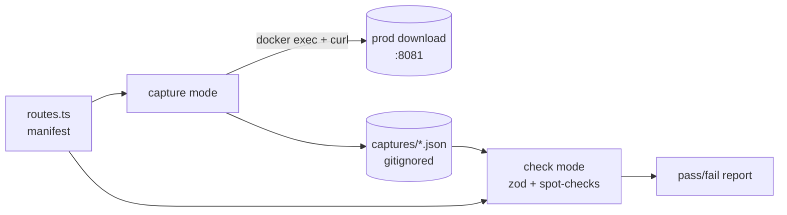
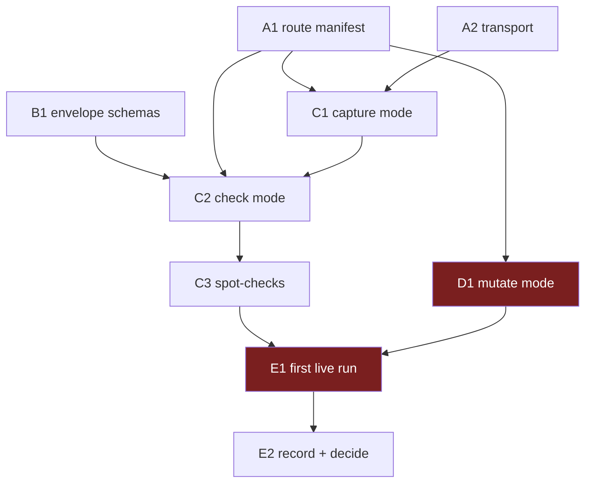

# Backend Verification Script — `apps/download`

A throwaway-grade tool that answers one question: **does the backend actually
work against the real Radarr, Sonarr, Emby, and MinIO?**

The existing suite — 59 test files under `apps/download/src/**/__tests__/` —
proves the _logic_ is right. Every one of them calls
`jest.mock('@lilnas/media/radarr')` and asserts against a payload a human
wrote. If an upstream's real response drifted, all 59 still pass. That gap is
the entire scope of this plan.

| Piece                | In one sentence                                                                                                                            |
| -------------------- | ------------------------------------------------------------------------------------------------------------------------------------------ |
| **Route manifest**   | Every read route, paired with the Zod schema its response must satisfy                                                                     |
| **Envelope schemas** | Runtime validators for the list/detail wrappers that today exist only as TS `interface`s                                                   |
| **Transport**        | Reaches the running backend on port 8081 via `docker compose exec`, run directly on lilnas                                                 |
| **Capture mode**     | Hits every read route, writes raw JSON to a gitignored dir                                                                                 |
| **Check mode**       | Parses each capture against its schema, runs semantic spot-checks, prints a pass/fail table                                                |
| **Mutate mode**      | Automated write-path pass — one movie, one **scoped show** (episode or season, never the whole series), one video, with crash-safe cleanup |



> **Accepted gap:** this does not do failure injection or process control —
> no dead-host `RADARR_URL`, no restart reconciliation, no `MAX_DOWNLOADS`
> throttling. Those need the containerised harness in
> [`002-live-functional-tests.md`](002-live-functional-tests.md) Group B, and
> they are already covered by mocked unit tests. This plan deliberately
> stops at "what only reality can tell us."

> **This is not a replacement for plan 002.** It's the cheap first pass that
> tells you _which_ of 002's rows are worth building. Run this, then decide.

---

## How to work this plan

**Per task:**

1. Work tasks in wave order (see [Sequencing](#sequencing)). Never start a
   task before its dependencies are green.
2. Implement → run `pnpm --filter @lilnas/download run lint` and
   `pnpm --filter @lilnas/download run type-check`.
3. **`/commit`** — one task, one commit. `/commit` stages at line level, so
   unrelated edits in the same file don't ride along.
4. Check the box below and append the commit hash.

**Markers:**

| Marker              | Means                                                                |
| ------------------- | -------------------------------------------------------------------- |
| `- [ ]`             | Not started                                                          |
| `- [x]` … `abc1234` | Done, with the commit that did it                                    |
| ⚠️ **PARTIAL**      | Landed with scope narrowed — say what was left and why, inline       |
| ⏭️ **DROPPED**      | Not doing it — say why. Never delete a task                          |
| 🔴 **HUMAN**        | Needs a person. No tasks carry this any more — see Human checkpoints |

**When reality disagrees with this plan,** add a short **Findings** note under
the task, then update the downstream tasks that finding invalidates.

> **No orchestrator section.** This is eight tasks in one sitting, mostly in
> one new directory. Delegating it costs more than doing it.

---

## Design decisions

### Talk HTTP to the running service, not to NestJS providers

Plan 002's Group B builds a container that instantiates NestJS providers
directly. That needs base images built, the `lilnas_default` network to
exist, `better-sqlite3` masked across the bind mount, and `working_dir` set
so migrations resolve. It's a long runway before you learn anything.

Hitting the already-running container's HTTP API needs none of that, and
covers **more**: the guards, the `ZodValidationPipe`s, the serialisation, and
the exact env the service actually booted with.

What it gives up is failure injection and process control. Both are already
unit-tested. Neither is what's uncertain.

### Split capture from validation

Two steps with different needs, so don't couple them:

- **Capture** needs network reach to prod. `curl` is already in the
  production image (`apps/download/Dockerfile:64`), so this needs **zero**
  setup on the host.
- **Validation** needs `zod` and the shared schemas. Runs anywhere — on your
  laptop, offline, against captures from an hour ago.

Decoupling means no `pnpm install` on the prod host, no image builds, no
network wiring. It also makes the captured JSON a reviewable artifact you can
diff across deploys, and free fixture material if plan 002's suite ever gets
built.

### Validate against the app's own Zod schemas

`packages/utils/src/download/schema.ts` is already the wire contract, shared
by the backend and the client. Parsing a real response with `MediaSchema`
answers "did reality drift from the contract" for free — no hand-written
assertions to maintain.

⚠️ **The catch, and the real work in this plan:** the _element_ schemas exist
(`MediaSchema`, `DownloadJobSchema`, `ReleaseSchema`, `SeasonSchema`,
`BadFileSchema`, `AuditLogEntrySchema`, `GalleryItemSchema`), but every
_envelope_ is a plain TypeScript `interface` with no runtime validator —
`DownloadPage<T>` (`types.ts:258`), `DiscoveryPage` (`types.ts:273`),
`MediaDetailResponse` (`types.ts:165`), `ListSeasonsResponse`,
`ListBadFilesResponse`, `ListReleasesResponse`, `AdminStatsResponse`
(`types.ts:422`), `DownloadGalleryFacets`, `GetDownloadJobResponse`. Task
**B1** builds those wrappers.

### Port 8081, not 8080

`apps/download/next.config.js` rewrites `/api/:path*` →
`http://localhost:8081/:path*`. So **8080 is Next.js, 8081 is Nest**. Traefik
routes `download.lilnas.io` to 8080 (`apps/download/deploy.yml`).

Hitting 8081 directly from inside the container bypasses Traefik's
ForwardAuth entirely — which is what makes this cheap, because almost nothing
is guarded (see below).

### Prod is the only place this can run

`docker-compose.dev.yml` does not include `infra/media.yml`. Radarr, Sonarr
and Emby exist **only** in the production stack, so a dev-stack run would
report a fully degraded service and tell you nothing.

### Things that already exist — don't rebuild them

- **`tsx` is at the repo root** (`package.json:51`, `4.20.6`). Scripts run
  via the `#!/usr/bin/env tsx` shebang — see
  `apps/tdr-bot/scripts/get-guild-emojis.ts` for the house pattern.
- **The `scripts/` directory convention** already exists in `apps/swole`,
  `apps/tdr-bot`, and `apps/tdr-code`.
- **`curl` is already in the production image** —
  `apps/download/Dockerfile:64`. Nothing to install on the host.

### What stays untouched

- ❌ **The backend source is read-only here.** Nothing under
  `apps/download/src/` may be modified. A task that thinks it needs to edit a
  controller, service, or schema has misread its scope — stop and report.
- ❌ **No changes to `jest.config.js`, `turbo.json`, or any CI workflow.**
  This never runs automatically.
- ❌ **No new dependencies.** `zod` and `tsx` are already present.

---

## Shared Context Pack

> Pointers, not gospel — verify against current code.

### Repo & conventions

- pnpm workspace + Turbo. This plan touches **only** `apps/download/scripts/`
  plus one `.gitignore` line.
- **Lint is two checks** — `eslint src` _and_ `prettier -c src`
  (`apps/download/package.json`). Note both are scoped to `src`, so
  `scripts/` is outside them; run `pnpm exec prettier -c scripts` manually to
  keep the formatting consistent anyway.
- Avoid `any`.
- Script style: `#!/usr/bin/env tsx` shebang, top-level `async function
main()`, invoked directly. No `package.json` script entry needed.

### The read surface — 20 GET routes

Controller prefixes: `@Controller('/download')` (`download.controller.ts:121`),
`@Controller('/download/admin')` (`admin.controller.ts:45`),
`@Controller('api/ytdlp-update')`, `@Controller('auth')`.

| Route                               | Needs an id? | Guard                | Element schema                       |
| ----------------------------------- | ------------ | -------------------- | ------------------------------------ |
| `GET /download/activity`            | —            | —                    | `DownloadJobSchema`                  |
| `GET /download/gallery`             | —            | —                    | `GalleryItemSchema`                  |
| `GET /download/gallery/facets`      | —            | —                    | `DownloadGalleryFacets` (B1)         |
| `GET /download/discover`            | —            | —                    | `MediaSchema` + `DiscoveryPage` (B1) |
| `GET /download/history`             | —            | `ForwardedUserGuard` | `DownloadJobSchema`                  |
| `GET /download/movies/search`       | —            | —                    | `MediaSchema`                        |
| `GET /download/shows/search`        | —            | —                    | `MediaSchema`                        |
| `GET /download/media/:id`           | ✅           | —                    | `MediaDetailResponse` (B1)           |
| `GET /download/media/:id/seasons`   | ✅           | —                    | `SeasonSchema`                       |
| `GET /download/media/:id/bad-files` | ✅           | —                    | `BadFileSchema`                      |
| `GET /download/media/:id/file`      | ✅           | —                    | _headers only_                       |
| `GET /download/media/:id/releases`  | ✅           | —                    | `ReleaseSchema` ⚠️ opt-in            |
| `GET /download/videos/:id`          | ✅           | —                    | `GetDownloadJobResponse` (B1)        |
| `GET /download/movies/:id`          | ✅           | —                    | `GetDownloadJobResponse` (B1)        |
| `GET /download/shows/:id`           | ✅           | —                    | `GetDownloadJobResponse` (B1)        |
| `GET /download/admin/audit-log`     | —            | `AdminGuard`         | `AuditLogEntrySchema`                |
| `GET /download/admin/stats`         | —            | `AdminGuard`         | `AdminStatsResponse` (B1)            |
| `GET /api/ytdlp-update/status`      | —            | —                    | hand-rolled                          |
| `GET /api/ytdlp-update/version`     | —            | —                    | hand-rolled                          |
| `GET /auth/whoami`                  | —            | —                    | hand-rolled                          |

**There is no global guard** — `app.module.ts:38` registers only
`MetricsInterceptor`. Every route not listed above as guarded uses
`@OptionalCurrentUser()` and answers fine with no identity at all.

### Identity

Traefik's `lilnas-auth` normally sets `X-Forwarded-User` /
`X-Forwarded-User-Id`. Hitting 8081 directly bypasses Traefik, so the script
sets them itself:

```
--as-user    → X-Forwarded-User: <email>, X-Forwarded-User-Id: <id>
--as-admin   → same, with an email apps/auth recognises as admin
(default)    → no headers; behaves as an unattributed service caller
```

⚠️ `AdminCheckService` is **fail-closed** — if the `auth` container is
unreachable, admin resolves to _not admin_ and `/download/admin/*` returns 403. A 403 there means "either not admin, or `auth` is down"; the script must
report those as distinguishable, not collapse them into one failure.

### Gotchas

- **`/media/:id/releases` fires a real interactive indexer search.** Slow
  (30s+) and antisocial to hammer. Must be opt-in behind a flag, never in the
  default sweep.
- **`/media/:id/file` streams the whole file.** The disk branch honours
  `Range` via `res.sendFile`; the MinIO branch deliberately does **not**
  (`download.controller.ts:543-545`), so a range request there still sends
  the entire object. Capture headers only and abort the body.
- **Detail routes need ids discovered at runtime.** Capture is inherently
  two-pass: list routes first, mine ids out of them, then detail routes.
- **Captured JSON contains real requester emails and real library contents.**
  Gitignored, and not to be pasted into an issue or a transcript.
- **`@lilnas/utils` exports `./dist/*.js`** (`packages/utils/package.json`),
  so `import '@lilnas/utils/download/schema'` needs the package built. Import
  the source by relative path instead —
  `../../../../packages/utils/src/download/schema` — which is what
  `jest.config.js`'s `moduleNameMapper` does for the test suite.

### Definition of Done

Include this **verbatim** in every delegation:

> **Done means:** implemented; `pnpm --filter @lilnas/download run lint` and
> `pnpm --filter @lilnas/download run type-check` clean; `pnpm exec prettier
-c scripts` clean for the files touched; committed with `/commit`. Report
> back: files changed, exported names introduced, commit hash(es).

**Addendum — this plan writes no unit tests.** The script _is_ the test, and
its subject is a live production service. Verify statically:
`pnpm exec tsx scripts/verify/verify-backend.ts --help` runs, and
`--dry-run` prints the route plan without touching the network.

❌ Do **not** run capture against prod as part of a Group A/B/C task —
those tasks verify statically via `--help` and `--dry-run`. The live run is
**E1**, once the script is complete. E1 is automated, not human-gated.

---

## Task List

### Group A — Foundation

- [x] **A1. Route manifest.** One list of read routes that both capture and
      check consume, so they can't drift apart. — `3a0eecb`

  **Findings — five places the Context Pack table was wrong:**
  1. **`GET /auth/whoami` is guarded.** `auth-debug.controller.ts:32` carries
     `@UseGuards(ForwardedUserGuard)` — it 401s without identity headers. So
     **three** routes are guarded, not two, and the claim that "every route
     not listed above as guarded answers fine with no identity at all" is
     wrong.
  2. **`needsId` spans two id spaces, not one.**
     `/download/{videos,movies,shows}/:id` take **job** ids;
     `/download/media/:id/*` take **media keys** (`tmdb:`/`tvdb:`/`video:`).
     Capture's id discovery must mine two separate pools.
  3. **Three media-keyed routes reject most keys.** `/seasons` 404s any
     `tmdb:` key; `/file` `BadRequest`s a `tvdb:` key with no `episodeId`.
     Added a `mediaKind` field to steer each route to a key type it accepts.
  4. **Both `/search` routes have no validation pipe** — bare
     `@Query() query: MediaSearchQueryDto`, no `ZodValidationPipe`, and no
     global one in `app.module.ts`. They are not evidence that
     `MediaSearchQuerySchema` is enforced anywhere.
  5. See the **D1 correction-of-the-correction** below — A1's route reading
     is what caught it.

  **Files:** create `apps/download/scripts/verify/routes.ts`.

  ```ts
  export interface RouteSpec {
    slug: string; // filename-safe; keys the capture file
    path: string; // '/download/gallery'
    query?: Record<string, string>;
    needsId?: "media" | "video" | "movie" | "show";
    guard?: "forwarded-user" | "admin";
    expensive?: boolean; // true = opt-in only (indexer search)
    bodyMode?: "json" | "headers-only";
  }

  export const READ_ROUTES: RouteSpec[];
  ```

  Cover all 20 routes in the Context Pack table. Mark
  `/download/media/:id/releases` as `expensive: true` and
  `/download/media/:id/file` as `bodyMode: 'headers-only'`.

  **Edge cases:**
  - Paginated routes need a **second** spec for the follow-up page so the
    cursor round-trip check (C3) has something to compare against.
  - `/download/discover` and the two `/search` routes need a `query` — pick a
    long-established title so the result is stable over time. Never pin
    counts or ordering.

- [x] **A2. Transport.** Reaches the running backend and returns status,
      headers, and body. — `574baa9`

  **Findings.** `Transport` gained an optional third `RequestOptions` arg
  (`{bodyMode?, timeoutSeconds?}`) rather than a second type, so both
  implementations stay interchangeable. Transport-vs-HTTP failure is modelled
  as **throw `TransportError` vs resolve non-2xx** — the latter keeps the
  error body as evidence. `TransportError.reason` discriminates
  `spawn-failed | timeout | nonzero-exit | output-too-large |
unparsable-response | network`. A malformed path or injected header value
  throws a plain `TypeError` instead — that's a manifest bug, not an
  environment condition. Stdout is capped at 32 MB, so a route mis-tagged as
  `json` when it streams a movie fails loudly instead of hanging.

  **Files:** create `apps/download/scripts/verify/transport.ts`.

  ```ts
  export interface RouteResponse {
    status: number;
    headers: Record<string, string>;
    body: string;
    durationMs: number;
  }

  export type Transport = (
    path: string,
    headers: Record<string, string>,
  ) => Promise<RouteResponse>;

  export function dockerExecTransport(opts: { repoPath: string }): Transport;
  export function httpTransport(baseUrl: string): Transport;
  ```

  `dockerExecTransport` shells out to, **run directly on lilnas** — no `ssh`
  hop:

  ```bash
  cd <repoPath> && docker compose exec -T download \
    curl -s -D - -o - --max-time 30 http://localhost:8081<path>
  ```

  **Edge cases:**
  - `docker compose exec` **needs `-T`** — without it, it allocates a TTY and
    mangles binary/piped output.
  - `curl -D -` interleaves headers with the body on stdout. Split on the
    first blank line; don't assume one header block (a 307 or a 100-continue
    yields two).
  - `bodyMode: 'headers-only'` must pass `-o /dev/null` so a multi-gigabyte
    movie isn't pulled into the runner's stdout.
  - A non-zero `docker compose exec` exit is a **transport** failure,
    distinct from an HTTP error. Report them separately — one means "can't
    reach the container", the other means "the backend answered badly."
  - `repoPath` still matters: `docker compose exec` must run from the
    directory containing the root `docker-compose.yml` (or wherever `include`
    resolves the `download` service), same as the "always deploy from the
    root `docker-compose.yml`" rule in this repo's `CLAUDE.md`.

### Group B — The missing validators

- [x] **B1. Envelope schemas.** Runtime Zod validators for the response
      wrappers that exist today only as TypeScript interfaces. — `bc73109`

  **Findings — three corrections to this plan's own premises:**
  1. **The interfaces are in `packages/utils/src/download/types.ts`, not
     `apps/download/src/download/types.ts`.** The latter is 8 lines long and
     holds only `DownloadStepOptions`. Every line number this plan cites
     (165, 258, 273, 422) is correct — against the `packages/utils` file.
  2. **`GetDownloadJobResponse` is not a wire shape.** All three of
     `/videos/:id`, `/movies/:id`, `/shows/:id` are typed
     `Promise<DownloadJob>` and return `projectJobForViewer(...)`.
     `GetDownloadJobResponse` is the deprecated pre-`Media` projection built
     **client-side** by `flattenToLegacyVideoResponse()`, kept for tdr-bot.
     C2 must point those three routes at `DownloadJobResponseSchema`.
  3. **The two `/search` routes have an envelope** the table omits — they
     return `{ results: Media[] }`, not a bare array.

  **⚠️ `scripts/` is covered by neither gate.** `apps/download/tsconfig.json`
  `include`s only `src/**`, and lint is `eslint src` / `prettier -c src`. So
  `pnpm run type-check` passes **vacuously** for every file in this plan.
  Verify with `pnpm exec eslint --no-ignore scripts` and `prettier -c scripts`
  (the orchestrator caught a real `no-control-regex` error in A2 this way that
  the prescribed commands missed), plus a standalone `tsc` pass.

  **Files:** create `apps/download/scripts/verify/envelopes.ts`.

  ```ts
  export const downloadPage = <T extends z.ZodTypeAny>(item: T) =>
    z.object({
      items: z.array(item),
      nextCursor: z.string().nullable(),
      total: z.number(),
    });

  export const DiscoveryPageSchema; // downloadPage(MediaSchema) + degradedSources + facets
  export const MediaDetailResponseSchema;
  export const GetDownloadJobResponseSchema;
  export const ListSeasonsResponseSchema;
  export const ListBadFilesResponseSchema;
  export const ListReleasesResponseSchema;
  export const AdminStatsResponseSchema;
  export const GalleryFacetsSchema;
  export const WhoamiSchema;
  export const YtdlpStatusSchema;
  ```

  Each wraps the **existing** element schema from
  `packages/utils/src/download/schema.ts` — don't restate field lists that
  already have a schema.

  **Edge cases:**
  - Use `.strict()` on the envelopes. An **extra** field the interface doesn't
    declare is exactly the drift worth catching, and the default `.strip()`
    would silently swallow it.
  - `AdminStatsResponse` aggregates are **sparse by design**
    (`admin-stats.service.ts`) — a `(day, type)` pair with no jobs is absent,
    not `{ count: 0 }`. Don't write a schema that demands a dense series.
  - `DiscoveryPage.degradedSources` is `Array<'movies' | 'shows'>`. Empty is
    the healthy case; the schema permits non-empty, and C3 flags it.

### Group C — The runner

- [x] **C1. Capture mode.** Hits every route in the manifest and writes raw
      responses to disk. — `478a17a`

  **Findings.** Elements are classified **structurally**, not by slug: a job
  carries its own `id` alongside its `media`, a `GalleryItem` does not — that
  discriminator is what keeps gallery rows out of the job pool, and it means a
  route added to the manifest later needs no change here. `Transport` can't
  express the upstream health probe (it only speaks HTTP to `localhost:8081`,
  while reading `$RADARR_URL` needs `sh -c` inside the container), so C1 has
  its own small `runDockerExec`. Guarded routes are captured as 401/403 rather
  than skipped, with `guard` + `identity` recorded — **interpreting that is
  C2's job**, not capture's.

  **Deviation — `--base-url` was added** (mutually exclusive with
  `--repo-path`), wiring up A2's otherwise-unreachable `httpTransport`.
  `--dry-run` alone exercises maybe 20% of the file; this made a full sweep
  against a local fake possible. It records `state: 'unprobed'` in
  `_health.json`, since there's no way into the container to read the keys.

  **Files:** create `apps/download/scripts/verify/verify-backend.ts`; edit
  `.gitignore`.

  ```
  tsx scripts/verify/verify-backend.ts capture \
    --repo-path /path/to/lilnas \
    [--as-user a@b.c --user-id u1] [--as-admin] [--include-expensive] [--dry-run]
  ```

  Writes `apps/download/scripts/verify/captures/<slug>.json` (body) and
  `<slug>.meta.json` (status, headers, durationMs, the resolved path).

  Add `apps/download/scripts/verify/captures/` to `.gitignore` — the captures
  hold real emails and real library contents.

  **Edge cases:**
  - **Two-pass id discovery.** Run the id-free routes first, mine real ids out
    of the results, then run the `needsId` routes. If a list came back empty,
    **skip** the dependent routes and report them as `SKIPPED (no fixture)` —
    never as a failure, and never with a hardcoded id.
  - `--dry-run` prints the plan and exits without touching the network. This
    is how a sub-agent verifies the task without a live run.
  - Never abort the sweep on one bad route. Record and continue — a 500 on
    `/discover` shouldn't cost you the other 19 results.
  - Write captures even for non-2xx responses. The error body is the evidence.
  - **Snapshot upstream health into `captures/_health.json`** at sweep start:
    the HTTP status of `$RADARR_URL/api/v3/system/status` and the Sonarr
    equivalent, called from inside the container with the keys the running
    process holds. This is what lets C2 later distinguish "the resolver has a
    bug" from "Sonarr happened to be restarting during capture" without
    re-running against a moving target. Status codes only — **never** log the
    key values.

- [x] **C2. Check mode.** Parses each capture against its schema and prints a
      report. — `def3abb`

  **Findings.** The slug→schema binding is **total**: an unbound slug fails
  loudly and short-circuits before the capture is read, so it can't be masked
  by a skip. Beyond the plan's brief, three result classes turned out to need
  their own reporting, because collapsing them would have been misleading:
  a 401 on a guarded route is a **skip** during an anonymous run but a
  **failure** during an identified one; a 401 on a route `routes.ts` calls
  unguarded is manifest drift; and a guarded route answering **200**
  anonymously is annotated as the `DEV_USER_EMAIL` fallback. The verdict line
  reports hollow passes apart from real ones, and a run where
  `verified === 0` prints **`NOT A PASS`** even with zero failures.

  **Files:** edit `apps/download/scripts/verify/verify-backend.ts`; create
  `apps/download/scripts/verify/report.ts`.

  ```
  tsx scripts/verify/verify-backend.ts check [--captures <dir>]
  ```

  Per route: `PASS` / `FAIL` / `SKIPPED`, the HTTP status, duration, and on
  failure the **flattened Zod issue paths** — not a wall of raw error JSON.
  Exit non-zero if anything failed.

  **Edge cases:**
  - Runs fully offline against a captures dir. No network, no docker.
  - A 403 on an admin route is ambiguous (not-admin vs. `auth` down). Report
    it as `FAIL (403 — not admin, or the auth container is unreachable)`
    rather than a bare failure.
  - A schema failure on an **empty** list is meaningless. If `items` is `[]`,
    report `PASS (empty — no fixture to validate)` so nobody reads coverage
    that isn't there.

- [x] **C3. Semantic spot-checks.** The assertions a schema can't make — the
      ones a mock would never have caught. — `3924f86`

  17 checks, every one on the plan's list plus `emby.indexed-carries-a-link`,
  `movie.file-path-is-a-file` and `ytdlp.version-is-not-the-error-sentinel`.
  Checks read the **raw** JSON rather than the parsed result, so a `radarrId`
  of `0` still gets a semantic diagnosis even though it also trips the
  envelope parse.

  **Two refinements against source.** `runtime` is checked on **movies only** —
  `sonarr.service.ts:161` maps the _per-episode_ runtime, where a short-form
  series is legitimately under the 300s floor, so applying the movie threshold
  to shows would have produced false failures. The cursor checks additionally
  assert page 1 was full, since `hasMore` only fires on an over-full fetch.

  **Deliberately dropped:** `Season.episodeCount` vs `episodes.length`
  (`sonarr.service.ts` documents that the two legitimately disagree — Sonarr
  counts episodes it knows are coming), and "`job.media.type` matches the
  route", which C1's typed id pools already guarantee, so it would pass
  vacuously.

  **🐞 Real app bug found — reported, not fixed** (`src/` is read-only here).
  `toMovie()` does `const tmdbId = movie.tmdbId ?? 0` (`radarr.service.ts:107`)
  and `toShow()` does `const tvdbId = series.tvdbId ?? 0`
  (`sonarr.service.ts:149`), but `MovieSchema.tmdbId` / `ShowSchema.tvdbId` are
  `z.number().int().positive()` (`schema.ts:96,114`). An upstream record with
  no catalogue id therefore produces a `Media` that **fails the app's own wire
  schema**: the backend serialises it fine and the frontend's
  `DownloadJobSchema.safeParse()` silently drops the job. `mediaId()` would
  also have minted `tmdb:0`. Unlikely to fire — Radarr/Sonarr almost always
  carry the id — but it is a silent-drop path, not a loud one.
  `media.ids-never-zero` covers it and prints a caveat distinguishing the
  `?? 0` family from the `|| undefined` guard.

  **Files:** create `apps/download/scripts/verify/spot-checks.ts`; edit
  `verify-backend.ts` to run them in `check` mode.

  ```ts
  export interface SpotCheck {
    id: string;
    describe: string;
    run(captures: CaptureSet): SpotCheckResult;
  }
  export const SPOT_CHECKS: SpotCheck[];
  ```

  Cover, at minimum:
  - **`runtime` is seconds, not minutes** — both mappers multiply by 60, so a
    feature film reads ~7200. A value under 300 on a movie means the
    multiplication was lost.
  - **`radarrId` / `sonarrId` are never `0`** — the SDK returns `0` rather
    than absent for a non-library lookup hit, which is why the mappers use
    `|| undefined`.
  - **`degradedSources` is `[]`** on `/discover`. Non-empty means an upstream
    is failing silently and the resolver swallowed it — a **failure**, not a
    pass.
  - **`watchUrl` uses `EMBY_EXTERNAL_URL`**, not the container address. A
    `http://emby:8096` here works in every test and is dead in a browser.
  - **`Show.filePath` is a folder**, not a media file — `SeriesResource.path`
    is the series directory.
  - **Cursor round-trip** — page 2 fetched with page 1's `nextCursor` has no
    overlapping ids and no gap, and `total` is identical across both.
  - **`AdminStatsResponse.windowDays`** echoes the requested `days`, and
    `topRequesters.length <= 20` (`TOP_REQUESTERS_LIMIT`).
  - **Audit `action`s** are all members of `AUDIT_ACTIONS`.
  - **No placeholder media** — a `Media` whose `title` equals its `id` is the
    resolver's degraded placeholder leaking into a response.

  **Edge cases:**
  - Every check must **skip cleanly** when its fixture is absent. An empty
    library is a legitimate environment state, not a failed run.
  - Report a skip distinctly from a pass. A green board that's 80% skips is
    the worst possible outcome of this plan.

### Group D — The mutating pass

> ### ⚠️ Correction of the correction — the "false premise" was itself false
>
> **The correction block below was wrong on every clause. The _original_ D1
> was right.** Re-verified against source 2026-08-26 during Wave 1:
>
> | The correction claimed                                              | Actually                                                                                                              |
> | ------------------------------------------------------------------- | --------------------------------------------------------------------------------------------------------------------- |
> | "`episodeId` appears **nowhere** — zero matches"                    | ~25 matches across `media-file.service.ts`, `release.service.ts`, `sonarr.service.ts`, and four Zod schemas           |
> | "`RequestShowInputSchema` accepts **only** `{ tvdbId }`"            | `schema.ts:111` is `{ episodeId?, seasonNumber?, tvdbId }`                                                            |
> | "`sonarr.service.ts:78` adds with `searchForMissingEpisodes: true`" | `requestShow` is at **line 668**; the fresh-add path sets both search flags **`false`** (`sonarr.service.ts:388-394`) |
>
> **What the code actually does.** `POST /download/shows` accepts an optional
> `episodeId` / `seasonNumber` scope (`download.controller.ts:1105-1111`:
> _"omitting them requests the whole series"_). A **scoped** request calls
> `ensureSeries(tvdbId, {monitorEpisodes: scope})` and then
> `triggerScopedSearch`, which picks the narrowest of `EpisodeSearch` /
> `SeasonSearch` / `SeriesSearch`. A fresh add fires **no search at all** —
> `addOptions.searchForMissingEpisodes` and `searchForCutoffUnmetEpisodes`
> are both `false`, because the search moved out to the explicit command.
>
> **So D1 requests one episode, not a whole series.** Blast radius is one
> `EpisodeSearch` for one episode.
>
> ⚠️ **The one residual risk.** A fresh add still uses
> `addOptions.monitor: 'all'`, so every episode ends up **monitored** even
> though only one is searched. Sonarr's RSS sync can therefore grab other
> episodes on its own schedule after the add. Cleanup must delete the series
> (not just unmonitor it), and must run promptly — this is why the journal
> and the `finally` cleanup matter more than the polling.

- [x] **D1. Mutate mode.** Automated write-path pass over one movie, one
      **scoped show**, and one video, with crash-safe cleanup. — `1a123e4`

  **Findings.**
  - **A whole-series request is now unrepresentable, not merely unwritten.**
    `ShowScopePlan` is `episode | season | skip` with no `{tvdbId}`-only
    variant, so no branch of the pass can produce one by accident.
  - **The show pass nearly wasn't runnable at all.** `episodeId` is only
    obtainable from `/download/media/:id/seasons`, which 404s a series not
    already in Sonarr — while preflight refuses a fixture that _is_ already
    there. Jointly unsatisfiable. The escape is that `resolveScope()`
    (`sonarr.service.ts:753`) returns a **season-only** scope unchanged, with
    no episode lookup, and `triggerScopedSearch` fires a `SeasonSearch` for it.
    So: episode scope when `/seasons` answers, season scope otherwise.
  - The DELETE allowlist is enforced **structurally** — `CleanupTicket` carries
    a module-private `symbol` nothing outside the file can name, and the one
    function issuing a destructive request re-reads the journal from disk and
    re-checks the entry first. A forged ticket fails to type-check; one
    smuggled through a cast is refused at runtime with zero requests sent.

  **🐞 Two more real app findings — reported, not fixed:**
  1. **There is no `DELETE` for a video anywhere on this surface.**
     `PATCH /download/videos/:id/cancel` throws once the job is `Completed`,
     and `DELETE /download/media/:id/files` 404s any `video:` key. A 5-second
     clip completes in seconds, so **every real video pass leaves a MinIO
     object behind.** Recorded as residue with manual-removal instructions.
     This plan's "→ `DELETE` → confirm gone" for videos is not implementable
     today.
  2. **No `@Body()` in this app is validated.** `CreateJobInputDto`,
     `RequestMovieInputDto`, `RequestShowInputDto`, `GrabReleaseInputDto`,
     `ReplaceReleaseInputDto` and `FlagBadFileInputDto` are all declared via
     `createZodDto` but never bound to a `ZodValidationPipe`, and there is no
     global pipe. Only `@Query()` params get one. This contradicts
     `RequestShowInputSchema`'s own docblock, which reasons that a string
     `"3"` "is a client bug worth a 400 rather than something to silently
     coerce" — that 400 never happens. Same class as A1's finding #4, but on
     the **write** path.

  ⚠️ **For whoever runs this live:** on the clean-library path the
  season-count guard reports `SKIPPED (unverifiable before the add)`, so
  `expectedEpisodes: 4` is the **only** ceiling on how many episodes
  `addOptions.monitor: 'all'` leaves RSS-reachable between the add and
  teardown. It is a human-vetted number — check it before the first real run.

  **Files:** create `apps/download/scripts/verify/fixtures.json` and
  `apps/download/scripts/verify/mutate.ts`; add `preflight` and `mutate`
  modes to `verify-backend.ts`; edit `.gitignore`.

  ```
  tsx scripts/verify/verify-backend.ts preflight   # read-only, never deletes
  tsx scripts/verify/verify-backend.ts mutate [--only movie|show|video] [--keep]
  tsx scripts/verify/verify-backend.ts mutate --cleanup-only   # drain the journal
  ```

  **Fixtures** (`fixtures.json`, committed — these are public catalogue ids,
  not secrets). Verified 2026-08-26 as absent from the live library:

  ```json
  {
    "adminEmail": "jeremyasuncion808@gmail.com",
    "movie": { "tmdbId": 11660, "title": "Following", "year": 1999 },
    "show": {
      "tvdbId": 276842,
      "title": "Olive Kitteridge",
      "expectedEpisodes": 4
    },
    "video": {
      "url": "<short youtube url>",
      "timeRange": { "start": "00:00:00", "end": "00:00:05" }
    }
  }
  ```

  **The three passes**, each with its own cleanup:
  1. **Movie** — `POST /download/movies` `{tmdbId}` → poll
     `/download/movies/:id` for forward movement → `DELETE` → confirm gone.
  2. **Series** — `POST /download/shows` `{tvdbId, episodeId}`. **Episode-
     scoped**, never a bare `{tvdbId}` — see the correction above. Resolve a
     real `episodeId` first via `GET /download/media/tvdb:<id>/seasons`;
     if that returns nothing, **skip the show pass** rather than falling back
     to a whole-series request. Cleanup deletes the series outright, because
     the add monitors every episode even though only one is searched.
  3. **Video** — `POST /download/videos` `{url, timeRange}` → poll to
     `Completed` → confirm the MinIO object → `DELETE`.

  **Guardrails — this is the substance of the task, not the polling:**
  - **Journal before create.** Write the intended fixture id to
    `captures/mutate-journal.json` _before_ the POST returns, so a crash
    mid-run still leaves a cleanup record. `--cleanup-only` drains it.
  - **Cleanup in a `finally`.** Never rely on the happy path to tidy up.
  - **DELETE is allowlisted to journal ids only.** The script must be
    structurally incapable of deleting anything it did not create.
  - **`preflight` refuses if a fixture is already in the library.** This
    matters more than it looks: it stops cleanup from deleting pre-existing
    real content that shares the id.
  - **Season-count guard.** Refuse any `tvdbId` whose lookup reports
    `statistics.seasonCount > 1`.

  **Edge cases:**
  - ⚠️ **An episode-count ceiling still cannot be enforced pre-add**, but it
    matters far less than the superseded correction claimed. Sonarr's
    `/api/v3/series/lookup` returns `statistics.episodeCount: 0` for a series
    not yet in the library, so counts don't exist until after the add. What
    changed: an **episode-scoped** request searches exactly one episode, so
    the count was never the real exposure. The real exposure is
    `addOptions.monitor: 'all'` leaving the rest of the series monitored and
    reachable by RSS sync — bounded by deleting the series in cleanup, not by
    a pre-add count. Keep the `seasonCount > 1` guard as cheap defence in
    depth; `expectedEpisodes` stays a human-vetted advisory value and the
    script must say so when it reports.
  - ⚠️ `POST /media/:id/releases/grab` pulls real bytes from a real indexer
    into the download client. **Out of scope** — document that it exists and
    that it needs its own deliberate session.
  - `DELETE /media/:id/files` also **unmonitors** the scope. Deleting without
    it means Sonarr immediately re-grabs. Use the unmonitoring delete for
    series cleanup.
  - **Assert forward movement, not completion.** A real grab depends on an
    indexer actually having the release, so "reached `Downloaded`" is not a
    property that can be asserted — it may legitimately never happen. Assert
    advancement through valid states within a bounded window instead.

### Group E — Run it and decide

- [x] **E1. First read-only run.** Ran on the lilnas host 2026-08-27:
      `capture` → `check` → `capture --as-admin` → `check`. Both upstreams
      answered **200** in both sweeps, so nothing below is explained away by an
      upstream being down.

  > **The prerequisite nobody had written down: this branch had never been
  > deployed.** The running `download` image was built 2026-08-05 from `main`,
  > and `main` has none of Phases 0–8 — **18 of the 20 routes 404'd**. Only
  > `/api/ytdlp-update/status` answered, because that controller predates the
  > refactor. This plan's premise that hitting the running container "covers
  > the exact env the service actually booted with" silently assumed prod was
  > running this code. It was not.
  >
  > Deploying it surfaced a second undocumented prerequisite: Docker
  > auto-creates `/storage/app-data/download` as `root:root`, the container
  > runs as UID 1000, and the first boot died with `SQLITE_CANTOPEN`.
  > `deploy.yml` documents the fix in a comment (`chown 1000:1000`) — it just
  > isn't part of any deploy step. Worth automating before the next fresh
  > deploy.

  ### Findings

  | #   | Finding                                                                                                                                                                                      | Verdict                                                                                                                                                                                                                                                                                                                                                                                                                                                       |
  | --- | -------------------------------------------------------------------------------------------------------------------------------------------------------------------------------------------- | ------------------------------------------------------------------------------------------------------------------------------------------------------------------------------------------------------------------------------------------------------------------------------------------------------------------------------------------------------------------------------------------------------------------------------------------------------------- |
  | 1   | **`media.runtime-is-seconds` FAIL** — 3 of 30 movies under the 300s floor: two titled "The Matrix" (`tmdb:1386216`, `tmdb:1502836`) at `240`, and "Exit the matrix" (`tmdb:1712133`) at `60` | ⭕ **Stale expectation, not a bug.** Those tmdb ids are 7-figure — the real Matrix is `tmdb:603`. These are short films that merely match the search string; 4 min and 1 min are plausible real runtimes. The mapper is fine. **Fix the check, not the code:** exclude `/movies/search` results, which are arbitrary catalogue rather than library content                                                                                                    |
  | 2   | **`media-seasons` FAIL — HTTP 404**, `Show 'tvdb:77526' is not in the library`                                                                                                               | ⭕ **Fixture-selection artifact, not a bug.** The id came from `/discover`, which returns catalogue items, and `listSeasons` deliberately 404s a series not in Sonarr. **Should report `SKIPPED (no library show)`, not `FAIL`** — the check cannot currently tell "resolver bug" from "we picked a key that was never in the library"                                                                                                                        |
  | 3   | **Admin routes 403 even with `--as-admin`**                                                                                                                                                  | 🐞 **Real — and a third cause this plan's binary framing did not anticipate.** Not "not an admin", not "auth is down". `ADMIN_EMAILS` **does** contain the fixture address and `auth` is up. Actual cause: `AdminCheckService` → `AuthClient.dockerInstance` → `GET http://auth:8081/admin/check`, which **404s**, because that endpoint ships in commit `6883859` on _this branch_ and the deployed `auth` is built from `main`. Non-2xx → fail-closed → 403 |
  | 4   | Every list route came back **empty** — `activity`, `gallery`, `history`, `gallery-facets`, `bad-files`; **0 job ids** discovered                                                             | ⭕ **Expected.** The deploy created a brand-new SQLite file, so there is no job history yet. Consequence: 9 rows are hollow passes and the three job-by-id routes never ran                                                                                                                                                                                                                                                                                   |

  **Deliberately not done: `auth` was not redeployed to fix finding 3.** `main`
  carries five auth commits this branch lacks — including
  `7e25141 refactor(auth): 17-commit code review fix cycle (security, perf, maintainability)`.
  Deploying `auth` from this branch would roll those back. **The admin surface
  cannot be verified until this branch is merged with `main`** — and that
  ordering constraint is itself the finding: `download`'s admin feature has a
  hard deploy-time dependency on an `auth` endpoint shipping in the same
  branch.

  ### The two reports

  |         | anonymous                                    | `--as-admin`                                 |
  | ------- | -------------------------------------------- | -------------------------------------------- |
  | Rows    | 42                                           | 42                                           |
  | Passed  | 20 (8 validated nothing)                     | 22 (9 validated nothing)                     |
  | Failed  | 2                                            | 4                                            |
  | Skipped | 20                                           | 16                                           |
  | Verdict | `FAILED` + `MOSTLY UNVERIFIED` — 12 verified | `FAILED` + `MOSTLY UNVERIFIED` — 13 verified |

  **Read the verdict, not the colour.** Both runs print `MOSTLY UNVERIFIED`.
  Only 12–13 of 42 rows verified anything, and that is the honest headline.

  ✅ **What genuinely passed against reality:** every envelope schema B1 wrote
  parsed real upstream responses with no drift; the `/discover` cursor round
  trip (10 + 10 of 40, no overlap, stable total); `degradedSources: []` with
  both upstreams live; `ids-never-zero` and `no-placeholders` over 61 real
  media objects; and guarded routes 401 anonymously but 200 with identity —
  which **confirms A1's finding that `/auth/whoami` is guarded**, contradicting
  this plan's own route table.

  ### E1b — the write path, and what a second read sweep then showed

  Ran `preflight` (all guardrails green), then `mutate` per pass.

  | Pass      | Result                                                                                                                                                                      |
  | --------- | --------------------------------------------------------------------------------------------------------------------------------------------------------------------------- |
  | **movie** | ✅ Created, advanced **`searching → downloading`** against a real indexer, torn down, confirmed out of the library                                                          |
  | **show**  | ✅ Sent `{"tvdbId":276842,"seasonNumber":1}`; the scope **round-tripped onto the job** and fired one `SeasonSearch`. Torn down by deleting the series                       |
  | **video** | 🐞 **`HTTP 500` on first attempt** — see finding 5. After the fix: `pending → downloading → completed`, and MinIO served the object back (`application/mp4`, 139,793 bytes) |

  The show pass is the direct payoff of correcting this plan's false premise:
  had D1 shipped as originally written, it would have fired a **`SeriesSearch`
  across every season** instead.

  | #   | Finding                                                                                                                                                                                                              | Verdict                                                                                                                                                                                                                                                                                                                                                  |
  | --- | -------------------------------------------------------------------------------------------------------------------------------------------------------------------------------------------------------------------- | -------------------------------------------------------------------------------------------------------------------------------------------------------------------------------------------------------------------------------------------------------------------------------------------------------------------------------------------------------- |
  | 5   | **`POST /download/videos` returned 500 on every request** — `EACCES: permission denied, mkdir '/download'`                                                                                                           | 🐞 **Real, and total: video downloads were broken in production.** `DownloadVideoService` hardcodes `VIDEO_DIR = '/download/videos'`, the container runs as UID 1000, and **nothing** created that path — not the Dockerfile, not this `deploy.yml`, not `main`'s. All 59 mocked test files pass because they mock the filesystem. **Fixed — `f086c62`** |
  | 6   | **`GET /download/media/:id/releases` writes to the library.** On a `tmdb:` key Radarr doesn't hold, `withMonitoring` → `ensureMovie` → `postApiV3Movie`. `restore: true` restores only _monitoring_; the entry stays | 🐞 **Real, unfixed** (`src/` is read-only here). A GET with a permanent side effect on the production library. Arguably intended per the docblock, but an `--include-expensive` sweep would silently add catalogue movies to Radarr. The provenance fix reduces exposure by preferring held titles, where `ensureMovie` adds nothing                     |

  **Second read sweep, after fixing fixture selection (`feb4f15`):**

  |               | first sweep         | after `mutate` + fixes           |
  | ------------- | ------------------- | -------------------------------- |
  | Captured      | 16                  | **19**                           |
  | Job ids found | 0                   | **3**                            |
  | Rows verified | 12                  | **20**                           |
  | Failures      | 2                   | **2 — both the auth dependency** |
  | Verdict       | `MOSTLY UNVERIFIED` | no longer mostly-unverified      |

  Every remaining failure is finding 3. The three script-side false failures
  are gone: `media-bad-files` passes, `media-seasons` skips honestly with full
  provenance, and `media.runtime-is-seconds` no longer floors catalogue shorts.

- [x] **E2. Record outcomes and decide what's durable.** Edit this plan and
      `docs/features/download/plans/002-live-functional-tests.md`.

  **Plan 002's corrections — `2653323`.** Its two
  stale premises are corrected in place, both verified against source first:
  - "Phases 0–2 … done. Phases 3–8 pend" → **0–8 all done**, with a note that
    every `⏳ BE Phase N` tag in that document is consequently stale and that
    its rule 6 must not be applied to them. The tags are annotated rather than
    stripped, because deciding which ones earn a durable row is the judgement
    the rest of E2 exists to make.
  - "**No `Paused`** — that's Phase 5" → `Paused` **and** `Pausing` both exist
    (`schema.ts:29,32`), and neither is terminal
    (`TERMINAL_DOWNLOAD_JOB_STATUSES` is exactly
    `{Cancelled, Completed, Failed}`) — so a test waiting for a job to settle
    must not treat a paused job as finished.

  **Now also done — every E1 failure is ruled on** in the findings table under
  E1 above. The pattern across all four: the script's job of printing enough
  context to decide in seconds worked, and **three of the four failures were
  the check's fault, not the code's.** Both `FAIL`s came from feeding
  library-scoped routes ids mined out of `/discover` and `/movies/search`,
  which return catalogue rather than library content. That is one root cause,
  and it is a bug in the manifest's fixture selection.

  ### Promotion decisions

  | Finding                                        | Durable row in 002?                                                                                                                                                                                                                                                    |
  | ---------------------------------------------- | ---------------------------------------------------------------------------------------------------------------------------------------------------------------------------------------------------------------------------------------------------------------------- |
  | **Admin depends on `auth`'s `/admin/check`**   | ✅ **Yes — the highest-value finding here.** A cross-service deploy-ordering dependency is invisible to every mocked test and to any single-service check. Belongs in 002 as a BE row: _with `auth` reachable but lacking the endpoint, admin routes must fail closed_ |
  | **Envelope drift (B1's schemas vs. reality)**  | ✅ **Yes.** These parsed clean against real Radarr/Sonarr today, which is exactly why they are worth keeping — they are the tripwire for the drift this plan was written to catch. Promote `envelopes.ts` as fixtures for 002's Group A                                |
  | **Cursor round-trip**                          | ✅ **Yes.** Held on `/discover` (10 + 10 of 40, no overlap, stable total) and is cheap, deterministic, and a genuine regression risk                                                                                                                                   |
  | **`runtime` floor / `filePath` shape**         | ❌ **No — one-off.** It false-positived on catalogue shorts; now narrowed to held titles (`feb4f15`), where it largely duplicates a mapper unit test                                                                                                                   |
  | **`SQLITE_CANTOPEN` on a fresh volume**        | ❌ **Not a test row — a deploy-script fix.** `chown 1000:1000` should be automated in the deploy path, not asserted after the fact                                                                                                                                     |
  | **Video scratch dir missing (finding 5)**      | ✅ **Yes — the highest-value row this plan produced.** A 500 on _every_ video request, invisible to 59 mocked tests precisely because they mock the filesystem. 002 should assert `POST /download/videos` reaches `downloading` on a real container                    |
  | **A GET that mutates the library (finding 6)** | ✅ **Yes.** `/releases` adding a movie to Radarr is the kind of side effect no mocked test asserts the absence of. Worth a row pinning "a read route must not change upstream state"                                                                                   |
  | **Write path: forward movement**               | ✅ **Yes.** All three passes advanced through real states against real upstreams, and the show pass proves scope round-trips as a `SeasonSearch` rather than a `SeriesSearch` — the exact regression this plan's own false premise would have caused                   |

  **Left undone, and why:** the two admin routes are still unverified. That is
  not a judgement gap — it is the deploy-ordering dependency in finding 3, and
  it clears itself once this branch is merged with `main`. Re-run
  `capture --as-admin` then, and the two `admin.*` spot-checks plus
  `audit.actions-are-known` should go green.
  - Log every spot-check that failed, and whether it's a real bug or a stale
    expectation.
  - For each finding, say whether it earns a permanent row in plan 002 or
    stays a one-off.
  - Update 002's stale premise while you're there: it says "Phases 0–2 and
    the media-entity refactor are done. Phases 3–8 pend," but
    [`backend.md`](../backend.md) now reports **0–8 all done**. Every ⏳ tag
    in that doc is wrong, and its Context Pack line "**No `Paused`** — that's
    Phase 5" is contradicted by `DownloadJobStatus.Paused` and `.Pausing`
    both existing today.

---

## Sequencing



### Waves

| Wave | Run              | Why it works                                                                                |
| ---- | ---------------- | ------------------------------------------------------------------------------------------- |
| 1    | **A1 ∥ A2 ∥ B1** | Three new files in a new directory, zero overlap                                            |
| 2    | **C1**           | First task to touch `verify-backend.ts`; also the only one editing `.gitignore`             |
| 3    | **C2 ∥ D1**      | C2 edits `verify-backend.ts` + `report.ts`; D1 adds a separate mode and a new markdown file |
| 4    | **C3**           | Edits `verify-backend.ts` again — must follow C2                                            |
| 5    | **E1 → E2**      | Strictly sequential. E1 automated; E2 needs human judgment on the findings                  |

> ⚠️ **C1, C2, C3 and D1 all write `verify-backend.ts`.** The DAG allows C2
> and D1 to overlap, but they share that file. Either give each an isolated
> worktree, or just run waves 3 and 4 serially — this is a small enough plan
> that serialising costs minutes.

### Dependency table

| Task | Depends on | Parallel with       |
| ---- | ---------- | ------------------- |
| A1   | —          | A2, B1              |
| A2   | —          | A1, B1              |
| B1   | —          | A1, A2              |
| C1   | A1, A2     | —                   |
| C2   | A1, B1, C1 | D1 (⚠️ shared file) |
| C3   | C2         | —                   |
| D1   | A1         | C2 (⚠️ shared file) |
| E1   | C3, D1     | —                   |
| E2   | E1         | —                   |

### Critical path

**A1 → C1 → C2 → C3 → E1 → E2**

**A1 leads.** The manifest is the contract between capture and check — get it
wrong and both halves get rewritten. It's also the only task where "which
routes actually exist" has to be right, and the Context Pack table above is
already the answer.

### Human checkpoints

**Revised 2026-08-26 — this plan is fully automated.** The original four
checkpoints were over-cautious: three of them were read-only and gated
nothing real. What replaced them:

> ⚠️ **Amended after implementation.** The reasoning below is sound and still
> stands — none of these four needs a person for _judgement_. But E1 turned
> out to need one anyway for **access**: the transport must run directly on
> lilnas, and the implementing session could not authenticate to that host. See
> E1 for the commands to run there. This is a credentials gap, not a
> reinstatement of the checkpoints.

| Original checkpoint        | Verdict                                                                                                                                                              |
| -------------------------- | -------------------------------------------------------------------------------------------------------------------------------------------------------------------- |
| 1. First read-only capture | **Automated.** 20 GET requests, nothing mutates. Transport already proven — a live `docker compose exec` reached the container and made authenticated upstream calls |
| 2. Admin pass              | **Automated.** Also read-only. The only human input was the admin email, now fixed in `fixtures.json`                                                                |
| 3. `--include-expensive`   | **Automated, with a cap.** The manifest has one `releases` route needing one id — that is **one** indexer search per run, not a hammering. Cap at 1–2 ids, serial    |
| 4. Mutating runbook        | **Automated with guardrails** — see the rewritten D1. Journal-before-create, `finally` cleanup, allowlisted DELETE, season-count guard                               |

**What genuinely still needs a person:**

1. **Judging spot-check failures (E2).** A failure means a value and an
   expectation disagree; it cannot say which is wrong. `runtime: 240` on a
   movie is either a lost `* 60` **or** a legitimately short film **or**
   upstream drift — distinguishing them needs to know what the title is.
   Likewise a non-empty `degradedSources` is a code bug, a container that
   happened to be restarting, or a stale key — same signal, three different
   fixes. The script's job is to print enough context (title, id, timestamp)
   that this takes seconds, not to decide.
2. **Deciding what's durable (E2).** Whether a finding earns a permanent row
   in plan 002 is a judgment about future value.

**Resolved, no longer blocking:** the RCE remediation question and the
Radarr/Sonarr key rotation — see the credential-status note above.

> **Credential status — resolved 2026-08-26, no longer a blocker.** The
> `RADARR_API_KEY` / `SONARR_API_KEY` leak and the 2026-07-14
> RCE/credential-probing incident on `download.lilnas.io` are both closed:
> the operator confirmed the RCE fixed and rotated both keys, and this was
> verified live from inside the container — `next` is running **15.5.20**
> (past the `15.5.7` fix line for GHSA-9qr9-h5gf-34mp), and both
> `/api/v3/system/status` calls return `200` with the keys the running
> process holds. Still open, unrelated to this plan: `MINIO_ACCESS_KEY`
> leaked in the same incident window and its rotation was never confirmed —
> treat as burned.

---

## Final report

When every box is checked, report:

1. **Per-task outcome** — status, files changed, exported names, commit hashes
2. **The check-mode report** — per route: pass / fail / skipped, and the skip
   count called out separately. A run that's mostly skips has not verified the
   backend
3. **Spot-check findings** — every failure, and for each: real bug or stale
   expectation
4. **Deviations** from this plan, and why
5. **Deferred** — human checkpoints outstanding, the expensive-route run, the
   mutating pass, the key rotation
6. **Promotion decisions** — which findings earned a durable row in plan 002,
   and which stay one-offs
