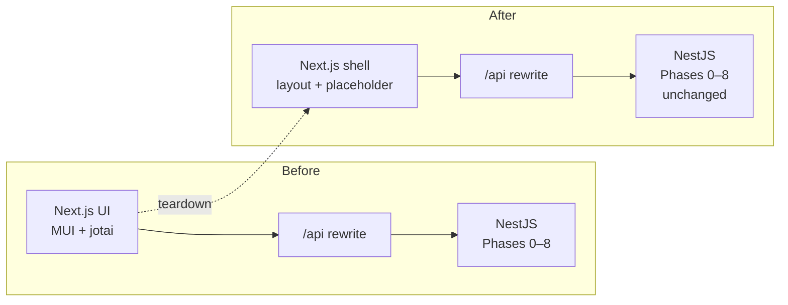
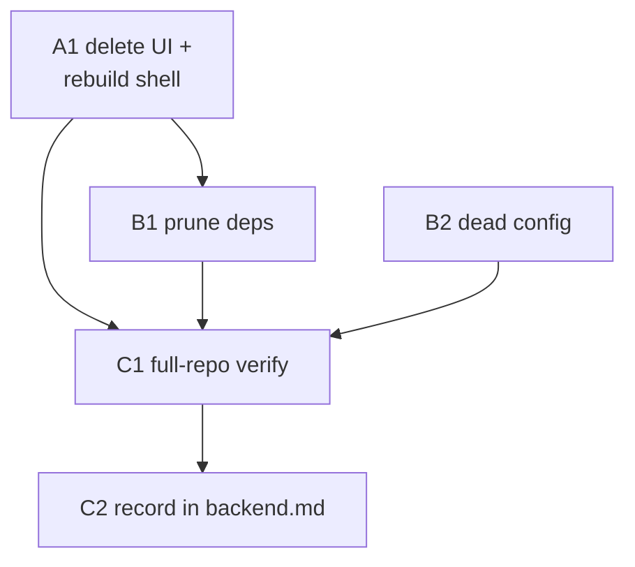

# Legacy frontend teardown — `apps/download`

## Overview

> This section is written for a human, not the executor — plain language, no task
> IDs, no file paths. Everything below it is written for whoever (or whatever)
> implements the plan. If a claim here needs more, it links to where the detail
> lives.

The download service has a finished, spec-complete backend and a frontend that
predates the spec entirely. This plan strips `apps/download` back to **that
backend plus an empty Next.js shell**, so the frontend rewrite starts from a
clean App Router instead of working around the old MUI/jotai UI. Nothing about
the backend's behaviour changes: every API route keeps working, tdr-bot keeps
calling it, and `download.lilnas.io` keeps booting on port 8080.

Companion to [`../spec.md`](../spec.md), [`../backend.md`](../backend.md), and the
Ultraviolet mockups in [`../designs/`](../designs/). This is the demolition step
between "backend complete" and the frontend rewrite that consumes it.

| Change | In one sentence |
| --- | --- |
| **Legacy UI deleted** | Every page, component, jotai store and MUI theme built against the pre-spec design goes away. |
| **Shell preserved** | The build config, tailwind, the root layout and a placeholder page stay, so the container still serves :8080. |
| **Manifest pruned** | MUI, emotion, jotai and the other frontend-only packages leave with the UI; eight already-dead dependencies go with them. |
| **Backend untouched** | No backend module is modified — the teardown is frontend-only by construction. |



**Shape:** one doc, one package, groups A–C (5 tasks), 4 waves. The only task
with real judgment in it is the first (what the shell keeps); everything after
is pruning and verification. See [Sequencing](#sequencing).

**Key decisions:**

- **Keep a bootable Next.js shell** rather than collapsing to a backend-only
  service — why: backend-only churns the Docker build, deploy config and
  TypeScript setup, every bit of which would need un-churning weeks later when
  the rewrite lands.
- **Delete the WebSocket hook even though it's good code** — why: it's shaped
  around the old single-job page, and its parsing logic and tests are
  recoverable from git history when the rewrite needs them.
- **Keep two pieces of nominally dead code** — the identified download client
  and the auth debug endpoint — why: one encodes a non-obvious auth-attribution
  bug the rewrite would otherwise rediscover the hard way; the other is exactly
  the whoami endpoint the new UI's account surfaces need.
- **Swap the fonts while the root layout is open anyway** — why: the layout has
  to be rewritten regardless, so it may as well load the two faces the design
  system assigns this app instead of a face nothing will use.

  See [Design decisions](#design-decisions) for the full reasoning and what was
  ruled out.

> **Accepted gap:** `download.lilnas.io` serves a placeholder page until the
> frontend rewrite lands. The API and WebSocket gateway stay fully live behind
> it, so tdr-bot's `/download` Discord command is unaffected — it talks to the
> backend port directly, never through Next.js.

**Read next:** [Design decisions](#design-decisions) for the why ·
[Task List](#task-list) for the work itself · [Sequencing](#sequencing) for the
order and the human checkpoints · [Final report](#final-report) for what "done"
reports back.

---

## How to work this plan

**Per task:**

1. Work tasks in wave order (see [Sequencing](#sequencing)). Never start a task
   before its dependencies are green.
2. Implement → write or update tests → run these **from `apps/download`**:
   - `pnpm test`
   - `pnpm lint` (this is two checks — eslint *and* prettier)
   - `pnpm type-check`
3. **`/commit`** — one task, one commit (or a small coherent set). `/commit`
   stages at line level, so unrelated edits in the same file don't ride along.
   Working in an isolated worktree? Pass `in:<abs path>`.
4. Check the box below and append the commit hash.

**Markers:**

| Marker | Means |
| --- | --- |
| `- [ ]` | Not started |
| `- [x]` … `abc1234` | Done, with the commit that did it |
| ⚠️ **PARTIAL** | Landed with scope narrowed — say what was left and why, inline |
| ⏭️ **DROPPED** | Not doing it — say why. Never delete a task |
| 🚧 / ⏳ | Blocked. Do not implement |

**When reality disagrees with this plan,** add a short **Findings** note under the
task, then update the downstream tasks that finding invalidates. Do not let the
doc drift from what actually shipped.

---

## Design decisions

### Keep the Next.js shell rather than collapsing to a backend-only service

The alternative — deleting `next`/`react` outright and re-pointing Traefik at the
Nest port — was considered and ruled out. It means churning `Dockerfile`
(the whole `builder` standalone-copy block, lines 29–45), `deploy.yml`'s
`loadbalancer.server.port=8080`, `tsconfig.json`'s `jsx`/`next` plugin/`.next`
includes, and `package.json`'s `run-p` script trio — then undoing every one of
those when the rewrite lands weeks later. Keeping a bootable shell costs one
`layout.tsx` and one `page.tsx` and leaves the deploy path already correct.

### Delete `use-download-job-socket.ts` even though it's good code

`src/components/use-download-job-socket.ts` is well-built — a pure
`getDownloadSocketUrl(location)`, envelope parsing that tolerates malformed
frames, a 1s fixed reconnect, and 304 lines of tests. It still goes, because it's
shaped around `DownloadById`'s single-job view and the new
[downloads-activity](../designs/downloads-activity.html) surface is a multi-job
live feed.

**It is not lost** — the rewrite should resurrect the parsing logic and its test
file from git rather than rewriting from scratch:

```bash
git show HEAD:apps/download/src/components/use-download-job-socket.ts
git show HEAD:apps/download/src/components/__tests__/use-download-job-socket.test.ts
```

The gateway it talks to (`src/download-gateway/download.gateway.ts`) is
**unchanged** by this plan, so the wire format it parses is still current.

### Keep `src/lib/download-client.ts` as intentional dead code

After A1 nothing imports `getIdentifiedDownloadClient()` — its only caller was
the deleted `/downloads/[id]` page. Keep it anyway. Its doc comment encodes a
non-obvious correctness rule the rewrite will hit on day one: a plain
`DownloadClient.localInstance` call from a server component **drops the
`X-Forwarded-User` headers Traefik set**, silently persisting every web-originated
job as an unattributed service call. Deleting it means rediscovering that bug.

### Keep `AuthDebugController`

`src/auth/auth-debug.controller.ts` describes itself as "safe to delete once
Phase 1 lands real wiring, or keep permanently as an operational diagnostic."
Phase 1 landed — but `GET /auth/whoami` returning
`{ email, userId, isAdmin }` is precisely what the rewrite's account avatar and
admin-gated surfaces (spec §10, §11) need. Keep it.

### Fonts: swap Roboto for Figtree + IBM Plex Mono

`layout.tsx` has to be rewritten regardless (it imports the deleted MUI
`Provider` and `Layout`). While it's being rewritten, load the two faces
`docs/designs/foundations.md:121-123` assigns this app rather than the Roboto
that nothing will use. **Fonts only** — the Ultraviolet token layer, scale
classes and components belong to the rewrite, not to a teardown.

Per that table, `download` deliberately **skips** Bricolage Grotesque. Do not
load it.

### Things that already exist — don't rebuild them

- **Backend/frontend separation is already clean.** Verified: zero files outside
  `src/app/`, `src/components/`, `src/store/` import from any of them. The
  deletion needs no backend edits.
- **`cns()`** lives at `@lilnas/utils/cns`, and `@lilnas/utils` owns its own
  `clsx` + `tailwind-merge` (`packages/utils/package.json:24-25`). `apps/download`
  does not need its own copies.
- **Tailwind v4** resolves from the **root** `package.json`
  (`@tailwindcss/postcss`, `autoprefixer`, `tailwindcss` at lines 22, 38, 49) via
  pnpm hoisting. `apps/download/postcss.config.cjs` references them without
  declaring them. That's pre-existing and working — see [Gotchas](#gotchas).

### What stays untouched

| Path | Why |
| --- | --- |
| `apps/download/src/{admin,audit,auth,db,download,download-gateway,emby,media,ytdlp-update}/` | The Phase 0–8 backend. **Must not be modified.** |
| `packages/utils/src/download/` | The wire contract. The `TODO(tdr-bot-migration)` shim at `client.ts:186` is **explicitly out of scope** — see below. |
| `apps/tdr-bot/` | Sole consumer of the legacy shim. Its `/download` command talks to the Nest port directly via `DownloadClient.dockerInstance` (`apps/tdr-bot/src/commands/download-command.service.ts:70`), never through Next.js. Out of scope. |
| `apps/download/{Dockerfile,deploy.yml,deploy.dev.yml}` | Correct as-is once the shell survives. |
| `docs/features/download/{spec.md,user-stories.md,designs/,plans/001-009}` | The specification for the *new* work, not legacy. Do not touch. |

> ⏳ **Out of scope — do not implement.** `packages/utils/src/download/client.ts`
> carries `getVideoJob`/`createVideoJob`/`cancelVideoJob`,
> `flattenToLegacyVideoResponse`, and the `@deprecated GetDownloadJobResponse` at
> `types.ts:204`, all marked `TODO(tdr-bot-migration)`. They exist so
> `apps/tdr-bot` keeps its pre-Media wire shape. **This plan does not migrate
> tdr-bot and does not delete the shim.** A sub-agent that thinks it should has
> misread its task — stop and report.

---

## Shared Context Pack

> Copy the relevant parts into every sub-agent prompt. These are pointers, not
> gospel — verify against current code.

### Repo & conventions

- pnpm workspace + Turbo monorepo. This plan touches exactly one package:
  `@lilnas/download` at `apps/download`.
- **From `apps/download`:** `pnpm test` (jest), `pnpm lint`, `pnpm type-check`,
  `pnpm build` (= `run-p build:backend build:frontend`).
- `pnpm lint` is **two** checks: `lint:eslint` (`eslint src`) and `lint:prettier`
  (`prettier -c src`). `pnpm lint:fix` runs both fixers.
- **From the repo root:** `pnpm run build`, `pnpm run lint`, `pnpm run type-check`,
  `pnpm test` — all Turbo-orchestrated.
- Tests live in `__tests__/` directories next to the code. Jest config at
  `apps/download/jest.config.js`; `testEnvironment: 'node'`, `roots: ['<rootDir>/src']`.
- **Baseline: 57 test files** (`npx jest --listTests | wc -l`). Exactly one is a
  frontend test. After this plan: **56**.
- Commit style is conventional-commits with a scope: `refactor(download): …`,
  `chore(download): …`.

### Layout — what goes, what stays

| File | Verdict |
| --- | --- |
| `src/app/layout.tsx` | **Rewrite** — drop MUI `Provider` + `Layout`, keep the tailwind import |
| `src/app/page.tsx` | **Rewrite** — placeholder |
| `src/app/downloads/[id]/page.tsx` | **Delete** (and the empty `downloads/` tree) |
| `src/components/DownloadById.tsx` | **Delete** |
| `src/components/Layout.tsx` | **Delete** |
| `src/components/Provider.tsx` | **Delete** |
| `src/components/Home/{DownloadForm,Home,HomeTabs,MediaRequestForm,MediaResultCard,TimeRangeInput}.tsx` | **Delete** (6 files) |
| `src/components/use-download-job-socket.ts` | **Delete** |
| `src/components/__tests__/use-download-job-socket.test.ts` | **Delete** |
| `src/store/form.ts` | **Delete** (and the empty `store/`) |
| `src/theme.ts` | **Delete** |
| `src/constants/version.ts` | **Delete** — dead export, zero importers |
| `src/lib/download-client.ts` | **Keep** — see Design decisions |
| `src/tailwind.css` | **Keep** — one line, `@import 'tailwindcss'` |
| `next.config.js`, `next-env.d.ts`, `tailwind.config.ts`, `postcss.config.cjs`, `tsconfig.json` | **Keep, unmodified** |
| `Dockerfile`, `deploy.yml`, `deploy.dev.yml`, `.dockerignore`, `nest-cli.json` | **Keep, unmodified** |

### Patterns to imitate

The rewritten `layout.tsx` should stay minimal — `next/font/google` for the two
faces, tailwind import, no provider tree:

```tsx
import 'src/tailwind.css'
import { Figtree, IBM_Plex_Mono } from 'next/font/google'
// expose as --font-sans / --font-mono to match docs/designs/foundations.md:285-287
```

`next.config.js` already proxies the browser to the backend — **do not change
it**:

```js
{ source: '/api/:path*', destination: 'http://localhost:8081/:path*' }
{ source: '/ws/:path*',  destination: 'http://localhost:8081/ws/:path*' }
```

So `/api/download/activity` in the browser reaches `@Controller('/download')`'s
`@Get('/activity')` at `src/download/download.controller.ts:152`.

### Gotchas

- **`next-env.d.ts` references generated types.** It contains
  `/// <reference path="./.next/types/routes.d.ts" />`, and `tsconfig.json`
  includes `.next/types/**/*.ts`. That generated file currently declares
  `type AppRoutes = "/" | "/downloads/[id]"`. **After deleting the route you must
  re-run `pnpm build:frontend` before `pnpm type-check`**, or you'll be
  type-checking against a route that no longer exists. Do not hand-edit
  `next-env.d.ts` or anything under `.next/`.
- **Emotion is MUI's peer, not a direct import.** `grep` finds zero `@emotion`
  imports in `src`. It still must be removed *with* MUI — it's only there to
  satisfy `@mui/material`.
- **Tailwind is not in `apps/download/package.json`.** It resolves from root
  hoisting. Leave that alone; adding explicit deps is a separate concern and
  changing it risks a version skew with the root's `4.1.14`.
- **`src/ytdlp-update/__tests__/Dockerfile.test` rewrites `package.json` itself.**
  It injects its own `lodash`/`nanoid`/`fs-extra` devDeps (lines 26–54), so
  dropping `lodash` from the manifest does not break it. That suite is
  Docker-only (`pnpm test:ytdlp-update`) and is **not** part of `pnpm test`.
- **`pnpm build` is `run-p build:backend build:frontend`.** A frontend break
  fails the whole build even though the backend is fine — read which of the two
  parallel jobs actually failed.

### Definition of Done

Include this **verbatim** in every delegation:

> **Done means:** implemented; tests written or updated following the package's
> existing conventions and passing; lint and type-check clean for every touched
> package; committed with `/commit`. Report back: files changed, exported names
> introduced, test summary, commit hash(es).

**Addendum for every task in this plan:** run `pnpm build:frontend` *before*
`pnpm type-check` whenever `src/app/` changed — see [Gotchas](#gotchas). ❌ Do not
run `pnpm test:ytdlp-update`; it needs Docker and is excluded from `pnpm test`.

---

## Task List

### Group A — Strip the UI

- [ ] **A1. Delete the legacy UI and leave a bootable shell.** When this is done,
      `apps/download` has no MUI, no jotai, no legacy component, and
      `pnpm dev:frontend` still serves a page at `:8080`.

  **Files — delete:**

  ```text
  src/app/downloads/[id]/page.tsx      (then the empty downloads/ tree)
  src/components/DownloadById.tsx
  src/components/Layout.tsx
  src/components/Provider.tsx
  src/components/Home/DownloadForm.tsx
  src/components/Home/Home.tsx
  src/components/Home/HomeTabs.tsx
  src/components/Home/MediaRequestForm.tsx
  src/components/Home/MediaResultCard.tsx
  src/components/Home/TimeRangeInput.tsx
  src/components/use-download-job-socket.ts
  src/components/__tests__/use-download-job-socket.test.ts
  src/store/form.ts                    (then the empty store/)
  src/theme.ts
  ```

  **Files — rewrite:** `src/app/layout.tsx`, `src/app/page.tsx`.

  `layout.tsx` keeps `import 'src/tailwind.css'` and the `<html>`/`<body>`
  scaffold; it drops `Providers` and `Layout`, and swaps the Roboto import for
  Figtree + IBM Plex Mono exposed as `--font-sans` / `--font-mono`. `page.tsx`
  renders a minimal placeholder — enough that the route resolves and the
  container health-checks, not a designed page.

  Use `cns()` from `@lilnas/utils/cns` for any multi-class `className`, per
  `CLAUDE.md`.

  **Edge cases:**
  - This must be **one atomic change**. Deleting `src/components/` without
    rewriting `layout.tsx` leaves it importing `src/components/Provider` and
    `src/components/Layout` — the package won't type-check, so a split would
    produce a task that can't meet the Definition of Done.
  - `src/lib/download-client.ts` **stays** even though nothing imports it after
    this. It is not orphaned code to clean up.
  - `src/app/` must keep at least `layout.tsx` + `page.tsx`, or `next build`
    emits no routes and the standalone server has nothing to serve.
  - Do **not** delete `src/tailwind.css` — `layout.tsx` still imports it and
    `tailwind.config.ts` still scans `./src/**/*.{ts,tsx,css}`.

  **Tests:** net **removal** of one test file
  (`use-download-job-socket.test.ts`). Write no replacement — a placeholder page
  has no behaviour worth asserting. Expect `npx jest --listTests | wc -l` to go
  57 → 56 and every remaining suite to stay green, since none of them touch
  frontend code.

### Group B — Prune the manifest and dead config

- [ ] **B1. Drop the frontend-only and already-dead dependencies.** When this is
      done, `apps/download/package.json` lists only what `src/` actually imports.

  **Files:** edit `apps/download/package.json`; regenerate `pnpm-lock.yaml` via
  `pnpm install`.

  **Remove — died with the legacy UI:**

  | Package | Last importer |
  | --- | --- |
  | `@mui/material`, `@mui/icons-material`, `@mui/material-nextjs` | 12 files, all deleted in A1 |
  | `@emotion/react`, `@emotion/styled`, `@emotion/cache` | MUI peers only — zero direct imports |
  | `jotai` | `store/form.ts`, `DownloadForm.tsx`, `TimeRangeInput.tsx` |
  | `@react-input/mask` | `TimeRangeInput.tsx` |
  | `lodash` | `DownloadById.tsx` |

  **Remove — already dead before this plan (verified zero importers in `src/`):**
  `clsx`, `tailwind-merge`, `dayjs`, `cheerio`, `http-server`, `uuid`,
  `chokidar`, `dedent`.

  Re-verify each before deleting, don't trust the table:

  ```bash
  cd apps/download
  grep -rE "from '(<pkg>[/']?[^']*)'|require\('<pkg>" src --include=*.ts --include=*.tsx
  ```

  **Keep** (each has a live backend importer — spot-check if unsure):
  `next`, `react`, `react-dom`, `ts-pattern`
  (`src/download/download-scheduler.service.ts`), `nanoid`, `fs-extra`,
  `mime-types`, `content-disposition`, `semver`, `minio`, `nestjs-minio`,
  `better-sqlite3`, `drizzle-orm`, `axios`, `zod`, `dotenv`, `ws`, and every
  `@nestjs/*`.

  **Edge cases:**
  - `clsx`/`tailwind-merge` are safe to drop **because** `cns()` is imported from
    `@lilnas/utils/cns` and `@lilnas/utils` declares them itself
    (`packages/utils/package.json:24-25`). Do not remove them from
    `packages/utils`.
  - `http-server` is not referenced by any `package.json` script, `Dockerfile`,
    or compose file — confirm before removing.
  - No `@types/*` entry accompanies any of these in `devDependencies` (checked) —
    but re-check rather than assuming.
  - `pnpm install` must run from the **repo root** so the workspace lockfile
    updates; commit the lockfile change with the manifest.

  **Tests:** no new tests. The proof is `pnpm build`, `pnpm test`, `pnpm lint`
  and `pnpm type-check` all clean with a smaller manifest.

- [ ] **B2. Delete the dead backend and config leftovers.**

  **Files:** delete `src/constants/version.ts` (then the empty `constants/`);
  edit `.env.example`.

  - `src/constants/version.ts` exports `VERSION = '4.0.0'`. Repo-wide grep finds
    **no importer** — it's been dead for a while and is unrelated to the UI.
  - `.env.example:7` sets `FRONTEND_PORT=8080`. Nothing reads it: `EnvKeys`
    (`src/env.ts`) has no such key, and `dev:frontend` hardcodes
    `next dev -p 8080`. Remove the line.

  **Edge cases:**
  - Do **not** touch `BACKEND_PORT` — `bootstrap.ts:30` reads it via
    `env(EnvKeys.BACKEND_PORT)` and `next.config.js` proxies to `8081`.
  - Do **not** remove the `MINIO_*` keys. They look frontend-ish but
    `src/download/download-video.service.ts:442` and
    `src/media/media-file.service.ts:225` both use the client, and
    `MINIO_PUBLIC_URL` builds the playback URLs.
  - `.env.example` is committed; `.env` / `.env.prod` are gitignored and live on
    the deploy host. Only edit the example.

  **Tests:** none. Verified by `pnpm type-check` staying clean and a repo-wide
  grep for `VERSION`/`FRONTEND_PORT` returning nothing outside test fixtures.

### Group C — Verify and record

- [ ] **C1. Rebuild and verify the whole repo.** Confirms the teardown broke
      nothing outside `apps/download`.

  **Files:** none — this task only runs commands and reports.

  In order:

  ```bash
  pnpm --filter=@lilnas/download clean   # drops stale .next/ dist/ .turbo/
  pnpm install                           # from the repo root
  pnpm run build                         # turbo, all packages
  pnpm run lint
  pnpm run type-check
  pnpm test
  ```

  Then assert, and report the actual values:
  - `apps/download/.next/types/routes.d.ts` no longer declares `"/downloads/[id]"`.
  - `apps/download/dist/main.js` exists — the Nest build still produces its entry
    point (`start:backend` runs `node dist/main`).
  - `cd apps/download && npx jest --listTests | wc -l` → **56**.
  - `apps/tdr-bot` builds and type-checks clean — it's the one external consumer
    of the download API.

  **Edge cases:**
  - Run `clean` **first**. `apps/download/.next/` and `dist/` currently hold
    build output from the deleted files; a stale `dist/components/*.js` or a
    stale `routes.d.ts` will make this task pass or fail for the wrong reason.
  - Turbo caches aggressively. If a result looks impossibly fast, re-run with
    `--force`.

  **Tests:** the full repo-wide suite is the test. Report per-package results,
  not just "green".

- [ ] **C2. Record the teardown in `backend.md`.**

  **Files:** edit `docs/features/download/backend.md`; edit this plan.

  `backend.md` opens by saying the backend is complete and "the Next.js frontend
  hasn't been built against Phases 3–8 yet." Add a short section recording that
  the legacy frontend has now been **removed** rather than merely bypassed, with:
  - the commit hashes from A1, B1 and B2;
  - the fact that an empty App Router shell (`layout.tsx` + placeholder
    `page.tsx`) and the `/api` + `/ws` rewrites remain, so the rewrite has a
    working proxy on day one;
  - the two `git show` refs given under **Design decisions → "Delete
    `use-download-job-socket.ts` even though it's good code"**, for recovering
    the WS hook and its tests;
  - a pointer to this plan.

  **Edge cases:**
  - Do **not** restructure `backend.md`. It is a phase-by-phase implementation
    log and the record of *how* Phases 0–8 were built; this is an append.
  - Do **not** edit `spec.md`, `user-stories.md`, `designs/`, or plans 001–009 —
    those describe the new work, not the legacy being removed.

  **Tests:** none — docs only.

---

## Sequencing



### Waves

| Wave | Run | Why it works |
| --- | --- | --- |
| 1 | **A1 ∥ B2** | Disjoint files. A1 owns `src/app/`, `src/components/`, `src/store/`, `src/theme.ts`; B2 owns `src/constants/` and `.env.example`. Neither reads the other's output. |
| 2 | **B1** | Must follow A1 — dropping `@mui/material` while `Provider.tsx` still imports it fails the build. Alone in its wave: it owns `package.json` + the lockfile. |
| 3 | **C1** | The convergence point. Must see A1, B1 and B2 committed. |
| 4 | **C2** | Needs C1's results and all three commit hashes. |

> ⚠️ **Wave 1 caveat.** A1 and B2 are file-disjoint but land on the same branch.
> Two sub-agents running `/commit` concurrently will cross-contaminate each
> other's staging. Either give each an isolated worktree, or **run Wave 1
> serially** (A1 then B2) — B2 is small enough that serializing costs almost
> nothing.

### Dependency table

| Task | Depends on | Parallel with |
| --- | --- | --- |
| A1 | — | B2 (with the commit caveat above) |
| B1 | A1 | — |
| B2 | — | A1 (with the commit caveat above) |
| C1 | A1, B1, B2 | — |
| C2 | C1 | — |

### Critical path

**A1 → B1 → C1 → C2**

A1 leads and shouldn't slip: it's the only task with real judgment in it (what
the shell keeps), and B1's dependency-removal list is only safe once A1's
deletions are on disk. B2 can happen any time and never gates anything.

### Human checkpoints

The executor must **not** perform these. Report them as outstanding.

1. **After C1 — local smoke test.** Run `docker-compose -f docker-compose.dev.yml up -d download`,
   then confirm `http://download.localhost` serves the placeholder page and
   `http://download.localhost/api/download/activity` returns JSON from the Nest
   backend. This is the only check that proves the `/api` rewrite still bridges
   the two processes; nothing in the test suite covers it.
2. **After C1 — production deploy.** `docker-compose up -d --build download` from
   the repo root on `lilnas.io`, per `CLAUDE.md`'s deployment rules. **Never**
   run `apps/download/deploy.yml` standalone. The executor must not deploy.
3. **Judgment call, if it comes up.** If B1 finds a dependency the grep says is
   dead but that a script, Dockerfile or compose file references, stop and ask
   rather than removing it.

---

## Final report

When every box is checked, report:

1. **Per-task outcome** — status, files changed, exported names, commit hashes
2. **Test results** — `apps/download` (expect 56 test files) plus the repo-wide
   Turbo sweep, and confirmation `apps/tdr-bot` still builds
3. **Deviations** from this plan, and why
4. **Deferred** — the three human checkpoints above, and the ⏳
   `TODO(tdr-bot-migration)` shim, which stays by design
5. **Open questions** discovered during implementation
