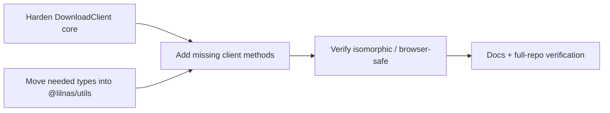
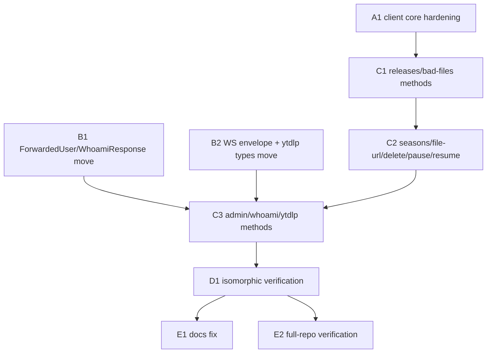

# Shared download client — hardening & completion — `packages/utils/src/download`

## Overview

> This section is written for a human, not the executor — plain language, no task IDs,
> no file paths. Everything below it is written for whoever (or whatever) implements
> the plan. If a claim here needs more, it links to where the detail lives.

`packages/utils/src/download` already **is** the shared, strongly-typed client for the
download backend — `DownloadClient` in `client.ts`, backed by the same zod schemas
(`schema.ts`) the NestJS backend validates requests with via `nestjs-zod`. `apps/tdr-bot`
already consumes it (`DownloadClient.dockerInstance`). This is not a greenfield build;
it's closing the gaps between what the client covers today and what the backend actually
exposes, so that a future download frontend (built in a later, separate effort) and
tdr-bot can both rely on one typed surface.

| Gap                         | What's wrong today                                                                                                                                                    |
| --------------------------- | --------------------------------------------------------------------------------------------------------------------------------------------------------------------- |
| **Error handling**          | Every method calls `response.json()` unconditionally — a 400/404/500 comes back typed as a success.                                                                   |
| **Base URL / construction** | `remoteInstance` points at `https://download.lilnas.io` (port 8080, Next.js) with no `/api` prefix — it can never reach a Nest route. No browser-safe factory exists. |
| **Route coverage**          | ~13 backend routes have no client method at all (releases, bad-files, seasons, file save, pause/resume, admin stats/audit-log, whoami, ytdlp-update).                 |
| **Type sharing**            | Some response shapes the new methods need (`ForwardedUser`, `WhoamiResponse`, the WS envelope, ytdlp's `UpdateCheckResult`) are still backend-local.                  |



**Shape:** One doc, groups A–E, 4 waves — small enough that most of the work is
sequential (client.ts is a shared file every method-adding task touches).

**Key decisions:**

- **Extend `DownloadClient` in place** — don't create a new package or class. It's
  already the house pattern and already dual-consumed in spirit (see
  [Design decisions](#design-decisions)).
- **`getMediaFile` becomes a URL builder, not a byte-fetcher** — the route streams
  gigabyte-scale files; the client should hand back a fetchable URL, not proxy bytes
  through itself.
- **`ForwardedUser`/`WhoamiResponse` move to `packages/utils/src/auth/types.ts`**, not
  `download/types.ts` — they're a general lilnas identity shape (`apps/download`'s auth
  model is not download-specific), and it's where `AdminCheckResponse` already lives.
- **Only `UpdateCheckResult` and a new `YtdlpUpdateStatusResponse` move** out of
  `apps/download/src/ytdlp-update/types.ts` — `GitHubRelease`/`GitHubAsset`/`UpdateResult`
  are internal-only and never cross the wire; `UpdateStatus` is dead code (zero
  references) and is left alone.

  See [Design decisions](#design-decisions) for the full reasoning and what was ruled out.

> **Accepted gap:** this plan does **not** touch `apps/tdr-bot` (the legacy
> `flattenToLegacyVideoResponse`/`getVideoJob`/`createVideoJob`/`cancelVideoJob` shim in
> `client.ts` stays exactly as-is) and does **not** build any frontend UI. Both are
> explicitly separate, future efforts.

**Read next:** [Design decisions](#design-decisions) for the why · [Task
List](#task-list) for the work itself · [Sequencing](#sequencing) for the order and the
human checkpoints · [Final report](#final-report) for what "done" reports back.

---

## How to work this plan

**Per task:**

1. Work tasks in wave order (see [Sequencing](#sequencing)). Never start a task before
   its dependencies are green.
2. Implement → write or update tests → run `pnpm test`, `pnpm run lint`, and
   `pnpm run type-check` for every touched package (`packages/utils`, and `apps/download`
   for tasks B2/B3).
3. **`/commit`** — one task, one commit (or a small coherent set). `/commit` stages at
   line level, so unrelated edits in the same file don't ride along.
4. Check the box below and append the commit hash.

**Markers:**

| Marker              | Means                                                          |
| ------------------- | -------------------------------------------------------------- |
| `- [ ]`             | Not started                                                    |
| `- [x]` … `abc1234` | Done, with the commit that did it                              |
| ⚠️ **PARTIAL**      | Landed with scope narrowed — say what was left and why, inline |
| ⏭️ **DROPPED**      | Not doing it — say why. Never delete a task                    |
| 🚧 / ⏳             | Blocked. Do not implement                                      |

**When reality disagrees with this plan,** add a short **Findings** note under the task,
then update the downstream tasks that finding invalidates. Do not let the doc drift from
what actually shipped.

This plan is small enough to work directly, task by task, in one session — no
orchestrator delegation section is included.

---

## Design decisions

### Extend `DownloadClient` in place, don't build a new package

`packages/utils` already has a wildcard exports map (`"./*": "./dist/*.js"`,
`packages/utils/package.json:7-9`), which gives every subpath independent
tree-shakability. `@lilnas/utils/cns` is already imported from `'use client'` components
across `apps/swole`, `apps/tdr-code`, and `apps/auth` with zero special bundler config —
proof this package already works dual-environment. A second package would add build
ceremony (its own `tsconfig`, `package.json`, Turbo wiring) for something the wildcard
exports map already solves.

### `getMediaFile` returns a URL, not bytes

`GET /download/media/:id/file` (`apps/download/src/download/download.controller.ts:516`)
streams a file — via a MinIO object stream or `res.sendFile()` with `Range`/206 support
for gigabyte-scale movie files. A `fetch`-based client method that buffers or re-streams
that would be strictly worse than the browser downloading directly (loses `Range`
resumability, and for a server-side caller, doubles the transfer). The right client-side
primitive is a method that builds the same query-stringed URL every other method does,
for use as a `<a href>`/`window.location` target or a redirect. No response type is
needed on this route today either — `packages/utils/src/download/types.ts:381-382`
already says so explicitly.

### `ForwardedUser`/`WhoamiResponse` belong in `packages/utils/src/auth`, not `download`

`apps/download/src/auth/forwarded-user.ts:19` documents `ForwardedUser` as trusted "on
the same basis as `apps/auth`'s own `/admin/check` and `/verify`" — it's the lilnas-wide
forwarded-identity shape, not something specific to downloads. `packages/utils/src/auth/`
already exists with exactly this kind of shared, app-agnostic identity type
(`AdminCheckResponse`, `packages/utils/src/auth/types.ts:1-3`). Putting `ForwardedUser`
there is following the existing convention, not inventing a new one — and it's reusable
if any other app ever needs the same shape.

### What moves out of `apps/download/src/ytdlp-update/types.ts`, and what doesn't

Only `UpdateCheckResult` is returned over HTTP today (`POST /api/ytdlp-update/check`'s
response, `apps/download/src/ytdlp-update/ytdlp-update.controller.ts:40`). `GET
/api/ytdlp-update/status` currently returns an inline, unnamed object type
(`ytdlp-update.service.ts:553-558`) whose `lastCheck`/`lastAttempt` fields are typed as
`Date | null` in Nest but serialize to `string | null` over JSON — the plan below names
that wire shape properly as `YtdlpUpdateStatusResponse`. `GitHubRelease`, `GitHubAsset`,
and `UpdateResult` never leave `YtdlpUpdateService`'s internals (confirmed: no import
site outside `apps/download/src/ytdlp-update/`), so they stay put. `UpdateStatus` (the
enum) has zero references anywhere in the repo (`grep -n "UpdateStatus\."` returns
nothing) — it's dead code, out of scope to move, and not this plan's job to delete either.

### Things that already exist — don't rebuild them

- **`withForwardedIdentity()`** (`packages/utils/src/download/client.ts:92-97`) already
  solves server-side identity forwarding correctly. Every task below must preserve its
  exact behavior (merges `x-forwarded-user`/`x-forwarded-user-id` into
  `forwardedHeaders`, threaded through the private `request()` helper).
- **Query serialization** — `toQueryString()` (`client.ts:50-66`) already handles arrays,
  `Date` → `YYYY-MM-DD`, and `undefined`/`null` skipping. New list-query methods (none
  needed here — every remaining route takes either no query or a small fixed shape) reuse
  it; don't reimplement.
- **The AuthClient error-handling pattern** (`packages/utils/src/auth/client.ts:35-56`) is
  the template for `DownloadClient`'s new error handling: check `response.ok`, throw a
  descriptive error with status + statusText, validate the body shape.

### What stays untouched

- `packages/utils/src/download/client.ts`'s legacy block (`flattenToLegacyVideoResponse`,
  `getVideoJob`, `createVideoJob`, `cancelVideoJob`, lines 201–226) and
  `GetDownloadJobResponse` in `types.ts` (lines 204–222) **must not be touched or
  removed.** They're marked `TODO(tdr-bot-migration)` and their removal is a separate,
  future task that also requires editing `apps/tdr-bot` — explicitly out of scope here.
- `apps/tdr-bot/**` — no file in this app is edited by this plan.
- No frontend code is added under `apps/download/src/app/**` — the placeholder page stays
  a placeholder.

---

## Shared Context Pack

> Copy the relevant parts into every task's context. These are pointers, not gospel —
> verify against current code before relying on them.

### Repo & conventions

- Monorepo: pnpm workspaces + Turbo. This plan's primary package is `@lilnas/utils`
  (`packages/utils`); a few tasks also touch `@lilnas/download` (`apps/download`).
- Commands, run from repo root or the package directory:
  `pnpm test` (jest), `pnpm run lint` (`lint:eslint` + `lint:prettier`, flat ESLint
  config), `pnpm run type-check` (`tsc --noEmit`).
- `packages/utils` tests live in `packages/utils/src/**/__tests__/*.spec.ts`, run with
  `ts-jest`. `packages/utils/jest.config.js` maps `src/*` → `<rootDir>/src/$1` — matches
  how `apps/download`'s own tests import backend code, and is why
  `apps/download/scripts/verify/envelopes.ts` imports schema by relative path rather than
  the `@lilnas/utils/download/schema` package specifier (that specifier only resolves
  after `packages/utils` is built to `dist/`).
- No `lib` is set in `tsconfig.base.json`, so TypeScript's default (DOM + DOM.Iterable +
  ScriptHost + the ES lib matching `target: "ESNext"`) applies — `fetch`, `Response`,
  `RequestInit`, `URLSearchParams` are all globally typed already. No config change is
  needed for `client.ts` to type-check in both a Node and a browser build.

### Layout

| File                                                                                           | What it is                                                                                            |
| ---------------------------------------------------------------------------------------------- | ----------------------------------------------------------------------------------------------------- |
| `packages/utils/src/download/client.ts`                                                        | `DownloadClient` — the class every task in Groups A and C edits                                       |
| `packages/utils/src/download/types.ts`                                                         | Response/query type aliases + hand-written interfaces                                                 |
| `packages/utils/src/download/schema.ts`                                                        | zod schemas — the actual wire contract; `types.ts` mostly just infers from these                      |
| `packages/utils/src/download/__tests__/client.spec.ts`                                         | Existing test suite — mocked-fetch pattern every new test follows                                     |
| `packages/utils/src/auth/client.ts`                                                            | `AuthClient` — the error-handling pattern to copy into `DownloadClient`                               |
| `packages/utils/src/auth/types.ts`                                                             | Currently just `AdminCheckResponse` — where `ForwardedUser`/`WhoamiResponse` land                     |
| `apps/download/src/download/download.controller.ts`                                            | The real route handlers — source of truth for every request/response shape below                      |
| `apps/download/src/admin/admin.controller.ts`                                                  | Audit-log + stats routes (class-level `AdminGuard`)                                                   |
| `apps/download/src/ytdlp-update/{ytdlp-update.controller.ts,ytdlp-update.service.ts,types.ts}` | ytdlp-update routes and their current local types                                                     |
| `apps/download/src/auth/forwarded-user.ts`                                                     | Current `ForwardedUser` definition + `getForwardedUser`/`resolveForwardedUser`                        |
| `apps/download/src/auth/auth-debug.controller.ts`                                              | Current local `WhoamiResponse`, `GET /auth/whoami`                                                    |
| `apps/download/src/download-gateway/download.gateway.ts`                                       | Current local `DownloadGatewayMessage` envelope                                                       |
| `apps/download/scripts/verify/routes.ts`                                                       | Authoritative route/guard/query manifest — cross-check every new method's path and guard against this |
| `apps/download/scripts/verify/captures/*.json`                                                 | Real captured response bodies — usable as fixtures if a task wants realistic test data                |

### Patterns to imitate

**Existing client method** (`client.ts:157-164`, `getActivity`) — every new read method
follows this shape:

```ts
async getGallery(query: Partial<GalleryQuery> = {}): Promise<DownloadPage<GalleryItem>> {
  const response = await this.request(`/download/gallery${toQueryString(query)}`)
  return response.json()
}
```

**`AuthClient`'s error handling** (`packages/utils/src/auth/client.ts:35-56`) — the
template for Group A's hardened `request()`:

```ts
if (!response.ok) {
  throw new Error(
    `GET /admin/check failed with ${response.status} ${response.statusText}`,
  );
}
const body: unknown = await response.json();
```

**Existing test pattern** (`client.spec.ts:13-17`) — mock `global.fetch`, assert the exact
URL and `RequestInit`:

```ts
function mockFetchJson(body: unknown): jest.SpyInstance {
  return jest.spyOn(global, "fetch").mockResolvedValue({
    ok: true, // added by A1 — the pre-A1 helper omits this; see A1's tests
    status: 200,
    json: () => Promise.resolve(body),
  } as unknown as Response);
}
```

### Gotchas

- **Copy `AuthClient`'s error handling, NOT its timeout.** `AuthClient.request()`
  also sets `signal: AbortSignal.timeout(2_000)` (`packages/utils/src/auth/client.ts:25`)
  — appropriate for its one fast admin-check call, fatal here: `listReleases` fires a
  real 30s+ indexer search (see the monitoring note below) and grab/replace can be slow
  too. `DownloadClient.request()` must stay timeout-free; only the `response.ok` check
  and error shape are the template.
- **`mockFetchJson` has no `ok` property** (`client.spec.ts:13-17`) — it resolves
  `{ json: ... }` only. Once A1's hardened `request()` checks `response.ok`,
  `undefined` is falsy and **every existing test** throws `DownloadApiError`. A1 must
  add `ok: true, status: 200` to this shared helper (already shown in the pattern
  above) before its own error-path tests can even run.
- **`remoteInstance` is currently broken** (`client.ts:82-84`) — points at
  `https://download.lilnas.io`, which is port 8080 (Next.js), with no `/api` prefix. The
  existing test `client.spec.ts:76-85` asserts this broken behavior; it must be
  updated/removed in the same task that fixes the factory, or the suite will fail for the
  wrong reason.
- **The `/api` rewrite strips its own prefix** (`apps/download/next.config.js:6-9`):
  browser `/api/download/gallery` → Nest `/download/gallery`. A browser-base client must
  NOT include `/download` twice, and must NOT assume the Nest path appears verbatim in
  the browser URL bar.
- **`YtdlpUpdateController` is prefixed `api/ytdlp-update`** at the Nest level
  (`apps/download/src/ytdlp-update/ytdlp-update.controller.ts:10`) — the only controller
  with an `api` prefix. From a browser-base (`/api`) client this means the effective
  browser path is `/api/api/ytdlp-update/status`. Hide this behind the method name; never
  let a caller construct the path by hand.
- **`getUpdateStatus()`'s wire shape has `Date` fields that are actually strings on the
  wire** (`ytdlp-update.service.ts:553-558` types them as `Date | null`; NestJS
  `JSON.stringify`s the response, so the real HTTP body has `string | null`). Define
  `YtdlpUpdateStatusResponse` with `string | null`, not `Date | null`.
- **`flagBadFile`'s handler is synchronous** (`download.controller.ts:703`, no `async`,
  returns `FlagBadFileResponse` directly) but the client method must still be `async`
  and return a `Promise` — HTTP is always async regardless of the handler's own
  signature.
- **`whoami` requires the forwarded-identity headers** — it's `@UseGuards(ForwardedUserGuard)`
  (`apps/download/src/auth/auth-debug.controller.ts:22`), a 401 without them. The client
  method itself doesn't need special handling beyond the shared error path, but don't
  test it against `DownloadClient.localInstance` with no identity and expect 200.
- **Two write routes here have a documented monitoring/side-effect cost**
  (`apps/download/scripts/verify/routes.ts:304-328`, `media-releases`): `listReleases`
  fires a real, slow (30s+) indexer search and can transiently add-then-remove a movie
  from Radarr. Unit tests must mock `fetch`, not hit a live backend — that pattern is
  reserved for the manual `scripts/verify/*` scripts, which this plan does not add to.

### Definition of Done

Include this **verbatim** for every task:

> **Done means:** implemented; tests written or updated following the package's existing
> conventions and passing; lint and type-check clean for every touched package;
> committed with `/commit`. Report back: files changed, exported names introduced, test
> summary, commit hash(es).

**Addendum:** do not add or run anything against the live download backend
(`apps/download/scripts/verify/*`) for this plan — all new tests are unit tests with a
mocked `global.fetch`, matching `packages/utils/src/download/__tests__/client.spec.ts`'s
existing pattern.

---

## Task List

### Group A — Client core hardening

- [x] **A1. Harden `DownloadClient`'s request/construction core.** `DownloadClient`
      currently: (1) calls `response.json()` unconditionally with no `response.ok` check on
      every method, and (2) has a broken `remoteInstance` (`http://...:8080` with no `/api`
      prefix, can never reach a Nest route) and no browser-safe factory. Fix both in one pass
      since they both touch the class's constructor/`request()` core.

  **Files:** edit `packages/utils/src/download/client.ts`; edit
  `packages/utils/src/download/__tests__/client.spec.ts`.

  Changes:
  1. Add a `DownloadApiError` class (status + statusText + parsed body, following
     `AuthClient.checkIsAdmin`'s pattern at `packages/utils/src/auth/client.ts:40-44`) —
     export it from `client.ts`.
  2. Change the private `request()` helper to check `response.ok` and throw
     `DownloadApiError` on a non-2xx response, before the caller ever calls
     `.json()`. Every existing method benefits automatically since they all funnel
     through `request()` — no per-method changes needed for this part. Copy only the
     `ok` check from `AuthClient` — **not** its `AbortSignal.timeout(2_000)` (see
     Gotchas; `listReleases` legitimately runs 30s+).
  3. Fix `remoteInstance`: it currently targets `https://download.lilnas.io` (port
     8080/Next.js). Either point it at a base URL that actually reaches the Nest routes,
     or remove it and document why — following `AuthClient`'s own precedent
     (`packages/utils/src/auth/client.ts:1-11` omits a `remoteInstance` entirely, with a
     comment explaining exactly this class of bug). Prefer **removing** `remoteInstance`
     to match `AuthClient`'s precedent, since there is no legitimate public-internet
     caller of the Nest backend directly (port 8081 has no Traefik router at all).
  4. Add a `browserInstance` static factory: `new DownloadClient('/api')` — a relative
     base URL, for use by a future browser-side caller going through the Next.js rewrite
     (`apps/download/next.config.js:6-9`). Remember the rewrite strips the `/api`
     prefix, so `browserInstance.getJob('1')` must still request
     `/api/download/videos/1` (i.e. `baseUrl + path`, exactly like every other factory —
     no special-casing needed in `request()` itself).
  5. Keep `withForwardedIdentity()` working unchanged from every factory, including the
     new `browserInstance` (a server-side caller might still construct a browser-base
     client and forward identity onto it in a testing context — don't special-case this
     away).

  **Edge cases:**
  - A response with a non-JSON error body (e.g. an HTML 502 from a proxy) — `.json()`
    inside the error path should not itself throw uncaught; catch and fall back to
    `undefined`/the raw text for the error body.
  - `DownloadApiError` must be usable with `instanceof` after crossing an `await` — a
    plain class extending `Error` is sufficient, no special serialization needed since
    it's thrown/caught within the same process.

  **Tests:** first, update the shared `mockFetchJson` helper (`client.spec.ts:13-17`)
  to include `ok: true, status: 200` — the current helper omits `ok`, so after change 2
  every existing test would throw `DownloadApiError` (see Gotchas). Then update
  `client.spec.ts`'s `remoteInstance` test (`client.spec.ts:76-85`) —
  either delete it if `remoteInstance` is removed, or update the expected URL if it's
  fixed instead. Add: a new `browserInstance` factory test asserting the base URL used in
  the `fetch` call. Add: a `request()` error-path test — mock `fetch` to resolve with
  `{ ok: false, status: 404, statusText: 'Not Found', json: () => Promise.resolve({message: 'nope'}) }`
  and assert `client.getJob('x')` rejects with a `DownloadApiError` carrying `status: 404`.

### Group B — Type sharing (parallel-safe with A1)

- [x] **B1. Move `ForwardedUser`/`WhoamiResponse` into `@lilnas/utils/auth`.** Both are
      currently backend-local; the new `whoami` client method (Group C) needs a typed
      response, and this is the natural place for it (see
      [Design decisions](#design-decisions)).

  **Files:** edit `packages/utils/src/auth/types.ts` (add types); edit
  `apps/download/src/auth/forwarded-user.ts` (re-export instead of declaring); edit
  `apps/download/src/auth/auth-debug.controller.ts` (import instead of declaring).
  1. In `packages/utils/src/auth/types.ts`, add:

     ```ts
     export interface ForwardedUser {
       email: string;
       userId: string;
     }

     export interface WhoamiResponse extends ForwardedUser {
       isAdmin: boolean;
     }
     ```

     Keep `AdminCheckResponse` as it is.

  2. In `apps/download/src/auth/forwarded-user.ts`, replace the local
     `export interface ForwardedUser { ... }` (lines 19-22) with
     `export type { ForwardedUser } from '@lilnas/utils/auth/types'` — every existing
     import site (`import type { ForwardedUser } from 'src/auth/forwarded-user'`, used
     across guards/decorators/services/the gateway) keeps working unchanged. Keep the
     file's header comment explaining the trust model — it documents real backend
     behavior, not the type's shape.
  3. In `apps/download/src/auth/auth-debug.controller.ts`, delete the local
     `interface WhoamiResponse extends ForwardedUser { isAdmin: boolean }` (lines 13-15)
     and import it from `@lilnas/utils/auth/types` instead.

  **Edge cases:**
  - `packages/utils/package.json`'s wildcard exports (`"./*": "./dist/*.js"`) already
    cover `@lilnas/utils/auth/types` with no config change — confirm the built output
    exists at `packages/utils/dist/auth/types.js` after `pnpm run build` in that package
    (a type-only module still needs its `.js`/`.d.ts` emitted for the resolution to
    work, even though the file has no runtime code).

  **Tests:** no new tests needed (pure type move) — but run `apps/download`'s existing
  test suite to confirm nothing broke from the re-export.

- [x] **B2. Move the WS envelope type and ytdlp's `UpdateCheckResult`/new
      `YtdlpUpdateStatusResponse` into `@lilnas/utils/download`.** Both are needed by Group
      C's new client methods and are currently backend-local or don't exist as a named type
      at all.

  **Files:** edit `packages/utils/src/download/types.ts`; edit
  `packages/utils/src/download/schema.ts`; edit
  `apps/download/src/download-gateway/download.gateway.ts`; edit
  `apps/download/src/ytdlp-update/types.ts`; edit
  `apps/download/src/ytdlp-update/ytdlp-update.controller.ts`; edit
  `apps/download/src/ytdlp-update/ytdlp-update.service.ts`; edit
  `apps/download/src/ytdlp-update/__tests__/ytdlp-update.controller.spec.ts`.
  1. In `packages/utils/src/download/types.ts`, add (near `DownloadJobEvent` /
     `DOWNLOAD_JOB_EVENT_TYPE`, types.ts:191-201):
     ```ts
     /** The envelope every download WebSocket frame is wrapped in. */
     export interface DownloadGatewayMessage {
       type: string;
       data?: unknown;
     }
     ```
  2. In `packages/utils/src/download/schema.ts`, add a zod schema for
     `UpdateCheckResult`, matching the shape at
     `apps/download/src/ytdlp-update/types.ts:14-20`
     (`currentVersion`/`latestVersion`: `z.string()`, `updateAvailable`/`canUpdate`:
     `z.boolean()`, `reason`: `z.string().optional()`), then in `types.ts` infer
     `export type UpdateCheckResult = z.infer<typeof UpdateCheckResultSchema>`. Also add
     a hand-written (non-zod, matching `MediaDetailResponse`'s style) response
     interface:
     ```ts
     /** `GET /api/ytdlp-update/status`'s response — see the Date/string gotcha above. */
     export interface YtdlpUpdateStatusResponse {
       isUpdating: boolean;
       lastCheck: string | null;
       lastAttempt: string | null;
       retryCount: number;
     }
     ```
  3. In `apps/download/src/download-gateway/download.gateway.ts`, replace the local
     `export interface DownloadGatewayMessage { ... }` (lines 20-23) with a
     **re-export** — `export type { DownloadGatewayMessage } from
'@lilnas/utils/download/types'` — mirroring B1's `forwarded-user.ts` approach,
     plus an `import type` for the gateway's own usage (line 75's `build` callback).
     A re-export, not a plain import: `download-state.service.test.ts:30-33` imports
     `DownloadGatewayMessage` _from the gateway file_, and the re-export keeps that
     (and any future import site) working unchanged. Keep the doc comment explaining
     the envelope's discriminator, moved onto the re-export or restated briefly.
  4. In `apps/download/src/ytdlp-update/types.ts`, delete `UpdateCheckResult` (lines
     14-20) — keep `GitHubRelease`, `GitHubAsset`, `UpdateResult`, `UpdateStatus`
     exactly as they are (see [Design decisions](#design-decisions) for why those stay).
  5. Update the two now-broken import sites:
     `apps/download/src/ytdlp-update/ytdlp-update.controller.ts:7` and
     `apps/download/src/ytdlp-update/ytdlp-update.service.ts:15` — pull
     `UpdateCheckResult` from `@lilnas/utils/download/types` instead of `./types`; the
     other names in the service's import (`GitHubRelease`, `UpdateResult`) stay from
     `./types`.
  6. `getUpdateStatus()`'s inline return type at `ytdlp-update.service.ts:553-558`
     (`{ isUpdating: boolean; lastCheck: Date | null; ... }`) is correct **as the
     service's own internal contract** (it does hold real `Date` objects until Nest
     serializes them) — do not change it. Only the controller's `getUpdateStatus()`
     handler (`ytdlp-update.controller.ts:17-20`, currently untyped/inferred) gets an
     explicit `: YtdlpUpdateStatusResponse` return annotation reflecting the _wire_
     shape, which will require converting the two `Date` fields to `.toISOString()`
     (or `null`) inside that handler rather than passing the service's object straight
     through.

  **Edge cases:**
  - Confirm `apps/download/src/ytdlp-update/__tests__/ytdlp-update.controller.spec.ts:14`'s
    `import type { UpdateCheckResult } from 'src/ytdlp-update/types'` — update it to the
    shared package path.
  - `apps/download/src/ytdlp-update/__tests__/fixtures/mock-github-responses.ts:2`
    imports `GitHubRelease` — this one stays pointed at `src/ytdlp-update/types`, since
    `GitHubRelease` did not move.
  - `apps/download/src/download/__tests__/download-state.service.test.ts:30-33` imports
    `DownloadGatewayMessage` from `src/download-gateway/download.gateway` — needs **no
    edit** thanks to step 3's re-export, but run it to confirm (it's the reason step 3
    re-exports instead of just importing).

  **Tests:** update the two `apps/download` test files above to import from the new
  location; run `apps/download`'s existing suite to confirm the controller's status-route
  serialization change (Date → string) doesn't break `ytdlp-update.controller.spec.ts`.

### Group C — New client methods (depends on A1; C3 also depends on B1 + B2)

Three tasks, strictly sequential — all three edit `packages/utils/src/download/client.ts`
and `client.spec.ts`, so running them concurrently would conflict on the same file
regardless of how unrelated the individual methods are.

- [x] **C1. Release and bad-files client methods.** Adds the five methods covering
      `apps/download/src/download/download.controller.ts`'s release-selection and bad-file
      routes.

  **Files:** edit `packages/utils/src/download/client.ts`; edit
  `packages/utils/src/download/__tests__/client.spec.ts`.

  ```ts
  async listReleases(id: string, query: Partial<ListReleasesQuery> = {}): Promise<ListReleasesResponse>
  // GET /download/media/${encodeURIComponent(id)}/releases${toQueryString(query)}

  async grabRelease(id: string, input: GrabReleaseInput): Promise<DownloadJob>
  // POST /download/media/${encodeURIComponent(id)}/releases/grab, body: input

  async replaceRelease(id: string, input: ReplaceReleaseInput): Promise<DownloadJob>
  // POST /download/media/${encodeURIComponent(id)}/releases/replace, body: input

  async flagBadFile(id: string, input: FlagBadFileInput): Promise<FlagBadFileResponse>
  // POST /download/media/${encodeURIComponent(id)}/bad-files, body: input
  // Note: the *handler* is synchronous (download.controller.ts:703) — the client
  // method is still async/Promise-returning like every other method, since it's HTTP.

  async listBadFiles(id: string): Promise<ListBadFilesResponse>
  // GET /download/media/${encodeURIComponent(id)}/bad-files
  ```

  All five import their input/response types from `./types` (`ListReleasesQuery`,
  `GrabReleaseInput`, `ReplaceReleaseInput`, `FlagBadFileInput`, `ListReleasesResponse`,
  `FlagBadFileResponse`, `ListBadFilesResponse` — all already exist there, no new types
  needed for this task).

  **Edge cases:**
  - `id` is a media key (`tmdb:`/`tvdb:`/`video:`) that can contain a `:` — every
    existing media-keyed method (`getMedia`, `client.ts:149-155`) URL-encodes it with
    `encodeURIComponent`; these five must too.
  - `flagBadFile` requires forwarded identity server-side (`ForwardedUserGuard`,
    `download.controller.ts:702`) — the client method itself does nothing special for
    this; a caller without `withForwardedIdentity()` will get a 401 surfaced as
    `DownloadApiError` from Group A's hardened `request()`. Don't add client-side guard
    logic.

  **Tests:** one test per method in `client.spec.ts`, following the existing
  `describe('media detail and list endpoints', ...)` block's pattern — assert the exact
  URL (including `encodeURIComponent`'d id) and `RequestInit` (method, body for the
  three POSTs).

- [x] **C2. Season, file-URL, delete-files, pause/resume client methods.** Depends on C1
      landing first (same file).

  **Files:** edit `packages/utils/src/download/client.ts`; edit
  `packages/utils/src/download/__tests__/client.spec.ts`.

  ```ts
  async listSeasons(id: string): Promise<ListSeasonsResponse>
  // GET /download/media/${encodeURIComponent(id)}/seasons

  getMediaFileUrl(id: string, query: Partial<GetMediaFileQuery> = {}): string
  // NOT async, NOT a fetch call — returns `${this.baseUrl}/download/media/${encodeURIComponent(id)}/file${toQueryString(query)}`.
  // See "getMediaFile returns a URL, not bytes" in Design decisions.

  async deleteMediaFiles(id: string, query: Partial<DeleteMediaFilesQuery> = {}): Promise<DeleteMediaFilesResponse>
  // DELETE /download/media/${encodeURIComponent(id)}/files${toQueryString(query)}

  async pauseJob(id: string): Promise<DownloadJob>
  // PATCH /download/videos/${id}/pause

  async resumeJob(id: string): Promise<DownloadJob>
  // PATCH /download/videos/${id}/resume
  ```

  **Edge cases:**
  - `getMediaFileUrl` does **not** go through the private `request()` helper — it builds
    a string and returns synchronously. It also does **not** attach
    `this.forwardedHeaders` (a URL can't carry custom headers); a caller using this for
    a same-origin browser navigation gets auth from the cookie automatically, and a
    caller needing forwarded identity server-side should use it only as a redirect
    target, not a `fetch()` input, unless they add the headers themselves. State this
    limitation in the method's doc comment.
  - `pauseJob`/`resumeJob` use the job-id path (`/download/videos/:id/...`), the same
    id pool as `getJob`/`cancelJob` — not a media key. Don't `encodeURIComponent` a job
    id inconsistently with the existing `getJob`/`cancelJob` methods (they don't encode
    it either, since job ids aren't expected to contain `:`).

  **Tests:** same pattern as C1. `getMediaFileUrl` gets a synchronous test (no `fetch`
  mock needed) asserting the returned string for both a bare call and one with
  `episodeId`/`part` query params.

- [x] **C3. Admin, whoami, and ytdlp-update client methods.** Depends on C2 (same file)
      and on B1 + B2 (needs `WhoamiResponse` and `UpdateCheckResult`/`YtdlpUpdateStatusResponse`
      from the shared package).

  **Files:** edit `packages/utils/src/download/client.ts`; edit
  `packages/utils/src/download/__tests__/client.spec.ts`.

  ```ts
  async getAuditLog(query: Partial<AuditLogQuery> = {}): Promise<DownloadPage<AuditLogEntry>>
  // GET /download/admin/audit-log${toQueryString(query)}

  async getStats(query: Partial<AdminStatsQuery> = {}): Promise<AdminStatsResponse>
  // GET /download/admin/stats${toQueryString(query)}

  async whoami(): Promise<WhoamiResponse>
  // GET /auth/whoami  — import WhoamiResponse from '@lilnas/utils/auth/types' (not './types')

  async getYtdlpStatus(): Promise<YtdlpUpdateStatusResponse>
  // GET /api/ytdlp-update/status

  async getYtdlpVersion(): Promise<{ version: string }>
  // GET /api/ytdlp-update/version

  async checkYtdlpUpdate(dryRun = false): Promise<UpdateCheckResult>
  // POST /api/ytdlp-update/check — append `?dryRun=true` ONLY when dryRun is true;
  // no query string at all otherwise (the handler checks `dryRun === 'true'`, so
  // `?dryRun=false` would be harmless but misleading — don't send it)
  ```

  **Edge cases:**
  - `getAuditLog`/`getStats` require an admin identity server-side (`AdminGuard`,
    class-level on `apps/download/src/admin/admin.controller.ts:46`) — same note as
    `flagBadFile` above: no client-side special-casing, a non-admin caller just gets a
    403 as a `DownloadApiError`.
  - `whoami` similarly requires `withForwardedIdentity()` to have been called upstream
    or it 401s.
  - The three ytdlp methods hit `/api/ytdlp-update/...` paths **on the Nest backend
    directly** (port 8081) — this is unrelated to and must not be confused with the
    Next.js `/api` rewrite prefix used by `browserInstance`. From `dockerInstance` or
    `localInstance` the path is exactly `/api/ytdlp-update/status`; only from
    `browserInstance` does it become the doubled `/api/api/ytdlp-update/status` — this
    is expected and is why the method hides the literal path from callers.

  **Tests:** same pattern as C1/C2. Include two `checkYtdlpUpdate` assertions: the
  default (`dryRun` omitted/false) sends **no query string at all**, and
  `checkYtdlpUpdate(true)` sends exactly `?dryRun=true`.

### Group D — Isomorphic / browser-safety verification

- [x] **D1. Confirm `download/client.ts` (and its full import chain) is browser-safe.**
      A build-time and a runtime check that nothing added in Groups A–C pulled in a
      Node-only dependency.

  **Files:** no source edits expected (this task should find nothing to fix, given A–C's
  scope); if it does find something, fix it in `packages/utils/src/download/client.ts`
  or `types.ts`.
  1. Trace every import in `client.ts` and `types.ts` transitively — confirm none reach
     `packages/utils/src/env.ts` (uses `process.env` directly — server/Node-only) or any
     other module with a Node built-in import (`http`, `fs`, etc.). `schema.ts` (zod) and
     `types.ts` (pure types + the two type-guard functions) are already Node-agnostic;
     confirm this is still true after B2's edits.
  2. Add one small test to `client.spec.ts` confirming `DownloadClient.browserInstance`
     constructs with `baseUrl === '/api'` and that calling a method on it produces a
     relative-path `fetch()` call (no protocol/host) — this is the executable proof that
     a browser bundle importing `@lilnas/utils/download/client` doesn't require any
     server-only global.

  **Edge cases:**
  - This is a static/structural check, not a real Next.js build — a Next.js frontend
    doesn't exist yet to build against (out of scope, see
    [Design decisions](#design-decisions)). Don't attempt to add one for this task.

  **Tests:** the `browserInstance` isomorphism test described above.

### Group E — Docs & full-repo verification

- [x] **E1. Fix stale "no `DownloadClient` method" callouts in `backend.md`.**
      `docs/features/download/backend.md` documents several of these gaps explicitly (lines
      ~130-137, ~551, ~881, ~1041, ~1362, ~1645, ~1736, ~1763 per this plan's research —
      re-grep before editing, line numbers may have drifted). Update each callout that this
      plan closes to reflect the new `DownloadClient` methods; leave the `tdr-bot`-specific
      and frontend-teardown notes (the `TODO(tdr-bot-migration)` context, and
      `docs/features/download/plans/010-legacy-frontend-teardown.md`'s references) untouched
      — those describe work this plan explicitly does not do.

  **Files:** edit `docs/features/download/backend.md`.

  **Tests:** none (docs-only).

- [x] **E2. Full-repo verification.** From the repo root: `pnpm run build`,
      `pnpm run lint`, `pnpm run type-check`, `pnpm test`. Confirms Groups A–D didn't break
      `apps/download` (which consumes `@lilnas/utils/download/*` for its own zod validation)
      or `apps/tdr-bot` (which consumes `DownloadClient` directly) even though neither app's
      source was edited.

  **Files:** none.

  **Tests:** the full-repo commands above must all pass clean.

---

## Sequencing



### Waves

| Wave | Run              | Why it works                                                                                                                                                                                   |
| ---- | ---------------- | ---------------------------------------------------------------------------------------------------------------------------------------------------------------------------------------------- |
| 1    | **A1 ∥ B1 ∥ B2** | Three different files/areas: `client.ts`'s core, `packages/utils/src/auth/*`, and `packages/utils/src/download/types.ts` + `schema.ts` + a few `apps/download` files disjoint from A1's scope. |
| 2    | **C1**           | Needs A1's hardened `request()`/error handling as the pattern; first of the three sequential client-method tasks.                                                                              |
| 3    | **C2**           | Same file as C1 — sequential, not parallel.                                                                                                                                                    |
| 4    | **C3**           | Same file as C1/C2, and needs B1 + B2's moved types — last of the sequential chain.                                                                                                            |
| 5    | **D1**           | Needs the final state of `client.ts`/`types.ts` after all method additions.                                                                                                                    |
| 6    | **E1 ∥ E2**      | Docs edit and full-repo verification touch disjoint files; safe together.                                                                                                                      |

> ⚠️ **C1/C2/C3 are not parallel-safe despite being conceptually independent route
> groups.** All three edit `packages/utils/src/download/client.ts` and its test file. Run
> them strictly in sequence on one branch (or with worktree isolation and a serialized
> merge) — do not delegate them to concurrent sub-agents against the same working tree.

### Dependency table

| Task | Depends on | Parallel with |
| ---- | ---------- | ------------- |
| A1   | —          | B1, B2        |
| B1   | —          | A1, B2        |
| B2   | —          | A1, B1        |
| C1   | A1         | —             |
| C2   | C1         | —             |
| C3   | C2, B1, B2 | —             |
| D1   | C3         | —             |
| E1   | D1         | E2            |
| E2   | D1         | E1            |

### Critical path

**A1 → C1 → C2 → C3 → D1 → E2** — six sequential steps, since every client-method task
shares one file. B1/B2 run alongside A1 in wave 1 but must both finish before C3 starts
in wave 4; given they're smaller than the A1→C1→C2 chain that precedes C3, they should
never be the actual bottleneck.

### Human checkpoints

None. Every task in this plan is a local code change verified by unit tests (mocked
`fetch`) and the repo's standard build/lint/type-check/test commands — nothing here talks
to a live backend, deploys anything, or touches production data.

---

## Final report

**Status: complete.** All nine tasks landed across eight commits.

### Per-task outcome

| Task | Commit    | Exported names introduced                                                                             |
| ---- | --------- | ----------------------------------------------------------------------------------------------------- |
| A1   | `e861909` | `DownloadApiError`, `DownloadClient.browserInstance` (removed: `remoteInstance`)                      |
| B1   | `c9712b3` | `ForwardedUser`, `WhoamiResponse` (in `packages/utils/src/auth/types.ts`)                             |
| B2   | `87ce632` | `DownloadGatewayMessage`, `UpdateCheckResult`, `YtdlpUpdateStatusResponse`, `UpdateCheckResultSchema` |
| C1   | `37c9fb1` | `listReleases`, `grabRelease`, `replaceRelease`, `flagBadFile`, `listBadFiles`                        |
| C2   | `bf11570` | `listSeasons`, `getMediaFileUrl`, `deleteMediaFiles`, `pauseJob`, `resumeJob`                         |
| C3   | `094cab8` | `getAuditLog`, `getStats`, `whoami`, `getYtdlpStatus`, `getYtdlpVersion`, `checkYtdlpUpdate`          |
| D1   | `a11e61b` | — (verification + one test; no source fix needed)                                                     |
| E1   | `dba5d5c` | — (docs; also corrected `AuthClient`'s now-stale header comment)                                      |
| E2   | —         | — (verification only)                                                                                 |

### Test results

`packages/utils` 280 passed · `apps/download` 1037 passed / 9 skipped ·
`apps/tdr-bot` 1129 passed · repo-wide `build`, `lint`, `type-check` all clean.

Two pre-existing failures, both in packages this plan never touched and neither of
which imports anything that changed:

- `@lilnas/equations` — 7 failures in `equation-schema.test.ts`'s Long Line Detection.
  The validator reports `Excessive repetition detected` before it reaches the
  line-length check, so the expected `Line too long` error never appears.
  `apps/equations` imports nothing from `@lilnas/utils`.
- `@lilnas/tdr-code` — 7 failures in `use-live-stream.spec.tsx`, all a React Query
  `cancelRefetch: true` vs expected `false` mismatch.

### Deviations

- **A1 — no `.text()` fallback in the error path.** A rejected `.json()` has already
  consumed the body stream, so re-reading it would throw again; `readErrorBody`
  returns `undefined` instead. The plan allowed either.
- **C3 — `WhoamiResponse` is imported as `'../auth/types'`, not
  `'@lilnas/utils/auth/types'`.** The plan's specifier does not resolve: `packages/utils`
  cannot self-reference under `tsconfig.base.json`'s `moduleResolution: "node"`, which
  ignores `exports` maps. The repo's usual `src/`-prefixed form is worse — it is emitted
  verbatim into `dist/download/client.d.ts` and would resolve against a _consumer's_
  `src/`, silently degrading the type under `skipLibCheck: true`. The relative path emits
  correctly (verified: `dist/download/client.d.ts:1` → `dist/auth/types.d.ts`, and the
  import is elided from the `.js`). It needs a targeted
  `no-relative-import-paths` disable, explained in-file — **do not let `eslint --fix`
  rewrite it.**
- **B2 — `UpdateCheckResultSchema`'s keys are alphabetized** rather than kept in the old
  interface's declaration order, matching every other schema in `schema.ts`. Structurally
  invisible.
- **E1 — one stale line left standing** (see Open questions).
- **E1 also corrected `packages/utils/src/auth/client.ts`'s header comment**, outside the
  plan's stated file list. A1 made it wrong: it called the absent `remoteInstance` a
  "deliberate deviation" from `DownloadClient`, which no longer has one either.

### Deferred — confirmed untouched

- **`apps/tdr-bot`** — no file edited. The `TODO(tdr-bot-migration)` shim
  (`flattenToLegacyVideoResponse`, `getVideoJob`, `createVideoJob`, `cancelVideoJob`,
  `GetDownloadJobResponse`) is byte-for-byte unchanged, and its test block still passes.
- **No frontend UI** — nothing added under `apps/download/src/app/**`.
- Nothing tagged 🚧/⏳.

### Open questions

1. **`packages/utils`' `type-check` does not cover spec files.** Its `tsconfig.json`
   excludes `**/__tests__/**`, so `tsc --noEmit` never sees `client.spec.ts` — ts-jest
   type-checks it at test time instead. A future task assuming `type-check` guards spec
   files would be wrong.
2. **`docs/features/download/backend.md`'s Phase 0 research narrative** still describes
   `AuthClient` as mirroring `DownloadClient`'s `local/docker/remote Instance` shape.
   A1 removed `remoteInstance`, so the phrase no longer matches source. Left alone
   deliberately: it is a frozen planning log, not a gap callout, and E1's scope was
   callouts this plan closes.
3. **No unflag route exists.** `deleteBadFile` is implemented and tested in
   `apps/download` but no endpoint exposes it, so there is nothing for the client to
   call. A backend gap, not a client gap — out of scope here, but still open.
4. **None of the 16 new methods has an in-repo caller yet.** They exist for the future
   frontend effort; only the mocked-`fetch` unit tests exercise them. Nothing here has
   been run against the live backend, per this plan's addendum.
