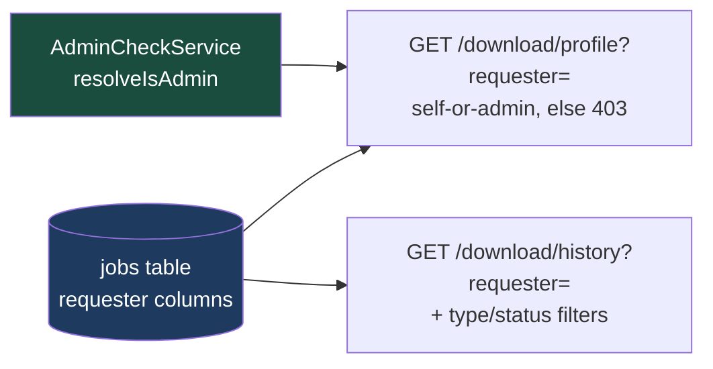

# Plan 012 — User Profile Backend — `apps/download`

> **Status: complete.** All backend tasks (T1–T5) shipped. Frontend scope
> (the `profile.pug` mockup, link wiring, chip interaction, and the eventual
> Next.js `/users/[email]` route) is **out of scope here** and tracked in a
> separate plan. Not part of `backend.md`'s Phase 0–8 narrative — this is new
> scope layered on top of what those phases delivered.

Implements the backend half of spec [`../spec.md`](../spec.md) §12 "User
Profile Page" (user stories 69–74; stories 75–79 cover the frontend's
filterable chips and are out of scope here). Builds on Phase 0's identity
primitive (`ForwardedUser`), Phase 1's `jobs` attribution columns, Phase 2's
list/cursor machinery and `GET /history`, and Phase 8's `AdminCheckService`.

## What this delivers

| Feature                     | In one sentence                                                                                                                                    |
| ---------------------------- | ----------------------------------------------------------------------------------------------------------------------------------------------------- |
| **`GET /profile` route**    | One new read endpoint returning a per-user identity header + aggregates, guarded by the exact self-or-admin split `GET /history` already enforces. |
| **`ProfileService`**        | Computes the aggregates from the `jobs` table at query time — there is no `users` table and this plan does not add one.                            |
| **History reuse**           | The profile page's job list is the existing `GET /history?requester=` — no new history mechanism, no duplicated query path.                        |
| **`DownloadClient` method** | `getProfile()` alongside the Phase 3–8 methods added in plan 011.                                                                                  |
| **`/history` type/status filters** | `HistoryQuerySchema` gains optional `type`/`status` params, threaded to `JobListFilter` — the backend half of the profile's filterable chips.|



---

## Design decisions (settled here, so implementation doesn't relitigate them)

### 1. A computed view, not a stored entity

There is no `users` table. Identity is the forwarded `email`/`userId` pair
from Traefik's ForwardAuth headers (`apps/download/src/auth/forwarded-user.ts`),
and every "who" fact in the system — including the admin leaderboard — is
derived at query time from the `jobs` table's requester columns. The profile
is the same: **`ProfileService` aggregates over `jobs`, full stop.** No
migration, no `UsersService`, no fetch-by-id. Consequences worth stating:

- A profile for an email with **zero jobs is an empty profile, not a 404** —
  there is no entity whose absence could 404. The route returns the identity
  echo with null timestamps and empty aggregate arrays.
- The route keys on **email**, not `userId`. `ForwardedUser` carries both,
  but every existing job query path (`listHistory`, `countJobsByRequester`,
  the gallery's `requesterEmail` filter) is email-keyed; introducing a
  userId-keyed path here would mean new indexes and a second identity key for
  no gain. If the system ever grows a real user store, revisit.
- Matching is case-insensitive throughout, via the existing `buildJobWhere`
  (`apps/download/src/db/jobs.repo.ts:81-86`) — nothing in this plan adds a
  second lowering step.

### 2. Access model: self-or-admin, mirroring `GET /history`

Your own profile is always available. **Opening another user's profile
requires admin; otherwise 403.** This is a deliberate copy of the shipped
guard in `DownloadController.getHistory()`
(`apps/download/src/download/download.controller.ts:294-353`): self-scope (no
`requester` param, or `requester` equal to the caller's email,
case-insensitive) always passes; another requester requires
`resolveIsAdmin()` (backed by `AdminCheckService`,
`src/auth/admin-check.service.ts`) to return true, else `ForbiddenException`
with a logged warning.

Why not a public profile for regular users? Two reasons, both already encoded
in the codebase:

- The route's defining content — full job history and per-user aggregates —
  is data the system **already classifies as self-or-admin** (`/history`).
- A stripped-down public variant would have to inherit the
  **attribution-oracle guard**: `JobQueryService.listGallery()` and
  `getGalleryFacets()` pass `excludeHiddenVideos` when a non-admin queries a
  specific requester, precisely so a targeted per-user query can't confirm
  "this person has a hidden video" via row presence or `total`. Every
  aggregate a public profile added (counts by type, trends, first/last
  timestamps) would be a new oracle to defend the same way. The payoff is
  near zero: the gallery's uploader filter already gives regular users
  "what did this person download," with the guard, today.

**If the access model ever widens to public profiles, every aggregate in
`ProfileService` must gain `excludeHiddenVideos` for non-admin viewers, per
`listGallery()`/`getGalleryFacets()`.** Under this plan the 403 is what
satisfies the oracle guard — the endpoint never serves a non-admin another
user's numbers at all. `AdminStatsService`'s "no masking anywhere" stance is
**not** the model here: that surface is admin-only and system-wide by design
("a leaderboard, not a user directory"); the profile is self-viewable, so it
inherits the guard obligation the moment its audience widens. `ProfileService`
carries a class-level doc comment pointing back at this reasoning, precisely
so a future widening doesn't skip it.

Two masking notes for the allowed viewers:

- **Self view:** aggregates include the caller's own hidden videos — no
  oracle, it's their own data. History rows go through the existing
  `projectPage(page, isAdmin)` untouched, which means a non-admin's own
  hidden-video rows arrive with `requester: null` but
  `hiddenAttribution: true` — exactly what `/history` returns today.
- **Admin view:** true everything, same as every other admin surface.

### 3. History is reused, not respecified

The profile route lists the user's downloads by calling the **existing**
`GET /history?requester=<email>` — same DTO, same cursor pagination, same
projection. The new endpoint serves only what `/history` doesn't: the
identity header and the aggregates. One page, two existing-shaped calls (the
frontend plan wires this up; this plan just makes both calls possible).

### 4. Reads are not audited

Phase 8 deliberately records no audit rows for reads ("who _looked_ at the
audit log isn't recorded" — `backend.md`, Phase 8 Deferred). The profile
endpoint is a read; it follows that rule. Nothing to wire into
`AuditLogService`.

### 5. Windowing and sparse aggregates, matching `AdminStatsService`

Only `jobsPerDay` is windowed (`?days=`, default 30, max 365 — copying
`AdminStatsQuerySchema`); totals and first/last timestamps are all-time, for
the same reason `AdminStatsService` documents — a lifetime figure that
silently means "the last 30 days" gets quoted wrongly. `windowDays` echoes
the applied window. Aggregates are sparse, never zero-filled — a row that
never occurred is absent, same convention as `AdminStatsResponse`.

### 6. Naming: `ProfileQuery` / `ProfileResponse`, not `DownloadProfileResponse`

The wire types landed unprefixed — matching the existing
`AdminStatsQuery`/`AdminStatsResponse`/`WhoamiResponse` convention in the
same module (`packages/utils/src/download/{schema,types}.ts`).

---

## Implementation

### `ProfileResponse` wire type (`packages/utils`)

Shipped in `packages/utils/src/download/{schema,types}.ts`, next to
`AdminStatsQuerySchema`/`AdminStatsResponse`:

```ts
// schema.ts
export const ProfileQuerySchema = z.object({
  days: z.coerce.number().int().min(1).max(365).default(30),
  requester: z.string().min(1).optional(),
})

// types.ts
export type ProfileQuery = z.infer<typeof ProfileQuerySchema>
export interface ProfileResponse {
  user: { email: string } // the resolved target, echoed verbatim
  firstDownloadAt: string | null // ISO; null when the user has no jobs
  lastDownloadAt: string | null
  jobsPerDay: Array<{ count: number; day: string; type: DownloadType }>
  totalsByStatus: Array<{ count: number; status: DownloadJobStatus }>
  totalsByType: Array<{ count: number; type: DownloadType }>
  windowDays: number
}
```

No `totalJobs` field — a client can sum `totalsByType`.

### Repo + service

- `countJobsByType`, `countJobsByStatus`, `countJobsByDay`
  (`apps/download/src/db/jobs.repo.ts`) already accept a `JobListFilter`,
  which already supports `requesterEmail` — the per-user aggregates are those
  three calls with `{ requesterEmail }` (plus `createdFrom` on the windowed
  one). No new SQL for these.
- New repo helper, `getRequesterActivityBounds` (`jobs.repo.ts`) — a single
  `SELECT min(createdAt), max(createdAt)` filtered via `buildJobWhere`,
  returning `{ firstCreatedAtMs, lastCreatedAtMs }` (both `null` when the
  requester has no jobs — SQLite returns one row of NULLs over an empty set).
- `ProfileService` (`apps/download/src/download/profile.service.ts`) — a
  synchronous read over jobs, like `JobQueryService`, modeled on
  `AdminStatsService.getStats()`: all-time filter `{ requesterEmail }` for
  `totalsByType`/`totalsByStatus`/bounds; windowed filter
  `{ requesterEmail, createdFrom: new Date(Date.now() - days * MS_PER_DAY) }`
  for `jobsPerDay` only. **No `excludeHiddenVideos` anywhere** — see design
  decision 2.

### Controller route

`GET /profile` on `DownloadController`
(`apps/download/src/download/download.controller.ts`), a deliberate copy of
`getHistory()`'s shape:

- `ForwardedUserGuard` — a caller with no identity has no "own profile" to
  default to; 401 is the honest answer (same reasoning as `/history`'s
  comment).
- Optional `?requester=` — absent or case-insensitively equal to the caller's
  email means self; otherwise `resolveIsAdmin()` or
  `ForbiddenException("Only admins may view another user's profile")`, with
  the same warn-log shape `getHistory()` uses (action `getProfile`).
- `ProfileQueryDto extends createZodDto(ProfileQuerySchema)`, per the
  existing inline-DTO convention.
- No `projectPage` — the response carries no job objects, so there's nothing
  to mask row-by-row.

### Shared client + tests

- `DownloadClient.getProfile(query: Partial<ProfileQuery> = {})` in
  `packages/utils/src/download/client.ts`, alongside the plan-011 methods —
  `` GET `/download/profile${toQueryString(query)}` ``, no client-side
  permission logic. A 401/403 arrives as a `DownloadApiError` like every
  other failure.
- Unit tests per the `__tests__`-alongside-source convention: guard split
  (401 / self-200 / other-non-admin-403 / other-admin-200), empty-profile
  shape, aggregate scoping (user A's profile never counts user B's jobs),
  window applied to `jobsPerDay` only.

### `/history` type/status filter params

The frontend's planned aggregate chips (`totalsByType`/`totalsByStatus`)
need to filter the embedded history table — spec §12, user stories 75–79.
The repo layer needed nothing: `JobListFilter`
(`apps/download/src/db/jobs.repo.ts`) already carries `types`/`statuses`
array fields ("comma-separated multi-select"), used today by the gallery and
admin-stats paths. What was missing was the wire-in:

- `HistoryQuerySchema` (`packages/utils/src/download/schema.ts`) — previously
  accepted only `cursor`/`limit`/`requester` — gained optional
  `type`/`status` comma-separated multi-select params, the exact convention
  the other endpoints' `types`/`statuses` already follow.
- Threaded through `DownloadController.getHistory()` →
  `JobQueryService.listHistory()` → `JobListFilter`. Both filters active at
  once compose with AND — that's just what `JobListFilter` already does.
- **No new access-control or oracle surface** — this stays inside
  `/history`'s self-or-admin requester guard (design decision 2). The
  `excludeHiddenVideos` masking is specific to a non-admin filtering the
  *gallery* by another requester — a different code path — and type/status
  filters don't interact with it.

---

## Tasks

- [x] **T1** — `ProfileQuery`/`ProfileResponse` + query schema in
      `packages/utils`. `fedebc7a`
- [x] **T2** — `getRequesterActivityBounds` repo helper + `ProfileService`;
      unit tests. `cdd593d8` + `52a4dfa9`
- [x] **T3** — `GET /profile` controller route with the self-or-admin guard;
      guard-split tests. Depends on T1, T2. `5b31969a`
- [x] **T4** — `DownloadClient.getProfile()`. Depends on T1. `1a50e6c1`
- [x] **T5** — `/history` `type`/`status` filter params: extend
      `HistoryQuerySchema` and thread to `JobListFilter`. Scope added after
      T1–T4 shipped, ahead of the frontend chip work that consumes it.
      `b1818915`

## Verification

- Unit: the guard split and aggregate scoping (see Execution log below for
  counts).
- Manual (running container, real forwarded headers, per the Verification
  conventions in `backend.md`) — **outstanding, not yet run**: no identity →
  401; self → 200 with own aggregates; other user as non-admin → 403; other
  user as admin → 200; unknown email as admin → 200 empty profile (not 404).
- Merging/pushing `jeremy/download` — outstanding, not this plan's call.

---

## Execution log (T1–T4)

T1–T4 were executed as a separate, narrower runbook (formerly a standalone
plan) so a session could pick them up serially without re-deriving the
design decisions above, and without touching the then-uncommitted frontend
mockup work sitting in the same worktree. Kept here as the historical
record; there is no separate document any more. T5 shipped later, as
additional backend scope, outside this original wave.

### Context pack (pointers into the code, current as of execution)

| What                      | Where                                                                                                                                      |
| -------------------------- | --------------------------------------------------------------------------------------------------------------------------------------------- |
| Guard pattern copied      | `getHistory()` — `apps/download/src/download/download.controller.ts:294-353`; controller is `@Controller('/download')` (line 122)          |
| Admin resolution          | private `resolveIsAdmin()` on the controller (line ~145), backed by `AdminCheckService` (`src/auth/admin-check.service.ts`)                |
| Count helpers reused      | `countJobsByType` / `countJobsByStatus` / `countJobsByDay` in `apps/download/src/db/jobs.repo.ts` — all take `(db, JobListFilter)`         |
| Facet row types           | `TypeFacetCount` (jobs.repo.ts:316), `StatusFacetCount` (:367), `DailyJobCount` (:396)                                                     |
| Aggregate-service model   | `AdminStatsService` (`apps/download/src/admin/admin-stats.service.ts`)                                                                     |
| Wire schemas/types model  | `AdminStatsQuerySchema` (`packages/utils/src/download/schema.ts:672`), `AdminStatsResponse` (`types.ts:~420`)                              |
| Client model              | `getStats()` (`packages/utils/src/download/client.ts:472`)                                                                                 |
| DTO convention            | inline `class XQueryDto extends createZodDto(XSchema) {}` (`download.controller.ts:81-91`), used with `new ZodValidationPipe(XQueryDto)`   |

### Per-task outcomes

| Task | Outcome | Commit |
| ---- | ------- | ---------- |
| S0 — commit pending §12 docs | ✅ spec/stories/plan docs only | `7b4c2a0` |
| A1 — wire contract | ✅ `ProfileQuerySchema`, `ProfileQuery`, `ProfileResponse` + schema tests | `fedebc7a` |
| A2 — repo helper | ✅ `getRequesterActivityBounds` + `RequesterActivityBounds`, 5 repo tests | `cdd593d8` |
| B1 — `ProfileService` | ✅ service + module registration, 7 tests | `52a4dfa9` |
| C2 — client method | ✅ `DownloadClient.getProfile()`, 3 client tests | `1a50e6c1` |
| C1 — controller route | ✅ `GET /download/profile` + `ProfileQueryDto`, 7 tests | `5b31969a` |
| D1 — integration checkpoint | ✅ all gates green, T1–T4 checked off above | `f75daaf0` |

### Verification results (at D1, 2026-09-11)

- `apps/download`: 57 passed / 1 skipped (pre-existing skip) in the touched
  suites; 1070 passed / 9 skipped repo-wide; lint clean; type-check clean.
- `packages/utils`: 5 suites, 285 passed; lint clean; type-check clean.
- Repo root: `pnpm run build --filter @lilnas/utils --filter @lilnas/download`
  — 4 Turbo tasks successful.
- `git status` confirmed every `designs/**` file, `.gitignore`, and
  `backend.md` untouched throughout.

### Deviations from plan

- **Existing controller test modules needed the new provider**: adding
  `ProfileService` to `DownloadController`'s constructor meant the seven
  pre-existing test files that build the controller via
  `Test.createTestingModule` each gained
  `{ provide: ProfileService, useValue: {} }`. Committed with C1.
- **401/400 cases are asserted structurally**, matching repo convention:
  controller tests call handler methods directly (no HTTP layer in the
  suite), so 401 is asserted via `ForwardedUserGuard` in the route's
  `GUARDS_METADATA` (the guard's own 401 behavior is covered by
  `forwarded-user.guard.spec.ts`) and 400 via `ProfileQuerySchema` rejecting
  `days=0` (pipe wiring is enforced repo-wide by
  `download.controller.validation.test.ts`).
- **D1 spanned two commits**: `f75daaf0` (gates + T1–T4 checkboxes) and a
  follow-up docs commit (a commit can't contain its own hash).

Open questions: none — reality matched the context pack everywhere it was
checked (`buildJobWhere` casing, DTO/pipe convention, synchronous
`DbService.db`, sparse-aggregate conventions).
