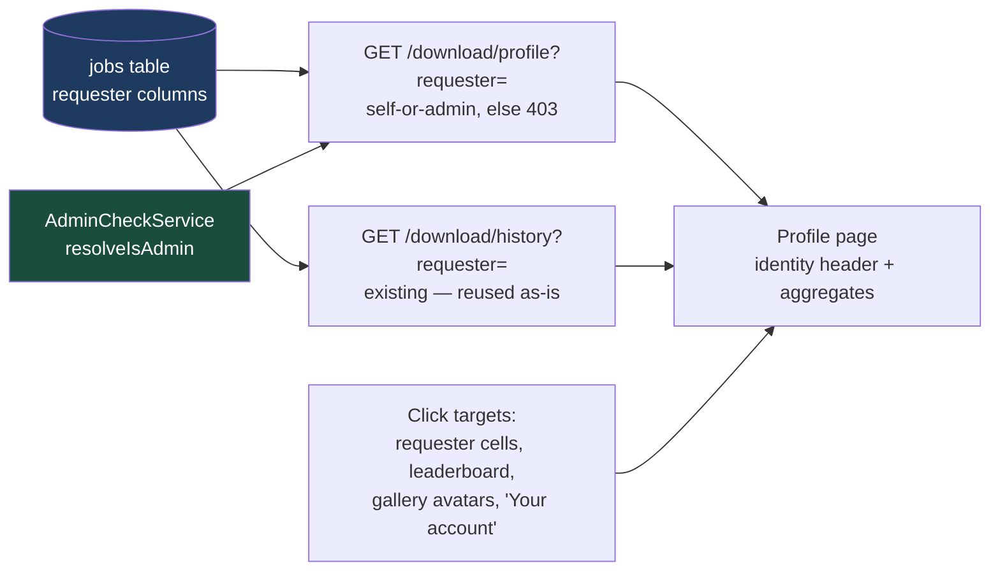

# Plan 012 — User Profile Page — `apps/download`

> **Status: proposed — nothing below is implemented.** Unlike plans 001–011,
> this is not a record of shipped work and is written in the future tense on
> purpose. It is also **not** part of `backend.md`'s Phase 0–8 narrative — it
> is new scope layered on top of what those phases delivered.

Implements spec [`../spec.md`](../spec.md) §12 "User Profile Page" (user
stories 69–74). Builds on Phase 0's identity primitive (`ForwardedUser`),
Phase 1's `jobs` attribution columns, Phase 2's list/cursor machinery and
`GET /history`, and Phase 8's `AdminCheckService`.

## What this delivers

| Feature                     | In one sentence                                                                                                                                    |
| --------------------------- | -------------------------------------------------------------------------------------------------------------------------------------------------- |
| **`GET /profile` route**    | One new read endpoint returning a per-user identity header + aggregates, guarded by the exact self-or-admin split `GET /history` already enforces. |
| **`ProfileService`**        | Computes the aggregates from the `jobs` table at query time — there is no `users` table and this plan does not add one.                            |
| **History reuse**           | The profile page's job list is the existing `GET /history?requester=` — no new history mechanism, no duplicated query path.                        |
| **`DownloadClient` method** | `getProfile()` alongside the Phase 3–8 methods added in plan 011.                                                                                  |
| **Mockup: `profile.pug`**   | A new design page in `designs/src/pages/`, plus link wiring for every currently-dead identity render (avatars, leaderboard, "Your account").       |
| **Next.js route (later)**   | `/users/[email]` in the rebuilt frontend — noted here for shape; the app under `apps/download/src/app/` is bare post-teardown (plan 010).          |



---

## Design decisions (settled here, so implementation doesn't relitigate them)

### 1. A computed view, not a stored entity

There is no `users` table. Identity is the forwarded `email`/`userId` pair
from Traefik's ForwardAuth headers (`apps/download/src/auth/forwarded-user.ts`),
and every "who" fact in the system — including the admin leaderboard — is
derived at query time from the `jobs` table's requester columns. The profile
is the same: **`ProfileService` aggregates over `jobs`, full stop.** No
migration, no `UsersService`, no fetch-by-id. Consequences worth stating:

- A profile for an email with **zero jobs is an empty profile, not a 404** —
  there is no entity whose absence could 404. The route returns the identity
  echo with null timestamps and empty aggregate arrays.
- The page keys on **email**, not `userId`. `ForwardedUser` carries both, but
  every existing job query path (`listHistory`, `countJobsByRequester`, the
  gallery's `requesterEmail` filter) is email-keyed; introducing a
  userId-keyed path here would mean new indexes and a second identity key for
  no gain. If the system ever grows a real user store, revisit.

### 2. Access model: self-or-admin, mirroring `GET /history`

Your own profile is always available. **Opening another user's profile
requires admin; otherwise 403.** This is a deliberate copy of the shipped
guard in `DownloadController.getHistory()`
(`apps/download/src/download/download.controller.ts`): self-scope (no
`requester` param, or `requester` equal to the caller's email,
case-insensitive) always passes; another requester requires
`resolveIsAdmin()` to return true, else `ForbiddenException` with a logged
warning.

Why not a public profile for regular users? Two reasons, both already encoded
in the codebase:

- The page's defining content — full job history and per-user aggregates —
  is data the system **already classifies as self-or-admin** (`/history`).
- A stripped-down public variant would have to inherit the
  **attribution-oracle guard**: `JobQueryService.listGallery()` and
  `getGalleryFacets()` pass `excludeHiddenVideos` when a non-admin queries a
  specific requester, precisely so a targeted per-user query can't confirm
  "this person has a hidden video" via row presence or `total`. Every
  aggregate a public profile added (counts by type, trends, first/last
  timestamps) would be a new oracle to defend the same way. The payoff is
  near zero: the gallery's uploader filter already gives regular users
  "what did this person download," with the guard, today.

**If the access model ever widens to public profiles, every aggregate in
`ProfileService` must gain `excludeHiddenVideos` for non-admin viewers, per
`listGallery()`/`getGalleryFacets()`.** Under this plan the 403 is what
satisfies the oracle guard — the endpoint never serves a non-admin another
user's numbers at all. `AdminStatsService`'s "no masking anywhere" stance is
**not** the model here: that surface is admin-only and system-wide by design
("a leaderboard, not a user directory"); the profile is self-viewable, so it
inherits the guard obligation the moment its audience widens.

Two masking notes for the allowed viewers:

- **Self view:** aggregates include the caller's own hidden videos — no
  oracle, it's their own data. History rows go through the existing
  `projectPage(page, isAdmin)` untouched, which means a non-admin's own
  hidden-video rows arrive with `requester: null` but
  `hiddenAttribution: true` — exactly what `/history` returns today. The page
  is scoped to one person, so the UI renders attribution from page context,
  not the row. Inherited as-is; not worth a special case.
- **Admin view:** true everything, same as every other admin surface.

### 3. History is reused, not respecified

The profile page lists the user's downloads by calling the **existing**
`GET /history?requester=<email>` — same DTO, same cursor pagination, same
projection. The new endpoint serves only what `/history` doesn't: the
identity header and the aggregates. One page, two existing-shaped calls.

### 4. Reads are not audited

Phase 8 deliberately records no audit rows for reads ("who _looked_ at the
audit log isn't recorded" — `backend.md`, Phase 8 Deferred). The profile
endpoint is a read; it follows that rule. Nothing to wire into
`AuditLogService`.

---

## Backend

### B1 — `ProfileResponse` wire type (`packages/utils`)

Add to `@lilnas/utils/download/types`, next to `AdminStatsResponse` and
matching its conventions (sparse aggregates, never zero-filled; a row that
never occurred is absent):

```ts
interface DownloadProfileResponse {
  user: { email: string }
  firstDownloadAt: string | null // ISO; null when the user has no jobs
  lastDownloadAt: string | null
  totalsByType: Array<{ type: DownloadType; count: number }>
  totalsByStatus: Array<{ status: DownloadJobStatus; count: number }>
  jobsPerDay: Array<{ day: string; type: DownloadType; count: number }>
  windowDays: number // echoes the applied window, per AdminStatsResponse
}
```

Only `jobsPerDay` is windowed (`?days=`, defaulted and clamped by the DTO,
same as `AdminStatsQuery`); totals and timestamps are all-time, for the same
reason `AdminStatsService` documents — a lifetime figure that silently means
"the last 30 days" gets quoted wrongly.

### B2 — Repo + service

- `countJobsByType`, `countJobsByStatus`, `countJobsByDay`
  (`src/db/jobs.repo.ts`) already accept a `JobListFilter`, and the filter
  already supports `requesterEmail` — the per-user aggregates are those three
  calls with `{ requesterEmail }` (plus `createdFrom` on the windowed one).
  No new SQL for these.
- One **new repo helper**: min/max `createdAt` for a requester (a single
  `SELECT min(...), max(...)` — the only aggregate the existing helpers don't
  cover).
- New `ProfileService` in `src/download/` (it's a read over jobs, like
  `JobQueryService` — not an admin surface, so not `src/admin/`).
  Synchronous, like every read that goes straight at the repos.

### B3 — Controller route

`GET /profile` on `DownloadController`, shaped as a deliberate copy of
`getHistory()`:

- `ForwardedUserGuard` — a caller with no identity has no "own profile" to
  default to; 401 is the honest answer (same reasoning as `/history`'s
  comment).
- Optional `?requester=` — absent or case-insensitively equal to the caller's
  email means self; otherwise `resolveIsAdmin()` or
  `ForbiddenException("Only admins may view another user's profile")`, with
  the same warn-log shape `getHistory()` uses.
- Zod DTO for `requester` + `days`, per the existing validation convention.

### B4 — Shared client + tests

- `DownloadClient.getProfile()` in `packages/utils`, alongside the plan-011
  methods; no client-side permission logic — the 403 arrives as a
  `DownloadApiError` like every other failure.
- Unit tests per the `__tests__`-alongside-source convention: guard split
  (401 / self-200 / other-non-admin-403 / other-admin-200), empty-profile
  shape, aggregate scoping (user A's profile never counts user B's jobs),
  window applied to `jobsPerDay` only.

## Frontend

### F1 — Mockup: `profile.pug` (the deliverable now)

The Next.js app under `apps/download/src/app/` is bare post-teardown
(plan 010), so the frontend work that lands with this plan is in the design
pipeline (`designs/src/`):

- New `designs/src/pages/profile.pug` + `designs/src/data/profile.mjs`:
  identity header, aggregate tiles/trend, and an embedded history table
  reusing the existing table treatment. Show both variants the access model
  produces: own profile (non-admin viewer) and another user's profile
  (admin viewer).
- **Wire the dead click targets** — the full list of what starts linking:
  - `avatar` mixin (`designs/src/mixins/ui.pug`) — currently a plain
    `<span>`. Gains an optional link mode (render `<a>` when a target is
    passed, `<span>` otherwise) so call sites opt in per the access rules
    rather than every avatar everywhere becoming a link.
  - `+requester` mixin and `lbRow` leaderboard rows
    (`designs/src/pages/admin-dashboard.pug`) — both plain today; both link
    on the admin dashboard (viewer is an admin by definition there).
  - The `aria-label='Your account'` button in every page's app bar
    (`gallery.pug`, `admin-dashboard.pug`, `downloads-activity.pug`,
    `nav-search.pug`, `search.pug`) — links to own profile, always.
  - Downloads Activity requester cells (`downloads-activity.pug`) — per the
    access model: linked in the admin-view variant; plain (as today) in the
    regular-user variant; the dashed "hidden" avatar **never** links in
    either.

### F2 — Next.js route (lands with the frontend rebuild, shape fixed here)

- Route: `/users/[email]` (URL-encoded email — email is the identity key,
  per design decision 1). The "Your account" entry point can link to it
  directly with the session's own email; no `/profile` alias needed.
- Page composition: one `getProfile()` call for the header + aggregates, the
  existing `getHistory({ requester })` for the paginated job list.
- Link-rendering rule, mirrored from the backend guard so the UI never
  offers a navigation the API would 403: render an identity as a link iff
  `viewer.isAdmin || identity.email === viewer.email`, and never for a
  masked attribution (there is no identity to link to).

---

## Tasks

- [x] **T1 (B1)** — `DownloadProfileResponse` + query DTO in
      `packages/utils`. `fedebc7a` (via plan 013 task A1)
- [x] **T2 (B2)** — min/max-`createdAt` repo helper + `ProfileService`;
      unit tests. `cdd593d8` + `52a4dfa9` (via plan 013 tasks A2/B1)
- [x] **T3 (B3)** — `GET /profile` controller route with the self-or-admin
      guard; guard-split tests. Depends on T1, T2. `5b31969a` (via plan 013
      task C1)
- [x] **T4 (B4)** — `DownloadClient.getProfile()`. Depends on T1.
      `1a50e6c1` (via plan 013 task C2)
- [x] **T5 (F1)** — `profile.pug` + `profile.mjs`; both viewer variants.
      `6c1d15d`
- [x] **T6 (F1)** — link wiring: `avatar` mixin link mode, admin-dashboard
      `+requester`/`lbRow`, activity requester cells, all five "Your
      account" buttons. Depends on T5 (the links need a page to point at).
      `b6889ef`
- [ ] **T7 (F2)** — Next.js `/users/[email]` route — **deferred to the
      frontend rebuild**; tracked here so the rebuild has a spec to build
      against, not scheduled by this plan.

Waves: {T1, T2, T5} → {T3, T4, T6} → T7 (later). Per repo convention: each
task runs `pnpm test`, `pnpm run lint`, `pnpm run type-check` for touched
packages, then `/commit`.

**Findings:** the wire types landed as `ProfileQuery`/`ProfileResponse`
(not `DownloadProfileResponse` as sketched above) — plan 013 design
decision 7, matching the unprefixed `AdminStatsQuery`/`AdminStatsResponse`/
`WhoamiResponse` convention in the same module.

**Findings (T6):** T6 landed alongside another session's not-yet-committed
rework of several of the same mockup files (`video-detail.pug`,
`admin-dashboard.pug`, `gallery.pug`, `search.pug`, and others), so the
commit is hunk- and line-level scoped to just the identity-link changes,
leaving that other work uncommitted for its own session to land. Two
consequences worth flagging rather than silently working around:

- `video-detail.pug`'s two "completed, playing in-app" duplicate frames
  (desktop and mobile) sit entirely inside that other session's
  not-yet-committed restructuring of the page — brand-new content with no
  committed prior version to diff against — so the attribution avatar in
  those two frames doesn't have its `href` yet. It'll pick one up
  automatically once that restructuring is committed and rebuilt from a
  tree that already has `b6889ef`'s `avatar` mixin change; a manual
  touch-up first is also fine if that lands first.
- The built `*.html` regeneration for every T6-touched page is left
  uncommitted. The mockup builder compiles one shared Tailwind stylesheet
  across every page in the project at once, so rebuilding right now would
  also bake in the other session's pending, uncommitted markup changes
  into files this commit doesn't otherwise touch. `profile.html` from T5
  is unaffected (it predates T6's edits). Run `pnpm mockups` once all
  pending mockup work across sessions is committed to get a clean,
  fully-attributable regeneration of the rest.

## Verification

- Unit: the guard split and aggregate scoping per B4.
- Manual (running container, real forwarded headers, per the Verification
  conventions in `backend.md`): no identity → 401; self → 200 with own
  aggregates; other user as non-admin → 403; other user as admin → 200;
  unknown email as admin → 200 empty profile (not 404).
- Mockup: `pnpm` mockups build renders `profile.html`; hidden-attribution
  rows in the activity mock stay unlinked in both variants.
