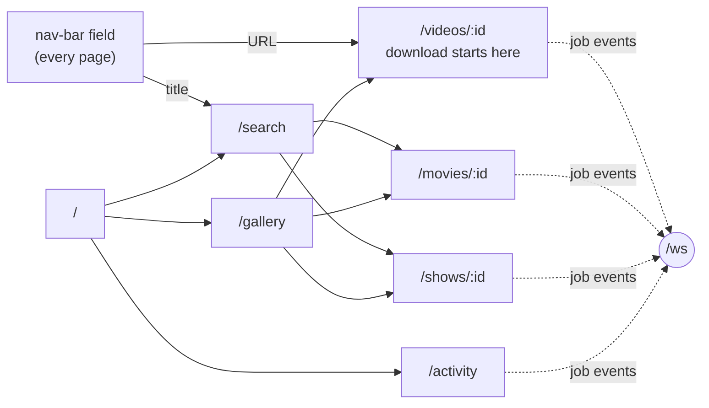
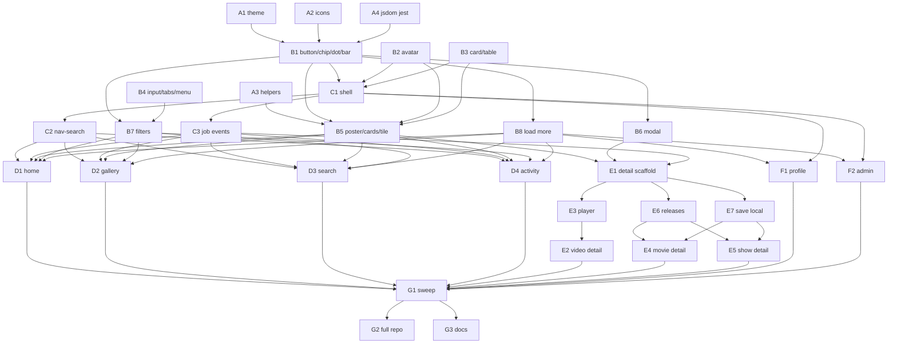

# Frontend rewrite — every page of `apps/download`

## Overview

> This section is written for a human, not the executor — plain language, no task
> IDs, no file paths. Everything below it is written for whoever (or whatever)
> implements the plan. If a claim here needs more, it links to where the detail
> lives.

`apps/download` has a spec-complete backend and no frontend. Plan 010 deleted the
pre-spec MUI/jotai UI and left a bootable Next.js shell; plans 001–012 finished
every API surface the spec describes. This plan builds the UI that consumes it —
**nine screens, desktop and mobile, drawn from the Ultraviolet mockups** in
[`../designs/`](../designs/).

Companion to [`../spec.md`](../spec.md), [`../user-stories.md`](../user-stories.md),
[`../backend.md`](../backend.md), and the mockups. This is the last piece of the
download rebuild.

| Change                           | In one sentence                                                                                          |
| -------------------------------- | -------------------------------------------------------------------------------------------------------- |
| **Ultraviolet lands in the app** | The mockups' theme, icon set and ~30 component primitives become real React + Tailwind.                  |
| **Nine screens ship**            | Home, gallery, search, activity, movie/show/video detail, profile, admin — each at both viewport widths. |
| **One entry point, everywhere**  | The nav-bar field classifies URL-vs-title client-side and is the only way into a download or a search.   |
| **Downloads go live**            | A WebSocket subscription pushes job progress onto whatever page is open, with no polling.                |
| **Backend untouched**            | Every endpoint these pages need already exists — this plan adds no routes, no schemas, no repo helpers.  |



**Shape:** one doc, phases 0–6, 32 tasks, 12 waves, orchestrated. IDs restart per
phase and are referenced as `Phase 3 · D2`. See [Sequencing](#sequencing).

**Key decisions:**

- **Server Components fetch; client islands interact** — why: the ForwardAuth
  identity only exists on the server request, and most of these screens are reads.
- **Components are hand-written Tailwind in `apps/download`, not a package and not
  shadcn** — why: the mockups already specify every primitive down to the pixel,
  and nothing else in the repo consumes them yet.
- **Verification runs against the live Radarr/Sonarr/Emby/MinIO on this host**, with
  a _copied_ SQLite database — why: real data beats invented data, and this box
  already has all four services on `lilnas_default`.
- **No agent ever mutates the real media library** — why: grab/replace/delete/flag
  write to Radarr/Sonarr and delete files off `/storage/media-library`.
- **Video detail routes on the media id, not the job id** — why: `videos.naturalKey`
  already dedupes one source URL to one `video:<id>`, so re-pasting a link lands on
  the page that already lists every attempt.

  See [Design decisions](#design-decisions) for the full reasoning and what was
  ruled out.

> **Accepted gap:** four states the mockups document can't be produced on demand
> from live data — an empty library, "no matches" on a search whose upstreams are
> healthy, the degraded-source banner, and Emby `indexing…`. Each is implemented
> from the mockup and verified by reading the code path, not by screenshot. They're
> listed under [Human checkpoints](#human-checkpoints).

**Read next:** [Design decisions](#design-decisions) for the why ·
[Shared Context Pack](#shared-context-pack) for what a sub-agent needs ·
[Task List](#task-list) for the work itself · [Sequencing](#sequencing) for the
order and the human checkpoints · [Final report](#final-report) for what "done"
reports back.

---

## How to work this plan

**All work lands on `jeremy/download`, in the existing worktree at
`/home/jeremy/.nexus-code/worktrees/lilnas/jeremy-download`.** No feature branch —
that matches all twelve prior plans in this series, and the mockups plus the entire
backend this depends on exist only on this branch (173 commits ahead of `main`).

> ⚠️ **Never switch this branch.** The production download container's `/data`
> volume is wired to this checkout; `jeremy/download` moving off is a known way to
> take the live service down at boot with `SQLITE_CANTOPEN`.

**Per task:**

1. Work tasks in wave order (see [Sequencing](#sequencing)). Never start a task
   before its dependencies are green.
2. Implement → write or update tests → run these **from `apps/download`**:
   - `pnpm test`
   - `pnpm lint` (two checks — eslint _and_ prettier)
   - `pnpm type-check`
3. For any task that renders a page or a component: **screenshot it and reconcile
   against the mockup** — see [Visual verification](#visual-verification).
4. **`/commit`** — one task, one commit (or a small coherent set). Pass an explicit
   scope naming the files this task touched, so a concurrent sibling's in-progress
   edits can't ride along. Working from another session root? Pass
   `in:/home/jeremy/.nexus-code/worktrees/lilnas/jeremy-download`.
5. Check the box below and append the commit hash.

**Markers:**

| Marker              | Means                                                          |
| ------------------- | -------------------------------------------------------------- |
| `- [ ]`             | Not started                                                    |
| `- [x]` … `abc1234` | Done, with the commit that did it                              |
| ⚠️ **PARTIAL**      | Landed with scope narrowed — say what was left and why, inline |
| ⏭️ **DROPPED**      | Not doing it — say why. Never delete a task                    |
| 🚧 / ⏳             | Blocked. Do not implement                                      |

**When reality disagrees with this plan,** add a short **Findings** note under the
task, then update the downstream tasks that finding invalidates. Do not let the doc
drift from what actually shipped.

---

## Instructions for the orchestrator agent

You are an **orchestrator**. Your job is delegation, sequencing, and status
tracking — nothing else.

**Do**

- Delegate every task to a sub-agent — implementation, tests, screenshots and the
  commit included. One sub-agent per task.
- Write **self-contained** delegation prompts. Copy in the task's full text, the
  relevant parts of the [Shared Context Pack](#shared-context-pack), and the
  [Definition of Done](#definition-of-done). When a task depends on an earlier one,
  paste that sub-agent's **reported** component names, file paths and prop types
  into the prompt.
- Tell every sub-agent to: implement → write or update tests → run the package's
  tests plus lint and type-check → screenshot-reconcile → run `/commit` with an
  explicit file scope. Each reports back **files changed, exported names, test
  results, screenshot findings, commit hash(es)**.
- Respect the sequencing graph. Launch parallel-safe tasks concurrently; never start
  a task before its dependencies report success.
- **Stagger launches within a wave by a few seconds** and never have two sub-agents
  in their `/commit` step at the same instant — `git`'s index is repo-global, and two
  simultaneous commits on one branch will capture each other's staged hunks.
- Re-delegate a failed task with the failure details attached.

**Don't**

- ❌ Read or edit any code yourself — no source, no tests, no configs. The only file
  you may edit is _this plan_, to check off tasks and record outcomes.
- ❌ Let sub-agents read this plan. Their prompts must carry everything they need.
- ❌ Fix a failing task yourself.
- ❌ Perform any [human checkpoint](#human-checkpoints), or let a sub-agent perform
  one. That includes grabbing a release, replacing a file, deleting library files,
  flagging a bad file, and deploying.
- ❌ `git checkout`, `git switch`, rebase, or push. Nothing in this plan leaves the
  local branch.

**Finish by** verifying every checkbox is checked, then reporting the
[final report](#final-report).

---

## Design decisions

### Server Components fetch, client islands interact

Every page is a React Server Component that calls `getIdentifiedDownloadClient()`
(`apps/download/src/lib/download-client.ts`) for its initial payload. Only the parts
that genuinely need the browser become `'use client'`: the nav-bar field, filter
panels, the "Load more" control, the video player, modals, profile chips, and the
job-event subscription.

Ruled out: an all-client app fetching through the `/api` rewrite. That comment at
`download-client.ts:1-10` exists because a plain `DownloadClient.localInstance` call
drops `X-Forwarded-User`, silently persisting every web-originated job as an
unattributed service call. Keeping reads on the server path keeps attribution
correct by construction, and the first paint carries real content instead of a
skeleton.

Ruled out: server actions plus `revalidatePath` for everything. That would rule out
the WebSocket push the activity and detail pages are drawn around.

**Client islands reach the API through the `/api` rewrite** (`next.config.js`), which
proxies the inbound request — including the ForwardAuth headers Traefik set — to
`localhost:8081`. Mutations go through server actions instead, so they get the
identified client for free.

### Components are hand-written Tailwind, local to this app

`apps/download/src/components/` holds the whole vocabulary, ported from
`docs/features/download/designs/src/mixins/ui.pug`. That file is the specification:
every variant, every hover state, every pixel value is already decided there.

Ruled out: creating `packages/ui` now. `docs/designs/foundations.md` anticipates one,
but nothing else in the repo consumes these primitives yet, and a package adds
scaffolding, build wiring and export surface to a plan that's already 32 tasks.
Extraction stays cheap later — the components have no app-specific imports.

Ruled out: shadcn/ui as a base. The mockups' primitives are bespoke enough
(`stline`, `toggleChip`, `gcard`, `filterPanel`, the scrimmed player bar) that most
would be fighting shadcn's defaults rather than inheriting from them.

### Plain `` for poster art, never `next/image`

`MediaBase.posterUrl` comes from Radarr/Sonarr and points at arbitrary upstream
hosts. `next/image` would need every one of them enumerated in
`images.remotePatterns`, and a host that isn't listed renders nothing.

The mockups already solve this: a gradient stand-in behind the image, and the
`` removed on error so the title label underneath reappears
(`ui.pug:501-518`, `designs/src/runtime.js`). Port that — it's one `onError`
handler, and it degrades honestly for any host.

### Video detail routes on the media id

Routes are `/movies/<tmdbId>`, `/shows/<tvdbId>`, `/videos/<videoId>` — the prefix
(`tmdb:`, `tvdb:`, `video:`) is reattached server-side. No encoded colons, and the
segment tells the route which of the three detail layouts to render.

For videos this also settles the re-pasted-URL case with **no backend work**:

- `videos.naturalKey` is `{sourceUrl}#{start}-{end}`, uniquely indexed
  (`apps/download/src/db/schema.ts:200-228`), and `upsertVideoByNaturalKey()`
  (`videos.repo.ts:78`) collapses repeat requests onto one row, keeping the
  first-minted `id`. **One source URL always maps to one `video:<id>`.**
- `GET /download/media/:id` returns `{ media, jobs: DownloadJob[] }` — every job for
  that key (`download.controller.ts:424`).

So the nav-bar action POSTs, reads `job.media.id`, strips the `video:` prefix and
redirects there. A re-paste lands on the same page, already listing every prior
attempt.

Ruled out: a `GET /download/videos/by-url` lookup so the POST could be skipped
entirely. It's the only truly-no-duplicate-row answer, but it adds a route, a repo
helper, a client method and their tests to an otherwise frontend-only plan, to avoid
a row that is invisible in the gallery (grouped by media) and correct in history.

### "Load more" paging, not infinite scroll

Every list endpoint is cursor-paginated with `limit` defaulting to 24 (max 100) and
a `total` that describes the whole filtered set, not the remainder
(`packages/utils/src/download/types.ts:251`). One shared `<LoadMore>` appends the
next page and renders `Showing 24 of 340`.

The mockups draw no pagination at all, so this is an addition rather than a port.
Ruled out: infinite scroll (breaks back-navigation position, hides the total) and
numbered pages (the API is cursor-based, so page 7 can't be jumped to).

### Verification runs against live upstreams with a copied database

`radarr`, `sonarr`, `emby` and `storage` are all live on the `lilnas_default` docker
network on this host, and `apps/download/.env.prod` holds working credentials for
all four. A dev instance joined to that network gets real posters, real
seasons/episodes, real release lists, real Emby watch URLs and real download history.

Two guards, both non-negotiable:

- **`DATABASE_PATH` points at a copy**, never `/storage/app-data/download/download.db`.
  A second writer on the live WAL risks `SQLITE_BUSY` and, worse, corrupting the
  running service's database.
- **No agent runs a library mutation.** Grab, replace, delete-files and flag-bad-file
  write to Radarr/Sonarr and delete real files. Video download/pause/cancel _are_
  fair game — a yt-dlp job is self-contained and is the honest way to produce the
  `downloading`/`paused`/`cancelled` states the mockups draw.

Ruled out: a fixture layer. It was the plan until it turned out the upstreams are
on this box; inventing data when the real thing is one network alias away is strictly
worse.

### Things that already exist — don't rebuild them

- **Attribution masking** is applied server-side. `GalleryItem.lastRequester` and
  `DownloadJob.requester` arrive already `null` when the viewer isn't allowed the
  true identity (`projectJobForViewer`, `apps/download/src/download/attribution.ts`).
  Render `null` as the dashed "hidden" avatar; never try to re-derive the rule.
- **Admin status** comes from `client.whoami()` → `{ email, userId, isAdmin }`
  (`packages/utils/src/auth/types.ts:19`). Don't infer it from an email list.
- **Self-or-admin access** on `/profile` and `/history` is enforced server-side; a
  403 arrives as a `DownloadApiError`. The UI's job is to _not render a link_ the
  API would refuse (spec §12), not to duplicate the check.
- **The fonts are already loaded.** `src/app/layout.tsx:11-22` sets up Figtree and
  IBM Plex Mono against `--font-sans`/`--font-mono`. Don't re-add them.
- **`getIdentifiedDownloadClient()`** already exists and already handles the
  header-forwarding trap. Use it; don't call `DownloadClient.localInstance` directly.

### What stays untouched

- **Everything under `apps/download/src/` that isn't `app/`, `components/`, `lib/`
  or `tailwind.css`.** The backend — `auth/`, `db/`, `download/`, `media/`,
  `download-gateway/`, `ytdlp-update/` — **must not be modified by any task in this
  plan.** A task that believes it needs a backend change has misread its task; stop
  and report.
- **`packages/utils/src/download/`.** The wire types and the shared client are
  complete. No task adds a method, a type or a schema field.
- **`apps/download/.env.prod`.** Read it to build a dev `.env`; never edit it.

---

## Shared Context Pack

> Copy the relevant parts into every sub-agent prompt. These are pointers, not
> gospel — verify against current code.

### Repo & conventions

- pnpm workspaces + Turbo monorepo. The package is `@lilnas/download` at
  `apps/download`. Shared code is `@lilnas/utils` (`packages/utils`).
- **From `apps/download`:** `pnpm test` · `pnpm lint` (eslint **and** prettier — two
  checks) · `pnpm type-check` · `pnpm dev:frontend` (Next on :8080).
- Tests live in `__tests__/` directories next to the code. Runner is Jest.
- **Tailwind v4.** There is no JS config — the theme is an `@theme` block in
  `src/tailwind.css`, and source detection is automatic from that file's directory.
  Never add a `tailwind.config.ts`; never use `@apply`.
- `cns()` from `@lilnas/utils/cns` is the class-name combiner. Per this repo's
  CLAUDE.md: **always** use it when combining class names or splitting a long class
  list across lines.
- Prefer `type` imports (`import type { … }`) — `isolatedModules` is on.
- Avoid `any`.
- Commits: conventional, scoped `feat(download):` / `refactor(download):`. Recent
  history on this branch is the reference.

### Layout

| File                                                    | What it is                                                                                      |
| ------------------------------------------------------- | ----------------------------------------------------------------------------------------------- |
| `apps/download/src/tailwind.css`                        | Currently one `@import`. Becomes the Ultraviolet `@theme` + `@utility` layer (Phase 0 · A1).    |
| `apps/download/src/app/layout.tsx`                      | Root layout. Fonts already wired; A1/C1 extend it.                                              |
| `apps/download/src/app/page.tsx`                        | Placeholder root route. Phase 3 · D1 replaces it.                                               |
| `apps/download/src/lib/download-client.ts`              | `getIdentifiedDownloadClient()`. **Use this**, not `localInstance`.                             |
| `apps/download/src/components/`                         | Does not exist yet. Everything this plan builds lives here.                                     |
| `packages/utils/src/download/client.ts`                 | `DownloadClient` — every method the pages call. Read-only for this plan.                        |
| `packages/utils/src/download/types.ts`                  | Wire types (`DownloadJob`, `GalleryItem`, `Media`, `ProfileResponse`, …).                       |
| `packages/utils/src/download/schema.ts`                 | Zod schemas + the `DownloadType` / `DownloadJobStatus` enums.                                   |
| `docs/features/download/designs/src/mixins/ui.pug`      | **The component specification.** 518 lines, one mixin per primitive.                            |
| `docs/features/download/designs/src/mixins/mock.pug`    | App bar, nav-search field, account link (lines 86–200). The rest is mockup harness — ignore it. |
| `docs/features/download/designs/src/theme.css`          | The `@theme` block to port. Lines 340–381 are mockup harness — do **not** port those.           |
| `docs/features/download/designs/src/layout/sprite.html` | 27 icons as one `<symbol>` set.                                                                 |
| `docs/features/download/designs/src/pages/*.pug`        | One per screen. Layout only; data is in `../data/*.mjs`.                                        |
| `docs/features/download/designs/*.html`                 | The built mockups. **Open these to compare against** — not the `.pug`.                          |

### The API surface, by page

Every method is on `DownloadClient`. None of them need adding.

| Page                    | Calls                                                                                                                   |
| ----------------------- | ----------------------------------------------------------------------------------------------------------------------- |
| Home                    | `getGalleryFacets()` (quick-access counts), `getGallery({ limit: 6 })`, `getActivity({ limit: 1 })` (running count)     |
| Gallery                 | `getGallery({ type, requester, from, to, cursor })`, `getGalleryFacets({ from, to })`                                   |
| Search                  | `getDiscover({ query, genre, yearFrom, yearTo, sort, cursor })`                                                         |
| Activity                | `getActivity({ type, cursor })` + `/ws`                                                                                 |
| Movie/Show/Video detail | `getMedia(id)` → `{ media, jobs }`, `listReleases(id)`, `listSeasons(id)`, `listBadFiles(id)`, `getMediaFileUrl(id, …)` |
| Profile                 | `getProfile({ requester, days })`, `getHistory({ requester, type, status, cursor })`                                    |
| Admin                   | `getStats({ days })`, `getHistory({ requester, type, status, cursor })`, `getAuditLog({ … })`                           |
| Everywhere              | `whoami()` → `{ email, userId, isAdmin }`                                                                               |

Mutations (server actions only): `createJob`, `cancelJob`, `pauseJob`, `resumeJob`,
`deleteJob`, `grabRelease`, `replaceRelease`, `flagBadFile`, `unflagBadFile`,
`deleteMediaFiles`.

### Enums you will render

```ts
DownloadType = 'movie' | 'show' | 'video'
DownloadJobStatus =
  'requested' |
  'pending' |
  'searching' |
  'downloading' |
  'pausing' |
  'paused' |
  'converting' |
  'uploading' |
  'importing' |
  'cleaning' |
  'cancelling' |
  'completed' |
  'failed' |
  'cancelled'
EmbyStatus.state = 'indexed' | 'indexing' | 'unknown'
```

`TERMINAL_DOWNLOAD_JOB_STATUSES` (`types.ts:58`) is `cancelled | completed | failed`;
everything else is in progress. **Derive, don't hand-list** — that's the file's own
stated invariant.

### Patterns to imitate

**A page is a Server Component that fetches and hands off.**

```tsx
// apps/download/src/app/gallery/page.tsx
export default async function GalleryPage({ searchParams }: PageProps) {
  const client = await getIdentifiedDownloadClient()
  const [page, facets] = await Promise.all([
    client.getGallery(query),
    client.getGalleryFacets(query),
  ])
  return <GalleryView initialPage={page} facets={facets} /> // 'use client'
}
```

**A primitive mirrors its mixin's variant table exactly.** From `ui.pug:39-74`:

```tsx
// Each variant owns its border colour; each size owns its padding. Do NOT emit a
// base `border-transparent`/`px-*` and let a variant override it — two utilities
// for one property resolve by Tailwind's output order, not by source order.
const VARIANTS = {
  uv: 'border-transparent bg-uv text-uv-ink font-[620] hover:bg-uv-hi active:bg-uv-press',
  outline:
    'border-line bg-surface text-ink hover:border-uv-dim hover:bg-surface-2',
  ghost: 'border-transparent text-ink-3 hover:bg-surface-2 hover:text-ink',
  bad: 'border-transparent text-bad hover:bg-bad-ghost',
} as const
```

**A mutation is a server action, not a client fetch.**

```ts
'use server'
export async function pauseVideo(jobId: string) {
  const client = await getIdentifiedDownloadClient()
  await client.pauseJob(jobId)
  revalidatePath(`/videos/${videoId}`)
}
```

### Gotchas

- **`cns()` is mandatory** for combined or multi-line class lists — a project rule,
  not a preference.
- **Two Tailwind utilities for the same property fight by output order**, not source
  order. This is why `ui.pug` gives each variant its own border colour and each size
  its own padding. Copy that structure; don't "simplify" it.
- **`text-sm` and `text-cap` are redefined by this theme** — 13.5px and 12px, not
  Tailwind's defaults. `theme.css:144-148` shadows them deliberately.
- **There is no grey.** No `gray-*`, `zinc-*`, `slate-*`, `neutral-*`, no `#fff`,
  no `#000`, no hue outside `{300, 155, 85, 22}`. See `docs/designs/foundations.md`.
- **`ink-4` is below AA for body text by design** — uppercase ≥11px labels,
  placeholders and em-dash empties only. Never a sentence.
- **The mockups' `.vp-scope` / `viewportToggle` / `appFrame` / `frameLabel` /
  `storyboard` / `appendix` machinery is harness, not design.** It exists so one HTML
  file can show a screen at two widths with documentation appended. The real app has
  none of it — build the screen, not the frame around it.
- **`designs/src/theme.css:340-381`** (the `@layer components` block and the
  `.vp-scope` rules) is harness. The `@media (prefers-reduced-motion)` block at the
  very end **is** design — port it.
- **Poster art in `designs/assets/` is gitignored and absent.** The mockups fall back
  to gradient stand-ins. That fallback is the real component's behaviour too.
- **`apps/download/tailwind.config.ts` is dead.** Tailwind v4 with
  `@tailwindcss/postcss` does not load it, nothing imports it, and neither
  `eslint src` nor `prettier -c src` sees it. A1 deletes it.
- **Jest's current config is backend-only** — `testEnvironment: 'node'` and a
  `testMatch` that only sees `*.ts`. A `.tsx` test will not run until Phase 0 · A4
  lands.
- **Don't screenshot a mutation you aren't allowed to perform.** See
  [Human checkpoints](#human-checkpoints).

### Visual verification

Every task that renders UI ends with a screenshot reconciliation:

1. The verify environment must be up. ⚠️ **Replaced on 2026-09-15** — it is now a
   **single container running both halves**, `lilnas-download-dev`, started from
   `apps/download/deploy.dev-remote.yml`. Runbook:
   [`../local-verification.md`](../local-verification.md).
   ```bash
   docker compose -f apps/download/deploy.dev-remote.yml up -d
   ```
   ❌ Do **not** run `pnpm dev:frontend` (hardcodes 8080, owned by
   `url-shortener-proxy-1`), and ❌ do **not** run `pnpm build` in `apps/download`
   while it is up — that clobbers the `.next` the dev server holds.
2. Screenshot `http://localhost:8090/<route>` at **1280×900** and **390×844** —
   the two widths the mockups are drawn at. The container publishes 8090 on
   **loopback only**, so this URL still works exactly as before.
   ⚠️ **Screenshot 8090, never `https://download.dev.lilnas.io`** — the public
   hostname sits behind `lilnas-auth`, and headless Chrome cannot complete the
   OAuth redirect; it would capture a login page.
   ⚠️ **Do not use Chrome MCP or Playwright MCP.** The Chrome MCP profile is
   single-instance and cannot be shared between concurrent agents; Playwright
   MCP's browser is not installed. Use system Chrome with a throwaway profile
   (`--user-data-dir=$(mktemp -d)`), and `playwright-core` from `node_modules`
   when exact geometry is wanted. **Measure; do not eyeball.**
3. Open the corresponding built mockup — `docs/features/download/designs/<page>.html`
   — and compare against its desktop and mobile panels.
4. Reconcile spacing, type scale, colour tokens, border treatment and hover states.
   Report anything you deliberately left different, and why.

The mockups are the reference for _appearance_. Where a mockup and the live API
disagree about _content_ (a field the mockup invents, a field the API returns that
the mockup omits), the API wins — say so in the task's report.

### Definition of Done

Include this **verbatim** in every delegation:

> **Done means:** implemented; tests written or updated following the package's
> existing conventions and passing; lint and type-check clean for every touched
> package; committed with `/commit`. Report back: files changed, exported names
> introduced, test summary, commit hash(es).

**Addendum for every task that renders UI:** also screenshot-reconcile against the
mockup per [Visual verification](#visual-verification) and report the findings.

**Addendum for every task in this plan:** ❌ do not modify anything under
`apps/download/src/auth/`, `db/`, `download/`, `media/`, `download-gateway/`,
`ytdlp-update/`, or anything under `packages/utils/src/download/`. If you believe a
backend change is required, **stop and report** rather than making it.

---

## Task List

### Phase 0 — Foundation

- [x] **A1. Ultraviolet theme.** `apps/download/src/tailwind.css` carries the full
      design system, and the dead Tailwind config is gone. — `550c8c3d`

  **Files:** rewrite `apps/download/src/tailwind.css`; delete
  `apps/download/tailwind.config.ts`.

  Port `docs/features/download/designs/src/theme.css` **lines 18–339** — the
  `@theme` block (surfaces, lines, ink, accent, status, type scale, shape, the one
  shadow, motion, keyframes, the mockup-local additions), the `@layer base` block,
  and the `@utility` definitions (`reveal`, `stagger`, `transition-press`,
  `dot-live`, `skeleton`, `poster-v1`…`poster-v5`). Also port the
  `@media (prefers-reduced-motion: reduce)` block at the end.

  **Edge cases:**
  - **Do not** port lines 340–361 (`@layer components` / `.vp-scope`) — mockup
    harness.
  - Keep `@import 'tailwindcss'` **without** `source(none)` and **without** the
    `@source '../.build/html'` line. Those exist because the mockups compile Pug to
    an intermediate directory; this app's sources are `.tsx` next to the CSS file.
  - The `@theme` block sets `--font-sans`/`--font-mono` to the family names.
    `layout.tsx:11-22` already binds the Next font loader to those same variable
    names — confirm they don't collide (the font loader sets the variable, the theme
    consumes it) and adjust the theme to `var(--font-sans)` passthrough if they do.
  - `text-sm`/`text-cap` deliberately shadow Tailwind's defaults. Keep that.

  **Tests:** none (CSS). Verify by `pnpm build` from `apps/download` succeeding and
  by rendering the existing placeholder page — `bg` and `ink` must apply.

  **Findings (A1, 2026-09-14):**
  - Ported `theme.css` **15–339** plus the trailing reduced-motion block (the range
    starts two lines earlier than this plan said). `tailwind.css` 1 → 368 lines.
    `tailwind.config.ts` deleted. Omitted, as instructed: `source(none)` +
    `@source '../.build/html'`, and `@layer components` / `.vp-scope` (340–361).
  - **The font variables _do_ collide, and the collision resolves correctly — no
    change needed.** `@theme` emits `--font-sans` into `@layer theme`; `next/font`
    emits its own `--font-sans` on `<html>` **unlayered**, and unlayered beats every
    cascade layer, so the loader wins. Confirmed live: computed `--font-sans` is
    `'Figtree', 'Figtree Fallback'`. The plan's suggested `var(--font-sans)`
    passthrough was **not** applied — it is self-referential and invalid CSS, and
    the only correct alternative (renaming the loader's variable in `layout.tsx`)
    is outside A1's file list. The theme values now act as a pre-hydration fallback
    naming the same two families. A comment in `tailwind.css` records this.
  - **`pnpm build` from `apps/download` SUCCEEDS.** The `@mui`/`zod` build failures
    noted below are **repo-root-only** and do not affect this package. Phase 6 · G2
    should expect a green `apps/download` build and a red root build.
  - **Tailwind v4's source scanner honours `.gitignore`.** A `.tsx` file under a
    gitignored path generates **no** utilities, silently. Relevant to any later task
    that adds components outside `src/`.
  - Verified beyond the live page (v4 tree-shakes `@theme`, so the placeholder page
    only exercises what `@layer base` touches): compiled against a full candidate
    surface — all 10 `@utility` definitions emit, `--text-sm: 13.5px` and
    `--text-cap: 12px` shadow Tailwind's defaults with a single rule each, and the
    only hues present are 300/155/85/22 with no default-palette leakage.

- [x] **A2. Icon set.** Every icon the mockups use is available as a typed React
      component. — `01c6f7b9`

  **Files:** create `apps/download/src/components/ui/icon.tsx` and
  `apps/download/src/components/ui/sprite.tsx`.

  Port the 27 symbols from `docs/features/download/designs/src/layout/sprite.html`
  plus the `pepe` badge used by the doorplate.

  ```tsx
  export type IconName =
    | 'activity'
    | 'alert'
    | 'arrow'
    | 'check'
    | 'chevron'
    | 'device'
    | 'download'
    | 'expand'
    | 'external'
    | 'eye'
    | 'eye-slash'
    | 'film'
    | 'filter'
    | 'flag'
    | 'grid'
    | 'grid-fill'
    | 'layers'
    | 'list'
    | 'pause'
    | 'play'
    | 'search'
    | 'shield'
    | 'sort'
    | 'trash'
    | 'tv'
    | 'volume'
    | 'x'

  function Icon(props: { name: IconName; className?: string }): JSX.Element
  function IconSprite(): JSX.Element // the <symbol> set, rendered once in layout
  ```

  **Edge cases:**
  - `grid` and `grid-fill` are genuinely different icons (the grid/list toggle in
    search uses the filled one) — keep both.
  - The sprite must be rendered exactly once per document, visually hidden, and
    must not be focusable or announced. C1 places it in the root layout.
  - `IconName` is a union, not `string` — a typo should fail type-check.

  **Tests:** `IconSprite` renders every name in `IconName`; `Icon` emits a `<use>`
  pointing at the matching symbol id.

  **Findings (A2, 2026-09-14):** files are
  `src/components/ui/icon.tsx`, `src/components/ui/sprite.tsx`, tests at
  `src/components/ui/__tests__/icon.spec.tsx`. The sprite's 28 symbols are exactly
  `pepe` + the 27 names this plan listed — **no difference**. Exports:

  ```tsx
  // src/components/ui/icon.tsx
  export const ICON_NAMES: readonly [...]          // the 27 names, as const
  export type IconName = (typeof ICON_NAMES)[number]
  export const PEPE_SYMBOL_ID = 'pepe'             // literal type 'pepe'
  export function iconSymbolId(name: IconName): string   // -> `i-${name}`
  export type IconProps = Omit<ComponentPropsWithoutRef<'svg'>, 'name'> &
    { name: IconName }
  export function Icon(props: IconProps): JSX.Element
  // src/components/ui/sprite.tsx
  export function IconSprite(): JSX.Element
  ```

  - **`pepe` is deliberately NOT an `IconName`** — it's a fixed multi-colour 240×240
    mark, not a 16×16 `currentColor` line icon. C1's doorplate renders it directly:
    `<svg className="h-full w-full"><use href={`#${PEPE_SYMBOL_ID}`} /></svg>`,
    which is what `mixin doorplate` does.
  - **`Omit<…, 'name'>` is load-bearing** — React's `SVGAttributes` declares
    `name?: string`, which would otherwise widen `name` back to `string`.
  - **Import paths in this package must be absolute** (`src/components/ui/icon`).
    eslint's `no-relative-import-paths` rejects `../icon`. Applies to every later
    task.
  - Neither file is `'use client'` — pure presentational, no hooks, usable from
    server and client components alike.
  - `Icon` sets **no intrinsic size and no `viewBox`**; call sites pass the size
    (`<Icon name="film" className="h-4 w-4" />`), and each symbol's own viewBox
    applies. `i-sort` is `viewBox="0 0 10 10"`, not 16×16 — verbatim from source,
    scales correctly, **do not "fix" it**.
  - Defaults `aria-hidden="true" focusable="false"` are emitted _before_ the props
    spread, so a caller can override them for a meaningful icon.
  - **C1 must render `<IconSprite />` exactly once**, inside `<body>`.
  - The port is **provably faithful**: `sprite.tsx` was generated from `sprite.html`
    by script, and the `<symbol>` markup is byte-identical to source (11192 chars
    each) once whitespace is normalised and the camelCase renames reversed.
  - Screenshot check passed via a throwaway route (since deleted): all 27 icons
    render distinctly, `grid` vs `grid-fill` are unmistakably different, `pepe`
    renders in full colour, zero console errors.
  - ⚠️ **Next.js treats a leading-underscore folder as private** and excludes it
    from routing — a `src/app/__foo/` route 404s.

- [x] **A3. Formatting and route helpers.** The conversions every page repeats exist
      once, pure and tested. — `f8f48a06`

  **Files:** create `apps/download/src/lib/media-route.ts`,
  `apps/download/src/lib/format.ts`.

  ```ts
  // media-route.ts — the mediaId <-> URL mapping (see Design decisions)
  mediaHref(media: Media): string              // 'tmdb:438631' -> '/movies/438631'
  mediaIdFromRoute(kind: 'movies'|'shows'|'videos', segment: string): string
  // 'movies', '438631' -> 'tmdb:438631'

  // format.ts
  formatRuntime(seconds: number): string       // 7440 -> '2h 04m';  178 -> '2:58'
  formatRelative(iso: string): string          // -> '12m ago' | '1h ago' | '6d ago'
  initials(email: string): string              // 'jeremy@lilnas.io' -> 'JE'
  posterVariant(seed: string): 1|2|3|4|5       // stable gradient pick, no Math.random
  statusTone(s: DownloadJobStatus): 'uv'|'ok'|'warn'|'bad'|'mute'
  isInProgress(s: DownloadJobStatus): boolean  // derive from TERMINAL_…, don't hand-list
  ```

  **Edge cases:**
  - `formatRuntime` has two shapes: `2h 04m` for movies/shows, `m:ss` for videos.
    `MediaBase.runtime` is **seconds** for both (`schema.ts:135-142`) — the
    mapper already multiplied Radarr/Sonarr's minutes by 60. Take a mode argument.
  - `posterVariant` must be **deterministic** from the media id — a grid that
    reshuffles its gradients on every render reads as a bug, and a random value
    breaks SSR hydration.
  - `mediaIdFromRoute` must reject a segment that isn't a plain id, so a crafted
    URL can't smuggle a different prefix through.
  - `initials` on an email with no separator still returns two characters.

  **Tests:** each function's boundaries — zero/undefined runtime, an ISO timestamp
  in the future, a single-character email local part, every `DownloadJobStatus`
  member mapping to a tone, and `mediaIdFromRoute` round-tripping `mediaHref`.

  **Findings (A3, 2026-09-14):** 116 tests across 2 suites, all passing.
  **Actual exported signatures — paste these, not the sketch above:**

  ```ts
  // src/lib/media-route.ts
  export type MediaRouteKind = 'movies' | 'shows' | 'videos'
  export function mediaHref(media: Media): string
  export function mediaIdFromRoute(
    kind: MediaRouteKind,
    segment: string,
  ): string | null
  export function mediaTypeFromRoute(kind: MediaRouteKind): DownloadType
  export function routeKindFromType(type: DownloadType): MediaRouteKind
  export function isMediaRouteKind(value: string): value is MediaRouteKind

  // src/lib/format.ts
  export const UNKNOWN_VALUE = '—' // em dash, U+2014
  export type RuntimeFormat = 'clock' | 'hours'
  export type PosterVariant = 1 | 2 | 3 | 4 | 5
  export type StatusTone = 'bad' | 'mute' | 'ok' | 'uv' | 'warn'
  export function formatRuntime(
    seconds: number | null | undefined,
    mode: RuntimeFormat,
  ): string
  export function formatRelative(iso: string, now?: Date | number): string
  export function initials(email: string): string
  export function posterVariant(seed: string): PosterVariant
  export function statusTone(status: DownloadJobStatus): StatusTone
  export function isInProgress(status: DownloadJobStatus): boolean
  ```

  **Deviations from the sketch, all deliberate:**
  - `formatRuntime` widened to `number | null | undefined` — `MediaBaseSchema.runtime`
    is `z.number().int().optional()`, so `number` would force a non-null assertion at
    every call site. Mode is `'hours'` (`2h 04m`, drops the hour below 1h → `42m`) or
    `'clock'` (`2:58`, grows to `1:02:03`). Both take **seconds**.
  - **`mediaIdFromRoute` returns `null` on reject — it does not throw.** Call sites do
    `const id = mediaIdFromRoute('movies', segment); if (!id) notFound()`.
  - `isInProgress` **delegates** to `isInProgressDownloadJobStatus` in
    `@lilnas/utils/download/types`, which already derives from
    `TERMINAL_DOWNLOAD_JOB_STATUSES` (`types.ts:58` = `[Cancelled, Completed, Failed]`).
    Reimplementing would have created the second list that file warns against.
  - `isMediaRouteKind` / `mediaTypeFromRoute` / `routeKindFromType` added beyond the
    sketch: a Next.js `params` value arrives as plain `string` and must be narrowed
    before it can index the kind maps. **Detail-route tasks (E2/E4/E5) want these.**
  - `formatRuntime` returns `UNKNOWN_VALUE` for null/undefined/0/negative/non-finite —
    `0` means "runtime not known" upstream, and `0m` would read as a fact.
  - `formatRelative` buckets `just now → Nm → Nh → Nd → Nw → Nmo → Ny`; a **future**
    timestamp clamps to `just now`, unparseable returns `UNKNOWN_VALUE`. `now` is
    injectable — **the default `Date.now()` is a hydration-mismatch hazard**, so a
    list should pin one instant and SSR should pass a server instant down.
  - `initials`: `JE`, `jeremy.asuncion@…` → `JA` (separators `. _ - +`), `j@…` → `J`,
    nothing usable → `'?'`.
  - `statusTone`: `mute` = requested/pending/cancelled · `uv` = searching/downloading/
    converting/uploading/importing/cleaning · `warn` = pausing/paused/cancelling ·
    `ok` = completed · `bad` = failed. Backed by a `Record<DownloadJobStatus, StatusTone>`,
    so a new enum member is a compile error rather than a silent grey.
  - ⚠️ **`mediaHref` imports `mediaIdSuffix()` from `src/db/media-id.ts`** — read and
    imported, never modified. That file is pure and its only import is
    `@lilnas/utils/download/types`, so it is safe in a client bundle. This is the one
    frontend→`db/` import edge in the plan; it does not violate the no-backend-changes
    rule, but note it exists.

- [x] **A4. Frontend test environment.** `.tsx` tests run under jsdom with React
      Testing Library. — `0b68fc89`

  **Files:** edit `apps/download/jest.config.js`; edit `apps/download/package.json`
  (devDependencies); create `apps/download/src/__tests__/setup-dom.ts`.

  Convert the config to Jest **projects**: the existing node project unchanged
  (backend `*.ts`), plus a `jsdom` project matching `**/__tests__/**/*.tsx` and
  `**/?(*.)+(spec|test).tsx`, sharing the same `moduleNameMapper`.

  Add `@testing-library/react`, `@testing-library/user-event`,
  `@testing-library/jest-dom`, `jest-environment-jsdom`.

  **Edge cases:**
  - The existing node project's `testMatch` must keep excluding the `.tsx` files, or
    every component test runs twice — once in the wrong environment.
  - `transformIgnorePatterns` currently allow-lists `@lilnas`, `nanoid`, `lru-cache`.
    The jsdom project needs the same list.
  - `pnpm test` must still run both projects in one invocation.

  **Tests:** a throwaway smoke test (`renders a div`) proves the jsdom project picks
  up `.tsx` — keep it as `src/__tests__/setup-dom.spec.tsx` so the wiring stays
  covered.

  **Findings (A4, 2026-09-14):** `pnpm --version` = 10.18.2, matching `packageManager`.
  `jest-environment-jsdom` pinned to **29.7.0** (not 30.x) to match the jest 29 major,
  using `apps/auth` as the version precedent. Test counts: node project unchanged at
  59 suites / 1194 passed / 9 skipped; new jsdom project 2 suites / 40 passed;
  combined 61 passed of 62, 1234 passed, `Ran all test suites in 2 projects`.
  **Type-check 17 → 0.** `icon.spec.tsx` (A2) **passed on its first-ever execution**,
  all 37 tests, no fixes needed.
  - ⚠️ **The lockfile needed a second pass before it was committable.** A plain
    `pnpm add` churned beyond the four packages: `ts-jest`'s esbuild peer suffix
    _swapped_ between the `apps/auth` and `apps/download` importers (0.25.8 ↔ 0.28.1),
    plus `@babel/runtime` 7.28.4 → 7.29.7 across four `@mui`/`@emotion`/
    `react-transition-group` snapshots. Investigation: both suffixes and both
    `@babel/runtime` versions already existed as snapshots at HEAD; restoring HEAD's
    lockfile + `package.json` and running `pnpm install --lockfile-only` produced zero
    drift, proving HEAD is self-consistent and the churn came from the install.
    Re-adding only the four deps with `pnpm install --lockfile-only` gave a clean
    **12 insertions, 0 deletions**. **That minimal version is what shipped.** The
    churn was `pnpm add` re-resolving peer suffixes across importers, not the new deps.
    **Future dependency tasks in this plan should use `pnpm install --lockfile-only`
    and inspect the diff, not a bare `pnpm add`.**
  - **Jest `projects` entries do NOT inherit from the root config.** `clearMocks` /
    `restoreMocks` / `testTimeout` would have silently stopped applying to the backend
    suite that depends on them — moved into the shared block. (`apps/auth` and
    `apps/tdr-code` leave these at the root of a `projects` config; that is arguably a
    latent bug in both, worth a separate look — **out of scope here**.)
  - `src/__tests__/setup-dom.ts` is a `.ts` inside a `__tests__` dir, so it matched the
    node project's `**/__tests__/**/*.ts` and would have been collected as a zero-test
    failing suite. Explicitly negated.
  - `setup-dom.spec.tsx` deliberately omits its own `@testing-library/jest-dom` import,
    so its matcher assertion genuinely tests the `setupFilesAfterEnv` wiring rather
    than passing trivially.
  - No double-collection: `jest --selectProjects node --listTests` matches no `.tsx`,
    and the node project alone reproduces the baseline exactly.
  - Pre-existing, unchanged: the `"worker process has failed to exit gracefully"`
    warning reproduces in a node-only run, so it originates in the **backend** suite.
    `apps/auth` masks its equivalent with `forceExit: true`; adding that here would be
    a behaviour change beyond A4's scope.

- [x] **A5. Local verification environment.** A documented, repeatable way to run
      this app against the live upstreams without endangering production. — `85d88b87`

  > **Findings (2026-09-14): the environment is stood up and proven.** This task is
  > now just _writing down_ the shape below. A dependency bug that briefly forced
  > this shape has since been **fixed** — see
  > [the dependency split](#findings-the-nestjs-dependency-split-fixed) — but the
  > containerised backend stays, for path fidelity rather than necessity.

  **Files:** create `apps/download/docs/local-verification.md`; create
  `apps/download/deploy.verify.yml` capturing the container below.
  ⚠️ **Historical. The runbook has MOVED to
  [`../local-verification.md`](../local-verification.md) and this environment was
  replaced on 2026-09-15 — see the replacement note at the end of A5.**

  **The working shape: containerised backend, native frontend.**

  ```bash
  # 1. snapshot the DB into its own DIRECTORY — SQLite writes -wal/-shm beside it,
  #    so mounting the bare file is not enough
  mkdir -p /tmp/download-verify
  sqlite3 /storage/app-data/download/download.db \
    ".backup /tmp/download-verify/download.db"

  # 2. apps/download/.env.verify-container — copy .env.prod, keep the docker
  #    service names (the container runs ON lilnas_default), override only:
  #      NODE_ENV=development
  #      DATABASE_PATH=/data/download.db
  #      DEV_USER_EMAIL=<an address in apps/auth's ADMIN_EMAILS>
  #      DEV_USER_ID=verify-user-1

  # 3. backend, from the already-built production image
  docker run -d --name download-verify-backend \
    --network lilnas_default \
    --env-file apps/download/.env.verify-container \
    -v /tmp/download-verify:/data \
    -v /storage/media-library/movies:/movies:ro \
    -v /storage/media-library/tv:/tv:ro \
    -p 127.0.0.1:8081:8081 \
    --entrypoint node lilnas-download dist/main

  # 4. frontend, native, on a free port
  cd apps/download && npx next dev -p 8090
  ```

  **Why this shape:**
  - **The backend is the container for path fidelity.** Radarr and Sonarr report
    file paths like `/movies/Foo (2020)/Foo.mkv`, which exist inside the container's
    `:ro` mounts but **not** on the host — so a host-native backend 404s on the
    disk-streaming branch that E7 (local save) has to verify. `pnpm dev:backend`
    does now boot natively (see Findings) and is a fine fallback for everything
    except E7, but the container is the closer match to production.
  - **The frontend must be native**, because it's the thing being edited — hot
    reload is the point.
  - **Backend on 8081** is not a choice: `next.config.js:8` hardcodes
    `http://localhost:8081` as the `/api` proxy target. Publishing the container's
    8081 to `127.0.0.1:8081` is what makes the existing rewrite work unchanged.
  - **Frontend on 8090**, because `pnpm dev:frontend` hardcodes 8080 and
    `url-shortener-proxy-1` already owns that host port.
  - **`/movies` and `/tv` are `:ro`.** A stray delete fails loudly instead of
    removing real library files — defence in depth behind the no-mutations rule.

  **Edge cases:**
  - `DATABASE_PATH` must **never** be `/storage/app-data/download/download.db`.
    Say so loudly in the doc; a second writer on the live WAL can corrupt the running
    service's database. Use `sqlite3 .backup`, never `cp` — a bare `cp` of the `.db`
    without its `-wal` is a stale, possibly torn read.
  - Mount the **directory**, not the file. SQLite needs to create `-wal`/`-shm`
    siblings; a single-file bind mount makes that impossible.
  - `DEV_USER_EMAIL` must be an admin address, or the admin dashboard and the
    unmasked-attribution paths can't be verified at all. Dev has no Traefik, so no
    `X-Forwarded-User` header ever arrives and this is the only identity source.
  - The container name must not be `lilnas-download-1` — production is running.
  - **Booting mutates the copy**: `reconcileInterruptedJobs()` sweeps every
    non-terminal job to `failed` at startup. Expected, harmless on a copy, but it
    means the snapshot's in-flight states are gone after first boot. Re-snapshot if
    you need them.
  - Container IPs are irrelevant in this shape — the backend is on `lilnas_default`
    and resolves `radarr`/`sonarr`/`emby`/`storage` by service name, so nothing goes
    stale when a container is recreated.
  - Document the teardown: `docker rm -f download-verify-backend`, stop the Next
    process, `rm -rf /tmp/download-verify apps/download/.env.verify-container`.
  - **Do not** add `deploy.verify.yml` to the root `docker-compose.yml` `include:`
    list. It is a verification tool, not a deployed service.

  **Tests:** none. Verification is the four checks below, all of which passed on
  2026-09-14:

  ```
  GET /api/auth/whoami           -> isAdmin: true
  GET /api/download/gallery      -> 28 items, real titles
  GET /api/download/history      -> 50 jobs
  GET /api/download/discover?q=  -> 40 results, degradedSources: [], 20 genre facets
  ```

  **Findings (A5, 2026-09-14):** written up at `apps/download/docs/local-verification.md`
  - `apps/download/deploy.verify.yml`. `docker compose -f apps/download/deploy.verify.yml
config` resolves byte-for-byte to the running container. Corrections to the four
    checks above — **the block above is wrong in two ways, the doc has it right:**
  * **The discover param is `query`, not `q`, and it is required with `min(2)`.**
    `?q=` → `400 invalid_type`; `?query=` → `400 too_small`. Source of truth is
    `DiscoverQuerySchema` (`packages/utils/src/download/schema.ts:343-360`). The
    working check is `?query=star` → `total: 40`, `degradedSources: []`, 20 genre
    facets.
  * **"28 items" / "50 jobs" are `total`, not page length.** `/gallery` and `/history`
    both return `{items, nextCursor, total}` with a default page size of **24**. A
    24-item first page is correct, not truncated.
  * Everything else matched live exactly: image `lilnas-download` (same sha256 as
    `lilnas-download-1`), entrypoint `node` / cmd `dist/main`, three binds
    (`/tmp/download-verify:/data` rw + the two `:ro` library mounts),
    `127.0.0.1:8081->8081`, network `lilnas_default`, `restart: no`.
  * **The image's own `ENTRYPOINT` is `["pnpm","start"]`** (backend _and_ Next), which
    is why the `node dist/main` override matters. The image also bakes
    `NODE_ENV=production`, so the `.env.verify-container` override to `development` is
    **load-bearing** for `resolveForwardedUser()` — without it there is no dev identity
    and every verification loses its admin.
  * `next.config.js:8` hardcodes `http://localhost:8081` (and line 12 for `/ws`) —
    the 8081 constraint is real. Host 8080 is held by `url-shortener-proxy-1`.
  * `/movies` and `/tv` genuinely do not exist on the host — the path-fidelity
    rationale for containerising the backend is real, not defensive.
  * ⚠️ **`docker compose -f deploy.verify.yml config` inlines the entire env file,
    secrets included, into its stdout.** Don't paste that output anywhere.
  * `/tmp/download-verify` is owned by UID 1000 = the image's `node` user.

  ##### ⚠️ A5's environment was REPLACED on 2026-09-15 — `70ba5c1b`, `3149c57e`

  **Everything above is the historical record of what A5 shipped. The shape it
  describes no longer exists**, and the runbook has **moved** from
  `apps/download/docs/local-verification.md` to
  [`../local-verification.md`](../local-verification.md) (`docs/features/download/`).
  `apps/download/docs/` is gone; `deploy.verify.yml` survives with a **RETIRED**
  banner and must not be started — it would raise a second backend on
  `127.0.0.1:8081`.

  **The environment is now ONE container running both halves**, started from
  `apps/download/deploy.dev-remote.yml`:

  ```bash
  docker compose -f apps/download/deploy.dev-remote.yml up -d
  ```

  |                                  |                                                                     |
  | -------------------------------- | ------------------------------------------------------------------- |
  | `https://download.dev.lilnas.io` | for a human — production Traefik, `lilnas-auth` OAuth in front      |
  | `http://localhost:8090`          | for tooling — **loopback only**, no auth, what screenshots must use |

  Why it changed, and what every later wave needs to know:
  - ⚠️ **The database is now EPHEMERAL and starts EMPTY.** `/data` is a tmpfs, so
    it is rebuilt from scratch on every start and destroyed on stop. Migrations
    run at boot, so the schema self-builds. **`getGallery`, `getHistory` and
    `getActivity` all return `total: 0` on a fresh container** — the A5
    verification table's `28` / `50` no longer hold. `/discover` still returns
    `total: 40` with 20 genre facets, because discovery reads Radarr and Sonarr
    live rather than the database. **D4, F1 and F2 depend on rows existing** — D4
    must create a real yt-dlp job to have anything to render, which is permitted.
  - ⚠️ **Screenshot `localhost:8090`, never the public hostname** — headless
    Chrome cannot complete the OAuth redirect and would capture a login page.
  - **The old native server listened on `0.0.0.0:8090`**, and anything arriving
    without an `X-Forwarded-User` header takes the `DEV_USER_EMAIL` admin
    fallback — so any host on the LAN had an admin session against live Radarr
    and Sonarr credentials. The replacement binds `127.0.0.1` and puts OAuth in
    front of the only remote path.
  - **A new base image, `lilnas-dev`, now exists** (`infra/base-images/lilnas-dev.Dockerfile`).
    All eight `apps/*/deploy.dev.yml` files referenced it and nothing built it, so
    `docker-compose.dev.yml` could never start.
  - ⚠️ **`deploy.dev.yml` still cannot reach this URL** and was deliberately left
    alone: it routes `Host(download.localhost)` via `infra/proxy.dev.yml`, whose
    Traefik binds host port 80 that the production Traefik already holds, and it
    names its router `download` — colliding with production's router of the same
    name on the same Traefik, which **does not warn on router-name collisions**.
    The new router is `dev-download`.
  - ⚠️ **compose `environment:` cannot override app config here.** `pnpm dev` runs
    `lilnas dev`, which calls `loadEnvFile()` on `apps/download/.env`
    (`packages/cli/src/commands/dev.ts:48`) and overwrites the container
    environment. `deploy.dev-remote.yml` mounts `.env.dev-remote` **over** `.env`
    instead. Symptom if missed: the database silently lands wherever `.env` said.
  - ⚠️ **Do not run `pnpm build` in `apps/download` while the container is up** —
    same `.next`-clobbering hazard as before, now inside the container.

##### ⚠️⚠️ Findings: `nest start -w` SILENTLY STOPS WATCHING — the dev container serves a STALE BACKEND with a CURRENT FRONTEND

**Discovered 2026-09-16 by the human-checkpoint-2 run, which correctly refused to
proceed. This is the nastiest environment trap recorded in this plan — read it before
trusting any live verification.**

`pnpm dev` runs `nest start -w -b swc` for the backend and `next dev` for the frontend.
**The Nest watcher stopped firing and never restarted.** `next dev` kept hot-reloading
normally. The result is a **split state**: the UI you are looking at is current, the API
behind it is however old the last Nest boot was — **with no warning anywhere.**

**How it presented:** plan 014 shipped the `currentReleaseGuid` annotation at 16:33–17:12;
the backend had booted at **14:33** and never restarted (exactly one
`Nest application successfully started` in the whole container log). So **0/15 movies and
0/14 episodes resolved a guid**, which looked exactly like "plan 014 does not work."
It worked fine — it wasn't loaded.

⚠️ **Compounding factor: `/data` is a tmpfs, so migrations run ONLY at boot.** Migration
`0001_absent_outlaw_kid` was created at 16:36, two hours after the 14:33 boot, so
`media_file_releases` **did not exist in the running DB** and `__drizzle_migrations` held
a single row for `0000`. A stale backend therefore also means a stale *schema*.

**Three cheap ways to detect it — use these before concluding a feature is broken:**

1. `docker logs lilnas-download-dev 2>&1 | grep -c "Nest application successfully started"`
   — compare boots against when your code landed.
2. Check `__drizzle_migrations` against the migration files on disk.
3. Look for a field your change added returning `null`/absent **with no warning logged**
   on a path that logs on every failure — silence means the code is not running at all,
   not that it ran and failed.

**The fix is `docker restart lilnas-download-dev`** — dev only, separate container from
production's `lilnas-download-1`, and the tmpfs DB is ephemeral so nothing is lost and
migrations re-apply at boot. **Confirmed working:** after the restart, **6/6 sampled
movies resolved a real `currentReleaseGuid`** against live indexers.

⚠️ **Any live verification done against this container between 14:33 and the restart
exercised a stale backend.** Frontend-only verification (D1–D4, E2/E4/E5, the live-updates
task) is unaffected, since `next dev` was hot-reloading correctly throughout — but
**anything that asserted on backend behaviour in that window should be re-checked.**

##### ✅ Findings: `yt-dlp` and `ffmpeg` were MISSING from the dev image — FIXED `b264f355`

**Found by E2 running a real job, fixed 2026-09-16.** Same class of defect as D4's
`/download` tmpfs find, and the same way of finding it: **only running a real job
surfaces it.**

**The symptom:** every video job died with `spawn /usr/bin/yt-dlp ENOENT`. Worse, the
failure **did not surface as `failed`** — the job sat at `downloading`, and any
subsequent pause/cancel **wedged at `pausing`/`cancelling` forever**, because there was
no process to signal or reap. C2's and C3's earlier jobs show the same signature, and
none ever had its title overwritten by the metadata probe.

**The fix** (`infra/base-images/lilnas-dev.Dockerfile`, +29, purely additive) mirrors
`apps/download/Dockerfile`'s production stage exactly:
- `curl`, `ffmpeg` added to the existing `apt-get install` list (`python3` and
  `ca-certificates` were already there).
- yt-dlp downloaded to **`/opt/yt-dlp/yt-dlp`**, `chmod a+rx`, `chown -R node:node`,
  then **symlinked to `/usr/bin/yt-dlp`**.

⚠️ **The `/opt` + symlink indirection is load-bearing, not cosmetic.**
`ytdlp-update.service.ts` hardcodes `YTDLP_BINARY_PATH = '/opt/yt-dlp/yt-dlp'` and
replaces it with `move(…, { overwrite: true })` — a rename, which needs write
permission on the **directory**, not the file. `/usr/bin` is `root:root drwxr-xr-x`,
so **installing straight to `/usr/bin` would silently break every auto-update.**
Meanwhile `download.service.ts:70` and `download-video.service.ts:69,287` hardcode
`spawn('/usr/bin/yt-dlp')`, so the symlink must stay. **Anyone touching either path
must keep both.**

⚠️ **`ffmpeg` was equally necessary** — `download-video.service.ts:392` spawns
`/usr/bin/ffmpeg` for the conversion phase, and yt-dlp shells out to it to merge
separate video/audio streams. Without it the fix would have moved the identical ENOENT
one stage later and left the `completed` state unreachable anyway.

**Verified end to end:** `yt-dlp --version` → `2026.08.19`; zero `ENOENT` across the
container's whole lifetime; a real job ran `pending → downloading → converting →
completed` with `downloadUrls` populated, and the title was **overwritten from the raw
URL to the real one** — the exact signature the three earlier wedged jobs never showed.
Job then cleaned up to `cancelled`, nothing left running, production
(`lilnas-download-1`) never touched.

✅ **Consequence for G1: the `completed` / in-app-player state is now reachable and
screenshot-able.** E3 and E2 could only unit-test it. **Budget ~10 minutes** to
reproduce one, and **use a short, low-resolution clip** — Big Buck Bunny at 4K60 spent
~9 minutes in ffmpeg alone.

⚠️ **Risk to the other seven dev apps assessed as none:** no existing line changed, no
path collision (`/opt` was empty, `/usr/bin/yt-dlp` absent), no `ENV`/`USER`/
`WORKDIR`/`ENTRYPOINT` change, and `/usr/bin/yt-dlp` + `/usr/bin/ffmpeg` are referenced
only by `apps/download/src/download/`. Cost is image size and build time only.

##### ✅ Findings: the spawn-error wedge — CLOSED, fixed in `c7eebc62`

⚠️ **This section previously read "Not fixed. Do not assume installing the binary
closed it." That is no longer true, and the mechanism recorded here was WRONG.**
Corrected 2026-09-16 from the fixing session's trace.

**What was actually wrong — not a missing status transition.** `runProcess()`'s
`proc.on('error')` handler wrote the raw `Error` object into a **non-objectMode** log
stream:

```js
logFileStream.write(err) // err is an Error, not a string/Buffer
reject(err) // ← never runs
```

A non-objectMode stream **throws `ERR_INVALID_ARG_TYPE`** on a non-string/Buffer rather
than emitting an error. That throw escaped the listener as an uncaught exception, so:

- `reject(err)` on the next line was **dead code**;
- Node fires **no `'close'`** after an error handler throws, so that path was dead too;
- **the promise never settled at all.**

So `await download()` hung forever. That in turn explains the two downstream symptoms
nobody had traced: the scheduler's `Failed` write was **unreachable because its `catch`
was still suspended inside that `await`** — not broken, never reached — and `clearProc`
sits further down the same dead path.

⚠️ **The earlier write-up here — "the handler logs but never transitions state" — was a
plausible misreading of a real symptom.** The transition code was correct; it was simply
never reached. **Serialising the error to a string was the entire fix**, because
`updateJob()` already releases the process handle on every terminal transition.

**Verified two ways:** a standalone repro, and by reinstating the bug — the 5 new spawn
tests **hang and time out** against the old handler.

The production-reachability assessment **stands and was the right call**: ENOENT was
only one trigger; EACCES, EPERM, ENOMEM and a `YtdlpUpdateService` daily-cron update
leaving a truncated or non-executable binary mid-`move` all reach the same handler.

⚠️ **Plan `015` is H1-ONLY.** This wedge is **not** deferred into it — it is closed.
Do not re-open it there.

⚠️ **Line drift from `c7eebc62`:** in `download-video.service.ts`, `:557` → **`:571`**
and the error handler `:560` → **`:574`**. **Unaffected** (all precede the insertions):
`:69`, `:88`, `:287`, `:392`, and `download.service.ts:70`.

##### Findings: the NestJS dependency split (FIXED)

`pnpm dev:backend` used to die at startup with:

> `Nest can't resolve dependencies of the SchedulerMetadataAccessor (?). Please make
sure that the argument Reflector at index [0] is available in the ScheduleModule
context.`

**Fixed on 2026-09-14** — `main` at `a7055789` (pushed), and `jeremy/download`
rebased onto it at `3dd56560` (force-pushed). `pnpm dev:backend` from
`apps/download` now reaches `Nest application successfully started`. Recorded here
because the symptom is distinctive and will otherwise get misdiagnosed if it ever
returns.

**Root cause — two parts, neither of them the obvious one:**

1. **pnpm version drift.** `packageManager` declared `pnpm@10.18.2` but nothing
   enforced it, so installs ran with whatever `pnpm` was on `PATH` — including
   9.15.9, which is what turbo shelled out to per task. **The two majors hash
   virtual-store directory names differently**, so a tree written by both ends up
   with some symlinks pointing at the pnpm 9 copy of a package and some at the
   pnpm 10 copy. That produced two copies of the _same version_, `11.1.6` — hence
   two `Reflector` classes, hence the DI failure. Worse, a short directory name is
   identical under both majors, so an incremental install considers it satisfied
   and never rewires it: **the tree does not self-heal.**
2. **An unpinned transitive `@nestjs/core@11.1.16`**, plus a root `@nestjs/testing`
   whose peers auto-resolved to it because the root importer had no core of its own.

**Fix:** `manage-package-manager-versions=true` in `.npmrc` (so pnpm hands off to
the pinned version and every install agrees on one naming scheme), `pnpm.overrides`
pinning the `@nestjs/*` packages that appear in peer suffixes, and `@nestjs/common`
/ `@nestjs/core` as explicit root devDependencies so the overrides can reach
`@nestjs/testing`'s peers.

**Two things the original diagnosis in this plan got wrong**, corrected so nobody
re-runs the dead end:

- **It was not `inject-workspace-packages`.** That setting is still `true` and the
  bug is gone.
- **`pnpm-lock.yaml`'s bare `(@nestjs/core@11.1.6)` peer key was not a mismatch** —
  it's just pnpm's abbreviated notation. Chasing it as evidence of a split is a
  false lead. Overrides alone could never have fixed this, which is why adding them
  on 2026-09-10 didn't help.

**It was never only `apps/download`.** From the committed lockfile,
`me-token-tracker`, `tdr-bot` and `tdr-code` all failed to boot the same way, and
`@nestjs/testing` resolved a different core than the app under test in `download`,
`tdr-bot`, `equations` and `me-token-tracker`. All fixed.

**Still red, unrelated, pre-existing:** `pnpm test` fails at the repo root on
`@lilnas/equations` (7 assertions). `jeremy/download` also does not `build` yet —
`theme.ts` imports `@mui/*` this branch removed, and `auth` imports an undeclared
`zod`. **Neither is this plan's to fix**, but both mean Phase 6 · G2's full-repo
sweep will not be green until someone does. Expect it and report it rather than
chasing it.

### Phase 1 — Ultraviolet primitives

All of Phase 1 lives in `apps/download/src/components/ui/`, one file per component
group, with tests in `apps/download/src/components/ui/__tests__/`.

The specification for every one of these is `designs/src/mixins/ui.pug` at the line
range given. Port the class lists **verbatim** — they encode decisions (see
[Gotchas](#gotchas)). Every component takes `className` and spreads the rest of its
props onto the root element, mirroring the mixins' `&attributes(attributes)`
convention.

- [x] **B1. Button, Chip, Dot, Bar, Spinner, Skeleton.** — `d4d292d7`, `a9e30ba5`

  **Files:** create `button.tsx`, `chip.tsx`, `status.tsx` (Dot + Bar),
  `feedback.tsx` (Spinner + Skeleton).

  ```tsx
  Button:   { variant?: 'uv'|'outline'|'ghost'|'bad'; size?: 'sm'|'lg';
              icon?: IconName; iconEnd?: IconName; full?: boolean; disabled?: boolean }
  Chip:     { tone?: 'uv'|'ok'|'warn'|'bad'|'mute'; label?: string; icon?: IconName;
              active?: boolean; interactive?: boolean }
  Dot:      { tone?: 'live'|'ok'|'warn'|'bad' }
  Bar:      { pct: number }
  ```

  Source: `ui.pug:39-74` (Button), `92-122` (Chip), `125-128` (Dot), `165-167` (Bar),
  `179-186` (Spinner + Skeleton).

  **Edge cases:**
  - `Chip` with `interactive` renders a real `<button>` with `aria-pressed`
    mirroring `active`; without it, an inert `<span>`. This is opt-in on purpose —
    most chips in the app are read-only status badges.
  - `Chip`'s `active` **overrides** `tone`, so a selected filter always reads
    "applied" regardless of its status tint.
  - `Button`'s `ghost` and `bad` variants get different default padding than the
    others (`h-[38px] px-[11px]` vs `px-[15px]`).
  - `Bar` must clamp `pct` to 0–100.
  - Buttons default to `type="button"` — a bare `<button>` inside a form submits it.

  **Tests:** each variant/size emits its own class set (not a merged default);
  `Chip` interactive/inert tag choice and `aria-pressed`; `active` beating `tone`;
  `Bar` clamping; `Button` disabled blocking `onClick`.

  **Findings (B1, 2026-09-14):** 4 suites / 81 tests, all passing. Files are
  `button.tsx`, `chip.tsx`, `status.tsx`, `feedback.tsx` under
  `src/components/ui/`, tests alongside in `__tests__/`.
  **Actual exported signatures — paste these, not the sketch above:**

  ```tsx
  // button.tsx — 'use client'
  export type ButtonVariant = 'uv' | 'outline' | 'ghost' | 'bad'
  export type ButtonSize = 'sm' | 'lg'
  export type ButtonProps = ComponentPropsWithoutRef<'button'> & {
    variant?: ButtonVariant   // omitted -> bare, border-transparent, no fill
    size?: ButtonSize         // omitted -> 38px default
    icon?: IconName           // before children
    iconEnd?: IconName        // after children
    full?: boolean            // -> w-full
  }
  export function Button(props: ButtonProps): JSX.Element

  // chip.tsx — 'use client'
  export type ChipTone = StatusTone          // alias of src/lib/format's StatusTone
  export type InteractiveChipProps = …& { interactive: true }
  export type StaticChipProps      = …& { interactive?: false }
  export type ChipProps = InteractiveChipProps | StaticChipProps
  export function Chip(props: ChipProps): JSX.Element
  // own props: tone?, label?, icon?, active?, className?, children?

  // status.tsx — NOT 'use client' (server-usable)
  export type DotTone = 'live' | 'ok' | 'warn' | 'bad'
  export type DotProps = Omit<ComponentPropsWithoutRef<'span'>, 'children'> & { tone?: DotTone }
  export function Dot(props: DotProps): JSX.Element
  export const BAR_MIN_PCT = 0
  export const BAR_MAX_PCT = 100
  export function clampPct(pct: number): number        // non-finite -> 0
  export type BarProps = Omit<ComponentPropsWithoutRef<'div'>, 'children'> & { pct: number }
  export function Bar(props: BarProps): JSX.Element

  // feedback.tsx — NOT 'use client'
  export type SpinnerProps  = Omit<ComponentPropsWithoutRef<'div'>, 'children'>
  export type SkeletonProps = Omit<ComponentPropsWithoutRef<'div'>, 'children'>
  export function Spinner(props: SpinnerProps): JSX.Element
  export function Skeleton(props: SkeletonProps): JSX.Element
  ```

  - **`Button`'s label is `children`, not a `label` prop.** `Chip` keeps `label`
    _and_ accepts `children`; content order is `icon` → `label` → `children`, so
    `<Chip tone="ok"><Dot tone="live" />2 running</Chip>` composes.
  - **`ChipProps` is a discriminated union on `interactive`** — `onClick` and the
    rest of the `<button>` surface only type-check when `interactive` is passed, so
    a read-only badge can't take a handler.
  - **`ChipTone` is an alias of `StatusTone`**, not a re-declared literal union, so
    a new `DownloadJobStatus` can never produce a tone `Chip` can't render.
  - `Skeleton` has **no intrinsic size** — size at the call site
    (`<Skeleton className="h-4 w-32" />`). `Dot`/`Spinner`/`Skeleton` default to
    `aria-hidden="true"` before the spread, matching `Icon`'s convention.
  - `Button` emits `type="button"` **before** the spread, so `type="submit"` is
    overridable. Variant and size are orthogonal: an explicit `size` always beats
    the quiet (`ghost`/`bad`) default padding.

  **Mockup deviations (B1):**
  - ⚠️ **Button font size at `sm`/`lg` — the mockup's own rendering is an accident,
    and we deliberately do not reproduce it.** In the mockups' generated CSS,
    `.text-[14px]` (line 2024) is emitted _after_ `.text-[13px]` (2021) and
    `.text-h3` (1949). Because `ui.pug` leaves `text-[14px]` on the button base and
    lets the size table land on top, **every mockup button actually renders at
    14px** — `sm`'s `text-[13px]` and `lg`'s `text-h3` are dead code there. B1
    follows the pug's evident _intent_ (`sm` = 13px, `lg` = `text-h3`/15.5px) and
    folds the default 14px into the size table, so exactly one font-size utility is
    ever emitted. Rendering the accident would have made `size` a no-op for type.
  - `Bar`'s fill is a `<span className="block …">` rather than the pug's `<i>` —
    visually identical; `<i>` is a text-semantics element with no text in it.
  - `Bar` adds `role="progressbar"` + `aria-valuemin/max/now` (the clamped value),
    which the mockup has none of. Emitted before the spread, so a call site that
    renders a redundant numeric percentage beside it can pass `role="presentation"`.
  - `Dot`/`Spinner`/`Skeleton` default `aria-hidden="true"`; the mockup has none.
  - Everything else verified matching at 1280×900 and 390×844: button
    shape/radius/gap/press across all variants × sizes, chip pill geometry + mono
    11px type + every tone tint, the `live` dot's breathing ring, `Bar` track and uv
    fill, `Skeleton` shimmer, `Spinner` ring. Mobile wraps without overflow.

  - **`cns()` is `twMerge(clsx(...))`, and that matters.** A call site overriding a
    primitive's utility — the mockups do this constantly, e.g.
    `+btn(...)(class='h-6 px-2 text-[11.5px]')` emitting `h-[38px] px-[11px] h-6 px-2`
    — now resolves **last-wins deterministically** instead of by CSS output order.
    Strictly better than the mockups. Later component tasks can rely on this.
  - ⚠️ **The `/commit` skill's preflight instructs a `git reset` when the index is
    dirty. Do not follow it in this plan** — it would destroy the pre-existing
    staged plan doc. B1 staged only its own eight paths and used a pathspec-limited
    `git commit -- <paths>`, which excludes the staged plan doc from the commit
    while leaving it staged. Every task in this plan must do the same.
    **All four Wave 2 agents hit this preflight independently and all four correctly
    refused it.** Treat it as a standing trap for every later wave.

  **Follow-up (B1, `a9e30ba5`) — `lg` Buttons shipped with no text colour.**
  The `cns()` bug documented under B3 **did** hit `Button`, in the opposite
  direction from B3's examples. `cns(BASE, variant, size)` put `text-h3` _after_ the
  variant's ink, and twMerge keeps the last member of a conflict group, so
  **`text-uv-ink` / `text-ink` / `text-ink-3` / `text-bad` were all destroyed on
  every large button** — which then inherited near-white `--color-ink`. On `uv` that
  is near-white text on a purple fill, a real contrast bug. `sm` and the default
  size were unaffected (arbitrary values). Fixed by
  `lg: h-[46px] px-[22px] text-[length:var(--text-h3)] leading-[1.4]`; the explicit
  `leading-[1.4]` restores the `--text-h3--line-height` companion the token form
  supplied, and no weight restoration is needed because `font-[550]`/`font-[620]`
  already set `--tw-font-weight`. Post-fix, size **and** colour survive for all four
  variants. New DOM-level tests in `button.spec.tsx` (plus five in `chip.spec.tsx`
  documenting that `Chip` is safe); reverting the fix turns 7 of them red.

  ⚠️ **Correction to B1's original report:** its claim that "exactly one font-size
  utility is ever emitted" was true of the _input_ class list but **not of the
  DOM** — twMerge was reshaping the list afterwards. The headline finding itself
  stands: the mockups' `lg`/`sm` type sizes are dead due to CSS output order, and
  the port renders the pug's intent. **Lesson for every later task: assert on the
  rendered `class` attribute, never on the composed input string.**

- [x] **B2. Avatar, Doorplate, CastPerson.** — `3f7a0cce`

  **Files:** create `avatar.tsx`, `doorplate.tsx`.

  ```tsx
  Avatar: { initials: string; size?: 'xs'|'md'; ring?: boolean;
            hidden?: boolean; href?: string; title?: string }
  ```

  Source: `ui.pug:140-156` (Avatar), `22-29` (Doorplate), `313-316` (CastPerson).

  **Edge cases:**
  - `href` renders an `<a>`, otherwise a `<span>` — call sites opt in per the access
    rules (own identity always; another user's only for an admin).
  - **`href` and `hidden` together is a bug.** A masked identity has no profile to
    link to. Make it impossible: type the props as a union so `hidden: true` excludes
    `href`, and assert it in a test.
  - `hidden` renders the dashed outline with no initials.
  - `ring` is the "this is you" halo — a two-layer `box-shadow`, not a border.

  **Tests:** tag choice by `href`; hidden renders dashed and empty; the union
  prevents `hidden` + `href` (type-level plus a runtime assertion test).

  **Findings (B2, 2026-09-14):** 2 suites / 28 tests, all passing. Files are
  `avatar.tsx` and `doorplate.tsx` under `src/components/ui/`, tests alongside.
  **`CastPerson` lives in `avatar.tsx`.** **Neither file is `'use client'`** — no
  state, no handlers, no hooks; they import cleanly into client components too.

  ```tsx
  // src/components/ui/avatar.tsx
  export type AvatarSize = 'md' | 'xs'
  export const MASKED_INITIALS = '–' // EN dash U+2013 — NOT UNKNOWN_VALUE (em dash)

  // the union, reproduced (the three member types are not themselves exported):
  type AvatarElementProps = Omit<
    ComponentPropsWithoutRef<'span'>,
    'children' | 'hidden' | 'title'
  >
  type AvatarCommonProps = AvatarElementProps & {
    ring?: boolean
    size?: AvatarSize
    title?: string
  }
  type AvatarIdentifiedProps = AvatarCommonProps & {
    hidden?: false
    href?: string
    initials: string
  }
  type AvatarMaskedProps = AvatarCommonProps & {
    hidden: true
    href?: never
    initials?: never
  }
  export type AvatarProps = AvatarIdentifiedProps | AvatarMaskedProps
  export function Avatar(props: AvatarProps): JSX.Element

  export type CastPersonProps = Omit<
    ComponentPropsWithoutRef<'div'>,
    'children'
  > &
    Pick<AvatarIdentifiedProps, 'initials'> & { name: string }
  export function CastPerson(props: CastPersonProps): JSX.Element

  // src/components/ui/doorplate.tsx
  export type DoorplateProps = Omit<
    ComponentPropsWithoutRef<'span'>,
    'children' | 'color'
  > & { href?: string; name: string }
  export function Doorplate(props: DoorplateProps): JSX.Element
  ```

  Call-site cheat sheet for later waves:

  ```tsx
  <Avatar initials="JA" />                     // 24px span (default)
  <Avatar initials="JA" size="xs" />           // 18px
  <Avatar initials="JA" size="md" />           // 30px
  <Avatar initials="JA" ring />                // "this is you" halo
  <Avatar initials="JA" href="/profile" />     // renders <a>
  <Avatar hidden />                            // masked; no initials, no href
  <Avatar className="h-[52px] w-[52px] text-[18px]" initials="JA" ring />  // size override
  <CastPerson initials="ML" name="Mara Lin" />
  <Doorplate name="Download" href="https://lilnas.io" />   // what the app bar uses
  ```

  - The idiomatic masked branch is
    `requester ? <Avatar initials={initials(requester)} … /> : <Avatar hidden />`.
  - ⚠️ **`hidden: true` excludes `initials` as well as `href`** — a stronger
    restriction than this task asked for (it named only `href`). Rationale: the
    mixin's own doc comment says "dashed, no initials", and accepting an initials
    string you then discard invites a leak. **Downstream prompts must not assume
    `initials` is unconditionally required.** There is also a runtime guard — if the
    types are bypassed, `hidden` still wins and no `href` reaches the DOM.
  - `hidden` is destructured out and never reaches the DOM, so the native `hidden`
    attribute is never set (which would `display: none` the avatar).
  - `Doorplate` **requires `<IconSprite />` in the document** — its pepe badge is
    `<use href="#pepe">` straight out of the sprite, not an `Icon`. C1 must render
    the sprite before the app bar.
  - `+6` overflow avatars on the detail screens work as-is:
    `<Avatar className="text-[10px]" initials="+6" size="md" />` — `initials` is just
    a string.
  - Size tables each own their full `h-*`/`w-*`/`text-*` triple, per the
    output-order rule — no base-plus-override.
  - Both `@ts-expect-error` directives in the spec **fired** (tsc did not flag them
    as unused), so the union genuinely rejects `hidden + href` and `hidden + initials`.

  **Mockup deviations (B2):**
  - **`<a>` instead of `<span href>`** for `Doorplate` and the linked `Avatar`. The
    built mockup literally emits `<span class="…" href="https://lilnas.io">` —
    invalid HTML, an artifact of pug's `&attributes` merge into a `span`-rooted
    mixin. React would warn on it and it is unnavigable. Zero visual difference.
  - ⚠️ **The masked placeholder is an en dash (U+2013), component-owned — and this
    departs from the task text's "dashed and empty".** The mockups pass `'–'` as the
    _initials argument_ at all five masked call sites; in React the component owns
    it, so `hidden` needs no argument. An empty circle would contradict the mockup at
    8 rendered instances across 3 pages, and "no initials" is satisfied by a neutral
    glyph that leaks nothing. B2 first shipped `UNKNOWN_VALUE` (em dash) for
    one-glyph consistency with `format.ts`, screenshotted it, and **backed it out**:
    at 8.5–12px inside an 18–52px circle the em dash reads as a rule struck through
    the avatar, not a placeholder. `MASKED_INITIALS` is exported so this is a
    one-line change; the test asserts it is `'–'` and **not** `UNKNOWN_VALUE`, so a
    future "unify the dashes" sweep fails loudly rather than silently.
    ✅ **RESOLVED 2026-09-15 — keep the en dash, no code change.** The call was already
    made on visual evidence and the guard test protects the reasoning. Unifying would
    reintroduce the rendering B2 rejected, at 8 instances across 3 pages; an empty circle
    (the task text's literal "dashed and empty") is worse still, since the dashed border
    is invisible at every size — `border-line` oklch 29% against `bg-surface-3` oklch
    28% — so it would read as a blank dot with no affordance at all.
  - `aria-hidden="true"` added to the doorplate's badge `<svg>` — decorative; the
    mono wordmark still supplies the link's accessible name. No visual change.
  - **Faithful, not a bug:** `border-dashed` on a masked avatar is invisible at every
    size — `border-line` (oklch 29%) and `bg-surface-3` (oklch 28%) are within 1%
    lightness. Confirmed at 6× device scale that **the mockup renders it equally
    invisible**, so this is a property of the token pair, not the port. The class is
    applied and asserted in tests.
  - Verified matching at 1280×900 / 390×844: doorplate pill geometry, the 24px pepe
    badge in full colour, the 9px gap, mono 12px `tracking-[-0.01em]` wordmark, the
    30px ringed nav avatar (two-layer `bg-sunk` + `uv` halo, ink-2 initials at
    11.5px), the 52px profile-header avatar, the xs/default/md triples, `className`
    size overrides resolving through `twMerge`, and hover appearing only on the
    anchor form.

  - `Doorplate` takes an opt-in `href` rather than being unconditionally a link or
    unconditionally inert — the mockup's invalid `<span href>` gave no clean signal,
    so it mirrors `Avatar`'s shape. C1 passes `https://lilnas.io`.

- [x] **B3. Card, Note, StateLine, DataTable, MChip.** — `e423f5ca`, `f7aa79b`

  **Files:** create `card.tsx` (Card + Note), `data-table.tsx`, `state-line.tsx`,
  `mchip.tsx`.

  Source: `ui.pug:159-162` (Card), `170-176` (Note), `238-251` (StateLine +
  StateLineActions), `427-431` (DataTable), `434-438` (MChip).

  **Edge cases:**
  - `DataTable` styles cells from the `<table>` with descendant variants, not on each
    `<th>`/`<td>`. Keep that — it's what makes a row readable as markup.
  - `Card`'s `sunk` inverts it into a well (`bg-bg-sunk`), it doesn't just change a
    shade.
  - `Note`'s icon defaults to `alert`.
  - `StateLine` has a `mobile` layout that stacks rather than rows.

  **Tests:** `DataTable` applies its cell classes to nested cells; `Card` sunk vs
  raised; `Note` default icon.

  **Findings (B3, 2026-09-14):** 4 suites / 32 tests, all passing. Files are
  `card.tsx`, `data-table.tsx`, `state-line.tsx`, `mchip.tsx` under
  `src/components/ui/`, tests alongside. **None of the four is `'use client'`** —
  pure presentational, server-safe, and fine inside a client component too.
  (Contrast: B1's `chip.tsx` and `button.tsx` _are_ `'use client'`.)

  ```tsx
  // card.tsx
  export type CardProps = ComponentPropsWithoutRef<'div'> & { sunk?: boolean }
  export function Card(props: CardProps): JSX.Element // root <div>
  export type NoteProps = ComponentPropsWithoutRef<'div'> & { icon?: IconName }
  export function Note(props: NoteProps): JSX.Element // root <div>, icon defaults 'alert'

  // state-line.tsx
  export type StateLineProps = ComponentPropsWithoutRef<'div'> & {
    mobile?: boolean
  }
  export function StateLine(props: StateLineProps): JSX.Element // root <div>
  export type StateLineActionsProps = ComponentPropsWithoutRef<'span'>
  export function StateLineActions(props: StateLineActionsProps): JSX.Element // root <span>

  // data-table.tsx
  export type DataTableProps = ComponentPropsWithoutRef<'table'>
  export function DataTable(props: DataTableProps): JSX.Element // root <table>

  // mchip.tsx
  export type MChipProps = Omit<
    ComponentPropsWithoutRef<'span'>,
    'children'
  > & {
    icon?: IconName | null // nullable: search.pug passes `mobile ? null : entry.icon`
    label: ReactNode // the mixin is mchip(icon, label), no block
  }
  export function MChip(props: MChipProps): JSX.Element // root <span>
  ```

  **How a caller composes a `DataTable`** — it renders the `<table>` and nothing
  more; supply `<thead>`/`<tbody>` as plain markup and put **no classes on the
  cells**, because every cell rule lives on the table as a descendant variant.
  Per-cell overrides need `!` to beat them:

  ```tsx
  <Card className="px-1.5 pt-1 pb-1.5">
    <DataTable>
      <thead>
        <tr>
          <th className="w-[38%]">item</th>
          <th className="text-right!">started</th>
        </tr>
      </thead>
      <tbody>
        {jobs.map(job => (
          <tr key={job.id}>
            <td>{job.title}</td>
            <td className="text-right!">
              {formatRelative(job.createdAt, now)}
            </td>
          </tr>
        ))}
      </tbody>
    </DataTable>
  </Card>
  ```

  Narrow viewports: wrap in an `overflow-x-auto` `Card` and pass
  `className="min-w-[480px]"`, as the mockups do — do not reflow.
  - `Card` base is `rounded-lg border border-line p-5` + `bg-surface` | `bg-bg-sunk`.
    Call sites routinely replace the padding (`<Card className="px-1.5 pt-1 pb-1.5">`
    around a table, `<Card sunk className="px-4 py-1">` around a `StateLine` stack).
    `p-5` stays in the list even then, exactly as Pug does — the per-side utilities
    win on output order.
  - **`Note` has no `tone` prop**, matching `ui.pug`'s `mixin note(icon)`, which has
    no tone parameter. The one loud mockup (`search.pug:320`) overrides with `!`
    utilities: `<Note className="border-bad/35! bg-bad-ghost! [&>svg]:text-bad!">`.
    The icon is a **direct child `<svg>`** so that `[&>svg]:` selector reaches it.
    Adding a tone prop would have invented API the design system doesn't have.
  - `StateLine`'s row divider comes from `[&+&]:border-t [&+&]:border-line-soft` on
    the rows themselves — a legend is just a sunk `Card` full of `StateLine`s, no
    separator elements and no first-child special case.
  - **`StateLine`'s `mobile` is a prop, not a `sm:` variant** — the mockups render
    the desktop and mobile appendices side by side on one page, so it can't be a
    breakpoint. `StateLineActions` is for the **stacked layout only**; desktop rows
    put their `Button` in the row directly.

  **Mockup deviations (B3): one, deliberate.** `ui.pug` writes `[&_th]:text-label`;
  B3 emits `[&_th]:text-[length:var(--text-label)]` — forced by the `cns` bug below.
  CSS-equivalent, confirmed against the dev server's generated stylesheet:
  `text-label` emits `font-size` + `letter-spacing` + `font-weight` custom-property
  reads, `--text-label` declares no line-height, and the pug already spells out
  `[&_th]:font-medium` and `[&_th]:tracking-[0.11em]` right beside it.

  Reconciliation was stronger than eyeballing — B3 diffed the **rendered class
  strings** from the dev server against the built mockup HTML. `Note`, `MChip`,
  `StateLineActions` and `StateLine` are **byte-identical** to `profile.html`,
  `admin-dashboard.html` and `movie-detail.html`; `Card` and `DataTable` match
  modulo the one substitution above. **Not visually verified:** the
  `[&_tbody_tr:hover]:bg-surface-2` row hover — headless `--screenshot` can't hold a
  hover; the rule was confirmed present in the generated stylesheet instead.

##### ⚠️ Findings: `cns()` conflates this theme's font-size tokens with text colours

**Discovered by B3, confirmed and characterised by B1. Not task-specific — it bites
every remaining task in this plan.** `cns()` is `twMerge(clsx(...))`, and
tailwind-merge 3.3.1 only recognises Tailwind's **built-in** font-size names. Every
custom `--text-*` token in `tailwind.css` is misclassified as a **text colour**, so a
theme size token and an ink colour land in the **same conflict group**. twMerge keeps
the **last** member of a group, so **whichever comes second silently destroys the
first** — with no error.

**The direction depends on source order, and both directions are real:**

```
cns('text-cap text-ink-3')    -> 'text-ink-3'   // colour last -> SIZE lost
cns('text-ink-3 text-cap')    -> 'text-cap'     // size last   -> COLOUR lost
cns('text-sm text-ink-2')     -> both survive    // built-in name, safe
```

B3 hit the first direction. **B1 hit the second**, which is the more dangerous one
because it is invisible in a class-list review: `Button` composed
`cns(BASE, variant, size)`, putting `text-h3` _after_ the variant's ink, so **every
large button lost its own text colour** and inherited near-white `--color-ink`. On
the `uv` variant that is near-white text on a purple fill — a real contrast bug that
shipped in `d4d292d7` and was fixed in `a9e30ba5`.

**Affected:** `text-h1`, `text-h2`, `text-h3`, `text-body`, `text-cap`, `text-mono`,
`text-mono-sm`, `text-label`. **Safe:** `text-sm` (shadowed by the theme but
built-in-named), and any arbitrary value (`text-[14px]`, `text-[11px]`).
`font-mono` is a font-_family_ utility — a different group, never implicated.

**Workaround** — write the size as `text-[length:var(--text-h3)]`, which
tailwind-merge classifies correctly. ⚠️ **But the arbitrary-length form restores
ONLY the size.** A theme token also emits whichever of line-height, font-weight and
letter-spacing it declares as companions, each as a
`var(--tw-*, var(--text-X--*))` fallback. **Restore the companions your token
declares, or they vanish silently too** — this is the second-order trap, and it is
why three agents landed on three different-looking fixes.

**Companion shape per token** (compiled from `tailwind.css` through the project's own
`@tailwindcss/postcss` by B3 — authoritative, not inferred):

| token                                      | size | line-height | font-weight | letter-spacing |
| ------------------------------------------ | ---- | ----------- | ----------- | -------------- |
| `--text-h1` / `--text-h2`                  | ✓    | ✓           | ✓           | ✓              |
| `--text-h3`                                | ✓    | ✓           | ✓           | —              |
| `--text-body` / `--text-sm` / `--text-cap` | ✓    | ✓           | —           | —              |
| `--text-mono`                              | ✓    | —           | ✓           | ✓              |
| `--text-mono-sm`                           | ✓    | —           | ✓           | —              |
| `--text-label`                             | ✓    | —           | ✓           | ✓              |

A companion needs no explicit restoration if a **neighbouring utility already sets
the matching `--tw-*` custom property**, because that neighbour wins the token's own
fallback chain anyway. That is why `font-[550]` covers `text-h3`'s weight, and why
`data-table.tsx` needed no fix at all.

**Verify by compiling, not by reading.** Scraping the dev server is unreliable (it
served an error page during part of Wave 2). Compile `apps/download/src/tailwind.css`
with `postcss([require('@tailwindcss/postcss')()])` from the repo's own
`node_modules`, force-generating candidates via `@source inline(...)`, and diff the
emitted declarations.

**Testing this requires DOM-level assertions.** A test that asserts on the _input_
class string cannot catch it — twMerge reshapes the list afterwards. Assert on the
rendered `class` attribute. B1 confirmed its new tests genuinely catch the bug:
reverting the fix turns 7 tests red.

Note this bites the **mockups' own** MChip call-site string
`font-mono text-mono-sm text-ink-3` directly, so it is not hypothetical.

**Residual, unfixed by design:** a _call site_ passing a theme token through
`className` (`<Button className="text-cap">`) still collides. Only the general fix
closes that.

**The proper fix is an `extendTailwindMerge` config in `packages/utils/src/cns.ts`.**
Deliberately not done in Wave 2 — outside every task's file scope, it affects
`portal` and `dashcam`, and four agents were editing concurrently. **This wants a
dedicated follow-up task before the page tasks (D1–D4, E*, F*) start emitting type
scale at volume.**

**Audit status — all 14 Wave 2 components empirically checked, none outstanding:**

| File                                           | Verdict                                                                                                                                                                                                                         |
| ---------------------------------------------- | ------------------------------------------------------------------------------------------------------------------------------------------------------------------------------------------------------------------------------- |
| `button.tsx`                                   | **was affected, fixed** `a9e30ba5` — `lg` dropped its _ink colour_; now `text-[length:var(--text-h3)] leading-[1.4]`                                                                                                            |
| `input.tsx`                                    | **was affected, fixed** `3adc8e25` — `text-mono`; now restates size + `font-[450]` + `tracking-[-0.01em]`                                                                                                                       |
| `data-table.tsx`                               | **already equivalent**, proven by compiled CSS `f7aa79b`; `ui.pug`'s own neighbouring `[&_th]:font-medium` + `[&_th]:tracking-[0.11em]` supply both companions, and `--text-label` declares no line-height                      |
| `chip.tsx`                                     | clean — arbitrary type size, confirmed across all 5 tones + `active`                                                                                                                                                            |
| `card.tsx`                                     | clean, **but narrowly** — `Note` ships `text-sm text-ink-2`, exactly the hazardous shape, surviving _only_ because `text-sm` is built-in-named. Swap it for `text-cap`/`text-mono-sm` and it silently vanishes. Pinned by test. |
| `mchip.tsx`                                    | clean — emits no theme token and no colour. The failing string `font-mono text-mono-sm text-ink-3` is a **call-site** string from the mockups; the page tasks that paste it are the ones at risk.                               |
| `tabs.tsx`, `menu.tsx`, `toggle-chip.tsx`      | clean — arbitrary values only                                                                                                                                                                                                   |
| `status.tsx`, `feedback.tsx`, `state-line.tsx` | clean — no text utilities at all                                                                                                                                                                                                |
| `avatar.tsx`, `doorplate.tsx`                  | not implicated (B2 predates the finding; sizes are arbitrary values)                                                                                                                                                            |

**Registering these eight token names in a shared `extendTailwindMerge` font-size
group collapses every one of these sites back to the plain token and removes the
class of bug entirely** — including the residual call-site case the per-component
fixes cannot reach.

##### ✅ Findings: FIXED before Wave 3 — `b617d4a0`

Done as a dedicated orchestrator-run task between Wave 2 and Wave 3, exactly where
the paragraph above asked for it. **Every statement above about the bug is now
historical.** `cns('text-cap text-ink-3')`, `cns('text-h3 text-uv-ink')` and the
mockups' own `font-mono text-mono-sm text-ink-3` all keep both members, in either
order.

**The fix, in `packages/utils/src/cns.ts`:**

```ts
export const THEME_FONT_SIZES = [
  'h1',
  'h2',
  'h3',
  'body',
  'cap',
  'mono',
  'mono-sm',
  'label',
] as const

const twMerge = extendTailwindMerge({
  extend: { theme: { text: [...THEME_FONT_SIZES] } },
})
```

- **`extend.theme.text`, not `extend.classGroups`.** tailwind-merge 3.3.1 builds its
  `font-size` group as `{ text: ['base', fromTheme('text'), …arbitrary] }`, and
  `fromTheme('text')` is referenced by **that group and no other** (verified against
  `dist/bundle-mjs.mjs`). Extending the theme namespace is therefore exactly as
  targeted as extending the class group, and says what it means.
- Literal theme strings become **exact-match** trie entries, which are consulted
  before validators — so `text-label` resolves to `font-size` while `text-ink-3`
  still falls through to `text-color`. Multi-part names (`mono-sm`) nest correctly.
- `text-sm` is deliberately **not** listed — the theme shadows its _value_, but the
  _name_ is built in and was always classified correctly.
- `THEME_FONT_SIZES` is exported so test helpers can allow-list font sizes off one
  source of truth instead of a loose `text-` prefix — which would count `text-ink-3`
  as a size and report a size that isn't there, this bug's own disguise.

**The three per-component workarounds are reverted to plain tokens**, so each token
supplies its own companions again rather than having them restated:

| File             | Was                                                                             | Now                                                                         |
| ---------------- | ------------------------------------------------------------------------------- | --------------------------------------------------------------------------- |
| `button.tsx`     | `lg: '… text-[length:var(--text-h3)] leading-[1.4]'`                            | `lg: '… text-h3'` — `leading-[1.4]` **dropped**, the token re-supplies it   |
| `input.tsx`      | `cns('font-mono text-[length:var(--text-mono)] font-[450] tracking-[-0.01em]')` | `cns('font-mono text-mono')` — weight and tracking re-supplied by the token |
| `data-table.tsx` | `[&_th]:text-[length:var(--text-label)]`                                        | `[&_th]:text-label`, **verbatim `ui.pug`**                                  |

**No companion needed keeping.** Each reverted site's restatements were _only_ ever
restorations of what the bare token emits; `data-table.tsx`'s neighbouring
`[&_th]:font-medium` and `[&_th]:tracking-[0.11em]` are verbatim from the mixin and
were left untouched. **The B3 mockup deviation is now resolved — `data-table.tsx`
matches `ui.pug` byte-for-byte.**

**Two stale comments corrected**, because they would have misdirected Wave 3:
`mchip.tsx`'s doc told callers to spell the size as
`text-[length:var(--text-mono-sm)]` (B5 pastes the plain string), and
`card.spec.tsx`'s comment claimed `text-cap`/`text-mono-sm` "would be dropped here".

**Tests.** New `packages/utils/src/__tests__/cns.spec.ts` (16 tests) covers all eight
tokens in both orders, token-vs-token conflict, token-vs-arbitrary override, the
built-in `text-sm` path, and that `font-mono` stays in its own group. The three
component specs were repointed at the plain tokens and still assert on
`element.getAttribute('class')`. **Verified non-vacuous**: emptying the config fails
12 component tests (5 `button`, 4 `input`, 3 `data-table`) plus 12 in the `cns` spec.

**Verification, wider than usual because `packages/utils` is shared:**
`apps/download` 75 suites / 1451 tests · `packages/utils` 6 / 301 · lint, type-check
and build clean for both · **`portal` and `dashcam` type-check and build clean**
(neither uses any of the eight names, so neither could have collided).

⚠️ **One behavioural consequence to know about.** tailwind-merge's
`conflictingClassGroups` says `'font-size': ['leading']`, so a _later_ theme token now
removes an _earlier_ `leading-*`. Correct for `h1`/`h2`/`h3`/`body`/`cap`, which
declare a line-height; mildly over-eager for `mono`/`mono-sm`/`label`, which do not.
Nothing in the tree writes `leading-*` before a token today (grepped), and this is
Tailwind's own semantics for a theme font size. **If you need a line-height beside
`text-mono`, write it after the token.**

⚠️ `apps/download`'s Jest resolves `@lilnas/utils` through `packages/utils/dist`, and
`turbo test` declares no `dependsOn: ["^build"]`. **`packages/utils` must be built
before `apps/download`'s tests import a newly-added export.**

- [x] **B4. Input, Field, Tabs, Menu, ToggleChip.** — `6bccb13c`, `3adc8e25`

  **Files:** create `input.tsx` (Input + Field), `tabs.tsx`, `menu.tsx`
  (MenuTrigger + Menu + MenuItem), `toggle-chip.tsx`.

  Source: `ui.pug:189-200` (Input), `203-206` (Field), `209-233` (Tabs + Tab),
  `395-421` (Menu family), `379-392` (ToggleChip).

  **Edge cases:**
  - `Tab` uses `role="tab"` + `aria-selected`; the container needs `role="tablist"`.
    The mockup's `tabs` mixin doesn't set it — add it, and note the deviation.
  - `Menu` is a styled listbox, not a native `<select>`. It needs real keyboard
    support: arrow keys, Enter, Escape, and focus return to the trigger.
  - `ToggleChip` reads its checked state from a nested checkbox with `:has()` in the
    mockup (so it works without JS). In React, make it a controlled component but
    **keep the checkbox** as the accessible control — don't replace it with a `div`.
  - `Field` must associate its `<label>` with the input (`htmlFor`/`id`), which the
    Pug mixin does not do.

  **Tests:** `Tabs` keyboard navigation and `aria-selected`; `Menu` open/close/select
  by keyboard and Escape returning focus; `ToggleChip` controlled checked state and
  label association; `Field` label-to-input association.

  **Findings (B4, 2026-09-14):** 4 suites / 54 tests, all passing. Files are
  `input.tsx`, `tabs.tsx`, `menu.tsx`, `toggle-chip.tsx` under `src/components/ui/`,
  tests alongside. **All four are `'use client'`.** No new dependency — the Menu's
  keyboard support is hand-built, as required.

  ```tsx
  // input.tsx
  export type InputProps = ComponentPropsWithoutRef<'input'> & {
    mono?: boolean
    icon?: IconName
    wrapperClassName?: string
  }
  export function Input(props: InputProps): JSX.Element
  export type FieldProps = ComponentPropsWithoutRef<'div'> & {
    label: ReactNode
    htmlFor?: string
    labelClassName?: string
  }
  export function Field(props: FieldProps): JSX.Element
  export function useFieldId(): string | undefined // enclosing Field's control id

  // tabs.tsx
  export type TabsProps = Omit<ComponentPropsWithoutRef<'div'>, 'onChange'> & {
    value: string
    onValueChange: (value: string) => void
    stretch?: boolean
    scroll?: boolean
  }
  export function Tabs(props: TabsProps): JSX.Element
  export type TabProps = Omit<ComponentPropsWithoutRef<'button'>, 'value'> & {
    value: string
  }
  export function Tab(props: TabProps): JSX.Element

  // menu.tsx
  export type MenuTriggerProps = ComponentPropsWithRef<'button'> & {
    label: ReactNode
    open?: boolean
  }
  export function MenuTrigger(props: MenuTriggerProps): JSX.Element
  export type MenuProps = Omit<
    ComponentPropsWithoutRef<'div'>,
    'onChange' | 'defaultValue'
  > & {
    label: ReactNode
    value?: string
    onValueChange?: (value: string) => void
    open?: boolean
    defaultOpen?: boolean
    onOpenChange?: (open: boolean) => void
    triggerClassName?: string
    panelClassName?: string
    triggerProps?: Omit<
      MenuTriggerProps,
      'label' | 'open' | 'aria-expanded' | 'aria-haspopup' | 'aria-controls'
    >
    children?: ReactNode
  }
  export function Menu(props: MenuProps): JSX.Element
  export type MenuItemProps = Omit<
    ComponentPropsWithoutRef<'button'>,
    'value'
  > & {
    value: string
    selected?: boolean
  }
  export function MenuItem(props: MenuItemProps): JSX.Element

  // toggle-chip.tsx
  export type ToggleChipProps = Omit<
    ComponentPropsWithoutRef<'label'>,
    'onChange'
  > & {
    label: ReactNode
    checked: boolean
    onCheckedChange?: (checked: boolean) => void
    name?: string
    value?: string
    disabled?: boolean
    inputProps?: Omit<
      ComponentPropsWithoutRef<'input'>,
      'checked' | 'name' | 'type' | 'value' | 'onChange'
    >
    children?: ReactNode
  } // rendered between box and label — the avatar slot
  export function ToggleChip(props: ToggleChipProps): JSX.Element
  ```

  **Menu composition contract — `Menu` is the ROOT, not the panel.** It renders the
  wrapper (`relative` + your `className`), the trigger, and — only when open — the
  popup panel:

  ```tsx
  <Menu label={sort} value={sort} onValueChange={setSort} className="w-[240px]">
    <MenuItem value="relevance">Relevance</MenuItem>
    <MenuItem value="recent">Recently added</MenuItem>
  </Menu>
  ```

  - `value` is **always controlled** (`Menu` never holds a selection). `open` is
    **controlled if passed, uncontrolled otherwise** (`defaultOpen` + `onOpenChange`).
  - `MenuTrigger` is the presentational shape, exported so a call site with its own
    popup can reuse the look; `Menu` renders one and owns every ARIA attribute and
    handler on it. Used standalone it takes `open` as a plain visual prop.
  - `className` → root wrapper, `triggerClassName` → trigger, `panelClassName` →
    panel. Trigger id precedence: `triggerProps.id` > enclosing `Field` id >
    generated, and the panel's `aria-labelledby` follows whichever wins.
  - **Focus model: managed real DOM focus**, not `aria-activedescendant`. Opening
    focuses the selected option (or the first). Options sit at `tabIndex={-1}`.
    ArrowDown/Up on the closed trigger open it; arrows move with wrap-around;
    Home/End jump; Enter/Space select; Escape closes and returns focus to the
    trigger, as does selecting; Tab out or an outside pointer press closes without
    stealing focus. ARIA: `aria-haspopup="listbox"`, `aria-expanded`,
    `aria-controls`, `role="listbox"` + `aria-labelledby`, `role="option"` +
    `aria-selected`.
  - **`Tab` and `MenuItem` throw a named error outside their parent.** `Tab` emits
    `data-value`, which is how the tablist resolves arrow-key targets — a custom
    `role="tab"` replacement must emit it too. Keyboard targets are found by **DOM
    query, not a context registry**, in both `Tabs` and `Menu`, so wrappers,
    fragments and `.map()` around items all work. Disabled items are skipped.
  - **Tabs use APG _automatic_ activation** (selection follows arrow focus) with
    wrap-around, because every tab strip in this app swaps already-loaded content.
    A later strip that becomes a route change should opt into manual activation.
    `Tabs` is **always controlled** — no uncontrolled mode.
  - `Input` defaults to `type="text"`; `className` always lands on the `<input>`,
    with or without an icon, so `Input className="w-[76px]!"` works as
    `+input(...)(class='w-[76px]!')` does. Inside a `Field`, `Input` adopts the
    field's id unless given its own — ⚠️ **a `Field` holding two controls (the
    year-range pair) would hand both the same id; pass explicit `id`s there.**
    `useFieldId` is exported so B7's filter family can wire other controls in.
  - `ToggleChip`'s root is the `<label>`; the nested `<input type="checkbox">` is
    kept as the real accessible control and is named by the wrapping label, so
    `getByRole('checkbox', { name: 'Comedy' })` works. Only the `:has()` styling
    hook was traded for the controlled `checked` prop. The mixin's unused
    `initials` parameter is dropped — the avatar comes through `children`, which is
    how every call site already used it.

  **Mockup deviations (B4):**
  - **`Tabs` container gets `role="tablist"`** — pre-approved by this task. The
    mixin sets `role="tab"` per button but never gives the container the owning
    list, leaving the tabs orphaned for AT.
  - **`Field` associates label→input** — pre-approved. The mixin renders a bare
    `<label>` with no `for`.
  - **Menu panel overlays instead of sitting in flow.** The mockup's
    `+menu()(class='mt-0.5')` is a static sibling, and both `gallery.pug` and
    `search.pug` comment that their documentation card exists precisely so the open
    menu doesn't cover the grid it sorts — a mockup-medium constraint. The panel is
    `absolute top-full right-0 left-0 z-20 mt-0.5`: same 2px offset, real overlay.
  - **Font-size and padding-left utilities made mutually exclusive.** `ui.pug`
    leaves `text-[14px]` on the input base and lets `mono`'s `text-mono` land on
    top; both are font-size utilities, resolved by output order. Folded into a
    `mono ? 'font-mono text-mono' : 'text-[14px]'` pair, and `px-3` split into
    `pr-3` + a `pl-3`/`pl-[34px]` pair for the same reason. Same treatment B1
    applied to `BUTTON_SIZES`.
  - **`Input` gained an optional leading `icon`** — not in the mixin. Added because
    C2's nav-search field composes on `Input`; sized `h-[14px] w-[14px] text-ink-4`
    at `left-3` to match `navsearch`'s own icon in `mock.pug`. Zero effect unused.
  - **`Input` gained `disabled:pointer-events-none disabled:opacity-38`** — the
    mockup draws no disabled field; copied verbatim from `Button`'s treatment.
  - **`MenuItem` gained `focus:bg-surface-2`** — the mockup draws no keyboard state.
    The outline is deliberately left alone so the theme's base `:focus-visible` rule
    adds the uv ring for keyboard arrivals and suppresses it for the opening click.
  - **`stretch` is `grid grid-cols-3` verbatim** — it assumes exactly three tabs, as
    every stretched strip in the mockups has. Not "fixed" to `auto-cols-fr`.
  - Verified matching: input height/radius/border/placeholder tint, the mono variant
    at 13px IBM Plex, the `2019 – 2024` range pair at `w-[76px]!`, `border-bad!`
    invalid override, `Field`'s 6px label gap and 13px/560 label, the tab strip's
    `border-b` / 22px gap / full-width uv underline, the stretched three-column
    variant, `MenuTrigger`'s uv ring + rotated chevron, the panel's `line-loud`
    border / `surface-3` fill / `shadow-lift` / `uv-ghost` + `uv-hi` selected row and
    check glyph, `ToggleChip`'s 32px pill and rotated-`::after` tick.

  **Follow-up (B4, `3adc8e25`) — `Input`'s mono size was one call site from
  vanishing.** The `cns()` bug did hit `text-mono`, but only latently: `Input`'s own
  base carries **no bare text colour** (`placeholder:text-ink-4` is variant-prefixed,
  and twMerge groups variants separately), so `<Input mono />` alone rendered
  correctly. The drop fired the moment a caller passed a colour through `className`:

  ```
  OLD + no className  ->  ["font-mono","text-mono"]      // fine
  OLD + text-ink-3    ->  ["font-mono","text-ink-3"]     // size GONE
  ```

  ⚠️ **The naive `text-[length:var(--text-mono)]` substitution is NOT equivalent
  here — it drops two declarations.** Compiled through the real Tailwind pipeline:

  ```css
  .text-mono {
    font-size: var(--text-mono); /* 13px */
    letter-spacing: var(
      --tw-tracking,
      var(--text-mono--letter-spacing)
    ); /* -0.01em */
    font-weight: var(--tw-font-weight, var(--text-mono--font-weight)); /* 450 */
  }
  .text-\[length\:var\(--text-mono\)\] {
    font-size: var(--text-mono);
  } /* size ONLY */
  ```

  A theme size token emits **three** declarations whenever it declares
  `--text-X--font-weight` / `--text-X--letter-spacing` companions. Dropping two of
  them is the quiet way to get this substitution wrong. The shipped replacement
  restates all three, with compiled CSS confirming identical values:

  ```ts
  const INPUT_MONO = cns(
    'font-mono text-[length:var(--text-mono)] font-[450] tracking-[-0.01em]',
  )
  ```

  `font-mono` (family) and `font-[450]` (weight) stay in separate twMerge groups, so
  a caller's `font-semibold` still overrides the weight alone without touching the
  size. **`tabs.tsx`, `menu.tsx`, `toggle-chip.tsx` are clean** — verified, not
  assumed: they use only arbitrary values (`text-[14px]`, `text-[12.5px]`).
  `text-mono` in `input.tsx` was the only affected token in the group.

  5 new DOM-level tests asserting on `element.getAttribute('class')`. B4 also
  tightened the `fontSizeClasses` helper — a loose `text-` prefix would have counted
  `text-ink-3` as a size, **reporting a size that isn't there, which is exactly this
  bug's disguise**. Confirmed non-vacuous: reverting fails 6 tests.

- [x] **B5. Poster, gallery card family, Tile.** — `a8a382e6`

  **Files:** create `poster.tsx`, `gallery-card.tsx`, `tile.tsx`.

  ```tsx
  Poster: { shape: 'tall'|'wide'; src?: string; label?: string;
            seed: string; play?: boolean; playSize?: string; radius?: string }
  ```

  Source: `ui.pug:501-518` (Poster), `443-466` (GalleryCard + Link + Title + Row +
  Attrib), `471-490` (Tile).

  **Edge cases:**
  - **Poster is a client component.** `posterUrl` points at arbitrary upstream hosts;
    when the image fails, drop the `` so the title label underneath reappears
    (`onError`). Port `designs/src/runtime.js`'s behaviour — this is the whole
    reason the component exists.
  - Never `next/image`. See [Design decisions](#plain-img-for-poster-art-never-nextimage).
  - The gradient stand-in comes from `posterVariant(seed)` (A3) — deterministic, so
    SSR and client agree.
  - `shape: 'wide'` is `aspect-video`; `'tall'` is `aspect-[2/3]`. A video rendered
    in a poster grid deliberately takes the tall crop so the grid stays one rhythm.
  - `GalleryCard`'s top half is the link and the bottom row stays independently
    interactive — don't wrap the whole card in an `<a>`, it would nest the Watch
    button inside a link.
  - `alt=""` on the poster image: the title is already adjacent text.

  **Tests:** `onError` removes the image and reveals the label; `posterVariant` is
  stable across re-renders; card link wraps only the top half.

  **Findings (B5, 2026-09-14):** 3 suites / 40 tests, all passing. Files are
  `poster.tsx`, `gallery-card.tsx`, `tile.tsx` under `src/components/ui/`, tests
  alongside. **Only `poster.tsx` is `'use client'`** — the other two are pure
  presentational and server-safe.
  **Actual exported signatures — paste these, not the sketch above:**

  ```tsx
  // poster.tsx — 'use client'
  export type PosterShape = 'tall' | 'wide'
  export const POSTER_DEFAULT_RADIUS = 'rounded-md' // literal type 'rounded-md'
  export const POSTER_DEFAULT_PLAY_SIZE = 'h-7 w-7' // literal type 'h-7 w-7'
  export type PosterProps = ComponentPropsWithoutRef<'div'> & {
    label?: ReactNode // fallback title; hidden by group-has-[img]:hidden while art is alive
    play?: boolean // default false
    playSize?: string // default POSTER_DEFAULT_PLAY_SIZE
    radius?: string // default POSTER_DEFAULT_RADIUS
    seed: string // REQUIRED -> posterVariant(seed) -> poster-v1..5
    shape: PosterShape // REQUIRED, no default
    src?: string | null
  }
  export function Poster(props: PosterProps): JSX.Element // root <div>, children render last

  // gallery-card.tsx — NOT 'use client'
  export type GalleryCardProps = ComponentPropsWithoutRef<'div'>
  export function GalleryCard(props: GalleryCardProps): JSX.Element // root <div>
  export type GalleryCardLinkProps = ComponentPropsWithoutRef<'a'>
  export function GalleryCardLink(props: GalleryCardLinkProps): JSX.Element // root <a>
  export type GalleryCardTitleProps = ComponentPropsWithoutRef<'p'>
  export function GalleryCardTitle(props: GalleryCardTitleProps): JSX.Element // root <p>, text is children
  export type GalleryCardRowProps = ComponentPropsWithoutRef<'div'>
  export function GalleryCardRow(props: GalleryCardRowProps): JSX.Element // root <div>
  export type GalleryCardAttribProps = ComponentPropsWithoutRef<'span'>
  export function GalleryCardAttrib(props: GalleryCardAttribProps): JSX.Element // root <span>

  // tile.tsx — NOT 'use client'
  export type TileProps = Omit<ComponentPropsWithoutRef<'a'>, 'title'> & {
    icon: IconName // REQUIRED
    live?: boolean // default false -> <Dot tone="live" /> before meta
    meta: ReactNode // REQUIRED
    row?: boolean // default false (column); true -> flex-row items-center
    title: ReactNode // REQUIRED, shadows the native title attribute
  }
  export function Tile(props: TileProps): JSX.Element // root <a>, children render last
  ```

  Call-site cheat sheet for later waves:

  ```tsx
  <Poster seed={media.id} shape="tall" src={media.posterUrl} label={media.title} />
  <Poster seed={v.id} shape="tall" src={v.posterUrl} play playSize="h-[22px] w-[22px]" />
  <Poster seed={row.id} shape="tall" src={row.posterUrl} radius="rounded-xs" className="w-[34px]">
    <Icon name="play" className="relative z-1 h-[14px] w-[14px] text-ink-3" />
  </Poster>
  <Tile href="/movies" icon="film" title="Browse movies" meta="318 in the library"
        className="min-w-[220px] flex-1" />
  <Tile href="/downloads" icon="download" title="Downloads activity" meta="2 running now" live row />
  ```

  - **`shape` is required, not defaulted to `'tall'`.** `ui.pug` falls through to tall,
    but a video takes the tall crop in a grid and the wide crop on its detail page, so
    the crop is a call-site decision every time. Defaulting would let it be inherited
    silently.
  - **`seed` is required, `src` optional** — every poster has a stand-in; not every
    poster has art.
  - ⚠️ **`Poster` keeps BOTH failure paths.** `onError` alone misses an image that
    404'd before hydration attached — exactly the case `runtime.js` calls out. A stable
    ref callback also checks `complete && !naturalWidth` on mount. Failure is tracked as
    **the URL that failed**, not a boolean, so changing `src` retries rather than
    inheriting the old verdict.
  - **The label stays in the DOM**, hidden by `group-has-[img]:hidden`, rather than
    being conditionally swapped — it is already laid out underneath, so it reappears
    with no reflow, and it is the mixin's own mechanism.
  - **`Tile`'s `title` shadows the native HTML `title` attribute** (`Omit<…, 'title'>`).
    A tile's content is already visible text, so a tooltip would be read twice; a test
    pins that no `title` attribute reaches the DOM.
  - **Plain `<a>`, not `next/link`**, in `GalleryCardLink` and `Tile` — matching
    `Avatar` and `Doorplate`, the only other href-bearing primitives so far. **C1 may
    want to swap these for prefetching; it is a one-line change in each.**
  - `GalleryCardTitle` takes `children`, not a `label` prop — unlike `MChip`, it wraps a
    `<p>` whose entire content is the text, with no competing second parameter.
  - No `index.ts` barrel added; nothing else in this directory has one.

  **Mockup deviations (B5): three, none visual.**
  - **`poster-vN` is derived, not passed.** `ui.pug` takes a literal `v: 1..5`; the
    component takes `seed` and runs `posterVariant(seed)`. A given card therefore gets a
    _different_ gradient than the mockup shows for the same title — the mockup's numbers
    were hand-picked. Deterministic, so SSR and client agree.
  - **The mockups render real poster art; the harness rendered gradients.**
    `designs/assets/` happens to be populated on this machine, so `home.html` shows
    actual key art. The gradient is the unreachable-host path, which is the one B5 was
    asked to exercise; the harness confirmed it live.
  - **The play triangle in the 34px admin-row poster is passed as `children`**, matching
    `admin-dashboard.pug`'s `rowArt`, rather than via `play` — `play` paints the scrim
    gradient, which that tiny row art does not want.

  Reconciliation was stronger than eyeballing: B5 extracted every `class="…"` from the
  harness's server-rendered HTML and from the built `home.html`, `gallery.html`,
  `search.html`, `admin-dashboard.html`, `movie-detail.html`, `video-detail.html`,
  `show-detail.html`, `profile.html` and `downloads-activity.html`, normalised token
  order and diffed. **Zero mine-only class lists** — every class list these three
  components emit appears verbatim in the built mockups, including both tile variants,
  the tile icon plate, all three gcard widths, both gcardTitle variants, and every
  `aspect-[2/3]`/`aspect-video` × `rounded-md`/`rounded-xs` poster combination.

- [x] **B6. Modal family.** — `39ed6a4`

  **Files:** create `modal.tsx` (ModalScrim + Modal + Reason + DeleteButton).

  Source: `ui.pug:260-285` (ModalScrim, Modal, Reason), `309-310` (DeleteButton).

  **Edge cases:**
  - The mockups draw the scrim absolutely positioned inside the app frame. The real
    app renders to a **portal at the document root** with `position: fixed`.
  - This is a dialog: `role="dialog"`, `aria-modal`, a focus trap, Escape to close,
    focus restored to the trigger on close, and the background inert. None of that
    is in the mockup — it's the mockup's stated "no behavioural JS" constraint, not
    a design decision. Build it properly.
  - `Reason` is a radio group rendered as rows, not native radios — it still needs
    `role="radiogroup"` / `role="radio"` and arrow-key navigation.
  - `DeleteButton` is bad-_tinted_, not solid — the dialog title carries the weight.
  - Foundations says modals cap at 440px; the mixin uses 380px. Use **440px** and
    note the deviation (`ui.pug:264` flags this itself).

  **Tests:** focus trap keeps Tab inside; Escape closes and restores focus; the
  scrim click closes; `Reason` arrow-key navigation.

  **Findings (B6, 2026-09-14):** 1 suite / 56 tests, all passing. File is `modal.tsx`
  under `src/components/ui/`, test alongside. **`'use client'`.** No new dependency —
  the focus trap and dialog behaviour are hand-built, as required.
  **Actual exported signatures — note this is FIVE exports, not the four the task
  named:**

  ```tsx
  // modal.tsx — 'use client'
  export type ModalScrimProps = ComponentPropsWithRef<'div'>
  export function ModalScrim(props: ModalScrimProps): JSX.Element
  // fixed inset-0 z-50, bg-scrim/62, backdrop-blur-[2px], p-6, centres its child.
  // Presentational only; takes a ref (React 19 ref-as-prop).

  export type ModalProps = Omit<ComponentPropsWithoutRef<'div'>, 'title'> & {
    open: boolean // ALWAYS controlled
    onClose: () => void // Escape + scrim click only
    title: ReactNode // renders <h2>, becomes the accessible name
    titleClassName?: string
    description?: ReactNode // renders <p>, becomes aria-describedby
    descriptionClassName?: string
    scrimClassName?: string
    scrimProps?: Omit<ModalScrimProps, 'children' | 'className' | 'ref'>
    dismissible?: boolean // default true; false = Escape/scrim click ignored
    initialFocusRef?: RefObject<HTMLElement | null>
    container?: HTMLElement | null // portal target, default document.body
    children?: ReactNode
  }
  export function Modal(props: ModalProps): JSX.Element | null
  // className + remaining props land on the PANEL, not the scrim. role/aria-modal/
  // aria-labelledby/aria-describedby emitted BEFORE the spread. Returns null when
  // closed and during SSR.

  export type ReasonGroupProps = Omit<
    ComponentPropsWithoutRef<'div'>,
    'onChange'
  > & {
    value?: string // undefined = nothing chosen yet
    onValueChange?: (value: string) => void
  }
  export function ReasonGroup(props: ReasonGroupProps): JSX.Element
  // role="radiogroup"; NO layout classes of its own (rows space themselves).
  // Name it from the call site: aria-label, or aria-labelledby -> the modal title.

  export type ReasonProps = Omit<
    ComponentPropsWithoutRef<'button'>,
    'value'
  > & {
    value: string
    checked?: boolean // overrides the group-derived state
  }
  export function Reason(props: ReasonProps): JSX.Element
  // <button type="button" role="radio">; label is `children`. THROWS outside a ReasonGroup.

  export type DeleteButtonProps = Omit<ButtonProps, 'variant'>
  export function DeleteButton(props: DeleteButtonProps): JSX.Element
  // Defaults: size="sm", iconEnd="trash", children "Delete". `full` passes through.
  ```

  **Composition contract:**
  - **`open` is owned by the caller** — `Modal` is never uncontrolled. `onClose` fires
    for Escape and a scrim click **only**; your own Cancel/Confirm buttons call your own
    handlers.
  - ⚠️ **The portal mounts at `document.body`** (override with `container`). The panel is
    **not** in the React tree position where you wrote it, so container-relative CSS
    cannot reach it — style via `className` / `scrimClassName`.
  - **What closes it:** Escape; a click whose press _and_ release both land on the
    scrim; or the caller flipping `open`. `dismissible={false}` disables the first two.
    Escape is skipped if something inside already called `preventDefault()`, so a nested
    `Menu` peels off first — the same convention B7's `FilterPanel` uses.
  - **Focus:** on open, `initialFocusRef` → else the first focusable in the panel → else
    the panel itself. On close, focus returns to whatever held it when the dialog
    opened. While open, every element outside the scrim gets `inert` + `aria-hidden` and
    `document.body` gets `overflow: hidden`; all restored exactly, and elements that
    already carried either attribute are left alone.
  - **`ReasonGroup` is controlled too** — `value` / `onValueChange`, selection follows
    focus. Rows are found by **DOM query**, so wrappers, fragments and `.map()` all work.
  - **`ReasonGroup` + `Reason` is a five-export split**, not the four the task named — a
    radiogroup needs an owner. Follows the `Tabs`/`Tab` and `Menu`/`MenuItem` precedent,
    including throwing outside the parent.
  - **`dismissible` and `initialFocusRef` were added beyond the brief** — a destructive
    confirm usually wants to open on Cancel (APG), and occasionally wants to refuse a
    stray backdrop dismissal. Saves a page task reopening this file.
  - Background inert **walks up from the scrim** rather than iterating
    `document.body.children`, so it stays correct when `container` is not the body.
    jsdom implements neither `inert` nor its focus semantics, which is why the Tab trap
    is explicit rather than leaning on `inert`.
  - `useSyncExternalStore` for the SSR guard, not `useState` + `useEffect` — this repo's
    eslint enforces `react-hooks/set-state-in-effect`.

  **Mockup deviations (B6): measured, not eyeballed.** B6 extracted the two modal blocks
  plus the inline compiled CSS out of the built `movie-detail.html` into standalone
  pages and injected a measurement script into both sides. Panel padding 22px, title
  15.5px with `mb` 10px/6px, description 13.5px `mb` 18px, reason row 45px with 10px
  internal gap, dot 16×16, buttons 30px — **all identical**. Differences:
  - ✅ **440px cap — confirmed, as this plan expected.** `max-w-[440px]`, not the mixin's
    `max-w-[380px]`. `ui.pug:264` flags the discrepancy itself and `patterns.html`'s own
    prose already describes the panel as "capped at the system's 440px modal width", so
    **the mixin is the stale copy**. A test asserts 440 and asserts _not_ 380.
  - **`fixed inset-0 z-50`, not `absolute`** — per the plan. `z-50` clears the system's
    existing `z-10` filter scrim and `z-20` menu panel (B7's numbers — they compose).
  - ⚠️ **Reason rows have an 8px gap; the built mockup renders them flush. This is a
    mockup BUILD DEFECT, not a design choice.** The class `[&+&]:mt-2` is present in the
    built HTML but the mockup's compiled CSS contains no rule for it — while
    `[&+&]:border-t` from the same file _did_ compile, so it is not a syntax problem.
    The app's Tailwind build emits it correctly. `ui.pug` is the spec and the spec says
    8px, so 8px shipped. **Someone should rebuild the mockup CSS.**
  - ✅ **`DeleteButton` keeps its `border-bad/40`; the built mockup renders borderless.
    RESOLVED 2026-09-15 — keep the border, no code change.** Tailwind emits
    `.border-bad/40` _before_ `.border-transparent` in the mockup's CSS, so the bare
    variant's transparent border wins there **by output order**. `cns()` drops
    `border-transparent` and keeps the class the call site actually added. This is the
    same class of artifact B1 found in the mockups' button type scale — a deliberate
    `border-bad/40` in the mixin source is stronger evidence of intent than a rendering
    that only happened because of emission order, and B1 already set the precedent of
    rendering the pug's intent. Both readings satisfy "bad-tinted, not solid".
  - Title is `<h2>`, not `<p>` — semantic only, classes are the mixin's, pixel-identical.
  - `w-full text-left` added to the reason row — the cost of `<button>` over `<div>`.
  - ~3–6px text-width differences on button labels (Cancel 64 vs 67, Submit report 106
    vs 112): font-metric difference between the mockup's Google-Fonts CDN Figtree and
    the app's `next/font` self-hosted subset. **Not a spec deviation.**
  - ✅ **No hover state on `DeleteButton` or on an idle `Reason` row. RESOLVED
    2026-09-15 — hover added to both — `89a266ad`.** The mixins define none, which left
    the highest-stakes click in the app with no pointer feedback at all. **Neither
    addition is new design** — both reuse utilities that already carry these exact roles:

    | Element           | Added                                    | Why that pair                                                                                                                                                                                         |
    | ----------------- | ---------------------------------------- | ----------------------------------------------------------------------------------------------------------------------------------------------------------------------------------------------------- |
    | idle `Reason` row | `hover:border-uv-dim hover:bg-surface-2` | `Button`'s `outline` hover **verbatim** — the closest analogue, a bordered surface you are about to choose, and it leans toward the uv the checked state lands on. Also `DataTable`'s row-hover fill. |
    | `DeleteButton`    | `hover:border-bad/60 hover:bg-bad/22`    | Deepens the tint it already sits on. `bad-ghost` is `--color-bad` at 14% alpha, so hover is the same hue at 22%, border 40% → 60%. No new colour, no hue outside the system's four.                   |

    ⚠️ **`Button`'s own `bad`-variant hover could not be reused** — that is
    `hover:bg-bad-ghost`, which is `DeleteButton`'s _idle_ state, so it would have been
    a no-op. The **checked** `Reason` row deliberately gets no hover: it is already the
    answer. `transition-press` and the row's own
    `transition-[border-color,background-color]` already animate both properties, so
    nothing needed adding there.

    All new utilities were **verified to compile** through the project's own
    `@tailwindcss/postcss` rather than assumed — and `hover:` lands inside
    `@media (hover: hover)`, so there is no sticky hover on touch.

- [x] **B7. Filter family.** — `fe3e2ce`

  **Files:** create `filters.tsx` (FiltersButton, AppliedFilterChip, FilterPanel,
  FilterGrid, FilterGroup, FilterFoot, FilterScrim).

  Source: `ui.pug:323-375`.

  **Edge cases:**
  - `FilterPanel` is a `@container`, and `FilterGrid` keys its column count off the
    **panel's** width, not the viewport — the same markup renders in a 340px mobile
    popover and a 480px desktop one.
  - `FiltersButton` carries a count badge when filters are active and rotates its
    chevron when open.
  - `AppliedFilterChip`'s remove button needs a real `aria-label` naming what it
    removes, not just "remove".
  - `FilterScrim` dims the whole app behind an open panel — in the real app that's
    a fixed overlay below the panel's z-index.
  - The panel is a popover: Escape closes it, focus moves into it on open and back
    to the trigger on close, and a click outside dismisses it.

  **Tests:** count badge appears only with active filters; chevron rotation reflects
  open state; Escape and outside-click close; the remove button's accessible name
  names its filter.

  **Findings (B7, 2026-09-14):** 1 suite / 28 tests, all passing. File is `filters.tsx`
  under `src/components/ui/`, test alongside. **`'use client'`.** No new dependency —
  the popover behaviour is hand-built, as required.
  **Actual exported signatures — paste these:**

  ```tsx
  // filters.tsx — 'use client'
  export type FiltersButtonProps = Omit<
    ButtonProps,
    'children' | 'icon' | 'iconEnd' | 'variant'
  > & {
    ref?: ComponentPropsWithRef<'button'>['ref'] // React 19 ref-as-prop, reaches the <button>
    count?: number // falsy -> no badge (0 included, matching `if opts.count`)
    open?: boolean // flips chevron AND applies the uv tint; undefined -> no aria-expanded
    label?: ReactNode // default 'Filters'
  }
  export function FiltersButton(props: FiltersButtonProps): JSX.Element
  // Renders <Button variant="outline">. Emits aria-haspopup="dialog" and
  // aria-expanded={open} BEFORE the spread (overridable). `size` and `full`
  // survive from ButtonProps. className merges LAST, so it beats the open tint.

  export type AppliedFilterChipProps = Omit<
    ComponentPropsWithoutRef<'span'>,
    'children'
  > & {
    label: ReactNode // the value: 'Comedy', '2019–2024'
    removeLabel: string // REQUIRED. whole accessible name of the remove button
    onRemove?: () => void
    removeButtonProps?: Omit<
      ComponentPropsWithoutRef<'button'>,
      'aria-label' | 'children' | 'onClick' | 'type'
    >
  }
  export function AppliedFilterChip(props: AppliedFilterChipProps): JSX.Element

  type FilterPanelBaseProps = ComponentPropsWithoutRef<'div'>
  type FilterPanelStaticProps = FilterPanelBaseProps & {
    open?: never
    onOpenChange?: never
    triggerRef?: never
  }
  type FilterPanelPopoverProps = FilterPanelBaseProps & {
    open: boolean
    onOpenChange?: (open: boolean) => void
    triggerRef?: RefObject<HTMLElement | null>
  }
  export type FilterPanelProps =
    | FilterPanelStaticProps
    | FilterPanelPopoverProps
  export function FilterPanel(props: FilterPanelProps): JSX.Element | null

  export type FilterGridProps = ComponentPropsWithoutRef<'div'>
  export function FilterGrid(props: FilterGridProps): JSX.Element

  export type FilterGroupProps = ComponentPropsWithoutRef<'div'> & {
    label: ReactNode
    wide?: boolean // -> @min-[400px]:col-span-2
    labelClassName?: string
  }
  export function FilterGroup(props: FilterGroupProps): JSX.Element

  export type FilterFootProps = ComponentPropsWithoutRef<'div'>
  export function FilterFoot(props: FilterFootProps): JSX.Element

  export type FilterScrimProps = ComponentPropsWithoutRef<'div'>
  export function FilterScrim(props: FilterScrimProps): JSX.Element
  ```

  **Composition contract — ⚠️ there is NO root component.** Unlike `Menu`, the trigger
  and the panel are **siblings**, because that is how `gallery.pug`/`search.pug` lay
  them out (`div.relative.z-20 > filtersBtn + div.absolute > filterPanel`) and the page
  positions the panel differently per breakpoint. `FilterPanel` is the root of the
  _popover behaviour_, not of the markup.
  - **`open` is always controlled by the page.** No uncontrolled mode, no `defaultOpen`
    — the applied chips, the count badge and the panel all read the same page state, so
    an internal copy could only disagree with it.
  - **Discriminated on `open`:** omit it and `FilterPanel` is an inert styled container
    (no role, no tabindex, no listeners, always rendered). Pass it and the panel renders
    only while `true`, takes `role="dialog"` + `aria-label="Filters"` (both before the
    spread) + `tabIndex={-1}`, and turns on dismissal. `onOpenChange`/`triggerRef` do
    not type-check on the static form.
  - **Dismissal**, all reporting through `onOpenChange(false)`: document-level `Escape`
    — **skipped when `event.defaultPrevented`, so a nested `Menu` closes first and the
    panel survives; Escape peels one layer at a time** — returns focus to `triggerRef`;
    document-level `pointerdown` outside panel _and_ trigger; `focusout` to an element
    outside both. A `focusout` with a **null `relatedTarget` deliberately does not
    close** (clicking a label inside the panel drops focus to `<body>`).
  - ⚠️ **`triggerRef` is optional but effectively required for a real popover.** Without
    it the trigger's own `pointerdown` counts as outside, so a click to close
    dismisses-then-reopens. `FiltersButton` declares `ref` for exactly this.
  - **Focus is not trapped** — non-modal. Escape-to-trigger is the only focus restore.
  - **Opening focuses the panel container, not its first control** — focusing the first
    control would spring the mobile keyboard open on the date field.
  - **z-order:** `FilterScrim` is `fixed inset-0 z-10`; mount the trigger+panel wrapper
    at `z-20` per the mockup. **Both must live in the same stacking context** (the app
    shell's page root, not inside a transformed/filtered ancestor) or the scrim will not
    sit under the panel. The scrim needs no click handler — a press on it already reads
    as outside.
  - Neither `FilterPanel` nor `FilterGrid` carries a z-index or positioning of its own;
    the mockup keeps both at the call site.

  Worked call site — **D2/D3 should follow this shape:**

  ```tsx
  const [open, setOpen] = useState(false)
  const triggerRef = useRef<HTMLButtonElement>(null)

  <div className="relative z-20 flex w-full justify-end">
    <FiltersButton ref={triggerRef} count={activeCount} open={open}
      onClick={() => setOpen(!open)} />
    <FilterPanel
      className="absolute top-[calc(100%+10px)] right-0 w-full sm:w-[480px]"
      open={open} triggerRef={triggerRef} onOpenChange={setOpen}
    >
      <FilterGrid>
        <FilterGroup wide label="uploaded by">{/* ToggleChip per facet */}</FilterGroup>
        <FilterGroup label="year">
          {/* TWO controls -> each names ITSELF; FilterGroup labels the group */}
          <Input mono aria-label="Start year" className="w-[76px]!" … />
          <Input mono aria-label="End year"   className="w-[76px]!" … />
        </FilterGroup>
      </FilterGrid>
      <FilterFoot>{/* Clear all (ghost) + Show N results (uv) */}</FilterFoot>
    </FilterPanel>
  </div>
  {open ? <FilterScrim /> : null}
  ```

  - ⚠️ **The year pair is deliberately NOT wrapped in a `Field`.** Inside the panel the
    label idiom is `FilterGroup`'s uppercase mono span, not `Field`'s 13px proportional
    label, and a `Field` around two inputs would need explicit ids on both anyway. The
    inputs name themselves with `aria-label`; the group name comes from `role="group"`.
    **`useFieldId` went unused by this task.**
  - **`removeLabel` is required, not derived.** The mockup names the _facet_
    (`Remove year filter` for the value `2019–2024`) while `profile.pug` names the
    _value_. Rather than guess, the type forces the call site to say. The test asserts
    no button is named merely "Remove".
  - **Escape listens on `document`, not on the panel** — clicking a non-focusable part
    of the panel drops focus to `<body>`, after which a panel-scoped `keydown` never
    fires.

  **Mockup deviations (B7): three, all deliberate.**
  - **`FilterScrim` is `fixed`, not `absolute`** — sanctioned by the task. The mockup's
    scrim is a child of `appFrame`, the fixed-size stand-in for the viewport; the real
    app has no equivalent. `z-10` unchanged.
  - **The open tint moved from call site into `FiltersButton`.** `ui.pug` puts
    `border-uv/35 bg-uv-ghost text-uv-hi` on each `+filtersBtn` call; all four call
    sites pair it with `open: true`. Rendered output identical; a caller's `className`
    still overrides it (tested).
  - **`FilterGroup` is a `role="group"` named by its label span**, and carries
    `@min-[400px]:col-span-2` as a `wide` prop rather than a per-call-site class. The
    mockup renders a bare `<div>` + `<span>`; same visual result, but a multi-select
    facet's checkboxes were otherwise announced with no facet name. Same category of
    deviation as `Field`'s.

  **One rendering difference the mockup cannot show, confirmed correct in a real
  browser:** the panel takes focus on open, so a **keyboard**-driven open draws the
  theme's `:focus-visible` uv ring around it. Verified with real input events that a
  **mouse**-driven open produces **no** ring (matching the mockup exactly). Left as-is
  rather than adding `focus:outline-none`, which would have killed the keyboard
  affordance too. Escape-closes-and-returns-focus also confirmed live.

  **The `@container` requirement was verified two independent ways:** (a) the same
  `FilterGrid` markup in a 340px and a 480px panel side by side at one viewport — 340px
  single-column, 480px two-column; (b) at a **390px viewport**, the 326px popover panel
  renders single-column while a 480px static panel _lower on the same page at the same
  viewport width_ renders two-column. **The threshold is the panel, not the viewport.**
  The open panel is otherwise pixel-indistinguishable from `gallery.html`'s "Filters
  open" frame — padding, border, `shadow-lift`, the two-column grid with `date added`
  spanning both, the footer rule and button pair, the applied-chip row, and the Filters
  button in both states.

- [x] **B8. LoadMore.** — `15c4e68b`

  **Files:** create `load-more.tsx`.

  ```tsx
  LoadMore: { loaded: number; total: number; hasMore: boolean;
              pending: boolean; onLoadMore: () => void }
  ```

  Renders `Showing {loaded} of {total}` plus a "Load more" button when `hasMore`.
  There is no mockup for this — build it from the system's own vocabulary
  (`Button variant="outline"`, mono `text-mono-sm text-ink-4` for the count) and say
  so in the report.

  **Edge cases:**
  - `hasMore` is `nextCursor !== null`, not `loaded < total` — `total` describes the
    whole filtered set, and a concurrent write can make the two disagree.
  - While `pending`, the button is disabled and shows the spinner; the count doesn't
    move until the page lands.
  - When `total` is 0 the component renders nothing, not "Showing 0 of 0" — the
    empty state belongs to the page.
  - Announce the new count to screen readers (`aria-live="polite"`), since appending
    rows is otherwise silent.

  **Tests:** `hasMore` false hides the button; pending disables it; zero total
  renders nothing; the live region updates.

  **Findings (B8, 2026-09-14):** 1 suite / 22 tests, all passing. File is
  `load-more.tsx` under `src/components/ui/`, test alongside. **`'use client'`** — it
  uses no hooks, but it takes a function prop, so it can never be rendered from a
  server component; marking it client is the honest declaration.
  **Actual exported signature — paste this, not the sketch above:**

  ```tsx
  // load-more.tsx — 'use client'
  export type LoadMoreProps = Omit<
    ComponentPropsWithoutRef<'div'>,
    'children'
  > & {
    loaded: number // rows on screen now — the length of the merged pages
    total: number // rows the filter matches in total, NOT the remainder; <= 0 renders null
    hasMore: boolean // `nextCursor !== null`. Never derived from `loaded < total`
    pending?: boolean // OPTIONAL, defaults false — a page is in flight
    onLoadMore: () => void
  }
  export function LoadMore(props: LoadMoreProps): JSX.Element | null
  ```

  **Behaviour contract the four list pages rely on:**
  - `total <= 0` returns `null` — **no wrapper element at all.** The empty state belongs
    to the page. (`<= 0`, not `=== 0`, so a nonsense negative can't render
    `Showing 0 of -1`.)
  - Root is `<div class="flex flex-col items-center gap-[13px]">` with **no outer
    margin** — the page positions it (`className="mt-6"` merges via `cns`), matching
    every other primitive here.
  - The count is
    `<p aria-live="polite" class="font-mono text-mono-sm tabular-nums text-ink-4">Showing {loaded} of {total}</p>`
    and is the **same DOM node** across updates, so the announcement actually fires. It
    stays mounted when the button disappears on the last page.
  - The button is `<Button variant="outline" disabled={pending} onClick={onLoadMore}>`
    with `<Spinner />` prepended while `pending`. The label is always `Load more`, so
    `getByRole('button', { name: 'Load more' })` works in both states (the spinner is
    `aria-hidden`).

  Worked call site — **wire `hasMore` to the cursor, never to `loaded < total`:**

  ```tsx
  const [cursor, setCursor] = useState(first.nextCursor)
  const [pending, startTransition] = useTransition()
  // ...on success: setItems(prev => [...prev, ...next.items])
  //                setTotal(next.total)      // re-read: a concurrent write can move it
  //                setCursor(next.nextCursor)
  <LoadMore
    className="mt-6"
    hasMore={cursor !== null}
    loaded={items.length}
    onLoadMore={loadMore}
    pending={pending}
    total={total}
  />
  ```

  - `pending` was widened to **optional** — the sketch wrote it required, which would
    force `pending={false}` at every call site that isn't mid-fetch.
  - `tabular-nums` added beyond the task text: a count that changes as pages land would
    otherwise reflow as digit widths change. `search.pug:197-199` sets every numeric
    mono cell in tabular figures.
  - **Plain digits, no `toLocaleString()`** — the mockups write counts bare, and locale
    formatting in a component that may render on the server is a hydration hazard.
    Revisit only if a library exceeds four digits.

  **✅ RESOLVED 2026-09-15 — `aria-disabled`, not `disabled` — `89a266ad`.** B8 shipped
  the real `disabled` attribute as the task text said, then flagged that a keyboard user
  who activates the button **loses focus to `<body>`** when it disables under them;
  loading a third page meant Tabbing from the top of the document past every
  just-appended row. Decided in favour of keeping focus:
  - `LoadMore` passes **`aria-disabled={pending}`**. The `Button` prop table is
    unchanged — `pending?: boolean` still, just wired to a different attribute.
  - **`Button` now owns both halves of the contract:** it styles `aria-disabled` like
    `:disabled` **and swallows `onClick` while the attribute is truthy**, so no call site
    has to remember to guard it. Accepts both `true` and `"true"`; `"false"` means
    enabled.
  - ⚠️ **The two treatments differ deliberately: `aria-disabled` does NOT take
    `pointer-events-none`**, and gets `cursor-not-allowed` + `aria-disabled:active:scale-100`
    instead. Keeping the element focusable is the whole point, so it must stay
    hit-testable or `:focus-visible` and the cursor go with it.
  - ⚠️ **`aria-disabled` cannot stop a `type="submit"` button from submitting** — the
    browser does that natively with no handler involved. **Use the real `disabled`
    attribute for a submit button.** Recorded in `button.tsx`'s docblock.
  - **This is a shared-primitive change**, made now rather than later precisely because
    `Button` had four consumers at this point and will have twenty-plus by Wave 10.
  - ⚠️ **jsdom does not blur an element when it becomes `disabled`**, so a test that
    focuses the button, flips `pending` and asserts `toHaveFocus()` **passes under either
    implementation and proves nothing**. The shipped test asserts the button stays
    **reachable by Tab**, which jsdom does model. Worth knowing for any later
    focus-behaviour test in this package.

  **Mockup deviations (B8): the whole component.** ⚠️ **`LoadMore` has no mockup at
  all** — the designs draw no pagination anywhere, and both `gallery.html` and
  `search.html` simply end at the last grid row. It is built from the system's own
  vocabulary, and the visual check was "does it sit inside that vocabulary", not "does
  it match a drawing". Basis for each decision:

  | Decision                                          | Basis                                                                                                                                                                                                    |
  | ------------------------------------------------- | -------------------------------------------------------------------------------------------------------------------------------------------------------------------------------------------------------- |
  | `Button variant="outline"`                        | Task text; matches `filtersBtn`, the existing neutral affordance on these pages. `uv` would compete with the page's primary action.                                                                      |
  | `font-mono text-mono-sm text-ink-4` count         | Task text; verbatim the string `gallery.pug:34` uses for a card's `when` stamp and `search.pug:171/199` for its dimmest labels. The licensed `ink-4` use — an 11.5px machine annotation, not a sentence. |
  | Count **above** the button, centred, `gap-[13px]` | The sketch's ordering; 13px matches the system rhythm (`note` and `stline` both `py-[13px]`).                                                                                                            |
  | Natural-width button on mobile, not `full`        | Read correctly at 390px, and the mockups' mobile footers use natural-width buttons.                                                                                                                      |

  Verified at 1280×900 and 390×844 plus a 2× detail pass, against a 1280×1400 capture
  of the built `gallery.html`: under a 2:3 card grid the count reads as the same class
  of machine annotation as the card's own `12m ago` attribution — identical face, size
  and dimness. The outline button's shell is pixel-identical in weight to the mockup's
  `Filters 2` control on the same page. `total: 0` renders **nothing at all**, confirmed
  with a dashed reference box, not a collapsed wrapper with padding.

### Phase 2 — Shell and entry point

- [x] **C1. App shell.** Every page renders inside the real app bar, with the
      viewer's identity resolved once. — `fc41d853`

  **Files:** edit `apps/download/src/app/layout.tsx`; create
  `apps/download/src/components/shell/app-bar.tsx`,
  `apps/download/src/components/shell/account-link.tsx`,
  `apps/download/src/lib/viewer.ts`.

  ```ts
  // viewer.ts — resolved once per request, cached with React.cache()
  getViewer(): Promise<{ email: string; userId: string; isAdmin: boolean } | null>
  ```

  The layout renders `<IconSprite />` once, then the app bar (doorplate + nav-search
  slot + account link), then the page.

  Source: `mock.pug:99-109` (app bar), `146-156` (account link), `158-184` (nav bar
  composition, both viewports).

  **Edge cases:**
  - `whoami()` **throws** when there's no forwarded identity — in dev without
    `DEV_USER_EMAIL`, and in prod during an auth blip. `getViewer()` returns `null`
    rather than crashing the whole app; the bar renders without the account link.
  - Wrap it in `React.cache()` so a page that also needs `isAdmin` doesn't make a
    second call per request.
  - Desktop keeps the field inline; **mobile collapses it to an icon** because 390px
    has no room for both it and the doorplate. That's the same component in two
    layouts, not two components.
  - The account link is an `<a>`, not a `<button>` — it navigates.
  - The doorplate links to `https://lilnas.io`, not to this app's root.

  **Tests:** `getViewer()` returns `null` on a thrown `whoami`; the bar renders
  without an account link when the viewer is `null`; the sprite appears exactly once.

  **Findings (C1, 2026-09-15):** 4 new suites / 34 new tests, all passing —
  `apps/download` goes **81 → 85 suites, 1607 → 1641 tests**. Lint (eslint _and_
  prettier) and type-check clean. Files: created `src/lib/viewer.ts`,
  `src/components/shell/app-bar.tsx`, `src/components/shell/account-link.tsx` plus
  `src/lib/__tests__/viewer.spec.ts` (8, node project),
  `src/components/shell/__tests__/app-bar.spec.tsx` (12),
  `…/account-link.spec.tsx` (8), `src/app/__tests__/layout.spec.tsx` (6); edited
  `src/app/layout.tsx`. **None of the three new source files is `'use client'`.**
  **Actual exported signatures — paste these:**

  ```tsx
  // src/lib/viewer.ts
  export type Viewer = WhoamiResponse // { email: string; userId: string; isAdmin: boolean }
  export const getViewer: () => Promise<Viewer | null> // React.cache()-wrapped

  // src/components/shell/app-bar.tsx
  export const LILNAS_HREF = 'https://lilnas.io' // literal type
  export const APP_NAME = 'Download' // literal type
  export type AppBarProps = Omit<
    ComponentPropsWithoutRef<'header'>,
    'children'
  > & {
    back?: ReactNode // optional leading control, before the doorplate
    navSearch?: ReactNode // C2's slot
    viewer: Viewer | null // REQUIRED; null -> no account link
  }
  export function AppBar(props: AppBarProps): JSX.Element // root <header>

  // src/components/shell/account-link.tsx
  export const ACCOUNT_HREF = '/profile' // literal type
  export type AccountLinkProps = Omit<
    ComponentPropsWithoutRef<'a'>,
    'children'
  > & {
    email: string // initials AND tooltip both derived from it
  }
  export function AccountLink(props: AccountLinkProps): JSX.Element // root <a>
  ```

  - **`getViewer()` returns `null` on any genuine failure** (401 `DownloadApiError`,
    `headers()` outside request scope, network) and `console.warn`s it — but
    ⚠️ **re-throws anything carrying a string `digest`**: Next's
    `DYNAMIC_SERVER_USAGE` bailout, `redirect()`, `notFound()`. Swallowing the
    bailout would let `next build` prerender the shell with the account link
    **permanently missing**. Any later `try/catch` around a server-side call needs
    the same guard.
  - ⚠️ **`React.cache` does not memoize outside a React server request scope** —
    verified: `cache(f)(); cache(f)()` returns distinct values in plain node. **Do
    not write a unit test asserting call-count memoization**; it passes vacuously or
    fails for the wrong reason. Test the behaviour.
  - `AppBar` renders, in order: optional `back` wrapper `<span>` → `<Doorplate
href={LILNAS_HREF} name={APP_NAME} className="shrink-0" />` → the nav-search slot
    `<div>` → `<AccountLink email={viewer.email} />` when `viewer` is non-null.
    `className` merges via `cns`; the rest spreads onto `<header>`.
  - `AccountLink` emits `aria-label="Your account"` and ``title={`${email} · you`}``
    **before** the spread. Contains a single `<Avatar ring initials={initials(email)} />`
    — no nested `<a>`. 32px `rounded-md` hover plate with a 24px mark on mobile;
    30px `rounded-full`, plateless, 30px mark at `sm:` and up. The avatar is sized by
    `className`, **not `size="md"`**, because the mockups' nav avatar is
    `text-[11.5px]` and `md` is `text-[12px]`.
  - `AppLayout` is now **async**. Body order is `<IconSprite />` → `<AppBar />` →
    `{children}`. Font wiring untouched.

  ##### ⚠️ The nav-search slot contract — C2 reads this

  **One prop, `navSearch?: ReactNode`, rendered exactly once**, inside a wrapper
  `AppBar` owns:

  ```
  'flex min-w-0 flex-1 items-center justify-end pr-1.5 pl-2.5 sm:justify-start sm:pr-3 sm:pl-[14px]'
  ```

  - **C2 writes ONE component, not two.** It mounts in one DOM position and CSS
    repositions it. Two slots / two renders was rejected: duplicating the node puts
    two `<input>`s — two label associations, two ids — in the accessible tree on
    every screen of the app.
  - **Desktop (`sm:`, 640px+):** wrapper is `justify-start`, starting 14px after the
    doorplate. Give the field `flex-1 max-w-[320px]` (or `max-w-[360px]` in the ready
    state, per `navsearch({ ready })`) and it lands at **x=137.6 on a 1280 viewport —
    the mockup's exact value.** The wrapper deliberately has **no `max-w-*`**: the cap
    is the field's decision.
  - **Mobile (<640px):** wrapper is `justify-end`, 6px to the account link. Give the
    collapsed trigger `shrink-0` (the mockup uses a 30px ghost `Button`).
  - **C2 owns the collapse** — e.g. `hidden sm:flex` on the field and `sm:hidden` on
    the trigger, both in one fragment. `AppBar` does not branch.
  - **An empty slot is a supported state**, rendering as invisible blank space
    (content is edge-aligned, so the far-side padding never shows).
  - **`sm` (640px) is the shell's mobile/desktop threshold**, chosen because the
    collapse exists purely for horizontal room. **Page tasks should pick their own
    thresholds for content grids** — their constraints differ.
  - **C2 is a one-line edit to `layout.tsx`** (`<AppBar navSearch={<NavSearch />}
viewer={viewer} />`) and **does not reopen `app-bar.tsx`**.

  `back?: ReactNode` is the same idea for detail pages: a
  `<span className="flex shrink-0 items-center mr-2.5 sm:mr-[14px]">` wrapper,
  omitted entirely when unset. The mockup's control is a ghost `Button` at
  `h-[30px] w-[30px] p-0` (mobile) / `h-8 w-8 p-0` (desktop) holding
  `<Icon name="arrow" className="h-[15px] w-[15px] -scale-x-100" />`,
  `aria-label="Back to library"`.

  **Mockup deviations (C1): four, measured not eyeballed.** Reconciled with headless
  `google-chrome-stable` for images plus `playwright-core` (already in
  `node_modules`) driving system Chrome for exact geometry, at 1280×900 and 390×844
  against the built `home.html`'s two frames, minus the 1px harness border. **Chrome
  MCP was unavailable** (`The browser is already running for …/chrome-profile`).

  **Desktop 1280 — pixel-identical, zero deviations:** bar height 55, bar bg
  `oklch(0.11 0.018 300)` / border `oklch(0.235 0.031 300) 1px`, doorplate at
  x=16 y=11 w=107.6, nav-search slot starting at x=137.6, account 30×30 at y=12 and
  16px from the right — every value matching.

  **Mobile 390 — every element position matches** (doorplate x=16; account plate
  32×32 at 14px from right; account mark 24×24 at 18px from right). One deviation:
  - ⚠️ **Mobile bar is 53px, not the mockup's rendered 59px — kept deliberately.**
    The mockup's own search button emits `… h-[38px] px-[11px] h-[30px] w-[30px] p-0`
    — _two_ height utilities with nothing to resolve them, and `h-[38px]` wins there
    by CSS output order, rendering 38px where the mixin asked for 30px and inflating
    the bar. This is exactly the output-order trap the Gotchas describe, and
    `cns`/twMerge resolves it in the port. 53px = `py-2.5` + the 32px doorplate, the
    intended design. **C2 will see this**: its search trigger will be 30px and the
    mobile bar stays 53px rather than growing to 59px.
  - **`<header>` instead of the mockup's `<div>`** — the mockups have no landmarks;
    the real app gets a banner landmark. No visual difference.
  - **No `gap-*` on the bar; the nav-search slot carries the spacing as padding** —
    necessary to express the mockup's two different gap pairs (mobile 10/6, desktop
    14/12) from one flat responsive row. Output geometry identical at both widths.
  - **`AccountLink` unifies two mockup constructs.** `mock.pug` uses the
    `accountLink` plate on mobile and a bare linked 30px avatar on desktop; the port
    is one component whose plate is transparent and `rounded-full` at `sm:`, the
    avatar picking up the link hover via `group-hover`. Geometry matches both.

  **Content note:** the live API reports `jeremyasuncion808@gmail.com`, so the avatar
  shows **JE** where the mockups show **JA**. The API wins on content.

  **✅ `next/link` decision (C1's call, per B5): keep plain `<a>` everywhere.**
  `tile.tsx` and `gallery-card.tsx` are **unchanged**, and `AccountLink` is a plain
  `<a>` too. Reasoning: the doorplate is external (`https://lilnas.io`) so it must
  stay `<a>` regardless; `AccountLinkProps` is already exactly `next/link`'s surface,
  so swapping later is one line with **no public API change**; the real cost is not
  the import but the **prefetch policy** — App Router prefetches on viewport entry,
  and `GalleryCardLink`/`Tile` are per-card gallery links, so dozens of RSC prefetches
  per scroll would hit a self-hosted backend doing sqlite + MinIO work, a decision that
  needs a real gallery page to make; and a partial migration is the worst outcome when
  `Avatar`, `Doorplate`, `GalleryCardLink`, `Tile` and `AccountLink` are currently
  consistently plain `<a>`. The cost of waiting is small — a full navigation re-runs
  the root layout and one `getViewer()`, a localhost call inside the same container.
  **Follow-up for a later wave:** revisit once the gallery exists; if adopting `Link`,
  use `prefetch={false}` on gallery cards and default prefetch on nav/detail links.

  **Testing notes for the nine page tasks:**
  - ⚠️ **`react-dom/server` is unusable under this jsdom project** — it needs
    `MessageChannel` and `TextEncoder`, neither of which jsdom provides.
  - **React 19 renders a document root fine inside RTL's container**: `<html>`/`<body>`
    _props_ apply to the real `document.documentElement`/`document.body` and their
    _children_ land in the container, with no DOM-nesting warnings. Assert `<html>`
    attributes on `document.documentElement`.
  - `next/font/google` and `src/tailwind.css` both need `jest.mock` when a test
    imports `layout.tsx`. C1 mocked them locally; **if several page suites need it,
    generalise to a `moduleNameMapper` CSS stub in `jest.config.js`.**
  - Pre-existing and not chased: the backend suite's `"worker process has failed to
exit gracefully"` warning, plus two `Unknown option "testTimeout"` jest validation
    warnings (the config places it in `shared`, which is spread into both projects and
    is not a valid per-project key in jest 29 — harmless).

  ⚠️ **One build-behaviour change to confirm later:** `headers()` now runs in the root
  layout, so **every route becomes dynamic (`ƒ`) rather than static (`○`)**. Correct
  for a per-user authenticated app and a supported App Router pattern — and the
  `digest` re-throw in `viewer.ts` exists precisely so the bailout can't be swallowed.
  **`apps/download`'s own `pnpm build` was NOT run** (it would clobber the running
  8090 dev server's `.next`, which is forbidden while it is up); `pnpm type-check` is
  clean and the dev server compiles and serves the shell at 200. **G2 should confirm
  the build is green and that all-routes-dynamic is accepted.**

  **Open questions C1 raised:**
  - **How does a detail page supply `back`?** The layout owns the bar, so `AppBar`'s
    `back` prop has no route-level injection path today. Needs a nested route-group
    layout or a small context. **Flagged for E2/E4/E5.**
  - **`/profile` is assumed.** `ACCOUNT_HREF` is `'/profile'`, matching the mockups'
    `profile.html`. If **F1** lands on a different route, that constant is the single
    place to change.

- [x] **C2. Nav-search field and the video-start action.** The single entry point
      works, on every page, at both widths. — `40e0f730`

  **Files:** create `apps/download/src/components/shell/nav-search.tsx` (client),
  `apps/download/src/lib/url-classify.ts`,
  `apps/download/src/app/actions/start-video-download.ts` (server action).

  ```ts
  // url-classify.ts — client-side only, never fires a request
  classifyQuery(text: string): { kind: 'url'; url: string }
                             | { kind: 'search'; query: string }
                             | { kind: 'idle' }
  ```

  Source: `mock.pug:124-144` (the field), `186-196` (the inline Go button);
  `designs/nav-search.html` for every state and both flows; spec §"Entry-point model".

  **Behaviour, from the spec:**
  - Classify on every change. A bare `host/path` (`youtube.com/watch?v=…`) **is** a
    URL — no scheme required, `https://` assumed. A URL-shaped string that still
    fails to parse a host is **not** a URL.
  - URL branch: the icon tints and a compact **Download** button appears in the pill.
    No dropdown, no preview card, no resolving state.
  - Otherwise, at **2+ characters**, a compact **Search** button appears the same
    way. Enter does the same thing as clicking it.
  - Below 2 characters: `idle` — no button.
  - Download → `startVideoDownload(url)` → `POST /download/videos` → `redirect()` to
    `/videos/<videoId>` derived from `job.media.id`.
  - Search → navigate to `/search?q=…`.
  - Mobile: collapsed to a search icon; tapping expands the field full-width over
    the bar in the same states; closing it, or a redirect firing, hands the bar back.

  **Edge cases:**
  - **Classification never fires a network request.** It is a `URL` parse and
    nothing else.
  - The server action must use `getIdentifiedDownloadClient()`, or the job persists
    unattributed — the exact trap `download-client.ts:1-10` documents.
  - `redirect()` throws by design in Next.js; don't swallow it in a `try/catch`
    around the client call.
  - A create that fails (yt-dlp doesn't recognise the link, backend down) must
    surface on the field, not strand the user on a blank page. The "not recognized"
    state itself lives on the detail page (§8) once a job exists.
  - Double-submit: disable the action while pending.
  - The search page renders its own hero field and **omits** the nav-bar one
    (`search.pug:239`).
  - `nav-search.html` draws its field at 44px where every other page uses 32px.
    The designs README flags this as an unreconciled inconsistency — **use 32px**
    everywhere and note the decision.

  **Tests:** `classifyQuery` across the boundary cases — bare host, scheme-ful URL,
  `not a url`, a URL-shaped string with no host, 1 char, 2 chars, whitespace-only;
  the field renders the right button per classification; Enter triggers search;
  mobile collapse/expand; the action calls the identified client and redirects to the
  media-id-derived path.

  **Findings (C2, 2026-09-15):** 3 new suites / 50 new tests (24 `classifyQuery`,
  7 server action, 17 component, 1 added to C1's layout spec). Created
  `src/lib/url-classify.ts`, `src/app/actions/start-video-download.ts`,
  `src/components/shell/nav-search.tsx` plus specs; edited `src/app/layout.tsx`
  (the one-line slot pass + its import). ⚠️ **It also had to edit C1's
  `src/app/__tests__/layout.spec.tsx`** — mounting a client component that calls
  `useRouter()` broke all 6 tests with `invariant expected app router to be mounted`,
  so a local `jest.mock('next/navigation')` was added. `app-bar.tsx` was **not**
  reopened.
  **Actual exported signatures — paste these, not the sketch above:**

  ```ts
  // src/lib/url-classify.ts — NO directive (imported from both client and server)
  export type QueryClassification =
    | { kind: 'url'; url: string }
    | { kind: 'search'; query: string }
    | { kind: 'idle' }
  export const SEARCH_MIN_LENGTH = 2 // literal type 2
  export function classifyQuery(text: string): QueryClassification

  // src/app/actions/start-video-download.ts — 'use server'
  export type StartVideoDownloadResult = { error: string }
  export async function startVideoDownload(
    url: string,
  ): Promise<StartVideoDownloadResult | undefined>

  // src/components/shell/nav-search.tsx — 'use client'
  export const SEARCH_ROUTE = '/search' // literal type
  export const NAV_SEARCH_PLACEHOLDER = 'Search or paste a link…' // literal type
  export function NavSearch(): JSX.Element | null // NO PROPS AT ALL
  ```

  - **`startVideoDownload` resolves with a value ONLY on failure.** On success it
    `redirect()`s and never returns; Next resolves the client-side call with
    `undefined`. ⚠️ **A `'use server'` module may export nothing but async
    functions**, so the error copy is module-private rather than an exported
    constant (`export type` is fine — it erases).
  - **`NavSearch` takes no props**, deliberately: it reads `usePathname`/`useRouter`
    itself, so `layout.tsx` stays `<AppBar navSearch={<NavSearch />} viewer={viewer} />`.
    It renders a fragment — a 30px `sm:hidden` ghost trigger (`aria-label="Open search"`)
    plus a `<form role="search">`.
  - **`/search` omission: `usePathname()` inside `NavSearch`, returning `null` on
    `SEARCH_ROUTE`.** Keeps `app-bar.tsx` closed and needs no route-group restructuring.
    Verified live: `/search?q=…` renders no `[role=search]` while the doorplate and
    account link still render. ⚠️ **Note for D3:** C2 pushes `?q=the%20office`; Next's
    router normalises the display to `?q=the+office`. Both decode identically through
    `URLSearchParams` / `searchParams`.
  - `classifyQuery`'s bare-host branch **requires a dot plus an alphabetic 2+ char
    TLD**, so `192.168.1.5/clip` and `localhost:3000/clip` need an explicit scheme —
    both documented in source, both implausible pastes for this app. **Non-http
    schemes (`javascript:`, `file:`) are rejected in both branches**, deliberately: a
    Download button under `javascript:…` would be a real hazard.

  **✅ The `aria-disabled` vs `disabled` decision: `aria-disabled`, with the
  double-submit guard in `onSubmit`.** The button is `type="submit"`, so B8's warning
  applies — `aria-disabled` cannot stop a native submit. **It does not need to here**,
  because the form is airtight: exactly two submit paths (the button, and Enter in the
  input), both raising the same `submit` event; the handler `preventDefault()`s
  unconditionally; the form has **no `action` attribute**; and `form.requestSubmit()`
  is never called. The guard therefore sits at the single choke point both paths
  share. What it buys: this is the control the user is most likely standing on when it
  disables itself, and on the **failure** path the page does _not_ navigate away, so
  `disabled` would strand them on `<body>`. Tested per B8's lesson — **tab-order
  reachability**, not focus survival.

  ⚠️ **`react-hooks/set-state-in-effect` is an ERROR in this package.** C2's first
  "reset on route change" was a `useEffect` calling `setState` and eslint rejected it
  outright. Rewritten as React's documented **render-phase adjustment** (a
  `routeAtLastReset` sentinel compared against `pathname`), which is also better — it
  bails out of the in-flight render instead of painting a stale frame and correcting
  it. **Any later task that resets state on navigation must use this pattern, not an
  effect.** (B6 hit the same rule from the other direction with `useSyncExternalStore`.)

  ⚠️ **`Button` and `Input` do not accept `ref`.** Both are
  `ComponentPropsWithoutRef`, so `ref={…}` does not type-check even though React 19
  would forward it at runtime. C2 needed focus management (input on expand, trigger on
  close) and deliberately did **not** widen those shared prop types mid-wave; it used
  one `useId()` + `document.getElementById`. **If a later task needs refs on these,
  that is a shared-contract change worth doing once, on purpose.** (`FiltersButton`
  already declares `ref` explicitly for exactly this reason.)

  **Mockup deviations (C2): six, measured not eyeballed.** Chrome MCP
  `getBoundingClientRect` against the built `home.html` (32px field) and
  `nav-search.html` (ready state), opened the same way.

  **Desktop 1280 — exact match:** bar 55px; pill x/w/h **137.6 / 320 / 32** against
  the mockup's identical values — C1's predicted x=137.6 landed exactly; icon x=150.6;
  input x/w 172.6 / 272; icon `oklch(0.5 0.028 300)` (ink-4). Ready state: pill widens
  to 360, glyph swaps to `#i-download`, tints `oklch(0.75 0.195 300)` (uv-hi) — all
  identical.
  - ✅ **32px, not `nav-search.html`'s 44px** — pre-decided by this plan, implemented,
    not relitigated. That file passes `tall: true` to every example; every other page
    passes nothing. 44px would push the mobile bar to 65px.
  - ✅ **Mobile bar is 53px and the trigger is 30×30, exactly as C1 predicted.** The
    `h-[38px] h-[30px]` artifact resolves correctly through `cns`; the mockup's
    rendered 59px was not chased. Trigger at x=308, account link at 344 (6px gap).
  - ⚠️ **`Input`'s new `icon` prop went UNUSED.** `INPUT_ICON` hard-codes
    `text-ink-4`, but the spec requires the icon to change **both glyph and colour**
    when the text classifies as a link. C2 renders `<Icon>` itself as a flex sibling —
    which also lets the action button be a flex sibling, so the input gives up exactly
    the width the label needs instead of needing a magic `pr-*` per label. `Input` is
    still used for the `<input>` itself, its chrome switched off by `className` through
    twMerge. **The prop remains correct and unused — a filter or search page can still
    use it as intended.**
  - **Focus ring is `focus-within` on the pill**, matching `mock.pug`, so the ring
    stays while Tab is on the Download button. `Input` ships `focus:` on the input,
    which would not.
  - **The trigger's `aria-label` is "Open search", not the mockup's "Search"** — in
    the real app the mockup's label collides with the field's own Search button in the
    same accessibility tree. Pairs with the mockup's own "Close search".
  - **The error popover has no mockup.** Assembled from `search.pug:105`'s only error
    idiom (alert glyph + `font-mono text-[11px] text-bad`) on a
    `bg-surface`/`border-line`/`shadow-lift` plate, `absolute top-full` under the pill,
    flush with the pill's left edge at x=137.6.
  - **Not a deviation:** the Go button is 24px `rounded-full` `px-[14px]` `620 11.5px`
    `bg-uv`/`text-uv-ink` in both; C2's width is 82.2px vs the mockup's 80.7px, purely
    `next/font`'s `Figtree Fallback` metrics vs the mockup's `system-ui` fallback —
    the same font-metric difference B6 measured.
  - **Content:** the live API reports `jeremyasuncion808@gmail.com`, so the avatar
    reads **JE** where the mockup says **JA**. The API wins.

  ⚠️ **The mobile overlay duplicates `AppBar`'s mobile bar recipe.** It is
  `fixed inset-x-0 top-0` with `sm:` variants undoing every overlay utility, and it
  **re-states** `py-2.5 pr-[14px] pl-4` + `border-b border-line-soft bg-bg-sunk`
  because a slot child cannot reach the doorplate to hide it and `app-bar.tsx` was
  closed to this task. Rebuilding the recipe rather than hard-coding 53px means the
  overlay self-sizes (measured 390×53 at (0,0); `elementFromPoint(60, 26)` resolves
  inside the form, confirming the doorplate is genuinely covered) — **but it is a
  genuine duplication.** If `APP_BAR_CLASSES`' mobile padding changes,
  `NAV_SEARCH_FORM_EXPANDED` must change with it; flagged in a comment on the
  constant. **A future task that reopens `app-bar.tsx` should export the recipe
  instead.** The `fixed` positioning also depends on the shell keeping
  `<body class="h-full flex flex-col">` with the bar `shrink-0` at the top — **if a
  later task makes `<body>` the scroll container, the overlay detaches from the bar.**

  **End-to-end verification against the verify backend — the attribution rule is
  PROVEN, not assumed.** Typing `youtube.com/watch?v=aqz-KE-bpKQ` and clicking
  Download landed the browser on `/videos/OT___bZcL0Svkv-_-rIVA`, a real
  `mediaHref(job.media)` path derived from `media.id = video:OT___bZcL0Svkv-_-rIVA`
  (404, because E2 builds that route later — expected). The DB row read
  `3dARYrcF0tL3uUyhbHNnX | downloading | jeremyasuncion808@gmail.com | verify-user-1 |
video:OT___bZcL0Svkv-_-rIVA`. **A `DownloadClient.localInstance` call would have
  left both requester columns null.** The job was then **cancelled** (permitted) —
  `cancelling` → `cancelled`, nothing left running. The failure path was verified
  visually by temporarily injecting a throw, screenshotting the popover and reverting
  (byte-identical revert confirmed by diff; the committed file has zero `FORCE_FAIL`
  occurrences): it rendered the error, stayed on `/`, kept the typed value, and wired
  `aria-describedby` to the alert.
  - C2 did **not** add the `moduleNameMapper` CSS stub to `jest.config.js` — its own
    suites don't import `layout.tsx`, so the shared-config edit wasn't needed. **Left
    as a deliberate non-decision for whoever does need it.**
  - ⚠️ **Correction to C1's note:** `layout.spec.tsx` _does_ emit a pre-existing
    `console.error` (`In HTML, <html> cannot be a child of <div>`). C2 confirmed it is
    pre-existing by running the spec against `git show HEAD:…/layout.tsx`, where it
    fires identically. C1's "no DOM-nesting warnings" claim is slightly wrong; the
    substantive part (assert `<html>` attributes on `document.documentElement`) stands.

- [x] **C3. Live job events.** An open page reflects job changes without polling.
      — `68a187e1`

  **Files:** create `apps/download/src/components/live/job-events.tsx` (provider,
  client), `apps/download/src/lib/use-job-events.ts`.

  The gateway is at `/ws` (proxied by `next.config.js`). Frames are
  `DownloadGatewayMessage = { type: string; data?: unknown }`; the one kind sent is
  `DOWNLOAD_JOB_EVENT_TYPE` carrying `DownloadJobEvent = { job, type }` where `type`
  is `'created' | 'updated'`.

  A prior implementation of this hook existed and was deleted in the teardown.
  **Read it before writing a new one** — the gateway it parses is unchanged, so the
  wire-format handling still applies:

  ```bash
  git show 2367db42^:apps/download/src/components/use-download-job-socket.ts
  git show 2367db42^:apps/download/src/components/__tests__/use-download-job-socket.test.ts
  ```

  It was shaped around a single-job page; this one is a subscription keyed by job id
  with a "give me every job" mode for the activity feed. Its 304 lines of tests are
  the better half of what's recoverable.

  ```ts
  useJobEvents(filter?: { jobIds?: string[] }): { jobs: Map<string, DownloadJob>;
                                                 connected: boolean }
  ```

  **Edge cases:**
  - Validate every frame with `DownloadJobSchema.safeParse()` before use, and **drop
    invalid frames silently rather than throwing** — a degraded placeholder video
    must still render.
  - Reconnect with backoff; surface `connected: false` so a page can show a stale
    marker rather than silently freezing.
  - `job.requester` is already masked per viewer server-side, and the gateway
    re-resolves admin status per broadcast — **never re-derive masking client-side.**
  - The socket is `ws:`/`wss:` matching the page protocol. Behind Traefik that's
    `wss:`; in local dev over plain HTTP it's `ws:`.
  - Clean up on unmount; a page transition must not leak a socket.
  - Events for jobs the page doesn't care about are ignored, not accumulated —
    the activity page is the only unfiltered consumer.

  **Tests:** frames upsert by `job.id`; a malformed frame is dropped without
  throwing; `created` vs `updated` both land; reconnect fires after a close;
  unmount closes the socket.

  **Findings (C3, 2026-09-15):** 2 new suites / 48 new tests, all passing. Created
  `src/lib/use-job-events.ts`, `src/components/live/job-events.tsx`,
  `src/lib/__tests__/use-job-events.spec.tsx` (40),
  `src/components/live/__tests__/job-events.spec.tsx` (8), and
  `src/lib/__tests__/helpers/job-events.ts` (the shared fake-socket + fixture
  harness). **Both source files are `'use client'`.** No new dependency — the socket
  handling is hand-built, as required.
  **Actual exported signatures — paste these, not the sketch above. D4 and E1
  consume `useJobEvents` directly:**

  ```ts
  // src/lib/use-job-events.ts — 'use client'
  export interface JobEventsSnapshot {
    connected: boolean
    jobs: ReadonlyMap<string, DownloadJob> // keyed by job.id
  }
  export interface JobEventsFilter {
    jobIds?: readonly string[]
  }
  export function useJobEvents(filter?: JobEventsFilter): JobEventsSnapshot

  export const DEFAULT_RECONNECT_DELAYS_MS: readonly [
    1000,
    2000,
    4000,
    8000,
    15000,
  ]

  export interface CreateJobEventsStoreOptions {
    createSocket?: (url: string) => WebSocket
    getLocation?: () => Pick<Location, 'host' | 'protocol'>
    random?: () => number
    reconnectDelaysMs?: readonly number[]
  }
  type JobInterest = ReadonlySet<string> | null // NOT exported
  export interface JobEventsStore {
    connect: () => () => void
    getSnapshot: () => JobEventsSnapshot
    ingest: (rawData: unknown) => void
    subscribe: (listener: () => void, interest: JobInterest) => () => void
  }
  export function createJobEventsStore(
    options?: CreateJobEventsStoreOptions,
  ): JobEventsStore
  export const JobEventsContext: React.Context<JobEventsStore | undefined>
  export function getJobEventsSocketUrl(
    location: Pick<Location, 'host' | 'protocol'>,
  ): string
  export function parseJobEventFrame(
    rawData: unknown,
  ): DownloadJobEvent | undefined
  // ^ returns undefined for any frame that isn't a valid job event. NEVER throws.

  // src/components/live/job-events.tsx — 'use client'
  export type JobEventsProviderProps = CreateJobEventsStoreOptions & {
    children: ReactNode
  }
  export function JobEventsProvider(props: JobEventsProviderProps): JSX.Element
  ```

  Worked call sites — **both modes:**

  ```tsx
  // D4 — activity feed, UNFILTERED. Mount the provider at the page/segment root.
  export default function ActivityPage() {
    return (
      <JobEventsProvider>
        <ActivityFeed />
      </JobEventsProvider>
    )
  }
  function ActivityFeed() {
    const { connected, jobs } = useJobEvents() // every job the gateway sends
    return (
      <>
        {!connected && <StaleMarker />}
        {[...jobs.values()].map(job => (
          <ActivityRow job={job} key={job.id} />
        ))}
      </>
    )
  }

  // E1 — detail lifecycle panel, FILTERED to one media's jobs.
  function LifecyclePanel({ serverJobs }: { serverJobs: DownloadJob[] }) {
    const { jobs } = useJobEvents({ jobIds: serverJobs.map(j => j.id) }) // inline array is FINE
    const merged = serverJobs.map(job => jobs.get(job.id) ?? job)
  }
  ```

  - ⚠️ **`useJobEvents` REQUIRES a `<JobEventsProvider>` ancestor and throws without
    one** (`'useJobEvents() must be called inside a <JobEventsProvider>'`), via a
    `useJobEventsStore()` helper so the early return sits outside the hook body —
    the `useTabsContext()` shape. Rationale: the provider owns the socket, so a
    silent fallback means **each extra call site quietly opens another connection** —
    invisible in dev, doubling the gateway's client count in prod. Follows the
    `Tabs`/`Tab`, `Menu`/`MenuItem`, `ReasonGroup`/`Reason` precedent.
  - ⚠️ **Provider placement is D4's and E1's job.** `layout.tsx` was C2's file this
    wave, and mounting globally would be wrong anyway — **only pages that need the
    feed should connect.** If a later wave decides it wants one app-wide provider in
    the layout, that works unchanged; the store is per-provider-instance either way.
  - **`jobs` is a `ReadonlyMap`, not the sketch's `Map`** — the unfiltered mode hands
    back the store's own snapshot map uncopied, so mutating it would corrupt every
    other subscriber. `Map` is assignable _to_ `ReadonlyMap`, so this is strictly
    wider than the sketch. The returned object is a fresh literal each render;
    `jobs`/`connected` are the stable parts — **destructure, don't memo on the
    wrapper.**
  - **`jobIds` array identity is solved; an inline array is safe.** The filter never
    reaches the socket. It becomes a stable interest key
    (`JSON.stringify([...jobIds].sort())`) feeding a `useMemo`'d `Set`, so an inline
    `{ jobIds: [a, b] }` yields the same key every render → same `subscribe` callback
    → `useSyncExternalStore` never re-subscribes. Sorting also makes `[a,b]` and
    `[b,a]` the same interest. Three tests pin this. Structurally, the socket lives in
    the provider's `useEffect(…, [store])`, so interest churn cannot tear it down.
  - **"Ignored, not accumulated" is honoured literally.** The store keeps a
    refcounted union of every live subscriber's interest (plus a count of unfiltered
    subscribers) and drops a frame at `ingest` unless something wants it. Deliberate
    non-feature: it does **not** evict on unsubscribe — pruning there would wipe ids
    shared between an old and a new filter during React's unsubscribe-then-subscribe.
  - **Backoff: `1s, 2s, 4s, 8s, 15s`, clamped at the last rung, each scaled by ±20%
    jitter** (`random` injectable). Jitter exists because every open tab is woken by
    the same backend restart. ⚠️ **The ladder resets only when a socket actually fires
    `onopen`**, not when one is created — a connect that fails instantly must keep
    climbing. Reconnect is scheduled from `onclose` only (per spec an `error` is
    always followed by a `close`, so there is no double-schedule); a throwing
    `createSocket` is treated as a failed attempt rather than escaping the effect.
  - **`connected` means strictly: a socket is currently OPEN.** `false` during the
    first connect, for the whole of every backoff window, and after unmount. It is
    _not_ "we think the backend is alive."
  - ⚠️ **An unrecognised inner event type is normalised to `Updated` rather than
    dropped**, on the wire type's own doc ("always a full, current snapshot… a
    subscriber could safely upsert by `job.id`"). **If the backend ever adds a
    `deleted` event, that decision inverts and this needs revisiting.**
    `parseJobEventFrame` returns the event type, so a D4 entrance animation on
    `created` is available with no change here.

  **Recovered from `2367db42^`:** `getDownloadSocketUrl` → `getJobEventsSocketUrl`
  essentially verbatim (still takes `location` as a parameter, so it stays pure); the
  envelope guard, the `JSON.parse` try/catch, the `typeof rawData !== 'string'` guard,
  and the `DownloadJobSchema.safeParse()`-over-duck-type decision with its comment;
  the `onclose`-only reconnect rationale; and nearly the whole test harness —
  `FakeWebSocket`, the socket recorder, `mostRecentSocket` → `recorder.latest()` with
  its `noUncheckedIndexedAccess` reasoning, `buildVideoJob`, `buildEnvelope` →
  `buildFrame`, and the malformed-frame / reconnect-timing / dispose assertions.

  **Deliberately NOT carried over:** the `jobId` parameter on the parser (filtering
  moved out of parse and into the store's interest registry — **this is what makes
  D4's unfiltered mode possible at all**); the fixed 1s reconnect delay (its "no
  meaningful downside" note was written for a single detail page, not for every open
  tab reconnecting into a restarting backend); and
  `useDownloadJobSocket(jobId, active, onJobUpdate)` — a callback shape forces each
  consumer to own its own state, **which is exactly what `react-hooks/set-state-in-effect`
  rejects**. The `active` gate (stop socketing a terminal job) is now a page-level
  concern: mount or unmount the provider. `FakeWebSocket` gained an `onopen` it lacked,
  since the backoff reset depends on it.

  **Behavioural verification — real frames, real gateway. No mockup exists and none
  was faked.**
  1. Confirmed **the WS upgrade survives Next dev's `/ws` rewrite** —
     `ws://localhost:8090/ws` → `OPEN`. Verified rather than assumed, since Next
     rewrites historically did not proxy upgrades.
  2. Created two **real yt-dlp video jobs** against the verify backend (permitted).
     One went `pending → downloading → failed`; the other (Big Buck Bunny, job
     `aCXweII0_JItud89te95G`) went `pending → downloading → downloading → converting`.
  3. Captured the **raw** frames off the wire and replayed them through the actual
     `parseJobEventFrame` / `useJobEvents`: all four parsed, and four frames collapsed
     to **one** map entry at the latest status — **upsert-by-`job.id` proven against
     production wire output, not a fixture.** `requester` passed through
     byte-identical (admin viewer, so unmasked by the gateway — nothing re-derived
     client-side). The throwaway spec, probe helper and captures were all deleted
     before committing.
  - **One inefficiency left unsolved by choice:** if a page has both an unfiltered and
    a filtered consumer, a frame the filtered one doesn't care about still re-runs its
    `useMemo` and re-renders it. Real pages have one consumer, so no contents-equality
    guard was added. **Worth revisiting only if D4 and E1 ever share a page.**
  - **Not surfaced in `JobEventsSnapshot`:** why we're disconnected, or a
    "last connected at" timestamp. If a stale marker ever wants "stale for 4 minutes"
    rather than just "stale", that is a small additive change to the store.

### Phase 3 — List surfaces

- [x] **D1. Home.** `/` is the library overview. — `afd797de`

  **Files:** rewrite `apps/download/src/app/page.tsx`; create
  `apps/download/src/app/loading.tsx`, `apps/download/src/app/error.tsx`, and
  `apps/download/src/components/home/`.

  Mockup: `designs/home.html` · source `designs/src/pages/home.pug`.

  **Sections:** Quick access (four tiles — browse movies, browse shows, video
  library, downloads activity, the last carrying a live dot and a running count),
  then Recently added (six cards, `See full library` → `/gallery`).

  **Data:** `getGalleryFacets()` for the per-type counts, `getGallery({ limit: 6 })`
  for recently added, `getActivity({ limit: 1 })` for the running count (use its
  `total`, not `items.length`).

  **Edge cases:**
  - **The homepage has no input of its own.** Pasting a link and searching a title
    both happen in the nav-bar field. Do not add a hero field here.
  - Every recently-added card links to its detail page, same as a gallery card.
  - Cards with `lastRequester === null` render the dashed hidden avatar and **do not
    link** to a profile.
  - A movie/show whose `embyStatus.state` is `'indexing'` shows the `indexing…` chip
    instead of a Watch action.
  - Videos take the tall (2:3) poster crop here, not their native 16:9, so the grid
    stays one rhythm.
  - Quick-access counts come from facets; a type with no rows is **absent** from the
    facet array, not zero — render `0`.
  - `loading.tsx` uses the skeleton utility; `error.tsx` uses `Note`.

  **Tests:** counts derive from facets including the absent-type case; a `null`
  requester renders hidden and unlinked; `indexing` swaps the Watch action.

  **Findings (D1, 2026-09-15):** 4 new suites / 36 new tests, all passing —
  `apps/download` goes **90 → 94 suites, 1739 → 1775 tests** (verified uncontaminated
  at commit time: both siblings had untracked sources but no specs yet). Lint (eslint
  _and_ prettier) and type-check clean. Rewrote `src/app/page.tsx`; created
  `src/app/loading.tsx`, `src/app/error.tsx`, `src/components/home/{quick-access,
recent-card,recently-added,ghost-link}.tsx`, `src/lib/request-instant.ts`, plus four
  specs. **Only `error.tsx` is `'use client'`** — everything else is server-safe.
  **Actual exported signatures — paste these:**

  ```tsx
  // src/components/home/quick-access.tsx — NOT 'use client'
  export const ACTIVITY_HREF = '/activity'
  export const GALLERY_HREF = '/gallery'
  export function galleryHrefForType(type: DownloadType): string // -> `/gallery?type=movie`
  export function galleryTypeCount(
    facets: DownloadGalleryFacets,
    type: DownloadType,
  ): number
  export function runningMeta(running: number): string // >0 -> `${n} running now`; 0 -> 'Nothing running'
  export type QuickAccessProps = Omit<
    ComponentPropsWithoutRef<'section'>,
    'children'
  > & {
    facets: DownloadGalleryFacets
    running: number // getActivity().total, NEVER items.length
  }
  export function QuickAccess(props: QuickAccessProps): JSX.Element

  // src/components/home/recent-card.tsx — NOT 'use client'
  export function recentCardMeta(media: Media): string
  export type RecentCardProps = Omit<
    ComponentPropsWithoutRef<'div'>,
    'children'
  > & {
    item: GalleryItem
    now: number // REQUIRED, pinned by the caller
    viewerEmail?: string | null // avatar links to /profile only for the viewer's own row
  }
  export function RecentCard(props: RecentCardProps): JSX.Element

  // src/components/home/recently-added.tsx — NOT 'use client'
  export const RECENTLY_ADDED_LIMIT = 6
  export type RecentlyAddedProps = Omit<
    ComponentPropsWithoutRef<'section'>,
    'children'
  > & {
    items: readonly GalleryItem[]
    now: number
    viewerEmail?: string | null
  }
  export function RecentlyAdded(props: RecentlyAddedProps): JSX.Element

  // src/components/home/ghost-link.tsx — NOT 'use client'
  export type GhostLinkProps = ComponentPropsWithoutRef<'a'> & {
    icon?: IconName
    iconEnd?: IconName
  }
  export function GhostLink(props: GhostLinkProps): JSX.Element

  // src/lib/request-instant.ts
  export const getRequestInstant: () => number // React.cache()-wrapped Date.now()

  // src/app/error.tsx — 'use client'
  export type HomeErrorProps = {
    error: Error & { digest?: string }
    reset: () => void
  }
  export default function HomeError(props: HomeErrorProps): JSX.Element
  // src/app/loading.tsx — default export HomeLoading(): JSX.Element (aria-busy, Skeletons)
  ```

  **✅ The `useJobEvents` decision: (a) — server-rendered number, NO socket.** The count
  is `getActivity({limit:1}).total` from the same `Promise.all` as the rest of the page.
  Reasoning: the page is a Server Component with no other client state, and `useJobEvents`
  throws without a `<JobEventsProvider>` — so the live option means introducing a provider
  **plus a second WebSocket connection per visitor** to keep one integer warm, competing
  with D4, which is the real consumer and already has to own the socket. The count is a
  signpost to the feed, not the feed. **D4 inherits an unclaimed provider placement.**
  - Zero case: `live={running > 0}`, so **the dot does not pulse at zero**, and the copy is
    **"Nothing running"** rather than `0 running now` — a breathing live dot over a `0`
    claims something is happening. The browse tiles keep the literal `0 in the library`, as
    the task specified, because that is a fact about a collection, not a claim of activity.

  ⚠️ **`react-hooks/purity` rejects `Date.now()` in a component body outright**, so the
  pinned-instant rule needs somewhere for that call to live. Hence
  `src/lib/request-instant.ts` — `React.cache()`-wrapped, the same idiom as `getViewer`.
  **D2/D4 and every later list page should use `getRequestInstant()` rather than minting
  their own.** This is a new shared helper slightly beyond D1's stated file list.

  ⚠️ **`Button` is not polymorphic, and this page needed two links that look like
  buttons** (`See full library`, `Watch`). `button.tsx` was **not** reopened; `GhostLink`
  reproduces `BUTTON_BASE + ghost + sm` minus the `:disabled`/`aria-disabled` rules on a
  real `<a>`. **D2's gallery card needs the identical Watch affordance**, so a later wave
  should promote this to `src/components/ui/` as a general `ButtonLink` and delete the home
  copy — **before a third one appears.**

  **Mockup deviations (D1): six, measured not eyeballed** with `playwright-core` driving
  system Chrome against the built `home.html`. **Desktop 1280×900 geometry is exact:**
  tiles 259.5×112.08 at x = 100/373.5/647/920.5, gap 14, pad 15, icon plate 30×30, title
  15.5px/21.7px/600; cards 158 wide at x = 100/274/448/622/796/970, gap 16, pad 9, radius
  14, poster 138×207 (2:3), title 13.5px/18.225px/600; section rhythm 16/40/16.
  **Mobile 390×844 also exact:** `18px 24px 30px` body padding, row tiles 72.08 tall at
  gap 10, heading→tiles 14px, tiles→heading 34px, cards `calc(50%-8px)`.
  - ⚠️ **Watch renders 24px/11.5px, not the mockup's 38px/14px — the mockup's own override
    is dead code.** `home.pug` asks for `h-6 px-2 text-[11.5px]`; in the mockup's generated
    CSS that loses to the base by output order. `cns` resolves it correctly here. Same
    family: the `indexing…` chip renders 19px/10px (mockup 23px/11px) and
    `See full library` renders 13px (mockup 14px, `size:'sm'` dead there). **This is the
    same artifact class B1 found in the button type scale and C1/C2 found in the mobile
    bar — the port renders the pug's intent.** Verified numerically via a throwaway route,
    since live data has no movie/show in the top six.
  - **`See full library` stays visible on mobile**, where `home.pug` drops it. The app bar
    carries no library link, so without it a phone has **no route to `/gallery` at all**.
    Costs the mobile header 30px instead of 23.39px.
  - **Mobile grid is six uniform half-width cards.** The mockup's mobile panel draws two
    tall cards plus one full-width 16:9 list row — that is the mockup demonstrating two
    card _forms_, not a six-item layout. One rhythm, per the task's own video-crop note.
  - `gap-3` added to the "Recently added" header row so a long heading cannot collide with
    the link.
  - Headings are real `<h2>`s inside `aria-labelledby` `<section>`s; the mockup uses
    `<span>`s (it has mock-chrome headings of its own to avoid colliding with).
  - **Show meta is the year, not `s2`.** `s2` is a _job scope_; `GalleryItem` deliberately
    carries none — a show is one card however many episodes were grabbed.

  **Content notes — the API beat the mockup in four places:** counts read **1 / 1 / 40**,
  not 318 / 54 / 203; the activity tile reads **"Nothing running"** (`activity?limit=1` is
  `total: 0`); all six recent cards are **videos with no `posterUrl` and no `runtime`**, so
  every poster is a gradient stand-in and every meta slot is the em dash `—` (`ink-4`,
  exactly the sanctioned em-dash-empty use); attribution is mostly `null` → dashed hidden
  avatars, and the one attributed row is **JE**, not JA.

  ⚠️ **Open follow-up, deliberately NOT fixed mid-wave: with no art, `Poster` paints BOTH
  the fallback title label AND the `play` scrim glyph, centred on top of each other.**
  Legible but visibly overlapping, and it is on every video card today. `poster.tsx` is a
  shipped contract both siblings were rendering concurrently, so it was not reopened.
  Suggested fix: suppress the play overlay (or shift the label) while no `` is alive —
  e.g. `group-has-[img]:` on the scrim, mirroring what the label already does.

  **Other open questions D1 raised:**
  - **Cross-task href assumption:** the browse tiles link to `/gallery?type=movie|show|video`,
    using the param name `GalleryQuerySchema` already reads. If D2 spells its type filter
    differently, those three hrefs need updating — all behind `galleryHrefForType`.
  - **Another user's profile route does not exist.** A card's avatar links to `/profile`
    only when the requester is the viewer (matching `gallery.pug`, which links exactly one
    avatar); everyone else's is an unlinked `<span>`. When an admin-visible per-user profile
    route lands, `RecentCard`'s `viewerEmail` is the seam to widen. **F1 should know.**
  - `Watch` opens `embyStatus.watchUrl` in the **same tab** (plain link, back button works).
    A new tab is one `target`/`rel` pair in `RecentCard` if the team prefers it.

- [x] **D2. Gallery.** `/gallery` is the unified, filterable grid. — `0e27f89d`

  **Files:** create `apps/download/src/app/gallery/{page,loading,error}.tsx` and
  `apps/download/src/components/gallery/`.

  Mockup: `designs/gallery.html` · source `designs/src/pages/gallery.pug`.

  **Data:** `getGallery({ type, requester, from, to, cursor })` +
  `getGalleryFacets({ from, to })`.

  **Filters:** media type (multi-select), uploader (multi-select, from facets), date
  range. Applied filters render as removable chips with a clear-all.

  **Edge cases:**
  - Filter state lives in the **URL** (`searchParams`), so a filtered view is
    shareable and back/forward works. The client island pushes to the router; the
    server component reads `searchParams`.
  - Facets are computed over the **date range only**, never the selected
    type/uploader — so narrowing by one facet never makes the others disappear
    (`types.ts:320-330`). Don't "fix" this.
  - The uploader facet list already has the attribution-oracle guard applied
    server-side. Render exactly what comes back.
  - An inverted date range is a **400** from the API, not an empty result. Surface it
    as a validation message on the filter panel, not as "no results".
  - The `type` param is CSV or repeated (`?type=movie,show`) — the schema's
    `csvEnum` normalises both.
  - Empty result with filters active reads differently from an empty library —
    two distinct states.

  **Tests:** URL round-trip of every filter combination; inverted range surfaces a
  validation message; facet counts render from the server payload unmodified; the
  two empty states are distinguishable.

  **Findings (D2, 2026-09-15):** 7 new suites / 128 new tests, all passing. Lint (eslint
  _and_ prettier) and type-check clean. 18 new files, 3367 insertions, all under
  `src/lib/gallery-*`, `src/app/actions/load-gallery-page.ts`, `src/app/gallery/` and
  `src/components/gallery/`. **Actual exported signatures — paste these:**

  ```ts
  // src/lib/gallery-filters.ts — NO directive; no server-only imports, safe from both sides
  export type GalleryFilters = {
    types: DownloadType[] // normalized + deduped into GALLERY_TYPE_ORDER; [] = no type filter
    requester: string | null // ⚠️ SINGLE, not a list — see the conflicts below
    from: string | null // 'YYYY-MM-DD'
    to: string | null // 'YYYY-MM-DD'
  }
  export type GallerySearchParams = Record<
    string,
    string | string[] | undefined
  >
  export type GalleryFilterChip = {
    key: string
    label: string
    removeLabel: string
    next: GalleryFilters
  }
  export type LoadGalleryPageResult =
    | { items: GalleryItem[]; nextCursor: string | null; total: number }
    | { error: string }
  export const INVALID_RANGE_MESSAGE: string // 'The start date must not be after the end date.'
  export const EMPTY_GALLERY_FILTERS: GalleryFilters
  export const GALLERY_TYPE_ORDER: readonly DownloadType[] // [Video, Movie, Show]
  export const GALLERY_TYPE_LABELS: Record<DownloadType, string> // Videos | Movies | Shows
  export const GALLERY_ALL_TYPES_TAB: 'all'
  export const GALLERY_MIXED_TYPES_TAB: '' // sentinel: no tab can represent 2+ types
  export function parseGalleryFilters(
    params: GallerySearchParams | URLSearchParams,
  ): GalleryFilters
  export function galleryFiltersToSearchParams(
    filters: GalleryFilters,
  ): URLSearchParams
  export function galleryFiltersToSearch(filters: GalleryFilters): string // no leading '?'
  export function galleryHref(filters: GalleryFilters): string // '/gallery' | '/gallery?…'
  export function galleryFiltersToQuery(
    filters: GalleryFilters,
    cursor?: string,
  ): Partial<GalleryQuery>
  export function hasGalleryFilters(filters: GalleryFilters): boolean
  export function countGalleryFilters(filters: GalleryFilters): number // FACETS narrowed, not values
  export function isInvertedGalleryRange(filters: GalleryFilters): boolean
  export function formatGalleryRangeLabel(
    from: string | null,
    to: string | null,
  ): string
  export function galleryFilterChips(
    filters: GalleryFilters,
  ): GalleryFilterChip[]

  // src/lib/gallery-data.ts — SERVER-ONLY (reaches next/headers)
  export type GalleryView = {
    facets: DownloadGalleryFacets
    items: GalleryItem[] | null // null ⇔ range rejected. NOT [] — [] is the empty state
    nextCursor: string | null
    now: number // the ONE pinned instant for every relative stamp
    rangeError: string | null
    total: number | null // null ⇔ range rejected
  }
  export function isInvertedRangeError(error: unknown): boolean
  export function loadGalleryView(filters: GalleryFilters): Promise<GalleryView>

  // src/app/actions/load-gallery-page.ts — 'use server'
  export async function loadGalleryPage(
    search: string,
    cursor: string,
  ): Promise<LoadGalleryPageResult>

  // src/components/gallery/gallery-controls.tsx — 'use client'
  export type GalleryControlsProps = {
    facets: DownloadGalleryFacets
    filters: GalleryFilters
    rangeError: string | null
    total: number | null // null -> footer reads 'Close' instead of 'Show N results'
  }
  export function GalleryControls(props: GalleryControlsProps): JSX.Element

  // src/components/gallery/gallery-results.tsx — 'use client'
  export type GalleryResultsProps = {
    filtered: boolean // picks WHICH empty state
    initialItems: GalleryItem[]
    initialNextCursor: string | null
    initialTotal: number
    now: number
    search: string // serialized filters; ALSO the React key the page passes
  }
  export function GalleryResults(props: GalleryResultsProps): JSX.Element

  // src/components/gallery/gallery-item-card.tsx
  export const GALLERY_CARD_WIDTH: string // 'w-[calc(50%-8px)] sm:w-[158px]'
  export type GalleryItemCardProps = { item: GalleryItem; now: number }
  export function GalleryItemCard(props: GalleryItemCardProps): JSX.Element

  // src/components/gallery/gallery-empty.tsx
  export type GalleryEmptyProps = { filtered: boolean }
  export function GalleryEmpty(props: GalleryEmptyProps): JSX.Element

  // src/components/gallery/gallery-page-shell.tsx
  export type GalleryPageShellProps = ComponentPropsWithoutRef<'main'>
  export function GalleryPageShell(props: GalleryPageShellProps): JSX.Element
  // ⚠️ <main> IS the scroll container (flex-auto overflow-y-auto) — <body> must not be,
  // or C2's nav-search mobile overlay detaches from the bar.

  // src/app/gallery/page.tsx
  export type GalleryPageProps = { searchParams: Promise<GallerySearchParams> }
  export const metadata = { title: 'Library · Download' }
  // src/app/gallery/error.tsx — 'use client'
  export type GalleryErrorProps = {
    error: Error & { digest?: string }
    reset: () => void
  }
  ```

  - **`parse(serialize(f)) === f` holds for all 64 reachable states**, proven exhaustively —
    it is what makes the URL safe to treat as the state, and it caught two ordering bugs.
    `type` serializes as one CSV param; parsing accepts CSV, repeated, or a mix (mirroring
    `csvRaw`). Unrecognized types and impossible dates are **dropped, never rejected**.
    An inverted range is **kept**, so the API is the thing that rejects it.
  - `loadGalleryView` inspects the **400 body** (`errors[].path` contains `from`/`to`), not
    just the status — so a bad-cursor 400 still propagates to the error boundary. On
    rejection it refetches facets **unwindowed**, so the panel keeps its vocabulary.
  - `loadGalleryPage` takes the **raw query string** and re-parses it server-side (public
    endpoint, nothing trusted), and goes through `getIdentifiedDownloadClient()` so appended
    cards carry the same masking as the SSR'd first page. **A browser `fetch` to `/api`
    would lose `X-Forwarded-User` and mask appended rows differently from SSR'd ones.**

  ##### ⚠️ Findings: the URL-state pattern — D2's correction to C2's guidance

  ⚠️ **D2 reports that `react-hooks/set-state-in-render` is ALSO an error in this package**
  (eslint v7 recommended turns on the whole compiler rule set), so **the render-phase
  adjustment C2 recommended would itself have been rejected** for D2's shape. D2 landed on
  `useOptimistic` over the whole filter object instead:

  ```tsx
  const [applied, setApplied] = useOptimistic(filters)
  const [, startTransition] = useTransition()
  function apply(next) {
    startTransition(() => {
      setApplied(next)
      router.push(href(next), { scroll: false })
    })
  }
  ```

  Every control reads `applied`. `router.push` **inside** the transition keeps it pending
  until the RSC payload lands, then hands back to the prop with nothing to unwind —
  including on Back. Verified live and in 35 unit tests.

  ⚠️ **This is in tension with C2's shipped code, which uses a render-phase sentinel that
  eslint accepted.** Both cannot be unconditionally true; most likely the rule fires for
  some shapes and not others. **Not adjudicated here — D4, E1, F1 and F2 all derive client
  state from `searchParams` and should establish which pattern the rule actually permits
  before picking.** `useOptimistic` is the one with a live, lint-clean page behind it.

  Two more reusable decisions from D2, **both recommended to D3/D4/F1/F2**:
  - **For accumulated pages use `key`, not derived state.** The page passes `key={search}`
    to the results island, so a filter change **unmounts** the merged pages instead of
    needing any sync at all. **Split controls (holds `open`) from results (holds `items`)**
    so the panel survives a filter change.
  - **`type="date"` inputs inside a `FilterGroup`, not a `Field`**, each with its own
    `aria-label` — a `Field` around two controls hands both the same id.

  ##### ⚠️ Findings: three API-vs-plan conflicts D2 hit. None needed a backend change.
  1. ⚠️ **The uploader facet is SINGLE-select, not multi — this plan's D2 task text was
     wrong.** `GalleryQuerySchema.requester` is `z.string().min(1)` and `JobQueryService`
     takes a scalar `requesterEmail?: string`. `?requester=a&requester=b` **400s**;
     `?requester=a,b` matches an uploader literally named `a,b`. Selecting a second uploader
     **replaces** the first. Rendered with `ToggleChip` (a checkbox) because the design
     system has no radio primitive — only one is ever checked, so it announces correctly,
     but it is **a checkbox behaving as a radio**. **If multi-uploader is genuinely wanted,
     that is a backend change and a separate plan.**
  2. ⚠️ **There is no sort control, because the endpoint has no sort parameter.** A
     client-side sort over a cursor-paginated subset would be wrong. **`Menu` /
     `MenuTrigger` / `MenuItem` (B4) therefore remain unexercised by any shipped page** —
     D3's `/discover` sort is the first real consumer.
  3. ⚠️ **No "year" filter on the gallery** — `yearFrom`/`yearTo` belong to `/discover`
     (D3). "date added" is the gallery's real range.

  ##### ⚠️ Findings: `Button` cannot render an anchor — now requested TWICE, independently

  Both **D1 and D2** needed a link that looks like a button (`Watch` → the external
  `embyStatus.watchUrl`, which must be an `<a>` for middle-click, ⌘-click, "copy link" and
  the correct screen-reader role). **Neither reopened `button.tsx`** — correct, it is a
  shipped contract and three agents were live. Each restated the ghost recipe locally:
  D1's `GhostLink` (`src/components/home/ghost-link.tsx`) and D2's `WATCH_LINK` constant in
  `gallery-item-card.tsx`. **That is two copies of one recipe, already diverging in form.**
  **A shared `ButtonLink` (or `asChild`) in `src/components/ui/` is the right fix, should be
  made once and on purpose, and both local copies deleted. At least D3, E2, E4 and E5 will
  want it too. This is now the strongest outstanding shared-contract item in the plan.**

  **Mockup deviations (D2): measured with `playwright-core` driving system Chrome**,
  `gallery.html` vs `localhost:8090/gallery` at 1280×900 and 390×844. **Identical to the
  pixel** on computed styles + `getBoundingClientRect`: tab (18.2×40.39, `9px 1px`,
  14px/22.4px/550), card (158px, `p-9px`, radius 14, gap 9), poster (138×207, radius 10),
  card title (13.5px/18.225px/600), filter panel (480px, `20px 22px 18px`, radius 14,
  `shadow-lift` = `oklch(0.06 0.02 300/0.7) 0 16px 40px -12px`), panel grid
  (`gap 22px 28px`), panel foot (`pt-16px`, `border-top 1px line-soft`), group label
  (10.5px/16.8px/500, tracking 1.155px, `ink-4`), applied chip (h27, `0 8px 0 11px`,
  uv/30 border, uv-ghost fill, 12.5px/550), chip row (gap 9, mb 22), Filters button
  (h38, `0 15px`, radius 10, gap 7), toggle chip (h32, `0 13px 0 11px`, gap 8), scrim
  (`fixed inset-0 z-10 bg-black/55` under a `z-20` wrapper), **mobile panel 342px → grid
  296px → single column (B7's container query firing exactly as documented)**, mobile card
  163px = `calc(50%-8px)`.

  | Deviation                                                                   | Reason                                                                                                                                                                                                     |
  | --------------------------------------------------------------------------- | ---------------------------------------------------------------------------------------------------------------------------------------------------------------------------------------------------------- |
  | **No "Search the library…" field**, which both mockup frames draw           | `GalleryQuerySchema` has no text param — the field could not filter this grid, and `NavSearch` is live on `/gallery`. Two fields, one inert, is worse than one.                                            |
  | **No "sort by" menu** in the panel                                          | No sort parameter on the endpoint (see conflict 2).                                                                                                                                                        |
  | **No "year" filter**                                                        | Not in `GalleryQuerySchema` (see conflict 3).                                                                                                                                                              |
  | **"media type" group ADDED to the panel** (not in the mockup)               | The task requires multi-select type; the tab strip is single-select. The group carries the `facets.types` counts.                                                                                          |
  | **"Clear all" also shown on mobile**, where the mockup omits it below 640px | It is the only way to clear several chips at once.                                                                                                                                                         |
  | **Panel sits 1.7px lower than the mockup's rule**                           | The mockup anchors it to the button's wrapper on desktop and to the controls row on mobile. One responsive markup means one anchor; the controls row is 41.39px (tab strip) vs the button's 38px.          |
  | **Card heights differ**                                                     | `items-stretch` + the mockup's row containing an `indexing…` chip. Not a style difference.                                                                                                                 |
  | **Chip row measures 27px, mockup 30px**                                     | ⚠️ The documented mockup artifact — its generated CSS resolves `h-[30px]` (size `sm`) _after_ the call-site `h-[27px]` by output order. `cns`/twMerge resolves it correctly; **27 is the intended value.** |
  | **Watch is an `<a>` with a locally-restated ghost recipe**                  | See the `ButtonLink` finding above.                                                                                                                                                                        |

  **Content notes — the API beat the mockup, and one item is a real production problem:**
  - ⚠️ **Radarr/Sonarr return _relative_ poster paths** (`/MediaCover/209/poster.jpg?lastWrite=…`).
    These resolve against `localhost:8090` and **404** — confirmed via console, 10×.
    **So no card shows key art today, movies and shows included**, not just videos. The
    gradient fallback is behaving exactly as designed, but the underlying URL is wrong.
    **Fixing it is a backend / URL-rewriting change — reported, deliberately not made.**
    **G1 or a follow-up plan should own this.**
  - **Videos never carry a `posterUrl` at all** — the backend does not populate one. D2
    keeps `label: null` for videos exactly as the mixin does: passing the title made the
    centred label collide with the centred play glyph. **This is the same collision D1
    reported from the other side** (D1 left the label on and saw the overlap). Movies and
    shows keep the title label, hidden by `group-has-[img]:hidden` when art loads.
    **Together these two reports make the `Poster` label-vs-play-glyph overlap a confirmed,
    reproducible defect rather than a one-page oddity.**
  - One uploader (`jeremyasuncion808@gmail.com`), not three; the avatar reads **JE**, not
    JA; facet type counts (40/1/1) exceed gallery `total` (29) — rendered exactly as
    received, unreconciled, per the task's instruction.
  - **Gallery avatars do NOT link to a profile**, because `/profile` does not exist yet and
    linking there today is a 404. The masked branch (`<Avatar hidden />`) is correct and can
    never link. **F1 must reopen `gallery-item-card.tsx`** to add the "own identity always,
    anyone else's for an admin only" href. (D1 made the same call from the other direction,
    linking only the viewer's own row.)

  **Live behaviour driven end-to-end, not eyeballed:** `Showing 24 of 29` → Load more →
  `Showing 29 of 29`, button retires. Tab → `?type=movie`; Back restores. Panel checkbox →
  `?type=movie%2Cshow`, zero tabs `aria-selected`, tablist `tabindex="0"`. Escape closes the
  panel and returns focus to the trigger. Chip remove and Clear all both round-trip. Zero
  page errors.

- [x] **D3. Search.** `/search` is movie and show discovery. — `21a95064`

  **Files:** create `apps/download/src/app/search/{page,loading,error}.tsx` and
  `apps/download/src/components/search/`.

  Mockup: `designs/search.html` · source `designs/src/pages/search.pug`.

  **Data:** `getDiscover({ query, genre, yearFrom, yearTo, sort, cursor })` →
  `DiscoveryPage` (`items`, `nextCursor`, `total`, `facets.genres`,
  `degradedSources`).

  **Surface:** a hero search field (this page's own — the nav-bar field is omitted
  here), a toolbar with grid/list toggle and sort, a filter panel (genre multi-select
  - release-year range), applied-filter chips, and results as either a card grid or
    a sortable table.

  **Edge cases:**
  - **2-character minimum**, debounced ~300ms — matches the schema's
    `query: z.string().min(2)`. Below that, don't call.
  - Results interleave movies and shows in one list, each row type-tagged, **sorted
    however Radarr/Sonarr already rank them**. No custom re-ranking.
  - No matches after the debounce settles is `No matches for "<query>"` — a plain
    state, not an error.
  - `degradedSources` non-empty means one upstream failed and the page was served
    from the other alone. Say so in a `Note`; an empty array is the explicit
    all-good signal.
  - The table's sort headers map to the API's `sort` enum
    (`relevance | title | releaseDate`), not to client-side sorting — the result set
    is paginated.
  - Selecting a result opens its detail page whether or not it's downloaded.
  - Filter and sort state lives in the URL, same as D2.

  **Tests:** below-threshold input makes no call; debounce coalesces keystrokes;
  `degradedSources` renders the note; no-matches state vs error state; sort headers
  map to the enum.

  **Findings (D3, 2026-09-15):** 7 new suites / 132 new tests, all passing. Lint (eslint
  _and_ prettier) and type-check clean. 22 new files, +3551, all under `src/app/search/`
  and `src/components/search/`. **No stop-and-report was required** — no backend change,
  no new dependency, no shared-contract widening, no `jest.config.js` edit, and no ref
  needed on `Button`/`Input`. **Actual exported signatures — paste these:**

  ```tsx
  // src/components/search/search-params.ts — no directive, importable both sides
  export const SEARCH_PARAM_QUERY = 'q' // ⚠️ PAGE param; the API param is `query`
  export const SEARCH_PARAM_GENRE = 'genre'
  export const SEARCH_PARAM_YEAR_FROM = 'yearFrom'
  export const SEARCH_PARAM_YEAR_TO = 'yearTo'
  export const SEARCH_PARAM_SORT = 'sort'
  export const SEARCH_PARAM_VIEW = 'view'
  export const SEARCH_SORTS: readonly ['relevance', 'title', 'releaseDate']
  export type SearchSort = (typeof SEARCH_SORTS)[number]
  export const DEFAULT_SEARCH_SORT: SearchSort // 'relevance'
  export const SEARCH_SORT_LABELS: Record<SearchSort, string>
  export const SEARCH_SORT_DIRECTIONS: Record<
    Exclude<SearchSort, 'relevance'>,
    'ascending' | 'descending'
  >
  export const SEARCH_VIEWS: readonly ['grid', 'list']
  export type SearchView = (typeof SEARCH_VIEWS)[number]
  export const DEFAULT_SEARCH_VIEW: SearchView // 'grid'
  export const SEARCH_PAGE_SIZE = 24
  export const YEAR_RANGE_SEPARATOR = '–' // EN dash
  export const YEAR_RANGE_ERROR = 'Start year must be before end year'
  export interface SearchState {
    genres: string[]
    query: string
    sort: SearchSort
    view: SearchView
    yearFrom: number | null
    yearTo: number | null
  }
  export interface ReadableSearchParams {
    get(name: string): string | null
    getAll(name: string): string[]
  }
  export function parseYear(value: string | null | undefined): number | null
  export function parseSearchState(params: ReadableSearchParams): SearchState
  export function toReadableSearchParams(
    record: Record<string, string | string[] | undefined>,
  ): URLSearchParams
  export function searchStateToParams(state: SearchState): URLSearchParams
  export function searchStateToQueryString(state: SearchState): string // '?a=b' | ''
  export function searchStateKey(state: SearchState): string // ⚠️ EXCLUDES `view`
  export function isSearchableQuery(query: string): boolean
  export function hasValidYearRange(state: SearchState): boolean
  export function appliedFilterCount(state: SearchState): number
  export function hasAppliedFilters(state: SearchState): boolean
  export function formatYearRange(
    yearFrom: number | null,
    yearTo: number | null,
  ): string
  export function toDiscoverQuery(
    state: SearchState,
    cursor?: string,
  ): DiscoverQuery

  // src/components/search/result-meta.ts — no directive
  export const RESULT_KIND_ICONS: Record<DownloadType, IconName> // film | tv | play
  export const RESULT_KIND_LABELS: Record<DownloadType, string> // lowercase
  export function resultYear(media: Media): string // '1977' | UNKNOWN_VALUE
  export function resultKindAndYear(media: Media): string // 'movie · 1977'
  export function resultGenres(media: Media): string
  export function resultRuntime(media: Media): string

  // src/components/search/search-hero.tsx — 'use client'
  export const SEARCH_DEBOUNCE_MS = 300
  export const SEARCH_HEADLINE = 'Search movies & shows.'
  export const SEARCH_FIELD_LABEL = 'Search movies and shows'
  export const SEARCH_FORM_LABEL = 'Search movies and shows'
  export function SearchHero(): JSX.Element // NO PROPS

  // src/components/search/search-toolbar.tsx — 'use client'
  export type SearchToolbarProps = {
    facets: DiscoveryFacets
    showViewToggle?: boolean // default true; false drops it (the 0-results frame)
    state: SearchState
    total: number
  } // the whole filtered set, not the page on screen
  export function SearchToolbar(props: SearchToolbarProps): JSX.Element
  // Owns ALL filter/sort/view URL writes (router.push, scroll:false) plus FiltersButton,
  // FilterPanel, FilterScrim and the applied-filter chip row.

  // src/components/search/search-filters.tsx — 'use client'
  export interface SearchFilterDraft {
    genres: string[]
    yearFrom: number | null
    yearTo: number | null
  }
  export type SearchFiltersProps = {
    facets: DiscoveryFacets
    onApply: (draft: SearchFilterDraft) => void
    onClear: () => void
    state: SearchState
  }
  export function SearchFilters(props: SearchFiltersProps): JSX.Element
  // Fragment — panel CONTENTS only, mounted inside a FilterPanel. Pure draft, no effects.

  // src/components/search/search-results.tsx — 'use client'
  export type SearchResultsProps = {
    initialPage: DiscoveryPage
    state: SearchState
  }
  export function SearchResults(props: SearchResultsProps): JSX.Element
  // ⚠️ MUST be given key={searchStateKey(state)} by the caller — that remount is how the
  // merged LoadMore pages reset.

  // src/components/search/result-grid.tsx — no directive
  export type ResultCardProps = { media: Media }
  export function ResultCard(props: ResultCardProps): JSX.Element
  export type ResultGridProps = Omit<
    ComponentPropsWithoutRef<'div'>,
    'children'
  > & {
    items: Media[]
  }
  export function ResultGrid(props: ResultGridProps): JSX.Element

  // src/components/search/result-table.tsx — 'use client'
  export type ResultTableProps = {
    items: Media[]
    onSortChange: (sort: SearchSort) => void
    sort: SearchSort
  }
  export function ResultTable(props: ResultTableProps): JSX.Element

  // src/components/search/search-notes.tsx — no directive
  export type DegradedSourcesNoteProps = Omit<
    ComponentPropsWithoutRef<'div'>,
    'children'
  > & { degradedSources: DiscoverySource[] }
  export function DegradedSourcesNote(props): JSX.Element | null // null on []
  export type NoMatchesNoteProps = Omit<
    ComponentPropsWithoutRef<'div'>,
    'children'
  > & { query: string }
  export function NoMatchesNote(props): JSX.Element
  export type ShortQueryNoteProps = Omit<
    ComponentPropsWithoutRef<'div'>,
    'children'
  >
  export function ShortQueryNote(props): JSX.Element

  // src/components/search/search-skeletons.tsx — 'use client'
  export function SearchLoadingSkeleton(): JSX.Element // NO PROPS; reads ?view= itself

  // src/app/search/actions.ts — 'use server'
  export async function loadMoreDiscoverResults(
    search: string,
    cursor: string,
  ): Promise<DiscoveryPage>
  // `search` is the page's own query string ('?q=star&sort=title'), re-parsed server-side.
  // Returns an EMPTY PAGE (never throws) for a too-short query or an inverted year range.

  // src/app/search/page.tsx
  export const dynamic = 'force-dynamic'
  // src/app/search/error.tsx — 'use client'
  export type SearchErrorProps = {
    error: Error & { digest?: string }
    reset: () => void
  }
  ```

  ##### ⚠️ Findings: `src/app/search/layout.tsx` — the one structural decision on this route

  **D3 added a file beyond its prescribed list, and the reason generalises.** `loading.tsx`
  replaces everything below it during navigation, and on this page **every keystroke is a
  navigation**. A hero inside `page.tsx` would be unmounted and rebuilt 300ms after each
  letter, **taking the caret and selection with it — the field would be impossible to type
  into.** Putting the hero in a `layout.tsx` sits it above the loading boundary.
  **Verified in a real browser: after typing `trek`, `document.activeElement` is still the
  field and `selectionStart` is `4`.** In-flight state is reported by the hero itself
  (`value.trim() !== urlQuery` → spinner replaces the search glyph), needing no coupling to
  the page. **Any later page with a debounced in-place field wants this same shape.**

  ##### ✅ Findings: the URL-state question is RESOLVED — the render-phase adjustment is fine

  D2 reported that `react-hooks/set-state-in-render` rejected the render-phase sentinel and
  moved to `useOptimistic`. **D3 used the render-phase adjustment successfully**, for its
  hero field, citing `nav-search.tsx`'s precedent — which is the third data point alongside
  C2's shipped code. **Conclusion: the pattern IS permitted; D2's rejection was
  shape-specific, not a blanket rule.** Both patterns are now proven in-tree. Guidance for
  D4/E1/F1/F2:
  1. **Sort / view / filters: use NO client state at all.** Read `useSearchParams()`, write
     `router.push(…, { scroll: false })`. Nothing to sync, so no rule can fire.
  2. **Merged `LoadMore` pages: reset by REMOUNT, not derived state** — `key={stateKey}`
     from the server component. D2 and D3 converged on this independently. D3's
     `searchStateKey` deliberately **excludes `view`**, so flipping grid↔list keeps the
     pages you already loaded.
  3. **Filter drafts: reset by remount too** — `FilterPanel` returns `null` when closed, so
     the draft unmounts; plus a `key` so removing a chip while the panel is open re-reads
     the URL.
  4. **Only a field whose caret must survive needs the sentinel** — a `key` would kill the
     caret. That is the one place the render-phase adjustment earns its cost.

  **`useOptimistic` (D2) and render-phase-adjustment (D3/C2) are both available. Prefer 1–3
  above, which need neither.** ⚠️ **Zero `useEffect` + `setState` in D3's whole feature** —
  its only effect is the debounce timer, which schedules a _navigation_, not a state write.

  ##### `classifyQuery` — deliberately NOT reused, and the gap that creates

  D3 reuses only `SEARCH_MIN_LENGTH` (the same `2` as the schema's `min(2)`). No URL branch:
  `search.pug`'s hero has no action button at all, its hint explicitly scopes the field to
  `title · year · cast · genre`, and a second copy of `NavSearch`'s download contract in a
  second place is one that will drift.

  ⚠️ **Open gap:** `NavSearch` suppresses itself on `/search`, so **`/search` is now the one
  route in the app with no paste-a-link affordance whatsoever.** A later wave may want to
  revisit — either by reusing `classifyQuery` here, or by letting `NavSearch` render on
  `/search` in URL mode only. **G1 should decide.**

  ##### `disabled` vs `aria-disabled`: neither — there is no submit button

  The hero is a `<form role="search">` with one field and **no button**; HTML implicit
  submission gives Enter for free, the handler `preventDefault()`s unconditionally, and
  there is no `action` attribute. **Enter _flushes_ the pending debounce rather than being a
  separate code path**, so B8's submit-button trap never arises. The one real `disabled` is
  the filter panel's **"Show results"**: `type="button"` with an `onClick`, and focus is on
  a year field (not the button) at the moment an inverted range disables it, so nobody is
  stranded.

  **Mockup deviations (D3): measured with `playwright-core` driving system Chrome**,
  computed styles + `getBoundingClientRect()` element-for-element against `search.html`'s
  desktop frames. **Hero, toolbar, view toggle, Filters button, grid tracks, card, poster,
  title, mchip, filter panel, and every `th`/`td`/row rule came back byte-identical.**
  - ⚠️ **A real layout bug found BY MEASURING, then fixed at the call site.** `GalleryCard`
    stretched to the grid row height but the `<a>` inside it did not (card `312.83` /
    anchor `292.59`), leaving ~20px of border with nothing clickable behind it. In
    `search.pug` the `<a>` **is** the grid item; here it sits inside one. Fixed with
    `flex-1` on `GalleryCardLink` **in `result-grid.tsx`'s call site, with a source
    comment — `src/components/ui/gallery-card.tsx` was NOT reopened.** Verified: `ui/` is
    untouched across all three wave-6 commits. **This does not affect D1 or D2**, whose
    cards carry a bottom `GalleryCardRow className="mt-auto"` that solves the same stretch
    differently; a search result has no attribution row, so its anchor must stretch itself.
    **Eyeballing would not have caught this — it is the wave's best argument for measuring.**
  - **Sort moved from the filter panel into the toolbar.** `search.pug` nests a `sort by`
    group in the panel; the task text says "a toolbar with … sort". Consequence: the
    mockup's single-line mobile toolbar wraps to two lines at 390px (count on line 1,
    `[toggle][Relevance][Filters]` on line 2). Degrades gracefully, reads as deliberate.
    **This is the first shipped page to exercise B4's `Menu`/`MenuTrigger`/`MenuItem` at all.**
  - **The table's last column is `runtime`, not `seasons`** — `Media` carries no season
    count from either upstream. Keeps the mockup's shape (right-aligned, tabular, `ink-4`
    em dash when unknown) over data that actually exists.
  - **Only `title` and `year` carry sort controls**; the mockup draws chevrons on all five.
    The API enum has three values and the set is paginated, so `type`/`genre`/`runtime` are
    plain labels. `aria-sort` is `ascending` on title, `descending` on year — **read off
    `sortDiscoveryResults()`, not guessed.**
  - **Kind labels are lowercase** (`movie · 1977`), matching `search.mjs` and the mono register.
  - **No-matches is the plain `Note`, not the mockup's loud one**, and is `role="status"`.
    A test asserts it is _not_ the loud note — no-matches is a state, not an error.
  - **The hero never turns `border-bad` and is never `readonly` while loading**, both of
    which the mockup does for its "No matches" and "Loading" frames.
  - **The view switch is `role="group"` + `aria-pressed`**, not the mockup's
    `role="radiogroup"` — `aria-pressed` is not valid on a radiogroup child; the mockup
    mixes two patterns.
  - **Genre cells are `whitespace-nowrap` and the table card scrolls at every width.** Real
    genre lists made mobile rows five lines tall; the mockup's own strategy is "scroll
    sideways, never reflow" (B3's `min-w-[480px]` idiom).
  - **`removeLabel` names the VALUE** (`Remove Comedy genre filter`) where the mockup names
    only the facet — there are up to 20 genre chips, and "Remove genre filter" ×20 is
    unusable. ⚠️ **D2 made the same call for the same reason** (`Remove Movies filter`), so
    naming the value is now the plan's de facto convention despite `gallery.pug`'s wording.
  - **Curly quotes** in `40 results for “star”` / `No matches for “star.”`, consistent with
    the system's existing en/em-dash care.
  - `fontFamily` reads `Figtree, "Figtree Fallback"` vs the mockup's `Figtree, system-ui` —
    `next/font`'s metric-matched fallback. **Not a deviation**, and the same font-metric
    difference B6 and C2 measured.

  **Content notes — the API beat the mockup:** `40 results for "star"` vs the mockup's
  `8 results for "the office"`; 24 rows vs 8; real genre lists run to five entries where the
  mockup's run to two; the avatar reads **JE**, not JA. Posters are gradient stand-ins
  because `posterUrl` is a Radarr-relative `/MediaCoverProxy/…` path that does not resolve
  from this origin — **the same relative-poster-path problem D2 documented**, confirming it
  is systemic rather than gallery-specific. `poster-vN` numbers also differ, since
  `posterVariant(seed)` derives them where the mockup hand-picked.

  **States producible and not producible from live data — ⚠️ one correction to this plan:**
  - ✅ **"No matches" IS producible live, contrary to the Overview's accepted-gap list.**
    `?q=xyzzyqqqzz` returns `total: 0`, `degradedSources: []`, empty facets, on healthy
    upstreams. Screenshotted at 1280×900. **[Human checkpoint 3](#human-checkpoints) can
    drop this one from the four states it was to review by hand.**
  - ❌ **The degraded-source banner is NOT producible** — both upstreams are healthy and
    `degradedSources` is `[]` on every query. Verified by reading the code path plus 5 unit
    tests over all four shapes (`[]`, `['shows']`, `['movies']`, both), a page-level test
    asserting it renders **above** the count, and another asserting it **coexists with**
    no-matches. **Stays on checkpoint 3.**
  - ✅ Also driven live and verified: filters open at both viewports (panel 460px desktop /
    342px mobile, **and B7's `@container` query correctly gives 2 columns at 460 and 1 at
    342 — the threshold really is the panel, not the viewport**), applied-filter chips, both
    sort headers changing the URL _and_ actually reordering server-side, and Load more
    taking 24 → 40 with the button disappearing.

  ⚠️ **The verify backend's `total` looks capped** — both `star` and `trek` report exactly 40. **This is why `LoadMore`'s `hasMore` is wired to `nextCursor !== null` and never to
  `loaded < total`**, exactly as B8 required. Worth knowing for any later count assertion.

- [x] **D4. Downloads activity.** `/activity` is every download in flight, live. — `5a09106d`

  **Files:** create `apps/download/src/app/activity/{page,loading,error}.tsx` and
  `apps/download/src/components/activity/`.

  Mockup: `designs/downloads-activity.html` · source
  `designs/src/pages/downloads-activity.pug`.

  **Data:** `getActivity({ type, cursor })` for the initial page, then `useJobEvents()`
  (C3) for live updates.

  **Edge cases:**
  - **Visible to everyone**, in-progress only. Completed/failed/cancelled belong to
    the admin dashboard's full history (§11), not here.
  - A job that reaches a terminal status **leaves** this page — that's the live
    update doing its job, and it needs to read as a departure, not a glitch.
  - `paused` and `pausing` are **not** terminal; a paused job stays on this feed.
  - Regular users see hidden-attribution rows anonymised; admins see the true
    requester **inline on this same page**, not through a separate view. Both come
    from the server already masked.
  - A requester cell links to that profile only when the viewer is allowed through:
    own identity always, anyone else's for an admin only. A masked requester **never**
    links.
  - Mobile collapses the table to stacked rows.

  **Tests:** a terminal-status event removes the row; `paused` keeps it; requester
  cells link only per the access rules; a `null` requester never links.

  **Findings (D4, 2026-09-15):** 19 files, 2538 insertions. Created
  `src/app/activity/{page,loading,error}.tsx`,
  `src/app/actions/load-activity-page.ts`, `src/lib/activity-filters.ts`, and
  `src/components/activity/` (feed, list, table, cells, tabs, requester, rows,
  empty, page-shell) plus specs. **Actual exported signatures — paste these:**

  ```ts
  // src/lib/activity-filters.ts — no directive, importable both sides
  export type ActivityFilters = { types: DownloadType[] }   // [] = no type filter
  export const EMPTY_ACTIVITY_FILTERS: ActivityFilters
  export const ACTIVITY_TYPE_ORDER: readonly DownloadType[]
  export const ACTIVITY_TYPE_LABELS: Record<DownloadType, string>
  export const ACTIVITY_ALL_TYPES_TAB = 'all'
  export const ACTIVITY_MIXED_TYPES_TAB = ''    // sentinel: no tab shows 2+ types
  export type ActivitySearchParams = Record<string, string | string[] | undefined>
  export type LoadActivityPageResult = …
  export function parseActivityFilters(params): ActivityFilters
  export function activityFiltersToSearch(filters): string
  export function activityHref(filters): string
  export function activityFiltersToQuery(filters, cursor?): Partial<ActivityQuery>
  export function hasActivityFilters(filters): boolean
  export function activityTabValue(filters): string
  export function activityFiltersForTab(value: string): ActivityFilters

  // src/app/actions/load-activity-page.ts — 'use server'
  export async function loadActivityPage(search: string, cursor: string): Promise<LoadActivityPageResult>
  // Takes the RAW query string and re-parses server-side, same shape D2/D3 settled on.

  // src/components/activity/activity-feed.tsx — 'use client'
  export const DEPARTURE_MS = 2_600
  export type ActivityFeedProps = {
    filters: ActivityFilters
    initialJobs: DownloadJob[]; initialNextCursor: string | null; initialTotal: number
    now: number }
  export function ActivityFeed(props: ActivityFeedProps): JSX.Element

  // src/components/activity/activity-rows.ts — no directive
  export type ActivityRow = { … }
  export type BuildActivityRowsOptions = { … }
  export function buildActivityRows(opts: BuildActivityRowsOptions): ActivityRow[]
  export function isMoving(job: DownloadJob): boolean
  export function jobProgressPct(job: DownloadJob): number | null
  export function mobileStatusLabel(job: DownloadJob): string

  // src/components/activity/activity-requester.tsx
  export const MASKED_REQUESTER_LABEL = 'hidden'
  export function canViewRequesterProfile(…): boolean
  export function requesterProfileHref(…): string | null
  export type ActivityRequesterProps = { … }
  export function ActivityRequester(props): JSX.Element

  // src/components/activity/activity-table.tsx  (desktop)
  export const DEPARTING_ROW = 'opacity-60!'
  export const ROW_TRANSITION = 'transition-opacity duration-[420ms] ease-uv'
  export function ActivityTable(props: ActivityTableProps): JSX.Element
  // src/components/activity/activity-list.tsx   (mobile stacked rows)
  export function ActivityList(props: ActivityListProps): JSX.Element
  // src/components/activity/activity-cells.tsx
  export const ROW_META = 'font-mono text-mono-sm text-ink-3'
  export const ROW_META_EMPTY = 'font-mono text-mono-sm text-ink-4'
  export function ActivityArt / ActivityTypeChip / ActivityStatusChip / ActivityProgress
  // src/components/activity/activity-tabs.tsx — 'use client'
  export function ActivityTabs(props: ActivityTabsProps): JSX.Element
  // src/components/activity/activity-empty.tsx
  export function ActivityEmpty(props: { filtered: boolean }): JSX.Element
  // src/components/activity/activity-page-shell.tsx
  export const ACTIVITY_TITLE = 'mb-4 text-h1 sm:mb-5'
  export function ActivityPageShell(props: ComponentPropsWithoutRef<'main'>): JSX.Element
  ```

  ##### ✅ Findings: `<JobEventsProvider>` placement — RESOLVED, this is the answer

  **Mounted at `/activity`'s own page root, wrapping only `ActivityFeed` —
  deliberately NOT in `layout.tsx`.** This closes the question C3 left open and D1
  declined. The reasoning, recorded in `page.tsx`'s own docblock:
  - The provider owns the socket, so mounting it app-wide would open a gateway
    connection on **every** route including ones wanting no live data. D1 made the
    matching call in the other direction — serving its activity count as a
    server-rendered number precisely so one integer could not drag a WebSocket into
    the shell.
  - `/activity` is the page whose entire subject is jobs in flight, so it is the
    page that pays for the connection — and it opens **exactly one** for every
    consumer inside it, because `useJobEvents()` throws without an ancestor rather
    than quietly opening a second.
  - ⚠️ **The provider sits OUTSIDE `ActivityFeed`'s `key`**, so a filter change
    remounts the feed and its accumulated pages **without tearing the socket down
    and climbing the backoff ladder again.** Subtle and load-bearing — **E1's
    consumers and any later live page should copy this ordering.**
  - Nothing is caught: `getIdentifiedDownloadClient()` reads `headers()` (correctly
    making the route dynamic — what is downloading is per-request truth) and a
    failing backend throws through to `error.tsx`.

  ##### Findings: how a job LEAVES the feed

  ⚠️ **`useJobEvents` upserts but never evicts** — the hook will not remove a
  terminal job for you. D4 derives departure from `isInProgress()` (itself derived
  from `TERMINAL_DOWNLOAD_JOB_STATUSES`, never hand-listed) and renders it as a
  **deliberate transition rather than a disappearance**: `DEPARTURE_MS = 2_600`
  holds the row on screen at `DEPARTING_ROW` (`opacity-60!`) with `ROW_TRANSITION`
  (`transition-opacity duration-[420ms] ease-uv`) before it goes. The task text
  asked that this "read as a departure, not a glitch"; that is the mechanism.

  ##### ⚠️ Findings: a REAL environment bug, found by actually running a job — `3f0d3ec9`

  D4 created a real yt-dlp job to verify the live path, as instructed, and **every
  job died with `EACCES: permission denied, mkdir '/download'`.**
  `download-video.service.ts` hardcodes `VIDEO_DIR` as `/download/videos` and
  `ensureDir()`s it; nothing mounted `/download`, `/` is root-owned, and the
  dev-remote container runs as `1000:1001`. Fixed by adding a `/download` tmpfs to
  `deploy.dev-remote.yml` (`uid=1000,gid=1001,mode=0770,size=2g`).
  - ⚠️ **A named volume would NOT have worked** — Docker seeds a named volume's
    ownership from the image's directory at that path, and `/download` does not
    exist in `lilnas-dev`, so it would be created root-owned too. Fixable only with
    a `RUN mkdir -p /download && chown` in the shared dev image. **tmpfs takes
    uid/gid directly**, which is why `/data` already used it.
  - `size=2g` is deliberate: an oversized download fails loud with `ENOSPC` rather
    than eating host RAM uncapped on a box that also runs production.
  - **This would have bitten E2 and every later video task identically.** It is the
    kind of defect only running a real job finds.

### Phase 4 — Detail surfaces

- [x] **E1. Detail scaffolding.** — `31e673ee` — The three detail pages share a spine instead of
      drifting apart.

  **Files:** create `apps/download/src/components/detail/` — `detail-header.tsx`,
  `library-link.tsx`, `job-lifecycle.tsx`, `cast-row.tsx`.

  Source: the `libraryLink` / `movieHeader` / `showHeader` mixins in
  `designs/src/pages/movie-detail.pug:13-67` and `show-detail.pug:15-69`; the state
  legend at `video-detail.pug:25-29`.

  `JobLifecycle` renders the current job state for a media item — the chip, the
  progress bar and throughput line, and whichever actions that state offers
  (cancel / pause / resume / retry / watch / save). It is the component that turns
  a `DownloadJob` into the mockups' state rows, and all three pages use it.

  **Edge cases:**
  - `MediaDetailResponse.jobs` is **every** job for that media key, newest first.
    The lifecycle panel shows the latest; prior attempts are history beneath it.
  - Pause is only legal while `downloading` — a pause on any other status is a 409.
    Don't offer the button otherwise.
  - `pausing` and `cancelling` are acknowledgement states: the action already fired,
    show it as in-flight rather than offering the button again.
  - Cast comes from the media payload where present and overflows to a "+N more"
    rather than wrapping unboundedly.
  - The mockups' `appendix` / `modalFrame` / `frameLabel` mixins are documentation
    harness — do not port them.

  **Tests:** each `DownloadJobStatus` maps to the right chip tone and action set;
  pause is offered only while `downloading`; the newest job is the one rendered.

  **Findings (E1, 2026-09-15):** 10 files, 2059 insertions — `job-state.ts`,
  `job-lifecycle.tsx`, `detail-header.tsx`, `library-link.tsx`, `cast-row.tsx`
  under `src/components/detail/`, plus five specs. **Only `job-lifecycle.tsx` is
  `'use client'`**; the rest are server-safe. **E2/E4/E5 compose on these — paste
  them, not a sketch:**

  ```tsx
  // src/components/detail/job-state.ts — no directive, pure
  export type JobActionKey = 'cancel' | 'pause' | 'resume' | 'retry' | 'save' | 'watch'
  export type JobActionAvailability = 'acknowledged' | 'none' | 'offered'
  export function jobActionState(…): JobActionAvailability
  export function jobStatusLabel(status: DownloadJobStatus): string
  export const JOB_LIFECYCLE_EMPTY_LABEL = 'not downloaded'
  export function latestJob(jobs: readonly DownloadJob[]): DownloadJob | null
  export type JobProgress = {
    note: string | null      // Radarr/Sonarr queue status word, verbatim
    pct: number              // 0-100, rounded upstream to 2dp
    timeLeft: string | null  // upstream's hh:mm:ss, verbatim
  }
  export function jobProgress(job: DownloadJob): JobProgress | null

  // src/components/detail/job-lifecycle.tsx — 'use client'
  export type JobAction = (jobId: string) => Promise<void> | void
  export type JobLifecycleLink = { external?: boolean; href: string }
  export type JobLifecycleProps = Omit<ComponentPropsWithoutRef<'div'>, 'children'> & {
    jobs: readonly DownloadJob[]     // newest-first; the component picks the latest
    actionSize?: ButtonSize
    extraActions?: ReactNode
    emptyActions?: ReactNode         // rendered when `jobs` is empty
    emptyNote?: ReactNode
    explain?: ReactNode
    progressPct?: number | null      // override; else derived via jobProgress()
    progressDetail?: ReactNode
    progressNote?: ReactNode
    onCancel?: JobAction; onPause?: JobAction; onResume?: JobAction; onRetry?: JobAction
    save?: JobLifecycleLink          // a LINK, not a callback
    watch?: JobLifecycleLink         // a LINK — Emby is external
  }
  export function JobLifecycle(props: JobLifecycleProps): JSX.Element
  export type JobHistoryProps = Omit<…>
  export function JobHistory(props: JobHistoryProps): JSX.Element   // prior attempts

  // src/components/detail/detail-header.tsx
  export type DetailHeaderProps = Omit<…>
  export function DetailHeader(props): JSX.Element
  export type DetailAttributionProps = Omit<…>
  export function DetailAttribution(props): JSX.Element

  // src/components/detail/library-link.tsx
  export const LIBRARY_HREF = '/gallery'
  export function LibraryLink(props: LibraryLinkProps): JSX.Element

  // src/components/detail/cast-row.tsx
  export type CastMember = { … }
  export const CAST_VISIBLE_LIMIT = 4
  export function castInitials(name: string): string
  export function CastRow(props: CastRowProps): JSX.Element
  ```

  **Composition contract:** the page passes the **whole** `jobs` array newest-first
  and `JobLifecycle` picks the latest itself via `latestJob()`. Mutations arrive as
  **callbacks** (`onCancel`/`onPause`/`onResume`/`onRetry`, each `(jobId) => …`)
  because server actions live in the _pages_; watch and save arrive as **links**
  (`JobLifecycleLink`), since both navigate. An empty `jobs` array is a real state —
  a library movie never downloaded through this app — and renders
  `JOB_LIFECYCLE_EMPTY_LABEL` (`'not downloaded'`) with the caller's `emptyActions`.

  **`jobActionState` is derived, not hand-listed.** `cancel` and `retry` key off
  `isInProgress`, so a new enum member lands on the correct side without an edit.
  Four statuses are named explicitly because they are genuinely specific:
  `Downloading` is the only status a pause is legal in (the API answers **409**
  elsewhere, so offering the button would be offering an error); `Pausing` and
  `Cancelling` are acknowledgements of a request already in flight, rendered
  **`acknowledged`** — on screen but inert, rather than vanishing or inviting a
  second press; `Completed` is the only status with a file to watch or save.

  ##### ⚠️ Findings: the mockups draw progress data the API DOES NOT CARRY

  **The single most important thing E2/E4/E5 need to know.** The only progress on
  the wire is `ManagedMediaBase.queueSnapshot` — a Radarr/Sonarr queue entry, so
  **movies and shows only**. A **video job has no progress field anywhere in
  `DownloadJob`**, and **no byte counter, transfer rate or fragment counter exists
  for any type**.

  `video-detail.pug`'s `fragment 4 of 9` and `412 MB / 640 MB · 3.1 MB/s` lines are
  **mockup data with nothing behind them.** Per this plan's own rule — where a
  mockup and the API disagree about content, the API wins — they cannot be rendered.
  **E2 must not try**, and should record the omission rather than invent a source.

  `jobProgress()` returns **`null`** meaning "draw no bar at all", which is the
  honest rendering of an unknown percentage — **a `0%` bar is a claim.**

  ⚠️ **This contradicts E2's task text**, which lists "progress with fragment
  counter, percentage, bar, throughput" as part of its surface. **Only the bar and
  percentage are real, and only for movies and shows.**

- [x] **E2. Video detail page.** — `cf8a420a` — `/videos/<videoId>`.

  **Files:** create `apps/download/src/app/videos/[videoId]/{page,loading,error}.tsx`,
  `apps/download/src/components/detail/video-detail.tsx`, and
  `apps/download/src/app/actions/video-job.ts` (cancel / pause / resume / delete).

  Mockup: `designs/video-detail.html` · source `designs/src/pages/video-detail.pug`.

  **Data:** `getMedia('video:' + videoId)` → `{ media, jobs }`.

  **Surface:** cover art, title, author, a link back to the original source post,
  the lifecycle panel (progress with fragment counter, percentage, bar, throughput),
  the in-app player once complete (E3), and the local-save action (E7).

  **Edge cases:**
  - An unknown `video:` key is a genuine **404** (`download.controller.ts:433-445`) —
    render `not-found.tsx`, not an error.
  - The **"not recognized"** state: yt-dlp didn't accept the link, so the job is
    `failed` with an error message. Point the user back at the nav bar to try a
    different link — don't offer a retry that will fail identically.
  - `Video.sourceUrl` is a plain string, deliberately not URL-validated on the read
    model, because a degraded placeholder video carries one. Render it defensively.
  - `Video.title` is seeded from the source URL and overwritten once yt-dlp reports
    the real one — never add a `?? sourceUrl` fallback, the backend guarantees it's
    non-null.
  - The `downloading` chip stretches full-width in the mockup because it's a flex
    child in a stretch container — the designs README lists this as an unreconciled
    quirk. Don't reproduce it; make the chip intrinsic and note the decision.
  - Pause/resume/cancel are server actions on the **job** id, not the video id.

  **Tests:** unknown key renders not-found; a failed job with a recognition error
  renders the "not recognized" state; actions call the identified client with the job
  id; the source link renders.

  **Findings (E2, 2026-09-15):** 9 files, +1810 — `src/app/actions/video-job.ts`,
  `src/app/videos/[videoId]/{page,loading,error,not-found}.tsx`,
  `src/components/detail/video-detail.tsx`, plus three specs. **3 new suites / 60 new
  tests**, all passing. Lint (eslint _and_ prettier) and type-check clean. **No
  shared/E1/E3/E6/E7 file opened for edit; no backend file touched; no sibling path
  included.** The **segment-scoped `not-found.tsx`** is the one file beyond the
  prescribed list — sanctioned in the brief, inside E2's own route directory, and it
  keeps `notFound()` off the framework default page while **G1's root
  `src/app/not-found.tsx` is unwritten.**

  ```ts
  // src/app/actions/video-job.ts — 'use server'
  export type DeleteVideoJobResult = { error: string } | { job: DownloadJob }
  export async function cancelVideoJob(jobId: string): Promise<void>
  export async function pauseVideoJob(jobId: string): Promise<void>
  export async function resumeVideoJob(jobId: string): Promise<void>
  export async function retryVideoJob(jobId: string): Promise<void>
  export async function deleteVideoJob(jobId: string): Promise<DeleteVideoJobResult>
  ```

  - The four lifecycle actions are `Promise<void>` **because E1's `JobAction` forces
    it** — `Promise<{error}>` is not assignable to `Promise<void>`, so they log and
    return rather than reporting. `deleteVideoJob` is **not** passed to
    `JobLifecycle`, so it keeps `media-files.ts`'s discriminated-result shape.
  - All five go through `getIdentifiedDownloadClient()`; all revalidate via
    `revalidatePath(mediaHref(job.media))` derived from the **returned** job (a
    job-id-only signature has no media key to work from); all **re-throw anything
    carrying a string `digest`**. This aligns with `media-files.ts` as instructed.
  - ⚠️ **`retryVideoJob` is an addition beyond the task's "(cancel / pause / resume /
    delete)" list.** There is no retry endpoint — it is `getJob(jobId)` →
    `createJob({ url: media.sourceUrl, timeRange: media.timeRange,
hiddenAttribution })`, which `upsertVideoByNaturalKey()` collapses back onto the
    same `videos` row and therefore the same page. **`timeRange` and
    `hiddenAttribution` are carried across deliberately: dropping the range mints a
    _different_ natural key and strands the retry on a second page.**

  ```tsx
  // src/components/detail/video-detail.tsx — NO directive (server-composable)
  export type VideoDetailShellProps = ComponentPropsWithoutRef<'main'>
  export function VideoDetailShell(props: VideoDetailShellProps): JSX.Element
  export const VIDEO_SOURCE_LABEL = 'View original post'
  export const VIDEO_EMPTY_NOTE = 'Ready to grab whenever.'
  export const VIDEO_UNRECOGNIZED_EXPLAIN = 'That link isn’t one yt-dlp recognises.'
  export const VIDEO_UNRECOGNIZED_GUIDANCE =
    'Paste a different link in the search field at the top of the page. Nothing was downloaded, and asking for this one again would fail the same way.'
  /** Whether a job failed because yt-dlp would not accept the link at all. */
  export function isUnrecognizedLink(job: DownloadJob): boolean
  /** `sourceUrl` as something safe to put in an `href`, or `null`. http(s) ONLY. */
  export function sourcePostHref(sourceUrl: string): string | null
  /** The metadata line under the title — `youtube.com · 14:02`. */
  export function videoMetaLabel(media: Video): string
  /** `downloadUrls[0] ?? mediaFileHref(media.id, {})`. */
  export function videoPlayerSrc(media: Video): string
  export type VideoDetailProps = Omit<
    ComponentPropsWithoutRef<'div'>,
    'children' | 'onCancel' | 'onPause'   // ⚠️ see the JobLifecycleProps defect below
  > & {
    jobs: readonly DownloadJob[]   // MediaDetailResponse.jobs verbatim, newest first
    media: Video
    now: number                    // pinned instant for every relative stamp
    onCancel?: JobAction
    onPause?: JobAction
    onResume?: JobAction
    onRetry?: JobAction
  }
  export function VideoDetail(props: VideoDetailProps): JSX.Element

  // src/app/videos/[videoId]/page.tsx
  export const metadata = { title: 'Video · Download' }
  export type VideoDetailPageProps = { params: Promise<{ videoId: string }> }
  export default async function VideoDetailPage(props): Promise<JSX.Element>
  // error.tsx — 'use client'
  export type VideoDetailErrorProps = { error: Error & { digest?: string }; reset: () => void }
  // loading.tsx   — default export VideoDetailLoading(): JSX.Element
  // not-found.tsx — default export VideoNotFound(): JSX.Element
  ```

  ##### ✅ Findings (E2): the progress omission, as instructed — nothing invented

  **The mockup draws:** an annotation `fragment 4 of 9`, a `64%` bar, and the line
  `412 MB / 640 MB · 3.1 MB/s · ~2m left`, inside a card that also holds Pause and
  Cancel.

  **E2 rendered:** the status chip and the action row, and **nothing else** — no bar,
  no percentage, no counter, no throughput, no ETA. `jobProgress()` returns `null`
  for a video, `JobLifecycle` draws no block, and `VideoDetail` passes neither
  `progressPct`, `progressDetail` nor `progressNote`. **Verified live:**
  `document.querySelectorAll('[role="progressbar"]').length === 0` on the running
  page, and asserted in the suite as _"draws no progress bar for a downloading
  video"_.

  **The gap was re-confirmed at the backend before deciding**, independently of E1:
  `download-video.service.ts` spawns yt-dlp with stdout piped into
  `${jobId}/download.log` and never parses it, and `DownloadJob` carries no progress
  field for a video — `isManagedMedia()` excludes a video from the only progress on
  the wire. **A 0% bar would have been a claim.** See [H1](#h1-video-download-progress--a-backend-change-so-a-separate-plan).

  **Two smaller cases of the same thing, both new:**
  - ⚠️ **There is no author on the wire.** `MediaBase` has title/overview/poster/
    runtime/year/ratings; the `videos` table adds `sourceUrl` and `timeRange`;
    **nothing parses yt-dlp's uploader.** The mockup's `@slowferment` has nothing
    behind it, so `videoMetaLabel` renders the **source host** (`youtube.com`)
    instead — the true thing that is known about where a video came from.
    ⚠️ **This contradicts E2's own task text, which lists "author" in its surface.**
  - ⚠️ **`videos.runtime` is a column nothing currently writes.**
    `download-video.service.ts` only ever writes `title` and `overview` back from
    metadata. So the mockup's `14:02` is normally absent, and following
    `GalleryItemCard.metaLabel` the part is **dropped rather than dashed** —
    `youtube.com`, not `youtube.com · —`.

  ##### ⚠️ Findings (E2): a REAL DEFECT in a shipped E1 contract — reported, not fixed

  `JobLifecycleProps` is `Omit<ComponentPropsWithoutRef<'div'>, 'children'> & {
onCancel?: JobAction; onPause?: JobAction; … }`. React's `DOMAttributes` puts the
  media events on **every** element, so `onCancel` and `onPause` intersect to:

  ```ts
  ReactEventHandler<HTMLDivElement> & JobAction
  ```

  and **no plain `(jobId: string) => Promise<void>` server action is assignable to
  either.** This never fired because `job-lifecycle.spec.tsx` passes `jest.fn()`,
  which is `any`-shaped. **E7 solved the identical collision correctly** by `Omit`-ing
  `media` and `part` from `SaveLocalProps`; the fix here is
  `Omit<…, 'children' | 'onCancel' | 'onPause'>` on `JobLifecycleProps`.

  E2 did **not** reopen `job-lifecycle.tsx` (shipped, and E4/E5 were rendering it
  concurrently). It fixed it at its call site with one documented assertion
  (`as Pick<JobLifecycleProps, 'onCancel' | 'onPause' | 'onResume' | 'onRetry'>`),
  sound at runtime since the panel only ever calls these with a job id, and applied
  the correct `Omit` to its own `VideoDetailProps` so it does not propagate.

  **Why E4 and E5 did not hit it:** neither passes `onCancel`/`onPause` at all — the
  pause/cancel/resume routes are **video-only**, so both their panels are read-only
  by construction. **The defect is latent for any future caller that passes a typed
  handler. G1 should apply the `Omit` to `JobLifecycleProps` and drop E2's
  assertion.**

  ##### ⚠️ Findings (E2): a REAL ENVIRONMENT BUG — `yt-dlp` is missing from `lilnas-download-dev`

  Found the same way D4 found the `/download` tmpfs bug: by actually running a job.

  ```
  ERROR: yt-dlp process error   error: "spawn /usr/bin/yt-dlp ENOENT"
  ```

  **No video download can run in the dev-remote container at all.** Worse, **the
  failure does not surface as `Failed`** — the job sits at `downloading`, and any
  subsequent pause/cancel **wedges at `pausing`/`cancelling` forever**, because there
  is no process to signal or reap. (C2's and C3's earlier jobs on this same row show
  the same signature, and none of the three ever had its title overwritten by
  yt-dlp — same root cause.) **This is a backend/environment defect; E2 did not touch
  it.** ⚠️ **It also means the `completed` / in-app-player state cannot be
  screenshotted in this environment by anyone** — E2 verified it by unit test only.
  **G1 or a follow-up should own installing `yt-dlp` in the dev image.**

  **Mockup deviations (E2): measured with `playwright-core` driving system Chrome**
  at 1280×900 and 390×844 against the built `video-detail.html`. **Exact matches:**
  poster 340×191; desktop `downloading` chip 109×23; `Pause` 91×38; `Cancel` 89×38.
  Mobile: poster full-bleed 342×192, buttons stacked full-width 342×38.

  | Deviation                                                                    | Reason                                                                                                                                                                                                                       |
  | ---------------------------------------------------------------------------- | -------------------------------------------------------------------------------------------------------------------------------------------------------------------------------------------------------------------------------- |
  | **No progress card**                                                         | The H1 gap — see above.                                                                                                                                                                                                      |
  | ✅ **`downloading` chip is intrinsic at both widths**                        | As this task required. ⚠️ **Measured correction to the task text: the mockup's _desktop_ chip is already `w-fit` (109px).** Only the mobile frame stretches it, via `flex w-fit` in a stretch container — the README's quirk. |
  | **"View original post" is a `ghost` `ButtonLink`, not a bare anchor**        | The standing `ButtonLink` rule. Mockup 13.5px text / 12px icon / 21px tall / full-column block; port 13px / 15px / 30px / `w-fit` with `-ml-[11px]` so the label still optically aligns with the title (measured: border box x=453, text x=464 = the title's x). Side benefit: 30px clears the touch-target floor 21px does not. |
  | **No play mark on the poster while there is no file**                        | The mockup draws one on the downloading frame; pressing it would play nothing.                                                                                                                                               |
  | **Meta line reads the source host, not an author**                           | **API wins** — there is no author on the wire (above).                                                                                                                                                                       |
  | **Attribution reads the email local part**, not the mockup's "Jeremy"        | E1's decision, inherited unchanged. The avatar is **not** linked to `/profile`, matching D2, because F1 has not shipped.                                                                                                     |
  | **`Earlier attempts` is drawn; the mockup does not draw it**                 | **Real data** — the verification video already carried two prior cancelled jobs from C2/C3's runs, which is the re-paste natural-key collapse working exactly as documented.                                                 |
  | **The chip is purple, not green**                                            | `statusTone(Downloading)` is `uv`; the mockup's sample says `ok`. Shared-lib decision, left alone. ⚠️ **E5 reported the identical deviation independently.**                                                                 |

  ##### ⚠️ Findings (E2): no Delete control shipped — a deliberate scope call

  `deleteVideoJob` **ships and is tested**, but **no Delete button is rendered.**
  E2's reasoning: this task's **Surface** list omits delete, its **required-tests**
  list omits delete, and **E6's `DeleteScope` has no `video` member** — three signals
  the UI was not this wave's. Building it would have meant a bespoke confirm dialog
  inside `video-detail.tsx` and **turning the whole body into a client component** to
  own the modal state.

  ⚠️ **The mockup's completed frame DOES draw a `Delete` button beside `Save to
  device`, so this is a visible gap against the mockup.** Accepted as shipped;
  **G1 should decide whether to add it** — E2 assessed it as a small follow-up.

  **Other items E2 flagged, not acted on:**
  - ⚠️ **The page has no live updates.** It is a plain server render; a status change
    needs a reload or a server-action revalidation. `use-job-events.ts` /
    `job-events.tsx` are shipped and on the do-not-reopen list, and wiring them was
    not in E2's surface. **Consequence: "paste a link, land on the page, watch it
    progress" currently requires a manual refresh.** D4's provider-placement finding
    (provider **outside** the keyed subtree) is the pattern if a later task adds it.
  - E3's three open questions (arrow-keys-seek vs volume, the extra `tabIndex={0}`
    stop on the frame, iPhone Safari's `webkitEnterFullscreen`) — untouched.
  - The player composes through `DetailHeader`'s `posterOverlay` slot pinned
    `absolute inset-0` over the poster — `VideoPlayer` is built to `Poster`'s `wide`
    shape precisely so the page does not reflow.

  ##### ✅ Findings: video detail live updates — `8605e597`

  **Done as a dedicated task after Wave 9**, closing E2's "the page has no live
  updates" item. 5 files (one new), **+24 tests, +0 suites** — 141 suites / **2834**
  tests. Lint and type-check clean. `use-job-events.ts`, `job-events.tsx` and
  `job-lifecycle.tsx` were **not** reopened, and the `jobIds` inline-array contract
  held exactly as C3 documented (one socket across all frames, pinned by a test).

  ```ts
  // src/components/detail/video-detail-live.tsx — 'use client', NEW
  export type VideoDetailLiveProps = Omit<VideoDetailProps, 'stale'>
  export function VideoDetailLive(props: VideoDetailLiveProps): JSX.Element

  // src/components/detail/video-detail.tsx — still NO directive
  export const VIDEO_STALE_LABEL: string   // 'reconnecting…'
  export function mergeVideoJobs(
    jobs: readonly DownloadJob[],
    live: ReadonlyMap<string, DownloadJob>,
  ): DownloadJob[]
  // VideoDetailProps gains ONE optional member; everything else is byte-identical:
  stale?: boolean
  ```

  - **Provider placement:** in `page.tsx`, wrapping only `<VideoDetailLive>`, inside
    `VideoDetailShell` and below the `<h1>`/`<LibraryLink>`. Not in `layout.tsx`.
    ⚠️ **Nothing between the provider and `VideoDetailLive` carries a `key`, and
    nothing on this page has one at all** — a `key` **above** the provider rebuilds
    the store on every change, and each teardown restarts the reconnect ladder
    (1s → 15s) from the top, so **the page would go progressively quieter exactly
    when it re-rendered.** D4 keeps `ActivityFeed`'s `key` strictly inside its
    provider for the same reason. **Any future remount belongs on
    `VideoDetailLive`, never above it** — recorded in source.
  - ✅ **`connected: false` is surfaced, but CONDITIONALLY** — a `warn` chip reading
    `reconnecting…` (the same word `/activity` uses; one state should not have two
    names on two screens), shown **only when the newest job is in flight**.
    Rationale: `connected` means strictly "a socket is OPEN right now", so it is
    false through the first connect and every backoff window. On a
    completed/failed/cancelled page **no frame is coming and the panel is final**, so
    "reconnecting…" there raises doubt about something that cannot change. **A frozen
    `downloading` chip is the actual failure mode, and it is indistinguishable from a
    live one without this.** `isInProgress` keeps `paused`/`pausing` on the marked
    side. Deliberately **not** a live region (matching D4), so a flapping socket does
    not announce itself once per backoff window.
  - **Boundary:** only `VideoDetailLive` crosses. Still on the server — `params`
    resolution, `mediaIdFromRoute`, `getMedia()`, the 404-vs-error peel, the
    `DownloadType.Video` narrowing, `getRequestInstant()`, `VideoDetailShell`, the
    `sr-only` `<h1>`, `LibraryLink`, and the four server actions (passed by
    reference). `VideoDetail` is now in the client graph — unavoidable, since player,
    save link, note and history are all functions of job status — but stays a plain
    presentational function needing no provider.
  - **E2's `as Pick<JobLifecycleProps, …>` assertion and comment were left exactly as
    they were, and no Delete control was added** — both still G1's.

  **Proof of live updating — a real job, and a genuine no-reload proof.** "Me at the
  zoo" (19s, 240p — deliberately not Big Buck Bunny 4K60), pasted into the nav bar,
  driven with `playwright-core` against system Chrome:

  ```
  [+  607ms] downloading  sentinel=INTACT  <video>=false
  [+ 3318ms] converting   sentinel=INTACT  <video>=false
  [+ 3619ms] completed    sentinel=INTACT  <video>=true
  gateway socket: ws://localhost:8090/ws
  document loads: total=1, since landing=0
  ```

  ⚠️ **The no-reload proof is a `window.__noReloadSentinel` set AFTER landing** — it
  cannot survive any document load — corroborated by zero `load` events since
  landing. **The poster→player swap at `completed` shows the merge driving more than
  the chip.** Worth copying: a screenshot proves nothing about whether a page
  reloaded.

  ⚠️ **The stale marker was verified by closing ONLY the gateway socket** via
  `routeWebSocket`. `setOffline` **also kills Next dev's HMR socket, which forces a
  full reload and destroys the test** — a real trap for any later live-UI
  verification. Status held at its last-known `downloading`, `reconnecting…`
  appeared, sentinel intact, zero reloads. Chip renders intrinsic (`w-fit`) at both
  1280×900 and 390×844; the connected layout is unchanged.

  **Cleanup:** three jobs created (one per run, all collapsing onto the same `video:`
  key exactly as the natural-key design predicts), **all three `cancelled`**,
  `downloadUrls: []` confirming objects reaped, `/activity` empty. No library
  mutation, no `GET /media/:id/releases`, nothing written under
  `/storage/media-library`, containers untouched.

  ⚠️ **Unrelated flake to watch, not this task's:**
  `src/components/shell/__tests__/nav-search.spec.tsx` → _"hands the bar back on
  close, and returns focus to the trigger"_ **failed once under full-suite load** and
  passed in isolation and on both subsequent full runs. A focus-restoration flake.
  **G1 should keep an eye on it** — jsdom focus timing under parallel load is a
  plausible cause, and an intermittently red suite erodes trust in the whole run.

- [x] **E3. Video player control bar.** — `4aa6aaeb` — The in-app player matches the system.

  **Files:** create `apps/download/src/components/detail/video-player.tsx` (client).

  Source: `video-detail.pug:32-47` (scrubber) and `51-62` (control bar).

  A `<video>` with `controls` suppressed and a custom bar scrimmed over the bottom of
  the frame — seek, transport, elapsed/total, volume, fullscreen — so the frame stays
  exactly the poster's aspect ratio.

  **Source URL:** `Video.downloadUrls[0]` when present, else
  `getMediaFileUrl(mediaId)`.

  **Edge cases:**
  - **Keyboard is part of this task, not a follow-up.** Space/K toggles play, arrows
    seek, M mutes, F fullscreen, and every control is tabbable with a real accessible
    name.
  - The seek bar is an `<input type="range">` styled to the mockup, not a `div` with
    a mouse handler — that's how it gets keyboard and screen-reader support for free.
  - The bar's hit targets are sized for touch, not the hairline the download progress
    `Bar` uses.
  - Fullscreen needs the vendor-prefixed fallbacks and must reflect the actual state,
    not a local boolean that drifts when the user exits with Escape.
  - Autoplay is off. The poster shows until play.

  **Tests:** keyboard shortcuts drive the media element; the range input seeks;
  fullscreen state follows the document, not a local flag; accessible names on every
  control.

  **Findings (E3, 2026-09-15):** 4 files, +2193. Created
  `src/components/detail/video-player.tsx` (**`'use client'`**) and
  `src/components/detail/video-player-state.ts` (**pure, no directive**) plus two
  specs. **2 new suites / 141 new tests** (97 pure-module in the node project, 44
  component in jsdom). Lint (eslint _and_ prettier) and type-check clean. No
  stop-and-report. A throwaway route (`src/app/e3-player-check/`) plus an
  ffmpeg-generated sample clip were created and **deleted**; `.next/types/app/`
  verified to hold no stale entry, and `apps/download/public/` does not exist.
  **E2 composes on these — paste them, not a sketch:**

  ```tsx
  // src/components/detail/video-player.tsx — 'use client'
  export const VIDEO_PLAYER_LABEL = 'Video player'
  export const SEEK_LABEL = 'Seek'
  export const PLAY_LABEL = 'Play'
  export const PAUSE_LABEL = 'Pause'
  export const MUTE_LABEL = 'Mute'
  export const UNMUTE_LABEL = 'Unmute'
  export const FULLSCREEN_LABEL = 'Fullscreen'
  export const EXIT_FULLSCREEN_LABEL = 'Exit fullscreen'
  export type VideoPlayerProps = Omit<
    ComponentPropsWithoutRef<'div'>,
    'children' | 'title'
  > & {
    src: string // resolved by the PAGE: Video.downloadUrls[0] ?? getMediaFileUrl(mediaId)
    poster?: string | null // MediaBase.posterUrl; shown until play
    title?: string // names the player region for AT
    videoProps?: Omit<
      ComponentPropsWithoutRef<'video'>,
      'children' | 'controls' | 'poster' | 'src'
    >
  }
  export function VideoPlayer(props: VideoPlayerProps): JSX.Element

  // src/components/detail/video-player-state.ts — no directive, pure
  export const ELAPSED_ZERO = '0:00'
  export function formatElapsed(seconds: number | null | undefined): string
  export function formatDuration(seconds: number | null | undefined): string
  export function formatTimecode(currentTime, duration): string // '5:20 / 14:02'
  export function seekValueText(currentTime, duration): string // '5:20 of 14:02'
  export const SEEK_STEP_SECONDS = 5
  export type MediaElementLike = {
    currentTime: number
    duration: number
    muted: boolean
    paused: boolean
    volume: number
  }
  export type MediaSnapshot = MediaElementLike
  export const MEDIA_SNAPSHOT_INITIAL: MediaSnapshot // frozen
  export const MEDIA_EVENTS: readonly string[]
  export function readMediaSnapshot(element): MediaSnapshot
  export function sameMediaSnapshot(a, b): boolean
  export const PCT_MIN = 0
  export const PCT_MAX = 100
  export function playedPct(snapshot): number
  export function seekTimeFromPct(pct: number, duration: number): number
  export function seekBy(currentTime, seconds, duration): number
  export type PlayerIntent =
    | { kind: 'seek-by'; seconds: number }
    | { kind: 'toggle-fullscreen' }
    | { kind: 'toggle-mute' }
    | { kind: 'toggle-play' }
  export type ShortcutOrigin = 'button' | 'range' | 'surface'
  export function shortcutOrigin(target: unknown): ShortcutOrigin
  export type ShortcutEvent = {
    altKey?: boolean
    ctrlKey?: boolean
    key: string
    metaKey?: boolean
  }
  export function playerIntentForKey(
    event: ShortcutEvent,
    origin: ShortcutOrigin,
  ): PlayerIntent | null
  export type FullscreenDocumentLike = {
    /* 4 element props + 4 exit methods, all optional */
  }
  export type FullscreenElementLike = {
    /* 4 request methods + webkitEnterFullscreen */
  }
  export const FULLSCREEN_EVENTS: readonly string[]
  export function fullscreenElement(doc: FullscreenDocumentLike): unknown
  export function isFullscreen(doc, element): boolean
  export function enterFullscreen(element): boolean // false = no spelling exists
  export function leaveFullscreen(doc): boolean
  ```

  **Composition contract:** sizing is the caller's, exactly like `Poster` —
  `<VideoPlayer className="w-[340px]" … />` on desktop, no width on mobile. The root
  is `aspect-video shrink-0 rounded-md`, i.e. `Poster`'s `wide` shape and default
  radius, so it drops into `JobLifecycle`'s neighbourhood where the poster sat with
  **no layout change**. ⚠️ **E2 owns the `src` decision**
  (`downloadUrls[0] ?? getMediaFileUrl(mediaId)`) and the `poster`.

  **The pure-module split is the answer to jsdom.** Per the precedent set by
  `job-state.ts` / `activity-rows.ts` / `search-params.ts`, everything testable —
  the shortcut→intent mapping, time formatting, seek arithmetic, snapshot equality,
  and the whole vendor-prefixed fullscreen abstraction — lives in
  `video-player-state.ts` and is unit-tested in the **node** project. The component
  is a thin wiring layer. **`useSyncExternalStore`** subscribes to the element's own
  `timeupdate`/`play`/`pause`/`volumechange`/`durationchange` and to `document`'s
  `fullscreenchange`, so `react-hooks/set-state-in-effect` never applies **and**
  fullscreen genuinely follows the document rather than a local flag — the task's
  own requirement, satisfied structurally rather than by discipline.

  ##### ⚠️ Findings (E3): the two icon states the 27-name set cannot spell

  **Neither `icon.tsx` nor `sprite.tsx` was reopened; there is still no 28th symbol.**
  - **Mute** — `i-volume` plus a CSS bar rotated 45°
    (`w-4 h-[1.2px] rounded-full bg-current`). This is **the sprite's own idiom for
    "off"**: `i-eye-slash` is literally `i-eye` plus `M2 2 l12 12` at
    `stroke-width: 1.3`, and the bar is that stroke scaled from the 16px viewBox to
    the bar's 15px icon (12/16 across, 1.3/16 thick). Reads unambiguously at 1280
    and 390.
  - **Exit fullscreen** — `x` at `h-4 w-4` (vs `expand` at 14px; the `x` path spans
    only half its viewBox, so 16px keeps it optically level with the 15px `pause`).
    **Rotating or scaling `expand` cannot produce a contract mark** — its four
    brackets hug the corners either way. `x` is already the system's "get out of
    this" (modal dismiss, cancel a download), it carries
    `aria-label="Exit fullscreen"` + `aria-pressed="true"`, and it is only ever seen
    in a bar floating over a picture that has taken the screen.

  ##### ✅ Findings (E3): `formatRuntime(0, 'clock')` → `—`, split in two

  `src/lib/format.ts` was **not** touched. `formatElapsed` floors and bottoms out at
  `ELAPSED_ZERO` — **a loaded file sitting at the start is a fact, not an unknown** —
  and it also never shows a second early or the full duration before the end.
  `formatDuration` still reaches the em dash **through** `formatRuntime`, which is
  the right answer for the `NaN` before `loadedmetadata`, the `Infinity` of a stream
  and the `0` of a file the browser cannot measure. So a fresh player reads
  `0:00 / 14:02`, and one whose duration is unknown reads `0:00 / —`.

  **Mockup deviations (E3): five, measured not eyeballed** with `playwright-core`
  driving system Chrome at 1280×900 and 390×844 against `video-detail.html`'s
  "Completed — playing in-app" frames. **Identical to two decimals:** frame
  340×191.25 / `aspect-ratio: 16/9` / radius 10; bar height 83.59 /
  `padding: 36px 12px 10px` / `gap: 8px`; the scrim gradient's computed
  `linear-gradient(to top, oklab(0.06 0.01 -0.0173205 / 0.85) 0%, rgba(0,0,0,0) 80%)`
  **byte-for-byte**; scrubber 316×12; track 316×3; fill 120.08px at 38%; thumb 11×11
  at the same 114.58px offset with the same `0 0 0 2px oklch(0.06 0.02 300)` ring;
  readout 11px IBM Plex Mono / `oklch(0.79 0.02 300)` / width 79.2; group gaps 10 and
  12; icons 15/15/14. Mobile measures the same — both panels draw a 340px frame.

  | Deviation                                                                                       | Why                                                                                                                                                                                                                                                                                                               |
  | ----------------------------------------------------------------------------------------------- | ----------------------------------------------------------------------------------------------------------------------------------------------------------------------------------------------------------------------------------------------------------------------------------------------------------------- |
  | Frame is `bg-bg-sunk`, not a `poster-vN` gradient                                               | The frame is a **player** now; a video letterboxes against its own bars, and a purple gradient behind a 9:16 clip reads as a broken image. ⚠️ **`Poster` was deliberately NOT composed** — it would also have forced a `seed` prop onto E2 for a gradient that should never be seen.                              |
  | Mockup's `div[role=slider]` → a transparent `<input type="range">` over the mixin's own markup  | Required by the task. Rendered pixels are the mixin's; the input contributes only the hit target. ⚠️ **Its thumb is `w-px`, not 11px** — a range maps value across `width − thumbWidth`, so an 11px thumb would put the browser's 38% up to 5.5px from the drawn dot. Verified: a click at 75% lands at **75.1**. |
  | `after:-inset-2` halo on every button; scrubber input `h-6` over the mockup's 12px container    | Touch targets, per the task. Measured −8px on all four sides, **zero layout change**. Padding was impossible — the row is `gap-2.5`, so 8px on two neighbours needs a −6px gap. Halos overlap by 6px between neighbours: a 3px boundary shift, not a dead zone. The 24px input fits inside the `gap-2` above.     |
  | `[&:fullscreen]:aspect-auto [&:fullscreen]:rounded-none`                                        | A state the mockup has no panel for. Verified `border-radius: 0px` at 1280×900.                                                                                                                                                                                                                                   |
  | Labels are state-dependent (`Play`↔`Pause`, `Mute`↔`Unmute`, `Fullscreen`↔`Exit fullscreen`) | The mockup photographs one state.                                                                                                                                                                                                                                                                                 |

  **Live-browser verification, not jsdom:** click-the-picture plays and the glyph
  flips; Space pauses; `ArrowRight`×2 → +10s; `ArrowLeft` → −5s; `m` → `Unmute`;
  readout, slider value and `aria-valuetext` all track; `window.scrollY` stays 0 (the
  `preventDefault` holds); `f` enters real fullscreen and the label flips **from the
  `fullscreenchange` event**; `document.exitFullscreen()` flips it back.

  **Open questions E3 raised — deliberately not acted on:**
  - ⚠️ **Up/down arrows SEEK, they do not change volume.** Every mainstream player
    maps them to volume, but this bar — like the mixin — has **nowhere to display a
    volume level**, so a keystroke that silently moved one would create state the UI
    cannot show. The volume button is a mute toggle and `M` mirrors it. Real volume
    needs a new affordance in the bar: a **design** change, not a wiring one. **G1
    should decide.**
  - **The frame is a focusable `role="region"` (`tabIndex={0}`)**, which is what makes
    "click the picture, then press Space" work — but it is one extra tab stop before
    the seek bar. **Worth a look in G1 if the detail page's tab order feels long.**
  - **iPhone Safari has no element fullscreen.** The button falls back to the video's
    `webkitEnterFullscreen`, which hands the file to the system player; the document
    never reports that as fullscreen, so the label stays `Fullscreen` while it is up.
    Documented in the component, not worked around.
  - A broken `poster` on a `<video>` degrades silently to the frame's `bg-bg-sunk`,
    which is honest — so the recorded relative-poster-path defect needs no workaround
    here.

- [x] **E4. Movie detail page.** — `8393a36` — `/movies/<tmdbId>`.

  **Files:** create `apps/download/src/app/movies/[tmdbId]/{page,loading,error}.tsx`
  and `apps/download/src/components/detail/movie-detail.tsx`.

  Mockup: `designs/movie-detail.html` · source `designs/src/pages/movie-detail.pug`.

  **Data:** `getMedia('tmdb:' + tmdbId)`, plus E6's release list and bad-file list.

  **Surface:** cover art, title, year, runtime, certification, rating, genres,
  overview, cast; the lifecycle panel; Download / Watch / Delete per state; the
  release picker and bad-file surfaces from E6; local save from E7.

  **Edge cases:**
  - **Watch goes to Emby, not an in-app player.** `embyStatus.state === 'indexed'`
    → link to `embyStatus.watchUrl`. `'indexing'` → the `indexing…` state, no Watch
    action. `embyStatus` absent entirely → the title has no file on disk, so neither.
  - `watchUrl` is built from `EMBY_EXTERNAL_URL` server-side and is browser-reachable;
    `EMBY_URL` is not. Use what the payload gives you.
  - Runtime is **seconds** — ⚠️ `formatRuntime(runtime, 'long')` → `2h 04m`. **`'long'` is a
    typo in this task text; A3's modes are `'clock'` and `'hours'`. The correct call is
    `formatRuntime(runtime, 'hours')`, which is what E4 shipped.**
  - A tmdb key always resolves upstream, so an unknown movie is a metadata lookup,
    not a 404 — unlike a video key.
  - Movies are **always** attributed; there is no hide toggle. Don't render one.

  **Tests:** each `embyStatus` shape maps to the right action; runtime formatting;
  attribution renders without a toggle.

  **Findings (E4, 2026-09-15):** 8 files, all new — `src/app/movies/[tmdbId]/{page,
loading,error}.tsx`, `src/components/detail/movie-detail.tsx`, and four specs.
  **4 new suites / 77 new tests**, all passing. Lint (eslint _and_ prettier) and
  type-check clean. **No shared/E1/E6/E7 file was reopened and no sibling path
  touched.** ✅ **ZERO live library mutations** — `searchReleases` was never called
  from a browser, `curl`, a script or a test; every action is mocked in every spec,
  and `page.spec.tsx` asserts none fires as a side effect of rendering. **Human
  checkpoint 2 remains outstanding and untouched.**

  ```ts
  // src/components/detail/movie-detail.tsx
  export const MOVIE_WATCH_LABEL = 'Watch'
  export const MOVIE_INDEXING_LABEL = 'indexing…'
  export const MOVIE_EMBY_UNAVAILABLE_LABEL = 'emby unavailable'
  export const MOVIE_STATUS_LABEL = 'Status'
  export const MOVIE_EMPTY_NOTE =
    'Nothing grabbed yet. Find a release below to download it.'
  export const MOVIE_LIBRARY_NOTE =
    "Already in the library — this app didn't fetch it, so there is no download to show."
  export const MOVIE_METADATA_NOTE =
    "Radarr didn't answer, so this movie's title and details are missing — only its id is known. Trying again in a moment usually fixes it."

  /** 'indexed' -> Watch link; 'indexing'/'unknown' -> chip; 'none' -> nothing. */
  export type MovieWatchState = 'indexed' | 'indexing' | 'none' | 'unknown'
  /** `embyStatus` absent -> 'none'; 'indexed' without a `watchUrl` -> 'unknown'. */
  export function movieWatchState(movie: Movie): MovieWatchState
  /** `2024 · 2h 04m · PG-13 · 7.4/10 · Drama, Thriller`. `null` when it has none. */
  export function movieMetaLine(movie: Movie): string | null
  /** True for `MediaResolverService`'s degraded placeholder (`title === id`). */
  export function isMetadataUnavailable(movie: Movie): boolean

  export type MovieDetailProps = Omit<
    ComponentPropsWithoutRef<'div'>,
    'children'
  > & {
    badFiles?: readonly BadFile[] // client.listBadFiles(movie.id)
    jobs: readonly DownloadJob[] // MediaDetailResponse.jobs verbatim, newest first
    movie: Movie
    now: number // the instant every relative stamp is measured against
    onDelete?: DeleteMediaFilesAction
    onFlag?: FlagBadFileAction
    onGrab?: ReleaseAction
    onReplace?: ReleaseAction
    onSearch?: ReleaseSearchAction
    onUnflag?: UnflagBadFileAction
  }
  export function MovieDetail(props: MovieDetailProps): JSX.Element

  // src/app/movies/[tmdbId]/page.tsx
  export type MoviePageProps = { params: Promise<{ tmdbId: string }> }
  export async function generateMetadata(props: MoviePageProps): Promise<Metadata>
  export default async function MoviePage(props: MoviePageProps): Promise<JSX.Element>
  // src/app/movies/[tmdbId]/error.tsx — 'use client'
  export type MovieErrorProps = { error: Error & { digest?: string }; reset: () => void }
  // src/app/movies/[tmdbId]/loading.tsx — default export MovieLoading(): JSX.Element
  ```

  **Mockup deviations (E4): measured with `playwright-core` driving system Chrome**
  against `localhost:8090` (real Radarr data — `tmdb:634649`, file on disk, Emby
  `indexed`) versus `movie-detail.html`'s `#primary-d` frame, plus headless captures
  at 1280×900 and 390×844. **Exact matches:** column `x=100 w=1080`; poster 200×300
  at `x=100`; title column at `x=324`; title 23px/28.75px/`mb-6px`; meta 13.5px in
  `oklch(0.63 0.026 300)`; synopsis 537px (62ch); Watch 95×38 on
  `oklch(0.68 0.21 300)` at 14px; Delete 87×38 in `oklch(0.66 0.2 22)`; Release
  heading 18px/`mb-12px`.

  | Deviation                                                                       | Reason                                                                                                                                                             |
  | ------------------------------------------------------------------------------- | -------------------------------------------------------------------------------------------------------------------------------------------------------------------- |
  | **A third header action, `Save to device`**, between Watch and Delete           | E7's control has no other home on this page. Shifts Delete from `x=429` to `x=585`.                                                                                |
  | **No trailer block** (the mockup reserves an `aspect-video` slot)               | **API wins** — `MediaBase` has no trailer field. The slot is spent on the Status panel.                                                                            |
  | **No cast row**                                                                 | Nothing on the wire carries a cast; `CastRow people={[]}` renders `null`. Wired for the day one lands.                                                             |
  | **The release block loads as the search PROMPT, not a populated list**          | Populating it requires the indexer sweep that **writes upstream**. The loading skeleton promises the prompt, not the list. Directly downstream of E6's `onSearch` guarantee. |
  | **Meta line adds certification and rating**                                     | The task's own surface list. Wraps to two lines at 390px where the mockup's shorter sample fits one.                                                               |
  | **Loading skeleton does not centre title/meta bars on mobile**                  | The mockup's `loadingState` mixin uses `mx-auto`, but its own mobile _header_ does not, and `DetailHeader` left-aligns at every width. Centring would promise a layout that never arrives. Pinned by a test. |
  | **Two `ReleasePicker` copies**, `hidden sm:block` / `sm:hidden`                 | `mobile` is a layout switch, not a breakpoint — the same arrangement `ActivityFeed` makes. `DeleteConfirm` is **not** duplicated (`mobile` only stacks its dialog buttons). |
  | **`sr-only <h1>`** duplicating `DetailHeader`'s `text-h1` `<p>`                 | `DetailHeader` is shipped and may not be reopened. Same call `gallery/page.tsx` made.                                                                              |
  | Posters are gradient stand-ins                                                  | The recorded relative-path defect. ⚠️ **Note `getMedia` returns no `posterUrl` at all for a movie, where `/discover` does.**                                       |

  ⚠️ **A real bug the live page caught, fixed at the call site:** a library movie
  with a file on disk read `not downloaded` + _"Nothing grabbed yet."_ beside a
  working Watch button. Fixed with `MOVIE_LIBRARY_NOTE`; **E1's
  `JOB_LIFECYCLE_EMPTY_LABEL` is untouched.** Same call-site precedent D3 set.

  **Open questions E4 raised — deliberately not acted on:**
  - ⚠️ **The bad-file report control is unreachable on a movie page.**
    `ReleasePicker` hangs `BadFileFlag` off the `current` row, and `currentGuid` is
    **genuinely unknowable**: nothing persists the grabbed release's guid
    (`bad_files.release_guid` is the only guid column in the schema, and `Release`
    has no "you have this" flag). E4 passes `onFlag`/`onUnflag` anyway so the control
    appears the day a guid lands. **This is a backend gap, not a call-site one.**
    Current behaviour is pinned by a test. **G1 or a follow-up plan should own it.**
  - **No movie job can be paused, resumed or cancelled.** `PATCH
/download/videos/:id/{pause,resume,cancel}` are **video-only**; there is no movie
    route and no server action in E4's file set. The panel is read-only **by
    construction**.
  - **No one-press "Download" for a movie with no job.** `requestMovie` exists on the
    client but has no server action, and creating one was outside E4's owned files.
    The release picker's explicit grab is the path — and
    `ReleaseService.listReleases`/`grabRelease` call `ensureMovie`, so it works for a
    title not yet in Radarr.
  - ⚠️ **`/movies/abc` renders Next's built-in 404 body but returns HTTP 200** in the
    dev container. `notFound()` is definitely reached (correct body). Likely a
    dev-server detail that **G1's `src/app/not-found.tsx` will settle** — flagged,
    not chased.
  - **Gallery-avatar precedent held:** `DetailAttribution` does not link to
    `/profile` (F1 hasn't shipped). Same call D2 made.
  - `movieWatchState` / `movieMetaLine` / `isMetadataUnavailable` are **pure but live
    in the `.tsx`** (jsdom project) rather than a sibling `.ts`, because E4's file
    ownership was exactly enumerated. They lift out cleanly if a later task wants
    them in the node project.
  - **No `useOptimistic` post-grab state** (E6 left the choice open) — moot here,
    since no row is ever `current` (see the guid gap above).

- [x] **E5. Show detail page.** — `9c7117c3` — `/shows/<tvdbId>`.

  **Files:** create `apps/download/src/app/shows/[tvdbId]/{page,loading,error}.tsx`
  and `apps/download/src/components/detail/show-detail.tsx`.

  Mockup: `designs/show-detail.html` · source `designs/src/pages/show-detail.pug`.

  **Data:** `getMedia('tvdb:' + tvdbId)` + `listSeasons('tvdb:' + tvdbId)` →
  `{ seasons: Season[] }` with per-episode file and monitoring state.

  **Surface:** show metadata and cast; season tabs; an episode list per season with
  per-episode state and actions; download/delete at episode, season and series
  scope; the E6 surfaces; E7 local save.

  **Edge cases:**
  - **Season 0 is specials** — present, not filtered out.
  - Scope lives on the **job**, not in the media id: the media key stays
    `tvdb:121361` for every scope, which is why the gallery groups a show into one
    card. Pass `episodeId`/`seasonNumber` as job scope.
  - `Episode.id` is Sonarr's primary key — the key every scoped operation uses.
    `episodeNumber` is the display value. Don't mix them up.
  - A season job doesn't reach `completed` until the **last** episode leaves Sonarr's
    queue; intermediate episodes landing one at a time is normal progress.
  - Delete removes files **and** unmonitors; deleting again is a `200` with
    `deletedCount: 0`, not a 404. Render that as success, not an error.
  - `ShowSchema` carries no season/episode summary fields — the seasons endpoint is
    the only source.
  - Emby handoff is at the **series** level (its `Path` is the folder).

  **Tests:** season 0 renders; scope is passed as `episodeId`/`seasonNumber` not
  baked into the media id; a repeat delete with `deletedCount: 0` reads as success;
  season-level progress aggregates across episodes.

  **Findings (E5, 2026-09-15):** 18 files, +3852 — six sources under
  `src/components/detail/` (`show-detail.tsx`, `show-seasons.tsx`,
  `show-episode-row.tsx`, `show-request-button.tsx`, `show-page-shell.tsx`,
  `show-state.ts`), the three route files, and nine specs. **8 new suites / 142 new
  tests**, all passing. Lint (eslint _and_ prettier) and type-check clean. **No
  sibling path and no shared/E1/E6/E7 file was opened, edited or staged.** ✅ **ZERO
  live library mutations, and `GET /media/:id/releases` was NEVER called** — directly
  or indirectly. The only live traffic was `getMedia` + `listSeasons` +
  `listBadFiles` + `whoami` from page loads; the page spec asserts exactly that set.
  **Human checkpoint 2 remains outstanding and untouched.**

  ```ts
  // src/components/detail/show-state.ts — no directive, pure (node project)
  export const SPECIALS_SEASON_NUMBER = 0
  export function seasonLabel(seasonNumber: number): string        // 'Specials' | 'Season 3'
  export function seasonTabValue(seasonNumber: number): string     // String(n); '0' is a real value
  export function episodeCode(seasonNumber: number, episodeNumber: number): string // 'S02E05'
  export function episodeKey(episode: Episode): number             // ⚠️ Episode.id, never episodeNumber
  export type ShowProgress = { files: number; pct: number; total: number }
  export function seasonEpisodeTotal(season: Season): number       // max(episodeCount, episodes.length)
  export function seasonProgress(season: Season): ShowProgress
  export function seriesProgress(seasons: readonly Season[]): ShowProgress // ⚠️ EXCLUDES specials
  export function episodeProgressLabel(p: ShowProgress): string    // '6 of 10 episodes'
  export function seasonHeading(season: Season): string            // 'Season 2 · 10 episodes'
  export function seriesScopedJobs(jobs: readonly DownloadJob[]): readonly DownloadJob[]
  export function seasonScopedJobs(jobs: readonly DownloadJob[], season: Season): readonly DownloadJob[]
  export function episodeScopedJobs(jobs: readonly DownloadJob[], episode: Episode): readonly DownloadJob[]
  export function isScopeDownloading(jobs: readonly DownloadJob[]): boolean
  export type EpisodeState = { live: boolean; label: string; tone: StatusTone }
  export function episodeState(episode: Episode, jobs: readonly DownloadJob[]): EpisodeState
  export function defaultSeasonNumber(seasons: readonly Season[]): number | null
  export function seasonByTabValue(seasons: readonly Season[], value: string): Season | null
  export function showMetaLine(media: Show, seasons: readonly Season[]): string
  export function isMetadataMissing(media: Media): boolean

  // src/components/detail/show-request-button.tsx — 'use client'
  export type ShowRequestTarget =
    | { episodeId: number; kind: 'episode' }   // ⚠️ Sonarr's Episode.id
    | { kind: 'season'; seasonNumber: number }
    | { kind: 'series' }
  export type ShowRequestScope = { episodeId?: number; seasonNumber?: number }
  export function showRequestScope(target: ShowRequestTarget): ShowRequestScope
  // episode -> { episodeId }; season -> { seasonNumber }; series -> {} (EMPTY scope = everything)
  export type ShowRequestResult = { error: string } | { job: DownloadJob }
  export type ShowRequestAction = (
    mediaId: string,
    scope: ShowRequestScope,
  ) => Promise<ShowRequestResult | void> | void
  export const REQUEST_SERIES_LABEL = 'Download series'
  export const REQUEST_SEASON_LABEL = 'Download season'
  export const REQUEST_EPISODE_LABEL = 'Download'
  export type ShowRequestButtonProps = Omit<
    ComponentPropsWithoutRef<'div'>,
    'children' | 'onSubmit'
  > & {
    full?: boolean          // ⚠️ stretches root AND trigger unconditionally — see the layout bug below
    label?: string
    mediaId: string
    onRequest?: ShowRequestAction
    size?: ButtonSize
    target: ShowRequestTarget
    variant?: ButtonVariant // default 'outline'
  }
  export function ShowRequestButton(props: ShowRequestButtonProps): JSX.Element

  // src/components/detail/show-episode-row.tsx — 'use client'
  export const EPISODE_ACTIONS_LABEL = 'Manage'
  export const EPISODE_ACTIONS_HIDE_LABEL = 'Close'
  export type ShowEpisodeRowProps = {
    badFiles?: readonly BadFile[]
    episode: Episode
    jobs: readonly DownloadJob[]   // every job for the title; filtered to this episode inside
    media: Show
    open: boolean                  // drawer state, owned by ShowSeasons
    onDelete?: DeleteMediaFilesAction
    onFlag?: FlagBadFileAction
    onGrab?: ReleaseAction
    onReplace?: ReleaseAction
    onRequest?: ShowRequestAction
    onSearch?: ReleaseSearchAction // ⚠️ reaches ReleasePicker's trigger only
    onToggle: (episodeId: number) => void
    onUnflag?: UnflagBadFileAction
  }
  export function ShowEpisodeRow(props: ShowEpisodeRowProps): JSX.Element

  // src/components/detail/show-seasons.tsx — 'use client'
  export const SEASONS_EMPTY_NOTE: string
  export const SEASONS_TABLIST_LABEL = 'Season'
  export type ShowSeasonsProps = {
    badFiles?: readonly BadFile[]
    jobs: readonly DownloadJob[]
    media: Show
    seasons: readonly Season[]     // listSeasons verbatim, INCLUDING season 0
    onDelete?: DeleteMediaFilesAction
    onFlag?: FlagBadFileAction
    onGrab?: ReleaseAction
    onReplace?: ReleaseAction
    onRequest?: ShowRequestAction
    onSearch?: ReleaseSearchAction
    onUnflag?: UnflagBadFileAction
  }
  export function ShowSeasons(props: ShowSeasonsProps): JSX.Element

  // src/components/detail/show-detail.tsx — NO directive (server-renderable)
  export const WATCH_LABEL = 'Watch'
  export const EMBY_INDEXING_LABEL = 'indexing…'
  export const SERIES_IN_LIBRARY_NOTE =
    'Already in the library. Nothing here was downloaded through this app.'
  export const SERIES_EMPTY_NOTE = 'Nothing grabbed yet.'
  export const METADATA_MISSING_NOTE: string
  export type ShowDetailProps = {
    badFiles?: readonly BadFile[]
    jobs: readonly DownloadJob[]   // MediaDetailResponse.jobs verbatim, newest first
    media: Show
    now: number                    // pinned instant, from getRequestInstant()
    seasons: readonly Season[]
    onDelete?: DeleteMediaFilesAction
    onFlag?: FlagBadFileAction
    onGrab?: ReleaseAction
    onReplace?: ReleaseAction
    onRequest?: ShowRequestAction
    onSearch?: ReleaseSearchAction
    onUnflag?: UnflagBadFileAction
  }
  export function ShowDetail(props: ShowDetailProps): JSX.Element

  // src/components/detail/show-page-shell.tsx — no directive
  export type ShowPageShellProps = ComponentPropsWithoutRef<'main'>
  export function ShowPageShell(props: ShowPageShellProps): JSX.Element

  // src/app/shows/[tvdbId]/page.tsx
  export type ShowPageProps = { params: Promise<{ tvdbId: string }> }
  export const metadata = { title: 'Show · Download' }
  export default async function ShowPage(props: ShowPageProps): Promise<JSX.Element>
  // module-private inline 'use server' action: requestShowScope(mediaId, scope) -> ShowRequestResult
  // src/app/shows/[tvdbId]/loading.tsx — default export ShowLoading(): JSX.Element
  // src/app/shows/[tvdbId]/error.tsx — 'use client'
  export type ShowErrorProps = { error: Error & { digest?: string }; reset: () => void }
  ```

  ##### ✅ Findings (E5): the `activationMode` decision — **`'automatic'`, explicit**

  `GET /media/:id/seasons` returns **every season with every episode in one
  payload**, which the component already holds. Switching seasons swaps loaded
  content in place — **no fetch, no `router.push`, no navigation** — so
  selection-follows-focus costs nothing and is APG's default for exactly this case.
  `gallery-controls.tsx` and `activity-tabs.tsx` correctly chose `'manual'` because
  their strips **write the URL**; this one does not, so the trade runs the other way.
  **Verified live rather than asserted:** arrowing the strip with a `framenavigated`
  and request listener attached produced **0 navigations and 0 route requests** while
  correctly moving Season 1 → 2 → 3 and Home → Specials.

  Corollary: the selection is **local `useState`, not a search param.** URL state
  would make a season deep-linkable at the cost of re-running the page's server
  render — and with it `getMedia` _and_ `listSeasons` against Sonarr — **on every
  arrow key.** Nothing is synced, so no `set-state-in-effect`/`in-render` rule is
  anywhere near it.

  ##### ⚠️ Findings (E5): a real layout bug, found ONLY because it measured

  On a season with no files, every episode row's `Download` button stretched and
  pushed the `Manage` disclosure **outside the card's right edge** (button right edge
  1180+ vs card 1180). Cause: `ShowRequestButton`'s `full` puts `w-full` on its
  `<div>` root **as well as** the trigger, and inside an `sm:w-auto` action group that
  `w-full` resolves against a shrink-to-fit container. **Fixed at the call site**
  (`ROW_ACTION = 'flex-1 [&>button]:w-full sm:flex-none sm:[&>button]:w-auto'`) with a
  source comment, per the D3 precedent — **not** by reopening a shipped component.
  Re-measured: Download 105px, Manage 92px, both inside the card (right edge 1159).
  Regression test added. **This is the second wave running in which measuring, not
  eyeballing, was the only thing that caught a real defect.**

  **Mockup deviations (E5): measured with `playwright-core` driving system Chrome**
  at 1280×900 and 390×844 against `show-detail.html`, using real Sonarr data
  (`/shows/277165`, 6 seasons + specials, 53 files). **Exact matches:** poster
  200×300 desktop / 220×330 mobile · `h1` 23px/28.75/w650/`mb-6` · meta
  13.5px/20.925 `ink-3` · Watch 95×38 · Download series 157×38 · Delete series 127×38
  · tab 14px/22.4/w550 pad `9px 1px` · `h2` 18px/23.4/w620 · **episode row 1046×54,
  padding `12px 4px`** · episode number 26×18 at 11.5px/18.4/w450 `ink-4` · status
  chip 89×23 at 11px/17.6/w500. Card paddings `4px 16px` / `4px 14px`, `libraryLink`
  `mb-[22px]`, header `mb-8`/`mb-7`, tabs `mb-5`/`mb-4`, season header `mb-[14px]` —
  all as the pug writes them.

  | Deviation                                                                          | Reason                                                                                                                                                                                                                              |
  | ---------------------------------------------------------------------------------- | ------------------------------------------------------------------------------------------------------------------------------------------------------------------------------------------------------------------------------------- |
  | **Season tabs keep the long label at BOTH widths** (`Specials`, `Season 3`)        | The mockup abbreviates to `S3` on its phone frame. One responsive document cannot carry two different accessible names for one control without breaking WCAG **label-in-name**. `Tabs`' own `scroll` — which the mockup's mobile strip already opts into — is the affordance that makes a seven-season strip work at 390px. Verified scrolling at 390px. |
  | **`downloading` renders `uv` tone, not the mockup's `ok`**                         | `statusTone(Downloading)` is `uv`. **The shipped system contract wins over the mockup's sample data.**                                                                                                                              |
  | **No per-episode Watch**                                                           | **API wins** — Emby's handoff is series-level (`Path` is the folder); there is no per-episode `watchUrl` on the wire.                                                                                                               |
  | **No per-episode Cancel/Retry, no series Pause/Resume/Cancel**                      | **API wins** — `cancelJob`/`pauseJob`/`resumeJob` are all `/download/videos/:id`, **video-only**. Verified in `download.controller.ts`: a show has only `POST /shows` and `DELETE /shows/:jobId`. ⚠️ **Matches E4's identical finding for movies.** |
  | **Heavy controls behind a per-episode `Manage` disclosure**                        | The mockup's row has one action. A 25-episode season with 25 mounted `ReleasePicker`s is a wall — and **25 indexer-sweep triggers one stray click deep.** One drawer open at a time.                                                |
  | **Season heading counts `max(episodeCount, episodes.length)`**                      | **API reality wins** — specials come back `episodeCount: 0` with 5 episodes listed, and "Specials · 0 episodes" over 5 rows would be wrong.                                                                                          |
  | **Specials EXCLUDED from the _series_ aggregate**                                   | Sonarr excludes them from its own statistics; otherwise a fully-downloaded series reads "53 of 58" forever. Still listed and individually actionable.                                                                               |
  | **Series progress overrides `queueSnapshot` with the file aggregate**              | `14 of 24 episodes` — the figure the mockup's own legend row prints, and the only one true of a whole series.                                                                                                                       |
  | Posters are gradient stand-ins; cast row renders nothing                           | Known defect #1 (relative poster paths); no cast field exists on any media type.                                                                                                                                                    |

  **Open questions E5 raised — deliberately not acted on:**
  - ⚠️ **See the joint E4+E5 bad-file finding below** — E5 reached the same
    conclusion independently, from the show side.
  - **No profile links.** `/profile` ships in F1; `DetailAttribution` deliberately
    does not anchor. Same call D2 made for gallery avatars.
  - Collapsing an episode drawer **unmounts its `ReleasePicker`, discarding search
    results** — a re-search is another ~30s upstream sweep. Mitigated by the search
    sitting behind an explicit, self-describing trigger; keeping collapsed drawers
    mounted would have meant a second piece of state for a rare accident.

##### ⚠️ Findings: bad-file flagging is STRUCTURALLY UNREACHABLE on both detail pages — E4 and E5 converged on this independently

**Two agents, two different media types, same conclusion, neither aware of the
other.** That makes this a real gap rather than a call-site oversight.

`ReleasePicker` renders `BadFileFlag` **only** on the row matching `currentGuid` —
and **nothing on the wire carries the release guid of the file on disk:**
- **Movie (E4):** nothing persists the grabbed release's guid.
  `bad_files.release_guid` is the only guid column in the schema, and `Release` has
  no "you already have this" flag.
- **Show (E5):** `Episode` has `episodeFileId`; Sonarr's episode file carries
  `sceneName`/`releaseGroup` but no guid; and **`BadFile` has no `episodeId`**, so an
  existing flag cannot even be joined back to a row.

**What both shipped, identically and deliberately:** pass `onFlag`/`onUnflag` (so the
control appears the instant a `current` row can be identified) and pass `badFiles`
(so already-flagged releases still render as blocked with a reason) — but **do NOT
fabricate a `currentGuid`.** Both pinned current behaviour with a test.

⚠️ **Consequence for [human checkpoint 2](#human-checkpoints): the flag flow cannot
be exercised from either detail page as shipped.** The other three destructive flows
(grab, replace, delete) are reachable.

⚠️ **E6's note that "`BadFileFlag` is exported separately for episode rows that are
not inside a picker" cannot be honoured without a guid to report.**

**This is a backend gap, not a call-site one, and it wants a shared decision — G1 or
a follow-up plan should own it.** Roughly: persist the grabbed release's guid on the
media file record, or add an `episodeId` to `BadFile` so flags can be joined to rows.

- [x] **E6. Release selection, replacement, and bad-file reporting.** — `ede3990d`,
      `6928a24f` — The shared surfaces movie and show detail both use.

  **Files:** create `apps/download/src/components/detail/release-picker.tsx`,
  `bad-file-flag.tsx`, `delete-confirm.tsx`; create
  `apps/download/src/app/actions/media-files.ts` (grabRelease, replaceRelease,
  flagBadFile, unflagBadFile, deleteMediaFiles).

  Source: `movie-detail.pug:68-149` (release list, release row, report modal, delete
  modal) and `show-detail.pug:154-200`.

  **Data:** `listReleases(id, { episodeId? })` → releases annotated with
  `flaggedBad`; `listBadFiles(id)` → the title's flags.

  **Edge cases:**
  - **Replace is one flow, not two steps.** The user picks a new release; the app
    deletes the old file and downloads the new one. No manual delete first.
  - Grabbing a release already flagged bad is refused with a **409** — disable it in
    the list and say why, rather than letting the user find out by clicking.
  - Flagging is **idempotent** on `(mediaId, releaseGuid)`; a double-click returns
    the original row rather than erroring.
  - The flag blocks auto-selection **only inside this app** — Radarr's and Sonarr's
    own UIs can still grab it. That's the spec's accepted gap; if the UI says
    anything about scope, say this, not "blocked everywhere".
  - `GET /media/:id/releases` can **write upstream** despite being a GET (it borrows
    monitoring and puts it back). Don't call it speculatively on hover or on page
    load for a title nobody asked about — make it an explicit user action.
  - Delete is destructive: the confirm modal names exactly what will be deleted
    (this episode / this season / the whole series / this movie).
  - ⚠️ **Do not exercise grab, replace, delete or flag against the live library.**
    Build them, test them with mocked actions, and leave the end-to-end run to
    [human checkpoint 2](#human-checkpoints).

  **Tests:** a `flaggedBad` release renders disabled with a reason; replace issues
  one call, not a delete followed by a grab; a repeat flag is treated as success;
  the delete confirm names its scope. All against mocked server actions.

  **Findings (E6, 2026-09-15):** 8 files across two commits — `ede3990d` (actions,
  +846) and `6928a24f` (components, +2520). **4 new suites / 109 new tests** (actions
  32, picker 34, flag 14, delete 29). Lint (eslint _and_ prettier) and type-check
  clean. A throwaway route (`src/app/e6-release-check/`) was created and **deleted**,
  along with `.next/types/app/e6-release-check/`; it imported **no** server action and
  every callback in it was a local no-op, so it could not reach the backend by
  construction.

  ✅ **ZERO live library mutations, explicitly confirmed.** No `grabRelease`,
  `replaceRelease`, `flagBadFile`, `unflagBadFile` or `deleteMediaFiles` — and **no
  `GET /media/:id/releases`** — against the real backend, from a browser, `curl`, a
  script or a test. Every test mocks `getIdentifiedDownloadClient`. **Human
  checkpoint 2 remains outstanding and untouched.**

  **E4/E5 compose on these — paste them, not a sketch:**

  ```ts
  // src/app/actions/media-files.ts — 'use server'
  export type ReleaseActionResult = { error: string } | { job: DownloadJob }
  export type BadFileActionResult = { badFile: BadFile } | { error: string }
  export type DeleteMediaFilesResult =
    | { deletedCount: number }
    | { error: string }
  export type ReleaseSearchResult = { error: string } | { releases: Release[] }

  // ⚠️ SIX, not the five this task named — see the contract-addition note below.
  export async function searchReleases(
    mediaId: string,
    query?: ListReleasesQuery,
  ): Promise<ReleaseSearchResult>
  export async function grabRelease(
    mediaId: string,
    input: GrabReleaseInput,
  ): Promise<ReleaseActionResult>
  export async function replaceRelease(
    mediaId: string,
    input: ReplaceReleaseInput,
  ): Promise<ReleaseActionResult>
  export async function flagBadFile(
    mediaId: string,
    input: FlagBadFileInput,
  ): Promise<BadFileActionResult>
  export async function unflagBadFile(
    mediaId: string,
    flagId: number,
  ): Promise<BadFileActionResult>
  export async function deleteMediaFiles(
    mediaId: string,
    query?: DeleteMediaFilesQuery,
  ): Promise<DeleteMediaFilesResult>
  ```

  All take `mediaId` **first** and are **unbound** — E4/E5 pass the bare reference,
  no `.bind()`. All revalidate the detail path derived via `mediaTypeFromKey` →
  `routeKindFromType` → `mediaIdSuffix`, **except `searchReleases`, which revalidates
  nothing**.

  ```tsx
  // src/components/detail/release-picker.tsx — 'use client'
  export function formatBytes(bytes: number | null | undefined): string // '2.1 GB'; UNKNOWN_VALUE for <=0/non-finite
  export const RELEASE_SECTION_LABEL,
    RELEASE_SEARCH_LABEL,
    RELEASE_SEARCH_AGAIN_LABEL,
    RELEASE_SEARCH_NOTE,
    RELEASE_SEARCHING_NOTE,
    RELEASE_EMPTY_NOTE,
    RELEASE_CURRENT_LABEL,
    RELEASE_FLAGGED_LABEL,
    RELEASE_GRAB_LABEL,
    RELEASE_REPLACE_LABEL,
    RELEASE_FLAGGED_REASON,
    RELEASE_REJECTED_REASON: string
  export type ReleaseSearchAction = (
    mediaId: string,
    query: ListReleasesQuery,
  ) => Promise<ReleaseSearchResult | void> | void
  export type ReleaseAction = (
    // grab AND replace share ONE type —
    mediaId: string, // ReplaceReleaseInputSchema IS GrabReleaseInputSchema
    input: GrabReleaseInput,
  ) => Promise<ReleaseActionResult | void> | void
  export type ReleasePickerProps = Omit<
    ComponentPropsWithoutRef<'div'>,
    'children' | 'onSelect'
  > & {
    badFiles?: readonly BadFile[] // client.listBadFiles(id), joined on releaseGuid
    currentGuid?: string // guid on disk -> `current` chip; defaults hasFile
    episodeId?: number // SHOW ONLY
    hasFile?: boolean // true -> every pick is a REPLACE. Defaults currentGuid !== undefined
    label?: ReactNode // section heading, default 'Release'; null suppresses
    mediaId: string
    mobile?: boolean // layout switch, not a breakpoint
    onFlag?: FlagBadFileAction // omitted -> no report control
    onGrab?: ReleaseAction
    onReplace?: ReleaseAction
    onSearch?: ReleaseSearchAction // ⚠️ called ONLY from the picker's own trigger press
    onUnflag?: UnflagBadFileAction
    releases?: readonly Release[] // pre-loaded; a search here wins. Reset with a `key`
    reportPrompt?: ReactNode // show passes REPORT_PROMPT_EPISODE
    reportReasons?: readonly string[] // show passes REPORT_REASONS_EPISODE
    seasonNumber?: number // SHOW ONLY
  }
  export function ReleasePicker(props: ReleasePickerProps): JSX.Element

  // src/components/detail/bad-file-flag.tsx — 'use client'
  export const REPORT_LABEL,
    REPORT_PROMPT,
    REPORT_PROMPT_EPISODE,
    REPORT_SCOPE_CAVEAT,
    REPORTED_LABEL,
    UNDO_REPORT_LABEL,
    SUBMIT_REPORT_LABEL: string
  export const REPORT_REASONS: readonly string[]
  export const REPORT_REASONS_EPISODE: readonly string[]
  export type BadFileRelease = Pick<
    FlagBadFileInput,
    'guid' | 'indexerId' | 'title'
  >
  export type FlagBadFileAction = (
    mediaId: string,
    input: FlagBadFileInput,
  ) => Promise<BadFileActionResult | void> | void
  export type UnflagBadFileAction = (
    mediaId: string,
    flagId: number, // ⚠️ BadFile.id, NOT the guid
  ) => Promise<BadFileActionResult | void> | void
  export type BadFileFlagProps = Omit<
    ComponentPropsWithoutRef<'div'>,
    'children' | 'onSubmit' | 'title'
  > & {
    flag?: BadFile | null // non-null -> reported state, NO trigger at all
    full?: boolean // stretch trigger + root (stacked StateLineActions)
    label?: string
    mediaId: string
    mobile?: boolean
    onFlag?: FlagBadFileAction
    onUnflag?: UnflagBadFileAction // omitted -> no undo affordance
    prompt?: ReactNode // default REPORT_PROMPT
    reasons?: readonly string[] // default REPORT_REASONS; first entry starts chosen
    release: BadFileRelease
    size?: ButtonSize // default 'sm'
    variant?: ButtonVariant // default 'ghost'
  }
  export function BadFileFlag(props: BadFileFlagProps): JSX.Element

  // src/components/detail/delete-confirm.tsx — 'use client'
  export type DeleteScope =
    | {
        episodeId: number
        episodeNumber?: number
        kind: 'episode'
        seasonNumber?: number
      }
    | { kind: 'movie' }
    | { kind: 'season'; seasonNumber: number }
    | { kind: 'series' }
  export function deleteScopeQuery(scope: DeleteScope): DeleteMediaFilesQuery
  // episode -> { episodeId }; season -> { seasonNumber }; movie/series -> {} (the EMPTY query = everything)
  export type DeleteConfirmCopy = { description: string; title: string }
  export function deleteConfirmCopy(
    scope: DeleteScope,
    options: { freesBytes?: number; title: string },
  ): DeleteConfirmCopy
  export type DeleteMediaFilesAction = (
    mediaId: string,
    query: DeleteMediaFilesQuery,
  ) => Promise<DeleteMediaFilesResult | void> | void
  export type DeleteConfirmProps = Omit<
    ComponentPropsWithoutRef<'div'>,
    'children' | 'onSubmit' | 'title'
  > & {
    description?: ReactNode // overrides the derived one
    freesBytes?: number // -> "and frees 2.1 GB"
    full?: boolean
    label?: string // overrides the scope's default trigger label
    mediaId: string
    mobile?: boolean
    onDelete?: DeleteMediaFilesAction
    onDeleted?: (deletedCount: number | null) => void // fires AFTER a successful delete
    scope: DeleteScope
    size?: ButtonSize
    title: string // the MEDIA title the heading names
    variant?: ButtonVariant // default 'bad'
  }
  export function DeleteConfirm(props: DeleteConfirmProps): JSX.Element
  ```

  **Composition contract.** A **movie (E4)** passes neither `episodeId` nor
  `seasonNumber` anywhere — Radarr ignores both:

  ```tsx
  <ReleasePicker
    badFiles={badFiles}
    currentGuid={…}
    hasFile={movie.filePath !== undefined}
    mediaId={id}
    onFlag={flagBadFile}
    onGrab={grabRelease}
    onReplace={replaceRelease}
    onSearch={searchReleases}
    onUnflag={unflagBadFile}
  />
  <DeleteConfirm mediaId={id} onDelete={deleteMediaFiles}
    scope={{ kind: 'movie' }} title={movie.title} />
  ```

  A **show (E5)** expresses scope **only** through `DeleteScope` and the
  `episodeId`/`seasonNumber` pair — never by mutating the media id:

  ```tsx
  // episode row
  <ReleasePicker episodeId={ep.id} hasFile={ep.hasFile} mediaId={id}
    reasons={REPORT_REASONS_EPISODE} reportPrompt={REPORT_PROMPT_EPISODE}
    seasonNumber={s.seasonNumber} … />
  <DeleteConfirm scope={{ kind: 'episode', episodeId: ep.id,
    episodeNumber: ep.episodeNumber, seasonNumber: s.seasonNumber }} … />
  // season header
  <DeleteConfirm freesBytes={season.sizeOnDisk}
    scope={{ kind: 'season', seasonNumber: 2 }} … />
  // series header
  <DeleteConfirm scope={{ kind: 'series' }} … />
  ```

  `BadFileFlag` is exported separately for episode rows that are **not** inside a
  picker.

  ⚠️ **`ReleasePicker` has NO delete prop. That is the structural guarantee that a
  replace can never be sequenced client-side** — the component cannot issue a delete
  even if a later caller wanted it to. Asserted at both the component and the wire
  level: on a replace, `client.deleteMediaFiles` and `client.grabRelease` are **never
  called**.

  ⚠️ **`onSearch` fires only from the picker's own trigger press.** There is no
  hover, mount, focus or prefetch path to it — the `GET /media/:id/releases`
  write-upstream hazard is handled by construction, not by discipline.

  ##### ⚠️ Findings (E6): a SIXTH server action — `searchReleases` — a contract addition

  **This task's text named five actions. Six shipped.** `ReleasePicker` needs the
  interactive release search, and nothing else in E6's file list could host it.
  Leaving it to E4 and E5 meant **two independent implementations of the most
  dangerous read in the app**, and one of them would eventually get called from a
  loader — exactly the speculative call the task forbids. It sits beside the
  mutations with a loud doc comment instead. ⚠️ **E4's and E5's briefs must name it,
  or they will each write their own.**

  **Copy — the three places wording carries risk:**
  - **Disabled because flagged bad** (`RELEASE_FLAGGED_REASON`; visible row text
    _and_ `aria-describedby` on the control):
    `Reported as a bad file — this app won't grab it.`
    Companion for an upstream refusal with no `rejections[0]`
    (`RELEASE_REJECTED_REASON`):
    `Rejected — it doesn't meet this title's quality profile.`
    Server-side 409 fallback:
    `That release is reported as a bad file — pick another one`
  - ✅ **Flag scope caveat** (`REPORT_SCOPE_CAVEAT`, shown **in the dialog before
    submitting** and again in the reported state):
    `This app won't pick this release again. Radarr and Sonarr can still grab it from their own interfaces.`
    ⚠️ **Deliberately NOT the mockup's "This release won't be auto-picked again"**,
    which overstates the guarantee. This is the spec's accepted gap, stated.
  - **The four delete scopes**, each naming exactly what goes:
    - **Movie** — `Delete "…"?` / `Removes this movie's file from the library[ and frees 2.1 GB]. The movie stays in Radarr, so it can be downloaded again. This can't be undone.`
    - **Series** — `Delete "…"?` / `Removes the file for every episode of every season from the library[…]. The series stays in Sonarr, so it can be downloaded again. This can't be undone.`
    - **Season** — `Delete season 2 of "…"?` / `Removes the file for every episode in season 2 from the library[…]. Other seasons are left alone. This can't be undone.`
    - **Episode** — `Delete S02E05 of "…"?` (falls back to `this episode` without the
      numbers) / `Removes the file for this one episode from the library[…]. The rest of the season is left alone. This can't be undone.`
    - Trigger labels: `Delete` / `Delete series` / `Delete season` / `Delete episode`.

  **Mockup deviations (E6): measured with `playwright-core` driving system Chrome**,
  computed styles + `getBoundingClientRect()` against `movie-detail.html` at 1280×900
  and 390×844. **Identical:** card padding, row `px-1 py-[13px]`, `gap-[14px]` /
  `gap-[9px]`, the `[&+&]` divider width and colour, the `w-[200px]` mono column,
  `text-mono-sm`, `ink-3`/`ink-4`, `opacity-55`, `line-through`, chip tones, section
  heading. Both dialogs: title/description/action-row margins (`mb-1.5`, `mb-[18px]`,
  `mt-4`), reason-row padding, radii, surfaces.

  | Deviation                                                                    | Measured         | Reason                                                                                                                                                        |
  | ---------------------------------------------------------------------------- | ---------------- | ------------------------------------------------------------------------------------------------------------------------------------------------------------- |
  | Modal panel 440px, not 380px                                                 | 440 / 380        | B6's pre-approved deviation; `modal.tsx` is closed.                                                                                                           |
  | Button type size 13px, not 14px                                              | 13 / 14          | **Known mockup artifact** — `sm`'s `text-[13px]` is dead in the mockup's CSS by output order. Height matched at 30px, so only type differs. The pug's intent. |
  | Reason rows `mt-8px`, not flush                                              | 8 / 0            | Documented mockup **build defect**; 8px is correct.                                                                                                           |
  | `DeleteButton` keeps `border-bad/40`                                         | — vs transparent | Documented output-order artifact.                                                                                                                             |
  | Row `flex-wrap` added                                                        | wrap / nowrap    | **E6's.** Lets a blocked row's reason line wrap under the columns without turning the mixin's row into a column container. No effect on an unblocked row.     |
  | Flagged row keeps a **disabled** grab control; the mockup omits it entirely  | —                | **Required by the task** — "disable it and say why" beats silently removing it.                                                                               |
  | Report dialog 46px taller                                                    | 320.5 / 258.5    | **E6's.** Exactly the two 8px reason gaps + the 36px scope caveat + its 10px margin.                                                                          |
  | `Delete "…"` says "from the library", not "from Emby"                        | —                | **E6's.** The files live in `/storage/media-library`; Emby is one consumer. Naming the player understates what is destroyed.                                  |
  | Second column shows `indexer`; the full release name rides the row's `title` | —                | **API wins.** The mockup shows no release name at all, and `Release.title` is the only truly identifying field.                                               |
  | Section heading is `<h2>`, mockup `<p>`                                      | —                | Same semantic correction `Modal` already made; classes identical.                                                                                             |

  **Open questions E6 raised — deliberately not acted on:**
  - ⚠️ **`formatBytes` is exported from `release-picker.tsx`** and imported by
    `delete-confirm.tsx`. It belongs in `src/lib/format.ts` beside `formatRuntime`,
    which was closed to this task. **Moving it later is a re-export. G1 or a later
    task should do it.**
  - ⚠️ **`media-files.ts` is the first module in the app to use `revalidatePath`** —
    there was no precedent. `job-lifecycle.tsx`'s doc comment references
    `src/app/actions/video-job.ts` (E2), **which does not exist in the tree yet**;
    whoever owns E2 should align the two.
  - **`Release` carries `seeders`, `age`, `customFormatScore` and `languages` that no
    mockup column shows.** For a torrent, seeders are often the deciding factor. The
    mockup's two columns were kept; **this is a UX question for whoever owns the
    design.**
  - **No post-grab optimistic state** — after a successful grab the row does not
    become `current` until the page revalidates. Correct but slightly laggy;
    `useOptimistic` would close it if E4 wants that.
  - ⚠️ **`BadFileFlag` and `DeleteConfirm` both render a `<div>` root**, so inside a
    `StateLineActions` (whose `[&>button]:flex-1` cannot reach through a wrapper)
    callers **must pass `full`**. `ReleasePicker` already does this on its mobile
    path; **E5 must too.**

- [x] **E7. Save to your device.** — `2fcaa924` — The explicit local-save action, on all three
      detail pages.

  **Files:** create `apps/download/src/components/detail/save-local.tsx`.

  Uses `client.getMediaFileUrl(id, query)` — a URL builder, not a fetch — rendered as
  a download link.

  **Edge cases:**
  - This is **distinct from downloading**, which lands the file on the server. The
    copy must not blur the two (spec §9).
  - A show needs an `episodeId`; without one it's a **400**, not a series folder.
    So the action belongs on an episode row, not on the series header.
  - A title with no file on disk is a 404 — don't offer the action.
  - A degraded resolver answers **503**, not 404. Surface it as "temporarily
    unavailable", not "missing".
  - The disk branch supports `Range`; the MinIO branch does not. Nothing in the UI
    depends on that, but don't add resume affordances that only work for one.

  **Tests:** the URL carries the right query for each media type; the action is
  absent when there's no file; a show without an episode never renders it.

  **Findings (E7, 2026-09-15):** 2 files, 406 insertions —
  `src/components/detail/save-local.tsx` plus its spec.

  ⚠️ **NOT part of wave 7's brief.** The E1 session finished E1 and continued into
  E7 unprompted. Legitimate work — E7's only dependency is E1, so it was genuinely
  unblocked — but it was **not scoped, briefed or reviewed by the orchestrator**,
  and it lands a wave early. **Flagged so the record is honest; G1 should give it
  the review it did not get.**

  ```tsx
  // src/components/detail/save-local.tsx
  export const SAVE_LOCAL_LABEL = 'Save to device'
  export type MediaFileQuery = { … }
  export function mediaFileHref(…): string        // URL BUILDER, never a fetch
  export function canSaveLocal(…): boolean        // false when there is no file
  export type SaveLocalProps = Omit<…>
  export function SaveLocal(props: SaveLocalProps): JSX.Element
  ```

  Composes into `JobLifecycle` through its `save?: JobLifecycleLink` prop rather
  than as a separate control — which is why E1 typed that as a **link** and not a
  callback.

##### ⚠️ Findings: `Tabs` gained `activationMode` — a shared-contract change — `a4b4f956`

**Also unprompted, also sound.** B4 shipped `Tabs` with APG **automatic**
activation (selection follows arrow focus) and its findings said explicitly: "A
later strip that becomes a route change should opt into manual activation." D2's
gallery strip and D4's activity strip are exactly that — arrowing through them
fires a **navigation per keypress**.

```tsx
// src/components/ui/tabs.tsx — added to TabsProps
activationMode?: 'automatic' | 'manual'    // default 'automatic', unchanged
```

`gallery-controls.tsx` and `activity-tabs.tsx` both opt in. Default behaviour and
every existing call site are unchanged, and the change is the one B4 itself
predicted. **Recorded here because it widens a Phase 1 primitive after Phase 1
closed** — the same class of change as the `ButtonLink` extraction below, and the
kind that should be deliberate rather than incidental.

##### ✅ Findings: `ButtonLink` — the shared-contract change D1 and D2 both asked for — `0055536a`

Done as a dedicated session between waves 7 and 8, resolving the item both D1 and
D2 raised independently. `Button` is not polymorphic, and the external Emby
`watchUrl` must be a real `<a>` for middle-click, ⌘-click, "copy link address" and
the correct AT role.

```tsx
// src/components/ui/button-recipe.ts — the shared tables, extracted from button.tsx
export type ButtonVariant = 'uv' | 'outline' | 'ghost' | 'bad'
export type ButtonSize = 'sm' | 'lg'
export const BUTTON_VARIANTS,
  BUTTON_SIZES,
  BUTTON_DEFAULT_SIZE,
  BUTTON_QUIET_DEFAULT_SIZE,
  BUTTON_BASE,
  BUTTON_ICON
export type ButtonRecipeOptions = { variant?; size?; full?; className? }
export function buttonRecipeClassName(opts: ButtonRecipeOptions): string

// src/components/ui/button-link.tsx
export type ButtonLinkProps = ComponentPropsWithoutRef<'a'> & {
  variant?: ButtonVariant
  size?: ButtonSize
  icon?: IconName
  iconEnd?: IconName
  full?: boolean
}
export function ButtonLink(props: ButtonLinkProps): JSX.Element
```

`button.tsx` shrank ~96 lines consuming the shared recipe; its public API and
rendered output are unchanged. **Both duplicates are deleted** —
`src/components/home/ghost-link.tsx` (D1's `GhostLink`) is gone and
`gallery-item-card.tsx`'s private `WATCH_LINK` constant is at zero occurrences.
**E2/E4/E5 must use `ButtonLink` rather than minting a fourth copy.**

### Phase 5 — Account and admin

##### ✅ F0. Shared `NotAuthorized` — shipped before Wave 10 — `a562cd23`

**An orchestrator-run task inserted between Wave 9 and Wave 10**, the same shape as
the `cns` fix (`b617d4a0`) between Waves 2 and 3. **F1 and F2 both specify a
"not authorized" state in their own edge cases**, and the plan originally routed that
component to G1 — which would have had the two Wave 10 agents each invent one
concurrently and G1 reconcile them afterwards. That is exactly the `GhostLink` /
`WATCH_LINK` duplication D1 and D2 already produced once. Built once, up front,
instead.

```tsx
// src/components/shell/not-authorized.tsx — server-safe, NO 'use client'
export const NOT_AUTHORIZED_TITLE = 'No access to this page'
export const NOT_AUTHORIZED_DESCRIPTION =
  'Your account isn’t on the list for this page. Nothing has gone wrong — ask an admin if you think you should be able to see it.'
export const NOT_AUTHORIZED_BACK_LABEL = 'Library'
export const NOT_AUTHORIZED_ICON: IconName = 'shield'
export type NotAuthorizedProps = Omit<
  ComponentPropsWithoutRef<'div'>,
  'children'
> & {
  title?: string
  description?: string
  backHref?: string
  backLabel?: string
}
export function NotAuthorized(props: NotAuthorizedProps): JSX.Element
```

12 tests, all passing; package suite green at **146 suites / 2954 tests**; lint and
type-check clean.

- **`backHref` defaults to `LIBRARY_HREF` (`'/gallery'`)** from
  `src/components/detail/library-link` — deliberately **no** second
  `NOT_AUTHORIZED_BACK_HREF` constant.
- **It renders an `<h2>`, not an `<h1>`**, so it composes inside a page that already
  has a header. Pair it with the route's own `sr-only` `<h1>`, as
  `app/gallery/page.tsx` and `app/videos/[videoId]/not-found.tsx` do.
- **Icon is `shield`, not `alert`.** `alert` is this system's error register — it is
  `Note`'s default and what the loud `border-bad/35!` override pairs with. `shield`
  says "rule", not "fault". Likewise **no `role="alert"`** and no landmark role: this
  is not an interruption, and a landmark for one panel is over-semantics.
- Matched against `GalleryEmpty` / `ActivityEmpty`'s centred sunk panel and
  `videos/[videoId]/not-found.tsx`'s copy register. ⚠️ **Neither `profile.html` nor
  `admin-dashboard.html` contains a not-authorized panel and `ui.pug` has no mixin
  for one** — grepped, zero hits. There was no mockup to port; in-repo precedent was
  the reference instead.

##### ✅ Resolved en route: `ButtonLink` exists

D2 called a shared link-shaped button "the strongest outstanding shared-contract item
in the plan" after D1 and D2 each restated the ghost recipe locally. **It has since
landed as `src/components/ui/button-link.tsx`** (with `button-recipe.ts` as the
non-client class helper), and `app/videos/[videoId]/not-found.tsx` — a server
component — already consumes it. F0 used it rather than adding a third copy.
⚠️ **`ButtonLink` carries `'use client'`**, so the anchor is a client component even
when its parent is not; `buttonRecipeClassName()` is the zero-client-JS escape hatch.
**G1 should still delete D1's `ghost-link.tsx` and D2's `WATCH_LINK` constant**, which
are the two original copies and are still in the tree.

- [x] **F1. User profile.** — `05053238` — `/profile` and `/profile?user=<email>`.

  **Files:** create `apps/download/src/app/profile/{page,loading,error}.tsx` and
  `apps/download/src/components/profile/`.

  Mockup: `designs/profile.html` · source `designs/src/pages/profile.pug`.

  **Data:** `getProfile({ requester?, days })` for the aggregates,
  `getHistory({ requester, type, status, cursor })` for the embedded history.

  **Surface:** identity header (avatar, email, first/last download); **a lifetime
  downloads stat tile** (⚠️ **added 2026-09-16 — this list omitted it, `profile.pug`
  draws it between the header and the chips, and it is the only consumer of "sum
  `totalsByType`"**); lifetime totals by type and by status as **filter chips**; a
  downloads-per-day trend; the embedded history table.

  **Edge cases:**
  - **A computed view, not an entity.** A profile for an email with no jobs is
    _empty_, not a 404 — nulls and empty arrays.
  - Aggregates are **sparse**: a type or status that never occurred is absent, not
    zero. There is no `totalJobs` — sum `totalsByType`.
  - Only `jobsPerDay` is windowed by `days`; totals and first/last are all-time.
    `windowDays` echoes what was actually applied — render that, don't assume 30.
  - **Chips filter the history below.** Multi-select within a group; type AND status
    across groups (e.g. failed videos). Chip counts stay **lifetime totals** and
    never recompute to the filtered view.
  - An active chip reads tonally filled/bordered — `Chip`'s `active`, which overrides
    `tone` (B1).
  - Zero rows for an active filter combination is its own state
    (_no downloads match these filters_), distinct from the empty profile of a user
    with no jobs at all.
  - The history table **omits the requester column** — the page is already scoped to
    one person, so attribution is page context, not a per-row fact.
  - `?user=` for a non-admin is a **403** from the API. Don't render the link in the
    first place (that's the spec's rule), and handle the direct-URL case as a
    "not authorized" state rather than an error boundary.
  - Filter state lives in the URL, like D2/D3.

  **Tests:** sparse aggregates render zero for absent keys; chip counts don't move
  when filters change; type AND status compose; the no-match state is distinct from
  the empty profile; a 403 renders not-authorized.

  ##### ⚠️ Wave 10 assignments added to F1 — decided 2026-09-16

  1. **F1 owns the trend chart and the gap-filling helper.** `mixin trend(days)` is
     **local to `profile.pug` (line 94), not in `ui.pug`**, and the admin dashboard
     draws none — so there is no second consumer and no shared primitive to extract.
     ⚠️ **The mockup's `days` is pre-filled by `profile.mjs`; the API is not.** A zero
     day still gets a tick at a fixed minimum height so it reads as "nothing happened"
     rather than a hole in the chart. Gap-filling is a pure helper
     (`src/lib/jobs-per-day.ts`), keyed off the **echoed `windowDays`**, tested
     directly — getting it wrong silently misrepresents the shape of someone's
     activity.
  2. **F1 re-enables the profile links that were suppressed because `/profile` 404'd.**
     D2 assigned `gallery-item-card.tsx` explicitly; D1 made the same call from the
     other direction on the home page. The rule is already implemented in
     `activity-requester.tsx` (`canViewRequesterProfile` / `requesterProfileHref`) —
     **reuse it, don't write a second copy.**

  **Findings (F1, 2026-09-16):** 19 files created, 9 modified. 6 new suites / **100
  new tests**; package total **158 suites / 3133 tests** passing. Lint (eslint _and_
  prettier) and type-check clean. **Actual exported signatures — paste these:**

  ```ts
  // src/lib/profile-filters.ts — no directive, importable both sides
  export const PROFILE_HREF = '/profile'
  export type ProfileFilters = { statuses: DownloadJobStatus[]; types: DownloadType[]
    user: string | null }
  export const EMPTY_PROFILE_FILTERS / PROFILE_TYPE_ORDER / PROFILE_STATUS_ORDER
  export type ProfileSearchParams = Record<string, string | string[] | undefined>
  export type ProfileFilterChip = { key; label; next: ProfileFilters; removeLabel }
  export type LoadProfileHistoryResult =
    | { items: DownloadJob[]; nextCursor: string | null; total: number }
    | { error: string }
  export function parseProfileFilters / profileFiltersToSearch / profileHref
  export function profileHrefForEmail / profileHistoryQuery / hasProfileFilters
  export function clearProfileFilters / toggleProfileType / toggleProfileStatus
  export function profileFilterChips

  // src/lib/jobs-per-day.ts — the gap-filler
  export type ProfileTrendDay = { count: number; day: string; label: string }
  export type FillJobsPerDayOptions = { jobsPerDay; now: number; windowDays: number }
  export function fillJobsPerDay(opts: FillJobsPerDayOptions): ProfileTrendDay[]

  // src/lib/profile-totals.ts
  export type ProfileTotalChip = { active: boolean; count: number; key: string
    label: string; next: ProfileFilters; tone: StatusTone }
  export function sumProfileTotals / profileTypeChips / profileStatusChips

  // src/lib/profile-data.ts — SERVER-ONLY
  export const FOREIGN_PROFILE_DESCRIPTION / FOREIGN_PROFILE_ERROR
  export function isForbiddenProfileError(error: unknown): boolean
  export type ProfileView = { now; requester; viewer: Viewer | null } & (
    | { forbidden: false; history: DownloadPage<DownloadJob>; profile: ProfileResponse }
    | { forbidden: true; history: null; profile: null })
  export async function loadProfileView(filters: ProfileFilters): Promise<ProfileView>

  // src/app/actions/load-profile-history.ts — 'use server'
  export async function loadProfileHistory(search, cursor): Promise<LoadProfileHistoryResult>

  // src/components/profile/ — page-shell, header, trend, filter-controls ('use client'),
  //   history ('use client'), history-table, history-empty. Notable:
  export const PROFILE_TITLE / PROFILE_GROUP_LABEL / NO_DOWNLOADS_YET
  export function LifetimeTile(props: { total: number }): JSX.Element
  export function ProfileFilterProvider / ProfileTotals / ProfileAppliedFilters
  ```

  ##### ⚠️ Findings: `requesterProfileHref` is now THE access rule, app-wide

  F1 widened `requesterProfileHref` in `activity-requester.tsx` and **the activity
  feed, the gallery card and the home card all now share it.** `ActivityRequester`'s
  doc comment claiming "a route for somebody else's profile does not exist yet" is
  gone. **Any new surface showing a requester must import it rather than re-deriving
  the rule.**

  ⚠️ **This collides with F2, which shipped concurrently and deliberately did NOT use
  it** — on `/admin`, `requester: null` means _service_, not _masked_, and
  `requesterProfileHref` linked only the viewer's own identity at the time F2 read it,
  which would have dropped every other row's link on a page where every requester is
  legitimately inspectable. F2 built `AdminActor` and links rows to `?requester=`
  instead. **G1 must now adjudicate:** with the helper widened, do admin rows want the
  profile link, the filter link, or both? Neither agent could see the other's answer.

  **Props changed on already-shipped components** — `GalleryItemCardProps` and
  `GalleryResultsProps` gained a **required** `viewer: Viewer | null`;
  `RecentCardProps` / `RecentlyAddedProps` swapped `viewerEmail?: string | null` for an
  **optional** `viewer?: Viewer | null`. ⚠️ **Required on one pair, optional on the
  other** — F1 kept `RecentCard`'s optionality because it was optional before.
  **Worth unifying in G1.**

  ##### Findings: two cleanups and one addition for G1

  - **`PROFILE_HREF` and `ACCOUNT_HREF` are two names for `/profile`.** They are
    asserted equal in `app/profile/__tests__/page.spec.tsx`, so the duplication cannot
    drift silently — but collapsing them to one constant is a G1 cleanup.
  - **`/profile` has no pagination in the mockup.** F1 added `LoadMore` plus a
    `loadProfileHistory` action anyway, because 24 rows with no way forward is a dead
    end. ⚠️ **The trend and the totals are deliberately NOT re-fetched on "Load
    more"** — correct, since both are all-time and only `jobsPerDay` is windowed.
  - ⚠️ **Confirms F2's trap independently:** mid-task, `pnpm type-check` failed on the
    generated `.next/types/app/admin/page.ts` because a page module exported a
    non-Next value. **Page files may export only Next's own names plus types.**

  **Mockup deviations (F1): measured, not eyeballed.** `getBoundingClientRect` /
  `getComputedStyle` diffs between the built `profile.html` frames and
  `localhost:8090`, at 1280×900 and 390×844. **Exact matches:** the 52px ring avatar
  (52/52/18px, identical two-layer shadow), header row (`gap 16px`, `mb 24px`),
  lifetime tile (radius, `px-5 pt-[18px] pb-5`, `gap 7px`, label + 32px numeral),
  idle aggregate chips (23px / 11px / 10px padding, identical bg/fg/border), the
  applied-filter pill, the applied row's gap and margin, the `Note` used for both
  empty states, trend plot geometry (`h-16`, `gap-[3px]`), and the table's column split.

  | Deviation                                                                  | Reason                                                                                                                                                                                             |
  | -------------------------------------------------------------------------- | ---------------------------------------------------------------------------------------------------------------------------------------------------------------------------------------------------- |
  | **Title is `text-h1` (23px), not the mockup's raw `text-[22px]`**          | The same call `ACTIVITY_TITLE` already documents — the token is what every other heading in the app is written in.                                                                                 |
  | **Mobile history table scrolls instead of being clipped**                  | ⚠️ **Frame artifact, not a mobile design:** measured inside the mockup's own 390px frame, its table is **564px wide in a 338px card**, so `progress`/`started` are cut off by the frame's `overflow-hidden`. F1 used `search.pug`'s sanctioned idiom (`overflow-x-auto` card + `min-w-[480px]` table) and verified the document itself does **not** scroll horizontally. |
  | **"Clear all" is 27px/12px/`px-2.5` vs the built mockup's 30px/14px/11px** | The mockup's **source** asks for exactly what F1 renders; the built value is the documented output-order artifact, which `cns()` resolves. Matches `/gallery`'s shipped `CLEAR_ALL_INLINE` verbatim. |
  | **`break-all` on the email**                                               | The mockup's `jeremy@lilnas.io` fits; the real `jeremyasuncion808@gmail.com` at 23px overflows a 390px viewport as a bare flex text node. Caught on the first mobile screenshot.                    |
  | **History titles are links** (mockup draws plain text)                     | The same call `ActivityTable` already makes.                                                                                                                                                       |
  | **Trend plot is one `role="img"` with a summary label**, not 30 announced elements | The mixin has no a11y treatment at all.                                                                                                                                                     |
  | **Empty-history copy varies on `you`**                                     | "Your downloads will show up here…" vs the mockup's "This person's downloads…", which reads oddly on the one profile everybody sees first.                                                          |
  | **`tracking-[0.11em]` dropped** from the group labels                      | `--text-label--letter-spacing` already carries it.                                                                                                                                                 |

  **Where the API beat the mockup on content:**
  - Avatars read **JE**, not **JA** — one real user.
  - ⚠️ **Status vocabulary: `profile.mjs` invents `queued`, which is not a
    `DownloadJobStatus`.** The real enum has `requested`/`pending`.
    `parseProfileFilters` drops `queued` (tested).
  - **Status tones come from `statusTone`, not the mockup's palette.** The mockup
    hand-picks `ok` (green) for `downloading` and `mute` for `paused`; the app's
    vocabulary makes those `uv` and `warn`.
  - **Status chip order is lifecycle order**, built from an exhaustive
    `Record<DownloadJobStatus, number>` rather than `Object.values()` — ⚠️ **that enum
    is declared alphabetically, which would have led with `cancelled`.**
  - Posters are gradient stand-ins (the known relative-poster-path 404).

  ⚠️ **Not reachable live: the 403 panel.** The only account on this deployment is an
  admin, so `?user=` always succeeds — it renders the _empty_ profile for an unknown
  email, which F1 did screenshot. The not-authorized state is covered from fixture data
  in `app/profile/__tests__/page.spec.tsx`, including that it leaks neither the email
  nor the table. No destructive action was taken to reach any state.

- [x] **F2. Admin dashboard.** — `d1f4ee99` — `/admin`, admin-only.

  **Files:** create `apps/download/src/app/admin/{page,loading,error}.tsx` and
  `apps/download/src/components/admin/`.

  Mockup: `designs/admin-dashboard.html` · source
  `designs/src/pages/admin-dashboard.pug`.

  **Data:** `getStats({ days })`, `getHistory({ requester, type, status, cursor })`,
  `getAuditLog({ … })`.

  **Surface:** stat tiles; the **full** download history (every user, every status);
  a top-downloaders leaderboard; the audit log.

  **Edge cases:**
  - This is **not** §10 reused. Activity is in-progress-only; this is the complete
    record across every status.
  - Per-user history is a **filter** on this view (`requester`), not a separate page.
  - True attribution is always visible here, including videos hidden from everyone
    else — the stats deliberately skip the masking filter.
  - `AuditLogEntry.actor` is `null` for a service caller with no forwarded identity.
    Render that as the service, not as an anonymous user.
  - `metadata` on an audit row is deliberately untyped — render it as formatted JSON,
    don't try to give it a schema.
  - `jobsPerDay` is sparse: a day with no jobs is **absent**, not a zero row. The
    trend must fill the gaps itself or it will misrepresent the shape.
  - Gate on `getViewer()?.isAdmin`; a non-admin gets the not-authorized state, and
    the nav never offers the link.
  - `windowDays` echoes the applied window, which may be clamped from what was asked.

  **Tests:** ~~sparse `jobsPerDay` renders a continuous trend~~ (dropped — see below);
  a `null` actor renders as the service; non-admin gets not-authorized; the requester
  filter scopes the history; `windowDays` clamping is reflected in what's rendered.

  ##### ⚠️ Wave 10 scope decisions for F2 — decided 2026-09-16

  1. ⏭️ **DROPPED: the admin trend chart.** The `jobsPerDay` edge case and its test
     were **inherited boilerplate from F1's task text**. Three independent signals
     agree: `mixin trend(days)` is local to `profile.pug` and absent from `ui.pug`;
     `admin-dashboard.pug` draws **no** trend, only `mixin statTile` (line 39) with an
     optional `+bar` (line 54); and **F2's own Surface list above names no trend.**
     F2 builds the stat tiles the mockup actually draws, and handles sparseness at
     the bar if a tile is fed from `jobsPerDay`. **F2 must report explicitly whether
     `getStats().jobsPerDay` ends up rendered at all**, so an omission is a recorded
     decision rather than a gap.
  2. **F2 may add the admin entry to the app bar.** Until now **nothing anywhere
     linked to `/admin`** — the page would have been reachable only by typing the URL,
     and G1's "a regular user sees no `/admin` entry" check would have passed
     vacuously. `AppBar` already takes `viewer: Viewer | null` and `Viewer` carries
     `isAdmin`, so the link is gateable **with no change to `AppBarProps`**; that is
     the condition. ⚠️ **If it turns out to need a props change, F2 stops and
     reports** — `AppBarProps` is a shared contract every page depends on.
     `app-bar.spec.tsx` must cover both renders: a regular user gets **no** entry, not
     a disabled one.

  **Findings (F2, 2026-09-16):** 24 files created, 2 modified
  (`components/shell/app-bar.tsx` + its spec). 6 new suites / 68 new tests; package
  total **158 suites / 3133 tests** passing. Lint and type-check clean.
  **Actual exported signatures — paste these:**

  ```ts
  // src/lib/admin-filters.ts — no directive, importable both sides
  export type AdminFilters = { days: number | null; requester: string | null
    statuses: DownloadJobStatus[]; types: DownloadType[] }
  export const EMPTY_ADMIN_FILTERS: AdminFilters
  export const ADMIN_STATS_MIN_DAYS = 1
  export const ADMIN_STATS_MAX_DAYS = 365
  export const ADMIN_TYPE_ORDER / ADMIN_TYPE_LABELS / ADMIN_STATUS_ORDER
  export const ADMIN_HISTORY_FORBIDDEN = 'You do not have access to the download history'
  export type AdminSearchParams = Record<string, string | string[] | undefined>
  export type AdminFilterChip = { key; label; removeLabel; next: AdminFilters }
  export type LoadAdminHistoryResult =
    | { items: DownloadJob[]; nextCursor: string | null; total: number }
    | { error: string }
  export function parseAdminFilters / adminFiltersToSearchParams / adminFiltersToSearch
  export function adminHref / adminFiltersToHistoryQuery / adminFiltersToStatsQuery
  export function hasAdminFilters / adminFilterChips

  // src/lib/admin-data.ts — SERVER-ONLY
  export const ADMIN_HISTORY_PAGE_SIZE = 24
  export const ADMIN_AUDIT_LOG_LIMIT = 20
  export const ADMIN_MERGED_SCAN_LIMIT = 100
  export type AdminHistoryPage = { items: DownloadJob[]; nextCursor: string | null; total: number }
  export async function loadAdminHistory(client, filters, cursor, requesterEmails): Promise<AdminHistoryPage>

  // src/lib/admin-audit.ts
  export type AuditLevel = { label: string; tone: StatusTone }
  export const AUDIT_ACTION_LEVELS: Record<AuditAction, AuditLevel>
  export const AUDIT_ACTION_PHRASES: Record<AuditAction, string>
  export const AUDIT_SERVICE_LABEL = 'service'
  export function auditLevel / auditActorLabel / describeAuditTarget / formatAuditMetadata

  // src/app/actions/load-admin-history.ts — 'use server'
  export async function loadAdminHistoryPage(search: string, cursor: string): Promise<LoadAdminHistoryResult>

  // src/components/admin/ — page-shell, stats, actor, history-cells, history-table,
  //   history-list, history-empty, history ('use client'), filter-chips ('use client'),
  //   leaderboard, audit-log. Notable constants:
  export const ADMIN_TITLE_TEXT = 'Admin dashboard'
  export const ADMIN_NOT_AUTHORIZED_DESCRIPTION: string
  export const HIDDEN_ATTRIBUTION_LABEL = 'Hidden from other users'
  export function formatCount / windowJobTotal / runningJobTotal

  // src/components/shell/app-bar.tsx — ADDITIVE ONLY, AppBarProps unchanged
  export const ADMIN_HREF = '/admin'
  export const ADMIN_LINK_LABEL = 'admin'
  ```

  ##### 🚨 Findings: `GET /download/history` has NO "every user" mode — F2's headline

  **The task's core requirement — "the _full_ download history (every user, every
  status)" — is not directly obtainable from the API.**
  `DownloadController.getHistory` computes
  `isSelfScope = !query.requester || …` and then
  `requesterEmail = isSelfScope ? user.email : query.requester`, so **an unfiltered
  call returns the caller's OWN history**, not everybody's. An admin asking for
  everything gets themselves.

  F2 **did not change the backend** (correctly — the plan forbids it). The workaround
  in `loadAdminHistory` fans out **one `getHistory` per `topRequesters` entry** and
  interleaves by `(createdAt, id)` desc, scanning `offset + pageSize` per requester so
  each page is provably complete, capped at `LimitSchema`'s max of 100.

  ⚠️ **Two gaps the workaround inherits, both documented in `admin-data.ts`:**
  - `TOP_REQUESTERS_LIMIT = 20` server-side, so **a 21st requester never appears** in
    the unfiltered table.
  - `countJobsByRequester` drops null-requester rows, so **a service-created job shows
    in the stat tiles and the audit log but never in the merged table.**

  **A backend change is the real fix** and is strictly better: `listHistory` already
  takes `requesterEmail` as optional, so an admin-gated "all requesters" branch on the
  controller collapses this to one call with real cursor pagination and closes both
  gaps. **Recorded as a follow-up (H2); not part of this plan.**

  ##### ⚠️ Findings: three environment traps the prompts got wrong

  1. ⚠️ **A `'use server'` module may not export a `const`** — only async functions.
     `export const ADMIN_HISTORY_FORBIDDEN` in the action broke the dev server with
     `Only async functions are allowed to be exported in a "use server" file`, and
     **the jest specs did not catch it because they mock that module.** Moved to
     `admin-filters.ts`. Every prior task's note only mentioned `export type`.
  2. ⚠️ **A route `page.tsx` may not export an arbitrary `const` either** — Next
     generates `.next/types/app/admin/page.ts` constraining exports beyond
     `default`/`metadata`/route config to `never`. It **type-checked fine until the dev
     server had generated types for the new route**, then failed. **Type-check a new
     route only after the dev server has compiled it once.**
  3. ⚠️ **Correction to a note repeated in several prompts:** `apps/download`'s jest
     maps `@lilnas/utils/*` to `packages/utils/**src**`, not `dist`
     (`moduleNameMapper` in `jest.config.js`). **The "build `packages/utils` first"
     warning does not apply to this package.** Also: `pnpm test` is `jest --`, so
     `pnpm test -- --silent` passes `--silent` as a *test path pattern* and exits 1
     with "No tests found". Use `npx jest` for flags.

  ##### Findings: the two Wave 10 scope decisions, resolved

  - **App-bar admin link: added, `AppBarProps` unchanged.** A `uv`-tinted chip on a
    real `<a href="/admin">`, gated on `viewer?.isAdmin`, matching
    `+chip({ label: 'admin', tone: 'uv' })` in both mockup frames. **Written out
    rather than composed from `Chip`**, because `Chip` is `'use client'` and its
    interactive variant is a `<button>`; a navigating chip is neither — the same
    relationship `ButtonLink` has to `Button`. A regular user gets **no entry at
    all**, asserted both by accessible name and by scanning every link's `href`.
  - **`getStats().jobsPerDay` IS rendered** — it feeds the "recent downloads" tile via
    `windowJobTotal()`, which sums the sparse series. **Sparseness needs no
    gap-filling there**: an absent day contributes nothing, which is exactly right.
    `src/lib/jobs-per-day.ts` was left to F1.

  ##### ⚠️ Findings: `ActivityRequester` is NOT reusable here, and its `null` branch is wrong on this page

  `requester: null` on `/admin` means **service**, not **masked** — the hidden branch
  would render "hidden" plus a dashed avatar for an action no person took. Hence
  `AdminActor`. F2 read `canViewRequesterProfile`/`requesterProfileHref` and
  deliberately did **not** use them: `requesterProfileHref` returns a link only for the
  viewer's own identity, so on an admin-only page where every requester is legitimately
  inspectable it would drop every other row's link. Admin rows link to `?requester=`
  (the per-user view) instead. ⚠️ **If F1 widens `requesterProfileHref` to other users,
  G1 must decide whether admin rows want the profile link, the filter link, or both.**

  ##### ⚠️ Findings: `windowDays` describes ONLY `jobsPerDay`

  `totalJobs`, `totalsByStatus`, `totalsByType` and `topRequesters` are **all-time** —
  `AdminStatsService` uses an explicit `allTimeFilter`. The task text's "`windowDays`
  echoes the applied window" is right, but **anything quoting it beside a
  non-`jobsPerDay` figure would be wrong.** Every other tile says "all time".

  Also: **`AdminStatsQuerySchema` rejects, it does not clamp.** `.min(1).max(365)` is a
  zod bound, so `?days=9999` is a **400**, not a clamp — correcting this task's own
  edge-case text. `parseAdminFilters` drops an out-of-range value so the backend
  applies its default; the render then quotes `windowDays` from the response. Verified
  live: `/admin?days=99999` → 200 → "last 30 days".

  **Mockup deviations (F2): measured, not eyeballed.** `getComputedStyle` /
  `getBoundingClientRect` against the built `admin-dashboard.html` (system Chrome via
  `playwright-core`, throwaway profile, 1280×900 and 390×844). **Exact to the
  sub-pixel:** table `th` (10/12px padding, 10.5px, 1.155px tracking, `ink-4`, 16.8px
  leading), `td` (12px padding, 13.5px, `line-soft` border, 76px row, 405px column),
  leaderboard row (10/4px padding, 12px gap, 44px, 294px), audit row (7/10px padding,
  11.5px mono @450, 12px gap, `rounded-xs`, `70px 72px 1fr`), stat tile
  (18/20/20/20 padding, 7px gap, `rounded-lg`, `surface` on `line`).

  | Deviation                                                                | Reason                                                                                                                                                                             |
  | ------------------------------------------------------------------------ | ------------------------------------------------------------------------------------------------------------------------------------------------------------------------------------ |
  | **No trend chart**                                                       | The orchestrator's scope decision above; the mockup draws none.                                                                                                                    |
  | **Two stat tiles replaced** — _active users_ → **recent downloads**, _storage used_ → **completed** | **The API has no storage figure at all**, and `topRequesters` is capped at 20 server-side so its length is a floor, not a user count. _completed_ carries the mockup's optional `+bar` as the completed share. API beats mockup. |
  | **Audit timestamps relative (`4m ago`), not the mockup's `15:42:08`**    | A wall clock must pick a timezone: UTC mislabels every reader outside it, local differs between SSR and hydration. Exact ISO on `title`. Same `formatRelative` + pinned server instant as every other list. |
  | **Audit levels/phrases derived from `AuditAction`**                      | The API has no `level` field, and the mockup's `DOWNLOAD`/`ADMIN`/`API`/`AUTH` vocabulary is invented — there are no auth or API actions in `AUDIT_ACTIONS`. `Record<AuditAction, …>` so a new action is a compile error. |
  | **A `METADATA` `<details>` line per audit row** (32px → 52px desktop)    | Required by the "render metadata as formatted JSON" edge case. Suppressed entirely for `null`/`{}`.                                                                               |
  | **Requester shows the email, not a first name**                          | `JobRequester` has no display name — the same call `ActivityRequester` already made.                                                                                               |
  | **`enriched` chip → `every user` / `one requester`**                     | The mockup's chip says nothing; this one says which mode the table is in.                                                                                                          |
  | **No `2 running` chip in the app bar**                                   | Shell scope, not this task. The mockup's `admin` chip **is** present.                                                                                                              |
  | **No row art**                                                           | The known relative-poster-path 404 (see D2). Gradient fallback behaving as designed.                                                                                               |
  | **Leaderboard shows one user**                                           | The live DB has essentially one. API beats mockup.                                                                                                                                 |

  Minor: `AdminActor` renders the service as `MChip icon="layers"` — **there is no
  server/robot glyph in the sprite** (`ICON_NAMES` has no such entry). If a later wave
  adds one, that is the swap.

### Phase 6 — Integration and verification

- [x] **G1. Cross-page sweep.** The nine screens behave as one app.

  **Files:** create `apps/download/src/app/not-found.tsx`; fix whatever this sweep
  finds, across any file this plan created.
  ⚠️ **`components/shell/not-authorized.tsx` is no longer G1's** — it shipped ahead of
  Wave 10 as F0 (`a562cd23`). See [F0](#f0-shared-notauthorized--shipped-before-wave-10).

  **Covers:**
  - Every internal link resolves — no dead hrefs, no leftover `*.html` from the
    mockups.
  - The access rules hold end to end: a regular user sees **no** link to another
    user's profile, no `/admin` entry, and every masked attribution is inert.
  - Keyboard: the whole app is traversable, focus is visible (`:focus-visible` is in
    the theme), and every modal and popover traps and restores focus.
  - `prefers-reduced-motion` genuinely disables the entry animations, the shimmer and
    the live pulse.
  - Both viewports, on all nine screens, against the mockups one more time.
  - The app bar, doorplate and nav-search render identically everywhere.

  **Tests:** the access-rule assertions are worth real tests — a regular viewer's
  render of a row with another user's identity contains no link.

  ##### ⚠️ Carried forward into G1 from Wave 10 — decided 2026-09-16

  Five more assignments, same rule as the Wave 9 block below: **these are not
  discoveries for G1 to make.**

  1. 🚨 **Adjudicate the requester-link rule, which F1 and F2 answered differently.**
     F1 **widened `requesterProfileHref`** so the activity feed, gallery card and home
     card share one access rule. F2, shipping concurrently and unable to see that,
     **deliberately did not use it** — on `/admin`, `requester: null` means _service_,
     not _masked_, and at the time F2 read the helper it linked only the viewer's own
     identity, which would have dropped every other row's link on a page where every
     requester is legitimately inspectable. F2 built `AdminActor` and links rows to
     `?requester=`. **Decide: do admin rows want the profile link, the filter link, or
     both?** Neither agent could see the other's answer; this is the one genuine
     cross-task conflict Wave 10 produced.
  2. **Unify the `viewer` prop.** F1 made it **required** on `GalleryItemCardProps` /
     `GalleryResultsProps` but left it **optional** on `RecentCardProps` /
     `RecentlyAddedProps` (because it already was). One or the other.
  3. **Collapse `PROFILE_HREF` and `ACCOUNT_HREF`** — two names for `/profile`. They
     are asserted equal in `app/profile/__tests__/page.spec.tsx`, so this cannot drift
     silently, but it is still two constants for one fact.
  4. **Delete the two original ghost-link copies** now that `ButtonLink` exists — D1's
     `src/components/home/ghost-link.tsx` and D2's `WATCH_LINK` constant in
     `gallery-item-card.tsx`. Both are still in the tree.
  5. **Two export traps to sweep for, both confirmed independently by F1 and F2 and
     invisible to the test suite:** a `'use server'` module may export **only async
     functions** (not `const`), and a route `page.tsx` may export **only Next's own
     names plus types**. The `'use server'` case is the dangerous one — **the jest
     specs did not catch it because they mock the action module**; it only failed at
     the dev server. ⚠️ **Neither surfaces until the dev server has compiled the
     route**, so a clean `pnpm type-check` on a brand-new route proves nothing.

  ##### ⚠️ Carried forward into G1 from Wave 9 — decided 2026-09-15, do these

  1. **Fix `JobLifecycleProps`' type collision.** React's `DOMAttributes` puts the
     media events on every element, so E1's `onCancel`/`onPause` intersect to
     `ReactEventHandler<HTMLDivElement> & JobAction` and **no plain
     `(jobId: string) => Promise<void>` server action is assignable.** The fix is
     `Omit<…, 'children' | 'onCancel' | 'onPause'>` on `JobLifecycleProps` — the same
     thing E7 already does correctly with `SaveLocalProps`' `media`/`part`.
     **Then delete E2's call-site assertion** in `video-detail.tsx`
     (`as Pick<JobLifecycleProps, 'onCancel' | 'onPause' | 'onResume' | 'onRetry'>`),
     which exists only to work around it. ⚠️ **Also fix the test that hid it:**
     `job-lifecycle.spec.tsx` passes `jest.fn()`, which is `any`-shaped and therefore
     type-checks against anything — pass a correctly-typed handler so this cannot
     regress silently.
  2. **Decide and implement video Delete.** `deleteVideoJob` ships and is tested but
     **no Delete control is rendered**, while the mockup's completed frame draws one
     beside `Save to device`. ⚠️ **There is a semantic fork to settle first:**
     `deleteVideoJob` wraps `DELETE /download/videos/:jobId` and deletes a **job**,
     whereas `DeleteConfirm`/`DeleteScope` is built around `deleteMediaFiles` and
     deletes a **file**. **Recommended: add a `video` member to `DeleteScope` and
     reuse `DeleteConfirm`**, for parity with the movie and show pages — consistency
     across the three detail pages is worth more than reusing the action that happens
     to already exist.
  3. ✅ **DONE ahead of G1 — `8605e597`. Verify, do not rebuild.** The video detail
     page now has live updates; see
     [the findings under E2](#-findings-video-detail-live-updates--8605e597).
  4. **Settle the two `not-found` items.** E2 shipped a **segment-scoped**
     `src/app/videos/[videoId]/not-found.tsx` because the root one is G1's. Reconcile
     the two when the root `not-found.tsx` lands. ⚠️ **Also chase E4's report that
     `/movies/abc` renders Next's 404 body but returns HTTP 200** in the dev
     container — `notFound()` is definitely reached, so this is likely a dev-server
     detail, but confirm it returns 404 in a production build.

  **Also verify, not assigned:** C1 flagged that `headers()` in the root layout makes
  **every route dynamic (`ƒ`)**. Correct for a per-user authenticated app, but G2
  should confirm the build is green and that all-routes-dynamic is accepted.

  ##### ⚠️ Defects found by the live checkpoint-2 run, 2026-09-16 — G1 owns these

  Found by driving the real UI against the live library. **These are observations
  from the first genuine human-facing run of these flows; none was chased.**

  🔴 **1. A media job can stick at `searching` FOREVER — this is a production bug.**
  `deriveStatusFromQueueItem` (`queue-status.util.ts:184`) only promotes to
  `Completed` from `Downloading`/`Importing`, and with no queue item it returns
  `currentStatus` unchanged. The poller is a **10s cron**, but the verification grab
  went **grabbed → imported in 6 seconds**, so the queue entry never existed on any
  tick. Job `I8jtP1NY2banWwS_hjiW0` was still `searching` **10+ minutes later**, and
  stayed `searching` even after its file was deleted. Because the status is
  non-terminal it is **polled forever and never leaves the activity feed**, and the
  episode row reads `searching` instead of `downloaded`.
  ⚠️ **"Usenet grabs of small files will hit this routinely."** ⚠️ **The fix is in
  `apps/download/src/media/`, which G1 may not touch — this likely needs its own
  backend plan alongside `015`.**

  🟠 **2. The `current` row renders as BROKEN when the live search returns it.**
  `toCurrentRelease` forces `downloadAllowed: true` / `rejected: false` specifically
  so the row does not "look broken" (comment at `release.service.ts:150-155`) — **but
  that only protects the _synthesized_ row.** When the indexer search _does_ return
  the current release, it arrives carrying the upstream rejection, so the row gets
  `ROW_BLOCKED` (`opacity-55`) **and line-through while still wearing the green
  `current` chip.** Observed on 7 titles. **Exactly the outcome that code comment set
  out to prevent.**

  🟠 **3. A whole release list can be dead UI with no explanation.** Post-grab on
  17313, all 26 rows were disabled with only per-row upstream text. **Nothing at the
  page level says "this series' profile forbids upgrades, so nothing here is
  actionable."**

  🟠 **4. The report control renders ONLY on the `current` row**
  (`release-picker.tsx:537`). **There is no way to flag any other release from the
  UI** — the checkpoint had to use the API to produce a blocked row. Worth deciding
  deliberately: reporting a bad file you have _not_ downloaded is arguably valid.

  **The three previously-reported issues all still reproduce, with new nuance:**

  🟠 **5. Release rows show no release title** — and the full scene name **is**
  present, as the row's native `title` attribute (a deliberate choice documented at
  `release-picker.tsx:487-496`). So it is **hover-only: invisible on touch and
  unreliable for screen readers.** On one title that left **72 rows reading
  `WEBDL-1080p · 2.5 GB / NzbGeek`, many byte-identical.** ⚠️ E6 already flagged that
  `Release.title` is the only truly identifying field; this confirms the cost.

  🟡 **6. Rejection reasons leak raw upstream formatting** — `Existing file meets
  cutoff: WORKPRINT []`, where `[]` is an empty custom-format list. Conditional:
  episodes rendered `… cutoff: SDTV` with no brackets.

  🟡 **7. `not downloaded` beside a working Watch button** reproduces on all 6 movies
  tested, despite E4's `MOVIE_LIBRARY_NOTE`. The payload carries `filePath` and
  `embyStatus.state: "indexed"` but **no `hasFile`**, which is the seam to fix.

  🟡 **8. Season tab label runs together: `Season 24100%`** — no separator between the
  name and the progress figure.

  🟡 **9. One-off `SyntaxError: Unexpected end of JSON input` → `GET /shows/451873
500`** during an episode drawer interaction. Did not reproduce; **low confidence,
  possibly dev-only RSC/HMR noise.** Do not chase unless it recurs.

  ##### ✅ Findings: G1 audited, 2026-09-19 — almost everything was already closed

  Nearly every item above turned out to already be fixed by commits that landed
  between Wave 10 and this audit, none of which had updated this checklist. Verified
  by reading the code, not by re-deriving from the commit messages:

  - **Wave 10 item 1** (admin row: profile link vs. filter link) — **both**,
    deliberately: `AdminActor`'s primary click is the call site's `href` (the
    `?requester=` filter), the secondary small glyph is `requesterProfileHref` —
    `6b2ee696`.
  - **Wave 10 items 2–4** (unify `viewer`, collapse `PROFILE_HREF`/`ACCOUNT_HREF`,
    delete the ghost-link duplicates) — `06219bf4`, `3fc63691`; `ghost-link.tsx` and
    `WATCH_LINK` no longer exist anywhere in `src`.
  - **Wave 10 item 5** (export traps) — audited directly: no `'use server'` module
    exports a non-type, non-async value (the `*-filters.ts` lib modules that hold the
    `const`/`type` declarations are deliberately **not** `'use server'`, per their own
    doc comments). `videos/[videoId]/not-found.tsx` exports two `const` strings
    alongside its default for a test to assert on — this does **not** break the Next
    build (confirmed by a clean production `next build`), so the trap the checklist
    warned about doesn't apply to `not-found.tsx`/`page.tsx` the way it does to
    `'use server'` files.
  - **Wave 9 items 1, 2, 4** (`JobLifecycleProps` collision, video Delete, the two
    `not-found` items) — `9d88aff9`, `0f818042`, `85985dd0`.
  - **6 of the 9 live-checkpoint defects** (broken `current` row, dead release list,
    report-control coverage, missing release titles, raw rejection text, `not
    downloaded` vs. a working Watch button, the `Season 24100%` label) — all fixed in
    one pass, `e5b1fd64`.
  - **Defect 1** (stuck-at-`searching`-forever) is correctly **not** G1's — it's
    plan `016-poller-completion-detection.md`, in progress (`6f723ca9`, `6155473e`,
    `30a8ea39` done; the poller call site itself still open).
  - **Defect 9** — not chased, per the plan's own instruction.
  - Dead-link / leftover-mockup-`.html` sweep — clean; the only `.html` strings left
    in `src` are doc comments naming the mockup file, plus Emby's own real deep-link
    URL scheme.
  - `keyboard-traversal.spec.tsx` and `requester-access.spec.tsx` both exist and pass
    (`acceedf6`, `4443d424`), covering the "whole app traversable" and "no link to
    another user's identity" assertions this task called for.

  ##### ⚠️ New finding, live checkpoint, 2026-09-19 — `notFound()` returns HTTP 200 in production

  Confirmed against a genuine standalone production build (`next build` +
  `node .next/standalone/apps/download/server.js`, not `next dev`), which is what
  Wave 9 item 4 asked G1 to settle:

  - `/movies/abc`, `/shows/abc`, `/videos/<unknown-id>` all render the correct
    not-found body **but respond `200`**, not `404`. Only the truly-unmatched root
    route (`/no-such-route`) returns a real `404`.
  - **Root cause:** `movies/[tmdbId]`, `shows/[tvdbId]` and `videos/[videoId]` each
    have a `loading.tsx` sibling, which wraps the page in a Suspense boundary. Next
    streams the shell — and flushes a `200` — before the page component's async
    `notFound()` call resolves, so the status can no longer change by the time
    `notFound()` fires.
  - **Partial fix available cheaply:** `movies/[tmdbId]/page.tsx`'s
    `generateMetadata` already re-derives `mediaId` and independently checks
    `mediaId === null` (returning a fallback title instead of calling `notFound()`).
    `generateMetadata` fully resolves *before* streaming starts, so calling
    `notFound()` there instead would produce a real `404` for the malformed-id case
    — for movies and shows. It does **not** cover the "id is well-formed but nothing
    exists at it" case (e.g. the video not-found), which only resolves after the
    `Promise.all` inside the page body and would need a duplicated pre-check to fix
    the same way.
  - **Not fixed here** — this is a genuine UX/correctness trade-off (streaming
    `loading.tsx` vs. correct status codes) across three routes, not a mechanical
    sweep item, and wasn't previously tracked. Logged as
    [H3](#h3-notfound-returns-http-200-in-production-not-404) below.

  ##### ✅ Findings: live visual sweep, 2026-09-19

  Driven via a browser against the dev container at both 1280×900 and 390×844: home,
  gallery, search (live Radarr/Sonarr results), movie detail (empty + release picker,
  both viewports), show detail, activity, profile, admin (confirms H2's `scope=all`
  chip renders), video not-found, root not-found. ⚠️ **The dev DB was empty** (`0 in
  the library`), so only empty/loading states and the release-picker flow (which hits
  live indexers regardless of library state) could be checked — a populated gallery,
  live job progress, and populated detail pages need the "live upstreams with a
  copied database" setup this plan's Design decisions section calls for, which was
  not set up for this pass. No new visual regressions found; the checkpoint-2 fixes
  (`e5b1fd64`, `0bd87f8a`) hold up live, including the phone-width stacked
  `Download this` / `Report a problem` controls on the release picker.

- [x] **G2. Full-repo verification.** From the repo root: `pnpm run build`,
      `pnpm run lint`, `pnpm run type-check`, `pnpm test`. Confirms nothing outside
      `apps/download` broke. Must see every prior commit in this plan.

  ##### ✅ Findings, 2026-09-19

  `apps/download` alone: build, lint, type-check and all 3374 tests clean.
  Repo-root `pnpm run build`: clean (13/13). Repo-root `pnpm run lint`: clean
  (15/15) — fixed one unrelated pre-existing Prettier violation in
  `docs/features/download/designs/src/data/show-detail.mjs` (formatting only, no
  content change; predates this plan, from `3dd56560`).

  Repo-root `pnpm run type-check` / `pnpm test` surfaced one real regression and
  several pre-existing, unrelated failures:

  - 🔴 **Fixed:** `apps/auth`'s `compose-mount-coverage` test failed because
    `apps/dev-idle-reaper/deploy.yml`, `infra/rustdesk.yml` and `infra/valheim.yml`
    were never added as bind mounts to `apps/auth/deploy.yml` /
    `apps/auth/deploy.dev.yml`. Traces to `27bdf0a1` (the dev-idle-reaper container),
    not to this plan. Added the three missing mount lines to both files; `auth`'s
    full suite (394 tests) passes.
  - **Not fixed, pre-existing, unrelated to this plan** — none of it touches
    `apps/download` or anything this plan's 32 tasks changed:
    - `apps/dashcam` and `apps/swole` both fail `type-check`/`test` on
      `Cannot find module '@lilnas/utils/...'` — `dashcam`'s `tsconfig.json` has a
      stale `paths` override pointing at `apps/utils/dist/*` (should be
      `packages/utils`, doesn't exist), and `swole`'s `node_modules/@lilnas/utils`
      symlink is dangling. Both trace to the old "restructure apps and packages"
      commit (`7fee9bb9`).
    - `apps/equations` has the same class of bug in its jest `moduleNameMapper`
      (`apps/utils/src` instead of `packages/utils/src`), plus 2 failing assertions
      in `equation-schema.test.ts` unrelated to module resolution.
    - `apps/tdr-code` has 1 failing assertion in `use-live-stream.spec.tsx`
      (`cancelRefetch: false` vs. `true`), unrelated to this plan.

- [x] **G3. Docs and status.** Update this plan with what shipped, commit refs,
      deviations and deferred items; update `apps/download/README.md` with the route
      map and how to run the UI; note in `docs/features/download/spec.md` that the
      frontend is implemented. Record every mockup deviation the page tasks reported,
      in one place.

  ##### ✅ Findings, 2026-09-19

  `apps/download/README.md` rewritten with the route map and run/test commands.
  `docs/features/download/spec.md` carries a note at the top that the frontend
  shipped under this plan, and that video-download progress (§2) is tracked
  separately (`016` and a follow-on progress plan). Every mockup deviation the page
  tasks (D1–F2) reported in their own findings sections stays there — this plan is
  already the one place; nothing was scattered across other docs to consolidate.

---

## Follow-ups — deferred, NOT part of this plan's 32 tasks

> These are **not** counted in the task list, the waves, or the Definition of Done.
> Nothing here blocks G1–G3 or the deploy. They are recorded so the reasoning is not
> lost, and each one names what it would actually take.

- [x] **H2. An admin "all requesters" history mode.** — `260e78e3`, `1a017338` —
      ✅ **DONE 2026-09-16, not deferred.** Discovered by F2 the same day; full detail
      [under F2](#-findings-get-downloadhistory-has-no-every-user-mode--f2s-headline).
      ⚠️ **Done under explicit owner authorization, in parallel with Wave 11** — it is
      a backend change, which every task in plan 013 is forbidden from making, so it
      was run as its own task outside the plan's task list rather than folded into a
      wave. **The text below is the pre-implementation analysis; the outcome follows.**

  **Why:** `/admin`'s whole subject is the complete record, and
  `GET /download/history` **cannot return it**. `DownloadController.getHistory` forces
  `requesterEmail` to the caller's own address whenever `query.requester` is absent, so
  an admin asking for everything gets themselves. F2 shipped a client-side fan-out over
  `topRequesters` — correct within this plan's no-backend-changes rule, but it inherits
  two real gaps: **a 21st requester is invisible** (`TOP_REQUESTERS_LIMIT = 20`), and
  **a service-created job never appears in the merged table** (`countJobsByRequester`
  drops null-requester rows) even though it shows in the stat tiles and the audit log.

  **What it would take — verified against the code 2026-09-16:**
  ⚠️ **Correction to F2's report, which said `listHistory` already accepts
  `requesterEmail` as optional. It does not** — `ListHistoryParams.requesterEmail` is
  `string`, required (`job-query.service.ts:53-57`). That is `ListGalleryParams`
  (`:46-51`). **The thing that _is_ already optional is the layer underneath:**
  `JobListFilter.requesterEmail?` (`jobs.repo.ts:45`), and `buildJobWhere` simply omits
  the predicate when it is falsy (`:84-85`). `listHistory` is a thin pass-through to
  `runJobPage` (`:94-103`), so **the repo already supports an unfiltered history
  today**; nothing below the service needs to change.

  So the work is: widen `ListHistoryParams.requesterEmail` to optional, add an
  admin-gated "all requesters" branch on the controller (the `requesterEmail =
  isSelfScope ? user.email : query.requester` assignment at
  `download.controller.ts:340-342` is the whole blocker), and test it — including that
  a **non-admin** still cannot reach the unfiltered branch, and that the
  `excludeHiddenVideos` masking guard stays correct when there is no requester filter.
  That collapses the fan-out to one call, restores real cursor pagination, and closes
  both gaps. `loadAdminHistory`, `ADMIN_MERGED_SCAN_LIMIT` and `parseMergedOffset` are
  then deletable.

  ##### ✅ Outcome — shipped 2026-09-16, net −26 production lines

  **The analysis above held.** Nothing below the service changed. 8 production files
  modified (+151 / −177), 3 test files (+351 / −133); no files created or deleted.

  **The API shape — explicit opt-in, chosen so no existing request changes meaning:**

  ```ts
  export const HistoryQuerySchema = z
    .object({
      cursor: z.string().optional(),
      limit: LimitSchema,
      requester: z.string().min(1).optional(),
      scope: z.literal('all').optional(),
      status: csvEnum(DownloadJobStatus),
      type: csvEnum(DownloadType),
    })
    .refine(query => query.scope !== 'all' || query.requester === undefined, {
      message: '`scope=all` and `requester` are mutually exclusive',
      path: ['scope'],
    })
  ```

  - **A bare request still means "my history", for admins too.** `!query.requester`
    still resolves to `user.email`; only `scope === 'all'` reaches the unfiltered
    branch. ⚠️ **There is a test pinning the admin bare request specifically** — it is
    the regression most likely to slip in, since the admin path is the one widened.
  - **`scope=all` from a non-admin → 403 through the _same_ `if (!isSelfScope &&
    !isAdmin)` gate** that already refuses another user's history, not a second check.
    Naming somebody else and asking for everybody are the same privilege, and two
    gates could drift. `isSelfScope` is false whenever `scope=all`, **including when
    the caller also names their own email**, so "me plus everyone" is still everyone
    and still 403.
  - **`scope` + `requester` → 400 at the schema**, via `.refine()`, so it never reaches
    the controller. They are genuinely contradictory, and "requester wins" would answer
    a contradictory query with plausible-looking rows. This follows the precedent in
    the same file: `isOrderedDateRange` 400s an inverted date range rather than
    returning an empty page.
  - **`z.literal('all')`, not an enum with a `'self'` member** — "self" is already
    spelled by omitting the parameter, and two spellings would drift.
  - `types.ts` needed **no** change: `HistoryQuery` is a `z.infer`, and `.refine()`
    preserves the inferred type. `GalleryQuerySchema` set that precedent.

  ##### ✅ Findings: the masking trace — `/history` never applied `excludeHiddenVideos`, and must not start

  The pre-implementation note above worried whether the attribution-oracle guard
  "stays correct" with no requester filter. **Traced, and the answer is that the guard
  was never on this route and adding it would be an active regression:**

  - `isAdmin` is passed into `listHistory` but **never reaches `JobListFilter`**. The
    only masking on this route is `projectPage(page, isAdmin)`
    (`download.controller.ts:366`), which nulls `requester` when
    `showTrueAttribution(type, hiddenAttribution, isAdmin)` is false — i.e. video +
    `hiddenAttribution` + non-admin.
  - The guard's purpose (`job-query.service.ts:134`, `jobs.repo.ts:89-91`) is to stop a
    **non-admin** using a requester-keyed lookup to confirm a hidden video exists for
    **someone else** — the leak is via `total` and row presence, not the masked field.
    On `/history` a non-admin can reach only their **own** email, or (now) nothing —
    and the "nothing" branch 403s them before `listHistory` is called.
  - ⚠️ **Adding `excludeHiddenVideos: !isAdmin` here would hide a user's own hidden
    videos from their own history.** The absence is deliberate and is now documented on
    `listHistory` itself, precisely so a future reader does not "fix" it.
  - Confirmed by a DB-level invariant: **`jobs_origin_matches_requester` is a real
    CHECK constraint** (`db/schema.ts:162-165`) — `origin='service'` *requires* both
    requester columns NULL, `'web'` requires both set. A service job can never carry an
    email a requester filter would catch.

  ##### Findings: all three gaps closed, and how they were proven

  ⚠️ **The null-requester test was written against a real migrated in-memory SQLite DB
  with the real `JobQueryService` wired into the real controller, not a mock** — the
  gap is a SQL one, and a mocked query service would only re-assert that the controller
  passes `undefined`.

  | Gap | Status |
  | --- | ------ |
  | `TOP_REQUESTERS_LIMIT = 20` blind spot | **Closed.** No requester vocabulary exists any more — the query has no requester predicate at all. Tested with 25 distinct requesters. |
  | Null-requester service job missing from the table | **Closed**, proven against real SQL. The paired test asserts the same job is still **excluded** from every requester-keyed scope — which is what makes `scope=all` necessary rather than merely convenient. |
  | `ADMIN_MERGED_SCAN_LIMIT = 100` depth ceiling | **Deleted outright, not raised.** Real `(createdAt, id)` cursor pages from `listJobsPage`, so no depth limit and no offset token. `parseMergedOffset` and `compareJobs` are gone. Tested by walking 120 rows to exhaustion for 120 unique ids. |

  ##### ⚠️ Findings: a correction every later task on this branch needs

  ⚠️ **`packages/utils` MUST be built before `apps/download` type-checks against a new
  export.** Several task prompts on this branch carried the opposite claim (F2's report
  said the jest `moduleNameMapper` makes the build unnecessary). **It is only half
  true:** the mapper covers **runtime**, but ts-jest resolves **types** through
  `packages/utils/package.json`'s `exports` → `dist/*.d.ts`. Every suite failed to
  compile with `'scope' does not exist in type 'HistoryQueryDto'` until
  `pnpm build` was run in `packages/utils`.

  Two smaller notes:
  - **One file was touched outside the assigned scope**, deliberately and reported:
    `app/admin/__tests__/page.spec.tsx`'s `asks every known requester when the URL
    names none` asserted the fan-out directly and was invalidated. One `it()` block
    replaced; nothing else in the file.
  - ✅ **Confirmed live, 2026-09-19 (G2).** Restarted `lilnas-download-dev` and hit
    the running container directly (`/api/download/history` — the only path Next's
    `rewrites()` exposes to the backend; the bare `/download/*` REST surface is
    server-side-only, never reachable from outside):
    `?scope=nope` → `400`, `?scope=all&requester=…` → `400`, `?scope=all` as the dev
    fallback (admin) identity → `200`, `?scope=all` with a non-admin
    `X-Forwarded-User`/`X-Forwarded-User-Id` → `403`. All four match the semantics
    above exactly.

  `packages/utils` lint / type-check / build / 311 tests clean; **`portal` and
  `dashcam` type-check and build clean.**

- [x] **H1. Video download progress — a backend change, so a separate plan.** —
      shipped by plan 015 — `4c36c780` (card), `035d62c9` (capture)

  **Why:** the mockups draw progress the API does not carry, and the gap is real
  rather than cosmetic. Discovered by E1, verified independently by the orchestrator
  on 2026-09-15.

  **What is true today:**
  - `DownloadQueueSnapshotSchema` (`packages/utils/src/download/schema.ts:52-56`) is
    `{ progress?, status?, timeLeft? }` and hangs off `queueSnapshot`
    (`schema.ts:175`) — which lives on the **Movie/Show branch of the media union
    only**. It is a Radarr/Sonarr queue entry, so it can never cover videos.
  - **A video job has no progress field anywhere in `DownloadJob`**, and **no byte
    counter, transfer rate or fragment counter exists for any type.**
  - ⚠️ **The backend does not merely fail to expose video progress — it never
    captures it.** yt-dlp emits progress on stdout, but
    `download-video.service.ts:571` does `proc.stdout.pipe(logFileStream)` during the
    actual download. It goes **straight to a log file and is never parsed.** (The
    stdout handler at `:88` is a different code path — the `--dump-json` metadata
    probe.) ⚠️ **Line was `:557` before `c7eebc62` shifted it; `:88` is unaffected.**
  - So `video-detail.pug`'s `fragment 4 of 9` and `412 MB / 640 MB · 3.1 MB/s` are
    **mockup data with nothing behind them.** Per this plan's own rule — where a
    mockup and the API disagree about content, the API wins — they are not rendered.

  **Why it is deferred rather than done here:** it contradicts this plan's headline
  decision, _"Backend untouched — this plan adds no routes, no schemas, no repo
  helpers"_, and every file it would touch is on the forbidden list for all 32 tasks
  (`apps/download/src/download/`, `packages/utils/src/download/`).

  **What it would take, roughly:**
  1. Run yt-dlp with `--newline` plus a `--progress-template` and parse the emitted
     fields (`downloaded_bytes`, `total_bytes`, `speed`, `eta`, `fragment_index`,
     `fragment_count`) instead of piping stdout to a log file.
  2. Persist the latest snapshot per job, and throttle it — yt-dlp emits many times a
     second and the gateway broadcasts to every open tab.
  3. Add a video-side progress field to the wire schema, mirroring
     `DownloadQueueSnapshotSchema`'s shape so both branches read alike.
  4. Broadcast it on the existing `DOWNLOAD_JOB_EVENT_TYPE` frame — no new route
     needed, since `useJobEvents` already upserts whole jobs by id.

  **The frontend side is already built and costs nothing.** E1 and D4 left the seams
  in deliberately:
  - `jobProgress(job)` returns **`null`** meaning "draw no bar at all" — the honest
    rendering of an unknown percentage, because **a `0%` bar is a claim**. It starts
    returning a value the moment the field exists.
  - `JobLifecycleProps` already accepts `progressPct`, `progressDetail` and
    `progressNote`, so a page can feed richer data in with no signature change.
  - D4's `jobProgressPct(job)` on the activity feed has the same `number | null`
    shape and the same behaviour.

  **Decide it from real use.** Movies and shows already show a genuine bar; only
  videos are bare, and the lifecycle panel still shows their status word. Worth doing
  only if that reads as missing once the detail pages are in daily use — at which
  point option 3 below may be enough on its own:

  | Option                                                                                            | Cost                         |
  | ------------------------------------------------------------------------------------------------- | ---------------------------- |
  | Ship as-is — videos show status, no bar                                                           | zero, already built          |
  | Full backend capture, as above                                                                    | a real feature, its own plan |
  | Frontend-only indeterminate indicator for videos — shows _activity_ without claiming a percentage | small, no backend change     |

- [x] **H3. `notFound()` returns HTTP 200 in production, not 404.**

  **Why:** discovered and confirmed by G1 on 2026-09-19 (see
  [the finding under G1](#-new-finding-live-checkpoint-2026-09-19-notfound-returns-http-200-in-production))
  — a genuine standalone production build, not a dev-server artifact.

  **What is true today:** `movies/[tmdbId]`, `shows/[tvdbId]` and `videos/[videoId]`
  each ship a `loading.tsx`, which wraps the page in a Suspense boundary. Next
  streams the shell — and flushes a `200` status — before the async page
  component's `notFound()` call resolves, so a request for `/movies/abc`,
  `/shows/abc` or an unknown video id renders the correct not-found body over a
  `200`. Only the root catch-all (`/no-such-route`) returns a real `404`.

  **Why it is deferred rather than fixed here:** it is a genuine trade-off between
  the instant `loading.tsx` skeleton and a correct status code, across three
  routes — not a mechanical sweep fix, and it affects SEO/uptime-monitoring
  correctness rather than anything visible in the UI.

  **What it would take:**
  - **Movies and shows, the malformed-id case only:** cheap — both pages'
    `generateMetadata` already re-derives the id and checks it independently
    (currently falling back to a plain title instead of calling `notFound()`).
    `generateMetadata` resolves before streaming starts, so calling `notFound()`
    there instead would produce a real `404` for `/movies/abc` / `/shows/abc`.
  - **The "id is well-formed but resolves to nothing" case** (the video
    not-found, and the defensive `isMovie`/`isShow` checks) resolves only after
    each page's own data fetch, inside the streamed body — fixing it the same
    way needs a duplicated pre-check in `generateMetadata`, sharing the fetch via
    the existing `cache()` wrapper the way `generateMetadata` and the page body
    already do.
  - Alternative: drop `loading.tsx` for these three routes, trading the instant
    skeleton for a correct status code with no code restructuring.

  ##### ⚠️ Findings: H3 investigated, 2026-09-24 — the cheap fix does not work, and the real trade-off is not the one described above

  Re-confirmed on `b82a1830` against a standalone production build (`next build`,
  then `node .next/standalone/apps/download/server.js`, with a 20-line Node stub on
  `:8081` standing in for the backend: `401` to `/auth/whoami`, `404` to everything
  else — enough, because no not-found path needs a real payload). Then three more
  builds covering five candidate fixes. **Nothing has changed since 2026-09-19:**
  `/movies/abc`, `/shows/abc`, `/videos/tmdb%3A438631` and `/videos/<well-formed
  unknown id>` all answer `200`; only `/no-such-route` answers `404`. Every probe
  was run with three user agents — curl, Chrome, Twitterbot — because Next gates
  metadata streaming on the UA, and every result below was identical for all three.

  Three corrections to the text above, then what each option really does, then the
  recommendation.

  ⚠️ **Correction to "both pages' `generateMetadata` already re-derives the id":**
  only `movies/[tmdbId]/page.tsx` has a `generateMetadata` (and the `cache()`-wrapped
  `loadMovieDetail` behind it). `shows/[tvdbId]/page.tsx` and
  `videos/[videoId]/page.tsx` export a static `metadata` object and have no `cache()`
  wrapper at all — each page's own doc comment says why. So the "cheap" case was
  only ever one route.

  ⚠️ **Correction to "`generateMetadata` resolves before streaming starts":** not on
  Next 15.5.20. Since 15.2, metadata from `generateMetadata` is _streamed_ into the
  body for ordinary user agents rather than resolved ahead of the shell (Next docs,
  `generate-metadata` → "Streaming metadata"). Built and measured: with `notFound()`
  in the movie page's `generateMetadata`, `/movies/abc` still answered `200` for
  curl, Chrome **and Twitterbot** — the UA class the docs say gets blocking
  metadata. The only visible change was the tab title (`Not found · Download`
  instead of `Movie · Download`). **This option is dead; do not spend time on it.**

  ⚠️ **Correction to the SEO framing:** every streamed not-found body already
  carries `<meta name="robots" content="noindex">` — Next inserts it for exactly this
  case (docs, `loading.js` → "Status codes"), and the probe found it on all four
  routes. Search engines are therefore not the exposure. What is left is anything
  that reads the status line — uptime checks, curl, analytics, log-based alerting —
  none of which currently probes these URLs. That lowers the urgency, not the
  correctness.

  **What each candidate actually does**, from the builds:

  | Option                                                  | Status           | 404 body server-rendered?                       | Keeps `loading.tsx`? | Covers the unknown-video case?                                                      |
  | ------------------------------------------------------- | ---------------- | ----------------------------------------------- | -------------------- | ----------------------------------------------------------------------------------- |
  | Today (streamed)                                        | `200` + noindex  | yes                                             | yes                  | n/a                                                                                 |
  | `notFound()` in `generateMetadata`                      | `200`            | yes                                             | yes                  | no — and it does not work at all                                                    |
  | Drop `loading.tsx` (013's alternative)                  | `404`            | **no — client-rendered**                        | no                   | yes                                                                                 |
  | Segment `layout.tsx` doing the check                    | `404`            | **no — client-rendered**                        | yes                  | only if the layout also fetches, which blocks the shell on the page's own data      |
  | `middleware.ts` slug check, rewrite to a non-route      | `404`            | **yes — the root not-found, as `/no-such-route`** | yes                  | no — data-dependent, and the docs say not to fetch in middleware                    |

  ⚠️ **Finding: a `notFound()` thrown outside a Suspense boundary is served as a
  _client-rendered_ 404.** Both the "drop `loading.tsx`" build and the
  segment-`layout.tsx` build returned a `404` whose HTML body is an empty shell —
  `<div hidden id="S:0"></div>` plus the RSC payload; no app bar, no panel, nothing
  until JS runs. In a real browser (Playwright, with `.next/static` copied into the
  standalone dir the way the Dockerfile does) the page then renders exactly today's
  app bar + not-found panel, and the video route's own "No such video" copy
  survives. So for a human it is indistinguishable; for an HTML-only client it is a
  correct `404` with a blank body. Acceptable for a 404, but it is a regression from
  today's server-rendered body that the "no code restructuring" framing above
  missed. The middleware rewrite is the one option without this cost, because it
  never throws — Next serves the not-found route directly, the same path
  `/no-such-route` already takes. Two smaller things the layout build also settled:
  a `notFound()` thrown from `shows/[tvdbId]/layout.tsx` **is** caught by a
  `shows/not-found.tsx` one level up (verified with a marker), and it bypasses the
  segment's own `not-found.tsx`, so the video copy would have to move up a level
  under that option.

  **Recommendation — two small changes; every movie/show skeleton stays:**

  1. **Malformed ids on all three routes: add `apps/download/src/middleware.ts`.**
     Matcher `['/movies/:id', '/shows/:id', '/videos/:id']`; validate the segment and
     `NextResponse.rewrite()` a bad one to a path that matches no route (the
     experiment used `/__not-found__`). Verified: `404`, full server-rendered root
     not-found body, address bar unchanged, every `loading.tsx` untouched. It is also
     what the Next docs recommend for precisely this situation. For the implementer:
     - Reuse `mediaIdFromRoute` from `src/lib/media-route` rather than copying the
       two regexes. Its import chain (`src/db/media-id` →
       `@lilnas/utils/download/types` → zod) is plain JS and should bundle for the
       edge runtime — check the middleware bundle size afterwards (the inline-regex
       experiment built to 33.4 kB).
     - Keep the page-level `mediaIdFromRoute` guards and their specs exactly as they
       are. The middleware is the status-code fix; the page check remains the
       security boundary the pages document, and it is what the unit tests exercise.
     - `apps/download` has no middleware today, so this introduces the edge bundle
       to the build. Three matchers; no other route pays anything.
     - Next 16 renames `middleware.ts` to `proxy.ts` — same code, a rename on
       upgrade.
  2. **Unknown-but-well-formed video id: delete `videos/[videoId]/loading.tsx`.**
     Verified: `404` for both `/videos/<unknown>` and `/videos/tmdb%3A…`, with the
     segment's own `not-found.tsx` copy still rendering (client-rendered, per the
     finding above). Cost: no skeleton on a full-document navigation to a video —
     and every navigation into a detail page _is_ full-document, since nothing in
     `src` imports `next/link` (the reason `b7083c83` had to scope the home
     skeleton). This skeleton buys the least of the three: a video detail is
     `getVideo` (memory) + SQLite rows + the batched Emby annotation behind a 60s
     path-index TTL, against the show page's per-request Sonarr `listSeasons`. No
     `loading.spec.tsx` exists for the video route, so the file is the only
     deletion. The segment-layout alternative (a `cache()`-shared `getMedia` in
     `videos/[videoId]/layout.tsx`, `not-found.tsx` moved up to
     `videos/not-found.tsx`) was verified as a `404` too, but it blocks the shell on
     the same fetch the page needs, so the skeleton would never paint anyway —
     strictly more code for the same outcome.
     - If losing the video skeleton is judged not worth it, the honest fallback is
       to leave this half alone: the backend's own `GET /download/media/:id` already
       answers `404`, the HTML answer is `200` + `noindex`, and no monitor probes
       unknown video ids. That is a defensible "won't fix" for this case only.
  3. **Do not touch `generateMetadata`** for this, and **do not use the
     segment-`layout.tsx` approach on movies or shows** — it is a client-rendered
     `404` where the middleware gives a server-rendered one, for the same amount of
     code.
  4. **The `isMovie` / `type !== DownloadType.Show` guards stay as they are.** Both
     pages document them as unreachable (a `tmdb:`/`tvdb:` key always resolves), so
     they are not a status-code problem in practice and are not worth a pre-check.

  **Doc comments to update when this lands:** the "case 2" paragraph in
  `src/app/not-found.tsx` ("the production-build behaviour is deliberately
  unconfirmed here" — it is now confirmed, and the middleware changes which cases
  reach that file), and the last paragraph of `videos/[videoId]/not-found.tsx` (the
  malformed-segment case no longer reaches it once the middleware exists).

  **To re-run the check:** `pnpm --filter @lilnas/utils --filter @lilnas/media run
  build`, then `pnpm run build:frontend` in `apps/download`, then the standalone
  server with `PORT=18080 HOSTNAME=127.0.0.1` and the stub above on `:8081`;
  `curl -s -o /dev/null -w '%{http_code}'` against the five paths. Copy
  `.next/static` into `.next/standalone/apps/download/.next/` before opening
  anything in a browser, or every chunk 404s and the client-rendered 404 stays
  blank.

  ##### ✅ Findings: FIXED, 2026-09-24 — squash-merged from `jeremy/download-notfound-bug-investigation`

  Both halves of the recommendation landed as written; `generateMetadata`, the
  `isMovie` / `type !== DownloadType.Show` guards and every page-level
  `mediaIdFromRoute` guard (and its spec) are untouched.

  - **`src/middleware.ts`** — matcher `['/movies/:id', '/shows/:id', '/videos/:id']`,
    reuses `mediaIdFromRoute`, rewrites a bad segment to `/__not-found__`. It
    `decodeURIComponent`s the segment first (a sequence that will not decode is
    refused), because the page sees its param decoded — without that,
    `/movies/%31%32` would be refused here and accepted by the page. Spec:
    `src/__tests__/middleware.spec.ts`.
  - ⚠️ **The middleware bundle is 95.5 kB, not the experiment's 33.4 kB.** Reusing
    `mediaIdFromRoute` pulls `@lilnas/utils/download/types` — and with it zod — into
    the edge bundle for the `DownloadType` enum. It builds and runs fine, and only
    the three detail routes pay it; if it ever matters, splitting the regexes out
    of `media-route.ts` into a zod-free module is the fix.
  - **`videos/[videoId]/loading.tsx` deleted.** The doc comments in
    `src/app/not-found.tsx`, `videos/[videoId]/not-found.tsx` and
    `VideoDetailShell` (which named the skeleton) are updated.

  Re-checked exactly as above, on the standalone build of the fix:

  | Path                     | Status | Body                                                     |
  | ------------------------ | ------ | -------------------------------------------------------- |
  | `/movies/abc`            | `404`  | root not-found, server-rendered, `Not found · Download`  |
  | `/shows/abc`             | `404`  | root not-found, server-rendered, `Not found · Download`  |
  | `/videos/tmdb%3A438631`  | `404`  | root not-found, server-rendered, `Not found · Download`  |
  | `/videos/nosuchvideo000` | `404`  | "No such video" — client-rendered, as predicted above    |
  | `/no-such-route`         | `404`  | root not-found, server-rendered                          |

  A well-formed `/movies/438631` still passes through the middleware untouched.

---

## Sequencing



### Waves

| Wave | Run                        | Why it works                                                                                                                               |
| ---- | -------------------------- | ------------------------------------------------------------------------------------------------------------------------------------------ |
| 1    | **A1 ∥ A2 ∥ A3 ∥ A4 ∥ A5** | Five disjoint files: `tailwind.css`, `components/ui/icon*`, `lib/*`, `jest.config.js`+`package.json`, `docs/`+`deploy.verify.yml`.         |
| 2    | **B1 ∥ B2 ∥ B3 ∥ B4**      | One component file each, all new, no shared imports between them.                                                                          |
| 3    | **B5 ∥ B6 ∥ B7 ∥ B8**      | Each composes wave 2's primitives but writes only its own new file.                                                                        |
| 4    | **C1**                     | Convergence: the shell imports from B1–B3 and edits `layout.tsx`, which nothing else touches.                                              |
| 5    | **C2 ∥ C3**                | Disjoint: `shell/nav-search.tsx`+`lib/url-classify.ts`+one action vs `live/job-events.tsx`+`lib/use-job-events.ts`.                        |
| 6    | **D1 ∥ D2 ∥ D3**           | Three route directories — no overlap. D1 rewrites `app/page.tsx`, which no other task touches.                                             |
| 7    | **D4 ∥ E1**                | `app/activity/` vs `components/detail/`. **Split out of wave 6 deliberately — see below.**                                                 |
| 8    | **E3 ∥ E6**                | ⚠️ **E7 already shipped in wave 7** — the E1 session continued into it unprompted — so this wave is TWO tasks, not three. Both consume E1. |
| 9    | **E2 ∥ E4 ∥ E5**           | Three route directories, three detail components. E2 needs E3; E4/E5 need E6 + E7.                                                         |
| 10   | **F0, then F1 ∥ F2**       | ⚠️ **F0 inserted 2026-09-16** — both specify the same not-authorized state. ⚠️ **"Disjoint" held for the route dirs only:** F2 also edited `shell/app-bar.tsx`, F1 also edited `gallery/`, `home/` and `activity-requester.tsx`. Assigned explicitly up front; no collision. |
| 11   | **G1**                     | Must see every page. Sequential by nature — it edits whatever it finds.                                                                    |
| 12   | **G2 ∥ G3**                | Verification reads; docs writes markdown. No overlap.                                                                                      |

> ⚠️ **Waves 6 and 7 were one wave in the original plan (`D1 ∥ D2 ∥ D3 ∥ D4 ∥ E1`).
> Split on 2026-09-15, after Wave 5.** The dependency graph is **unchanged** — D4 and
> E1 depend on nothing D1–D3 produce, so the five are still genuinely parallel-safe on
> files. The split is a **coordination** decision, not a dependency one, for two
> reasons:
>
> 1. **C3 deliberately left `<JobEventsProvider>` placement to D4 and E1** (see C3's
>    findings: the hook throws without a provider ancestor, and `layout.tsx` was C2's
>    file). Running them as a pair lets the orchestrator hand each one the other's
>    decision, instead of refereeing two independent guesses after both have shipped.
> 2. **Five concurrent agents contend badly on two scarce resources** — the repo-global
>    `git` index (see the note below) and the single non-shareable Chrome MCP browser
>    profile. Four of the five render full pages and must screenshot-reconcile.
>
> Running the original five-way wave is still correct if those two risks are accepted.
> **Waves 8–12 are the old 7–11, renumbered with no other change.**

> ⚠️ **One branch, no worktree isolation.** Every wave above is parallel-safe on
> _files_, but `git`'s index is repo-global. Stagger sub-agent launches, have each
> pass an explicit file scope to `/commit`, and never let two be in the commit step
> at the same instant. If that's hard to guarantee, run the wave sequentially — the
> plan is still correct, just slower.

> ⚠️ **A5 is a prerequisite for every screenshot**, not just for wave 1. No page task
> can do its visual verification until the verify environment is up. If A5 slips, the
> page tasks land unverified and must be re-checked afterwards.

### Dependency table

| Task  | Depends on                | Parallel with  |
| ----- | ------------------------- | -------------- |
| A1–A5 | —                         | each other     |
| B1    | A1, A2, A4                | B2, B3, B4     |
| B2    | A1, A2, A4                | B1, B3, B4     |
| B3    | A1, A2, A4                | B1, B2, B4     |
| B4    | A1, A2, A4                | B1, B2, B3     |
| B5    | A3, B1, B2, B3            | B6, B7, B8     |
| B6    | B1                        | B5, B7, B8     |
| B7    | B1, B4                    | B5, B6, B8     |
| B8    | B1                        | B5, B6, B7     |
| C1    | B1, B2, B3                | —              |
| C2    | C1, B1, B4                | C3             |
| C3    | C1                        | C2             |
| D1    | C1, C2, C3, B5, B8        | D2, D3, D4, E1 |
| D2    | C1–C3, B5, B7, B8         | D1, D3, D4, E1 |
| D3    | C1–C3, B5, B7, B8         | D1, D2, D4, E1 |
| D4    | C1–C3, B3, B8             | D1, D2, D3, E1 |
| E1    | B5, B6, C3                | D1–D4          |
| E3    | E1                        | E6, E7         |
| E6    | E1, B6                    | E3, E7         |
| E7    | E1                        | E3, E6         |
| E2    | E1, E3, E7                | E4, E5         |
| E4    | E1, E6, E7                | E2, E5         |
| E5    | E1, E6, E7                | E2, E4         |
| F1    | C1, B1, B3, B8            | F2             |
| F2    | C1, B1, B3, B8            | F1             |
| G1    | D1–D4, E2, E4, E5, F1, F2 | —              |
| G2    | G1                        | G3             |
| G3    | G1                        | G2             |

### Critical path

**A1 → B1 → B5 → C1 → E1 → E6 → E5 → G1 → G2**

Nine sequential steps. **A1 leads and must not slip** — every component task is
blocked on the theme existing, and it's the one task whose output every other task
imports implicitly through Tailwind's class resolution.

The second pressure point is **E1 → E6 → E5**: the show detail page is the largest
single screen (seasons, episodes, three download scopes, three delete scopes, the
release picker, bad-file flags), and it sits behind two dependencies. Start E1 the
moment B5/B6/C3 are green rather than waiting for the list pages to land.

⚠️ **The wave 6/7 split costs the critical path one wave.** E1's dependencies
(B5, B6, C3) were all green at the end of wave 5, so E1 _could_ run in wave 6; it sits
in wave 7 only to be paired with D4 over `JobEventsProvider` placement. If E1 becomes
the schedule's binding constraint, the cheap fix is to run **E1 alone in wave 6** and
let D4 follow with the list pages — the dependency graph permits either ordering, and
D4 is then the one inheriting E1's provider decision rather than negotiating with it.

### Human checkpoints

These are the things the executor **must not** do. Each is listed with what it's
checking for.

1. ✅ **CLEARED 2026-09-14 — verify environment provisioned.** `DEV_USER_EMAIL` is
   `jeremyasuncion808@gmail.com` (the sole entry in `lilnas-auth-1`'s
   `ADMIN_EMAILS`); the database is a `sqlite3 .backup` snapshot at
   `/tmp/download-verify/download.db`, never the live file; the backend runs as
   `download-verify-backend`, distinct from `lilnas-download-1`. All four API checks
   in A5 passed. If the environment is ever torn down and rebuilt, re-clear this.

2. **After E6 — exercise the library mutations.** Grab a release, replace a file,
   delete an episode, flag a bad file, then confirm each landed in Radarr/Sonarr.
   No agent runs these; they write to the real library and delete real files off
   `/storage/media-library`. _Checking for:_ the four destructive flows behave
   against live upstreams, not just against mocked actions.

   ✅ **CLEARED 2026-09-16 — three of four flows exercised live against the real
   library. Replace is outstanding for a structural reason, not a defect.**
   Run by an agent under explicit owner authorization, after plan `014` made the
   flag flow reachable. **The blast radius was contained by design:** every
   destructive step acted on a file the run itself created — Family Guy S24E11
   (`tvdb:75978`, `episodeId 17313`), chosen because it was **monitored and
   missing**, so nothing pre-existing was ever at risk.

   | Flow | Result |
   | ---- | ------ |
   | **Grab** | ✅ Sonarr `grabbed` → `downloadFolderImported` in 6s; `episodeFileId 6246`, 367 MB; series file count 455 → 456. |
   | **Replace** | ⚠️ **NOT EXECUTED — stopped and reported.** All 26 rows came back `aria-disabled`: Family Guy's quality profile is "Any" (id 1) with **`upgradeAllowed: false`** and cutoff `SDTV`, so Sonarr refuses every release once any file exists. **Structural to the series' profile, not a consequence of the release grabbed.** The run correctly refused to substitute another title or to bypass the UI's correct refusal via the API. |
   | **Delete** | ✅ Dialog named the right scope (_Delete S24E11 of "Family Guy"?_); `episodefile/6246` → 404 afterwards; count 456 → 455; audit row `media.delete_files`, `deletedCount: 1`, `scope: {episodeId: 17313}`. |
   | **Flag / unflag** | ✅ Both, on a **movie and an episode**, with the correct variant copy. Re-flag is idempotent (returns the original row, id 3, original reason and `createdAt`, HTTP 201). A flagged release renders dimmed + line-through + `bad file`, its grab control `aria-disabled` with `aria-describedby` → the reason, and an API grab of that guid answers **409** with no job created. |

   ✅ **State fully restored.** `deleteMediaFiles` does unmonitor, so monitoring was
   re-enabled via `PUT /api/v3/episode/monitor`. Final: **`monitored: true`,
   `hasFile: false`, `episodeFileId: 0`** — identical to baseline. **Nothing else
   changed:** Radarr 292 movies / 283 with files, Sonarr 77 series / 4055 episode
   files, both matching baseline exactly; Sonarr queue empty; no `bad_files` rows
   left behind.

   ⚠️ **To finish the replace flow**, someone needs a title whose quality profile has
   `upgradeAllowed: true` — which means **widening the authorized blast radius to a
   second title**. Structurally the one-flow-not-delete-then-grab property is still
   guaranteed (`ReleasePicker` is handed no delete action; `replaceRelease` is a
   single `POST …/releases/replace`), so what is unverified is the **live upstream
   behaviour**, not the client sequencing.

   ⚠️ **The first attempt at this checkpoint was correctly ABORTED** before any
   destructive call, because the dev backend was serving pre-`014` code — see
   [the stale-backend finding](#️️-findings-nest-start--w-silently-stops-watching--the-dev-container-serves-a-stale-backend-with-a-current-frontend).
   Had it pushed on, it would have made irreversible writes while exercising the
   wrong code and then reported a bug that does not exist.

   ✅ **Plan `014` is CONFIRMED against live data — its premise holds.** The
   `current` chip rendered **13/13 in the UI** (6/6 movies, 7/7 episodes), and the
   `episodeId` join resolved **535/535 episode files** across six series at the API.
   **Neither failure mode occurred**: no null guids, and in the six cases where the
   live indexer search did not return the grabbed release, **014's synthesized row
   appeared exactly as designed.** Episodes did not diverge from movies.

3. **After G1 — review the four unproducible states.** An empty library, "no matches"
   with healthy upstreams, the degraded-source banner, and Emby `indexing…` can't be
   conjured from live data. A human reads those code paths against the mockups.
   _Checking for:_ the accepted gap named in the Overview is actually small.

4. **After G2 — deploy.** `./infra/base-images/build-base-images.sh` then
   `docker-compose up -d --build download` **from the repo root**, never from
   `apps/download/deploy.yml`. Deploying is a human decision; reaching the last
   checkbox is not permission to ship. _Checking for:_ the deliberate choice to
   replace the placeholder page on `download.lilnas.io`.

---

## Final report

When every box is checked, report:

1. **Per-task outcome** — status, files changed, exported component names, commit
   hashes
2. **Test results** — `apps/download` plus the repo-wide sweep
3. **Mockup deviations** — every place the implementation differs from the mockup,
   and why (the known ones: the 32px nav-search field, the 440px modal, the
   non-stretching `downloading` chip, plus `LoadMore`, which has no mockup at all)
4. **Deviations** from this plan, and why
5. **Deferred** — human checkpoints outstanding, anything tagged 🚧 or ⏳, and the
   four states from checkpoint 3
6. **Open questions** discovered during implementation

Then **stop.** Deployment is [human checkpoint 4](#human-checkpoints), not a step the
executor takes.
