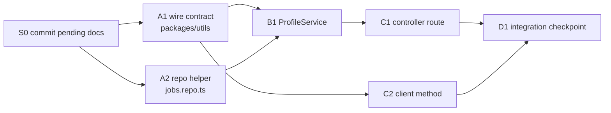

# Plan 013 — User Profile Backend — execution plan

The executable companion to
[`012-user-profile-page.md`](012-user-profile-page.md): it implements that
plan's backend scope (tasks T1–T4) as concrete, independently verifiable
tasks. Spec: [`../spec.md`](../spec.md) §12 "User Profile Page"; user stories
69–74. Frontend work (012's T5–T7) is **out of scope here** — do not build
any of it.

## Overview

- **What ships:** one new read endpoint, `GET /download/profile`, returning a
  per-user identity header plus aggregates computed from the `jobs` table —
  wire contract in `@lilnas/utils`, one new repo helper, a `ProfileService`,
  the controller route with a self-or-admin guard, and a
  `DownloadClient.getProfile()` method. History is **not** rebuilt — the
  profile page will pair this endpoint with the existing `GET /history`.
- **Why:** spec §12 — clicking a user's avatar/name opens their profile;
  this is the data that page renders. All design decisions were settled in
  plan 012 and are restated in [Design decisions](#design-decisions).
- **Shape:** six tasks plus a setup step, executed **serially in wave
  order** by one session in the existing `jeremy/download` worktree —
  see [How to work this plan](#how-to-work-this-plan) and
  [Sequencing](#sequencing). No new branch: plans 001–011 all landed as
  commits directly on `jeremy/download`, and this Nexus worktree
  (`~/.nexus-code/worktrees/lilnas/jeremy-download`) is already isolated
  from the main checkout, so there is nothing further to isolate. Branch
  and Rollout sections are omitted accordingly; nothing here merges or
  pushes anything.



## How to work this plan

**Where:** the existing worktree
`/home/jeremy/.nexus-code/worktrees/lilnas/jeremy-download`, on branch
`jeremy/download`. Never `git checkout`/`switch` this worktree to another
branch; never merge, rebase, or push.

**⚠️ The working tree is not clean, on purpose.** It carries uncommitted
mockup work from other sessions (everything under
`docs/features/download/designs/`, plus `.gitignore`). **Never stage, commit,
revert, or edit those files.** `/commit` stages at line level and defaults to
the current session's own edits, which keeps them out — but check
`git status` output before each commit anyway.

**Before task A1:** run S0 (commit the pending §12 docs) once.

**Per task:**

1. Work tasks in [wave order](#sequencing), serially — this plan is sized for
   one session; do not parallelize commits.
2. Implement → write or update tests → run `pnpm test`, `pnpm run lint`, and
   `pnpm run type-check` in every touched package
   (`apps/download`, `packages/utils`).
3. **`/commit`** — one task, one commit.
4. Check the box here and append the commit hash.

**Markers:** `- [ ]` not started · `- [x] … abc1234` done ·
⚠️ **PARTIAL** (say what's left, inline) · ⏭️ **DROPPED** (say why; never
delete a task row) · 🚧/⏳ blocked — never implement a tagged row.

**When reality disagrees with this plan**, record a short **Findings** note
under the task and update the downstream tasks it invalidates.

## Design decisions

Settled in plan 012 (see its "Design decisions" for the full reasoning);
restated here so no task needs to re-derive them:

1. **Computed view, no `users` table.** All aggregates derive from `jobs`
   requester columns at query time. An email with zero jobs returns an
   **empty profile (200), never 404**.
2. **Self-or-admin access, copied from `getHistory()`**
   (`apps/download/src/download/download.controller.ts:294-353`): no
   `requester` param or a case-insensitive match of the caller's email =
   self, always allowed; anything else requires `resolveIsAdmin()`, else
   `ForbiddenException`. **The 403 is what satisfies the attribution-oracle
   guard** — the endpoint never serves a non-admin another user's numbers.
   If access ever widens, every aggregate must gain `excludeHiddenVideos`
   (see `JobQueryService.listGallery()`); until then, do **not** add it —
   self view deliberately includes the caller's own hidden videos.
3. **Only `jobsPerDay` is windowed** (`?days=`, default 30, max 365 —
   copying `AdminStatsQuerySchema`); totals and first/last timestamps are
   all-time. `windowDays` echoes the applied window.
4. **Sparse aggregates**, never zero-filled — same convention as
   `AdminStatsResponse` (a row that never occurred is absent).
5. **Email is the identity key**; matching is already case-insensitive in
   `buildJobWhere` (`apps/download/src/db/jobs.repo.ts:81-86`) — don't add a
   second lowering in the service.
6. **Reads are not audited** (Phase 8 convention). No `AuditLogService`
   wiring.
7. **Naming refinement vs. 012:** the wire types land as `ProfileQuery` /
   `ProfileResponse` (012 sketched `DownloadProfileResponse`) — matching the
   unprefixed convention of `AdminStatsQuery`/`AdminStatsResponse`/
   `WhoamiResponse` in the same module.

## Shared Context Pack

Pointers to verify against current code — the code is the truth, not this
table.

| What                                 | Where                                                                                                                                                                                                                         |
| ------------------------------------ | ----------------------------------------------------------------------------------------------------------------------------------------------------------------------------------------------------------------------------- |
| Guard pattern to copy                | `getHistory()` — `apps/download/src/download/download.controller.ts:294-353`; controller is `@Controller('/download')` (line 122)                                                                                             |
| Admin resolution                     | private `resolveIsAdmin()` on the controller (line ~145), backed by `AdminCheckService` (`src/auth/admin-check.service.ts`)                                                                                                   |
| Count helpers (reuse, don't rewrite) | `countJobsByType` / `countJobsByStatus` / `countJobsByDay` in `apps/download/src/db/jobs.repo.ts` — all take `(db, JobListFilter)`; `JobListFilter.requesterEmail` + `createdFrom` are the only filter fields this plan needs |
| Facet row types                      | `TypeFacetCount` (jobs.repo.ts:316), `StatusFacetCount` (:367), `DailyJobCount` (:396)                                                                                                                                        |
| Aggregate-service model              | `AdminStatsService` (`apps/download/src/admin/admin-stats.service.ts`) — synchronous, sparse, window built as `createdFrom: new Date(Date.now() - days * MS_PER_DAY)`                                                         |
| Wire schemas                         | `packages/utils/src/download/schema.ts` (`AdminStatsQuerySchema` at :672 is the model; `HistoryQuerySchema` at :335)                                                                                                          |
| Wire types                           | `packages/utils/src/download/types.ts` (`AdminStatsResponse` at ~:420 is the model)                                                                                                                                           |
| Client                               | `packages/utils/src/download/client.ts` — `getStats()` (:472) is the model; requests go `` `/download/...${toQueryString(query)}` ``                                                                                          |
| DTO convention                       | inline `class XQueryDto extends createZodDto(XSchema) {}` at the top of `download.controller.ts` (lines 81–91), used with `new ZodValidationPipe(XQueryDto)`                                                                  |
| DI registration                      | `DownloadModule` providers array (`src/download/download.module.ts`)                                                                                                                                                          |
| DB access                            | `DbService.db` (better-sqlite3 via drizzle) — **synchronous**; don't wrap reads in promises                                                                                                                                   |

**Conventions:**

- Tests live in `__tests__/` beside the source. Suffix is `.test.ts` in
  `src/download/` and `src/admin/`, `.spec.ts` in `src/db/` and in
  `packages/utils`. Controller tests are per-route-group files
  (`download.controller.history.test.ts` is the closest model). Repo tests
  use `src/db/__tests__/test-utils.ts` against a real in-memory DB.
- Commands, run per touched package: `pnpm test`, `pnpm run lint`,
  `pnpm run type-check`. Every written file must pass prettier.
- Gotcha (from `backend.md`): `instanceof Error` is unreliable for
  better-sqlite3 errors under Jest — assert on `error.message`.
- Do not touch: `docs/features/download/designs/**`, `.gitignore`,
  `docs/features/download/backend.md`, plans 001–011, anything in
  `apps/download/src/app/` (the bare Next.js dir).

**Definition of Done** (applies to every task below):

> **Done means:** implemented; tests written or updated following the
> package's existing conventions and passing; lint and type-check clean for
> every touched package; committed with `/commit`. Report back: files
> changed, exported names introduced, test summary, commit hash(es).

## Task List

### Group S — Setup

- [x] **S0. Commit the pending §12 docs.** `7b4c2a0` The spec/stories/plan edits for
      this feature are sitting uncommitted in the worktree. Commit exactly
      these four files as one docs commit (e.g.
      `docs(download): spec §12 user profile page + plans 012/013`):
      `docs/features/download/spec.md`,
      `docs/features/download/user-stories.md`,
      `docs/features/download/plans/012-user-profile-page.md`,
      `docs/features/download/plans/013-user-profile-backend.md`.
      **Nothing else** — the designs/mockup and `.gitignore` changes in the
      tree belong to other sessions. Verify with `git show --stat` after.

### Group A — Contracts & persistence

- [x] **A1. Wire contract in `packages/utils`.** `fedebc7a` Edit
      `packages/utils/src/download/schema.ts` and `types.ts`:

  ```ts
  // schema.ts — next to AdminStatsQuerySchema, same coercion rationale
  export const ProfileQuerySchema = z.object({
    days: z.coerce.number().int().min(1).max(365).default(30),
    requester: z.string().min(1).optional(),
  })

  // types.ts
  export type ProfileQuery = z.infer<typeof ProfileQuerySchema>
  export interface ProfileResponse {
    user: { email: string } // the resolved target, echoed verbatim
    firstDownloadAt: string | null // ISO; null when the user has no jobs
    lastDownloadAt: string | null
    jobsPerDay: Array<{ count: number; day: string; type: DownloadType }>
    totalsByStatus: Array<{ count: number; status: DownloadJobStatus }>
    totalsByType: Array<{ count: number; type: DownloadType }>
    windowDays: number
  }
  ```

  No `totalJobs` field (012's shape; a client can sum `totalsByType`). Match
  the doc-comment style of the neighboring schema/type (say what the route
  is, why `z.coerce`, that aggregates are sparse). Tests in
  `packages/utils/src/download/__tests__/schema.spec.ts`, covering: `days`
  defaults to 30, rejects 0 and 366, coerces `"14"`; `requester` optional,
  rejects empty string.

- [x] **A2. Activity-bounds repo helper.** `cdd593d8` Edit
      `apps/download/src/db/jobs.repo.ts`:

  ```ts
  export interface RequesterActivityBounds {
    firstCreatedAtMs: number | null
    lastCreatedAtMs: number | null
  }
  getRequesterActivityBounds(db, requesterEmail): RequesterActivityBounds
  ```

  One `SELECT min/max(createdAt)` filtered the same case-insensitive way
  `buildJobWhere` does (reuse `buildJobWhere({ requesterEmail })` rather
  than hand-rolling the lowering). Edge case: SQLite returns one row of
  NULLs over an empty set — map that to both fields `null`, not `0`. Tests
  in `apps/download/src/db/__tests__/jobs.repo.spec.ts` (existing file,
  existing `test-utils.ts` DB harness), covering: no jobs → both null;
  bounds correct with multiple jobs; casing of the email doesn't matter;
  other users' jobs don't leak in; hidden videos **are** included.

### Group B — Service

- [x] **B1. `ProfileService`.** `52a4dfa9` Create
      `apps/download/src/download/profile.service.ts` +
      `__tests__/profile.service.test.ts`; register the provider in
      `DownloadModule` (`download.module.ts` providers array — no export
      needed, nothing outside the module consumes it).

  ```ts
  @Injectable()
  export class ProfileService {
    getProfile(params: { email: string; days: number }): ProfileResponse
  }
  ```

  Synchronous (see Context Pack). Model on `AdminStatsService.getStats()`:
  all-time filter `{ requesterEmail }` for `totalsByType`/`totalsByStatus`
  and `getRequesterActivityBounds`; windowed filter
  `{ requesterEmail, createdFrom: new Date(Date.now() - days * MS_PER_DAY) }`
  for `jobsPerDay` only. Convert bounds ms → ISO via
  `new Date(ms).toISOString()`. Echo `email` verbatim into `user.email` and
  `days` into `windowDays`. **No `excludeHiddenVideos` anywhere** — and a
  class-level doc comment saying why, pointing at plan 012's oracle
  reasoning (the 403 in C1 is the guard; widening access changes this).
  Tests cover: scoping (user A's profile never counts user B's jobs), the
  empty profile (nulls + empty arrays, `windowDays` still echoed), window
  applied to `jobsPerDay` only (an old job counts in totals but not in a
  small window), hidden videos included in own totals.

### Group C — HTTP & client

- [ ] **C1. `GET /profile` controller route.** Edit
      `apps/download/src/download/download.controller.ts`: add
      `class ProfileQueryDto extends createZodDto(ProfileQuerySchema) {}`
      beside the others, inject `ProfileService`, and add the handler next
      to `getHistory()` as a deliberate copy of its shape:
      `@Get('/profile')` + `@UseGuards(ForwardedUserGuard)` (401 for no
      identity — same reasoning comment as `/history`); self-scope =
      `!query.requester || query.requester.toLowerCase() === user.email.toLowerCase()`;
      non-self requires `await this.resolveIsAdmin(user)`, else warn-log
      (same log shape as getHistory's, action `getProfile`) and
      `ForbiddenException("Only admins may view another user's profile")`;
      resolved target = caller's email when self, else `query.requester`;
      return `this.profileService.getProfile({ email, days: query.days })`
      with the standard success log (action, duration, scopedTo,
      statusCode). No `projectPage` — the response carries no job objects.
      Tests in `__tests__/download.controller.profile.test.ts`, modeled on
      `download.controller.history.test.ts`, covering: 401 without
      identity; 200 self with no `requester`; 200 self with own email in
      different casing; 403 other-user as non-admin (and that the service
      is never called); 200 other-user as admin; 200 empty profile for an
      unknown email as admin; 400 on `days=0`.

- [x] **C2. `DownloadClient.getProfile()`.** `1a50e6c1` Edit
      `packages/utils/src/download/client.ts`:

  ```ts
  async getProfile(query: Partial<ProfileQuery> = {}): Promise<ProfileResponse>
  // GET `/download/profile${toQueryString(query)}`
  ```

  JSDoc per `getStats()`'s style: self-or-admin server-side, nothing checked
  client-side — a 401/403 arrives as `DownloadApiError`. Tests in
  `__tests__/client.spec.ts` following the existing `getStats` cases (path +
  query-string serialization, error passthrough).

### Group D — Integration

- [ ] **D1. Integration checkpoint.** No new code. Run the full
      `pnpm test`, `pnpm run lint`, `pnpm run type-check` in **both**
      `apps/download` and `packages/utils` at the final commit, plus
      `pnpm run build` for the two packages from the repo root (Turbo
      scopes it). Confirm `git status` shows the designs/mockup files still
      untouched. Then update
      `docs/features/download/plans/012-user-profile-page.md`: check off
      T1–T4 with this plan's commit hashes, and add a one-line Findings
      note under its task list recording the `ProfileResponse` naming
      refinement (design decision 7 here). Commit the doc updates.

## Sequencing

| Wave | Run         | Why it works                                                                                                 |
| ---- | ----------- | ------------------------------------------------------------------------------------------------------------ |
| 0    | S0          | Setup — clean docs commit before code work starts                                                            |
| 1    | A1, then A2 | Independent files (`packages/utils` vs `jobs.repo.ts`); serial only because one session commits between them |
| 2    | B1, then C2 | B1 needs A1's types + A2's helper; C2 needs only A1 — different packages, serial for the same commit reason  |
| 3    | C1          | Needs B1 (service injection) and A1 (DTO schema)                                                             |
| 4    | D1          | Must see every prior commit                                                                                  |

| Task | Depends on | Parallel with (if delegating) |
| ---- | ---------- | ----------------------------- |
| S0   | —          | —                             |
| A1   | S0         | A2                            |
| A2   | S0         | A1                            |
| B1   | A1, A2     | C2                            |
| C2   | A1         | B1                            |
| C1   | A1, B1     | —                             |
| D1   | all        | —                             |

**Critical path:** S0 → A1 → B1 → C1 → D1. A1 leads — both the service and
the client block on the wire types.

### Human checkpoints

Things the executor must **not** do; they stay open in the final report:

1. **Live 401/403/200 verification against a running container** (plan
   012's manual-verification list: no identity → 401; self → 200; other as
   non-admin → 403; other as admin → 200; unknown email as admin → 200
   empty). Needs real forwarded headers and a deployed container — per
   `CLAUDE.md`, deploys run from the root `docker-compose.yml`, and prod
   work happens over `ssh lilnas.io`. Out of executor scope.
2. **Merging/pushing `jeremy/download` anywhere.** Not this plan's call.

## Final report

When the last box is checked, report — in the session, and as a short
**Execution report** section appended to this doc:

1. Per-task outcome with commit hashes.
2. Test/lint/type-check results per package, and the repo-root build result.
3. Deviations from the plan, and why (mirror them as Findings notes inline).
4. The two human checkpoints above, still outstanding.
5. Open questions discovered during implementation.

Then **stop**. No merge, no push, no deploy.
