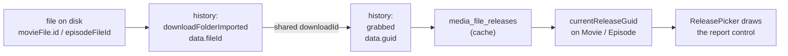
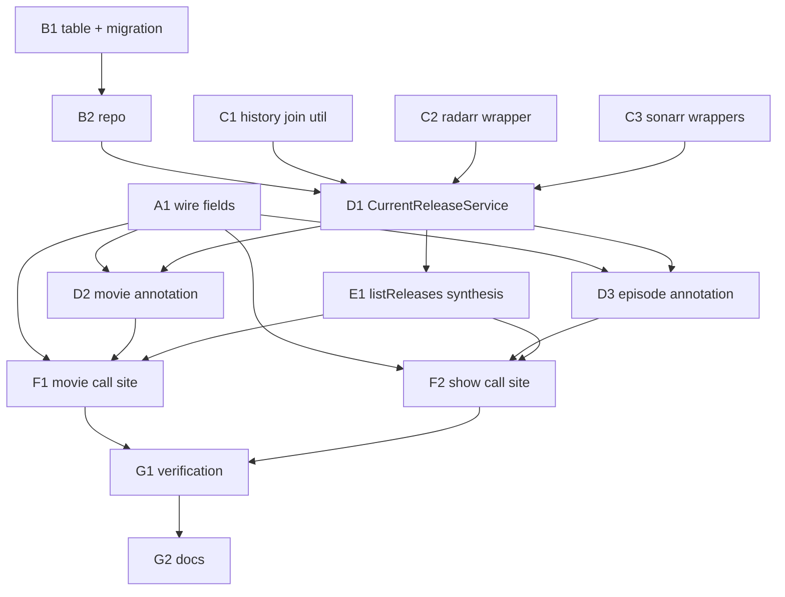

# Make bad-file reporting reachable — `@lilnas/download` backend

## Overview

The 32-task frontend rewrite ([plan 013](./013-frontend-rewrite.md)) shipped a working
bad-file report control that **no user can ever reach**. Two agents building two
different detail pages found the same thing independently: the release picker only
offers the report control on the row matching the release currently on disk, and
**nothing anywhere records which release that is**. The control is correct, wired, and
permanently invisible.

This plan closes that gap in the backend. Radarr and Sonarr both remember the guid of
every release they grabbed — it lives in their history, not on the file record — and
that history can be joined back to a specific file on disk. This plan reads that join,
caches it, and hands the answer to the pages the frontend already built.

| Piece | In one sentence |
| --- | --- |
| **History reconciliation** | Ask Radarr/Sonarr which download produced a given file, then which release that download came from. |
| **A small cache table** | Remember the answer per file so the lookup happens once, not on every page view. |
| **Two new wire fields** | A movie and an episode each report the guid of the release behind their file. |
| **A synthesized release row** | When today's indexer search no longer carries the release you already have, put it in the list anyway so there is something to report. |



**Shape:** one doc, groups A–G, 14 tasks, 8 waves. No phases. Lands directly on
`jeremy/download`, the same branch plan 013 used.

### ⚠️ Two findings that overturned the approach this plan was asked for

Both were found by reading the code and probing the live services, **after** the approach
was chosen and before any of it was written. Stated here rather than buried, because each
one means the obvious version of this fix does not work.

**1. Persisting the guid at grab time is not enough — it is not even the common case.**
This app knows the guid on three of four grab paths, and **the default path is the one
where it doesn't.** A plain `requestMovie`/`requestShow` with no flagged releases hands
the choice to Radarr/Sonarr via `triggerSearch` and never sees a guid; nor does an RSS
grab, a quality upgrade, or anything grabbed from Radarr's or Sonarr's own UI. A
grab-time write would have left the default request path, every upstream-initiated grab,
and **all 283 movies and 74 series already on disk** permanently unflaggable. Upstream
history covers all of them, retroactively. Full breakdown in
[Where the release guid actually lives](#where-the-release-guid-actually-lives).

**2. A correct `currentGuid` alone still renders nothing.** `ReleasePicker` hangs the
report control off a row **present in the live search-results list**
(`release-picker.tsx:387-405`, `:533-541`), and that list is a fresh ~30s indexer search.
**A release grabbed months ago will usually not come back in today's search**, so the row
never exists and the control still never appears. The current release therefore has to be
**synthesized into the list** from the cached row when the indexer does not return it.
Full reasoning in
[The synthesized current release](#the-synthesized-current-release--why-listreleases-needs-it).

**Key decisions:**

- **Upstream history is the source of truth, not a write at grab time** — because this
  app initiates a minority of grabs, and history covers the rest plus everything already
  on disk. Verified at **25/25 movies and 32/32 episodes** against the real library.
- **`BadFile` does **not** get an `episodeId`** — once a guid is recorded per file, the
  existing guid join answers the show-side half of the finding on its own.
- **No changes to the shipped component contracts** — `ReleasePicker`'s
  `currentGuid?: string` and the `badFiles` join on `releaseGuid` both stay exactly as
  they are; the plan makes them resolve instead of reshaping them.
- **Existing library files are backfilled lazily, on first page view** — no migration
  backfill, no one-shot script, and no "old files stay unflaggable" degradation.
- **The two adjacent video-pipeline items stay out, and one of them is more urgent than
  this plan** — the yt-dlp spawn-error wedge is a **production bug with a daily trigger**,
  not the latent dev-only issue it was first triaged as. It stays out because it lives in
  a different file in a different subsystem, **not** because it can wait. See
  [Two adjacent items](#two-adjacent-items-and-why-they-are-not-here).

  See [Design decisions](#design-decisions) for the full reasoning and what was ruled out.

> **Accepted gap:** a file whose grab history was pruned, or that was manually imported
> without ever being grabbed, resolves to no guid. Those titles render exactly as they
> do today — no `current` chip, no report control. The sampled measurement found zero
> such files in the current library, but the code path must degrade quietly rather than
> error.

> **Accepted gap:** a flag still only blocks re-selection *inside this app*. Radarr's and
> Sonarr's own UIs can re-grab a flagged release. That was already the spec's accepted
> gap and this plan does not change it.

**Read next:** [Design decisions](#design-decisions) for the why ·
[Task List](#task-list) for the work itself · [Sequencing](#sequencing) for the order
and the human checkpoint · [Final report](#final-report) for what "done" reports back.

---

## How to work this plan

**Per task:**

1. Work tasks in wave order (see [Sequencing](#sequencing)). Never start a task before
   its dependencies are green.
2. Implement → write or update tests → run, for every touched package:
   `pnpm test`, `pnpm run lint`, `pnpm run type-check`.
3. **`/commit`** — one task, one commit.
4. Check the box below and append the commit hash.

### ⚠️ Committing on a shared branch

**Another session commits on `jeremy/download` concurrently.** Every `/commit` in this
plan must:

```bash
# take the repo mutex first
until mkdir /tmp/lilnas-download-commit.lock 2>/dev/null; do sleep 5; done
# ... commit, staging ONLY this task's own files, pathspec-limited ...
rmdir /tmp/lilnas-download-commit.lock
```

- ✅ Stage only the files your task names. `/commit` stages at line level, which is what
  keeps a stray edit in a shared file from riding along.
- ✅ Use a pathspec-limited `git commit -- <paths>` so nothing outside your task lands.
- ❌ **If any preflight tells you to `git reset`, refuse.** It would destroy another
  session's staged work.
- ❌ Never `git checkout`, `git switch`, rebase, stash, or `git clean` in this repo.
  Production's deploy is wired to this checkout. (`git show <rev>:<path>` is read-only
  and fine.)
- ❌ Do not push.

**Markers:**

| Marker | Means |
| --- | --- |
| `- [ ]` | Not started |
| `- [x]` … `abc1234` | Done, with the commit that did it |
| ⚠️ **PARTIAL** | Landed with scope narrowed — say what was left and why, inline |
| ⏭️ **DROPPED** | Not doing it — say why. Never delete a task |
| 🚧 / ⏳ | Blocked. Do not implement |

**When reality disagrees with this plan,** add a short **Findings** note under the task,
then update the downstream tasks that finding invalidates. Do not let the doc drift from
what actually shipped.

---

## Instructions for the orchestrator agent

You are an **orchestrator**. Your job is delegation, sequencing, and status tracking —
nothing else.

**You are ONE session, and you hold the whole wave.** Sub-agents are spawned **inside**
your session and report back to you. ❌ **Never start one session per task** — sibling
sessions are peers with no reporting relationship, so there is no orchestrator, nobody
holding the wave, and nobody to catch a task that collides with its sibling.

**Do**

- Delegate every task to a sub-agent — implementation, testing, and committing included.
- Write **self-contained** delegation prompts. Copy in the task's full text, the relevant
  parts of the [Shared Context Pack](#shared-context-pack), the
  [Definition of Done](#definition-of-done), and the
  [committing-on-a-shared-branch rules](#-committing-on-a-shared-branch). If a task
  depends on names an earlier task produced, paste that sub-agent's reported outcomes —
  exported names, file paths, column names — into the prompt.
- Respect the sequencing graph. Launch parallel-safe tasks concurrently; never start a
  task before its dependencies report success.
- Re-delegate a failed task with the failure details attached.

**Don't**

- ❌ Read or edit any code yourself. The only file you may edit is _this plan_.
- ❌ Let sub-agents read this plan. Their prompts carry everything they need.
- ❌ Fix a failing task yourself.
- ❌ Edit `docs/features/download/plans/013-frontend-rewrite.md`. It has uncommitted
  edits owned by another session.
- ❌ Let two sub-agents run `/commit` at the same instant. The mutex in
  [How to work this plan](#-committing-on-a-shared-branch) is what serializes them —
  make sure every prompt carries it.

**Finish by** verifying every checkbox is checked, then reporting the
[final status summary](#final-report).

---

## Design decisions

### Where the release guid actually lives

**Chosen: read it out of Radarr's and Sonarr's history, keyed on the upstream file id.**

Verified directly against the live services with read-only `GET`s on 2026-09-16 (no
grab, no delete, no flag, no monitoring change):

- A **`grabbed`** history record carries `data.guid` — the real indexer guid, e.g.
  `https://nzbgeek.info/geekseek.php?guid=163afb8a…` — plus `downloadId`, `data.indexer`,
  `data.size`, `data.protocol`, `data.publishedDate`, `data.releaseGroup`, and (Radarr
  only) `data.indexerId`. `sourceTitle` on the record is the full release name.
- A **`downloadFolderImported`** history record carries **`data.fileId`** — which is
  exactly `movieFile.id` / `episodeFileId` — and the **same `downloadId`**.

So `fileId → import record → downloadId → grabbed record → data.guid` is a complete
round trip, and it works retroactively on files imported long before this plan exists.

**Measured recovery rate on the real library:**

| Service | Sample | Resolved |
| --- | --- | --- |
| Radarr | 25 random movies with files (of 283) | **25 / 25** |
| Sonarr | 32 random episodes across 8 series (of 74 series with files) | **32 / 32** |
| Sonarr | one 45-file series, whole-series join | **45 / 45** imports linked to a grab |

**Ruled out: persisting the guid at grab time.** It is correct as far as it goes, but
this app only knows the guid on three of four paths, and the default path is the one
where it doesn't:

| Path | Guid known? |
| --- | --- |
| `ReleaseService.grabRelease` / `replaceRelease` (`release.service.ts:198`, `:230`) | ✅ the user picked it |
| `requestMovie`/`requestShow` **with flags present** → `pickUnflaggedRelease` (`media-download.service.ts:234`) | ✅ the app picked it |
| `requestMovie`/`requestShow` **with no flags** → `triggerSearch` (`media-download.service.ts:110`, `:166`) | ❌ Radarr/Sonarr pick; the app never sees a guid |
| RSS grabs, quality upgrades, anything grabbed from Radarr's or Sonarr's own UI | ❌ invisible to this app |

A grab-time write would leave the default request path and all 283 movies / 74 series
already on disk permanently unflaggable — and it can go stale (grab A, Radarr upgrades to
B) in a way history cannot.

**Ruled out: reading it off the file record.** `MovieFileResource` and
`EpisodeFileResource` carry `sceneName` and `releaseGroup` but **no guid and no
downloadId** (`packages/media/src/{radarr,sonarr}/types.gen.ts`). The file is not a join
key; only history is.

### One cache call per title, not per file

`GET /api/v3/history/series?seriesId=X` returns a **plain unpaged array** of every record
for the series — measured at 90 records in 0.03s for a 45-file show. So a 53-episode
season list resolves in **one** upstream call, not 53. Radarr's
`GET /api/v3/history/movie?movieId=X` is the same shape for a movie.

The cache table exists so that call happens once per file rather than on every page view.

### `BadFile` does **not** get an `episodeId`

**Decided explicitly, and this reverses what the 013 finding sketched.**

E5's reason for wanting it was that a flag could not be joined back to the episode row
that would display it. Once `Episode.currentReleaseGuid` exists, that join is already
available and already shipped: `ReleaseRow` does
`badFiles.find(entry => entry.releaseGuid === release.guid)`
(`release-picker.tsx:529`), and a guid identifies exactly one release, which belongs to
exactly one episode. An `episodeId` column would be a **second, weaker key for the same
join** — and one that could never be backfilled for flags already in the table, since
nothing recorded the episode when they were written.

`MediaDownloadService.flaggedGuids()` (`media-download.service.ts:216`) filters
series-wide by guid, which stays correct: a guid is episode-specific already.

### No pruning of orphaned cache rows

A row is keyed on `(mediaType, upstreamFileId)`. When a file is deleted or upgraded, the
new file gets a new upstream id, so the old row is simply never read again. Deleting it
would couple this table to `ReleaseService.replaceRelease` and `ShowService.deleteFiles`
for no correctness benefit, on a table that grows by one row per file ever imported.
**Leave orphans in place.**

### Backfill is lazy, on first read

No migration backfill and no warm-up script. The first detail-page view of a title
resolves and caches its guid, which is also exactly what happens for a file imported
tomorrow. One code path, self-healing, no big-bang.

### The synthesized current release — why `listReleases` needs it

`ReleasePicker` renders `BadFileFlag` **only** on a row present in the search-results
list (`release-picker.tsx:387-405`, `:533-541`), and that list comes from a fresh ~30s
indexer search. **A release grabbed months ago usually will not come back in today's
search** — so a correct `currentGuid` alone still leaves nothing to hang the control on.

So `listReleases` guarantees the current release is in the list: if the persisted guid
isn't among the indexer results, it prepends a `Release` synthesized from the cached row.
This is what "marking the current release" means here — not a new field on `Release`, but
a guarantee that the row exists.

**Ruled out: adding `Release.current: boolean`.** The page already knows the guid
(`Movie.currentReleaseGuid`), and `ReleasePicker` already compares `release.guid ===
currentGuid`. A second signal would mean two sources of truth for one chip.

**Ruled out: a report control outside the picker.** It would work, but it is a new
frontend surface, and the whole point of this plan is that the frontend is already right.

### Things that already exist — don't rebuild them

- **Per-file deletion and file-id resolution** already live at
  `apps/download/src/media/episode-files.util.ts:32` (`resolveEpisodeFileIds`) and
  `radarr.service.ts:388` (`getMovieFiles`). Use them.
- **Idempotent insert-or-read-back** is already the house pattern at
  `apps/download/src/db/bad-files.repo.ts:28`. Copy its `onConflictDoNothing` +
  read-back shape for the new repo.
- **Never letting an upstream throw reach the caller** is already how
  `MediaResolverService` behaves (`media-resolver.service.ts:55-66`). The new service
  does the same.
- **Release mapping into the shared wire DTO** already exists at
  `apps/download/src/media/release-mapper.util.ts` (`toCommonRelease`). The synthesized
  release is hand-built, not mapped — but match its field conventions.

### What stays untouched

- `apps/download/src/components/detail/release-picker.tsx`,
  `bad-file-flag.tsx`, `delete-confirm.tsx` — **props and exported names must not
  change.** They ship with 77 tests across three suites. Only their *call sites* move.
- `apps/download/src/app/actions/media-files.ts` — the six server actions are a shipped
  contract. No signature changes.
- `docs/features/download/plans/013-frontend-rewrite.md` — **do not edit.** It has
  uncommitted changes owned by another session.
- `packages/media/src/**` — generated SDK. Everything this plan needs is already
  exported; do not regenerate.

### Two adjacent items, and why they are not here

**1. `H1` — video download progress is never captured** (013 §Follow-ups, line 5733).
`download-video.service.ts:557` pipes yt-dlp's stdout straight to a log file.

**Stays separate.** It shares an app with this plan and nothing else: no Radarr, no
Sonarr, no `bad_files`, no `ReleasePicker`, no media file at all. Its wire change lands
on the **video** branch of `DownloadJob`, a disjoint set of consumers, and folding it in
would roughly double this plan's surface for zero shared code. Track it as plan 015.

**2. ⚠️ The spawn-error wedge — a production robustness bug with a daily trigger.**

> ### ✅ CLOSED 2026-09-16 in `c7eebc62` — everything below is a historical record
>
> Fixed directly, outside this plan, before wave 1 started: *fix(download): settle the
> download promise when a spawn fails*. **The triage below was right that it was
> production-reachable and wrong about nothing except the mechanism** — which was not a
> missing status transition but an unsettled promise. `runProcess()`'s `'error'` listener
> wrote the raw `Error` into a non-objectMode log stream; `write()` **throws** for a
> non-string chunk, the throw escaped the listener as an uncaught exception, `reject()`
> never ran, and no `'close'` follows a thrown-from `'error'` — so the promise never
> settled and `download()`'s `await` hung forever. That is why the scheduler's `Failed`
> write and its `clearProc` never fired: the `catch` was suspended inside that await, not
> broken. See the [G2 amendment](#group-g--verification--docs) for the full trace.
>
> **Consequence for this plan: 015 is H1-only.** Do not carry the wedge forward.

> **This corrects an earlier triage, including one made inside this plan's own brief.**
> It was first recorded as "latent, production is unaffected because its image has the
> binary." **That premise is wrong, and the correction is load-bearing.** The
> authoritative write-up is 013's Wave 9 finding, *"the spawn-error wedge is a SEPARATE
> bug — and it is PRODUCTION-REACHABLE"* (`013-frontend-rewrite.md:1056-1082`).

`download-video.service.ts`'s `proc.on('error')` handler (`:560`) **logs the error, but
the surrounding promise's rejection is never carried through to a status transition** —
so the job keeps whatever status was written before the spawn.

**The invariant that matters is not "the binary exists." It is that the error handler
never transitions state.** Installing yt-dlp into the dev base image
(`infra/base-images/lilnas-dev.Dockerfile`, `b264f355`) removed the **ENOENT trigger
only**. The same handler is still reached by:

- **EACCES** — `/opt/yt-dlp/yt-dlp` loses its exec bit
- **EPERM**
- **ENOMEM** under memory pressure
- ⚠️ **a `YtdlpUpdateService` update that leaves a truncated or non-executable binary
  mid-`move` — which runs on a DAILY CRON, default on, in production.**

**Signature, whichever trigger fires:** the job sticks at `downloading`, and pause and
cancel then **wedge at `pausing`/`cancelling` forever**, because
`download-state.service.ts` holds no process handle to signal or reap. **Three real dev
jobs showed exactly this.**

**Priority: this leads plan 015, ahead of H1.** H1 is a missing feature — the UI draws
progress the backend never captured, and nothing breaks while it is absent. This is a
reachable production failure with a scheduled daily trigger that leaves a job
permanently unkillable. They land in the same plan because they live in the same file,
**not** because they are the same size of problem.

**Still folds into plan 015, not here.** It lives in the same spawn-and-stdout path H1
rewrites, in the same file. Fixing it in 014 would mean two plans editing
`download-video.service.ts` concurrently for unrelated reasons.

**Suggested fix, scoped to `apps/download/src/download/`:** transition the job to
`failed` in the `error` handler, and clear the handle registration so pause/cancel
cannot wedge.

> ⚠️ **A note for whoever executes 015: do not assume the transition is simply absent.**
> `download-scheduler.service.ts:364` *does* write `DownloadJobStatus.Failed`, and `:431`
> *does* call `clearProc`. The observed signature — three wedged dev jobs — is the ground
> truth; the mechanism by which neither of those fires on this path has not been traced
> to a line and **must be, before a fix is written.** Candidate sites are the
> `proc.on('error')` handler at `download-video.service.ts:560`, the `setProc` /
> `await …promise` ordering at `:292-311`, and the scheduler's catch at `:333`.

Task **G2** records both items in a follow-up stub so none of this reasoning is lost.

---

## Shared Context Pack

> Copy the relevant parts into every sub-agent prompt. These are pointers, not gospel —
> verify against current code.

### Repo & conventions

- pnpm workspaces + Turbo monorepo. Two packages are in scope: `@lilnas/download`
  (`apps/download`) and `@lilnas/utils` (`packages/utils`).
- **Lint is two checks**, both run by `pnpm run lint`: `eslint src` **and**
  `prettier -c src`. Both must be clean. `pnpm run lint:fix` fixes both.
- Type-check: `pnpm run type-check` (`tsc --noEmit`). Tests: `pnpm test` (Jest).
- **Tests live in `__tests__/` next to the code they cover.** `apps/download` runs **two
  Jest projects** (`apps/download/jest.config.js`): a `node` project matching `**/*.ts`
  for backend, and a `jsdom` project matching `**/*.tsx` for components. Backend tests in
  this plan are `.ts` and land in the node project automatically.
- **The next free migration is `0001`.** `apps/download/src/db/migrations/` holds only
  `0000_soft_inertia.sql` today (`meta/_journal.json`).
- Commit style, from recent history: `feat(download): …`, `fix(download): …`,
  `docs(download): …` — lowercase, imperative, no trailing period.

### ⛔ Commands that must not be run

| Command | Why |
| --- | --- |
| `pnpm run build` or `pnpm run build:frontend` **in `apps/download`** | Clobbers the `.next` directory held by the running dev container. `pnpm run build:backend` (`nest build`, writes `dist/`) is safe. |
| Anything that grabs, replaces, deletes files, or flags against the real library | Reserved for [human checkpoint](#human-checkpoints). Use mocked clients in tests. |
| `GET /download/media/:id/releases` against the real backend | It writes upstream — it borrows monitoring and puts it back. |
| `git checkout` / `switch` / `rebase` / `stash` / `clean` / `reset` / `push` | See [How to work this plan](#-committing-on-a-shared-branch). |

Read-only upstream `GET`s (`/api/v3/history`, `/api/v3/movie`, `/api/v3/episode`,
`/api/v3/indexer`) are safe and were used to research this plan — but **no task in this
plan needs to make one.** Every test mocks the client.

### Layout

| File | What it is |
| --- | --- |
| `packages/utils/src/download/schema.ts` | The zod wire schemas. `MovieSchema:178`, `ReleaseSchema:392`, `BadFileSchema:472`, `EpisodeSchema:495`. |
| `packages/utils/src/download/types.ts` | `z.infer` re-exports of the above. |
| `apps/download/src/db/schema.ts` | drizzle tables. `badFiles:238` is the closest structural model for the new table. |
| `apps/download/src/db/bad-files.repo.ts` | The repo pattern to copy. |
| `apps/download/src/db/migrations/` | drizzle-kit output. Never hand-written. |
| `apps/download/src/media/radarr.service.ts` | Radarr client wrappers. `getMovieFiles:388`, `getReleases:358`. |
| `apps/download/src/media/sonarr.service.ts` | Sonarr client wrappers. `getEpisodeFiles:660`, `listSeasons:498`, `getReleases:620`. |
| `apps/download/src/media/release.service.ts` | `listReleases:161`, `annotateFlagged:486`, `withMonitoring:538`. |
| `apps/download/src/media/show.service.ts` | `listSeasons` — the episode annotation point. |
| `apps/download/src/media/media.module.ts` | Nest DI registration for everything in `media/`. |
| `apps/download/src/download/download.controller.ts` | `getMediaDetail:424`, `listReleases:494`, `listSeasons:535`. |
| `apps/download/src/components/detail/release-picker.tsx` | ⛔ Read only. `currentGuid` at `:211`, the row match at `:390`, `BadFileFlag` at `:541`. |
| `apps/download/src/components/detail/movie-detail.tsx` | `releaseProps` ~`:337` — where `currentGuid` gets threaded. |
| `apps/download/src/components/detail/show-episode-row.tsx` | The per-episode `ReleasePicker` ~`:227`. |

### Patterns to imitate

**A drizzle table** — `apps/download/src/db/schema.ts:238` (`badFiles`). Explicit
snake_case column names on every column including single-word ones; autoincrement integer
PK; `integer(..., { mode: 'timestamp_ms' }).$defaultFn(() => new Date())` for timestamps;
CHECK constraints expressing the media-id/type invariant.

```ts
export const badFiles = sqliteTable('bad_files', {
  id: integer('id', { mode: 'number' }).primaryKey({ autoIncrement: true }),
  mediaType: text('media_type', { enum: DOWNLOAD_TYPES }).notNull(),
  createdAt: integer('created_at', { mode: 'timestamp_ms' }).$defaultFn(() => new Date()).notNull(),
}, t => [uniqueIndex('…').on(t.mediaId, t.releaseGuid), check('…', sql`…`)])
```

**An idempotent repo write** — `apps/download/src/db/bad-files.repo.ts:28`:

```ts
const inserted = db.insert(table).values({...})
  .onConflictDoNothing({ target: [table.a, table.b] })
  .returning().get()
return inserted ?? getExisting(db, a, b)!
```

**An SDK wrapper** — `apps/download/src/media/radarr.service.ts:358`:

```ts
const x = unwrapSdkResult(await getApiV3Whatever({ client: this.client, query: {…} }), 'actionName')
```

Use `unwrapSdkResult` for reads and `checkSdkError` for writes, both from
`apps/download/src/media/sdk-result.util.ts`.

**A structural subset type over both SDKs** — `apps/download/src/media/queue-status.util.ts:11`
(`PollableQueueItem`). Radarr's and Sonarr's `HistoryResource` are nominally distinct but
field-compatible for what this plan reads; declare one structural interface rather than
branching per client.

### Gotchas

- **`@lilnas/utils` resolves to `dist/`.** Its `exports` map is `"./*": "./dist/*.js"`.
  Jest's `moduleNameMapper` in `apps/download/jest.config.js` short-circuits to source,
  so tests pass without a build — but `tsc --noEmit` in `apps/download` does **not**.
  After touching `packages/utils/src/download/schema.ts`, run
  `pnpm --filter @lilnas/utils build` before type-checking anything downstream.
- **The SDK's `eventType` string union is not positional with the numeric query values.**
  `MovieHistoryEventType` reads `'unknown' | 'grabbed' | 'downloadFolderImported' | …`
  but the wire value for `downloadFolderImported` is **`3`, not `2`**. Filter by the
  **string** `eventType` on the *response* records; do not pass numeric `eventType`
  query params.
- **`HistoryResource.data` values are all strings.** `size: '4419036486'`,
  `protocol: '1'`, `age: '0'`. Parse and drop `NaN`. `protocol` maps positionally to
  `ReleaseProtocolSchema`: `0 → unknown`, `1 → usenet`, `2 → torrent`.
- **Sonarr's grabbed history has no `indexerId`** — only `data.indexer`, the name
  (`'AltHub'`, `'NzbGeek'`). Radarr's has both. Resolve Sonarr's name to an id via
  `getApiV3Indexer` (`IndexerResource.id` / `.name`); verified to match exactly.
- **`MediaResolverService` caches the mapped `Movie` object** (`media-resolver.service.ts:68`,
  60s TTL). **Never mutate a resolved `Media` in place** to add a field — it would poison
  the cache for every other reader. Spread into a new object.
- **`migrate.ts` self-heals migration bookkeeping** (`apps/download/src/db/migrate.ts:38`):
  it marks a migration applied without running it *only* when every table it creates
  already exists. A genuinely new `CREATE TABLE` runs through the real migrator, which is
  what we want — but don't be surprised by the mechanism when reading that file.
- **`episodeFileId: 0` is Sonarr's "no file".** `EpisodeSchema.episodeFileId` is
  `.positive().optional()` and `toEpisode()` omits the zero. Truthiness is the right
  check, not a null guard (`episode-files.util.ts:45`).
- **`seasonNumber` `0` is Sonarr's specials season.** Always `!= null`, never truthiness.
- **`ReleaseSchema.indexerId` is required** (`z.number().int()`). A synthesized release
  for a Sonarr file where the indexer name no longer resolves must still supply one —
  use `0`, which `GrabReleaseInputSchema`'s `.nonnegative()` already treats as legal.

### Definition of Done

Include this **verbatim** in every delegation:

> **Done means:** implemented; tests written or updated following the package's existing
> conventions and passing; lint and type-check clean for every touched package;
> committed with `/commit`. Report back: files changed, exported names introduced, test
> summary, commit hash(es).

**Addendum for every task in this plan:** take the
`/tmp/lilnas-download-commit.lock` mutex before committing and release it after; stage
only your own task's files with a pathspec-limited commit; ❌ never run `pnpm run build`
or `pnpm run build:frontend` in `apps/download`; ❌ never `git reset`, `checkout`,
`switch`, `rebase`, `stash`, `clean`, or `push`; ❌ never call a real Radarr/Sonarr
instance from a test.

---

## Task List

### Group A — Wire contracts

- [x] **A1. Two new optional wire fields.** `Movie` and `Episode` each report the guid of
      the release behind the file on disk. — `baf0e854`

  **Findings:** no edit to `types.ts` was needed — `Movie` and `Episode` are `z.infer`
  re-exports and picked the field up automatically. Two tripwires were added beyond the
  listed cases, mirroring the existing `embyStatus` pattern: `ShowSchema` strips an
  unknown `currentReleaseGuid` at runtime, and a `@ts-expect-error` proves it is not
  assignable to `Show` at compile time. Together they lock in the "`ShowSchema` gets
  nothing" rule. `packages/utils`: 311 tests passing, lint and type-check clean,
  `dist/` rebuilt.

  **Files:** edit `packages/utils/src/download/schema.ts`; edit
  `packages/utils/src/download/__tests__/schema.spec.ts` and
  `packages/utils/src/download/__tests__/types.spec.ts` if they enumerate fields.

  ```ts
  // MovieSchema (:178) and EpisodeSchema (:495) each gain:
  /**
   * The guid of the indexer release that produced the file currently on
   * disk, when this app can recover it. Absent means it could not be —
   * a manually imported file, or history that has since been pruned —
   * and the UI degrades to no `current` chip and no report control.
   */
  currentReleaseGuid: z.string().optional(),
  ```

  **Edge cases:**
  - **Optional, never required.** Every other producer of `Movie` — `/discover`,
    `/movies/search`, the gallery, the resolver's placeholder path — leaves it absent and
    must keep parsing.
  - `ShowSchema` gets **nothing**. A series has no single current release; the guid is
    per-episode.
  - **Do not touch** `ReleaseSchema`, `BadFileSchema`, `FlagBadFileInputSchema`, or
    `GrabReleaseInputSchema`. See
    [`BadFile` does not get an `episodeId`](#badfile-does-not-get-an-episodeid).
  - Finish with `pnpm --filter @lilnas/utils build` — downstream `tsc` reads `dist/`.

  **Tests:** a movie/episode parses with the field present and with it absent; a
  non-string value is rejected; existing fixtures without the field still parse.

### Group B — Persistence

- [x] **B1. The `media_file_releases` table and its migration.** A durable record of
      which release produced which file on disk. — `0a8bff40`

  **Findings:** the migration landed on `0001_absent_outlaw_kid.sql` as predicted — pure
  additive `CREATE TABLE` + two `CREATE INDEX`, no `ALTER`, no data rewrite.

  ⚠️ **A sixth file was unavoidable, and the fix generalises.**
  `apps/download/src/db/__tests__/db.service.spec.ts:70` hard-coded
  `expect(bookkeeping).toHaveLength(1)` — it asserts the migration-bookkeeping row count,
  so **any** new migration fails it. Rather than bumping `1 → 2`, it now derives the count
  from the migrations folder, so the next task to mint a migration does not land there.
  This also confirmed the self-heal described in the gotchas: it records `0000` without
  replaying it and hands `0001` to the real migrator.

  Exported: `mediaFileReleases`, `MediaFileReleaseRow`. Constraint/index names:
  `media_file_releases_type_file_idx`, `media_file_releases_media_id_idx`,
  `media_file_releases_media_id_matches_type`, `media_file_releases_episode_only_for_shows`.
  `apps/download`: 2871 passing / 0 failing, type-check clean.

  **Files:** edit `apps/download/src/db/schema.ts`; generate
  `apps/download/src/db/migrations/0001_*.sql` (+ `meta/`); edit
  `apps/download/src/db/__tests__/schema.spec.ts`.

  ```ts
  export const mediaFileReleases = sqliteTable('media_file_releases', {
    id: integer('id', { mode: 'number' }).primaryKey({ autoIncrement: true }),
    mediaType: text('media_type', { enum: DOWNLOAD_TYPES }).notNull(),
    mediaId: text('media_id').notNull(),          // `tmdb:…` / `tvdb:…`
    upstreamFileId: integer('upstream_file_id').notNull(), // movieFile.id / episodeFileId
    episodeId: integer('episode_id'),             // Sonarr's episode id; NULL for movies
    releaseGuid: text('release_guid').notNull(),
    indexerId: integer('indexer_id'),
    indexer: text('indexer'),
    releaseTitle: text('release_title'),
    downloadId: text('download_id'),              // the link that produced this row
    protocol: text('protocol'),
    publishDate: integer('publish_date', { mode: 'timestamp_ms' }),
    size: integer('size'),
    releaseGroup: text('release_group'),
    resolvedAt: integer('resolved_at', { mode: 'timestamp_ms' })
      .$defaultFn(() => new Date()).notNull(),
  }, t => [
    uniqueIndex('media_file_releases_type_file_idx').on(t.mediaType, t.upstreamFileId),
    index('media_file_releases_media_id_idx').on(t.mediaId),
    check('media_file_releases_media_id_matches_type', sql`…`),   // mirror bad_files'
    check('media_file_releases_episode_only_for_shows',
      sql`(${t.episodeId} IS NULL OR ${t.mediaType} = 'show')`),
  ])
  export type MediaFileReleaseRow = typeof mediaFileReleases.$inferSelect
  ```

  **Edge cases:**
  - **`mediaType` is part of the unique key, not decoration.** Radarr `movieFile.id` 42
    and Sonarr `episodeFileId` 42 are different files.
  - The media-id CHECK mirrors `bad_files_media_id_matches_type` (`schema.ts:286`) —
    `movie → tmdb:%`, `show → tvdb:%`, **no `video` arm**; a video has no indexer release.
  - **Generate the migration with `pnpm run db:generate` from `apps/download`.** Never
    hand-write the SQL or `meta/_journal.json`.
  - This is a pure additive `CREATE TABLE`. It will apply to the production DB on the next
    deploy, which is safe — but say so in the commit message.

  **Tests:** the table is in the drizzle schema with the expected columns; the unique
  index rejects a duplicate `(mediaType, upstreamFileId)`; the CHECKs reject a `tvdb:` id
  on a `movie` row and an `episodeId` on a movie row.

- [x] **B2. The `media_file_releases` repo.** Reads and idempotent writes over the table.
      — `0d2ebb95`

  **Findings:**

  ⚠️ **Drizzle's `onConflictDoUpdate` silently drops `undefined` keys from the `set`
  clause.** A naive `set: { indexer: input.indexer, … }` would make a re-resolve a
  *merge*, not a *replace* — a field the new resolve no longer carries would keep its
  stale value, fusing half the old answer onto half the new one. Since the spec says a
  re-resolve **replaces**, the `set` clause coalesces every optional field with `?? null`,
  pinned by a dedicated test. **Consequence for D1: omitting a field from
  `UpsertMediaFileReleaseInput` CLEARS it — it does not preserve it.**

  `.returning().get()` is typed `T | undefined` even for an upsert that always yields a
  row, so the code uses `.get()!`, matching `videos.repo.ts`'s `upsertVideoByNaturalKey`
  rather than `bad-files.repo.ts`'s read-back fallback (unreachable here, since the update
  arm always returns).

  **`UpsertMediaFileReleaseInput`** — required: `mediaId`, `mediaType`, `releaseGuid`,
  `upstreamFileId`. Optional: `downloadId`, `episodeId`, `indexer`, `indexerId`,
  `protocol`, `publishDate` (a `Date`, not a number — the column is `timestamp_ms`),
  `releaseGroup`, `releaseTitle`, `size`. Keys are alphabetical to satisfy the package's
  key-sort lint rule. 10 new tests; `src/db` 187 passing.

  **Files:** create `apps/download/src/db/media-file-releases.repo.ts` and
  `apps/download/src/db/__tests__/media-file-releases.repo.spec.ts`.

  ```ts
  export interface UpsertMediaFileReleaseInput { /* every column except id/resolvedAt */ }

  /** Idempotent on (mediaType, upstreamFileId). A re-resolve REPLACES the row. */
  export function upsertMediaFileRelease(db: Db, input: UpsertMediaFileReleaseInput): MediaFileReleaseRow

  /** The row for one file, or undefined. The cache-hit read path. */
  export function getMediaFileRelease(db: Db, mediaType: DownloadType, upstreamFileId: number): MediaFileReleaseRow | undefined

  /** Rows for several files in one query — the season-list read path. */
  export function listMediaFileReleasesByFileIds(db: Db, mediaType: DownloadType, upstreamFileIds: readonly number[]): MediaFileReleaseRow[]
  ```

  **Edge cases:**
  - **Upsert, not insert-or-ignore.** Unlike `bad_files` (where the first flagger's
    identity must stick), a re-resolve is a *correction* — use
    `onConflictDoUpdate` on `(mediaType, upstreamFileId)` and refresh `resolvedAt`. Still
    return the row that is actually in the table, never `undefined`.
  - `listMediaFileReleasesByFileIds` with an **empty** array must return `[]` without
    issuing a query — `inArray(col, [])` is a SQL error in some drivers.
  - Batch the read with `inArray`, one query, not one per id.

  **Tests:** insert then read back; a second upsert for the same `(mediaType, fileId)`
  updates rather than duplicating; the same numeric file id under `movie` and `show`
  coexists as two rows; empty-array read returns `[]`; batch read returns only matching
  ids. Follow `apps/download/src/db/__tests__/bad-files.repo.spec.ts` and its
  `test-utils.ts` for the in-memory DB harness.

### Group C — Upstream history access

- [x] **C1. The history→release join, as a pure function.** Turns a title's history
      records into a `fileId → release` map. **No network, no DI, no Nest.** — `e5d48ffb`

  **Findings — behaviour a composing caller (D1) needs:**
  - `protocol` is `undefined` **only** when `data` carries no `protocol` key at all. Any
    *present* value that isn't `1`/`2` — including `0` — maps to `'unknown'`. The mapping
    is taken from `ReleaseProtocolSchema.options` positionally so it cannot drift.
  - `episodeId` is copied off the grabbed record's **top-level** field, `undefined` for
    Radarr. `GrabbedRelease` objects always carry the key, so `toEqual` comparisons must
    include it; `toMatchObject` does not care.
  - **Skipped — no map entry, never an empty-guid entry:** import with no `data.fileId`,
    import with no `downloadId`, import with no surviving `grabbed` partner, and a grab
    whose `data.guid` is missing or `''`.
  - **Newest-wins applies to both** imports (an upgrade reuses the file id) *and* grabs
    sharing a `downloadId` (a retried grab). Undated records sort oldest; ties go to the
    later record in the input list.
  - Only `HistoryRecordLike`, `GrabbedRelease`, `historyValue`, `mapFilesToReleases` are
    exported. Fixtures live at `__tests__/fixtures/release-history.fixtures.ts` and export
    `RADARR_HISTORY` / `SONARR_HISTORY`.

  ⚠️ **Two facts every later task needs:**
  1. **`git commit -- <paths>` alone does not work for new files** — it fails with
     `pathspec … did not match any file(s) known to git` on untracked paths. It needs a
     pathspec-limited `git add -- <paths>` first. That pair still leaves other sessions'
     staged work intact.
  2. **`apps/download` has `noUncheckedIndexedAccess` on.** Destructuring a helper that
     returns `T[]` yields `T | undefined`; return an explicit tuple type instead.

  18 targeted tests; `apps/download` 2871 passing, lint and type-check clean.

  **Files:** create `apps/download/src/media/release-history.util.ts` and
  `apps/download/src/media/__tests__/release-history.util.test.ts`.

  ```ts
  /** Structural subset of Radarr's and Sonarr's HistoryResource. */
  export interface HistoryRecordLike {
    data?: { [key: string]: string | null } | null
    date?: string
    downloadId?: string | null
    episodeId?: number          // Sonarr only
    eventType?: string
    sourceTitle?: string | null
  }

  export interface GrabbedRelease {
    downloadId: string
    episodeId?: number
    guid: string
    indexer?: string
    indexerId?: number
    protocol?: ReleaseProtocol
    publishDate?: string
    releaseGroup?: string
    size?: number
    title: string
  }

  /** Case-insensitive lookup into `data`; '' and null both read as absent. */
  export function historyValue(record: HistoryRecordLike, key: string): string | undefined

  /**
   * One pass: index every `downloadFolderImported` record by `data.fileId`,
   * then join each to the `grabbed` record sharing its `downloadId`.
   */
  export function mapFilesToReleases(records: readonly HistoryRecordLike[]): Map<number, GrabbedRelease>
  ```

  **Edge cases:**
  - **Match `eventType` as a string** (`'grabbed'`, `'downloadFolderImported'`). See the
    numeric-enum gotcha.
  - An import record with **no `data.fileId`** is skipped, not defaulted to 0.
  - An import with **no matching `grabbed` record** (manual import, pruned history) yields
    **no map entry** — not an entry with an empty guid.
  - **Several imports for one `fileId`** → the one with the newest `date` wins. Records
    with no `date` sort oldest.
  - All `data` values are **strings**: parse `size` and `indexerId` as integers and drop
    `NaN`; map `protocol` `'1' → usenet`, `'2' → torrent`, everything else `unknown`.
  - `title` comes from the grabbed record's `sourceTitle`; fall back to the guid if absent.
  - `episodeId` comes off the **grabbed record itself** (Sonarr sets it), not from `data`.

  **Tests:** a full Radarr round trip from realistic fixtures; a full Sonarr one; an
  import with no grab; an import with no `fileId`; duplicate imports resolving to the
  newest; string-number parsing including a malformed `size`; each protocol value;
  case-insensitive `data` keys (`Guid` as well as `guid`); an empty record list returns an
  empty map. Fixtures go in `__tests__/fixtures/` — the node Jest project excludes that
  directory from collection (`jest.config.js`).

- [x] **C2. Radarr history wrapper.** One call returns every history record for a movie.
      — `32200829`

  **Findings:** every assertion in the brief checked out against the SDK.
  `GetApiV3HistoryMovieResponses[200]` is a bare `Array<HistoryResource>` — **unpaged**,
  unlike the queue's `PagingResource`. `MovieHistoryEventType`'s index for
  `downloadFolderImported` is **2 against a wire value of 3**, confirming the
  no-numeric-`eventType` rule; that reasoning is now in the method's doc comment and a
  test comment.

  Radarr's `HistoryResource` is **structurally compatible with C1's `HistoryRecordLike`**,
  so the array feeds `mapFilesToReleases()` directly with no adapter. Signature:
  `async getMovieHistory(radarrId: number): Promise<HistoryResource[]>`, placed between
  `deleteMovieFile` and `requestMovie`. 4 new tests (including one asserting `query` has
  no `eventType` property); `apps/download` 2892 passing across both projects.

  **Files:** edit `apps/download/src/media/radarr.service.ts` and
  `apps/download/src/media/__tests__/radarr.service.test.ts`.

  ```ts
  /** GET /api/v3/history/movie?movieId= — an unpaged array, `data` included. */
  async getMovieHistory(radarrId: number): Promise<HistoryResource[]>
  ```

  **Edge cases:**
  - `getApiV3HistoryMovie` is already exported from `@lilnas/media/radarr`. Do **not**
    regenerate the SDK.
  - **Do not pass an `eventType` query param.** Fetch everything and filter by the string
    `eventType` on the records — the numeric query enum is not positional with the SDK's
    string union.
  - Use `unwrapSdkResult(..., 'getMovieHistory')`, matching every other read wrapper in
    the file.
  - Radarr's grabbed records already carry `data.indexerId`, so **no indexer lookup is
    needed on this side.**

  **Tests:** the wrapper passes `movieId` and returns the records; an SDK error surfaces
  through `unwrapSdkResult` the way the file's existing wrappers do. Mock the client the
  way the existing suite does.

- [x] **C3. Sonarr history + indexer wrappers.** One call for a whole series' history, and
      a name→id map for indexers. — `e231973e`

  **Findings:** `GetApiV3HistorySeriesData.query` *does* expose both
  `eventType?: EpisodeHistoryEventType` and `seasonNumber?: number` — so omitting them is
  a real choice the type system permits, not something the SDK forbids. Hence the comment
  on the wrapper.

  ⚠️ **`IndexerResource.id` and `.name` are BOTH optional** (`number | undefined`,
  `string | null | undefined`). **D1's name→id map must guard both.**

  `getApiV3Indexer`'s options parameter is optional in the SDK, but the wrapper passes
  `{ client: this.client }` explicitly like every other one — omitting it would fall back
  to the SDK's module-level default client rather than the injected one.

  Sonarr's `HistoryResource` is structurally compatible with C1's `HistoryRecordLike`.
  Signatures: `async getSeriesHistory(sonarrId: number): Promise<HistoryResource[]>` and
  `async getIndexers(): Promise<IndexerResource[]>`. `unwrapSdkResult` contexts are
  `'getSeriesHistory'` / `'getIndexers'`. 7 new tests.

  **Wave 2 integration check (orchestrator):** `apps/download` 2892 passing across both
  the `node` and `jsdom` projects, `pnpm run lint` and `pnpm run type-check` clean.

  **Files:** edit `apps/download/src/media/sonarr.service.ts` and
  `apps/download/src/media/__tests__/sonarr.service.test.ts`.

  ```ts
  /** GET /api/v3/history/series?seriesId= — one unpaged array for the WHOLE series. */
  async getSeriesHistory(sonarrId: number): Promise<HistoryResource[]>

  /** GET /api/v3/indexer — Sonarr's grabbed history carries the indexer NAME, not its id. */
  async getIndexers(): Promise<IndexerResource[]>
  ```

  **Edge cases:**
  - **One call for the series, never one per episode.** Measured at 90 records / 0.03s for
    a 45-file show. Do not add a `seasonNumber` narrowing — the whole-series map is what
    the caller wants and it costs the same.
  - `getApiV3HistorySeries` and `getApiV3Indexer` are both already exported from
    `@lilnas/media/sonarr`.
  - Same "no numeric `eventType` query param" rule as C2.
  - `getIndexers` returns the raw resources; **the name→id map and its caching belong to
    D1**, not here. Keep this wrapper thin, like every other in the file.

  **Tests:** each wrapper passes its query and returns the records; SDK errors surface
  through `unwrapSdkResult`.

### Group D — Reconciliation and annotation

- [x] **D1. `CurrentReleaseService`.** Cache-first resolution of "which release produced
      this file", for one movie or a whole series. — `4192bd69`

  **Findings:**

  ⚠️ **Correction to this task's own test list.** "A cache hit makes **zero** upstream
  calls" is literally true only for `forEpisodeFiles`, whose file ids arrive as arguments.
  **`forMovie` must always call `getMovieFiles`** to learn the file id the cache is keyed
  by — so a movie cache hit is zero **history** calls, not zero upstream calls. That is
  what this task's own `forMovie` contract already required; only the test-list wording
  was wrong. Tested as `answers a cached movie without calling history`.

  - Radarr's `MovieFileResource.id` is optional, so `forMovie` takes the first file with a
    non-null `id` and returns `undefined` (no history call) if none has one.
  - The two SDKs' `HistoryResource` types are structurally compatible with
    `HistoryRecordLike` as expected, but are **not mutually assignable to each other**
    (`movieId` vs `seriesId`/`episodeId`, different `eventType` unions). Production code
    needs no adapter; the *test fixtures* are built as `HistoryRecordLike` and widened
    through one-line `asRadarrHistory`/`asSonarrHistory` helpers.
  - The Sonarr indexer map is fetched **lazily** — only when a resolved release actually
    carries an indexer name — and cached 60s (`INDEXER_TTL_MS = 60_000`). A
    `getIndexers()` failure warns and yields an empty map rather than aborting the
    resolve, and is not negative-cached.
  - `forEpisodeFiles` persists **every** file the one history call resolved, but returns
    only the requested ids.
  - Movie rows write `episodeId: undefined` explicitly, so the
    `media_file_releases_episode_only_for_shows` CHECK can never be hit from this path.

  **Injection:** class `CurrentReleaseService`, constructor
  `(dbService: DbService, radarrService: RadarrService, sonarrService: SonarrService)`,
  standard Nest injection by class, no custom tokens. Registered in `media.module.ts`
  `providers` **and** `exports`. 21 new tests; `apps/download` 2913 passing.

  **Files:** create `apps/download/src/media/current-release.service.ts` and
  `apps/download/src/media/__tests__/current-release.service.test.ts`; edit
  `apps/download/src/media/media.module.ts` to register the provider **and export it**.

  ```ts
  /** The persisted row for one movie's file, or undefined. Resolves + caches on a miss. */
  async forMovie(mediaId: string, radarrId: number): Promise<MediaFileReleaseRow | undefined>

  /** episodeFileId -> row, for a whole series. ONE upstream call on a miss, zero on a hit. */
  async forEpisodeFiles(mediaId: string, sonarrId: number, fileIds: readonly number[]): Promise<Map<number, MediaFileReleaseRow>>

  /** Cache-only read, no upstream call — what listReleases synthesizes from. */
  forFile(mediaType: DownloadType, upstreamFileId: number): MediaFileReleaseRow | undefined
  ```

  **Edge cases:**
  - **Never throw.** Any upstream failure logs a warning and yields `undefined` / an empty
    map, so a detail page renders exactly as it does today. Mirrors
    `MediaResolverService`'s stated contract (`media-resolver.service.ts:55-66`).
  - **`forMovie` gets the file id from `radarrService.getMovieFiles(radarrId)`**
    (`radarr.service.ts:388`). No file → `undefined`, and **no history call at all**.
    More than one file → the first with a non-null `id`.
  - **`forEpisodeFiles` reads the cache for every id first** (one batched query) and only
    calls `getSeriesHistory` if at least one is missing. Then it persists **every** row the
    history resolved, not just the missing ones — the call is already paid for.
  - **Ids that history cannot resolve are simply absent from the returned map.** Do not
    write a negative-cache row; the next view retries, which is what makes a
    since-repaired history self-heal.
  - **Sonarr indexer name → id:** build the map from `getIndexers()` and cache it with a
    60s TTL, matching `MediaResolverService.TTL_MS` (`media-resolver.service.ts:68`). An
    unresolvable name stores `indexerId: null`.
  - Radarr rows take `indexerId` straight from `data.indexerId`; no map needed.
  - `episodeId` is persisted from the grabbed record for shows and left `null` for movies.

  **Tests:** a cache hit makes **zero** upstream calls; a miss calls history once and
  persists; a series with 40 episodes and one uncached file still makes exactly **one**
  history call; an upstream throw returns empty and logs rather than propagating; a movie
  with no file never calls history; a Sonarr indexer name resolving and not resolving; the
  indexer map is fetched once across two calls inside the TTL. Use a fake Radarr/Sonarr
  service (see `apps/download/src/media/__tests__/helpers/fake-media-resolver.ts` for the
  house style) and the in-memory DB harness from `src/db/__tests__/test-utils.ts`.

- [x] **D2. Annotate `Movie.currentReleaseGuid` on the detail route.** — `8ed4d571`

  **Findings:**

  **Wiring.** `DownloadController` now injects `CurrentReleaseService` (constructor slot 3,
  after `auditLogService`). The first `Promise.all` is untouched; the former bare
  `await listJobsForMedia(id)` became a second `Promise.all` so the release lookup runs
  *alongside* the job query rather than behind it. New private helper
  `withCurrentRelease(resolved: Media): Promise<Media>`; no new exported names.

  **`currentReleaseGuid` is present iff** all of: route is `GET /media/:id`;
  `isMovie(resolved)`; `resolved.radarrId != null`; and `forMovie()` returned a row. The
  response is then `{ ...resolved, currentReleaseGuid }` — a **copy**, so the ~60s
  `MediaResolverService` cache entry is never written to. **The key is absent** (not
  `undefined`-valued — the helper returns the resolver's object *by identity*, so the
  payload is byte-identical to before) for `tvdb:`/`video:` keys, a movie with no
  `radarrId`, a movie with no file or unresolvable history, and a throw.

  ⚠️ **Scope note: 8 additional test files got DI-only edits** (import +
  `{ provide: CurrentReleaseService, useValue: {} }`), unavoidable once the controller
  gained a constructor dependency — the six other `download.controller.*.test.ts` suites
  plus `media/__tests__/download.controller.file.test.ts` and `…media.test.ts`.

  **Deliberately did not gate on `Movie.filePath`:** `forMovie` already short-circuits a
  fileless movie before the expensive history call, so skipping that gate costs one cheap
  `getMovieFiles` call — while gating on it would wrongly suppress the guid if Radarr ever
  omitted `movieFile` while still reporting `hasFile: true`.

  6 new tests; `apps/download` 2925 passing, lint and type-check clean.

  **Files:** edit `apps/download/src/download/download.controller.ts` (`getMediaDetail`,
  `:424`) and `apps/download/src/download/__tests__/download.controller.detail-fallback.test.ts`
  (or a new sibling suite if that one is about something else).

  **Edge cases:**
  - **Only on `GET /media/:id`, and only for a `tmdb:` key whose resolved media is a
    `Movie` with a `radarrId`.** Never in `/discover`, `/movies/search`, the gallery, or
    any list route — that would be N history calls for one page.
  - **Never mutate the resolved `Media` object.** `MediaResolverService` caches it. Spread
    into a new object: `{ ...resolved, currentReleaseGuid }`.
  - A movie with no file, no `radarrId`, or an unresolvable guid returns the media
    **unchanged**, with the field absent.
  - Keep the existing `Promise.all` shape — add the resolution so it does not serialize
    behind `listJobsForMedia` unnecessarily.
  - `tvdb:` and `video:` keys are untouched here; episodes are D3's job.

  **Tests:** a movie with a resolvable guid gets the field; one without is byte-identical
  to today's response; the cached resolver object is not mutated (resolve twice, assert
  the second read has no field bleed); a `tvdb:` key is unaffected; a throw from the
  service still returns 200.

- [x] **D3. Annotate `Episode.currentReleaseGuid` in the season list.** — `84731701`

  **Findings:**

  ⚠️ **There is no key-sort lint rule — this corrects the Shared Context Pack.**
  `packages/eslint-config-lilnas/base.js` has no `sort-keys` / `typescript-sort-keys` /
  `perfectionist`, and the prettier config has no sorting plugin. **Alphabetical keys are
  a convention here, not an enforced check.** Follow the convention, but do not rely on
  lint to catch key order.

  **Wiring.** `ShowService` gained `CurrentReleaseService` (injected by class, first
  param) plus two private methods, `annotateCurrentReleases` and `resolveCurrentReleases`.
  `listSeasons` flattens **all** seasons into one `fileIds` array filtered with
  `.filter((id): id is number => !!id)`, so `episodeFileId: 0`/absent never reaches the
  resolver. Empty array → **zero** resolver calls; otherwise exactly **one**
  `forEpisodeFiles` call for the whole series. Seasons and episodes are **rebuilt**, never
  mutated. `seasonNumber` is not filtered on at all, so season 0 (specials) is annotated
  like any other.

  **Contract for F2:** `currentReleaseGuid` is present **only** when the episode has a
  truthy `episodeFileId` **and** `forEpisodeFiles` returned a row for it. It is **absent**
  — not `null`, not `''` — in every other case. So treat `undefined` as "no current chip,
  no report control", and assume a present value is a non-empty guid string.

  `media.module.test.ts`'s real-DI test still passes with the new dependency, confirming
  `CurrentReleaseService` is genuinely exported from `MediaModule`. 28 tests in the suite;
  `apps/download` 2925 passing, lint and type-check clean.

  **Files:** edit `apps/download/src/media/show.service.ts` (`listSeasons`) and
  `apps/download/src/media/__tests__/show.service.test.ts`.

  **Edge cases:**
  - The episode file ids come **free** off the seasons Sonarr already returned
    (`Episode.episodeFileId`) — do **not** call `getEpisodeFiles`.
  - **`episodeFileId: 0` / absent means no file.** Filter those out before asking
    `forEpisodeFiles`; truthiness is the right check (`episode-files.util.ts:45`).
  - All seasons resolve from **one** `forEpisodeFiles` call across the whole series, not
    one per season.
  - An episode whose guid does not resolve keeps the field absent and renders as today.
  - Rebuild the season/episode objects rather than mutating Sonarr's mapped output.

  **Tests:** episodes with files get guids and those without do not; a 3-season series
  triggers exactly one resolution call; an episode with `episodeFileId` absent is not
  passed to the resolver; a service failure leaves every episode unannotated and the
  listing succeeds.

### Group E — The release list

- [x] **E1. `listReleases` guarantees the current release is in the list.** — `b3d23a3f`

  **Findings:**

  ⚠️ **`protocol` needed a narrowing this task did not anticipate.**
  `mediaFileReleases.protocol` is a plain `text` column typed `string | null`, but
  `ReleaseSchema.protocol` is the three-value `ReleaseProtocolSchema` enum — so a bare
  `row.protocol ?? undefined` **does not type-check**. It now runs through
  `ReleaseProtocolSchema.safeParse` and drops anything unrecognised.

  ⚠️ **Pre-existing tests needed a new provider, not just new tests.** Adding the
  constructor dependency breaks `Test.createTestingModule` for *every* existing
  `ReleaseService` test until a `CurrentReleaseService` mock is registered. One was added
  defaulting to `forMovie → undefined` / `forEpisodeFiles → new Map()`, preserving every
  prior assertion unchanged.

  **Synthesized (prepended at index 0) only when all of:** the target resolves to a row
  (movie → `forMovie`; show + `scope.episodeId` → `resolveEpisodeFileIds` yielded a truthy
  `episodeFileId` **and** `forEpisodeFiles` had a row), **and** no indexer release already
  carries that guid. **Never** synthesized for a season- or series-scoped show
  (`getEpisodes` is not even called), `episodeFileId: 0`/absent, a movie with no file, an
  empty resolve, or a throw (warned and swallowed; the indexer's releases still return).

  **The synthesized row** omits `quality` entirely, along with `age`,
  `customFormatScore`, `languages`, `leechers`, `rejections`, `seeders`.
  `publishDate` is `row.publishDate?.toISOString()`. **F1/F2 should expect
  `indexerId: 0` and no `quality` to be common**, making `ReleaseRow`'s
  `[quality, size] || title` fallback the render path. `downloadAllowed: true` /
  `rejected: false` are documented in-file so the next reader does not "fix" them.

  9 new tests; node project 1679 passing, lint and type-check clean.

  **Files:** edit `apps/download/src/media/release.service.ts` and
  `apps/download/src/media/__tests__/release.service.test.ts`.

  ```ts
  // In listReleases, INSIDE the withMonitoring borrow (the upstream id is
  // already resolved there), then synthesize BEFORE annotateFlagged so the
  // synthesized row gets its `flaggedBad` for free:
  //   movie                    -> currentReleaseService.forMovie(mediaId, upstreamId)
  //   show + scope.episodeId   -> that episode's episodeFileId -> forEpisodeFiles
  //   show + season/series     -> skip entirely; there is no single current file
  ```

  The synthesized `Release`, built from the cached row:

  ```ts
  {
    downloadAllowed: true,   // NOT false — see the edge case below
    flaggedBad: false,       // annotateFlagged fills this in
    guid: row.releaseGuid,
    indexer: row.indexer ?? undefined,
    indexerId: row.indexerId ?? 0,
    protocol, publishDate, releaseGroup, size,   // all from the row, all optional
    rejected: false,
    title: row.releaseTitle ?? row.releaseGuid,
  }
  ```

  **Edge cases:**
  - **Dedupe on guid.** If the indexer already returned the current release, change
    nothing. Only prepend when it is absent.
  - **`downloadAllowed: true` and `rejected: false` are deliberate.** `ReleaseRow`
    computes `blocked` from those two (`release-picker.tsx:522-528`) and applies a
    blocked style to the whole row. The current row never offers a grab — it offers the
    report control — so marking it blocked would only make a perfectly good row look
    broken. If the guid *is* flagged, `annotateFlagged` sets `flaggedBad` and the row
    blocks correctly for the right reason.
  - **No `quality`.** History does not carry a `QualityModel`. `ReleaseRow` falls back to
    `release.title` when quality and size are both absent, which is the honest render.
  - **Prepend, not append.** The current release is the row the user came for.
  - Getting the episode's `episodeFileId` for a `scope.episodeId` costs one
    `sonarrService.getEpisodes(sonarrId, { seasonNumber })` call — the same lookup
    `resolveEpisodeFileIds` already does (`episode-files.util.ts:36`). Reuse that helper
    rather than writing a second one.
  - **Resolution failure is never fatal to the listing.** The releases the indexer did
    return are still the answer.
  - `grabRelease` / `replaceRelease` / `flagBadFile` / `unflagBadFile` are **untouched**.

  **Tests:** a current release the indexer also returned appears exactly once, not twice;
  a current release the indexer did not return is prepended with the right guid, title,
  size and indexer; a current release that is flagged comes back `flaggedBad: true`; a
  season-scoped listing synthesizes nothing; a movie with no file synthesizes nothing; a
  resolution failure still returns the indexer's releases. Every test mocks the clients.

### Group F — Frontend call sites

> These are **call-site** changes only. `release-picker.tsx`, `bad-file-flag.tsx` and
> `delete-confirm.tsx` must not be modified — their props and exports are a shipped
> contract with 77 tests behind them.

- [x] **F1. Thread `currentGuid` into the movie detail page.** — `e65732e9`, plus
      `994ef837` (orchestrator-requested follow-up: pin the replace verb)

  **Findings:**

  ⚠️ **The old no-guid test was vacuous.** It passed `[ALTERNATIVE]` only, so "no report
  control" was true for a reason unrelated to the guid. It now feeds
  `[CURRENT, ALTERNATIVE]` so the absence is a real negative.

  ⚠️ **F1 and F2 initially diverged on the no-guid invariant** — F1 asserted the chip and
  the control, F2 asserted the verb. Since the plan pairs these two precisely so that
  cannot happen, F1 was sent back to add the verb assertion. It is now **mutation-verified**:
  temporarily setting `hasFile: undefined` in `movie-detail.tsx` fails both the new test
  and `makes every pick a replace while a file is on disk`. `RELEASE_REPLACE_LABEL` /
  `RELEASE_GRAB_LABEL` are shared constants and both components render the same
  `ReleaseRow`, so the two suites express the invariant identically.

  ⚠️ **The dual-picker duplication does NOT apply to row controls.** `MovieDetail` draws a
  picker per layout (stacked + inline), and pre-search elements like
  `RELEASE_SEARCH_LABEL` genuinely do appear **twice** — which is why `firstButton`
  exists. But **each `ReleasePicker` holds its own `searched` state**, so clicking only
  the desktop trigger leaves the mobile copy in its `SearchPrompt` state and row controls
  appear **once**. An initial `releases.length * 2` assertion failed with
  `Expected 4, Received 2`. See `movie-detail.tsx:399-407`.

  `app/movies/[tmdbId]/page.tsx` needed **no change** — verified, not assumed:
  `getMedia()` is a bare `response.json()` with no Zod parse or field stripping
  (`client.ts:246-252`), so the field rides through untouched.

  **The stale `:260` comment was rewritten, not deleted** — it had claimed "Nothing on the
  wire records which release produced the file on disk", which this plan made false.

  56 tests in the suite (was 51); the three untouched contract suites re-ran green —
  `release-picker` + `bad-file-flag` + `delete-confirm` + `movie-detail` = **133 passing,
  0 failed**. Lint and type-check clean.

  **Files:** edit `apps/download/src/components/detail/movie-detail.tsx` and its
  `__tests__/` suite. `apps/download/src/app/movies/[tmdbId]/page.tsx` likely needs no
  change — `movie` already flows down — verify rather than assume.

  **Edge cases:**
  - `releaseProps` (~`movie-detail.tsx:337`) gains `currentGuid: movie.currentReleaseGuid`.
  - **Keep `hasFile` explicit.** It currently defaults off `currentGuid` inside the
    picker; the page passes it deliberately and the comment explaining why should be
    updated, not deleted.
  - **Rewrite the stale doc comment at `movie-detail.tsx:260`** ("No `currentGuid`.
    Nothing on the wire records which release produced the file on disk…"). Leaving it
    would make the file lie about itself.
  - A movie with no `currentReleaseGuid` passes `undefined` and behaves exactly as today.

  **Tests** (jsdom project, `.tsx`): with a guid, the matching release row shows the
  `current` chip and the report control; with the same guid flagged, the row shows the
  reported state; without a guid, no row is current and no report control renders — the
  test that pins today's behaviour should be **updated to describe the no-guid case
  specifically**, not deleted.

- [x] **F2. Thread `currentGuid` into the show episode rows.** — `6e7eda88`

  **Findings:**

  ⚠️ **The no-guid assertion with teeth is the VERB, not the chip.** With `hasFile` passed
  explicitly and the guid absent, `ReleasePicker`'s
  `replacing = hasFile ?? currentGuid !== undefined` still resolves `true`, so *every* row
  renders `Replace with this` — including the synthesized current-release row, which stops
  being special-cased and becomes just another pickable row. **A test asserting only the
  chip's absence would still pass if `hasFile` regressed to being derived from the guid.**
  The assertion set used here is: no `current` chip, no `Report a problem`, **and** all N
  rows are replaces.

  `show-seasons.tsx` needed **no change** — verified, not assumed: `:250-267` spreads the
  whole `Episode` through as `episode={episode}` and destructures nothing, so
  `currentReleaseGuid` already arrives untouched.

  ⚠️ **Pre-existing flake for G1 to expect:**
  `src/components/shell/__tests__/nav-search.spec.tsx:315` fails under full-suite load but
  passes 23/23 in isolation. Untouched by this work.

  4 new tests (20/20 in the suite); lint and type-check clean.

  **Files:** edit `apps/download/src/components/detail/show-episode-row.tsx` and its
  `__tests__/` suite. Check whether `show-seasons.tsx` needs to pass anything new — the
  whole `Episode` already flows, so probably not.

  **Edge cases:**
  - The per-episode `ReleasePicker` (~`show-episode-row.tsx:229`) gains
    `currentGuid={episode.currentReleaseGuid}`.
  - **Leave `hasFile={episode.hasFile}` as it is.** It is already explicit and already
    correct.
  - An episode with a file but no resolvable guid renders exactly as today.
  - The picker still only searches on its own explicit trigger — **nothing here may cause
    a release search on mount or on expand.**

  **Tests** (jsdom project): an episode with a guid gets a current row with the report
  control once releases are loaded; an episode without one does not; expanding a drawer
  still issues no search.

### Group G — Verification & docs

- [x] **G1. Full verification.** From the repo root: `pnpm run lint`,
      `pnpm run type-check`, `pnpm test`. Then from `apps/download`:
      `pnpm run build:backend`. — no commit; nothing was changed

  **Results:**

  | Command | Result |
  | --- | --- |
  | root `pnpm run lint` | ⚠️ **14/15 tasks pass.** Fails only on `//#mockups:lint` — **pre-existing, out of scope** (see below). |
  | root `pnpm run type-check` | ✅ **12/12 tasks**, FULL TURBO. |
  | root `pnpm test` | ⚠️ `@lilnas/equations` and `@lilnas/tdr-code` fail — **pre-existing, unrelated** (see below). Turbo aborted before `apps/download`, so it was run separately. |
  | `apps/download` `pnpm test` | ✅ **2942 passed / 9 skipped, 0 failed**, 145 suites, **both projects** (`Ran all test suites in 2 projects`). |
  | `packages/utils` | ✅ 311 passed. `@lilnas/tdr-bot` ✅ 1129 passed. |
  | `apps/download` `pnpm run build:backend` | ✅ **TSC found 0 issues**, 185 files compiled with swc. |

  ⚠️ **Two pre-existing failures, both proven out of scope — neither is caused by this
  plan and neither was repaired (a checkpoint that needs a silent fix is not a clean
  checkpoint).**

  1. **`//#mockups:lint`** — prettier is unclean on
     `docs/features/download/designs/src/data/show-detail.mjs`. Last committed in
     `3dd56560`, an **ancestor of every commit in this plan**; clean in the worktree; and
     `git log baf0e854~1..HEAD -- docs/features/download/designs/` is **empty**. (Likely
     fallout from the recent fix to a broad `data/` gitignore rule that had been silently
     untracking `designs/src/data/*.mjs` — the file was never prettier-formatted because
     it was invisible to lint.)
  2. **`@lilnas/equations` (7 tests) and `@lilnas/tdr-code` (1 suite)** — the equations
     failures are all in `validateLatexSafety › Long Line Detection`. **Neither package
     imports `@lilnas/utils/download`**, so this plan's only cross-package change (adding
     an optional field to two download schemas) cannot reach them.

  **This plan's 13 commits touch only `apps/download/**` and
  `packages/utils/src/download/**`** — verified with `git log --name-only`.

  The known `nav-search.spec.tsx:315` flake **did not fire** this run.
  `pnpm --filter @lilnas/utils build` did **not** need re-running — `dist/` was current.
  `pnpm run build` / `build:frontend` were **not** run in `apps/download`.

  ⚠️ **Deviation:** G1 was delegated twice and both sub-agents were killed by process
  exits before reporting (neither changed anything; the mutex was verified un-orphaned
  both times). The orchestrator then ran the four commands directly. Verification runs no
  code changes, so this does not breach the delegate-don't-implement rule, but it is
  recorded as a departure from the execution protocol.

  **Edge cases:**
  - ⛔ **Do not run `pnpm run build` or `pnpm run build:frontend` in `apps/download`** —
    it clobbers the `.next` held by the running dev container. `build:backend`
    (`nest build`, writes `dist/`) is the only build this plan runs there.
  - `pnpm --filter @lilnas/utils build` must have happened (A1) or downstream
    `type-check` resolves stale `dist/` types.
  - Both Jest projects must report — `node` **and** `jsdom`. A run that only shows one is
    a misconfiguration, not a pass.
  - This task sees every prior commit. It is the integration checkpoint.

- [x] **G2. Docs and the follow-up stub.** Record what shipped and where the remaining
      adjacent item went. — `20b0fbe0` (the 015 stub) + the commit carrying this doc

  **Findings:**

  ⚠️ **`download-video.service.ts:557` is now `:571`.** The spawn-wedge fix (`c7eebc62`)
  inserted lines above it, so **every reference to `:557` in plans 013 and 014 is now off
  by 14** — including this plan's own
  [Two adjacent items](#two-adjacent-items-and-why-they-are-not-here) section and 013's
  H1. The code itself is unchanged. The 015 stub cites `:571` as current and footnotes the
  drift. **013 could not be corrected — see the final report.**

  Bare filenames also resolved while verifying: the services live under
  `apps/download/src/download/` (not `src/services/`), `ytdlp-update.service.ts` is under
  `apps/download/src/ytdlp-update/`, and the already-built frontend seams are at
  `components/detail/job-state.ts:177`, `components/detail/job-lifecycle.tsx:86`, and
  `components/activity/activity-rows.ts:161`.

  ⚠️ **Deviation: G2 was split.** This plan tells G2 to edit *this* doc while also
  forbidding sub-agents from reading it — contradictory for this one task. Resolved by
  keeping this doc with the orchestrator (the one file it is permitted to edit, and which
  it maintained every wave) and giving the sub-agent a fully self-contained brief for the
  015 stub, including H1's four-step sketch verbatim so it never needed to open 013. Two
  commits rather than one, each staging only what its author owns.

  **Files:** edit **this** doc (outcomes, commit refs, deviations); create
  `docs/features/download/plans/015-video-download-progress.md` as a short stub.

  > ### ⚠️ AMENDED 2026-09-16 — the spawn-error wedge was fixed directly, so 015 is
  > ### H1-only
  >
  > **This supersedes the original G2 text, which told you to carry the wedge into the
  > 015 stub as its leading item.** The wedge was fixed outside this plan, before wave 1
  > started, in commit **`c7eebc62`** — *fix(download): settle the download promise when a
  > spawn fails*. It is **closed, not deferred.** The
  > [Two adjacent items](#two-adjacent-items-and-why-they-are-not-here) section above is
  > now a historical record of the triage, not a live handoff; leave it in place and do
  > not rewrite it.
  >
  > **The traced mechanism** — which the original note correctly insisted must be found
  > before a fix was written, and which turned out **not** to be a missing transition:
  >
  > `runProcess()`'s `proc.on('error')` listener wrote the **raw `Error` object** into the
  > job's log stream. That stream is not in object mode, so `write()` **throws**
  > `ERR_INVALID_ARG_TYPE` for a non-string chunk rather than emitting. The throw escaped
  > the listener — out through `emit()`, out of the `process.nextTick()` node schedules
  > for a failed spawn — as an **uncaught exception**. `reject()` on the next line never
  > ran, and node emits no `'close'` after an `'error'` listener threw, so nothing settled
  > the promise **at all**.
  >
  > That answers both open questions in the original note:
  > - `download-scheduler.service.ts:364` never wrote `Failed` because the scheduler's
  >   `catch` was still **suspended inside `await download()`** — the promise never
  >   settled, so `download()` neither returned nor threw. The catch was unreachable, not
  >   wrong.
  > - `:431`'s `clearProc` never fired because it sits on the pause branch, reached only
  >   via `JobInterruptedError` from `assertNotInterrupted()` — downstream of the same
  >   dead await.
  >
  > Serialising the error was the whole fix: `updateJob()` already releases the proc
  > handle and the interrupt note on every terminal transition, so settling the promise
  > repaired the rest of the chain on its own.
  >
  > **What G2 must do instead:**
  > 1. Write the 015 stub as **H1-only**. Drop the wedge from its contents entirely — it
  >    is not an open item.
  > 2. Add a short **"Already fixed"** note to the stub recording that the wedge was
  >    closed directly in `c7eebc62`, with the traced mechanism summarised above, so a
  >    future reader who finds the 013 or 014 triage does not re-open it.
  > 3. Keep the `/opt/yt-dlp` + symlink constraint below — it is still load-bearing for
  >    H1's work.

  The 015 stub carries, and nothing more:

  - `H1` from plan 013 — yt-dlp progress is piped to a log file at
    `download-video.service.ts:557` and never parsed, so no video job has progress. Copy
    013's four-step sketch verbatim rather than re-deriving it.
  - The short **"Already fixed"** note for the spawn-error wedge described in the
    amendment above: closed in `c7eebc62`, with the traced mechanism, and explicitly
    **not** an open item for 015.
  - ⚠️ **The `/opt/yt-dlp` + symlink constraint is load-bearing** and 015 will be working
    directly on top of it: `ytdlp-update.service.ts` hardcodes
    `YTDLP_BINARY_PATH = '/opt/yt-dlp/yt-dlp'` while `download-video.service.ts` spawns
    `/usr/bin/yt-dlp`, so the symlink must stay. See `013-frontend-rewrite.md:1022-1039`.

  ⛔ **Do not edit `013-frontend-rewrite.md`.** It has uncommitted changes owned by
  another session. If 013 needs a cross-reference, say so in the
  [final report](#final-report) and let a human add it.

---

## Sequencing



### Waves

| Wave | Run | Why it works |
| --- | --- | --- |
| 1 | **A1 ∥ B1 ∥ C1** | Three disjoint surfaces: a different package (`packages/utils`), the drizzle schema + migration, and a brand-new pure-function file with no imports from either. |
| 2 | **B2 ∥ C2 ∥ C3** | New repo file, `radarr.service.ts`, `sonarr.service.ts` — three separate files and three separate specs. |
| 3 | **D1** | The convergence point. Everything in waves 1–2 exists to be composed here, so it runs alone. |
| 4 | **D2 ∥ D3** | `download.controller.ts` vs `show.service.ts` — disjoint files, and D1's service is already registered and exported. |
| 5 | **E1** | Alone: it is the only task touching `release.service.ts`, and it needs D1 plus the file-id helper D3 exercises. |
| 6 | **F1 ∥ F2** | Two different components, two different jsdom suites. **Paired deliberately:** both consume `currentReleaseGuid` and must agree on the no-guid render, so one agent's choice cannot silently diverge from the other's — brief them with the same edge-case list. |
| 7 | **G1** | Integration checkpoint. Must see every prior commit. |
| 8 | **G2** | Documentation, after the outcome is known. |

> ⚠️ **Every wave, not just one: `/commit` is serialized by the
> `/tmp/lilnas-download-commit.lock` mutex.** Another session commits on
> `jeremy/download` concurrently. Parallel *implementation* is safe; parallel *committing*
> is not. Two sub-agents in the same wave must not hold the lock at once, and each must
> stage only its own files with a pathspec-limited commit.

> ⚠️ **Wave 1's B1 mints migration `0001`.** If anything else in the repo generates a
> drizzle migration for `apps/download` before B1 commits, the numbers collide. B1 is the
> only task in this plan that touches `src/db/migrations/`.

### Dependency table

| Task | Depends on | Parallel with |
| --- | --- | --- |
| A1 | — | B1, C1 |
| B1 | — | A1, C1 |
| C1 | — | A1, B1 |
| B2 | B1 | C2, C3 |
| C2 | C1 | B2, C3 |
| C3 | C1 | B2, C2 |
| D1 | B2, C1, C2, C3 | — |
| D2 | A1, D1 | D3 |
| D3 | A1, D1 | D2 |
| E1 | D1 | — |
| F1 | A1, D2, E1 | F2 |
| F2 | A1, D3, E1 | F1 |
| G1 | F1, F2 | — |
| G2 | G1 | — |

### Critical path

**B1 → B2 → D1 → D2 → F1 → G1 → G2**

**B1 leads and should not slip.** It is the only task that mints a migration number, and
everything in Group D is blocked until the repo it feeds exists. C1 is the other thing
worth starting immediately — it is pure, testable in isolation, and D1 cannot be written
against a join that has not been specified.

### Human checkpoints

1. **After G1, before anything is called finished — exercise the flag flow against the
   real library.** This is the outstanding half of
   [plan 013's human checkpoint 2](./013-frontend-rewrite.md#human-checkpoints), and
   **this plan is what unblocks it.** Open a movie detail page and a show detail page for
   titles that already have files, run a release search, and confirm:
   - the release on disk shows the `current` chip,
   - the report control appears on it,
   - reporting it succeeds and the row flips to the reported state,
   - undoing the report works,
   - a subsequent request for that title does not re-pick the flagged release.

   **No agent may perform this.** It mutates real library state and real `bad_files` rows.

2. **Also outstanding from plan 013, and untouched by this plan** — grab, replace, and
   delete-files against the real library. Those three were already reachable; they still
   need a human run.

3. **The production deploy applies migration `0001` at boot.** It is a pure additive
   `CREATE TABLE`, but a human owns the deploy decision and should know a migration is in
   the change.

---

## Outcome — all 14 tasks complete, 2026-09-16

| Wave | Task | Commit |
| --- | --- | --- |
| 1 | A1 wire fields | `baf0e854` |
| 1 | B1 table + migration `0001_absent_outlaw_kid.sql` | `0a8bff40` |
| 1 | C1 history→release join | `e5d48ffb` |
| 2 | B2 repo | `0d2ebb95` |
| 2 | C2 Radarr history wrapper | `32200829` |
| 2 | C3 Sonarr history + indexer wrappers | `e231973e` |
| 3 | D1 `CurrentReleaseService` | `4192bd69` |
| 4 | D2 movie detail annotation | `8ed4d571` |
| 4 | D3 episode season annotation | `84731701` |
| 5 | E1 `listReleases` synthesis | `b3d23a3f` |
| 6 | F1 movie call site | `e65732e9` + `994ef837` |
| 6 | F2 show episode call site | `6e7eda88` |
| 7 | G1 verification | *(no commit — nothing changed)* |
| 8 | G2 the 015 stub | `20b0fbe0` |

**Fixed outside this plan, before wave 1:** the yt-dlp spawn-error wedge — `c7eebc62`.

**Final state:** `apps/download` **2942 tests passing / 0 failing** across both Jest
projects; `packages/utils` **311 passing**; `build:backend` **TSC 0 issues**. Two
pre-existing failures elsewhere in the repo (`//#mockups:lint` prettier, and
`@lilnas/equations` + `@lilnas/tdr-code` tests) were proven out of scope and deliberately
left unrepaired — see [G1](#group-g--verification--docs).

⚠️ **Every human checkpoint below is still outstanding. None was performed — no agent may.**

---

## Final report

When every box is checked, report:

1. **Per-task outcome** — status, files changed, exported names, commit hashes
2. **Test results** — `apps/download` (both the `node` and `jsdom` projects, separately),
   `packages/utils`, plus the repo-wide sweep
3. **Deviations** from this plan, and why
4. **Deferred** — every [human checkpoint](#human-checkpoints) still outstanding, stated
   explicitly, including whether the flag flow has actually been exercised. ⚠️ **AMENDED
   2026-09-16:** this bullet originally required reporting that the spawn-error wedge was
   still open. **It is not — it was fixed directly in `c7eebc62` before wave 1 started.**
   Report it as **closed**, with its commit and traced mechanism (see the
   [G2 amendment](#group-g--verification--docs)), and report plan 015 as **H1-only**.
5. **Open questions** discovered during implementation — in particular, any title found
   in the wild whose guid does not resolve, since the sampled measurement found none
6. **Anything that wanted a cross-reference in `013-frontend-rewrite.md`** — that file
   could not be edited, so name what a human should add to it
