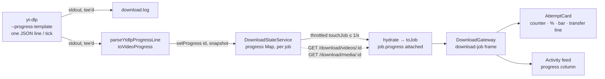
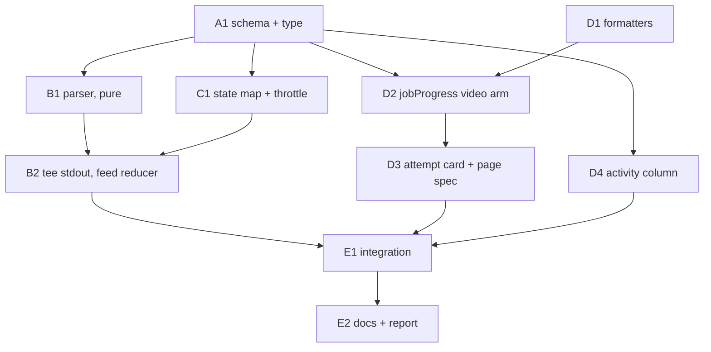

# A video download shows its own progress: bytes, speed, ETA and fragments from yt-dlp, live on the page — `apps/download`

## Overview

> Written for a human first. Everything below this section is written for whoever
> executes the plan. If a claim here needs more, it links to where the detail lives.

A movie or show in flight draws a real progress bar, because Radarr's and Sonarr's
queues report one and the poller reads it every second. A **video** — a yt-dlp job,
the only download this app runs itself — draws nothing but its status word. The
mockup for the video page shows `fragment 4 of 9`, a `64%` bar and
`412 MB / 640 MB · 3.1 MB/s · ~2m left`; plan 013 left every one of those unrendered,
because nothing on the wire carried them and a `0%` bar would have been a claim.

The gap is not a missing field. **The backend never captures the progress at all.**
yt-dlp prints it on stdout, and the download step pipes stdout straight into a log
file and never reads it. This plan reads it: yt-dlp is asked to print one JSON line
per tick, the download step parses each line into a small snapshot, the state service
keeps the latest one per job for the life of the process and re-broadcasts the job
over the existing WebSocket at most once a second, and the frontend's attempt card and
activity feed — which already know how to draw a bar for a movie — learn to read the
video's snapshot too.

**What is true today** was re-verified on 2026-09-24 against `b82a1830`, and one thing
the stub said has moved: plan 021 deleted `JobLifecycle`, so the frontend seam is now
`AttemptCard` in `attempt-list.tsx` (the in-flight card with Pause and Cancel — exactly
the card the mockup draws the bar in) plus `jobProgress()` and `jobProgressPct()`, which
still return `null` for a video and start returning a value the moment the field
exists.

| Change                                        | In one sentence                                                                                                                                                                                        |
| --------------------------------------------- | ------------------------------------------------------------------------------------------------------------------------------------------------------------------------------------------------------ |
| **yt-dlp reports, the app parses**            | The download spawn gains `--newline --progress-template … --progress-delta 1`, and stdout is read line by line on its way into `download.log` instead of only piped there.                             |
| **One snapshot per job, in memory**           | `DownloadStateService` keeps the latest `VideoProgress` per job beside the process handle, never in SQLite; a restart already fails every video row, so there is nothing a persisted copy could serve. |
| **The existing frame, at most once a second** | The snapshot rides on `DownloadJob.progress` inside the `download-job` frame every subscriber already parses; a throttled `touchJob()` sends it, the same path a movie's queue tick takes today.       |
| **The percentage is ours, not yt-dlp's**      | `percent` is `downloadedBytes / totalBytes`, computed here — yt-dlp's own `_percent` reads `100%` on the first fragment of an HLS stream (verified).                                                   |
| **Honest when the total is unknown**          | No `totalBytes` means no `percent`, no bar — but the bytes-and-speed line still renders, which is the "activity without a claim" the stub's option 3 asked for, free.                                  |
| **Per file, not blended**                     | A default YouTube grab is two downloads (video then audio) merged after; the bar runs per file with a `file 1 of 2` counter rather than a blended figure that would lurch when the small file starts.  |
| **The frontend seams open**                   | `jobProgress()` gains a video arm, `AttemptCard` draws the counter and the transfer line, the activity column fills, and the bar keeps settling through convert/upload/clean instead of vanishing.     |



**Shape:** one doc, **12 tasks in groups A–E**, six waves, orchestrated. **No feature
branch** — work lands on `jeremy/download` in the `jeremy-download` worktree, matching
plans 001–021 ([why](#no-feature-branch-or-worktree)).

**Key decisions**, in brief — full reasoning in [Design decisions](#design-decisions).
⚠️ Taken from the code, the stub, and a live yt-dlp probe without an interview; each one
names the alternative it beat, so flip any of them before Wave 1 if you disagree:

- **The snapshot lives on the job (`DownloadJob.progress`), not on the `Video` media.**
  Every video download has a job of ours; the media-level `queueSnapshot` exists for
  downloads nobody here owns, which a video can never be. [Why](#progress-rides-on-the-job-not-the-media)
- **A new `VideoProgressSchema`, not a widened `DownloadQueueSnapshotSchema`.** The two
  carry different facts from different sources; the _reader_ (`jobProgress()`) is
  what unifies them. [Why](#a-new-schema-the-reader-unifies-not-the-wire)
- **Process-lifetime memory, no migration, no persistence.**
  [Why](#process-lifetime-not-a-column)
- **`--progress-delta 1` at yt-dlp plus a one-second trailing throttle in the state
  service**, with file changes and last-file `finished` lines flushed immediately.
  [Why](#one-second-at-both-ends)
- **Percent per file, counters for files and fragments, computed from bytes.**
  [Why](#per-file-percent-computed-from-bytes)
- **Nothing new for tdr-bot, the gateway, or the store.** The frame, its parser and the
  client's blind upsert already carry a new optional field. [Why](#what-does-not-change)

> **Accepted gap:** a **clip** (`timeRange` set → `--download-sections`) is fetched by
> yt-dlp's ffmpeg downloader, which is not expected to report incremental progress. A
> clip keeps today's behaviour — status word, no bar. Confirmed or corrected at
> [human checkpoint 2](#human-checkpoints).

> **Accepted gap:** every video job frame is still followed by a media frame
> (`broadcastJobEvent` → `broadcastMediaEvent`), so a progress tick sends two frames.
> The media frame carries no progress and the client replaces its copy blind, so it is
> redundant, not wrong. A digest like the poller's is a follow-on if the volume ever
> matters.

> **Accepted gap:** the header chip (`MediaStatus`) stays chip-only for a video. One
> bar, on the in-flight attempt card, is what the mockup draws.

**Read next:** [Design decisions](#design-decisions) for the why ·
[Shared Context Pack](#shared-context-pack) for what a sub-agent needs ·
[Task List](#task-list) for the work · [Sequencing](#sequencing) for the order and the
human checkpoints · [Final report](#final-report) for what "done" reports back.

---

## How to work this plan

**Before task 1:** this doc was written on the side branch
`jeremy/download-video-progress-plan` (one commit on top of `jeremy/download`). Land
that commit on `jeremy/download` first — a fast-forward if nothing else moved, a
cherry-pick otherwise — so every task diffs against a committed baseline in the
`jeremy-download` worktree (`/home/jeremy/.nexus-code/worktrees/lilnas/jeremy-download`).

> ⚠️ **Never switch the branch of any checkout of this repo that production reads.**
> The production download container's `/data` volume is wired to a checkout of
> `jeremy/download`; moving it off is a known way to take the live service down at boot
> with `SQLITE_CANTOPEN` (plan 018's warning, still true).

**Per task:**

1. Work tasks in wave order (see [Sequencing](#sequencing)). Never start a task before
   its dependencies are green.
2. Implement → write or update tests → from `apps/download` run **only the task's
   own specs** (`pnpm exec jest <spec paths> --maxWorkers=2` — not `pnpm test -- …`,
   which hands `--maxWorkers` to jest as a path pattern), eslint + prettier on the
   task's own files, and `pnpm type-check`. A task that touches `packages/utils` runs
   the same there too, **and** `pnpm build` in `packages/utils` (the app type-checks
   against `dist/`; jest maps to `src/`).

   > ⚠️ **Never run the full `apps/download` suite from a task.** This host has 32
   > cores, so an uncapped `pnpm test` spawns ~31 jest workers (many jsdom); Wave 2's
   > three or four sub-agents doing that at once ran the production server out of
   > memory on 2026-09-24. The full suite runs **once**, at E1, with `--maxWorkers=4`
   > and nothing else running.

3. **`/commit`** — one task, one commit. Stage only the task's own paths (see the
   mutex rule in [Instructions for the orchestrator](#instructions-for-the-orchestrator-agent)).
4. Check the box below and append the commit hash.

**Markers:**

| Marker              | Means                                                          |
| ------------------- | -------------------------------------------------------------- |
| `- [ ]`             | Not started                                                    |
| `- [x]` … `abc1234` | Done, with the commit that did it                              |
| ⚠️ **PARTIAL**      | Landed with scope narrowed — say what was left and why, inline |
| ⏭️ **DROPPED**      | Not doing it — say why. Never delete a task                    |
| 🚧 / ⏳             | Blocked. Do not implement                                      |

**When reality disagrees with this plan,** add a short **Findings** note under the task,
then update the downstream tasks that finding invalidates. Do not let the doc drift from
what actually shipped.

---

## Instructions for the orchestrator agent

You are an **orchestrator**. Your job is delegation, sequencing, and status tracking —
nothing else. You are **one session** and you hold the whole wave; sub-agents are
spawned inside your session and report back to you. ❌ Never one session per task.

**Do**

- Land this plan doc on `jeremy/download` yourself, first (infrastructure, not
  implementation — see [How to work this plan](#how-to-work-this-plan)).
- Delegate every task to a sub-agent — implementation, tests and the commit included.
  One sub-agent per task.
- Write **self-contained** delegation prompts: the task's full text, the relevant parts
  of the [Shared Context Pack](#shared-context-pack) (always the
  [live probe facts](#live-facts-yt-dlp-20260819-probed-2026-09-24) for Group B), and
  the [Definition of Done](#definition-of-done). When a task depends on an earlier one,
  paste that sub-agent's **reported** exported names and signatures into the prompt.
- Respect the wave order. **⚠️ B2 and C1 both edit `download-video.service.test.ts`'s
  state-service mock and `download-state.service.ts` respectively — B2 needs C1's
  `setProgress` to type-check, so they are sequential, not parallel. D2 and D3 both
  touch `job-state.ts`'s consumers; D3 needs D2's exports. See [Waves](#waves).**
- Re-delegate a failed task with the failure details attached.

**Don't**

- ❌ Read or edit source, tests or config yourself. The only file you may edit is _this
  plan_, to check off tasks and record outcomes.
- ❌ Let sub-agents read this plan.
- ❌ Perform the [human checkpoints](#human-checkpoints).
- ❌ Let a sub-agent continue past its task into the next one.
- ❌ `git checkout`, `git switch`, rebase, or push.
- ❌ Run `pnpm build` in `apps/download` (it clobbers the `.next` the running dev
  container holds), or `docker restart` anything — a restart is a human checkpoint.
- ❌ Let a sub-agent start a real yt-dlp download from a test. Unit tests emit fake
  stdout; the live run is [human checkpoint 2](#human-checkpoints).

⚠️ **Other sessions commit on this branch.** Every task's commit must stage **only its
own paths** and use a pathspec-limited `git commit -- <paths>`. If a `/commit` preflight
instructs a `git reset`, **refuse it** — it would destroy another session's work. Take
the repo mutex first:

```bash
until mkdir /tmp/lilnas-download-commit.lock 2>/dev/null; do sleep 5; done
# ... stage only your own paths, commit, verify with: git show --stat HEAD
rmdir /tmp/lilnas-download-commit.lock   # release even on failure or abort
```

---

## Design decisions

### Progress rides on the job, not the media

`DownloadJobSchema` (`packages/utils/src/download/schema.ts:369-393`) gains
`progress: VideoProgressSchema.optional()`. `VideoSchema` (`:264-278`) does **not**
gain a `queueSnapshot`.

**Why the job.** A movie's `queueSnapshot` hangs off the media
(`ManagedMediaBaseSchema`, `:300`) because a movie can be downloading with **no job of
ours** — grabbed in Radarr's own UI — and plan 021 built the whole media-state layer so
that page still shows a bar. A video has no upstream: only this app runs yt-dlp, so
every video download is a job, and the job is the thing whose process the bytes belong
to. `MediaStateService.annotate()` says so already
(`apps/download/src/media/media-state.service.ts:124-125`: "its progress rides on the
job, not the media"). Every consumer that would draw a video's progress is job-driven:
the attempt card (`jobProgress(job)`), the activity feed (`jobProgressPct(job)`), and
tdr-bot's `waitForJob` (job frames only). Nothing reads a video's media for progress.

**What it beat.** Putting the snapshot in the `videoActivity` map and letting
`annotate()` set it on the `Video` would have made `mediaProgress(media)` work for
videos and drawn a second bar under the header chip. The seam is there if that is ever
wanted (`setVideoActivity` already runs on every `updateJob`), but it doubles the
surface for a bar the mockup draws once, and it would make a _media_ carry facts about
one specific attempt's process — the confusion plan 021 spent five phases removing.

**Consequence for the record type.** `DownloadJobRecord`
(`packages/utils/src/download/types.ts:269-272`) must **omit** `progress` alongside
`media` — the Map and the `jobs` table never hold it; `toJob()`
(`download-state.service.ts:324-343`) attaches it from the progress Map, the same way it
attaches `media` from the resolver. That keeps `updateJob()`'s patch type from
accepting a `progress` key and keeps `buildJobRow` untouched.

### A new schema; the reader unifies, not the wire

```ts
// packages/utils/src/download/schema.ts — keys alphabetical, like every schema here
export const VideoProgressSchema = z.object({
  /** Bytes of the current file yt-dlp has written so far. */
  downloadedBytes: z.number().int().min(0),
  /** yt-dlp's `eta`, seconds. Absent when it has none (`null` on the wire from yt-dlp). */
  etaSeconds: z.number().min(0).optional(),
  /** How many separate files this grab downloads before merging (`160+139` → 2). Absent when the info line was not seen. */
  fileCount: z.number().int().positive().optional(),
  /** 1-based; increments each time yt-dlp starts a new `filename`. */
  fileIndex: z.number().int().positive(),
  /** Present only for fragmented (HLS/DASH) downloads. */
  fragmentCount: z.number().int().positive().optional(),
  /** 0-based, as yt-dlp counts it — `frag 0/123` is what it prints. */
  fragmentIndex: z.number().int().min(0).optional(),
  /** 0-100, two decimals, `downloadedBytes / totalBytes`. Absent when `totalBytes` is. */
  percent: z.number().min(0).max(100).optional(),
  /** yt-dlp's `speed`, bytes per second. Absent when it reports `null`. */
  speedBps: z.number().min(0).optional(),
  /** `total_bytes`, else `total_bytes_estimate`; absent when neither is known. */
  totalBytes: z.number().int().positive().optional(),
  /** `true` when `totalBytes` came from `total_bytes_estimate`. */
  totalIsEstimate: z.boolean().optional(),
})
export type VideoProgress = z.infer<typeof VideoProgressSchema> // in types.ts
```

**Why not widen `DownloadQueueSnapshotSchema`** (`:76-80`, `{ progress?, status?,
timeLeft? }`). Plan 020 declined to widen it for the error sentence and the reasoning
holds: it is a _Radarr/Sonarr queue entry_ — `timeLeft` is Radarr's `hh:mm:ss` string
verbatim, `status` is Radarr's word. A yt-dlp tick has bytes, a float speed, an integer
ETA, a fragment counter, and no status word. Forcing both through one object means
every field optional and every reader branching on which source filled it. The stub's
"mirror the shape so both branches read alike" is honoured one level up:
`jobProgress(job)` (`apps/download/src/components/detail/job-state.ts:187-204`) returns
the same `JobProgress` for both branches, which is the only shape the components see.

**Why `percent` is on the wire at all** when it is derivable. Because the queue snapshot
carries `progress` pre-rounded and the readers (`jobProgressPct`, `jobProgress`) expect
to read a percentage, not compute one — and because the _rounding and clamping_ rule
belongs in one place, the backend, exactly as `toQueueSnapshot`
(`apps/download/src/media/queue-status.util.ts:68-85`) does for the queue.

**Why `etaSeconds` is a number**, not a `timeLeft` string. The wire carries the fact;
the frontend formats it (`~2m left`). Radarr's string stays verbatim because it _is_
Radarr's; a number we computed should not be pre-formatted into a string we then parse.

### Process-lifetime, not a column

The snapshot lives in `DownloadStateService.progress: Map<string, VideoProgress>`,
beside `procs` (`download-state.service.ts:61`) and `interruptions` (`:70`), and is
cleared on every terminal transition in the same block that clears those two
(`:388-391`). No migration; `0004_eminent_prodigy` stays the latest.

**Why.** `reconcileInterruptedJobs()` (`apps/download/src/db/reconcile-interrupted-jobs.ts:34`)
fails every non-terminal video row at boot — the process and its `.part` file are
gone. A persisted snapshot could only ever describe a dead download. And `updateJob()`
upserts the row on **every** call (`:402-409`); writing it once a second per job, for a
number nobody will read after the process dies, is write amplification for nothing.
The Radarr poller set the precedent: "the queue snapshot is never stored against the
job at all … a progress-only change just re-broadcasts the job" (`touchJob()`,
`:119-124`).

**What the reads get.** `GET /download/videos/:id`, `GET /download/media/:id`'s
`jobs[]`, and the activity/history pages all funnel through `hydrate()` → `toJob()`
(`job-query.service.ts:207`, `:498`; `hydrateOne` `:296`). Attaching `progress` in
`toJob()` means a page server-rendered mid-download carries the current snapshot in its
props, before the socket's first frame — no special case.

**Paused keeps it.** The mockup's legend reads `64% — resume anytime, nothing's lost`,
and that is true: the bytes are on disk. `Pausing` → `Paused` → `Pending` (resume) all
keep the last snapshot; the resumed run's first line replaces it, and yt-dlp reports
`downloaded_bytes` _including_ the resumed offset, so the bar continues from where it
stopped rather than restarting at zero (verified at [checkpoint 2](#human-checkpoints)).

### One second at both ends

**At yt-dlp:** `--progress-delta 1`. Verified: yt-dlp then prints the first line of each
file, at most one line per second while transferring, and the `finished` line —
regardless of how fast the bytes move. Without it a 4 MB file produced 13 lines in
0.3 s; a fast 1 GB HLS grab would print hundreds per second, all JSON-parsed for a
frame nobody could render.

**In the state service:** `setProgress(id, snapshot)` stores the snapshot and calls
`touchJob(id)` **at most once per second per job**, trailing-edge — a tick inside the
window arms one timer that sends the _latest_ snapshot when the window closes, so the
last line before a quiet stretch is never lost. Two kinds of line bypass the window and
flush immediately: the **first line of a new file** (so `file 2 of 2 · 0%` replaces
`file 1 · 100%` in the same breath, not a second later), and a **`finished` line when
no further file is expected** (`fileCount` unknown, or `fileIndex >= fileCount`), so the
bar reads 100% while yt-dlp merges. A `finished` line for a file with more to follow is
absorbed by the window — the next file's first line replaces it within milliseconds.
`download()` calls `flushProgress(id)` after the process closes, so nothing is left in
a timer, and terminal transitions clear the timer with the map entry.

**Why the second throttle when yt-dlp already has one.** yt-dlp's delta governs
transfer ticks only; file boundaries and `finished` lines arrive on top of it, and a
future flag change or a chatty extractor should not be able to turn into a frame storm.
One second matches the poller's cadence for a movie (`@Cron('*/1 * * * * *')`,
`media-poller.service.ts:218`), so a video and a movie side by side on the activity
page tick at the same rate.

**What a tick costs.** `touchJob` → `broadcastJobEvent` (`:514-564`) → `hydrate()`
(one resolver call, cached 60 s) → attribution resolution (cached) →
`broadcastPerViewer` (one `JSON.stringify` per admin/non-admin). This is precisely what
every movie progress tick costs today, once a second per tracked job. With
`MAX_DOWNLOADS=5` (`.env.example:7`) the ceiling is five video ticks a second, the
same order as five movie jobs.

### Per-file percent, computed from bytes

**Verified behaviour (see [live facts](#live-facts-yt-dlp-20260819-probed-2026-09-24)):**

- A default YouTube grab downloads **two files** (`160+139`: video, then audio), each
  running its own `0 → 100%`, then merges them. The template cannot see the format list
  (`%(info.requested_formats)j` renders as `[]` inside a progress template), so the file
  count comes from yt-dlp's own `[info] <id>: Downloading 1 format(s): 160+139` line —
  split on `+`, count the ids. It is best-effort: if that line is not seen, `fileCount`
  is absent and the counter reads `file 2` alone.
- yt-dlp's `_percent` is **wrong for fragmented streams** — `100.0%` at 712 bytes of
  fragment 0 of 123, because `total_bytes_estimate` starts equal to what has arrived.
  So `percent = round2(clamp(downloadedBytes / totalBytes × 100, 0, 100))`, computed
  here, with `totalBytes = total_bytes ?? total_bytes_estimate` and
  `totalIsEstimate` set when it was the estimate. No total → no `percent` → no bar,
  but the transfer line still renders bytes and speed.
- `eta` and `speed` are `null` for the first few lines of every file. Absent on the
  wire, dash in the UI — never `0`.

**Why per file and not blended.** A blended figure needs the per-file totals up front,
which yt-dlp does not print; weighting files equally makes the bar leap to 50% the
moment a 700 MB video finishes and crawl through a 4 MB audio track. Per file, with a
visible `file 1 of 2`, says what is happening. The mockup already reserves the note slot
for a counter (`fragment 4 of 9`); it now reads `fragment 4 of 123`, `file 1 of 2`, or
`file 1 of 2 · fragment 4 of 123`.

**Handoff.** `jobHandoff(status, pct)` (`job-state.ts:226-239`) already turns
`Downloading` at 100% into `finishing` with a settling bar — that covers yt-dlp's merge.
It gains a `processing` arm for `Converting`, `Uploading` and `Cleaning` so the bar
settles through the ffmpeg re-encode, the MinIO upload and the cleanup instead of
disappearing when yt-dlp exits — the continuity `c4c74fab` ("let a full progress bar
keep moving while work finishes") introduced. `handoffDetail()` still returns `null`
for a video: the chip's status word (`converting`, `uploading`, `cleaning up`) is the
sentence.

### What does not change

- **The gateway** (`apps/download/src/download-gateway/download.gateway.ts`) — a whole
  job in a `download-job` frame is already what it sends.
- **The frame parser** (`parseJobEventFrame`, `packages/utils/src/download/job-events.ts:87-113`)
  — it validates with `DownloadJobSchema`, so the new field parses once A1 lands. (Zod
  strips unknown keys, so _until_ A1 lands the field would be silently dropped, which
  is why A1 is Wave 1.)
- **The client store** (`ingest`, `apps/download/src/lib/use-job-events.ts:303-323`) —
  a blind upsert by `job.id`; a frame with `progress` replaces the job whole.
- **`useLiveMedia`** (`apps/download/src/lib/use-live-media.ts:146-181`) — live jobs
  already win over served ones by id.
- **tdr-bot / `waitForJob`** (`packages/utils/src/download/client.ts:291`) — filters by
  id and looks only at `status`. Plan 018 noted "an `onEvent` option is a two-line
  addition then"; it stays a follow-on.
- **`MediaStatus`, `ProgressBlock`, `Bar`** — no prop changes. The video page keeps
  passing `MediaStatus` no `progressPct`.
- **The `--dump-json` probe** (`download-video.service.ts:49-220`; also the duplicate
  in `download.service.ts:51`) — a different spawn, untouched.
- **`/opt/yt-dlp/yt-dlp` and the `/usr/bin/yt-dlp` symlink** — the spawn path stays
  `/usr/bin/yt-dlp`; the updater keeps writing `/opt/yt-dlp/yt-dlp`
  (`ytdlp-update.service.ts:18-21`, `:430`). Do not "tidy" either.
- **The mockup** — `video-detail.pug:37-47` already draws what ships. No `pnpm mockups`.
- **`apps/download/src/media/**`\*\* — except one stale comment (C1 fixes it in passing;
  see the task).

### Things that already exist — don't rebuild them

- **Line-by-line JSON from a child on stdout**: `getVideoInfo`'s buffer-and-parse
  (`download-video.service.ts:88`, `:128-218`) is the _wrong_ shape (it waits for exit);
  the right precedent for **streaming** is `runProcess`'s stderr accumulator
  (`:559-565`) — same `'data'` listener, per-chunk.
- **Re-broadcast without persisting**: `touchJob()` (`download-state.service.ts:119-124`).
- **Clear-on-terminal**: the `clearProc` / `clearInterruption` block (`:388-391`).
- **Attach a derived field in `toJob()`** (`:324-343`).
- **Percent rounding and clamping**: `toQueueSnapshot` (`queue-status.util.ts:68-85`) —
  copy the rule, do not import across `download/` → `media/` for a two-liner.
- **A bar with a settling state**: `Bar` (`apps/download/src/components/ui/status.tsx:55-98`),
  `AttemptCard`'s render (`attempt-list.tsx:326-357`).
- **Bytes formatting**: `formatBytes` (`release-picker.tsx:51-67`) — its own comment says
  it belongs in `lib/format.ts`; D1 moves it.
- **Durations**: `formatRuntime(seconds, 'hours')` (`lib/format.ts:47-78`) gives `42m` /
  `2h 04m` — the base for `formatEta`.
- **Fake child processes in tests**: `MockChildProcess` / `MockStream`
  (`download-video.service.test.ts:53-61`), `mockProcessExit` (`:161-186`).
- **Job/frame fixtures**: `buildJob` (`download/__tests__/helpers/job-fixtures.ts:67`),
  `buildVideoJob` / `buildJobFrame` (`lib/__tests__/helpers/job-events.ts:26-64`).

### Already closed — do not re-open: the yt-dlp spawn-error wedge

Plans 013 and 014 both flagged a second video-pipeline item and the original stub of
this plan was told to lead with it. **It was fixed on 2026-09-16 in `c7eebc62`**
(_fix(download): settle the download promise when a spawn fails_) and there is no work
to do; it is recorded here only so a reader who finds the 013/014 triage does not
re-open it.

- **Symptom:** a video job stuck at `downloading`, with pause and cancel wedging at
  `pausing`/`cancelling` forever. Production-reachable via EACCES/EPERM/ENOMEM, and via
  the daily `YtdlpUpdateService` cron leaving a truncated binary mid-`move`.
- **Mechanism:** `runProcess()`'s `proc.on('error')` wrote the **raw `Error`** into the
  job's log stream; the stream is not in object mode, so `write()` threw
  `ERR_INVALID_ARG_TYPE` out of the listener as an uncaught exception, `reject()` never
  ran, node emits no `'close'` after a throwing `'error'` listener, and the promise
  never settled — so the scheduler's `catch` stayed suspended inside `await download()`.
- **Fix:** serialise the error before writing (`:574-606` today). `updateJob()` already
  releases the proc handle on every terminal transition, so settling the promise
  repaired the chain.
- **Why it matters here:** B2 adds a _second_ listener on a child stream. The same
  rule applies — nothing thrown inside a stream listener is caught by anything — which
  is why B2's `onStdoutLine` is wrapped and the parser never throws.

### No feature branch or worktree

Work lands directly on `jeremy/download`, matching all 21 prior plans in this series.
`lilnas-download-dev` — the container the live checkpoint verifies against — is bound
to **that** checkout; work in a separate worktree could not be exercised live without a
merge first. The cost is the commit mutex above. This plan lands as ~12 commits, but the
repo's convention wins over the generic branching heuristic, for the stated reason.

---

## Shared Context Pack

> Copy the relevant parts into every sub-agent prompt. These are pointers — **verify
> against current code**, a plan ages and the code is the truth. Line numbers are from
> `b82a1830` (2026-09-24).

### Repo & conventions

- pnpm workspaces + Turbo. The app is `@lilnas/download` at `apps/download`; the shared
  wire types are `@lilnas/utils` at `packages/utils` (`src/download/schema.ts` for zod,
  `src/download/types.ts` for inferred types and hand-written interfaces,
  `src/download/job-events.ts` for the WS frame parser, `src/download/client.ts` for
  `DownloadClient`).
- **From `apps/download`:** `pnpm test` · `pnpm lint` (eslint **and** prettier — two
  checks; `pnpm lint:fix` fixes both) · `pnpm type-check`. One file:
  `pnpm test -- src/download/__tests__/download-video.service.test.ts`; add
  `--selectProjects node` or `jsdom` to run one project.
- **From `packages/utils`:** the same three, plus `pnpm build` so `dist/` is current for
  the app's type-check.
- ⚠️ **Never run `pnpm build` in `apps/download`** — it clobbers the `.next` the running
  dev container holds. Do not run the root `pnpm run build` either.
- Tests live in `__tests__/` next to the code. Jest, **two projects**
  (`apps/download/jest.config.js`): `node` (`*.ts`) and `jsdom` (`*.tsx`,
  `@testing-library/react` + `user-event`, setup at `src/__tests__/setup-dom.ts`).
  Backend specs under `src/download/__tests__` are named `*.test.ts`; frontend specs
  under `src/components/**/__tests__` and `src/lib/__tests__` are `*.spec.ts(x)`.
  Anything importing `DownloadStateService` needs
  `jest.mock('nanoid', () => ({ nanoid: jest.fn(() => 'mock-id') }))` **before** the
  imports. **This plan injects no new provider**, so no sibling testing module breaks.
- Commit style (from `git log`): `feat(download): …`, `fix(download): …`,
  `docs(download): …`, `feat(utils): …`, `refactor(download): …`; imperative,
  lower-case, no period, body explains the why. End the message with the
  `Co-Authored-By:` trailer the session's attribution reminder specifies.
- Prose in code comments uses `-` in the backend files and `—` in the frontend files.
  Match the file you are in. `cns()` from `@lilnas/utils/cns` for every class list. No
  `any`. Schema keys alphabetical.
- No exhaustive `Record<DownloadJobStatus, …>` table changes: this plan adds no status.

### Layout

| File                                                                    | What it is                                                                                                                                                                                                                                                                                                                                                                                                                               |
| ----------------------------------------------------------------------- | ---------------------------------------------------------------------------------------------------------------------------------------------------------------------------------------------------------------------------------------------------------------------------------------------------------------------------------------------------------------------------------------------------------------------------------------- |
| `packages/utils/src/download/schema.ts`                                 | `DownloadJobStatus` (:9), `DownloadQueueSnapshotSchema` (:76-80), `MediaBaseSchema` (:216), `VideoSchema` (:264-278), `ManagedMediaBaseSchema` (:291-301; `queueSnapshot` :300), `DownloadJobSchema` (:369-393)                                                                                                                                                                                                                          |
| `packages/utils/src/download/types.ts`                                  | `DownloadQueueSnapshot` (:138), `DownloadJob` (:259), `DownloadJobRecord` (:269-272), `DOWNLOAD_JOB_EVENT_TYPE` (:327), `MEDIA_EVENT_TYPE` (:334)                                                                                                                                                                                                                                                                                        |
| `packages/utils/src/download/job-events.ts`                             | `parseJobEventFrame` (:87-113; `DownloadJobSchema.safeParse` :104), `parseMediaEventFrame` (:128-152)                                                                                                                                                                                                                                                                                                                                    |
| `packages/utils/src/download/__tests__/`                                | `schema.spec.ts`, `types.spec.ts`, `job-events.spec.ts`, `client.spec.ts`, `wait-for-job.interop.spec.ts`                                                                                                                                                                                                                                                                                                                                |
| `apps/download/src/download/download-video.service.ts`                  | `VIDEO_DIR` (:26), `MAX_STDERR_BUFFER_CHARS` (:28), `getVideoInfo` probe (:49-220; spawn :69, stdout :88), `download()` (:222-353; args :273-282, `runProcess` call :285-290, `setProc` :292, await :311, `assertNotInterrupted` :316), `convert()` (:355-434; ffmpeg :390-395), `runProcess()` (:522-615; log stream :536-539, spawn :551-557, stderr accumulator :559-565, **`proc.stdout.pipe(logFileStream)` :571**, close :608-611) |
| `apps/download/src/download/download-state.service.ts`                  | `procs` (:61), `interruptions` (:70), `touchJob` (:119-124), `updateVideo` (:171-179), `addJob` (:191-204), `resolveJob` (:284), `hydrateOne` (:296), `hydrate` (:311-322), `toJob` (:324-343), `updateJob` (:345-442; terminal clear :388-391, persist :402-409, `trackVideoActivity` :438, broadcast :439), `broadcastMediaEvent` (:502-505), `broadcastJobEvent` (:514-564; video media frame :528-530)                               |
| `apps/download/src/download/download.service.ts`                        | Duplicate probe (:51, spawn :71), `pauseVideoDownloadJob` (:327; `setInterruption` :400, `kill` :401, `Pausing` :403-405), `resumeVideoDownloadJob` (:432; `Pending` :478-480, `requeue` :482), `cancelVideoDownloadJob` (:498)                                                                                                                                                                                                          |
| `apps/download/src/download/download-scheduler.service.ts`              | `requeue` (:118-158), `maybeProcessNextJob` (:160-389; `Completed` :313-315, `Failed` :363-366), `handleInterruptedJob` (:405-466)                                                                                                                                                                                                                                                                                                       |
| `apps/download/src/download/job-interrupted.error.ts`                   | `JobInterruptKind` (:7), `JobInterruptedError` (:20-34)                                                                                                                                                                                                                                                                                                                                                                                  |
| `apps/download/src/download/types.ts`                                   | `DownloadStepOptions` (:3-7)                                                                                                                                                                                                                                                                                                                                                                                                             |
| `apps/download/src/download/__tests__/download-video.service.test.ts`   | `jest.mock('child_process')` (:32), `MockStream`/`MockChildProcess` (:53-61), `createMockLogStream` (:75-88), `mockProcessExit` (:161-186), `mockProcessSpawnError` (:199-219), the state-service mock (:241-248), `describe('download')` (:279), `describe('runProcess')` (:518)                                                                                                                                                        |
| `apps/download/src/download/__tests__/download-state.service.test.ts`   | `firstBroadcastBuild` (:102-110), gateway mock (:128-132), `describe('touchJob / queue snapshots')` (:428)                                                                                                                                                                                                                                                                                                                               |
| `apps/download/src/download/__tests__/helpers/job-fixtures.ts`          | `buildVideo`/`buildMovie`/`buildShow`, `buildRecord` (:47), `buildJob` (:67)                                                                                                                                                                                                                                                                                                                                                             |
| `apps/download/src/media/media-state.service.ts`                        | `annotate` (:117-133; the video comment :124-125)                                                                                                                                                                                                                                                                                                                                                                                        |
| `apps/download/src/media/media-poller.service.ts`                       | `@Cron('*/1 * * * * *') poll()` (:218), `applyUpdate` (:961-1018; snapshot equality :990-996, `touchJob` :1013-1015)                                                                                                                                                                                                                                                                                                                     |
| `apps/download/src/media/queue-status.util.ts`                          | `toQueueSnapshot` (:68-85) — the rounding rule                                                                                                                                                                                                                                                                                                                                                                                           |
| `apps/download/src/db/reconcile-interrupted-jobs.ts`                    | `reconcileInterruptedJobs` (:34)                                                                                                                                                                                                                                                                                                                                                                                                         |
| `apps/download/src/ytdlp-update/ytdlp-update.service.ts`                | `YTDLP_BINARY_PATH` (:18-21), `move(…)` (:430)                                                                                                                                                                                                                                                                                                                                                                                           |
| `apps/download/Dockerfile`                                              | yt-dlp latest → `/opt/yt-dlp/yt-dlp` + symlink (:73-79); `Dockerfile.dev:23-24` installs latest to `/usr/bin/yt-dlp` directly                                                                                                                                                                                                                                                                                                            |
| `apps/download/src/components/detail/job-state.ts`                      | `JobProgress` (:160-171), `jobProgress` (:187-204), `Handoff` (:220), `FINISHED_PCT` (:223), `jobHandoff` (:226-239), `FINISHING_LABEL` (:246), `IMPORTERS` (:249-253), `handoffDetail` (:260-272)                                                                                                                                                                                                                                       |
| `apps/download/src/components/detail/attempt-list.tsx`                  | `AttemptListProps` (:66-101), in-flight → `AttemptCard` (:180-187), progress/handoff/aside (:245-255), chip + pct row (:326-337), `Bar` (:339-349), note (:350), aside (:351-357)                                                                                                                                                                                                                                                        |
| `apps/download/src/components/detail/media-status.tsx`                  | `MediaStatusProps` (:18-42), derivation (:79-95) — **unchanged**                                                                                                                                                                                                                                                                                                                                                                         |
| `apps/download/src/components/detail/progress-block.tsx`                | `ProgressBlock` (:7-13 props; stale "nothing behind them" comment :16-23)                                                                                                                                                                                                                                                                                                                                                                |
| `apps/download/src/components/detail/media-state.ts`                    | `mediaProgress` (:87-104) — **unchanged**, still `null` for a video                                                                                                                                                                                                                                                                                                                                                                      |
| `apps/download/src/components/detail/video-detail.tsx`                  | `videoMetaLabel` (:198-209), the "No progress bar, ever" comment (:324-332), `MediaStatus` (:459-468), `AttemptList` (:495-502)                                                                                                                                                                                                                                                                                                          |
| `apps/download/src/components/detail/release-picker.tsx`                | `formatBytes` (:51-67; `BYTE_UNITS` :35); importers `delete-confirm.tsx:10`, `import-dialog.tsx:20`, `__tests__/release-picker.spec.tsx`                                                                                                                                                                                                                                                                                                 |
| `apps/download/src/components/ui/status.tsx`                            | `Bar` (:55-98; `settling` :59-64, :92-94)                                                                                                                                                                                                                                                                                                                                                                                                |
| `apps/download/src/components/activity/activity-rows.ts`                | `isMoving` (:145-147), `jobProgressPct` (:167-177), `mobileStatusLabel` (:188-196)                                                                                                                                                                                                                                                                                                                                                       |
| `apps/download/src/components/activity/activity-cells.tsx`              | `ActivityProgress` (:144-164) — **unchanged**                                                                                                                                                                                                                                                                                                                                                                                            |
| `apps/download/src/lib/format.ts`                                       | `UNKNOWN_VALUE` (:13), `formatRuntime` (:47-78), `statusTone` (:243), `isInProgress` (:285)                                                                                                                                                                                                                                                                                                                                              |
| `apps/download/src/lib/use-job-events.ts`                               | `ingest` (:303-323) — **unchanged**                                                                                                                                                                                                                                                                                                                                                                                                      |
| `apps/download/src/lib/__tests__/`                                      | `format.spec.ts`, `use-job-events.spec.tsx`, `helpers/job-events.ts` (`buildVideoJob` :26-47, `buildJobFrame` :58-64)                                                                                                                                                                                                                                                                                                                    |
| `apps/download/src/components/detail/__tests__/`                        | `job-state.spec.ts` (`describe('jobProgress')` :184; video-null case :206-218), `attempt-list.spec.tsx` (no-bar case :357-361), `video-detail.spec.tsx` (`describe('downloading')` :533; **`draws no progress bar` :594-603**; fixtures `video()` :48-53, `job()` :65-75), `media-status.spec.tsx`                                                                                                                                       |
| `apps/download/src/components/activity/__tests__/activity-rows.spec.ts` | `describe('jobProgressPct')` (:198; video case :205-207; paused case :219-221)                                                                                                                                                                                                                                                                                                                                                           |
| `docs/features/download/designs/src/pages/video-detail.pug`             | `mixin progress` (:37-47), `mixin attemptInFlight` (:54-60) — the target look                                                                                                                                                                                                                                                                                                                                                            |
| `docs/features/download/backend.md`                                     | Living backend doc; `## Media state and the fed cache (plan 021 · Phase 1)` is the shape to copy for the new section                                                                                                                                                                                                                                                                                                                     |
| `docs/features/download/local-verification.md`                          | The dev container (`lilnas-download-dev`, `localhost:8090`), and the standing rule that a yt-dlp job is fair game there                                                                                                                                                                                                                                                                                                                  |

### Live facts (yt-dlp 2026.08.19, probed 2026-09-24)

Both `lilnas-download-1` (prod) and `lilnas-download-dev` run **yt-dlp 2026.08.19**;
the host has the same. A 4 MB YouTube grab was run on the host and inside
`lilnas-download-dev` (to a `mktemp -d`, deleted after) with:

```
--newline --progress-template 'download:LILNAS_PROGRESS %(progress)j' -o 'test.%(ext)s' <url>
```

**What it printed** (one line per tick, `\n`-terminated because of `--newline`; the
prefix is ours, the JSON is yt-dlp's whole progress dict):

```
[info] aqz-KE-bpKQ: Downloading 1 format(s): 160+139
[download] Destination: test.f160.mp4
LILNAS_PROGRESS {"status": "downloading", "downloaded_bytes": 1024, "total_bytes": 4323893, "tmpfilename": "test.f160.mp4.part", "filename": "test.f160.mp4", "eta": null, "speed": null, "elapsed": 0.055, "ctx_id": null, "_eta_str": "Unknown", "_speed_str": " Unknown B/s", "_percent": 0.0236, "_percent_str": "  0.0%", "_total_bytes_str": "   4.12MiB", "_total_bytes_estimate_str": "       N/A", "_downloaded_bytes_str": "   1.00KiB", "_elapsed_str": "00:00:00", "_default_template": "  0.0% of    4.12MiB at  Unknown B/s ETA Unknown"}
LILNAS_PROGRESS {"status": "downloading", "downloaded_bytes": 2096128, "total_bytes": 4323893, "tmpfilename": "test.f160.mp4.part", "filename": "test.f160.mp4", "eta": 0, "speed": 42971715.11, "elapsed": 0.104, "ctx_id": null, "_eta_str": "00:00", "_speed_str": "  40.98MiB/s", "_percent": 48.4777, "_percent_str": " 48.5%", "_total_bytes_str": "   4.12MiB", "_total_bytes_estimate_str": "       N/A", "_downloaded_bytes_str": "   2.00MiB", "_elapsed_str": "00:00:00", "_default_template": " 48.5% of    4.12MiB at   40.98MiB/s ETA 00:00"}
LILNAS_PROGRESS {"downloaded_bytes": 4323893, "total_bytes": 4323893, "filename": "test.f160.mp4", "status": "finished", "elapsed": 0.193, "ctx_id": null, "speed": 22382070.50, "_speed_str": "21.35MiB/s", "_total_bytes_str": "   4.12MiB", "_elapsed_str": "00:00:00", "_percent": 100.0, "_percent_str": "100.0%", "_default_template": "100% of    4.12MiB in 00:00:00 at 21.35MiB/s"}
[download] Destination: test.f139.m4a
LILNAS_PROGRESS {"status": "downloading", "downloaded_bytes": 1024, "total_bytes": 3871021, "tmpfilename": "test.f139.m4a.part", "filename": "test.f139.m4a", "eta": null, "speed": null, ...}
... (second file 0 → 100%, then its "finished" line)
[Merger] Merging formats into "test.mp4"
Deleting original file test.f139.m4a (pass -k to keep)
```

An **HLS-only** grab (`-f 'bv*[protocol^=m3u8]/b[protocol^=m3u8]'`, 123 fragments)
printed, with `--progress-delta 0.5`:

```
LILNAS_PROGRESS {"status": "downloading", "downloaded_bytes": 712, "fragment_index": 0, "fragment_count": 123, "filename": "b.mp4", "tmpfilename": "b.mp4.part", "max_progress": null, "progress_idx": null, "elapsed": 0, "total_bytes_estimate": 712, "speed": 2710.76, "eta": null, "_eta_str": "Unknown", "_speed_str": "   2.65KiB/s", "_percent": 100.0, "_percent_str": "100.0%", "_total_bytes_str": "       N/A", "_total_bytes_estimate_str": "   712.00B", "_downloaded_bytes_str": "   712.00B", "_elapsed_str": "00:00:00", "_default_template": "100.0% of ~   712.00B at    2.65KiB/s ETA Unknown (frag 0/123)"}
LILNAS_PROGRESS {"status": "downloading", "downloaded_bytes": 27851094, "fragment_index": 4, "fragment_count": 123, "filename": "b.mp4", "tmpfilename": "b.mp4.part", "max_progress": null, "progress_idx": null, "elapsed": 0.806, "total_bytes_estimate": 685111722.0, "speed": 18432231.02, "eta": 31.97, "_eta_str": "00:31", ... "_percent": 4.0652, ... "_default_template": "  4.1% of ~ 653.37MiB at   17.58MiB/s ETA 00:31 (frag 4/123)"}
```

**Facts to build on:**

| Fact                                                                                             | Consequence                                                                                                     |
| ------------------------------------------------------------------------------------------------ | --------------------------------------------------------------------------------------------------------------- |
| `%(progress)j` renders the whole dict as one JSON object; `--newline` makes it one line          | Parse `JSON.parse(line.slice(prefix.length))`; no regexes over the human template                               |
| `status` is `"downloading"` or `"finished"`; `finished` lines have no `tmpfilename`/`eta`        | Treat `finished` as `downloadedBytes = totalBytes`, percent 100                                                 |
| `eta` and `speed` are **`null`** early in every file, and `eta` can be a float                   | Optional on the wire; never coerce `null` to `0`                                                                |
| Progressive files carry `total_bytes`; fragmented ones carry only `total_bytes_estimate`         | `totalBytes = total_bytes ?? total_bytes_estimate`, `totalIsEstimate` accordingly                               |
| `_percent` is `100.0` at fragment 0 of 123                                                       | **Never read `_percent`.** Compute from bytes                                                                   |
| `fragment_index` is 0-based; `fragment_count` present only for fragmented downloads              | Both optional; render `fragment 4 of 123` verbatim from the numbers                                             |
| A merge grab is two files, each `0 → 100%`; `filename` changes between them                      | `fileIndex` increments on a new `filename`                                                                      |
| `%(info.requested_formats)j` is `[]` inside a progress template                                  | `fileCount` comes from the `[info] …: Downloading 1 format(s): 160+139` line (`split('+').length`), best-effort |
| `--progress-delta 1` prints each file's first line, ≤ 1 transfer line/s, and the `finished` line | yt-dlp's own rate limit; the app throttle sits on top                                                           |
| `--progress-template 'postprocess:…'` also works (`Merger started/finished`, `MoveFiles …`)      | **Not used** — `finishing` at 100% already covers the merge; keep the arg list minimal                          |
| Everything above also lands in `download.log` because stdout is still piped there                | The log's human bar becomes JSON lines; `_default_template` inside each keeps it readable                       |

### Patterns to imitate

**Streaming a child's output per chunk** — `runProcess`'s stderr accumulator
(`download-video.service.ts:559-565`):

```ts
let stderrBuffer = ''
proc.stderr.on('data', chunk => {
  stderrBuffer += chunk.toString('utf-8')
  if (stderrBuffer.length > MAX_STDERR_BUFFER_CHARS) {
    stderrBuffer = stderrBuffer.slice(-MAX_STDERR_BUFFER_CHARS)
  }
})
```

A `'data'` listener coexists with the `.pipe(logFileStream)` on the same stream — both
receive every chunk. Chunks split lines arbitrarily, so keep a remainder.

**Re-broadcast without a write** — `touchJob` (`download-state.service.ts:119-124`), and
its test (`download-state.service.test.ts:428`: seed with `addJob`, `flushAsync()`,
`broadcastPerViewer.mockClear()`, read the row before and after).

**Attach a derived field in `toJob`** (`:324-343`): `const { mediaId, type, ...jobFields } = record; return { ...jobFields, media }`
— `progress` joins `media` there.

**Fake yt-dlp in a spec** — `mockProcessExit` (`download-video.service.test.ts:161-186`):
`mockSpawn.mockImplementation((_bin, args) => { const proc = new MockChildProcess(); setImmediate(() => { …emit… ; proc.emit('close', code) }); return proc })`.
Emit `proc.stdout.emit('data', Buffer.from('LILNAS_PROGRESS {...}\nLILNAS_PRO'))` then
`Buffer.from('GRESS {...}\n')` to prove the splitter.

**Frontend pure helper + spec** — `jobProgress` / `job-state.spec.ts:184-218`: build a job
with `job({ media: { …video… } })`, assert the returned object.

**jsdom component spec** — `attempt-list.spec.tsx`: `renderList([job()])`,
`screen.queryByRole('progressbar')`, `screen.getByText(/MB\/s/)`.

### Gotchas

- **Do not remove the `.pipe(logFileStream)`** (`:571`). The log is the only record of a
  run and the resume proof (`Resuming download at byte …`) lives there. Tee, don't
  redirect.
- **Chunks are not lines.** A 64 KB stdout chunk can end mid-JSON; a line splitter with
  a carried remainder is mandatory, and the remainder is flushed on `'close'`.
- **A malformed line is a log line, not an error.** Anything that is not
  `LILNAS_PROGRESS {valid JSON}` — yt-dlp's `[download] Destination:` lines, warnings,
  a partial write — is ignored by the parser. Never throw from the `'data'` listener:
  an exception there is the exact shape of the wedge `c7eebc62` fixed.
- **`finished` lines lack `tmpfilename`**; `filename` is present on both kinds. Key file
  changes on `filename`.
- **`total_bytes_estimate` can be smaller than `downloaded_bytes`** for a tick or two
  (712 of 712 at fragment 0). Clamp the percent; never let it exceed 100 or go NaN.
- **`speed`/`eta` `null` → omit the key**; zod `.optional()` rejects `null`.
- **`updateJob` clears on terminal only.** `Paused`, `Pending` (resume) and `Pausing`
  keep the snapshot on purpose; `Completed`/`Failed`/`Cancelled` drop it with the
  process handle.
- **`touchJob` is fire-and-forget async.** Two overlapping hydrates could deliver out of
  order; each reads the Map at its own completion, so the worst case is a duplicate of
  the latest, never a stale-after-fresh from the same call.
- **Timers in `DownloadStateService` must `unref()`** so a pending trailing flush never
  keeps the Nest process (or a jest worker) alive. Use `jest.useFakeTimers()` in the
  throttle spec.
- **`DownloadJobRecord` must omit `progress`** or `updateJob({ progress })` type-checks
  and `persistJob` would carry a key `buildJobRow` ignores — silent, but wrong.
- **`--download-sections` clips** use the ffmpeg downloader; expect **no progress
  lines**. The parser must tolerate a run with zero matching lines (no snapshot, no
  bar — today's behaviour).
- **The activity feed guards on `isInProgress(job.status)`** (`activity-rows.ts:168`) so
  a finished attempt never wears a live figure; keep that guard on the video arm too,
  even though a terminal video job has no `progress` (belt and braces, matches the
  movie arm).
- **`formatBytes` uses binary units labelled `MB`** (1024-based). `formatSpeed` must use
  the same divisor so `412 MB / 640 MB · 3.1 MB/s` is internally consistent.

### Definition of Done

Include this **verbatim** in every delegation:

> **Done means:** implemented; tests written or updated following the package's existing
> conventions and passing; lint and type-check clean for every touched package;
> committed with `/commit`. Report back: files changed, exported names introduced, test
> summary, commit hash(es).

Addenda:

- ❌ Do not run `pnpm build` in `apps/download` or at the repo root. A task touching
  `packages/utils` runs `pnpm build` **there**, and only there.
- ❌ Do not spawn a real `yt-dlp` or `ffmpeg` from a test, and do not send any request
  to `lilnas-download-dev`. Unit tests only; the live run is a
  [human checkpoint](#human-checkpoints).
- ❌ Do not edit `docs/features/download/designs/**` or run `pnpm mockups`.

---

## Task List

### Group A — Contracts (`packages/utils`)

- [x] **A1. `VideoProgressSchema` on the wire.** The snapshot's schema, its type, and
      `DownloadJob.progress`. `0ec93d8f`

  **Files:** edit `packages/utils/src/download/schema.ts` (add `VideoProgressSchema`
  directly after `DownloadQueueSnapshotSchema` at :76-80, with a doc comment that says
  it is **per job, per file**, video-only today, process-lifetime, and points at
  `DownloadQueueSnapshotSchema` as the managed-media counterpart; add
  `progress: VideoProgressSchema.optional()` to `DownloadJobSchema` :369-393 in
  alphabetical position after `media`, doc comment: "Video jobs only, while the
  process lives; absent for movies/shows and for any job after a restart"); edit
  `packages/utils/src/download/types.ts` (`export type VideoProgress = z.infer<typeof VideoProgressSchema>`
  beside `DownloadQueueSnapshot` :138; change `DownloadJobRecord` :269-272 to
  `Omit<DownloadJob, 'media' | 'progress'>` and extend its doc comment: progress is
  attached by `toJob()` from process-lifetime state, never stored); extend
  `packages/utils/src/download/__tests__/schema.spec.ts` and `job-events.spec.ts`.

  The schema is the block in
  [A new schema; the reader unifies](#a-new-schema-the-reader-unifies-not-the-wire) —
  copy it, keys alphabetical.

  **Edge cases:**
  - `percent` is `.min(0).max(100)`; `fragmentIndex` is `.min(0)` (yt-dlp prints
    `frag 0/123`); `fileIndex` and the counts are `.positive()`.
  - `speedBps` / `etaSeconds` are plain `.number().min(0)` — `eta` arrives as a float.
  - A job frame **without** `progress` still parses (every existing fixture).
  - A job frame **with** a malformed `progress` (say `percent: 101`) fails
    `DownloadJobSchema` and `parseJobEventFrame` drops the frame silently, as it does for
    any bad field — assert this so the contract is written down.

  **Tests:** `VideoProgressSchema` accepts the progressive and the HLS samples from the
  [live facts](#live-facts-yt-dlp-20260819-probed-2026-09-24) once mapped; rejects
  `percent > 100`, negative bytes, `null` speed; `DownloadJobSchema` with and without
  `progress`; `parseJobEventFrame` round-trips a frame carrying `progress`.
  `pnpm build` in `packages/utils` afterwards.

### Group B — Capture (`apps/download/src/download`)

- [x] **B1. The yt-dlp progress parser, pure.** A module that turns stdout lines into
      `VideoProgress` snapshots, with no I/O and no Nest. `6f1eeceb`

  **Findings:** beyond the spec, the splitter also breaks on a bare `\r`, decodes
  `Buffer` chunks through a `StringDecoder` (a multi-byte char split across chunks
  stays whole), and caps the carried remainder at 64 KiB (the over-long line is
  dropped up to its next newline). `parseYtdlpFormatCountLine` also counts `,`-joined
  ids.

  **Files:** create `apps/download/src/download/ytdlp-progress.ts`; create
  `apps/download/src/download/__tests__/ytdlp-progress.test.ts`.

  ```ts
  /** The literal yt-dlp is told to print before each JSON tick. */
  export const YTDLP_PROGRESS_PREFIX = 'LILNAS_PROGRESS '
  /** Args appended to every download spawn - see the design doc for why each. */
  export const YTDLP_PROGRESS_ARGS: readonly string[] = [
    '--newline',
    '--progress-delta',
    '1',
    '--progress-template',
    `download:${YTDLP_PROGRESS_PREFIX}%(progress)j`,
  ]

  /** Splits chunks into complete lines, carrying the remainder; `flush()` yields the tail. */
  export function createLineSplitter(onLine: (line: string) => void): {
    push(chunk: Buffer | string): void
    flush(): void
  }

  /** `undefined` for any line that is not a well-formed progress tick. Never throws. */
  export function parseYtdlpProgressLine(
    line: string,
  ): YtdlpProgressTick | undefined
  export interface YtdlpProgressTick {
    downloadedBytes: number
    etaSeconds?: number
    filename: string
    fragmentCount?: number
    fragmentIndex?: number
    speedBps?: number
    status: 'downloading' | 'finished'
    totalBytes?: number
    totalIsEstimate?: boolean
  }

  /** `2` for `[info] abc: Downloading 1 format(s): 160+139`; `undefined` for anything else. */
  export function parseYtdlpFormatCountLine(line: string): number | undefined

  /**
   * Folds ticks into the wire snapshot: tracks `fileIndex` by `filename` change,
   * carries `fileCount` once seen, computes `percent` from bytes.
   */
  export function createProgressReducer(): {
    /** Returns the next snapshot plus whether it should bypass the broadcast throttle. */
    next(line: string): { snapshot: VideoProgress; flush: boolean } | undefined
  }
  ```

  **Edge cases:**
  - A line without the prefix, or with the prefix and invalid JSON, or valid JSON
    missing `status`/`filename`/`downloaded_bytes` → `undefined`. **No throw, ever.**
  - `total_bytes` → `totalBytes`, `totalIsEstimate` absent; else `total_bytes_estimate`
    → `totalBytes` + `totalIsEstimate: true`; neither, or `≤ 0` → both absent.
  - `percent = Math.round(Math.min(100, Math.max(0, downloaded / total * 100)) * 100) / 100`,
    the `toQueueSnapshot` rule; absent when `totalBytes` is; **`_percent` is never
    read**. A `finished` line sets `percent: 100` and `downloadedBytes: totalBytes`
    when a total is known.
  - `speed: null` / `eta: null` → key absent. Non-finite numbers → key absent.
  - `fragment_index`/`fragment_count` pass through when both are finite integers.
  - Reducer: `fileIndex` starts at 1 and increments when `filename` differs from the
    previous tick's; `flush` is `true` for the first tick of a new file, and for a
    `finished` tick when `fileCount` is unknown **or** `fileIndex >= fileCount`;
    `false` otherwise. A format-count line updates `fileCount` for subsequent snapshots
    and returns `undefined` (nothing to broadcast).
  - The splitter handles `\n` and `\r\n`, a chunk ending mid-line, an empty chunk, and
    a final unterminated line on `flush()`.

  **Tests:** paste the real lines from the
  [live facts](#live-facts-yt-dlp-20260819-probed-2026-09-24) as fixtures (progressive
  first tick with `null` speed; a mid tick; the `finished` tick; the HLS fragment-0 tick
  whose `_percent` is `100.0` — assert **`percent` is 100 from the clamp of
  712/712, and that the next HLS tick reads ~4.07**, not 100; the `[info]` format line;
  a `[download] Destination:` line → `undefined`). Reducer: two-file sequence yields
  `fileIndex` 1 then 2, `fileCount` 2 from the info line, `flush` true on the file
  change and on the _second_ file's `finished` but false on the first's.

- [x] **B2. Tee stdout and feed the reducer.** `runProcess()` grows a line callback;
      `download()` passes the progress args and forwards snapshots to the state service.
      `035d62c9`

  **Findings:** the flush is `await downloadProcess.promise.finally(() => flushProgress(id))`,
  so it runs on clean exit, crash, pause/cancel SIGTERM and spawn-error rejection alike,
  always before `assertNotInterrupted`. A throwing line handler warns **once per run**
  (not once a second) and is swallowed. `runProcess()` also gained an optional `log`
  param so the warning carries the job logger. Stale `:311`/`:292` line refs in the
  spawn-error comment were replaced with method names. `flushProgress` is not guarded
  inside the `.finally` — it cannot throw today, but if it ever did it would turn into
  a download failure.

  **Files:** edit `apps/download/src/download/download-video.service.ts`; edit
  `apps/download/src/download/__tests__/download-video.service.test.ts`.

  **Changes:**
  - `runProcess({ …, onStdoutLine?: (line: string) => void })`: when given, attach a
    `proc.stdout.on('data', …)` listener feeding a `createLineSplitter(onStdoutLine)`
    (B1) — **in addition to** the existing `.pipe(logFileStream)` at :571 — and call the
    splitter's `flush()` in the `'close'` handler before `resolve`. Wrap the callback in
    a `try/catch` that logs at `warn` with the job logger and swallows: a parser bug
    must not become an uncaught exception inside a stream listener (the `c7eebc62`
    shape).
  - `download()`: `args` (:273-282) become
    `[...YTDLP_PROGRESS_ARGS, ...(video.timeRange ? […] : []), video.sourceUrl]`;
    build a `createProgressReducer()` per run (a resume re-enters `download()` and must
    start a fresh reducer); `onStdoutLine: line => { const r = reducer.next(line); if (r) this.downloadStateService.setProgress(job.id, r.snapshot, { flush: r.flush }) }`;
    after `await downloadProcess.promise` resolves (:311) — before `assertNotInterrupted`
    — call `this.downloadStateService.flushProgress(job.id)`.
  - The `--dump-json` probe (`getVideoInfo`, :49-220) and `convert()`'s ffmpeg
    `runProcess` call (:390-395) pass **no** `onStdoutLine` and are otherwise untouched.
  - Doc comment on `download()`: what the args do and that progress is process-lifetime.

  **Edge cases:**
  - A run that prints no progress line (a clip via `--download-sections`) calls
    `setProgress` zero times and `flushProgress` once; nothing else changes.
  - A chunk split mid-line across two `'data'` events yields one snapshot, not two.
  - `onStdoutLine` throwing is logged and does not reject the promise or change the exit
    path.
  - Pause/cancel: `assertNotInterrupted` still runs before the exit-code check; the
    flush happens before it so the last snapshot lands even when the job parks at
    `Paused`.

  **Tests:** extend the state-service mock at :241-248 with `setProgress: jest.fn()` and
  `flushProgress: jest.fn()`; `mockProcessExit` (or a sibling `mockProcessProgress`)
  emits the fixture lines on `proc.stdout` in split chunks before `close`; assert
  `setProgress` calls (count, the snapshots' `fileIndex`/`percent`, the `flush` flag),
  `flushProgress` once after close, the spawn args contain `YTDLP_PROGRESS_ARGS`
  **before** the URL and still contain `--download-sections` for a clip, the probe spawn
  args do not; a throwing `onStdoutLine` does not fail the download.

### Group C — State and broadcast (`apps/download/src/download`)

- [x] **C1. The progress map and the throttled re-broadcast.** `DownloadStateService`
      holds one `VideoProgress` per job, attaches it in `toJob()`, and sends it through
      `touchJob()` at most once a second. `9bcc6ba6`

  **Findings:** the throttle spec needs
  `jest.useFakeTimers({ doNotFake: ['nextTick', 'queueMicrotask', 'setImmediate'] })`
  because the file's `flushAsync()` runs on `setImmediate`.

  **Files:** edit `apps/download/src/download/download-state.service.ts`; edit
  `apps/download/src/download/__tests__/download-state.service.test.ts`; edit the
  stale comment at `apps/download/src/media/media-state.service.ts:124-125` (it now
  reads "its progress rides on the job — `DownloadJob.progress`, attached by
  `DownloadStateService.toJob()`").

  ```ts
  /** Process-lifetime, like `procs`: the latest yt-dlp tick per video job. */
  private readonly progress = new Map<string, VideoProgress>()
  private readonly progressTimers = new Map<string, NodeJS.Timeout>()
  private readonly progressSentAt = new Map<string, number>()

  /** Stores the snapshot and re-broadcasts the job, throttled to PROGRESS_BROADCAST_INTERVAL_MS. */
  setProgress(id: string, snapshot: VideoProgress, options?: { flush?: boolean }): void
  /** Sends any snapshot a timer is holding, now. No-op when nothing is pending. */
  flushProgress(id: string): void
  getProgress(id: string): VideoProgress | undefined
  export const PROGRESS_BROADCAST_INTERVAL_MS = 1_000
  ```

  **Behaviour:**
  - `setProgress` on an id the `jobs` Map does not hold is a no-op (the job vanished;
    same rule as `touchJob`).
  - First tick, or a tick ≥ 1 s after the last send, or `flush: true` → store, clear any
    pending timer, `touchJob(id)` now, record `progressSentAt`.
  - A tick inside the window → store; if no timer is armed, arm one for the remainder
    of the window that sends the **then-current** snapshot (`.unref()`).
  - `flushProgress` → if a timer is armed, clear it and send now.
  - `updateJob`'s terminal block (:388-391) also deletes the map entry, the timer and
    `progressSentAt`. Non-terminal transitions (`Pausing`, `Paused`, `Pending`,
    `Converting`, …) leave the entry alone.
  - `toJob()` (:324-343) returns `{ ...jobFields, media, ...(progress ? { progress } : {}) }`
    — the key is **absent**, not `undefined`, so serialised frames and fixtures stay
    equal.
  - `trackVideoActivity` is unchanged; media state still derives from status.

  **Edge cases:**
  - Two `setProgress` calls in the same window send **one** frame carrying the second
    snapshot.
  - `flush: true` inside a window sends immediately and resets the window.
  - A terminal `updateJob` with a timer armed cancels it — no frame after `Completed`
    carries progress, and the `Completed` frame itself has no `progress` key.
  - `hydrate()` of a DB-only record (post-restart) never has an entry → no key.

  **Tests** (`download-state.service.test.ts`, `jest.useFakeTimers()` for the throttle
  block; the gateway mock and `firstBroadcastBuild` at :102-110): snapshot appears on the
  built job under `progress`; row **unchanged** after `setProgress` (the `touchJob`
  precedent at :428); throttle window collapses ticks; trailing timer sends the latest;
  `flush` bypasses; `flushProgress` drains; terminal clears the entry and cancels the
  timer; `toJob` omits the key when absent; a movie record never gets one.

### Group D — Frontend (`apps/download/src`)

- [x] **D1. Formatters.** Bytes, speed and ETA live in `lib/format.ts`. `4f2c38a2`

  **Findings:** `formatEta` rounds to the nearest minute before handing to
  `formatRuntime` (which truncates), so `170` → `~3m left`, `3590` → `~1h 00m left`.
  All listed cases hold.

  **Files:** edit `apps/download/src/lib/format.ts` (move `formatBytes` and
  `BYTE_UNITS` here from `release-picker.tsx:35-67`, keeping its contract and doc; add
  `formatSpeed` and `formatEta`); edit `apps/download/src/components/detail/release-picker.tsx`
  (delete the local definition and its "belongs in format.ts" comment; import from
  `src/lib/format`), `delete-confirm.tsx:10`, `import-dialog.tsx:20`, and
  `__tests__/release-picker.spec.tsx` (import path only); extend
  `apps/download/src/lib/__tests__/format.spec.ts`.

  ```ts
  export function formatBytes(bytes: number | null | undefined): string // unchanged contract: '2.1 GB', '900 MB', UNKNOWN_VALUE
  /** `3.1 MB/s`; same 1024 divisor and one-decimal rule as formatBytes; UNKNOWN_VALUE for ≤0 / non-finite. */
  export function formatSpeed(bytesPerSecond: number | null | undefined): string
  /** `~2m left`, `~1h 04m left`, `<1m left`; UNKNOWN_VALUE-free - returns null for ≤0 / non-finite so callers omit the segment. */
  export function formatEta(seconds: number | null | undefined): string | null
  ```

  **Edge cases:** `formatEta(0)` and `formatEta(null)` → `null` (no segment), `formatEta(30)`
  → `'<1m left'`, `formatEta(125)` → `'~2m left'`, `formatEta(3840)` → `'~1h 04m left'`
  (reuse `formatRuntime(…, 'hours')` for the body). `formatSpeed(3.25e6)` → `'3.1 MB/s'`.

  **Tests:** the cases above, plus the moved `formatBytes` cases still pass from their new
  home; `release-picker.spec.tsx` unchanged in behaviour.

- [x] **D2. `jobProgress()` learns the video arm, and the bar keeps settling through
      processing.** The pure helpers in `job-state.ts` read `job.progress`. `a95b4bd9`

  **Findings:** also touched `components/detail/media-state.ts` + its spec —
  `mediaProgress()` returns `JobProgress`, so the new required `detail` forced
  `detail: null` there. The transfer line drops the speed segment whenever
  `formatSpeed` would print `—`, not only when `speedBps` is absent. A video's
  `timeLeft` is now pre-phrased (`~2m left`), so `attempt-list.tsx`'s
  `` `~${timeLeft} left` `` must branch on type — handed to D3.

  **Files:** edit `apps/download/src/components/detail/job-state.ts`; extend
  `apps/download/src/components/detail/__tests__/job-state.spec.ts`.

  ```ts
  export type JobProgress = {
    /** Counter for the note slot: `fragment 4 of 123`, `file 1 of 2`, both joined by ` · `, or the queue's status word for a movie. */
    note: string | null
    pct: number
    /** `~2m left` for a video (from etaSeconds), Radarr's verbatim `hh:mm:ss` for a movie. */
    timeLeft: string | null
    /** The mono line under the bar - `412 MB / ~640 MB · 3.1 MB/s` for a video; null for a movie (the queue has no bytes). */
    detail: string | null
  }
  export function jobProgress(job: DownloadJob): JobProgress | null
  /** The transfer line alone, for a video with bytes but no total (no bar, still activity). null otherwise. */
  export function jobTransferLine(job: DownloadJob): string | null
  export type Handoff = 'finishing' | 'importing' | 'processing'
  export function jobHandoff(
    status: DownloadJobStatus,
    pct: number | null | undefined,
  ): Handoff | null
  ```

  **Behaviour:**
  - Video arm: `job.progress` absent, or `percent` absent/non-finite → `null` (no bar).
    Otherwise `pct = percent`, `note` from the counters (`file i of n` only when
    `fileCount` is present **and > 1**; `file i` alone when `fileIndex > 1` and no
    count; `fragment i of n` when both fragment fields are present; joined with `·`;
    `null` when nothing applies), `timeLeft = formatEta(etaSeconds)`,
    `detail = [bytesPart, formatSpeed(speedBps)].filter(Boolean).join(' · ')` where
    `bytesPart` is `` `${formatBytes(downloadedBytes)} / ${totalIsEstimate ? '~' : ''}${formatBytes(totalBytes)}` ``.
  - Movie/show arm unchanged, `detail: null`.
  - `jobTransferLine`: video with `progress` but no `percent` → the same `detail` string
    (bytes alone when no total: `412 MB · 3.1 MB/s`); everything else `null`.
  - `jobHandoff`: `Converting | Uploading | Cleaning` → `'processing'`; existing arms
    unchanged. `handoffDetail('processing', Video)` → `null` (the `IMPORTERS` table
    already says so). `FINISHING_LABEL` unchanged; the chip for `processing` keeps
    `jobStatusLabel(status)`.
  - Rewrite the doc comment at :176-182 — the wire now carries a video's progress; keep
    the "a `0%` bar is a claim" sentence for the no-total case.

  **Tests:** replace `'answers null for a video, which carries no progress anywhere on
the wire'` (:206-218) with: null when `progress` absent; null when `progress` has no
  `percent` (and `jobTransferLine` then gives `'412 MB · 3.1 MB/s'`); the full shape for
  a progressive tick (`note: 'file 1 of 2'`, `timeLeft: '~2m left'`, `detail: '412 MB / 640 MB · 3.1 MB/s'`);
  the HLS shape (`note: 'file 1 of 2 · fragment 4 of 123'`, `~` on the estimate); a
  movie still returns `detail: null`; `jobHandoff(Converting, 100)` → `'processing'`,
  `jobHandoff(Converting, undefined)` → `'processing'` too (a snapshot is not required to
  settle - but the card only draws a bar when there is one).

- [x] **D3. The attempt card draws it.** Counter, percentage, bar and transfer line on the
      in-flight video card; the video page's "never" comment and test flip. `4c36c780`

  **Findings:** the aside moved into a private `attemptAside()`; a video joins
  `[detail, timeLeft]`, a movie keeps `~${timeLeft} left` (fixes the `~~2m left left`
  D2 flagged). The settling bar draws the last tick's percent as-is — in practice the
  last tick before `Converting` is yt-dlp's `finished` line (100%), but a run whose
  final tick was below 100 would settle short of full. Left for
  [checkpoint 2](#human-checkpoints) to confirm; not forced to 100.

  **Files:** edit `apps/download/src/components/detail/attempt-list.tsx`; edit
  `apps/download/src/components/detail/video-detail.tsx` (the doc comment at :324-332
  only — no render change); edit `apps/download/src/components/detail/progress-block.tsx`
  (the stale comment at :16-23 only); extend
  `apps/download/src/components/detail/__tests__/attempt-list.spec.tsx` and
  `video-detail.spec.tsx`.

  **`AttemptCard` (:245-357):**
  - `progress = jobProgress(job)` as today; `transfer = progress ? null : jobTransferLine(job)`.
  - The chip row (:326-337) gains, between the chip and the percentage, the counter:
    `progress?.note` for a **video** in `font-mono text-mono-sm text-ink-3` (the
    mockup's `fragment 4 of 9` slot). For a movie `note` is Radarr's status word and is
    **not** drawn here (unchanged - the card never showed it).
  - `aside` (:251-255) becomes: handoff → `handoffDetail(...)` (still `null` for a video,
    so nothing); else `[progress.detail, progress.timeLeft].filter(Boolean).join(' · ')`
    → `412 MB / 640 MB · 3.1 MB/s · ~2m left`, the mockup's line; else `transfer` when
    there is no bar but there are bytes.
  - `Bar` (:339-349) and the `%` text (:330-337) unchanged; `settling={handoff !== null}`
    now also covers `'processing'`.
  - The `aria-valuetext` for a settling video reads `` `${pct}%, ${label}` `` as today.

  **Edge cases:**
  - `Paused` video with a snapshot: bar drawn at its last percent, no live dot (tone
    `warn`), transfer line still shown (the bytes are on disk), `timeLeft` shown as
    received - a stale ETA on a paused job is acceptable; do not suppress.
  - `Converting` with a snapshot: bar at 100% settling, chip `converting`, no aside.
  - Video with `progress` but no `percent`: no `progressbar` role, no `%`, the transfer
    line under the chip.
  - Movie card: pixel-identical to today (assert the movie spec cases still pass
    unchanged).

  **Tests:** `attempt-list.spec.tsx` - a downloading video with the progressive fixture
  draws `role="progressbar"` with `aria-valuenow` 64, the text `64%`, `file 1 of 2`, and
  `412 MB / 640 MB · 3.1 MB/s · ~2m left`; the HLS fixture draws
  `file 1 of 2 · fragment 4 of 123`; no-total draws no bar but `412 MB · 3.1 MB/s`;
  paused keeps the bar; converting settles (`data-settling` on the fill).
  `video-detail.spec.tsx:594-603` - replace `'draws no progress bar'` with two cases:
  `'draws no progress bar when the attempt carries no progress'` (today's assertions)
  and `'draws the attempt's progress when the wire carries it'` (bar + `MB/s` present),
  and a `VideoDetailLive` case (:943-980 pattern) where an `emitJob` frame with
  `progress` updates the bar without a re-render from the server.

- [x] **D4. The activity feed's progress column.** `jobProgressPct()` reads a video's
      snapshot; the mobile label follows. `f7d590b4`

  **Files:** edit `apps/download/src/components/activity/activity-rows.ts`; extend
  `apps/download/src/components/activity/__tests__/activity-rows.spec.ts`.

  **Behaviour:** `jobProgressPct` (:167-177): keep the `!isInProgress(job.status)` guard;
  for `DownloadType.Video` read `job.progress?.percent`, else the queue snapshot as
  today; `Math.round` both. Rewrite the doc comment at :160-166 (the "only the media
  carries one" sentence is now half true - say which half). `mobileStatusLabel` needs no
  change and gains the video case by construction.

  **Tests:** replace `'has nothing to report for a video'` (:205-207) with: a video
  with `progress.percent: 63.6` → `64`; without `progress` → `null`; with `progress` but
  no `percent` → `null`; a **paused** video keeps its figure (mirror :219-221); a
  completed video with a stale `progress` (cannot happen, but the guard says so) →
  `null`; `mobileStatusLabel` for a moving video → `'64%'`, paused → `'paused · 64%'`.

### Group E — Verification & docs

- [x] **E1. Integration checkpoint.** From the repo root: `pnpm run type-check` and
      `pnpm run lint`; from `packages/utils`: `pnpm test`, `pnpm build`; from
      `apps/download`: `pnpm test` (both projects), `pnpm lint`, `pnpm type-check`. Also
      `apps/tdr-bot`: `pnpm type-check` (it consumes `DownloadJob` through
      `@lilnas/utils`; a new optional field must not break it). Record counts against
      the baseline in the [Final report](#final-report). Must see every prior commit.
      No commit unless something needed fixing - then one `fix(download): …` commit
      naming the task it corrects. **Green at `035d62c9`, no fix commit.**

  **Findings:** run sequentially with caps (`packages/utils` jest `--maxWorkers=2`;
  `apps/download` `pnpm exec jest --maxWorkers=4`; root turbo `--concurrency=4`);
  73 GB available before and after. The one failure is the baseline's
  `reduced-motion.spec.ts` — its expected list lacks `bar-settling`, introduced by
  `c4c74fab` before this plan; none of this plan's commits touch it.

- [x] **E2. Docs.** Record what shipped where the series keeps its record. `2deb6f81`

  **Files:** edit `docs/features/download/backend.md` (a new top-level section
  `## Video download progress (plan 015)` after the plan 021 sections, in the shape of
  `## Media state and the fed cache (plan 021 · Phase 1)`: what yt-dlp is asked, the
  snapshot's shape and lifetime, the throttle, what a tick costs, the clip gap, and the
  commit list; update the Phase 5 pause/resume section's manual-verification snippet
  that greps `jq '{status, progress}'` (`backend.md:993`) - it now actually shows
  something); edit `docs/features/download/spec.md` (the italic note under the title
  that points "progress" at plan 016 - point it here); edit
  `docs/features/download/plans/013-frontend-rewrite.md` (tick the `H1` box at :6694
  with "shipped by plan 015" and the commit); edit
  `docs/features/download/local-verification.md` (a short "watching a video download"
  snippet: `watch -n1 "curl -s localhost:8090/api/download/videos/<id> | jq '{status, progress}'"`);
  fill the [Final report](#final-report) of **this** doc.

---

## Sequencing



### Waves

| Wave | Run                   | Why it works                                                                                                                                                                                                  |
| ---- | --------------------- | ------------------------------------------------------------------------------------------------------------------------------------------------------------------------------------------------------------- |
| 1    | **A1 ∥ D1**           | `packages/utils` vs. `apps/download/src/lib/format.ts` + the three `formatBytes` importers. Disjoint; D1 needs nothing from A1.                                                                               |
| 2    | **B1 ∥ C1 ∥ D2 ∥ D4** | B1 creates two new files; C1 owns `download-state.service.ts` + its test + one comment in `media/`; D2 owns `job-state.ts` + its spec; D4 owns `activity-rows.ts` + its spec. All four import A1's type only. |
| 3    | **B2 ∥ D3**           | B2 owns `download-video.service.ts` + its test (needs B1's exports and C1's `setProgress`/`flushProgress`); D3 owns `attempt-list.tsx`, two comments, two specs (needs D2's shape).                           |
| 4    | **E1**                | Alone; sees every prior commit.                                                                                                                                                                               |
| 5    | **E2**                | Docs; after E1's numbers exist.                                                                                                                                                                               |

> ⚠️ **B2 waits for C1**, not only B1: `download()` calls `setProgress`, and the
> app type-checks against the real service even though the test mocks it.

> ⚠️ **Every wave shares one branch.** The commit mutex in
> [Instructions for the orchestrator](#instructions-for-the-orchestrator-agent) is what
> makes ∥ safe; a sub-agent that skips it will capture a sibling's staged files.

### Dependency table

| Task | Depends on | Parallel with |
| ---- | ---------- | ------------- |
| A1   | —          | D1            |
| D1   | —          | A1            |
| B1   | A1         | C1, D2, D4    |
| C1   | A1         | B1, D2, D4    |
| D2   | A1, D1     | B1, C1, D4    |
| D4   | A1         | B1, C1, D2    |
| B2   | B1, C1     | D3            |
| D3   | D2         | B2            |
| E1   | B2, D3, D4 | —             |
| E2   | E1         | —             |

### Critical path

**A1 → C1 → B2 → E1 → E2** — five steps. **A1 leads**: a one-schema change every other
task keys on; it should be the first commit of Wave 1. The frontend spine
(D1 → D2 → D3) is one step shorter and never blocks the backend.

### Integration checkpoint

**E1** is the integration checkpoint: full lint, type-check and test in both packages
plus the root sweep at the final commit, seeing every prior task.

### Human checkpoints

The executor must **not** perform these. In order, with what each one checks.

1. **Restart `lilnas-download-dev` after Wave 3 lands.** No new provider is injected,
   but `nest start -w` has not reliably picked up service changes in earlier plans
   (020, 021). `docker restart lilnas-download-dev` from the host; it is shared with
   other sessions, so pick a moment.
2. **The live run, on dev.** Paste a plain YouTube link into the nav-bar field at
   `download.dev.lilnas.io` (a yt-dlp job is fair game there - `local-verification.md`),
   and in another terminal
   `watch -n1 "curl -s localhost:8090/api/download/videos/<id> | jq '{status, progress}'"`.
   Check, in this order:
   - the page's in-flight card shows a bar, `file 1 of 2`, a percentage, and
     `… MB / … MB · … MB/s · ~… left`, updating about once a second with **no** reload;
   - the counter flips to `file 2 of 2` and the bar restarts at 0% for the audio track
     without a `finishing up` flicker in between (the format-count parse worked);
   - after the last file, `finishing up` at 100% settling while yt-dlp merges, then
     `converting` still settling at 100%, then `uploading`, then the `downloaded` chip
     with **no** bar and no `progress` key on the job;
   - the activity page's progress column shows the same figure;
   - `docker exec lilnas-download-dev cat /download/videos/<id>/download.log` contains
     the `LILNAS_PROGRESS` lines and yt-dlp's `[Merger]` line.
     Then a **second** run with an HLS-only source (any link whose formats are all
     `m3u8`; a livestream VOD, say) to see `fragment i of n`; a **third** with a clip
     (`timeRange` set) to confirm the accepted gap - status word only, no bar, no error;
     and a **pause/resume** on a large download: pause at ~50% → chip `paused`, bar
     stays, `progress` key still present; resume → the first new tick's
     `downloadedBytes` is **≥** the paused figure, and `download.log` has
     `Resuming download at byte …`; cancel → `cancelled`, no `progress` key.
     Record the observed values in the [Final report](#final-report).
3. **Deploy to production** is a human decision; `E2`'s doc update is the line. After
   deploying, one real download at `download.lilnas.io` should show the bar; check
   `docker stats lilnas-download-1` during it for any CPU change worth noting (the
   parse is one `JSON.parse` a second per job - expect none).

---

## Final report

When every box is checked, report:

1. **Per-task outcome** — status, files changed, exported names, commit hashes.
2. **Test results** — `@lilnas/utils`, `@lilnas/download` (both projects), `tdr-bot`
   type-check, root type-check and lint, against the pre-Wave-1 baseline (record the
   baseline counts before A1 lands; plan 021's final numbers were 4520 + 9 skipped in
   `@lilnas/download` and 497 in `@lilnas/utils` on 2026-09-24).

   > **Baseline** (recorded at `0890cda6`, before A1): `@lilnas/utils` 9 suites,
   > **497 passed**. `@lilnas/download` 193 of 194 suites, **4594 passed, 9 skipped,
   > 1 failed** — the failure is pre-existing and unrelated
   > (`src/__tests__/reduced-motion.spec.ts` › _finds the animated utilities it expects
   > to find_).

3. **Deviations** from this plan, and why — in particular anything the
   [live facts](#live-facts-yt-dlp-20260819-probed-2026-09-24) got wrong once real lines
   flowed through the real service.
4. **Deferred** — every human checkpoint still outstanding, everything tagged 🚧 or
   ⏳, and the three accepted gaps (clips, the redundant media frame, the chip-only
   header) restated with whether checkpoint 2 confirmed the clip behaviour.
5. **Open questions** discovered during implementation — expected candidates: whether
   `MediaStatus` should also draw the bar for a video; whether tdr-bot wants an
   `onEvent` on `waitForJob` now that frames carry progress; whether `download.log`
   should keep yt-dlp's human bar (`--progress-template` replaces it).
6. **What the live run showed** — the `progress` object at three moments (first tick,
   mid-download, `finished`), the file/fragment counters observed, the pause/resume
   byte offsets, and the clip run's behaviour.

---

### Report — 2026-09-24

**1. Per-task outcome**

| Task | Status | Commit     | Files                                                                                          | Exported names                                                                                                                                                            |
| ---- | ------ | ---------- | ---------------------------------------------------------------------------------------------- | ------------------------------------------------------------------------------------------------------------------------------------------------------------------------- |
| A1   | ✅     | `0ec93d8f` | `utils` `schema.ts`, `types.ts`, `schema.spec.ts`, `job-events.spec.ts`                        | `VideoProgressSchema`, `VideoProgress`; `DownloadJob.progress`; `DownloadJobRecord` omits `progress`                                                                      |
| D1   | ✅     | `4f2c38a2` | `lib/format.ts` + spec, `release-picker.tsx` + spec, `delete-confirm.tsx`, `import-dialog.tsx` | `formatBytes` (moved), `formatSpeed`, `formatEta`                                                                                                                         |
| C1   | ✅     | `9bcc6ba6` | `download-state.service.ts` + test, `media/media-state.service.ts` (comment)                   | `setProgress`, `flushProgress`, `getProgress`, `PROGRESS_BROADCAST_INTERVAL_MS`                                                                                           |
| B1   | ✅     | `6f1eeceb` | `download/ytdlp-progress.ts` + test (new)                                                      | `YTDLP_PROGRESS_PREFIX`, `YTDLP_PROGRESS_ARGS`, `createLineSplitter`, `parseYtdlpProgressLine`, `YtdlpProgressTick`, `parseYtdlpFormatCountLine`, `createProgressReducer` |
| D2   | ✅     | `a95b4bd9` | `job-state.ts` + spec, `media-state.ts` + spec                                                 | `JobProgress.detail`, `jobTransferLine`, `Handoff` gains `'processing'`                                                                                                   |
| D4   | ✅     | `f7d590b4` | `activity-rows.ts` + spec                                                                      | —                                                                                                                                                                         |
| D3   | ✅     | `4c36c780` | `attempt-list.tsx` + spec, `video-detail.tsx` (comment) + spec, `progress-block.tsx` (comment) | —                                                                                                                                                                         |
| B2   | ✅     | `035d62c9` | `download-video.service.ts` + test                                                             | — (`runProcess` gains optional `onStdoutLine`, `log`)                                                                                                                     |
| E1   | ✅     | —          | none (green, no fix needed)                                                                    | —                                                                                                                                                                         |
| E2   | ✅     | `2deb6f81` | `backend.md`, `spec.md`, `013-frontend-rewrite.md`, `local-verification.md`                    | —                                                                                                                                                                         |

**2. Test results** (E1, at `035d62c9`)

| Check                                   | Baseline (`0890cda6`)            | Now                                         |
| --------------------------------------- | -------------------------------- | ------------------------------------------- |
| `@lilnas/utils` jest                    | 9 suites, 497 passed             | 9 suites, **519 passed** (+22)              |
| `@lilnas/download` jest (both projects) | 4594 passed, 9 skipped, 1 failed | **4731 passed** (+137), 9 skipped, 1 failed |
| `@lilnas/download` lint / type-check    | —                                | clean / clean                               |
| `tdr-bot` type-check                    | —                                | clean                                       |
| root `type-check` / `lint`              | —                                | 12/12 / 15/15 tasks clean                   |

The one failure is the baseline's `reduced-motion.spec.ts` (expects no `bar-settling`,
which `c4c74fab` added before this plan) — not caused here, not fixed here.

**3. Deviations**

- **The plan doc was cherry-picked, not fast-forwarded** — `jeremy/download` had
  moved one commit (`37946bf3`); it landed as `0890cda6`.
- **D2 touched `components/detail/media-state.ts` + spec** — `mediaProgress()` returns
  `JobProgress`, so the new required `detail` forced `detail: null` there.
- **D3 branches the aside on media type** — a video's `timeLeft` is pre-phrased, so
  the movie's `` `~${timeLeft} left` `` would have read `~~2m left left`.
- **B1 is more defensive than specified** — bare `\r`, a UTF-8 `StringDecoder`, a
  64 KiB remainder cap, `,`-joined format ids.
- **B2 flushes in `.finally`**, so every exit path flushes; the line-handler warning
  fires once per run.
- **Test commands:** Wave 2's sub-agents each ran the full `apps/download` suite
  uncapped and, on this 32-core host, nearly ran production out of memory; they were
  stopped and restarted with targeted specs only. `pnpm test -- … --maxWorkers=N` also
  turned out not to cap anything (jest reads it as a path pattern) — `pnpm exec jest …
--maxWorkers=N` does. [How to work this plan](#how-to-work-this-plan) now says so.
- **Live facts** — not yet exercised against the real service; see §6.

**4. Deferred**

- 🧑 **Checkpoint 1** — restart `lilnas-download-dev`.
- 🧑 **Checkpoint 2** — the live run (progressive, HLS, clip, pause/resume/cancel).
- 🧑 **Checkpoint 3** — production deploy.
- **Accepted gaps**, unchanged: (1) a clip draws no bar — **not yet confirmed** live;
  (2) each video tick sends a redundant media frame; (3) the header chip stays
  chip-only.

**5. Open questions**

- Should `MediaStatus` also draw the bar for a video? (Left chip-only per the mockup.)
- Does tdr-bot want an `onEvent` on `waitForJob` now that frames carry progress?
- Should `download.log` keep yt-dlp's human bar? It now holds `LILNAS_PROGRESS` JSON
  lines, each carrying `_default_template`, so it stays readable.
- If a video's last tick before `Converting` were below 100%, the settling bar would
  stop short of full (D3). The `finished` line should make this moot — confirm live.
- `flushProgress` is unguarded inside B2's `.finally`; it cannot throw today.

**6. What the live run showed** — pending checkpoint 2.
