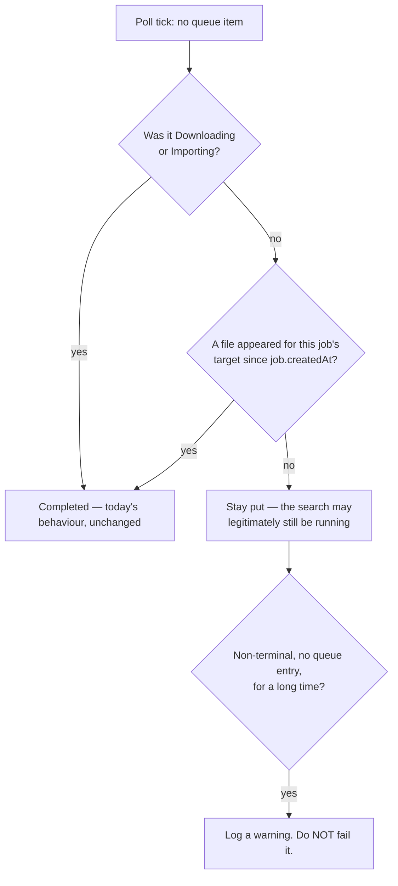
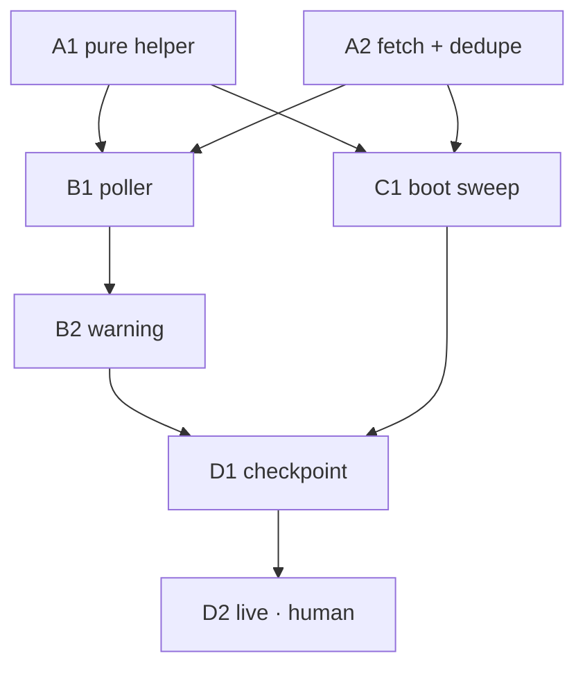

# Media jobs wedge at `searching` when a grab finishes between poll ticks

## Overview

> Written for a human first. Everything below this section is written for whoever
> executes the plan. If a claim here needs more, it links to where the detail lives.

`apps/download` decides how a movie/show download is going by **watching Radarr's and
Sonarr's queues**, every 10 seconds. A usenet grab of a small file can go from
`grabbed` to `imported` in **6 seconds** — so the download starts and finishes between
two ticks and **the queue is empty every time the poller looks**.

An empty queue is ambiguous. It means either _"nothing has been grabbed yet"_ or
_"it already finished"_. The code only handles the first meaning, so the job sits at
`searching` with its file on disk.

**Confirmed live on 2026-09-16**, during [plan 013's human checkpoint 2](013-frontend-rewrite.md#human-checkpoints):
two real jobs wedged, two grabs out of two.

```
activity total: 2
  I8jtP1NY2banWwS_hjiW0  searching  Family Guy
  8JSOrM6b7W90SSSpYximR  searching  Task
```

⚠️ **It is worse than a stuck label.** `reconcileInterruptedJobs`
(`src/db/reconcile-interrupted-jobs.ts:14`) marks **every** non-terminal job `failed`
at boot with `"Interrupted by a service restart"`. So a wedged job reads `searching`
until the next deploy and then flips to **`failed`** — despite having downloaded
perfectly. **Both states are wrong, and the second is the more misleading.**

| Change                                     | In one sentence                                                                                                                              |
| ------------------------------------------ | -------------------------------------------------------------------------------------------------------------------------------------------- |
| **Stop relying on catching it mid-flight** | When the queue is empty, ask whether a file appeared since the job started, instead of assuming nothing was grabbed.                         |
| **The boot sweep gets the same question**  | Every non-terminal job still becomes terminal at boot — the fix only decides _which_ terminal status.                                        |
| **Nothing new upstream**                   | `getMovieFiles()` / `getEpisodeFiles()` already exist, and `dateAdded` is already on both file resources. No new API wrappers, no migration. |
| **Observability, not a guillotine**        | A long-wedged job logs a warning. It is never auto-failed on a timer.                                                                        |



**Shape:** one doc, **7 tasks in groups A–D**, one wave table. **No feature branch** —
see [Design decisions](#no-feature-branch-or-worktree).

**Key decisions**, in brief — full reasoning in [Design decisions](#design-decisions):

- **A file appearing is the whole signal.** We do not try to prove _our_ grab caused
  it. [Why](#the-completion-signal-is-file-existence-not-grab-attribution)
- **The check is batched and only runs when the queue is empty.** Steady-state upstream
  load is unchanged. [Why](#batched-and-only-when-the-queue-is-empty)
- **`deriveStatusFromQueueItem` stays pure.** The upstream call lives in the caller.
  [Why](#the-pure-function-stays-pure)
- **No timeout-based auto-fail.** A job can sit at `searching` legitimately for weeks.
  [Why](#warn-do-not-auto-fail)

**Read next:** [Design decisions](#design-decisions) ·
[Shared Context Pack](#shared-context-pack) · [Task List](#task-list) ·
[Sequencing](#sequencing) · [Final report](#final-report)

---

## How to work this plan

**All work lands on `jeremy/download`**, in the existing worktree at
`/home/jeremy/.nexus-code/worktrees/lilnas/jeremy-download`.

> ⚠️ **Never switch this branch.** The production download container's `/data` volume
> is wired to this checkout; `jeremy/download` moving off is a known way to take the
> live service down at boot with `SQLITE_CANTOPEN`.

**Per task:**

1. Work tasks in wave order (see [Sequencing](#sequencing)). Never start a task before
   its dependencies are green.
2. Implement → write or update tests → run these **from `apps/download`**:
   - `pnpm test`
   - `pnpm lint` (two checks — eslint _and_ prettier)
   - `pnpm type-check`
3. **`/commit`** — one task, one commit. Pass an explicit scope naming the files this
   task touched.
4. Check the box below and append the commit hash.

**Markers:**

| Marker              | Means                                                          |
| ------------------- | -------------------------------------------------------------- |
| `- [ ]`             | Not started                                                    |
| `- [x]` … `abc1234` | Done, with the commit that did it                              |
| ⚠️ **PARTIAL**      | Landed with scope narrowed — say what was left and why, inline |
| ⏭️ **DROPPED**      | Not doing it — say why. Never delete a task                    |
| 🚧 / ⏳             | Blocked. Do not implement                                      |

**When reality disagrees with this plan,** add a short **Findings** note under the
task, then update the downstream tasks that finding invalidates.

---

## Instructions for the orchestrator agent

**Do**

- Delegate every task to a sub-agent — implementation, tests and the commit included.
  One sub-agent per task.
- Write **self-contained** delegation prompts: the task's full text, the relevant parts
  of the [Shared Context Pack](#shared-context-pack), and the
  [Definition of Done](#definition-of-done). When a task depends on an earlier one,
  paste that sub-agent's **reported** exported names and signatures into the prompt.
- Respect the wave order. **⚠️ B1 and B2 both edit `media-poller.service.ts`** — they
  must not run concurrently.

**Don't**

- ❌ Read or edit source, tests or config yourself. The only file you may edit is _this
  plan_, to check off tasks and record outcomes.
- ❌ Let sub-agents read this plan.
- ❌ Perform [D2](#d2-live-verification--human-checkpoint), which is a human checkpoint.
- ❌ `git checkout`, `git switch`, rebase, or push.

⚠️ **Other sessions commit on this branch.** Every task's commit must stage **only its
own paths** and use a pathspec-limited `git commit -- <paths>`. If a `/commit` preflight
instructs a `git reset`, **refuse it** — it would destroy another session's work. Take
the repo mutex first:

```bash
until mkdir /tmp/lilnas-download-commit.lock 2>/dev/null; do sleep 5; done
# ... stage only your own paths, commit, verify with: git show --stat HEAD
rmdir /tmp/lilnas-download-commit.lock   # release even on failure or abort
```

---

## Design decisions

### The completion signal is file existence, not grab attribution

**Chosen:** a job is complete when **a file exists for its target with
`dateAdded > job.createdAt`**.

Radarr and Sonarr run their own RSS scanning and grab monitored titles with no
involvement from this app, so a file appearing does not prove _our_ job caused it.

**Ruled out — also requiring a `grabbed` history event in the window.** It does not
solve what it claims: history says _something_ was grabbed, not that _this job_ grabbed
it. It buys a tighter heuristic, not attribution, for an extra upstream call.

**Ruled out — persisting a grab marker on the job.** It is the only truly correct
answer, and it is disproportionate: `jobs` has no `downloadId` column, and
`grabRelease(guid, indexerId)` returns `void`, so capturing one means polling history
right after every grab to find it — a new call and a new failure mode.

**The decisive argument:** in every branch of this race **the user-visible outcome is
identical** — the file is on disk and the job should read done. The strict versions only
buy a claim about _causation_ that no screen in this app renders.

### Batched, and only when the queue is empty

**Chosen:** on each tick, after the queue is fetched, look up files **once per distinct
title that has a job with no queue entry**.

- In the normal case — the job _has_ a queue entry — the check does not fire at all, so
  steady-state upstream load is unchanged.
- ⚠️ **`getMovieFiles(radarrId)` and `getEpisodeFiles(sonarrId)` take a SINGLE id**,
  unlike `getQueue(ids)`. So "batched" means **one call per distinct title, deduped** —
  a series with four wedged episode jobs costs one call, not four. It is not free.

**Ruled out — throttling to every Nth tick.** Cheapest, but knowingly renders
`searching` for up to N×10s after the file landed.

**Ruled out — one call per job per tick.** Exactly the load pattern this codebase
already rejected when it made `getQueue` take an array.

### The pure function stays pure

`deriveStatusFromQueueItem` (`queue-status.util.ts:184`) is
`(currentStatus, item) → status` with ~20 tests against it, and `aggregateQueueItems`
calls it too. **The upstream lookup must not go inside it.** The new branch belongs in
the caller, `MediaPollerService.applyUpdate` (`media-poller.service.ts:178`).

This matches how the codebase already splits testable logic from I/O — `job-state.ts`,
`activity-rows.ts`, `search-params.ts`, `video-player-state.ts` all do it.

### The boot sweep is in scope, and its invariant must hold

`reconcileInterruptedJobs` marks every non-terminal job `failed` at boot. That is right
for a job that genuinely died mid-download and **wrong** for one that completed.

⚠️ **It is load-bearing, and the fix must not weaken it.** `MediaPollerService.trackedJobs`
iterates `DownloadStateService.jobs`, an **in-memory Map that is empty after a restart**
(`download-state.service.ts:243-244` only re-populates it lazily, when something looks a
job up by id). **A job left non-terminal at boot is never polled again and wedges
permanently.**

So the change is **not** "sometimes skip the sweep". It is: every non-terminal job still
becomes terminal at boot — the fix only decides **which** terminal status.

| At boot                                  | Then                           |
| ---------------------------------------- | ------------------------------ |
| File exists, `dateAdded > job.createdAt` | `completed`                    |
| No such file                             | `failed`, exactly as today     |
| ⚠️ **Upstream unreachable**              | **`failed`, exactly as today** |

**The outage fallback must be `failed`, not "leave it alone."** Leaving jobs
non-terminal during a Radarr/Sonarr outage would wedge them forever, given the empty
Map. A possible mislabel during an outage is the safer failure.

**Bonus:** this retroactively corrects whatever is already wedged in production, on the
next deploy.

### Warn, do not auto-fail

**Chosen:** log a warning when a job has been non-terminal with no queue entry for a
long window. **Never auto-fail on a timer.**

**Ruled out — a timeout that fails the job.** A job sits at `searching` **legitimately
and indefinitely** when a title has no release available yet and Radarr keeps scanning
RSS for it. That is healthy, and it is precisely what the current "stay put" branch
protects. A timeout kills those, and a wrongly-`failed` job looks like a normal outcome
— **harder to notice than the bug being fixed.**

Any duration would be invented with no evidence. The warning gives the observability to
catch the next unknown cause; if the logs later show a real pattern, pick a duration
**then**, with evidence.

### No feature branch or worktree

Work lands directly on `jeremy/download`, matching all 15 prior plans in this series and
the same call made for [plan 014](014-bad-file-reporting-backend.md).

⚠️ **A worktree would actively hurt here.** `lilnas-download-dev` — the container
[D2](#d2-live-verification--human-checkpoint) verifies against — is bound to **this**
checkout. Work in a separate worktree could not be exercised live without a merge first.

The cost is real and stated: other sessions commit on this branch, so every task takes
the mutex and stages pathspec-limited. See
[Instructions for the orchestrator](#instructions-for-the-orchestrator-agent).

---

## Shared Context Pack

> Copy the relevant parts into every sub-agent prompt. These are pointers — **verify
> against current code**, a plan ages and the code is the truth.

### Repo & conventions

- pnpm workspaces + Turbo. The package is `@lilnas/download` at `apps/download`.
- **From `apps/download`:** `pnpm test` · `pnpm lint` (eslint **and** prettier — two
  checks) · `pnpm type-check`.
- ⚠️ **Never run `pnpm build` in `apps/download`** — it clobbers the `.next` the running
  dev container holds.
- Tests live in `__tests__/` next to the code. Jest, **two projects**: `node` (`*.ts`)
  and `jsdom` (`*.tsx`). Everything in this plan is **node**.
- `src/media/__tests__/` already has `fixtures/` and `helpers/` — reuse them.
- Prefer `type` imports (`isolatedModules` is on). Avoid `any`.
- Commits: conventional, scoped — `fix(download): …`.

### The code this plan touches

| File                                         | What it is                                                                                                                                                              |
| -------------------------------------------- | ----------------------------------------------------------------------------------------------------------------------------------------------------------------------- |
| `src/media/queue-status.util.ts:184`         | `deriveStatusFromQueueItem(currentStatus, item)` — **pure, do not add I/O**                                                                                             |
| `src/media/queue-status.util.ts`             | `aggregateQueueItems(items)` — returns `undefined` for an empty list, **deliberately the same as `queue.find()`'s miss**, so movies and shows share one no-entry branch |
| `src/media/media-poller.service.ts:70`       | `@Cron('*/10 * * * * *')`                                                                                                                                               |
| `src/media/media-poller.service.ts:178`      | `applyUpdate()` — **the call site this plan changes**                                                                                                                   |
| `src/media/media-poller.service.ts`          | `trackedJobs(type)` — non-terminal jobs from `DownloadStateService.jobs`, paired with their upstream library id via `MediaResolverService.resolve()`                    |
| `src/db/reconcile-interrupted-jobs.ts:14`    | `reconcileInterruptedJobs(db): number`                                                                                                                                  |
| `src/bootstrap.ts:28`                        | calls it, **inside the Nest context** — `app.get(DbService)` already works there, so `app.get(RadarrService)` does too                                                  |
| `src/download/download-state.service.ts:243` | lazy re-hydration — the Map is **not** populated at boot                                                                                                                |
| `src/media/episode-files.util.ts`            | `EpisodeFileReader`, `resolveEpisodeFileIds()` — **reuse candidate**                                                                                                    |

### Upstream methods that already exist — do not write new wrappers

```ts
radarrService.getMovieFiles(radarrId: number): Promise<MovieFileResource[]>   // radarr.service.ts:390
sonarrService.getEpisodeFiles(sonarrId: number): Promise<EpisodeFileResource[]> // sonarr.service.ts:664
sonarrService.getEpisodes(...)                                                 // sonarr.service.ts:574
```

Both file resources carry `dateAdded?: string` — **verified, this is the assumption the
plan rests on.**

### ⚠️ Gotchas

- ⚠️ **`EpisodeFileResource` has NO `episodeId`.** It carries `id`, `seasonNumber` and
  `dateAdded`. The link runs the other way: **`Episode.episodeFileId` → file `id`**. An
  episode-scoped job therefore needs the episode list too, not just the file list.
  `resolveEpisodeFileIds()` in `episode-files.util.ts` already does this join.
- ⚠️ **`jobs` has no `downloadId`.** Columns are `id, type, status, requesterEmail,
requesterUserId, origin, hiddenAttribution, error, mediaId, scope, createdAt,
updatedAt, completedAt`. The usable keys are **`mediaId`, `scope` and `createdAt`**.
- ⚠️ **A show job's scope is `ShowScope`** (`episodeId` / `seasonNumber`), matched by
  `matchesScope()` in the poller. **A season is complete only when every episode in
  scope has a file** — matching the existing rule that a season job does not reach
  `completed` until the last episode leaves the queue.
- ⚠️ **`dateAdded` is a string.** Parse defensively; an absent or unparseable value must
  not be treated as "new".
- **The poller already has error backoff** (`poll()`'s `catch`, 10s → 2min). A throw
  from the new check propagates there — do not add a second backoff.

### Definition of Done

Include this **verbatim** in every delegation:

> **Done means:** implemented; tests written or updated following the package's existing
> conventions and passing; lint and type-check clean for every touched package;
> committed with `/commit`. Report back: files changed, exported names introduced, test
> summary, commit hash(es).

**Addendum for every task:** ❌ do not run `pnpm build` in `apps/download`. ❌ do not
restart, stop or recreate any container. ❌ do not `git checkout`/`switch`/rebase/push.

---

## Task List

### Group A — the completion signal

- [x] **A1. The pure decision helper.** — `6f723ca9`, `6155473e` — Given a job and the files upstream reports, say
      whether it completed.

  **Files:** create `apps/download/src/media/job-completion.util.ts` and
  `apps/download/src/media/__tests__/job-completion.util.test.ts`.

  ```ts
  /** A file as this decision needs it — id, dateAdded, and (shows) its season. */
  export interface CompletionFile {
    id?: number
    dateAdded?: string
    seasonNumber?: number
  }

  /** Episode -> file link, since EpisodeFileResource carries no episodeId. */
  export interface CompletionEpisode {
    id: number
    seasonNumber?: number
    episodeFileId?: number
  }

  export interface CompletionInput {
    createdAt: Date
    scope?: ShowScope
    files: readonly CompletionFile[]
    episodes?: readonly CompletionEpisode[] // shows only
  }

  export function didJobComplete(input: CompletionInput): boolean
  ```

  **Edge cases — each wants a test:**
  - **Movie:** any file with `dateAdded > createdAt` → true.
  - **Episode scope:** resolve `episodeId` → `episodeFileId` → that file's `dateAdded`.
  - **Season scope:** **every** episode in that season must have a qualifying file.
    Partial → false.
  - **Series scope (no `episodeId`, no `seasonNumber`):** every episode in the series.
  - ⚠️ **An absent, empty or unparseable `dateAdded` is NOT "new"** — it must not
    complete a job.
  - A file older than `createdAt` → false. This is the whole point: it was already there.
  - Empty `files` → false.
  - ⚠️ **`dateAdded` exactly equal to `createdAt`** — pick a rule, document it, test it.

  **Tests:** every branch above, in the **node** project. Pure function, no mocks needed.

- [x] **A2. Fetch the files the check needs, deduped.** — `30a8ea39`

  **Files:** edit `apps/download/src/media/media-poller.service.ts` (a private helper
  only — ⚠️ **do not touch `applyUpdate` yet, that is B1**); edit
  `apps/download/src/media/__tests__/media-poller.service.test.ts`.

  Given the tracked jobs that have **no** queue entry this tick, fetch what A1 needs:

  ```ts
  // one call per DISTINCT upstreamId, not per job
  private async completionInputs(
    type: DownloadType,
    jobs: readonly TrackedJob[],
  ): Promise<Map<string /* job id */, Pick<CompletionInput, 'files' | 'episodes'>>>
  ```

  **Edge cases:**
  - ⚠️ **Dedupe by `upstreamId`.** Four episode jobs on one series = **one**
    `getEpisodeFiles` call.
  - **Returns an empty map when no job needs it** — and makes **zero** upstream calls in
    that case. This is what keeps steady-state load unchanged.
  - Shows need episodes too (see the `episodeFileId` gotcha) — reuse
    `resolveEpisodeFileIds()` / `getEpisodes()` rather than re-deriving the join.
  - An upstream throw propagates to `poll()`'s existing backoff. **Do not catch it here.**

  **Tests:** the dedupe (N jobs on one title → 1 call); zero jobs → zero calls; the
  movie and show shapes both produce what A1 expects.

##### Findings (Wave 1, 2026-09-16) — paste these into B1's and C1's prompts

**A1 — `6f723ca9` + `6155473e`, 32 tests.** **A2 — `30a8ea39`, +6 tests** (all 17
pre-existing poller tests pass **unmodified**). Lint and type-check clean; `applyUpdate`
and `deriveStatusFromQueueItem` verified **byte-identical to HEAD**.

```ts
// src/media/job-completion.util.ts — pure, node-tested
export interface CompletionFile {
  id?: number
  dateAdded?: string
  seasonNumber?: number
}
export interface CompletionEpisode {
  id?: number // relaxed from required — an id-less episode is UNSATISFIABLE
  seasonNumber?: number
  episodeFileId?: number
}
export interface CompletionInput {
  createdAt: Date
  scope?: ShowScope
  files: readonly CompletionFile[]
  episodes?: readonly CompletionEpisode[]
}
export function didJobComplete(input: CompletionInput): boolean

// src/media/media-poller.service.ts
export interface TrackedJob {
  record: DownloadJobRecord
  upstreamId: number
}
export interface PollableCompletionData {
  episodes?: EpisodeResource[] // ABSENT for movies, not empty
  files: MovieFileResource[] | EpisodeFileResource[]
}
async completionInputs(                       // ⚠️ currently PUBLIC — see below
  type: DownloadType,
  jobs: readonly TrackedJob[],
): Promise<Map<string /* job.record.id */, PollableCompletionData>>
```

- **`dateAdded === createdAt` counts as NOT newer** (strictly `>`): at millisecond
  resolution an equal stamp means the file was already there when the job was created.
- **`scope.seasonNumber != null`**, not truthy — so **season 0 (specials) is a real
  scope** and does not fall through to series.
- The map key is **`job.record.id`**, not `upstreamId`. All four jobs on one title share
  the **same object** (asserted with `toBe`, not `toEqual`).
- **Dedupe proven:** `fetches once per distinct upstreamId, not once per job` — 4 jobs,
  `upstreamId: 9` → `getEpisodeFiles` and `getEpisodes` each
  `toHaveBeenCalledTimes(1)`. A second test spans two series (9, 9, 11) and asserts
  `2`, so the dedupe is **keyed, not merely collapsed to one**.
- A1 ships a **compile-time guard test** — `accepts the generated Radarr/Sonarr
  resources with no conversion` — pinning that `MovieFileResource[]`,
  `EpisodeFileResource[]` and `EpisodeResource[]` satisfy the input types verbatim.
  **If anyone re-tightens those types, A1's suite fails rather than a call site.**

⚠️ **B1 MUST narrow `completionInputs` back to `private`.** It is public only because
`noUnusedLocals: true` (`tsconfig.base.json`) raises `TS6133` on an uncalled `private`
member, and A2's helper had to ship inert so it could not disturb plan 013's concurrent
live verification. **The moment `pollMovies`/`pollShows` call it, `private` is available
again** — and `export interface TrackedJob` can likely go back to unexported with it.
The constraint was temporary; do not preserve it.

##### ⚠️ Findings: A2 did NOT reuse `resolveEpisodeFileIds()` — the plan was wrong to ask

This task's text said to reuse `resolveEpisodeFileIds()` from `episode-files.util.ts`.
**A2 read it, declined, and was right to.** Two reasons, both fatal here:

1. **It narrows per scope**, so two episode-scoped jobs on one series produce **two
   `getEpisodes` calls** — precisely the fan-out this task exists to eliminate.
2. **It reduces to `number[]` file ids, discarding `dateAdded`** — the single field the
   whole "did a file appear since this job started?" question turns on.

A2 reused its **insight** (the `Episode.episodeFileId → file.id` direction) rather than
its code, and recorded why in a doc comment. **`episode-files.util.ts` was not
modified.** Anyone tempted to "unify" these two later should read this first.

### Group B — the poller

- [ ] **B1. Use the signal in the no-entry branch.**

  **Files:** edit `apps/download/src/media/media-poller.service.ts`; edit
  `apps/download/src/media/__tests__/media-poller.service.test.ts`.

  In `applyUpdate` (`:178`), when `deriveStatusFromQueueItem` returns an **unchanged
  non-terminal** status **and there was no queue item**, consult A1/A2. If it completed,
  write `Completed` instead.

  **Edge cases:**
  - ⚠️ **`deriveStatusFromQueueItem` must not change.** Its existing
    `Downloading`/`Importing` → `Completed` rule is untouched and still wins first.
  - ⚠️ **Never promote without file evidence.** An empty queue with no new file means a
    search may still be legitimately running — that branch must still stay put.
  - Movies and shows share this path, because `aggregateQueueItems` returns `undefined`
    for an empty list exactly as `queue.find()` does.
  - `completedAt` and the job's status write follow whatever `applyUpdate` already does
    for a status change — **do not invent a second write path**.
  - The existing "no status change and no snapshot change → return early" short-circuit
    must still hold, or every tick writes.

  **Tests:** the wedge scenario end to end (status `Searching`, no queue item, a file
  newer than `createdAt` → `Completed`); the protected case (`Searching`, no queue item,
  **no** new file → stays `Searching`); `Downloading` + no item → `Completed` as before;
  a season with only some episodes present → stays put.

- [ ] **B2. Warn when a job has been wedged a long time.**

  ⚠️ **Same file as B1 — must not run concurrently with it.**

  **Files:** edit `apps/download/src/media/media-poller.service.ts`; edit
  `apps/download/src/media/__tests__/media-poller.service.test.ts`.

  When a job is non-terminal, has no queue entry, and A1 says it has not completed, and
  it has been that way for longer than a generous window, **log a warning naming the job
  id, media id and age.**

  **Edge cases:**
  - ❌ **Do NOT change the job's status.** This is observability only. See
    [Warn, do not auto-fail](#warn-do-not-auto-fail).
  - ⚠️ **Log once per job, not once per tick** — a 10s cron would otherwise emit
    ~8,640 lines a day per wedged job. Track what has already been warned about.
  - Put the window in a named exported constant so it is greppable and tunable.

  **Tests:** the warning fires past the window; it does **not** fire before it; it fires
  **once**, not on every tick; the job's status is untouched.

### Group C — the boot sweep

- [ ] **C1. `reconcileInterruptedJobs` asks the same question.**

  **Files:** edit `apps/download/src/db/reconcile-interrupted-jobs.ts`; edit
  `apps/download/src/bootstrap.ts`; edit/create the matching spec.

  Before marking a non-terminal job `failed`, check whether it actually completed — same
  signal as A1. If so, write `completed`.

  **Edge cases:**
  - ⚠️ **The invariant is absolute: no job may still be non-terminal when this returns.**
    See [the boot-sweep decision](#the-boot-sweep-is-in-scope-and-its-invariant-must-hold)
    — a non-terminal job at boot is never polled again and wedges permanently.
  - ⚠️ **Upstream unreachable → `failed`, exactly as today.** Do not leave jobs
    non-terminal, and do not let a Radarr/Sonarr outage prevent boot.
  - `bootstrap.ts` runs inside the Nest context, so `app.get(RadarrService)` /
    `app.get(SonarrService)` work the same way `app.get(DbService)` already does.
  - ⚠️ **Boot must still hard-fail on a bad integrity check** — do not reorder or
    weaken the existing `runMigrations()` → `checkIntegrity()` → reconcile sequence.
  - A job whose media no longer resolves upstream → `failed`. Do not throw.
  - Keep the existing `"Interrupted by a service restart"` error text for the jobs that
    genuinely are that. A completed job gets **no** error text.

  **Tests:** a wedged-but-completed job becomes `completed`; a genuinely interrupted one
  still becomes `failed` with the existing message; an upstream throw still leaves
  **zero** non-terminal rows; the returned count still reflects rows changed.

### Group D — verification

- [ ] **D1. Integration checkpoint.** ⚠️ **Report, do not repair.**

  **Files:** none. This task changes nothing.

  From `apps/download`: `pnpm test`, `pnpm lint` (both checks), `pnpm type-check`. Then
  from the repo root: `pnpm run type-check` and `pnpm test`.

  **Must see every prior commit in this plan.**

  ⚠️ **Known-red and NOT this plan's — report, do not chase:** repo-root `pnpm test`
  fails on `@lilnas/equations` and `@lilnas/tdr-code` (neither imports anything this plan
  touches); repo-root `//#mockups:lint` fails on prettier for
  `docs/features/download/designs/src/data/show-detail.mjs`, last committed in an
  ancestor; a backend-suite `"worker process has failed to exit gracefully"` warning; two
  `Unknown option "testTimeout"` jest warnings. ❌ **Do not run `lint:fix`** — a
  checkpoint that needed a silent fix is not a clean checkpoint.

  **Report:** each command's result, and an explicit statement that any failure is
  pre-existing, with the evidence.

- [ ] 🚧 **D2. Live verification — HUMAN CHECKPOINT.** Do not perform this as an agent
      without explicit, separate authorization from the repo owner.

  See [Human checkpoints](#human-checkpoints) for the full recipe. Listed here so the
  plan's last box is not mistaken for "verified in production".

---

## Sequencing



### Waves

| Wave | Run         | Why it works                                                                                                                                                                  |
| ---- | ----------- | ----------------------------------------------------------------------------------------------------------------------------------------------------------------------------- |
| 1    | **A1 ∥ A2** | Different files — a new `job-completion.util.ts` vs. a private helper in `media-poller.service.ts`. A2 is told explicitly not to touch `applyUpdate`.                         |
| 2    | **B1 ∥ C1** | Different files — `media-poller.service.ts` vs. `reconcile-interrupted-jobs.ts` + `bootstrap.ts`. Both consume A1/A2's reported signatures, which the orchestrator pastes in. |
| 3    | **B2**      | ⚠️ Alone. **Same file as B1**, so it cannot run beside it.                                                                                                                    |
| 4    | **D1**      | Must see every prior commit.                                                                                                                                                  |
| 5    | **D2**      | Human checkpoint. Not an agent task.                                                                                                                                          |

### Dependency table

| Task | Depends on                                   | Parallel with |
| ---- | -------------------------------------------- | ------------- |
| A1   | —                                            | A2            |
| A2   | —                                            | A1            |
| B1   | A1, A2                                       | C1            |
| C1   | A1, A2                                       | B1            |
| B2   | B1 _(file collision, not a data dependency)_ | —             |
| D1   | B1, B2, C1                                   | —             |
| D2   | D1                                           | —             |

### Critical path

**A1 → B1 → B2 → D1 → D2.**

**A1 leads and must not slip** — both B1 and C1 are blocked on its signature, and it is
the only task whose output every other task consumes.

⚠️ **B2 sits on the critical path only because it shares a file with B1.** If the
schedule matters more than the commit split, fold B2 into B1 as one commit — they touch
the same branch of the same method.

### Human checkpoints

1. 🚧 **D2 — live verification.** ⚠️ **This requires a real library mutation, so it is
   not an agent task without separate, explicit authorization.**

   _Checking for:_ a genuinely fast grab now reaches `completed` rather than wedging.

   **The recipe, which contains its own blast radius** — the same approach plan 013's
   checkpoint 2 used:
   - Pick an episode that is **monitored and missing**, so **the file is one this run
     creates** and nothing pre-existing is at risk. `GET /api/v3/wanted/missing` lists
     them.
   - Grab it through the UI at `http://localhost:8090` (**loopback only** — never
     `https://download.dev.lilnas.io`, which is behind OAuth).
   - **Watch the job reach `completed` without a restart.** A small usenet file is the
     point: it must finish inside one 10s tick to reproduce the bug.
   - **Delete the file and re-enable monitoring** (`PUT /api/v3/episode/monitor`) so the
     episode ends `monitored: true`, `hasFile: false` — exactly as found.
   - Confirm nothing else changed against the Radarr/Sonarr baselines.

   ⚠️ **Before trusting any live result, confirm the dev backend is actually running this
   plan's code.** `nest start -w` has silently stopped watching before, serving a stale
   backend behind a current frontend — see
   [the stale-backend finding](013-frontend-rewrite.md). Check
   `docker logs lilnas-download-dev 2>&1 | grep -c "Nest application successfully started"`
   against when the commits landed, and `docker restart lilnas-download-dev` if in doubt.

2. **Deploy.** Reaching the last checkbox is not permission to ship. Deploying is a human
   decision. ⚠️ **The first production boot after C1 lands will re-classify every
   currently-wedged job** — that is the intended retroactive fix, and someone should
   watch it happen.

---

## Final report

When every box is checked, report:

1. **Per-task outcome** — status, files changed, exported names, commit hashes
2. **Test results** — `apps/download` and the repo-wide sweep, with pre-existing
   failures named and evidenced as pre-existing
3. **Deviations** from this plan, and why
4. **Deferred** — every human checkpoint still outstanding
5. **Open questions** discovered during implementation

Then **stop.** [D2](#human-checkpoints) and the deploy are human decisions, not steps the
executor takes.
