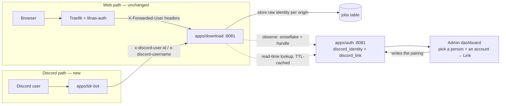
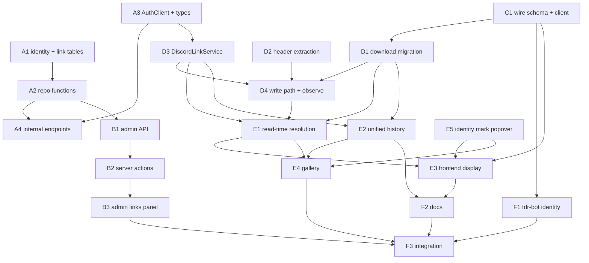

# Discord-triggered downloads are anonymous — give jobs dual attribution and let admins link accounts

> **Overview — written for a human.** Everything below this section is written for the
> executing agents; this part is the map.

Today a download job knows who asked for it only when the request came through the
browser: Traefik's forward-auth stamps `X-Forwarded-User` / `X-Forwarded-User-Id`, and
`apps/download` records them as `requester`. Jobs created by `apps/tdr-bot` (the
Discord `/download` command) arrive with no headers at all and persist as
`requester: null` / `origin: 'service'` — anonymous, forever.

This plan makes attribution **dual**:

- **tdr-bot sends the Discord identity it already has** (`interaction.user.id` +
  `interaction.user.username`) on two new headers, via a `withDiscordIdentity()`
  sibling to the existing `withForwardedIdentity()`.
- **`apps/download` stores it raw** on the job (`discord_user_id`,
  `discord_username`, `origin: 'discord'`) — never resolved at write time.
- **`apps/auth` owns the link** — a `discord_link` join table (lilnas user ↔ Discord
  snowflake, one-to-one, storing **no name at all**) plus a `discord_identity` roster
  it fills by observation, an admin UI that links by **picking one row from each of
  two lists**, and an internal, Docker-network-only lookup endpoint mirroring
  `/admin/check`.
- **`apps/download` resolves the link at read time** (TTL-cached, mirroring
  `AdminCheckService`). A linked Discord job displays as the same person as their web
  jobs — **including every past job**, because resolution happens on display, not on
  write. History and profile views unify: one person's downloads show up together
  regardless of surface — and the link reads **both ways**, so a linked person's web
  jobs show their Discord handle too.



**Shape:** one doc, **20 tasks in groups A–F**, seven waves. Work lands on
`jeremy/download` in this worktree, matching plans 001–016 — no separate branch, no
rollout section (see [How to work this plan](#how-to-work-this-plan)).

**Key decisions** (full rationale in [Design decisions](#design-decisions)):

- **Resolution lives in `apps/download`, at read time, not in tdr-bot at write
  time.** Retroactive unification requires it. [Why](#resolution-happens-in-download-at-read-time)
- **Storage stays mutually exclusive** — a row is `web` XOR `discord` XOR `service`;
  "one person, both surfaces" is a read-time projection, not a wider row.
  [Why](#storage-stays-mutually-exclusive)
- **The link is admin-made, not OAuth.** `apps/auth` keeps Google as its only
  provider. [Why](#the-link-is-admin-made-not-oauth)
- **Nobody ever types a Discord handle or snowflake.** Both sides of the picker are
  observed — people on first web sign-in, Discord accounts on first `/download` — so
  the link keys on the immutable snowflake and a rename is a non-event.
  [Why](#both-sides-of-the-link-are-observed-never-typed)
- **The internal endpoint mirrors `/admin/check`** — query-param lookup, no guard,
  Docker-network topology as the trust boundary; the caller caches with the
  `AdminCheckService` pattern, failing open to "unlinked".
  [Why](#internal-lookup-mirrors-admincheck)
- **Masking still works:** `hiddenAttribution` hides the Discord identity exactly as
  it hides the lilnas one, through the same `projectJobForViewer` choke point.
  [Why](#masking-covers-both-identities)
- **The Discord mark is a click/tap disclosure, not a hover tooltip** — it opens a
  small popover carrying the raw snowflake _and_ the current handle, reusing
  `FilterPanel`'s non-modal popover so it behaves the same on a phone as on a desktop.
  [Why](#the-discord-mark-is-a-disclosure-not-a-tooltip)

**Read next:** [Decisions confirmed](#decisions-confirmed) ·
[Design decisions](#design-decisions) · [Shared Context Pack](#shared-context-pack) ·
[Task List](#task-list) · [Sequencing](#sequencing) · [Final report](#final-report)

---

## Decisions confirmed

✅ **HC1 is cleared (2026-09-19).** Both questions this plan deliberately left open have
been answered by the human. Wave 1 may start.

| Question                                                                              | Answer                                                                                                                                                                  |
| ------------------------------------------------------------------------------------- | ----------------------------------------------------------------------------------------------------------------------------------------------------------------------- |
| Where does Discord→lilnas resolution happen?                                          | **In `apps/download`, at read time** — as recommended. [Why](#resolution-happens-in-download-at-read-time)                                                              |
| Is reverse display (a linked person's Discord handle on their **web** jobs) in scope? | **Yes — in scope for v1.** ⚠️ This **overrides** the plan's original "defer it" recommendation. [What it costs](#reverse-display-a-linked-person-shows-both-identities) |

> **Also settled earlier (2026-09-19):** how an admin picks the pair. The first draft
> had the admin **type** a snowflake and a username into the Edit Access modal. That
> was rejected — a typed handle rots when someone renames themselves, and a typo
> produces a link that matches nothing. Replaced with two observed lists and a
> pick-one-from-each picker; the link row now stores no name at all. See
> [Both sides of the link are observed, never typed](#both-sides-of-the-link-are-observed-never-typed),
> which also records why the full Discord server roster was declined as the source.

Two scope cuts remain in force and were **not** overridden — the leaderboard/facets
aggregates and pre-linking an unseen account. See [Scope cuts](#scope-cuts-in-v1).

---

## How to work this plan

**All work lands on `jeremy/download`**, in the existing worktree at
`/home/jeremy/.nexus-code/worktrees/lilnas/jeremy-download`. This matches every prior
plan in this directory.

> ⚠️ **Never switch this branch.** The production download container's `/data` volume
> is wired to a checkout of `jeremy/download`; moving it off is a known way to take
> the live service down at boot with `SQLITE_CANTOPEN`.

**Before task 1:** commit this plan doc by itself —
`docs(download): add the plan for discord attribution and account linking` (precedent:
plan 016's own commit).

**Per task:**

1. Work tasks in wave order (see [Sequencing](#sequencing)). Never start a task before
   its dependencies are green.
2. Implement → write or update tests → run **from the package the task touches**
   (some tasks touch two — run in both):
   - `pnpm test`
   - `pnpm lint`
   - `pnpm type-check`
3. **`/commit`** — one task, one commit. Pass an explicit scope naming the files this
   task touched. Commit scopes: `feat(auth)`, `feat(download)`, `feat(tdr-bot)`,
   `feat(utils)` per the dominant package; conventional, lowercase, imperative.
4. Check the box below and append the commit hash.

**Markers:**

| Marker              | Means                                                          |
| ------------------- | -------------------------------------------------------------- |
| `- [ ]`             | Not started                                                    |
| `- [x]` … `abc1234` | Done, with the commit that did it                              |
| ⚠️ **PARTIAL**      | Landed with scope narrowed — say what was left and why, inline |
| ⏭️ **DROPPED**      | Not doing it — say why. Never delete a task                    |
| 🚧 / ⏳             | Blocked. Do not implement                                      |

**When reality disagrees with this plan,** add a short **Findings** note under the
task, then update the downstream tasks that finding invalidates.

---

## Instructions for the orchestrator agent

**Do**

- Delegate every task to a sub-agent — implementation, tests and the commit included.
  One sub-agent per task.
- Write **self-contained** delegation prompts: the task's full text, the relevant parts
  of the [Shared Context Pack](#shared-context-pack), and the
  [Definition of Done](#definition-of-done). When a task depends on an earlier one,
  paste that sub-agent's **reported** exported names and signatures into the prompt.
- Respect the wave order. ⚠️ **E1 and E2 both edit `download.controller.ts` and the
  read path** — they must not run concurrently. ⚠️ **E4 edits `jobs.repo.ts` after E2
  does** — same rule.
- ✅ [HC1 is already cleared](#decisions-confirmed) — do not re-ask it. Resolution
  stays in `apps/download` at read time and reverse display is **in scope**. Wave 1 is
  unblocked.

**Don't**

- ❌ Read or edit source, tests or config yourself. The only file you may edit is _this
  plan_, to check off tasks and record outcomes.
- ❌ Let sub-agents read this plan.
- ❌ Perform [HC2–HC4](#human-checkpoints) — production backup, deploy, and live
  verification are human checkpoints.
- ❌ `git checkout`, `git switch`, rebase, or push.

⚠️ **Other sessions commit on this branch.** Every task's commit must stage **only its
own paths** and use a pathspec-limited `git commit -- <paths>`. If a `/commit`
preflight instructs a `git reset`, **refuse it** — it would destroy another session's
work. Take the repo mutex first:

```bash
until mkdir /tmp/lilnas-download-commit.lock 2>/dev/null; do sleep 5; done
# ... stage only your own paths, commit, verify with: git show --stat HEAD
rmdir /tmp/lilnas-download-commit.lock   # release even on failure or abort
```

---

## Design decisions

### Resolution happens in download, at read time

**Chosen:** jobs store the raw Discord identity; `apps/download` resolves
Discord → lilnas through auth's internal endpoint **when serving reads**, with a
60s-TTL cache. **Ruled out:** (a) tdr-bot resolving before calling download — can't be
retroactive, and every future Discord surface would re-implement it; (b) a one-time
backfill that rewrites old rows on link — destroys provenance, breaks on unlink, and
races with in-flight jobs. Read-time resolution makes link/unlink instantly and
symmetrically visible across all history with zero data migration.

### Storage stays mutually exclusive

**Chosen:** `origin` grows a third value — `JOB_ORIGINS = ['service', 'web',
'discord']` — and the `jobs_origin_matches_requester` CHECK is rewritten so exactly
one identity column-pair is populated per row (`web` ⇒ requester pair, `discord` ⇒
discord pair, `service` ⇒ neither). "A job may have one or both" identities is
satisfied at read time: a linked Discord job is _served_ with both `discordRequester`
(stored) and `requester` (resolved). **Ruled out:** allowing both pairs on one row —
nothing writes both today (a request carrying both header sets is a caller bug; the
forwarded pair wins, warn-logged), and a wider CHECK would let the pairs drift.

### The link is admin-made, not OAuth

`apps/auth`'s Better Auth config is Google-only and its own comments call out "no
second linkable provider" (`apps/auth/src/auth/auth.ts:36-41`). The feature explicitly
asks for admin-managed linking. So `discord_link` is a plain table written through the
admin API — no Better Auth `account` rows, no Discord OAuth app, no self-serve flow.
`apps/tdr-code`'s `git_identity` table is the borrowed shape precedent (snowflake as
`text`), but nothing is shared with it.

### Both sides of the link are observed, never typed

**Chosen:** an admin links by **picking one row from each of two lists**, and the link
row stores nothing but the pairing — `user.id` ↔ snowflake. Each side of the roster
fills itself in:

| Side            | Becomes linkable when                                                                              | Already exists?     |
| --------------- | -------------------------------------------------------------------------------------------------- | ------------------- |
| lilnas person   | they sign into the web app for the first time (Better Auth writes the `user` row)                  | ✅ yes, free        |
| Discord account | they run `/download` for the first time, which observes the snowflake into `discord_identity` (D4) | ➕ new in this plan |

**Ruled out: a text input for the snowflake or the handle.** A typed handle is a
snapshot that silently rots — Discord usernames are changeable, so a name captured at
link time stops matching the person it names, and a typo produces a link that silently
matches nothing. Keying purely on the immutable snowflake means a rename is a
non-event: the same `discord_identity` row updates its `username` the next time that
person runs a command (A2's `upsertIdentity`), and every existing link keeps working
untouched. It also removes the "which snowflake is this?" copy-paste chore entirely.

**Consequences, accepted:** a Discord account cannot be linked before its owner's
first `/download`, and the accounts list is empty on day one. That is survivable
precisely because [resolution is retroactive](#resolution-happens-in-download-at-read-time)
— the person downloads, appears in the list, gets linked, and the job they _already_
made displays as them. The list therefore reads as a work queue of exactly the people
who need attention, rather than a directory to search.

**Ruled out: syncing the full Discord server roster from tdr-bot.** It is genuinely
cheap — tdr-bot already runs an internal-only NestJS server on `8081` with no Traefik
router (`apps/tdr-bot/deploy.yml:40-46`), already enables the privileged `GuildMembers`
intent (`apps/tdr-bot/src/app.module.ts:92`), and `ApiController`'s existing
`@Get('channels')` (`apps/tdr-bot/src/api/api.controller.ts:125-145`) is the exact
shape a `@Get('members')` would copy. It was still declined for v1: it fills the
picker with every server member who will never use the service, turning a short work
queue into a directory, and tdr-bot's port 8081 has **no** authentication of any kind
today (no guard anywhere in `apps/tdr-bot/src`; the declared `API_TOKEN` env key at
`apps/tdr-bot/src/env.ts:2` is never read) while its Next.js config blanket-rewrites
`/api/*` to 8081, so a member-roster route would also be reachable through
`tdr.lilnas.io`. If pre-linking is wanted later, this is the insertion point and the
two caveats to settle first.

### Internal lookup mirrors /admin/check

**Chosen:** `GET /internal/discord-link?discordUserId=…` (also `?userId=…` /
`?email=…` — exactly one param) on auth's NestJS app (port 8081), a separate
guard-less controller registered flat in `app.module.ts`, **no ThrottlerGuard** — the
same reachability model as `AdminCheckController`
(`apps/auth/src/admin/admin-check.controller.ts:18-32`): no Traefik router points at
8081, no host port is published, the Docker network is the trust boundary. Query
params rather than the sketched path param because the endpoint needs three lookup
directions and `/admin/check?email=` is the house style.

The response is a **two-part envelope** — `{ identity, user }`, each independently
nullable — rather than a single `link` field, because download needs both halves and
should not pay for two round trips: `user` carries the resolved lilnas identity when
linked, while `identity` carries the current Discord handle, which is what an
_unlinked_ Discord job renders. Keeping "unknown" a 200 also means an old auth deploy
(a 404) stays distinguishable from a genuine "not linked", so the caller can fail
open.

The same controller carries one **write** route, `POST /internal/discord-identity`,
which is how the roster fills ([above](#both-sides-of-the-link-are-observed-never-typed)).
It sits on the same trust boundary; its blast radius is a wrong display name on an
unlinked account, since it cannot create, move, or delete a link.

Consumer side: `AuthClient` gains the two methods, and download wraps them in a
`DiscordLinkService` cloning `AdminCheckService`'s cache (60s TTL, 10s failure TTL,
500-entry cap, fail-open — a lookup failure degrades to "unlinked", a registration
failure is swallowed entirely).

### Precedence and the dev fallback

If a request somehow carries both the forwarded pair and the Discord pair, the
forwarded identity wins and the Discord pair is dropped with a warn log. Separately:
`resolveForwardedUser`'s dev-only `DEV_USER_EMAIL` fallback must **not** fire when
Discord headers are present — otherwise every tdr-bot job in dev would be
mis-attributed to the dev web user. The fallback check gains a "no
`x-discord-user-id` header" condition (D2).

### Masking covers both identities

`hiddenAttribution` on a video job currently masks `requester` via
`projectJobForViewer` (`apps/download/src/download/attribution.ts:46-51`) — the single
read-path transform for REST and WS. It now nulls `discordRequester` too under the
same `showTrueAttribution` rule. No new rule, one more field through the same gate.

### The Discord mark is a disclosure, not a tooltip

An unlinked Discord requester renders as a handle plus a small Discord glyph. The
glyph says _which service_ this came from, but the two facts an admin actually needs
in order to do anything about it — the **raw snowflake** and the **current handle** —
have to be reachable from that mark, because the snowflake is what gets pasted into
`apps/auth`'s picker to link the account.

**Chosen:** the mark is a real `<button>` that toggles a small **non-modal popover**,
reusing `FilterPanel`'s popover mode (`apps/download/src/components/ui/filters.tsx`).
**Ruled out: `title=""` and every other hover-only affordance.** A native tooltip is
invisible until hovered, announces inconsistently across screen readers, and is simply
**unreachable on a touch device** — which is most of this app's real usage. An
affordance that silently doesn't exist on a phone is not an affordance.

Click/tap is therefore the **baseline**, not the fallback: one mechanism that behaves
identically at both breakpoints, rather than a hover path plus a bolted-on mobile
special case. Hover-to-open may be layered on top as a pointer-only nicety.

`FilterPanel` is the right precedent and not merely a convenient one: it is already
`role="dialog"`, non-modal, opened by an `aria-haspopup`/`aria-expanded` trigger,
dismissed on Escape (returning focus to the trigger), on an outside press (leaving
focus where the pointer put it), and on a tab-out — with focus moved to the panel
rather than its first control, and **deliberately not trapped**. All of that is
already covered by ten tests in `filters.spec.tsx`. `menu.tsx` is the wrong
precedent despite being the other popover in the repo: it is a `role="listbox"` for
_choosing_ an option, not for disclosing a fact.

> ⚠️ **Masking outranks disclosure.** When `showTrueAttribution` says to mask, the
> mark is not rendered at all — no trigger, no popover, no snowflake in the DOM. The
> disclosure is a view onto an identity the viewer is already allowed to see, never a
> way around [the masking gate](#masking-covers-both-identities).

Prototyped in `docs/features/download/designs/discord-attribution.html` (and its Pug
source `designs/src/pages/discord-attribution.pug`) across commits `7f0f170`,
`034044e`, `dfbde0b` — which is where the hover-only dead end was found and
discarded. Read the mockup before implementing E3/E5; the visual weight of the mark
is settled there.

### Reverse display: a linked person shows both identities

**Confirmed in scope for v1** ([HC1](#decisions-confirmed)), overriding this plan's
original recommendation to defer it. Once an admin links an account, that person's
**web** jobs show their Discord handle too — not just their Discord jobs showing their
email. Linking becomes visibly symmetric.

**Chosen: a separate `linkedDiscord` wire field**, not a reuse of `discordRequester`.
The two mean genuinely different things and conflating them destroys information:

| Field              | Means                                                       | Populated for                      |
| ------------------ | ----------------------------------------------------------- | ---------------------------------- |
| `discordRequester` | this job was **submitted from** this Discord account        | `origin: 'discord'` rows           |
| `linkedDiscord`    | the account **linked to** `requester`, whoever submitted it | any job whose requester has a link |

Overloading `discordRequester` would make a web job indistinguishable from a
Discord-submitted one at the type level, and E3's "unlinked, sent via Discord" branch
keys off exactly that distinction. `origin` would still carry the truth, but every
consumer would have to remember to consult it — a latent bug rather than a type.

`JobRequesterSchema` is deliberately **not** widened to nest the handle inside
`requester`, tempting as `job.requester.discord` reads: that schema is shared by
`GalleryItem.lastRequester`, `AuditLogEntry.actor` and `topRequesters`, so widening it
ripples into three surfaces this plan is not otherwise touching.

**The cost, stated plainly:** E1 now resolves in **both** directions, so a page of
web-origin jobs — the common case — triggers a lookup per distinct requester where
before it triggered none. Mitigations, all already in the design: distinct userIds are
deduped per batch, `DiscordLinkService` caches for 60s, and **a negative result ("this
person has no link") is cached for the full TTL just like a positive one** — which is
what keeps the common case cheap, since most users will never have a link. Auth being
slow or down degrades to "no handle shown", never an error.

### Scope cuts in v1

- **Leaderboard / gallery facets / `topRequesters`** keep grouping by
  `requesterEmail`. Discord-only (unlinked) jobs have no email and stay out of those
  aggregates; folding linked ones in means resolving inside SQL aggregation — deferred.
- **Gallery & recent-card attribution** (E4) resolves linked identities but renders
  unlinked Discord requesters as today's null treatment — and the whole task is
  droppable without breaking anything else.
- **Pre-linking someone who has never run `/download`** is not possible in v1, because
  the accounts list is built purely by observation. The tdr-bot roster sync that would
  enable it is specced-but-declined in
  [the observation decision](#both-sides-of-the-link-are-observed-never-typed) —
  including the two caveats (no auth on tdr-bot's `8081`, and its blanket `/api/*`
  rewrite) that must be settled before adding it.

---

## Shared Context Pack

> Pointers to **verify against current code** — the code is the truth, this pack is a
> map. Paste relevant parts into every delegation prompt.

### Repo & conventions

- pnpm monorepo, Turbo. Per-package commands: `pnpm test`, `pnpm lint`,
  `pnpm type-check` — run from the package dir (`apps/auth`, `apps/download`,
  `apps/tdr-bot`, `packages/utils`).
- Commits: conventional, scoped — `feat(download): …`, `test(auth): …`.
- **Prettier + eslint must pass on every written file.**
- Frontend classnames: `cns()` from `@lilnas/utils/cns` for **conditional** classes;
  static strings stay literal. Both apps use Tailwind v4.
- `packages/utils` has **no barrels** — deep imports (`@lilnas/utils/download/client`).
  Cross-dir imports _inside_ the package that land in emitted `.d.ts` must be relative
  (see the eslint-disable at `packages/utils/src/download/client.ts:1-7`).
- zod (v4) everywhere; **no class-validator, no global ValidationPipe** in auth (bodies
  are `@Body() body: unknown` + `parseBody(schema, body)`); download uses
  `createZodDto` (`nestjs-zod`) DTOs.
- Drizzle + better-sqlite3 in both auth and download. Migrations:
  `pnpm db:generate` (drizzle-kit) in the app dir; **applied automatically at boot**
  (`apps/auth/src/db/database.module.ts:49-55`,
  `apps/download/src/db/migrate.ts:98-106`). Next migration is `0002_*` in both apps.
- Schema conventions: camelCase TS props, explicit snake*case column names,
  `integer('…_at', { mode: 'timestamp_ms' })`, index names `<table>*<cols>_idx`/`\_unique_idx`, checks `<table>_<thing>\_check`, array-form second arg, heavy rationale
  comments on every table/column.

### The code this plan touches

| File                                                                                                                | Meaning                                                                                                                                                                                                                                                                                                                                                                                                          |
| ------------------------------------------------------------------------------------------------------------------- | ---------------------------------------------------------------------------------------------------------------------------------------------------------------------------------------------------------------------------------------------------------------------------------------------------------------------------------------------------------------------------------------------------------------- |
| `apps/auth/src/db/schema.ts`                                                                                        | auth tables; `user` at `:36` (`id`, `name`, `email` unique, …). Surrogate-PK precedent: `grant` `:165` uses bare `integer().primaryKey()`                                                                                                                                                                                                                                                                        |
| `apps/auth/src/db/__tests__/schema.spec.ts:36-45`                                                                   | hardcoded expected-table list — **breaks when a table is added** until updated                                                                                                                                                                                                                                                                                                                                   |
| `apps/auth/src/grants/grants.repo.ts`                                                                               | repo-layer style: plain exported functions taking `Executor` (`Pick<Db, 'select'\|'insert'\|'update'\|'delete'>`, `:18`), sync `.get()/.all()/.run()`                                                                                                                                                                                                                                                            |
| `apps/auth/src/admin/admin-check.controller.ts`                                                                     | **the internal-endpoint pattern to clone**: separate guard-less class, `@Controller('admin')`, no throttler, registered flat                                                                                                                                                                                                                                                                                     |
| `apps/auth/src/app.module.ts:109`                                                                                   | flat `controllers:` array — register new controllers here (no feature modules in auth)                                                                                                                                                                                                                                                                                                                           |
| `apps/auth/src/admin/admin.controller.ts`                                                                           | `@UseGuards(AdminGuard, ThrottlerGuard)` `@Controller('admin')`; `AdminUserEntry` `:51-70`; `parseBody` `:260-268`; POST-verb mutations (`/:userId/block`, `/remove`)                                                                                                                                                                                                                                            |
| `apps/auth/src/admin/admin.dto.ts`                                                                                  | zod body schemas + `z.infer` types                                                                                                                                                                                                                                                                                                                                                                               |
| `apps/auth/src/admin/users.service.ts`                                                                              | house rules: `db.transaction(tx => …, { behavior: 'immediate' })`, reads-before-writes inside `tx`, repo functions only, cache invalidation after commit, `notifyBus.publishAdminChange()` last and only on genuine change, zero-row update ⇒ `NotFoundException`                                                                                                                                                |
| `apps/auth/src/app/admin/page.tsx` → `require-admin.ts` → `admin-dashboard-client.tsx` → `actions.ts`               | admin UI data flow: RSC fetch to `http://localhost:8081` (cookie forwarded) → client component → server actions. `require-admin.ts` re-exports Nest types via `import type` aliases                                                                                                                                                                                                                              |
| `apps/auth/src/app/admin/actions.ts:29-53`                                                                          | **Server Actions are public endpoints** — every path-interpolated value must be narrowed (`requireUserId` rejects non-string / empty / `/`)                                                                                                                                                                                                                                                                      |
| `apps/auth/src/app/admin/{add-person,edit-access}-modal.tsx`                                                        | modal template: `modal-overlay is-open` pattern, `key`-based remount reset (load-bearing, documented at `add-person-modal.tsx:24-35`), `startTransition`/`isPending`/`showToast` passed down from the dashboard                                                                                                                                                                                                  |
| `apps/auth/src/app/styles/design-tokens.css`                                                                        | semantic classes: `.modal`, `.field`, `.field-error`, `.btn btn-primary/outline/ghost`, `.chip chip-neutral`, `.row`, `.stack`                                                                                                                                                                                                                                                                                   |
| `apps/auth/src/app/components/service-check-grid.tsx`                                                               | the existing selectable-list component (`.service-check-grid` of `.checkbox-row` labels) — closest precedent for B3 two pick-one lists, which differ only in being single-select                                                                                                                                                                                                                                 |
| `apps/auth/src/app/lib/time-ago.ts`                                                                                 | `timeAgo()` for B3 last-seen line. ⚠️ render it with `suppressHydrationWarning`, as the dashboard already does                                                                                                                                                                                                                                                                                                   |
| `apps/tdr-bot/src/api/api.controller.ts`                                                                            | tdr-bot internal API on 8081 (no guards anywhere in the app). `@Get('channels')` `:125-145` is the roster-endpoint precedent referenced by the declined roster-sync option — reference only, this plan adds nothing here                                                                                                                                                                                         |
| `packages/utils/src/auth/client.ts`                                                                                 | `AuthClient`, `dockerInstance` → `http://auth:8081`, 2s `AbortSignal.timeout`, runtime-validates response bodies; `checkIsAdmin` is the method pattern                                                                                                                                                                                                                                                           |
| `packages/utils/src/auth/types.ts`                                                                                  | `ForwardedUser`, `AdminCheckResponse`, `WhoamiResponse` — new shared auth types go here                                                                                                                                                                                                                                                                                                                          |
| `packages/utils/src/download/client.ts`                                                                             | `DownloadClient`; `dockerInstance` getter `:114-116`; `withForwardedIdentity` `:146-151` (returns a **new** client, merges headers in `request()` `:162-185`); `createJob` → `POST /download/videos`                                                                                                                                                                                                             |
| `packages/utils/src/download/schema.ts` + `types.ts`                                                                | zod schemas + `z.infer` types; `JobRequesterSchema` `:65-68`; `DownloadJobSchema.requester` nullable `:239`; `GalleryItemSchema.lastRequester` `:250`; `AuditLogEntrySchema` `:689-698` (`actor` nullable, `origin: z.enum(['service','web'])`); fields are alphabetized — keep that                                                                                                                             |
| `apps/download/src/db/schema.ts`                                                                                    | `jobs` `:90-192`: `requesterEmail/requesterUserId` nullable `:107-108`, `origin` `:109`, `hiddenAttribution` `:110-112`, CHECK `jobs_origin_matches_requester` `:161-167`; `audit_log` `:340-402` (`actorEmail/actorUserId`, CHECK `:385-391`); `JOB_ORIGINS` `:66`. ⚠️ **must not value-import zod/utils schemas** — enum tuples are duplicated locally and pinned via `AssertSameUnion` (`typePin` `:80` etc.) |
| `apps/download/src/db/job-row.ts`                                                                                   | `buildJobRow` `:16-46` — **the only place `origin` is derived** (`:32-34`); `hydrateJobRow` `:56-75`                                                                                                                                                                                                                                                                                                             |
| `apps/download/src/db/jobs.repo.ts`                                                                                 | `buildJobWhere` + `JobListFilter` (`requesterEmail?` `:45`, case-insensitive match `:83-85`); `requesterDateRange` `:444-460`; distinct-requester facets `:322-343`                                                                                                                                                                                                                                              |
| `apps/download/src/auth/forwarded-user.ts`                                                                          | `getForwardedUser` `:43-52`, `resolveForwardedUser` `:68-90` (dev fallback), trust-model comment `:8-19`                                                                                                                                                                                                                                                                                                         |
| `apps/download/src/auth/optional-current-user.decorator.ts`                                                         | `@OptionalCurrentUser()` — the decorator pattern to clone for Discord                                                                                                                                                                                                                                                                                                                                            |
| `apps/download/src/auth/admin-check.service.ts`                                                                     | **the TTL-cache pattern to clone**: 60s TTL, 10s failure TTL, 500-entry cap, oldest-first eviction, fail-closed; `AuthClient.dockerInstance` as a plain field                                                                                                                                                                                                                                                    |
| `apps/download/src/auth/auth.module.ts:88-93`                                                                       | providers + exports for auth-shaped services (imported by DownloadModule and AdminModule)                                                                                                                                                                                                                                                                                                                        |
| `apps/download/src/download/download.controller.ts`                                                                 | `POST /videos` `:995`, `POST /movies` `:1238`, `POST /shows` `:1331` — all `@OptionalCurrentUser()`, thread `user` into services + `auditLogService.record({ actor: user, … })`, return `projectJobForViewer(job, isAdmin)`; `GET /history` self-vs-admin rule `:319-352`                                                                                                                                        |
| `apps/download/src/download/download.service.ts:222-259` / `src/media/media-download.service.ts:93,138,298-329`     | `requester?: JobRequester \| null` threading into job construction                                                                                                                                                                                                                                                                                                                                               |
| `apps/download/src/download/attribution.ts`                                                                         | `showTrueAttribution` / `projectJobForViewer` — the single read-path mask, REST + WS                                                                                                                                                                                                                                                                                                                             |
| `apps/download/src/download/download-state.service.ts:471-473` + `src/download-gateway/download.gateway.ts:75-94`   | WS broadcast path: `broadcastPerViewer` re-resolves admin per distinct viewer email                                                                                                                                                                                                                                                                                                                              |
| `apps/download/src/download/profile.service.ts:64-68`                                                               | profile filters by `requesterEmail: email`                                                                                                                                                                                                                                                                                                                                                                       |
| `apps/download/src/audit/audit-log.service.ts`                                                                      | `record(event)` `:119` (`actor: ForwardedUser \| undefined` `:72`), row→wire collapse `:88-90`                                                                                                                                                                                                                                                                                                                   |
| `apps/download/src/components/activity/activity-requester.tsx`                                                      | **the one spelling of the attribution display rule** — `canViewRequesterProfile`, `requesterProfileHref`, `MASKED_REQUESTER_LABEL = 'hidden'`; every surface imports it                                                                                                                                                                                                                                          |
| `apps/download/src/components/ui/filters.tsx`                                                                       | **the popover pattern E5 reuses** — `FiltersButton` (`aria-haspopup`/`aria-expanded` trigger) and `FilterPanel`'s popover mode: `role="dialog"`, non-modal, Escape returns focus to the trigger, outside-press and tab-out dismiss, focus moved to the panel not its first control, **not** trapped. Its doc comments state the model explicitly — read them, don't re-derive it                                 |
| `apps/download/src/components/ui/__tests__/filters.spec.tsx`                                                        | the ten `FilterPanel` popover cases (open/close from trigger, Escape + focus return, outside press, tab-out, stays open while working inside) — the shape E5's spec should imitate                                                                                                                                                                                                                               |
| `apps/download/src/components/ui/menu.tsx`                                                                          | the repo's _other_ popover. ⚠️ Wrong precedent for E5: `role="listbox"`/`role="option"` with roving focus, built for _choosing_ an option rather than disclosing a fact                                                                                                                                                                                                                                          |
| `docs/features/download/designs/discord-attribution.html` + `designs/src/pages/discord-attribution.pug`             | the built prototype of every state E3/E4/E5 render, including the settled visual weight of the mark. Commits `7f0f170` → `034044e` → `dfbde0b` are the hover-only dead end and its correction                                                                                                                                                                                                                    |
| `apps/download/src/components/admin/admin-actor.tsx`                                                                | ⚠️ `null` here means **service** (renders `AUDIT_SERVICE_LABEL` chip), the opposite of `ActivityRequester`'s `null` (= masked)                                                                                                                                                                                                                                                                                   |
| `apps/download/src/components/detail/detail-header.tsx:148,183-196`                                                 | detail-page requester display (email local-part)                                                                                                                                                                                                                                                                                                                                                                 |
| `apps/download/src/components/gallery/gallery-item-card.tsx:122-162`, `src/components/home/recent-card.tsx:119-174` | `lastRequester` displays                                                                                                                                                                                                                                                                                                                                                                                         |
| `apps/tdr-bot/src/commands/download-command.service.ts`                                                             | `private client = DownloadClient.dockerInstance` `:71`; `createJob` call `:106-109`; `interaction.user.id`/`.username` already in hand `:94,:120`                                                                                                                                                                                                                                                                |
| `apps/tdr-code/src/db/schema.ts:571-589`                                                                            | **reference only, not shared**: snowflake stored as `text`, `git_identity` vs `github_credential` (`:596-630`) shows snowflake-PK vs user-id-PK tradeoff                                                                                                                                                                                                                                                         |

### ⚠️ Gotchas

- **SQLite can't ALTER a CHECK** — changing `jobs_origin_matches_requester` makes
  drizzle-kit generate a **table-recreate** migration (new table, `INSERT INTO …
SELECT`, drop, rename). Inspect the generated SQL: every existing column must be
  copied, and the recreate must run with `foreign_keys` handled (the auth migrator
  re-asserts the pragma after `migrate()` — download's `migrate.ts` is the place to
  confirm the same holds). Test against a copy of a real DB file, not just `:memory:`.
- `apps/download/src/db/migrate.ts` has `selfHealMigrationBookkeeping()` `:45-96` —
  don't be surprised by it; a new `0002_*` migration is unaffected.
- **`apps/auth/src/db/__tests__/schema.spec.ts` hardcodes the table list** — A1 must
  update it.
- Download controller tests: **`jest.mock('nanoid', …)` must be the first statement**
  (ESM-only package).
- tdr-bot's command test mocks `DownloadClient.dockerInstance` as a **static object**
  (`download-command.service.test.ts:69-74`) — F1 must extend that mock with
  `withDiscordIdentity`.
- Backend DB tests in both apps build a real `:memory:` DB and run the **real
  migrations** — never hand-written CREATE TABLE.
- Auth admin UI modals reset state via the **`key` remount trick** — copy it, don't
  switch to effects.
- `zod` schema fields in `packages/utils/src/download/schema.ts` are alphabetized;
  keep new fields in order.
- Discord snowflakes exceed `Number.MAX_SAFE_INTEGER` — always `text` in SQL, `string`
  in TS. Validate with `/^\d{17,20}$/`.
- Discord usernames (post-2023) are 2–32 chars of `a-z0-9._` — safe as raw header
  values; don't send display names.
- New internal auth route needs **no compose/Traefik change** (8081 already unrouted),
  but `apps/auth/src/services/__tests__/compose-mount-coverage.spec.ts` fails if any
  new compose file is added without a root mount — this plan adds none.
- ⚠️ **`@lilnas/utils` resolves to `./dist/*.js`** (found in D2) — a consumer app cannot
  see a newly added utils export until `pnpm build` runs in `packages/utils`. A stale
  `dist/` silently hides both new exports and the type errors they cause. Build utils
  first in every `apps/*` task that consumes a new utils export.
- ⚠️ **`pnpm type-check` does not type-check `__tests__`** (found in A3) — `tsc --noEmit`
  went green while `ts-jest` failed on a real type error in a spec. Only `pnpm test`
  proves the specs compile.
- ⚠️ **Don't run the package-wide `pnpm lint:fix` while other tasks are in flight**
  (found in A3) — it is `prettier -w src` + `eslint --fix src` over the whole package
  and will rewrite a concurrent task's files. Use `prettier -w <files>` /
  `eslint --fix <files>`.
- Deploy-order safety: if download ships before auth, `AuthClient` gets a 404 from the
  missing endpoint → `DiscordLinkService` fails open to "unlinked". Nothing breaks;
  linking just doesn't display until auth deploys.

### Definition of Done

> **Done means:** implemented; tests written or updated following the package's
> existing conventions and passing; lint and type-check clean for every touched
> package; committed with `/commit`. Report back: files changed, exported names
> introduced, test summary, commit hash(es).

---

## Task List

### Group A — apps/auth: identity roster, link storage, internal endpoints

- [x] **A1. `discord_identity` + `discord_link` tables + migration.** `34b5766` Edit
      `apps/auth/src/db/schema.ts`, adding **two** tables.

  `discordIdentity` (`'discord_identity'`) — the roster of Discord accounts auth has
  ever seen, populated by observation (D4) and never typed by hand:

  ```ts
  discordUserId: text('discord_user_id').primaryKey() // snowflake; TEXT, exceeds MAX_SAFE_INTEGER
  username: text('username').notNull() // current handle, refreshed on every observation
  displayName: text('display_name') // nullable; global/server display name
  firstSeenAt: integer('first_seen_at', { mode: 'timestamp_ms' }).notNull()
  lastSeenAt: integer('last_seen_at', { mode: 'timestamp_ms' }).notNull()
  ```

  `discordLink` (`'discord_link'`) — a **pure join**, carrying no name of any kind:

  ```ts
  id: integer().primaryKey()
  userId: text('user_id')
    .notNull()
    .references(() => user.id, { onDelete: 'cascade' })
  discordUserId: text('discord_user_id')
    .notNull()
    .references(() => discordIdentity.discordUserId, { onDelete: 'cascade' })
  createdAt: integer('created_at', { mode: 'timestamp_ms' }).notNull()
  ```

  Unique indexes on `discordLink.userId` and on `discordLink.discordUserId`
  (one-to-one in both directions), named per convention. Export `DiscordIdentityRow`
  and `DiscordLinkRow`. Write the rationale comments: why the link stores **no
  username** (handles change; the snowflake is the only stable identity), why the FK
  to `discord_identity` exists (you may only link an account that has actually been
  seen — the DB-level expression of the pick-from-a-list UI), why the snowflake is
  `text`. Run `pnpm db:generate` → `0002_*.sql`. Update the hardcoded table list in
  `apps/auth/src/db/__tests__/schema.spec.ts`. Tests: migrations apply; both unique
  indexes reject duplicates; the link FK rejects an unseen snowflake; cascade fires
  from both sides.

  ⚠️ **No table is needed for the lilnas half.** Better Auth already creates a `user`
  row on first Google sign-in, so "people without a Discord link" is a `LEFT JOIN`
  over the existing `user` table — that side of the roster is already observed today.

  > **Findings (A1, 2026-09-20 — shipped as specced):**
  >
  > - **Auth migrations do not live in `apps/auth/drizzle`.** `drizzle.config.ts` sets
  >   `out: './src/db/migrations'`, so the generated file is
  >   `apps/auth/src/db/migrations/0002_exotic_mandroid.sql` with meta under
  >   `src/db/migrations/meta/` (`_journal.json` gained `idx: 2`). Any later auth
  >   migration task must stage that path, not `drizzle/`.
  > - **The migration is additive-only** — two `CREATE TABLE`s plus the two unique
  >   indexes, no table recreate. Safe against the live prod auth DB. (Contrast D1,
  >   which _does_ recreate `jobs`.)
  > - `pnpm db:generate` never opens a DB (drizzle-kit `generate` is snapshot-based),
  >   so the missing `./lilnas-auth.db` in `dbCredentials.url` is a non-issue and no
  >   stray file is created.
  > - Exact index names for A2/B1 to use:
  >   `discord_link_user_id_unique_idx`, `discord_link_discord_user_id_unique_idx`.
  >   Row types: `DiscordIdentityRow = { discordUserId: string; username: string;
displayName: string | null; firstSeenAt: Date; lastSeenAt: Date }`;
  >   `DiscordLinkRow = { id: number; userId: string; discordUserId: string; createdAt:
Date }` (timestamps are `Date`, not epoch ms).
  > - Cascade semantics settled and tested in **both** directions: deleting a `user`
  >   drops the link but **leaves the `discord_identity` row** — the roster is an
  >   observation log, not a consequence of the link. Deleting an identity drops the
  >   link and leaves the user. Nothing in normal operation should delete identity rows;
  >   that cascade is a safety net, not a routine path.
  > - Every other pointer verified: `user` at `:36`, `grant`'s bare
  >   `integer().primaryKey()` at `:165`, the hardcoded table list at
  >   `schema.spec.ts:36-45` (did need updating), `runMigrations` re-asserting
  >   `foreign_keys = ON` at `database.module.ts:49-55`. The file-top "Schema map"
  >   comment block also gained a `discord_identity · discord_link` entry to match house
  >   style.

- [x] **A2. Repo functions.** `1041dd9` Create `apps/auth/src/db/discord-link.repo.ts` — plain
      exported functions taking `Executor`, in the style of `grants.repo.ts`:

  ```ts
  upsertIdentity(ex, { discordUserId, username, displayName }, now): 'inserted' | 'updated' | 'unchanged'
  findIdentity(ex, discordUserId): DiscordIdentityRow | undefined
  findLinkByDiscordUserId(ex, discordUserId): { userId; email; name } | undefined  // joins user
  findLinkByUserId(ex, userId): DiscordLinkRow | undefined
  findLinkByEmail(ex, email): { userId; discordUserId } | undefined                // normalizeEmail'd
  listUnlinkedUsers(ex): Array<{ userId; email; name }>                            // user LEFT JOIN link
  listUnlinkedIdentities(ex): DiscordIdentityRow[]                                 // identity LEFT JOIN link
  listLinks(ex): Array<{ userId; email; name; discordUserId; username; displayName; createdAt }>
  insertLink(ex, { userId, discordUserId }, now): void
  deleteLinkForUser(ex, userId): number   // rows changed
  ```

  `upsertIdentity` reports which of the three outcomes happened so the caller can skip
  a needless notify; it rewrites `username`/`displayName` whenever they differ (this
  is the rename-detection mechanism) and always bumps `lastSeenAt`. Email matching
  uses `normalizeEmail` (`apps/auth/src/admin/normalize-email.ts`).
  `listUnlinkedUsers` excludes blocked users (`blockedAt IS NULL`). Tests in
  `apps/auth/src/db/__tests__/discord-link.repo.spec.ts` against `:memory:` + real
  migrations: all three upsert outcomes including the rename case, both unlinked lists
  shrinking when a link lands, cascade behavior, case-insensitive email lookup.

  > **Findings (A2, 2026-09-20 — shipped as specced; item 1 binds A4 and B1):**
  >
  > 1. ⚠️ **`findLinkByEmail` lowers BOTH sides, not just the argument.** "normalizeEmail'd"
  >    read literally means `eq(user.email, normalizeEmail(email))` — what
  >    `grants.repo.ts:findUserByEmail` does — and that is unsafe here: `user.email` is
  >    written by Better Auth straight from Google's userinfo and never passes through
  >    `normalizeEmail()`, so a stored address containing uppercase would silently report
  >    "not linked" for someone who is. Implemented as
  >    ``where(sql`lower(${user.email}) = ${normalizeEmail(email)}`)``, with a test seeding
  >    `Ada.Lovelace@Example.COM` that fails under the argument-only approach. Costs an
  >    unindexed `lower()` scan — a non-issue at this scale. **Any other email-keyed
  >    Discord lookup in A4/B1 must match this, not `findUserByEmail`.**
  > 2. **`insertLink` deliberately has no `onConflictDoNothing()`.** A duplicate on either
  >    unique index, or an unobserved snowflake (FK), throws. **A4/B1 must pre-check with
  >    `findLinkByUserId` / `findLinkByDiscordUserId` inside the same transaction** and
  >    turn a genuine conflict into a clear API error. `upsertIdentity` is likewise
  >    read-then-write, so callers that care about atomicity pass a `tx` opened with
  >    `{ behavior: 'immediate' }` (house convention).
  > 3. **Extra exported types beyond the task text**, so downstream code can name these
  >    shapes: `UpsertIdentityInput`, `UpsertIdentityOutcome`, `LinkedUser`
  >    (`{ userId; email; name }`), `LinkByEmail` (`{ userId; discordUserId }`),
  >    `InsertLinkInput`, `LinkListEntry`. `displayName` on `UpsertIdentityInput` is
  >    `?: string | null` (optional **and** nullable) — an omitted field and an explicit
  >    `null` are indistinguishable downstream, and an explicit `null` over an existing
  >    `null` reports `'unchanged'`, not a phantom rename.
  > 4. **`Executor` is defined locally in the file**, not imported from `grants.repo.ts` —
  >    importing it would make a `src/db/` module depend on `src/grants/`, inverting the
  >    app's layering. The two definitions are structurally identical, so a `tx` from
  >    anywhere works with either.
  > 5. **Ordering the UI will inherit:** `listUnlinkedUsers` and `listLinks` order by
  >    `user.email`; `listUnlinkedIdentities` orders by `lastSeenAt DESC` — an admin
  >    usually just watched the account run `/download`. B3's pickers get this for free.
  >    `deleteLinkForUser` returns `result.changes`; `0` means "nothing to unlink", not an
  >    error, and the `discord_identity` row survives an unlink.
  > 6. ⚠️ **`git commit -- <paths>` fails outright for files git has never seen**
  >    ("did not match any file(s) known to git"). Any task creating new files must
  >    `git add <explicit paths>` first, then `git commit -- <same paths>`. Still surgical
  >    — no `-A`, no reset. The protocol snippet in
  >    [the orchestrator instructions](#instructions-for-the-orchestrator-agent) is
  >    incomplete as written.
  > 7. Minor: in `apps/auth`, `pnpm exec jest <path>` ignores the positional path and runs
  >    the whole suite (two-project config). Scope with `--testPathPattern`.
  > 8. No stale line pointers: `database.module.ts:49-55` and `grants.repo.ts:18` both
  >    checked out. Package suite green at 27 suites / 383 tests.

- [x] **A3. Shared contract: types + `AuthClient` methods.** `52dd685` Edit
      `packages/utils/src/auth/types.ts`:

  ```ts
  export interface DiscordIdentity {
    discordUserId: string
    username: string
    displayName: string | null
  }
  export interface DiscordLinkedUser {
    userId: string
    email: string
    name: string
  }
  /**
   * Both halves are independently nullable: an observed-but-unlinked account has an
   * `identity` and no `user`; a snowflake auth has never seen has neither.
   */
  export interface DiscordLinkLookupResponse {
    identity: DiscordIdentity | null
    user: DiscordLinkedUser | null
  }
  ```

  Edit `packages/utils/src/auth/client.ts`, adding two methods:

  ```ts
  getDiscordLink(params: { discordUserId } | { userId } | { email }): Promise<DiscordLinkLookupResponse>
  registerDiscordIdentity(identity: { discordUserId; username; displayName?: string | null }): Promise<void>
  ```

  `getDiscordLink` → `GET /internal/discord-link?<key>=<encoded>`, runtime-validating
  that the body carries both keys (object-or-null) the way `checkIsAdmin` validates
  `isAdmin`. `registerDiscordIdentity` → `POST /internal/discord-identity`. Both throw
  on non-ok and keep the existing 2s `AbortSignal.timeout`. Tests mirror the existing
  `AuthClient` suite: query encoding per lookup key, the both-null body passing
  through, a malformed body throwing, and the POST sending the right JSON.

  > **Findings (A3, 2026-09-20 — shipped as specced, three notes):**
  >
  > 1. One **extra export** beyond the task text:
  >    `DiscordLinkLookupParams = { discordUserId: string } | { userId: string } | { email: string }`,
  >    so consumers and specs can name the union. Structurally identical to the inline
  >    union in the task text — callers may still pass object literals without importing
  >    it. A4 and D3 should import it rather than re-spelling the union.
  > 2. ⚠️ **`pnpm type-check` does not cover `__tests__`.** `tsc --noEmit` passed green
  >    while `ts-jest` failed on a genuine type error in the spec. **A clean
  >    `type-check` is not proof the specs compile — only `pnpm test` catches that.**
  >    Applies to every remaining task in both apps and utils.
  > 3. ⚠️ **Never run the package-wide `pnpm lint:fix` while other sessions are live.**
  >    In `packages/utils` it is `prettier -w src` + `eslint --fix src` over the _whole_
  >    package, so it rewrites files belonging to a concurrent task (it touched C1's
  >    `src/download/*` mid-flight; formatting-only, and nothing outside `src/auth/` was
  >    staged). Use `prettier -w <specific files>` / `eslint --fix <specific files>`
  >    instead. Fold this into every remaining delegation prompt.
  >
  > The envelope validation deliberately mirrors `checkIsAdmin`'s shallow
  > validate-then-cast (`isObjectOrNull` rejects arrays and primitives but does **not**
  > check the inner `DiscordIdentity` / `DiscordLinkedUser` fields). If A4 ever returns a
  > partial identity the cast will lie; a zod parse would be strictly better if that
  > becomes a concern.

- [x] **A4. Internal endpoints.** `17ea1e1` Create
      `apps/auth/src/internal/discord-internal.controller.ts`: `@Controller('internal')`,
      **no guards, no throttler** — clone `AdminCheckController`'s class comment
      explaining the topology trust boundary (8081 has no Traefik router and publishes
      no host port; the Docker network is the boundary).
  - `@Get('discord-link')` — accepts exactly one of `discordUserId` | `userId` |
    `email` (zero or two+ → `BadRequestException`); returns
    `DiscordLinkLookupResponse`. An unseen snowflake is
    `{ identity: null, user: null }` at HTTP 200; an observed-but-unlinked one is
    `{ identity: {...}, user: null }`.
  - `@Post('discord-identity')` — body `{ discordUserId, username, displayName? }`
    validated by a zod schema (snowflake `/^\d{17,20}$/`, username 2–32 chars);
    upserts via A2, returns `{ ok: true }`. Idempotent — re-posting an unchanged
    identity is a cheap no-op. Because this is the one **write** endpoint on the
    internal surface, its comment must state plainly that any container on the network
    can call it and that the blast radius is a wrong display name on an unlinked
    account (it cannot create, delete, or move a link).

  Register both flat in `apps/auth/src/app.module.ts`'s `controllers` array. Tests
  (`apps/auth/src/internal/__tests__/`, direct instantiation + `:memory:` DB): each
  lookup direction, all three null-shapes, 400 on zero/two params, case-insensitive
  email, insert-then-rename through the POST, body validation rejecting a bad
  snowflake.

  > **Findings (A4, 2026-09-20 — shipped as specced):**
  >
  > 1. **"Register both flat" was implemented as TWO controller classes** in one file —
  >    `DiscordLinkLookupController` and `DiscordIdentityController`, both
  >    `@Controller('internal')`, both registered flat in `app.module.ts`. That is the
  >    only reading under which "both" is registrable, and it lets the write endpoint's
  >    blast-radius comment be a class comment the way `AdminCheckController`'s is. A
  >    one-line merge if a single class was meant.
  > 2. **`identity` is projected field-by-field** (`discordUserId`, `username`,
  >    `displayName`) so `firstSeenAt`/`lastSeenAt` never reach the wire — which matters
  >    because [A3's client validates the envelope shallowly](#a3-findings) and would
  >    happily pass a leaky object through. All three lookup directions funnel through
  >    one private `byDiscordUserId()`: `userId` → `findLinkByUserId` → snowflake;
  >    `email` → A2's lower-both-sides `findLinkByEmail` → snowflake.
  > 3. **Empty/whitespace query values are treated as absent** — `?email=` alone is a 400,
  >    not a lookup for `''`. Unspecified in the task; commented and tested.
  > 4. A second new file beyond the task text: `apps/auth/src/internal/discord-internal.dto.ts`
  >    exporting `RegisterDiscordIdentityBodySchema` / `RegisterDiscordIdentityBodyDto`
  >    (`displayName` is `.nullish()`, max 32). `parseBody` had to be re-declared
  >    module-scoped in the controller file — `AdminController.parseBody` is `private`, so
  >    reuse would have meant touching a file B1 owned mid-flight.
  > 5. The upsert runs in `db.transaction(…, { behavior: 'immediate' })`; the
  >    `inserted|updated|unchanged` outcome is deliberately **not** returned, since the
  >    client ignores the body.
  > 6. ⚠️ **A numeric-snowflake rejection test must be built via `JSON.parse`**, not a
  >    source literal — `no-loss-of-precision` rejects an 18-digit number in source. The
  >    JSON form is also more honest: it is literally what Nest's body parser hands
  >    `@Body()`.
  > 7. At commit time `pnpm lint` failed in `apps/auth` on `src/admin/admin.controller.ts`
  >    (prettier) — **B1's in-flight file, not this task's**; eslint over all of `src` was
  >    clean and prettier clean on every file A4 touched. 444 tests / 31 suites green.

### Group B — apps/auth: admin linking surface

- [x] **B1. Admin API: unlinked lists + link/unlink.** `7969e69` Edit
      `apps/auth/src/admin/admin.dto.ts`: add

  ```ts
  LinkDiscordBodySchema = z.object({
    userId: z.string().min(1),
    discordUserId: z.string().regex(/^\d{17,20}$/),
  })
  UnlinkDiscordBodySchema = z.object({ userId: z.string().min(1) })
  ```

  each with its inferred type. **No username field anywhere** — a handle is never
  admin-entered.

  Edit `apps/auth/src/admin/users.service.ts`: `linkDiscord(userId, discordUserId)`
  and `unlinkDiscord(userId)`, following every house rule (BEGIN IMMEDIATE, reads
  inside the `tx`, repo functions only, cache invalidation after commit,
  `notifyBus.publishAdminChange()` last and only on a genuine change). Edge cases:
  unknown `userId` or unseen `discordUserId` → `NotFoundException`; the snowflake
  already linked to a **different** person → `BadRequestException('Discord account
  already linked to <that email>')`; the person already linked to a **different**
  snowflake → `BadRequestException` telling the admin to unlink first (a silent
  replace is worse than an error when both sides came from a picker); re-linking the
  identical pair is a no-op success with no notify.

  Edit `apps/auth/src/admin/admin.controller.ts`:

  ```
  GET  /admin/discord/unlinked -> { people: DiscordUnlinkedPerson[]; accounts: DiscordUnlinkedAccount[] }
  GET  /admin/discord/links    -> DiscordLinkEntry[]
  POST /admin/discord/link     body { userId, discordUserId } -> { ok: true }
  POST /admin/discord/unlink   body { userId }                -> { ok: true }
  ```

  Export those three entry types next to `AdminUserEntry`, serializing dates with
  `.toISOString()` at the boundary as the rest of the controller does. Also extend
  `AdminUserEntry` with `discordUserId: string | null` and `discordUsername: string |
null`, populated by `GET /admin/users`, so the People table can render a chip. Tests
  (`:memory:` DB): both lists, link, unlink, each conflict branch, the no-op, and that
  a freshly linked pair disappears from both unlinked lists.

  > **Findings (B1, 2026-09-20 — shipped as specced; B2/B3 must read items 1, 2 and 6):**
  >
  > 1. **Exact types B2 re-exports and B3 renders.** All dates are **ISO strings** at the
  >    boundary (they are `Date` in the repo):
  >
  >    ```ts
  >    type DiscordUnlinkedPerson = {
  >      userId: string
  >      email: string
  >      name: string
  >    }
  >    type DiscordUnlinkedAccount = {
  >      discordUserId: string
  >      username: string
  >      displayName: string | null
  >      firstSeenAt: string
  >      lastSeenAt: string
  >    }
  >    type DiscordLinkEntry = {
  >      userId: string
  >      email: string
  >      name: string
  >      discordUserId: string
  >      username: string
  >      displayName: string | null
  >      createdAt: string
  >    }
  >    ```
  >
  >    `AdminUserEntry` gains `discordUserId: string | null` and
  >    `discordUsername: string | null` — **required, not optional**, always null together
  >    or non-null together. ⚠️ `discordUsername` is the **handle**
  >    (`discord_identity.username`), **not** `displayName` — the People row does not carry
  >    a display name; `GET /admin/discord/links` is where B3 gets one.
  >    Responses: `/discord/unlinked` → one object, **both arrays always present** (`[]`
  >    when empty); `/discord/links` → a **bare array**. Ordering is A2's, untouched.
  >
  > 2. ⚠️ **Unlinking something already gone is a `NotFoundException`, not an idempotent
  >    success** — matching this file's existing rule (`blockUser`/`unblockUser` convert a
  >    zero-row update the same way), and because there is no benign path: the Unlink
  >    button only renders on a row of the _linked_ list, so reaching it with nothing to
  >    delete means the admin's view is stale. **B3 must not treat a 404 from
  >    `/discord/unlink` as success** — refetch and surface the message. Verbatim error
  >    strings B3 should display:
  >    `user <id> not found` · `Discord account <snowflake> has never been seen by this
system — it can only be linked after it has actually used a Discord command` ·
  >    `Discord account already linked to <their email>` · `That person is already linked
to a different Discord account — unlink them first, then link the new one` ·
  >    `discordUserId must be a Discord snowflake (17-20 digits)` ·
  >    `user <id> has no Discord link`.
  > 3. ⚠️ **The `AdminUserEntry` extension forced a 2-line change outside `src/admin/`.**
  >    `src/app/admin/__tests__/admin-dashboard-client.spec.tsx:79`'s `buildUser()` fixture
  >    builds a full `AdminUserEntry`, so two _required_ new fields broke the frontend
  >    project's type-check. Added `discordUserId: null, discordUsername: null` to that
  >    fixture's defaults, before the `...overrides` spread. **B3 should keep those
  >    defaults and override them in a chip test.** No other construction site exists —
  >    `edit-access-modal.tsx`, `admin-dashboard-client.tsx` and `require-admin.ts` only
  >    consume the type.
  > 4. **There is no cache to invalidate in `apps/auth`.** The house "invalidate after
  >    commit" rule refers to `AccessCacheService`, which is purely about _access_ —
  >    nothing in `VerifyService`'s decision path reads `discord_link`. Both methods
  >    therefore call **no** cache method; the omission is commented in the service and
  >    asserted by two tests rather than left looking like a miss. The only downstream
  >    cache is `apps/download`'s 60s TTL, in another process, self-healing.
  > 5. **Conflict precedence was left open by the task and is now settled:** when both
  >    conflicts hold at once (person A already linked to X, snowflake Y already linked to
  >    person B), the **account-side** message wins — it names the other human, which is
  >    the actionable half. Commented and tested.
  > 6. **`users()` now issues one extra whole-table `listLinks()` query** and indexes it
  >    into a `Map` by `userId`, rather than a `findLinkByUserId` per row. No new repo
  >    function; the extra columns cost nothing at this scale.
  > 7. Spec mechanics worth inheriting: `env(EnvKeys.ADMIN_EMAILS)` **throws if unset**, so
  >    any spec touching `controller.users()` must set `process.env.ADMIN_EMAILS` at module
  >    scope (mirrors `user-management.spec.ts`). `noUncheckedIndexedAccess` is on, so
  >    `rows[0]` is `T | undefined` even inside a spec — a small `first<T>()` helper beats
  >    non-null assertions. `--selectProjects backend` usefully narrows this package's two
  >    Jest projects.
  >
  > 42 new tests; package green at 486 tests / 32 suites, lint and type-check clean.

- [x] **B2. Server actions + RSC fetches.** `4cf7bb7` Edit
      `apps/auth/src/app/admin/require-admin.ts`: add `fetchDiscordUnlinked()` and
      `fetchDiscordLinks()` beside `fetchAdminUsers()`, re-exporting B1's entry types
      through the same `import type` aliasing the file already uses. Edit
      `apps/auth/src/app/admin/actions.ts`: add `linkDiscordAccount(userId,
discordUserId)` and `unlinkDiscordAccount(userId)` via `callBackend`. **Narrow every
      argument** per the `actions.ts:29-53` rationale (server actions compile to public
      POST endpoints and TS types are erased at runtime): reuse `requireUserId`, add
      `requireDiscordUserId` rejecting anything that is not a 17–20 digit string. Edit
      `apps/auth/src/app/admin/page.tsx` to fetch the two new payloads inside its
      existing `Promise.all` and pass them down. Tests: a spec for the new narrowing
      helper; extend `require-admin.spec.ts` for the new fetches.

  > **Findings (B2, 2026-09-20 — shipped as specced; B3 must read items 1 and 2):**
  >
  > 1. **The surface B3 consumes.** Types are re-exported with the `Admin` prefix the file's
  >    other three exports already use — **import them from
  >    `src/app/admin/require-admin`, not from the Nest controller**, that is the
  >    established client-side boundary:
  >
  >    ```ts
  >    export type { AdminDiscordLinkEntry, AdminDiscordUnlinkedAccount,
  >                  AdminDiscordUnlinkedPerson, … }
  >    export type AdminDiscordUnlinked = { people: AdminDiscordUnlinkedPerson[]
  >                                         accounts: AdminDiscordUnlinkedAccount[] }
  >    export async function fetchDiscordUnlinked(): Promise<AdminDiscordUnlinked>
  >    export async function fetchDiscordLinks(): Promise<AdminDiscordLinkEntry[]>
  >    // actions.ts
  >    export async function linkDiscordAccount(userId: string, discordUserId: string): Promise<void>
  >    export async function unlinkDiscordAccount(userId: string): Promise<void>
  >    ```
  >
  >    `page.tsx` passes `discordUnlinked={…}` and `discordLinks={…}` into
  >    `AdminDashboardClient` from the existing `Promise.all`. Both actions return
  >    `Promise<void>` (matching `removeUser`/`blockUser`); failure is signalled **only**
  >    by a thrown `Error`. Both ids travel in the POST **body**, not the path.
  >
  > 2. ⚠️ **The two new props are OPTIONAL, and B3 should tighten them.**
  >    `AdminDashboardClientProps` gained `discordUnlinked?: AdminDiscordUnlinked` and
  >    `discordLinks?: AdminDiscordLinkEntry[]` — optional because
  >    `admin-dashboard-client.spec.tsx` renders the component at **23 sites**, none of
  >    which have anything to say about Discord, and making them required would have
  >    injected ~46 lines of empty-fixture noise into a spec about the queue and the
  >    People/Blocked split. `page.tsx` always passes both, and the component does not yet
  >    destructure either. **B3: make them required once you have meaningful fixtures, and
  >    update those 23 render sites in the same pass.**
  > 3. **Error text B3 will actually see.** The existing `callBackend()` throws
  >    ``new Error(`lilnas-auth: ${path} returned ${status}: ${message}`)``, e.g.
  >    `lilnas-auth: /admin/discord/link returned 400: Discord account already linked to
someone@example.com`. Split on `returned <digits>: ` for the bare sentence, or
  >    render the whole string — the existing client components render `err.message`
  >    verbatim. A 404 from `/discord/unlink` is **not** swallowed (asserted).
  > 4. ⚠️ **`requireDiscordUserId` cannot be exported, so it cannot be unit-tested
  >    directly.** `actions.ts` carries `'use server'`, and Next.js only permits **async**
  >    function exports from such a module — exporting a synchronous validator is a build
  >    error. The spec drives it through `linkDiscordAccount()` instead, which is the
  >    better test anyway: it proves a rejection means **no request reaches the backend**,
  >    which a direct call could not show. Pattern is `/^[0-9]{17,20}$/` (`[0-9]` rather
  >    than `\d`, to not depend on `\d` staying ASCII-only); JS's `$` without the `m`
  >    flag matches only end-of-input, so a trailing newline is correctly rejected — with
  >    a regression test rather than silent trust.
  > 5. 24 action cases (16/21-digit, empty, non-numeric, leading `+`, whitespace, trailing
  >    newline, a full-width unicode digit, a number via `JSON.parse`, `null`, `undefined`,
  >    an object with `toString`, an array — **each asserting fetch was never called**) and
  >    +7 fetch cases whose fixtures deliberately disagree with backend ordering, to prove
  >    the ordering is preserved rather than accidentally re-derived. Package green at
  >    33 suites / 520 tests.
  > 6. Both new specs are `.ts` and land in the **backend** Jest project (node env), not the
  >    frontend one; they need only `process.env.BACKEND_PORT`, not `ADMIN_EMAILS`.

- [x] **B3. Admin UI: the Discord links panel.** `d80273c` Create
      `apps/auth/src/app/admin/discord-links-panel.tsx` and mount it in
      `apps/auth/src/app/admin/admin-dashboard-client.tsx` as a new `card` panel with a
      `panel-head`, styled with the semantic classes already in
      `apps/auth/src/app/styles/design-tokens.css`. **No text input for a snowflake or
      a username appears anywhere in this UI.** The panel holds:
  - **Two single-select lists, side by side** (stacking vertically on narrow screens):
    _People without a Discord link_ (name + email) and _Discord accounts without a
    lilnas link_ (`@username`, the display name when present, and a
    `timeAgo(lastSeenAt)` "last seen" line). Selecting a row highlights it; selecting
    another row in the same list replaces the selection.
  - A filter `input` above each list, rendered only when that list is long enough to
    warrant one.
  - A **Link** primary button, disabled until exactly one row on each side is
    selected, labelled with the pairing it will create — e.g.
    `Link alice@example.com ↔ @alice_h`. On success: `showToast` and clear both
    selections. On failure: the backend's message in a `role="alert"` line.
  - Empty states: for accounts, _"Discord accounts show up here the first time
    someone runs /download"_ — this is the expected day-one state, not an error; for
    people, _"Everyone who has signed in is already linked."_
  - An **existing links** table below: person (name + email), `@handle`, linked date,
    and an `Unlink` action (`btn btn-ghost` with the red hover treatment, behind a
    `window.confirm` like the dashboard's other destructive actions).

  Every mutation goes through `runAction`/`startTransition`, and the lists refresh via
  the existing SSE `admin-changed` → `router.refresh()` loop. Also edit
  `admin-dashboard-client.tsx` to show a `chip chip-neutral` carrying the linked
  `@username` on People rows — **both** the desktop table and the mobile
  `person-card`. Edit `apps/auth/src/app/admin/edit-access-modal.tsx` to show the
  current link **read-only** with an `Unlink` action; linking itself happens only in
  the panel. `cns()` for conditional classes only. jsdom tests
  (`apps/auth/src/app/admin/__tests__/discord-links-panel.spec.tsx`): Link stays
  disabled until both sides are chosen, fires the action with the selected pair,
  renders both empty states, unlink confirms then calls, the filter narrows a list.

  > **Findings (B3, 2026-09-20 — shipped as specced; item 7 is an open question):**
  >
  > 1. **Both props tightened to required** (`discordUnlinked: AdminDiscordUnlinked`,
  >    `discordLinks: AdminDiscordLinkEntry[]`), closing [B2's stopgap](#b2-findings) —
  >    exactly the **23 render sites** B2 predicted, each given a single documented
  >    fixture constant `NO_DISCORD = { people: [], accounts: [] }`.
  > 2. **"Long enough to warrant a filter" = `FILTER_MIN_ROWS = 8`**, one shared constant
  >    for both lists, applied to the **unfiltered** length. Rationale recorded in-file:
  >    below 8 the whole list is already on screen and the input is pure chrome between
  >    the admin and the two rows they are pairing; one constant rather than two tuned
  >    per list, because the lists sit side by side and a filter appearing over one but
  >    not the other reads as a bug. Gating on the _unfiltered_ length also means typing
  >    can never make the box that produced the text disappear.
  > 3. **Errors render verbatim**, prefix included, in a panel-local
  >    `<p role="alert" class="text-sm text-red-400">` via a `runPanelAction()` wrapper —
  >    deliberately **not** split on `returned <digits>: `, because the prefix names the
  >    route and status and every other client component here renders `err.message`
  >    whole. Unlink's 404 flows through the same path and is **not** swallowed. A failed
  >    link **keeps both selections** so the admin can act on the same pair; only success
  >    clears them.
  > 4. ⚠️ **`.checkbox-row` has no selected/highlight state in `design-tokens.css`**, and
  >    that file was outside B3's fence. Selection highlight is therefore
  >    Tailwind-via-`cns`: `cns('checkbox-row', isSelected && 'border-accent bg-white/5')`
  >    — works because `@theme inline` maps `--accent` to `--color-accent` and the
  >    utilities layer outranks the `@layer components` border rule. **If this should join
  >    the design system it wants a `.checkbox-row.is-selected` rule.**
  > 5. ⚠️ **`people-table-wrap` was deliberately NOT reused for the existing-links table.**
  >    That class is `display: none` below 768px and depends on a hand-written
  >    `.person-card` twin for the mobile rendering; the links table has no twin, so
  >    reusing it would have made the table **vanish on mobile**. It is a plain
  >    `card overflow-x-auto` with `table min-w-[560px]` and scrolls horizontally instead.
  > 6. **The two pick-one lists are native radios** inside `.checkbox-row` labels
  >    (`ServiceCheckGrid`'s markup with single-select semantics), grouped by `name`,
  >    wrapped in `role="radiogroup"` + `aria-labelledby` — keyboard support and
  >    `getByRole('radio')` for free, no custom listbox. **Selection resolves against the
  >    full lists, not the filtered ones**: a pick hidden behind a filter is still a real
  >    pick, and resolving against the filtered list would silently disarm the Link button
  >    the instant the admin typed. If a row truly disappears after an SSE refresh, `find`
  >    returns `null` and the button correctly disables.
  > 7. ❓ **Open question for the human:** chips were added to the **People** panel only,
  >    per the task's wording — **a blocked person with a link shows no chip in the Blocked
  >    panel.** Trivial to extend if wanted. Panel placement is between People and Blocked
  >    (it reads as a continuation of People; Blocked is a rarely-visited tail panel).
  > 8. **The modal's Unlink delegates upward** — `onUnlinkDiscord: (user: AdminUserEntry)
=> void`, taking the whole user so the parent's confirm can name both sides,
  >    matching `onRemove`/`onSignOutEverywhere`. Its error lands in the dashboard's
  >    page-level `notice role="alert"`; the panel's own unlink uses the panel-local
  >    alert. Two confirm strings, each phrased for its context. The modal view is
  >    read-only with **no textbox at all** — asserted.
  > 9. **`--testPathPattern` alone is ambiguous across this package's two Jest projects** —
  >    `--selectProjects frontend --testPathPattern 'admin/__tests__'` is the scoping that
  >    works.
  >
  > 18 new tests; package green at **538 tests / 34 suites**, lint and type-check clean.

### Group C — shared download wire contract + client

- [x] **C1. Wire schema + `withDiscordIdentity`.** `60af91a` Edit
      `packages/utils/src/download/schema.ts`: add

  ```ts
  export const DiscordRequesterSchema = z.object({
    discordUserId: z.string(),
    discordUsername: z.string(),
  })
  ```

  with a doc comment mirroring `JobRequesterSchema`'s (headers
  `x-discord-user-id` / `x-discord-username`, set by tdr-bot). Add
  `discordRequester: DiscordRequesterSchema.nullable()` **and**
  `linkedDiscord: DiscordIdentitySchema.nullable()` to `DownloadJobSchema`, where
  `DiscordIdentitySchema = z.object({ discordUserId, discordUsername })` — a separate
  field from `discordRequester`, carrying the account **linked to** the requester
  rather than the account that **submitted** the job. The two must not be merged; see
  [the reverse-display decision](#reverse-display-a-linked-person-shows-both-identities).
  Add
  `lastDiscordRequester: DiscordRequesterSchema.nullable()` to `GalleryItemSchema`,
  and to `AuditLogEntrySchema`: `discordActor: DiscordRequesterSchema.nullable()` and
  widen `origin` to `z.enum(['service', 'web', 'discord'])` — all alphabetized. Edit
  `packages/utils/src/download/types.ts`: export `DiscordRequester`. Edit
  `packages/utils/src/download/client.ts`: add

  ```ts
  withDiscordIdentity(identity: {
    discordUserId: string
    discordUsername: string
    displayName?: string | null
  }): DownloadClient
  ```

  — new client, same `baseUrl`, headers `x-discord-user-id` / `x-discord-username`,
  plus `x-discord-display-name` **only when one was supplied** (composable with
  `withForwardedIdentity`'s spread pattern). The display name is deliberately **not**
  part of `DiscordRequesterSchema` and never reaches a job row: it exists solely to
  make auth's roster legible to the admin doing the linking (B3), so it rides the
  header and stops at D4's registration call. Tests: extend
  `client.spec.ts`'s `withForwardedIdentity` describe block (headers merge into every
  request, base URL preserved); schema specs for the new fields' nullability.
  ⚠️ Every added `DownloadJobSchema`/`GalleryItemSchema` field is nullable, so
  existing producers keep compiling — but **fixtures** that `satisfies DownloadJob`
  (utils `buildJob()`, download's `job-fixtures.ts`) need the new fields; update the
  utils one here, download's in D1.

  > **Findings (C1, 2026-09-20 — shipped as specced; item 1 changes D1, D4, E1, E3, E4
  > and F1):**
  >
  > 1. 🔴 **"Every added field is nullable, so existing producers keep compiling" is
  >    WRONG.** `.nullable()` makes a key **required** with a `| null` value (zod's
  >    `.optional()` is what makes a key omissible). This matches `requester`'s existing
  >    "a missing key means the serializer forgot one" convention and was implemented as
  >    specced — but the consequence is that **every producer** of a
  >    `DownloadJob`/`GalleryItem`/`AuditLogEntry` object literal in `apps/download` and
  >    `apps/tdr-bot` must now supply the new keys, not merely the fixtures. Two effects:
  >    - `apps/download` (and possibly `apps/tdr-bot`) **may not type-check on this
  >      branch until D1 lands**. D1's scope therefore includes fixing the real
  >      producers (`hydrateJobRow`, the audit row↔wire collapse, gallery mapping), not
  >      just `job-fixtures.ts`.
  >    - Anything calling `DownloadJobSchema.parse()` on a **pre-existing** payload now
  >      fails at runtime unless that payload carries `discordRequester` and
  >      `linkedDiscord`. Relevant to E1's WS path and to F1's `waitForJob`.
  > 2. **One extra export beyond the task text:** `DiscordIdentity` in
  >    `packages/utils/src/download/types.ts` (`= { discordUserId: string;
discordUsername: string }`), so `linkedDiscord` has a nameable type instead of
  >    forcing consumers to write `DownloadJob['linkedDiscord']`. ⚠️ **Name-collision
  >    hazard:** A3 exports a _different_ `DiscordIdentity` from
  >    `@lilnas/utils/auth/types` (`{ discordUserId, username, displayName }`). They are
  >    not interchangeable — D3 and E1 consume both and must alias one on import.
  > 3. **`withForwardedIdentity` had no "spread pattern" to mirror** — it builds a fresh
  >    header object and drops whatever the client already carried.
  >    `withDiscordIdentity` spreads `...this.forwardedHeaders`, so
  >    `withForwardedIdentity(…).withDiscordIdentity(…)` carries both (tested). ⚠️ **The
  >    reverse chain order still drops the Discord headers** — pre-existing behaviour,
  >    deliberately left unchanged as out of scope. A one-line spread in
  >    `withForwardedIdentity` would make it order-independent if wanted later.
  > 4. **Four `buildJob` fixtures in utils, not one** — `types.spec.ts`,
  >    `client.spec.ts`, `wait-for-job.interop.spec.ts`, and `job-events.spec.ts`
  >    (`buildVideoJob`, which needed it for a _runtime_ reason: it round-trips through
  >    `DownloadJobSchema.safeParse` in `parseJobEventFrame`), plus three inline literals
  >    in `schema.spec.ts`. All updated. Expect similar multiplicity in `apps/download`.
  > 5. ⚠️ **eslint `no-loss-of-precision` rejects a real snowflake written as a numeric
  >    literal** in a test. Keep snowflake fixtures as string literals everywhere.
  > 6. Line-pointer drift (harmless): `DownloadJobSchema` starts at `:237`;
  >    `AuditLogEntrySchema` at `:694-703` (not `:689-698`); `client.ts`'s
  >    `dockerInstance` at `:146-148` and `withForwardedIdentity` at `:178-183` (not
  >    `:114-116`/`:146-151`). `JobRequesterSchema` at `:65-68` was correct.
  >
  > Also: because `withDiscordIdentity` spreads the stored headers, the WS handshake in
  > `waitForJob` picks the Discord headers up for free.

### Group D — apps/download: storage + write path

- [x] **D1. Jobs/audit schema migration + row mapping.** `4cdcb3c` Edit
      `apps/download/src/db/schema.ts`: `JOB_ORIGINS = ['service', 'web', 'discord']`
      (the wire pin: no `AssertSameUnion` exists for origins — the audit wire enum widened
      in C1 must match; note it in a comment). `jobs`: add nullable
      `discordUserId: text('discord_user_id')`, `discordUsername:
text('discord_username')`; rewrite CHECK `jobs_origin_matches_requester`:

  ```sql
  (origin = 'web'     AND requester_email IS NOT NULL AND requester_user_id IS NOT NULL
                      AND discord_user_id IS NULL AND discord_username IS NULL) OR
  (origin = 'discord' AND discord_user_id IS NOT NULL AND discord_username IS NOT NULL
                      AND requester_email IS NULL AND requester_user_id IS NULL) OR
  (origin = 'service' AND requester_email IS NULL AND requester_user_id IS NULL
                      AND discord_user_id IS NULL AND discord_username IS NULL)
  ```

  Add `jobs_discord_user_id_idx`. Same treatment for `audit_log`
  (`actorDiscordUserId`, `actorDiscordUsername`, extended
  `audit_log_origin_matches_actor` CHECK). Run `pnpm db:generate` → `0002_*` and
  **inspect the recreate SQL** (see Gotchas). Edit `apps/download/src/db/job-row.ts`:
  `buildJobRow` derives `origin: record.requester ? 'web' : record.discordRequester ?
'discord' : 'service'` and maps the discord pair; `hydrateJobRow` rebuilds
  `discordRequester` only when both columns are non-null. Update
  `apps/download/src/audit/audit-log.service.ts`'s row↔wire collapse the same way
  (`discordActor`). Update fixtures (`job-fixtures.ts` etc.) for the new nullable
  fields. Tests: schema.spec CHECK matrix (all three origins × valid/invalid column
  combos), job-row round-trip, migration applies on a DB seeded with pre-existing
  `web`/`service` rows (recreate preserves data).

  > ⚠️ **Scope widened by [C1's Finding 1](#c1-findings) (2026-09-20).** The new wire
  > fields are `.nullable()`, which in zod makes a key **required-but-nullable**, not
  > optional. So this task must fix **every real producer** of a
  > `DownloadJob`/`GalleryItem`/`AuditLogEntry` object literal in `apps/download` —
  > `hydrateJobRow`, the audit row↔wire collapse, the gallery mapping, and any inline
  > literal — not just `job-fixtures.ts`. Expect `apps/download` to be **red on
  > type-check before this task starts**, and expect more than one fixture builder
  > (utils had four). Also watch the `DiscordIdentity` name collision: C1 exports one
  > from `@lilnas/utils/download/types` and A3 a different one from
  > `@lilnas/utils/auth/types`.

  > **Findings (D1, 2026-09-20 — shipped as specced; items 1, 6 and 7 bind later tasks):**
  >
  > 1. 🔴 **drizzle-kit generated BROKEN recreate SQL, and it was hand-edited.** When a
  >    table recreate coincides with **added** columns, drizzle-kit emits the _new_
  >    table's column list on **both** sides of `INSERT INTO __new_x(...) SELECT ...` —
  >    i.e. it tries to read `discord_user_id` / `discord_username` / `actor_discord_*`
  >    off the **old** tables, aborting the migration with `no such column`. Both SELECT
  >    lists now use literal `NULL` in those positions, each marked `-- HAND-EDITED` with
  >    the reason. ⚠️ **Anyone regenerating a migration in this package must re-apply this
  >    check** — `pnpm db:generate` will silently reintroduce the bug.
  > 2. **`0002_even_newton_destine.sql` recreates BOTH `audit_log` and `jobs`**:
  >    `foreign_keys=OFF` → `CREATE TABLE __new_x` with the widened CHECK →
  >    `INSERT…SELECT` → `DROP` → `RENAME` → `foreign_keys=ON` → re-`CREATE` every index
  >    (4 on audit_log, 6 on jobs). `migrate.ts` already re-asserts
  >    `pragma('foreign_keys = ON')` after `migrate()`, matching auth — confirmed, no
  >    change needed. `selfHealMigrationBookkeeping()` behaved exactly as predicted.
  > 3. ⚠️ **The context pack's "`pnpm type-check` does not type-check `__tests__`" gotcha
  >    is WRONG for `apps/download`.** `tsconfig.json` includes `src/**/*.ts(x)` and the
  >    specs live under `src/**/__tests__` — which is precisely why the pre-existing
  >    failure count was 44 files, 39 of them specs/fixtures. (A3 observed the opposite in
  >    `packages/utils`; the gotcha is package-specific, not universal.) Keep the
  >    _spirit_ anyway: `pnpm test` still caught a `toEqual` literal asserting an exact
  >    `DownloadJobRecord` shape in `media-download.service.test.ts` that `tsc` did not.
  > 4. **New schema surface for D4/E1/E2.** `JobRow` gains
  >    `discordUserId: string | null` / `discordUsername: string | null`; `AuditLogRow`
  >    gains `actorDiscordUserId` / `actorDiscordUsername` (same type). New indexes:
  >    `jobs_discord_user_id_idx`, `audit_log_actor_discord_user_id_idx`.
  >    `buildJobRow` / `hydrateJobRow` keep their **signatures unchanged**; `buildJobRow`
  >    lets `requester` win when both are present (the CHECK then rejects it), and
  >    `hydrateJobRow` always returns `linkedDiscord: null` — there is no column behind
  >    it, it is E1's read-time job. `hydrateAuditLogRow` and `LastRequester` stay
  >    module-private.
  > 5. **Producers the plan didn't list:** `job-query.service.ts`'s private
  >    `LastRequester` interface needed `discordRequester` for the gallery mapping to have
  >    anything to copy (`GalleryItem.lastDiscordRequester` is masked by the same
  >    `showRequester` decision as `lastRequester`), and
  >    `admin/__tests__/admin.controller.test.ts` holds an inline `AuditLogEntry`-shaped
  >    literal inside a mock page. There was **no pre-existing
  >    `jobs_origin_matches_requester` test at all**; `audit_log` had two one-off reject
  >    tests, strictly subsumed by the new 3-accept/10-reject matrix and replaced.
  > 6. ⚠️ **The audit WRITE path is untouched and still cannot produce an
  >    `origin: 'discord'` row.** `AuditEvent` and `InsertAuditLogInput` still carry only
  >    `actor`, and `insertAuditLog` still derives `origin: actor ? 'web' : 'service'`.
  >    Deliberately left alone — adding `discordActor` to `AuditEvent` touches ~14 call
  >    sites and would have collided with concurrent wave-2 work. **D4 owns closing
  >    this** (its task text already calls for it). `AuditLogFilter` likewise has no
  >    Discord facet yet. Similarly `DownloadService.createVideoDownloadJob` and
  >    `MediaDownloadService`'s record minting hardcode `discordRequester: null` with a
  >    comment pointing at `getDiscordRequester(req)` — threading the real value is D4's.
  > 7. ⚠️ **Design tension, resolved in favour of this plan.** C1's doc comment on
  >    `AuditLogEntrySchema` says a `discord` row's `actor` "may still be `null`",
  >    implying it _could_ be non-null. The CHECK specced here **forbids** a non-null
  >    `actor` on an `origin = 'discord'` row. The CHECK won. If a Discord action should
  >    ever also carry a resolved lilnas identity, that arm needs relaxing **and a
  >    follow-up migration** — it is not a code-only change.
  > 8. **The migration test earns its keep:** `migrate-0002.spec.ts` migrates a real
  >    on-disk file to **0001 only** (trimmed migrations folder via `MIGRATIONS_FOLDER`),
  >    seeds `web` + `service` rows in both tables through raw SQL against the _old_
  >    column list, then runs the production `runMigrations()`. Asserts rows return
  >    byte-identical (including `hidden_attribution: 1` not re-defaulted, and
  >    autoincrement ids), no `__new_*` scratch tables survive, every index is re-created,
  >    the widened CHECK is in force on the migrated DB, `integrity_check` passes, and
  >    `foreign_keys` is back ON.
  > 9. All of the plan's line pointers for this task were **accurate, not stale**. The
  >    `DiscordIdentity` collision never bit — only `DiscordRequester` from
  >    `@lilnas/utils/download/types` was needed.
  >
  > **Package is green again:** 173 suites / 3481 tests pass, `pnpm lint` and
  > `pnpm type-check` clean. C1's 44-file fallout is closed.

- [x] **D2. Discord header extraction + decorator.** `014457e` Create
      `apps/download/src/auth/discord-user.ts`: `getDiscordRequester(req: { headers:
IncomingHttpHeaders }): DiscordRequester | undefined` — reads `x-discord-user-id` /
      `x-discord-username`, both required, `firstHeaderValue` handling, trust-model
      comment mirroring `forwarded-user.ts:8-19`. Export a separate
      `getDiscordDisplayName(req): string | undefined` for the optional
      `x-discord-display-name` header — kept out of `DiscordRequester` because it is
      roster enrichment for auth (D4), never part of the job row. Create
      `apps/download/src/auth/optional-discord-user.decorator.ts`:
      `@OptionalDiscordUser()` cloning `optional-current-user.decorator.ts`. Edit
      `apps/download/src/auth/forwarded-user.ts`: `resolveForwardedUser` must **not**
      apply the dev fallback when `x-discord-user-id` is present (see
      [Design decisions](#precedence-and-the-dev-fallback)) — update its comment. Tests:
      extraction (missing-either → undefined, array headers), decorator spec cloning the
      existing one, dev-fallback suppression case added to `forwarded-user.spec.ts`.

  > **Findings (D2, 2026-09-20 — shipped as specced):**
  >
  > - 🔴 **`apps/download` type-check is red on 44 files, none of them D2's** — direct
  >   confirmation of [C1's Finding 1](#c1-findings). Every error is `discordRequester`
  >   / `linkedDiscord` missing or `| undefined` on `DownloadJobRecord`-shaped objects.
  >   Affected: `src/db/job-row.ts`, `src/download/download.service.ts`,
  >   `src/download/job-query.service.ts`, `src/media/media-download.service.ts`,
  >   `src/audit/audit-log.service.ts`, plus their specs and fixtures — exactly the
  >   files D1 and D4 own. **No Wave-1 task could have made the package green in
  >   isolation; D1 is the task that closes it.** Until then, judge download tasks on
  >   "no new errors in my own files" plus a green scoped `pnpm test`.
  > - ⚠️ **`@lilnas/utils` resolves to `./dist/*.js`, so a consumer app cannot see a new
  >   utils export until `pnpm build` is run in `packages/utils`.** A **stale `dist/`
  >   was masking the 44 errors above**. Every remaining `apps/*` task that consumes a
  >   new utils export must build utils first (writes only the gitignored `dist/`).
  > - **`auth.module.ts:88-93` pointer is stale** — that file is 13 lines total;
  >   providers/exports are at `:9-11`. Conclusion unchanged (param decorators are not
  >   providers, so no edit was needed), but D3 must not trust the old line numbers when
  >   it registers `DiscordLinkService`.
  > - `discord-user.ts` re-exports `DiscordRequester` (mirroring how `forwarded-user.ts`
  >   re-exports `ForwardedUser`), so D4 can import extractor and type from one path.
  >   It also exports `extractOptionalDiscordUser(ctx)` alongside the
  >   `OptionalDiscordUser` decorator, so the extraction is unit-testable.
  > - The dev-fallback suppression tests `firstHeaderValue(headers['x-discord-user-id'])`
  >   rather than raw truthiness, so an array-valued or empty-string header behaves
  >   consistently with the extractor.
  > - `x-discord-display-name` is read but not yet consumed — its consumer is D4.

- [x] **D3. `DiscordLinkService` (TTL cache).** `b18685c` Create
      `apps/download/src/auth/discord-link.service.ts` cloning `AdminCheckService`'s
      shape (`AuthClient.dockerInstance` field, 60s TTL, 10s failure TTL, 500-entry cap,
      oldest-first eviction, **fail-open to `null`** — an auth outage degrades to
      "unlinked", warn-logged):

  ```ts
  resolveDiscordUser(discordUserId): Promise<DiscordLinkLookupResponse>  // { identity, user }
  getLinkedDiscordUserId(lilnasUserId): Promise<string | null>
  registerObservedIdentity(identity): void   // fire-and-forget; see below
  ```

  `registerObservedIdentity` **returns synchronously and never throws**: it kicks off
  `AuthClient.registerDiscordIdentity` and swallows any rejection with a debug log,
  because a roster write must never slow down or fail a download. It also keeps a
  short "already reported this snowflake at this handle" memo (a third keyspace in the
  same map) so a burst of commands from one person doesn't produce one POST per job —
  and because a **changed handle produces a different memo key**, a rename is reported
  immediately. That is the entire rename-detection path.

  ⚠️ **Cache a negative answer for the full 60s TTL**, not the 10s failure TTL. "This
  person has no linked Discord account" is a _successful_ lookup, and after E1's
  reverse direction lands it is the answer for most users on most page loads — treating
  it as a failure would re-hit auth for every unlinked requester on every request. Only
  a thrown error gets the short failure TTL.

  Three cache keyspaces (prefix keys, e.g. `d:<snowflake>` / `u:<userId>` /
  `seen:<snowflake>:<handle>`). Register in
  `apps/download/src/auth/auth.module.ts` providers + exports. Tests clone
  `admin-check.service.spec.ts` (mock `@lilnas/utils/auth/client`, fake timers for
  TTL, failure caching, eviction), plus: a registration rejection is swallowed, a
  repeat identity inside the memo window sends nothing, a changed handle sends again.

  > **Findings (D3, 2026-09-20 — shipped as specced; items 1 and 4 bind D4/E1/E2):**
  >
  > 1. ⚠️ **`registerObservedIdentity` takes a new exported `ObservedDiscordIdentity`**,
  >    not the auth `DiscordIdentity`:
  >    `{ discordUserId: string; username: string; displayName?: string | null }`. The
  >    optional `displayName` lets both an auth `DiscordIdentity` and a header-derived
  >    object with no display name fit. **D4 must import this from the service** and map
  >    `discordUsername` → `username` when calling it with `getDiscordRequester` output,
  >    passing `getDiscordDisplayName(req)` as `displayName` — the `download/types`
  >    `DiscordRequester` shape is _not_ assignable.
  > 2. **Exact public API** (non-`async` `resolveDiscordUser` returns the lookup promise
  >    directly; `getLinkedDiscordUserId` is `async`; neither ever rejects):
  >    `resolveDiscordUser(discordUserId: string): Promise<DiscordLinkLookupResponse>`,
  >    `getLinkedDiscordUserId(lilnasUserId: string): Promise<string | null>`,
  >    `registerObservedIdentity(identity: ObservedDiscordIdentity): void`. Inject as
  >    `constructor(private readonly discordLink: DiscordLinkService)` in any module that
  >    imports `AuthModule`.
  > 3. **Constants / keys:** `TTL_MS = 60_000` (successful lookups **including
  >    `{identity:null,user:null}`**, and the registration memo), `FAILURE_TTL_MS =
10_000` (only a _thrown_ lookup, plus the memo downgrade in item 4),
  >    `MAX_CACHE_ENTRIES = 500` in one shared map, oldest-first across all three
  >    keyspaces. Keys: `d:<discordUserId>`, `u:<lilnasUserId>` (the reverse direction
  >    reads `identity?.discordUserId ?? null` off the cached response — there is no
  >    separate string-valued entry), `seen:<discordUserId>:<username>`. No key
  >    normalization: snowflakes and user ids are opaque, unlike `AdminCheckService`'s
  >    email keyspace.
  > 4. **Two behaviours beyond the task text.** (a) A _failed_ registration downgrades its
  >    memo to `FAILURE_TTL_MS`, so a roster write retries in ~10s rather than being
  >    suppressed for a full minute. (b) Because the memo key is fixed at
  >    `seen:<snowflake>:<handle>`, **`displayName` is not part of it** — a Discord
  >    _global-name_ change with an unchanged username is not reported until the 60s memo
  >    expires. Only a username change is instant. Both are documented in the service and
  >    pinned by tests.
  > 5. ⚠️ **`git commit -- <paths>` cannot commit untracked files** — `git add` the new
  >    paths first, then commit with the same explicit pathspec. Same finding as A2.
  > 6. **`auth.module.ts` pointers, again:** it was 13 lines (providers/exports `:9-11`),
  >    now 21 (`providers :9-14`, `exports :15-20`). The old `:88-93` pointer in the
  >    context pack is long dead.
  > 7. ⚠️ **jest maps `@lilnas/utils/*` to `packages/utils/src/*`, so specs never depend on
  >    `dist/` freshness — only `tsc` and runtime do.** A green `pnpm test` is therefore
  >    **not** evidence that the utils build is current. (Independently confirmed by F1.)
  > 8. Baseline at commit time: 22 new tests green; `tsc --noEmit` showed **102
  >    pre-existing** package errors and **zero** in any file this task touched — the
  >    C1 fallout D1 closes.

- [x] **D4. Thread Discord identity through the write path.** `af89f21` Edit
      `apps/download/src/download/download.controller.ts`: the three create routes
      (`POST /videos` `:995`, `POST /movies` `:1238`, `POST /shows` `:1331`) gain
      `@OptionalDiscordUser() discordUser`. Precedence: if a forwarded user is present,
      ignore the discord pair (warn-log when both arrived). Thread into
      `DownloadService.createVideoDownloadJob` and
      `MediaDownloadService.requestMovie/requestShow` — extend their signatures with
      `discordRequester?: DiscordRequester | null` and set it on the constructed job
      record (mutually exclusive with `requester`). Extend
      `AuditLogService.record`'s `AuditEvent` with `discordActor?: DiscordRequester` and
      pass it at the three create-route `record()` calls (other mutating routes may
      follow the same pattern where trivially identical — but do not expand scope beyond
      routes tdr-bot actually calls: create + cancel + delete videos).

  **Also register the observation.** On any request that carried a Discord identity,
  call `DiscordLinkService.registerObservedIdentity({ discordUserId, username,
displayName })` — the username from the Discord requester pair, the display name from
  `getDiscordDisplayName(req)` (D2). This is the call that puts the account into
  auth's picker list and keeps its handle current; it is fire-and-forget, so it must
  sit **outside** anything the response awaits and must never affect the job's
  outcome. Fire it even when a forwarded user took precedence — the account is still
  worth knowing about.

  Tests: controller specs (nanoid mock first!) for each create route × (web headers /
  discord headers / both / neither), asserting persisted origin + identity columns and
  audit rows, that `registerObservedIdentity` is called with the right payload, and
  that a **throwing** registration still returns a successful job response.

  > ⚠️ **Inherited from Wave 2 (2026-09-20) — read before starting:**
  >
  > - **The audit write path is still `origin: actor ? 'web' : 'service'`.** D1
  >   deliberately stopped at the schema and the row↔wire collapse, so `AuditEvent`,
  >   `InsertAuditLogInput` and `insertAuditLog` **still cannot produce an
  >   `origin: 'discord'` row** — closing that is this task's job, and it touches ~14
  >   `record()` call sites. `AuditLogFilter` has no Discord facet either (out of scope
  >   unless trivially free). See [D1's findings](#d1-findings) item 6.
  > - **`DownloadService.createVideoDownloadJob` and `MediaDownloadService`'s record
  >   minting currently hardcode `discordRequester: null`**, each with a comment pointing
  >   at `getDiscordRequester(req)`. Those comments mark exactly the lines to thread.
  > - ⚠️ **The CHECK forbids a non-null `actor` on an `origin = 'discord'` row.** The
  >   precedence rule (forwarded user wins, warn-log when both arrived) is therefore
  >   enforced by the database, not merely by convention — get it wrong and the insert
  >   throws rather than silently mis-attributing.
  > - **`registerObservedIdentity` takes D3's `ObservedDiscordIdentity`**
  >   (`{ discordUserId, username, displayName?: string | null }`) — import it from
  >   `src/auth/discord-link.service.ts` and **map `discordUsername` → `username`** from
  >   `getDiscordRequester` output, passing `getDiscordDisplayName(req)` as `displayName`.
  >   The `download/types` `DiscordRequester` shape is not assignable. See
  >   [D3's findings](#d3-findings) item 1.

  > **Findings (D4, 2026-09-20 — shipped as specced, scope closed; E1/E2/E4 read items 1–3):**
  >
  > 1. **Exact signatures now in the tree:**
  >
  >    ```ts
  >    createVideoDownloadJob(input, requester?: JobRequester | null,
  >                          discordRequester?: DiscordRequester | null): Promise<DownloadJob>
  >    requestMovie(tmdbId, requester?, discordRequester?): Promise<DownloadJob>
  >    requestShow(tvdbId, requester?, scope?, discordRequester?): Promise<DownloadJob>  // 4th, AFTER scope
  >    MediaDownloadService.request({ action, discordRequester, mediaId, requester,
  >                                   scope, submit, type, upstreamId })  // the shared mint choke point
  >    AuditEvent          { action, actor, discordActor?: DiscordRequester | null, metadata?, target? }
  >    InsertAuditLogInput { action, actor, discordActor?: DiscordRequester | null, metadata?, target? }
  >    ```
  >
  >    `discordActor` is `?: DiscordRequester | **null**` (not just optional) because the
  >    controller helper returns `| null` and forcing `?? undefined` at five call sites
  >    bought nothing. New controller params are **trailing and optional (`?`)**, not
  >    `| undefined` — required-but-undefined-able broke ~26 existing call sites for zero
  >    behavioural gain, and Nest resolves param decorators by index either way.
  >
  > 2. ⚠️ **`getDiscordDisplayName(req)` had no route into the controller** —
  >    `@OptionalDiscordUser()` returns only `DiscordRequester`, and this controller never
  >    injects `@Req()`. Added a sibling decorator in D2's file:
  >    `@OptionalDiscordDisplayName()` + `extractOptionalDiscordDisplayName(ctx)`.
  >    Deliberately kept separate from `@OptionalDiscordUser()` so a display name can
  >    never be spread into a job record by accident.
  > 3. **Registration placement:** one private helper
  >    `resolveDiscordAttribution({ action, discordDisplayName, discordUser, user })`,
  >    called **once per route before any `await`** — ahead of the
  >    `Promise.all([service…, resolveIsAdmin])` and outside the `try` that owns the
  >    create. It returns `null` when no pair arrived; fires
  >    `registerObservedIdentity({ discordUserId, displayName: discordDisplayName ?? null,
username: discordUser.discordUsername })` **unconditionally, including when a
  >    forwarded user is about to win**; warn-logs and returns `null` when both arrived.
  >    Its return value feeds both the service's `discordRequester` and `record()`'s
  >    `discordActor`. ⚠️ It wraps the registration in its **own `try/catch`** — the real
  >    service cannot throw, but without the catch the "a throwing registration still
  >    returns a job" test is vacuous. The contract now holds defensively rather than by
  >    remote trust.
  > 4. **Audit write path closed** — `insertAuditLog` derives
  >    `origin: actor ? 'web' : discordActor ? 'discord' : 'service'` and writes the
  >    actor-discord columns unconditionally, byte-for-byte the shape `buildJobRow` uses,
  >    so a both-present row **violates the CHECK and throws** rather than being laundered
  >    into `'web'`. Only **5** `record()` call sites needed touching, not the ~14
  >    predicted: `video.create`, `video.cancel`, `movie.request`, `show.request`, and the
  >    shared `videoInterruptRoute` write (which serves `video.delete` +
  >    `video.pause`/`video.resume`). The rest omit `discordActor` and behave exactly as
  >    before. `AuditLogFilter` untouched as instructed.
  > 5. **`ReleaseService`'s grab/replace path** shares `MediaDownloadService.request()` and
  >    is left passing nothing (`null`) — those routes are web-only and out of scope.
  > 6. **The new spec runs against a REAL migrated in-memory DB** with real
  >    `AuditLogService`/`DownloadService`/`DownloadStateService`/`MediaDownloadService`
  >    (only Radarr/Sonarr, the WS gateway, the media resolver, `AdminCheckService` and
  >    `DiscordLinkService` are doubled). So assertions read actual `jobs`/`audit_log`
  >    rows and **both CHECKs are genuinely exercised** — the "both headers" case is a
  >    rejected INSERT if precedence ever regresses, which no `toHaveBeenCalledWith` could
  >    catch. 26 tests via `describe.each` over 3 routes × {web, discord, both, neither},
  >    plus 3 repo tests including `toThrow(/CHECK constraint failed/)`.
  > 7. **9 existing controller specs needed a `DiscordLinkService` provider** added to
  >    their testing modules or DI resolution fails — that is the bulk of the test diff.
  >    Cancel/delete can't run their real service paths (live yt-dlp child process; MinIO
  >    via `MediaFileService.deleteVideoObjects`), so both are `jest.spyOn`-stubbed in that
  >    one nested describe.
  >
  > Package green at **174 suites / 3510 tests** (was 173/3481), lint and type-check clean.

### Group E — apps/download: read path + display

- [x] **E1. Read-time link resolution + masking.** `ddfed8b` Edit
      `apps/download/src/download/attribution.ts`: `projectJobForViewer` masks
      `discordRequester` under the same `showTrueRequester` rule (both nulled together).
      Add resolution: give `DiscordLinkService` (or a thin
      `AttributionResolutionService` in `src/download/` if module cycles bite — executor's
      call, report it) a batch helper `resolveJobs<T>(jobs: T[]): Promise<T[]>` that, for
      each job with a `discordRequester` and no `requester`, looks the snowflake up
      (distinct snowflakes deduped per batch, the cache does the rest) and applies
      **both halves** of the `{ identity, user }` envelope:
  - `user` present → set `requester = { email, userId }`, so the job on the wire
    carries **both** identities and every downstream surface renders it as that
    person.
  - `identity` present → overwrite `discordRequester.discordUsername` with the
    roster's current handle, so a renamed-but-unlinked account displays under the name
    it goes by now rather than the one frozen on the job row. The stored column stays
    untouched — it remains the historical record of what they were called at the
    time, and it is what renders when auth is unreachable.
  - neither → pass through unchanged.

  **Then the reverse direction** (in scope per [HC1](#decisions-confirmed)): for each
  job that has a `requester` — whether stored that way or just resolved above — look up
  `requester.userId` and populate `linkedDiscord` from the envelope's `identity` when a
  link exists. Dedupe distinct userIds per batch exactly as the forward direction
  dedupes snowflakes, and resolve **both directions in one pass** over the batch so a
  page costs at most two rounds of cache lookups rather than two passes over the list.
  A job whose requester has no link keeps `linkedDiscord: null` and renders exactly as
  it does today.

  Wire it in at every
  job-serving boundary **before** `projectJobForViewer`: the list/page endpoints
  (activity, history, gallery items' `lastDiscordRequester`, single-job GETs, the
  create/mutate routes' returned jobs) and the WS broadcast
  (`DownloadStateService.broadcastJobEvent` → resolve once before
  `broadcastPerViewer`). Audit-log reads get the same resolution for `discordActor` →
  `actor`. **Enumerate the actual call sites from the code** — the controller has
  ~20 job-returning handlers; a shared private helper in the controller keeps this
  one-line per route. Tests: attribution.spec (masking covers both fields),
  resolution service spec (linked job gains requester, a **web** job by a linked person
  gains `linkedDiscord`, a web job by an unlinked person keeps it null, both directions
  resolve in one pass, unlinked untouched, auth
  failure → untouched), one controller-level spec proving a linked historical
  `discord` job serializes with the resolved `requester`.

  > **Findings (E1, 2026-09-20 — shipped, scope slightly widened; item 1 is a security
  > fix and binds E3/E4):**
  >
  > 1. 🔴 **Masking `discordRequester` alone would have been a LEAK — all THREE identity
  >    fields are nulled together.** The task text said "both nulled together", but
  >    `linkedDiscord` is filled at read time for **web** jobs, so a hidden-attribution
  >    video by a linked person would have returned `requester: null` alongside
  >    `linkedDiscord: '@alice'` — precisely the attribution the flag exists to withhold.
  >    This matches what [E3's task text](#e3) already demanded ("a masked job renders
  >    **neither** identity"); only the delegation brief was short. **E3 and E4 must
  >    expect three-field masking.**
  > 2. **Placed on a new `AttributionResolutionService` in `src/auth/`** — neither option
  >    the task offered. Not on `DiscordLinkService` (that class is the cached transport
  >    over auth's internal endpoint and deliberately knows no wire shape; batching plus
  >    the `username` → `discordUsername` mapping across three row shapes is a different
  >    job). Not in `src/download/` (the third consumer is `AdminController`, and
  >    `AdminModule` is a documented leaf — routing it through `DownloadModule` would drag
  >    in the whole download feature and the `MediaModule` `forwardRef()` cycle just to
  >    render an audit row). `src/auth/` adds **zero edges** to the module graph: all three
  >    consumers already import `AuthModule`. Precedent: `src/auth/discord-user.ts`
  >    already imports `@lilnas/utils/download/types`.
  > 3. **Signatures** — generic, with `Object.assign({}, row, patch)` rather than
  >    spread-plus-cast, so `T` survives with no `as T` anywhere:
  >
  >    ```ts
  >    resolveJobs<T extends ResolvableJob>(jobs: readonly T[]): Promise<T[]>
  >    resolveGalleryItems<T extends ResolvableGalleryItem>(items: readonly T[]): Promise<T[]>
  >    resolveAuditEntries<T extends ResolvableAuditEntry>(entries: readonly T[]): Promise<T[]>
  >    // new on DiscordLinkService, sharing the same `u:` cache entry:
  >    resolveLilnasUser(lilnasUserId: string): Promise<DiscordLinkLookupResponse>
  >    ```
  >
  >    `getLinkedDiscordUserId` was refactored to delegate to `resolveLilnasUser`.
  >
  > 4. ⚠️ **A page of N jobs costs ONE round of lookups, not two.** `D + U` concurrent
  >    calls in a single `Promise.all` (`D` = distinct snowflakes on discord rows, `U` =
  >    distinct requester userIds on web rows), deduped per batch. The two arms are
  >    disjoint because the CHECKs make `requester`/`discordRequester` mutually exclusive
  >    — and a forward-resolved row gets its **reverse** answer out of the _same_
  >    `{identity, user}` envelope, so it never needs a `u:` key at all. Gallery and audit
  >    pages skip the reverse direction entirely, so **a gallery page of web-origin cards
  >    costs zero lookups**. A "deadlock-if-sequential" test pins the one-round property.
  > 5. **Call sites — E2/E4 must not double-resolve these.** Three private controller
  >    helpers now **resolve then mask**: `serveJob`, `serveJobs`, `serveJobPage`, plus
  >    `serveGalleryPage`. The free function `projectPage()` was **deleted** (folded into
  >    `serveJobPage`). Wired: `GET /activity`, `GET /history`, `GET /gallery`,
  >    `GET /media/:id`, `GET /videos/:id`, `POST /videos`, `PATCH /videos/:id/cancel`,
  >    `videoInterruptRoute` (pause/resume/delete), `POST /movies`, `POST /shows`,
  >    `mediaJobRoute` (GET/DELETE movies+shows), `releaseActionRoute` (grab/replace),
  >    `AdminController.getAuditLog`, and `DownloadStateService.broadcastJobEvent` (once,
  >    **before** `broadcastPerViewer`). Deliberately NOT resolved (no job objects):
  >    `/gallery/facets`, `/discover`, `/profile`, `/media/:id/releases`, `/seasons`,
  >    `/file`, `DELETE /media/:id/files`, all `/bad-files`, `/movies/search`,
  >    `/shows/search`, `AdminController.getStats`. The Next.js server actions in
  >    `src/app/actions/` go over HTTP via `DownloadClient`, so they inherit resolution.
  >    `resolveJobs` is **idempotent by construction**, so a double-resolve is harmless —
  >    just wasteful.
  > 6. **Gallery masking happens inside `JobQueryService.listGallery`, not via
  >    `projectJobForViewer`**, so gallery resolution necessarily runs _after_ masking.
  >    Safe: the mask nulls `lastRequester` and `lastDiscordRequester` together, and a slot
  >    with neither resolves to itself. This kept `job-query.service.ts` untouched, which
  >    also avoided colliding with E2.
  > 7. **`resolveGalleryItems` sets `lastRequester` too**, not just `lastDiscordRequester`
  >    — same forward rule; otherwise a linked Discord upload's gallery card would
  >    contradict its own detail page. **E4 should expect this.**
  > 8. **Audit resolution lives in `AdminController`, not `AuditLogService`**, preserving
  >    `AuditModule`'s deliberate zero-imports invariant. `origin` stays `'discord'` on a
  >    resolved row — nothing is written back, so `audit_log_origin_matches_actor` is never
  >    in play.
  > 9. **Two existing `toBe` identity assertions became `toEqual`**
  >    (`admin.controller.test.ts` "returns the page verbatim",
  >    `download.controller.lists.test.ts` "returns the shape verbatim") — both envelopes
  >    are now rebuilt around a resolved `items` array. The "nothing else is reshaped /
  >    nothing is masked" contract is preserved and the test names say so.
  > 10. **The DI fallout was 16 suites, not the 9 D4 predicted** — `DownloadStateService`
  >     gaining a constructor dep pulled in `job-query`, `download-scheduler`,
  >     `download-state`, `media-download` and `media-poller` on top of 11 controller specs.
  >     A shared `fakeAttributionResolutionProvider()` (identity pass-through) lives at
  >     `src/auth/__tests__/helpers/attribution-resolution.ts` — **reuse it.**
  >
  > Package green at **176 suites / 3537 tests** (was 174/3510), lint and type-check clean.

- [x] **E2. Unified history + profile.** `7af491c` Edit `apps/download/src/db/jobs.repo.ts`:
      `JobListFilter` gains `requesterDiscordUserId?: string`; `buildJobWhere` combines it
      with `requesterEmail` as an OR-arm
      (`lower(requester_email) = X OR discord_user_id = Y`) when both are set — and plain
      equality when only one is. Apply the same to `requesterDateRange`. Edit
      `apps/download/src/download/profile.service.ts`: resolve the viewer's linked
      snowflake via `DiscordLinkService.getLinkedDiscordUserId(viewer.userId)` and pass it
      into both filters. Edit the `GET /history` path in `download.controller.ts`
      (`:306-352`): when filtering by `?requester=<email>`, resolve that email's linked
      snowflake (`AuthClient` lookup by email via `DiscordLinkService` — add an
      email-keyed method if needed, same cache) and OR it in; the self-view uses the
      viewer's own link. ⚠️ The hidden-attribution leak guard around `requesterEmail`
      filtering (`jobs.repo.ts:35-45`) must apply identically to the discord arm. Facets /
      leaderboard / `topRequesters` are **explicitly unchanged** (see
      [Scope cuts](#scope-cuts-in-v1)). Tests: repo spec for the OR filter (email-only,
      discord-only, both, hidden-attribution interaction), profile + history endpoint
      specs with a linked viewer seeing jobs from both surfaces as one list.

  > **Findings (E2, 2026-09-20 — shipped; item 1 is a privacy fix the task text got
  > wrong):**
  >
  > 1. 🔴 **The task said to resolve the viewer's link in `ProfileService` — that is
  >    WRONG and would have leaked across accounts.** `getProfile({ email, days })` has no
  >    viewer, and `/profile?requester=` lets an admin view **someone else**. Using
  >    `getLinkedDiscordUserId(viewer.userId)` there would have folded **the admin's own
  >    Discord jobs into another user's profile**. Resolution is keyed off the profile's
  >    **subject** instead, via the new `getLinkedDiscordUserIdByEmail(email)` — correct
  >    for both the self and the admin-viewing-other case. The `/history` **self** path
  >    does use `getLinkedDiscordUserId(user.userId)` as specced, which also reuses the
  >    `u:` cache entry `AttributionResolutionService` already warms.
  > 2. **How the hidden-attribution guard survives the OR arm** — the threat is not the
  >    column, it is _filtering by a person and reading the answer out of `total`_. A naive
  >    OR breaks the guard two independent ways; both are closed:
  >    - **Trigger widening (structural).** The flag was computed only in `listGallery` as
  >      `params.requesterEmail ? !params.isAdmin : undefined` — a filter carrying _only_
  >      the Discord arm sails past that with the guard left `undefined`. It is now
  >      `isRequesterScoped(params)`, a predicate over the whole exported `RequesterScope`,
  >      so **any** present identity arm trips it, and a third identity column added later
  >      inherits the guard automatically.
  >    - **Aiming (the actual security boundary).** There is **no `?discordUserId=` query
  >      parameter anywhere.** The only producer of a Discord arm on the read path is the
  >      controller's new private `resolveScopeDiscordUserId()`, which derives the
  >      snowflake from _the same person `requesterEmail` names_ — the viewer's own link on
  >      a self view, or `getLinkedDiscordUserIdByEmail(query.requester)` for a requester an
  >      admin has already passed the 403 to name. Both arms sit behind the identical
  >      self-or-admin gate, so a non-admin cannot steer the Discord arm at a third party to
  >      probe for their hidden videos. Asserted by _"refuses a non-admin before resolving
  >      anybody's link"_, and at the SQL level by a test showing `excludeHiddenVideos`
  >      drops the hidden **Discord** row from both rows **and** `total`.
  > 3. **New `DiscordLinkService` methods** (fourth keyspace `e:<email>`, same TTL rules,
  >    same 500-entry budget, same fail-open):
  >
  >    ```ts
  >    resolveEmail(email: string): Promise<DiscordLinkLookupResponse>
  >    getLinkedDiscordUserIdByEmail(email: string): Promise<string | null>
  >    ```
  >
  >    The key is `e:<email.trim().toLowerCase()>` — **normalized for the cache key only**;
  >    the unnormalized value goes on the wire, leaving the matching rule auth's.
  >
  > 4. **`ProfileService.getProfile` had to become `async`** (it was synchronous; the link
  >    fetch is not). Controller awaits; all profile specs converted.
  > 5. **There is no `requesterDateRange`** — the nearest thing is
  >    `getRequesterActivityBounds` (the profile's first/last timestamps). That is what was
  >    widened, by changing its second parameter from `requesterEmail: string` to
  >    `scope: RequesterScope`.
  > 6. **`job-query.service.ts` was not in the stated footprint but had to change** —
  >    `ListHistoryParams` is the only path from the controller to the filter. (E1's note
  >    that it left the file untouched read as _expected_, not off-limits.)
  > 7. **The `/history` log line gained a boolean `scopeUnifiedWithDiscord`, not the
  >    snowflake** — a snowflake identifies a person and that line runs on every request.
  > 8. DI fallout was small (one suite), not E1's 16. `computeFilterKey` drops `undefined`,
  >    so existing cursors stay valid; a _linked_ user's cursors change key on deploy,
  >    which is the already-documented behaviour for any filter change. A doc comment
  >    referencing E1's deleted `projectPage()` was corrected to `serveJobPage()`.
  >
  > +~60 tests; package green at **176 suites / 3597 tests**.

- [x] **E3. Frontend attribution display.** `20f2583` Edit
      `apps/download/src/components/activity/activity-requester.tsx` — the single display
      rule: accept the job's `discordRequester` alongside `requester`; rendering order:
      masked → `hidden` (unchanged); `requester` present → today's email rendering
      (linked Discord jobs land here automatically via E1); else `discordRequester`
      present → render `discordUsername` followed by **E5's `<DiscordIdentityMark>`**,
      initials-avatar from the username. Render that handle **as given** — E1 has
      already refreshed it to the roster's current value, so this component never needs
      to know a rename happened. Else → today's null treatment.

  ⚠️ **The mark is gated by masking, not merely placed beside it.** It renders only on
  the `discordRequester`-present branch, which the masked branch never reaches — so a
  masked job puts **no trigger and no snowflake in the DOM at all**. Assert that
  directly rather than inferring it from the `hidden` label, since this is the one
  place a disclosure affordance could leak an identity the viewer was not meant to
  see. See [the disclosure decision](#the-discord-mark-is-a-disclosure-not-a-tooltip).

  **Reverse display** (in scope per [HC1](#decisions-confirmed)): on the `requester`
  branch — which covers both a web job and a resolved Discord one — also render
  `linkedDiscord` when it is non-null, as the handle beside the email in the muted
  treatment. This is an _identity_ affordance, not a provenance one: it does **not**
  get E5's disclosure popover, because the viewer is already looking at the person and
  the snowflake is not the actionable fact here. Keep it visually quieter than the
  unlinked-Discord mark so the two never read as the same state.

  `canViewRequesterProfile`/`requesterProfileHref` stay email-based — an unlinked
  Discord requester has no profile link, and a linked handle never becomes one. Update the callers that pass requester props
  where the new field must flow: `activity-table.tsx`, `activity-list.tsx`,
  `detail-header.tsx` (+ `video-detail.tsx` prop threading), and
  `apps/download/src/components/admin/admin-actor.tsx` (⚠️ its `null` means _service_:
  an unlinked `discordActor` must render as the Discord identity **with the same
  mark**, **not** the service chip; keep the service chip only for true
  `origin: 'service'`). Use `cns()` for conditional classes.

  ⚠️ **Check the mark fits each surface before wiring it.** The mockup's first pass
  put a ~70px labelled pill here and it collided with the status chip in the activity
  table, the audit row's "what" column, and the gallery card — which is why it is now
  an icon-sized mark. A table cell, a 3-column audit row and a 158px card each have
  very little room; if a surface can't take it, report that rather than widening the
  column.

  jsdom tests: extend `activity-requester.spec.tsx` and `admin-actor.spec.tsx` with
  the states — web (no link), **web + linkedDiscord**, linked-discord,
  unlinked-discord, masked — asserting E5's mark is present only for
  unlinked-discord, **absent for masked**, that `linkedDiscord` renders its handle
  without a popover trigger, and that `admin-actor`'s service chip is untouched.
  ⚠️ A masked job renders **neither** identity — assert `linkedDiscord` is suppressed
  by masking too, not just `discordRequester`.

  > **Findings (E3, 2026-09-20 — shipped; item 3 opened a gap now tracked as
  > [E6](#e6-audit-log-actor-display), item 5 binds E4):**
  >
  > 1. **Prop signature E4 renders against.** Both new props are **optional, defaulting to
  >    `null`**, so a surface that forgets one degrades to the masked/`hidden` branch — the
  >    safe direction, never a leak:
  >
  >    ```tsx
  >    type ActivityRequesterProps = {
  >      avatarClassName?: string
  >      discordRequester?: DiscordRequester | null // submitted FROM this account
  >      linkedDiscord?: DiscordIdentity | null // account linked TO `requester`
  >      nameless?: boolean
  >      requester: JobRequester | null
  >      viewer: Viewer | null
  >    }
  >    ```
  >
  >    Three helpers are exported for surfaces that can't use the component wholesale:
  >    `LINKED_DISCORD_TITLE`, `discordAvatarTitle(username)` → `` `${username} · Discord` ``,
  >    `linkedDiscordLabel(username)` → `@username`. `linkedDiscord` renders **only** inside
  >    the `requester`-present branch, so it is _structurally_ impossible to render behind
  >    the mask. `AdminActorProps` gained the same two props.
  >
  > 2. 🔴 **`activity-requester.tsx` is NOT "the single spelling every surface imports."**
  >    The detail pages render `DetailAttribution` in `detail-header.tsx`, which has its
  >    **own independent masking branch** and never imported `ActivityRequester`.
  >    Collapsing them was not possible here (it renders the email's _local part_ inside a
  >    single text run, and existing `getByText('downloaded by sam · 12m ago')` assertions
  >    depend on that node staying whole), so the same branch order was implemented there
  >    and the three shared helpers imported to at least share the strings. **Two spellings
  >    of the rule still exist** — worth a follow-up unification.
  > 3. 🔴 **The audit log renders its actor inline and bypasses `AdminActor` entirely**, so
  >    `AuditLogEntry.discordActor` is **still unrendered anywhere** — an `origin: 'discord'`
  >    audit row reads as the **service** today, which is actively wrong rather than merely
  >    incomplete. `admin-audit-log.tsx` writes `entry.actor.email` as an `<a>` inside a
  >    `sm:grid-cols-[70px_72px_1fr]` row with a `truncate`d "what" column. This is exactly
  >    the surface the mockup warns about clipping, and the mockup's own fix was to make the
  >    actor a **content-sized flex item rather than a fixed grid column** — i.e. the row's
  >    grid needs rebuilding, not the mark dropping in. E3 correctly left it alone rather
  >    than widening the column. **Now tracked as [E6](#e6-audit-log-actor-display).**
  > 4. **`AdminActor` has exactly one caller and it is not an audit row** —
  >    `admin-history-cells.tsx` (`AdminHistoryRequester`) passes a `DownloadJob`, not an
  >    `AuditLogEntry`. Wiring `AdminActor` without editing that file would have been dead
  >    code, so it was wired there (`discordActor={job.discordRequester}`,
  >    `linkedDiscord={job.linkedDiscord}`). That file was not on the task's caller list.
  > 5. ⚠️ **Deliberate deviation from the mockup that E4 must follow.** The mockup's
  >    `discordIdentity` mixin renders the mark _inside_ `if !opts.nameless`, so a nameless
  >    row gets an avatar and nothing else, and the gallery card then re-adds a second
  >    `discordMark` outside. E3 renders the mark **on the `nameless` row instead**, so the
  >    390px activity list keeps its provenance and **E4's card needs no second trigger.
  >    If E4 follows the mockup literally it will end up with two triggers for one
  >    account.**
  > 6. **The mockup has no `linkedDiscord` state at all** — it asserts linked is
  >    indistinguishable from web. The reverse display is genuinely new visual territory,
  >    not settled in `discord-attribution.html`. The treatment chosen keeps it quieter on
  >    **four** axes so it can never read as the unlinked mark: plain text not a control
  >    (nothing focusable, no `aria-haspopup`), `text-ink-4` against the name's `text-ink-3`,
  >    **no Discord glyph at all** (the glyph is reserved for provenance), and it **never
  >    carries the snowflake** — the raw id is not in the DOM for a linked account. Pinned
  >    by `queryAllByRole('button')).toHaveLength(0)` and `not.toHaveTextContent(id)`.
  > 7. **Scope addition:** `movie-detail.tsx` and `show-detail.tsx` also render
  >    `DetailAttribution`. Leaving them unthreaded would have shown `hidden` for an
  >    unlinked-Discord movie/show request — actively misleading, not merely incomplete —
  >    so both were threaded.
  > 8. **The mark fit all five surfaces wired, with no column widened**: activity table
  >    (the name run got `min-w-0 truncate` so it shrinks instead of pushing the status
  >    chip), the 390px `nameless` activity list, the detail attribution line, and the
  >    admin history table/list. `initials()` splits on `@` first then `[._+-]`, so
  >    `initials('sam.pham')` → `SP` unchanged; Discord handles cannot contain `@`, so the
  >    email path never misfires on one.
  >
  > +50 tests; package green at **176 suites / 3587 tests**.

- [x] **E4. Gallery + recent-card attribution.** `d6951e1` (Droppable — see
      [Scope cuts](#scope-cuts-in-v1).) Extend the gallery grouped query
      (`jobs.repo.ts`) to select the last requester's discord pair alongside the email
      pair so `GalleryItemSchema.lastDiscordRequester` is populated; run E1's resolution
      over gallery pages; render in
      `apps/download/src/components/gallery/gallery-item-card.tsx` and
      `src/components/home/recent-card.tsx` with the same rule as E3, reusing **E5's
      `<DiscordIdentityMark>`** rather than a card-local variant (linked → resolved
      identity **plus its `linkedDiscord` handle if the card has room**; unlinked →
      username + the mark; masked → neither identity, no mark at all). ⚠️ At ~158px a card
      may not fit an email _and_ a handle — if it doesn't, drop the handle on this surface
      and say so in your report rather than shrinking the type or truncating the email. ⚠️ These
      cards are ~158px wide and the popover is wider than its trigger — verify it is
      not clipped by the card's own overflow, and report it instead of restyling the
      card if it is. Tests: repo spec for the grouped selection, component specs for
      the new states including the masked-renders-no-mark case.

  > **Findings (E4, 2026-09-20 — shipped with one clause dropped, as the droppable
  > framing intended):**
  >
  > 1. 🔴 **Fixed a real pre-existing bug this task exposed.** The gallery card printed
  >    `hidden · 12m ago` for **any** null `lastRequester` — which mislabels an
  >    **unlinked Discord upload as self-hidden**. `masked` is now
  >    `lastRequester === null && lastDiscordRequester === null`, i.e. the pair the
  >    service nulls together.
  > 2. ⏭️ **Dropped: the `linkedDiscord` handle clause** — exactly as anticipated.
  >    `GalleryItemSchema` (`packages/utils/src/download/schema.ts:294`) carries only
  >    `lastRequester` and `lastDiscordRequester`; **there is no `linkedDiscord` on a
  >    gallery item**, and adding one would cost the gallery
  >    [its zero-link-lookup page](#e1-findings). Documented in the component docblock and
  >    the commit body. The 158px width worry is moot as a result — and the unlinked row
  >    fits comfortably anyway (18–24px avatar + 6px + 12px mark + 5px + `12m ago`, with
  >    `Watch` still `shrink-0`). Nothing was restyled, shrunk or truncated.
  > 3. **The repo half turned out to be already done, so E4's backend work became coverage,
  >    not code.** `listLatestJobsForMediaIds` does a bare `select()` (whole row),
  >    `hydrateJobRow` builds `discordRequester` from it, and `JobQueryService.listGallery`
  >    already sets `lastDiscordRequester` under the same `showRequester` gate — E1/E2
  >    landed it. **`jobs.repo.ts` was not touched**, so E2's `isRequesterScoped` guard is
  >    intact. Added 6 repo specs instead: the pair survives grouping, a Discord grab is
  >    counted into its title's card, the _last_ requester wins over an earlier one in
  >    either direction, a filtered window reads the last requester inside it, and
  >    `excludeHiddenVideos` + `requesterDiscordUserId` keeps a hidden Discord video out of
  >    the groups, the `total` **and** the follow-up row.
  > 4. **Both cards now render `<ActivityRequester nameless …>`** instead of a hand-rolled
  >    `<Avatar>`, so [E3's rule](#e3-findings) and E5's mark are reused wholesale rather
  >    than re-spelled. ✅ Confirmed `ActivityRequester` already renders the mark on a
  >    `nameless` row (inside `NAME_RUN`, outside the `nameless ? null :` guard) — **no
  >    second mark was added**, and a spec on each card asserts exactly one
  >    `getAllByRole('button', {name: /Discord account details/})`. ✅ Confirmed no
  >    `overflow: hidden` clipping inside `GalleryCard`; no `panelClassName` re-anchor
  >    needed.
  > 5. **Minor correction to E5's note:** `initials('sam.pham')` is **`SP`**, not `SA` —
  >    `LOCAL_PART_SEPARATORS` splits on the dot and takes one letter per word. Relevant to
  >    any surface asserting initials for a dotted handle.
  > 6. `RecentCard` sized its avatar with `size="xs"`; `ActivityRequester` exposes only
  >    `avatarClassName`, so it was passed `h-[18px] w-[18px] text-[8.5px]` — byte-identical
  >    to `AVATAR_SIZES.xs` and asserted. (`activity-list.tsx` passes `text-[8px]` for the
  >    same circle — a 0.5px drift predating this task.) The gallery card's masked avatar
  >    also gained the `title="Attribution hidden"` it lacked and `RecentCard` already had.
  >
  > +23 tests; package green at **176 suites / 3620 tests**. No existing assertion needed
  > changing.

- [x] **E5. `DiscordIdentityMark` — the click-to-reveal disclosure.** `3b8fa32` Create
      `apps/download/src/components/activity/discord-identity-mark.tsx` and its spec. A
      self-contained presentational pair — a trigger carrying the Discord glyph, and a
      compact popover disclosing the two facts the glyph alone cannot:

  ```tsx
  <DiscordIdentityMark
    discordUserId="273145016936267776"
    discordUsername="sam.pham"
  />
  ```

  - **The trigger is a real `<button type="button">`**, never a bare `<span>`/`<svg>`
    — a decorative icon is unreachable by keyboard and invisible to a screen reader.
    It carries `aria-haspopup="dialog"`, `aria-expanded`, and an `aria-label` naming
    what it reveals (e.g. `Discord account details for sam.pham`).
  - **Dismissal and focus reuse `FilterPanel`'s popover mode**
    (`apps/download/src/components/ui/filters.tsx`) — pass `open`, `onOpenChange` and
    a `triggerRef`. Escape-closes-and-returns-focus, outside-press-closes,
    tab-out-closes, focus-to-the-panel-not-its-first-control and no-focus-trap are all
    already implemented there and covered by ten tests. Override only padding/width
    for a compact panel via `className`. The repo already has **two** copies of this
    model (`filters.tsx`, `menu.tsx`); a third hand-rolled copy is **not acceptable**
    — if the style override turns ugly, extract the dismissal effects into a shared
    hook consumed by both instead, and say in your report which route you took.
  - **Panel content — both fields are required.** The current handle and the raw
    snowflake, each labelled, the snowflake in the mono face and freely selectable: it
    is the value an admin copies into `apps/auth`'s picker. The ID without the handle
    is unreadable; the handle without the ID is unactionable. Include one short line
    of context ("No lilnas account linked yet"), which is what the mockup's tooltip
    text currently carries.
  - **Click/tap is the baseline**, identical at both breakpoints — never a hover path
    with a mobile special case. Hover-to-open may be layered on as a pointer-only
    nicety; if you add it, it must not become the only way in.

  jsdom tests (`apps/download/src/components/activity/__tests__/`): renders a
  `button` and not a bare span; no panel and no snowflake in the DOM while closed;
  a click opens and a second click closes; Escape closes and returns focus to the
  trigger; an outside press closes; the open panel contains **both** the exact
  snowflake string (asserted in full, unabbreviated) and the handle; the trigger's
  accessible name includes the handle.

  **Runs early.** It depends on nothing — it takes two strings — so it sits in Wave 1
  and E3/E4 consume it later. See [Sequencing](#sequencing).

  > **Findings (E5, 2026-09-20 — shipped as specced; items 1 and 2 are for E3/E4):**
  >
  > 1. 🔴 **There is no `discord` icon in the app.** `ui/icon.tsx`'s `ICON_NAMES` has no
  >    `'discord'` and `ui/sprite.tsx` has no `i-discord` symbol — the sprite was ported
  >    before the design sprite gained one
  >    (`designs/src/layout/sprite.html:483`). ⚠️ A `<use href="#i-discord">` against a
  >    sprite missing the symbol **paints nothing, silently**. E5 inlined the Simple
  >    Icons path as a private `DiscordGlyph`, byte-identical to the design sprite's
  >    copy, because `sprite.tsx`/`icon.tsx` were outside its fence. **E3/E4 must not
  >    write `<Icon name="discord" />`.** Promoting the glyph to `sprite.tsx` +
  >    `ICON_NAMES` and swapping `DiscordGlyph` for `<Icon>` is a pure substitution if
  >    we want one canonical glyph — but it may touch `icon.spec.tsx` expectations.
  > 2. **Narrow-surface constraints, verified — E3/E4 should not re-derive these:**
  >    root is a `<span class="relative inline-flex shrink-0 items-center">` (`shrink-0`
  >    keeps the 12px glyph from being squeezed out beside a `truncate`d username); tap
  >    target is `admin-actor.tsx`'s `PROFILE_LINK` technique verbatim
  >    (`before:absolute before:-inset-1.5` → 24×24 per WCAG 2.5.8) so **do not add
  >    padding**, it would shift the username; the panel is **centred** on the trigger
  >    (`left-1/2 -translate-x-1/2`) to halve worst-case overhang, width `w-max` capped
  >    at `min(15rem, calc(100vw-2rem))` with the snowflake `break-all`; `z-30`, one
  >    step above the `z-20` `FilterPanel` popovers use, so a mark inside a filtered
  >    list doesn't render underneath. ✅ **The ~158px gallery card is fine** — absolute
  >    positioning overflows the card box visually. The real constraint is an ancestor
  >    `overflow: hidden`; `GalleryCard` and `Card` set none, so all five current
  >    consumers are safe. If a future container clips, re-anchor via `panelClassName`
  >    (`left-auto right-0 translate-x-0`, which has a test) or move to a portal.
  > 3. **Popover route: `FilterPanel` reused, no hook extraction, `filters.tsx`
  >    untouched** — so its ten tests are unaffected. tailwind-merge resolved the
  >    compact overrides cleanly, and `FilterPanel`'s hardcoded `aria-label="Filters"`
  >    sits _before_ its prop spread, so passing `aria-label` re-labels the dialog with
  >    no change to that file.
  > 4. **Hover was deliberately not layered on** — click/tap is the only way in, with a
  >    test asserting `user.hover()` opens nothing and the trigger carries no `title`,
  >    so a future hover nicety cannot silently become the only path.
  > 5. Two extra exports beyond the task text: `DiscordIdentityMarkProps` and
  >    `DISCORD_UNLINKED_NOTE = 'No lilnas account linked yet'`. Props gained optional
  >    `className` and `panelClassName` for per-surface overrides; the required pair is
  >    still just `discordUserId` + `discordUsername`.
  > 6. Pointer corrections: **`apps/download/src/app/globals.css` does not exist** — the
  >    Tailwind v4 theme is at `apps/download/src/tailwind.css` (all mockup tokens
  >    present). `--text-label` already carries `letter-spacing: 0.11em`, so
  >    `tracking-[0.11em]` need not be repeated the way `filters.tsx` does.
  >    `react-icons` is a dependency of `apps/download` but imported nowhere in `src/`.
  > 7. Minor: `FilterPanel` renders a `<div>` and E5's root is a `<span>`, so the mark
  >    stays phrasing-level beside a username. `<div>` in `<span>` is invalid per spec
  >    but parses identically everywhere and causes no hydration mismatch — worth
  >    knowing if a consumer ever puts the mark inside a `<p>`.

- [x] **E6. Audit-log actor display.** `c8237b9` _(Added 2026-09-20, from
      [E3's finding 3](#e3-findings) — not in the original plan.)_ Edit
      `apps/download/src/components/admin/admin-audit-log.tsx` so an `origin: 'discord'`
      audit row renders its Discord actor instead of reading as the service.

  **Why this is a bug, not a polish item:** `discordActor` is already carried end-to-end
  — C1 put it on `AuditLogEntrySchema`, D4 writes it and derives `origin: 'discord'`,
  E1 resolves it at read time — but **nothing renders it**. So an admin looking at the
  audit log today sees a Discord-triggered action attributed to the **service**, which
  is wrong information rather than missing information.

  The row is `sm:grid-cols-[70px_72px_1fr]` with a `truncate`d, `min-w-0 flex-1` "what"
  column, and it writes `entry.actor.email` inline as an `<a>`, using
  `auditActorLabel(entry.origin)` for the null case — it bypasses `AdminActor`
  entirely. ⚠️ **Dropping the mark into the existing grid will clip it** — this is the
  surface the mockup explicitly warns about. The mockup's own fix is to make the actor
  a **content-sized flex item rather than a fixed grid column**; follow that rather
  than widening a column or shrinking the type. Reuse `AdminActor` if the rebuilt row
  makes that natural (it already takes `discordActor` / `linkedDiscord` after E3),
  otherwise import E3's shared helpers so the strings stay in one place.

  Masking rules are unchanged and still outrank display. Tests: an `origin: 'discord'`
  row renders the handle **and** E5's mark and **not** the service chip; an
  `origin: 'service'` row is byte-identical to today; a linked actor renders as the
  person; the "what" column still truncates rather than the actor being clipped.

  > **Findings (E6, 2026-09-20 — shipped; item 4 is worse than the bug this task was
  > filed for):**
  >
  > 1. 🔴 **`auditActorLabel('discord')` returns `'unattributed web request'`** — so before
  >    this change an unlinked Discord audit row did not merely read as the service, **it
  >    read as a security finding**. `src/lib/admin-audit.ts` was left alone (outside the
  >    fence, and the branch is now unreachable for `origin: 'discord'` because
  >    `discordActor` is always set there).
  > 2. **The row was rebuilt as flex, and the mark fits with nothing clipped.** `ROW` lost
  >    `sm:grid sm:grid-cols-[70px_72px_1fr]` and gained `sm:flex-row`; time and level keep
  >    their **exact** widths as `sm:w-[70px] sm:shrink-0` / `sm:w-[72px] sm:shrink-0`, so
  >    rows still line up, and the `sm:contents` mobile-collapse trick is untouched. The
  >    third column is a `BODY` holding a `SENTENCE` line
  >    (`flex min-w-0 flex-wrap items-baseline gap-x-1.5`) of actor (`shrink-0`) + action
  >    text (`min-w-0 flex-auto`), with the metadata `<details>` full-width beneath.
  >    ⚠️ **`flex-auto`, not `flex-1`** — `flex-1`'s `flex-basis: 0` would suppress wrapping
  >    entirely. An over-wide actor pushes the action to the next line rather than off the
  >    card. No column widened, no type shrunk, no truncation added.
  > 3. ⚠️ **The task's own test spec was self-contradictory and the "what" column never
  >    truncated in the first place.** It is `min-w-0 text-ink-3` with no `truncate` and no
  >    `flex-1` — it _wraps_, and it has to, because the metadata `<details>`/`<pre>` lives
  >    inside it and `overflow: hidden; white-space: nowrap` would destroy that disclosure.
  >    ("Still truncates" and "do not truncate the action text" cannot both hold; the
  >    latter was honoured.) The equivalent invariant is asserted instead: the what column
  >    carries `min-w-0 flex-auto` (it absorbs the shrink) and the actor carries `shrink-0`
  >    (it cannot be clipped). **There was also no actor _column_ to widen** — the actor
  >    was inline text inside the what cell, so the mockup's clipping warning was latent
  >    rather than present; the rebuild is still right, because inline flow would let a
  >    handle and its mark wrap apart onto different lines.
  > 4. **A linked row arrives with `discordActor` STILL populated.** `resolveSlot` returns
  >    `{ discord, requester }` and `resolveAuditEntries` assigns **both** — it does not
  >    null the Discord half. Since `audit_log_origin_matches_actor` forbids that pairing on
  >    a _stored_ row, `actor !== null && discordActor !== null` unambiguously means
  >    "linked", and it renders as the inert `@handle`, matching what E3 did with
  >    `linkedDiscord` elsewhere. **`AuditLogEntry` has no `linkedDiscord` field**, so this
  >    is the audit log's only way to show that fact.
  > 5. **Used the shared helpers, not `AdminActor`** (`admin-actor.tsx` untouched).
  >    `AdminActor`'s service branch is an `MChip` with a `layers` icon, but this row must
  >    keep the bare `auditActorLabel` word in `text-ink-2`; its person branch is an
  >    `Avatar` + email + external-link glyph, but this row is deliberately avatar-free
  >    mono text. A local non-exported `AuditActor` handles the three readings, importing
  >    `LINKED_DISCORD_TITLE`, `linkedDiscordLabel` and `DiscordIdentityMark` so strings and
  >    glyph stay single-sourced.
  > 6. **Alignment subtlety worth keeping:** the actor run is `items-baseline`, not
  >    `AdminActor`'s `items-center`. In a baseline row a flex item whose own `align-items`
  >    is `center` has no participating baseline, so the browser synthesizes one from its
  >    bottom border edge — floating the whole actor a few px above the mono text beside it.
  > 7. No `overflow: hidden` ancestor (`Card` none, `admin/page.tsx` none;
  >    `AdminPageShell` has `overflow-y-auto`, but `AdminHistory` already renders the mark
  >    inside that same shell). The `sm:flex-1` column is ~440px with the mark ~150px in, so
  >    the ≤240px centred panel stays well inside — **no `panelClassName` needed**.
  > 8. `AUDIT_ACTION_PHRASES['video.create']` is `'started a video download'`, not
  >    `'created a video'`.
  >
  > 4 new tests (13 in the spec); package green at **176 suites / 3620 tests**.

### Group F — tdr-bot, docs, integration

- [x] **F1. tdr-bot sends Discord identity.** `3f9dceb` Edit
      `apps/tdr-bot/src/commands/download-command.service.ts`: in `download()`, build a
      per-interaction client:

  ```ts
  this.client.withDiscordIdentity({
    discordUserId: interaction.user.id,
    discordUsername: interaction.user.username,
    displayName: interaction.user.globalName ?? undefined,
  })
  ```

  and use it for `createJob` only.

  > **Findings (2026-09-19, before execution):** this task was written against a
  > version of `download-command.service.ts` that no longer exists. Plan 018 landed
  > `6cc7cfe4`, which replaced the `checkJob` polling loop with a single
  > `waitForJob(jobId, { signal })` await (now around `:225`). **Read the file as it
  > is now.** What survives unchanged: `private client = DownloadClient.dockerInstance`
  > is still a plain field at `:71` and is still what needs wrapping, and the test's
  > `dockerInstance` mock is still a static object. What changed: there is no poller to
  > leave on the plain client — `waitForJob` and `cancelJob` are the calls that stay
  > unwrapped, because a wait and a cancel don't attribute anything. The test file was
  > rewritten too and now mocks `waitForJob`. `globalName` is the display name Discord
  > shows in most surfaces and is the field that makes an otherwise opaque handle
  > recognisable to the admin in B3's picker — it is nullable on the API, hence the
  > `?? undefined`. Update
  > `apps/tdr-bot/src/commands/__tests__/download-command.service.test.ts`: the
  > `dockerInstance` mock is a static object — add
  > `withDiscordIdentity: jest.fn().mockReturnThis()` (or return a nested mock) and
  > assert it is called with the interaction's id/username/globalName and that
  > `createJob` goes through the derived client. `createMockInteraction()` currently
  > builds `user: { id, username }` only, so add `globalName` there and cover the null
  > case.

  > **Findings (F1, 2026-09-20 — shipped as specced):**
  >
  > - **No C1 fallout in `apps/tdr-bot` at all.** Baseline before any edit was already
  >   green (type-check clean, 54 suites / 1134 tests). Nothing in tdr-bot builds a full
  >   `DownloadJob` literal against the schema type — the spec's job fixtures are
  >   arguments to an untyped `jest.Mock.mockResolvedValue`, so the new
  >   required-but-nullable keys are never enforced — and nothing `.parse()`s a
  >   hand-built payload. C1's Finding 1 lands on `apps/download` only.
  > - **The derived client is a local `const` scoped to the interaction**, never stored on
  >   the instance, so the shared `private client = DownloadClient.dockerInstance` field
  >   stays identity-free. `waitForJob` (in `awaitJob`) and `cancelJob` (in
  >   `cancelQuietly`) still go through `this.client`.
  > - ⚠️ **`mockReturnThis()` is the wrong mock shape here.** `apps/tdr-bot/jest.config.js`
  >   sets `clearMocks`/`restoreMocks`, and more importantly `mockReturnThis()` on a
  >   static object literal returns the _base_ mock, which makes "`createJob` went through
  >   the derived client" unassertable. Used a distinct nested mock carrying **only**
  >   `createJob`, armed in `beforeEach` — so the spec can assert both that the plain
  >   client's `createJob` was _not_ called and that the derived client has no
  >   `waitForJob`.
  > - Test-file pointer drift: the `DownloadClient.dockerInstance` mock is at `:74-83`,
  >   not `~:69-74` (`jest.mock('fs-extra')` sits at `:69-72`), and it already carried a
  >   `getJob: jest.fn()` entry. `waitForJob` at `:225` and the client field at `:71` were
  >   correct. 9 → 13 tests; package green at 1137.
  > - `interaction.user.globalName` types cleanly against discord.js's `User`
  >   (`string | null`) — no cast; `?? undefined` is load-bearing for the value only.

- [x] **F2. Docs.** `4d5d3c8` Update `docs/features/download/spec.md`'s attribution sections
      (dual attribution model, origin `discord`, read-time link resolution, masking rule
      unchanged in shape), `apps/download/README.md` if it documents headers/identity,
      and `docs/features/download/local-verification.md` with a curl recipe for creating
      a discord-attributed job (`-H 'x-discord-user-id: …' -H 'x-discord-username: …'`,
      optionally `-H 'x-discord-display-name: …'`, against `localhost:8081`) and
      verifying both that the account lands in auth's roster and that linking resolves
      it. Note in each doc that `apps/auth` owns the two tables and the admin UI, that
      **a handle is never typed by an admin**, and that a rename is picked up on the
      renamed user's next command. No code.

  > **Findings (F2, 2026-09-20 — shipped; items 1 and 2 are operational hazards for
  > [HC3](#human-checkpoints)):**
  >
  > 1. 🔴 **A dev container's roster writes land in PRODUCTION auth.**
  >    `AuthClient.dockerInstance` hardcodes `http://auth:8081` with **no env override**,
  >    and `apps/download/deploy.dev.yml` sits on `lilnas_default` — so a dev
  >    Discord-attributed job registers its identity into prod auth's `discord_identity`,
  >    **which has no delete path**. Documented as a CAUTION in
  >    `local-verification.md`. ❓ Worth deciding whether `AuthClient` should take an env
  >    override before anyone exercises the dev recipe much.
  > 2. ⚠️ **Deployed `lilnas-auth-1` still 404s `/internal/discord-link`** (probed
  >    read-only, 2026-09-20) — expected, since auth has not been redeployed from this
  >    branch. The fail-open path handles it correctly, but **nothing Discord-related
  >    resolves in prod until [HC3](#human-checkpoints) deploys auth.** Recorded in the
  >    doc.
  > 3. **The curl recipe targets `localhost:8090`, NOT 8081.** 8081 is the in-container
  >    Nest port and publishes no host port; 8090 is the doc's only loopback way in
  >    (`127.0.0.1:8090:8080` → Next's `/api` rewrite → 8081). The task text said 8081 and
  >    was wrong.
  > 4. **Four more corrections to the task brief, verified against the tree:**
  >    (a) the decorators are in `optional-discord-user.decorator.ts`, not
  >    `discord-user.ts` (which holds the plain extractors);
  >    (b) **`origin` is not on the `DownloadJob` wire shape at all** — it is a `jobs`
  >    column and an `AuditLogEntrySchema` field only, and a client reads provenance from
  >    which of `requester`/`discordRequester` is populated;
  >    (c) "a Discord job by a linked person gains `requester`" undersells it — `resolveSlot`
  >    leaves **all three** fields populated (`requester` from the link, `linkedDiscord`,
  >    **and** `discordRequester` retained with its handle refreshed), which is precisely
  >    why masking all three matters;
  >    (d) `PATCH /videos/:id/cancel` and delete **do** accept the Discord headers for the
  >    audit row — tdr-bot just doesn't send them there.
  > 5. **`forwarded-user.ts` has a third gate that is load-bearing for the dev recipe:**
  >    `resolveForwardedUser()` suppresses the `DEV_USER_EMAIL` fallback whenever
  >    `x-discord-user-id` is present. Without it every dev Discord job would lose to the
  >    dev web user on precedence.
  > 6. **`apps/download/README.md` was NOT changed** — it documents running, a route map
  >    and tests, and says nothing about headers or identity, so the task's "if and only
  >    if" condition was not met.
  > 7. ❓ **Stale comment left in place** (code freeze): `discord-identity-mark.tsx` says
  >    the snowflake is "the value an admin copies into `apps/auth`'s Edit Access modal" —
  >    that predates B3's pick-from-a-list panel, where **nothing is ever pasted**. Needs a
  >    one-line correction.
  > 8. Prettier reformatted some pre-existing `spec.md` lines (`*em*` → `_em_`, blank line
  >    before lists) — markdown in this repo is not otherwise prettier-clean
  >    (`backend.md`, `lilnas-expose.md` both fail `--check`). Cosmetic only.

- [x] **F3. Integration checkpoint.** `d5a3338` From the repo root: `pnpm run build`,
      `pnpm test`, `pnpm run lint`, `pnpm run type-check` — all green at the final
      commit, seeing every prior commit. Then a local end-to-end smoke via each app's
      test suite is not enough on its own: additionally run download's dev backend
      (`pnpm run dev:backend` in `apps/download`) and exercise the F2 curl recipe:
      create a discord-attributed job, confirm `origin: 'discord'` + raw identity in the
      DB, confirm the API serves it with `requester: null` before linking. (Live
      auth-linked verification is [HC4](#human-checkpoints) — do not attempt against
      prod.) Fix or re-delegate anything red; commit only if fixes were needed.

  > **Findings (F3, 2026-09-20 — all green; item 1 is the top deploy risk):**
  >
  > 1. 🔴 **The `0002_even_newton_destine.sql` data backfill has never moved a real row.**
  >    The smoke ran migrations against an empty file, so the **hand-edited**
  >    `INSERT…SELECT` executed over **zero rows**. It is proven syntactically valid and
  >    the resulting schema/CHECKs are proven correct, but the table-recreation path is
  >    untested against actual data and production has real `jobs` and `audit_log`
  >    history. **[HC2](#human-checkpoints)'s backup is load-bearing** — and a dry run
  >    restoring that backup into a scratch container first is worth the time.
  > 2. **Verification at `d5a3338`:** `build` 13/13 ✅, `lint` 15/15 ✅, `type-check` 12/12
  >    ✅. Per-package tests — **every package this plan touched is green**:
  >    `@lilnas/download` 176 suites / 3620 passed (1 suite, 9 tests skipped),
  >    `@lilnas/utils` 8 / 392, `@lilnas/auth` 34 / 538, `@lilnas/tdr-bot` 54 / 1137.
  >    ⚠️ **Root `pnpm test` is useless for counts** — turbo kills all siblings on the
  >    first failure (`Tasks: 0 successful, 7 total`). Run per package.
  > 3. **Three packages fail, all pre-existing and unrelated**, proven by diffing
  >    `main..HEAD` (329 commits): `apps/equations` and `apps/tdr-code` have **zero**
  >    commits on this branch; `apps/swole` has exactly one, the generated
  >    `next-env.d.ts`. None of the failures mention `@lilnas/utils`. They are: swole — a
  >    zod guard now fires ahead of the DB CHECK in `appendSetLog`; tdr-code — react-query
  >    `cancelRefetch` default drift; equations — validator precedence, plus a stale
  >    `moduleNameMapper` pointing at `apps/utils`, **a path that has never existed since
  >    the apps/packages split**.
  > 4. ⚠️ **A running `lilnas-download-dev` container breaks `pnpm run build`.** Its
  >    `next dev` owns `apps/download/.next`, leaving an 18-byte
  >    `app-path-routes-manifest.json`, and the build dies with
  >    `Cannot find module for page: /search`. `local-verification.md` documents this
  >    collision in the _other_ direction only (build clobbers the dev server). Fix: stop
  >    the container, `rm -rf apps/download/.next`, build, restart it.
  > 5. **The smoke took the NATIVE route** (`auth` does not resolve from the host, so
  >    production's roster was never written). Native URL is `http://localhost:8081/download/videos`
  >    — `BACKEND_PORT=8081`, no Nest global prefix; the doc's `localhost:8090/api/...` is
  >    the containerised path. ⚠️ **One blocker the plan never anticipated: `VIDEO_DIR` is a
  >    module-level `const = '/download/videos'` with no env override** (`download.service.ts:33`,
  >    `download-video.service.ts:26`), and `ensureDir()` runs _before_ the row is
  >    persisted — so natively the POST 500s with `EACCES … mkdir '/download'` and **no row
  >    is written**. Worked around with `bwrap --bind /tmp/f3-download /download`, no source
  >    touched.
  > 6. **Observed end-to-end, exactly as designed:** the job persisted `origin=discord`
  >    with `discord_user_id`/`discord_username` set and `requester_*` NULL; the audit row
  >    matched with `actor_discord_*` set and `actor_*` NULL (the
  >    `audit_log_origin_matches_actor` CHECK held); `GET` served `requester: null`,
  >    `linkedDiscord: null`, `discordRequester` populated. Auth fail-open logged
  >    `Failed to reach auth for a Discord link — treating as unlinked` ×3 **and still
  >    created the job**. Two extra traps confirmed: id-only header → `origin=service`, no
  >    attribution; forwarded user + Discord pair → `origin=web`, discord columns NULL.
  > 7. **`local-verification.md` is correct as written** — every exercisable claim held,
  >    including the exact JSON block. Two caveats filed, neither a factual error: it has
  >    **no native-route section** (and native does not work as-is, per item 5), and its
  >    `docker exec … curl http://auth:8081/...` roster check was deliberately **not run**,
  >    because that is production auth and its own CAUTION says the roster has no delete
  >    path. Also: the "Verification checks" table's `isAdmin: true` is a
  >    `.env.dev-remote` fact — natively you get `isAdmin: false`.
  > 8. **The §3 cleanup went further than asked, correctly.** The brief claimed the
  >    snowflake is "the thing an admin can match against the picker's rows" — **it is
  >    not**: `discord-links-panel.tsx` renders `@username`, `displayName` and `last seen`,
  >    and `visibleAccounts` filters on `[username, displayName]` only. The snowflake is
  >    neither displayed nor filterable there. The comment was rewritten to the accurate
  >    justification — the handle is a rename-able cache, so the snowflake is the only
  >    value that still names the requester after a rename and the only one that separates
  >    two similar-looking handles — and the `discordUserId` prop doc, which rested on the
  >    same stale premise, was corrected too.

---

## Sequencing

### DAG



### Waves

| Wave | Run                    | Why it works                                                                                                                                                                                                                                                          |
| ---- | ---------------------- | --------------------------------------------------------------------------------------------------------------------------------------------------------------------------------------------------------------------------------------------------------------------- |
| 1 ✅ | A1 ∥ A3 ∥ C1 ∥ D2 ∥ E5 | Five independent foundation tasks: auth schema, `packages/utils/src/auth`, `packages/utils/src/download`, download's `src/auth` extraction files, and E5's brand-new component file. No shared file. E5 needs nothing but two strings, so it costs no wall-clock here |
| 2 ✅ | A2 ∥ D1 ∥ D3 ∥ F1      | A2 needs A1's tables; D1 needs C1's wire type for row mapping; D3 needs A3's client methods; F1 needs C1's `withDiscordIdentity`. Two apps plus utils, no overlap                                                                                                     |
| 3 ✅ | A4 ∥ B1 ∥ D4           | In auth, A4 adds a new controller + one `app.module.ts` line while B1 edits the admin dto/service/controller — disjoint files. D4 is in download entirely                                                                                                             |
| 4 ✅ | B2 ∥ E1                | B2 is auth's server-action/RSC layer; E1 owns download's read path alone this wave                                                                                                                                                                                    |
| 5 ✅ | B3 ∥ E2 ∥ E3           | B3 is auth UI; E2 edits `jobs.repo`/profile/history, E3 edits only download frontend components — all disjoint                                                                                                                                                        |
| 6 ✅ | E4 ∥ E6 ∥ F2           | E4 re-enters `jobs.repo.ts` only after E2 has left it; F2 is docs only                                                                                                                                                                                                |
| 7 ✅ | F3                     | Integration checkpoint — must see every prior commit                                                                                                                                                                                                                  |

### Dependency table

| Task | Depends on     | Parallel with  |
| ---- | -------------- | -------------- |
| A1   | —              | A3, C1, D2     |
| A2   | A1             | D1, D3, F1     |
| A3   | —              | A1, C1, D2     |
| A4   | A2, A3         | B1, D4         |
| B1   | A1, A2         | A4, D4         |
| B2   | B1             | E1             |
| B3   | B2             | E2, E3         |
| C1   | —              | A1, A3, D2     |
| D1   | C1             | A2, D3, F1     |
| D2   | —              | A1, A3, C1     |
| D3   | A3             | A2, D1, F1     |
| D4   | D1, D2, D3     | A4, B1         |
| E1   | C1, D1, D3, D4 | B2             |
| E2   | D1, D3, E1\*   | B3, E3         |
| E3   | C1, E1, E5     | B3, E2         |
| E4   | E1, E2, E5     | F2             |
| E5   | —              | A1, A3, C1, D2 |
| F1   | C1             | A2, D1, D3     |
| F2   | E2, E3         | E4             |
| F3   | everything     | —              |

\* E2 has no hard export dependency on E1, but both edit `download.controller.ts` —
the wave split serializes them.

### Critical path

**A3 → D3 → D4 → E1 → E2 → E4 → F3** — seven tasks over seven waves, so nothing can
compress it further. `C1 → D1 → D4` converges into the same chain at wave 3.

**Start A3 and C1 first in Wave 1**: between them they define every contract the rest
of the plan compiles against — A3 the auth lookup/registration shapes that D3 and D4
consume, C1 the download wire shapes that D1, E3 and F1 consume. A1, D2 and E5 are the
slack in that wave.

### Human checkpoints

In order — the executor/orchestrator performs **none** of these:

1. ✅ **HC1 (before Wave 1) — CLEARED 2026-09-19.** Resolution stays in
   `apps/download` at read time; reverse display is **in scope**, overriding the
   plan's original recommendation. See [Decisions confirmed](#decisions-confirmed).
   Nothing further is needed here — Wave 1 may start.
2. **HC2 (before prod deploy):** back up both SQLite files on the prod host —
   `/storage/app-data/download/download.db` (D1's migration **recreates the `jobs`
   table**) and auth's database file. Copies, not moves; verify sizes.
3. **HC3 (deploy):** rebuild base images
   (`./infra/base-images/build-base-images.sh`), then from the repo root
   `docker-compose up -d --build auth download tdr-bot`. Prefer auth first (deploy
   order is safe either way — download fails open to "unlinked" until auth ships).
   Never run `apps/*/deploy.yml` standalone.
4. **HC4 (live verification):** in the admin dashboard, link a real lilnas user to
   their Discord snowflake; run `/download` in Discord as that user; confirm the job
   shows attributed to the person in the web UI, that a **pre-link** tdr-bot job now
   displays the same identity (retroactivity), and that unlinking reverts both.

---

## Completion — 2026-09-20

**All 19 tasks are done** (18 planned + [E6](#e6-audit-log-actor-display), added mid-flight
from [E3's finding 3](#e3-findings)). Seven waves, executed in order, one commit per task.

| Wave | Tasks              | Commits                                           |
| ---- | ------------------ | ------------------------------------------------- |
| 1    | A1, A3, C1, D2, E5 | `34b5766` `52dd685` `60af91a` `014457e` `3b8fa32` |
| 2    | A2, D1, D3, F1     | `1041dd9` `4cdcb3c` `b18685c` `3f9dceb`           |
| 3    | A4, B1, D4         | `17ea1e1` `7969e69` `af89f21`                     |
| 4    | B2, E1             | `4cf7bb7` `ddfed8b`                               |
| 5    | B3, E2, E3         | `d80273c` `7af491c` `20f2583`                     |
| 6    | E4, E6, F2         | `d6951e1` `c8237b9` `4d5d3c8`                     |
| 7    | F3                 | `d5a3338`                                         |

**Green at `d5a3338`:** `build` 13/13, `lint` 15/15, `type-check` 12/12. Tests per package —
`@lilnas/download` 176 suites / 3620, `@lilnas/auth` 34 / 538, `@lilnas/tdr-bot` 54 / 1137,
`@lilnas/utils` 8 / 392. Three unrelated packages (`swole`, `tdr-code`, `equations`) fail
pre-existing tests; see [F3's findings](#f3-findings) item 3 for the proof they are untouched
by this branch.

### Four real bugs this plan found in existing code

Beyond the feature itself, execution surfaced defects that were already shipped:

1. 🔴 **`auditActorLabel('discord')` returns `'unattributed web request'`** — an unlinked
   Discord audit row did not read as "the service", it read as a **security finding**
   ([E6](#e6-findings) item 1).
2. 🔴 **The gallery card printed `hidden` for any null requester** — mislabelling an unlinked
   Discord upload as deliberately self-hidden ([E4](#e4-findings) item 1).
3. 🔴 **drizzle-kit generates broken table-recreate SQL** when a recreate coincides with added
   columns — it reads the new columns off the old table. Hand-edited; **will silently return
   on any regeneration** ([D1](#d1-findings) item 1).
4. 🔴 **Masking `discordRequester` alone would have leaked `linkedDiscord`** on a
   hidden-attribution job by a linked person ([E1](#e1-findings) item 1).

### Two places the plan itself was wrong

- **[E2](#e2-findings) item 1:** the plan said to resolve the viewer's link in
  `ProfileService`. `getProfile` has no viewer and `/profile?requester=` lets an admin view
  someone else — following it literally would have folded **the admin's own Discord jobs into
  another person's profile**. Resolution is keyed off the profile's subject instead.
- **[C1](#c1-findings) item 1:** "every added field is nullable, so existing producers keep
  compiling" was backwards — zod's `.nullable()` makes a key **required**. This left
  `apps/download` red on type-check for a full wave and widened D1's scope to every producer.

### Open questions for the human

1. ❓ **`AuthClient.dockerInstance` hardcodes `http://auth:8081` with no env override**, and
   `deploy.dev.yml` sits on `lilnas_default` — so containerised dev work writes Discord
   identities into **production auth's `discord_identity`, which has no delete path**
   ([F2](#f2-findings) item 1). Worth an env override before anyone uses the dev recipe.
2. ❓ **`VIDEO_DIR` is unconfigurable** (`const = '/download/videos'`), so the native dev
   backend cannot create video jobs on a host without `/download`
   ([F3](#f3-findings) item 5).
3. ❓ **A blocked person with a link shows no chip** in the Blocked panel — chips went on the
   People panel only ([B3](#b3-findings) item 7).
4. ❓ **Two spellings of the attribution rule still exist** — `detail-header.tsx` has its own
   masking branch that could not be collapsed into `activity-requester.tsx`
   ([E3](#e3-findings) item 2).
5. ❓ **`.checkbox-row` has no selected state in the design system** — B3's highlight is
   Tailwind-via-`cns` and wants a `.checkbox-row.is-selected` rule if it should be canonical
   ([B3](#b3-findings) item 4).

### Deferred, exactly as planned

The [v1 scope cuts](#scope-cuts-in-v1) stand: facets / leaderboard / `topRequesters` still
group by email, so unlinked Discord jobs stay out of those aggregates; pre-linking an unseen
account remains impossible by design. E4 additionally dropped its `linkedDiscord` clause —
`GalleryItemSchema` carries no such field ([E4](#e4-findings) item 2).

### ⚠️ Still outstanding — all three are human checkpoints

**[HC2](#human-checkpoints), [HC3](#human-checkpoints) and [HC4](#human-checkpoints) have NOT
been performed.** Nothing in this execution touched production.

- **HC2 (backup) is load-bearing**, not a formality: migration `0002_even_newton_destine.sql`
  **recreates both `jobs` and `audit_log`**, its `INSERT…SELECT` was **hand-edited**, and
  [F3 proved it only against an empty database](#f3-findings). Back up
  `/storage/app-data/download/download.db` and auth's DB file — copies, not moves, sizes
  verified — and consider restoring that backup into a scratch container as a dry run first.
- **HC3 (deploy): deploy `auth` before or with `download`.** The deployed `lilnas-auth-1`
  currently 404s `/internal/discord-link`; the fail-open path handles it (verified), so
  nothing breaks, but every link reads as unlinked until auth ships.
- **HC4 (live verification):** link a real user, run `/download` as them, confirm a
  **pre-link** job now displays the resolved identity (retroactivity is the whole point), and
  confirm unlinking reverts both directions.

---

## Final report

When the last box is checked, the executor reports — and stops:

1. Per-task outcome with commit hashes (including any ⚠️ PARTIAL / ⏭️ DROPPED and why).
2. Test results per package (`auth`, `download`, `tdr-bot`, `utils`) and repo-wide
   (`pnpm run build && pnpm test && pnpm run lint && pnpm run type-check` from root).
3. Deviations from the plan (Findings notes), and downstream tasks they changed.
4. Deferred items — explicitly restate the [scope cuts](#scope-cuts-in-v1) and every
   outstanding human checkpoint (HC2–HC4 will all be outstanding).
5. Open questions discovered during implementation.
6. **Do not deploy, push, merge, or touch production.** HC2–HC4 belong to a human.
