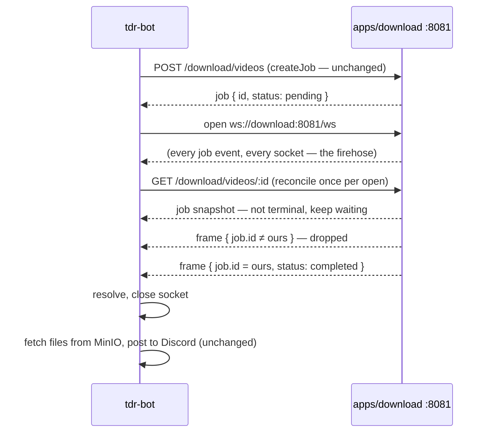
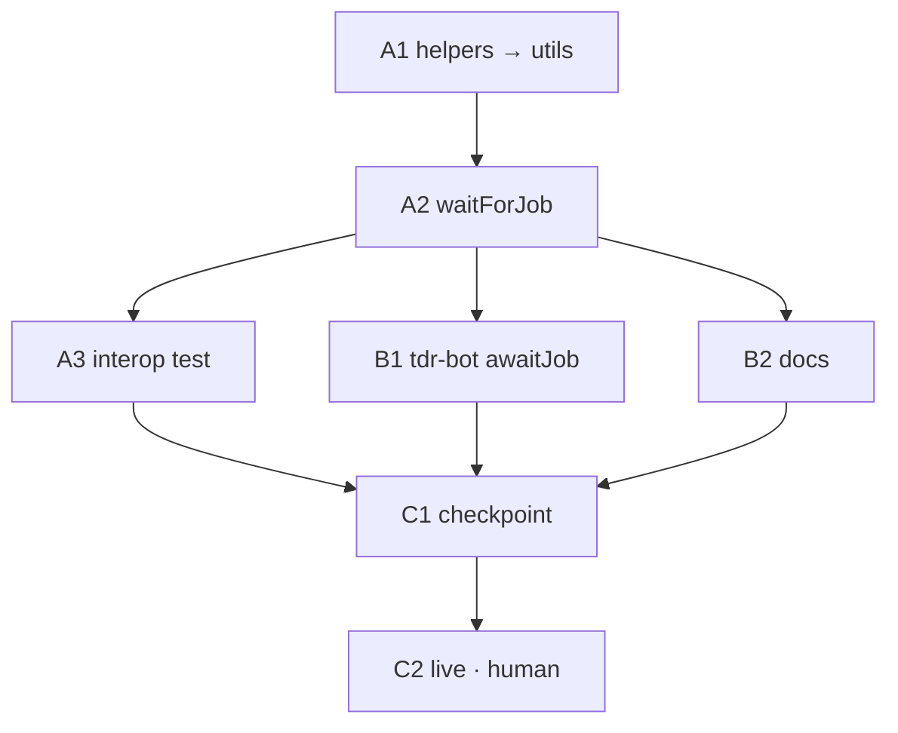

# tdr-bot polls the download API to learn when a job finishes — let the shared client wait on the gateway instead

> **Overview — written for a human.** Everything below this section is written for the
> executing agents; this part is the map.

When someone runs `/download` in Discord, `apps/tdr-bot` creates a job on
`apps/download` and then **asks every two seconds whether it is done yet**: a recursive
`setTimeout` around a plain `GET /download/videos/:id`, counted up to
`DOWNLOAD_POLL_RETRIES`, and on the last tick it cancels the job and tells the user it
timed out (`download-command.service.ts:204-312`).

Meanwhile `apps/download` already **pushes** every job change over a WebSocket gateway
at `/ws`. The browser frontend has used it since plan 013; tdr-bot never has. This plan
gives the shared `DownloadClient` in `packages/utils` one new method that waits on that
gateway, and moves tdr-bot onto it.



| Change                                           | In one sentence                                                                                                                                                                               |
| ------------------------------------------------ | --------------------------------------------------------------------------------------------------------------------------------------------------------------------------------------------- |
| **`DownloadClient.waitForJob(id, { signal })`**  | Opens a socket to the gateway, reconciles with one `GET` on every (re)open, resolves with the first terminal snapshot it sees from either source, reconnects on drop until the signal aborts. |
| **No `ws`, no runtime branching**                | Node 22+ ships a WHATWG `WebSocket` global that also accepts handshake headers; the runtime image is Node 25. Verified, not assumed — see the decision.                                       |
| **The gateway does not change**                  | It already sends every job to every socket; the waiter filters by id. Adding a subscribe protocol would buy nothing at this volume.                                                           |
| **Frame parsing moves to `@lilnas/utils`**       | The browser store and the new waiter parse the same wire format through the same function, so they cannot drift.                                                                              |
| **tdr-bot: a deadline replaces a retry counter** | One `DOWNLOAD_JOB_TIMEOUT_MS` replaces `DOWNLOAD_POLL_RETRIES × DOWNLOAD_POLL_DURATION_MS`; the cancel-on-timeout behaviour stays, and two silent failure paths become user-visible.          |

**Shape:** one doc, **7 tasks in groups A–C**, five waves. Work lands on
`jeremy/download` in this worktree, matching plans 001–017 — no separate branch.

**Key decisions** (full rationale in [Design decisions](#design-decisions)):

- **Firehose plus client-side filter; `download.gateway.ts` is untouched.**
  [Why](#the-gateway-stays-a-firehose)
- **The native `WebSocket` global in both environments — no `ws` dependency, no
  browser/Node branch.** [Why](#native-websocket-no-ws-no-branching)
- **`waitForJob` is the whole public surface, and it is policy-free** — the caller
  supplies the deadline as an `AbortSignal` and owns what happens after it.
  [Why](#waitforjob-is-the-api-and-it-carries-no-policy)
- **Every socket open is followed by one `GET`.** That closes every race between
  "job created" and "socket listening", and terminal states are sticky so ordering never
  matters. [Why](#reconcile-on-every-open)
- **One socket per wait, closed on settle.** No shared connection, no ref-counting.
  [Why](#one-socket-per-wait)
- **One timeout env var; no base-URL env var.** [Why](#env-one-deadline-no-base-url-knob)

**Read next:** [Design decisions](#design-decisions) ·
[Shared Context Pack](#shared-context-pack) · [Task List](#task-list) ·
[Sequencing](#sequencing) · [Final report](#final-report)

---

## How to work this plan

**All work lands on `jeremy/download`**, in the existing worktree at
`/home/jeremy/.nexus-code/worktrees/lilnas/jeremy-download`.

> ⚠️ **Never switch this branch.** The production download container's `/data` volume
> is wired to a checkout of `jeremy/download`; moving it off is a known way to take
> the live service down at boot with `SQLITE_CANTOPEN`.

**Before task 1:** commit this plan doc by itself —
`docs(download): add plan 018 (websocket job waiting)` (precedent: plans 016 and 017).

**Per task:**

1. Work tasks in wave order (see [Sequencing](#sequencing)). Never start a task before
   its dependencies are green.
2. Implement → write or update tests → run **from the package the task touches**
   (A1 touches two — run in both):
   - `pnpm test`
   - `pnpm lint` (eslint **and** prettier — two checks)
   - `pnpm type-check`
3. **`/commit`** — one task, one commit. Pass an explicit scope naming the files this
   task touched. Scopes: `feat(utils)`, `feat(tdr-bot)`, `refactor(download)`,
   `docs(download)` per the dominant package; conventional, lowercase, imperative.
4. Check the box below and append the commit hash.

**Markers:**

| Marker              | Means                                                          |
| ------------------- | -------------------------------------------------------------- |
| `- [ ]`             | Not started                                                    |
| `- [x]` … `abc1234` | Done, with the commit that did it                              |
| ⚠️ **PARTIAL**      | Landed with scope narrowed — say what was left and why, inline |
| ⏭️ **DROPPED**      | Not doing it — say why. Never delete a task                    |
| 🚧 / ⏳             | Blocked. Do not implement                                      |

**When reality disagrees with this plan,** add a short **Findings** note under the
task, then update the downstream tasks that finding invalidates.

---

## Instructions for the orchestrator agent

**Do**

- Delegate every task to a sub-agent — implementation, tests and the commit included.
  One sub-agent per task.
- Write **self-contained** delegation prompts: the task's full text, the relevant parts
  of the [Shared Context Pack](#shared-context-pack), and the
  [Definition of Done](#definition-of-done). When a task depends on an earlier one,
  paste that sub-agent's **reported** exported names and signatures into the prompt.
- Respect the wave order. ⚠️ **A2 and A3 both edit `packages/utils/src/download`** —
  A3 adds a new spec file plus two devDependencies and must not run beside A2, which
  owns `client.ts` and `client.spec.ts`.

**Don't**

- ❌ Read or edit source, tests or config yourself. The only file you may edit is _this
  plan_, to check off tasks and record outcomes.
- ❌ Let sub-agents read this plan.
- ❌ Perform [C2](#human-checkpoints) or the deploy — human
  checkpoints.
- ❌ `git checkout`, `git switch`, rebase, or push.

⚠️ **Other sessions commit on this branch.** Every task's commit must stage **only its
own paths** and use a pathspec-limited `git commit -- <paths>`. If a `/commit`
preflight instructs a `git reset`, **refuse it** — it would destroy another session's
work. Take the repo mutex first:

```bash
until mkdir /tmp/lilnas-download-commit.lock 2>/dev/null; do sleep 5; done
# ... stage only your own paths, commit, verify with: git show --stat HEAD
rmdir /tmp/lilnas-download-commit.lock   # release even on failure or abort
```

⚠️ **Plan 017 is queued against the same two files.** Its C1 adds
`withDiscordIdentity()` to `packages/utils/src/download/client.ts`; its F1 edits
`download()` in `apps/tdr-bot/src/commands/download-command.service.ts` and extends the
static `dockerInstance` mock in that service's test. This plan's A2 adds a method to the
same client, and B1 rewrites `checkJob()` in the same service and the same test file.
There is **no logical conflict** — different methods, different test cases — but
whichever of 017-C1/018-A2 and 017-F1/018-B1 lands second must be delegated with the
first's diff in hand, and the `dockerInstance` test mock must end up carrying **both**
`withDiscordIdentity` and `waitForJob`. Do not run the colliding pairs concurrently.

---

## Design decisions

### The gateway stays a firehose

**Chosen:** `DownloadGateway` is not modified. `broadcastPerViewer()`
(`download.gateway.ts:74-99`) keeps sending every job event to every open socket, and
the waiter drops every frame whose `job.id` is not the one it is waiting on — a string
comparison on the raw envelope _before_ the zod parse, so an uninteresting frame costs a
`JSON.parse` and nothing more.

**Ruled out — a server-side subscribe protocol** (`{ subscribe: [jobId] }` frames, a
per-socket interest set, filtering in `broadcastPerViewer`). It is the "proper" design
and it is disproportionate here:

- **The volume does not justify it.** Frames are emitted only when a job's state
  actually changes: a video job on each status transition, a media job when its
  10-second poll tick observes a queue change. tdr-bot holds a handful of concurrent
  waits at most, on one Discord server. Nothing here is measured in frames per second.
- **It would fork the wire format.** The browser store (`use-job-events.ts`) is built
  around the unfiltered feed (the activity page's whole point) and does its own
  ref-counted interest tracking. A subscribe protocol either becomes a second mode the
  gateway has to keep consistent with the first, or the browser gets migrated too —
  neither is this plan's problem.
- **The two de-duplication levels in `broadcastPerViewer` are per-`isAdmin`, not
  per-socket.** Filtering by job would put a per-socket decision inside a loop that was
  written to serialize at most twice per event. Cheap to do, but it is a change to a
  privacy-bearing code path (plan 008's masking) for no user-visible gain.

**Insertion point, if volume ever matters:** an interest set on `ClientState` in
`download.gateway.ts`, populated from an inbound frame, consulted right before
`client.send(message)`. Nothing in this plan makes that harder later.

### Native `WebSocket`, no `ws`, no branching

**Chosen:** `waitForJob` calls `new WebSocket(url, init)` against the **global**. In a
browser that is the platform's; in Node 22+ it is undici's WHATWG implementation,
enabled by default (`--no-experimental-websocket` is the opt-out). The runtime image is
`node:25.0.0-slim` (`infra/base-images/lilnas-node-base.Dockerfile:1`); local dev is
Node 24.

The research brief assumed the `ws` package would be needed in Node, and therefore a
browser/Node branch and a dependency-placement decision. **Both dissolve** — and the
one property that made `ws` look necessary was checked directly rather than trusted:

| Claim                                                                          | How it was verified (2026-09-19)                                                                                                                                                                      |
| ------------------------------------------------------------------------------ | ----------------------------------------------------------------------------------------------------------------------------------------------------------------------------------------------------- |
| The native client **sends custom handshake headers**                           | A `ws` `WebSocketServer` on port 0 received `x-forwarded-user` / `x-forwarded-user-id` from `new WebSocket(url, { headers })` on Node 24.19; the same constructor call is accepted on `node:22-slim`. |
| The `headers` option is typed                                                  | `undici-types/websocket.d.ts` — `WebSocketInit { protocols?, dispatcher?, headers? }` in every version in the workspace (5.26 / 6.21 / 7.14).                                                         |
| `packages/utils` already type-checks against the global with **no `lib: dom`** | `client.ts` uses `fetch`/`Response`/`RequestInit` from the same `@types/node` `web-globals/fetch.d.ts` that declares `var WebSocket`; `pnpm type-check` is green today.                               |
| jest's `node` environment exposes it                                           | `typeof WebSocket === 'function'` inside a `packages/utils` spec (jest-environment-node 29.7).                                                                                                        |
| `jest.spyOn(globalThis, 'WebSocket')` works                                    | Probed: the spy installs, receives the `(url, init)` args, `mockRestore()` puts the real one back — the same pattern `client.spec.ts` uses for `fetch`.                                               |

⚠️ **The one wrinkle is TypeScript, not the runtime.** `packages/utils/tsconfig.json`
sets no `lib`, so the ESNext default — which **includes `dom`** — applies, and
`@types/node` defers to the DOM `WebSocket` typing whenever one is present. The DOM
constructor is `(url, protocols?: string | string[])`, so a `{ headers }` literal fails
with `TS2353` (probed). The fix is a narrow local constructor type, not a `lib` change:

```ts
/**
 * Node's undici `WebSocket` accepts a non-standard init object carrying
 * handshake headers; the DOM typing that wins in this package does not know
 * it. Browsers receive no init at all (see below), so the cast never lies
 * about what is actually passed.
 */
interface NodeWebSocketInit {
  headers?: Record<string, string>
}
type WebSocketWithInit = new (
  url: string,
  init?: NodeWebSocketInit,
) => WebSocket
const SocketCtor = WebSocket as unknown as WebSocketWithInit
```

**The init object is passed only when `forwardedHeaders` is non-empty.** A browser
`WebSocket` handed an object as its second argument stringifies it into an invalid
subprotocol and throws `SyntaxError`. `browserInstance` never has forwarded headers —
those come only from `withForwardedIdentity()`, which is server-side by design
(`apps/download/src/lib/download-client.ts` documents why). The test suite pins both
halves: no second argument without headers, the init with them.

**Ruled out — `ws` in `packages/utils`** as a direct, optional or peer dependency. Every
placement ships a Node-only module into a package the browser bundle already imports
(`apps/download/src/components/detail/save-local.tsx` is `'use client'` and calls
`DownloadClient.browserInstance`), needs a `typeof window` branch that nothing in
`packages/utils/src` has today, and — because `ws`'s own `browser` field is a stub that
throws if invoked — has no test environment in the package (`jest.config.js` is
`node`-only) to catch the day the branch is wrong. The native global has none of these
problems. `ws` stays exactly where it is: `apps/download`'s server-side implementation
via `@nestjs/platform-ws`. A3 adds it to `packages/utils` **devDependencies only**, to
stand up a real server in one interop test.

**Ruled out — reusing `createJobEventsStore`** from `apps/download/src/lib/use-job-events.ts`.
It reads `window.location`, multiplexes many subscribers over one socket with
ref-counted interest, and hands out React-shaped snapshots. The waiter needs one id,
one socket, one promise. What _is_ shared is the frame parser and the backoff ladder —
A1 moves those, and the store imports them back.

### `waitForJob` is the API, and it carries no policy

**Chosen:**

```ts
waitForJob(id: string, options?: { signal?: AbortSignal }): Promise<DownloadJob>
```

Resolves with the first snapshot whose `status` satisfies `isTerminalDownloadJobStatus`
(`Cancelled` | `Completed` | `Failed`). Rejects with `signal.reason` when the signal
aborts, and with a `DownloadApiError` when the reconcile `GET` answers 404 — the job is
gone, and no amount of waiting brings it back. Everything else (a dropped socket, a 5xx
on the reconcile, the backend being down entirely) is **transient**: the waiter
reconnects on the backoff ladder and keeps going until the signal says stop.

**What it deliberately does not do:**

- **No timeout of its own.** `AuthClient.request` bakes in `AbortSignal.timeout(2_000)`
  because every call it makes is a fast admin check. A download can legitimately take
  minutes; only the caller knows how long it is willing to wait. `AbortSignal.timeout()`
  is the standard way to say it, composes with `AbortSignal.any()` if a caller ever
  needs "deadline **or** user cancelled", and keeps the client free of env-var reads.
- **No cancel on abort.** Today's "gave up → cancel the job" is tdr-bot's policy (a
  Discord user who has stopped waiting should not leave a job running), not something a
  browser caller wants. The client rejects; B1 cancels.
- **No progress callback.** Nothing consumes one. Plan 015 is the place progress lives
  if it ever arrives, and an `onEvent` option is a two-line addition then.

**Ruled out — a generic `subscribeToJobEvents(listener)` primitive** as the public
method with `waitForJob` as sugar. It would be the browser store's job all over again,
minus React, and no caller wants it. The internal shape can grow one later without
touching the public signature.

### Reconcile on every open

The gateway only broadcasts events that happen **while a socket is connected**. A job
that fails in the 40ms between `createJob()` returning and the socket's handshake
finishing would never be seen. Neither would a job that reached `completed` during a
reconnect backoff window.

**Chosen:** on every `open` — the first and every reconnect — the waiter calls
`getJob(id)` over HTTP. If that snapshot is terminal, it resolves immediately. If not,
it keeps listening. Since the socket is registered server-side at the upgrade
(`handleConnection`) before the client's `open` fires, anything emitted after that point
arrives as a frame; anything emitted before is in the `GET`. There is no gap.

Ordering between the two sources never matters because **terminal states are sticky**
in this backend — nothing moves a job out of `Cancelled`/`Completed`/`Failed`
(`DownloadStateService.updateJob` releases the proc and interrupt note on every terminal
transition; `deleteJob` removes the row rather than reviving it). So "first terminal
snapshot from either source" is exactly right, and `updatedAt` comparison would add
nothing.

**Reconcile failure is not fatal.** A 404 is — the job does not exist. Any other
`DownloadApiError` or network error on the reconcile `GET` closes the socket and goes
through the reconnect ladder, which re-runs the `GET`. Invariant: _every successful open
is followed by one successful reconcile, or the attempt is retried_.

### One socket per wait

**Chosen:** each `waitForJob` call opens its own socket and closes it when the promise
settles — resolve, reject, or abort. The backoff ladder, jitter and reset-on-open rules
are the browser store's, imported from A1: `[1s, 2s, 4s, 8s, 15s] ±20%`, attempt counter
reset when a socket actually **opens** (not when one is created).

**Ruled out — one long-lived socket shared by every concurrent wait.** That is the
ref-counted-interest design the browser store has, which the research brief rightly
said not to replicate in a Node client. Concurrent `/download` commands on one server
are rare; the gateway logs a connect/disconnect line per socket and copes with a browser
tab per user today. If the count ever matters, a shared session behind the same
`waitForJob` signature is the insertion point.

**On a tdr-bot restart mid-wait** the wait is lost, exactly as today's in-memory
`checkJobIterationMap` is lost. The job continues on the download side; the user gets no
message. Not a regression, not in scope.

### Env: one deadline, no base-URL knob

**Chosen:** `DOWNLOAD_JOB_TIMEOUT_MS` replaces `DOWNLOAD_POLL_RETRIES` and
`DOWNLOAD_POLL_DURATION_MS` in `apps/tdr-bot/src/env.ts` and `.env.example`. The old
pair only ever meant "retries × interval = how long to wait", and the interval has no
meaning once nothing polls. `.env.example`'s current values multiply to 100s
(`50 × 2000`); the production value is whatever the host's `.env.prod` multiplies to —
[HC1](#human-checkpoints) reads it before deploy. No default in code, matching the two
keys it replaces; `env()` throws on a missing key at command time, not at boot.

**Out of scope — a `DOWNLOAD_API_URL` env var.** `DownloadClient.dockerInstance`
hardcodes `http://download:8081` exactly as `AuthClient.dockerInstance` hardcodes
`http://auth:8081`; the socket URL is derived from that same base
(`ws://download:8081/ws`), so the WebSocket adds no second address to configure. The
compose service name is the address on the lilnas network, in dev and prod alike.
tdr-bot's `DOWNLOAD_URL` constant (`download-command.service.ts:28-31`) is the
public-facing link pasted into Discord, unrelated to either. Introducing a knob for
something that is not configurable anywhere else in the repo would be a new convention
for one consumer.

### Frame parsing moves to `@lilnas/utils`

`parseJobEventFrame`, `isDownloadGatewayMessage`, `DEFAULT_RECONNECT_DELAYS_MS`, the
jitter ratio and `reconnectDelayMs` are pure functions of the wire format and the
reconnect policy — nothing in them is React- or browser-shaped, and they sit next to a
`DownloadJobSchema.safeParse` call that already lives in `@lilnas/utils`. A1 moves them
to `packages/utils/src/download/job-events.ts` and the browser store imports them back,
re-exporting so no import site in `apps/download` changes. Two subscribers, one parser:
a future third event kind or a new schema field lands in one place.

The URL builder is generalised on the way: `jobEventsSocketUrl(baseUrl, location?)`
turns an absolute `http(s)://host:port` base into `ws(s)://host:port/ws`, and a relative
base (`browserInstance`'s `/api`) into `ws(s)://<page host>/ws` from the supplied
`location` — because the Next.js rewrite exposes the gateway at `/ws` on the page
origin, not under `/api` (`apps/download/next.config.js:18-20`). The store's existing
`getJobEventsSocketUrl(location)` becomes a one-line wrapper.

---

## Shared Context Pack

> Pointers to **verify against current code** — the code is the truth, this pack is a
> map. Paste relevant parts into every delegation prompt.

### Repo & conventions

- pnpm monorepo, Turbo. Per-package commands: `pnpm test`, `pnpm lint` (eslint **and**
  prettier), `pnpm type-check` — run from the package dir (`packages/utils`,
  `apps/download`, `apps/tdr-bot`).
- ⚠️ **Never run `pnpm build` in `apps/download`** — it clobbers the `.next` the running
  dev container holds.
- Commits: conventional, scoped — `feat(utils): …`, `feat(tdr-bot): …`.
- **Prettier + eslint must pass on every written file.**
- `packages/utils` has **no barrels** — deep imports (`@lilnas/utils/download/client`).
  Cross-dir imports _inside_ the package that land in emitted `.d.ts` must be relative
  (see the eslint-disable at `packages/utils/src/download/client.ts:1-7`). Same-dir
  imports (`./job-events`) are fine.
- Prefer `type` imports; avoid `any`. `noUnusedLocals` is on — an unused private member
  is a compile error, not a warning.
- `packages/utils` tests: `__tests__/*.spec.ts`, jest **node** env, `clearMocks` +
  `restoreMocks` on. `client.spec.ts` spies `global.fetch` via `mockFetchJson` /
  `mockFetchError` helpers and builds jobs with `buildJob(media, overrides)` — reuse
  them.
- `apps/tdr-bot` tests: `__tests__/*.test.ts`, node env, `ts-jest` with decorator
  options; `download-command.service.test.ts` mocks `@lilnas/utils/download/client` as a
  **static object** and reaches `checkJob` through a `PrivateCheckJob` cast.
- `apps/download` frontend tests: jest **two projects** — `node` for `*.ts`, `jsdom`
  for `*.tsx`. `use-job-events.spec.tsx` is jsdom.

### The code this plan touches

| File                                                                   | Meaning                                                                                                                                                                                                                                                                                                                                                                                                  |
| ---------------------------------------------------------------------- | -------------------------------------------------------------------------------------------------------------------------------------------------------------------------------------------------------------------------------------------------------------------------------------------------------------------------------------------------------------------------------------------------------- |
| `packages/utils/src/download/client.ts`                                | `DownloadClient`: ctor `(baseUrl = 'http://localhost:8081', forwardedHeaders = {})` `:105-108`; `localInstance`/`dockerInstance`/`browserInstance` `:110-138`; `withForwardedIdentity` `:146-151` (new client, same base); `request()` `:162-185` is the one `fetch` choke point; `DownloadApiError` `:54-67` carries `status`; `getJob` `:187-190` → `GET /download/videos/:id`; `cancelJob` `:201-207` |
| `packages/utils/src/download/types.ts`                                 | `TERMINAL_DOWNLOAD_JOB_STATUSES` / `isTerminalDownloadJobStatus` `:58-70`; `DownloadJobEventType` `:181`; `DownloadJobEvent` `:193`; `DOWNLOAD_JOB_EVENT_TYPE = 'download-job'` `:203`; `DownloadGatewayMessage { type; data? }` `:212`                                                                                                                                                                  |
| `packages/utils/src/download/schema.ts`                                | `DownloadJobStatus` enum `:9-37`; `DownloadJobSchema` (what `parseJobEventFrame` validates against)                                                                                                                                                                                                                                                                                                      |
| `packages/utils/src/download/__tests__/client.spec.ts`                 | the suite A2 extends — `mockFetchJson`, `mockFetchError`, `buildJob`, `VIDEO_MEDIA` helpers at the top                                                                                                                                                                                                                                                                                                   |
| `packages/utils/package.json`                                          | `exports: { "./*": "./dist/*.js" }`; peer deps `@nestjs/common`/`prom-client`/`rxjs` all optional; devDeps are where A3's `ws`/`@types/ws` go                                                                                                                                                                                                                                                            |
| `packages/utils/src/auth/client.ts:25-36`                              | `AuthClient.request` — the `AbortSignal.timeout` precedent this plan deliberately does **not** copy into the shared method                                                                                                                                                                                                                                                                               |
| `apps/download/src/lib/use-job-events.ts`                              | **the browser store.** `DEFAULT_RECONNECT_DELAYS_MS` `:33`, `RECONNECT_JITTER_RATIO` `:42`, `getJobEventsSocketUrl` `:128`, `isDownloadGatewayMessage` `:135`, `parseJobEventFrame` `:167`, `reconnectDelayMs` `:195` — A1 moves the pure ones out. `createJobEventsStore` `:220` and everything React stays                                                                                             |
| `apps/download/src/lib/__tests__/use-job-events.spec.tsx:36-134`       | the `getJobEventsSocketUrl` and `parseJobEventFrame` tests A1 relocates (11 cases)                                                                                                                                                                                                                                                                                                                       |
| `apps/download/src/download-gateway/download.gateway.ts`               | **unchanged by this plan.** `@WebSocketGateway({ path: '/ws' })`; `handleConnection` captures `resolveForwardedUser(req)?.email` off the upgrade request `:43-49`; `broadcastPerViewer` `:74-99`                                                                                                                                                                                                         |
| `apps/download/src/auth/forwarded-user.ts:8-19`                        | the trust model: 8081 has no Traefik router; the Docker network is the boundary; `X-Forwarded-User*` are trusted on the same basis as `apps/auth`'s internal routes. The same headers on a WS upgrade get the same treatment                                                                                                                                                                             |
| `apps/download/src/download/download.controller.ts:938-975`            | `GET /videos/:id` — falls back to the durable row after a restart; **404** (`HttpException` with `status: 404`) when the job is unknown                                                                                                                                                                                                                                                                  |
| `apps/download/next.config.js:11-22`                                   | `/api/:path*` → `:8081/:path*`, `/ws/:path*` → `:8081/ws/:path*` — why the browser socket URL is `/ws` on the page origin, not `/api/ws`                                                                                                                                                                                                                                                                 |
| `apps/download/scripts/verify/envelopes.ts:185-200`                    | calls `createJob`/`getJob`/`cancelJob` "tdr-bot's three legacy `DownloadClient` methods" — a description of the pre-`Media` **response projection** they once returned, not a deprecation of the methods. All three stay; `getJob` is what the reconcile uses                                                                                                                                            |
| `apps/tdr-bot/src/commands/download-command.service.ts`                | `private client = DownloadClient.dockerInstance` `:71`; `checkJobIterationMap` `:72`; `download()` `:80-125` creates the job, replies, then fires `checkJob` un-awaited `:117`; `checkJob` `:204-312` **is what B1 replaces**; `sendEphemeralNotice` `:327`, `sendFiles` `:351`, `formatJobError` `:314` stay                                                                                            |
| `apps/tdr-bot/src/commands/__tests__/download-command.service.test.ts` | 5 `checkJob` cases `:121-260` (failed with/without error block, cancelled, poll-max → cancel + notice, follow-up failure swallowed); env set in `beforeEach` `:115-116`                                                                                                                                                                                                                                  |
| `apps/tdr-bot/src/env.ts`                                              | `EnvKeys` — `DOWNLOAD_POLL_DURATION_MS` / `DOWNLOAD_POLL_RETRIES` go, `DOWNLOAD_JOB_TIMEOUT_MS` comes                                                                                                                                                                                                                                                                                                    |
| `apps/tdr-bot/.env.example:29-30`                                      | `DOWNLOAD_POLL_RETRIES=50` / `DOWNLOAD_POLL_DURATION_MS=2000`                                                                                                                                                                                                                                                                                                                                            |
| `packages/utils/src/env.ts`                                            | `env(key, default?)` — **throws** when the key is missing and no default is given                                                                                                                                                                                                                                                                                                                        |
| `docs/features/download/backend.md:1794-1812`                          | "Recovering the WebSocket hook" — the gateway's wire format is described as unchanged there; B2 adds the second subscriber                                                                                                                                                                                                                                                                               |

### ⚠️ Gotchas

- **DOM typing wins for `WebSocket` in `packages/utils`** (default `lib` includes
  `dom`). `new WebSocket(url, { headers })` is `TS2353`. Use the `WebSocketWithInit`
  local type from [the decision](#native-websocket-no-ws-no-branching) — do **not** add
  a `lib` array to `tsconfig.json` (it would change what every other file in the package
  compiles against).
- **Never pass a second argument to `WebSocket` when there are no headers.** In a
  browser an object there throws `SyntaxError` (invalid subprotocol). Build the call as
  `headers ? new SocketCtor(url, { headers }) : new SocketCtor(url)` and test both.
- **Register `onmessage`/`onclose` synchronously after construction.** Frames the server
  sends right after the handshake are delivered in order to handlers that exist by then.
- **Per the WebSocket spec an `error` is always followed by a `close`** — schedule the
  reconnect in `onclose` only, or one failure double-schedules (the browser store's
  comment at `use-job-events.ts:329-333` says the same).
- **`close()` during `CONNECTING` is legal** and aborts the handshake — that is how an
  abort mid-connect is honoured.
- **`AbortSignal.timeout()` is not faked by jest's fake timers** (it uses Node's
  internal timer, not the global `setTimeout`). In `packages/utils` tests drive aborts
  with an `AbortController`; in tdr-bot's tests use a tiny real timeout (see B1).
- `jest.spyOn(globalThis, 'WebSocket')` restores under the package's `restoreMocks:
true` — but a `globalThis.location` stub does not; `delete` it in `afterEach`.
- tdr-bot's `tsconfig.json` has `lib: ["dom", …]` — it never constructs a socket, so
  nothing there needs the cast.
- `noUnusedLocals` — if A2 ships a private helper before its caller, it must be
  `export`ed or it fails type-check (plan 016 hit this).
- The `use-job-events.spec.tsx` cases A1 relocates run under **jsdom** today; their new
  home in `packages/utils` is **node**. They are pure-function tests and pass in either,
  but `parseJobEventFrame`'s `DownloadJobSchema` fixture must be a full valid
  `DownloadJob` — copy the spec's fixture, don't hand-roll a partial.
- **Do not touch `download.gateway.ts` or its spec.** If a task believes it must, stop
  and add a Findings note.

### Definition of Done

Include this **verbatim** in every delegation:

> **Done means:** implemented; tests written or updated following the package's
> existing conventions and passing; lint (eslint **and** prettier) and type-check clean
> for every touched package; committed with `/commit`, pathspec-limited, under the repo
> mutex. Report back: files changed, exported names introduced with their signatures,
> test summary, commit hash(es).

**Addendum for every task:** ❌ do not run `pnpm build` in `apps/download`. ❌ do not
restart, stop or recreate any container. ❌ do not `git checkout`/`switch`/rebase/push.
❌ do not edit `download.gateway.ts`.

---

## Task List

### Group A — `packages/utils`: the shared wire helpers and the waiter

- [x] **A1. Move the pure gateway helpers into `@lilnas/utils`.** `95641df5` Create
      `packages/utils/src/download/job-events.ts` and move these out of
      `apps/download/src/lib/use-job-events.ts`, **unchanged in behaviour**:

  ```ts
  export const DEFAULT_RECONNECT_DELAYS_MS: readonly number[] // [1_000, 2_000, 4_000, 8_000, 15_000]
  export const RECONNECT_JITTER_RATIO: number // 0.2 — was module-private; exported so the waiter shares it
  export function reconnectDelayMs(
    attempt: number,
    delays: readonly number[],
    random: () => number,
  ): number
  export function isDownloadGatewayMessage(
    value: unknown,
  ): value is DownloadGatewayMessage
  export function parseJobEventFrame(
    rawData: unknown,
  ): DownloadJobEvent | undefined
  ```

  plus one generalised URL builder:

  ```ts
  /**
   * The gateway URL for a client base. An absolute http(s) base maps scheme
   * and keeps host:port — `http://download:8081` → `ws://download:8081/ws`.
   * A relative base (`browserInstance`'s `/api`) is served by the Next.js
   * `/ws` rewrite on the PAGE origin, not under the base path, so it needs
   * `location` and ignores the base's path entirely. Throws when a relative
   * base is given with no location — there is nothing to derive from.
   */
  export function jobEventsSocketUrl(
    baseUrl: string,
    location?: Pick<Location, 'host' | 'protocol'>,
  ): string
  ```

  Carry the existing doc comments with the functions (the reconnect-ladder and
  jitter rationale, the silent-rejection rationale on `parseJobEventFrame`). Imports
  inside `job-events.ts` are same-directory (`./schema`, `./types`) — no
  eslint-disable needed. Then edit `apps/download/src/lib/use-job-events.ts`: import
  the five from `@lilnas/utils/download/job-events` and **re-export** them so every
  existing import site keeps working. Keep `getJobEventsSocketUrl(location)`'s
  signature, with its body reduced to `jobEventsSocketUrl('/api', location)` — the
  browser factory's base — so `createJobEventsStore` is untouched.

  Tests: create `packages/utils/src/download/__tests__/job-events.spec.ts` with the
  11 relocated cases (`use-job-events.spec.tsx:36-134`) plus `jobEventsSocketUrl`
  cases: `http://download:8081` → `ws://download:8081/ws`; `https://…` → `wss://…`;
  `http://localhost:8081` → `ws://localhost:8081/ws`; relative `/api` + https
  location → `wss://<host>/ws`; relative + no location throws; and one `reconnectDelayMs`
  case (clamps to the last rung; jitter within ±20%). **Delete** the relocated cases
  from `use-job-events.spec.tsx` (the `getJobEventsSocketUrl` describe stays, as the
  wrapper's test). Run all three commands in **both** `packages/utils` and
  `apps/download`. ⚠️ **Type-check resolves `@lilnas/utils` through its `exports` map
  to `dist/`** (`moduleResolution: bundler` in both apps), while jest maps it to
  `src/` — so `pnpm build` in **`packages/utils`** (never in `apps/download`) must
  run before `apps/download`'s type-check can see the new subpath.

- [x] **A2. `DownloadClient.waitForJob`.** `376981a6` Edit `packages/utils/src/download/client.ts`.

  ```ts
  export interface WaitForJobOptions {
    /**
     * The deadline, and the only way to stop waiting. Rejects with
     * `signal.reason` — for `AbortSignal.timeout()` that is a `TimeoutError`
     * DOMException. Omit it and this waits forever, reconnecting as needed.
     */
    signal?: AbortSignal
  }

  /**
   * Resolves with the job's first terminal snapshot — `completed`, `failed`
   * or `cancelled` — as seen over the download gateway's WebSocket, with one
   * `getJob()` on every socket open to cover whatever happened before the
   * socket was listening. Rejects on abort, and with a `DownloadApiError`
   * when the job does not exist (404). Everything else — a dropped socket,
   * a 5xx, the backend being down — is retried on the reconnect ladder until
   * the signal says stop. Carries no timeout and does no cancelling of its
   * own: both are the caller's policy (see tdr-bot's `/download` for one).
   */
  async waitForJob(id: string, options: WaitForJobOptions = {}): Promise<DownloadJob>
  ```

  **Behaviour, each line a test:**
  - Already-aborted signal → rejects with `signal.reason` before opening anything.
  - Socket URL is `jobEventsSocketUrl(this.baseUrl, globalThis.location)` — computed
    **at call time**, so constructing `browserInstance` during SSR touches no global.
    `dockerInstance` → `ws://download:8081/ws`; `browserInstance` with a stubbed
    `globalThis.location` → `wss://<host>/ws`.
  - On `open`: `attempt = 0`; call `this.getJob(id)`. Terminal → resolve, close. 404
    (`DownloadApiError.status === 404`) → reject, close. Any other error → close the
    socket and let `onclose` schedule the reconnect (the reconnect re-runs the `GET`).
  - On `message`: `JSON.parse`; if the raw envelope is not `DOWNLOAD_JOB_EVENT_TYPE`
    or `data.job.id !== id`, drop it **before** `parseJobEventFrame` (the zod parse is
    the expensive part; the firehose carries every job). Otherwise
    `parseJobEventFrame`; a malformed frame is dropped silently; a terminal job
    resolves and closes.
  - On `close` (not `error`): if not settled, `setTimeout(open,
reconnectDelayMs(attempt++, DEFAULT_RECONNECT_DELAYS_MS, Math.random))`. Fake timers
    prove the ladder climbs `1s → 2s → 4s` and resets after an `open`.
  - On abort: clear any pending timer, `close()` the socket (even if `CONNECTING`),
    reject with `signal.reason`; remove the abort listener in every settle path so the
    signal does not retain the closure.
  - A frame or `GET` result arriving after settle is ignored (guard with a `settled`
    flag, same as the store's `disposed`).
  - Forwarded headers: a client from `withForwardedIdentity()` passes
    `{ headers: this.forwardedHeaders }` as the second constructor argument; a client
    without any passes **no second argument**. Both asserted on the `WebSocket` spy's
    call args.
  - The socket is closed after resolve (assert `close` called once).

  Implement with a private helper module-local to `client.ts` or as a private method —
  executor's call — using the `WebSocketWithInit` cast from the
  [design decision](#native-websocket-no-ws-no-branching), verbatim comment included.
  `withForwardedIdentity()` needs no change (it already threads `forwardedHeaders`).

  Tests in `client.spec.ts`, new `describe('waitForJob')`: a `FakeSocket` class
  (records `(url, init)`, exposes `readyState`, `close()` spy, and `emitOpen()` /
  `emitMessage(data)` / `emitClose()` that invoke the assigned `onopen`/`onmessage`/
  `onclose`), installed with `jest.spyOn(globalThis, 'WebSocket').mockImplementation`;
  `mockFetchJson`/`mockFetchError` for the reconcile; `jest.useFakeTimers()` for the
  ladder; `AbortController` for aborts. Frames are `JSON.stringify({ type:
'download-job', data: { type: 'updated', job: buildJob(VIDEO_MEDIA, { status }) } })`.

- [x] **A3. Real-server interop test.** `f948d4ea` ⚠️ Same package as A2 — runs after it. Add
      `ws` `8.21.2` and `@types/ws` `8.18.1` to `packages/utils/package.json`
      **devDependencies** (versions pinned to what `apps/download` already resolves, so
      the lockfile gains no new package). Create
      `packages/utils/src/download/__tests__/wait-for-job.interop.spec.ts`:

  ```ts
  const server = new WebSocketServer({ port: 0 }) // from 'ws'
  const port = (server.address() as AddressInfo).port
  const client = new DownloadClient(
    `http://127.0.0.1:${port}`,
  ).withForwardedIdentity({
    email: 'probe@example.com',
    userId: 'u1',
  })
  ```

  Mock `fetch` for the reconcile (non-terminal), and assert **on the server side** —
  in the `connection` handler's `req.headers` — that the upgrade carried
  `x-forwarded-user` / `x-forwarded-user-id`; then push a terminal frame from the
  server and assert `waitForJob` resolves with it. A second case: the server closes
  the socket once and the client reconnects — with **real** timers and the real 1s
  first rung under a generous `jest.setTimeout`. ❌ Do not add a delays option to the
  public signature just to make this test faster. Close the server in `afterEach`.
  This is the one test that proves the native client interoperates with the exact
  library the gateway runs on (`@nestjs/platform-ws` is `ws`), and that the header
  claim holds on the CI Node, not just the machine the plan was written on. Note the
  Node floor in a comment: the global `WebSocket` needs Node ≥ 22; the runtime image
  is 25.

### Group B — `apps/tdr-bot`: consume it, and docs

- [x] **B1. Replace `checkJob()` with a `waitForJob` wait.** `6cc7cfe4` Edit
      `apps/tdr-bot/src/commands/download-command.service.ts`,
      `apps/tdr-bot/src/env.ts`, `apps/tdr-bot/.env.example`, and
      `apps/tdr-bot/src/commands/__tests__/download-command.service.test.ts`.

  **Before** (`:204-312`, abridged): `checkJob()` calls `getJob`, switches on status,
  and otherwise increments `checkJobIterationMap` and `setTimeout`s itself again every
  `DOWNLOAD_POLL_DURATION_MS`; at `DOWNLOAD_POLL_RETRIES` it fires `cancelJob`
  **un-awaited** and posts "timed out". A `getJob` rejection escapes the un-awaited
  `checkJob` call in `download()` `:117` as an unhandled rejection and the user hears
  nothing; a `Completed` job with zero `downloadUrls` falls through to "still pending"
  and polls until the timeout, then cancels a completed job (a 404).

  **After** — `checkJob` and `checkJobIterationMap` are deleted; `download()` calls the
  new method the same way (`void this.awaitJob({...})` — un-awaited on purpose, the
  interaction has already been replied to), passing the command's `url` through for the
  notices:

  ```ts
  private async awaitJob({ author, description, id, interaction, jobId, url }: {
    author?: string
    description?: string
    id: string
    interaction: SlashCommandContext[0]
    jobId: string
    url: string
  }): Promise<void> {
    const timeoutMs = Number(env(EnvKeys.DOWNLOAD_JOB_TIMEOUT_MS))
    const signal = AbortSignal.timeout(timeoutMs)

    let job: DownloadJob
    try {
      job = await this.client.waitForJob(jobId, { signal })
    } catch (error) {
      if (signal.aborted) {
        this.logger.log({ id, jobId, timeoutMs }, 'download job timed out')
        await this.cancelQuietly({ id, jobId })
        await this.sendEphemeralNotice({
          content: `download timed out while waiting for <${url}> to finish`,
          id, interaction, jobId,
        })
        return
      }

      this.logger.error({ error, id, jobId }, 'lost track of download job')
      await this.sendEphemeralNotice({
        content: `download failed for <${url}>: lost track of the job`,
        id, interaction, jobId,
      })
      return
    }

    if (!isVideo(job.media)) { /* existing error log; return */ }
    const media = job.media

    switch (job.status) {
      case DownloadJobStatus.Completed: {
        const urls = media.downloadUrls ?? []
        if (urls.length === 0) {
          await this.sendEphemeralNotice({ content: `download finished for <${media.sourceUrl}> but produced no files`, … })
          return
        }
        this.logger.log({ id, job }, 'download job completed')
        await this.sendFiles({ author, description, id, interaction, job })
        return
      }
      case DownloadJobStatus.Failed: {
        // existing notice + formatJobError — wording unchanged
        return
      }
      case DownloadJobStatus.Cancelled: {
        // existing notice — wording unchanged
        return
      }
      default: {
        // unreachable: waitForJob only resolves terminal snapshots — log and return
        return
      }
    }
  }

  /** Best-effort: a 404 here means the job finished on its own in the meantime. */
  private async cancelQuietly({ id, jobId }: { id: string; jobId: string }): Promise<void> {
    try { await this.client.cancelJob(jobId) }
    catch (error) { this.logger.warn({ error, id, jobId }, 'Failed to cancel timed-out download job') }
  }
  ```

  Every user-facing string that exists today keeps its exact wording; the two new
  ones ("lost track of the job", "produced no files") are the two silent paths made
  visible. `sendFiles` is now awaited, so its rejection reaches the call site in
  `download()` — which becomes
  `void this.awaitJob({...}).catch(error => this.logger.error({ error, id, jobId }, 'awaitJob threw'))`
  so that **nothing** escapes as an unhandled rejection.

  `env.ts`: remove `DOWNLOAD_POLL_DURATION_MS` and `DOWNLOAD_POLL_RETRIES`, add
  `DOWNLOAD_JOB_TIMEOUT_MS`. `.env.example`: replace the two lines with
  `DOWNLOAD_JOB_TIMEOUT_MS=100000` and a comment `# was DOWNLOAD_POLL_RETRIES ×
  DOWNLOAD_POLL_DURATION_MS`. `grep -rn DOWNLOAD_POLL` across the repo must come back
  empty except this plan and `docs/archive/`.

  Tests — rewrite the `checkJob` describe as `awaitJob`; the static mock gains
  `waitForJob: jest.fn()` (⚠️ and keeps `withDiscordIdentity` if 017-F1 has landed);
  `beforeEach` sets `DOWNLOAD_JOB_TIMEOUT_MS`:
  - failed → one ephemeral follow-up with the fenced error block (existing case,
    re-pointed at `waitForJob.mockResolvedValue`)
  - failed with no `error` → no fenced block (existing)
  - cancelled → notice (existing)
  - completed with urls → `sendFiles` path: `channel.send` called with the files
    (new — the old suite never covered the happy path because it was buried under the
    poll loop)
  - completed with no urls → the "produced no files" notice, `channel.send` not called
    (new)
  - **timeout** → `DOWNLOAD_JOB_TIMEOUT_MS=5`; `waitForJob` mocked as
    `(_, { signal }) => new Promise((_, reject) => signal.addEventListener('abort', () =>
reject(signal.reason)))`; asserts `cancelJob('job-1')` was awaited, one follow-up with
    flags `[64]`, `channel.send` not called (replaces the poll-max case)
  - `cancelJob` rejecting on timeout is swallowed with a warn (new)
  - `waitForJob` rejecting with a non-abort error → the "lost track" notice, no cancel
    (new)
  - follow-up failure swallowed (existing)
  - `download()` passes `waitForJob` a signal and the created job's id — assert on
    `waitForJob.mock.calls[0]` (new; `createJob` mocked to return a video job)

  **Findings:** `apps/download/src/env.ts` declares its own, unrelated
  `DOWNLOAD_POLL_DURATION_MS`/`DOWNLOAD_POLL_RETRIES` keys with no usages found under
  `apps/download/src`. Out of scope (never touch `apps/download` beyond A1's
  re-export) — left alone. `docs/features/download/plans/002-live-functional-tests.md:797`
  also matches `DOWNLOAD_POLL`; B2 confirmed it documents `apps/download`'s own
  (vestigial) `EnvKeys`, not tdr-bot's, so no update was needed there.

- [x] **B2. Docs.** `d034df9a` No code. Edit `docs/features/download/backend.md` next to its
      "Recovering the WebSocket hook" section (`:1794-1812`): a short paragraph that the
      gateway now has two subscribers — the browser store and
      `DownloadClient.waitForJob` in `@lilnas/utils` — that both parse frames through
      `@lilnas/utils/download/job-events`, that the gateway itself is unchanged and still
      broadcasts unfiltered, and that a Node subscriber uses the native `WebSocket`
      global (Node ≥ 22) with forwarded-identity headers on the upgrade when it has them.
      Edit `docs/features/download/spec.md` only if it has a section describing tdr-bot's
      `/download` flow (grep `tdr-bot`; if there is none, say so in a Findings note and
      skip). Document `DOWNLOAD_JOB_TIMEOUT_MS` wherever tdr-bot's env is listed beyond
      `.env.example` (grep `DOWNLOAD_POLL` under `apps/tdr-bot` and `docs/` — anything
      outside `docs/archive/` gets updated).

### Group C — verification

- [x] **C1. Integration checkpoint.** ✅ (report-only, no commit — verified 2026-09-20) ⚠️ **Report, do not repair.** No files change.
      From each of `packages/utils`, `apps/download`, `apps/tdr-bot`: `pnpm test`,
      `pnpm lint` (both checks), `pnpm type-check`. Then from the repo root: `pnpm run
type-check` and `pnpm test`. Must see every prior commit in this plan.

  ⚠️ **Known-red and NOT this plan's — report, do not chase:** repo-root `pnpm test`
  fails on `@lilnas/equations` and `@lilnas/tdr-code` (neither imports anything this
  plan touches); repo-root `//#mockups:lint` may fail on prettier under
  `docs/features/download/designs/`; a backend-suite `"worker process has failed to
exit gracefully"` warning; `Unknown option "testTimeout"` jest warnings. ❌ **Do not
  run `lint:fix`.**

  **Report:** each command's result, and an explicit statement that any failure is
  pre-existing, with the evidence.

  **Result:** `packages/utils`, `apps/download`, `apps/tdr-bot` — test/lint/type-check
  all green, including A1's `job-events.spec.ts`, A2's `waitForJob` describe block,
  A3's `wait-for-job.interop.spec.ts`, and B1's 10 `awaitJob` tests. Repo-root
  `pnpm test` fails only on the pre-declared `@lilnas/equations` and `@lilnas/tdr-code`
  known-red suites. Repo-root `pnpm run type-check` fails only on `@lilnas/dashcam`
  (and `@lilnas/swole` standalone) — not on the known-red list, but **not caused by
  this effort either**: root cause is a stale pnpm virtual-store copy of
  `@lilnas/utils` (missing `dist/`, only has `src/`) that those two packages resolve
  against; `apps/download`/`apps/tdr-bot`/`apps/auth` resolve the real
  `packages/utils` directory (current `dist/`) and pass clean. Other repo-root
  "ELIFECYCLE" lines (`auth`, `download`, `utils`, `swole`) are turbo's fail-fast
  task cancellation once a sibling task fails, not genuine failures — confirmed by
  clean standalone reruns of each.

- [x] 🚧 **C2. Live verification — HUMAN CHECKPOINT.** Not an agent task. See
      [Human checkpoints](#human-checkpoints). Confirmed done by Jeremy, 2026-09-24.

---

## Sequencing

### DAG



### Waves

| Wave | Run              | Why it works                                                                                                                                                   |
| ---- | ---------------- | -------------------------------------------------------------------------------------------------------------------------------------------------------------- |
| 1    | **A1**           | Alone — everything else imports what it exports. Touches both `packages/utils` and `apps/download`.                                                            |
| 2    | **A2**           | Alone — owns `client.ts` and `client.spec.ts`; A3 and B1 both need its reported signature.                                                                     |
| 3    | **A3 ∥ B1 ∥ B2** | Disjoint: a new spec + `package.json` devDeps in utils; tdr-bot's service/env/test; docs only. B1's tests mock `waitForJob`, so they need only A2's signature. |
| 4    | **C1**           | Must see every prior commit.                                                                                                                                   |
| 5    | **C2**           | Human checkpoint.                                                                                                                                              |

### Dependency table

| Task | Depends on | Parallel with |
| ---- | ---------- | ------------- |
| A1   | —          | —             |
| A2   | A1         | —             |
| A3   | A2         | B1, B2        |
| B1   | A2         | A3, B2        |
| B2   | A2         | A3, B1        |
| C1   | A3, B1, B2 | —             |
| C2   | C1         | —             |

### Critical path

**A1 → A2 → B1 → C1 → C2.** A1 and A2 are strictly serial and everything hangs off A2;
there is nothing to compress. If the schedule matters more than the commit split, A1
and A2 can be one delegation with two commits.

### Human checkpoints

In order — the executor/orchestrator performs **none** of these:

1. **HC1 (before deploy): set the env var on the host.** On `lilnas.io`, read
   `DOWNLOAD_POLL_RETRIES` and `DOWNLOAD_POLL_DURATION_MS` out of
   `apps/tdr-bot/.env.prod`, write `DOWNLOAD_JOB_TIMEOUT_MS` as their product, and
   remove the two old keys. ⚠️ `env()` throws on a missing key, so a tdr-bot deployed
   without it answers every `/download` with an error at wait time (job created, no
   follow-up). Do this **before** `docker-compose up`.
2. **HC2 (deploy):** rebuild base images (`./infra/base-images/build-base-images.sh`),
   then from the repo root `docker-compose up -d --build tdr-bot download`. `download`
   only picks up A1's re-export change; `tdr-bot` is the one that matters. Never run
   `apps/*/deploy.yml` standalone.
3. 🚧 **C2 — live verification.** In the dev stack
   (`docker-compose -f docker-compose.dev.yml up -d download tdr-bot`), run `/download`
   in the dev guild with a short public video and watch
   `docker-compose -f docker-compose.dev.yml logs -f tdr-bot download`:
   - download logs `WebSocket client connected` when the wait starts and `…
disconnected` when the file posts — one pair per command, none left open.
   - The file lands in the channel **without** any `GET /videos/:id` lines between the
     reconcile and completion (the poll is gone).
   - **Reconnect:** start a longer download, `docker-compose -f docker-compose.dev.yml
restart download` mid-way, confirm tdr-bot reconnects (a second `connected` line) and
     still delivers — or, if the restart killed the job (`reconcileInterruptedJobs`
     marks it `failed`), delivers the **failed** notice rather than hanging.
   - **Timeout:** set `DOWNLOAD_JOB_TIMEOUT_MS=5000` in `apps/tdr-bot/.env`, restart
     tdr-bot, run `/download` on something slow; expect the "timed out" notice and a
     `cancelled` job in the download UI. Restore the value.
   - Then repeat the happy path once against production after HC2.

   ⚠️ Before trusting any live result, confirm the dev backend is actually running this
   plan's code — `nest start -w` has silently stopped watching before (see plan 013's
   stale-backend finding). `docker restart lilnas-download-dev` if in doubt.

---

## Final report

**Status: complete.** All tasks (A1–C1) landed, and C2 live verification was confirmed
done by Jeremy on 2026-09-24. HC1/HC2 (env var + deploy) are standard deploy steps, not
tracked here as blockers.

When the last box is checked, the executor reports — and stops:

1. Per-task outcome with commit hashes (including any ⚠️ PARTIAL / ⏭️ DROPPED and why).
2. Test results per package (`utils`, `download`, `tdr-bot`) and repo-wide, with
   pre-existing failures named and evidenced as pre-existing.
3. Deviations from the plan (Findings notes), and downstream tasks they changed.
4. Deferred — every outstanding human checkpoint (HC1, HC2 and C2 will all be
   outstanding), and the two insertion points this plan chose not to build: a
   server-side subscribe protocol in the gateway, and a shared socket session across
   concurrent waits.
5. Open questions discovered during implementation.
6. **Do not deploy, push, merge, or touch production.**
