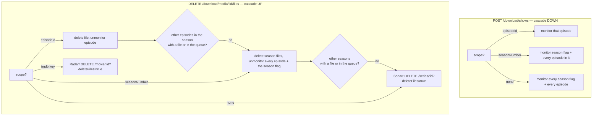
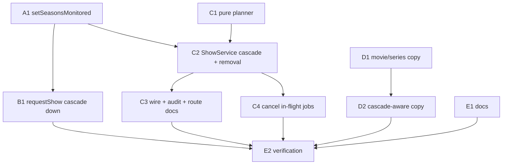

# Monitoring cascades down on request, up on delete, and a whole-title delete removes it from Radarr/Sonarr — `apps/download`

## Overview

> Written for a human first. Everything below this section is written for whoever
> executes the plan. If a claim here needs more, it links to where the detail lives.

`apps/download` wraps Radarr (movies) and Sonarr (shows). Sonarr keeps **three
independent `monitored` flags** — series, season, episode — and this app has only ever
written two of them. The season flag is never touched by any code path, so after this
app unmonitors and deletes every episode of a season, Sonarr's own UI and its RSS /
missing-episode jobs still see a _monitored season_. Radarr has just the one flag.

This plan makes monitoring state consistent in both directions and changes what a
whole-title delete means:

| Change                                             | In one sentence                                                                                                                                                                                 |
| -------------------------------------------------- | ----------------------------------------------------------------------------------------------------------------------------------------------------------------------------------------------- |
| **Request cascades down**                          | An episode request monitors that episode; a season request monitors the season flag and every episode in it; a bare series request monitors every season flag and every episode.                |
| **Delete cascades up**                             | Deleting the last downloaded episode of a season also unmonitors the season; deleting the last downloaded season also removes the series.                                                       |
| **A season delete writes the season flag**         | The first time any code path here writes `series.seasons[].monitored`.                                                                                                                          |
| **Whole-title delete = removal from the library**  | A movie or whole-series delete now calls Radarr's / Sonarr's real `DELETE` with `deleteFiles=true`, instead of "delete files + unmonitor". The title can still be re-requested; it is re-added. |
| **The dialog tells the truth**                     | "The series stays in Sonarr" becomes "…is removed from Sonarr"; a season/episode delete that will cascade says so before the user confirms.                                                     |
| **A removed title's in-flight jobs are cancelled** | Otherwise a `searching` job for a title that no longer exists upstream sits there until the next restart fails it.                                                                              |



**Shape:** one doc, **12 tasks in groups A–E**, four waves. **No feature branch** — work
lands on `jeremy/download` in this worktree, matching plans 001–018
([why](#no-feature-branch-or-worktree)).

**Key decisions**, in brief — full reasoning in [Design decisions](#design-decisions):

- **`DELETE /media/:id/files` absorbs the cascade and the full removal.** The two
  job-keyed routes (`DELETE /movies/:jobId`, `DELETE /shows/:jobId`) stay as they are.
  [Why](#the-files-endpoint-absorbs-it-the-job-keyed-routes-stay)
- **The existing `unmonitorAndDelete` methods are reused, not rewritten.**
  [Why](#reuse-unmonitoranddelete)
- **Cascade detection is computed from one Sonarr snapshot, not re-queried after each
  delete.** [Why](#cascade-detection-from-one-snapshot)
- **An in-flight download counts as "remaining".** Deleting a sibling never cancels a
  download that is mid-flight. [Why](#in-flight-downloads-count-as-remaining)
- **A bare series request is an explicit "monitor everything".** The old "don't widen
  on re-request" comment is retired _for that path only_; `ensureSeries` itself still
  never widens on its own. [Why](#a-bare-series-request-monitors-everything)
- **The fresh-add case of a scoped request is an accepted gap** — Sonarr creates the
  episodes asynchronously after `POST /series`, so "monitor only season 3" cannot be
  applied at add time without a refresh wait. [Why](#accepted-gap-scoped-request-on-a-fresh-add)

> **Accepted gap:** the request-side cascade is only exact for a series **already in
> Sonarr**. A season- or episode-scoped request that has to _add_ the series still adds
> it with `monitor: 'all'`. Reachable only from tdr-bot / the raw API — the web UI cannot
> request a season of a show that is not in the library, because there are no seasons
> to list yet.

> **Baseline, uncommitted:** the working tree carries the whole-series re-monitor bug
> fix (`show.service.ts`, `sonarr.service.ts`, and their tests). Its
> `setSeriesMonitored(sonarrId, false)` half is **superseded** by this plan's full
> removal; its `ensureSeries` half stays. Commit it first — see
> [How to work this plan](#how-to-work-this-plan).

**Read next:** [Design decisions](#design-decisions) for the why ·
[Task List](#task-list) for the work · [Sequencing](#sequencing) for the order and the
human checkpoints · [Final report](#final-report) for what "done" reports back.

---

## How to work this plan

**Before task 1 — commit the baseline.** The worktree has an uncommitted, tested bug fix
in four files: `apps/download/src/media/show.service.ts`,
`apps/download/src/media/sonarr.service.ts` and their two `__tests__` files. Commit
**exactly those four paths** with `/commit` as `fix(download): re-monitor every episode
when a whole-series delete is re-requested` before Wave 1, so every task diffs against a
clean tree. ⚠️ `docs/features/download/designs/search.html` is also modified and is
**unrelated** — do not stage it. Then commit this plan doc on its own.

**Per task:**

1. Work tasks in wave order (see [Sequencing](#sequencing)). Never start a task before
   its dependencies are green.
2. Implement → write or update tests → from `apps/download` run `pnpm test`,
   `pnpm lint` (eslint **and** prettier), `pnpm type-check`. A task that touches
   `packages/utils` runs the same three there too.
3. **`/commit`** — one task, one commit. Stage only the task's own paths (see the
   mutex rule in [Instructions for the orchestrator](#instructions-for-the-orchestrator-agent)).
4. Check the box below and append the commit hash.

**Markers:**

| Marker              | Means                                                          |
| ------------------- | -------------------------------------------------------------- |
| `- [ ]`             | Not started                                                    |
| `- [x]` … `abc1234` | Done, with the commit that did it                              |
| ⚠️ **PARTIAL**      | Landed with scope narrowed — say what was left and why, inline |
| ⏭️ **DROPPED**      | Not doing it — say why. Never delete a task                    |
| 🚧 / ⏳             | Blocked. Do not implement                                      |

**When reality disagrees with this plan,** add a short **Findings** note under the task,
then update the downstream tasks that finding invalidates. Do not let the doc drift from
what actually shipped.

---

## Instructions for the orchestrator agent

You are an **orchestrator**. Your job is delegation, sequencing, and status tracking —
nothing else. You are **one session** and you hold the whole wave; sub-agents are
spawned inside your session and report back to you. ❌ Never one session per task.

**Do**

- Commit the baseline fix and this plan doc yourself, first (infrastructure, not
  implementation — see [How to work this plan](#how-to-work-this-plan)).
- Delegate every task to a sub-agent — implementation, tests and the commit included.
  One sub-agent per task.
- Write **self-contained** delegation prompts: the task's full text, the relevant parts
  of the [Shared Context Pack](#shared-context-pack), and the
  [Definition of Done](#definition-of-done). When a task depends on an earlier one,
  paste that sub-agent's **reported** exported names and signatures into the prompt.
- Respect the wave order. **⚠️ A1 and C2/C4 all touch `sonarr.service.ts` /
  `show.service.ts` neighbours — read the collision notes in [Waves](#waves).**
- Re-delegate a failed task with the failure details attached.

**Don't**

- ❌ Read or edit source, tests or config yourself. The only file you may edit is _this
  plan_, to check off tasks and record outcomes.
- ❌ Let sub-agents read this plan.
- ❌ Perform the [human checkpoints](#human-checkpoints).
- ❌ Let a sub-agent continue past its task into the next one.
- ❌ `git checkout`, `git switch`, rebase, or push.

⚠️ **Other sessions commit on this branch.** Every task's commit must stage **only its
own paths** and use a pathspec-limited `git commit -- <paths>`. If a `/commit` preflight
instructs a `git reset`, **refuse it** — it would destroy another session's work. Take
the repo mutex first:

```bash
until mkdir /tmp/lilnas-download-commit.lock 2>/dev/null; do sleep 5; done
# ... stage only your own paths, commit, verify with: git show --stat HEAD
rmdir /tmp/lilnas-download-commit.lock   # release even on failure or abort
```

---

## Design decisions

### The files endpoint absorbs it; the job-keyed routes stay

`DELETE /download/media/:id/files` (`download.controller.ts:957`, backed by
`ShowService.deleteFiles`, `show.service.ts:180`) is **media-keyed** and is the only
delete the frontend calls: `movie-detail.tsx:375`, `show-detail.tsx:228`,
`show-seasons.tsx:227`, `show-episode-row.tsx:265` all go through `DeleteConfirm` →
`deleteMediaFiles` (`src/app/actions/media-files.ts:339`) → `DownloadClient.deleteMediaFiles`.

The two job-keyed routes — `DELETE /movies/:id` (`download.controller.ts:1580`) and
`DELETE /shows/:id` (`:1707`), backed by `MediaDownloadService.deleteMovieJob` /
`deleteShowJob` (`media-download.service.ts:282-292`) — have **zero callers** outside
their tests (verified: no reference in `apps/download/src/app`, `apps/download/src/components`,
or `apps/tdr-bot/src`; tdr-bot's `movie-delete.strategy.ts` talks to Radarr itself).
They are keyed by **job id**, and a title can have zero jobs (backfilled by
`library-sync.ts`) or many — so the dialog cannot be routed through them.

**Chosen:** the cascade and the full removal live in `ShowService`, behind the files
endpoint. The job-keyed routes are **left exactly as they are** (behaviour and tests
untouched); only doc comments that call them "the only way to remove a title outright"
get corrected. Removing them is out of scope.

### Reuse `unmonitorAndDelete`

`RadarrService.unmonitorAndDelete(radarrId, deleteFiles)` (`radarr.service.ts:550`) and
`SonarrService.unmonitorAndDelete(sonarrId, deleteFiles)` (`sonarr.service.ts:956`)
already cancel the title's queue items (`removeFromClient: true`) and then call the
real `DELETE /movie/{id}?deleteFiles=` / `DELETE /series/{id}?deleteFiles=&addImportListExclusion=false`.
Both are tested. `ShowService` calls them with `deleteFiles = true`. **No new SDK
wrapper is written for removal.**

The one thing missing is a **season-flag writer**. Sonarr's `PUT /series/{id}` replaces
the whole resource, which is how `setSeriesMonitored` (`sonarr.service.ts:597`) already
works — read the series, PUT it back with one field changed. The new
`setSeasonsMonitored` does the same with `seasons[].monitored` patched. `SeasonResource`
has the field (`packages/media/src/sonarr/types.gen.ts:1078-1083`) and `toSeason`
already reads it (`sonarr.service.ts:257`).

### Cascade detection from one snapshot

A show delete reads **two things once**: every episode of the series
(`getEpisodes(sonarrId)`, which carries `seasonNumber`, `hasFile`, `episodeFileId`) and
the series' queue (`getQueue([sonarrId])`, which carries `episodeId` / `seasonNumber`
per item — the poller already relies on those fields, `media-poller.service.ts:316-340`).
A pure planner turns that into: which file ids to delete, which scope to unmonitor,
which season flags to clear, and whether to cascade.

**Ruled out:** re-querying Sonarr after each delete to ask "is anything still
downloaded". It costs a round trip per level, and a fresh read is _not_ more accurate —
Sonarr's file list and an import racing the delete disagree for the same few seconds
either way. The snapshot is the truth the user was looking at when they clicked.

The file ids come from the same episode snapshot (`episodeFileId`, deduplicated — a
multi-episode file appears on every episode it covers). `resolveEpisodeFileIds`
(`episode-files.util.ts:32`) is **not** used by the delete any more but **must not be
modified**: `ReleaseService.deleteExistingFiles` (`release.service.ts:519`) still
depends on it byte-for-byte.

### In-flight downloads count as remaining

The brief defines "remaining" as _downloaded_. Taken literally, deleting S01E01 while
S01E02 is mid-download would cascade to a season delete (unmonitoring S01E02 under its
own import), and deleting S1 while S2 downloads would cascade to a series removal —
which calls `unmonitorAndDelete`, which **cancels the S2 download**. That is a silent,
destructive side effect of an unrelated click.

**Chosen:** an episode is _remaining_ if it **has a file or has a queue item**. The
cascade only fires when neither is true anywhere else in the season / series. One extra
`getQueue([sonarrId])` per show delete.

**Consequence, stated:** a currently-airing show whose only downloaded episode is
deleted **is removed from Sonarr**, even though future episodes are monitored and
expected. That is the brief's rule; unaired episodes are neither downloaded nor in
flight. The cascade-aware dialog copy (D2) is what makes this a choice the user sees.

An **explicit** whole-series or movie delete is not guarded: the user named the title,
and cancelling its downloads is what removing it means.

### A bare series request monitors everything

`EnsureSeriesOptions` (`sonarr.service.ts:96-107`) documents why `requestShow` passes
_no_ options for an unscoped request: "a user who has monitored just season 3 and
re-requests the show should not silently have all ten seasons switched on." The brief
now defines a bare `POST /shows` as an explicit whole-series request that **does**
monitor every season and every episode.

**Chosen:** `MediaDownloadService.requestShow` (`media-download.service.ts:146`) passes
`{ monitorEpisodes: scope ?? {} }` always, then writes the season flags for the scope
(`'all'` for a bare request, `[seasonNumber]` for a season request, nothing for an
episode request). **The constraint that survives:** `ensureSeries` never widens on its
own — its `monitorEpisodes` option stays opt-in, and `ReleaseService.withMonitoring`
(`release.service.ts:700`), which borrows monitoring for a release listing and restores
it, keeps passing exactly the scope it was asked for and never touches season flags.
The doc comment on `EnsureSeriesOptions` is rewritten to say that.

The `wasMonitored === false` fallback added by the baseline fix
(`sonarr.service.ts:403-415`) is **kept** — it is reachable only by a caller passing no
options, which after this plan is nobody in this app, and it is still correct for a
series a human unmonitored in Sonarr's UI. Its comment is rewritten: "only happens via a
whole-series delete" stops being true once a whole-series delete removes the series.

### Accepted gap: scoped request on a fresh add

`ensureSeries` adds a missing series with `addOptions.monitor: 'all'`
(`sonarr.service.ts:460-461`). For a _scoped_ request that has to add the series, that
monitors every episode, and Sonarr's RSS sync will eventually grab all of them.

**Why it stays:** Sonarr creates a series' episodes **asynchronously** after
`POST /series` (a `RefreshSeries` command runs after the add). Adding with
`monitor: 'none'` and then monitoring the scope would find no episodes to monitor yet,
and the scoped search would find nothing monitored — a job that wedges instead of a
series that over-monitors. Making the scope stick at add time needs a wait for the
refresh to finish, which is its own feature. Reachable only from tdr-bot / the raw API.
Recorded here so nobody re-discovers it as a bug.

### Season flags are written explicitly, and episodes are read before them

Sonarr's `PUT /series` **may** cascade a changed `seasons[].monitored` down to that
season's episodes (Sonarr's own `SeriesService.UpdateSeries` does this for the UI).
This plan does not depend on that either way:

- every episode flag this app wants is **written explicitly** through
  `setEpisodesMonitored`, so nothing relies on the cascade;
- every episode read that feeds a result (`turnedOnEpisodeIds` on the request side,
  the unmonitored count on the delete side) happens **before** the season-flag write,
  so a cascade cannot change what gets reported.

Order on the request side: episodes on (inside `ensureSeries`), then season flags on.
Order on the delete side: episodes off (`unmonitorScope`), then season flags off. The
live checkpoint records what Sonarr actually did.

### Delete removes the title's in-flight jobs

`MediaPollerService.trackedJobs` (`media-poller.service.ts:180-191`) **skips** any
non-terminal job whose media resolves without an upstream id. After a removal, the
title's `searching` jobs are exactly that — invisible to the poller until the next
restart marks them `failed` with "Interrupted by a service restart". `deleteJob`
(`media-download.service.ts:416`) already cancels _its_ job; the files endpoint must do
the same for **every** non-terminal job of the title. `DownloadStateService.jobs` is
the in-memory map and `updateJob(id, { status })` broadcasts (`download-state.service.ts:320`).

### The wire response grows one field

`DeleteMediaFilesResponse` (`packages/utils/src/download/types.ts:390`) gains
`removedFromLibrary: boolean`. The audit row's metadata gains `cascade` and
`removedFromLibrary`. The action name `media.delete_files` is unchanged — the audit
action list (`packages/utils/src/download/schema.ts:707-717`) is not touched.

### Things that already exist — don't rebuild them

- **Queue cancellation + real delete**: `unmonitorAndDelete` in both services (above).
- **Whole-resource PUT pattern**: `setSeriesMonitored` (`sonarr.service.ts:597`).
- **Episode monitoring on/off**: `monitorScopedEpisodes` (`sonarr.service.ts:498`,
  private) and `unmonitorScope` (`:904`, public). Both filter to "only the ones that
  change" and return exactly those.
- **Cache eviction after a mutation**: `MediaResolverService.invalidate`
  (`media-resolver.service.ts:279`), already called by `deleteFiles`.
- **Non-fatal unmonitor**: `ShowService.unmonitor` (`show.service.ts:327`).
- **Dialog copy in one place**: `deleteConfirmCopy` (`delete-confirm.tsx:162`),
  asserted by `delete-confirm.spec.tsx:150-238`.
- **Per-season file counts on the client**: `Season.episodeFileCount`,
  `Episode.hasFile` — already on the page.

### What stays untouched

- `apps/download/src/media/episode-files.util.ts` — **must not be modified**
  (`ReleaseService` depends on it).
- `apps/download/src/media/release.service.ts` and its test — the borrow/restore
  contract is unchanged.
- `apps/download/src/media/media-download.service.ts` `deleteMovieJob` / `deleteShowJob`
  / `deleteJob` and `download.controller.ts`'s two job-keyed delete routes — behaviour
  unchanged; comments only.
- `apps/download/src/media/media-poller.service.ts` — unchanged.

### No feature branch or worktree

Work lands directly on `jeremy/download`, matching all 18 prior plans in this series.
`lilnas-download-dev` — the container the live checkpoint verifies against — is bound to
**this** checkout; work in a separate worktree could not be exercised live without a
merge first. The cost is the commit mutex above. This plan lands as ~13 commits, but
the repo's convention wins over the generic branching heuristic, for the stated reason.

---

## Shared Context Pack

> Copy the relevant parts into every sub-agent prompt. These are pointers — **verify
> against current code**, a plan ages and the code is the truth.

### Repo & conventions

- pnpm workspaces + Turbo. The app is `@lilnas/download` at `apps/download`; the shared
  wire types are `@lilnas/utils` at `packages/utils` (`src/download/types.ts`,
  `src/download/client.ts`).
- **From `apps/download`:** `pnpm test` · `pnpm lint` (eslint **and** prettier — two
  checks; `pnpm lint:fix` fixes both) · `pnpm type-check`. One file:
  `pnpm test -- src/media/__tests__/show.service.test.ts`.
- ⚠️ **Never run `pnpm build` in `apps/download`** — it clobbers the `.next` the running
  dev container holds.
- Tests live in `__tests__/` next to the code. Jest, **two projects** (`jest.config.js`):
  `node` (`*.ts`) and `jsdom` (`*.tsx`). Group D is jsdom; everything else is node.
- Commit style (from `git log`): `feat(download): …`, `fix(download): …`,
  `docs(download): …`; imperative, lower-case, no period. End the message with
  `Co-Authored-By: Claude Fable 5.1 <noreply@anthropic.com>`.
- Prose in code comments uses `-` not `—` in the backend files; the frontend files use
  `—`. Match the file you are in.

### Layout

| File                                                       | What it is                                                                                                                                                                                                                           |
| ---------------------------------------------------------- | ------------------------------------------------------------------------------------------------------------------------------------------------------------------------------------------------------------------------------------ |
| `apps/download/src/media/sonarr.service.ts`                | Sonarr SDK wrapper. `ensureSeries` (:380), `monitorScopedEpisodes` (:498), `setSeriesMonitored` (:597), `getEpisodes` (:616), `setEpisodesMonitored` (:640), `unmonitorScope` (:904), `getQueue` (:933), `unmonitorAndDelete` (:956) |
| `apps/download/src/media/radarr.service.ts`                | Radarr SDK wrapper. `getMovieFiles` (:420), `deleteMovieFile` (:436), `unmonitorAndDelete` (:550)                                                                                                                                    |
| `apps/download/src/media/show.service.ts`                  | `deleteFiles` (:180) → `deleteMovieFiles` (:196) / `deleteShowFiles` (:245); `unmonitor` (:327); `resolveUpstreamId` (:303)                                                                                                          |
| `apps/download/src/media/media-download.service.ts`        | `requestShow` (:146) — the request-side entry point                                                                                                                                                                                  |
| `apps/download/src/media/episode-files.util.ts`            | `resolveEpisodeFileIds` — **do not modify**                                                                                                                                                                                          |
| `apps/download/src/media/media-poller.service.ts`          | `TERMINAL_STATUSES` (:33, module-private) — the set C4 needs; **do not modify this file**, lift a copy or export it via a new shared location only if lint forces it                                                                 |
| `apps/download/src/download/download-state.service.ts`     | `jobs: Map<string, DownloadJobRecord>`, `updateJob(id, patch)` (:320)                                                                                                                                                                |
| `apps/download/src/download/download.controller.ts`        | `DELETE /media/:id/files` (:957-1004); `narrowScope` helper; `auditLogService.record`                                                                                                                                                |
| `apps/download/src/components/detail/delete-confirm.tsx`   | `DeleteScope` (:41), `deleteScopeQuery` (:82), `deleteConfirmCopy` (:162)                                                                                                                                                            |
| `apps/download/src/components/detail/show-seasons.tsx`     | Season tabs; renders the season `DeleteConfirm` (:227) and the episode rows                                                                                                                                                          |
| `apps/download/src/components/detail/show-episode-row.tsx` | Renders the episode `DeleteConfirm` (:265)                                                                                                                                                                                           |
| `apps/download/src/components/detail/show-state.ts`        | Pure helpers over `Season[]` / `DownloadJob[]` (`seasonProgress`, `isScopeDownloading`, …) — where D2's helper goes                                                                                                                  |
| `apps/download/src/app/actions/media-files.ts`             | `deleteMediaFiles` server action (:339) and its "files only" comment (:332)                                                                                                                                                          |
| `packages/utils/src/download/types.ts`                     | `ShowScope` (:360), `DeleteMediaFilesQuery` (:372), `DeleteMediaFilesResponse` (:390)                                                                                                                                                |
| `packages/utils/src/download/client.ts`                    | `DownloadClient.deleteMediaFiles` (:621)                                                                                                                                                                                             |
| `docs/features/download/backend.md`                        | Living backend doc; §"Delete removes files, not the library entry" (:472) is what E1 supersedes                                                                                                                                      |

### Patterns to imitate

**Whole-resource PUT** — `SonarrService.setSeriesMonitored` (`sonarr.service.ts:597-613`):

```ts
const series = await this.getSeriesById(sonarrId)
checkSdkError(
  await putApiV3SeriesById({
    client: this.client,
    path: { id: String(sonarrId) }, // string on PUT, number on GET - Sonarr's spec
    body: { ...series, monitored } as unknown as SeriesResourceWritable,
  }),
  'setSeriesMonitored',
)
```

**Sonarr service tests** — `sonarr.service.test.ts:1-100`: `jest.mock('@lilnas/media/sonarr', …)`
with every SDK function as `jest.fn()`, `const mockX = x as jest.Mock`, results shaped
`{ data: … }` (or `{ error, response }` for a failure), `Test.createTestingModule` with
`{ provide: SONARR_CLIENT, useValue: {} }`.

**ShowService tests** — `show.service.test.ts:96-172`: each collaborator is a
`jest.Mocked<…>` object literal (`{ deleteEpisodeFile: jest.fn(), … } as unknown as jest.Mocked<SonarrService>`),
`resolvesTo(showInLibrary())` to make the resolver answer, `Logger.prototype` spied.
**Adding a method to `SonarrService` means adding it to this mock literal.**

**MediaDownloadService tests** — `media-download.service.test.ts:244-363`: asserts which
Sonarr calls ran and with what (`expect(sonarrService.ensureSeries).toHaveBeenCalledWith(1, { monitorEpisodes: … })`).

**Controller tests** — `download.controller.media.test.ts:670-725` (the files route) and
`:1020-1060` (its audit rows). `showService.deleteFiles.mockResolvedValue(2)` today —
becomes an object after C2.

**Dialog copy tests** — `delete-confirm.spec.tsx:150-238`: `deleteConfirmCopy(scope, { title })`
→ `toContain('stays in Radarr')` etc.

### Gotchas

- **`seasonNumber` can be `0`** (specials). Every check is `!= null`, never truthiness —
  `triggerScopedSearch` (`media-download.service.ts:214`) is the local precedent.
- **`episodeFileId: 0` is Sonarr's "no file"** on `EpisodeResource`; truthiness is the
  right test there (`episode-files.util.ts:43`, `toEpisode` `sonarr.service.ts:222`).
- **One file can back several episodes.** Deduplicate file ids before deleting;
  deleting the same id twice 404s on the second.
- **`unmonitorScope` / `monitorScopedEpisodes` count only what changed.** Do not assert
  on those counts after a season-flag write — Sonarr may have flipped the episodes
  already. Read/write episodes first, then the season flag.
- **`getQueue` uses `includeEpisode: false`** but `QueueResource` still carries
  `episodeId` / `seasonNumber` / `seriesId` directly (the poller matches on them).
- **`resolveUpstreamId` answers `undefined` for both "not in the library" and "Sonarr is
  down"** (`show.service.ts:297-302`). The 404 stays.
- **A deleted movie/series: the detail page still renders.** `tvdb:` / `tmdb:` keys
  always resolve (placeholder via the discover lookup); `GET /media/:id/seasons` 404s and
  the page turns that into `[]` (`apps/download/src/app/shows/[tvdbId]/page.tsx:117-135`).
  Nothing frontend-side needs to handle "the title is gone" specially.
- **`DownloadStateService.updateJob` throws for a job the Map has never seen.** Iterate
  `jobs.values()` (the Map) — those are exactly the ones it can update.
- **`nanoid` must be mocked** in any node test that transitively imports
  `release.service.ts` (`show.service.test.ts:1-6`).
- **Never `pnpm build` in `apps/download`.**

### Definition of Done

Include this **verbatim** in every delegation:

> **Done means:** implemented; tests written or updated following the package's existing
> conventions and passing; lint and type-check clean for every touched package;
> committed with `/commit`. Report back: files changed, exported names introduced, test
> summary, commit hash(es).

Addendum for every task: ❌ do not run `pnpm build` in `apps/download`. ❌ Stage only
your own paths; take `/tmp/lilnas-download-commit.lock` first; never `git reset`.

---

## Task List

### Group A — Sonarr primitives

- [x] **A1. `SonarrService.setSeasonsMonitored`, and the retired comments.** A
      season-flag writer exists, and the two doc comments the plan invalidates are
      rewritten. — `c9390b4a`

  **Files:** edit `apps/download/src/media/sonarr.service.ts`,
  `apps/download/src/media/__tests__/sonarr.service.test.ts`.

  ```ts
  /**
   * Flips `seasons[].monitored` for the named seasons (or every season) and
   * returns the season numbers that actually changed. One GET + at most one
   * PUT - the PUT is skipped when nothing would change.
   */
  async setSeasonsMonitored(
    sonarrId: number,
    seasons: readonly number[] | 'all',
    monitored: boolean,
  ): Promise<number[]>
  ```

  Place it directly after `setSeriesMonitored` and build it the same way (read via
  `getSeriesById`, PUT the whole resource via `putApiV3SeriesById` with `path: { id: String(sonarrId) }`,
  `checkSdkError(…, 'setSeasonsMonitored')`).

  **Edge cases:**
  - A season number not present in `series.seasons[]` is **skipped with a `warn`**, not
    thrown — the delete side may name a season Sonarr has since dropped, and failing an
    unmonitor over it helps nobody.
  - `seasons: []` is a no-op with no round trip at all (mirror `setEpisodesMonitored`'s
    empty-list guard).
  - Season `0` is a season. `'all'` includes it.
  - A season whose flag already equals `monitored` is not in the returned list.

  **Comments to rewrite in the same commit:**
  - `EnsureSeriesOptions.monitorEpisodes` (`:96-107`): the constraint is now "an empty
    object means the whole series; `ensureSeries` never widens on its own — the request
    path decides the scope, the release-listing borrow passes exactly what it was asked
    for". Drop the "re-requests the show should not silently…" sentence; that behaviour
    is now explicitly wanted for a bare request (say so).
  - The `wasMonitored` fallback comment (`:403-410`): it no longer "only happens via a
    whole-series delete" — a whole-series delete now removes the series. It is reached
    by a caller passing no options (none in this app after this plan) and covers a
    series a human unmonitored in Sonarr's UI.

  **Tests:** PUTs the full resource with only the named seasons' `monitored` changed;
  `'all'` touches every season including `0`; skips the PUT when nothing changes;
  returns only the changed numbers; warns and skips an unknown season number; empty
  list makes no call; a PUT error throws `setSeasonsMonitored failed`.

  **Findings (A1):**
  - 8 tests in the `setSeasonsMonitored` block; `src/media` is 614/614 across 20
    suites. One test beyond the plan's list: `monitors specials when season 0 is
named explicitly` — the plan's `'all'` case and the "already at target" case
    both left season `0` at `false`, so neither would have caught a truthiness-based
    scope check.
  - `?? 0` for a missing `seasonNumber` follows `listSeasons`'s existing convention,
    but it aliases a hypothetical season with no `seasonNumber` onto specials.
    Unreachable in practice; recorded, not diverged over.
  - The `wasMonitored` fallback in `ensureSeries` has **zero reachable callers** once
    B1 lands — every in-app caller passes `monitorEpisodes`. Kept as documented
    defence for a human unmonitoring in Sonarr's own UI, as the plan decided.
  - ⏳ The live checkpoint still owes an answer on what Sonarr does to episode flags
    on a season-flag PUT.

### Group B — Request side (cascade down)

- [x] **B1. `requestShow` monitors the scope's season flags.** A bare series request
      monitors every season flag and every episode; a season request monitors that
      season's flag and its episodes; an episode request monitors only the episode.
      Depends on **A1**. — `97df9b0`

  **Files:** edit `apps/download/src/media/media-download.service.ts`,
  `apps/download/src/media/__tests__/media-download.service.test.ts`.

  In `requestShow`'s `submit` (`:160-190`):

  ```ts
  // Always an explicit scope now - `{}` is "the whole series", which is what a
  // bare request means. See `EnsureSeriesOptions`.
  const { sonarrId } = await this.sonarrService.ensureSeries(tvdbId, {
    monitorEpisodes: scope ?? {},
  })

  // Season flags after episodes, never before - see the design note on
  // ordering. An episode request leaves its season's flag alone.
  if (scope?.episodeId == null) {
    await this.sonarrService.setSeasonsMonitored(
      sonarrId,
      scope?.seasonNumber != null ? [scope.seasonNumber] : 'all',
      true,
    )
  }
  ```

  Rewrite the method's doc comment (`:139-145`): the "byte-for-byte the pre-Phase-4
  path" and "deliberately keeps receiving no options" sentences are no longer true.

  **Edge cases:**
  - `seasonNumber: 0` is a season request, not a bare one (`!= null`).
  - A scope with both `episodeId` and `seasonNumber` is an episode request: no season
    flag write.
  - `setSeasonsMonitored` throwing fails the job like any other `submit` error — no
    special handling.

  **Tests:** update `leaves an unscoped request untouched by Phase 4` (`:273`) and
  `asks ensureSeries to monitor only the scoped episodes` (`:324`) to the new calls;
  add: bare request → `ensureSeries(tvdbId, { monitorEpisodes: {} })` then
  `setSeasonsMonitored(sonarrId, 'all', true)`; season request → `[n]`; season `0` →
  `[0]`; episode request → `setSeasonsMonitored` **not** called; season write happens
  **after** `ensureSeries` (assert call order via `mock.invocationCallOrder`); a failing
  season write moves the job to `Failed`. `sonarrService` mock literal (`:62-130`) gains
  `setSeasonsMonitored: jest.fn()`.

  **Findings (B1):** 36/36 in the file, no new exports. The plan named two tests to
  update; a **third** also had to change — `triggers the generic search command when
the title has no flagged releases` (`:253`) asserted `ensureSeries` called with a
  **single** argument. Seven tests added beyond the two rewritten.

### Group C — Delete side (cascade up, full removal)

- [x] **C1. The pure cascade planner.** Given one snapshot of a series' episodes and
      its queue, decide exactly what a scoped delete does. No I/O. Independent of A1.
      — `527cdd99`

  **Files:** create `apps/download/src/media/delete-cascade.util.ts`,
  `apps/download/src/media/__tests__/delete-cascade.util.test.ts`.

  ```ts
  import type { EpisodeResource, QueueResource } from '@lilnas/media/sonarr'
  import type { ShowScope } from '@lilnas/utils/download/types'

  export type ShowDeleteCascade = 'none' | 'season' | 'series'

  export interface ShowDeletePlan {
    /** Widest level this delete reaches. `'series'` means remove the series. */
    cascade: ShowDeleteCascade
    /** Unique episode-file ids to delete (empty when `cascade === 'series'` - Sonarr deletes the folder). */
    fileIds: number[]
    /** Files on disk this delete removes, for `deletedCount` - counted even when `cascade === 'series'`. */
    fileCount: number
    /** Season numbers whose `monitored` flag goes off (empty when `cascade === 'series'`). */
    seasonNumbersToUnmonitor: number[]
    /** The scope to hand `unmonitorScope` (the season when the cascade reached it, else the episode). `undefined` when `cascade === 'series'`. */
    unmonitorScope?: ShowScope
  }

  /**
   * "Remaining" = has a file **or** has a queue item. A delete never cascades
   * over something still downloading.
   */
  export function planShowDelete(
    episodes: readonly EpisodeResource[],
    queue: readonly QueueResource[],
    scope: ShowScope,
  ): ShowDeletePlan
  ```

  **Rules** (narrowest first, exactly as `resolveEpisodeFileIds` orders them):
  - **`scope.episodeId`**: `fileIds` = that episode's `episodeFileId` if truthy.
    Remaining-in-season = other episodes with the same `seasonNumber` that have a file
    or a queue item (`item.episodeId === episode.id`). None → `cascade: 'season'` for
    that season (`seasonNumbersToUnmonitor: [n]`, `unmonitorScope: { seasonNumber: n }`),
    then check remaining-in-series (episodes in **other** seasons with a file or a
    queue item, plus queue items with no `episodeId` but a matching `seriesId`) → none →
    `cascade: 'series'`. Otherwise `cascade: 'none'`, `unmonitorScope: { episodeId }`.
  - **`scope.seasonNumber`** (no `episodeId`): `fileIds` = unique truthy
    `episodeFileId`s of episodes in that season. `seasonNumbersToUnmonitor: [n]`,
    `unmonitorScope: { seasonNumber: n }`. Remaining-in-series as above → none →
    `cascade: 'series'`.
  - **Empty scope**: `cascade: 'series'`, `fileIds: []`, `fileCount` = unique truthy
    `episodeFileId`s across the series.
  - A queue item counts for its `episodeId` when present; an item with only a
    `seasonNumber` counts for that season; an item with neither counts for the series.

  **Edge cases:**
  - An `episodeId` not in `episodes` → `cascade: 'none'`, `fileIds: []`,
    `unmonitorScope: { episodeId }` (a zero-delete is a success; the caller still
    unmonitors the scope it was given).
  - Season `0`.
  - Two episodes sharing one `episodeFileId` → one id, counted once.
  - A season delete where **nothing** in that season has a file is still a season
    unmonitor (fileIds empty) and can still cascade to the series.
  - `episodes` with `seasonNumber == null` or `id == null` are ignored.

  **Tests:** one `describe` per scope kind; each rule above is a case; a table-driven
  "remaining" matrix (file only / queue only / both / neither) for both cascade levels;
  the specials season; the shared-file dedupe; the unknown episode id.

  **Findings (C1):** 32 tests, all passing. Only `ShowDeleteCascade`,
  `ShowDeletePlan` and `planShowDelete` are exported; every helper is module-private.
  - ⚠️ **The plan's series-level rule is not implementable as written.** It says
    "queue items with no `episodeId` but a **matching `seriesId`**", but
    `planShowDelete` takes no `seriesId` and so cannot filter. The planner instead
    assumes the queue handed to it is **already series-scoped**. **C2 must call
    `getQueue([sonarrId])`, never a bare `getQueue()`** — a whole-instance queue
    would make every series look permanently "remaining" and no delete would ever
    cascade.
  - `isRemaining` counts `hasFile === true` as well as a truthy `episodeFileId` —
    wider than the plan's file test, but only in the safe direction (it can prevent
    a cascade, never cause one).
  - Corner case left as-is: a queue item carrying **both** `episodeId` and
    `seasonNumber` registers only at the episode level. If that episode is absent
    from the snapshot, the item holds nothing open. Registering the season too would
    break the rule that the target's own in-flight item must not keep its own season
    alive. Narrow Sonarr race; both reads come from the same series.
  - `seriesPlan` sets `unmonitorScope: undefined` explicitly — key present, value
    `undefined`. `toEqual` and `?.`/`!= null` treat it identically and the repo does
    not enable `exactOptionalPropertyTypes`.

- [x] **C2. `ShowService.deleteFiles` cascades and removes.** Movies are removed from
      Radarr; shows follow the planner; the method returns a structured result. Depends
      on **A1** and **C1**. — `5395d66e`

  **Files:** edit `apps/download/src/media/show.service.ts`,
  `apps/download/src/media/__tests__/show.service.test.ts`; minimal edits to
  `apps/download/src/download/download.controller.ts` (the one call site, `:967`) and
  `apps/download/src/media/__tests__/download.controller.media.test.ts` (the
  `deleteFiles.mockResolvedValue(…)` shapes) so the tree compiles.

  ```ts
  export interface DeleteFilesResult {
    cascade: 'none' | 'season' | 'series'   // movies: 'none'
    deletedCount: number
    removedFromLibrary: boolean
  }

  async deleteFiles(mediaId: string, scope: ShowScope): Promise<DeleteFilesResult>
  ```

  **Movie path** (`deleteMovieFiles`): keep the scope guard and the 404; keep
  `getMovieFiles` for the count; replace the per-file loop + `setMonitored(false)` with
  `await this.radarrService.unmonitorAndDelete(radarrId, true)`. Result:
  `{ cascade: 'none', deletedCount: files.length, removedFromLibrary: true }`. This is a
  straight swap — a movie has exactly one scope. `radarrService` mock literal loses
  `deleteMovieFile` / `setMonitored` and gains `unmonitorAndDelete`.

  **Show path** (`deleteShowFiles`): resolve `sonarrId` (404 as today), then

  ```ts
  const [episodes, queue] = await Promise.all([
    this.sonarrService.getEpisodes(sonarrId),
    this.sonarrService.getQueue([sonarrId]),
  ])
  const plan = planShowDelete(episodes, queue, scope)

  if (plan.cascade === 'series') {
    await this.sonarrService.unmonitorAndDelete(sonarrId, true)
  } else {
    for (const id of plan.fileIds)
      await this.sonarrService.deleteEpisodeFile(id) // sequential, as today
    await this.unmonitor('sonarr', mediaId, async () => {
      await this.sonarrService.unmonitorScope(sonarrId, plan.unmonitorScope) // episodes first
      await this.sonarrService.setSeasonsMonitored(
        sonarrId,
        plan.seasonNumbersToUnmonitor,
        false,
      ) // then the flag
    })
  }
  ```

  `deletedCount` is `plan.fileCount`. `removedFromLibrary` is `plan.cascade === 'series'`.
  `resolveEpisodeFileIds` and `getEpisodeFiles` are no longer imported here. The
  `isWholeSeriesDelete` / `setSeriesMonitored(false)` block from the baseline fix goes
  (superseded). The class doc comment (`:25-33`) and the two log lines are rewritten:
  a delete **can** remove the library entry now; the job-keyed routes are no longer
  "the" way to remove a title.

  **Edge cases:**
  - `unmonitorAndDelete` throwing propagates (500) — nothing was deleted yet in that
    branch, so there is nothing to downgrade.
  - The `unmonitor` downgrade-to-warning stays for the non-cascade branch, and covers
    both calls inside it.
  - `invalidate(mediaId)` still runs for both media types after the branch.
  - Log the plan (`cascade`, `deletedCount`, `seasonNumbersToUnmonitor`) on the
    existing `action: 'deleteFiles'` line.

  **Tests** (`describe('deleteFiles - shows')` / `'- movies'`): rewrite the existing
  cases to the new contract — episode delete with siblings remaining (no cascade, flag
  untouched, `unmonitorScope` gets `{ episodeId }`); episode delete that is the last in
  its season but not the series (season flag off, `unmonitorScope` gets
  `{ seasonNumber }`, no `unmonitorAndDelete`); last episode of the last season (series
  removed, **no** per-file deletes, `removedFromLibrary: true`); season delete
  partial / full; season delete with another season **only in the queue** (no series
  cascade); empty scope → `unmonitorAndDelete(9, true)` and `deletedCount` = distinct
  files; episodes are unmonitored **before** the season flag (`invocationCallOrder`);
  the unmonitor failure is still swallowed; the 404s. Movies: `unmonitorAndDelete(5, true)`
  is called, `setMonitored` / `deleteMovieFile` are **not**, count = file count, no-file
  movie is a zero-count removal. `sonarrService` mock literal gains `getQueue`,
  `setSeasonsMonitored`, `unmonitorAndDelete`; loses `getEpisodeFiles`.

  **Findings (C2):** 35 in `show.service.test.ts` (22 across the two `deleteFiles`
  describes); full `apps/download` 177 suites / 3699 tests. `cascade` re-uses
  `ShowDeleteCascade` from `./delete-cascade.util` rather than redeclaring the union.
  Deviations, all deliberate:
  - **The `radarrService` mock keeps `deleteMovieFile` and `setMonitored`.** The plan
    said to drop them, but it also requires asserting they are **not** called —
    dropped from the literal they are `undefined` and
    `expect(undefined).not.toHaveBeenCalled()` throws. Kept as bare `jest.fn()`s that
    exist only to prove the old path is dead. The `sonarrService` literal is as
    planned, and also lost the now-unused `setSeriesMonitored`.
  - **`plan.unmonitorScope` cannot be passed straight to `unmonitorScope`.**
    `ShowDeletePlan` is not a discriminated union, so narrowing on
    `cascade !== 'series'` does not narrow the optional field. Passed as
    `plan.unmonitorScope ?? scope`; the fallback is unreachable (every
    `episodePlan` / `seasonPlan` sets it).
  - **`unmonitor()`'s `source` narrowed from `'radarr' | 'sonarr'` to `'sonarr'`** —
    the movie path no longer uses the helper, so `'radarr'` was dead.
  - The movie test `swallows a failed movie unmonitor` became `propagates a failed
removal`, matching the new edge case.
  - Correction to this plan's pointers: `SonarrService.unmonitorAndDelete` is at
    `sonarr.service.ts:1032`, not `:956`.

- [x] **C3. The wire contract, the audit row, and the route's docs.** The response says
      whether the title was removed; the audit metadata says how far the delete
      cascaded. Depends on **C2**. — `e902035c`

  **Files:** edit `packages/utils/src/download/types.ts`,
  `packages/utils/src/download/client.ts` (doc comment only),
  `packages/utils/src/download/__tests__/client.spec.ts` (only if it asserts the
  response shape — it currently asserts the request only, `:705-728`),
  `apps/download/src/download/download.controller.ts`,
  `apps/download/src/media/__tests__/download.controller.media.test.ts`.

  ```ts
  export interface DeleteMediaFilesResponse {
    deletedCount: number
    mediaId: string
    /** `true` when the delete reached the whole title and it was removed from Radarr/Sonarr. */
    removedFromLibrary: boolean
  }
  ```

  Rewrite the `DeleteMediaFilesResponse` doc comment (`types.ts:381-389`) and
  `deleteMediaFiles`'s (`client.ts:614-619`) — "removes files, never the library entry"
  is now false. In the controller: return `removedFromLibrary`; audit metadata becomes
  `{ cascade, deletedCount, removedFromLibrary, ...(scope ? { scope } : {}) }`; rewrite
  the route's doc comment (`:944-956`) and log message (`:985`). The two job-keyed
  routes' comments that say the files route "removes files, not the library entry"
  (`:1454-1456` on `deleteVideoJob` mentions it too) are corrected in passing —
  **their behaviour and tests are not touched.**

  **Tests:** controller returns `removedFromLibrary` from the service result; the
  audit row carries `cascade` and `removedFromLibrary` (`:1020-1060` block); the
  zero-count row still records. `packages/utils`: `pnpm test`, `pnpm lint`,
  `pnpm type-check` pass.

  **Findings (C3):** `download.controller.media.test.ts` 70 passing (3 new cases);
  consumer regression check 81 across 7 suites; `packages/utils` 392 across 8 suites.
  `packages/utils` was rebuilt so `dist/` exposes the new field. Corrections to this
  plan's claims:
  - **`:1454-1456` needed no change.** `deleteVideoJob`'s comment only says the files
    route _refuses a `video:` key_ — still true. It never claims the route spares the
    library entry.
  - **There is no second job-keyed route comment.** `@Delete('/movies/:id')` (`:1580`)
    and `@Delete('/shows/:id')` (`:1707`) carry no doc comments at all. The only two
    copies of the false claim were `types.ts:386` and the route's own comment at
    `:948`; a repo-wide grep for the stale phrasings now returns nothing outside
    E1-owned files.
  - **`client.spec.ts` did need a touch** — `:705` asserts `resolves.toEqual(result)`
    against a fake response, so the mock was an invalid `DeleteMediaFilesResponse`.
    Both mocks are now wire-accurate.
  - `media-files.spec.ts` survives the required-field addition only because its
    `stubClient` helper takes `Record<string, jest.Mock>` and casts. Worth knowing
    for whoever threads `removedFromLibrary` through the server action — the mocks
    are untyped, so the compiler will not catch a drift there.

- [x] **C4. A removed title's in-flight jobs are cancelled.** After a movie or series
      removal, every non-terminal job for that media id is moved to `Cancelled`.
      Depends on **C2**. — `026577db`

  **Files:** edit `apps/download/src/media/show.service.ts`,
  `apps/download/src/media/__tests__/show.service.test.ts`,
  `apps/download/src/media/__tests__/media.module.test.ts` (its comment at
  `:104-106` says `ShowService` "depends only on same-module providers" — no longer
  true after this task; update the comment, and the `instantiates ShowService …`
  case at `:109` must still pass).

  Inject `DownloadStateService`. It comes across the `forwardRef` from
  `DownloadModule` (`download.module.ts:45` exports it; `media.module.ts:18` explains
  the cycle), exactly as `MediaDownloadService` and `MediaPollerService` already do.
  After `invalidate(mediaId)`, when `result.removedFromLibrary`:

  ```ts
  for (const record of this.downloadStateService.jobs.values()) {
    if (record.mediaId !== mediaId || TERMINAL_STATUSES.has(record.status))
      continue
    this.downloadStateService.updateJob(record.id, {
      error: 'Removed from the library',
      status: DownloadJobStatus.Cancelled,
    })
  }
  ```

  `TERMINAL_STATUSES` is module-private in `media-poller.service.ts:33` and that file
  is off-limits: define the same set locally with a comment pointing at the original
  (two copies of a four-member set beat a cross-import from the poller).

  **Edge cases:**
  - A job the Map has never seen (restart) is not cancelled — it is already terminal
    or will be failed at the next boot sweep, and `updateJob` would throw on it.
  - Cancelling is best-effort: wrap the loop so one `updateJob` throw is logged and
    does not fail a delete that already succeeded upstream.
  - Not run when `removedFromLibrary` is false — a season/episode delete leaves other
    jobs alone.

  **Tests:** a `Searching` job for the title is cancelled after a series removal and a
  movie removal; a `Completed` one is not; a job for a different title is not; a
  season delete cancels nothing; an `updateJob` throw is swallowed and logged.
  `downloadStateService` becomes a mocked provider with a real `Map` for `jobs`.

  **Findings (C4):** `show.service.test.ts` 41 → 47, all passing;
  `media.module.test.ts` 5 passing, including `instantiates ShowService and injects
it across the forwardRef` — the real graph boots with the new cross-`forwardRef`
  dependency. No new exports; `TERMINAL_STATUSES` and `cancelInFlightJobs` are both
  private, as planned. Deviations, both deliberate and commented in the code:
  - **Per-record `try`/`catch`, not a wrap around the whole loop.** The plan said
    "wrap the loop", but then the first throwing record aborts every later
    cancellation for the same title. Guarding inside still swallows and logs and
    strictly dominates — the swallow test asserts both jobs are attempted.
  - The warn log carries `jobId` alongside `mediaId`, since the per-record guard can
    name the record that failed.

### Group D — Frontend

- [x] **D1. Movie and series dialog copy says "removed".** The two whole-title
      sentences describe removal from Radarr/Sonarr. Independent. — `c7d3370`

  **Files:** edit `apps/download/src/components/detail/delete-confirm.tsx`,
  `apps/download/src/components/detail/__tests__/delete-confirm.spec.tsx`.

  In `deleteConfirmCopy` (`:162-200`):
  - `series`: `Removes every episode of every season from the library${frees} and removes the series from Sonarr. It can be requested again later. This can't be undone.`
  - `movie`: `Removes this movie's file from the library${frees} and removes the movie from Radarr. It can be requested again later. This can't be undone.`

  Rewrite the doc comment block (`:148-152`) — "This route removes files, never the
  library entry" — to say the opposite, and keep the note that the `video` sentence
  must not mention a library. Leave `season` / `episode` copy for D2.

  **Tests:** `a movie says it is this movie` and `a series says it is every season`
  (`:151-166`) assert `removes the movie from Radarr` / `removes the series from Sonarr`
  and **not** `stays in`; `every scope says it cannot be undone` and
  `no two scopes read the same` still pass; the video case still never mentions a
  library.

  **Findings (D1):**
  - Full jsdom project green: 81 suites, 1564 tests.
  - `movie-detail.spec.tsx:653` consumes `deleteConfirmCopy` rather than hard-coding
    the sentence, so it tracked the change with no edit.
  - Two stale comments asserting the old behaviour were left for their owning tasks:
    `show.service.ts:30` (**C2** owns it) and `media-files.ts:332` (**E1** owns it).
    Both are already in those tasks' file lists — no follow-up needed.

- [x] **D2. Season and episode dialogs warn about the cascade.** When a season or
      episode delete will reach a higher level, the dialog says so before the user
      confirms. Depends on **D1** (same file). — `5db76aa`

  **Files:** edit `apps/download/src/components/detail/delete-confirm.tsx`,
  `apps/download/src/components/detail/show-state.ts`,
  `apps/download/src/components/detail/show-seasons.tsx`,
  `apps/download/src/components/detail/show-episode-row.tsx`, and their specs
  (`delete-confirm.spec.tsx`, `show-state.spec.ts`, `show-seasons.spec.tsx`,
  `show-episode-row.spec.tsx`).

  ```ts
  // show-state.ts
  export type DeleteCascade = 'none' | 'season' | 'series'

  /**
   * Mirrors the backend planner (`delete-cascade.util.ts`): "remaining" is a
   * file on disk or an in-flight job. The backend is the truth; this only
   * decides what the dialog warns about.
   */
  export function deleteCascade(
    seasons: readonly Season[],
    jobs: readonly DownloadJob[],
    scope:
      | { episodeId: number; seasonNumber: number }
      | { seasonNumber: number },
  ): DeleteCascade
  ```

  - **Season scope:** any _other_ season with `episodeFileCount > 0`, or any
    non-terminal job for the title whose scope is not this season → `'none'`; else
    `'series'`.
  - **Episode scope:** any other episode in the same season with `hasFile`, or a
    non-terminal job scoped to this season / another episode of it → `'none'`; else
    `'season'`, and then the season rule decides whether it is `'series'`. Use the
    existing `seasonScopedJobs` / `episodeScopedJobs` / `isScopeDownloading` helpers
    (`show-state.ts:180-243`) rather than re-deriving job scoping.

  `DeleteScope`'s `season` and `episode` members gain `cascadesTo?: DeleteCascade`
  (`delete-confirm.tsx:41-62`). `deleteConfirmCopy` appends one sentence **before**
  "This can't be undone.":
  - `'season'` (episode scope only): ` It's the last downloaded episode of the season, so the season is unmonitored too.`
  - `'series'`: ` It's the last downloaded ${scope.kind === 'season' ? 'season' : 'episode'} of the series, so the series is removed from Sonarr.`

  `show-seasons.tsx:227-236` passes `cascadesTo: deleteCascade(seasons, jobs, { seasonNumber })`
  into the season scope; the episode row gets `cascadesTo` as a prop computed the same
  way by its parent (`ShowSeasons` has `seasons` and `jobs`; `ShowEpisodeRow` does not).
  `deleteScopeQuery` **ignores** the field — it must never reach the query.

  **Edge cases:**
  - `cascadesTo` absent or `'none'` → copy byte-identical to today.
  - Specials season (`0`) counts as a season on both sides of the rule.
  - The warning is a _prediction_; the backend's queue guard is the truth. A job the
    app does not know about (Sonarr's own RSS grab) can make the backend not cascade —
    that is fine, the copy over-warns rather than under-warns.

  **Tests:** `deleteCascade` table (season: other season has files / other season only
  downloading / nothing else → `'none'`/`'none'`/`'series'`; episode: sibling has file /
  sibling downloading / last in season but other season has files / last in series);
  copy for each `cascadesTo`; `deleteScopeQuery` still emits only `episodeId` /
  `seasonNumber`; `ShowSeasons` hands the computed cascade to the season
  `DeleteConfirm` and to the episode rows (assert on the rendered dialog description,
  as `DeleteConfirm — the dialog` already does at `delete-confirm.spec.tsx:275`).

  **Findings (D2):** 18 new `show-state` cases plus the three component specs;
  `components/detail` 710 passing, full jsdom project 1585. Exports
  `DeleteCascade`, `DeleteCascadeScope`, `deleteCascade`; `cascadeSentence` stays
  private so `deleteConfirmCopy` remains the single public spelling of the copy.
  - ⚠️ **The appended copy reads as a near-contradiction.** With a cascade, the
    episode dialog says "The rest of the season is left alone. It's the last
    downloaded episode of the season, so the season is unmonitored too." — and the
    season one likewise. Both sentences are literally true (nothing else has a file
    to leave alone), but the leading clause undercuts the warning. Implemented as
    the plan specified (append, keep the base copy byte-identical). **Open question
    for the human checkpoint: rewrite the leading clause when a cascade fires.**
  - `cascadesTo: 'season'` on a **season** scope is ignored rather than rendered —
    the template would have said "last downloaded episode of the season" over a
    season delete. `deleteCascade` cannot produce it for a season scope anyway.
  - `delete-confirm.tsx` now type-imports from `show-state.ts` (fully erased). A
    show-specific module reaching into a component the movie and video pages also
    use; the alternative was declaring the union twice.
  - Two backend behaviours mirrored beyond the plan's literal text, both matching
    `planShowDelete`: a whole-series job in flight blocks the `'series'` answer, and
    an episode no listed season holds returns `'none'` rather than guessing.

### Group E — Docs & verification

- [x] **E1. Docs say what a delete does now.** Independent of code tasks (but write it
      last so it records what shipped). — `32cdc8d0`

  **Files:** edit `docs/features/download/backend.md`,
  `apps/download/src/app/actions/media-files.ts` (the comment at `:328-336` only).

  In `backend.md`, add a new top-level section after Phase 8 (before "Verification
  conventions"), `## Monitoring cascades and full removal (plan 019)`, with: the three
  Sonarr flags and which code writes each; the request-side rule; the delete-side rule
  and the in-flight guard; that a whole-title delete is a real Radarr/Sonarr `DELETE`;
  the fresh-add accepted gap; a one-line pointer at the top of
  `### Delete removes files, not the library entry` (`:472`) saying it is superseded.
  Include a **Manual verification** block in the style of the existing phase sections
  (`:577`), containing the recipe from [human checkpoint 1](#human-checkpoints).

  **Findings (E1):** +216 net in `backend.md`. The recipe landed as
  `### Manual verification (needs live Sonarr/Radarr — human only)` behind a
  `> [!CAUTION]` block quoting `local-verification.md`'s "no mutating requests
  against the media library" rule. The Phase 4 `### Delete removes files, not the
library entry` section is intact with a superseded pointer at its top. One
  pre-existing prettier drift in `backend.md` (`*action*` → `_action_`) was fixed in
  passing.
  - **This plan understated one rule, now written correctly into the docs:** a
    **season**-scope delete also escalates straight to series removal when nothing
    outside that season remains, and a bare **series**-scope delete calls
    `seriesPlan` unconditionally with no guard at all.
  - E1 observed C4 and C3 as uncommitted while it worked. That was a race — both
    landed (`026577db`, `e902035c`) before E1 committed. Verified after the fact.

- [x] **E2. Full verification.** From `apps/download`: `pnpm test`, `pnpm lint`,
      `pnpm type-check`. From `packages/utils`: the same three. From the repo root:
      `pnpm run type-check`. Confirms nothing else broke and every prior commit is
      present (`git log --oneline` shows every hash recorded above). Then fill in the
      [Final report](#final-report). Depends on everything. — run by the orchestrator,
      no commit of its own

  **Findings (E2):** all green, first run, no triage needed. Results in the
  [Final report](#final-report). One deviation from the plan's protocol: the
  orchestrator ran E2 itself rather than delegating it. E2 only runs commands and
  reports, and the orchestrator needs the raw output to write the final report —
  delegating would have added a summarisation layer between the numbers and the
  record.

---

## Sequencing



### Waves

| Wave | Run                              | Why it works                                                                                                                                                                                            |
| ---- | -------------------------------- | ------------------------------------------------------------------------------------------------------------------------------------------------------------------------------------------------------- |
| 0    | baseline commit, plan doc commit | Orchestrator only. Four fix files + this doc; `designs/search.html` **not** staged.                                                                                                                     |
| 1    | **A1 ∥ C1 ∥ D1**                 | Disjoint files: `sonarr.service.ts` (+test) · new `delete-cascade.util.ts` (+test) · `delete-confirm.tsx` (+spec). Commits serialized by the mutex.                                                     |
| 2    | **B1 ∥ C2 ∥ D2**                 | `media-download.service.ts` (+test) · `show.service.ts` (+test) + the one controller call site (+test) · four `components/detail` files (+specs). ⚠️ C2 and C3 both edit the controller — C3 is wave 3. |
| 3    | **C3 ∥ C4 ∥ E1**                 | `packages/utils` + controller (+test) · `show.service.ts` (+test) · `backend.md` + `media-files.ts`. C2 is done, so C3 and C4 no longer collide on it. E1 is docs.                                      |
| 4    | **E2**                           | Sees every commit.                                                                                                                                                                                      |

> ⚠️ **Same branch, concurrent `/commit`.** Every sub-agent takes the mutex and stages
> pathspec-limited. A wave's tasks are parallel in _implementation_; their commits are
> sequential.

### Dependency table

| Task | Depends on | Parallel with |
| ---- | ---------- | ------------- |
| A1   | —          | C1, D1        |
| C1   | —          | A1, D1        |
| D1   | —          | A1, C1        |
| B1   | A1         | C2, D2        |
| C2   | A1, C1     | B1, D2        |
| D2   | D1         | B1, C2        |
| C3   | C2         | C4, E1        |
| C4   | C2         | C3, E1        |
| E1   | —          | C3, C4        |
| E2   | all        | —             |

### Critical path

**A1 → C2 → C3 → E2** (C4 is the same length). A1 leads: both the request side and
the delete side need the season-flag writer, so it should not slip.

### Human checkpoints

1. 🚧 **Live verification against the dev container.** ⚠️ **Every step here mutates the
   real Sonarr/Radarr library** — `docs/features/download/local-verification.md`
   forbids it as an agent task. A human runs it, on a throwaway title, with explicit
   intent.

   _Checking for:_ the three Sonarr flags end in the state the plan promises at each
   level, and a whole-title delete really removes the title.

   **Recipe** (all through `http://localhost:8090`, loopback only; Sonarr checks via
   `GET /api/v3/series/{id}` and `GET /api/v3/episode?seriesId=`):
   - Pick a **short, cheap, disposable** series nobody wants (2–3 short seasons).
     Record Sonarr's `series.monitored`, every `seasons[].monitored`, every
     `episode.monitored` / `hasFile` as the baseline.
   - `POST /download/shows { tvdbId, seasonNumber: 1 }` → expect: series on, **season 1
     flag on**, S1 episodes on, other seasons' flags and episodes **unchanged**.
   - `POST /download/shows { tvdbId }` (bare) → expect: **every** season flag on, every
     episode on.
   - Let one season finish downloading. `DELETE /media/tvdb:N/files?episodeId=<one>`
     → expect: that episode off, file gone, season flag **unchanged** (siblings
     remain). Response `removedFromLibrary: false`.
   - Delete the rest of that season one episode at a time; on the **last** one expect:
     season flag **off**, every S1 episode off. If it was the only downloaded season:
     the series is **gone** from `GET /api/v3/series`, `removedFromLibrary: true`, and
     the title's `searching` jobs (if any) show `cancelled` in `/download/activity`.
   - Re-add with a bare request → a fresh add, everything monitored.
   - **Record what Sonarr did to the episodes when only the season flag was PUT** (the
     ordering gotcha). Add it as a Findings note under A1.
   - Movie: request a disposable movie, let it land, `DELETE /media/tmdb:M/files` →
     gone from `GET /api/v3/movie`, `removedFromLibrary: true`.
   - Confirm nothing else changed against the baselines. Remove the throwaway titles.

   ⚠️ **Before trusting any live result, confirm the dev backend is running this
   plan's code**: `docker logs lilnas-download-dev 2>&1 | grep -c "Nest application successfully started"`
   against when the commits landed; `docker restart lilnas-download-dev` if in doubt.

2. **Deploy.** Reaching the last checkbox is not permission to ship. ⚠️ The first
   production delete after this lands **removes a title from Radarr/Sonarr**. Someone
   should do the first one deliberately, on a title they are happy to lose.

---

## Final report

**Status: all 12 tasks complete.** Landed as 10 commits on `jeremy/download` across
four waves, plus the wave-0 baseline. Every check green on the first E2 run.

### 1. Per-task outcome

| Task                               | Status | Commit     | Exports introduced                                                                  |
| ---------------------------------- | ------ | ---------- | ----------------------------------------------------------------------------------- |
| A1 `setSeasonsMonitored`           | ✅     | `c9390b4a` | `SonarrService.setSeasonsMonitored` (method)                                        |
| C1 cascade planner                 | ✅     | `527cdd99` | `ShowDeleteCascade`, `ShowDeletePlan`, `planShowDelete`                             |
| D1 movie/series copy               | ✅     | `c7d3370d` | none                                                                                |
| B1 `requestShow` cascade down      | ✅     | `97df9b09` | none                                                                                |
| C2 `deleteFiles` cascade + removal | ✅     | `5395d66e` | `DeleteFilesResult`                                                                 |
| D2 cascade-aware dialog copy       | ✅     | `5db76aac` | `DeleteCascade`, `DeleteCascadeScope`, `deleteCascade`, `DeleteScope['cascadesTo']` |
| C4 cancel in-flight jobs           | ✅     | `026577db` | none (`TERMINAL_STATUSES`, `cancelInFlightJobs` private)                            |
| C3 wire contract + audit row       | ✅     | `e902035c` | `DeleteMediaFilesResponse.removedFromLibrary` (member)                              |
| E1 docs                            | ✅     | `32cdc8d0` | n/a                                                                                 |
| E2 verification                    | ✅     | —          | n/a                                                                                 |

Wave 0 baseline: `a671d4d2` (the re-monitor fix) and `39605492` (this plan).
Per-task file lists and detail live in the **Findings** notes under each task.

### 2. Test results

| Scope                                       | Result                                                                 |
| ------------------------------------------- | ---------------------------------------------------------------------- |
| `apps/download` `pnpm test`                 | **177 suites / 3720 passed**, 1 suite + 9 tests skipped (pre-existing) |
| `apps/download` `pnpm lint`                 | eslint clean · prettier clean                                          |
| `apps/download` `pnpm type-check`           | clean                                                                  |
| `packages/utils` `pnpm test`                | **8 suites / 392 passed**                                              |
| `packages/utils` `pnpm lint` / `type-check` | clean                                                                  |
| repo root `pnpm run type-check`             | **12/12 tasks successful**                                             |

Jest's "a worker process has failed to exit gracefully" warning on the
`apps/download` run is pre-existing and unrelated.

### 3. Deviations from this plan

Each is recorded in full under its task. The ones that change what the plan claimed:

| #   | Task | Deviation                                                                                                                                                                                                                                                                                                                                                                                |
| --- | ---- | ---------------------------------------------------------------------------------------------------------------------------------------------------------------------------------------------------------------------------------------------------------------------------------------------------------------------------------------------------------------------------------------- |
| 1   | C1   | **The plan's series-level rule was not implementable.** It said the planner counts queue items "with no `episodeId` but a matching `seriesId`", but `planShowDelete` takes no `seriesId`. The planner assumes a **series-scoped queue**; C2 must call `getQueue([sonarrId])`. A bare `getQueue()` would make every series look permanently "remaining" and no delete would ever cascade. |
| 2   | C2   | The `radarrService` mock **keeps** `deleteMovieFile` / `setMonitored`. The plan said drop them, but also required asserting they are not called — dropped, they are `undefined` and the assertion throws.                                                                                                                                                                                |
| 3   | C2   | `plan.unmonitorScope` passed as `plan.unmonitorScope ?? scope` — `ShowDeletePlan` is not a discriminated union, so `cascade !== 'series'` does not narrow the optional field. Fallback unreachable.                                                                                                                                                                                      |
| 4   | C2   | `unmonitor()`'s `source` narrowed to `'sonarr'`; the movie path no longer uses the helper.                                                                                                                                                                                                                                                                                               |
| 5   | C3   | **Two of the plan's "correct in passing" comment targets did not exist.** `:1454-1456` was already accurate, and the two job-keyed routes carry no doc comments at all. The false claim lived in exactly two places, both fixed.                                                                                                                                                         |
| 6   | C3   | `client.spec.ts` **did** need a touch — `:705` asserts `resolves.toEqual(result)`, so the fake was an invalid `DeleteMediaFilesResponse`.                                                                                                                                                                                                                                                |
| 7   | C4   | Per-record `try`/`catch` rather than the planned wrap around the whole loop — a wrap lets the first throwing record abort every later cancellation for the same title.                                                                                                                                                                                                                   |
| 8   | B1   | A **third** test needed updating beyond the two named (`triggers the generic search command when the title has no flagged releases`).                                                                                                                                                                                                                                                    |
| 9   | E1   | The plan understated one rule: a **season**-scope delete also escalates straight to series removal, and a bare series-scope delete calls `seriesPlan` with no guard at all. Documented correctly.                                                                                                                                                                                        |
| 10  | E2   | Run by the orchestrator rather than delegated — it only runs commands, and the raw output feeds this report directly.                                                                                                                                                                                                                                                                    |

### 4. Deferred

- 🚧 **Human checkpoint 1 — live verification.** Not run. Mutates the real
  Sonarr/Radarr library, which `local-verification.md` forbids as an agent task. The
  recipe now lives in `backend.md` under
  `### Manual verification (needs live Sonarr/Radarr — human only)`.
- 🚧 **Human checkpoint 2 — deploy.** ⚠️ The first production delete after this lands
  **removes a title from Radarr/Sonarr**. Someone should do the first one
  deliberately, on a title they are happy to lose.
- ⏭️ **The fresh-add accepted gap** stands as designed: a season- or episode-scoped
  request that has to _add_ the series still adds it with `monitor: 'all'`. Reachable
  only from tdr-bot / the raw API. Documented in `backend.md`.
- ⏭️ **The job-keyed routes** (`DELETE /movies/:id`, `DELETE /shows/:id`) are
  untouched, as scoped. Still zero callers outside their tests.

### 5. Open questions

1. ⏳ **What does Sonarr actually do to episode flags on a season-flag PUT?** Still
   unanswered — it needs checkpoint 1. Nothing depends on the answer (every episode
   flag is written explicitly and every read precedes the season write), but A1's doc
   comment asserts the hazard and should be confirmed.
2. ✅ **RESOLVED — the cascade dialog copy read as a near-contradiction** (D2).
   "The rest of the season is left alone. It's the last downloaded episode of the
   season, so the season is unmonitored too." Both clauses were literally true, but
   the first undercut the second, and the half that mattered was the half a user
   skims past. D2 shipped it that way because the plan specified appending with the
   base copy byte-identical. **Fixed in a follow-up:** `cascadeSentence` became
   `scopeClause`, which owns the middle sentence outright and returns the
   reassurance **or** the warning, never both. No-cascade copy is still
   byte-identical. Three tests added asserting the reassurance is _withdrawn_, not
   contradicted.
3. **`media-files.spec.ts` mocks are untyped.** Its `stubClient` helper takes
   `Record<string, jest.Mock>` and casts, so the compiler will not catch drift if
   anyone threads `removedFromLibrary` through the server action later (C3).
4. **`delete-confirm.tsx` now type-imports from `show-state.ts`** (D2) — a
   show-specific module reaching into a component the movie and video pages also use.
   The alternative was declaring the `DeleteCascade` union twice. Worth revisiting if
   a neutral home appears.
5. **`ensureSeries`'s `wasMonitored` fallback now has zero reachable callers** in this
   app (A1, confirmed by B1). Kept as documented defence for a series a human
   unmonitored in Sonarr's own UI. A later cleanup could delete the branch; its
   comment is the place to start.
