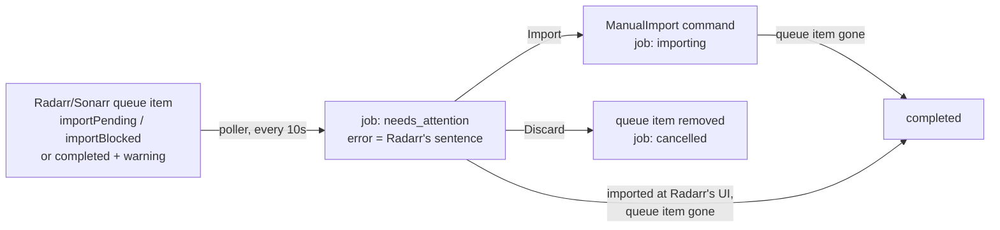
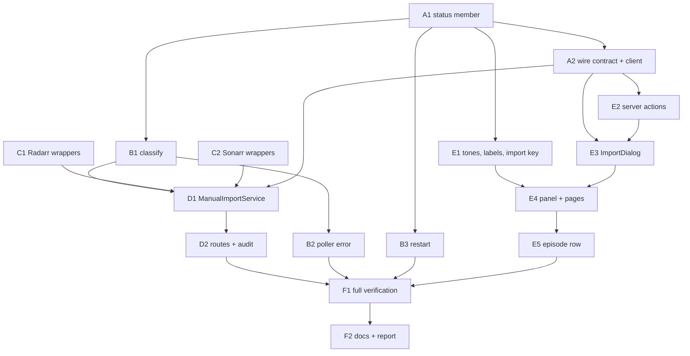

# A stuck import gets its own status, Radarr's own sentence, and an in-app importer — `apps/download`

## Overview

> Written for a human first. Everything below this section is written for whoever
> executes the plan. If a claim here needs more, it links to where the detail lives.

Radarr and Sonarr can finish a download and then refuse to import it: the file is on
disk, the queue row reads **"Downloaded - Waiting to Import"** with a warning icon and a
one-line reason, and nothing moves again until a human opens their manual-import
dialog. This app currently folds that row into `importing` — breathing dot, accent
colour, "the machine is working on it" — and drops the one sentence that explains the
block. The job never reaches a terminal status, never leaves Activity, and never lands
in history.

**This is live right now.** Radarr's queue holds exactly one item, and it is the case
the notes describe: _Game Night (2018)_, `trackedDownloadState: importPending`,
`trackedDownloadStatus: warning`, `status: completed`, with the message _"Movie [Game
Night (2018)][tt2704998, 445571] was not found in the grabbed release:
Game.Night.2018.1080p.BluRay.x265"_. Its manual-import candidate list has one file,
`Bluray-1080p`, English, movie already resolved, one `permanent` rejection carrying that
same sentence. Every shape in this plan was checked against that item, read-only.

| Change                                  | In one sentence                                                                                                                                                                        |
| --------------------------------------- | -------------------------------------------------------------------------------------------------------------------------------------------------------------------------------------- |
| **A new non-terminal status**           | `needs_attention` — the download succeeded and the bytes are on disk, so it is neither `importing` (nothing is moving) nor `failed` (Retry would re-grab a file we already have).      |
| **Radarr's sentence becomes the error** | The queue's `statusMessages` land on `job.error`, so the chip reads `needs your decision` and the line beside it says why.                                                             |
| **It looks stopped, not busy**          | Tone `warn`, no breathing dot — the same visual grammar `paused` uses: a person has to act.                                                                                            |
| **An in-app importer**                  | An **Import** control on the job opens a dialog mirroring Radarr's: file, target, quality, languages, size, rejections, pick and import — without leaving this app.                    |
| **A way out that is not Retry**         | The same dialog offers **Discard**, which removes the download (and its files) from the download client and cancels the job.                                                           |
| **It survives a restart**               | The boot sweep that fails every non-terminal row leaves `needs_attention` alone and re-adopts those rows, because the state it describes lives in Radarr's queue, not in this process. |



**Shape:** one doc, **16 tasks in groups A–F**, seven waves, orchestrated. **No feature
branch** — work lands on `jeremy/download` in this worktree, matching plans 001–019
([why](#no-feature-branch-or-worktree)).

**Key decisions**, in brief — full reasoning in [Design decisions](#design-decisions).
⚠️ These were taken from the notes and the code without a live interview; each one
names the alternative it beat, so flip any of them before Wave 1 if you disagree:

- **`DownloadJobStatus.NeedsAttention = 'needs_attention'`**, non-terminal.
  [Why](#the-status-and-its-wire-value)
- **Only import-stage signals count:** `importPending`, `importBlocked`, or `completed`
  with a `warning`. A warning on a still-downloading item stays `downloading`.
  [Why](#which-queue-signals-mean-needs-attention)
- **It outranks `downloading` in a season aggregate**, the way `failed` does — the
  human decision surfaces as early as possible. [Why](#aggregate-precedence)
- **The routes are media-keyed with a scope**, like the release routes:
  `GET|POST|DELETE /download/media/:id/imports`. The download client's `downloadId` is
  re-read from the queue each time, never persisted. [Why](#media-keyed-routes-and-no-persisted-downloadid)
- **The client sends paths; the server re-resolves everything else** from a fresh
  candidate list — the same trust boundary the grab route draws with `guid`.
  [Why](#paths-are-the-identity-the-server-rebuilds-the-rest)
- **Cancel means Discard**, and it lives inside the dialog: remove the queue item and
  the client's files, no blocklist, job → `cancelled`. No new `onCancel` wiring.
  [Why](#cancel-is-discard-and-lives-in-the-dialog)
- **A candidate Radarr could not match is filled in from the job** (its movie; an
  episode-scoped job's episode). A season/series candidate Sonarr could not parse is
  shown but not selectable. [Why](#unresolved-candidates)
- **Disappearance from the queue still means `completed`**, exactly as it does for
  `importing`. [Why](#disappearance-still-means-completed)
- **`DownloadQueueSnapshotSchema` is not widened.** The sentence rides on `job.error`.
  [Why](#the-sentence-rides-on-joberror-the-snapshot-is-unchanged)

> **Accepted gap:** a Sonarr season-pack candidate whose episodes Sonarr could not
> parse cannot be imported from this app — the row says so and points at Sonarr. A full
> "choose the episodes" picker is a separate feature.

> **Accepted gap:** whether Radarr accepts `ManualImport` with `importMode: 'auto'` for
> a file carrying a `permanent` rejection is confirmed from Radarr's source (manual
> import builds a fresh `ImportDecision` with no rejections) but **not** exercised
> live — that is the last [human checkpoint](#human-checkpoints), on the real _Game
> Night_ item.

**Read next:** [Design decisions](#design-decisions) for the why ·
[Task List](#task-list) for the work · [Sequencing](#sequencing) for the order and the
human checkpoints · [Final report](#final-report) for what "done" reports back.

---

## How to work this plan

**Before task 1:** the tree is clean at `95f4e30e`. Commit this plan doc on its own
(`docs(download): add plan 020, stuck imports and the in-app importer`) before Wave 1,
so every task diffs against a committed baseline.

**Per task:**

1. Work tasks in wave order (see [Sequencing](#sequencing)). Never start a task before
   its dependencies are green.
2. Implement → write or update tests → from `apps/download` run `pnpm test`,
   `pnpm lint` (eslint **and** prettier), `pnpm type-check`. A task that touches
   `packages/utils` runs the same three there too, **and** `pnpm build` in
   `packages/utils` (the app resolves `@lilnas/utils` through `dist/` at type-check
   time; jest maps it to `src/`).
3. **`/commit`** — one task, one commit. Stage only the task's own paths (see the
   mutex rule in [Instructions for the orchestrator](#instructions-for-the-orchestrator-agent)).
4. Check the box below and append the commit hash.

**Markers:**

| Marker              | Means                                                          |
| ------------------- | -------------------------------------------------------------- |
| `- [ ]`             | Not started                                                    |
| `- [x]` … `abc1234` | Done, with the commit that did it                              |
| ⚠️ **PARTIAL**      | Landed with scope narrowed — say what was left and why, inline |
| ⏭️ **DROPPED**      | Not doing it — say why. Never delete a task                    |
| 🚧 / ⏳             | Blocked. Do not implement                                      |

**When reality disagrees with this plan,** add a short **Findings** note under the task,
then update the downstream tasks that finding invalidates. Do not let the doc drift from
what actually shipped.

---

## Instructions for the orchestrator agent

You are an **orchestrator**. Your job is delegation, sequencing, and status tracking —
nothing else. You are **one session** and you hold the whole wave; sub-agents are
spawned inside your session and report back to you. ❌ Never one session per task.

**Do**

- Commit this plan doc yourself, first (infrastructure, not implementation — see
  [How to work this plan](#how-to-work-this-plan)).
- Delegate every task to a sub-agent — implementation, tests and the commit included.
  One sub-agent per task.
- Write **self-contained** delegation prompts: the task's full text, the relevant parts
  of the [Shared Context Pack](#shared-context-pack), and the
  [Definition of Done](#definition-of-done). When a task depends on an earlier one,
  paste that sub-agent's **reported** exported names and signatures into the prompt.
- Respect the wave order. **⚠️ A1 and A2 both edit `packages/utils/src/download/schema.ts`
  and `types.ts`; E1 and E4 both edit `job-lifecycle.spec.tsx`. Neither pair may run
  concurrently — see [Waves](#waves).**
- Re-delegate a failed task with the failure details attached.

**Don't**

- ❌ Read or edit source, tests or config yourself. The only file you may edit is _this
  plan_, to check off tasks and record outcomes.
- ❌ Let sub-agents read this plan.
- ❌ Perform the [human checkpoints](#human-checkpoints).
- ❌ Let a sub-agent continue past its task into the next one.
- ❌ `git checkout`, `git switch`, rebase, or push.
- ❌ Run `pnpm build` in `apps/download` (it clobbers the `.next` the running dev
  container holds), or any mutating request against `lilnas-download-dev`'s Radarr and
  Sonarr. The importer's first real run is a human's decision.

⚠️ **Other sessions commit on this branch.** Every task's commit must stage **only its
own paths** and use a pathspec-limited `git commit -- <paths>`. If a `/commit` preflight
instructs a `git reset`, **refuse it** — it would destroy another session's work. Take
the repo mutex first:

```bash
until mkdir /tmp/lilnas-download-commit.lock 2>/dev/null; do sleep 5; done
# ... stage only your own paths, commit, verify with: git show --stat HEAD
rmdir /tmp/lilnas-download-commit.lock   # release even on failure or abort
```

---

## Design decisions

### The status and its wire value

`DownloadJobStatus.NeedsAttention = 'needs_attention'` is added to the enum at
`packages/utils/src/download/schema.ts:9` and **not** to `TERMINAL_DOWNLOAD_JOB_STATUSES`
(`packages/utils/src/download/types.ts:60`). `IN_PROGRESS_DOWNLOAD_JOB_STATUSES` is
derived by filtering the enum (`types.ts:73`), so the new member lands on the Activity
feed, keeps `cancel` offered and `retry` withheld in `jobActionState`
(`apps/download/src/components/detail/job-state.ts:59`, both key off `isInProgress`),
and needs no migration — `jobs.status` is a TypeScript-only text enum with no CHECK
(`apps/download/src/db/schema.ts:111`; every migration emits a bare `text NOT NULL`, as
Phase 5 already verified when it added `paused`/`pausing`).

**Why not `failed`:** `retry` re-searches and re-grabs. The bytes are already on disk;
the remedy is an import, and Retry would throw the download away.

**Why not `importing`:** that is what it is today, and it is the bug — a permanently
stuck job is indistinguishable from a 30-second import.

**Name, ruled out:** `import_blocked` names one cause; Radarr and Sonarr have other
"manual interaction required" states (their Connect notifications literally have that
name) and this status should be able to absorb them later without a rename. The wire
value is snake_case because that is the only multi-word convention this package already
has (`AUDIT_ACTIONS`' `delete_files`, `save_file`).

### Which queue signals mean needs-attention

`deriveStatusFromQueueItem` (`apps/download/src/media/queue-status.util.ts:184`)
returns `NeedsAttention` when, after the existing `failed`/`error` check:

- `trackedDownloadState` is `importPending` or `importBlocked` (split out of
  `IMPORTING_TRACKED_STATES`, `queue-status.util.ts:35`, which keeps only `importing`);
  **or**
- `status === 'completed'` **and** `trackedDownloadStatus === 'warning'`.

⚠️ **Ordering matters.** The live item carries `status: 'completed'` _and_
`trackedDownloadState: 'importPending'`, and the current code's `imported`/`completed`
branch (`queue-status.util.ts:210`) would otherwise catch it first. The new branch goes
**before** both importing branches.

**Ruled out:** treating every `trackedDownloadStatus: 'warning'` as needs-attention.
Radarr warns on a stalled torrent, a missing category, an unpack in progress — all of
which are still `downloading` and none of which a manual import fixes. The existing
test "maps everything else (queued, downloading, warning, …) to Downloading"
(`queue-status.util.test.ts:140`) stays true for a warning without `completed`.

### Aggregate precedence

`STATUS_PRECEDENCE` (`queue-status.util.ts:79`) becomes
`[Failed, NeedsAttention, Downloading, Importing]`. A season with one blocked episode
and nine still transferring reports `needs_attention`: the block is the thing a person
can act on _now_, and hiding it behind `downloading` until the ninth episode lands is
the same class of bug as averaging a failure away. The progress bar still reads the
summed bytes, so the card says "9 of 10 · needs your decision", which is true.

**Ruled out:** `Downloading > NeedsAttention` — it would flip the season to
needs-attention only at the end, and the user would see the block arrive minutes late.

### Media-keyed routes, and no persisted `downloadId`

Three routes, keyed on the **media** id with the show scope in the query — the shape of
`GET /media/:id/releases` (`download.controller.ts:793`, `ListReleasesQuerySchema` at
`schema.ts:526`):

| Route                                | Does                                                                 |
| ------------------------------------ | -------------------------------------------------------------------- |
| `GET /download/media/:id/imports`    | Lists the manual-import candidates for every queue item in scope     |
| `POST /download/media/:id/imports`   | Commits the chosen candidates via the `ManualImport` command         |
| `DELETE /download/media/:id/imports` | Discards every queue item in scope (client files too), job cancelled |

The download client's `downloadId` is on the queue item (`QueueResource.downloadId`,
`packages/media/src/radarr/types.gen.ts:985`) and the poller already knows how to find
a job's queue items — `getQueue([upstreamId])` filtered by `matchesScope`
(`media-poller.service.ts:162-167`, `:329`). The importer does exactly that, per call.
**Nothing is persisted on the job row**: a `downloadId` column would be a second copy of
transient upstream state, would go stale the moment Radarr re-queued, and would buy
nothing the queue read does not already give — the queue read is one call the poller
makes every 10 seconds anyway.

**Ruled out:** job-keyed routes (`POST /movies/:jobId/import`, `/shows/:jobId/import`).
The candidate list belongs to a title's download, not to a job — the same reasoning
`releaseActionRoute` (`download.controller.ts:1942-1990`) records for grabs — and a
title can have several jobs pointed at the same queue item (a series job and an episode
job). Keying on media + scope answers all of them at once. The jobs are still updated:
see [Which jobs move](#which-jobs-move-after-a-commit-or-discard).

### Paths are the identity; the server rebuilds the rest

`POST /media/:id/imports` takes `{ paths: string[] }` (plus the show scope). The
service re-fetches the candidate list, keeps the requested paths, and builds Radarr's
`ManualImportFile` from the **fresh** candidate — `quality`, `languages`,
`releaseGroup`, `indexerFlags`, `folderName`, `downloadId` all come from upstream, never
from the browser. A path not in the current list is a `400`. This is the boundary
`GrabReleaseInputSchema` (`schema.ts:541`) already draws: the client sends the identity
of its pick, the server re-resolves it.

Path, not Radarr's candidate `id`: Radarr's `ManualImportFile` defines equality on
`Path` (verified in `Radarr/src/NzbDrone.Core/MediaFiles/MovieImport/Manual/ManualImportFile.cs`),
and a path is legible in an audit row where a hash is not.

### The command body, verified

The generated SDK exposes `getApiV3Manualimport` and `postApiV3Manualimport`
(`packages/media/src/radarr/sdk.gen.ts:1443`, `:1453`; Sonarr `:1544`, `:1554`).
⚠️ **`postApiV3Manualimport` is the _reprocess_ endpoint** — it re-evaluates candidates
after the user changes a field, and imports nothing. The import is a command:

```ts
// Radarr — from ManualImportCommand.cs / ManualImportFile.cs (develop)
{ name: 'ManualImport', importMode: 'auto', files: [{
  path, folderName, movieId, quality, languages, releaseGroup, indexerFlags, downloadId,
}] }

// Sonarr — from the EpisodeImport twins
{ name: 'ManualImport', importMode: 'auto', files: [{
  path, folderName, seriesId, episodeIds, episodeFileId?, quality, languages,
  releaseGroup, indexerFlags, releaseType, downloadId,
}] }
```

Neither SDK types the command body — `CommandResourceWritable`
(`radarr/types.gen.ts:1269`) carries only `name`. Both wrappers follow the existing
`MoviesSearchCommand` pattern (`radarr.service.ts:47`): a locally-typed intersection,
posted through `postApiV3Command`, checked with `checkSdkError`. `importMode: 'auto'`
lets Radarr choose move-vs-copy from the download client's own settings, which is what
its UI sends.

Manual import **ignores the automatic rejection**: Radarr's `ManualImportService.Execute`
builds `new ImportDecision(localMovie)` with no rejections for each file, so the
`permanent` "not found in the grabbed release" rejection on the live candidate is
informational. The dialog shows it; it does not block the row.

### Which jobs move after a commit or discard

After a successful `ManualImport` command the service moves **every** job in
`DownloadStateService.jobs` with that `mediaId`, status `NeedsAttention`, and a scope
that matches the request (an unscoped job matches everything; an episode job matches
only its own episode) to `Importing` with `error: undefined`. The poller's existing
branch — no queue entry while `Downloading`/`Importing` → `Completed`
(`queue-status.util.ts:188-196`) — then finishes it within a tick or two of Radarr
dropping the row. If the import fails at Radarr's end the row stays with a new warning,
and the poller puts the job straight back to `NeedsAttention` with the new sentence.

`error` must be **explicitly** cleared: `updateJob` spreads the patch over the record
(`download-state.service.ts:340`) and never touches `error` on its own, and
`buildJobRow` writes `record.error ?? null` (`db/job-row.ts:30`), so `{ error: undefined }`
clears both memory and the row. Without it, a completed job would carry "was not found
in the grabbed release" into history forever.

A discard does the same walk and moves the jobs to `Cancelled` **after** the queue
removal succeeds. A poller tick landing between the removal and the write could
briefly stamp `Completed` (and a `completedAt`); the `Cancelled` write that follows
wins, and the stamp is harmless. Noted so nobody files it as a race.

### Cancel is Discard, and lives in the dialog

`jobActionState(NeedsAttention, 'cancel')` is already `'offered'` — it derives from
`isInProgress` — but the movie and show pages pass **no `onCancel`** to `JobLifecycle`
(`movie-detail.tsx:290-294`, `show-detail.tsx:177-179`): the only cancel routes are
video-only, and the job-keyed `DELETE /movies/:id` / `DELETE /shows/:id` remove the
**whole title from the library** (`media-download.service.ts:300-310` →
`unmonitorAndDelete`), which is the wrong blast radius for "I don't want this download".

So the exit is **Discard**, a second control inside the import dialog, behind an inline
two-step confirm: `DELETE /api/v3/queue/{id}` with `removeFromClient: true`,
`blocklist: false`, `skipRedownload: true` (all three exist on the generated
`DeleteApiV3QueueByIdData.query`, `radarr/types.gen.ts:4559`; Sonarr `:4670`) for
every queue item in scope, then the jobs → `Cancelled`. No blocklist, because the
release was fine — the folder name was the problem — and blocklisting it would stop
Radarr picking the same release next time. `skipRedownload` keeps Radarr from
immediately searching again on the user's behalf; if they want it again, Retry on the
cancelled job does exactly that.

**Ruled out:** wiring `onCancel` on the pages to the job-keyed delete (removes the
title); adding a fourth generic "cancel a movie/show job" route (the only case that
needs it is this one, and it needs the queue-item removal, not a generic cancel).

### Unresolved candidates

Radarr's `GET /manualimport` is called with `downloadId` **and** `movieId`; Sonarr's
with `downloadId`, `seriesId` and (when scoped) `seasonNumber`. Radarr uses the movie
id to resolve the candidate's `movie` even when the file name defeats its parser — the
live candidate came back with `movie: Game Night (434)` on `downloadId` alone, and the
id makes that a guarantee rather than luck. A movie candidate is therefore **always
importable**; `movieId` in the command is the resolved upstream id either way.

Sonarr needs `episodeIds` per file. The service fills them from the candidate's own
`episodes` when Sonarr parsed them; failing that, from an **episode-scoped** job's
`scope.episodeId`; failing that the candidate is returned with `importable: false` and
a `blockedReason` naming Sonarr's own UI. The dialog renders it unselectable with that
reason, the way `ReleasePicker` renders a blocked row (`release-picker.tsx:691-713`).

**Ruled out:** a full target picker (choose the movie, assign episodes) in this dialog
— it is Radarr's whole manual-import UI, and the one live case does not need it.

### Disappearance still means completed

`deriveStatusFromQueueItem`'s no-entry branch treats `NeedsAttention` like
`Downloading`/`Importing`: gone from the queue → `Completed`. A user who imports from
Radarr's own UI, or whose Radarr re-parses successfully after a rename, gets the right
answer. A user who removes the item at Radarr's UI gets `completed` for a job that
produced no file — the same ambiguity the `importing` branch already accepts, and
`didJobComplete` (`job-completion.util.ts:152`, plan 016) is the eventual fix for both;
it is **not** wired here.

### It survives a restart

`reconcileInterruptedJobs` (`apps/download/src/db/reconcile-interrupted-jobs.ts:14`)
fails every non-terminal row at boot, and `DownloadStateService.jobs` is **not**
reloaded from the table — a movie/show job crossing a restart is failed with
"Interrupted by a service restart" today. That is defensible for `searching`
(a restart is the only timeout a never-grabbed job has) and stated policy for `paused`
(backend.md §"A restart still fails a paused job — on purpose"). It is wrong for
`needs_attention`: the state it describes is Radarr's queue row, which is still there,
and failing the job hands the user a Retry that re-grabs.

So the sweep gains one exemption, `needs_attention`, and boot re-adopts those rows into
the Map (`adoptJob`, `download-state.service.ts:243`) right after the sweep so the
poller tracks them on its first tick. If the queue row is gone by then, the poller
completes the job; if it is still blocked, nothing changes.

**Ruled out:** exempting every movie/show non-terminal status — it is the same
mechanism with a wider filter, and it would leave a never-grabbed `searching` job open
forever. A separate plan if wanted.

### The sentence rides on `job.error`; the snapshot is unchanged

`applyUpdate` (`media-poller.service.ts:302-305`) calls `describeQueueItemError` for
`Failed` only. It now does so for `NeedsAttention` too, and the joined messages become
`job.error` — which `JobLifecycle` already renders beside the chip
(`job-lifecycle.tsx:224`, `:307-311`) and `JobHistory` on every row (`:467-475`).
`DownloadQueueSnapshotSchema` (`schema.ts:52`) is **not** widened with
`trackedDownloadStatus` or the messages: nothing in the UI would read them that
`job.error` and the status do not already say, and the snapshot deliberately stays a
progress triple (`isQueueSnapshotEqual` diffs exactly those three fields).

### Where the Import control appears

Everywhere a `needs_attention` job is rendered with actions:

| Surface                           | Via                                                             |
| --------------------------------- | --------------------------------------------------------------- |
| Movie page status panel           | `JobLifecycle` (`movie-detail.tsx:459`)                         |
| Show page series panel            | `JobLifecycle` (`show-detail.tsx:274`)                          |
| Season panel inside `ShowSeasons` | `JobLifecycle` (`show-seasons.tsx:252`)                         |
| Episode row (episode-scoped job)  | `ShowEpisodeRow`'s action span (`show-episode-row.tsx:217-235`) |

`ACTION_SPECS` (`job-lifecycle.tsx:64`) gets an `import` row, as the notes ask — but
its entries are plain `Button`s bound to `(jobId) => void` handlers, and the import
control is a dialog that needs the media id, the scope and three server actions. So
`JobLifecycle` takes one new prop, `imports?: ImportDialogActions`, and renders the
self-contained `ImportDialog` in the `import` spec's slot with the job's own
`media.id` and `scope`. A page that passes no `imports` renders no control — exactly
how a missing `onCancel` behaves today (`job-lifecycle.tsx:281-283`). The Activity feed,
profile and admin lists render the chip only and need nothing but the tone/label
records.

### Things that already exist — don't rebuild them

- **Queue lookup by upstream id**: `RadarrService.getQueue` (`radarr.service.ts:528`),
  `SonarrService.getQueue` (`sonarr.service.ts:1009`).
- **Scope filtering of queue items**: `matchesScope` (`media-poller.service.ts:329`,
  module-private — B1 moves it to `queue-status.util.ts` and exports it).
- **Media → upstream id**: `MediaResolverService.resolve` + `upstreamLibraryId`
  (`media-poller.service.ts:314`); `ShowService.resolveUpstreamId`-style lookups.
- **Local command typing + `postApiV3Command` + `checkSdkError`**:
  `triggerSearch` (`radarr.service.ts:511`, `sonarr.service.ts:881`).
- **Queue-item removal call shape**: `unmonitorAndDelete` (`radarr.service.ts:557-566`).
- **Rejection string cleanup**: `formatRejection` (`release-picker.tsx:180`).
- **Quality/language flattening**: `toReleaseQuality` / language mapping in
  `release-mapper.util.ts:46-68`.
- **Self-contained dialog with trigger, pending state and inline error**:
  `DeleteConfirm` (`delete-confirm.tsx:418-540`) on `Modal` (`ui/modal.tsx:247`).
- **Server-action result shape and framework-signal rethrow**: `grabRelease`
  (`app/actions/media-files.ts:171-207`), `isFrameworkSignal`, `revalidateDetail`.
- **Audit row from a controller**: `releaseActionRoute` (`download.controller.ts:1942`).
- **Row adoption after a restart**: `DownloadStateService.adoptJob`
  (`download-state.service.ts:243`).

### What stays untouched

- `apps/download/src/media/job-completion.util.ts` and `completionInputs` — plan 016's
  unfinished completion check; not wired, not modified.
- `apps/download/src/media/release.service.ts` and `show.service.ts` — no change.
- The job-keyed `DELETE /movies/:id` / `DELETE /shows/:id` routes and
  `MediaDownloadService.deleteJob` — unchanged; Discard does not go through them.
- `packages/media` — the generated SDKs already expose everything needed; **do not
  regenerate**.
- `apps/tdr-bot` — it waits only on video jobs (`download-command.service.ts:245`), and
  talks to Radarr/Sonarr directly for movies; a new status does not reach it.

### No feature branch or worktree

Work lands directly on `jeremy/download`, matching all 19 prior plans in this series.
`lilnas-download-dev` — the container the read-only checkpoint verifies against — is
bound to **this** checkout; work in a separate worktree could not be exercised live
without a merge first. The cost is the commit mutex above. This plan lands as ~16
commits, but the repo's convention wins over the generic branching heuristic, for the
stated reason.

---

## Shared Context Pack

> Copy the relevant parts into every sub-agent prompt. These are pointers — **verify
> against current code**, a plan ages and the code is the truth.

### Repo & conventions

- pnpm workspaces + Turbo. The app is `@lilnas/download` at `apps/download`; the shared
  wire types are `@lilnas/utils` at `packages/utils` (`src/download/schema.ts` for zod,
  `src/download/types.ts` for inferred types and hand-written response interfaces,
  `src/download/client.ts` for `DownloadClient`). The generated Radarr/Sonarr SDKs are
  `@lilnas/media/radarr` and `@lilnas/media/sonarr` (**not** the `-next` variants; the
  app imports the `client-fetch` builds).
- **From `apps/download`:** `pnpm test` · `pnpm lint` (eslint **and** prettier — two
  checks; `pnpm lint:fix` fixes both) · `pnpm type-check`. One file:
  `pnpm test -- src/media/__tests__/queue-status.util.test.ts`.
- **From `packages/utils`:** the same three, plus `pnpm build` so `dist/` is current for
  the app's type-check.
- ⚠️ **Never run `pnpm build` in `apps/download`** — it clobbers the `.next` the running
  dev container holds. Do not run the root `pnpm run build` either, for the same reason.
- Tests live in `__tests__/` next to the code. Jest, **two projects**
  (`apps/download/jest.config.js`): `node` (`*.ts`) and `jsdom` (`*.tsx`,
  `@testing-library/react` + `user-event`, setup at `src/__tests__/setup-dom.ts`).
  Anything importing `DownloadStateService` or the controller needs
  `jest.mock('nanoid', () => ({ nanoid: jest.fn(() => 'mock-id') }))` **before** the
  imports (see `media-poller.service.test.ts:1-8`).
- Commit style (from `git log`): `feat(download): …`, `fix(download): …`,
  `docs(download): …`, `feat(utils): …`; imperative, lower-case, no period, body
  explains the why. End the message with
  `Co-Authored-By: Claude Fable 5.1 <noreply@anthropic.com>`.
- Prose in code comments uses `-` in the backend files and `—` in the frontend files.
  Match the file you are in. `cns()` from `@lilnas/utils/cns` for every class list. No
  `any`.
- Every `Record<DownloadJobStatus, …>` in the app is exhaustive by construction and
  **fails type-check** until the new member is added:
  `apps/download/src/lib/format.ts:215` (`STATUS_TONES`),
  `apps/download/src/lib/profile-filters.ts:79` (`STATUS_RANK`),
  `apps/download/src/components/detail/job-state.ts:108` (`JOB_STATUS_LABELS`),
  `apps/download/src/components/detail/__tests__/job-lifecycle.spec.tsx:97` and `:114`,
  `apps/download/src/components/detail/__tests__/job-state.spec.ts:44` (`EXPECTED`).
  `apps/download/scripts/verify/mutate.ts:337` (`MEDIA_TRANSITIONS`) is a Map, not a
  Record — it compiles either way and must be updated by hand.

### Layout

| File                                                       | What it is                                                                                                                                                                              |
| ---------------------------------------------------------- | --------------------------------------------------------------------------------------------------------------------------------------------------------------------------------------- |
| `packages/utils/src/download/schema.ts`                    | `DownloadJobStatus` (:9), `DownloadQueueSnapshotSchema` (:52), `ReleaseQualitySchema` (:471), `ListReleasesQuerySchema` (:526), `GrabReleaseInputSchema` (:541), `AUDIT_ACTIONS` (:700) |
| `packages/utils/src/download/types.ts`                     | `TERMINAL_DOWNLOAD_JOB_STATUSES` (:60), `DownloadJobRecord` (:179), `ListReleasesResponse` (:317) — hand-written response interfaces live here                                          |
| `packages/utils/src/download/client.ts`                    | `DownloadClient`: `request` (:228), `listReleases` (:493), `grabRelease` (:505), `toQueryString` (:95)                                                                                  |
| `packages/utils/src/download/__tests__/types.spec.ts`      | Enum member tests (:75-98) and the terminal/in-progress partition tests (:100-176)                                                                                                      |
| `apps/download/src/media/queue-status.util.ts`             | `PollableQueueItem`, `IMPORTING_TRACKED_STATES` (:35), `STATUS_PRECEDENCE` (:79), `aggregateQueueItems` (:110), `describeQueueItemError` (:152), `deriveStatusFromQueueItem` (:184)     |
| `apps/download/src/media/media-poller.service.ts`          | `pollMovies` (:127), `pollShows` (:153), `trackedJobs` (:177), `applyUpdate` (:263), `upstreamLibraryId` (:314), `matchesScope` (:329, module-private)                                  |
| `apps/download/src/media/radarr.service.ts`                | `MoviesSearchCommand` (:47), `grabRelease` (:409), `triggerSearch` (:511), `getQueue` (:528), `unmonitorAndDelete` (:550) — the queue-removal call shape at :557-566                    |
| `apps/download/src/media/sonarr.service.ts`                | `SeriesSearchCommand` (:58), `triggerSearch` (:881), `triggerEpisodeSearch` (:898), `getQueue` (:1009), `unmonitorAndDelete` (:1032)                                                    |
| `apps/download/src/media/sdk-result.util.ts`               | `checkSdkError`, `unwrapSdkResult`                                                                                                                                                      |
| `apps/download/src/media/release-mapper.util.ts`           | `CommonReleaseResource`, `toReleaseQuality` — the SDK→wire flattening to imitate                                                                                                        |
| `apps/download/src/media/media-resolver.service.ts`        | `resolve(keys)` (:82) → `{ media: Map<mediaId, Media> }`; `invalidate(mediaId)`                                                                                                         |
| `apps/download/src/media/media.module.ts`                  | Provider/export lists — a new service is registered in both                                                                                                                             |
| `apps/download/src/download/download-state.service.ts`     | `jobs: Map<string, DownloadJobRecord>`, `adoptJob` (:243), `updateJob` (:320), `persistJob` (:430)                                                                                      |
| `apps/download/src/download/download.controller.ts`        | DTO pattern (:97-114), `RouteAuditEvent` (:134), `listReleases` (:793), `grabRelease` (:1023), `releaseActionRoute` (:1942), `mediaJobRoute` (:1997), `narrowScope` (:2061)             |
| `apps/download/src/db/reconcile-interrupted-jobs.ts`       | The boot sweep                                                                                                                                                                          |
| `apps/download/src/db/jobs.repo.ts`                        | Framework-free repo: `getJobById` (:246), `listJobsByMediaId` (:256), `countJobsByStatus` (:472)                                                                                        |
| `apps/download/src/db/job-row.ts`                          | `buildJobRow` (`error: record.error ?? null`, :30), `hydrateJobRow` (:97)                                                                                                               |
| `apps/download/src/bootstrap.ts`                           | Boot order: migrations → integrity → `reconcileInterruptedJobs` → library sync → listen                                                                                                 |
| `apps/download/src/lib/format.ts`                          | `StatusTone` (:203), `STATUS_TONES` (:215), `statusTone`, `isInProgress`                                                                                                                |
| `apps/download/src/lib/profile-filters.ts`                 | `STATUS_RANK` (:79) — lifecycle order for the profile filter                                                                                                                            |
| `apps/download/src/components/detail/job-state.ts`         | `JobActionKey` (:24), `jobActionState` (:59), `JOB_STATUS_LABELS` (:108), `latestJob`, `jobProgress`                                                                                    |
| `apps/download/src/components/detail/job-lifecycle.tsx`    | `JobAction` (:39), `ACTION_SPECS` (:64), `JobLifecycleProps` (:104), `JobLifecycle` (:169), controls map (:249-297), `JobHistory` (:430)                                                |
| `apps/download/src/components/detail/release-picker.tsx`   | `formatBytes` (:51), `formatRejection` (:180), `ReleaseSearchAction`/`ReleaseAction` (:294-311), row constants (:259-281), `ReleaseRow` (:657) — the row shape to mirror                |
| `apps/download/src/components/detail/delete-confirm.tsx`   | `DeleteConfirm` (:418) — the self-contained trigger + `Modal` + `useTransition` + inline error pattern                                                                                  |
| `apps/download/src/components/ui/modal.tsx`                | `Modal` (:247, props :190), `DeleteButton` (:762)                                                                                                                                       |
| `apps/download/src/components/detail/movie-detail.tsx`     | Props (:264-269), `JobLifecycle` mount (:459)                                                                                                                                           |
| `apps/download/src/components/detail/show-detail.tsx`      | `ShowDetailProps` (:126-142), `JobLifecycle` mount (:274), passes through to `ShowSeasons`                                                                                              |
| `apps/download/src/components/detail/show-seasons.tsx`     | `ShowSeasonsProps` (:88-99), season `JobLifecycle` (:252)                                                                                                                               |
| `apps/download/src/components/detail/show-episode-row.tsx` | `episodeScopedJobs`/`latestJob` (:167-169), action span (:217-235)                                                                                                                      |
| `apps/download/src/components/detail/show-state.ts`        | `episodeState` (:396) — chip tone/label per episode, derives from `statusTone`                                                                                                          |
| `apps/download/src/app/actions/media-files.ts`             | `'use server'` module: result types (:29-46), `isFrameworkSignal` (:74), `revalidateDetail` (:108), `grabRelease` (:171)                                                                |
| `apps/download/src/app/movies/[tmdbId]/page.tsx`           | Wires server actions into `MovieDetail` (:167-177)                                                                                                                                      |
| `apps/download/src/app/shows/[tvdbId]/page.tsx`            | Wires server actions into `ShowDetail` (:222-234)                                                                                                                                       |
| `apps/download/scripts/verify/mutate.ts`                   | `MEDIA_TRANSITIONS` (:337) — the live verification script's legal-transition map                                                                                                        |
| `docs/features/download/backend.md`                        | Living backend doc; top-level sections per plan (`## Monitoring cascades and full removal (plan 019)` at :1735 is the shape to copy)                                                    |

### The live fixture

Use this verbatim in tests. It is the real Radarr queue item and its one manual-import
candidate, read on 2026-09-21 (movie id 434 = _Game Night (2018)_, `tmdb:445571`).

```ts
// QueueResource — the stuck item. Note status 'completed' AND importPending.
{
  id: 152557673, movieId: 434, downloadId: 'ce427a39-be9f-4271-b193-f7067dd82c4a',
  status: 'completed', trackedDownloadStatus: 'warning', trackedDownloadState: 'importPending',
  title: 'Game.Night.2018.1080p.BluRay.x265', outputPath: '/downloads/Game.Night.2018.1080p.BluRay.x265/',
  size: 1681143972, sizeleft: 0, protocol: 'usenet', downloadClient: 'SABnzbd',
  statusMessages: [{ title: 'Game.Night.2018.1080p.BluRay.x265', messages: [
    'Movie [Game Night (2018)][tt2704998, 445571] was not found in the grabbed release: Game.Night.2018.1080p.BluRay.x265',
  ] }],
}

// ManualImportResource — GET /api/v3/manualimport?downloadId=…&filterExistingFiles=true
{
  id: 26454175,
  path: '/downloads/Game.Night.2018.1080p.BluRay.x265/Game.Night.2018.1080p.BluRay.x265.mp4',
  relativePath: 'Game.Night.2018.1080p.BluRay.x265.mp4', folderName: 'Game.Night.2018.1080p.BluRay.x265',
  name: 'Game.Night.2018.1080p.BluRay.x265', size: 1674940307, movieFileId: null, releaseGroup: null,
  downloadId: 'ce427a39-be9f-4271-b193-f7067dd82c4a', indexerFlags: 0, qualityWeight: 20, customFormatScore: 0,
  customFormats: [], movie: { id: 434, title: 'Game Night' /* … full MovieResource */ },
  quality: { quality: { id: 7, name: 'Bluray-1080p', source: 'bluray', resolution: 1080, modifier: 'none' },
             revision: { version: 1, real: 0, isRepack: false } },
  languages: [{ id: 1, name: 'English' }],
  rejections: [{ reason: 'Movie [Game Night (2018)][tt2704998, 445571] was not found in the grabbed release: Game.Night.2018.1080p.BluRay.x265', type: 'permanent' }],
}
```

### Patterns to imitate

**Locally-typed command → `postApiV3Command` → `checkSdkError`** —
`RadarrService.triggerSearch` (`radarr.service.ts:511-521`):

```ts
type MoviesSearchCommand = CommandResourceWritable & { movieIds?: number[] }
const command: MoviesSearchCommand = {
  name: 'MoviesSearch',
  movieIds: [radarrId],
}
checkSdkError(
  await postApiV3Command({ client: this.client, body: command }),
  'triggerMovieSearch',
)
```

**SDK service tests** — `radarr.service.test.ts:1-80`: `jest.mock('@lilnas/media/radarr', () => ({ … every SDK fn as jest.fn() }))`
**before** the imports, `const mockX = x as jest.Mock`, results shaped `{ data: … }` or
`{ error, response }`, `Test.createTestingModule({ providers: [RadarrService, { provide: RADARR_CLIENT, useValue: {} }] })`.
**Adding an SDK import to a service means adding it to that mock factory.**

**Controller tests** — `media/__tests__/download.controller.media.test.ts:54-130`:
every collaborator is an object literal of `jest.fn()`s provided by token; `auditLogService.record`
is asserted on; `createFakeMediaResolver()` answers media lookups.

**Poller tests** — `media-poller.service.test.ts:75-160`: a **real** `DownloadStateService`
over `createTestDbService()`, jobs seeded with `downloadStateService.jobs.set(...)`,
`radarrService.getQueue.mockResolvedValue([...])`, then `await service.poll()` and read
`downloadStateService.jobs.get(id)`.

**Server action** — `media-files.ts:171-207`: `getIdentifiedDownloadClient()` outside
the `try`; one client call inside; `isFrameworkSignal` rethrow; `console.error` with a
`[media-files]` prefix; `{ error: COPY }` on failure; `revalidateDetail(mediaId)` on
success for mutations only.

**Self-contained dialog** — `delete-confirm.tsx:418-540`: `useState(open)`,
`useState(error)`, `useTransition`, a `cancelRef` for `Modal.initialFocusRef`, a trigger
`Button`, `Modal` with `title`/`description`/`onClose`, footer buttons that swap order
under `mobile`, `role="alert"` error line.

**jsdom component spec** — `release-picker.spec.tsx`: `render`, `screen.getByRole`,
`userEvent.setup()`, `waitFor`; actions are `jest.fn().mockResolvedValue({ … })`.

### Gotchas

- **`status: 'completed'` ordering** — the live item is both `completed` and
  `importPending`. The needs-attention branch must precede the `imported`/`completed`
  branch in `deriveStatusFromQueueItem` or the live case is misclassified.
- **`error` does not clear itself** — write `error: undefined` in the same `updateJob`
  patch that leaves `NeedsAttention`.
- **Season 0 is real** — `matchesScope` tests `!= null`, not truthiness. Keep that.
- **`Modal` renders nothing on the server and nothing while closed** — a spec that
  asserts dialog content must open it first.
- **`Button` swallows `onClick` while `aria-disabled`** — use `aria-disabled`, never
  `disabled`, so a blocked row's reason stays reachable (see `release-picker.tsx:691-699`).
- **`ImportRejectionResource` is `{ reason, type }`**, not a string — flatten to
  `reason` strings on the wire, then `formatRejection` in the UI.
- **Sonarr's `ManualImportResource.episodes` can be empty** for a season pack it could
  not parse — that is the not-importable case, not an error.
- **Two sessions commit on this branch** — mutex + pathspec-limited commits, always.

### Definition of Done

Include this **verbatim** in every delegation:

> **Done means:** implemented; tests written or updated following the package's existing
> conventions and passing; lint and type-check clean for every touched package;
> committed with `/commit`. Report back: files changed, exported names introduced, test
> summary, commit hash(es).

Addenda:

- ❌ Do not run `pnpm build` in `apps/download` or at the repo root. A task touching
  `packages/utils` runs `pnpm build` **there**, and only there.
- ❌ Do not send any mutating request to Radarr, Sonarr or `lilnas-download-dev`. Unit
  tests only; the live checks are [human checkpoints](#human-checkpoints).

---

## Task List

### Group A — Contracts (`packages/utils`)

- [x] **A1. The status member.** `8d8e6420` `DownloadJobStatus.NeedsAttention = 'needs_attention'`
      exists, is non-terminal, and every consumer that enumerates the enum still
      compiles.

  **Files:** edit `packages/utils/src/download/schema.ts` (the enum at :9, alphabetical
  order, with a doc comment in the style of `Paused`'s: what it means, why it is not
  terminal, and that it — unlike `paused` — **survives** a restart, pointing at
  `reconcile-interrupted-jobs.ts`); edit
  `packages/utils/src/download/__tests__/types.spec.ts` (a `'adds the plan 020
needs-attention member'` case beside the Phase 5 one at :94, and the partition tests
  at :100-176 must still pass unchanged — they derive the sets).

  **Edge cases:**
  - `TERMINAL_DOWNLOAD_JOB_STATUSES` (`types.ts:60`) is **not** touched.
  - This task does **not** touch `apps/download` — the app's `Record<DownloadJobStatus>`
    tables fail type-check until E1 lands, which is expected and is why A1 and E1 are
    the same wave's edges, not the same task.

  **Tests:** the member's wire value; it is in `IN_PROGRESS_DOWNLOAD_JOB_STATUSES` and
  not terminal.

- [x] **A2. The manual-import wire contract and client methods.** `135bc8d5` The schemas, types,
      audit actions and `DownloadClient` methods the routes and the UI share.

  **Files:** edit `packages/utils/src/download/schema.ts`, `types.ts`, `client.ts`;
  extend `packages/utils/src/download/__tests__/schema.spec.ts` and `client.spec.ts`.

  ```ts
  // schema.ts
  export const ManualImportCandidateSchema = z.object({
    /** Absolute path in the download client's view - the commit key. */
    path: z.string(),
    relativePath: z.string().optional(),
    name: z.string().optional(),
    size: z.number().optional(),
    quality: ReleaseQualitySchema.optional(),      // reuse; { name, resolution? }
    languages: z.array(z.string()).optional(),     // flattened names, like Release
    releaseGroup: z.string().optional(),
    downloadId: z.string().optional(),
    /** Upstream's own words, `reason` only - informational for a manual import. */
    rejections: z.array(z.string()),
    /** Movie: the resolved title. Show: the episodes this file covers. */
    movieTitle: z.string().optional(),
    episodes: z.array(z.object({ id: z.number().int(), seasonNumber: z.number().int(),
      episodeNumber: z.number().int(), title: z.string().optional() })).optional(),
    /** Server-decided: whether the command can be built for this file. */
    importable: z.boolean(),
    /** Why not, when `importable` is false - rendered beside the row. */
    blockedReason: z.string().optional(),
  })
  export const ListImportCandidatesQuerySchema = ListReleasesQuerySchema  // alias, like Replace/Grab
  export const ImportFilesInputSchema = z.object({
    episodeId: z.number().int().positive().optional(),
    seasonNumber: z.number().int().min(0).optional(),
    paths: z.array(z.string().min(1)).min(1),
  })
  export const DiscardImportQuerySchema = ListReleasesQuerySchema           // alias

  // AUDIT_ACTIONS: append 'media.manual_import', 'media.discard_download' (append-only list)

  // types.ts
  export type ManualImportCandidate = z.infer<typeof ManualImportCandidateSchema>
  export type ListImportCandidatesQuery = z.infer<typeof ListImportCandidatesQuerySchema>
  export type ImportFilesInput = z.infer<typeof ImportFilesInputSchema>
  export type DiscardImportQuery = z.infer<typeof DiscardImportQuerySchema>
  export interface ListImportCandidatesResponse { candidates: ManualImportCandidate[] }
  export interface ImportFilesResponse { importedCount: number }
  export interface DiscardImportResponse { discardedCount: number }

  // client.ts
  listImportCandidates(id: string, query?: Partial<ListImportCandidatesQuery>): Promise<ListImportCandidatesResponse>
  importFiles(id: string, input: ImportFilesInput): Promise<ImportFilesResponse>
  discardImport(id: string, query?: Partial<DiscardImportQuery>): Promise<DiscardImportResponse>
  // GET  /download/media/:id/imports?episodeId&seasonNumber
  // POST /download/media/:id/imports          body: ImportFilesInput
  // DELETE /download/media/:id/imports?episodeId&seasonNumber
  ```

  **Edge cases:**
  - `paths` is `z.array(...).min(1)` — an empty commit is a 400, not a no-op.
  - Body numbers are plain `z.number()` (JSON), query numbers are `z.coerce.number()`
    (already true of `ListReleasesQuerySchema`); see the comment at `schema.ts:139-146`
    for why the two are not shared.
  - `AUDIT_ACTIONS` is append-only; add at the end, before `'ytdlp.check_update'` is
    fine but do not reorder existing members.

  **Tests:** schema round-trips (an importable and a blocked candidate); `paths: []`
  rejected; the client methods hit the right URL/method, following `client.spec.ts`'s
  existing pattern.

### Group B — Poller classification and restart

- [x] **B1. Classify a stuck import.** `a8e41f5` `deriveStatusFromQueueItem` returns
      `NeedsAttention` for the live fixture; the aggregate ranks it; `matchesScope` is
      shared.

  **Files:** edit `apps/download/src/media/queue-status.util.ts`,
  `apps/download/src/media/__tests__/queue-status.util.test.ts`.

  ```ts
  // queue-status.util.ts
  const IMPORTING_TRACKED_STATES = new Set(['importing'])
  const ATTENTION_TRACKED_STATES = new Set(['importBlocked', 'importPending'])
  const STATUS_PRECEDENCE = [Failed, NeedsAttention, Downloading, Importing]

  // deriveStatusFromQueueItem: after the failed/error check, before every importing branch:
  //   if (ATTENTION_TRACKED_STATES.has(state) || (item.status === 'completed' && item.trackedDownloadStatus === 'warning'))
  //     return DownloadJobStatus.NeedsAttention
  // no-entry branch: NeedsAttention joins Downloading/Importing -> Completed

  // moved here from media-poller.service.ts:329, exported, doc comment carried over:
  export function matchesScope(
    item: PollableQueueItem,
    scope: ShowScope | undefined,
  ): boolean
  ```

  `PollableQueueItem` also gains `downloadId?: string | null` and `id?: number` —
  the importer reads both and they are on `QueueResource` already.

  **Edge cases:**
  - The fixture item has `status: 'completed'` **and** `importPending` — the new
    branch must win over `queue-status.util.ts:210`.
  - `trackedDownloadStatus: 'warning'` with `status: 'downloading'` is still
    `Downloading` (existing test at :140 keeps passing).
  - `importBlocked` is needs-attention too.
  - Update the doc comment on `deriveStatusFromQueueItem` (the lifecycle line and the
    bullet list) — it is the file's spec.
  - Do **not** delete the poller's private `matchesScope` here; B2 does (same wave
    would collide on the poller file).

  **Tests:** the fixture verbatim → `NeedsAttention`; each of the two tracked states;
  `completed`+`warning` without a tracked state; `warning` while `downloading` stays
  `Downloading`; no entry from `NeedsAttention` → `Completed`; aggregate: one
  needs-attention item dominates downloading siblings, `failed` still dominates it,
  `statusMessages` still concatenated; `matchesScope` cases (episode, season, season 0,
  null `episodeId` never matches an episode scope) moved/added here.

  **Findings (B1, during execution):** appending `'media.manual_import'` and
  `'media.discard_download'` to `AUDIT_ACTIONS` in A2 broke type-check in three app
  files the plan never listed - `apps/download/src/db/audit-log.repo.ts`,
  `apps/download/src/db/schema.ts` and `apps/download/src/lib/admin-audit.ts` all hold
  exhaustive `Record<AuditAction, ...>` tables. The Shared Context Pack listed only the
  `Record<DownloadJobStatus, ...>` tables. **D2 now owns those three files** (it is the
  task that introduces the audit rows); its file list and tests are extended below.

- [x] **B2. The poller records the sentence and clears it.** `495d03e` `job.error` carries
      Radarr's message while stuck and is gone once the job moves on.

  **Files:** edit `apps/download/src/media/media-poller.service.ts`,
  `apps/download/src/media/__tests__/media-poller.service.test.ts`,
  `apps/download/scripts/verify/mutate.ts`.

  ```ts
  // applyUpdate
  const carriesReason = newStatus === Failed || newStatus === NeedsAttention
  const error = item && carriesReason ? describeQueueItemError(item) : undefined
  this.downloadStateService.updateJob(record.id, {
    status: newStatus,
    // Leaving NeedsAttention must drop the reason explicitly - updateJob never touches error on its own.
    ...(carriesReason
      ? error
        ? { error }
        : {}
      : record.status === NeedsAttention
        ? { error: undefined }
        : {}),
  })
  ```

  Delete the private `matchesScope` and import it from `queue-status.util`. Update the
  class doc comment's lifecycle line. In `mutate.ts`, `MEDIA_TRANSITIONS` gains
  `Downloading → NeedsAttention`, `Importing → NeedsAttention`, `Searching →
NeedsAttention` (a usenet grab can land blocked between two ticks), and
  `NeedsAttention → Importing | Completed | Downloading`.

  **Edge cases:**
  - A `NeedsAttention` job whose message changes (Radarr re-parses, new reason) must
    re-write `error` even though `status` is unchanged — extend the early-return at
    `applyUpdate` so a differing `describeQueueItemError` counts as a change while in
    `NeedsAttention`.
  - `NeedsAttention → Failed` keeps the new failure's message, not the old reason.
  - `TERMINAL_STATUSES` in the poller (:33) is unchanged — the new status is tracked.

  **Tests:** fixture in the queue → job `NeedsAttention` with the exact sentence as
  `error`; item vanishes → `Completed` with `error` undefined (assert the row too, via
  `getJobById`, since `buildJobRow` maps it to `NULL`); message change while stuck
  re-writes `error`; a season scope with one blocked episode reports `NeedsAttention`
  and the joined messages.

- [x] **B3. It survives a restart.** `6c2bf12f` The boot sweep leaves `needs_attention` rows
      alone and re-adopts them so the poller tracks them.

  **Files:** edit `apps/download/src/db/reconcile-interrupted-jobs.ts`,
  `apps/download/src/db/__tests__/reconcile-interrupted-jobs.spec.ts`,
  `apps/download/src/db/jobs.repo.ts` and `apps/download/src/db/__tests__/jobs.repo.spec.ts`,
  `apps/download/src/bootstrap.ts`, `apps/download/src/download/download-state.service.ts`.

  ```ts
  // reconcile-interrupted-jobs.ts
  /** Non-terminal statuses whose truth lives upstream, not in this process. */
  export const RESTART_SURVIVING_STATUSES = [DownloadJobStatus.NeedsAttention] as const
  // where: notInArray(jobs.status, [...TERMINAL_DOWNLOAD_JOB_STATUSES, ...RESTART_SURVIVING_STATUSES])

  // jobs.repo.ts
  export function listJobsByStatus(db: Db, status: DownloadJobStatus): JobRow[]

  // download-state.service.ts
  /** Boot: puts every restart-surviving row back in the Map so the poller sees it. Returns the count. */
  adoptSurvivingJobs(): number   // listJobsByStatus for each RESTART_SURVIVING_STATUSES → adoptJob(row.id)

  // bootstrap.ts, right after reconcileInterruptedJobs(dbService.db):
  const adopted = app.get(DownloadStateService).adoptSurvivingJobs()
  ```

  Rewrite the sweep's header comment: it no longer fails _every_ non-terminal row, and
  the comment should say which one it spares and why (Radarr's queue row outlives the
  process; failing it offers a Retry that re-grabs). Update the `Paused` doc comment in
  `schema.ts` only if A1's wording already contrasts the two (A1 should have).

  **Edge cases:**
  - `adoptJob` is idempotent on a Map hit; calling it at boot on an empty Map is the
    intended path.
  - The adopted record is **not** broadcast — nothing is connected at boot.
  - `syncDownloadedLibrary` still runs after; order in `bootstrap.ts` is sweep → adopt
    → sync.

  **Tests:** the spec's existing "fails every non-terminal row" case narrows to "every
  non-terminal row except needs_attention" with an explicit row that survives
  untouched (status, error and `updatedAt` all unchanged); `listJobsByStatus` returns
  only that status; `adoptSurvivingJobs` puts the rows in the Map and returns the count.

### Group C — Upstream wrappers

- [x] **C1. `RadarrService` manual-import and queue-removal methods.** `1fc5ad5c`

  **Files:** edit `apps/download/src/media/radarr.service.ts`,
  `apps/download/src/media/__tests__/radarr.service.test.ts` (add
  `getApiV3Manualimport` to the `jest.mock` factory and its `mockX` alias).

  ```ts
  type ManualImportFile = {
    path: string; folderName?: string | null; movieId: number
    quality?: QualityModel; languages?: Language[] | null
    releaseGroup?: string | null; indexerFlags?: number; downloadId?: string | null
  }
  type ManualImportCommand = CommandResourceWritable & { files: ManualImportFile[]; importMode: 'auto' | 'move' | 'copy' }

  /** GET /api/v3/manualimport?downloadId&movieId&filterExistingFiles=true — raw resources, unmapped. */
  async getManualImportCandidates(downloadId: string, radarrId: number): Promise<ManualImportResource[]>
  /** POST /api/v3/command { name: 'ManualImport', importMode: 'auto', files }. */
  async commitManualImport(files: ManualImportFile[]): Promise<void>
  /** DELETE /api/v3/queue/{id}?removeFromClient=true&blocklist=false&skipRedownload=true. */
  async removeQueueItem(queueId: number): Promise<void>
  ```

  Export `ManualImportFile` as `RadarrManualImportFile` (the service in D1 builds
  them). Import `ManualImportResource`, `QualityModel`, `Language` types from
  `@lilnas/media/radarr`. Doc comments must say, in the file's own words, that
  `postApiV3Manualimport` is the reprocess endpoint and is deliberately not used.

  **Edge cases:**
  - `getManualImportCandidates` returns `[]` for a `data: []` answer and throws (via
    `unwrapSdkResult`) for an error — the caller decides what an empty list means.
  - `commitManualImport([])` throws before calling upstream — an empty command is a
    caller bug.

  **Tests:** the GET query shape (both ids, `filterExistingFiles: true`); the command
  body verbatim (name, importMode, files passed through untouched); `checkSdkError`
  surfaces an upstream error with the `commitManualImport` context; the queue delete's
  path and three query flags.

- [x] **C2. `SonarrService` twins.** `b2ddb13a` Same three methods, Sonarr's shapes.

  **Files:** edit `apps/download/src/media/sonarr.service.ts`,
  `apps/download/src/media/__tests__/sonarr.service.test.ts` (extend the mock factory).

  ```ts
  type ManualImportFile = {
    path: string; folderName?: string | null; seriesId: number; episodeIds: number[]
    episodeFileId?: number | null; quality?: QualityModel; languages?: Language[] | null
    releaseGroup?: string | null; indexerFlags?: number; releaseType?: ReleaseType; downloadId?: string | null
  }
  async getManualImportCandidates(downloadId: string, sonarrId: number, seasonNumber?: number): Promise<ManualImportResource[]>
  async commitManualImport(files: ManualImportFile[]): Promise<void>
  async removeQueueItem(queueId: number): Promise<void>
  ```

  Export the file type as `SonarrManualImportFile`. `seasonNumber` is forwarded only
  when defined (season 0 is defined — `!= null`, not truthiness).

  **Tests:** mirror C1's, plus the `seasonNumber` forwarding rule for `0` and
  `undefined`.

### Group D — Service and routes

- [x] **D0. Unbreak the audit-action tables.** `be95eaa6` **Not in the original plan** -
      added mid-flight after B1 and B3 both hit it. A2 appended `'media.manual_import'`
      and `'media.discard_download'` to `AUDIT_ACTIONS` in `packages/utils`, but
      `apps/download` mirrors that list in `AUDIT_ACTIONS_LOCAL`
      (`src/db/schema.ts:357`) behind a compile-time `auditActionPin` assertion (:378),
      and `src/lib/admin-audit.ts` holds two exhaustive `Record<AuditAction, ...>`
      tables. The stale tuple broke **every ts-jest suite importing `src/db/schema.ts`**,
      not just type-check, which blocked B2 and D1 from running their tests at all. The
      Shared Context Pack listed only the `Record<DownloadJobStatus, ...>` tables, so
      nothing in the plan owned this.

  **Files:** `apps/download/src/db/schema.ts`, `src/lib/admin-audit.ts`,
  `src/lib/__tests__/admin-audit.spec.ts`, `src/db/__tests__/audit-log.repo.spec.ts`.
  `src/db/audit-log.repo.ts` needed no change - it uses `AuditAction` only as a type, and
  its errors were cascades from the stale drizzle column enum.

  **Landed text:** `media.manual_import` -> `{ label: 'IMPORT', tone: 'uv' }`, phrase
  `'manually imported files'`; `media.discard_download` ->
  `{ label: 'DISCARD', tone: 'bad' }`, phrase `'discarded a stuck download'`. (`uv` = an
  admin acting, `bad` = destruction, per the map's own doc comment.)

- [x] **D1. `ManualImportService`.** `77ac272` One service that lists, commits and discards for a
      media key and scope, and moves the affected jobs.

  **Files:** create `apps/download/src/media/manual-import.service.ts`,
  `apps/download/src/media/manual-import-mapper.util.ts`,
  `apps/download/src/media/__tests__/manual-import.service.test.ts`,
  `apps/download/src/media/__tests__/manual-import-mapper.util.test.ts`; edit
  `apps/download/src/media/media.module.ts` (provider + export).

  ```ts
  @Injectable()
  export class ManualImportService {
    constructor(
      downloadStateService,
      mediaResolverService,
      radarrService,
      sonarrService,
    ) {}
    async listCandidates(
      mediaId: string,
      scope: ShowScope | undefined,
    ): Promise<ManualImportCandidate[]>
    async importFiles(
      mediaId: string,
      input: ImportFilesInput,
    ): Promise<ImportFilesResponse>
    async discard(
      mediaId: string,
      scope: ShowScope | undefined,
    ): Promise<DiscardImportResponse>
  }
  ```

  **Flow, shared by all three:** `parseReleaseTarget`/`mediaTypeFromKey` for the type
  → `mediaResolverService.resolve([{ mediaId, type }])` → `upstreamLibraryId` (lift the
  one-liner from `media-poller.service.ts:314` into the new file or a shared util;
  do not import it from the poller) → `getQueue([upstreamId])` filtered by
  `q.movieId === upstreamId` (movie) or `q.seriesId === upstreamId && matchesScope(q, scope)`
  (show) → the distinct `downloadId`s (skip items with none, log them).
  - **`listCandidates`:** for each downloadId, `getManualImportCandidates`, map each
    resource through the mapper. Movie: `importable: true`, `movieTitle` from
    `resource.movie?.title` (fall back to the resolved media's title). Show: `episodes`
    from `resource.episodes` when non-empty; else `[scope.episodeId]` when the scope is
    episode-level (title/numbers from a `getEpisodes` lookup are optional — the id is
    what the command needs); else `importable: false`,
    `blockedReason: 'Sonarr could not tell which episodes this file holds. Import it from Sonarr, where you can pick them.'`.
    Rejections flatten to `reason` strings (drop nulls).
  - **`importFiles`:** re-run the listing **raw** (keep the SDK resources alongside
    the mapped candidates internally), `NotFoundException` when there are no queue
    items in scope ("Nothing is waiting to be imported for …"), `BadRequestException`
    naming any requested path that is not in the current list or is not importable,
    build `RadarrManualImportFile[]` / `SonarrManualImportFile[]` from the raw
    resources (movieId = upstreamId; seriesId = upstreamId; episodeIds per the rule
    above; `releaseType` from the resource, default `'unknown'`), one
    `commitManualImport` call **per upstream** (all files in one command), then
    `moveJobs(mediaId, scope, Importing)`. Returns `{ importedCount: files.length }`.
  - **`discard`:** `removeQueueItem` for every matched item (`Promise.allSettled`,
    warn on each rejection as `unmonitorAndDelete` does, throw if **none** succeeded),
    then `moveJobs(mediaId, scope, Cancelled)`. Returns `{ discardedCount }` = the
    number removed successfully.
  - **`moveJobs`:** every record in `downloadStateService.jobs` with that `mediaId`,
    status `NeedsAttention`, and — for shows — a scope compatible with the request
    (`jobScopeCovers(jobScope, requestScope)`: an unscoped job covers everything; a
    season job covers its season and episodes in it only when the request is
    season-level or unscoped; an episode job covers only its own episode). Patch:
    `{ status, error: undefined }`. Log the ids moved. `invalidate(mediaId)` on the
    resolver after a commit or discard — the library entry's `filePath` is about to
    change.

  **Edge cases:**
  - Two queue items for one season job (two episodes blocked) → two candidate lists
    concatenated, one command with both files.
  - A movie key with `episodeId`/`seasonNumber` in the scope is a
    `BadRequestException`, like `DELETE /media/:id/files` treats it.
  - A resource with no `path` is skipped with a warn — the command cannot address it.
  - The command is fire-and-forget at Radarr's end (it queues); a `200` means accepted,
    not imported. `importedCount` counts files submitted.

  **Tests (service):** movie happy path with the fixture (command body asserted
  field-by-field; job → `Importing`, `error` cleared); show with parsed episodes; show
  episode-scoped fallback fills `episodeIds`; season pack unparsed → not importable and
  a commit naming it is a 400; unknown path → 400; nothing in scope → 404; discard
  removes each item with the three flags and cancels only the matching jobs (a sibling
  episode job of the same series is left alone); partial discard failure still cancels
  when at least one removal succeeded. **Tests (mapper):** flattening of quality,
  languages, rejections; the three show branches.

  **Findings (D1, during execution):** `importFiles` takes its scope from the **body**
  (`input.episodeId` / `input.seasonNumber`), not as a separate argument - the plan's
  sketch implied a scope parameter on all three methods. The mapper exports
  `toMovieCandidate` / `toShowCandidate` / `UNPARSED_EPISODES_REASON` rather than one
  `map` entry point. A discard whose removals **all** fail throws
  `ServiceUnavailableException`, not a bare `Error`; `listCandidates` returning `[]` and
  `discard` returning `{ discardedCount: 0 }` are successes, not 404s.

- [x] **D2. The routes and their audit rows.** `5bd08375`

  **⚠️ Scope change during execution:** the exhaustive audit-action tables A2 broke were
  split out into **D0** (above) and landed before this task - D2 only records the rows.
  Match D0's committed text: `media.manual_import` is `{ label: 'IMPORT', tone: 'uv' }` /
  `'manually imported files'`; `media.discard_download` is
  `{ label: 'DISCARD', tone: 'bad' }` / `'discarded a stuck download'`.

  **Files:** edit `apps/download/src/download/download.controller.ts` (DTOs beside the
  others at :97-114; three routes beside the release routes; `ManualImportService`
  injected), `apps/download/src/media/__tests__/download.controller.media.test.ts`
  (provide `{ provide: ManualImportService, useValue: mock }` in the module).

  ```ts
  @Get('/media/:id/imports')      // ListImportCandidatesQueryDto → { candidates }; no audit (a read)
  @Post('/media/:id/imports')     // ImportFilesInputDto, @OptionalCurrentUser → { importedCount }
                                  // audit: action 'media.manual_import', target { id, type: 'media' },
                                  //        metadata { importedCount, paths, ...narrowScope({ episodeId, seasonNumber }) }
  @Delete('/media/:id/imports')   // DiscardImportQueryDto, @OptionalCurrentUser → { discardedCount }
                                  // audit: 'media.discard_download', same target/metadata shape
  ```

  Log lines in the existing style (`action`, `duration`, `mediaId`, `statusCode`).
  **Not** through `mediaJobRoute` (it 404s everything) and not through
  `releaseActionRoute` (it returns a job): these routes return counts, so a small
  private helper or inline bodies — a `NotFoundException`/`BadRequestException` from
  the service must reach the client with its own status, as the doc comment on
  `releaseActionRoute` explains.

  **Edge cases:**
  - `@OptionalCurrentUser()` rather than the guard, matching grab: a service caller
    can import; the audit row records `actor: undefined` → `origin: 'service'`.
  - The GET takes no identity and records nothing.

  **Tests:** each route delegates with the parsed scope; audit rows recorded for POST
  and DELETE with the metadata shape, none for GET; a service `NotFoundException`
  passes through as 404, a `BadRequestException` as 400.

  **Findings (D2, during execution):** injecting `ManualImportService` into
  `DownloadController` broke **every** testing module that builds the controller - 10
  suites / 155 tests failed with "Nest can't resolve dependencies" until
  `{ provide: ManualImportService, useValue: {} }` was added to each. So D2's commit also
  touches ten sibling controller specs
  (`src/download/__tests__/download.controller.*.test.ts` and
  `src/media/__tests__/download.controller.file.test.ts`), 2-3 lines each; the plan's file
  list named only the media controller spec. Scope reaches `listCandidates`/`discard` as
  `narrowScope(...)`, i.e. `undefined` rather than `{}` when unscoped, matching the
  service signature.

### Group E — Frontend

- [x] **E1. The status renders stopped, labelled, and offers `import`.** `42c0afa` Every
      exhaustive table knows the member; the pure state table offers the new action.

  **Files:** edit `apps/download/src/lib/format.ts` (`STATUS_TONES`: `warn`; extend
  the grouping comment — `warn` is now "a person has to act", which covers both a user
  intervention and a decision upstream is waiting on),
  `apps/download/src/lib/profile-filters.ts` (`STATUS_RANK`: after `Importing`,
  renumber the rest), `apps/download/src/components/detail/job-state.ts`
  (`JobActionKey` gains `'import'`; `jobActionState` case `'import'` → `'offered'` for
  `NeedsAttention` only; `JOB_STATUS_LABELS`: `'needs your decision'`; update the
  header comment's "six things" count and the derived-vs-named explanation),
  `apps/download/src/lib/__tests__/format.spec.ts`,
  `apps/download/src/components/detail/__tests__/job-state.spec.ts` (`EXPECTED` row
  `{ cancel: 'offered', import: 'offered' }`, `ACTION_KEYS` gains `'import'`, a case
  "offers import on needs_attention only"),
  `apps/download/src/components/detail/__tests__/job-lifecycle.spec.tsx`
  (`TONE_MARKERS`: `'text-warn'`; `EXPECTED_ACTIONS`: `['Cancel']` — the Import control
  arrives in E4 and the row is updated there).

  **Edge cases:**
  - `retry` needs no change: it already keys off `!isInProgress`.
  - `episodeState` (`show-state.ts:396`) and `isMoving` (`activity-rows.ts:145`) derive
    from `statusTone`; no edit, but assert the derived behaviour (no live dot).
  - `PROFILE_STATUS_ORDER` is sorted from `STATUS_RANK` — extend
    `apps/download/src/lib/__tests__/profile-filters.spec.ts` so the new member's
    position is asserted.

  **Tests:** tone is `warn`; label; `jobActionState` for every action on the new status
  (the `it.each(EVERY_STATUS)` table does this once `EXPECTED` has the row); the
  lifecycle panel renders the chip with no `.dot-live`; `episodeState` for a
  needs-attention episode job is `{ live: false, tone: 'warn' }`.

- [x] **E2. Server actions.** `22959ce` Three `'use server'` functions the dialog calls.

  **Files:** edit `apps/download/src/app/actions/media-files.ts`; extend
  `apps/download/src/app/actions/__tests__/media-files.spec.ts`, following its
  `grabRelease` cases.

  ```ts
  export type ImportCandidatesResult =
    | { candidates: ManualImportCandidate[] }
    | { error: string }
  export type ImportFilesResult = { importedCount: number } | { error: string }
  export type DiscardImportResult =
    | { discardedCount: number }
    | { error: string }

  export async function listImportCandidates(
    mediaId: string,
    query: ListImportCandidatesQuery,
  ): Promise<ImportCandidatesResult>
  export async function importFiles(
    mediaId: string,
    input: ImportFilesInput,
  ): Promise<ImportFilesResult> // revalidateDetail on success
  export async function discardImport(
    mediaId: string,
    query: DiscardImportQuery,
  ): Promise<DiscardImportResult> // revalidateDetail on success
  ```

  Copy constants (module-private, like the others): `IMPORT_LIST_FAILED = 'Could not
read what is waiting to import — try again'`, `IMPORT_FAILED = 'Could not start the
import — try again'`, `IMPORT_NOTHING = 'Nothing is waiting to be imported any more'`
  (the 404 branch — Radarr already moved on), `DISCARD_FAILED = 'Could not discard
that download — try again'`.

  **Edge cases:** `isFrameworkSignal` rethrow in all three; the list does **not**
  revalidate; a 404 on import/discard maps to `IMPORT_NOTHING` and still revalidates
  (the page is stale by definition).

  **Tests:** success shapes; 404 mapping; generic failure copy; revalidation called
  only on success of the two mutations.

- [x] **E3. `ImportDialog`.** `af14a9a5` A self-contained control: trigger, dialog, candidate
      rows, Import, Discard with an inline confirm.

  **Files:** create `apps/download/src/components/detail/import-dialog.tsx`,
  `apps/download/src/components/detail/__tests__/import-dialog.spec.tsx`.

  ```ts
  export type ImportDialogActions = {
    list: (
      mediaId: string,
      query: ListImportCandidatesQuery,
    ) => Promise<ImportCandidatesResult | void> | void
    commit: (
      mediaId: string,
      input: ImportFilesInput,
    ) => Promise<ImportFilesResult | void> | void
    discard: (
      mediaId: string,
      query: DiscardImportQuery,
    ) => Promise<DiscardImportResult | void> | void
  }
  export type ImportDialogProps = Omit<
    ComponentPropsWithoutRef<'div'>,
    'children'
  > & {
    actions: ImportDialogActions
    /** The `mediaId()` key. */
    mediaId: string
    /** The job's scope - forwarded to every action. Absent for a movie or a series job. */
    scope?: ShowScope
    /** Trigger label/variant/size/full - defaults `IMPORT_TRIGGER_LABEL`, 'uv', undefined, false. */
    label?: ReactNode
    variant?: ButtonVariant
    size?: ButtonSize
    full?: boolean
    mobile?: boolean
    /** Called after a successful import or discard, once the dialog has closed. */
    onDone?: (outcome: 'discarded' | 'imported') => void
  }
  export const IMPORT_TRIGGER_LABEL = 'Import'
  export const IMPORT_DIALOG_TITLE = 'Import this download'
  export const IMPORT_DIALOG_DESCRIPTION =
    "Radarr or Sonarr downloaded it but couldn't match it to the title on its own. Pick what to import."
  export const IMPORT_CONFIRM_LABEL = 'Import'
  export const IMPORT_DISCARD_LABEL = 'Discard download'
  export const IMPORT_DISCARD_CONFIRM_NOTE =
    'Deletes the downloaded files from the download client. The title stays in the library and can be searched again.'
  export const IMPORT_EMPTY_NOTE = 'Nothing is waiting to be imported.'
  export const IMPORT_LOADING_NOTE = 'Asking what is waiting to import…'
  ```

  **Behaviour:**
  - Opening the dialog calls `actions.list` once (`useEffect` on `open`, inside
    `startTransition`); shows `IMPORT_LOADING_NOTE` + `Spinner` meanwhile. Nothing is
    fetched while closed.
  - Rows mirror `ReleaseRow`'s three mono columns: **primary** = quality · size,
    **title** = `relativePath ?? name ?? path`, **secondary** = `movieTitle` or the
    episode codes (`S02E05`, via `episodeCode` from `show-state.ts`) or `UNKNOWN_VALUE`;
    languages as a trailing mono span; each rejection as a muted line under the row,
    through `formatRejection`. A row has a checkbox, checked by default when
    `importable`; a non-importable row is unchecked, `aria-disabled`, and shows
    `blockedReason` in the reason slot (the `ROW_BLOCKED` treatment).
  - Footer: `Discard download` (`DeleteButton`) · Cancel (ghost) · `Import` (`uv`,
    `aria-disabled` when no row is checked or pending). Pressing Discard swaps the
    footer to `IMPORT_DISCARD_CONFIRM_NOTE` + Keep (ghost) + Discard (`DeleteButton`);
    Keep restores the footer.
  - Import calls `actions.commit(mediaId, { ...scope, paths })`; Discard calls
    `actions.discard(mediaId, scope ?? {})`. On `{ error }` render it as `role="alert"`
    and stay open; on success close and call `onDone`.
  - `mobile` stacks the footer and makes the buttons full-width, as `DeleteConfirm` does.

  **Edge cases:**
  - An empty candidate list renders `IMPORT_EMPTY_NOTE`, hides Import, keeps Discard
    (the queue item may still be there with no files — Discard is the way out).
  - Focus: `initialFocusRef` on the Cancel button; `Modal` already traps and restores.
  - Never assume `ShowScope`'s `episodeNumber` is present; the codes come from the
    candidate's `episodes`.

  **Tests:** no fetch while closed; fetch on open and rows rendered from the fixture
  (quality, size, title, movie title, rejection text cleaned); non-importable row
  disabled with reason and excluded from the commit; commit sends exactly the checked
  paths plus the scope; discard is two-step and calls the action; `{ error }` renders
  and keeps the dialog open; success closes and reports `onDone`; empty list note.

  **Findings (E3, during execution):** the mockup draws the one-file case, so four
  reconciliations were made and are worth knowing downstream. (1) The row indicator is a
  **square checkbox**, not the mockup's round dot - a round dot in a multi-select list
  promises a radio group. (2) Rejections are collected across the whole list,
  de-duplicated and rendered in **one** alert note rather than per row, which is the
  mockup's treatment scaled past one file. (3) The description sentence was de-branded
  from the mockup's "Radarr just couldn't match the file", because Sonarr reaches this
  dialog too. (4) The scope is forwarded as the two wire keys `{ episodeId, seasonNumber }`
  read off `ShowScope`, not spread whole - `ShowScope` also carries a display-only
  `episodeNumber`, and primitive deps keep the fetch effect stable. Also: an empty
  candidate list **removes** Import rather than disabling it, and `ImportDialogProps`
  omits `'title'` from the `div` props so the component's own `title` is unambiguous.

- [x] **E4. Wire it into the lifecycle panel and the pages.** `3cf9eca`

  **Files:** edit `apps/download/src/components/detail/job-lifecycle.tsx`,
  `movie-detail.tsx`, `show-detail.tsx`, `show-seasons.tsx`,
  `apps/download/src/app/movies/[tmdbId]/page.tsx`,
  `apps/download/src/app/shows/[tvdbId]/page.tsx`, and the specs
  `job-lifecycle.spec.tsx`, `movie-detail.spec.tsx`, `show-detail.spec.tsx`,
  `show-seasons.spec.tsx`.

  ```ts
  // job-lifecycle.tsx
  // ACTION_SPECS, between resume and retry:
  { key: 'import', label: IMPORT_TRIGGER_LABEL, variant: 'uv' }
  // JobLifecycleProps
  /** The three importer actions. Omitted renders no Import control, like a missing onCancel. */
  imports?: ImportDialogActions
  // controls map: for spec.key === 'import', render
  <ImportDialog actions={imports} key="import" mediaId={job.media.id} scope={job.scope}
    label={spec.label} variant={spec.variant} size={actionSize} className={cns(ACTION_BUTTON)} />
  // (null when `imports` is absent, before the handler/link branches)

  // MovieDetailProps / ShowDetailProps / ShowSeasonsProps
  imports?: ImportDialogActions
  // pages
  imports={{ list: listImportCandidates, commit: importFiles, discard: discardImport }}
  ```

  Update the "six things" / `JobActionKey` prose in `job-state.ts` if E1 did not
  already, the `ACTION_SPECS` doc comment (the import control is a dialog, not a
  bound button — say why), and the call-site bullet lists in `movie-detail.tsx:290`
  and `show-detail.tsx:177` that currently say the panel is read-only.

  **Edge cases:**
  - `inert`/`pending` from the panel does not reach the dialog's trigger — the dialog
    owns its own pending state. Say so in a comment rather than threading it.
  - `show-seasons.tsx` passes the season `JobLifecycle` its `imports` too; the scope
    on a season job is `{ seasonNumber }`, which the dialog forwards.

  **Tests:** `EXPECTED_ACTIONS[NeedsAttention]` becomes `['Import', 'Cancel']` with
  `renderPanel` passing an `imports` stub, and `['Cancel']` without one; the trigger
  opens the dialog with the job's media id and scope (assert the `list` stub's args);
  each page-level spec asserts the prop reaches the panel.

  **Findings (E4, during execution):** `DownloadJob.media` is a full `Media`, so
  `title={job.media.title}` is passed from inside the controls map - every panel mount
  gets the mockup's `Import "<title>"` heading with no new plumbing at any call site.
  `ACTION_SPECS`' import row uses `variant: 'outline'` (the mockup's trigger), not the
  `uv` the plan sketched; `uv` is the footer's confirm button inside the dialog.

- [x] **E5. The episode row.** `0ddc7d2` An episode-scoped needs-attention job gets the control
      in its row.

  **Files:** edit `apps/download/src/components/detail/show-episode-row.tsx` (+
  `ShowSeasons` threads `imports` to it), `show-episode-row.spec.tsx`.

  In the action span (`:217-235`), before the expander toggle, when
  `latest && jobActionState(latest.status, 'import') === 'offered' && imports`:
  `<ImportDialog actions={imports} className={cns(ROW_ACTION)} mediaId={media.id} scope={{ episodeId: episode.id, seasonNumber: episode.seasonNumber }} size="sm" />`.

  **Edge cases:** the request button branch (`episode.hasFile || latest ? null : …`)
  is unchanged; the chip already reads `needs your decision` in `warn` from E1.

  **Tests:** the control renders only for a needs-attention episode job and forwards
  the episode scope.

  **Findings (E5, during execution):** the heading passes
  `` `${media.title} ${episodeCode(...)}` `` - `Import "Silicon Valley S02E05"` - rather
  than the bare series title `JobLifecycle` passes. On a row that already names one
  episode, the series title alone reads as though the whole show were stuck, and it is
  identical on all 25 rows of a season, so it identifies nothing.

### Group F — Verification & docs

- [x] **F1. Full-repo verification.** (run by the orchestrator, no commit) From the repo root: `pnpm run lint`,
      `pnpm run type-check`, `pnpm test`. ❌ Not `pnpm run build`. Confirms every
      package still agrees on the enum and nothing else broke.

  **Result:** `pnpm run type-check` 12/12 packages clean · `pnpm run lint` 15/15 clean
  (eslint + prettier, including the prettier pass over `docs/features/*/designs`) ·
  `@lilnas/utils` 421 passed / 8 suites · `@lilnas/download` 3926 passed, 9 skipped,
  0 failed / 180 suites.

  ⚠️ **`pnpm test` from the root exits non-zero, for a pre-existing reason this plan did
  not cause.** `@lilnas/equations` has 7 failing tests and turbo cancels its six sibling
  test tasks when one fails, which makes the root run report `0 successful, 7 total` and
  look far worse than it is. Both equations failures are unrelated and predate this work:
  - `validateLatexSafety` "Long Line Detection" (7 cases) still asserts
    `'Line too long (max 200 characters per line)'`, but commit `8118a3a8`
    _fix(equations): remove line length check_ removed the check; the input now trips
    `'Excessive repetition detected'` instead. Implementation moved, tests did not.
  - `__tests__/e2e/equations-controller.test.ts` cannot run at all: its jest
    `moduleNameMapper` resolves `@lilnas/utils/*` to `apps/utils/src/$1`, and `apps/utils`
    has never existed in this repo (it is `packages/utils`).

  `git diff 95f4e30e..HEAD -- apps/equations` is empty - plan 020 never touched the
  package. Worth its own small fix, but out of scope here.

- [x] **F2. Docs + status.** `e115795e` Add a top-level section to
      `docs/features/download/backend.md` — `## Stuck imports and the in-app importer
(plan 020)` — in the shape of the plan 019 section (:1735): the signal, the
      status and why not `failed`, the three routes and the command body, the
      restart exemption, the accepted gaps, and a "Manual verification (needs live
      Radarr)" block with the read-only curl for the candidate list and the human
      steps for the real import. Then fill in this plan's [Final report](#final-report).

---

## Sequencing



### Waves

| Wave | Run                   | Why it works                                                                                                                                                                                  |
| ---- | --------------------- | --------------------------------------------------------------------------------------------------------------------------------------------------------------------------------------------- |
| 1    | **A1 ∥ C1 ∥ C2**      | `packages/utils` schema vs. two separate service files in `apps/download`. C1/C2 do not need the new status.                                                                                  |
| 2    | **A2 ∥ B1 ∥ B3 ∥ E1** | A2 is the only task in `packages/utils`; B1 owns `queue-status.util.ts`; B3 owns `db/`, `bootstrap.ts`, `download-state.service.ts`; E1 owns `lib/` + `job-state.ts` + three specs. Disjoint. |
| 3    | **B2 ∥ D1 ∥ E2**      | B2 owns the poller (needs B1's export); D1 creates new files + `media.module.ts`; E2 owns `app/actions/media-files.ts`.                                                                       |
| 4    | **D2 ∥ E3**           | Controller + its test vs. a new component + its spec.                                                                                                                                         |
| 5    | **E4**                | Alone: it edits `job-lifecycle.spec.tsx`, which E1 also edited (sequenced, not concurrent), plus six component/page files.                                                                    |
| 6    | **E5**                | Alone: `show-episode-row.tsx` and `show-seasons.tsx` (E4 just edited the latter).                                                                                                             |
| 7    | **F1 → F2**           | Strictly sequential; F1 sees every prior commit.                                                                                                                                              |

> ⚠️ **A1 → A2 are sequential by file.** Both edit `packages/utils/src/download/schema.ts`
> and `types.ts`. Do not merge them into one wave.

> ⚠️ **Every wave shares one branch.** The commit mutex in
> [Instructions for the orchestrator](#instructions-for-the-orchestrator-agent) is what
> makes ∥ safe; a sub-agent that skips it will capture a sibling's staged files.

### Dependency table

| Task | Depends on     | Parallel with |
| ---- | -------------- | ------------- |
| A1   | —              | C1, C2        |
| C1   | —              | A1, C2        |
| C2   | —              | A1, C1        |
| A2   | A1             | B1, B3, E1    |
| B1   | A1             | A2, B3, E1    |
| B3   | A1             | A2, B1, E1    |
| E1   | A1             | A2, B1, B3    |
| B2   | B1             | D1, E2        |
| D1   | A2, B1, C1, C2 | B2, E2        |
| E2   | A2             | B2, D1        |
| D2   | D1             | E3            |
| E3   | A2, E2         | D2            |
| E4   | E1, E3         | —             |
| E5   | E4             | —             |
| F1   | B2, B3, D2, E5 | —             |
| F2   | F1             | —             |

### Critical path

**A1 → A2 → E2 → E3 → E4 → E5 → F1 → F2** — eight steps, all on the frontend spine
after A2. **A1 leads**: it is a one-line enum change that every other task keys on,
and it should be the first commit of Wave 1 even though it runs beside C1/C2.

### Integration checkpoint

**F1** is the integration checkpoint: full lint, type-check and test from the root at
the final commit, seeing every prior task.

### Human checkpoints

The executor must **not** perform these. They are listed here in order, with what each
one checks.

1. **After D2 — read-only candidate list against live Radarr.** With
   `lilnas-download-dev` rebuilt from this branch, `curl http://localhost:8090/download/media/tmdb:445571/imports`
   must return the one _Game Night_ candidate, `importable: true`, with the cleaned
   rejection and `Bluray-1080p`. Confirms the queue lookup, the downloadId plumbing,
   the Radarr query shape and the mapper against real data. A `GET` only — nothing
   mutates.
2. **After F2 — the real import, on production.** Deploy, open
   `download.lilnas.io/movies/445571`, confirm the panel reads `needs your decision`
   with Radarr's sentence beside it and an **Import** control, press it, tick the
   file, Import. Check: Radarr's queue drops the row within a minute and the movie has
   a file; the job moves `importing` → `completed` with no `error`; the audit log has a
   `media.manual_import` row with the path. This is the only place the `ManualImport`
   command is ever exercised end to end.
3. **Discard, when a throwaway case exists.** No live item to sacrifice today. When
   one appears, confirm Discard removes the row and the client's files, leaves the
   title in the library un-blocklisted, and the job reads `cancelled` with Retry
   offered.
4. **A restart with a stuck job present.** Restart the production container while a
   `needs_attention` job exists; it must come back `needs_attention` (not `failed`),
   still tracked, with the Import control offered.

   **Findings (F2, during execution):** verifying the plan's material against the landed
   code corrected five things, all now recorded in `backend.md`:

5. **The POST carries its scope in the body, not the query.** Only the GET and DELETE
   are query-scoped. `ImportFilesInputSchema` uses plain `z.number()` where the query
   schemas coerce.
6. **An import never removes the queue row.** `removeQueueItem` has exactly one caller,
   `discard`. Upstream drops the row itself once the command succeeds, and the poller's
   "no entry while `Importing` -> `Completed`" branch finishes the job. C1/C2's doc
   comments claimed the opposite; fixed separately.
7. **The season-pack gap is narrower than stated.** It bites a season- or series-scoped
   request only: `toShowCandidate`'s middle branch lets an **episode-scoped** request
   supply the episode id from its own scope, and the row stays importable.
8. **The verification curl needs Next's rewrite**, `localhost:8090/api/download/...` -
   8090 maps to the container's 8080, and the Nest side on 8081 publishes no host port.
9. ⚠️ **The live fixture is gone.** Radarr's queue is empty and `tmdb:445571` (Radarr
   movie 434) has a file as of 2026-09-21 - _Game Night_ was imported out of band while
   this plan was being executed. Human checkpoints 1, 2 and 4 now need a **fresh** stuck
   download; the doc says so.

It also documented two things the plan's material never mentioned but the code does:
`jobScopeCovers` (an episode-level import cannot finish a season job) and the poller's
`reasonChanged` rule (a changed reason at an unchanged status is still an update, so
upstream's sentence is never pinned to the first one).

---

## Final report

**Executed 2026-09-21.** All 16 planned tasks landed, plus two unplanned ones (D0, and a
doc-comment correction F2 surfaced), across **18 commits** on `jeremy/download`,
orchestrated in seven waves with one sub-agent per task. The plan doc was committed first
as `6e5dec26`.

### 1. Per-task outcome

| Task | Status | Commit     | Landed                                                                                                                                                         |
| ---- | ------ | ---------- | -------------------------------------------------------------------------------------------------------------------------------------------------------------- |
| A1   | ✅     | `8d8e6420` | `DownloadJobStatus.NeedsAttention`, non-terminal, in-progress by derivation                                                                                    |
| A2   | ✅     | `135bc8d5` | `ManualImportCandidateSchema`, `ImportFilesInputSchema`, the two query aliases, three response interfaces, three `DownloadClient` methods, two `AUDIT_ACTIONS` |
| C1   | ✅     | `1fc5ad5c` | `RadarrManualImportFile`; `getManualImportCandidates` / `commitManualImport` / `removeQueueItem`                                                               |
| C2   | ✅     | `b2ddb13a` | `SonarrManualImportFile`; the same three, with `seasonNumber` forwarded only when `!= null`                                                                    |
| B1   | ✅     | `a8e41f5e` | The `NeedsAttention` branch and its ordering, `STATUS_PRECEDENCE`, `matchesScope` exported, `PollableQueueItem` widened                                        |
| B3   | ✅     | `6c2bf12f` | `RESTART_SURVIVING_STATUSES`, `listJobsByStatus`, `adoptSurvivingJobs()`, the `bootstrap.ts` call                                                              |
| E1   | ✅     | `42c0afa4` | Tone `warn`, label `needs your decision`, `JobActionKey` gains `'import'`                                                                                      |
| E2   | ✅     | `22959ced` | `listImportCandidates` / `importFiles` / `discardImport` server actions                                                                                        |
| D0   | ✅     | `be95eaa6` | **Unplanned.** `AUDIT_ACTIONS_LOCAL` + the `Record<AuditAction, ...>` tables                                                                                   |
| B2   | ✅     | `495d03eb` | `applyUpdate` carries and clears the reason; poller's private `matchesScope` deleted; `MEDIA_TRANSITIONS`                                                      |
| E3   | ✅     | `af14a9a5` | `ImportDialog` + 13 exported copy constants                                                                                                                    |
| D1   | ✅     | `77ac2729` | `ManualImportService`, `jobScopeCovers`, the mapper                                                                                                            |
| E4   | ✅     | `3cf9eca`  | `imports` threaded to the movie, series and season panels; `ACTION_SPECS` import row                                                                           |
| D2   | ✅     | `5bd08375` | The three routes, their DTOs and audit rows                                                                                                                    |
| E5   | ✅     | `0ddc7d2`  | The episode-row control                                                                                                                                        |
| F1   | ✅     | —          | Full-repo verification, no commit                                                                                                                              |
| F2   | ✅     | see below  | `backend.md` section + this report                                                                                                                             |

### 2. Test results

| Package                | Result                                         |
| ---------------------- | ---------------------------------------------- |
| `@lilnas/utils`        | 421 passed, 8 suites                           |
| `@lilnas/download`     | 3926 passed, 9 skipped, 0 failed, 180 suites   |
| Repo-wide `type-check` | 12/12 packages clean                           |
| Repo-wide `lint`       | 15/15 clean (eslint + prettier)                |
| `@lilnas/equations`    | 7 failed — **pre-existing, unrelated**, see F1 |

### 3. Deviations

1. **D0 did not exist in the plan.** A2's two new `AUDIT_ACTIONS` members broke
   `AUDIT_ACTIONS_LOCAL` (`src/db/schema.ts`) behind its `auditActionPin` assertion and
   two `Record<AuditAction, ...>` tables in `src/lib/admin-audit.ts`. That did not merely
   fail type-check - it stopped **every ts-jest suite importing `src/db/schema.ts`** from
   compiling, blocking B2 and D1 from running tests at all. The Shared Context Pack
   listed only the `Record<DownloadJobStatus, ...>` tables. Split out as its own task and
   landed ahead of D2, which then only records the rows.
2. **B3 had to touch `src/db/schema.ts`**, outside its file list, for the same class of
   reason: `DOWNLOAD_JOB_STATUSES` is pinned to the enum by `statusPin`, and nothing in
   `src/db/` could compile until the drizzle tuple caught up with A1.
3. **D2's commit touches ten sibling controller specs.** Injecting `ManualImportService`
   into `DownloadController` broke every testing module that builds it (10 suites / 155
   tests, "Nest can't resolve dependencies"). Unavoidable; 2-3 lines each.
4. **The import trigger is `outline`, not `uv`.** The design mockup landed after the plan
   was written and is the source of truth for the control's look; `uv` is the dialog
   footer's confirm button.
5. **The dialog generalises the mockup's single-file case.** Square checkboxes rather
   than the mockup's round dot (a round dot in a multi-select list promises a radio
   group), and rejections collected across the list into one de-duplicated alert note
   rather than one per row. The mockup's description sentence was de-branded from
   "Radarr just couldn't match the file" because Sonarr reaches the same dialog.
6. **`ManualImportService.importFiles` takes its scope from the body**, not as a separate
   argument as the plan's sketch implied. The other two take `ShowScope | undefined`.
7. **The mapper exports `toMovieCandidate` / `toShowCandidate` / `UNPARSED_EPISODES_REASON`**
   rather than a single entry point.
8. **A discard whose removals all fail throws `ServiceUnavailableException`**, not a bare
   error, so the route surfaces a 503 rather than a 500.
9. **The scope is forwarded as `{ episodeId, seasonNumber }`**, not by spreading
   `ShowScope` - it also carries a display-only `episodeNumber`, and primitive deps keep
   the dialog's fetch effect stable.
10. **`ImportDialog` gained a `title` prop** the plan did not list. `JobLifecycle` passes
    `job.media.title`; the episode row passes `` `${media.title} ${episodeCode(...)}` ``
    so a row that names one episode does not read as though the whole show were stuck.
11. **An empty candidate list removes Import entirely** rather than disabling it, keeping
    Discard as the way out.
12. **C1/C2 shipped a wrong doc comment**, corrected in `98e0a89`. Both described
    `removeQueueItem` as the cleanup step after a manual import; it is the discard path
    and has exactly one caller. F2's verification pass caught it - an import never
    removes the queue row, because upstream drops it itself.
13. **Two sessions restarted mid-execution.** Seven sub-agents were interrupted before
    committing; all were resumed from their transcripts, four with work already on disk
    and three with none. No work was lost and no task was re-done from scratch.

### 4. Deferred

All four **human checkpoints** remain outstanding - the executor was instructed not to
perform them, and no mutating request was ever sent to Radarr, Sonarr or
`lilnas-download-dev`:

1. ⏳ **Read-only candidate list against live Radarr.**
   `curl http://localhost:8090/api/download/media/<key>/imports`, through Next's rewrite -
   8090 maps to the container's 8080, and the Nest side on 8081 publishes no host port.
   ⚠️ `lilnas-download-dev` started at 18:15, before the routes landed at 19:45, and
   `nest start -w` did not pick them up, so it needs a `docker restart` first. The
   container was deliberately **not** restarted during execution, since it is shared.
2. ⏳ **The real import, on production.** The only place the `ManualImport` command is
   ever exercised end to end. This is the accepted gap: that Radarr accepts
   `importMode: 'auto'` for a file carrying a `permanent` rejection is confirmed from
   Radarr's source, not from a live run.
3. ⏳ **Discard** - no throwaway live item exists to sacrifice.
4. ⏳ **A restart with a stuck job present.**

⚠️ **The live fixture no longer exists.** _Game Night_ (`tmdb:445571`) was imported out of
band during execution - Radarr's queue is now empty and the movie has a file. Checkpoints
1, 2 and 4 all need a **fresh** stuck download to exercise. Every unit test still pins the
fixture's exact shapes, which were captured read-only before it disappeared.

Nothing was marked ⚠️ PARTIAL or ⏭️ DROPPED.

### 5. Open questions

- **Nothing Radarr or Sonarr answered differently from the fixture** - every shape in
  this doc was checked read-only before execution and nothing contradicted it during.
  The live `ManualImport` **response** is still unobserved (checkpoint 2).
- **`@lilnas/equations` has 7 pre-existing test failures** and a broken jest
  `moduleNameMapper` pointing at a directory that has never existed. Out of scope here;
  worth its own small fix, and it currently makes a root `pnpm test` exit non-zero for
  everyone.
- **`aggregateQueueItems` does not carry `downloadId`/`id` through a multi-item fold** -
  a synthetic season aggregate has no single row id. Single-item lists pass through by
  identity, so the importer is unaffected today, but anything later that wants a queue
  row id off an aggregate will need to revisit it.
