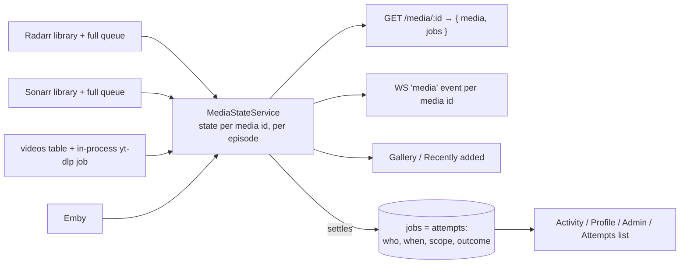
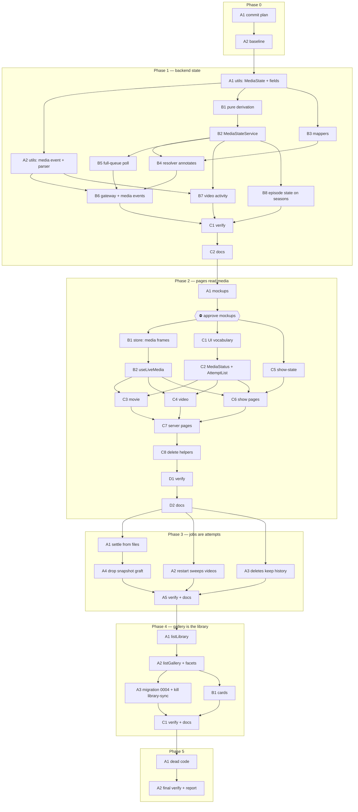

# Media is the source of truth; a job is one download attempt — `apps/download`

## Overview

> Written for a human first. Everything below this section is written for whoever
> executes the plan. If a claim here needs more, it links to where the detail lives.

Today the `jobs` table stands in for a media table. The gallery is a `GROUP BY` over
completed jobs, every detail page takes its status from the newest job, the poller only
watches queue items that belong to a job, and live updates are keyed by job id. Most of
the recent bugs are patches over the gap between "the latest job" and what is actually on
disk: _Cars_ read **failed** while it was playable, because a restart failed its job and
a made-up "completed" row sorted below it; titles already in Radarr/Sonarr need fake
completed jobs written at boot just to appear in the gallery; a `removed_from_library`
column exists because the gallery cannot ask Radarr whether a title is still there; a
download started in Radarr's own UI shows nothing at all.

This plan turns that around. **Media** — a movie in Radarr, a series in Sonarr, a row in
the `videos` table — becomes the thing every page reads, and it carries a live **state**
worked out from upstream on every poll. A **job** becomes what it always was underneath:
one attempt to download a media, with who, when, what scope, and how it ended. Jobs still
drive Activity, Profile, Admin and the "attempts" list on a detail page. They no longer
decide whether a title is downloaded.

| Change                                 | In one sentence                                                                                                                                                                                                                |
| -------------------------------------- | ------------------------------------------------------------------------------------------------------------------------------------------------------------------------------------------------------------------------------ |
| **Media carries a state**              | `absent` · `wanted` · `downloading` · `importing` · `needs_attention` · `paused` · `available`, derived from Radarr/Sonarr's library and **full** queue, or from the `videos` row and the in-process yt-dlp job. Never stored. |
| **The poller reads the whole queue**   | Not just items that belong to a job, so a grab started in Radarr's UI, from Discord, or from another tab shows status and progress here too.                                                                                   |
| **Detail pages read `media.state`**    | The chip at the top of a movie, show or video page comes from media. Jobs move into an **Attempts** list under it; only an in-flight attempt keeps its cancel/pause/resume/retry buttons.                                      |
| **Live updates are keyed by media id** | A new `media` WebSocket event carries a full media snapshot (plus per-episode states for a show). Pages subscribe by media id, so downloads this tab did not start still appear live.                                          |
| **Jobs settle from what is on disk**   | A movie/show job completes when its file appears upstream (`didJobComplete`, which already exists and nothing calls). A restart never fails a movie/show job — Radarr/Sonarr hold the truth.                                   |
| **Deletes stop rewriting history**     | Deleting a title cancels only in-flight attempts. A completed attempt stays completed.                                                                                                                                         |
| **The gallery lists the library**      | Radarr titles with a file, Sonarr series with files, videos with a file — sorted by when the file landed. Job counts and requesters are joined on by media id. `library-sync` and its fake rows go away.                       |



**Shape:** one doc, **six phases (0–5), 39 tasks**, orchestrated, each phase independently
shippable. **No feature branch** — work lands on `jeremy/download` in this worktree,
matching plans 001–020 ([why](#no-feature-branch-or-worktree)).

**Key decisions**, in brief — full reasoning in [Design decisions](#design-decisions).
⚠️ These were taken from the design session and the code without a live interview; each
names the alternative it beat, so flip any of them before Phase 1 · Wave 1 if you disagree:

- **Seven media states, one enum for all three media types**; `importing` covers both
  Radarr/Sonarr's import and yt-dlp's convert/upload. [Why](#the-media-state-vocabulary)
- **`state` is optional on the wire, like `embyStatus`** — mappers and fixtures build
  media without it, the resolver always fills it in; readers go through `mediaState()`.
  [Why](#where-state-lives-on-the-wire)
- **`MediaDetailResponse` keeps its `jobs` field.** The semantic change is that pages stop
  deriving status from it; renaming it to `history` buys nothing and churns the verify
  scripts. [Why](#where-state-lives-on-the-wire)
- **`MediaStateService` is a fed cache with no dependencies**: the poller pushes queues
  into it, `DownloadStateService` pushes in-flight video statuses into it, the resolver
  reads it. That is what keeps it out of the `DownloadModule ⇄ MediaModule` cycle.
  [Why](#a-fed-cache-not-a-fetching-service)
- **The queue refresh command is sent only when something is in flight** — a job is
  tracked or the last queue was non-empty — never every 10 s on an idle box.
  [Why](#full-queue-polling-and-the-refresh-command)
- **A queue item that vanishes without a file gets a 60 s grace, then `failed`** —
  today it is silently called completed. [Why](#jobs-settle-from-files)
- **The gallery is built in memory from the library the resolver already caches for
  60 s**, not from a new `media` table. 292 movies and 77 series is not a SQL problem.
  [Why](#the-gallery-is-built-from-the-library)
- **The cleanup migration deletes exactly the rows `library-sync` wrote** —
  `origin='service' AND status='completed' AND type IN ('movie','show') AND created_at =
completed_at` — verified read-only against both databases: 357 rows on dev, **0** on
  prod. [Why](#the-cleanup-migration)
- **Phase 2 starts with mockups and a human checkpoint**, matching how the last two UI
  changes in this app were made. [Why](#mockups-before-phase-2)

> **Accepted gaps:** the Activity feed and the home page's "in flight" count stay
> job-driven, so a download nobody requested through this app still does not appear
> there (it does appear on its own detail page and in the gallery once it lands). A
> series' gallery `addedAt` is Sonarr's `series.added`, not its newest episode file, so a
> new season does not bubble a show to the top of Recently added. Emby's
> `indexing → indexed` flip still needs a refresh; the poller does not re-check Emby.

**Read next:** [Design decisions](#design-decisions) for the why · [Task
List](#task-list) for the work itself · [Sequencing](#sequencing) for the order and the
human checkpoints · [Final report](#final-report) for what "done" reports back.

---

## How to work this plan

**Before Phase 0:** nothing to set up — there is no feature branch or worktree
([why](#no-feature-branch-or-worktree)). Phase 0 · A1 commits this doc first so the
record exists before any code moves.

**Per task:**

1. Work tasks in wave order (see [Sequencing](#sequencing)). Never start a task before
   its dependencies are green. **Never start a phase before the previous phase's
   verification task is green** — each phase is a shippable checkpoint, and a red one
   must not be built on.
2. Implement → write or update tests → run `pnpm test`, `pnpm lint` and
   `pnpm type-check` from every touched package (`apps/download`, `packages/utils`).
   When `packages/utils` changed, also run `pnpm build` **there** (never in
   `apps/download`, see [Gotchas](#gotchas)) so `dist/` is current for the app.
3. **`/commit`** — one task, one commit (or a small coherent set). `/commit` stages at
   line level, so unrelated edits in the same file don't ride along. The session is
   already rooted in this worktree, so no `in:` argument is needed.
4. Check the box below and append the commit hash.

**Commit mutex.** All tasks land on one branch in one checkout, so **two sub-agents must
never run `/commit` at the same time** — interleaved staging captures each other's work.
Parallel tasks may implement concurrently; the orchestrator serialises the commit step
(tell the second agent to wait for the first's hash before it commits).

**Markers:**

| Marker              | Means                                                          |
| ------------------- | -------------------------------------------------------------- |
| `- [ ]`             | Not started                                                    |
| `- [x]` … `abc1234` | Done, with the commit that did it                              |
| ⚠️ **PARTIAL**      | Landed with scope narrowed — say what was left and why, inline |
| ⏭️ **DROPPED**      | Not doing it — say why. Never delete a task                    |
| 🚧 / ⏳             | Blocked. Do not implement                                      |

**When reality disagrees with this plan,** add a short **Findings** note under the task,
then update the downstream tasks that finding invalidates. Do not let the doc drift from
what actually shipped.

---

## Instructions for the orchestrator agent

You are an **orchestrator**. Your job is delegation, sequencing, and status tracking —
nothing else.

**You are ONE session, and you hold the whole wave.** Sub-agents are spawned **inside**
your session and report back to you. ❌ **Never start one session per task** — sibling
sessions are peers with no reporting relationship, so there is no orchestrator, nobody
holding the wave, and nobody to catch a task that collides with its sibling or runs past
its scope. If you are asked to "start a session for the next phase," that is **one**
session: you.

**Do**

- Delegate every task to a sub-agent — implementation, testing, and committing
  included. One sub-agent per task, or per parallel group where
  [Sequencing](#sequencing) allows batching.
- Write **self-contained** delegation prompts. Copy in the task's full text, the
  relevant parts of the [Shared Context Pack](#shared-context-pack), and the
  [Definition of Done](#definition-of-done). If a task depends on names an earlier task
  produced, paste that sub-agent's reported outcomes — exported names, file paths,
  schema names — into the prompt.
- Tell every sub-agent to: implement → write or update tests → run the package's tests
  plus lint and type-check → run `/commit`. Each reports back **files changed, exported
  names, test results, commit hash(es)**.
- Respect the sequencing graph. Launch parallel-safe tasks concurrently; never start a
  task before its dependencies report success. **Serialise the commit step** across
  parallel tasks (see the commit mutex above).
- Re-delegate a failed task with the failure details attached.
- **Stop at every [human checkpoint](#human-checkpoints)** and report what the human
  has to do. The Phase 2 mockup approval is a hard gate: nothing in Phase 2 · Groups B–D
  starts until the human has said the mockups are approved.

**Don't**

- ❌ Read or edit any code yourself — no source, no tests, no configs. The only file you
  may edit is _this plan_, to check off tasks and record outcomes.
- ❌ Let sub-agents read this plan. Their prompts must carry everything they need.
- ❌ Fix a failing task yourself.
- ❌ Implement anything tagged 🚧 or ⏳. A sub-agent that thinks it needs to build one
  has misread its task — stop and report.
- ❌ Let a sub-agent continue past its task into the next one, even when that task is
  unblocked and the sub-agent is already warm. Deciding what runs next is the whole of
  your job; a sub-agent that does it for you has skipped the review the wave exists to
  give. If work lands that you did not brief, record it as unplanned rather than
  absorbing it silently.
- ❌ Restart, rebuild or `docker compose up` the `lilnas-download-dev` container. It is
  shared; restarting it is a [human checkpoint](#human-checkpoints).
- ❌ Send any mutating request to Radarr, Sonarr, Emby or MinIO. Read-only `GET`s from
  inside the dev container are fine.

**Finish by** verifying every checkbox is checked, then reporting the
[final status summary](#final-report).

---

## Design decisions

### The media state vocabulary

One enum for movies, shows and videos:

```ts
export const MEDIA_STATES = [
  'absent', // not in the library, or in it unmonitored with no file (video: no row / no file)
  'wanted', // monitored, no file, nothing in the queue (video: queued, not started)
  'downloading', // a queue item is moving bytes (video: yt-dlp is running, or cancelling)
  'importing', // bytes are down; the file is being made available (Radarr/Sonarr import, or yt-dlp convert/upload/clean)
  'needs_attention', // a queue item is stuck and a human must act — carries `stateReason`
  'paused', // video only today: yt-dlp paused or pausing
  'available', // a file is on disk (managed: `filePath`; video: `downloadUrls` non-empty)
] as const
```

**Why one enum and not three.** The detail pages, the gallery card and the chip
vocabulary are shared across types already (`STATUS_TONES`, `Chip`, `Dot`). Three enums
would mean three label maps and three tone maps for what the user perceives as one
lifecycle. Labels may still differ per type at the render layer (`importing` reads
"importing…" on a movie and "processing…" on a video) — that is a display decision, not
a data one.

**Why `paused` is its own state and `cancelling` is not.** A paused video is a stable
state a human chose and has to undo; it deserves a chip. Cancelling lasts a second and
resolves to `absent`; while it lasts, `downloading` is honest.

**Why a failed queue item is `needs_attention`, not `wanted`.** Radarr/Sonarr leave a
failed item in the queue with an error until something removes it. That is a human
decision (retry, blocklist, remove), and the sentence explaining it is exactly what
`stateReason` exists to carry — the same treatment plan 020 gave stuck imports. The
**job** matched to that item still goes `failed` (unchanged from today); the two answer
different questions.

**Precedence for one media** (a movie, or one episode): a queue item wins over the
library; `needs_attention > downloading > importing > paused` between items;
otherwise `available` if there is a file, `wanted` if monitored, else `absent`. A movie
with a file **and** a queue item (an upgrade in flight) is `downloading` — and still has
`filePath`, so Watch and Delete stay available; the chip is the honest part.

**Rollup for a season or series** — `rollupMediaState(states)` in `@lilnas/utils`, used
by the server for `Show.state` and by the client for season chips so the two cannot
disagree: `needs_attention > downloading > importing > paused > available > wanted >
absent`. A series with 3 of 45 episodes on disk is `available` — the counts
(`episodeFileCount` / `episodeCount`) say how much, exactly as the "N of M episodes"
chip does today. Specials (season 0) are excluded from the series rollup, matching
`seriesProgress()` (`apps/download/src/components/detail/show-state.ts:126`).

### Where state lives on the wire

Added to `MediaBaseSchema` (`packages/utils/src/download/schema.ts:174`):

```ts
addedAt: z.iso.datetime().optional(),   // when the file landed: movieFile.dateAdded / series.added / videos.updated_at once download_urls is set
state: MediaStateSchema.optional(),
stateReason: z.string().optional(),     // present iff state === 'needs_attention'
```

Added to `ManagedMediaBaseSchema` (:227): `monitored: z.boolean().optional()` — needed
to tell `wanted` from `absent`. `queueSnapshot` stays where it is and keeps its shape
(`{ progress?, status?, timeLeft? }`, :71); it just changes source — from "this job's
last queue item" to "this media's current queue item", filled by the resolver from the
queue cache instead of by `DownloadStateService.toJob` from a per-job map.

Added to `ShowSchema` (:246): `episodeCount` and `episodeFileCount`, both
`z.number().int().min(0).optional()`, straight from Sonarr's series `statistics` — the
gallery card and the series rollup need them, and `getDownloadedSeries()` already reads
them off the raw resource (`apps/download/src/media/sonarr.service.ts:365`).

Added to `EpisodeSchema` (:611): `state: MediaStateSchema.optional()` and
`queueSnapshot: DownloadQueueSnapshotSchema.optional()`.

**Why `state` is optional.** `toMovie()` (`radarr.service.ts:168`), `toShow()`
(`sonarr.service.ts:207`) and `hydrateVideo()` (`media-resolver.service.ts:35`) build a
`Media` before anything has looked at the queue; so do ~30 test fixtures. Making the
field required would force a second "unstated media" type through every mapper, or a
sweep of every fixture, for a guarantee the resolver already gives. This is exactly how
`embyStatus` works today: absent off the mapper, always set by
`EmbyStatusService.annotate()` (`apps/download/src/emby/emby-status.service.ts:120`) on
anything the API serves. Readers never touch `media.state` directly — they call
`mediaState(media): MediaState` (`absent` when unset), one helper in
`packages/utils/src/download/types.ts`, so the fallback lives in one place.

**Why `MediaDetailResponse` keeps `jobs`.** The design session sketched
`{ media, history }`. The rename would touch `client.ts`, three server pages, three live
wrappers and the type in five verify scripts (`apps/download/scripts/verify/*.ts`), and
the only thing it communicates is already communicated by the pages no longer deriving
status from it. `jobs` stays; its doc comment changes to say "attempts, newest first".

### A fed cache, not a fetching service

`MediaStateService` (`apps/download/src/media/media-state.service.ts`, new) holds:

- the last full Radarr queue and Sonarr queue, as `PollableQueueItem[]`, written by the
  poller every tick;
- the status of every in-flight **video** job keyed by media id, written by
  `DownloadStateService` on `addJob`/`updateJob` for `type === 'video'`.

It fetches nothing and injects nothing. `MediaResolverService.resolve()` calls its
`annotate()` after Emby's, the same shape as `embyStatusService.annotate(media.values())`
(`media-resolver.service.ts:115`). `ShowService.listSeasons()` calls its
`annotateEpisodes()`.

**Why not inject `DownloadStateService` into it.** `DownloadStateService` already injects
`MediaResolverService` (`download-state.service.ts:81-86`); the resolver would inject
`MediaStateService`; if that injected `DownloadStateService` the constructor cycle needs
`forwardRef` on both sides. The modules already carry one `forwardRef` pair
(`download.module.ts:28-46`, `media.module.ts`) and nobody wants a second. Pushing video
statuses in at the two write sites that exist (`addJob` :203, `updateJob` :352 — "the
only two places a job's state can change", per the type doc at
`packages/utils/src/download/types.ts:217`) costs two lines and no cycle.

### Full-queue polling and the refresh command

`MediaPollerService.pollMovies()` (`media-poller.service.ts:129`) returns early when no
job is tracked and calls `radarrService.getQueue(trackedIds)` otherwise. It becomes:
always call `getQueue()` with **no ids** (`radarr.service.ts:591` — `pageSize: 1000`,
one page; today's queues have 0 items, and a home box will never fill a page), hand the
result to `MediaStateService.setQueue('radarr', items)`, and only then match items to
tracked jobs exactly as today. `pollShows()` (:159) the same with `sonarr`.

**The `RefreshMonitoredDownloads` command** (`requestQueueRefresh`, :192; landed in
`65dd4b93`) makes Radarr/Sonarr re-read the download client before we read the queue.
Today it is sent when a job is tracked. New rule: send it when a job is tracked **or the
previously cached queue for that source was non-empty**. That covers an un-owned
download (something is in the queue → we keep refreshing until it leaves) without
sending a command to an idle Radarr six times a minute forever. First sight of an
un-owned download therefore lags by at most Radarr's own refresh interval — acceptable.

**Media events from the poller.** After both queues are stored, the poller diffs
per-media derived state against the previous tick's (a `Map<mediaId, MediaEventDigest>`
it keeps) and broadcasts one `media` event per changed media id. When a queue item
**disappears**, the poller `invalidate()`s that media (:279) before re-resolving, so the
event carries the new `filePath`/`embyStatus` — that is what lets the page stop calling
`router.refresh()`. For a series with any queue item this tick or last, the poller also
fetches `getEpisodes(sonarrId)` (`sonarr.service.ts:737`) once, so the event can carry
every episode's state; series with no items are never fetched.

### Media events on the wire

```ts
export const MEDIA_EVENT_TYPE = 'media'
export const EpisodeStateEntrySchema = z.object({
  episodeId: z.number().int().positive(),
  queueSnapshot: DownloadQueueSnapshotSchema.optional(),
  seasonNumber: z.number().int().min(0),
  state: MediaStateSchema,
})
export interface MediaEvent {
  episodes?: EpisodeStateEntry[]
  media: Media
}
// envelope: { type: 'media', data: MediaEvent } — same DownloadGatewayMessage as jobs
```

`parseMediaEventFrame(rawData)` sits next to `parseJobEventFrame`
(`packages/utils/src/download/job-events.ts:73`) and follows its rules: silent rejection,
`MediaSchema.safeParse`, never throw.

**No per-viewer variants.** Job events go through `broadcastPerViewer()`
(`download.gateway.ts:74`) because a job carries a requester that the attribution oracle
may mask. A media snapshot carries no requester, so the gateway gains a plain
`broadcast(message)` that serialises once. Hidden-attribution videos are still visible
by title today (the video page renders for anyone with the URL); this changes nothing
there.

**Client subscription by media id.** `createJobEventsStore`
(`apps/download/src/lib/use-job-events.ts:135`) gains a second map, `media`, keyed by
media id, and a second interest set. `JobEventsFilter` (:65) gains `mediaIds?` so that
the **job** frames for a media page are selected by `job.media.id`, not by the job ids
the server rendered — a job created from Discord or another tab then appears in the
Attempts list without a refresh. `useLiveMedia({ media, seasons })` replaces
`useLiveMediaJobs()` (`use-live-media-jobs.ts:26`), the only caller of `router.refresh()`
in the app (:37); that call goes.

### Jobs settle from files

`didJobComplete({ createdAt, scope, files, episodes })`
(`apps/download/src/media/job-completion.util.ts:152`) and
`MediaPollerService.completionInputs()` (`media-poller.service.ts:263`) were built for
this and are called only from tests — the poller's doc comment says the util "landed
ahead of the queue-empty check that consumes it". Phase 3 · A1 is that check.

New per-tick rule for a tracked **movie/show** job, replacing the "no item ⇒ completed"
row of `deriveStatusFromQueueItem` (`queue-status.util.ts:220`):

| Queue item for this job's media + scope                  | Files say                  | Job goes to                                                                                         |
| -------------------------------------------------------- | -------------------------- | --------------------------------------------------------------------------------------------------- |
| present                                                  | —                          | as today: `deriveStatusFromQueueItem` (downloading / importing / needs_attention / failed / paused) |
| absent                                                   | `didJobComplete` is `true` | `completed` (+ `invalidate`, as today)                                                              |
| absent, status ∈ {downloading, importing}                | `false`, absent < 60 s     | unchanged — the import may be racing the file listing                                               |
| absent, status ∈ {downloading, importing}                | `false`, absent ≥ 60 s     | `failed`, error `Left the queue without producing a file`                                           |
| absent, status ∈ {requested, searching, needs_attention} | `false`                    | unchanged (as today — nothing was ever grabbed, or the human has not acted)                         |

"Absent since" is a `Map<jobId, epochMs>` in the poller, cleared when an item reappears.
`completionInputs()` runs only for tracked jobs with no item this tick, so the extra
upstream reads happen only while something is settling.

**Restart.** `reconcileInterruptedJobs()` (`reconcile-interrupted-jobs.ts:36`) sweeps
every non-terminal row to `failed` except `needs_attention`. It now sweeps **video rows
only** — the partial file under `/download/videos` really is gone, as its doc says. Every
non-terminal movie/show row is re-adopted at boot (`adoptSurvivingJobs()`
(`download-state.service.ts:270`) widens from `RESTART_SURVIVING_STATUSES` to "every
non-terminal movie/show row, plus `needs_attention` of any type"), and the poller settles
them from the queue and the files on the next tick. That is the whole _Cars_ fix on the
job side: the job would have been re-adopted, found its file, and completed.

### Deletes don't rewrite history

`MediaDownloadService.deleteJob()` (`media-download.service.ts:434`) ends with
`updateJob(id, { status: Cancelled })` (:462) regardless of the job's status, and
`DownloadService.deleteVideoDownloadJob()` (`download.service.ts:590`) does the same at
:636. Both become: cancel only if `!isTerminalDownloadJobStatus(status)`; a completed
attempt stays completed — the file was downloaded, then deleted, and both facts are true.
`ShowService.cancelInFlightJobs()` (`show.service.ts:261`) already does exactly this and
needs no change. Prod has 6 movie and 2 show jobs reading `cancelled` today that were
almost certainly completed downloads later deleted; the migration does not touch them
(there is no way to tell, and history stays as it was recorded).

### The gallery is built from the library

`JobQueryService.listGallery()` (`job-query.service.ts:184`) becomes: take the resolver's
cached movie and show libraries plus every `videos` row with a non-empty `download_urls`,
keep managed titles with a file (`filePath` for movies; `episodeFileCount > 0` for
shows), resolve them (which annotates Emby and state), sort by `addedAt` desc then id,
page with an opaque `${addedAtMs}:${mediaId}` cursor, and join job facts by media id:

```ts
countCompletedJobsByMediaIds(db, filter, mediaIds): Map<string, number>     // new, jobs.repo.ts
listLatestJobsForMediaIds(db, filter, mediaIds): JobRow[]                    // exists, :425 — last requester
```

`GalleryItemSchema` (`schema.ts:313`) becomes `{ addedAt, downloadCount,
lastDiscordRequester, lastDownloadedAt: nullable, lastRequester, media }` — `downloadCount`
may now honestly be `0` and `lastDownloadedAt` `null` for a title nobody downloaded
through this app.

**Query semantics kept:** `type` filters the library; `from`/`to` apply to `addedAt`;
`requester` keeps meaning "titles this requester has a completed job for" (join, then
filter); the hidden-video rule (`excludeHiddenVideos` for a requester-scoped query by a
non-admin) applies to the joined latest job as it applies today. Facets: `types` count
the library in the date range; `uploaders` stay `countJobsByRequester` over completed
jobs (:281) — an uploader chip is a claim about people, and people are in `jobs`.

**Why in memory and not a `media` table.** The resolver already caches both libraries
for 60 s (`media-resolver.service.ts:68`). Today's library is 292 movies (283 with a
file) and 77 series (74 with files), read live on 2026-09-22; a home NAS is not going to
make sorting a few hundred objects a problem, and the alternative is a table that has to
be kept in sync with upstream — which is the design this plan is removing. Revisit only
if gallery filtering ever needs SQL.

**`addedAt` per type:** movie → `movieFile.dateAdded` (live sample:
`"2024-03-13T06:08:15Z"`, present on every movie with a file); series →
`series.added` (accepted gap above: Sonarr's per-episode `dateAdded` is one call per
series, 74 calls a minute is not worth it); video → `videos.updated_at`, which
`updateVideo()` (`download-state.service.ts:183`) bumps when `downloadUrls` lands.

### The cleanup migration

`syncDownloadedLibrary()` (`library-sync.ts:44`) writes rows with `origin: 'service'`,
`status: 'completed'`, `requester*: null`, and — the tell — `createdAt === completedAt ===
entry.addedAt` (:111-129). A real service-origin job (a `DownloadClient.dockerInstance`
call with no identity) has `createdAt < completedAt`.

Read-only counts, 2026-09-22:

| DB                         | `service · completed` rows | of which `created_at = completed_at` | of which type video |
| -------------------------- | -------------------------- | ------------------------------------ | ------------------- |
| `lilnas-download-dev`      | 357                        | 357 (283 movie + 74 show)            | 0                   |
| `lilnas-download-1` (prod) | 21                         | **0**                                | 21                  |

So the predicate `origin = 'service' AND status = 'completed' AND type IN ('movie',
'show') AND created_at = completed_at` deletes every backfilled row on dev and nothing on
prod (prod's 21 are real tdr-bot video jobs from before Discord attribution, and prod
never ran a build with `library-sync`). No `audit_log` row points at any of them (0 on
both). The same migration drops `removed_from_library` (`0003_lazy_supernaut.sql` added
it; no index or CHECK references it). Prod is on migration 0002 and applies 0003 and 0004
in order at its next deploy — nothing to do by hand.

### Mockups before Phase 2

Every recent UI change here was drawn first (`e8579c4c docs(download): mock up a
one-press Download…`, `fce7e694 … manual-import mockup`) in
`docs/features/download/designs/src/pages/*.pug`, built with `pnpm mockups` from the
repo root, and only then built for real. Phase 2 reshapes three pages — a media-state
chip at the top, an Attempts list where the lifecycle panel and "Earlier attempts" were,
progress for downloads this app did not start — so Phase 2 · A1 draws them and the
orchestrator stops for approval before Groups B–D.

### Things that already exist — don't rebuild them

- **Queue item → status** — `deriveStatusFromQueueItem`, `aggregateQueueItems`,
  `describeQueueItemError`, `toQueueSnapshot`, `matchesScope` (`queue-status.util.ts`).
  The media-state derivation maps through these; it does not re-read `trackedDownloadState`.
- **"Did this job's file land?"** — `didJobComplete` (`job-completion.util.ts:152`) and
  `completionInputs` (`media-poller.service.ts:263`), tested, uncalled. Phase 3 · A1 wires
  them; it does not rewrite them.
- **Series/season progress from counts** — `seasonProgress`/`seriesProgress`
  (`show-state.ts:113/126`). Keep; they read `episodeFileCount`, which is upstream truth.
- **Emby annotation** — `EmbyStatusService.annotate()` (`emby-status.service.ts:120`). The
  new `annotate()` runs after it and never touches `embyStatus`.
- **Attribution masking** — `resolveLastRequesters` in `job-query.service.ts` and
  `projectJobForViewer`. The new gallery calls them; it does not re-derive the oracle.
- **The frame parser pattern** — `parseJobEventFrame` (`job-events.ts:73`). Copy its
  shape for `parseMediaEventFrame`.
- **Reconnect/backoff** in `createJobEventsStore`. Untouched; only `ingest` grows.

### What stays untouched

- `apps/download/src/media/manual-import.service.ts` and the import dialog — they act on
  `needs_attention` **jobs**, and jobs keep that status.
- `apps/download/src/download/download-video.service.ts` and
  `download-scheduler.service.ts` — the yt-dlp pipeline's statuses are unchanged; media
  state for a video is derived from them.
- `apps/download/src/admin/**`, `profile.service.ts`, `activity-rows.ts` — job-driven by
  design; they become accurate when the fake rows go. Only the `GalleryItem` consumers
  change (Phase 4 · B1).
- `apps/download/src/media/delete-cascade.util.ts` — pure and job-free already.
- `packages/utils/src/download/client.ts` request/response shapes other than
  `GalleryItem`/`MediaDetailResponse` doc comments.

### No feature branch or worktree

Work lands directly on `jeremy/download`, matching all 20 prior plans in this series.
`lilnas-download-dev` — the container the live checkpoints verify against — bind-mounts
**this** checkout (`/home/jeremy/.nexus-code/worktrees/lilnas/jeremy-download → /source`,
checked with `docker inspect` on 2026-09-22); work in a separate worktree could not be
exercised live without a merge first. The cost is the commit mutex above. This plan
lands as ~39 commits over six phases, but the repo's convention wins over the generic
branching heuristic, for the stated reason. Each phase's verification task is the
"shippable" line; a deploy between phases is a human decision.

---

## Shared Context Pack

> Copy the relevant parts into every sub-agent prompt. These are pointers — **verify
> against current code**, a plan ages and the code is the truth.

### Repo & conventions

- pnpm workspaces + Turbo. The app is `@lilnas/download` at `apps/download`; the shared
  wire types are `@lilnas/utils` at `packages/utils` (`src/download/schema.ts` for zod,
  `src/download/types.ts` for inferred types and hand-written response interfaces,
  `src/download/client.ts` for `DownloadClient`, `src/download/job-events.ts` for the WS
  frame parser). The generated Radarr/Sonarr SDKs are `@lilnas/media/radarr` and
  `@lilnas/media/sonarr` (`client-fetch` builds; types in `packages/media/src/*/types.gen.ts`).
- **From `apps/download`:** `pnpm test` · `pnpm lint` (eslint **and** prettier — two
  checks; `pnpm lint:fix` fixes both) · `pnpm type-check`. One file:
  `pnpm test -- src/media/__tests__/media-poller.service.test.ts`; add
  `--selectProjects node` or `jsdom` to run one project.
- **From `packages/utils`:** the same three, plus `pnpm build` so `dist/` is current for
  the app's type-check (`apps/download` type-checks against `packages/utils/dist`).
- ⚠️ **Never run `pnpm build` in `apps/download`** — it clobbers the `.next` the running
  dev container holds. Do not run the root `pnpm run build` either, for the same reason.
  `pnpm mockups` from the repo root is fine (it builds only `docs/features/*/designs`).
- Tests live in `__tests__/` next to the code. Jest, **two projects**
  (`apps/download/jest.config.js`): `node` (`*.ts`) and `jsdom` (`*.tsx`,
  `@testing-library/react` + `user-event`, setup at `src/__tests__/setup-dom.ts`).
  Anything importing `DownloadStateService` or the controller needs
  `jest.mock('nanoid', () => ({ nanoid: jest.fn(() => 'mock-id') }))` **before** the
  imports (see `media-poller.service.test.ts:1-8`). Injecting a new provider into
  `DownloadController` or `DownloadStateService` breaks every testing module that builds
  them ("Nest can't resolve dependencies") — plan 020 · D2 touched ten sibling specs for
  this; budget for it.
- Migrations: drizzle-kit, `apps/download/src/db/migrations/NNNN_<words>.sql` +
  `meta/NNNN_snapshot.json` + `meta/_journal.json`, generated by `pnpm db:generate` from
  `apps/download`; applied at boot by `DbService.runMigrations()` (`src/db/migrate.ts:98`).
  Latest is **`0003_lazy_supernaut`**; the next is **`0004`**. `0002` is the precedent
  for a hand-edited migration (`-- HAND-EDITED` comment; `migrate-0002.spec.ts` tests it).
- Commit style (from `git log`): `feat(download): …`, `fix(download): …`,
  `docs(download): …`, `feat(utils): …`, `refactor(download): …`; imperative,
  lower-case, no period, body explains the why. End the message with
  `Co-Authored-By: Claude Opus 5.5 (1M context) <noreply@anthropic.com>`.
- Prose in code comments uses `-` in the backend files and `—` in the frontend files.
  Match the file you are in. `cns()` from `@lilnas/utils/cns` for every class list. No
  `any`.
- **Exhaustive `Record<…>` tables fail type-check until updated.** Adding `MediaState`
  creates two new ones (labels and tones, Phase 2 · C1); nothing in this plan adds a
  `DownloadJobStatus` member, so the existing `Record<DownloadJobStatus, …>` tables
  (`lib/format.ts:223`, `lib/profile-filters.ts:79`, `detail/job-state.ts:117`) are safe.
- Mockups: `docs/features/download/designs/src/pages/*.pug` + `src/data/*.mjs`, mixins in
  `src/mixins/ui.pug` and `mock.pug`; build with `pnpm mockups` **from the repo root**;
  the generated `designs/*.html` are committed alongside. Preview by opening
  `docs/features/download/designs/index.html`.

### Layout

| File                                                                     | What it is                                                                                                                                                                                                                                                                                                                                                          |
| ------------------------------------------------------------------------ | ------------------------------------------------------------------------------------------------------------------------------------------------------------------------------------------------------------------------------------------------------------------------------------------------------------------------------------------------------------------- |
| `packages/utils/src/download/schema.ts`                                  | `DownloadJobStatus` (:9), `DownloadQueueSnapshotSchema` (:71), `MediaBaseSchema` (:174), `VideoSchema` (:200), `ManagedMediaBaseSchema` (:227), `MovieSchema` (:233), `ShowSchema` (:246), `DownloadJobSchema` (:287), `GalleryItemSchema` (:313), `GalleryQuerySchema` (:396), `EpisodeSchema` (:611), `SeasonSchema` (:652)                                       |
| `packages/utils/src/download/types.ts`                                   | `TERMINAL_DOWNLOAD_JOB_STATUSES` (:64), `isTerminalDownloadJobStatus` (:70), `isInProgressDownloadJobStatus` (:82), type guards `isVideo`/`isMovie`/`isShow` (:149-161), `DownloadJobRecord` (:183), `MediaDetailResponse` (:191), `DownloadJobEventType` (:205), `DOWNLOAD_JOB_EVENT_TYPE` (:227), `DownloadGatewayMessage` (:236), `DownloadGalleryFacets` (:352) |
| `packages/utils/src/download/job-events.ts`                              | `parseJobEventFrame` (:73), `isDownloadGatewayMessage` (:44), `jobEventsSocketUrl` (:128)                                                                                                                                                                                                                                                                           |
| `packages/utils/src/download/client.ts`                                  | `DownloadClient`: `getMedia` (:482), `getGallery` (:711), `getGalleryFacets` (:720)                                                                                                                                                                                                                                                                                 |
| `packages/utils/src/download/__tests__/`                                 | `types.spec.ts` (enum/partition tests), `client.spec.ts`, `job-events.spec.ts`                                                                                                                                                                                                                                                                                      |
| `apps/download/src/media/queue-status.util.ts`                           | `PollableQueueItem` (:14), `toQueueSnapshot` (:57), `isQueueSnapshotEqual` (:76), `STATUS_PRECEDENCE` (:102), `aggregateQueueItems` (:134), `describeQueueItemError` (:176), `deriveStatusFromQueueItem` (:220), `matchesScope` (:286)                                                                                                                              |
| `apps/download/src/media/job-completion.util.ts`                         | `CompletionInput` (:41), `didJobComplete` (:152) — tested, uncalled                                                                                                                                                                                                                                                                                                 |
| `apps/download/src/media/media-poller.service.ts`                        | `@Cron('*/10 * * * * *') poll()` (:96), `pollMovies` (:129), `pollShows` (:159), `requestQueueRefresh` (:192), `trackedJobs` (:213), `completionInputs` (:263), `applyUpdate` (:299), `upstreamLibraryId` (:385)                                                                                                                                                    |
| `apps/download/src/media/media-resolver.service.ts`                      | `hydrateVideo` (:35), `TTL_MS` (:68), `resolve(keys)` (:82) → `{ degradedSources, media: Map }`, Emby annotate call (:115), `invalidate(key)` (:279), `getMovieLibrary` (:287), `getShowLibrary` (:310)                                                                                                                                                             |
| `apps/download/src/media/radarr.service.ts`                              | `toMovie` (:168; `filePath` :184), `getLibrary` (:240), `getDownloadedMovies` (:262; `addedAt = m.added`), `getMovieFiles` (:461), `refreshMonitoredDownloads` (:575), `getQueue(movieIds?)` (:591)                                                                                                                                                                 |
| `apps/download/src/media/sonarr.service.ts`                              | `toShow` (:207; `filePath = series.path` :223), `toEpisode` (:251), `toSeason` (:292; statistics :296-299), `getLibrary` (:343), `getDownloadedSeries` (:365), `listSeasons` (:591), `getEpisodes` (:737), `getEpisodeFiles` (:827), `refreshMonitoredDownloads` (:1060), `getQueue(seriesIds?)` (:1076)                                                            |
| `apps/download/src/media/show.service.ts`                                | `listSeasons(mediaId)` (:87), `deleteFiles` (:221; `markRemovedFromLibrary` :241), `cancelInFlightJobs` (:261)                                                                                                                                                                                                                                                      |
| `apps/download/src/media/media-download.service.ts`                      | `request` (:325), `deleteJob` (:434; unconditional Cancelled at :462)                                                                                                                                                                                                                                                                                               |
| `apps/download/src/media/library-sync.ts`                                | `syncDownloadedLibrary` (:44), `backfillCompletedJobs` (:81), the fake row (:111-129) — **deleted in Phase 4**                                                                                                                                                                                                                                                      |
| `apps/download/src/media/media.module.ts`                                | Provider/export lists — a new service is registered in both                                                                                                                                                                                                                                                                                                         |
| `apps/download/src/emby/emby-status.service.ts`                          | `annotate(media: Iterable<Media>): Promise<void>` (:120) — the annotate shape to copy                                                                                                                                                                                                                                                                               |
| `apps/download/src/download/download-state.service.ts`                   | `queueSnapshots` (:78), `setQueueSnapshot` (:125), `updateVideo` (:183), `addJob` (:203), `adoptSurvivingJobs` (:270), `hydrate` (:312), `toJob` (:325; graft :343-347), `updateJob` (:352), `broadcastJobEvent` (:507)                                                                                                                                             |
| `apps/download/src/download/download.service.ts`                         | `deleteVideoDownloadJob` (:590; unconditional Cancelled at :636)                                                                                                                                                                                                                                                                                                    |
| `apps/download/src/download/job-query.service.ts`                        | `listJobsForMedia` (:164), `listGallery` (:184; `excludeRemovedFromLibrary` :206), `getGalleryFacets` (:281), `resolveLastRequesters`                                                                                                                                                                                                                               |
| `apps/download/src/download/download.controller.ts`                      | `getMediaDetail` (:686), `listSeasons` route (:847), `deleteMovieJob` (:1781), `deleteShowJob` (:1908)                                                                                                                                                                                                                                                              |
| `apps/download/src/download-gateway/download.gateway.ts`                 | `broadcastPerViewer` (:74) — add `broadcast` beside it                                                                                                                                                                                                                                                                                                              |
| `apps/download/src/db/schema.ts`                                         | `jobs` (:105-258; `removedFromLibrary` :191), `videos` (:267-294), `JOB_ORIGINS` (:81)                                                                                                                                                                                                                                                                              |
| `apps/download/src/db/jobs.repo.ts`                                      | `JobListFilter` (:32; `excludeRemovedFromLibrary` :73), `listJobsByMediaId` (:266), `listJobsByStatus` (:282), `markJobsRemovedFromLibrary` (:303), `listMediaGroupsPage` (:342), `listLatestJobsForMediaIds` (:425), `countJobsByRequester` (:463), `countJobsByType` (:488)                                                                                       |
| `apps/download/src/db/reconcile-interrupted-jobs.ts`                     | `RESTART_SURVIVING_STATUSES` (:21), `reconcileInterruptedJobs` (:36)                                                                                                                                                                                                                                                                                                |
| `apps/download/src/db/migrate.ts`                                        | `runMigrations` (:98)                                                                                                                                                                                                                                                                                                                                               |
| `apps/download/src/db/__tests__/test-utils.ts`                           | `createTestDb()` (:25), `createTestDbService()` (:39)                                                                                                                                                                                                                                                                                                               |
| `apps/download/src/download/__tests__/helpers/job-fixtures.ts`           | `buildVideo`/`buildMovie`/`buildShow`, `buildRecord` (:47), `buildJob` (:67)                                                                                                                                                                                                                                                                                        |
| `apps/download/src/media/__tests__/helpers/fake-media-resolver.ts`       | `createFakeMediaResolver(fixtures?)` (:13), `flushAsync` (:68)                                                                                                                                                                                                                                                                                                      |
| `apps/download/src/bootstrap.ts`                                         | Boot order: migrations (:27) → integrity → `reconcileInterruptedJobs` (:36) → `adoptSurvivingJobs` (:37) → `syncDownloadedLibrary` (:47) → listen                                                                                                                                                                                                                   |
| `apps/download/src/lib/use-job-events.ts`                                | `JobEventsFilter` (:65), `createJobEventsStore` (:135), `isInteresting` (:156), `ingest` (:166), `useJobEvents` (:317)                                                                                                                                                                                                                                              |
| `apps/download/src/lib/use-live-media-jobs.ts`                           | `useLiveMediaJobs` (:26), the app's only `router.refresh()` (:37) — **deleted in Phase 2**                                                                                                                                                                                                                                                                          |
| `apps/download/src/lib/__tests__/helpers/job-events.ts`                  | `buildFrame`, `buildJobFrame`, `FakeWebSocket`, `createSocketRecorder`                                                                                                                                                                                                                                                                                              |
| `apps/download/src/lib/format.ts`                                        | `StatusTone` (:203), `STATUS_TONES` (:223), `statusTone` (:242), `isInProgress` (:256)                                                                                                                                                                                                                                                                              |
| `apps/download/src/components/live/job-events.tsx`                       | `JobEventsProvider` (:32)                                                                                                                                                                                                                                                                                                                                           |
| `apps/download/src/components/detail/job-state.ts`                       | `JobActionKey` (:24), `jobActionState` (:63), `jobStatusLabel` (:136), `JOB_LIFECYCLE_EMPTY_LABEL` (:141), `latestJob` (:155), `currentJob` (:176), `mergeLiveMediaJobs` (:213; the importing hold :226-232), `jobProgress` (:268)                                                                                                                                  |
| `apps/download/src/components/detail/job-lifecycle.tsx`                  | `JobLifecycleProps` (:120), `JobLifecycle` (:199; empty state :227, chip :368, `ACTION_SPECS` order :79), `JobHistory` (:506)                                                                                                                                                                                                                                       |
| `apps/download/src/components/detail/movie-detail.tsx`                   | `MOVIE_LIBRARY_LABEL` (:99), `movieHasFile` (:254), `MovieDetail` (:335; `currentJob` :364, header actions :369-430, status section :491-525, `JobHistory` :526)                                                                                                                                                                                                    |
| `apps/download/src/components/detail/show-detail.tsx`                    | `ShowDetail` (:200; scoping :215-225, status section :298-326, `ShowSeasons` :336)                                                                                                                                                                                                                                                                                  |
| `apps/download/src/components/detail/show-state.ts`                      | `seasonProgress` (:113), `seriesProgress` (:126), `seriesScopedJobs` (:180), `seasonScopedJobs` (:204), `episodeScopedJobs` (:229), `isScopeDownloading` (:237), `deleteCascade` (:327), `episodeState` (:396)                                                                                                                                                      |
| `apps/download/src/components/detail/show-seasons.tsx`                   | `ShowSeasons` (:147; season panel :190-283, episode rows :291-317), `SeasonTab` (:340)                                                                                                                                                                                                                                                                              |
| `apps/download/src/components/detail/show-episode-row.tsx`               | `ShowEpisodeRow` (:163; state :180-188, actions :231-271, drawer :297-328)                                                                                                                                                                                                                                                                                          |
| `apps/download/src/components/detail/video-detail.tsx`                   | `mergeVideoJobs` (:240), `VideoDetail` (:336; `latestJob` :349, lifecycle slot :425-480, `JobHistory` :519)                                                                                                                                                                                                                                                         |
| `apps/download/src/components/detail/*-detail-live.tsx`                  | The three client wrappers (`movie-detail-live.tsx:18`, `show-detail-live.tsx:14`, `video-detail-live.tsx:116`)                                                                                                                                                                                                                                                      |
| `apps/download/src/components/detail/__tests__/fixtures/show.ts`         | `show()`, `episode()`, `season()`, `job()`, `scopedJob()` (:25-111)                                                                                                                                                                                                                                                                                                 |
| `apps/download/src/app/movies/[tmdbId]/page.tsx`                         | `loadMovieDetail` (:70), render (:227-250)                                                                                                                                                                                                                                                                                                                          |
| `apps/download/src/app/shows/[tvdbId]/page.tsx`                          | data (:211-215), render (:225-251)                                                                                                                                                                                                                                                                                                                                  |
| `apps/download/src/app/videos/[videoId]/page.tsx`                        | `loadVideoDetail` (:53), render (:140-160)                                                                                                                                                                                                                                                                                                                          |
| `apps/download/src/app/(home)/page.tsx`                                  | `getGallery({ limit: RECENTLY_ADDED_LIMIT })` + `getActivity({ limit: 1 }).total` (:31-40)                                                                                                                                                                                                                                                                          |
| `apps/download/src/components/gallery/gallery-item-card.tsx`             | `GalleryItemCard` (:115; `lastDownloadedAt` :132/:169-177)                                                                                                                                                                                                                                                                                                          |
| `apps/download/src/components/home/recent-card.tsx`                      | `RecentCard` (:106; `lastDownloadedAt` :177)                                                                                                                                                                                                                                                                                                                        |
| `apps/download/scripts/verify/mutate.ts`                                 | `MEDIA_TRANSITIONS` (:339) — the live verification script's legal-transition map                                                                                                                                                                                                                                                                                    |
| `docs/features/download/backend.md`                                      | Living backend doc; top-level sections per plan (`## Stuck imports and the in-app importer (plan 020)` at :1948 is the shape to copy)                                                                                                                                                                                                                               |
| `docs/features/download/designs/src/pages/{movie,show,video}-detail.pug` | The three detail mockups; `movie-detail.pug` mixins: `movieHeader` :29, `notDownloadedFrame` :226, state legend :248-296                                                                                                                                                                                                                                            |

### Live facts (read-only, 2026-09-22)

Use these to shape fixtures; nothing here was mutated.

```ts
// Radarr: 292 movies, 283 hasFile, 9 monitored-without-file, 0 unmonitored-without-file. Queue: 0 items.
{ id: 3, tmdbId: 50546, added: '2024-03-13T06:00:51Z', hasFile: true, monitored: true,
  movieFile: { id: 1, dateAdded: '2024-03-13T06:08:15Z', path: '/movies/Just Go with It (2011)/….mkv' } }
{ id: 171, tmdbId: 1158406, added: '2025-04-05T08:30:54Z', monitored: true }   // no movieFile key at all → `wanted`

// Sonarr: 77 series, 74 with files. Queue: 0 items.
{ id: 3, tvdbId: 74413, added: '2024-03-13T17:24:00Z', monitored: true, path: '/tv/The Boondocks',
  statistics: { seasonCount: 4, episodeFileCount: 45, episodeCount: 45, totalEpisodeCount: 98, sizeOnDisk: 67477969060, percentOfEpisodes: 100 },
  seasons: [{ seasonNumber: 0, monitored: false, statistics: { episodeFileCount: 0, episodeCount: 0, totalEpisodeCount: 43 } }, …] }
// GET /episodefile?seriesId=3 → 45 rows:
{ id: 219, seriesId: 3, seasonNumber: 2, dateAdded: '2024-03-13T17:25:26Z', path: '/tv/The Boondocks/Season 2/….mkv' }

// Full queue calls (no ids) return `{ totalRecords, records: [] }` today; the one stuck item plan 020 captured is the
// shape to use for a populated fixture (status 'completed', trackedDownloadStatus 'warning', trackedDownloadState 'importPending').
```

### Patterns to imitate

**Annotate-in-place service** — `EmbyStatusService.annotate`
(`emby-status.service.ts:120`), called from the resolver at
`media-resolver.service.ts:115`:

```ts
async annotate(media: Iterable<Media>): Promise<void> {
  for (const item of media) { if (!isManagedMedia(item) || !item.filePath) continue; item.embyStatus = … }
}
```

**Frame parser** — `parseJobEventFrame` (`job-events.ts:73-98`): string → JSON →
`isDownloadGatewayMessage` → `type` check → `Schema.safeParse` → value or `undefined`,
never throw.

**Store with interest sets** — `createJobEventsStore` (`use-job-events.ts:135-273`):
`useSyncExternalStore`, ref-counted interest keyed on `JSON.stringify(sorted ids)`,
`ingest` drops uninteresting frames at the door.

**Pure derivation with a table test** — `deriveStatusFromQueueItem`
(`queue-status.util.ts:220`) and `queue-status.util.test.ts`. `deriveManagedState`
should read the same way.

**Hand-edited migration** — `0002_even_newton_destine.sql` (`-- HAND-EDITED` header,
`--> statement-breakpoint` between statements) and `migrate-0002.spec.ts`, which applies
the migrations to a fresh in-memory DB seeded with the pre-migration shape.

**Mockup frame** — `notDownloadedFrame` in `movie-detail.pug:226` (added in `e8579c4c`):
a mixin per state frame, a `JUMP` entry in `data/movie-detail.mjs`, a `+frameLabel()`.

### Gotchas

- **`pnpm build` in `apps/download` breaks the running dev container.** Never. Build
  `packages/utils` instead when its types change, and let `nest start -w` pick up the
  app.
- **`nest start -w` does not always pick up new providers or routes** (plan 020 found
  this). A restart of `lilnas-download-dev` is a human checkpoint, not something a
  sub-agent does.
- **`Show.filePath` is the series folder, set for every library series** whether or not
  it has files (`sonarr.service.ts:223`). "Has files" for a show is `episodeFileCount >
0`, never `filePath`.
- **`Movie` has no `hasFile`.** `filePath` is the signal (`radarr.service.ts:184`).
- **Every open WS client gets every frame.** There are no `@SubscribeMessage` handlers;
  filtering is client-side in `ingest`. Keep it that way — a media event is small.
- **`resolve()` returns placeholders for unknown keys** and marks the source in
  `degradedSources`; a placeholder must derive `absent`, never throw.
- **`aggregateQueueItems` folds a season's items into one synthetic item** without a
  row id. Per-episode state must be derived per item, before any fold.
- **`DownloadJobSchema.safeParse` in the client drops a frame whose `media` fails the
  schema.** New media fields must be optional or always present; `state` is optional for
  exactly this reason.
- **Verify scripts pin job transitions.** `scripts/verify/mutate.ts:339`
  `MEDIA_TRANSITIONS` says `completed → cancelled` is legal on delete; Phase 3 · A3 makes
  it illegal and must update the map (it is a `Map`, not a `Record` — it compiles either
  way).
- **The queue snapshot lives in two places until Phase 3 · A4.** After Phase 1 the
  resolver sets `media.queueSnapshot` from the cache and `toJob` still overwrites it from
  the per-job map. They agree while both exist; A4 removes the graft.

### Definition of Done

Include this **verbatim** in every delegation:

> **Done means:** implemented; tests written or updated following the package's existing
> conventions and passing; lint and type-check clean for every touched package;
> committed with `/commit`. Report back: files changed, exported names introduced, test
> summary, commit hash(es).

Addenda:

- ❌ Do not run `pnpm build` in `apps/download` or at the repo root. Run it in
  `packages/utils` when that package changed.
- ❌ Do not restart or rebuild any container, and do not send a non-`GET` request to
  Radarr, Sonarr, Emby or MinIO.
- ❌ Do not run `/commit` while another sub-agent's commit is in progress — the
  orchestrator hands you the go-ahead.
- Mockup tasks: "tests" means `pnpm mockups` builds clean from the repo root and
  `pnpm lint` (root) passes its prettier check over `designs/src`.

---

## Task List

Six phases. IDs restart per phase and are referenced as `Phase 2 · C3`. **Never start a
phase before the previous phase's verification task is green.**

### Phase 0 — Prep

- [x] **A1. Commit this plan.** `docs/features/download/plans/021-media-as-source-of-truth.md`
      lands as its own `docs(download): …` commit before any code moves, so the record
      exists and later tasks can append findings to a tracked file. `6534baad`

- [x] **A2. Baseline.** (no commit) From `apps/download` and `packages/utils`: `pnpm test`,
      `pnpm lint`, `pnpm type-check`; from the root: `pnpm run type-check`, `pnpm run lint`.
      Record the passing counts in a **Findings** note here (plan 020's final numbers were
      3926 tests / 180 suites in the app, 421 / 8 in utils; `@lilnas/equations` has 7
      pre-existing failures that are not this plan's). No commit. If anything is red that
      plan 020 reported green, **stop and report** before Phase 1.

  > **Findings (2026-09-22):** all green. `apps/download`: 3958 passed + 9 skipped
  > (3967 tests), 182 passed + 1 skipped (183 suites) — the skipped suite is the
  > Docker-only `ytdlp-update.integration.spec.ts`. `packages/utils`: 421 / 8 suites.
  > Lint and type-check clean in both; root type-check 12/12, root lint 15/15.

### Phase 1 — Media state on the backend

Additive only. Nothing the frontend reads today changes meaning; new fields appear and
a new event type is broadcast that no client yet parses.

#### Group A — Contracts (`packages/utils`)

- [x] **A1. Media state vocabulary and fields.** `c42ae042` `MediaState` exists, `Media`/`Episode`
      carry the new optional fields, and the rollup and reader helpers are shared.

  **Files:** edit `packages/utils/src/download/schema.ts`, `types.ts`; add tests in
  `packages/utils/src/download/__tests__/types.spec.ts` (or a new `media-state.spec.ts`).

  ```ts
  // schema.ts
  export const MEDIA_STATES = ['absent','wanted','downloading','importing','needs_attention','paused','available'] as const
  export const MediaStateSchema = z.enum(MEDIA_STATES)
  // MediaBaseSchema += addedAt?: iso datetime, state?: MediaStateSchema, stateReason?: string
  // ManagedMediaBaseSchema += monitored?: boolean
  // ShowSchema += episodeCount?: int ≥ 0, episodeFileCount?: int ≥ 0
  // EpisodeSchema += state?: MediaStateSchema, queueSnapshot?: DownloadQueueSnapshotSchema
  export const EpisodeStateEntrySchema = z.object({ episodeId, queueSnapshot?, seasonNumber, state })

  // types.ts
  export type MediaState = z.infer<typeof MediaStateSchema>
  export type EpisodeStateEntry = z.infer<typeof EpisodeStateEntrySchema>
  export const MEDIA_STATE_PRECEDENCE: readonly MediaState[]   // needs_attention, downloading, importing, paused, available, wanted, absent
  export function mediaState(media: Pick<Media, 'state'>): MediaState        // state ?? 'absent'
  export function isMediaInFlight(state: MediaState): boolean                // downloading | importing | needs_attention | paused
  export function rollupMediaState(states: Iterable<MediaState>): MediaState // highest precedence present; 'absent' for empty
  ```

  Every new field gets the doc-comment treatment the file already uses (say where the
  value comes from and why it is optional — see [Where state lives on the
  wire](#where-state-lives-on-the-wire)). Update the `MediaDetailResponse.jobs` and
  `GalleryItem` doc comments to describe jobs as attempts (`GalleryItem`'s shape itself
  changes in Phase 4, not here).

  **Edge cases:** `rollupMediaState([])` is `absent`; `mediaState` of a placeholder
  media (no `state`) is `absent`; the schema still accepts every fixture that exists
  today (all new fields optional).

  **Tests:** enum membership pinned like `DownloadJobStatus`'s; rollup precedence for
  every adjacent pair; `mediaState` fallback; a movie/show/video/episode fixture without
  the new fields still parses. Run `pnpm build` here so `dist/` is current.

- [x] **A2. Media event contract and frame parser.** `1cef3ea8` The wire shape of a media event and
      a parser the client can use.

  **Files:** edit `packages/utils/src/download/types.ts`, `job-events.ts`; tests in
  `packages/utils/src/download/__tests__/job-events.spec.ts`.

  ```ts
  export const MEDIA_EVENT_TYPE = 'media'
  export interface MediaEvent {
    episodes?: EpisodeStateEntry[]
    media: Media
  }
  export function parseMediaEventFrame(rawData: unknown): MediaEvent | undefined
  ```

  Mirror `parseJobEventFrame` (:73) exactly: string → JSON → `isDownloadGatewayMessage`
  → `type === MEDIA_EVENT_TYPE` → `MediaSchema.safeParse(data.media)` and, when present,
  `z.array(EpisodeStateEntrySchema).safeParse(data.episodes)` → value or `undefined`.
  A frame with a bad `episodes` array but a good `media` returns the media with
  `episodes` omitted, not `undefined` — the page's chip must not freeze over an episode
  row nobody is looking at.

  **Tests:** the same table `parseJobEventFrame` has (non-string, bad JSON, wrong
  envelope, missing media, media failing schema, episodes failing schema, happy path
  with and without episodes); a job frame returns `undefined` from this parser and vice
  versa.

  > **Findings:** `DownloadGatewayMessage.type` was already `string`; no widening needed.

#### Group B — State derivation, queue cache and events (`apps/download`)

- [x] **B1. Pure derivation.** `9601f4e0` State for one movie, one episode, one video, from
      upstream facts and a queue item, as table-tested pure functions.

  **Files:** create `apps/download/src/media/media-state.util.ts` +
  `__tests__/media-state.util.test.ts`.

  ```ts
  export interface ManagedStateInput {
    hasFile: boolean
    item?: PollableQueueItem
    monitored: boolean
  }
  export interface DerivedState {
    queueSnapshot?: DownloadQueueSnapshot
    state: MediaState
    stateReason?: string
  }
  export function deriveManagedState(input: ManagedStateInput): DerivedState
  export function deriveVideoState(
    hasFile: boolean,
    jobStatus: DownloadJobStatus | undefined,
  ): MediaState
  export function toEpisodeStateEntries(
    episodes: readonly EpisodeResource[],
    items: readonly PollableQueueItem[],
  ): EpisodeStateEntry[]
  ```

  `deriveManagedState` maps through `deriveStatusFromQueueItem(DownloadJobStatus.Downloading, item)`
  (`queue-status.util.ts:220`) — pass a non-terminal current status so "no item" is
  never interpreted — then `Failed | NeedsAttention → needs_attention` (reason from
  `describeQueueItemError`), `Importing → importing`, `Paused → paused`, `Downloading →
downloading`; `queueSnapshot = toQueueSnapshot(item)`. No item: `hasFile → available`,
  `monitored → wanted`, else `absent`. `deriveVideoState`: an in-flight job status wins
  (Pending/Requested → `wanted`; Downloading/Cancelling/Searching → `downloading`;
  Converting/Uploading/Cleaning → `importing`; Paused/Pausing → `paused`; NeedsAttention
  → `needs_attention`; terminal → fall through), then `hasFile → available`, else
  `absent`. `toEpisodeStateEntries` matches items to episodes with
  `matchesScope(item, { episodeId })` (:286) **per item, before any fold**.

  **Edge cases:** an item with `status: 'completed'` + `trackedDownloadStatus:
'warning'` (plan 020's fixture) → `needs_attention` with Radarr's sentence; a movie
  with a file and a downloading item → `downloading` with a snapshot; an unmonitored
  movie with no file → `absent`; a video with `downloadUrls: []` and a `cancelled` job →
  `absent`.

  **Tests:** one table per function covering every `DownloadJobStatus` and every
  branch above.

  > **Findings:** `Importing` (not in the video list) maps to `importing`. Episodes
  > without an `id`/`seasonNumber` are skipped rather than thrown on. Episode entries
  > carry no `stateReason` (the schema has no field for it).

- [x] **B2. `MediaStateService`.** `29a1e5d1` The fed cache and the two annotators.

  **Files:** create `apps/download/src/media/media-state.service.ts` +
  `__tests__/media-state.service.test.ts`; edit `media.module.ts` (providers **and**
  exports).

  ```ts
  @Injectable()
  export class MediaStateService {
    setQueue(
      source: 'radarr' | 'sonarr',
      items: readonly PollableQueueItem[],
    ): void
    getQueue(source): readonly PollableQueueItem[]
    queueItemsFor(
      type: DownloadType.Movie | DownloadType.Show,
      upstreamId: number,
    ): PollableQueueItem[]
    setVideoActivity(
      mediaId: string,
      status: DownloadJobStatus | undefined,
    ): void // undefined clears
    annotate(media: Iterable<Media>): void // sets state, stateReason, queueSnapshot on every item
    annotateEpisodes(sonarrId: number, seasons: Season[]): void // sets Episode.state / queueSnapshot in place
  }
  ```

  `annotate` for a movie needs `radarrId` + `filePath` + `monitored` (all on `Movie`
  after B4); for a show, `sonarrId` + `episodeFileCount` + `monitored` and its queue
  items folded through `aggregateQueueItems` (:134) for the **series-level** state (a
  series' own state is the rollup of "any item" over "any file" — use
  `rollupMediaState` over `[deriveManagedState(item…) for each item, deriveManagedState(no item)]`);
  for a video, `deriveVideoState(downloadUrls?.length > 0, videoActivity.get(id))`. A
  placeholder (no upstream id) derives `absent` without throwing. **Synchronous** —
  nothing here awaits.

  **Edge cases:** `setQueue` replaces, never merges (an item that left is gone);
  `setVideoActivity(id, terminalStatus)` clears the entry; `annotate` is idempotent.

  **Tests:** each method; `annotate` over one of each type plus a placeholder; a
  series with one downloading episode and 44 files is `downloading`; with none, 45
  files, `available`; with 0 files, monitored, `wanted`.

  > **Findings:** `PollableQueueItem` had no `movieId`/`seriesId`; both added as
  > optional. Videos have no `queueSnapshot` field, so `annotate` sets only `state` on
  > them. A shared `deriveManagedStateFromItems(library, items)` helper serves movies,
  > series and episodes; a multi-item series snapshot is
  > `toQueueSnapshot(aggregateQueueItems(items))`.

- [x] **B3. Mappers carry the new upstream facts.** `2d27b7c6` `toMovie`/`toShow` expose what the
      state derivation and the gallery need.

  **Files:** edit `apps/download/src/media/radarr.service.ts` (`toMovie` :168),
  `sonarr.service.ts` (`toShow` :207), their tests.
  - `Movie.monitored ← movie.monitored`; `Movie.addedAt ← movie.movieFile?.dateAdded`
    when `hasFile`, else undefined.
  - `Show.monitored ← series.monitored`; `Show.addedAt ← series.added`;
    `Show.episodeCount ← statistics?.episodeCount`; `Show.episodeFileCount ←
statistics?.episodeFileCount`.
  - `hydrateVideo` (`media-resolver.service.ts:35`): `Video.addedAt ← row.updatedAt` when
    `downloadUrls` is non-empty.

  **Tests:** the mapper specs gain the four fields, including the absent-`movieFile`
  and absent-`statistics` cases (undefined, not `0`/`new Date()`).

  > **Findings:** Sonarr's search/lookup returns `statistics` zeroed even for library
  > series (Severance: 0 from search, 19 from `/series/40`), so search and
  > `lookupByTvdbId` go through a new `toLookupShow` with no counts; only `getLibrary()`
  > carries real counts. Non-library search results carry junk (`monitored: true`,
  > `added: 0001-01-01…`), so `monitored`/`addedAt`/counts are set only when a
  > `radarrId`/`sonarrId` exists. Dates normalise through `toUpstreamIsoDateTime`
  > (`upstream-date.util.ts`). A video's `addedAt` (`updated_at`) moves forward when an
  > already-downloaded video is re-requested — accepted for now.

- [x] **B4. Resolver annotates state.** `55da3a26` Every `Media` the API serves has `state`.

  **Files:** edit `apps/download/src/media/media-resolver.service.ts` (constructor,
  `resolve` after :115) and `__tests__/media-resolver.service.test.ts`;
  `__tests__/helpers/fake-media-resolver.ts` if its shape must grow.

  After Emby's annotate, `this.mediaStateService.annotate(media.values())`. That is the
  whole change; the ordering matters because `annotate` never touches `embyStatus` and
  Emby's never touches `state`.

  **Tests:** resolver output carries `state` for each type and for a placeholder; the
  existing tests keep passing with `MediaStateService` provided (a real instance — it
  has no deps — not a mock).

- [x] **B5. Poller reads the whole queue and feeds the cache.** `210209a6` Un-owned downloads are
      seen.

  **Files:** edit `apps/download/src/media/media-poller.service.ts` (`pollMovies` :129,
  `pollShows` :159, `requestQueueRefresh` :192) and `__tests__/media-poller.service.test.ts`.
  - Both pollers call `getQueue()` with no ids **every tick** and `setQueue(source,
items)` before matching tracked jobs (matching logic unchanged: `q.movieId ===
upstreamId` / `q.seriesId === upstreamId && matchesScope`).
  - `requestQueueRefresh` is sent when `tracked.length > 0 || previousQueue.length > 0`.
  - The early `return` when nothing is tracked goes.

  **Edge cases:** a `getQueue` failure leaves the previous cache in place and backs off
  as today (:112-121); an empty queue is stored as empty (not skipped).

  **Tests:** the un-owned item reaches `setQueue`; refresh is sent for a non-empty
  previous queue with no tracked jobs and **not** sent for empty + none tracked; tracked
  job matching still passes every existing case.

- [x] **B6. Gateway `broadcast` and media events from the poller.** `9fd24a68` A changed media
      state reaches every open client.

  **Files:** edit `apps/download/src/download-gateway/download.gateway.ts` (add
  `broadcast(message: DownloadGatewayMessage): void` beside `broadcastPerViewer` :74),
  `media-poller.service.ts` (a `lastDigest: Map<string, string>` and a diff step after
  `setQueue`), tests for both.

  Per tick, for every media id that has a queue item **this tick or last**: resolve it
  (one `resolve()` call for the batch; `invalidate()` first for ids whose item vanished
  this tick), for a series also `sonarrService.getEpisodes(sonarrId)` and
  `toEpisodeStateEntries`, build the `MediaEvent`, and broadcast it when its digest
  (`JSON.stringify({ state, stateReason, queueSnapshot, episodes })`) differs from the
  last one. Drop the digest once an id has had no item for a tick and its event was
  sent.

  **Edge cases:** a series with 200 episodes sends one event, not 200; a vanished item
  sends exactly one event carrying the fresh `filePath`; a resolve failure logs and
  skips that id (never throws out of `poll`).

  **Tests:** event on first sight, none on an identical tick, one on progress change,
  one with `filePath` after the item vanishes; `broadcast` serialises once and sends to
  every client.

  > **Findings:** `broadcast()` landed with B7 (which committed first). The poller maps
  > `movieId`/`seriesId` to media ids through the resolver's cached libraries, so
  > `getMovieLibrary`/`getShowLibrary` became public; a title added after the 60 s cache
  > filled gets its first event up to 60 s late. `poll()` moved to `Promise.allSettled`
  > so the diff runs after both sources finish. "Vanished" is judged by upstream id
  > leaving the queue, and a degraded resolve skips the batch for a retry.
  > `MediaModule` imports `DownloadGatewayModule` directly (no new cycle).

- [x] **B7. Video activity and video media events.** `1c453bb5` A video's state is live too.

  **Files:** edit `apps/download/src/download/download-state.service.ts` (`addJob` :203,
  `updateJob` :352, `updateVideo` :183, constructor — `MediaStateService` via
  `MediaModule`'s export, no `forwardRef` needed because `MediaStateService` injects
  nothing) and its tests; the sibling specs that build `DownloadStateService` (~24 files
  import it — provide the real, dependency-free `MediaStateService`).

  On `addJob`/`updateJob` for `type === 'video'`: `mediaStateService.setVideoActivity(
record.mediaId, isTerminalDownloadJobStatus(status) ? undefined : status)`. After every
  video job event and every `updateVideo`, also `broadcast` a media event for that
  media (hydrate through the resolver, which now annotates).

  **Tests:** the activity map follows a video job through Pending → Downloading →
  Converting → Completed and is cleared at the end; a media event accompanies each job
  event; movie/show jobs never touch the activity map.

  > **Findings:** the video media event reuses the media the job event already hydrated
  > (one resolve per event, not two). Eight sibling specs gained the real
  > `MediaStateService` provider and `broadcast: jest.fn()`.

- [x] **B8. Episode state on the seasons route.** `f08f4ef1` The show page's per-episode truth.

  **Files:** edit `apps/download/src/media/show.service.ts` (`listSeasons` :87, after
  `sonarrService.listSeasons` :106) and its test.

  `this.mediaStateService.annotateEpisodes(sonarrId, seasons)`.

  **Tests:** an episode with a queue item reports `downloading` + snapshot; one with a
  file `available`; a monitored one with neither `wanted`; unmonitored `absent`.

#### Group C — Verification & docs

- [x] **C1. Phase 1 verification.** (no commit) Run the three package checks (test, lint,
      type-check) from `apps/download` and from `packages/utils`, then the root
      type-check and lint. Then a read-only live check from inside `lilnas-download-dev`:

  ```bash
  curl -s http://localhost:8081/download/media/tmdb:50546 | jq '.media | {state, addedAt, monitored, queueSnapshot}'
  ```

  reads `available`; `tmdb:1158406` reads `wanted`. ⚠️ If the response lacks `state`,
  the container has not picked up the new provider — record it and raise [human
  checkpoint 1](#human-checkpoints); do not restart it yourself.

  > **Findings (2026-09-23):** all green — app 4111 passed + 9 skipped (186 suites),
  > utils 495 / 9 suites, root type-check 12/12, lint 15/15. Live: `tmdb:50546` →
  > `available` (`addedAt 2024-03-13T06:08:15.000Z`, `monitored: true`), `tmdb:1158406`
  > → `wanted`. `nest start -w` picked up the new providers, so checkpoint 1's restart
  > was not needed for Phase 1.

- [x] **C2. Docs.** `e1ab2356` Add `## Media state and the fed cache (plan 021 · Phase 1)` to
      `docs/features/download/backend.md` after the plan 020 section (:1948): the
      vocabulary table, the derivation rules, the event shape, the refresh rule. Check
      boxes above with hashes; add Findings.

  > **Findings:** a movie/show can be `paused` too (the queue item's own `paused`
  > status at the download client) — not video-only as the `MEDIA_STATES` comment says.
  > No video job reaches `needs_attention` today.

### Phase 2 — Detail pages read media

Fixes the user-visible bugs. Starts with mockups and a hard human gate.

#### Group A — Mockups

- [x] **A1. Draw the reshaped detail pages.** `4d8f3347` Movie, show and video mockups show the
      media-state chip, the Attempts list, and progress for an un-owned download.

  **Files:** edit `docs/features/download/designs/src/pages/movie-detail.pug`,
  `show-detail.pug`, `video-detail.pug`, their `src/data/*.mjs`; rebuild with `pnpm
mockups` from the root and commit the regenerated `designs/*.html`.

  What to draw, per page:
  - **Status chip from media state.** Seven states, tones: `available` ok · `wanted`
    mute · `downloading`/`importing` uv with the live dot · `needs_attention`/`paused`
    warn · `absent` mute. Labels: `in library` · `wanted` · `downloading` · `importing…`
    (`processing…` on a video) · `needs your decision` · `paused` · `not downloaded`.
    The existing "in library" and "N of M episodes" chips are now just the `available`
    rendering — one path, not two.
  - **Progress under the chip** whenever a `queueSnapshot` exists, whether or not a job
    does — draw one frame titled "Started from Radarr" with progress and **no** attempt
    row.
  - **Attempts** (replaces the lifecycle panel + "Earlier attempts"): newest first;
    an in-flight attempt is highlighted and carries its own actions (cancel · pause ·
    resume · import · retry); terminal ones are `StateLine`s with chip, relative time,
    requester and error. Empty list → nothing rendered (the chip already says
    `not downloaded`).
  - **Media actions stay in the header** — Download · Watch · Save · Delete — gated on
    media, not on a job.
  - **Show page:** the same at series level; season tabs show the season rollup dot;
    episode rows read their own state chip.
  - Update the state legend (`movie-detail.pug:248-296`) to the media vocabulary.

  **Tests:** `pnpm mockups` builds; root `pnpm lint` prettier-clean over `designs/src`.

  > ⛔ **Human checkpoint 2 sits here.** Groups B–D do not start until the mockups are
  > approved. Record the approval (date, any requested changes) in a Findings note.

  > **Findings (2026-09-22):** the mockups were drawn in a separate session before
  > execution started and committed as `4d8f3347`; the human directed execution to "use
  > the recently completed mockups", which is taken as approval of checkpoint 2. The
  > data files carry the vocabulary (`MEDIA_STATE` in `src/data/movie-detail.mjs` and
  > `show-detail.mjs`), an `ATTEMPTS` list, and "Started from Radarr" / "Started from
  > Sonarr" frames.

#### Group B — Live plumbing (`apps/download/src/lib`)

- [x] **B1. The store learns media frames and media-id interest.** `be9351b5` One socket, two
      maps.

  **Files:** edit `apps/download/src/lib/use-job-events.ts` (`JobEventsFilter` :65,
  `createJobEventsStore` :135, `isInteresting` :156, `ingest` :166, `useJobEvents` :317),
  `__tests__/use-job-events.spec.tsx`, `__tests__/helpers/job-events.ts` (add
  `buildMediaFrame`).

  ```ts
  export interface JobEventsFilter {
    jobIds?: readonly string[]
    mediaIds?: readonly string[]
  } // a job frame passes if EITHER matches
  export interface MediaEventsFilter {
    mediaIds: readonly string[]
  }
  export function useMediaEvents(filter: MediaEventsFilter): {
    connected: boolean
    media: ReadonlyMap<string, MediaEvent>
  }
  ```

  `ingest` tries `parseJobEventFrame` then `parseMediaEventFrame`; media frames upsert
  `snapshot.media` by `media.id` when interesting. Interest for media ids is ref-counted
  exactly like job ids.

  **Edge cases:** an empty `mediaIds` is "nothing", like an empty `jobIds`; a job frame
  whose `job.media.id` is interesting is kept even if its `job.id` is not (this is what
  makes a Discord-started job appear).

  **Tests:** every existing case; the new filter combinations; a media frame updates
  `media` and not `jobs`; `useMediaEvents` re-renders on a matching frame only.

- [x] **B2. `useLiveMedia` replaces `useLiveMediaJobs`.** `3476e87b` Pages merge live media,
      episodes and jobs without `router.refresh()`.

  **Files:** create `apps/download/src/lib/use-live-media.ts` + spec; delete
  `use-live-media-jobs.ts` and its spec **after** Group C stops importing it (do the
  delete in C8).

  ```ts
  export interface LiveMediaInput<M extends Media> {
    jobs: readonly DownloadJob[]
    media: M
    seasons?: readonly Season[]
  }
  export interface LiveMedia<M extends Media> {
    connected: boolean
    jobs: DownloadJob[]
    media: M
    seasons?: Season[]
  }
  export function useLiveMedia<M extends Media>(
    input: LiveMediaInput<M>,
  ): LiveMedia<M>
  ```

  `media`: the live snapshot when present (same `type` — a frame of another type is
  ignored), else the server prop. `seasons`: each episode patched with the matching
  `EpisodeStateEntry`'s `state`/`queueSnapshot`, by `episodeId`. `jobs`: upsert live
  jobs by id (newest first by `createdAt`, matching the server order), **no importing
  hold** — the chip comes from media now, so the hold's reason
  (`job-state.ts:205-211`) is gone. No router import.

  **Tests:** each merge; a job for a different media is ignored; a media frame
  carrying a fresh `filePath` shows through; no `next/navigation` mock needed anymore.

#### Group C — Components (`apps/download/src/components/detail`)

- [x] **C1. Media-state vocabulary for the UI.** `879fab78` Labels and tones for the seven states,
      per media type where they differ.

  **Files:** create `apps/download/src/components/detail/media-state.ts` +
  `__tests__/media-state.spec.ts`; edit `apps/download/src/lib/format.ts` (a
  `MEDIA_STATE_TONES: Record<MediaState, StatusTone>` beside `STATUS_TONES` :223 and a
  `mediaStateTone()`).

  ```ts
  export function mediaStateLabel(state: MediaState, type: DownloadType): string
  export function mediaStateIsLive(state: MediaState): boolean // downloading | importing → live dot
  export function mediaProgress(media: Media): JobProgress | null // from media.queueSnapshot; moves here from jobProgress
  ```

  Labels per the mockup; `Record<MediaState, …>` so a new state fails type-check here.

  **Tests:** every state × type; the tone table is exhaustive.

- [x] **C2. `MediaStatus` + `AttemptList` replace `JobLifecycle` + `JobHistory`.** `7dc6d173` The
      status panel is media-driven; attempts are a list.

  **Files:** rewrite `apps/download/src/components/detail/job-lifecycle.tsx` into
  `media-status.tsx` (`MediaStatus`) and `attempt-list.tsx` (`AttemptList`), keeping
  `ACTION_SPECS`/`JobAction`/`JobLifecycleLink` where the attempt actions need them;
  rewrite `__tests__/job-lifecycle.spec.tsx` into two specs.

  ```ts
  export interface MediaStatusProps {
    explain?: string
    media: Media
    progressDetail?: string
    progressPct?: number
    scopeState?: MediaState /* season/episode override */
  }
  export interface AttemptListProps {
    imports?
    jobs: readonly DownloadJob[]
    now: Date
    onCancel?
    onPause?
    onResume?
    onRetry?
    save?
    label?: string
  }
  ```

  `MediaStatus`: chip from `mediaStateLabel(scopeState ?? mediaState(media), media.type)`,
  live `Dot` when `mediaStateIsLive`, note = `explain ?? media.stateReason`, progress
  block when `progressPct ?? mediaProgress(media)?.pct` is set. **No job prop.**
  `AttemptList`: `jobs` newest first; the first non-terminal job is the highlighted
  attempt with the action row (`jobActionState` :63 still gates each button); the rest
  are `StateLine`s. Empty → `null`.

  **Edge cases:** two in-flight jobs (a season and an episode grab) both get actions;
  `needs_attention` media with an `imports` prop and a matching `needs_attention` job
  renders Import on that attempt, not on the media chip.

  **Tests:** every state renders its label/tone/dot; progress with and without a job;
  attempt ordering and action gating for every status; empty list.

  > **Findings:** built beside `JobLifecycle` (not a rewrite in place) so pages keep
  > compiling until C3/C4/C6; shared pieces moved to `job-actions.tsx` and
  > `progress-block.tsx`. Terminal attempts carry no buttons, which stranded Retry, so
  > `AttemptList` gained `retryable?: boolean`: Retry on the newest job only when it is
  > failed/cancelled, and pages pass it only for `absent`/`wanted` media (the _Cars_
  > case offers no re-grab). `save`/`watch` are header media actions, not attempt props.
  > Video `available` reads "downloaded" and `importing` "processing…" (from the mockup).

- [x] **C3. Movie page reads media.** `79716fe6` `MovieDetail` derives nothing from jobs.

  **Files:** edit `apps/download/src/components/detail/movie-detail.tsx` (:335-549),
  `movie-detail-live.tsx`, `__tests__/movie-detail.spec.tsx`.
  - `hasFile = movieHasFile(movie)` stays (:254) for Watch/Save/Delete; the Download
    button shows when `mediaState(movie) ∈ {absent, wanted}` and no attempt is in
    flight.
  - The status section is `<MediaStatus media={movie} …/>` then `<AttemptList …/>`. The
    `data-library` block (:511-523), `MOVIE_LIBRARY_LABEL` (:99) and `MOVIE_LIBRARY_NOTE`
    (:81) go; `currentJob` is no longer imported.
  - Attribution (:476-484) reads the newest job, if any.
  - `MovieDetailLive` calls `useLiveMedia({ jobs, media: movie })` and passes
    `media`/`jobs` down.

  **Tests:** rewrite the spec around media states: `available` with no jobs shows
  `in library` and no Download; `wanted` shows Download; `downloading` with no job shows
  progress and no attempt; a `failed` newest job over an `available` movie shows
  `in library` (the _Cars_ case, as a named test); a Discord-created job appearing via a
  media-id job frame lands in Attempts.

  > **Findings:** there are no movie cancel/pause/resume/retry routes (only videos have
  > them, and the old wiring passed only `imports`), so `MovieDetail` takes optional
  > handlers the page does not yet pass — an in-flight movie attempt offers only Import,
  > as before. `DetailHeader`'s `meta` slot is a `<p>`, so `MediaStatus` (chip +
  > progress) sits in the `lifecycle` slot above the actions rather than directly under
  > the meta line, and the "Started from Radarr" bar is in the header, not a separate
  > card. The live wrapper passes `stale={!connected}` (matching `VideoDetail`).

- [x] **C4. Video page reads media.** `169d9ed1` Same for `VideoDetail`.

  **Files:** edit `apps/download/src/components/detail/video-detail.tsx` (:336-522),
  `video-detail-live.tsx` (:116-131), `__tests__/video-detail.spec.tsx`.
  - `complete = mediaState(media) === 'available'` (:351); the player, Save and Delete
    gate on that. `latestJob` remains only to pass the in-flight attempt's id to
    cancel/pause/resume/retry, via `AttemptList`.
  - `VideoDetailLive` uses `useLiveMedia`; `mergeVideoJobs` (:240) goes; the
    reconnecting chip keys off `connected`.

  **Tests:** rewrite around states; a completed job whose video was later deleted
  (`downloadUrls: []`) reads `not downloaded`, not `completed`.

  > **Findings:** today's page drew no yt-dlp progress (`jobProgress()` is null for
  > videos), so nothing was lost. `videoSourceJob(jobs, available)` drives attribution
  > and Delete's job id. Gap carried to Phase 3 · A3 (see there): no re-download path
  > for an `absent` video whose newest attempt is `completed`.

- [x] **C5. Show state from episodes, not job scopes.** `6ab7439d` `show-state.ts` reads
      `Episode.state`.

  **Files:** edit `apps/download/src/components/detail/show-state.ts` (:180-241,
  :250-355, :396-427), `__tests__/show-state.spec.ts`, `__tests__/fixtures/show.ts`
  (episode fixtures gain `state`).

  ```ts
  export function episodeMediaState(episode: Episode): MediaState          // mediaState(episode)
  export function seasonState(season: Season): MediaState                  // rollupMediaState over its episodes
  export function seriesState(show: Show, seasons: readonly Season[]): MediaState  // rollup over non-special seasons, falling back to mediaState(show)
  export function episodeState(episode: Episode): EpisodeState             // { label, live, tone } from the media vocabulary — no jobs param
  export function deleteCascade(seasons, scope): DeleteCascade             // "remains" = hasFile || isMediaInFlight(state) — no jobs param
  export function seasonScopedJobs / episodeScopedJobs                     // KEEP — the AttemptList per season/episode still needs them
  ```

  `seriesScopedJobs` and `isScopeDownloading` go (the rollup answers the second).

  **Tests:** rollups for every precedence pair at season and series level; specials
  excluded from the series rollup; `deleteCascade` with an in-flight episode state and
  no job; the existing progress helpers unchanged.

- [x] **C6. Show page, seasons and episode rows read media.** `c9cfd0d5`

  **Files:** edit `show-detail.tsx` (:200-352), `show-detail-live.tsx`,
  `show-seasons.tsx` (:147-370), `show-episode-row.tsx` (:163-333), their specs.
  - Series header: `<MediaStatus media={media} scopeState={seriesState(media, seasons)}
progressDetail={episodeProgressLabel(progress)} progressPct={…}/>` then
    `<AttemptList jobs={jobs}/>` (**all** jobs for the series, any scope — an episode
    grab is an attempt on this show). The `data-library` block (:309-326) goes.
  - Season panel: `MediaStatus` with `scopeState={seasonState(season)}` and
    `AttemptList jobs={seasonScopedJobs(...)}`; `SeasonTab` dot from
    `mediaStateIsLive(seasonState(season))`.
  - Episode row: chip from `episodeState(episode)`; progress from
    `episode.queueSnapshot`; Download button when `episodeMediaState(episode) ∈ {absent,
wanted}` and no in-flight scoped job; Import via `AttemptList`'s highlighted attempt.
  - `ShowDetailLive` uses `useLiveMedia({ jobs, media, seasons })`.

  **Tests:** rewrite around states; an episode `downloading` with no job shows progress
  on its row and a live dot on its tab; a series `needs_attention` on one episode
  reads `needs your decision` at the top.

  > **Findings:** no show-side cancel/retry exists on the frontend (a
  > `DELETE /download/shows/:id` route exists with no client caller), so `onCancel`/
  > `onRetry` are threaded through but unwired. Import is gated on the episode being
  > `needs_attention`, not on a job — it now works for grabs this app never started. A
  > stuck scoped attempt shows in both the series and the season Attempts (two Import
  > buttons, one job). "Download series" stays visible on `available` (partial series
  > roll up to `available`). Paused/needs_attention season tabs get a warn dot.
  > `episodeState` now reads `mediaStateLabel`/`mediaStateTone`.

- [x] **C7. Server pages and wrappers.** `be15095c` Props are named for what they are.

  **Files:** edit `apps/download/src/app/movies/[tmdbId]/page.tsx` (:227-250),
  `shows/[tvdbId]/page.tsx` (:225-251), `videos/[videoId]/page.tsx` (:140-160); the
  three `*-detail-live.tsx` if C3/C4/C6 left prop renames for here.

  `jobs={detail.jobs}` stays (the field is still `jobs`); `media={detail.media}`
  everywhere (the movie page passes `movie=` today — rename to `media=` for symmetry).
  Nothing else changes; the pages already fetch `getMedia` + `listSeasons`.

  **Tests:** the page specs, if any, still render.

  > **Findings:** `MovieDetail`'s own prop was renamed `movie → media` too (it shares
  > `MovieDetailProps` with the live wrapper). No page derived status from jobs.

- [x] **C8. Delete the job-derived helpers.** `d8d4ad79` Nothing derives status from jobs anymore.

  **Files:** edit `apps/download/src/components/detail/job-state.ts` — delete
  `currentJob` (:176), `mergeLiveMediaJobs` + `LiveMediaJobs` (:187-238), `jobProgress`
  (:268; moved to `mediaProgress` in C1), `JOB_LIFECYCLE_EMPTY_LABEL` (:141); keep
  `JobActionKey`, `jobActionState`, `jobStatusLabel`, `latestJob`. Delete
  `apps/download/src/lib/use-live-media-jobs.ts` + spec. Prune `__tests__/job-state.spec.ts`.

  **Tests:** `grep -rn "currentJob\|mergeLiveMediaJobs\|useLiveMediaJobs\|JOB_LIFECYCLE_EMPTY_LABEL\|router.refresh" apps/download/src` returns nothing.

  > **Findings:** `job-lifecycle.tsx` (with `JobLifecycle`, `JobHistory`,
  > `JobLifecycleLink`) was deleted whole; its still-relevant cases moved to the
  > `attempt-list`/`media-status` specs. `jobProgress`/`JobProgress` stay —
  > `AttemptList`'s in-flight card uses them. The grep's only hits are a backend
  > `currentJobs` metrics field. `JobActionKey`/`ACTION_SPECS` still carry unrendered
  > `save`/`watch` entries (candidates for Phase 5).

#### Group D — Verification & docs

- [x] **D1. Phase 2 verification.** (no commit) Full app + utils test/lint/type-check, root
      type-check + lint. Then, read-only in a browser against
      `http://localhost:8090`: `/movies/50546` reads `in library` with no job; a
      movie with a `failed` newest job and a file (create none — find one, or record
      that none exists) reads `in library`.

  > **Findings (2026-09-23):** all green — app 4324 passed + 9 skipped (190 suites),
  > utils 495 / 9, root type-check 12/12, lint 15/15. Live: `/movies/50546` "in
  > library" (one completed attempt); `/movies/1158406` "wanted" + Download;
  > **`/movies/920` (_Cars_) "in library", Watch available, the `failed` "Interrupted by
  > a service restart" attempt listed, no Retry**; `/shows/74413` "in library", 45 of
  > 55 episodes. No console errors. The dev DB has no videos, so the video page was not
  > exercised live.

- [x] **D2. Docs.** `2f12ea7d` `backend.md` section `## Detail pages read media (plan 021 · Phase 2)`;
      check boxes, Findings.

### Phase 3 — Jobs become attempts

- [x] **A1. Settle tracked movie/show jobs from files.** `3286894b` `435a73f3`
      `didJobComplete` is finally called.

  **Files:** edit `apps/download/src/media/media-poller.service.ts` (`applyUpdate` :299
  and the two pollers), `queue-status.util.ts` (`deriveStatusFromQueueItem` :220 — the
  "no item" rows become a separate, explicit function so the util no longer guesses),
  their tests.

  ```ts
  // queue-status.util.ts
  export function deriveStatusFromQueueItem(
    current: DownloadJobStatus,
    item: PollableQueueItem,
  ): DownloadJobStatus // item now required
  export function settleWithoutQueueItem(
    current: DownloadJobStatus,
    fileLanded: boolean,
    absentForMs: number,
  ): DownloadJobStatus | undefined
  export const QUEUE_ABSENCE_GRACE_MS = 60_000
  ```

  Per the table in [Jobs settle from files](#jobs-settle-from-files). The poller keeps
  `absentSince: Map<jobId, number>`; `completionInputs(type, jobs)` (:263) runs only for
  tracked jobs with no item this tick and feeds `didJobComplete({ createdAt:
record.createdAt, scope: record.scope, files, episodes })`. `Completed` still
  `invalidate()`s.

  **Edge cases:** a `searching` job whose media has a file older than the job is
  **not** completed (`didJobComplete` already checks `dateAdded > createdAt`); an item
  that reappears clears `absentSince`; the grace timer survives a poll error (it is
  wall-clock, not tick-count).

  **Tests:** every row of the table; the race (item gone, file listed on the next
  tick) completes; the true failure (item gone, 61 s, no file) fails with the exact
  error string.

  > **Findings:** `didJobComplete`'s "every episode in scope has a newer file" rule would
  > have **failed** a season grab where some episodes were already on disk, unaired or
  > unfindable (today those complete), and treated a bare-scope series job differently
  > from `scope: {}`. Orchestrator decision, landed as `3286894b`: a season or
  > whole-series job completes once **any** in-scope file is newer than the job (the
  > chip and "N of M episodes" come from media state; the job only records the attempt).
  > Movie and episode scope are unchanged. Also: `Paused` counts as grabbed (an item that
  > vanishes while paused, with no file, fails after 60 s); `requested`/`searching` jobs
  > with no item read files every tick (one call per movie, two per series), which is
  > what un-sticks a `searching` job whose file already landed. `completionInputs` is now
  > private and never throws (a failed read leaves that title's jobs unchanged). New
  > export `LEFT_QUEUE_WITHOUT_FILE_ERROR`.

- [x] **A2. Restart sweeps only video jobs.** `09650431` A movie/show attempt survives a reboot.

  **Files:** edit `apps/download/src/db/reconcile-interrupted-jobs.ts` (:21, :36),
  `download-state.service.ts` (`adoptSurvivingJobs` :270 → `adoptOpenJobs`),
  `bootstrap.ts` (:36-37), `jobs.repo.ts` (a `listOpenJobs(db, types?)` beside
  `listJobsByStatus` :282), their tests, the `DownloadJobStatus.Paused`/`NeedsAttention`
  doc comments in `packages/utils/src/download/schema.ts:9-56` that describe the sweep.

  `reconcileInterruptedJobs` fails rows where `type = 'video' AND status NOT IN
terminal` (paused videos included, as today and for the documented reason); movie/show
  rows are untouched. `adoptOpenJobs()` adopts every non-terminal movie/show row plus
  every `needs_attention` row. `RESTART_SURVIVING_STATUSES` goes.

  **Tests:** a `downloading` movie row survives and is adopted; a `downloading` video
  row is failed with `Interrupted by a service restart`; `needs_attention` of any type
  survives.

  > **Findings:** `needs_attention` videos are still spared (no video reaches that status
  > today; kept so "needs_attention always survives" holds). `adoptOpenJobs` reads
  > `listOpenJobs(db, [movie, show])` plus `listJobsByStatus(needs_attention)` filtered to
  > videos, so the two never overlap. Stale descriptions of the old sweep remain in
  > `backend.md` (:830, :2200, :2210), `docs/context/download-backend-verification-status.md:241`
  > and `docs/features/download/local-verification.md:395` — A5 updates `backend.md`.

- [x] **A3. Deletes don't rewrite history.** `fe52ba90` `d2398e51`

  **Files:** edit `apps/download/src/media/media-download.service.ts` (`deleteJob`
  :434-463), `download.service.ts` (`deleteVideoDownloadJob` :590-637),
  `scripts/verify/mutate.ts` (`MEDIA_TRANSITIONS` :339 and the video table at :425),
  tests.

  Cancel only when `!isTerminalDownloadJobStatus(record.status)`; otherwise leave the
  row alone (the route still returns the job). The verify script's legal-transition
  maps lose `completed → cancelled` on delete and gain `completed → completed`.

  **Tests:** deleting a completed movie/show/video leaves `completed` and `completedAt`;
  deleting a downloading one still cancels.

  > ⚠️ **Carried in from Phase 2 · C4:** the video page's only re-download path after
  > a delete is Retry on the newest attempt, which `AttemptList` offers only for a
  > failed/cancelled newest job. Today the page's own Delete cancels the completed job,
  > so Retry appears. Once this task leaves it `completed`, a deleted video (`absent`)
  > has no way back on its page. A3 must give the video page a re-download affordance
  > for `absent` media whose newest attempt is `completed` (e.g. a header Download, as
  > the mockup's `not downloaded` state implies, calling the same retry/request path).

  > **Findings:** the gap is closed by `d2398e51`: a **Download** button
  > (`VideoDownloadButton`, `video-detail-download.tsx`) in the media-actions slot for
  > `absent`/`wanted` videos with no attempt in flight. It calls the existing
  > `retryVideoJob`, which already creates a **new** job row (a fresh
  > `POST /download/videos` with the old `sourceUrl`/`timeRange`/`hiddenAttribution`)
  > and never reopens the completed one. Retry was dropped from the video page's `AttemptList` so
  > there is one re-download path. A video with no attempts shows no button. Other
  > outcomes:
  >
  > - **Gallery regression, avoided.** The gallery hid deleted titles only because their
  >   job went `cancelled`. Both job-delete routes now call `markRemovedFromLibrary`
  >   instead. **Phase 4 · A3 must delete these new calls too** (see there).
  > - **Bug fixed.** A completed movie/show job from before a restart could not be
  >   deleted (`updateJob` threw for a job not in memory).
  > - **Broadcasts.** Deleting a finished movie/show attempt sends no job event. Nothing
  >   sends a media event either, so other open tabs don't see the title leave (unchanged
  >   from before).
  > - **Hidden attribution.** A re-download keeps the previous attempt's
  >   `hiddenAttribution`, whoever presses Download.
  > - **`MEDIA_TRANSITIONS`.** Now legal: `Requested/Searching → Completed` (from A1),
  >   `Searching/Downloading/Importing → Paused`, `Paused → Downloading/Importing/Completed`.
  > - **Stale comments** remain in `download-state.service.ts`: the
  >   `markRemovedFromLibrary` doc, and the ~:394 example "deleting an already-finished
  >   movie". Picked up by Phase 5 · A1.

- [x] **A4. Remove the per-job snapshot graft.** `b5341653` One source for `queueSnapshot`.

  **Files:** edit `download-state.service.ts` (`toJob` :325-347 — stop grafting;
  `setQueueSnapshot` :125 becomes `touchJob(id)`: broadcast an `Updated` job event
  without storing anything; `queueSnapshots` :78 and `getQueueSnapshot` :134 go;
  `updateJob`'s cleanup at :400), `media-poller.service.ts` (`applyUpdate` calls
  `touchJob` when the snapshot changed), tests.

  The Activity feed keeps live progress because `job.media.queueSnapshot` is now set by
  the resolver from the cache every time the job is hydrated for a broadcast.

  **Tests:** a progress change still produces a job `Updated` frame carrying the new
  `queueSnapshot`; `grep -rn queueSnapshots apps/download/src` is empty.

  > **Findings:** the premise held: every broadcast hydrates through `resolve()` →
  > `annotate()`. The poller remembers each job's last snapshot in a private
  > `lastSnapshot` map, because by `applyUpdate` time the previous queue has already been
  > replaced. It calls `touchJob` only for a progress-only change, so each job gets at most
  > one frame per tick. A job whose item leaves the queue without settling gets one touch,
  > so clients drop its stale progress; before, the graft kept the last progress until
  > the job went terminal. Behaviour change: `job.media.queueSnapshot` is now per title,
  > so an episode job and a whole-series job on one show carry the same series-wide
  > progress on the wire.

- [x] **A5. Phase 3 verification + docs.** `48f83b3c` Full checks as in Phase 1 · C1. `backend.md`
      section `## Jobs are attempts (plan 021 · Phase 3)`. Raise [human checkpoint
      4](#human-checkpoints) (restart with an in-flight movie).

  > **Findings (2026-09-23):** all green. App: 4428 passed + 9 skipped (190 suites).
  > Utils: 495 / 9. Root: type-check 12/12, lint 15/15. Live (read-only): `tmdb:50546` →
  > `available` (one `completed` attempt); `tmdb:920` (_Cars_) → `available` (`failed`
  > "Interrupted by a service restart" + `completed`).
  >
  > ⚠️ **The dev container is not running Phase 3.** Its `nest start -w` watcher is gone.
  > The backend process and `dist/` date from 2026-09-22 20:25/20:26, and the last boot
  > line uses the old wording (`Re-adopted 0 restart-surviving job(s)`). The live reads
  > above therefore exercise Phase 1–2 code only. Phase 3 needs the restart in [human
  > checkpoint 1](#human-checkpoints) before checkpoint 5 can be observed; the new boot
  > line reads `Re-adopted N open job(s)`.
  >
  > `backend.md` passages about the old sweep, the no-item ⇒ completed rule and the
  > snapshot graft sit in dated history sections, so each got a "superseded by
  > Phase 3" pointer; the history text itself is unchanged. The frontend logs a
  > pre-existing, unrelated `controller[kState].transformAlgorithm is not a function`
  > (29×).
  >
  > ⛔ **Stopped here for human checkpoint 5** (restart with an in-flight movie).

  > **Unplanned fixes from the manual checks (2026-09-23).** The dev container was
  > restarted at 16:57, so Phase 3 loaded (`Re-adopted 0 open job(s)`). The human then
  > downloaded _End of Watch_ (`tmdb:77016`) from the app. The attempt settled
  > `completed` from its file, but the page flipped to `not downloaded` live, and only a
  > reload showed `in library`.
  >
  > - `5f3a73df` — **Root cause.** `MediaResolverService.invalidate()` deleted one key
  >   from a library cache that was still valid. `resolve()` treated the missing key as
  >   "not in the library" and rebuilt the movie from Radarr's lookup (no `id`, `hasFile`
  >   or `monitored`), which reads `absent`. Both the job frame and the vanish `media`
  >   event carried that. This hit every `invalidate()` caller: completion, file delete,
  >   replace, manual import/discard. `invalidate()` now expires the whole source's cache
  >   (an epoch guard stops an in-flight read from being cached). A job settling
  >   `completed` now also triggers one more media event.
  > - `d21ab325` — A title added upstream since the last cache fill resolved `absent` and
  >   was untracked until the 60 s TTL ran out. New `invalidateAfterEnsure(key, { wasAdded,
wasMonitored })`, called from `requestMovie`/`requestShow` and
  >   `ReleaseService.withMonitoring` (grab/replace).
  > - `493dff1c` — A download with no job that vanished before Radarr/Sonarr listed its
  >   file got no follow-up frame. The poller now keeps re-resolving a vanished media for up
  >   to `QUEUE_ABSENCE_GRACE_MS`, until it lands (movie `available`; series: every episode
  >   it last had queued is `available`), and sends a frame only on a digest change.
  >
  > App tests after these fixes: 4448 passed + 9 skipped (191 suites); lint and
  > type-check clean. The fixes need another dev-container restart to go live.
  > Checkpoint 4 was **not** exercised: _End of Watch_ was started from the app, not
  > from Radarr's UI.

### Phase 4 — Gallery and home read the library

- [x] **A1. Library index on the resolver.** `e9ecc01d` The cached libraries, listable.

  **Files:** edit `apps/download/src/media/media-resolver.service.ts` (uses
  `getMovieLibrary` :287 / `getShowLibrary` :310), tests.

  ```ts
  export interface LibraryEntry { addedAt: Date; media: Movie | Show }
  listLibrary(): Promise<LibraryEntry[]>   // movies with filePath, shows with episodeFileCount > 0; NOT annotated (callers resolve the page they need)
  ```

  Degraded source → that type is omitted and reported in a `degradedSources`-style
  field, never a throw.

  **Tests:** filtering, `addedAt` sourcing per type, one source down.

  > **Findings:** landed as `listLibrary(): Promise<LibraryListing>` with
  > `LibraryListing = { degradedSources: DownloadType[]; entries: LibraryEntry[] }`. A title
  > with no `addedAt` is skipped with a warning. The 10 s failure cache used to return an
  > empty map that looked like an empty library; cache entries now carry a `failed` flag
  > so a down source is reported degraded. Entries are the cache's own objects, unordered,
  > and may carry stale annotations — callers re-resolve the page they render.

- [x] **A2. `listGallery` and facets from the library.** `941df833` `40057f70` The endpoint's contract is
      kept; its source changes.

  **Files:** edit `packages/utils/src/download/schema.ts` (`GalleryItemSchema` :313 —
  add `addedAt: iso datetime`, make `lastDownloadedAt` nullable) + `types.ts` doc,
  `pnpm build` there; `apps/download/src/download/job-query.service.ts` (`listGallery`
  :184, `getGalleryFacets` :281), `db/jobs.repo.ts` (add
  `countCompletedJobsByMediaIds(db, filter, mediaIds): Map<string, number>`; keep
  `listLatestJobsForMediaIds` :425; `listMediaGroupsPage` :342 becomes unused — delete it
  and its tests), `db/videos.repo.ts` (add `listVideosWithFiles(db)` beside `getVideosByIds`), `__tests__/job-query.service.test.ts`,
  `download.controller.lists.test.ts`, `jobs.repo.spec.ts`.

  Per [The gallery is built from the library](#the-gallery-is-built-from-the-library):
  library entries + videos with files → filter `type` and `from`/`to` on `addedAt` →
  `requester` filter via the completed-jobs join → hidden-video rule → sort `addedAt`
  desc, id asc → cursor page → `resolve()` the page's keys (annotates Emby + state) →
  attach `downloadCount`, `lastDownloadedAt` (= latest completed job's `completedAt`,
  or `null`) and masked requesters. `total` is the filtered count.

  **Edge cases:** a Radarr title deleted since the cache filled disappears within 60 s
  with no column involved; a title with 0 jobs renders; the cursor for the last page is
  `null`; a `from`/`to` range with nothing in it is `{ items: [], total: 0 }`.

  **Tests:** every filter; paging across a boundary; a title nobody downloaded appears
  with `downloadCount: 0`; a hidden-attribution video for a requester-scoped non-admin
  query is excluded; facets' `types` count the library while `uploaders` still count
  jobs.

  > **Findings:**
  >
  > - **Degraded source.** The gallery response has never carried `degradedSources`. A
  >   source that is down is left out and logged, so its titles drop out of `items` and
  >   `total` until it recovers.
  > - **Masking.** `projectJobForViewer` needs a full `DownloadJob`, so the gallery uses the
  >   rule it calls, `showTrueAttribution`, with `resolveLastRequesters`. That function now
  >   takes media ids and returns `downloadedAt`: `completedAt`, or `updatedAt` on old rows.
  > - **`getGalleryFacets` is async now,** because it reads the library.
  >   `createdFrom`/`createdTo` keep their names and apply to `addedAt`. A cursor issued
  >   before this change now gets a 400.
  > - **Other changes.** `countCompletedJobsByMediaIds` batches ids 500 at a time and
  >   leaves titles with no jobs out of the map. The cards temporarily read
  >   `lastDownloadedAt ?? addedAt` (B1 finishes the change). The now-orphaned
  >   `schema.spec.ts` query-plan test went with `listMediaGroupsPage`.

- [x] **A3. Migration 0004 and the end of `library-sync`.** `dbb59b6e` `34f9e815`

  **Files:** run `pnpm db:generate` from `apps/download` after removing
  `removedFromLibrary` from `src/db/schema.ts:191`, then hand-edit the generated
  `src/db/migrations/0004_*.sql` to prepend the `DELETE` (with a `-- HAND-EDITED`
  header naming this plan and the predicate's justification, and a
  `--> statement-breakpoint` before the `ALTER`); add `__tests__/migrate-0004.spec.ts`
  modelled on `migrate-0002.spec.ts`. Delete `src/media/library-sync.ts` + test; remove
  the call from `bootstrap.ts:47`; remove `markRemovedFromLibrary`
  (`download-state.service.ts:463`), `markJobsRemovedFromLibrary` (`jobs.repo.ts:303`),
  `JobListFilter.excludeRemovedFromLibrary` (:73, :142), the `show.service.ts:241`
  call **and the two calls Phase 3 · A3 added** in `MediaDownloadService.deleteJob` and
  `DownloadService.deleteVideoDownloadJob` (plus their tests); keep `DeleteMediaFilesResponse.removedFromLibrary` (it means "removed from
  Radarr/Sonarr", not the column).

  ```sql
  DELETE FROM `jobs` WHERE `origin` = 'service' AND `status` = 'completed'
    AND `type` IN ('movie', 'show') AND `created_at` = `completed_at`;
  --> statement-breakpoint
  ALTER TABLE `jobs` DROP COLUMN `removed_from_library`;
  ```

  **Edge cases:** a real service-origin video job (prod has 21) survives; a
  service-origin movie job with `created_at < completed_at` survives; the migration is
  idempotent on a DB with no such rows; `0003` still applies first on a prod-shaped DB
  that lacks the column (prod is on 0002 today).

  **Tests:** the seeded spec asserts exactly those four cases and the column's absence;
  `schema.spec.ts` no longer expects the column.

  > **Findings:** the migration is `0004_eminent_prodigy.sql`. drizzle-kit generated a
  > plain `DROP COLUMN` (no table rebuild), and the `DELETE` was prepended by hand. The
  > "migrate a real DB up to tag X" setup moved out of `migrate-0002.spec.ts` into
  > `db/__tests__/helpers/partial-migrations.ts` (`dbb59b6e`) so both specs share it.
  > `migrate-0004.spec.ts` runs against a prod-shaped DB (at 0002) and a dev-shaped DB
  > (at 0003). `getDownloadedMovies`/`getDownloadedSeries` are now unused. Only their
  > comments were fixed; Phase 5 · A1 removes them. `bootstrap.ts` also lost its
  > now-unused Radarr/Sonarr/Logger imports.
  >
  > Two interruptions during Phase 4: the session restarted mid-wave, and both A3 and B1
  > were resumed from their uncommitted work. The other session working on plan 022 also
  > committed into this branch meanwhile (`c4c74fab`, `6efdb6c5`). Its uncommitted
  > `tailwind.css` (`bar-settling`) was blamed for the one red test,
  > `src/__tests__/reduced-motion.spec.ts`; C1 found the cause was actually its committed
  > `c4c74fab`.

- [x] **B1. Cards say "added", and read `addedAt`.** `571a9af6`

  **Files:** edit `apps/download/src/components/gallery/gallery-item-card.tsx`
  (:132, :169-177), `home/recent-card.tsx` (:177), `home/recently-added.tsx` if its
  heading copy mentions downloads, their specs and `item()` builders.

  Relative time from `item.addedAt`; the requester line renders only when
  `lastRequester`/`lastDiscordRequester` is non-null. No layout change — the mockup
  already draws this card.

  **Tests:** a title with no jobs renders with no requester line; the time is
  `addedAt`'s.

  > **Findings:** a masked upload also arrives with both requester fields null, so the
  > avatar is gated on `lastDownloadedAt !== null` rather than on the requesters. That
  > keeps the dashed "hidden" avatar, and the backend fills all three fields from the
  > same lookup. The time is a `<time dateTime={addedAt}>` with a screen-reader-only
  > "added" in front; it looks the same. `recently-added.tsx` needed no change, and
  > `lib/gallery-filters.ts` got doc comments only.

- [x] **C1. Phase 4 verification + docs.** `3bead502` Full checks. Add a `backend.md` section
      titled "The gallery is the library (plan 021 · Phase 4)". Raise [human checkpoint
      3](#human-checkpoints) (dev container restart applies 0004 — record the row count
      it deletes from the boot log; expected 357 on dev).

  > **Findings (2026-09-24):** all green except one test. App: 4526 passed + 9 skipped (192
  > suites). Utils: 497 / 9. Root: type-check 12/12, lint 15/15. The one red test is
  > `src/__tests__/reduced-motion.spec.ts`, not Phase 4's: plan 022's `c4c74fab` added the
  > `bar-settling` animation (and its reduced-motion rule) but not the spec's expected
  > list.
  >
  > Live (read-only): the dev container restarted at 10:59 PDT, after a frontend exit
  > that nobody here caused. It is running Phase 4. The boot log has
  > `Re-adopted 0 open job(s)` and no `Library sync:` line. Migrations 0000–0004 are
  > applied and `removed_from_library` is gone. `GET /download/gallery` returns items
  > carrying `addedAt`, newest first (End of Watch, Cars, …), `total` 358. Facets:
  > 284 movies / 74 shows. A bad cursor gets a 400.
  >
  > ⚠️ **Checkpoint 3 was not really observed.** `lilnas-download-dev` mounts `/data` as
  > **tmpfs** (`deploy.dev.yml:121`), so every container start begins with an empty DB.
  > The "357 rows" came from the 09-23 boot's library-sync. The 10:59 restart wiped them,
  > and also the real End of Watch attempt, so 0004 ran on an empty `jobs` table. That
  > is why every gallery item reads `downloadCount: 0`, `lastDownloadedAt: null`, and
  > `uploaders` is `[]`. A read-only check found 0 jobs, and the code path is correct
  > (not viewer-scoped, joins on the raw `media_id`). What stays unverified live: the
  > non-zero join (`downloadCount ≥ 1`, `lastRequester`), which needs a job to complete
  > on dev with no restart before the read. The prod-side check (0 rows deleted, prod's
  > DB is persistent) still stands for the next deploy.

### Phase 5 — Cleanup

- [x] **A1. Dead code sweep.** `17c8e625` `a0480efd` `43e5e543` Everything the earlier
      phases orphaned.

  **Files:** whatever this grep still finds — `grep -rn "adoptSurvivingJobs\|RESTART_SURVIVING_STATUSES\|listMediaGroupsPage\|excludeRemovedFromLibrary\|removedFromLibrary\|syncDownloadedLibrary\|getDownloadedMovies\|getDownloadedSeries\|queueSnapshots\|currentJob\b\|mergeLiveMediaJobs" apps/download/src packages/utils/src docs/features/download/backend.md` —
  plus `getDownloadedMovies`/`getDownloadedSeries` (`radarr.service.ts:262`,
  `sonarr.service.ts:365`) if A1 of Phase 4 left them unused, and the
  `DownloadQueueSnapshotSchema` doc comment (:66-70) that still says "per tracked job",
  and the stale comments Phase 3 · A2/A3 reported (`download-state.service.ts`'s
  "deleting an already-finished movie" example, and the old restart sweep described in
  `docs/context/download-backend-verification-status.md` and
  `docs/features/download/local-verification.md`).

  **Tests:** the grep is empty except for `backend.md` history sections, which stay.

  > **Findings:** `getDownloadedMovies`/`getDownloadedSeries` and their 6 tests are
  > deleted. The `DownloadQueueSnapshotSchema` comment now says per title, and the
  > `completedAt` comment in `download-state.service.ts` lost its delete example. The two
  > verification docs describe restart re-adoption (`adoptOpenJobs()`, only video jobs are
  > failed) and the library-backed gallery; the old behaviour stays as a marked history
  > paragraph. What the grep still finds:
  >
  > - `removedFromLibrary`: only the `DeleteMediaFilesResponse` field, which is kept.
  > - `syncDownloadedLibrary`: migration `0004` and its spec.
  > - `backend.md`: dated history sections only. Phase 4's "Known gaps" line saying
  >   Phase 5 removes `getDownloadedMovies`/`getDownloadedSeries` is now resolved and was
  >   left as written.
  >
  > App: 4520 passed + 9 skipped + 1 failed (192 suites). The failure is the known
  > `reduced-motion.spec.ts` (plan 022's `c4c74fab`). Utils: 497 / 9. Root: type-check
  > 12/12, lint 15/15.

- [x] **A2. Final verification + report.** (no commit of its own; recorded with this
      doc) Full checks in both packages and at the root; re-run the read-only live
      reads from Phase 1 · C1 and Phase 2 · D1; fill in the [Final report](#final-report).

  > **Findings (2026-09-24):** all green except the known `reduced-motion.spec.ts`.
  > App: 4520 passed + 9 skipped + 1 failed (192 suites). Utils: 497 / 9. Root:
  > type-check 12/12, lint 15/15. Live, read-only, against the container started at
  > 11:13 PDT (its watcher also reloaded A1's edits at 11:19):
  >
  > - **Boot log:** `Re-adopted 0 open job(s)`, no `Library sync:` line.
  >   `runMigrations` logs nothing, so the log can't show 0004 applying.
  > - **`/download/media`:** `tmdb:50546`, `tmdb:920` (_Cars_), `tmdb:77016` (_End of
  >   Watch_) and `tvdb:74413` read `available`; `tmdb:1158406` reads `wanted`. Every
  >   one has 0 jobs, because the tmpfs DB is empty.
  > - **Gallery:** `total` 358 over 15 pages, sorted by `addedAt` desc, no duplicates
  >   or null `addedAt`. Facets: 284 movies / 74 shows, `uploaders` `[]`. Every item has
  >   `downloadCount: 0`, so the non-zero join is still not observed live.
  > - **Queues:** Radarr and Sonarr are both empty; nothing is in flight.
  > - **Browser:** `/movies/50546` "in library"; `/movies/1158406` "wanted" +
  >   Download; `/movies/920` "in library" + Watch; `/shows/74413` "in library", "45 of
  >   55 episodes". Home and `/gallery` cards read "added …" with no requester line. No
  >   app console errors.

---

## Sequencing



### Waves

Phases are strictly sequential. Within a phase:

| Phase · Wave | Run              | Why it works                                                                                                                                                                                                                     |
| ------------ | ---------------- | -------------------------------------------------------------------------------------------------------------------------------------------------------------------------------------------------------------------------------- |
| 0 · 1        | **A1 → A2**      | Sequential; A2 is read-only.                                                                                                                                                                                                     |
| 1 · 1        | **A1**           | Everything in Phase 1 imports the new types; `packages/utils` must be built first.                                                                                                                                               |
| 1 · 2        | **A2 ∥ B1 ∥ B3** | Different packages / files: `job-events.ts` + `types.ts`; `media-state.util.ts` (new); the two mapper files. No shared manifest.                                                                                                 |
| 1 · 3        | **B2**           | Needs B1; touches `media.module.ts`, which B4–B8 will also read but not edit again.                                                                                                                                              |
| 1 · 4        | **B4 ∥ B5 ∥ B8** | Resolver / poller / show.service — disjoint files; each only _injects_ `MediaStateService`.                                                                                                                                      |
| 1 · 5        | **B6 ∥ B7**      | Gateway + poller diff step vs. `download-state.service.ts` — disjoint files. ⚠️ B7 touches ~24 sibling specs to provide `MediaStateService`; B6's poller spec is one of them — **B7 commits first**, B6 rebases its spec on top. |
| 1 · 6        | **C1 → C2**      | Integration checkpoint, then docs.                                                                                                                                                                                               |
| 2 · 1        | **A1**           | Mockups only. **Then stop for [human checkpoint 2](#human-checkpoints).**                                                                                                                                                        |
| 2 · 2        | **B1 ∥ C1 ∥ C5** | `lib/use-job-events.ts` / `detail/media-state.ts` + `lib/format.ts` / `detail/show-state.ts` — disjoint. C5 also edits `fixtures/show.ts`, which C6 reads later.                                                                 |
| 2 · 3        | **B2 ∥ C2**      | `lib/use-live-media.ts` (new) vs. the two new detail components.                                                                                                                                                                 |
| 2 · 4        | **C3 ∥ C4 ∥ C6** | Three page component sets, disjoint files. All three need B2 and C2's reported prop names — paste them in.                                                                                                                       |
| 2 · 5        | **C7 → C8**      | C7 touches the three `page.tsx`; C8 deletes what nobody imports anymore — it must see C3/C4/C6/C7 committed.                                                                                                                     |
| 2 · 6        | **D1 → D2**      |                                                                                                                                                                                                                                  |
| 3 · 1        | **A1 ∥ A2 ∥ A3** | Poller + util / reconcile + bootstrap + repo + `download-state.service.ts` / delete paths + verify script — disjoint. Only A2 touches `download-state.service.ts` in this wave; A4 edits it again in the next.                   |
| 3 · 2        | **A4**           | Needs A1's poller shape.                                                                                                                                                                                                         |
| 3 · 3        | **A5**           |                                                                                                                                                                                                                                  |
| 4 · 1        | **A1**           |                                                                                                                                                                                                                                  |
| 4 · 2        | **A2**           | Touches `packages/utils` (build it) and the repo; A3 and B1 depend on its reported shapes.                                                                                                                                       |
| 4 · 3        | **A3 ∥ B1**      | Backend migration/deletions vs. two card components — disjoint.                                                                                                                                                                  |
| 4 · 4        | **C1**           |                                                                                                                                                                                                                                  |
| 5 · 1        | **A1 → A2**      |                                                                                                                                                                                                                                  |

> ⚠️ **Every parallel wave shares one branch.** Implement concurrently; commit one at a
> time. The orchestrator gives the go-ahead for each `/commit` in turn.

### Dependency table

| Task       | Depends on              | Parallel with |
| ---------- | ----------------------- | ------------- |
| 1 · A1     | 0 · A2                  | —             |
| 1 · A2     | 1 · A1                  | 1 · B1, B3    |
| 1 · B1     | 1 · A1                  | 1 · A2, B3    |
| 1 · B3     | 1 · A1                  | 1 · A2, B1    |
| 1 · B2     | 1 · B1                  | —             |
| 1 · B4     | 1 · B2, B3              | 1 · B5, B8    |
| 1 · B5     | 1 · B2                  | 1 · B4, B8    |
| 1 · B8     | 1 · B2                  | 1 · B4, B5    |
| 1 · B6     | 1 · A2, B4, B5          | 1 · B7        |
| 1 · B7     | 1 · A2, B2              | 1 · B6        |
| 1 · C1     | 1 · B6, B7, B8          | —             |
| 1 · C2     | 1 · C1                  | —             |
| 2 · A1     | 1 · C2                  | —             |
| ⛔ gate    | 2 · A1 + human approval | —             |
| 2 · B1     | gate                    | 2 · C1, C5    |
| 2 · C1     | gate                    | 2 · B1, C5    |
| 2 · C5     | gate                    | 2 · B1, C1    |
| 2 · B2     | 2 · B1                  | 2 · C2        |
| 2 · C2     | 2 · C1                  | 2 · B2        |
| 2 · C3     | 2 · B2, C2              | 2 · C4, C6    |
| 2 · C4     | 2 · B2, C2              | 2 · C3, C6    |
| 2 · C6     | 2 · B2, C2, C5          | 2 · C3, C4    |
| 2 · C7     | 2 · C3, C4, C6          | —             |
| 2 · C8     | 2 · C7                  | —             |
| 2 · D1, D2 | 2 · C8                  | —             |
| 3 · A1–A3  | 2 · D2                  | each other    |
| 3 · A4     | 3 · A1                  | —             |
| 3 · A5     | 3 · A2, A3, A4          | —             |
| 4 · A1     | 3 · A5                  | —             |
| 4 · A2     | 4 · A1                  | —             |
| 4 · A3     | 4 · A2                  | 4 · B1        |
| 4 · B1     | 4 · A2                  | 4 · A3        |
| 4 · C1     | 4 · A3, B1              | —             |
| 5 · A1     | 4 · C1                  | —             |
| 5 · A2     | 5 · A1                  | —             |

### Critical path

**1·A1 → 1·B1 → 1·B2 → 1·B4 → 1·B6 → 1·C1 → 2·A1 → ⛔ → 2·B1 → 2·B2 → 2·C2 → 2·C6 →
2·C7 → 2·C8 → 2·D1 → 3·A1 → 3·A4 → 3·A5 → 4·A1 → 4·A2 → 4·A3 → 4·C1 → 5·A1 → 5·A2.**

Phase 1 · B2 (`MediaStateService`) leads: five tasks fan out from it, and its method
names are pasted into every one of their prompts. Phase 2 · C2 is the second choke
point — three pages wait on its two components' prop shapes. The human gate after
2 · A1 is wall-clock nobody can shorten; draw the mockups well.

### Integration checkpoints

Phase 1 · C1, Phase 2 · D1, Phase 3 · A5, Phase 4 · C1 and Phase 5 · A2. Each runs the
full suite in both packages and the root type-check + lint, and must see every prior
commit of its phase.

### Human checkpoints

Things the executor must not do. In order:

1. **Restart `lilnas-download-dev` after Phase 1 · B8 lands** (before C1's live read),
   and again after Phase 3 · A5 and Phase 4 · A3. `nest start -w` has not reliably picked
   up new providers or routes (plan 020). `docker restart lilnas-download-dev` from the
   host; it is shared with other sessions, so pick a moment.
2. **Approve the Phase 2 mockups.** Open
   `docs/features/download/designs/index.html`, read the three detail pages, request
   changes or approve. Nothing in Phase 2 · Groups B–D starts before this.
3. **Watch migration 0004 apply.** The Phase 4 restart in (1) runs it; the boot log
   should say the migration ran, and a read-only count afterwards
   (`select count(*) from jobs where origin='service' and type in ('movie','show')`)
   should be **0** on dev (357 before). Prod applies 0003 + 0004 at its next deploy and
   deletes **0** rows — confirm that count after deploying.
4. **Start a download in Radarr's own UI** (any monitored movie without a file; there
   are 9) and open its page here: the chip should go `wanted → downloading` with
   progress, then `importing…`, then `in library`, with no refresh and no attempt row.
   This is the one thing no unit test can prove. Do it after Phase 2 · D1.
5. **Restart with an in-flight movie download** after Phase 3 · A5: the attempt should
   read `downloading` again after boot, not `failed`.
6. **Deploy between phases** is a human decision; each phase's verification task is the
   line. Do not deploy Phase 4 to prod before checkpoint 3's dev count is confirmed.

---

## Final report

When every box is checked, report:

1. **Per-task outcome** — status, files changed, exported names, commit hashes, per
   phase.
2. **Test results** — `@lilnas/utils`, `@lilnas/download`, repo-wide type-check and
   lint, against the Phase 0 baseline.
3. **Deviations** from this plan, and why.
4. **Deferred** — every human checkpoint still outstanding, and everything tagged 🚧
   or ⏳.
5. **Open questions** discovered during implementation.
6. **What the live reads showed** — the media state each read-only check returned, and
   whether the un-owned download (checkpoint 4) was observed or is still pending.

### Report (2026-09-24)

**1. Per-task outcome.** Every task is checked; none is ⚠️ PARTIAL or ⏭️ DROPPED. Per-task
files and exported names are in each task's Findings above.

| Phase                          | Tasks                                | Commits                                                                                                                             |
| ------------------------------ | ------------------------------------ | ----------------------------------------------------------------------------------------------------------------------------------- |
| 0 — Prep                       | A1, A2 (no commit)                   | `6534baad`                                                                                                                          |
| 1 — Media state on the backend | A1–A2, B1–B8, C1 (no commit), C2     | `c42ae042` `1cef3ea8` `9601f4e0` `29a1e5d1` `2d27b7c6` `55da3a26` `210209a6` `9fd24a68` `1c453bb5` `f08f4ef1` `e1ab2356`            |
| 2 — Detail pages read media    | A1, B1–B2, C1–C8, D1 (no commit), D2 | `4d8f3347` `be9351b5` `3476e87b` `879fab78` `7dc6d173` `79716fe6` `169d9ed1` `6ab7439d` `c9cfd0d5` `be15095c` `d8d4ad79` `2f12ea7d` |
| 3 — Jobs become attempts       | A1–A5, plus unplanned fixes          | `3286894b` `435a73f3` `09650431` `fe52ba90` `d2398e51` `b5341653` `48f83b3c` · unplanned `5f3a73df` `d21ab325` `493dff1c`           |
| 4 — Gallery reads the library  | A1–A3, B1, C1                        | `e9ecc01d` `941df833` `40057f70` `dbb59b6e` `34f9e815` `571a9af6` `3bead502`                                                        |
| 5 — Cleanup                    | A1, A2 (no commit)                   | `17c8e625` `a0480efd` `43e5e543`                                                                                                    |

**2. Test results against the Phase 0 baseline.**

| Check                            | Baseline (2026-09-22)        | Final (2026-09-24)                          |
| -------------------------------- | ---------------------------- | ------------------------------------------- |
| `@lilnas/download` tests         | 3958 + 9 skipped, 183 suites | 4520 + 9 skipped + **1 failed**, 192 suites |
| `@lilnas/utils` tests            | 421, 8 suites                | 497, 9 suites                               |
| Lint / type-check, both packages | clean                        | clean                                       |
| Root type-check / lint           | 12/12 · 15/15                | 12/12 · 15/15                               |

The one failure is `src/__tests__/reduced-motion.spec.ts`, not this plan's: plan 022's
`c4c74fab` added the `bar-settling` animation without adding it to the spec's list.

**3. Deviations.**

- **Season and whole-series jobs complete once any in-scope file is newer than the job**
  (3 · A1). The planned "every episode" rule would have failed season grabs with
  episodes already on disk, unaired or unfindable.
- **The video page got a header Download button** (3 · A3, `d2398e51`), and Retry left
  its Attempts list. Without it, a deleted video had no way back once deletes stopped
  cancelling completed jobs.
- **Unplanned fixes after the first live download** (3 · A5): `invalidate()` now expires
  the whole source's cache instead of one key (`5f3a73df`). A title added upstream is
  re-read right away (`d21ab325`). A vanished download is followed until it lands
  (`493dff1c`).
- **`listLibrary()` returns `{ degradedSources, entries }`** (4 · A1). The library
  cache's failure entries now carry a `failed` flag.
- **The gallery response has no `degradedSources`**, so a down source's titles drop out
  of `items` and `total` until it recovers (4 · A2).
- **`getGalleryFacets` is async**, and a cursor issued before Phase 4 now gets a 400
  (4 · A2).
- **Movie/show `MediaStatus` sits in the header's lifecycle slot** rather than under the
  meta line (2 · C3), because the `meta` slot is a `<p>`.

**4. Deferred.**

- **Checkpoint 3, both sides.** Prod: after the next deploy, confirm 0003 + 0004 applied
  and `select count(*) from jobs where origin='service' and type in ('movie','show')`
  deleted **0** rows. Dev: never really observed. The container's `/data` is tmpfs, so
  0004 ran on an empty `jobs` table, and `runMigrations` logs nothing.
- **Checkpoint 4.** Start a download in Radarr's own UI and watch its page go
  `wanted → downloading → importing… → in library` with no refresh and no attempt row.
- **Checkpoint 5.** Restart with an in-flight movie download: the attempt reads
  `downloading` after boot, not `failed`.
- **Checkpoint 6.** Deploy is a human call, and checkpoint 3's dev count was never
  confirmed. The prod count is the check that matters, because prod's DB persists.
- **Gallery job join.** `downloadCount ≥ 1`, `lastDownloadedAt` and `lastRequester` are
  unverified live. That needs one completed download on dev with no restart before the
  read.
- Nothing is tagged 🚧 or ⏳.

**5. Open questions.**

- **Movies and shows have no cancel/pause/resume/retry routes.** Their Attempts lists
  thread the handlers through unwired, and plan 022 covers cancel.
- **Should `runMigrations` log what it applied?** Without that line, checkpoint 3 can
  only be checked by a count query.
- **Deleting a finished movie/show attempt sends no media event**, so other open tabs
  don't see the title leave until they refresh.
- **A video's `addedAt` (`updated_at`) moves forward on a re-request**, which re-sorts it
  to the top of Recently added.
- **`JobActionKey`/`ACTION_SPECS` still carry `save`/`watch` entries** that nothing
  renders (noted in 2 · C8, outside 5 · A1's grep).
- **Accepted gaps from the Overview still stand.** Activity and the home "in flight"
  count are job-driven. A new season doesn't bubble a show up. Emby's `indexed` flip
  needs a refresh.

**6. What the live reads showed.**

| Read                          | Phase 1 · C1 / 2 · D1                       | Final                                                          |
| ----------------------------- | ------------------------------------------- | -------------------------------------------------------------- |
| `tmdb:50546`                  | `available`                                 | `available`, "in library"                                      |
| `tmdb:1158406`                | `wanted`                                    | `wanted`, "wanted" + Download                                  |
| `tmdb:920` (_Cars_)           | "in library" + the `failed` restart attempt | `available`, "in library" + Watch (0 attempts on the fresh DB) |
| `tmdb:77016` (_End of Watch_) | —                                           | `available`                                                    |
| `tvdb:74413`                  | "in library", 45 of 55                      | `available`, "in library", 45 of 55                            |
| Gallery                       | —                                           | 358 items, `addedAt` desc; facets 284 / 74                     |

The un-owned download (checkpoint 4) was **not** observed; it is still pending. Both
queues were empty at the final read.
