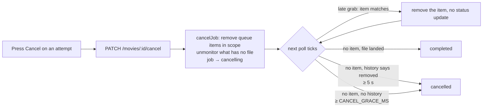
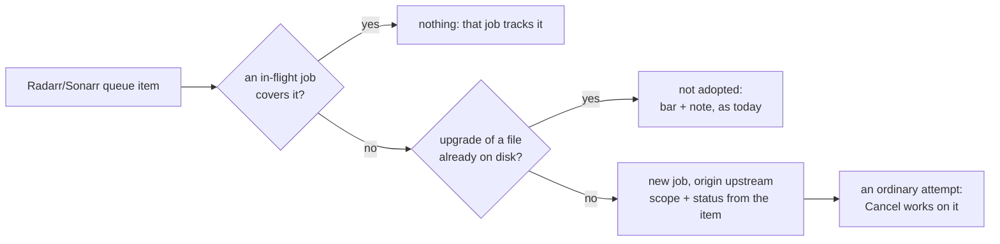
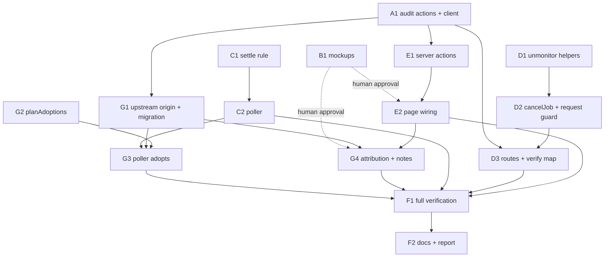

# Cancel an in-progress movie or show download — including ones Radarr/Sonarr started — `apps/download`

## Overview

> Written for a human first. Everything below this section is written for whoever
> executes the plan. If a claim here needs more, it links to where the detail lives.

The movie and show detail pages cannot stop a download. A movie requested through this
app can sit at `searching` for hours with nothing on the page to press; the only routes
that touch a movie/show job are `DELETE /download/movies/:id` and `/shows/:id`, and both
remove the **whole title from Radarr/Sonarr** — the wrong blast radius for "I don't want
this download". Video already has the thing that is missing: `PATCH
/download/videos/:id/cancel`, wired on `/videos/<id>`, moving the job through
`cancelling` to `cancelled` with Retry offered afterwards.

This plan gives movies and shows the same verb, with the same shape on all three pages.
Almost all of the frontend exists already — `AttemptList`, `ShowSeasons`, `ShowDetail`,
`MovieDetail` and `ShowEpisodeRow` all take an `onCancel` handler, and
`jobActionState('cancel')` already offers Cancel on every in-flight status and shows it
inert during `cancelling` — so the work is a backend cancel that is safe to press, and
two pages that pass a handler.

A cancel keyed on a job cannot touch a download **no job owns**, and today that is every
grab made in Radarr's or Sonarr's own UI, by their RSS sync, or by a search the app did
not send: the page draws the bar off the queue and says "Grabbed from Radarr directly —
no attempt to show, cancel or pause here." So this plan also **adopts** those downloads:
the poller, which already reads the whole queue every tick, mints a job for any queue
item no in-flight job covers. From then on it is an ordinary attempt — attributed to
Radarr/Sonarr instead of a person — and the same Cancel reaches it.

| Change                                    | In one sentence                                                                                                                                                                                                                                                              |
| ----------------------------------------- | ---------------------------------------------------------------------------------------------------------------------------------------------------------------------------------------------------------------------------------------------------------------------------- |
| **Two new routes**                        | `PATCH /download/movies/:id/cancel` and `/shows/:id/cancel`, job-keyed like the delete routes, through `mediaJobRoute`, audited as `movie.cancel` / `show.cancel`.                                                                                                           |
| **`MediaDownloadService.cancelJob`**      | Removes the queue items in the job's scope (an episode job never touches a sibling's item), unmonitors only what in the scope has **no file**, deletes no library file, and moves the job to `cancelling`.                                                                   |
| **`cancelling` is settled by the poller** | A search command still running upstream can grab a release _after_ the press. A `cancelling` job with a queue item gets the item removed instead of a status update; a `cancelling` job with none goes to `cancelled` after a grace window, or `completed` if a file landed. |
| **`request()` can't undo a cancel**       | The post-`submit()` write to `searching` is skipped when the job is no longer `requested`; a cancel that arrived while the request was still upstream re-runs the upstream cleanup now that the title has an id.                                                             |
| **Server actions and page wiring**        | `cancelMovieJob` / `cancelShowJob` (and `retryMovieJob` / `retryShowJob`) in a new `src/app/actions/media-job.ts`, passed through `MovieDetailLive` / `ShowDetailLive`. The three "no movie/show cancel route" comments go.                                                  |
| **Mockups first**                         | The three detail mockups gain the `cancelling…` state and a cancelled row with Retry before any page changes; a human approves them.                                                                                                                                         |
| **Adopt upstream grabs**                  | Each tick, a queue item no in-flight job covers becomes a job (`origin = 'upstream'`, scope from the item, status from the item), so a download started in Radarr/Sonarr has an attempt to cancel. Upgrades of a file already on disk are not adopted.                       |





**Shape:** one doc, **groups A–G, 15 tasks**, orchestrated. **No feature branch** — work
lands on `jeremy/download` in this worktree, matching plans 001–021
([why](#no-feature-branch-or-worktree)).

**This plan sits on commit `433035cc`** (session "Canceled Download Still Showing",
2026-09-23), which taught the poller to read Radarr/Sonarr **history** for a job whose
queue item vanished: `removed` → `cancelled` with "Removed from Radarr's queue", a client
failure → `failed` with the client's reason, confirmed after `QUEUE_REMOVAL_CONFIRM_MS`
(5 s). That is the fast exit this plan's `cancelling` state rides on for a grabbed job;
the grace window only bites a cancel pressed before anything was grabbed.
[Details](#how-cancelling-settles).

**Key decisions**, in brief — full reasoning in [Design decisions](#design-decisions).
⚠️ Taken from the request and the code without a live interview; each names the
alternative it beat, so flip any of them before Wave 1 if you disagree:

- **A job-keyed `PATCH …/cancel` pair through `mediaJobRoute`**, not a media-keyed route
  and not a reuse of the delete routes. A terminal job answers 404, exactly as the video
  cancel does today. [Why](#a-job-keyed-cancel-route-pair)
- **Cancel removes the queue rows in scope with `removeQueueItem`'s existing flags**
  (`removeFromClient: true`, `blocklist: false`, `skipRedownload: true`) and unmonitors
  **only what has no file** — the movie if it has none, the episodes in scope that have
  none. Season and series flags are untouched. No library file is ever deleted; the
  download client's partial files are. [Why](#what-cancel-does-upstream)
- **`cancelling` is written by the service and settled by the poller**, never written as
  `cancelled` directly, because a `MoviesSearch` / `SeriesSearch` command already running
  in Radarr/Sonarr ignores `monitored` and can grab after the press.
  [Why](#how-cancelling-settles)
- **Grace window `CANCEL_GRACE_MS = 30_000`**, measured from when the job was last seen
  without a queue item. The headline case — stuck at `searching` for minutes — settles on
  the very next tick; only a cancel within 30 s of the request waits.
  [Why](#the-grace-window)
- **`needs_attention` and `paused` cancel the same way** — the queue row is removed, as the
  import dialog's Discard already does; the dialog keeps its Discard.
  [Why](#needs_attention-paused-and-discard)
- **Retry is wired on the movie and show pages** (re-request the attempt's own scope),
  because the brief's reason for skipping a confirmation dialog is that a cancelled
  attempt can be retried. The video page keeps its Download button instead, as plan 021
  · Phase 3 decided. [Why](#retry-on-the-movie-and-show-pages)
- **No confirmation dialog. No blocklist. No tdr-bot command.**
  [Why](#open-decisions-recorded)
- **Downloads started upstream are adopted as jobs by the poller**, not given a second,
  media-keyed cancel route. One cancel path, one attempt history, and plan 022's late
  grab after the grace window stops being a gap. [Why](#adopting-downloads-started-upstream)
- **One job per download-client download** (`downloadId`): one per queue item, except a
  season pack, whose per-episode items share a `downloadId` and become one
  season-scoped job. [Why](#what-an-adopted-job-looks-like)
- **Upgrades are not adopted** — a grab for a movie or episodes that already have a file
  keeps today's bar-and-note. Radarr/Sonarr make these on their own schedule and a job per
  upgrade would fill every title's history with attempts nobody asked for.
  [Why](#what-is-not-adopted)
- **A new `'upstream'` job origin**, a jobs-only tuple, not reused `'service'` (that means
  "tdr-bot or an unauthenticated caller"). [Why](#attribution-and-origin)

> **Accepted gaps:** a whole-series or season job's cancel removes every queue item in
> its scope, including one a narrower concurrent job (someone else's S1E1) was waiting
> on; that narrower job then settles `cancelled` with "Removed from Sonarr's queue" via
> the history path. A `cancelling` job whose queue item cannot be removed stays
> `cancelling`, retrying the removal every tick. An **upgrade** Radarr/Sonarr grab on
> their own is still not cancellable here — the note beside its bar says so. A season
> pack adopted as a season-scoped job unmonitors the season's file-less episodes on
> cancel, including any the pack did not contain. A late grab after a cancel's grace
> window is adopted as a new, upstream-attributed attempt (cancellable again) rather
> than being lost.

**Read next:** [Design decisions](#design-decisions) for the why · [Task
List](#task-list) for the work itself · [Sequencing](#sequencing) for the order and the
human checkpoints · [Final report](#final-report) for what "done" reports back.

---

## How to work this plan

**Before task 1:** nothing to set up — there is no feature branch or worktree
([why](#no-feature-branch-or-worktree)). Commit this doc first (`docs(download): plan 022
cancel media downloads`) so the record exists before any code moves.

**Per task:**

1. Work tasks in wave order (see [Sequencing](#sequencing)). Never start a task before
   its dependencies are green. **E2 and G4 (the page-changing tasks) do not start until the
   mockup checkpoint has cleared** ([human checkpoints](#human-checkpoints)).
2. Implement → write or update tests → run `pnpm test`, `pnpm lint` and
   `pnpm type-check` from every touched package (`apps/download`, `packages/utils`).
   When `packages/utils` changed, also run `pnpm build` **there** (never in
   `apps/download`, see [Gotchas](#gotchas)) so `dist/` is current for the app.
3. **`/commit`** — one task, one commit (or a small coherent set). `/commit` stages at
   line level, so unrelated edits in the same file don't ride along. The session is
   already rooted in this worktree, so no `in:` argument is needed.
4. Check the box below and append the commit hash.

**Commit mutex.** All tasks land on one branch in one checkout, so **two sub-agents must
never run `/commit` at the same time** — interleaved staging captures each other's work.
Parallel tasks may implement concurrently; the orchestrator serialises the commit step
(tell the second agent to wait for the first's hash before it commits). Another live
session may also be committing on this branch — pathspec-limited commits, always.

**Markers:**

| Marker              | Means                                                          |
| ------------------- | -------------------------------------------------------------- |
| `- [ ]`             | Not started                                                    |
| `- [x]` … `abc1234` | Done, with the commit that did it                              |
| ⚠️ **PARTIAL**      | Landed with scope narrowed — say what was left and why, inline |
| ⏭️ **DROPPED**      | Not doing it — say why. Never delete a task                    |
| 🚧 / ⏳             | Blocked. Do not implement                                      |

**When reality disagrees with this plan,** add a short **Findings** note under the task,
then update the downstream tasks that finding invalidates. Do not let the doc drift from
what actually shipped.

---

## Instructions for the orchestrator agent

You are an **orchestrator**. Your job is delegation, sequencing, and status tracking —
nothing else.

**You are ONE session, and you hold the whole wave.** Sub-agents are spawned **inside**
your session and report back to you. ❌ **Never start one session per task** — sibling
sessions are peers with no reporting relationship, so there is no orchestrator, nobody
holding the wave, and nobody to catch a task that collides with its sibling or runs past
its scope.

**Do**

- Delegate every task to a sub-agent — implementation, testing, and committing
  included. One sub-agent per task.
- Write **self-contained** delegation prompts. Copy in the task's full text, the
  relevant parts of the [Shared Context Pack](#shared-context-pack), and the
  [Definition of Done](#definition-of-done). If a task depends on names an earlier task
  produced, paste that sub-agent's reported outcomes — exported names, file paths,
  signatures — into the prompt.
- Tell every sub-agent to: implement → write or update tests → run the package's tests
  plus lint and type-check → run `/commit`. Each reports back **files changed, exported
  names, test results, commit hash(es)**.
- Respect the sequencing graph. Launch parallel-safe tasks concurrently; never start a
  task before its dependencies report success. **Serialise the commit step** across
  parallel tasks (see the commit mutex above).
- Re-delegate a failed task with the failure details attached.
- **Stop at every [human checkpoint](#human-checkpoints)** and report what the human
  has to do. The mockup approval after B1 is a hard gate: neither E2 nor G4 starts
  until the human has said the mockups are approved.

**Don't**

- ❌ Read or edit any code yourself — no source, no tests, no configs. The only file you
  may edit is _this plan_, to check off tasks and record outcomes.
- ❌ Let sub-agents read this plan. Their prompts must carry everything they need.
- ❌ Fix a failing task yourself.
- ❌ Let a sub-agent continue past its task into the next one, even when that task is
  unblocked and the sub-agent is already warm. If work lands that you did not brief,
  record it as unplanned rather than absorbing it silently.
- ❌ Restart, rebuild or `docker compose up` the `lilnas-download-dev` container. It is
  shared; restarting it is a [human checkpoint](#human-checkpoints).
- ❌ Send any mutating request to Radarr, Sonarr, Emby or MinIO. Read-only `GET`s from
  inside the dev container are fine.

**Finish by** verifying every checkbox is checked, then reporting the
[final status summary](#final-report).

---

## Design decisions

### A job-keyed cancel route pair

`PATCH /download/movies/:id/cancel` and `PATCH /download/shows/:id/cancel`, `:id` a job
id, both through the existing `mediaJobRoute` helper
(`download.controller.ts:184-229`) with `audit: { action: 'movie.cancel' }` /
`'show.cancel'`, exactly the shape `deleteMovieJob` (`:1781`) and `deleteShowJob`
(`:1908`) have.

- **Why job-keyed.** The frontend's `JobAction` is `(jobId: string) => …`
  (`job-actions.tsx:32`), `AttemptList` calls the handler with `job.id`, and
  `ShowEpisodeRow` cancels _this episode's_ attempt by its id. A media-keyed route would
  have to re-derive which of several concurrent show attempts was meant.
- **Why `mediaJobRoute`, even though it maps every error to 404.** The video cancel
  (`:1521-1605`) does the same by hand — it "404s once the job is Completed", and the
  verify scripts already treat that as the contract. Parity across the three pages is
  the brief; `runLifecycleAction` on the frontend swallows the error either way. A 409
  for "already finished" would be more honest and is a one-line switch to a
  `videoInterruptRoute`-style helper later; not now.
- **Service semantics.** A terminal job throws (→ 404). A job already `cancelling`
  returns as-is with no second upstream call (idempotent). Anything else runs the
  cleanup and moves to `cancelling`.
- **No Discord attribution on these routes.** `mediaJobRoute` takes none, the delete
  routes have none, and tdr-bot has no movie/show cancel. `video.cancel` carries a
  `discordActor` for its audit row only; matching that is a separate change if a Discord
  cancel ever exists.

**Ruled out:** reusing `DELETE /movies/:id` (removes the title, plan 020 already said
no); a media-keyed `DELETE /media/:id/queue?scope` (the import dialog's Discard is
already that, for the one case that needs it — see
[below](#needs_attention-paused-and-discard)).

### What cancel does upstream

`MediaDownloadService.cancelJob(id, type)`:

1. **Resolve the job** with the existing `getJob(id, type)` (`media-download.service.ts:418`)
   and read the upstream id off `job.media` (`radarrId` / `sonarrId`), exactly as
   `deleteJob` (`:440`) does. A title with no upstream id yet (a `requested` job whose
   `ensureMovie` has not returned) skips the upstream half — the
   [`request()` guard](#the-request-race) picks it up.
2. **Remove the queue items in scope.** Read the queue fresh —
   `radarrService.getQueue([radarrId])` / `sonarrService.getQueue([sonarrId])` — never
   the `MediaStateService` cache, which is up to a tick old. For a show, keep only items
   where `matchesScope(item, job.scope)` (`queue-status.util.ts:431`) holds: an
   episode-scoped job matches only its own `episodeId`, so a sibling episode's item is
   never touched. Remove each with `removeQueueItem(item.id)` under
   `Promise.allSettled`, logging per-item failures, in the shape
   `ManualImportService.discard` (`manual-import.service.ts:329-395`) already uses.
   The flags are the ones `removeQueueItem` already carries (`radarr.service.ts:715`,
   `sonarr.service.ts:1249`): `removeFromClient: true` (the client drops its partial
   download), `blocklist: false` (the release was not the problem),
   `skipRedownload: true` (Radarr/Sonarr must not immediately search for a replacement
   nobody asked for).
3. **Unmonitor only what has no file**, so the grab does not come back through RSS and
   a cancelled _replacement_ leaves the existing file alone:
   - Movie: a new `RadarrService.unmonitorIfMissing(radarrId)` — GET the movie, PUT
     `monitored: false` only when `hasFile` is false. Fresh from Radarr, not the
     resolver's 60 s cache, so a cancel that lands as the import finishes does not
     unmonitor a movie that now has a file.
   - Show: `SonarrService.unmonitorScope(sonarrId, scope, { withoutFileOnly: true })`
     — the existing method (`sonarr.service.ts:1052`) already reads the episodes fresh;
     the option additionally skips episodes with `hasFile === true`. An empty scope is
     the whole series, as today.
   - **Season and series `monitored` flags are left alone.** RSS grabs are driven by
     episode flags; the season/series flags only decide whether _future_ episodes get
     monitored when they air, which is not what a cancel is about. (`delete-cascade`
     turns season flags off because a delete is about the season; a cancel is about
     one attempt.)
4. **Never delete a library file.** No `deleteMovieFile` / `deleteEpisodeFile`, no
   `unmonitorAndDelete`. "Files" here means the library's; the download client's
   partial files go with the queue row, as they do for Discard.
5. **Move the job to `cancelling`** with `updateJob(id, { status: Cancelling })`, which
   broadcasts the job event the page re-renders on. Invalidate the resolver
   (`mediaResolverService.invalidate(job.media.id)`) first, so the media the broadcast's
   hydrate reads reflects the unmonitor (`wanted` → `absent`).
6. **Order: upstream first, status last** — the same order `deleteJob` uses. If the
   upstream calls throw, the job is left as it was and the route answers 404; the user
   can press again. If some queue removals fail but others succeed, continue: the
   poller's `cancelling`-with-item path retries the rest every tick.

**Ruled out:** unmonitoring unconditionally (breaks the replacement case and stops
upgrades on a movie that has a file); not unmonitoring at all (Radarr/Sonarr's RSS sync
would re-grab a monitored, file-less title within the hour, and the attempt would come
back with no job to show it); cancelling the search command upstream
(`DELETE /api/v3/command/{id}` — the app does not keep the command id, the generated
`CommandResource.body` does not expose `movieIds`, and a started command may not be
cancellable anyway).

### How `cancelling` settles

Why not write `cancelled` straight away: a `MoviesSearch` / `SeriesSearch` command sent
through the API runs with `UserInvokedSearch`, which makes Radarr/Sonarr's monitored
check pass regardless of the flag — so a search still running at the moment of the press
can grab a release seconds later, after the unmonitor. The job has to stay tracked long
enough to catch that.

`cancelling` is non-terminal, so the poller's `trackedJobs` (`media-poller.service.ts:776`)
keeps polling it. Two changes make the state behave:

**With a queue item** (a late grab, or a removal that failed in `cancelJob`):
`pollMovies` (`:257`) / `pollShows` (`:296`) currently `applyUpdate` any tracked job
that has an item, which would move a `cancelling` job to `downloading` via
`deriveStatusFromQueueItem`. Instead, for a `cancelling` job: `rememberDownloads`, then
remove every matching item (`removeQueueItem`, best-effort, logged), and **skip
`applyUpdate`**. Leave `absentSince` alone so the grace keeps counting from the original
absence rather than restarting. The item is gone by the next tick and the job falls into
the no-item path below.

**Without a queue item**, `settleWithoutQueueItem` (`queue-status.util.ts:392`) gains a
`cancelling` branch. Today `cancelling` is neither in `GRABBED_STATUSES` (`:352`) nor
`WAITING_STATUSES` (`:360`), so the function returns `undefined` and a `cancelling`
movie/show job would sit there forever:

| `cancelling`, no queue item                                                | Result                                                       |
| -------------------------------------------------------------------------- | ------------------------------------------------------------ |
| a file for the scope landed after the job was created (`fileLanded`)       | `completed` — the cancel came late                           |
| `outcome` is `removed` or `failed` and absent ≥ `QUEUE_REMOVAL_CONFIRM_MS` | `cancelled`                                                  |
| `outcome` is `imported` (a file is on its way)                             | unchanged until it lands, or `CANCEL_GRACE_MS` → `cancelled` |
| no `outcome` (never grabbed, or restarted) and absent ≥ `CANCEL_GRACE_MS`  | `cancelled`                                                  |
| otherwise                                                                  | unchanged                                                    |

- **`outcome` is commit `433035cc`'s `DequeuedOutcome`** (`:314`), read from the
  title's history for the download ids the poller remembered. A grabbed job whose row
  `cancelJob` just removed writes no history, reads as `removed`, and settles
  `cancelled` on the second tick without the row — the same 10–20 s the other session
  measured for a removal in Radarr's own UI. This is the fast path for the common
  "downloading → Cancel" press.
- **A `cancelling` → `cancelled` move carries no `error`.** `settledError`
  (`media-poller.service.ts:1039`) currently returns "Removed from Radarr's queue" for
  every `cancelled`; it must return `undefined` when the previous status was
  `cancelling`. That sentence is for a removal _someone else_ made; this one was the
  user's own press, and the audit log already says who.
- **`completed` still wins**, exactly as for every other status: the file is there.
- **A restart** re-adopts a `cancelling` row (`adoptOpenJobs` takes every non-terminal
  movie/show row) and the poller settles it on its first ticks with no history
  (`downloadIds` is in-memory) — `cancelled` after the grace window, or `completed`.

### The grace window

**`CANCEL_GRACE_MS = 30_000`**, a new constant beside `QUEUE_ABSENCE_GRACE_MS` in
`queue-status.util.ts`.

- **Measured from `absentSince`** (`media-poller.service.ts:178`), which
  `settleAbsentJobs` (`:354`) sets the first tick a tracked job has no queue item. A
  job stuck at `searching` for minutes has been absent since its first tick, so a
  cancel on it settles **on the next poll** (≤ 10 s). Only a cancel pressed within 30 s
  of the request waits out the remainder.
- **Why 30 s and not 60 s.** The window exists only for the late grab, which needs a
  search command still running at the press; indexer requests time out at ~30 s, so
  a search that has not grabbed within 30 s of dispatch is very unlikely to. Reusing
  `QUEUE_ABSENCE_GRACE_MS` (60 s) would double the wait for no measured gain.
- **Why not shorter.** Below ~20 s the window is two ticks, which is the same as the
  removal-confirm path — it would stop being a grace window at all.
- **Tunable.** A single constant; the executor records the value in `backend.md`.

**Ruled out:** settling `cancelled` immediately and relying on adoption (Group G) to
pick up a late grab (it would be cancellable, but as a new attempt attributed to
Radarr, seconds after the user's own cancel — confusing, and it re-downloads until
pressed again); keeping a
terminal `cancelled` job "watched" for late grabs (a second tracking map for a rare
case).

### `needs_attention`, `paused` and Discard

`jobActionState(status, 'cancel')` (`job-state.ts:62`) offers Cancel on every in-flight
status, `needs_attention` and `paused` included, and the brief keeps the three pages
identical. So:

- **`needs_attention`** — the download is on disk in the client, waiting for a human.
  Cancel removes the queue row with `removeQueueItem` (client files deleted, not
  blocklisted), which is exactly what the import dialog's Discard
  (`ManualImportService.discard`) does, plus the unmonitor. The dialog keeps its
  Discard; plan 020's "Cancel is Discard" decision was about the _absence_ of a
  movie/show cancel route, and this plan supplies one. Two paths, one upstream effect;
  `discard` moves the job straight to `cancelled` (media-keyed, and it removed the row
  itself so there is nothing to wait for), `cancelJob` goes through `cancelling` like
  every other status.
- **`paused`** — a movie/show job reads `paused` only because the _download client_
  paused the item; this app has no resume for it. Cancel removes the row the same way.
  No special case.
- **Nothing in `ManualImportService.moveJobs` changes**: it only moves
  `needs_attention` jobs, and a `cancelling` job is not one.

### The `request()` race

`request()` (`media-download.service.ts:330`) mints the job as `requested`, awaits
`submit()` — `ensureMovie` + `triggerSearch`, seconds of upstream calls — and then
**unconditionally** writes `status: Searching` (`:398`). A cancel pressed during that
window is overwritten.

The guard, after `submit()` resolves or rejects: re-read the record from
`downloadStateService.jobs`. If its status is still `requested`, write as today. If it
is `cancelling`, do **not** write `searching`/`failed`; instead run the upstream half of
`cancelJob` again — the title now has an upstream id, and the search that `submit()`
just dispatched may grab. The `scope` returned by `submit()` is still written (a
separate `updateJob` without a status), so the resolved scope is recorded for the
cleanup to use. Any other status (the poller moved it) is left alone.

A cancel on a `requested` job, from the service side, is therefore: no upstream id → no
upstream calls, just `cancelling`; the guard finishes the job.

### Retry on the movie and show pages

The brief's reason for no confirmation dialog is "a cancelled attempt can be retried" —
but today **nothing** on the movie or show page offers Retry: `AttemptList` draws it only
when the page passes `onRetry` and `retryable` (`attempt-list.tsx:156-166`), and both
pages pass neither (`movie-detail.tsx:336-342`, `show-detail.tsx:173-176`). The only way
back is the header's Download button (or a season's / episode's own Download on the show
page), which does exist once the media reads `absent`.

Decision: **wire `onRetry`** with two new server actions, `retryMovieJob` /
`retryShowJob`, that re-request the attempt's own scope — `getMovieJob(id)` →
`requestMovie({ tmdbId })`; `getShowJob(id)` → `requestShow({ tvdbId, ...job.scope })` —
a fresh job row, as `retryVideoJob` (`video-job.ts:176-190`) does. For a show this is
the only control that re-requests exactly what the attempt asked for (a cancelled S3E6
attempt retries S3E6, not the series). `retryable` is already computed on both pages
from the media state.

- **Video keeps its Download button and no Retry row** — plan 021 · Phase 3 removed
  it deliberately ("one verb, one button"). The three pages then differ in _where_ the
  re-request lives, not in whether one exists; the mockup task draws each page as the
  app will behave.
- Dropping this decision is one prop per page and one bullet in the mockup task.

### Adopting downloads started upstream

The poller already reads **every** queue item every tick (`pollMovies` :257 /
`pollShows` :296 read `getQueue()` unfiltered and hand it to `MediaStateService`), and
`broadcastSourceChanges` already follows an un-owned download to every open page. What
it does not do is give that download a job — so the page has a bar and nothing to press.
Adoption closes that in the poller, after each source's tracked-job loop:

1. **Candidates** — queue items whose derived status (`deriveStatusFromQueueItem`) is
   **not terminal** (a `failed` item lingering in the queue must not mint a job that
   settles `failed`, leaves the item un-owned again, and loops one job per tick), grouped
   by `downloadId` per upstream title (an item with no `downloadId` is its own group,
   keyed by queue `id`).
2. **Ownership** — a group is owned, and skipped, when **any non-terminal job** of the
   same type and media covers it: for a movie, any such job; for a show, one whose scope
   `matchesScope` every item in the group. Read the jobs straight from
   `downloadStateService.jobs`, **not** `trackedJobs()`, which drops a job whose title
   did not resolve — that job's item would otherwise look un-owned and be adopted twice.
   A group whose `downloadId` is in the `downloadIds` of any job still in that map is
   owned too.
3. **Media id** — `mediaIdsFor(type, upstreamIds)` (`:703`), the existing batched
   upstream-id → `tmdb:`/`tvdb:` lookup with its one early library re-read (commit
   `c321f898`). A title it cannot map yet is skipped this tick and retried next.
4. **The upgrade check** — see [below](#what-is-not-adopted).
5. **Re-check, then write, with no `await` in between.** `@Cron('*/1 * * * * *')` does
   not stop a slow tick overlapping the next, and `updateJob`/`addJob` have no
   compare-and-set; the ownership check must be repeated synchronously against
   `downloadStateService.jobs` immediately before `addJob`, so the second of two
   overlapping ticks sees the first's job. Then `rememberDownloads(id, items)`.

A **restart** needs nothing new: `adoptOpenJobs` (`download-state.service.ts:263`) reloads
every non-terminal movie/show row at boot, including adopted ones, and those cover their
items on the first tick. No `download_id` column is needed for dedupe.

### What an adopted job looks like

| Field               | Value                                                                                                                                                                                                                                                   |
| ------------------- | ------------------------------------------------------------------------------------------------------------------------------------------------------------------------------------------------------------------------------------------------------- |
| `status`            | `deriveStatusFromQueueItem` of the (aggregated, for a show) item — `downloading`, `queued`, `needs_attention`, … — never `requested`/`searching`, since it is already grabbed                                                                           |
| `scope` (show only) | one episode → `{ episodeId, seasonNumber, episodeNumber }` (`episodeNumber` from the episodes read in the upgrade check); several episodes of one season → `{ seasonNumber }`; episodes spanning seasons → none (whole series). Always none for a movie |
| attribution         | `requester: null`, `discordRequester: null`, `startedUpstream: true` → row `origin = 'upstream'`                                                                                                                                                        |
| `createdAt`         | now. `didJobComplete` asks "a file for the scope landed after the job was created", and the import is always after adoption                                                                                                                             |
| `hiddenAttribution` | `false`                                                                                                                                                                                                                                                 |

From the next tick it is a tracked job like any other: the grabbed branch of
`settleWithoutQueueItem` settles it, the history path reads its `downloadIds`, the import
dialog's `moveJobs` sees it if it goes `needs_attention`, and `cancelJob` cancels it. No
audit row is written for adoption (the audit log records people's actions); a `log`
line with the job id, media id, scope and `downloadId` is.

### What is not adopted

- **Upgrades.** A movie whose resolved media already has a file (`movieHasFile`,
  `movie-detail.tsx:244`), or a show group where **every** episode it covers already has
  `hasFile` (read with `sonarrService.getEpisodes(sonarrId)` — only for a series with an
  un-owned candidate, so it costs nothing in the steady state). These are Radarr/Sonarr's
  own cutoff-unmet grabs; a job per upgrade would put an attempt nobody asked for on
  every title Radarr touches. They keep today's bar and note, reworded to say it is an
  upgrade (see G4).
- **Terminal items** (step 1 above).
- **A title the library read cannot map** — skipped per tick, not recorded.

Flipping the upgrade rule later is one predicate in `planAdoptions`.

### Attribution and origin

`origin` is a write-only column derived in `buildJobRow` (`job-row.ts`) from which
attribution the record carries; nothing on `DownloadJobRecord` says "Radarr started
this". So:

- **Record/wire:** `DownloadJobSchema` (`packages/utils/src/download/schema.ts:369`) gains
  `startedUpstream: z.boolean().optional()` — optional so every existing fixture,
  tdr-bot's parse and every stored row stay valid; `true` only on an adopted job.
- **Row:** a jobs-only tuple `JOB_ROW_ORIGINS = [...JOB_ORIGINS, 'upstream']` in
  `apps/download/src/db/schema.ts`, used by `jobs.origin`. `JOB_ORIGINS` itself (shared
  with `audit_log.origin` and mirrored by `AuditLogEntrySchema.origin`) is unchanged — an
  audit actor is never "Radarr". `jobs_origin_matches_requester` gains an `'upstream'`
  arm with the same all-null shape as `'service'`.
- **Derivation:** `buildJobRow` → `'upstream'` when `startedUpstream` (checked after
  `requester` and `discordRequester`); `hydrateJobRow` → `startedUpstream: true` when
  `row.origin === 'upstream'`, omitted otherwise.
- **Migration:** a CHECK change on SQLite is a table rebuild. `pnpm db:generate` from
  `apps/download`; confirm drizzle-kit emitted the `__new_jobs` rebuild (precedent:
  `0002_even_newton_destine.sql`) with every index recreated; hand-edit only if it did
  not, and say so in a header comment as 0004 does.
- **UI:** `DetailAttribution` (`detail-header.tsx:196-270`) and `ActivityRequester`
  (`activity-requester.tsx:148-190`) read a null requester with no Discord pair as
  **masked** (`hidden`). An adopted job must read `Radarr` / `Sonarr` instead — a new
  branch checked before the masked one, no avatar link, no profile href.
- **Profiles** (`load-profile-history.ts`, `profile-data.ts`) key on a requester, so
  adopted jobs appear on nobody's profile; the admin view's "every user" lists them.
  That is correct and needs no change.

**Ruled out:** a media-keyed `DELETE …/queue` cancel for un-owned items (a second
cancel path with no attempt history, and the page still could not show what happened);
persisting a `download_id` column for dedupe (restart re-adoption already covers it);
reusing `origin = 'service'` (reads as tdr-bot in the admin view).

### Open decisions, recorded

| Decision               | Recommendation   | Why                                                                                                                                                                                                                                                                                                                                                                                     |
| ---------------------- | ---------------- | --------------------------------------------------------------------------------------------------------------------------------------------------------------------------------------------------------------------------------------------------------------------------------------------------------------------------------------------------------------------------------------- |
| Confirmation dialog    | **None**         | A cancelled attempt is retried from the row (above) or the header. The video cancel has none. Delete keeps its dialog because it removes files.                                                                                                                                                                                                                                         |
| Cancel and blocklist   | **Not now**      | `blocklist: false`, as Discard. The bad-file flag (`POST /media/:id/bad-files`) is the way to say "never this release again"; a cancel says "not now".                                                                                                                                                                                                                                  |
| Grace window           | **30 s**         | [Above](#the-grace-window).                                                                                                                                                                                                                                                                                                                                                             |
| tdr-bot cancel command | **Out of scope** | tdr-bot has no movie/show cancel today and only calls `cancelJob` (video) best-effort on a wait timeout. The `DownloadClient` methods this plan adds are enough for a later command; nothing here blocks or needs it.                                                                                                                                                                   |
| Overlapping show jobs  | **Simple rule**  | A job's cancel removes every item `matchesScope` says is in its scope. A narrower concurrent job whose item that removes settles `cancelled` ("Removed from Sonarr's queue") through the history path. Excluding items another in-flight job claims more narrowly is possible (`jobScopeCovers` exists) but concurrent overlapping requests on one series are rare; record it as a gap. |
| Adopt upgrades         | **No**           | [What is not adopted](#what-is-not-adopted). One predicate to flip if the note beside an upgrade's bar turns out to be the wrong answer.                                                                                                                                                                                                                                                |
| Adopted job grouping   | **Per download** | One job per `downloadId`, so a season pack is one season-scoped attempt rather than twenty episode attempts that cancel each other. [What an adopted job looks like](#what-an-adopted-job-looks-like).                                                                                                                                                                                  |
| Notify on adoption     | **No**           | The app sends no notifications for any job today; adoption writes a log line and no audit row.                                                                                                                                                                                                                                                                                          |

### Things that already exist — don't rebuild them

- **The whole frontend cancel surface**: `JobAction` (`job-actions.tsx:32`),
  `ACTION_SPECS`'s Cancel button (`:61-74`), `jobActionState` (`job-state.ts:62`, Cancel
  `offered` on every in-flight status, `acknowledged` on `cancelling`),
  `jobStatusLabel(Cancelling) = 'cancelling…'`, `STATUS_TONES[Cancelling] = 'warn'`
  (`lib/format.ts:226`), `AttemptCard`'s inert-while-acknowledged rendering
  (`attempt-list.tsx:229-347`), `ShowEpisodeRow`'s Cancel (`show-episode-row.tsx:296-311`),
  the `onCancel`/`onRetry` threading through `ShowDetail` → `ShowSeasons` → rows, and the
  live wrappers that spread every `on*` prop through untouched.
- **`removeQueueItem`** on both services with the right flags; **`setMonitored`**
  (`radarr.service.ts:415`); **`unmonitorScope`** (`sonarr.service.ts:1052`);
  **`getQueue(ids)`**; **`matchesScope`** and **`aggregateQueueItems`**.
- **`mediaJobRoute`** and the `deleteMovieJob`/`deleteShowJob` handler shape, plus their
  audit tests (`download.controller.media.test.ts:1108-1127`).
- **`runLifecycleAction`** in `video-job.ts:94-115` — the server-action shape to copy.
- **Commit `433035cc`**: `downloadIds`, `rememberDownloads`, `dequeuedOutcomes`,
  `DequeuedOutcome`, `QUEUE_REMOVAL_CONFIRM_MS`, `settledError`. This plan extends
  them; it does not replace them.
- **`AttemptList`'s Retry row** and `retryable` on both pages.

### What stays untouched

- `DELETE /download/movies/:id` and `/shows/:id` and `deleteJob`.
- `ManualImportService` (`discard`, `moveJobs`) and the import dialog.
- `ShowService.deleteFiles` / `cancelInFlightJobs` / `delete-cascade.util.ts`.
- The video cancel route, `DownloadService.cancelVideoDownloadJob`, the scheduler's
  interrupt path, and `reconcileInterruptedJobs`.
- `MediaStateService` and `media-state.util.ts` — media state stays derived from the
  queue and the library; a `cancelling` job has no say in it (the chip reads `absent`
  once the row is gone and the title unmonitored, which is the truth).
- `DownloadJobStatus` — no new member; `Cancelling`/`Cancelled` exist.
- `TERMINAL_DOWNLOAD_JOB_STATUSES`.

### No feature branch or worktree

Work lands directly on `jeremy/download` in this worktree, matching plans 001–021.
`lilnas-download-dev` — the container the human checkpoints verify against — is bound to
**this** checkout; work in a separate worktree could not be exercised live without a
merge first. The cost is the commit mutex above.

---

## Shared Context Pack

> Copy the relevant parts into every sub-agent prompt. These are pointers — **verify
> against current code**, a plan ages and the code is the truth.

### Repo & conventions

- pnpm workspaces + Turbo. The app is `@lilnas/download` at `apps/download`; the shared
  wire types are `@lilnas/utils` at `packages/utils` (`src/download/schema.ts` for zod,
  `src/download/types.ts` for inferred types, `src/download/client.ts` for
  `DownloadClient`). The generated Radarr/Sonarr SDKs are `@lilnas/media/radarr` and
  `@lilnas/media/sonarr` (`client-fetch` builds).
- **From `apps/download`:** `pnpm test` · `pnpm lint` (eslint **and** prettier — two
  checks; `pnpm lint:fix` fixes both) · `pnpm type-check`. One file:
  `pnpm test -- src/media/__tests__/queue-status.util.test.ts`; add
  `--selectProjects node` or `jsdom` to run one project.
- **From `packages/utils`:** the same three, plus `pnpm build` so `dist/` is current for
  the app's type-check (`apps/download` type-checks against `packages/utils/dist`;
  Jest reads `src` via `moduleNameMapper`).
- ⚠️ **Never run `pnpm build` in `apps/download`** — it clobbers the `.next` the running
  dev container holds. Do not run the root `pnpm run build` either, for the same reason.
  `pnpm mockups` from the repo root is fine (it builds only `docs/features/*/designs`).
- Tests live in `__tests__/` next to the code. Jest, **two projects**
  (`apps/download/jest.config.js`): `node` (`*.ts`) and `jsdom` (`*.tsx`,
  `@testing-library/react` + `user-event`, setup at `src/__tests__/setup-dom.ts`).
  Anything importing `DownloadStateService` or the controller needs
  `jest.mock('nanoid', () => ({ nanoid: jest.fn(() => 'mock-id') }))` **before** the
  imports (see `media-poller.service.test.ts:1-8`). **Do not inject a new provider**
  into `DownloadController`, `MediaDownloadService` or `MediaPollerService` — every
  testing module that builds them would break; everything this plan needs is already
  injected.
- Commit style (from `git log`): `feat(download): …`, `fix(download): …`,
  `docs(download): …`, `feat(utils): …`; imperative, lower-case, no period, body
  explains the why. End the message with
  `Co-Authored-By: Claude Fable 5.1 <noreply@anthropic.com>`.
- Prose in code comments uses `-` in the backend files and `—` in the frontend files.
  Match the file you are in. `cns()` from `@lilnas/utils/cns` for every class list. No
  `any`.
- `'use server'` modules (`src/app/actions/*.ts`) may export **only async functions**
  (plus `export type`); helpers stay module-private, so `runLifecycleAction` is copied
  into the new module, not imported from `video-job.ts`.
- Mockups: `docs/features/download/designs/src/pages/*.pug` + `src/data/*.mjs`, mixins
  in `src/mixins/ui.pug` and `mock.pug`; build with `pnpm mockups` **from the repo
  root**; the generated `designs/*.html` are committed alongside and never hand-edited.
  Root `pnpm lint` runs prettier over `designs/src/**/*.{mjs,js,css,html}` (not `.pug`).

### Layout

| File                                                                  | What it is                                                                                                                                                                                                                                                                                                                                                                                                       |
| --------------------------------------------------------------------- | ---------------------------------------------------------------------------------------------------------------------------------------------------------------------------------------------------------------------------------------------------------------------------------------------------------------------------------------------------------------------------------------------------------------- |
| `packages/utils/src/download/schema.ts`                               | `DownloadJobStatus` enum (:9, has `Cancelling`/`Cancelled`), `RequestShowInputSchema` (:169, `{ tvdbId, seasonNumber?, episodeId? }`), `AUDIT_ACTIONS` (:812-831, append-only, 18 members, last two `media.manual_import`, `media.discard_download`), `z.enum(AUDIT_ACTIONS)` (:858, :880)                                                                                                                       |
| `packages/utils/src/download/types.ts`                                | `TERMINAL_DOWNLOAD_JOB_STATUSES` (:73), `isTerminalDownloadJobStatus`, `isInProgressDownloadJobStatus` (:91), `DownloadJobRecord` (:269), `RequestShowInput` (:369)                                                                                                                                                                                                                                              |
| `packages/utils/src/download/client.ts`                               | `DownloadClient` (:142); `request()` (:234); `cancelJob` (:273, video only, `PATCH /download/videos/${id}/cancel`); `requestMovie` (:889), `getMovieJob` (:898), `deleteMovieJob` (:903); `requestShow` (:919), `getShowJob` (:928), `deleteShowJob` (:933)                                                                                                                                                      |
| `packages/utils/src/download/__tests__/client.spec.ts`                | `cancelJob` case (:395-406), `deleteMovieJob` (:1056-1065), `deleteShowJob` (:1104-1113) — the shapes to copy                                                                                                                                                                                                                                                                                                    |
| `packages/utils/src/download/__tests__/schema.spec.ts`                | `it.each([...AUDIT_ACTIONS])` (:1283); the manual-import additions test pins `AUDIT_ACTIONS.slice(0, 16)` (:1692)                                                                                                                                                                                                                                                                                                |
| `apps/download/src/db/schema.ts`                                      | `AUDIT_ACTIONS_LOCAL` (:371-390, a copy kept zod-free for drizzle-kit) and the `auditActionPin: AssertSameUnion<…>` (:394-397) that fails type-check when the two lists drift. No SQL CHECK on `audit_log.action` — no migration                                                                                                                                                                                 |
| `apps/download/src/lib/admin-audit.ts`                                | `AUDIT_ACTION_LEVELS` (:31, e.g. `'video.cancel': { label: 'CANCEL', tone: 'warn' }`) and `AUDIT_ACTION_PHRASES` (:61, `'video.cancel': 'cancelled a video download'`) — both total `Record<AuditAction, …>`; `__tests__/admin-audit.spec.ts:35` loops every action                                                                                                                                              |
| `apps/download/src/media/queue-status.util.ts`                        | `PollableQueueItem` (:14), `aggregateQueueItems` (:144), `deriveStatusFromQueueItem` (:227), `QUEUE_ABSENCE_GRACE_MS` (:282), `QUEUE_REMOVAL_CONFIRM_MS` (:290), `REMOVED_FROM_QUEUE_ERROR` (:297), `DequeuedOutcome` (:314), `dequeuedOutcome` (:326), `GRABBED_STATUSES` (:352), `WAITING_STATUSES` (:360), `settleWithoutQueueItem(current, fileLanded, absentForMs, outcome?)` (:392), `matchesScope` (:431) |
| `apps/download/src/media/__tests__/queue-status.util.test.ts`         | `describe('settleWithoutQueueItem')` (:212) and `'… with a dequeued outcome'` (:313) — table-driven `it.each`, the shape to extend                                                                                                                                                                                                                                                                               |
| `apps/download/src/media/media-poller.service.ts`                     | `TERMINAL_STATUSES` (:51), `absentSince` (:178), `downloadIds` (:195), `poll()` (:207), `pollMovies` (:257), `pollShows` (:296), `rememberDownloads` (:327), `settleAbsentJobs` (:354), `touchDequeuedJobs` (:449), `forgetUntrackedJobs` (:466), `trackedJobs` (:776), `dequeuedOutcomes` (:870), `applyUpdate` (:931), `writeStatus` (:997), `settledError` (:1039)                                            |
| `apps/download/src/media/__tests__/media-poller.service.test.ts`      | `buildMovieJob` (:113), `buildShowJob` (:119), the `at(T0)` fake clock, the mocked `radarrService`/`sonarrService` objects (:171-183 — **add `removeQueueItem: jest.fn()`** to both), the `'reading what became of a download that left the queue'` block (the `queuedThenGone` helper is the shape for a cancel-then-settle test)                                                                               |
| `apps/download/src/media/media-download.service.ts`                   | `requestMovie` (:100), `requestShow` (:154), `deleteMovieJob`/`deleteShowJob` (:305/:311), `request()` (:330; `await submit()` :390; the unconditional `Searching` write :398), `getJob` (:418), `deleteJob` (:440 — upstream-id read off `job.media`, invalidate, then the status write)                                                                                                                        |
| `apps/download/src/media/__tests__/media-download.service.test.ts`    | `describe('deleteMovieJob')` (:666), `deleteShowJob` (:862), `requestMovie` (:164) — mocks and fixtures to reuse; `media-download.first-request.test.ts` for the request path                                                                                                                                                                                                                                    |
| `apps/download/src/media/radarr.service.ts`                           | `setMonitored` (:415, GET then PUT `{ ...movie, monitored }`), `triggerSearch` (:564), `getQueue(movieIds?)` (:603), `removeQueueItem` (:715, flags), `unmonitorAndDelete` (:736 — **do not call**)                                                                                                                                                                                                              |
| `apps/download/src/media/sonarr.service.ts`                           | `setSeasonsMonitored` (:704), `getEpisodes(sonarrId, { seasonNumber? })` (:764), `setEpisodesMonitored` (:788, no-op on empty), `triggerSearch`/`triggerEpisodeSearch`/`triggerSeasonSearch` (:953/:970/:986), `unmonitorScope` (:1052), `getQueue(seriesIds?)` (:1103), `removeQueueItem` (:1249)                                                                                                               |
| `apps/download/src/media/__tests__/{radarr,sonarr}.service.test.ts`   | `describe('setMonitored')` (radarr :616); `'setSeriesMonitored / setEpisodesMonitored'` (sonarr :697) — the SDK-mock shapes to copy                                                                                                                                                                                                                                                                              |
| `apps/download/src/media/manual-import.service.ts`                    | `discard` (:329-395) — the `Promise.allSettled` removal loop to imitate; `jobScopeCovers` (:122); `moveJobs` (:594)                                                                                                                                                                                                                                                                                              |
| `apps/download/src/download/download-state.service.ts`                | `jobs` Map (:61), `touchJob` (:124), `addJob` (:196), `resolveJobRecord` (:220), `adoptJob` (:241), `adoptOpenJobs` (:268), `updateJob` (:350 — unconditional merge, throws for an id not in the Map, broadcasts `Updated`), `hydrateOne`                                                                                                                                                                        |
| `apps/download/src/download/download.controller.ts`                   | `RouteAuditEvent` (:146), `mediaJobRoute` (:184-229), `cancelVideoJob` (:1521), `getMovieJob`/`deleteMovieJob` (:1767/:1781), `getShowJob`/`deleteShowJob` (:1894/:1908)                                                                                                                                                                                                                                         |
| `apps/download/src/media/__tests__/download.controller.media.test.ts` | `mockMediaDownloadService` (:1-146 — **add `cancelMovieJob`/`cancelShowJob`**), `deleteMovieJob` tests (:264), show (:292), audit `it.each` (:1108-1127)                                                                                                                                                                                                                                                         |
| `apps/download/scripts/verify/mutate.ts`                              | `ALWAYS_REACHABLE` (:301-310, has `Cancelled`/`Cancelling`), `MEDIA_TRANSITIONS` (:357, `[Cancelling, []]` at :444), `legalSuccessors` (:449)                                                                                                                                                                                                                                                                    |
| `apps/download/src/app/actions/video-job.ts`                          | `'use server'`; `isFrameworkSignal` (:57), `revalidateJobDetail` (:75, uses `mediaHref`, type-generic), `runLifecycleAction` (:94-115), `cancelVideoJob` (:126), `retryVideoJob` (:176-190)                                                                                                                                                                                                                      |
| `apps/download/src/app/actions/__tests__/video-job.spec.ts`           | `stubClient()` (:55-73), the `it.each` over actions (:83-98), revalidation (:112-118), swallow (:126-133), re-throw (:140-148); mocks `src/lib/download-client` and `next/cache`                                                                                                                                                                                                                                 |
| `apps/download/src/app/movies/[tmdbId]/page.tsx`                      | inline `requestMovie` server action (:99-128, `client.requestMovie({ tmdbId })` + `revalidatePath`), render (:228-249, `<MovieDetailLive … />` with no `onCancel`/`onRetry`)                                                                                                                                                                                                                                     |
| `apps/download/src/app/shows/[tvdbId]/page.tsx`                       | inline `requestShowScope` (:72-104, `client.requestShow({ ...scope, tvdbId })`), render (:228-249)                                                                                                                                                                                                                                                                                                               |
| `apps/download/src/app/videos/[videoId]/page.tsx`                     | the wiring to mirror (:149-158: `onCancel={cancelVideoJob} … onRetry={retryVideoJob}`)                                                                                                                                                                                                                                                                                                                           |
| `apps/download/src/app/{movies,shows}/[…]/__tests__/page.spec.tsx`    | mock `media-files`, `download-client`, `next/cache`, `next/navigation` — **add a mock for `src/app/actions/media-job`**                                                                                                                                                                                                                                                                                          |
| `apps/download/src/components/detail/job-actions.tsx`                 | `JobAction` (:32), `ACTION_SPECS` (:61-74; Cancel is `{ iconEnd: 'x', key: 'cancel', label: 'Cancel', variant: 'bad' }`)                                                                                                                                                                                                                                                                                         |
| `apps/download/src/components/detail/job-state.ts`                    | `jobActionState` (:62), `jobStatusLabel` (:116)                                                                                                                                                                                                                                                                                                                                                                  |
| `apps/download/src/components/detail/attempt-list.tsx`                | props (:63-98, `onCancel?`/`onRetry?`/`retryable?`), handler map (:150-155), `retryId` rule (:156-166), `AttemptCard` (:229-347, `inert` while `acknowledged`), `AttemptLine` (:365-415, Retry button)                                                                                                                                                                                                           |
| `apps/download/src/components/detail/movie-detail.tsx`                | `onCancel?`/`onRetry?` props (:269-286); the "video-only routes" comment (:336-342) to rewrite; forwarding (:540-552)                                                                                                                                                                                                                                                                                            |
| `apps/download/src/components/detail/show-detail.tsx`                 | `onCancel?` (:114-119), `onRetry?` (:125-129); the comment (:173-176) to rewrite; forwarding (:326-354)                                                                                                                                                                                                                                                                                                          |
| `apps/download/src/components/detail/show-episode-row.tsx`            | `onCancel?` (:136-140); the comment (:186-189) to rewrite; the control (:296-311)                                                                                                                                                                                                                                                                                                                                |
| `apps/download/src/components/detail/__tests__/*.spec.tsx`            | `movie-detail.spec.tsx` (:681-708 in-flight Cancel / "wires none"), `show-detail.spec.tsx` (:207-217 "⚠️ … the page did not wire"), `show-episode-row.spec.tsx` (:302-360 `describe('the Cancel control')`), `attempt-list.spec.tsx` (:141-155 controls table, `Cancelling: ['Cancel']`)                                                                                                                         |
| `apps/download/src/components/detail/{movie,show}-detail-live.tsx`    | spread every `on*` prop through — **no edits needed**                                                                                                                                                                                                                                                                                                                                                            |
| `docs/features/download/designs/src/pages/movie-detail.pug`           | `mediaChip` (:24), `attemptInFlight` (:101-110, actions from data), `attemptLine` (:112-123, **no action slot**), `attemptsList` (:125-136), "other states" legend (:343-386, `downloading` row has Cancel :367/:369), discard storyboard step 3 `cancelled` chip (:496-498)                                                                                                                                     |
| `docs/features/download/designs/src/pages/show-detail.pug`            | `attemptInFlight` (:97-111), `attemptLine` (:113-124), `episode` mixin (:168-205; desktop uses `ep.actionVariant \|\| 'outline'`), legend (:315-361)                                                                                                                                                                                                                                                             |
| `docs/features/download/designs/src/pages/video-detail.pug`           | `attemptInFlight` (:55-61, **hardcoded** Pause + Cancel), `attemptLine` (:63-74), inline fixtures `ATTEMPTS_DOWNLOADING`/`ATTEMPTS_COMPLETED` (:146-161), legends (desktop :239-266, mobile :332-362) — desktop and mobile are written out twice                                                                                                                                                                 |
| `docs/features/download/designs/src/data/{movie,show}-detail.mjs`     | `MEDIA_STATE` (movie :21-28, show :16-23), `ATTEMPTS` (movie :32-56 — has a `cancelled` row with no Retry; show :27-48 — no cancelled row), show `EPISODES` (:102-157; E3 is `downloading` with `action: 'Cancel'` and **no `actionVariant`**)                                                                                                                                                                   |
| `docs/features/download/designs/src/mixins/ui.pug`                    | `btn` (:39, supports `disabled: true`), `chip` (:92), `dot` (:125), `spinner` (:183), `stline` (:238), `stlineActions` (:249)                                                                                                                                                                                                                                                                                    |
| `docs/features/download/backend.md`                                   | Living backend doc; `## Jobs are attempts (plan 021 · Phase 3)` at :2738 is the shape to copy; its "Settling from files" table (:2760) and "The 60 s grace" (:2799) are what this plan's section extends                                                                                                                                                                                                         |
| `apps/download/src/db/schema.ts` (jobs)                               | `JOB_ORIGINS` (:81, shared with `audit_log.origin` :403 — **leave it**), `jobs.origin` (:146), `jobs_origin_matches_requester` CHECK (:209-219), `jobs_scope_only_for_shows` (:240)                                                                                                                                                                                                                              |
| `apps/download/src/db/job-row.ts`                                     | `buildJobRow` (origin derived :41-48), `hydrateJobRow` — the only two places `origin` crosses the record/row boundary; tests in `src/db/__tests__/`                                                                                                                                                                                                                                                              |
| `apps/download/src/db/migrations/`                                    | `0000`–`0004`, generated by `pnpm db:generate` (`drizzle.config.ts`); `0002_even_newton_destine.sql` is the `__new_jobs` table-rebuild precedent, `0004` the hand-edit header precedent                                                                                                                                                                                                                          |
| `packages/utils/src/download/schema.ts` (jobs)                        | `DownloadJobSchema` (:369) — gains `startedUpstream`; `ShowScopeSchema` (:355, `{ episodeId?, episodeNumber?, seasonNumber? }`)                                                                                                                                                                                                                                                                                  |
| `apps/download/src/media/media-poller.service.ts` (adoption)          | `pollMovies`/`pollShows` tracked loops (:276-288 / :315-331 — adoption goes after them), `rememberDownloads` (:338), `mediaIdsFor` (:703), `trackedJobs` (:806 — drops unresolved titles, so **not** the ownership source), `@Cron('*/1 * * * * *')` with no overlap guard                                                                                                                                       |
| `apps/download/src/components/detail/detail-header.tsx`               | `DetailAttribution` (:196-270): requester → Discord → masked `hidden`; the upstream branch goes before masked                                                                                                                                                                                                                                                                                                    |
| `apps/download/src/components/activity/activity-requester.tsx`        | `ActivityRequester` (:163), masked rule (:148-190), `MASKED_REQUESTER_LABEL` (:16)                                                                                                                                                                                                                                                                                                                               |
| `apps/download/src/components/detail/{movie,show}-detail.tsx` (notes) | `MOVIE_EXTERNAL_QUEUE_NOTE` (:75) and `externalQueue` (:396), `SHOW_EXTERNAL_QUEUE_NOTE` (:67, used :380) — after adoption these fire only for an upgrade (or the ≤ 1 tick before adoption)                                                                                                                                                                                                                      |
| `docs/features/download/designs/src/pages/{movie,show}-detail.pug`    | `startedFromRadarrFrame` (movie :302-330, drawn :624), `startedFromSonarrFrame` (show :279-310, drawn :539) — the frames adoption changes                                                                                                                                                                                                                                                                        |

### Patterns to imitate

- **A route on a job**: `deleteMovieJob` (`download.controller.ts:1781-1794`) — `@Delete`
  → `@Patch('/movies/:id/cancel')`, `action: 'cancelMovieJob'`, `audit: { action:
'movie.cancel' }`, `notFoundMessage: 'Failed to cancel movie job'`, `run: () =>
this.mediaDownloadService.cancelMovieJob(id)`.
- **Upstream-then-status with the id off the media**: `deleteJob`
  (`media-download.service.ts:440`).
- **Best-effort multi-row removal**: `ManualImportService.discard`
  (`manual-import.service.ts:329-395`).
- **A poller settle rule as a pure table**: `settleWithoutQueueItem` + its `it.each`
  tests.
- **A server action**: `cancelVideoJob` + `runLifecycleAction` (`video-job.ts`), test
  shape in `video-job.spec.ts`.
- **A mockup task**: plan 021 · Phase 2 · A1 (`021-media-as-source-of-truth.md:1100-1131`).
- **A `backend.md` section**: `## Jobs are attempts (plan 021 · Phase 3)`.

### Gotchas

- **`updateJob` throws for an id not in the Map.** Every in-flight movie/show row is
  adopted at boot (`adoptOpenJobs`), so `getJob` → `updateJob` is safe for anything
  cancellable; a terminal job is never written. Do not `adoptJob` in `cancelJob`.
- **`updateJob` is an unconditional merge** — no compare-and-set. Check-then-write
  pairs are safe only when synchronous (no `await` between). The `request()` guard
  re-reads _after_ its `await submit()`, then writes synchronously.
- **`settledError` returns a reason for every `cancelled`** today; a `cancelling` →
  `cancelled` move must carry none. Pass the previous status.
- **`writeStatus` only writes `error` when `carriesReason`** and only clears it when
  leaving `NeedsAttention` — a `cancelling` job that came from `needs_attention` still
  carries the import reason. Clear `error` in `cancelJob`'s own `updateJob`
  (`{ error: undefined, status: Cancelling }`), as `moveJobs` does.
- **`deriveStatusFromQueueItem` never returns `Cancelling`** — a `cancelling` job with an
  item must be handled _before_ `applyUpdate`, not inside it.
- **`absentSince` must not be cleared by the late-grab path**, or the grace restarts
  every time a late grab is removed.
- **Season 0 is real** — `matchesScope` and `unmonitorScope` test `!= null`, never
  truthiness. Keep that.
- **`Movie` has no `hasFile`** on the wire (`filePath` is the signal); Radarr's raw
  `MovieResource` does. `unmonitorIfMissing` reads the raw resource, so use `hasFile`
  there.
- **`AUDIT_ACTIONS` is append-only** and pinned three ways (utils schema spec's
  `slice(0, 16)`, the app's `AssertSameUnion`, the admin-audit spec's loop). Append at
  the end; update the slice test to `slice(0, 18)` with the two new members asserted
  after it.
- **Mockup chips**: the in-flight card draws `+mediaChip(a.state)` — a _media_ state —
  but the app's `AttemptCard` draws the **job status** (`jobStatusLabel` +
  `statusTone`). `cancelling…` is a job status with tone `warn`; draw it with `chip`
  directly, not by adding a fake media state.
- **`nest start -w` does not always pick up new routes** (plan 020). A restart of
  `lilnas-download-dev` is a human checkpoint, not something a sub-agent does.
- **Two sessions may commit on this branch** — mutex + pathspec-limited commits, always.
- **Adoption: ownership comes from `downloadStateService.jobs`, never `trackedJobs()`.**
  The latter drops a job whose title did not resolve this tick, and its item would be
  adopted as a duplicate.
- **Adoption: never adopt a terminal-derived item.** A `failed` item lingering in the
  queue would mint a job that settles `failed`, orphaning the item again — one new job
  per tick.
- **Adoption: re-check ownership synchronously right before `addJob`.** Ticks can
  overlap (no guard on the 1 s cron), and `addJob` has no compare-and-set.
- **`JOB_ORIGINS` is shared with `audit_log`.** Adding `'upstream'` to it would widen the
  audit column and break its mirror in `AuditLogEntrySchema.origin`; use a jobs-only
  tuple.
- **A CHECK change is a table rebuild on SQLite.** Read the generated SQL; every
  `jobs_*` index must be recreated, and the rebuild must copy `scope` and `origin`
  verbatim.

### Definition of Done

Include this **verbatim** in every delegation:

> **Done means:** implemented; tests written or updated following the package's existing
> conventions and passing; lint and type-check clean for every touched package;
> committed with `/commit`. Report back: files changed, exported names introduced, test
> summary, commit hash(es).

Addenda:

- ❌ Do not run `pnpm build` in `apps/download` or at the repo root. Run it in
  `packages/utils` when that package changed.
- ❌ Do not restart or rebuild any container, and do not send a non-`GET` request to
  Radarr, Sonarr, Emby or MinIO. Unit tests only; the live checks are
  [human checkpoints](#human-checkpoints).
- ❌ Do not run `/commit` while another sub-agent's commit is in progress — the
  orchestrator hands you the go-ahead.
- Mockup tasks: "tests" means `pnpm mockups` builds clean from the repo root and root
  `pnpm lint` passes its prettier check over `designs/src`.

---

## Task List

### Group A — Contracts (`packages/utils` + the app's audit tables)

- [x] **A1. Audit actions and client methods.** `movie.cancel` / `show.cancel` exist
      end to end, and `DownloadClient` can call the two new routes. `428f2824`

  **Files:** edit `packages/utils/src/download/schema.ts` (append `'movie.cancel'`,
  `'show.cancel'` to `AUDIT_ACTIONS` :812-831 — append-only, after
  `'media.discard_download'`), `packages/utils/src/download/client.ts` (two methods
  beside `deleteMovieJob` :903 / `deleteShowJob` :933),
  `packages/utils/src/download/__tests__/schema.spec.ts` (:1692 — the pinned prefix
  becomes `slice(0, 18)`, then assert the two new members follow), `client.spec.ts`
  (two cases shaped like `cancelJob` :395-406); edit
  `apps/download/src/db/schema.ts` (`AUDIT_ACTIONS_LOCAL` :371-390, same order),
  `apps/download/src/lib/admin-audit.ts` (`AUDIT_ACTION_LEVELS` :31 → `{ label:
'CANCEL', tone: 'warn' }` for both, matching `video.cancel`; `AUDIT_ACTION_PHRASES`
  :61 → `'cancelled a movie download'` / `'cancelled a show download'`).

  ```ts
  // packages/utils/src/download/client.ts
  async cancelMovieJob(id: string): Promise<DownloadJob>  // PATCH /download/movies/${id}/cancel
  async cancelShowJob(id: string): Promise<DownloadJob>   // PATCH /download/shows/${id}/cancel
  ```

  **Edge cases:** no SQL migration — `audit_log.action` has no CHECK. `pnpm build` in
  `packages/utils` before the app's type-check. `admin-audit.spec.ts:35` and
  `db/__tests__/audit-log.repo.spec.ts` pass without edits once the tables are total.

  **Tests:** the two actions parse through `z.enum(AUDIT_ACTIONS)`; the client sends
  `PATCH` to the right paths with `JSON_HEADERS`; the app's audit tables cover every
  action.

### Group B — Mockups

- [x] **B1. Check and update the three detail mockups.** They show the Cancel control on
      in-flight movie and show attempt cards (per-episode rows included), the inert
      `cancelling…` state, and a cancelled attempt in history with Retry. `996ee928`

  **Findings:**
  - Video deliberately draws its `cancelled` row **without Retry**; the re-request is the
    Download in the media-actions row under the attempts (where `VideoDetail` puts it),
    per plan 021 · Phase 3.
  - Movie's existing `cancelled` row stays without Retry (it sits under an in-flight
    attempt, so `sorted[0]` is not it). Cancelled-with-Retry is drawn in a new "Attempts
    — after a cancel" list; show's new `cancelled` row in `ATTEMPTS` likewise has none.
  - The app's `AttemptCard` shows no requester, so `Radarr` / `Sonarr` is drawn on the
    header attribution line (`Radarr · 12m ago`); `movieHeader`'s `attribution` takes
    `true` or a string. Upgrade frames are new (`radarrUpgradeFrame`,
    `sonarrUpgradeFrame`).
  - Pre-existing, not changed: the movie header shows Download beside a live download
    (video hides it); the in-flight card's chip is the media state, not the job status
    the app draws (labels agree for `downloading`).
  - ✅ **Checkpoint 1 cleared 2026-09-24** — the human approved the mockups as drawn, no
    changes requested.

  **Files:** edit `docs/features/download/designs/src/pages/movie-detail.pug`,
  `show-detail.pug`, `video-detail.pug`, `src/data/movie-detail.mjs`,
  `src/data/show-detail.mjs`; rebuild with `pnpm mockups` from the root and commit the
  regenerated `designs/movie-detail.html`, `show-detail.html`, `video-detail.html`.
  Read `docs/features/download/designs/README.md` first (build, layout, conventions:
  utilities in markup, mixins own their variants, `&attributes(attributes)`, no
  behavioural JS).

  **What is already there (verified 2026-09-23, commit `4d8f3347`) — do not redraw:**
  - Every in-flight card on all three pages has a Cancel button (`variant: 'bad'`,
    icon `x`); movie and video pair it with Pause.
  - Show `EPISODES` E3 (`downloading`, live, 31 %) has `action: 'Cancel'`.
  - Movie `ATTEMPTS` has a `cancelled` history row (Sam, 1d ago).

  **What is missing — draw it:**
  - **`cancelling…` on an in-flight card**, all three pages. The chip reads
    `cancelling…` with tone `warn` (the app's `STATUS_TONES[Cancelling]`) — use
    `+chip` directly, not `mediaChip`, since it is a job status, not a media state.
    The Cancel button is inert (`btn`'s `disabled: true`); Pause is gone (the app
    offers no pause once cancelling). No progress bar: the queue row is already
    removed. On `movie-detail.pug` and `show-detail.pug` add a `cancelling: true`
    flag the in-flight mixin honours (or a second in-flight fixture drawn in the
    "other states" legend alongside the `downloading` row); on `video-detail.pug`
    parameterise the hardcoded `attemptInFlight` so a `cancelling` variant exists,
    and draw it in both the desktop and the mobile legend.
  - **A `cancelled` row with Retry** on movie and show. Give `attemptLine` an
    optional action slot (only the newest terminal row may carry it — the app's
    `AttemptList` draws Retry on `sorted[0]` only), rendered with
    `+btn({ label: 'Retry', variant: 'outline', size: 'sm' })` as the show legend's
    `needs your decision` row already does. Add a `cancelled` row (tone `mute`, no
    error text) to show's `ATTEMPTS`; give movie's existing one the Retry.
  - **Video: a `cancelled` row without Retry, and the header Download.** Plan 021 ·
    Phase 3 removed Retry from the video's attempt list in favour of the page's
    Download button; the mockup draws what the app does. This is a deliberate
    deviation from the brief's "with Retry" for the video page only — say so in a
    Findings note.
  - **Per-episode Cancel reads as `bad`.** Show `EPISODES` E3 gets
    `actionVariant: 'bad'` so the desktop row stops falling back to `outline`; the
    mobile progress row hardcodes `outline` — change it to honour `actionVariant`.
  - Update the "other states" legends (movie :343-386, show :315-361, video
    :239-266/:332-362) with a `cancelling…` row and a `cancelled` row.
  - **Adopted downloads (movie and show).** Redraw `startedFromRadarrFrame` (movie
    :302-330) and `startedFromSonarrFrame` (show :279-310) as what they become: an
    ordinary in-flight attempt card with Pause absent and Cancel present, attributed
    `Radarr` / `Sonarr` where a requester would be (a plain label, no avatar link;
    no timestamp change). Keep one frame each for the **upgrade** case — the existing
    bar-and-note — with the note reworded to say Radarr/Sonarr is upgrading a file
    already on disk and that it cannot be cancelled here. Update each frame's `//-`
    comment to say which case it draws.

  **Tests:** `pnpm mockups` builds; root `pnpm lint` prettier-clean over `designs/src`.
  Confirm with `grep -c 'cancelling' docs/features/download/designs/{movie,show,video}-detail.html`
  — all three non-zero — and `grep -c 'no attempt to show' docs/features/download/designs/{movie,show}-detail.html`
  — both zero.

  > ⛔ **Human checkpoint 1 sits here.** E2 and G4 do not start until the mockups
  > are approved. Record the approval (date, any requested changes) in a Findings note.

### Group C — Settle rules and the poller

- [x] **C1. `settleWithoutQueueItem` learns `cancelling`.** A `cancelling` job with no
      queue item settles by the table in
      [How `cancelling` settles](#how-cancelling-settles). `45280738`

  **Findings:** the existing test table listed `Cancelling` among the "video-only
  statuses a movie/show job never holds" (expecting `undefined`); those two rows moved
  to their own `cancelling` rows. `DequeuedOutcome` has only `failed` / `imported` /
  `removed`, so "any other outcome" is just `imported`.

  **Files:** edit `apps/download/src/media/queue-status.util.ts` (a
  `CANCEL_GRACE_MS = 30_000` constant beside `QUEUE_ABSENCE_GRACE_MS` :282, doc
  comment explaining what it waits for and why 30 s; the `cancelling` branch in
  `settleWithoutQueueItem` :392, and its doc comment's bullet list); extend
  `apps/download/src/media/__tests__/queue-status.util.test.ts` (:212 and :313
  tables).

  ```ts
  export const CANCEL_GRACE_MS = 30_000
  // settleWithoutQueueItem(Cancelling, fileLanded, absentForMs, outcome):
  //   fileLanded                                                  -> Completed
  //   outcome removed|failed && absentForMs >= QUEUE_REMOVAL_CONFIRM_MS -> Cancelled
  //   absentForMs >= CANCEL_GRACE_MS (any other outcome, or none)  -> Cancelled
  //   else                                                        -> undefined
  ```

  **Edge cases:** `cancelling` joins neither `GRABBED_STATUSES` nor `WAITING_STATUSES`
  — it is its own branch, checked first. Every existing row of both tables is
  unchanged. `Cancelled` (terminal) still returns `undefined`.

  **Tests:** the four rows above, plus `CANCEL_GRACE_MS - 1` → unchanged; `imported`
  outcome at `QUEUE_REMOVAL_CONFIRM_MS` → unchanged, at `CANCEL_GRACE_MS` →
  `Cancelled`; every pre-existing case still passes.

- [x] **C2. The poller carries the cleanup.** A `cancelling` job with a matching queue
      item gets the item removed and no status update; a `cancelling` → `cancelled`
      settle carries no `error`. `0cce024a`

  **Findings:** `writeStatus` keeps a stale `error` when the new status carries a
  reason but has none, so leaving `Cancelling` now writes `error: undefined`
  explicitly (memory and row). The movie cancelling path removes **every** queue row
  for the movie, not just the first `find()` match. A row Radarr/Sonarr still lists a
  tick after deletion is re-deleted (a harmless repeated `warn`).

  **Files:** edit `apps/download/src/media/media-poller.service.ts` (`pollMovies`
  :257 and `pollShows` :296 — before `applyUpdate`, branch on
  `job.record.status === DownloadJobStatus.Cancelling`; `settledError` :1039 gains the
  previous status; class doc comment and `settleAbsentJobs`'s comment mention the
  state); extend `apps/download/src/media/__tests__/media-poller.service.test.ts`
  (add `removeQueueItem: jest.fn().mockResolvedValue(undefined)` to both mocked
  services at :171-183).

  ```ts
  // in pollMovies / pollShows, per tracked job with item(s):
  if (job.record.status === DownloadJobStatus.Cancelling) {
    this.rememberDownloads(job.record.id, items)
    await this.removeLateGrab(type, job.record, items) // best-effort, logged per item
    continue // no applyUpdate, absentSince untouched
  }
  ```

  **Edge cases:** an item with no `id` is logged and skipped (as `discard` does). A
  removal that throws is a `warn`, not a poll failure — never trips `poll()`'s backoff.
  `absentSince` is **not** deleted on this path. `settledError(next, outcome, source,
previous)` returns `undefined` when `previous === Cancelling`, whatever `next` is
  other than `Failed`. The `TERMINAL_STATUSES` re-read guard in `settleAbsentJobs`
  stays as is (`cancelling` is not terminal, so the poller may move it).

  **Tests (movie and show):** a `cancelling` job whose item appears on a later tick
  has `removeQueueItem` called with that item's id and stays `cancelling`; a
  `cancelling` episode job with a sibling episode's item does **not** remove the
  sibling's item; a `cancelling` job absent with history `removed` becomes
  `cancelled` on the confirming tick with `error` undefined (in memory and in the
  row); a `cancelling` job absent with no history becomes `cancelled` at
  `CANCEL_GRACE_MS`, not before; a `cancelling` job whose file landed becomes
  `completed`; a `cancelling` job with an item is never moved to `downloading`.

### Group D — Upstream helpers, service, routes

- [x] **D1. Unmonitor only what has no file.** Two small upstream helpers. `3ed6c3b8`

  **Findings:** `setMonitored`'s read and write were split into private
  `getMovieResource` / `putMonitored` so `unmonitorIfMissing` reads once. An episode
  with no `hasFile` field counts as file-less under `withoutFileOnly`.

  **Files:** edit `apps/download/src/media/radarr.service.ts` (`unmonitorIfMissing`
  beside `setMonitored` :415), `apps/download/src/media/sonarr.service.ts`
  (`unmonitorScope` :1052 gains an options bag); extend
  `apps/download/src/media/__tests__/radarr.service.test.ts` (:616 shapes) and
  `sonarr.service.test.ts` (:697 shapes).

  ```ts
  // RadarrService — GET the movie; PUT { ...movie, monitored: false } only when !movie.hasFile.
  // Returns whether it wrote.
  async unmonitorIfMissing(radarrId: number): Promise<boolean>

  // SonarrService — as today, plus: with withoutFileOnly, skip episodes whose hasFile === true.
  async unmonitorScope(
    sonarrId: number,
    scope: ShowScope,
    opts: { withoutFileOnly?: boolean } = {},
  ): Promise<number>
  ```

  **Edge cases:** `unmonitorIfMissing` on a movie already unmonitored writes nothing
  and returns `false`. `unmonitorScope` keeps its `!= null` season-0 handling and its
  "already unmonitored are skipped" count; the new option only narrows further. The
  existing callers (`ShowService.deleteFiles`) pass no options and behave as before.

  **Tests:** movie with a file → no PUT; movie without → PUT with `monitored: false`
  and every other field preserved; Sonarr: with the option, an episode with a file in
  scope is left monitored and not counted; without it, behaviour is byte-identical to
  today's tests.

- [x] **D2. `MediaDownloadService.cancelJob`, and the `request()` guard.** The service
      half of [What cancel does upstream](#what-cancel-does-upstream) and
      [The `request()` race](#the-request-race). `5aa85f3a`

  **Findings:**
  - A second race the plan missed: a `requested` title that already has an upstream id
    runs `cancelJob`'s upstream half first, and `submit()` can finish meanwhile and write
    `searching` (the guard never sees `cancelling`). `cancelJob` re-reads before its
    write, sees the status moved off `requested`, writes `cancelling` anyway and re-runs
    the upstream cleanup (logged, not thrown). Tested.
  - The same re-read returns a job the poller settled meanwhile (e.g. `completed`) or
    that a second press already made `cancelling`, rather than overwriting it.
  - Queue items are also filtered by `movieId` / `seriesId` (as
    `ManualImportService.queueItems` does), on top of `getQueue([id])`'s server filter.
  - Cleanup failures inside the `request()` guard are logged, not thrown — the job is
    already `cancelling` and the poller removes late grabs.

  **Files:** edit `apps/download/src/media/media-download.service.ts` (`cancelMovieJob`,
  `cancelShowJob`, private `cancelJob`, private `cancelUpstream`; the guard in
  `request()` :390-411); extend
  `apps/download/src/media/__tests__/media-download.service.test.ts` (a
  `describe('cancelMovieJob')` / `('cancelShowJob')` beside `deleteMovieJob` :666) and
  `media-download.first-request.test.ts` for the race.

  ```ts
  async cancelMovieJob(id: string): Promise<DownloadJob>
  async cancelShowJob(id: string): Promise<DownloadJob>

  // private. Throws for a terminal job (-> 404 via mediaJobRoute); returns as-is for a
  // job already Cancelling; otherwise cancelUpstream (when the media has an upstream
  // id), invalidate the resolver, then updateJob(id, { error: undefined, status: Cancelling }).
  private async cancelJob(id: string, type: DownloadType): Promise<DownloadJob>

  // private. Fresh getQueue([upstreamId]); for a show keep matchesScope(item, scope);
  // removeQueueItem each under Promise.allSettled (warn per failure, never throw for a
  // partial failure); then unmonitorIfMissing / unmonitorScope(…, { withoutFileOnly: true }).
  private async cancelUpstream(job: DownloadJob, action: string): Promise<void>
  ```

  **The guard**, after `await submit()` in `request()`: re-read
  `this.downloadStateService.jobs.get(id)`. Status `requested` → write `searching`
  (with the resolved scope) exactly as today. Status `cancelling` → write only the
  resolved scope (no status), then `await this.cancelUpstream(hydrated job, action)` so
  the search `submit()` just dispatched is cleaned up now that the title has an
  upstream id, and return the `cancelling` job. Any other status → return the job as
  it is. The `catch` branch gets the same re-read: a `cancelling` job is not written
  `failed`.

  **Edge cases:** a `requested` job with no `radarrId`/`sonarrId` on its media → no
  upstream calls, just `cancelling` (the guard finishes it). An episode-scoped show
  job never removes an item whose `episodeId` differs. A season-scoped job removes the
  season's items only. A movie with a file (a replacement) is not unmonitored. Every
  upstream call failing → the error propagates (→ 404), the job is untouched. Some
  removals failing → continue; the poller retries. `error` is explicitly cleared in
  the `cancelling` write (a job from `needs_attention` carries Radarr's sentence).

  **Tests:** scope isolation (episode job leaves the sibling's item; season job
  removes only its season); unmonitor only-without-file (movie with `filePath`
  untouched; show episodes with `hasFile` untouched); no `deleteMovieFile` /
  `deleteEpisodeFile` / `unmonitorAndDelete` ever called; status write is
  `cancelling` with `error: undefined`; idempotent on `cancelling` (no upstream call);
  throws on `completed` / `cancelled` / `failed`; the race — a cancel that lands while
  `submit()` is pending leaves the job `cancelling`, never `searching`, and
  `cancelUpstream` runs once the id exists; a `submit()` that throws after a cancel
  does not write `failed`.

- [x] **D3. The routes, their audit rows, and the verify map.** `1ab4f34f`

  **Findings:** the `[Cancelling, []]` entry at `mutate.ts:444` is in
  `VIDEO_TRANSITIONS`, not `MEDIA_TRANSITIONS` — left alone; `MEDIA_TRANSITIONS` had no
  `Cancelling` entry, so `[Cancelling, [Cancelled, Completed]]` was added there
  (`Cancelled` is redundant with `ALWAYS_REACHABLE` but kept explicit).
  `mediaJobRoute`'s doc comment ("four routes", "two DELETEs") now covers cancel.

  **Files:** edit `apps/download/src/download/download.controller.ts` (two handlers
  beside `deleteMovieJob` :1781 and `deleteShowJob` :1908); extend
  `apps/download/src/media/__tests__/download.controller.media.test.ts` (add
  `cancelMovieJob`/`cancelShowJob` to `mockMediaDownloadService`; route tests beside
  :264/:292; two rows in the audit `it.each` :1108-1127); edit
  `apps/download/scripts/verify/mutate.ts` (`MEDIA_TRANSITIONS` :357 —
  `[Cancelling, [Cancelled, Completed]]` replaces `[Cancelling, []]` at :444; every
  non-terminal media status already reaches `Cancelling` through `ALWAYS_REACHABLE`,
  so nothing else changes; update the comment at :301-310 to name the new routes).

  ```ts
  @Patch('/movies/:id/cancel')  cancelMovieJob(@Param('id') id, @OptionalCurrentUser() user)
    -> this.mediaJobRoute({ action: 'cancelMovieJob', audit: { action: 'movie.cancel' }, id,
         notFoundMessage: 'Failed to cancel movie job', run: () => this.mediaDownloadService.cancelMovieJob(id), user })
  @Patch('/shows/:id/cancel')   cancelShowJob(…)  // 'cancelShowJob', 'show.cancel', 'Failed to cancel show job'
  ```

  **Edge cases:** no Discord decorators (matches the delete routes). A service throw
  is a 404 with `{ status: 404, error: 'Job not found' }`, as every `mediaJobRoute`
  error is. The audit row's `target` is `{ id, type: 'job' }`, `metadata` undefined.

  **Tests:** each route returns the served job, records the audit row with the
  caller as actor, and answers 404 when the service throws; a read of the media test's
  existing delete cases confirms the shape.

### Group E — Frontend

- [x] **E1. Server actions for movie and show jobs.** `cancelMovieJob`,
      `cancelShowJob`, `retryMovieJob`, `retryShowJob`. `b39cc720`

  **Findings:** `retryShowJob` also refuses a non-show job (mirroring
  `retryMovieJob`). The helpers stay duplicated; a shared plain module
  (`src/lib/job-action.ts`) was suggested and not taken.

  **Files:** create `apps/download/src/app/actions/media-job.ts` (`'use server'`; its
  own module-private copies of `isFrameworkSignal`, `revalidateJobDetail` and
  `runLifecycleAction` — see the `'use server'` rule in
  [Repo & conventions](#repo--conventions); header comment explaining it mirrors
  `video-job.ts` and why the helpers are duplicated); create
  `apps/download/src/app/actions/__tests__/media-job.spec.ts` (shape of
  `video-job.spec.ts`).

  ```ts
  export async function cancelMovieJob(jobId: string): Promise<void> // client.cancelMovieJob(jobId)
  export async function cancelShowJob(jobId: string): Promise<void> // client.cancelShowJob(jobId)
  // Retry: a fresh request for the attempt's own scope, a new job row; the attempt keeps its outcome.
  export async function retryMovieJob(jobId: string): Promise<void> // getMovieJob -> requestMovie({ tmdbId: media.tmdbId })
  export async function retryShowJob(jobId: string): Promise<void> // getShowJob -> requestShow({ tvdbId: media.tvdbId, ...scope })
  ```

  **Edge cases:** `retryShowJob` forwards `episodeId` and `seasonNumber` from
  `job.scope` (never `episodeNumber`, which `RequestShowInputSchema` does not accept)
  and an absent scope requests the whole series. `retryMovieJob` on a non-movie job
  throws, as `retryVideoJob` does for a non-video. Failures are logged and swallowed;
  framework signals re-thrown; `revalidatePath(mediaHref(job.media))` after success.

  **Tests:** each action calls the right client method with the job id; retry builds
  the right request input from the fetched job (series / season / episode scope);
  revalidation on success; swallow-and-log on failure; re-throw of a `digest` error.

- [x] **E2. Wire the pages and retire the three comments.** Cancel and Retry reach the
      movie and show pages; the three "no movie/show cancel route" comments describe
      what is now true. `8edf4579`

  **Findings:** a fourth stale paragraph in `show-detail.tsx` ("Import is the one
  control the attempts do wire") was rewritten too. Page specs assert the wiring by
  clicking the control and checking the mocked action got the job id. The movie page
  spec's inline job became a `JOB` fixture (`noUncheckedIndexedAccess`).

  **Files:** edit `apps/download/src/app/movies/[tmdbId]/page.tsx` (:228-249 —
  `onCancel={cancelMovieJob} onRetry={retryMovieJob}`),
  `apps/download/src/app/shows/[tvdbId]/page.tsx` (:228-249 —
  `onCancel={cancelShowJob} onRetry={retryShowJob}`);
  `apps/download/src/components/detail/movie-detail.tsx` (:336-342 — Cancel and
  Retry are wired by the page; Pause and Resume remain video-only, still absent here),
  `show-detail.tsx` (:173-176), `show-episode-row.tsx` (:186-189); their `__tests__`
  page specs (`jest.mock('src/app/actions/media-job')` beside the `media-files` mock;
  assert the two props reach `MovieDetailLive` / `ShowDetailLive`) and the component
  specs whose names or comments claim the page wires nothing (`movie-detail.spec.tsx`
  :702-708, `show-detail.spec.tsx` :207-217, `show-episode-row.spec.tsx` :302-360 —
  the "when the page wires none" cases stay valid as component tests; only prose
  that says the page _cannot_ wire them changes).

  **Edge cases:** `MovieDetailLive` / `ShowDetailLive` need no edit. No new UI; the
  controls already render once the props exist (`AttemptCard`, `AttemptLine`'s Retry
  on the newest terminal row when `retryable`, `ShowEpisodeRow`'s Cancel). The video
  page is untouched.

  **Tests:** page specs assert the wiring; the detail component specs still pass; a
  jsdom render of `MovieDetail` with an in-flight attempt and `onCancel` shows Cancel
  and calls it with the job id (already covered at `movie-detail.spec.tsx:681-700` —
  confirm, don't duplicate).

### Group G — Adopt downloads started in Radarr/Sonarr

- [x] **G1. The `'upstream'` origin, end to end.** A job can say Radarr/Sonarr started
      it, on the wire, in memory and in the row. Design:
      [Attribution and origin](#attribution-and-origin). `122a896f`

  **Findings:**
  - Migration `0005_remarkable_wallflower.sql` is drizzle-generated (no hand edit): a
    `__new_jobs` rebuild copying all 15 columns, all 6 `jobs_*` indexes recreated.
    Replayed on a copy of the **prod** DB: row counts unchanged, `jobs` dump
    byte-identical, `integrity_check` ok.
  - **Prod is on migration 0000**, not 0002 (container from 2026-09-11) — the next
    deploy runs 0001–0005 in one boot; `migrate-0005.spec.ts` covers both the 0000 and
    0004 starting points.
  - `lilnas-download-dev` hot-reloaded on `db:generate` and applied 0005 to its tmpfs dev
    DB by itself (no container restart by the agent).
  - `db/__tests__/schema.spec.ts` gained its own `AuditOrigin` type (it had reused
    `JobOrigin`). `projectJobForViewer` spreads the job, so `startedUpstream` reaches
    non-admins unchanged.

  **Files:** edit `packages/utils/src/download/schema.ts` (`DownloadJobSchema` :369 —
  `startedUpstream: z.boolean().optional()` with a doc comment) and its
  `__tests__/schema.spec.ts`; `apps/download/src/db/schema.ts` (a
  `JOB_ROW_ORIGINS` tuple beside `JOB_ORIGINS` :81 with a comment on why it is
  separate; `jobs.origin` :146 uses it; the `'upstream'` arm in
  `jobs_origin_matches_requester` :209-219, same all-null shape as `'service'`, and the
  CHECK's comment); `apps/download/src/db/job-row.ts` (`buildJobRow`, `hydrateJobRow`)
  and its tests; a generated migration under `src/db/migrations/` (+ `meta/`).

  ```ts
  // apps/download/src/db/schema.ts
  export const JOB_ROW_ORIGINS = [...JOB_ORIGINS, 'upstream'] as const
  // job-row.ts
  origin: requester
    ? 'web'
    : discordRequester
      ? 'discord'
      : startedUpstream
        ? 'upstream'
        : 'service'
  // hydrateJobRow: ...(row.origin === 'upstream' ? { startedUpstream: true } : {})
  ```

  **Edge cases:** run `pnpm db:generate` from `apps/download` and read the SQL — it
  must be a `__new_jobs` rebuild that copies every column and recreates every
  `jobs_*` index (compare with `0002`). If drizzle-kit emits nothing for a CHECK
  change, write the rebuild by hand with a header comment in `0004`'s style. The
  migration runs on the prod DB at boot (`migrate.ts`); a failed rebuild means the
  service does not start, so test it against a copy: `sqlite3` a copy of the dev DB,
  apply, `PRAGMA integrity_check`, count rows before/after. `audit_log.origin` and
  `AuditLogEntrySchema.origin` are unchanged. `pnpm build` in `packages/utils`.

  **Tests:** `buildJobRow` of a record with `startedUpstream: true` and no requesters
  → `origin: 'upstream'`; `requester` still wins over it; round-trip through
  `hydrateJobRow` preserves it and omits it for every other origin; the CHECK rejects
  `'upstream'` with a requester (beside the existing CHECK cases in
  `db/__tests__/schema.spec.ts` / `job-row.spec.ts`); a `migrate-00NN.spec.ts` shaped
  like `migrate-0002.spec.ts` proving existing rows, `scope` JSON and indexes survive
  the rebuild; `DownloadJobSchema` parses with and without the field.

- [x] **G2. `planAdoptions` — the pure part.** Which un-owned queue items become which
      jobs. Design: [Adopting downloads started upstream](#adopting-downloads-started-upstream),
      [What an adopted job looks like](#what-an-adopted-job-looks-like),
      [What is not adopted](#what-is-not-adopted). `7ee8b964`

  **Findings:** `AdoptionCandidate` gained a `type` field (filled by `planAdoptions`)
  so `isAdoptable` need not guess movie vs show; the open-job shape is exported as
  `AdoptionOpenJob`. A show candidate with any item lacking `episodeId` is adoptable
  (nothing proves an upgrade). A group containing a `failed` item is dropped whole
  (`aggregateQueueItems` ranks failed highest).

  **Files:** create `apps/download/src/media/adoption.util.ts` and
  `src/media/__tests__/adoption.util.test.ts` (node project; `it.each` tables like
  `queue-status.util.test.ts`). A new file so it does not collide with C1 in Wave 1.

  ```ts
  export interface AdoptionCandidate {
    downloadId: string | undefined
    items: PollableQueueItem[] // every queue item of this download for one title
    scope: ShowScope | undefined // derived from the items (shows only)
    status: DownloadJobStatus // deriveStatusFromQueueItem(aggregateQueueItems(items))
    upstreamId: number // movieId / seriesId
  }

  // Groups by (upstream id, downloadId ?? `queue:${id}`); drops terminal-derived groups
  // and groups an open job covers. `openJobs` are non-terminal jobs of `type` with the
  // upstream id each resolved to; `claimedDownloadIds` is every downloadId the poller
  // has remembered for them.
  export function planAdoptions(
    type: DownloadType.Movie | DownloadType.Show,
    queue: readonly PollableQueueItem[],
    openJobs: readonly { upstreamId: number; scope?: ShowScope }[],
    claimedDownloadIds: ReadonlySet<string>,
  ): AdoptionCandidate[]

  // Upgrade filter, applied after the file facts are read. Movie: hasFile → false.
  // Show: false only when every episodeId in the candidate has a file.
  export function isAdoptable(
    candidate: AdoptionCandidate,
    hasFile: (episodeId?: number) => boolean,
  ): boolean
  ```

  **Edge cases:** scope rules exactly as the design table (season 0 is real — `!= null`,
  never truthiness); an item with no `movieId`/`seriesId` is ignored; a show item with
  no `episodeId` contributes to neither episode nor season scope — a group of only such
  items gets no scope (whole series). `episodeNumber` is filled in by the caller (G3)
  from the episodes it reads; `planAdoptions` leaves it out.

  **Tests:** a movie item with no job → one candidate; with an open job on the same
  movie → none; a `failed`/`completed`-derived item → none; three Sonarr items sharing
  a `downloadId` in S2 → one candidate `{ seasonNumber: 2 }`; two items spanning S1/S2
  → no scope; one item → `{ episodeId, seasonNumber }`; an open episode job for E3
  covers only E3's group, not E4's; a season-scoped open job covers every group in its
  season; a `downloadId` in `claimedDownloadIds` → none; `isAdoptable` for a movie
  with a file, and a show group with one of three episodes missing a file (adoptable).

- [x] **G3. The poller adopts.** Wire `planAdoptions` into both sources. `f58c6b31`

  **Findings:**
  - A movie "has a file" when the resolved media has `filePath` **or** `embyStatus`
    (the frontend `movieHasFile` test).
  - A pure `planAdoptions(type, queue, [], claimed)` pre-pass skips all resolve /
    library / episode reads in the steady state (every queued download claimed).
  - `addJob` persists first and can throw; `adopt` wraps it (warn and skip).
  - The existing `media events` test block now stubs `adoptUnownedDownloads` — its
    un-owned downloads would otherwise be adopted — so it still tests only media
    broadcasts.
  - Adoption can spend a title's one early library re-read in `mediaIdsFor` before the
    media broadcast does in the same tick; "one re-read per title" still holds.
  - `trackedJobs`' body moved to `resolveOpenJobs(type)` (returns
    `upstreamId | undefined`), shared with adoption.

  **Files:** edit `apps/download/src/media/media-poller.service.ts` (a private
  `adoptUnownedDownloads(type, queue)` called at the end of `pollMovies` / `pollShows`,
  after `settleAbsentJobs`; class doc comment gains an "Adopts…" paragraph; the
  `mediaIdsFor` doc comment mentions its second caller); extend
  `src/media/__tests__/media-poller.service.test.ts`.

  Steps inside `adoptUnownedDownloads`: open jobs of `type` from
  `downloadStateService.jobs` (not `trackedJobs()`), each resolved to its upstream id
  through the same `mediaResolverService.resolve` batch `trackedJobs` uses (a job that
  does not resolve still owns its **media id**: after `mediaIdsFor` maps a candidate,
  drop it if any open job has that media id and — for shows — a covering scope) →
  `planAdoptions` → `mediaIdsFor(type, candidate upstream ids)` → the upgrade facts
  (movie: the resolved media's `movieHasFile`; show: one `sonarrService.getEpisodes`
  per series with a candidate, which also supplies `episodeNumber`) → **synchronously,
  per candidate:** re-check ownership against `downloadStateService.jobs`, then
  `addJob` a record shaped like `request()`'s (`media-download.service.ts:364`) with
  the design table's values, `rememberDownloads`, and `this.logger.log({ action:
'adoptUnownedDownloads', jobId, mediaId, scope, downloadId, status }, 'Adopted a
download started upstream')`.

  **Edge cases:** never throws — a failed `mediaIdsFor`/`getEpisodes` is a `warn` and
  the candidate waits a tick; adoption must not trip `poll()`'s backoff. Runs only
  when the source's queue was read this tick. Does **not** inject a new provider (the
  constructor already has everything). A `cancelling` job still covers its items, so
  a late grab being removed by C2 is not adopted; once that job is `cancelled`, a grab
  after that is adopted — intended. The adopted job's first frame goes out through
  `addJob`'s broadcast; the next tick tracks it.

  **Tests (movie and show):** an un-owned movie item → one `addJob` with
  `startedUpstream: true`, `status: downloading`, no requester, and the next tick
  tracks it (no second job); a movie with a file → no job; an item already covered by
  an app request (`searching` job on the same title) → no job; a job whose title did
  not resolve still blocks adoption of its title's item; a Sonarr season pack → one
  season-scoped job; an episode item → `{ episodeId, episodeNumber, seasonNumber }`;
  two overlapping `poll()` calls (the second started before the first resolves) mint
  one job, not two; a restart (seed an adopted non-terminal row via `jobs.set`) → no
  duplicate; a `failed` queue item → no job, tick after tick; an adopted job whose
  item leaves with history `removed` settles `cancelled` like any other.

- [x] **G4. Pages show who started it.** An adopted attempt reads `Radarr` / `Sonarr`
      where a requester would, and the external note is only for upgrades. `7bfac749`

  **Findings:**
  - New exports in `activity-requester.tsx`: `type UpstreamSource = 'Radarr' | 'Sonarr'`
    and `jobUpstreamSource(job)`; `upstreamSource?` props on `ActivityRequester` and
    `DetailAttribution`. `AttemptRequester` (attempt history rows) and the activity
    table/list callers got the same branch. `DetailAttribution` drops its `prefix`
    for an upstream source (`Sonarr · 1h ago`, per the mockup).
  - Notes now read "Radarr is upgrading the file already on disk — it can't be
    cancelled here." / "Sonarr is upgrading an episode already on disk — it can't be
    cancelled here."
  - ⚠️ **Not covered, deferred:** `GalleryItemCard` and `RecentCard` read the grouped
    gallery row (`lastRequester` / `lastDiscordRequester`), which has no
    `startedUpstream`, so a title whose latest job was adopted still shows the masked
    `hidden` avatar there — fixing it needs `GalleryItem` + `JobQueryService.listGallery`
    to carry the flag. `/admin` history shows adopted jobs as `service`
    (`AdminActor`'s null-actor chip); a one-line `serviceLabel={jobUpstreamSource(job)}`
    in `admin-history-cells.tsx` would fix it.
  - Confirmed no change needed: `projectJobForViewer` passes `startedUpstream` through;
    `canViewRequesterProfile` already says no for a null requester.

  **Files:** edit `apps/download/src/components/detail/detail-header.tsx`
  (`DetailAttribution` — takes the job's `startedUpstream` plus the media type, or a
  pre-resolved `upstreamSource?: 'Radarr' | 'Sonarr'`; the new branch sits before the
  masked one); `apps/download/src/components/activity/activity-requester.tsx` (same
  branch for activity rows and their callers); `movie-detail.tsx` (pass it through;
  reword `MOVIE_EXTERNAL_QUEUE_NOTE` and its doc comment for the upgrade case),
  `show-detail.tsx` (same for `SHOW_EXTERNAL_QUEUE_NOTE`); every spec that pins those
  strings (`grep -rn 'no attempt to show' apps/download/src`).

  **Edge cases:** no avatar link and no profile href for an upstream attempt
  (`canViewRequesterProfile` must say no). `projectJobForViewer`
  (`src/download/attribution.ts:58`) needs nothing — there is no identity to mask —
  but confirm it passes `startedUpstream` through to non-admins. Match the mockup
  approved at checkpoint 1.

  **Tests:** `DetailAttribution` and `ActivityRequester` render `Radarr` for a movie
  job and `Sonarr` for a show job with `startedUpstream`, never `hidden`, no link; a
  masked job still reads `hidden`; the movie page with an in-flight adopted attempt
  shows Cancel and no external note; with only an un-owned queue bar (the upgrade
  case) it shows the reworded note.

### Group F — Verification & docs

- [x] **F1. Full-repo verification.** (run by the orchestrator's sub-agent, no commit)
      From `apps/download` and `packages/utils`: `pnpm test`, `pnpm lint`,
      `pnpm type-check` (utils built first). From the root: `pnpm mockups` and
      `pnpm lint`. Report the counts. ❌ No `pnpm build` in the app or at the root.

  **Result (at `7bfac749`, run sequentially, jest `--maxWorkers=4`):**

  | Check                               | Result                                                                         |
  | ----------------------------------- | ------------------------------------------------------------------------------ |
  | `packages/utils` jest               | 9/9 suites, 527/527 tests                                                      |
  | `packages/utils` lint, type-check   | clean                                                                          |
  | `apps/download` jest                | 196 passed, 1 failed, 1 skipped suites; 4934 passed, 1 failed, 9 skipped tests |
  | `apps/download` lint, type-check    | clean                                                                          |
  | `pnpm mockups`, `pnpm mockups:lint` | 13 pages built, prettier clean, committed html matches a fresh build           |
  | `apps/tdr-bot` type-check           | clean                                                                          |

  **Findings:** root `pnpm lint` was swapped for `pnpm mockups:lint` plus the two
  packages' own lint (turbo lint of every package was unnecessary). The one failure is
  **pre-existing and unrelated**: `src/__tests__/reduced-motion.spec.ts:140` pins the
  list of animated utilities and lacks `bar-settling`, added by `c4c74fab` before this
  plan; no plan-022 commit touches `tailwind.css` or that spec. Reproduced alone, not a
  flake. Fix is one array entry — left for a follow-up.

- [x] **F2. Docs + status.** `8708c8f1` Add a top-level section to
      `docs/features/download/backend.md` after `## Jobs are attempts (plan 021 ·
Phase 3)`: `## Cancelling a movie or show attempt (plan 022)` — the routes, what
      `cancelJob` does and does not touch upstream, the `cancelling` settle table with
      `CANCEL_GRACE_MS` and its relation to commit `433035cc`'s history path, the
      `request()` guard, the two accepted gaps, and the three-page comparison
      (where the re-request lives on each). Extend the "Settling from files" table
      with the `cancelling` row. Add a second section, `## Downloads started in
      Radarr/Sonarr are adopted (plan 022)` — the ownership rule, the scope table,
      what is not adopted and why, the `'upstream'` origin and why `JOB_ORIGINS`
      stayed three-valued, the migration. Then fill in this plan's
      [Final report](#final-report).

---

## Sequencing



### Waves

| Wave | Run                        | Why it works                                                                                                                                                                                                                                                                         |
| ---- | -------------------------- | ------------------------------------------------------------------------------------------------------------------------------------------------------------------------------------------------------------------------------------------------------------------------------------ |
| 1    | **A1 ∥ B1 ∥ C1 ∥ D1 ∥ G2** | Five disjoint file sets: `packages/utils` + `db/schema.ts` + `lib/admin-audit.ts`; `designs/`; `queue-status.util.ts` + its test; `radarr.service.ts` + `sonarr.service.ts` + their tests; the new `adoption.util.ts` + its test. None needs another's exports.                      |
| 2    | **C2 ∥ D2 ∥ G1**           | C2 owns the poller and its test (needs C1's constant); D2 owns `media-download.service.ts` and its tests (needs D1's helpers); G1 owns `DownloadJobSchema`, `db/schema.ts`'s jobs table, `job-row.ts` and the migration (after A1, which edits the same two schema files). Disjoint. |
| 3    | **D3 ∥ E1 ∥ G3**           | D3 owns the controller, its media test and `scripts/verify/mutate.ts` (needs D2's methods, A1's actions); E1 creates `app/actions/media-job.ts` + spec (needs A1's client methods); G3 owns the poller and its test again (needs C2, G1, G2). Disjoint.                              |
| 4    | **E2 → G4**                | Sequential: both edit `movie-detail.tsx` / `show-detail.tsx` and their specs. Both need **human checkpoint 1**; E2 needs E1, G4 needs G1.                                                                                                                                            |
| 5    | **F1 → F2**                | Strictly sequential; F1 sees every prior commit.                                                                                                                                                                                                                                     |

> ⚠️ **Every wave shares one branch.** The commit mutex in
> [How to work this plan](#how-to-work-this-plan) is what makes ∥ safe; a sub-agent
> that skips it will capture a sibling's staged files.

### Dependency table

| Task | Depends on                | Parallel with  |
| ---- | ------------------------- | -------------- |
| A1   | —                         | B1, C1, D1, G2 |
| B1   | —                         | A1, C1, D1, G2 |
| C1   | —                         | A1, B1, D1, G2 |
| D1   | —                         | A1, B1, C1, G2 |
| G2   | —                         | A1, B1, C1, D1 |
| C2   | C1                        | D2, G1         |
| D2   | D1                        | C2, G1         |
| G1   | A1                        | C2, D2         |
| D3   | A1, D2                    | E1, G3         |
| E1   | A1                        | D3, G3         |
| G3   | C2, G1, G2                | D3, E1         |
| E2   | E1, B1 + checkpoint 1     | —              |
| G4   | G1, E2, B1 + checkpoint 1 | —              |
| F1   | C2, D3, E2, G3, G4        | —              |
| F2   | F1                        | —              |

### Critical path

**A1 → E1 → E2 → G4 → F1 → F2**, gated by the mockup approval before E2 — six steps,
and the human gate is the only slack that cannot be scheduled away. The adoption chain
**C1 → C2 → G3 → F1** runs beside it and is one step shorter. **B1 leads Wave 1**: it
is the one task whose output a human must look at, so it should be the first commit of
the wave so the approval can happen while Waves 2–3 run. D1 → D2 → D3 → F1 → F2 is the
same length on the backend and has no gate.

### Integration checkpoint

**F1** is the integration checkpoint: full lint, type-check and test in both packages
plus the root mockup build and lint, at the final commit, seeing every prior task.

### Human checkpoints

The executor must **not** perform these. They are listed here in order, with what each
one checks.

1. **After B1 — mockup approval.** Open
   `docs/features/download/designs/{movie,show,video}-detail.html` and confirm the
   `cancelling…` card (inert Cancel, no bar, no Pause), the cancelled row with Retry
   on movie and show, the cancelled row with Download on video, the per-episode
   Cancel reading as `bad`, the Radarr/Sonarr-attributed attempt, and the upgrade
   note. E2 and G4 wait on this.
2. **After D3 — restart `lilnas-download-dev` and read the routes.** `nest start -w` may
   not register new routes. Restart, then from inside the container confirm
   `PATCH /download/movies/<terminal-job-id>/cancel` answers 404 (a read-only probe on
   a finished job — it changes nothing upstream). Do **not** cancel a live job yet.
3. **After F2 — the real cancel, on the dev stack.** With a throwaway title:
   - request a movie, press Cancel **while `searching`**: the attempt reads
     `cancelling…` with the button inert, the media chip reads `not downloaded`, and
     within ~40 s (`CANCEL_GRACE_MS` + a tick) the attempt reads `cancelled` with no
     error and Retry offered; Radarr shows the movie unmonitored, still in the library,
     no file deleted.
   - request again, wait for `downloading`, press Cancel: Radarr's queue drops the row
     within a tick, the download client has dropped its files, the attempt reads
     `cancelled` within ~20 s ("Removed from Radarr's queue" must **not** appear).
   - a show: request one episode while a sibling episode of the same season is
     downloading (from Sonarr's UI is fine), cancel the episode job: the sibling's
     queue row survives, only the cancelled episode is unmonitored.
   - a replacement: on a movie with a file, grab a release from the picker, cancel it:
     the file is still there and the movie is still monitored.
   - the audit log shows `movie.cancel` / `show.cancel` rows with the actor.
   - **adoption:** add a throwaway movie in Radarr's own UI with "search on add": within
     a tick of the grab the movie page shows an in-flight attempt attributed `Radarr`
     (no "Grabbed from Radarr directly" note) with Cancel, and Cancel on it behaves as
     the `downloading` case above. The same with a single episode and a season pack
     from Sonarr's UI (one season-scoped attempt for the pack). A movie that already has
     a file, upgraded from Radarr's "search" button, keeps the bar and the reworded
     upgrade note and gets no attempt.
   - the jobs table's `origin` for the adopted rows reads `upstream`
     (`sqlite3` read-only inside the container).
4. **A restart with a `cancelling` job present.** Cancel, restart the container within
   the grace window: the job comes back `cancelling` and settles `cancelled` on the
   poller's ticks. Restart again with an adopted download in flight: one attempt
   afterwards, not two. The first boot after G1 also runs the `jobs` rebuild migration —
   check the container starts and the gallery/activity still list every old job.
5. **Production.** Deploy from the root `docker-compose.yml`; repeat the `searching`
   cancel on a real stuck title (the case that started this plan).

---

## Final report

When the last box is checked, the executor reports — and stops:

### 1. Per-task outcome

All 15 tasks done; none partial or dropped.

| Task | Commit     | Outcome                                                                 |
| ---- | ---------- | ----------------------------------------------------------------------- |
| A1   | `428f2824` | audit actions + `DownloadClient.cancelMovieJob` / `cancelShowJob`       |
| B1   | `996ee928` | mockups; checkpoint 1 approved 2026-09-24                               |
| C1   | `45280738` | `CANCEL_GRACE_MS`, `cancelling` settle branch                           |
| C2   | `0cce024a` | poller removes late grabs, no error on a user's own cancel              |
| D1   | `3ed6c3b8` | `unmonitorIfMissing`, `unmonitorScope(…, { withoutFileOnly })`          |
| D2   | `5aa85f3a` | `cancelMovieJob` / `cancelShowJob`, `request()` guard (+ a second race) |
| D3   | `1ab4f34f` | `PATCH …/cancel` routes, audit rows, verify map                         |
| E1   | `b39cc720` | `media-job.ts` server actions                                           |
| E2   | `8edf4579` | pages wire `onCancel` / `onRetry`; stale comments rewritten             |
| G1   | `122a896f` | `startedUpstream`, `'upstream'` origin, migration 0005                  |
| G2   | `7ee8b964` | `planAdoptions`, `isAdoptable`                                          |
| G3   | `f58c6b31` | poller `adoptUnownedDownloads`                                          |
| G4   | `7bfac749` | `Radarr` / `Sonarr` attribution, reworded upgrade notes                 |
| F1   | —          | verification (no commit)                                                |
| F2   | `8708c8f1` | `backend.md` sections                                                   |

### 2. Test results

See [F1](#group-f--verification--docs): `packages/utils` 527/527 tests, lint and
type-check clean; `apps/download` 4934 passed / 1 failed / 9 skipped, lint and
type-check clean; mockups build and prettier clean; `apps/tdr-bot` type-check clean.
The one failure (`reduced-motion.spec.ts:140`, missing `bar-settling`) predates this
plan (`c4c74fab`).

### 3. Deviations

- **D2** handles a second `request()` race the plan missed (cancel's upstream half
  overlapping `submit()` finishing) and re-reads before writing so it never overwrites
  a job the poller settled.
- **C2** clears `error` on every move out of `Cancelling` (not only via
  `settledError`), and removes every queue row for a movie, not just the first.
- **D3**: the `[Cancelling, []]` entry the plan pointed at is in `VIDEO_TRANSITIONS`;
  the media entry was added fresh.
- **G2** added a `type` field to `AdoptionCandidate` and exported `AdoptionOpenJob`.
- **B1** draws `Radarr` / `Sonarr` on the header attribution line (the app's
  `AttemptCard` shows no requester); video's cancelled row has no Retry by design.
- **F1** used `pnpm mockups:lint` + per-package lint instead of root `pnpm lint`.
- Sub-agents ran only their own specs with `--maxWorkers=2`; the full suite ran once,
  alone, capped at 4 workers (plan 015's near-OOM on this host).

### 4. Deferred

- **Human checkpoints 2–5 are all outstanding:** restart `lilnas-download-dev` and
  probe the route (2); the live cancel and adoption walkthrough (3); restart with a
  `cancelling` job and an adopted download, plus the first boot of migration 0005 (4);
  production (5). Note for 5: **prod's DB is on migration 0000**, so the deploy runs
  0001–0005 in one boot (tested on a copy).
- ✅ **Fixed after the plan:** gallery / home "recent" cards now credit an adopted
  title to `Radarr` / `Sonarr` (`GalleryItem.lastStartedUpstream`, from `jobs.origin`,
  no migration) — `d4218497`; `/admin` history names it via `AdminActor`'s
  `serviceLabel` — `3c9c1a4b`; `reduced-motion.spec.ts` expects `bar-settling` —
  `75b66b4e`.
- `backend.md`'s Phase 3 "Settling from files" rows predate commit `433035cc`'s history
  path (a `removed` / `failed` history settles after 5 s) and were not rewritten; F2
  explains that path only inside the new cancel section.
- Carried from the plan: the overlapping-show-jobs gap, a 409 for a finished job, a
  Discord cancel, adopting upgrades.

### 5. Open questions

- The movie header still offers Download beside a live download (video hides it) —
  pre-existing, noticed in B1; should it hide once an adopted or requested attempt is
  in flight?
- Should the in-flight attempt card show who started it (so an adopted attempt reads
  `Radarr` on the card, not only in the header)?
