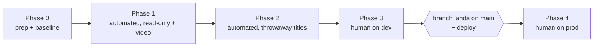
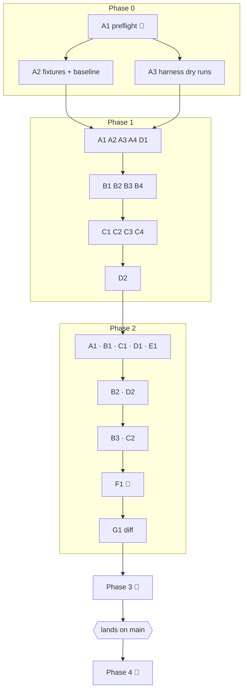

# Verify the whole download app end to end: agents first, then a human — `apps/download`

## Overview

> Written for a human first. Everything below this section is written for whoever
> executes the plan. If a claim here needs more, it links to where the detail lives.

Plans 001–021 and 015 built the download app across ~450 commits. Unit tests cover the
logic, but most of what a user touches has never been checked against the real Radarr,
Sonarr, Emby, yt-dlp and a real browser in one pass. This plan is that pass: every
feature in [`spec.md`](../spec.md) and [`user-stories.md`](../user-stories.md),
checked live, with the results recorded in this doc.

It writes **no application code**. Agents run the checks and report ✅/❌ with evidence.
Bugs become entries in the [Findings ledger](#findings-ledger) for a follow-up plan;
nothing gets fixed here.

| Phase                                         | Who                     | What it covers                                                                                                                                                                                                                                    |
| --------------------------------------------- | ----------------------- | ------------------------------------------------------------------------------------------------------------------------------------------------------------------------------------------------------------------------------------------------- |
| **0 · Prep**                                  | agents                  | Dev container on current code, fixture titles picked and proven absent, library baseline snapshotted                                                                                                                                              |
| **1 · Automated, no library writes**          | agents                  | Nav bar, search, gallery, home, activity, admin, profile, masking, the whole video pipeline (incl. plan 015's progress bar), read-only movie/show pages, the read-only harness sweep                                                              |
| **2 · Automated, library writes** ✅ approved | agents                  | Remove plan 009's two leftover titles; full movie and show lifecycles on **throwaway titles not in the library**; Radarr/Sonarr-initiated pickup; queue removal; a restart mid-download; the existing write-path harness; cleanup + baseline diff |
| **3 · Human, on dev**                         | you                     | Real Google sign-in, real phone, Emby playback, triage the findings                                                                                                                                                                               |
| **4 · Human, after landing on `main`**        | you (+ one agent sweep) | Deploy; migrations; restart behaviour on the persistent DB; real Discord `/download`, linking, rename; first prod delete; stuck imports and client failures when they happen                                                                      |



**Shape:** 5 phases, 40 tasks (28 for agents in Phases 0–2, 12 in Phases 3–4, one of
which an agent can run once you've deployed), orchestrated. Everything lands on
`jeremy/download`; the only commits are this doc's result updates and one fixture file.

**Key decisions** — full reasoning in [Design decisions](#design-decisions):

- **Agent-driven, results only.** Throwaway `playwright-core` scripts in `/tmp`, no
  committed test suite.
- **A bug gets recorded, and the sweep keeps going.** Fixes go in a follow-up plan.
- **Library writes are approved, and only on titles that aren't in the library** (plus
  deleting plan 009's two leftovers, _Following_ and _Olive Kitteridge_, which you
  approved).
- **Non-admin views are automated by spoofing headers** on `localhost:8090`. Verified:
  `verify-regular@lilnas.test` comes back `isAdmin: false`.
- **Discord checks wait for prod.** Production `auth` (built 2026-08-28) 404s the
  Discord routes plan 017 added, and this branch lands on `main` soon anyway.
- **Restart checks are split.** The dev DB is tmpfs, so a dev restart wipes every job.
  Dev proves the _media_ state survives; prod (Phase 4) proves the _jobs_ do.
- **Plan 015 (video progress) is included.** It's code-complete (10/10); its live run is
  automatable. **Plan 022 (movie/show cancel) is deferred.** It hasn't started.

> **Accepted gap:** a stuck import (`needs_attention`) and a download-client failure
> can't be caused on demand. They stay as standing checks in Phase 4, done whenever one
> happens naturally.

> **Accepted gap:** outage tests (Radarr, Sonarr or auth down) are not automated. The
> dev container shares the production services, so stopping one takes the real one
> down. [Phase 3 · H4](#phase-3--human-on-dev) is where you decide.

**Read next:** [Design decisions](#design-decisions) · [Shared Context
Pack](#shared-context-pack) (safety rules live here) · [Task List](#task-list) ·
[Sequencing](#sequencing) · [Findings ledger](#findings-ledger) · [Final
report](#final-report)

---

## How to work this plan

**No feature branch or worktree.** Every download plan (001–022) lands on
`jeremy/download`, and this one must too: `lilnas-download-dev` bind-mounts **this
worktree** (`/home/jeremy/.nexus-code/worktrees/lilnas/jeremy-download` → `/source`), so
it's the only checkout the dev container actually serves.
[Why](#no-feature-branch-and-no-worktree).

> ⚠️ **Never switch this worktree's branch.** The dev container serves whatever is
> checked out here.

**Per task** (agent tasks):

1. Work tasks in wave order (see [Sequencing](#sequencing)). Never start a task before
   its dependencies report back.
2. The sub-agent runs every check in its task and reports a per-check table. It edits
   **nothing** in the repo and commits nothing (the one exception is
   [Phase 0 · A2](#phase-0--prep), which writes `fixtures.json`).
3. The orchestrator writes the result line under the task, adds any ❌ to the
   [Findings ledger](#findings-ledger), checks the box, and after each **wave** runs
   **`/commit`** for this doc (`docs(download): record plan 023 <phase/wave> results`),
   holding the commit mutex:

   ```bash
   until mkdir /tmp/lilnas-download-commit.lock 2>/dev/null; do sleep 5; done
   # /commit — stage ONLY this plan doc (and fixtures.json in Phase 0)
   rmdir /tmp/lilnas-download-commit.lock
   ```

**Per-check result markers** (inside a task's result line):

| Marker | Means                                                                          |
| ------ | ------------------------------------------------------------------------------ |
| ✅     | Passed — with one line of evidence (value observed or evidence file)           |
| ❌     | Failed — links a Findings ledger entry `F<n>`                                  |
| ⚠️     | Inconclusive — ran, but the evidence doesn't settle it; say why                |
| ⏭️     | Skipped — say why (e.g. "no HLS-only source found", "Radarr found no upgrade") |

**Task markers:**

| Marker              | Means                                                               |
| ------------------- | ------------------------------------------------------------------- |
| `- [ ]`             | Not started                                                         |
| `- [x]` … `abc1234` | Done; the hash is the doc commit that recorded its results          |
| ⚠️ **PARTIAL**      | Some checks couldn't run — say which and why, inline                |
| ⏭️ **DROPPED**      | Not doing it — say why. Never delete a task                         |
| 🧑 **HUMAN**        | A person does this. The orchestrator never performs or delegates it |
| ⏳                  | Blocked on something outside this plan (named inline)               |

**When reality disagrees with this plan** (a route moved, a check's premise is wrong),
add a short **Findings** note under the task, then fix the downstream tasks it
invalidates. A wrong check is a plan bug, not an app bug. Don't put it in the ledger as
❌.

---

## Instructions for the orchestrator agent

You are an **orchestrator**. Your job is delegation, sequencing, and recording results —
nothing else.

**You are ONE session, and you hold the whole phase.** Sub-agents are spawned **inside**
your session and report back to you. ❌ **Never start one session per task.**

**Do**

- Delegate every agent task to a sub-agent (`general-purpose`). One sub-agent per task.
- Write **self-contained** prompts: the task's full text, the **whole**
  [Shared Context Pack](#shared-context-pack) (the safety rules are not optional
  reading), the [fixture table](#fixtures) as filled in by Phase 0, and the
  [Definition of Done](#definition-of-done). A task that depends on an earlier one gets
  that task's reported ids (job ids, media keys) pasted in.
- Record each report under its task, add ❌ rows to the [Findings ledger](#findings-ledger),
  commit this doc once per wave (mutex above).
- Enforce **one restart at a time**: only the tasks marked 🔁 restart
  `lilnas-download-dev`, and each runs in a wave by itself.
- Stop the phase and report to the human if any sub-agent reports **leftover state it
  couldn't clean up**, or touched anything outside the [allowlist](#safety-rules).

**Don't**

- ❌ Read or edit source, tests, or config. The only file you edit is this plan.
  (`fixtures.json` is Phase 0 · A2's sub-agent's job.)
- ❌ Let a sub-agent read this plan, fix a bug, or commit.
- ❌ Perform or delegate any 🧑 **HUMAN** task. When Phase 2 ends, report and stop.
- ❌ Start Phase 2 before Phase 1's last wave reports, or Phase 1 before Phase 0 is
  green — Phase 0 · A2's fixture table is what makes Phase 2 safe.
- ❌ Run jest. This plan runs no test suites (see [Gotchas](#gotchas) for why a
  careless full run is dangerous on this host).

**Finish by** checking every agent box, then reporting the [Final report](#final-report).

---

## Design decisions

### Agent-driven checks, results only — no committed UI suite

Agents drive system Chrome through throwaway `playwright-core` scripts under
`/tmp/plan-023/`, and report. Ruled out: a committed `scripts/verify/ui/` Playwright suite.
It would be re-runnable, but it roughly doubles the plan and turns a verification pass
into a build. That's a follow-up if this pass shows it's worth it. The existing
`apps/download/scripts/verify/` harness **is** used where it's current, because it
already exists.

### Record, don't fix

A ❌ becomes a [Findings ledger](#findings-ledger) entry with a repro, and the sweep
continues. Ruled out: fixing small bugs inline. The dev container serves this worktree,
so an inline fix changes the code under every other check running in the same wave.

### Library writes only on titles that aren't in the library

You approved the writes, on that condition. Phase 0 · A2 picks titles, proves each one
is absent from Radarr/Sonarr, and every destructive call in Phase 2 is checked against
that list first. A title that is absent at the start and deleted at the end leaves the
library exactly as it was. That's proven by the baseline diff in Phase 2 · H1.

The single exception: **plan 009's two leftover fixtures**, _Following_ (`tmdb:11660`)
and _Olive Kitteridge_ (`tvdb:276842`). Both are in the library, fully downloaded,
monitored, added 2026-08-28, the day of plan 009's mutate run. Its journal is empty
(`captures/mutate-journal.json`). You confirmed they are leftovers; Phase 2 · A1 removes
them through the app, which also exercises whole-title removal.

### Non-admin views by header spoofing

On `localhost:8090` the app trusts `X-Forwarded-User` / `X-Forwarded-User-Id`
(`src/auth/forwarded-user.ts` — the Docker network is the trust boundary, not Traefik),
and admin status comes from auth's `/admin/check` by email. Probed 2026-09-24:

```
curl -H 'X-Forwarded-User: verify-regular@lilnas.test' -H 'X-Forwarded-User-Id: verify-regular-1' \
  localhost:8090/api/auth/whoami
→ {"email":"verify-regular@lilnas.test","userId":"verify-regular-1","isAdmin":false}
```

So masking, profile access and the admin "Not Authorized" view are all automatable. What
spoofing can't prove is the real Traefik + Google sign-in, which is why
[Phase 3 · H1](#phase-3--human-on-dev) exists.

### Discord checks wait for the branch to land

Probed 2026-09-24 from inside `lilnas-download-dev`, `auth` resolves to production
`lilnas-auth-1` (built 2026-08-28):

| Route                             | Result               |
| --------------------------------- | -------------------- |
| `GET /internal/discord-link`      | **404** `Cannot GET` |
| `POST /internal/discord-identity` | **404**              |
| `GET /admin/check` (control)      | 200                  |

Plan 017 added those routes on 2026-09-20 (`17ea1e15`). Until auth is redeployed, every
Discord job reads as unlinked and linking is impossible. Deploying auth from this branch
as it is would roll back 4 `main` commits touching `apps/auth`/`apps/tdr-bot`. The branch
is landing on `main` soon, so the Discord checks go in [Phase 4](#phase-4--human-after-landing-on-main).
Phase 1 still checks the **download side** of Discord attribution with fake headers,
safe for exactly as long as the roster route 404s. [See the rule](#safety-rules).

### Plan 015 in, plan 022 out

- **015 (video progress)** finished 10/10 on 2026-09-24 (`95cad00d`). Its human
  checkpoint 2, the live run, needs no human: it's a yt-dlp job on dev, which
  `local-verification.md` says is fair game. It becomes
  [Phase 1 · B2](#group-b--videos). Its checkpoint 3 (prod) is in Phase 4.
- **022 (movie/show cancel + adopting upstream grabs)** is 0/15 and uncommitted. Its
  checks are listed under [Deferred](#deferred--not-built-yet) and must not be run:
  today a movie stuck at `searching` has **no** Cancel, and that's correct.

### No feature branch and no worktree

The plan-doc default would isolate a multi-commit plan in its own worktree. Not here: the
commits are result records in one doc, and the dev container can only serve **this**
worktree. A separate worktree would verify code nobody is running. This matches plans
001–022.

### Things that already exist — use them

- **`apps/download/scripts/verify/verify-backend.ts`**: `capture` / `check` (read-only
  sweep of every GET route with schema + spot checks), `preflight` / `mutate` (journaled,
  crash-safe movie/show/video write passes; teardown can only touch journal ids).
- **Standalone write-path scripts** in the same dir: `grab.ts`, `replace.ts` (seeds its
  own file first, then replaces it), `bad-files.ts`, `pause-resume.ts`.
- ⚠️ These predate plan 021 (last edits 2026-09-14 to 09-23). `bad-files.ts` still says
  there's no un-flag route. There is one now: `DELETE /media/:id/bad-files/:flagId`. When a harness
  script fails for a **harness** reason (stale expectation, moved route), record a
  plan Finding, then run that check by hand. Don't patch the harness.

---

## Shared Context Pack

> Paste this whole section into every sub-agent prompt. Pointers, not gospel — verify
> against the running system.

### Environment

| Thing                 | Value                                                                                                                               |
| --------------------- | ----------------------------------------------------------------------------------------------------------------------------------- |
| Dev app (for tooling) | `http://localhost:8090` — loopback only, no OAuth. Next on 8080 inside; `/api/*` rewrites to Nest on 8081 (`next.config.js:14`)     |
| Dev app (for humans)  | `https://download.dev.lilnas.io` — real OAuth. **Agents never use it**                                                              |
| Dev container         | `lilnas-download-dev` — serves this worktree; DB `/data/download.db` and videos `/download/videos` are **tmpfs** (wiped on restart) |
| Production container  | `lilnas-download-1` — ❌ **never touch it** in Phases 0–3                                                                           |
| Upstreams             | `radarr`, `sonarr`, `emby`, `storage` (MinIO), `auth` on `lilnas_default` — **all production**                                      |
| Download client       | `lilnas-sabnzbd-1` (usenet), driven by Radarr/Sonarr                                                                                |
| Media on disk         | `/storage/media-library/{movies,tv}` (host) = `/movies`, `/tv` (container, `:ro`)                                                   |
| Browser               | system Chrome `/usr/bin/google-chrome-stable` + `playwright-core@1.54.1` from the repo's `node_modules/.pnpm`                       |
| yt-dlp                | `/usr/bin/yt-dlp` inside the container (2026.08.19)                                                                                 |
| Harness runner        | `node_modules/.bin/tsx` at the repo root                                                                                            |

### Identities

| Name        | How                                                                                                                   | Is           |
| ----------- | --------------------------------------------------------------------------------------------------------------------- | ------------ |
| **ADMIN**   | no identity headers → `DEV_USER_EMAIL` fallback (`jeremyasuncion808@gmail.com`, `verify-user-1`)                      | admin        |
| **R1**      | `X-Forwarded-User: verify-regular@lilnas.test`, `X-Forwarded-User-Id: verify-regular-1`                               | regular      |
| **R2**      | `X-Forwarded-User: verify-regular-2@lilnas.test`, `X-Forwarded-User-Id: verify-regular-2`                             | regular      |
| **DISCORD** | `x-discord-user-id: 100000000000000023`, `x-discord-username: verify-discord` — ⚠️ see [safety rule 6](#safety-rules) | Discord-only |

```js
// /tmp/plan-023/<task>/run.mjs — the browser pattern
import { createRequire } from 'node:module'
const require = createRequire(
  '/home/jeremy/.nexus-code/worktrees/lilnas/jeremy-download/package.json',
)
const {
  chromium,
} = require('./node_modules/.pnpm/playwright-core@1.54.1/node_modules/playwright-core')
const browser = await chromium.launch({
  executablePath: '/usr/bin/google-chrome-stable',
  headless: true,
})
const r1 = await browser.newContext({
  viewport: { width: 1280, height: 900 }, // mobile checks: 390×844 + isMobile/hasTouch
  extraHTTPHeaders: {
    'x-forwarded-user': 'verify-regular@lilnas.test',
    'x-forwarded-user-id': 'verify-regular-1',
  },
})
```

### Upstream helpers (never print the keys)

```bash
# Radarr / Sonarr API, through the dev container's env
docker exec lilnas-download-dev sh -c 'curl -s -H "X-Api-Key: $RADARR_API_KEY" "$RADARR_URL/api/v3/movie?tmdbId=<id>"'
docker exec lilnas-download-dev sh -c 'curl -s -H "X-Api-Key: $SONARR_API_KEY" "$SONARR_URL/api/v3/series?tvdbId=<id>"'
# Read-only DB query (no sqlite3 binary in the image)
docker exec -w /source/apps/download lilnas-download-dev node -e \
  "const D=require('better-sqlite3');const db=new D('/data/download.db',{readonly:true});console.log(db.prepare('select id,type,status,origin from jobs').all())"
```

Useful upstream calls: `GET /api/v3/queue`, `GET /api/v3/history`, `GET /api/v3/episode?seriesId=`,
`POST /api/v3/command {name:'MoviesSearch',movieIds:[…]}` / `{name:'EpisodeSearch',episodeIds:[…]}`,
`DELETE /api/v3/queue/<id>?removeFromClient=true&blocklist=false`,
`DELETE /api/v3/movie/<id>?deleteFiles=true`. To add a movie **the way Radarr's UI
would**, mirror `ensureMovie` (`apps/download/src/media/radarr.service.ts:321`) for
`qualityProfileId` / `rootFolderPath`, with `addOptions.searchForMovie: true`.

### App surface

| Page                                       | Path                                                         |
| ------------------------------------------ | ------------------------------------------------------------ |
| Home · Search · Gallery · Activity · Admin | `/` · `/search?q=` · `/gallery` · `/activity` · `/admin`     |
| Profile                                    | `/profile` (self) · `/profile?user=<email>`                  |
| Detail                                     | `/movies/<tmdbId>` · `/shows/<tvdbId>` · `/videos/<videoId>` |

API (via `localhost:8090/api`): `/download/{videos,movies,shows}` (POST create; GET
`/:id`), `PATCH /download/videos/:id/{pause,resume,cancel}`, `DELETE /download/videos/:id`,
`GET /download/media/:key` (`{ media, jobs }`; keys `tmdb:` `tvdb:` `video:`),
`…/media/:key/{seasons,releases,bad-files,imports,file}`, `POST …/releases/{grab,replace}`,
`POST|DELETE …/bad-files[/:flagId]`, `DELETE …/media/:key/files[?episodeId=|seasonNumber=]`
(→ `{ cascade, deletedCount, removedFromLibrary }`), `/download/{activity,gallery,gallery/facets,history,profile,discover,stats,audit-log}`,
`/auth/whoami`. yt-dlp routes live at **`/api/api/ytdlp-update/{status,version,check}`**
(that controller carries its own `api/` prefix). WebSocket: `/ws`.

Media states: `absent · wanted · downloading · importing · needs_attention · paused · available`
(`packages/utils/src/download/schema.ts:244`). Emby: `media.embyStatus.state` is
`indexed | indexing | unknown`, with `watchUrl` only when `indexed`.

### Safety rules

1. **The allowlist.** Library writes (request, grab, replace, flag, delete, queue
   removal, Radarr/Sonarr add/remove/search) may target **only** the ids in the
   [fixture table](#fixtures) plus `tmdb:11660` and `tvdb:276842` (Phase 2 · A1 only).
   Re-read the id against the table **immediately before** every destructive call.
2. **No release listing for titles outside the allowlist.** `GET /download/media/tmdb:<id>/releases`
   **adds** the movie to Radarr when it isn't there (plan 009 finding 6). For library
   titles it toggles monitoring. Release listing happens only on fixtures, in Phase 2.
3. **Phase 1 writes nothing to Radarr/Sonarr.** Only video jobs, bad-file flags on
   videos (none exist; flags are movie/show only), and dev-DB rows.
4. **Never touch production.** Not `lilnas-download-1`, not
   `/storage/app-data/download/download.db`, not `download.lilnas.io`.
5. **Never run `pnpm build` in `apps/download`.** It clobbers the dev server's `.next`
   and the container starts 500ing (`local-verification.md`).
6. **Fake Discord headers only while auth 404s.** Immediately before sending any
   `x-discord-*` header, run
   `docker exec lilnas-download-dev curl -s -o /dev/null -w '%{http_code}' -X POST http://auth:8081/internal/discord-identity`.
   Only a **404** allows it. Anything else means auth was redeployed, so the fake
   snowflake would become a permanent junk row in the admin picker. Stop and mark the
   check ⏭️.
7. **Restarts only in 🔁 tasks.** `docker restart lilnas-download-dev` wipes the dev DB
   and every other in-flight check.
8. **Evidence stays in `/tmp/plan-023/<phase>-<task>/`.** Screenshots and captures hold
   real emails and library contents. Never commit or paste them.
9. **Every task leaves no state behind** except what it says it leaves.

### Gotchas

- **A stale backend looks like a bug.** `nest start -w` has silently stopped watching in
  plans 013, 020 and 021. Phase 0 · A1 restarts once. If a result contradicts the code,
  check `docker logs lilnas-download-dev 2>&1 | grep -c "Nest application successfully started"`
  before calling it ❌.
- **WebSocket frames vs. spoofed headers.** A live update seen by an R1 browser is only
  masked if the `/ws` handshake carried R1's headers. If a live frame leaks an identity
  that a reload hides, reproduce with a raw WebSocket client that sets the headers
  **before** recording ❌. It may be the test rig, not the app.
- **Emby indexing is slow and not pushed.** `indexing → indexed` needs a page refresh
  (plan 021 accepted gap). Give it up to 15 minutes, then ⏭️ with the last state seen.
- **Real downloads aren't guaranteed.** An indexer may have no release. Assert forward
  movement within a window, not completion, unless the check is specifically about
  completion; then ⏭️ with the reason after the window.
- **Activity is job-driven.** A download started in Radarr/Sonarr's own UI does **not**
  appear on `/activity` (plan 021 accepted gap). That's ✅ "gap still as documented", not ❌.
- **A dev restart wipes every job.** `/data` (the DB) and `/download` (video working
  dirs) are tmpfs. After a 🔁 restart, job ids from earlier tasks no longer exist. That's
  expected, not ❌.
- **`/download` is only 2 GiB.** Finished videos move to MinIO and their working dir is
  cleaned, but concurrent VID-LONG runs share that space. Check `df -h /download` inside
  the container before starting one, and never run more than two at once.
- **Jest can OOM this host.** It's the production server. This plan runs no tests.

### Definition of Done

Include this **verbatim** in every delegation:

> **Done means:** every check in the task was run or explicitly skipped with a reason;
> each carries ✅ / ❌ / ⚠️ / ⏭️ and one line of evidence (the value observed, or a file
> under `/tmp/plan-023/<phase>-<task>/`); every ❌ carries a repro (identity, URL or
> request, expected, observed); nothing outside the task's allowed ids was written to;
> everything the task says to tear down is gone and verified gone; no source, test,
> config or plan file was edited and nothing was committed. Report back: the per-check
> table, the `git rev-parse --short HEAD` the checks ran against, the evidence
> directory, and any leftover state (ids, jobs, queue items) — "none" if none.

---

## Fixtures

_Filled in by [Phase 0 · A2](#phase-0--prep). Every id here was absent from Radarr/Sonarr
at the time of recording._

| Slot          | Used by                | Criteria                                                                           | Title (year)     | Key                                           | Verified absent |
| ------------- | ---------------------- | ---------------------------------------------------------------------------------- | ---------------- | --------------------------------------------- | --------------- |
| **MOVIE-A**   | Phase 2 · B1–B3        | runtime ≤ 90 min; releases likely on usenet                                        |                  | `tmdb:`                                       |                 |
| **MOVIE-B**   | Phase 2 · D1           | same                                                                               |                  | `tmdb:`                                       |                 |
| **MOVIE-C**   | Phase 2 · F1           | same; ideally a larger file so it's still downloading after a restart              |                  | `tmdb:`                                       |                 |
| **SHOW-C**    | Phase 2 · C1–C2, D2    | ended; **exactly 2** regular seasons; ≤ 8 episodes each; episodes ≤ 30 min         |                  | `tvdb:`                                       |                 |
| **MOVIE-H**   | Phase 2 · E1 (harness) | written to `fixtures.json` `movie`                                                 |                  | `tmdb:`                                       |                 |
| **SHOW-H**    | Phase 2 · E1 (harness) | **1** regular season (the harness refuses more); written to `fixtures.json` `show` |                  | `tvdb:`                                       |                 |
| **VID-SHORT** | Phase 1 · B1, B4       | ≤ 30 s public video                                                                | _Me at the zoo_  | `https://www.youtube.com/watch?v=jNQXAC9IVRw` | n/a             |
| **VID-LONG**  | Phase 1 · B2, C1       | ≥ 5 min, default format downloads as 2 files                                       | _Big Buck Bunny_ | `https://www.youtube.com/watch?v=aqz-KE-bpKQ` | n/a             |
| **VID-HLS**   | Phase 1 · B2           | every format `m3u8` (e.g. a livestream VOD)                                        |                  |                                               | n/a             |

---

## Task List

### Phase 0 — Prep

- [ ] **A1. Environment preflight.** 🔁 Prove the dev container runs current code and the
      rig works.
  - A1-1 `git rev-parse --short HEAD`; `docker restart lilnas-download-dev`; wait for both
    `Ready in` and `Nest application successfully started` in the logs.
  - A1-2 `GET /api/auth/whoami` with no headers → ADMIN, `isAdmin: true`; with R1 headers
    → `isAdmin: false`.
  - A1-3 A headless Chrome context with R1 headers loads `/admin` and shows the
    Not Authorized view; the ADMIN context shows the dashboard. (Proves header spoofing
    reaches server components, not just the API.)
  - A1-4 Record auth's Discord route status (expected: both 404) for safety rule 6.
  - A1-5 `GET /api/download/discover?query=star` → `degradedSources: []` (Radarr and
    Sonarr reachable).

- [ ] **A2. Fixtures, leftovers and the baseline.** Fill the [fixture table](#fixtures)
      and freeze what the library looks like.
  - A2-1 For each movie/show slot, find a candidate via Radarr `GET /api/v3/movie/lookup?term=`
    / Sonarr `GET /api/v3/series/lookup?term=` (**lookups only — never add**). Prove
    absence with `GET /api/v3/movie?tmdbId=` / `GET /api/v3/series?tvdbId=` returning `[]`,
    and no queue item for it. For SHOW-C/SHOW-H, count regular seasons from the lookup.
  - A2-2 Find a VID-HLS source (`yt-dlp -F` inside the container shows only `m3u8`). ⏭️ is
    fine if none turns up in 10 minutes.
  - A2-3 Write MOVIE-H and SHOW-H into `apps/download/scripts/verify/fixtures.json`
    (keep its shape: `movie {tmdbId,title,year}`, `show {tvdbId,title,seasonNumber,expectedEpisodes}`).
    Prettier-check it, then `/commit` it alone (mutex) as
    `chore(download): point the verify fixtures at titles outside the library`.
  - A2-4 Baseline: write `/tmp/plan-023/baseline/` with Radarr movies
    (`id, tmdbId, monitored, hasFile`), Sonarr series (`id, tvdbId, monitored`,
    per-season `monitored`, `episodeFileCount`), and both queues.
  - A2-5 **Leftover report (read-only):** from `git log -p -- apps/download/scripts/verify/`,
    collect every tmdb/tvdb id any verify script ever used as a fixture; list which are
    in the library today, with `added` dates. Report only. The two known ones are handled
    in Phase 2 · A1, and anything else goes to the human.
  - **Report back:** the filled fixture table rows (the orchestrator pastes them into
    [Fixtures](#fixtures)), the commit hash, the leftover list.

- [ ] **A3. Harness health (dry runs only).** From the repo root, run `--help` and
      `--dry-run` for `verify-backend.ts` (`capture`, `preflight`, `mutate`) and `--help`
      for `grab.ts`, `replace.ts`, `bad-files.ts`, `pause-resume.ts`. Report which run,
      which error, and each script's target flag (`--base-url http://localhost:8090/api`
      is the dev target). Nothing touches the network.

### Phase 1 — Automated, no library writes

#### Group A — Browsing surfaces

- [ ] **A1. Nav bar and entry point** (ADMIN context, desktop 1280×900 and mobile 390×844).
  - A1-1 Paste `youtube.com/watch?v=jNQXAC9IVRw` (no scheme): the icon swaps, an inline
    **Download** button appears, no dropdown.
  - A1-2 Type `st`: an inline **Search** button appears; with `s`, it doesn't. Enter and
    the button both land on `/search?q=…`.
  - A1-3 Typing alone never navigates, and fires **no** network request (watch
    `page.on('request')` while typing).
  - A1-4 URL-shaped junk that fails to parse a host (`http://`) is treated as search text.
  - A1-5 Mobile: the field is an icon; tapping expands it full-width; closing gives the
    bar back.
  - A1-6 The field is present on `/`, `/search`, `/gallery`, `/activity`, `/admin`,
    `/profile`, and a movie, show and video page.

- [ ] **A2. Search page** (ADMIN).
  - A2-1 Results appear after the debounce (~300 ms), not before; 1 character never
    searches.
  - A2-2 Movies and shows interleave, each tagged with its type.
  - A2-3 The genre filter and release-date range narrow results. Active filters render
    as removable chips; removing one and **Clear all** both work.
  - A2-4 Sort by relevance, title and release date each reorder the list.
  - A2-5 A nonsense query shows `No matches for '<query>'`, not an error.
  - A2-6 Clicking a result for a title **not** in the library and one **in** it both
    open the detail page (check the not-in-library one with no Download click).

- [ ] **A3. Home and gallery** (ADMIN, then R1).
  - A3-1 Home: Recently Added cards open their detail pages; the quick-access links
    (movies, shows, videos, activity) go where they say.
  - A3-2 The gallery lists Radarr/Sonarr library titles (not an empty page on a fresh
    DB), sorted by when the file landed.
  - A3-3 Type, date and uploader filters narrow the grid. (The uploader facet only lists
    emails, so Discord-only jobs have no chip. That's a known gap, ✅ if still true.)
  - A3-4 Cards open their detail pages; attribution avatars have a tooltip.
  - A3-5 390 px: the grid reflows without horizontal scroll.

- [ ] **A4. Read-only harness sweep.** `verify-backend.ts capture --base-url http://localhost:8090/api`,
      then `check`. Run it once anonymous, once `--as-admin`, and once
      `--as-user verify-regular@lilnas.test --user-id verify-regular-1`, each into its own
      `--captures` dir under `/tmp/plan-023/1-A4/`. **No `--include-expensive`** (it
      can hit `/releases`, see safety rule 2).
  - Report the three verdict tables; classify every FAIL as app bug vs stale harness
    expectation (the latter → Findings note under this task, not the ledger).

#### Group B — Videos

- [ ] **B1. Video happy path** (R1).
  - B1-1 From the nav bar, paste VID-SHORT and click Download: you land on `/videos/<id>`
    with the download running. Thumbnail, title, author and the source link render.
  - B1-2 It reaches the `downloaded` chip with no reload.
  - B1-3 In-app playback: the `<video>` element's `currentTime` advances after `play()`.
  - B1-4 **Save to device** returns the file (check status, `content-type`,
    `content-disposition`, non-zero length).
  - B1-5 Delete it: it leaves the gallery and its page shows the deleted state.
  - B1-6 An unsupported link (`https://example.com/not-a-video`) lands on the "not
    recognized" state pointing back at the nav bar, not an error page.

- [ ] **B2. Video progress, pause, resume, cancel — plan 015's live run** (ADMIN).
      Watch with `curl -s localhost:8090/api/download/videos/<id> | jq '{status,progress}'`
      once a second, alongside the page.
  - B2-1 VID-LONG: the in-flight card shows a bar, `file 1 of 2`, a percentage and
    `… MB / … MB · … MB/s · ~… left`, updating about once a second with no reload.
  - B2-2 It flips to `file 2 of 2` and restarts at 0 % with no `finishing up` flicker
    between.
  - B2-3 After the last file: `finishing up` at 100 % → `converting` → `uploading` →
    the `downloaded` chip with **no** bar and no `progress` key on the job.
  - B2-4 `/activity`'s progress column shows the same figure while it runs.
  - B2-5 `docker exec lilnas-download-dev cat /download/videos/<id>/download.log` has
    `LILNAS_PROGRESS` lines and a `[Merger]` line.
  - B2-6 Second VID-LONG run: pause at ~50 % → chip `paused`, bar stays, `progress` still
    present; resume → the first new `downloadedBytes` ≥ the paused figure and
    `download.log` has `Resuming download at byte`.
  - B2-7 Third run: cancel mid-download → `cancelling` → `cancelled`, no `progress` key,
    **Download** offered again.
  - B2-8 VID-HLS: `fragment i of n` renders. (⏭️ if A2 found no source.)
  - B2-9 A clip (`timeRange` 00:00:00–00:00:05 on VID-LONG): status word only, no bar,
    no error, and the result plays only ~5 s. (Plan 015 accepted gap: confirm it.)
  - B2-10 `pause-resume.ts --base-url http://localhost:8090/api` agrees (or a harness
    Finding if it's stale).

- [ ] **B3. Hidden attribution** (R1 creates, R2 and ADMIN view).
  - B3-1 R1 downloads VID-SHORT with the hide-attribution toggle on.
  - B3-2 R2 sees `hidden` on the gallery card, the video page and (while in flight)
    `/activity`: dashed avatar, no email, no Discord mark, not clickable.
  - B3-3 ADMIN sees R1 in all three places, and R1's avatar links to `/profile?user=…`.
  - B3-4 The R2 JSON responses (`/download/videos/<id>`, `/download/gallery`,
    `/download/activity`) carry `requester: null` **and** `discordRequester: null` **and**
    `linkedDiscord: null`. The mask covers all three.
  - B3-5 Leave the job in place for Group C.

- [ ] **B4. Seed the attribution matrix** for Group C. Create, via the API, VID-SHORT
      jobs as: ADMIN ×1, R1 ×2 (one then cancelled), R2 ×1, and — **only if safety rule
      6 allows** — DISCORD ×1 (`POST /download/videos` with only the two `x-discord-*`
      headers). Check the DISCORD job's response: `requester: null`,
      `discordRequester.discordUserId` set, `linkedDiscord: null`. Report every job id.

#### Group C — People and permissions (needs B3 + B4's jobs)

- [ ] **C1. Activity page, live.** Start one VID-LONG as R1 (hidden) and one as R2 (not
      hidden), then open `/activity` as R2 and as ADMIN.
  - C1-1 Both rows appear and update with no reload; each disappears when it finishes.
  - C1-2 R2 sees R1's row anonymized. ADMIN sees R1 inline in the same row.
  - C1-3 The DISCORD job (if B4 made one; start another VID-LONG as DISCORD if needed)
    renders the handle plus a Discord mark. Clicking **and** tapping (mobile context) the
    mark opens a popover with the handle, the snowflake and "no lilnas account linked".
  - C1-4 R1's hidden row, for R2: no Discord mark anywhere in the DOM.
  - Cancel anything still running at the end.

- [ ] **C2. Admin dashboard.**
  - C2-1 R1: `/admin` shows Not Authorized, and `/api/download/{stats,audit-log}` return
    403 while `/history` scoped to someone else returns 403.
  - C2-2 ADMIN: the stat tiles (total, recent, completed, …) match a direct DB count.
  - C2-3 The leaderboard ranks by email (Discord-only absent: ✅ as a known gap); a row
    links to that user's profile.
  - C2-4 Full history lists **every** status present in the dev DB (completed, cancelled,
    failed, …), including R1's hidden job **with R1 shown**.
  - C2-5 Filter history by user, type and status: chips appear, combine, and remove.
  - C2-6 The audit log has rows for this phase's actions (video create/pause/resume/
    cancel/delete) with actor and origin (`web`, `discord`, `service`). Hidden or not,
    the actor is visible to ADMIN.

- [ ] **C3. Profile.**
  - C3-1 R1: the app-bar avatar opens `/profile`. It shows R1's header, totals by type
    and by status, a daily trend, and first/last download dates.
  - C3-2 Clicking a type chip and a status chip filters the history with AND. Several
    chips in a group combine. Active chips look selected. Counts stay lifetime totals
    while filtering.
  - C3-3 A combination with no rows shows "no downloads match these filters". R2's
    empty-case differs: a fresh identity (`verify-regular-3@lilnas.test`) shows the
    no-downloads state, not the filter one.
  - C3-4 R1: other users' avatars are not links; `/profile?user=verify-regular-2@lilnas.test`
    is refused (and `/api/download/profile` / `/history` for R2 → 403).
  - C3-5 ADMIN: opens R1's and R2's profiles from activity, history and leaderboard rows.

- [ ] **C4. Hidden attribution never links.** As R2, every surface showing R1's hidden
      job (gallery, video page, activity, profile if reachable) has no link or
      `href` to a profile. As ADMIN, the same row does link.

#### Group D — Read-only media pages and the yt-dlp updater

- [ ] **D1. Movie and show pages, read-only.** Pick one library movie with a file and
      one library show with files (**not** fixtures; read-only only).
  - D1-1 Movie: trailer, cover art, cast and metadata render; the chip reads `in library`.
  - D1-2 Show: seasons and episodes list, each episode with its own state.
  - D1-3 Watch: when `embyStatus.state` is `indexed`, the Watch link equals `watchUrl`
    and points at Emby's external URL; otherwise the page shows `Indexing…`.
  - D1-4 Save to device: `GET /api/download/media/<key>/file` with `Range: bytes=0-1023`
    answers 206 (or 200) with a sane `content-type`. **Don't pull the whole file.**
  - D1-5 Delete dialogs (open, read, **cancel** — never confirm): the movie dialog says
    it's removed from Radarr; a season/episode dialog warns about the cascade.
  - ❌ Don't open the release picker here (safety rule 2).

- [ ] **D2. yt-dlp updater.** `GET /api/api/ytdlp-update/{status,version}`; then
      `POST /api/api/ytdlp-update/check?dryRun=true` and confirm an audit row
      (`ytdlp.check_update`) appears in the admin audit log. If the dry run writes none,
      record that and stop. **No real (non-dry-run) check**; it replaces the dev
      container's yt-dlp binary mid-sweep.

> **No restart check in this phase.** A video interrupted by a restart should read
> `failed` ("Interrupted by a service restart"), but the dev DB is tmpfs, so a dev
> restart deletes the job instead of failing it. There's nothing to observe. That check
> runs on prod's persistent DB in [Phase 4 · H3](#phase-4--human-after-landing-on-main).

### Phase 2 — Automated, library writes (approved; throwaway titles only)

> Every task: re-read its ids against the [fixture table](#fixtures) before each
> destructive call (safety rule 1). Every task ends with its titles gone from
> Radarr/Sonarr **and** the download client, unless it says otherwise.

#### Group A — Leftovers

- [ ] **A1. Remove plan 009's leftovers through the app** (ADMIN).
  - A1-1 Confirm `tmdb:11660` (_Following_) and `tvdb:276842` (_Olive Kitteridge_) are
    still in the library with the same `added` dates as the baseline. If either changed,
    **stop** and report: someone may be using it.
  - A1-2 Open `/movies/11660`: the delete dialog says it's removed from Radarr. Confirm.
    The response has `removedFromLibrary: true`; `GET /api/v3/movie?tmdbId=11660` → `[]`;
    `/storage/media-library/movies/Following (1999)` is gone.
  - A1-3 Same for `/shows/276842` with a whole-series delete. Gone from Sonarr, and
    `/storage/media-library/tv/Olive Kitteridge` is gone.
  - A1-4 Both disappear from the gallery; the audit log has both deletes with ADMIN as
    the actor.

#### Group B — Movie lifecycle (MOVIE-A)

- [ ] **B1. Request → library → Emby → save** (R1 requests).
  - B1-1 Request with the default (automatic) release. The page chip goes `wanted` →
    `downloading` (bar) → `importing…` → `in library` with **no** reload. The attempt
    row shows R1.
  - B1-2 While in flight, `/activity` shows it (R1 attribution; movies are never
    hideable).
  - B1-3 The job reaches `completed` without a restart and never sits at `searching`
    with a file on disk (plan 016's wedge).
  - B1-4 Watch: `Indexing…`, then after Emby scans (refresh the page), a Watch link to
    `watchUrl`. ⏭️ after 15 min.
  - B1-5 Save to device: a ranged `GET …/media/tmdb:<id>/file` answers.
  - B1-6 **Upgrade note:** `POST /api/v3/command {name:'MoviesSearch'}` for it in
    Radarr. If Radarr grabs an upgrade, the page shows a bar and the upgrade note with
    **no** new attempt row. If it grabs nothing (cutoff met), ⏭️.

- [ ] **B2. Release picker, flag, replace** (R1).
  - B2-1 The release picker lists releases; the on-disk release carries the `current`
    marker (synthesized if today's search lacks it, plan 014).
  - B2-2 Flag the current release as bad: the bad-file indicator shows; an audit row.
  - B2-3 Unflag (`DELETE …/bad-files/<flagId>`, via the UI if it offers it): the
    indicator is gone. Re-flag it for B3.
  - B2-4 Replace: pick a **different, small** release. The old file is deleted and the
    new one downloads and imports, with no manual delete step. The attempt list shows it.

- [ ] **B3. Flag exclusion, then removal** (R1, then ADMIN).
  - B3-1 Flag the release now on disk (from B2-4). Delete the movie through the app
    (whole-title removal: gone from Radarr).
  - B3-2 Re-request with the default release. From Radarr history (`grabbed` →
    `data.guid`), the grabbed guid is **not** any flagged guid.
  - B3-3 ⚠️ If the automatic path can't honour flags (it hands selection to Radarr
    `triggerSearch`, per plan 014), record which path ran and whether the spec's
    exclusion held, and why.
  - B3-4 Final delete: gone from Radarr, from the queue and from disk; the gallery card
    is gone.

#### Group C — Show lifecycle and the monitoring cascade (SHOW-C)

- [ ] **C1. Request cascades down** (R2). After each step, record Sonarr's series flag,
      both seasons' flags, and every episode's `monitored` / `hasFile`.
  - C1-1 **The fresh add.** A show not in Sonarr has no seasons to pick, so the page can
    only request the whole series. Instead, `POST /api/download/shows {tvdbId, seasonNumber: 1}`
    as R2 (the API path tdr-bot uses). Record the flags. Plan 019 accepted gap: a fresh
    add uses `monitor: 'all'`, so everything monitored is ✅ "gap as documented". Only S1
    should be **searched** (Sonarr command history shows one `SeasonSearch`).
  - C1-2 **Set up the exact case.** Through Sonarr's API, unmonitor S2's season flag and
    every S2 episode (a fixture write, allowed). S1 stays as C1-1 left it.
  - C1-3 **Season request on a show already in Sonarr.** From the show page, request S2:
    the S2 flag and every S2 episode go on; S1 is unchanged. Then unmonitor S2 again
    (Sonarr API) and cancel its downloads by removing its queue items
    (`removeFromClient=true`), so only S1 downloads.
  - C1-4 **Episode request.** From the page, request one S2 episode: that episode goes on;
    nothing else in S2 changes. Leave it downloading; D2 and C2 use it.
  - C1-5 Per-episode states on the page follow the downloads live.
  - C1-6 Let S1 finish (⏭️ C2's S1 steps if it can't within 45 min).
  - C1-7 The episode-level release picker lists releases for one S1 episode; flag and
    unflag one (the indicator appears and disappears).

- [ ] **C2. Delete cascades up; whole-series removal** (ADMIN).
  - C2-1 Delete one S1 episode: that episode off and its file gone; S1 flag
    **unchanged**; `removedFromLibrary: false`. The dialog warned before confirming.
  - C2-2 Delete the rest of S1 one episode at a time. On the **last**, the S1 flag goes
    off and every S1 episode is unmonitored, but the series **stays** (S2 still has
    C1-4's and D2's episodes); `removedFromLibrary: false`.
  - C2-3 Delete S2 as a season (season-scoped delete from the page). The S2 flag goes
    off, and since no other season has files, the series is removed from Sonarr
    (`removedFromLibrary: true`); any in-flight jobs for it read `cancelled` in
    history.
  - C2-4 Re-request the whole series (bare) from the page: a fresh add, **every** season
    flag and episode on. Remove its queue items straight away (`removeFromClient=true`)
    so nothing more downloads.
  - C2-5 Whole-series delete from the page: the dialog says it's removed from Sonarr;
    gone from `GET /api/v3/series`, the queue and disk.
  - C2-6 Record, as a Findings note, what Sonarr did to episode flags when only a season
    flag was PUT (plan 019 asked for it).

#### Group D — Changes made outside the app

- [ ] **D1. A movie added in Radarr** (MOVIE-B). Before starting, open `/movies/<id>`
      in a browser and keep it open for the whole task.
  - D1-1 Add MOVIE-B through Radarr's API with `searchForMovie: true` (mirroring
    `ensureMovie`'s profile and root folder).
  - D1-2 Without reloading, the open page's chip goes `wanted` → `downloading` (bar) →
    `importing` → `in library`. The page notes it was grabbed from Radarr directly.
    There's **no** attempt row, and `/activity` doesn't list it (documented gap).
  - D1-3 Once the file lands, it appears in the gallery and Recently Added.
  - D1-4 Delete it **in Radarr** (`DELETE /api/v3/movie/<id>?deleteFiles=true`): the
    gallery card disappears and the open page updates without a reload.

- [ ] **D2. An episode searched in Sonarr** (SHOW-C, between C1 and C2). Pick a
      **different** S2 episode from C1-4's, monitor it via Sonarr's API (no file yet).
      Keep `/shows/<id>` open.
  - D2-1 `POST /api/v3/command {name:'EpisodeSearch', episodeIds:[…]}` in Sonarr.
  - D2-2 Without reloading, that episode's row goes `downloading` → `available`, with
    no attempt row.
  - D2-3 Leave the file. C2 deletes it with the rest.

#### Group E — The existing write-path harness (MOVIE-H, SHOW-H)

- [ ] **E1. Run the harness.** All with `--base-url http://localhost:8090/api`.
  - E1-1 `preflight` is all green (it refuses fixtures already in the library, so a red
    means A2 picked badly: stop).
  - E1-2 `mutate` (movie, show, video): each pass created, moved forward, and tore down.
  - E1-3 `bad-files.ts`, `grab.ts`, `replace.ts` (the long one; it seeds its own file
    first): record each script's verdicts.
  - E1-4 `mutate --cleanup-only` afterwards reports an empty journal.
  - Harness-caused failures (stale expectations since plan 021) → Findings notes, and
    the equivalent check by hand only if B/C didn't already cover it.

#### Group F — Restart with a movie in flight

- [ ] **F1. A restart mid-download, then queue removal** (MOVIE-C). 🔁
  - F1-1 R1 requests MOVIE-C. Wait for `downloading` with a bar.
  - F1-2 `docker restart lilnas-download-dev`. The tmpfs DB means the **job** is gone
    (the boot log reads `Re-adopted 0` or nothing). That's expected. The **media** page
    must still read `downloading` with progress, straight from Radarr's queue, with no
    attempt row. (Job re-adoption on a persistent DB is
    [Phase 4 · H3](#phase-4--human-after-landing-on-main).)
  - F1-3 Request MOVIE-C again as R1. Record whether it attaches to the queue item
    already running or starts a new search. While it reads `downloading`, remove the
    queue item in Radarr (`DELETE /api/v3/queue/<id>?removeFromClient=true&blocklist=false`).
    Within ~5 s plus a poll tick, the job reads `cancelled` with "Removed from Radarr's
    queue".
  - F1-4 Delete MOVIE-C through the app; confirm it's gone from Radarr, the queue and
    sabnzbd.

#### Group G — Cleanup and proof

- [ ] **G1. Baseline diff.** Re-snapshot like Phase 0 · A2-4 and diff.
  - G1-1 Expected difference: **exactly** `tmdb:11660` and `tvdb:276842` gone. Every
    fixture id is absent from Radarr, Sonarr, and both queues; sabnzbd's queue has no
    item for any of them.
  - G1-2 Any other difference: list it with ids. Don't fix it. Report it to the
    orchestrator, which stops and reports to the human.
  - G1-3 Every non-leftover series in the baseline has the same season flags as before.

### Phase 3 — Human, on dev

> 🧑 None of these are delegated. Do them in any order after Phase 2 reports.

- [ ] **H1. Real sign-in.** 🧑 Open `https://download.dev.lilnas.io` in a normal
      browser: Google sign-in works, the app bar shows you, `/admin` works. If you have a
      non-admin Google account, sign in with it too and confirm `/admin` refuses it.
- [ ] **H2. A real phone.** 🧑 On your phone, at the same URL: the nav-bar search
      collapses to an icon and expands on tap; a video's **Save to device** saves to the
      phone; the Discord-mark popover (if a DISCORD job exists) opens on tap.
- [ ] **H3. Playback quality.** 🧑 Play a finished video in the app (sound, seeking). Press
      **Watch** on any library movie and show: Emby opens the right item and it plays.
- [ ] **H4. Decide on outage tests.** 🧑 Stopping Radarr, Sonarr or auth would test the
      degraded paths (`degradedSources`, fail-open auth) but takes the production
      services down. Choose: skip, or schedule a maintenance window and add a task here.
- [ ] **H5. Triage the findings.** 🧑 Read the [Findings ledger](#findings-ledger) and
      the Phase 0 · A2-5 leftover list. Decide what goes into a follow-up fix plan and
      what's accepted. Then delete `/tmp/plan-023/` (it holds real emails).

### Phase 4 — Human, after landing on `main`

> ⏳ Starts when `jeremy/download` has landed on `main`. Everything here touches
> production.

- [ ] **H1. Deploy.** 🧑 From `/home/jeremy/lilnas` on `main`, rebuild base images
      (`./infra/base-images/build-base-images.sh`), then
      `docker-compose up -d --build auth tdr-bot download`. ⚠️ Before deploying, confirm `main`'s
      `apps/download/deploy.yml` has the `/data` volume, and that
      `/storage/app-data/download` is owned by `1000:1000`. Prod has died at boot with
      `SQLITE_CANTOPEN` before when either was wrong.
- [ ] **H2. Migrations and boot.** 🧑 The boot log shows migrations applied and
      `Re-adopted N open job(s)`. Read-only:
      `select count(*) from jobs where origin='service' and type in ('movie','show')` →
      **0** (plan 021 checkpoint 3). Auth's `/internal/discord-link` now answers 200.
- [ ] **H3. Agent: prod sweep and restart behaviour.** _(An agent can run this once
      you've deployed and said a prod restart is OK. Ask for it.)_
  - `verify-backend.ts capture --repo-path /home/jeremy/lilnas --as-admin`, then
    `check`. Report the verdict table.
  - Start a short video, and have a movie download in flight (yours from H4, or wait for
    one). `docker-compose restart download` from `/home/jeremy/lilnas`. After boot: the
    video job reads `failed` with "Interrupted by a service restart"; the movie job
    still reads `downloading` and the log says `Re-adopted N open job(s)`.
- [ ] **H4. One real download of each kind.** 🧑 At `download.lilnas.io`: a video (the
      progress bar shows; watch `docker stats lilnas-download-1` for any CPU change, per
      plan 015 checkpoint 3) and a movie you actually want.
- [ ] **H5. Discord, end to end.** 🧑
  - Run `/download` with a short video in Discord. The bot posts the file when it's done.
    The job shows your handle and a Discord mark on `/activity` and in admin history.
  - At `auth.lilnas.io/admin`, your Discord account is in the picker. Link it to your
    lilnas account.
  - Within 60 s: the Discord job shows as you; your web jobs show your handle beside
    your email; your profile history includes both.
  - Unlink: everything reverts. Re-link if you want to keep it.
  - Rename your Discord account, `/download` again: the new handle shows everywhere.
  - Hide attribution on a Discord video (if the bot offers it) and confirm a non-admin
    sees nothing about it.
- [ ] **H6. The first production delete.** 🧑 Delete a title you're happy to lose,
      deliberately. It is removed from Radarr/Sonarr, not just unmonitored (plan 019).
- [ ] **H7. Standing watches.** 🧑 No deadline. Tick each when it has happened:
  - A **stuck import** ("Waiting to Import" in Radarr/Sonarr): the job reads `needs your
decision` with Radarr's reason; **Import** imports it (audit row
    `media.manual_import`); on another one, **Discard** removes the queue item and
    cancels the job; a restart while one is stuck leaves it `needs_attention` with
    Import still offered.
  - A **download-client failure**: the job reads `failed` with the client's reason.

### Deferred — not built yet

> ⏳ Do **not** run these. They belong to [plan 022](022-cancel-media-downloads.md)
> (0/15, not started).

- Cancel and Retry on movie and show pages (`PATCH /download/{movies,shows}/:id/cancel`).
- Downloads started in Radarr/Sonarr adopted as jobs (`origin = 'upstream'`) with Cancel.
- Today, a movie stuck at `searching` has **no** Cancel. If a check notices that, it's
  expected, not ❌.

---

## Sequencing



### Waves

| Wave | Run                             | Why it works                                                                                                                      |
| ---- | ------------------------------- | --------------------------------------------------------------------------------------------------------------------------------- |
| 0.1  | **P0 · A1**                     | 🔁 The one restart that puts current code in the container. Everything waits on it                                                |
| 0.2  | **P0 · A2 ∥ A3**                | A2 only reads upstreams and writes `fixtures.json`; A3 touches no network                                                         |
| 1.1  | **P1 · A1 ∥ A2 ∥ A3 ∥ A4 ∥ D1** | All read-only; separate Chrome profiles; no shared state                                                                          |
| 1.2  | **P1 · B1 ∥ B2 ∥ B3 ∥ B4**      | Independent video jobs; `MAX_DOWNLOADS=5` covers them (B2's runs are sequential inside B2)                                        |
| 1.3  | **P1 · C1 ∥ C2 ∥ C3 ∥ C4**      | They read the jobs 1.2 made; C1 adds its own in-flight jobs, which C2/C3 counts tolerate (compare against DB counts at read time) |
| 1.4  | **P1 · D2**                     | Alone so its audit row is easy to find                                                                                            |
| 2.1  | **P2 · A1 ∥ B1 ∥ C1 ∥ D1 ∥ E1** | Disjoint titles; the poller handles several queue items at once                                                                   |
| 2.2  | **P2 · B2 ∥ D2**                | B2 needs B1's file; D2 needs C1's show in Sonarr                                                                                  |
| 2.3  | **P2 · B3 ∥ C2**                | B3 needs B2's flag; C2 needs D2 done, because it deletes D2's episode                                                             |
| 2.4  | **P2 · F1**                     | 🔁 Restart, alone: it would wipe every other task's jobs                                                                          |
| 2.5  | **P2 · G1**                     | Must see every other task's teardown                                                                                              |

> ⚠️ **Why restarts only happen alone.** Every 🔁 restart empties `jobs` (tmpfs), which
> Group C of Phase 1 and every attempt row in Phase 2 depend on. So the only mid-run
> restart (P2 · F1) sits after everything that reads jobs, never beside another task.

### Dependency table

| Task                    | Depends on                     | Parallel with |
| ----------------------- | ------------------------------ | ------------- |
| P0 · A1                 | —                              | —             |
| P0 · A2                 | P0 · A1                        | P0 · A3       |
| P0 · A3                 | P0 · A1                        | P0 · A2       |
| P1 · A1–A4, D1          | Phase 0                        | each other    |
| P1 · B1–B4              | Phase 0                        | each other    |
| P1 · C1–C4              | P1 · B3, B4                    | each other    |
| P1 · D2                 | P1 · C\*                       | —             |
| P2 · A1, B1, C1, D1, E1 | Phase 1; fixtures from P0 · A2 | each other    |
| P2 · B2                 | P2 · B1                        | P2 · D2       |
| P2 · D2                 | P2 · C1                        | P2 · B2       |
| P2 · B3                 | P2 · B2                        | P2 · C2       |
| P2 · C2                 | P2 · C1, D2                    | P2 · B3       |
| P2 · F1                 | every Phase 2 task except G1   | —             |
| P2 · G1                 | P2 · F1                        | —             |

### Critical path

**P0 · A1 → A2 → P2 · B1 → B2 → B3 → F1 → G1**

MOVIE-A's three sequential real downloads (request, replace, re-request) set the floor,
at roughly an hour or more depending on usenet. Start P2 · B1 first in wave 2.1. C1's
season download is the other long pole.

### Human checkpoints

Phase 3 and Phase 4 are the human checkpoints, in order. Also:

1. **Stop points the orchestrator reports to you mid-run:** P2 · A1-1 finds the leftovers
   changed; P2 · E1-1 preflight is red; P2 · G1 finds an unexpected library difference;
   any task reports state it couldn't clean up.

---

## Findings ledger

_The orchestrator appends one row per ❌. Plan bugs (a wrong check) go as Findings notes
under their task instead._

| #   | Task · check | What's wrong | Repro (identity · request · expected · observed) | Severity guess |
| --- | ------------ | ------------ | ------------------------------------------------ | -------------- |
|     |              |              |                                                  |                |

---

## Final report

When Phase 2's last box is checked, report:

1. **Per-task outcome**: each task's result line (✅/❌/⚠️/⏭️ counts), the HEAD it
   ran against, and the doc commit that recorded it.
2. **The Findings ledger**, sorted by severity, with a one-line recommendation each (fix
   plan, accept, or needs a human look).
3. **The harness verdicts** from P1 · A4 and P2 · E1, and every harness-staleness Finding
   (candidates for a harness refresh plan).
4. **Library state**: P2 · G1's diff, stated as "matches the baseline minus the two
   leftovers" or the exact differences.
5. **Deviations** from this plan and the checks marked ⏭️/⚠️, with reasons.
6. **Outstanding**: every Phase 3 and Phase 4 🧑 task, and the Deferred list.

Then **stop**. Phases 3 and 4 are the human's.
