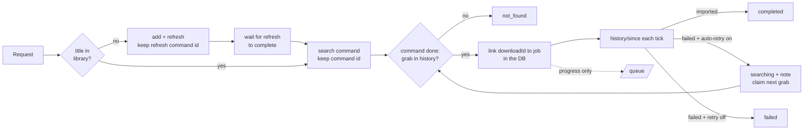
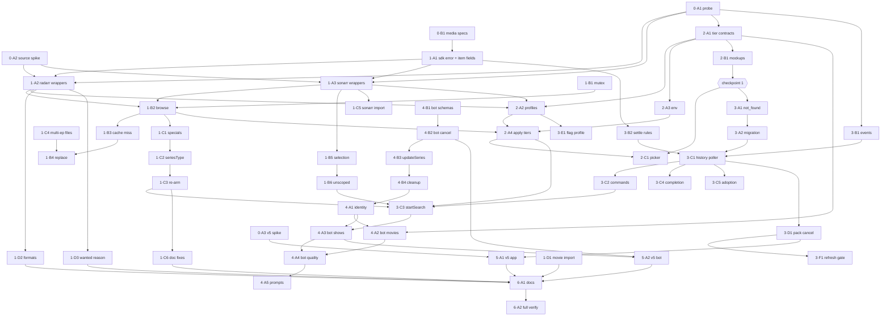
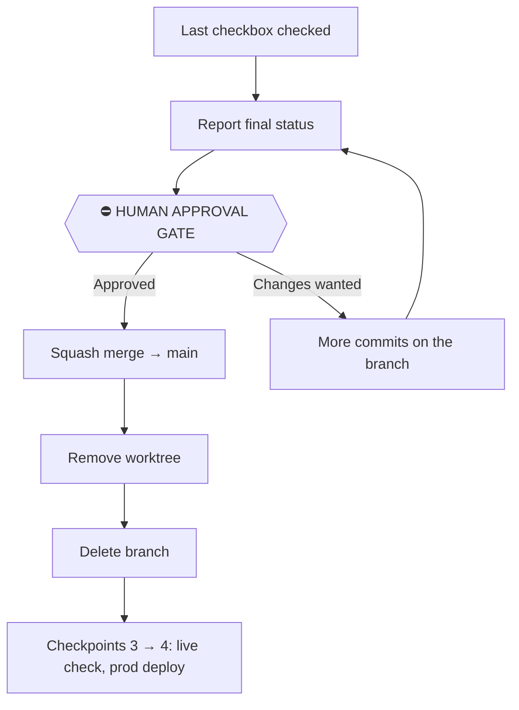

# Work the way Radarr and Sonarr actually work — `apps/download`, `apps/tdr-bot`, `packages/media`

## Overview

> Written for a human first. Everything below this section is written for whoever
> executes the plan. If a claim here needs more, it links to where the detail lives.

A gap analysis on 2026-09-28 (Nexus session "Radar Sonar Integration Gap Analysis",
`8738f4b6`) compared `apps/download`, `apps/tdr-bot` and `packages/media` against the
source of the versions prod runs — **Radarr 6.4.4 and Sonarr 4.0.20**. It found about 60
places where our code assumes something Radarr/Sonarr don't do. The serious ones lose
files, cancel live downloads, leave jobs stuck on "Searching" forever, or grab the wrong
thing. They trace back to seven wrong assumptions:

| #   | We assume                                                   | They actually                                                                 |
| --- | ----------------------------------------------------------- | ----------------------------------------------------------------------------- |
| 1   | A title must be **monitored** to list or grab its releases  | Only require it to be in the library                                          |
| 2   | Missing from **`/queue`** means someone removed it          | Drop items when SABnzbd blips, after a restart, or past SAB's 60-item history |
| 3   | A search command **completing** means something was grabbed | Complete either way; "nothing found" is only in the message text              |
| 4   | **Episodes exist** as soon as a show is added               | Create them in a background refresh with no ordering guarantee                |
| 5   | A **failed** download is final                              | Blocklist it and search again (on in prod)                                    |
| 6   | One Sonarr **queue row** is one download                    | Emit one row per episode; deleting any row deletes the whole pack             |
| 7   | We can **rank releases** ourselves                          | Already rank them (quality first) and return that order                       |

This plan fixes **every finding**. The last one, the cost of the once-a-second queue
refresh, was first deferred to a later plan and then taken on here as 3·F1. It also adds
one feature the fixes called for: a **quality picker** on the movie and show pages.

| Change                                              | In one sentence                                                                                                                                                                                              |
| --------------------------------------------------- | ------------------------------------------------------------------------------------------------------------------------------------------------------------------------------------------------------------ |
| **History is the source of truth**                  | Job outcomes (grabbed, imported, failed, removed) come from Radarr/Sonarr's history and command status, with each job's `downloadId`s stored in the DB — the queue is only used for progress.                |
| **"No release found" is a real outcome**            | A new terminal `not_found` status when a search finishes without grabbing anything, instead of `searching` forever.                                                                                          |
| **Auto-retry is followed, not reported as failure** | When Radarr/Sonarr retry a failed download, the job goes back to `searching` with a note and claims the next grab.                                                                                           |
| **Browsing stops borrowing monitoring**             | Listing releases adds a missing title **unmonitored** and leaves it there — no monitor flip, no delete, no stale-id grabs.                                                                                   |
| **Safer replace, correct imports and deletes**      | Replace grabs first and deletes the old file only after; show manual import lists the right files; a movie imports one file; multi-episode files and season packs are handled as the units they are.         |
| **Quality tiers**                                   | The app manages three Radarr/Sonarr profiles — **Up to 4K · HD (up to 1080p, default) · Up to 720p** — official releases only, no upgrades; the detail pages get a picker.                                   |
| **tdr-bot goes through the download app**           | Bot movie/show requests call the download app's API instead of their own Radarr/Sonarr add logic, so they get every fix above and show up in Activity; the bot's remaining direct calls get their own fixes. |
| **Flags reach Radarr/Sonarr**                       | Flagged-bad releases are mirrored into an app-managed release profile, so Radarr/Sonarr's own RSS and retries can't grab them again.                                                                         |
| **Queue refresh only while something moves**        | `RefreshMonitoredDownloads` is sent only while a queue item is downloading or importing and has changed in the last minute, at most every 5 s (every 1 s while a detail page is open on it).                 |
| **Sonarr v5 readiness + `packages/media` hygiene**  | Code tolerates Sonarr v5's shapes; the OpenAPI specs get committed so the clients can be regenerated; unused `-next` clients go.                                                                             |



**Shape:** one doc, **7 phases (0–6), ~50 tasks**, orchestrated, on branch
`jeremy/arr-gaps` in a Nexus worktree ([setup](#branch-and-worktree)). Lands as one squash
merge after human approval ([Rollout](#rollout)).

**Key decisions** — every one was settled in a live interview; full reasoning in
[Design decisions](#design-decisions):

- **History-based lifecycle rework**, not patches to queue inference — it fixes the root
  of the mass-cancel bug, stuck jobs and failed-while-retrying.
  [Why](#history-is-the-event-log)
- **Browsing keeps the title in Radarr/Sonarr, unmonitored.** Libraries accumulate
  file-less entries nobody asked for; those are invisible to Emby and the app shows
  them as not downloaded. [Why](#browsing-keeps-the-title-unmonitored)
- **Quality: three app-managed tiers, caps not exact matches, no upgrades, default HD.**
  [Why](#quality-tiers)
- **A search that grabs nothing ends as `not_found`** (terminal, Retry offered). The title
  stays monitored so RSS can still find it later — that later grab becomes an adopted
  job. [Why](#no-release-found-is-terminal)
- **Auto-retry reuses `searching` + a note** — no new status for it.
  [Why](#auto-retry-reuses-searching)
- **Cancelling an episode that is part of a season pack leaves the pack running** and
  unmonitors just that episode. [Why](#pack-cancel-keeps-the-pack)
- **tdr-bot requests route through the download app**; the bot parses an optional
  quality ("in 4k") from the message. [Why](#tdr-bot-goes-through-the-download-app)
- **Profiles are synced idempotently at boot** — the first boot of this code, dev or prod,
  writes to **prod** Radarr/Sonarr (the dev container talks to prod). That moment is a
  human checkpoint. [Why](#profiles-are-synced-at-boot)
- **Sonarr v5 hardening is in scope** (code tolerates v5 shapes). **So is the 1 Hz queue
  refresh**, as gating plus throttling (3·F1).
  [Why](#the-queue-refresh-runs-only-while-something-moves)

> **Accepted gaps:** existing titles keep their current profile (281 movies and 77 shows
> are on "Any") until someone requests them again with a tier. A tier applies to a whole
> series, because Sonarr profiles are per series, not per season. Findings that are
> inactive in prod (no import lists, notifications or custom formats are configured)
> are recorded, not fixed — [list](#findings-not-turned-into-tasks).

**Read next:** [Branch and worktree](#branch-and-worktree) to set up ·
[Design decisions](#design-decisions) for the why · [Task List](#task-list) for the work
itself · [Sequencing](#sequencing) for the order and the human checkpoints ·
[Rollout](#rollout) for how it lands · [Final report](#final-report) for what "done"
reports back.

---

## Branch and worktree

**All tasks land on one branch, in one worktree, and never touch the main checkout.**
The main checkout at `/home/jeremy/lilnas` stays on `main` for the duration — it's the
developer's live workspace, other sessions have uncommitted edits there, and the dev
container `lilnas-download-dev` bind-mounts it (`/home/jeremy/lilnas → /source`).

|          | Value                                                       |
| -------- | ----------------------------------------------------------- |
| Branch   | `jeremy/arr-gaps` (mirrors `jeremy/download`, `jeremy/mnm`) |
| Worktree | `/home/jeremy/.nexus-code/worktrees/lilnas/jeremy-arr-gaps` |
| Base     | `main` at `8fd15e1a` or later                               |

**Create it with the Nexus MCP tool `nexus_create_worktree`** (branch `jeremy/arr-gaps`,
base `main`, `enter: true`), not a bare `git worktree add` — a built-in worktree is
invisible to Nexus, so the session's file tree, diff view and terminals keep pointing at
the main checkout.

**Then, before Wave 1, move these into the worktree** — the worktree is a checkout of
_committed_ history, so anything uncommitted in the main checkout is invisible there:

| File (main checkout)                                       | Same path in the worktree                  |
| ---------------------------------------------------------- | ------------------------------------------ |
| `docs/features/download/plans/024-arr-integration-gaps.md` | This doc — the executor checks boxes in it |

Move, don't copy — one file, one live version. Nothing else this plan cites is
uncommitted. **Commit the doc on the branch immediately** (`docs(download): add plan 024
for the Radarr/Sonarr integration gaps`) — until that commit it exists nowhere else, and a
forced worktree removal would take it.

⚠️ **Leave the main checkout's other uncommitted files alone**
(`apps/download/src/components/shell/app-bar.tsx`, `…/ui/doorplate.tsx`,
`…/shell/__tests__/app-bar.spec.tsx`, `docs/features/download/plans/002-live-functional-tests.md`).
They belong to another session.

**Rules while the work is in flight:**

- ❌ Never `git checkout` / `git switch` in the main checkout.
- ❌ Never rebase, force-push, or reset `main`.
- ❌ Never merge, rename, or delete `jeremy/arr-gaps` before the [rollout gate](#rollout)
  clears.
- ✅ Every `/commit` targets the worktree — pass `in:<worktree path>` when the session isn't
  rooted there.
- ✅ **Isolation bonus:** `lilnas-download-dev` does **not** see this branch, so a
  sub-agent's `pnpm db:generate` can't auto-apply a migration to the live dev DB (it did
  in plan 022). The flip side: live checks need the human to point a dev instance at the
  worktree, or to run them right after the merge — see
  [Human checkpoints](#human-checkpoints).

---

## How to work this plan

**Before task 1:** create the branch and worktree, move this doc in, and commit it
([Branch and worktree](#branch-and-worktree)). Once, first.

**Per task:**

1. Work tasks in wave order ([Sequencing](#sequencing)). Never start a task before its
   dependencies are green.
2. Implement → write or update tests → run **only the touched spec files** plus lint and
   type-check for every touched package (commands and the worker cap are in the
   [Context Pack](#repo--conventions)).
3. **`/commit`** with `in:<worktree path>` — one task, one commit (or a small coherent
   set). `/commit` stages at line level, so unrelated edits don't ride along.
4. Check the box and append the commit hash.

**Markers:**

| Marker              | Means                                                          |
| ------------------- | -------------------------------------------------------------- |
| `- [ ]`             | Not started                                                    |
| `- [x]` … `abc1234` | Done, with the commit that did it                              |
| ⚠️ **PARTIAL**      | Landed with scope narrowed — say what was left and why, inline |
| ⏭️ **DROPPED**      | Not doing it — say why. Never delete a task                    |
| 🚧 / ⏳             | Blocked. Do not implement                                      |

**When reality disagrees with this plan,** add a short **Findings** note under the task,
then update the downstream tasks it invalidates. Phase 0 exists to produce exactly those
notes — its findings are pasted into later delegations.

---

## Instructions for the orchestrator agent

You are an **orchestrator**. Your job is delegation, sequencing, and status tracking —
nothing else.

**You are ONE session, and you hold the whole wave.** Sub-agents are spawned **inside**
your session and report back to you. ❌ **Never start one session per task** — sibling
sessions are peers with no reporting relationship, so nobody holds the wave and nobody
catches a task that collides with its sibling or runs past its scope. "Start a session
for the next wave" means **one** session: you.

**Do**

- Before Wave 1, create the branch and worktree yourself, move this doc in and commit it.
  That is setup, not implementation.
- Delegate every task to a sub-agent — implementation, tests and the commit included.
- Write **self-contained** prompts: the task's full text, the relevant
  [Context Pack](#shared-context-pack) sections, the [Definition of Done](#definition-of-done),
  and — for any task that depends on an earlier one — **the names that task reported**
  (exports, file paths, columns, constants) and **the Phase 0 findings it cites**.
- **Serialize `/commit`.** Several sub-agents share one worktree; concurrent commits
  cross-contaminate. Give each sub-agent an explicit go-ahead before it commits, one at a
  time.
- **Serialize heavy commands.** At most one sub-agent runs Jest at a time outside its own
  specs; the full `apps/download` suite runs only in Phase 6, alone.
- Re-delegate a failed task with the failure attached.

**Don't**

- ❌ Read or edit code, tests or config yourself. The only file you edit is this plan.
- ❌ Let sub-agents read this plan.
- ❌ Fix a failing task yourself.
- ❌ Implement anything tagged 🚧 or ⏳.
- ❌ Let a sub-agent continue into the next task. If unbriefed work lands, record it as
  unplanned.
- ❌ Merge, push, rename or delete the branch. The last checkbox is not approval —
  [Rollout](#rollout) is a human gate.
- ❌ Send, or let anyone send, a non-`GET` request to prod Radarr/Sonarr outside a
  [human checkpoint](#human-checkpoints).

**Finish by** verifying every checkbox, then reporting the [final status](#final-report).

---

## Design decisions

### History is the event log

**Chosen:** Radarr/Sonarr **history** (`/api/v3/history/since`) plus **command status**
(`/api/v3/command/{id}`) decide a job's outcome. The job ↔ `downloadId` link is stored in
a new `job_downloads` table. `/queue` is read only for progress, the current state, and
adoption.

**Why:** every "the job says X but it's really Y" bug comes from guessing outcomes from
what's _missing_ from `/queue`:

- `/queue` is rebuilt in memory and drops items when the download client is briefly
  unreachable (Radarr `DownloadMonitoringService.cs:92-103` — `// TODO: Stop tracking
items for the offline client`). It is empty after a Radarr/Sonarr restart and loses
  finished items past SAB's 60-entry history.
- Today that absence becomes `Cancelled` after 5 s (`QUEUE_REMOVAL_CONFIRM_MS`,
  `queue-status.util.ts:305`; `dequeuedOutcome` falls through to `removed`, `:341-362`).
- The job ↔ downloadId link is an in-memory Map on the poller
  (`media-poller.service.ts:217-223`). After a restart every grabbed job settles on a
  60 s grace period.

**Ruled out:** targeted patches — a health gate plus a longer window. That keeps guessing
from absence, keeps the links in memory, and doesn't fix "nothing found" or auto-retry.

**This reverses two earlier decisions on purpose:**

- Plan 016 ruled out persisting a downloadId, because `grabRelease` returns `void`.
  History's `grabbed` event now supplies the id.
- Plan 022 ruled out a `download_id` column for adoption dedupe. `job_downloads`
  replaces `claimedDownloadIds()`.

**What stays:**

- Plan 016's rule: no timer-based failure of an open-ended wait. `not_found` comes from a
  _command result_, not a clock.
- Plan 020's `needs_attention` semantics.
- Plan 022's `cancelling` → poller-settles flow and its `CANCEL_GRACE_MS`.

**Webhooks were considered and not adopted.** Neither app has a download-failed webhook
(Radarr `Notifications/Webhook/WebhookEventType.cs`), so polling can't go away. They'd
only be a faster nudge. **SignalR** as a replacement for the 1 Hz refresh was not taken
up either: 3·F1 gates and throttles the refresh instead
([below](#the-queue-refresh-runs-only-while-something-moves)).

### Browsing keeps the title unmonitored

**Chosen:** listing releases for a title that isn't in the library adds it with
`monitored: false` and the default tier's profile, and **leaves it there**. It never
flips `monitored` on an existing title and never deletes. Only request, grab and replace
turn monitoring on.

**Why:**

- Interactive search and `POST /release` never check `monitored`:
  - Radarr `MonitoredMovieSpecification.cs:59-63`, `AvailabilitySpecification.cs:23-27`,
    `DownloadService.cs:53-139`.
  - Sonarr `MonitoredEpisodeSpecification.cs:26`.
- Keeping the entry removes four bugs at once:
  - the grab that lands on a deleted movie id (Radarr caches the whole `RemoteMovie` for
    30 min, `ReleaseController.cs:108-120,178,185`);
  - the restore that deletes a concurrent real request (`release.service.ts:700-770`);
  - searches that run before translations are saved (`RefreshMovieService.cs:161-163`);
  - Radarr's add/delete notifications on every browse.
- `deriveManagedState` already maps "monitored = false, no file" to `absent`
  (`media-state.util.ts:62-67`), so the UI doesn't change.

**Cost, accepted:** Radarr/Sonarr accumulate file-less, unmonitored entries for
everything anyone browsed.

**Ruled out:** add → delete without the monitor flip, then rebind the grab with
`movieId` + `shouldOverride`. More moving parts, and the stale-cache hazard remains.

### Quality tiers

**Chosen:** the app manages three profiles in each of Radarr and Sonarr, each named with
a `lilnas · ` prefix:

| Tier (`QualityTier`) | Label                | Allowed, best first                                                                            | Default |
| -------------------- | -------------------- | ---------------------------------------------------------------------------------------------- | ------- |
| `up_to_4k`           | **Up to 4K**         | 2160p (Remux → Bluray → WEB-DL → WEBRip → HDTV), then everything in HD                         |         |
| `hd`                 | **HD (up to 1080p)** | 1080p (Remux → … → HDTV), 720p (Bluray → … → HDTV), SD (Bluray-576p/480p, WEB 480p, DVD, SDTV) | ✅      |
| `up_to_720p`         | **Up to 720p**       | 720p, then SD                                                                                  |         |

Rules for every tier:

- **Official releases only.** Never allowed: Unknown, WORKPRINT, CAM, TELESYNC,
  TELECINE, REGIONAL, DVDSCR, DVD-R, BR-DISK, Raw-HD.
- `upgradeAllowed: false`, with the cutoff at the top allowed quality.
- Custom-format scores are 0. Prod has no custom formats.
- Radarr's profile `language` is copied from the existing `HD - 720p/1080p` profile.
  Phase 0 confirms it.

Tiers are **caps, not exact matches**: "Up to 4K" falls back to 1080p when no 4K exists.
The default is set by the `DEFAULT_QUALITY_TIER` env var (default `hd`). Remux is
included because the user asked for "highest quality". If 1080p remuxes (20–40 GB) turn
out too large, dropping them is a one-line change to the tier table.

- **The picker** sits next to Download/Request on the movie and show pages.
  - It preselects the title's current tier when its profile is one of ours, and the
    default otherwise.
  - Requesting writes the chosen tier to the title.
  - On a show it applies to the **whole series**; the picker says so.
- **Manual release picks** (the release picker) ignore tiers. The user chose that
  release.
- **Why managed profiles instead of listing the existing ones:** the existing ones
  include "Any", which allows WORKPRINT/TELESYNC/TELECINE in Radarr. Managed tiers are
  consistent across both apps and tdr-bot.
- **Why no upgrades:** every existing profile has upgrades off, and upgrades would
  re-download titles and fill Activity with adopted-job noise.
- **Why caps:** exact "4K only" produces far more `not_found`.

### No release found is terminal

**Chosen:** a new terminal status `not_found` ("No release found").

- **Set when:** the job's search command completes and no `grabbed` history event for
  the job's scope is dated after the command started. Also set when the flagged-release
  path finds no usable release, and when Radarr's automatic retry search finds nothing.
- **After it's set:** the title stays monitored, so RSS may still grab it later. That
  grab is adopted as an upstream job, as today. Retry is offered.

**Ruled out:** a long-lived "waiting for RSS" state. Jobs would live for months, and
plan 016 already refused timer-based endings.

### Auto-retry reuses searching

Prod has `autoRedownloadFailed` and `autoRedownloadFailedFromInteractiveSearch` **on** in
both apps.

**Chosen:** on a `downloadFailed` event, the job reads the app's
`/config/downloadclient` (cached 10 min). The applicable flag depends on whether the
failed grab came from an interactive pick.

- **Flag on:** the job goes back to `searching`, with `statusNote` "Last download failed:
  <reason>. Radarr is trying another release." It claims the next `grabbed` event for its
  scope. If Radarr's internal re-search completes with nothing grabbed, the job becomes
  `not_found`.
- **Flag off:** the job goes to `failed`.

**Ruled out:** a new `retrying` status. It would touch every exhaustive status map, the
shared client and tdr-bot, only to say what a note already says.

### Pack cancel keeps the pack

**Chosen:** a cancel whose queue item's `downloadId` also covers episodes outside the
job's scope does **not** remove the item. Instead:

- it unmonitors the job's own episodes (fileless only, as today);
- it settles the job `cancelled` with `statusNote` "Part of a season download that is
  still running — this episode may still import".

**Why:** Sonarr resolves any queue row to the whole tracked download and removes it from
SABnzbd (`Sonarr.Api.V3/Queue/QueueController.cs:74-94`).

**Ruled out:**

- Refusing the cancel.
- Removing the pack behind a confirm.

### tdr-bot goes through the download app

**Chosen:** the bot's movie and show _request_ strategies call `DownloadClient.requestMovie`
/ `requestShow` with the Discord identity (`withDiscordIdentity`).

- **A multi-season or multi-episode selection** becomes one request per season or
  episode. Episodes are addressed by `seasonNumber` + `episodeNumber`, which the download
  app resolves after Sonarr has loaded the show.
- **The bot's own add logic is deleted.** Six of the bot bugs vanish with it: the
  bare-TVDB lookup, `addOptions` being ignored, new seasons never searched, the
  unmonitored-movie 400, the availability bypass, and the "first profile" pick.
- **Delete, status and browse keep their direct calls** and get their own fixes (schemas,
  pack-aware cancel, the `warning` status, per-download grouping).
- **Quality:** the intent prompt extracts an optional quality ("in 4k" → `up_to_4k`,
  "1080p" → `hd`, "720p" → `up_to_720p`); otherwise the default tier.

**Why:** two request implementations drifted, and the bot's copy had most of the bugs.
Bot requests also become visible in Activity.

**Ruled out:** fixing the bot in place.

**Deploy note:** the two apps must deploy together. The shared `DownloadJobSchema` gains
`not_found`, and an old bot would reject it through `z.enum`.

### Profiles are synced at boot

**Chosen:** an `OnApplicationBootstrap` provider in `apps/download` ensures the three tier
profiles and the flagged-release profile exist in both apps. It is idempotent:

- matched by name;
- recreated if deleted;
- updated if the allowed set, order, cutoff or `upgradeAllowed` drifted;
- never touches any other profile.

A failure is logged and retried lazily the first time a tier is needed.

⚠️ **The dev container uses prod Radarr/Sonarr** (`apps/download/.env.dev-remote` →
`http://radarr:7878`, `http://sonarr:8989`). The first boot of this code anywhere
creates the profiles in prod — a [human checkpoint](#human-checkpoints).

**Ruled out:** hand-creating the profiles from a spec. They'd drift, with nothing to
notice.

### The queue refresh runs only while something moves

**Added after session 3 (2026-09-28), as 3·F1.** First deferred to a later plan, then
taken on here once the poller rework (3·C1–3·D1) had landed.

Before 3·F1, the poller sent `RefreshMonitoredDownloads` to both apps every second while
any job was tracked or the previous queue had anything in it. Radarr's source says what
each one costs:

- **A SABnzbd read.** The client's full queue plus its last 60 history items. With both
  apps, that's about 4 SABnzbd API calls a second.
- **Two command rows.** Radarr/Sonarr only merge a command into one still queued or
  running, and ours finish in about 20 ms, so each refresh inserts a row and queues a
  `ProcessMonitoredDownloads` row. Rows are kept for a day.
- **A retry of every pending import.** Each `ImportPending` item gets a folder scan and
  an ffprobe per video file.

In prod, one 2160p movie grab on 2026-09-28 drove about 430 refreshes in 7 minutes. That
was bounded, but nothing bounded a stuck item: an `importBlocked` or stalled download
nobody clears kept the check true forever, at up to about 172,800 rows a day per app.

**The rule** (`isQueueItemMoving` in `queue-status.util.ts`, applied in
`requestQueueRefresh`):

| Item in the previous tick's queue                                                                          | Refresh?                                                          |
| ---------------------------------------------------------------------------------------------------------- | ----------------------------------------------------------------- |
| `trackedDownloadState: 'importing'`                                                                        | Yes, however long the import runs                                 |
| Reads as Downloading or Importing, and its `sizeleft` or tracked state changed within `STALL_MS` (60 s)    | Yes. A newly seen item counts as changed.                         |
| Reads as Downloading or Importing, unchanged for `STALL_MS`                                                | No: a stalled transfer, or an import Radarr/Sonarr keep rejecting |
| Failed at the client, held (`delay`, `downloadClientUnavailable`), `importBlocked`, NeedsAttention, Paused | No                                                                |

- **A tracked job alone no longer triggers a refresh.** Radarr/Sonarr refresh on their
  own 5 s after a grab or an import (`DownloadMonitoringService.cs:167-180`), and history
  settles outcomes.
- **The rate is capped.** `QUEUE_REFRESH_MS` (5 s, the same pace as `HISTORY_POLL_MS`)
  normally. `WATCHED_QUEUE_REFRESH_MS` (1 s) while a moving item's title has a detail page
  open (`DownloadGateway.watchedMediaIds()`), because that's the only place anyone watches
  the number tick. Each source keeps its own pace.
- **The poll itself stays at 1 s.** Reading `/queue` is cheap because Radarr/Sonarr build
  it in memory. Only the refresh command is gated.
- **What it gives up:** Activity progress updates every 5 s instead of every second. And
  a download waiting behind another in SABnzbd's own queue counts as stalled until it
  starts, so if nothing else is moving, noticing that it started can take up to
  Radarr's/Sonarr's own once-a-minute refresh.

### Out of scope

- **Retroactively moving existing titles off "Any".** Only new requests write a tier.

### Findings not turned into tasks

| Finding                                                             | Why no task                                                                                                                       |
| ------------------------------------------------------------------- | --------------------------------------------------------------------------------------------------------------------------------- |
| Deletes never add an import-list exclusion                          | Prod has **no import lists** (checked 2026-09-28)                                                                                 |
| Radarr "Movie Added"/"Movie Deleted" notifications on browse        | Prod has **no notifications**; browsing no longer deletes anyway                                                                  |
| Radarr webhook "Movie Added" throws on bot adds (null `AddOptions`) | No notifications; bot no longer adds                                                                                              |
| TMDB id merges orphan `tmdb:X` keys                                 | Speculative — no evidence, no reproduction                                                                                        |
| `AutoUnmonitorPreviouslyDownloaded*` interactions                   | Setting is **off** in both apps; replace re-monitors after the delete anyway ([Phase 1 · B4](#phase-1--download-app-correctness)) |
| Ranking by custom-format score                                      | Prod has **no custom formats**; selection keeps upstream order ([Phase 1 · B5](#phase-1--download-app-correctness))               |

### Things that already exist — don't rebuild them

- **Every SDK function the rework needs** is already generated in both
  `packages/media/src/{radarr,sonarr}/sdk.gen.ts`: `getApiV3HistorySince`,
  `getApiV3History` (with `downloadId`), `getApiV3CommandById`, `getApiV3Command`,
  `getApiV3Health`, `getApiV3ConfigDownloadclient`, `deleteApiV3QueueBulk`,
  `get/post/putApiV3Qualityprofile*`, `getApiV3QualityprofileSchema`,
  `get/post/putApiV3Releaseprofile*`.
- **Adoption** (`adoption.util.ts` `planAdoptions` :73-138, poller `adopt()` :649-692,
  origin `'upstream'` via `db/job-row.ts`). Keep it and change only its ownership source.
- **`cancelling` settle** (`settleCancelling`, `queue-status.util.ts:448-463`) and
  `CANCEL_GRACE_MS`.
- **Discord attribution over HTTP** — `DownloadClient.withDiscordIdentity`
  (`packages/utils/src/download/client.ts:~210`) and the controller's
  `@OptionalDiscordUser()` on `POST /movies` / `/shows`.
- **`withDownloadLinks`** in `apps/tdr-bot/src/utils/download-links.ts:56`, which builds
  bot reply links from a `Media`.
- **Episode `episodeFileId` on the wire** (`EpisodeSchema`,
  `packages/utils/src/download/schema.ts:1012`). The frontend can find multi-episode
  siblings without a new API.

### What stays untouched

- The `bad_files` table's shape. Mirroring reads it; it doesn't change it.
- `JOB_ORIGINS` (shared with `audit_log`) — see plan 022's gotcha.
- The main checkout's uncommitted files ([above](#branch-and-worktree)).

---

## Shared Context Pack

> Copy the relevant parts into every sub-agent prompt. These are pointers, **verified at
> `8fd15e1a` (2026-09-28)** — a plan ages; the code is the truth.

### Repo & conventions

- **Workspace:** pnpm workspaces + Turbo. `@lilnas/download` is at `apps/download`
  (NestJS backend + Next.js frontend), `@lilnas/tdr-bot` at `apps/tdr-bot`, and the shared
  wire types are `@lilnas/utils` at `packages/utils`:
  - `src/download/schema.ts` — zod
  - `src/download/types.ts` — inferred types plus the terminal/in-progress sets
  - `src/download/client.ts` — `DownloadClient`
- **Generated SDKs:** `@lilnas/media/radarr` and `@lilnas/media/sonarr`.
- **Jest — ⚠️ own specs only, capped.** This host _is_ prod (32 cores); uncapped
  parallel suites nearly OOM'd it on 2026-09-24. From the package directory run
  `pnpm exec jest <spec paths> --maxWorkers=2`, not `pnpm test -- … --maxWorkers` (Jest
  reads that as a path pattern). The full `apps/download` suite runs once, alone, in
  Phase 6, with `--maxWorkers=4`.
- **Lint / type-check:** from the package dir, `pnpm lint` (eslint **and** prettier —
  `pnpm lint:fix` fixes both) and `pnpm type-check`.
  - `apps/download` type-checks against `packages/utils/dist`, so run `pnpm build` in
    `packages/utils` after changing it.
  - `apps/tdr-bot` resolves `@lilnas/media` through `dist`, so run `pnpm build` in
    `packages/media` after regenerating it.
- ❌ **Never run `pnpm build` in `apps/download` or at the repo root.**
- **Tests** live in `__tests__/` next to the code. In `apps/download` there are two Jest
  projects: `node` (`*.ts`) and `jsdom` (`*.tsx`, setup in `src/__tests__/setup-dom.ts`).
  Anything importing `DownloadStateService` or the controller needs
  `jest.mock('nanoid', …)` before its imports (`media-poller.service.test.ts:1-8`).
- **Migrations:** Drizzle on SQLite, in `apps/download/src/db/migrations/`. The latest
  is `0006_careful_quasar.sql`, so **the next is `0007`**. Generate with `pnpm
db:generate`, read the generated SQL, and add `db/__tests__/migrate-0007.spec.ts`.
  **Only Phase 3 · A2 runs `db:generate`.**
- **Env:** `apps/download/src/env.ts` is a plain `EnvKeys` map, read with
  `env(EnvKeys.X, default)` from `@lilnas/utils/env` (it throws when unset with no
  default). New keys also go in `apps/download/.env.example`. tdr-bot works the same way
  (`apps/tdr-bot/src/env.ts`, `apps/tdr-bot/.env.example`).
- **SDK call pattern:**
  - Call as `fn({ client: this.client, path?, query?, body? })`, then wrap in
    `unwrapSdkResult(res, 'ctx')` or `checkSdkError(res, 'ctx')`
    (`apps/download/src/media/sdk-result.util.ts`).
  - Command bodies are typed locally as `CommandResourceWritable & {…}`.
  - Tests `jest.mock('@lilnas/media/radarr', () => ({ … }))` at the SDK-function level.
- **DI:** ❌ **Do not inject a new provider into `DownloadController`,
  `MediaDownloadService` or `MediaPollerService`** — every testing module that builds
  them would break. Put new upstream capabilities on `RadarrService` / `SonarrService`,
  which are already injected. A new provider that nothing injects, such as the boot
  sync, is fine.
- **Style:**
  - Commits: `fix(download): …`, `feat(download): …`, `fix(tdr-bot): …`,
    `chore(media): …`, `feat(utils): …`, `docs(download): …` — imperative, lower-case, no
    period, and a body that explains the why. End with the `Co-Authored-By` trailer your
    session's attribution instructions give.
  - Backend comments use `-`; frontend comments use `—`. Match the file you're in.
  - Use `cns()` for class lists. No `any`.
- **Mockups:** `docs/features/download/designs/src/pages/*.pug` +
  `src/data/*.mjs`; build with `pnpm mockups` **from the repo root**. The generated
  `designs/*.html` are committed and never hand-edited.
- **Upstream source**, for reading:
  - Radarr `/tmp/sonarr-radarr-analysis/radarr` (≈6.4.4)
  - Sonarr v4 `/tmp/sonarr-radarr-analysis/sonarr-v4`
  - Sonarr v5 `/tmp/sonarr-radarr-analysis/sonarr` (`v5-develop`)

  `/tmp` may have been cleaned. If so, re-clone with `git clone --depth 1` —
  `Radarr/Radarr` `develop`, `Sonarr/Sonarr` `main` (v4) and `v5-develop`.

### Layout — `apps/download` (paths under `apps/download/src/`)

| File                                                                                                          | What matters in it                                                                                                                                                                                                                                                                                                                                                                                                                                                                                                                                                                                                                                                                                                                                                                                                              |
| ------------------------------------------------------------------------------------------------------------- | ------------------------------------------------------------------------------------------------------------------------------------------------------------------------------------------------------------------------------------------------------------------------------------------------------------------------------------------------------------------------------------------------------------------------------------------------------------------------------------------------------------------------------------------------------------------------------------------------------------------------------------------------------------------------------------------------------------------------------------------------------------------------------------------------------------------------------- |
| `media/radarr.service.ts`                                                                                     | `ensureMovie` :375-450 (lib scan, add `monitored:true`), `setMonitored` :458-461 → `putMonitored` :495-511 (GET + full PUT), `getReleases` :522-532, `grabRelease` :541-549, `getMovieHistory` :600, `requestMovie` :620-635 (**dead**), `triggerSearch` :643-653 (command id discarded), `refreshMonitoredDownloads` :666, `getQueue` :682-696 (`pageSize:1000`, no unknown items), `getManualImportCandidates` :723-738, `commitManualImport` :761-776, `removeQueueItem` :794, `unmonitorAndDelete` :815-850, `getDefaultConfiguration` :852-878 (`profiles[0]`)                                                                                                                                                                                                                                                             |
| `media/sonarr.service.ts`                                                                                     | `toRelease` :193-200, `toSeason` doc :382-391, `lookupByTvdbId` :475-490, `ensureSeries` :510-621 (add :570-606, `seriesType:'standard'` :590, `addOptions` :581-602), `monitorScopedEpisodes` :629-651 (empty scope ⇒ includes season 0), `setSeriesMonitored` :728-744, `setSeasonsMonitored` :761-818 (`'all'` includes 0), `setEpisodesMonitored` :845-860, `getReleases` :871-890 (unscoped ⇒ RSS), `grabRelease` :896-904, `getSeriesHistory` :952, `requestShow` :987-1002 (**dead**), `triggerSearch`/`Episode`/`Season` :1010/:1027/:1043, `refreshMonitoredDownloads` :1153, `getQueue` :1169-1184, `unmonitorAndDelete` :1192-1227, `getManualImportCandidates` :1250-1267 (sends `seriesId`), `commitManualImport` :1285-1300, `removeQueueItem` :1315-1328, `getDefaultConfiguration` :1330-1358 (`'any'` by name) |
| `media/release.service.ts`                                                                                    | `grabRelease` :360-375, `replaceRelease` :392-424, `runGrab` :436-482, `deleteExistingFiles` :519-551, flag CRUD :563-626, `assertNotFlagged` :633-641, `annotateFlagged` :648-662, `withMonitoring` :700-770 (the borrow), `restore` :778-796, `listReleases` :214-243                                                                                                                                                                                                                                                                                                                                                                                                                                                                                                                                                         |
| `media/media-download.service.ts`                                                                             | `requestMovie` :101-138, `requestShow` :155-220 (`setSeasonsMonitored('all')` :182-189), `triggerScopedSearch` :228-245, `flaggedGuids` :252-258, `pickUnflaggedRelease` :270-296, `request()` :339-460 (submit, then `Searching`; catch → `Failed` :432-458), `cancelJob` :543-603, `cancelAfterSubmit` :616-631, `cancelUpstream` :663-699, `removeQueueItems` :707-746                                                                                                                                                                                                                                                                                                                                                                                                                                                       |
| `media/media-poller.service.ts`                                                                               | `TERMINAL_STATUSES` :58-62, `downloadIds` Map :217-223, `poll()` :246-290 (`@Cron('*/1 * * * * *')`, no overlap guard), `pollMovies` :297-332, `pollShows` :344-379, `rememberDownloads` :382-393, `removeLateGrab` :406-463, `adoptUnownedDownloads` :491-539, `adopt` :649-692, `claimedDownloadIds` :726-733, `settleAbsentJobs` :755-842, `forgetUntrackedJobs` :867-880, `requestQueueRefresh` :900-916 (**reworked in 3·F1**), `trackedJobs` :1200-1231, `fetchCompletionData` :1262-1368, `dequeuedOutcomes` :1310-1353, `applyUpdate` :1371-1429, `writeStatus` :1439-1474, `settledError` :1486-1508                                                                                                                                                                                                                   |
| `media/queue-status.util.ts`                                                                                  | `PollableQueueItem` :17-53 (no `errorMessage`), `IMPORTING_TRACKED_STATES` :57, `ATTENTION_TRACKED_STATES` :66, `STATUS_PRECEDENCE` :113-118, `aggregateQueueItems` :144-184 (sums sizes :176-177), `describeQueueItemError` :186-194, `deriveStatusFromQueueItem` :227-271, grace constants :282-315, `DequeuedOutcome` :329-332, `MANUALLY_FAILED_MESSAGE` :335, `dequeuedOutcome` :341-362, `GRABBED_STATUSES` :367-371, `WAITING_STATUSES` :375-379, `settleWithoutQueueItem` :414-445, `settleCancelling` :448-463, `matchesScope` :475-489                                                                                                                                                                                                                                                                                |
| `media/adoption.util.ts`                                                                                      | `planAdoptions` :73-138, `scopeOf` :146-166, `isAdoptable` :179-192                                                                                                                                                                                                                                                                                                                                                                                                                                                                                                                                                                                                                                                                                                                                                             |
| `media/job-completion.util.ts`                                                                                | `didJobComplete` :155-199 (unscoped ⇒ any file after `createdAt`, :170-172)                                                                                                                                                                                                                                                                                                                                                                                                                                                                                                                                                                                                                                                                                                                                                     |
| `media/release-history.util.ts`                                                                               | `HistoryRecordLike` :12-25 (no `id`), `historyValue` :67-85, `mapFilesToReleases` :180-242, wrong upgrade comment :213-215                                                                                                                                                                                                                                                                                                                                                                                                                                                                                                                                                                                                                                                                                                      |
| `media/release-selection.util.ts`                                                                             | `compareReleases` :22-34, `pickBestRelease` :47-63                                                                                                                                                                                                                                                                                                                                                                                                                                                                                                                                                                                                                                                                                                                                                                              |
| `media/release-mapper.util.ts`                                                                                | `toCommonRelease` :81-109                                                                                                                                                                                                                                                                                                                                                                                                                                                                                                                                                                                                                                                                                                                                                                                                       |
| `media/manual-import.service.ts`                                                                              | `importFiles` :219-312, Radarr collect :414-418, Sonarr collect :443-448                                                                                                                                                                                                                                                                                                                                                                                                                                                                                                                                                                                                                                                                                                                                                        |
| `media/manual-import-mapper.util.ts`                                                                          | `toMovieCandidate` :139-154 (always importable), `toShowCandidate` :168-213 (episode fallback :198-210)                                                                                                                                                                                                                                                                                                                                                                                                                                                                                                                                                                                                                                                                                                                         |
| `media/delete-cascade.util.ts`                                                                                | `uniqueFileIds` :64-74, `isRemaining` :108-114, `planShowDelete` episode branch :222-241                                                                                                                                                                                                                                                                                                                                                                                                                                                                                                                                                                                                                                                                                                                                        |
| `media/episode-files.util.ts`                                                                                 | `resolveEpisodeFileIds` :32-60                                                                                                                                                                                                                                                                                                                                                                                                                                                                                                                                                                                                                                                                                                                                                                                                  |
| `media/show.service.ts`                                                                                       | `deleteShowFiles` :339-400                                                                                                                                                                                                                                                                                                                                                                                                                                                                                                                                                                                                                                                                                                                                                                                                      |
| `media/media-state.util.ts`                                                                                   | `deriveManagedState` :62-67 (doc :49-52), `VIDEO_JOB_STATE` :102                                                                                                                                                                                                                                                                                                                                                                                                                                                                                                                                                                                                                                                                                                                                                                |
| `media/movie-metadata.util.ts`                                                                                | `customFormats` mapping :174-180                                                                                                                                                                                                                                                                                                                                                                                                                                                                                                                                                                                                                                                                                                                                                                                                |
| `media/sdk-result.util.ts`                                                                                    | `describeSdkError` :13-23, `checkSdkError` :29-33, `unwrapSdkResult` :39-47 (status never read)                                                                                                                                                                                                                                                                                                                                                                                                                                                                                                                                                                                                                                                                                                                                 |
| `media/clients.ts`                                                                                            | `RADARR_CLIENT` / `SONARR_CLIENT` factories                                                                                                                                                                                                                                                                                                                                                                                                                                                                                                                                                                                                                                                                                                                                                                                     |
| `components/detail/import-dialog.tsx`                                                                         | pre-check all :364-374, `toggle` :386-400, `commit` :402-431                                                                                                                                                                                                                                                                                                                                                                                                                                                                                                                                                                                                                                                                                                                                                                    |
| `components/detail/movie-request-button.tsx`, `show-request-button.tsx`                                       | `MovieRequestAction` (:21), `MOVIE_REQUEST_LABEL` (:26) — where the picker goes                                                                                                                                                                                                                                                                                                                                                                                                                                                                                                                                                                                                                                                                                                                                                 |
| `components/detail/movie-facts.tsx`                                                                           | `Formats` fact :174                                                                                                                                                                                                                                                                                                                                                                                                                                                                                                                                                                                                                                                                                                                                                                                                             |
| `components/detail/show-state.ts`                                                                             | episode totals :90-106                                                                                                                                                                                                                                                                                                                                                                                                                                                                                                                                                                                                                                                                                                                                                                                                          |
| `components/detail/job-state.ts`                                                                              | `jobActionState` :72-110, `JOB_STATUS_LABELS` :126                                                                                                                                                                                                                                                                                                                                                                                                                                                                                                                                                                                                                                                                                                                                                                              |
| `components/detail/delete-confirm.tsx`                                                                        | the episode-delete confirmation                                                                                                                                                                                                                                                                                                                                                                                                                                                                                                                                                                                                                                                                                                                                                                                                 |
| `lib/format.ts` :299 `STATUS_TONES` · `lib/profile-filters.ts` :79 `STATUS_RANK` · `lib/admin-filters.ts` :95 | exhaustive status maps                                                                                                                                                                                                                                                                                                                                                                                                                                                                                                                                                                                                                                                                                                                                                                                                          |
| `app/movies/[tmdbId]/page.tsx`, `app/shows/[tvdbId]/page.tsx`                                                 | inline request server actions; release actions wired :247 / :246                                                                                                                                                                                                                                                                                                                                                                                                                                                                                                                                                                                                                                                                                                                                                                |
| `app/actions/media-files.ts`                                                                                  | `searchReleases` :164-186, `grabRelease` :200-234, `replaceRelease` :247-278                                                                                                                                                                                                                                                                                                                                                                                                                                                                                                                                                                                                                                                                                                                                                    |
| `download/download.controller.ts`                                                                             | `GET /media/:id/releases` :841, grab :1071, replace :1098, imports :1141-1252, `POST /movies` :1747, `POST /shows` :1885, cancels :1842/:1989                                                                                                                                                                                                                                                                                                                                                                                                                                                                                                                                                                                                                                                                                   |
| `download/download-state.service.ts`                                                                          | `adoptOpenJobs` :358-376 (open movie/show jobs survive restart)                                                                                                                                                                                                                                                                                                                                                                                                                                                                                                                                                                                                                                                                                                                                                                 |
| `db/schema.ts`                                                                                                | `DOWNLOAD_JOB_STATUSES` :43-65 + `statusPin` :112, `jobs` :117-272 (`status` has no CHECK), `bad_files` :319-375 (`releaseTitle` optional), `media_file_releases` :517-597                                                                                                                                                                                                                                                                                                                                                                                                                                                                                                                                                                                                                                                      |
| `db/job-row.ts`                                                                                               | `buildJobRow` / `hydrateJobRow` — the only record↔row crossing                                                                                                                                                                                                                                                                                                                                                                                                                                                                                                                                                                                                                                                                                                                                                                 |
| `scripts/verify/mutate.ts`                                                                                    | `ALWAYS_REACHABLE`, `MEDIA_TRANSITIONS`, `legalSuccessors` — must learn `not_found`                                                                                                                                                                                                                                                                                                                                                                                                                                                                                                                                                                                                                                                                                                                                             |
| `docs/features/download/backend.md`                                                                           | "Monitoring is borrowed" and "Enforcement is app-side only" (~:280-380) become wrong                                                                                                                                                                                                                                                                                                                                                                                                                                                                                                                                                                                                                                                                                                                                            |

### Layout — `packages/utils/src/download/`

| File        | What matters                                                                                                                                                                                                                                                                                                                                                                        |
| ----------- | ----------------------------------------------------------------------------------------------------------------------------------------------------------------------------------------------------------------------------------------------------------------------------------------------------------------------------------------------------------------------------------- |
| `schema.ts` | `DownloadJobStatus` :9-58; `RequestMovieInputSchema` :219; `RequestShowInputSchema` :235 (`{ episodeId?, seasonNumber?, tvdbId }`); `DownloadJobSchema` ~:620-657; `ReleaseSchema` :879-909 (no `releaseWeight`/`mapped*`); `GrabReleaseInputSchema` :931-936; `EpisodeSchema` :985 (`episodeFileId` :1012); `SeasonSchema` docs :1044-1059; `ShowSchema.episodeCount` doc :549-554 |
| `types.ts`  | `TERMINAL_DOWNLOAD_JOB_STATUSES` :88-92, `IN_PROGRESS_…` :102-104 (derived)                                                                                                                                                                                                                                                                                                         |
| `client.ts` | `withDiscordIdentity` ~:210, `waitForJob` :291 (terminal set), `requestMovie` :889, `requestShow` :932                                                                                                                                                                                                                                                                              |

### Layout — `apps/tdr-bot/src/` (live code paths, confirmed)

| File                                                                                                        | What matters                                                                                                                                                                                                                                                                                                                                                                                                                                                                                                                                                                                                                                                                                             |
| ----------------------------------------------------------------------------------------------------------- | -------------------------------------------------------------------------------------------------------------------------------------------------------------------------------------------------------------------------------------------------------------------------------------------------------------------------------------------------------------------------------------------------------------------------------------------------------------------------------------------------------------------------------------------------------------------------------------------------------------------------------------------------------------------------------------------------------- |
| `media/services/radarr.service.ts`                                                                          | `getDownloadingMovies` :144-151 (excludes `warning`), `monitorAndDownloadMovie` :203 (unmonitored → POST 400 :253-256; add body :304-325), `unmonitorAndDeleteMovie` :423 (whole-library parse :436), `isMovieInLibrary` :659-671, `triggerMovieSearch` :673-689, `getMovieConfiguration` :691-754                                                                                                                                                                                                                                                                                                                                                                                                       |
| `media/services/sonarr.service.ts`                                                                          | `getDownloadingEpisodes` :143-204, `monitorAndDownloadSeries` :209 (bare tvdb :242), `getSeriesByTvdbId` :519-531, `updateSeries` :556-587 (strips `monitorNewItems`), `getEpisodeById` :609-630 (**dead**), `getQueue` :664, `removeQueueItem` :673-686, `deleteSeries` :688-705, `getSeriesConfiguration` :721-771, `addNewSeries` :773 (top-level flags :795-815, search :846), `updateExistingSeriesMonitoring` :859 (season 0 :879-891; no season flag :922-936), `applyEpisodeMonitoring` :949-1033, `getEpisodesWithRetry` :1035-1075, `cancelDownloadsForSeries` :1158-1229, `cancelDownloadsForEpisodes` :1231-1312, `checkIfSeriesShouldBeDeleted` :1735-1820 (needless backoff), rating :1945 |
| `media/schemas/radarr.schemas.ts`                                                                           | `audioChannels` :97, width/height :29-30, :100-101                                                                                                                                                                                                                                                                                                                                                                                                                                                                                                                                                                                                                                                       |
| `media/schemas/sonarr.schemas.ts`                                                                           | ratings :32-61, `SonarrSeriesSchema` :169-217, `episodeNumber.positive()` :377, :393, :416, :425, :485, :505, :538, :622, :646                                                                                                                                                                                                                                                                                                                                                                                                                                                                                                                                                                           |
| `media/schemas/media.schemas.ts`                                                                            | dead `QualityProfileSchema` etc :62-103                                                                                                                                                                                                                                                                                                                                                                                                                                                                                                                                                                                                                                                                  |
| `media/types/radarr.types.ts` :92-99, `media/types/sonarr.types.ts` :31, :47-54, :59-80, :347-371           | image enums, monitor enum, ratings, `AddSeriesRequest`                                                                                                                                                                                                                                                                                                                                                                                                                                                                                                                                                                                                                                                   |
| `media/utils/radarr.utils.ts` :69-78, `media/utils/sonarr.utils.ts` :55-57, :91-123, :152-168, :202-232     | parse-everything helpers, ratings average, monitoring strategy                                                                                                                                                                                                                                                                                                                                                                                                                                                                                                                                                                                                                                           |
| `media-operations/request-handling/strategies/movie-download.strategy.ts`                                   | `monitorAndDownloadMovie` calls :180-183, :400-402                                                                                                                                                                                                                                                                                                                                                                                                                                                                                                                                                                                                                                                       |
| `media-operations/request-handling/strategies/tv-download.strategy.ts`                                      | `monitorAndDownloadSeries` calls :186, :312, :632                                                                                                                                                                                                                                                                                                                                                                                                                                                                                                                                                                                                                                                        |
| `media-operations/request-handling/strategies/{movie,tv}-delete.strategy.ts`, `download-status.strategy.ts` | stay on direct calls                                                                                                                                                                                                                                                                                                                                                                                                                                                                                                                                                                                                                                                                                     |
| `media-operations/request-handling/types/request-context.type.ts`                                           | `StrategyRequestParams` :6 (`userId` only — no Discord username)                                                                                                                                                                                                                                                                                                                                                                                                                                                                                                                                                                                                                                         |
| `media-operations/request-handling/media-request-handler.service.ts`                                        | builds strategy params (`userId` at :69, :182, …); `GET_MEDIA_TYPE_PROMPT` invoked :346                                                                                                                                                                                                                                                                                                                                                                                                                                                                                                                                                                                                                  |
| `utils/prompts.ts`                                                                                          | **live** `GET_MEDIA_TYPE_PROMPT` :69 (genre/actor examples :96-105), `EXTRACT_SEARCH_QUERY_PROMPT` :173-188, "Confirm successful … download" :211, :403                                                                                                                                                                                                                                                                                                                                                                                                                                                                                                                                                  |
| `message-handler/services/prompts/prompt.constants.ts`                                                      | **live** response-context prompts (:190, :204, :379, :392); its other constants are dead duplicates                                                                                                                                                                                                                                                                                                                                                                                                                                                                                                                                                                                                      |
| `message-handler/services/prompts/prompt-generation.service.ts`                                             | "Search will start automatically" :106, :424; "permanently removed" :557                                                                                                                                                                                                                                                                                                                                                                                                                                                                                                                                                                                                                                 |
| `message-handler/services/media/*`                                                                          | **dead** module (no importer)                                                                                                                                                                                                                                                                                                                                                                                                                                                                                                                                                                                                                                                                            |
| `commands/download-command.service.ts` :73                                                                  | how the bot already builds a `DownloadClient` (`DOWNLOAD_API_URL`)                                                                                                                                                                                                                                                                                                                                                                                                                                                                                                                                                                                                                                       |
| `utils/download-links.ts` :56                                                                               | `withDownloadLinks`                                                                                                                                                                                                                                                                                                                                                                                                                                                                                                                                                                                                                                                                                      |

Tests: `media/services/__tests__/{radarr,sonarr}.service{,.characterization,.integration}.test.ts`,
`media/schemas/__tests__/schemas.test.ts`, `media/utils/__tests__/*`,
`media-operations/request-handling/strategies/__tests__/` (helpers in `__test-helpers__/mock-services.ts`).
Run one file from `apps/tdr-bot`: `pnpm exec jest <path> --maxWorkers=2`.

### Layout — `packages/media`

- `openapi-ts.config.ts` reads `./apis/radarr.json` and `./apis/sonarr.json`. **That
  directory was never committed.**
- Its outputs are `src/{radarr,sonarr}` (client-fetch) and `src/{radarr,sonarr}-next`
  (client-next, **unused anywhere**).
- `package.json` exports `./radarr-next/client` but **not** `./sonarr-next/client`.
- Scripts: `generate` (`openapi-ts`), `build` (`tsc -p .`).

### Prod facts (read-only, 2026-09-28)

- **Download client:** SABnzbd only, in both apps. `autoRedownloadFailed` and
  `…FromInteractiveSearch` are **on**. No recycle bin. Auto-unmonitor-on-delete is
  **off**.
- **Radarr quality profiles:** `Any` (id 1, 281 movies; allows WORKPRINT, TELESYNC,
  TELECINE…), `SD`, `HD-720p`, `HD-1080p` (10), `Ultra-HD` (1), `HD - 720p/1080p`,
  `Ultra-HD - Original Language` (1). Every profile has upgrades off.
- **Sonarr quality profiles:** `Any` (77 shows), `SD`, `HD-720p`, `HD-1080p`, `Ultra-HD`,
  `HD - 720p/1080p`. Series types: 76 `standard`, 1 `anime`. Every show has
  `monitorNewItems: all`.
- **Not configured, in either app:** import lists, notifications, release profiles,
  custom formats.
- **Dev container:** `lilnas-download-dev` (`.env.dev-remote`) talks to the **same prod**
  Radarr/Sonarr.

### Patterns to imitate

- **A pure settle rule with a table test:** `settleWithoutQueueItem` and its `it.each` in
  `media/__tests__/queue-status.util.test.ts`.
- **A poller test:**
  - `media/__tests__/media-poller.service.test.ts` uses the real `MediaPollerService` and
    a test DB (`db/__tests__/test-utils.ts` `createTestDbService()`).
  - Services are `jest.fn()` objects.
  - The clock is driven with `jest.spyOn(Date, 'now')` via `at(ms)`, and ticks with
    `service.poll()`.
- **SDK-mock service tests:** the `describe('setMonitored')` block in
  `media/__tests__/radarr.service.test.ts`.
- **A migration and repo:** `db/migrations/0005_*.sql` +
  `db/__tests__/migrate-0005.spec.ts`; `db/bad-files.repo.ts` +
  `db/__tests__/jobs.repo.spec.ts`.
- **A route on the controller:** `requestMovie` at `download.controller.ts:1747-1800`.
- **A mockup task:** plan 022 · B1 (`022-cancel-media-downloads.md`, "Group B — Mockups").
- **A `backend.md` section:** `## Jobs are attempts (plan 021 · Phase 3)`.

### Gotchas

- **Season 0 is real.** Always test `!= null`, never truthiness (`matchesScope`,
  `unmonitorScope`).
- **`updateJob` is an unconditional merge** with no compare-and-set, and it throws for an
  id not in the Map. Check-then-write pairs are only safe when nothing is `await`ed
  between them. The poller cron has no overlap guard, so ticks can overlap.
- **History ingestion must be idempotent.**
  - `job_downloads` has primary key `(job_id, download_id)`.
  - The cursor advances only _after_ a batch is fully applied.
  - Two overlapping ticks can see the same events.
- **History `eventType` on the wire.** The SDK's `eventType` union is not positional for
  Radarr (it skips value 2), and the existing wrappers match event types as strings.
  Phase 0 · A1 records the exact wire form for `/history/since`. Normalize in one place
  (Phase 3 · B1).
- **`PUT /movie/{id}` with the full resource** runs path validators and fires
  `MovieEditedEvent`, which re-maps Radarr's cached tracked downloads
  (`TrackedDownloadService.cs:244-251`). Use `PUT /movie/editor` for monitored or profile
  changes.
- **Sonarr's refresh re-saves a pre-fetch snapshot of the series**
  (`RefreshSeriesService.cs:58,126-128`), undoing flag writes made during it. Monitor and
  set scope only **after** the refresh command completes.
- **Commands are deduped.** Pushing an identical `RefreshSeries{seriesId}` while one is
  queued or started returns the existing command (Phase 0 · A2 confirms this). That is
  how we get the id of the refresh Sonarr started internally.
- **A new status breaks an old tdr-bot** (`z.enum`). Deploy both apps together.
- **The dev container talks to prod Radarr/Sonarr.** Any boot of new code in dev writes
  profiles to prod.
- **`JOB_ORIGINS` is shared with `audit_log`.** Don't widen it.
- **A CHECK change is a table rebuild on SQLite.** Adding nullable columns is not; keep
  it that way.

### Definition of Done

Include this **verbatim** in every delegation:

> **Done means:** implemented; tests written or updated following the package's existing
> conventions and passing; lint and type-check clean for every touched package;
> committed with `/commit`. Report back: files changed, exported names introduced, test
> summary, commit hash(es).

Addenda (also verbatim):

- ❌ Run only the spec files you touched or that cover what you changed:
  `pnpm exec jest <paths> --maxWorkers=2` from the package dir. Never the full suite.
- ❌ Do not run `pnpm build` in `apps/download` or at the repo root. Do run it in
  `packages/utils` (or `packages/media`) when you changed that package.
- ❌ Do not restart or rebuild any container, and do not send a non-`GET` request to
  Radarr, Sonarr, SABnzbd, Emby or MinIO. `GET`s against prod are allowed only in Phase 0.
- ❌ Do not run `pnpm db:generate` unless your task says so.
- ❌ Do not `/commit` until the orchestrator gives you the go-ahead; commit with
  `in:<worktree path>`.
- Mockup tasks: "tests" means `pnpm mockups` builds clean from the repo root and root
  `pnpm lint` passes prettier over `designs/src`.

---

## Status — session 3 (2026-09-28): every task checked

> **Added afterwards:** 3·F1 (the queue refresh cost, which was deferred until now). It
> runs on the finished poller and needs no human checkpoint.

Session 3 finished the 11 open tasks, plus one unplanned fix (4·U1), and 6·A2 ran green.
The partial diffs for 1·B4 and 4·A1 were reviewed and finished by their new sub-agents.
**What's left is human:** checkpoints 2–4 and the [rollout gate](#rollout). Nothing has
written to prod Radarr/Sonarr. Nothing is merged or pushed.

## Handoff — session 2 (2026-09-28)

The first orchestrator session stopped here on purpose. _Superseded by session 3 above._

**Where things stand:**

- **Branch:** `jeremy/arr-gaps` in `/home/jeremy/.nexus-code/worktrees/lilnas/jeremy-arr-gaps`,
  ~43 commits ahead of `main`. Nothing merged or pushed. Worktree deps are installed
  and `packages/{utils,media}` are built.
- **Done:** every task except the 11 unchecked boxes below. Phases 0–2 are complete,
  Phase 3 is complete except 3·C3, tdr-bot Group B is complete, and 5·A1 is done.
- **Human checkpoint 1 (mockups): cleared.** Checkpoints 2–4 have not run. Nothing has
  written to prod Radarr/Sonarr.

**⚠️ Uncommitted partial work from two interrupted sub-agents.** The user stopped both;
they will not resume.

- **1·B4:** in `apps/download/src/media/release.service.ts` and
  `__tests__/release.service.test.ts`.
- **4·A1:** about 20 `apps/tdr-bot` files, including the untracked
  `media-operations/request-handling/download-client.factory.ts` and
  `utils/download-api-url.ts`.
- **What to do:** delegate each task afresh. Tell the new sub-agent the partial diff is
  there and let it decide whether to finish it or `git checkout`/delete it and redo
  the task. Nothing else in the worktree is uncommitted.

**What to run next, in dependency order:**

- **1·B4** first, then **1·B6** (both touch `release.service.ts`), then **3·C3**, which
  needs 1·B6.
- In parallel with that chain: **4·A1**, then **4·A2**.
- **4·A3** needs 4·A1 and 3·C3. Then **4·A4 → 4·A5**.
- **5·A2** needs 4·A3.
- **6·A1 → 6·A2** go last.

**Orchestration rules that proved necessary:**

- **Commits:** one at a time. Every sub-agent stops after going green and reports
  without committing. Give the go-ahead to one at a time; they commit via `/commit`
  with `in:<worktree>`, staging only their own hunks. Several agents share files such
  as `sonarr.service.ts`, `media-poller.service.ts` and `release.service.ts`.
- **Briefs:** include each landed task's reported names. They're recorded under each
  checked box.

**Open questions for the final report:**

- **3·D1:** should the rest of a pack be adopted after an episode completes out of it?
- **3·D1:** movie collections that share a downloadId aren't pack-aware.
- **4·B2:** removing a pending-release row may drop the whole pending release.
- **1·D2:** detail-page Formats vanish after a live frame.

---

## Task List

> ⚠️ Line numbers are at `8fd15e1a`. Earlier tasks in this plan move them — search by
> symbol name.

### Phase 0 — Prep

Read-only probes whose answers later tasks paste in, plus the `packages/media` spec
commit (it changes the SDK everyone else builds on, so it goes first).

- [x] **0·A1. Probe prod Radarr/Sonarr wire shapes (GET only).** Report only, no commit. Record exact JSON
      excerpts (never API keys) as the task's report; the orchestrator pastes them into a
      **Findings** note here.

  **How:** `set -a; . apps/download/.env.prod` then
  `docker exec lilnas-radarr-1 curl -s -H "X-Api-Key: …" http://localhost:7878/api/v3/…`
  (Sonarr: `lilnas-sonarr-1`, port 8989) — as the gap analysis did.

  Capture:
  - `/history/since?date=<now-3d>` from both apps, one record each of `grabbed`,
    `downloadFolderImported`, `downloadFailed` and `downloadIgnored` where they exist:
    - `id`, the wire form of `eventType` (string or number), `date`, `downloadId`;
    - `movieId` / `seriesId` / `episodeId`;
    - every `data` key (`message`, `reason`, `guid`, `indexer`, `downloadClient`,
      `releaseSource`…).
    - Is the list sorted ascending? Do equal timestamps occur?
  - `/history?downloadId=<one real id>&pageSize=50` — same shape?
  - `/command` — the fields of recent completed commands: `name`, `body` (`movieIds` /
    `seriesId` / `episodeIds`), `status`, `result`, `message`, `trigger`, `queued`,
    `started`, `ended`. Record the "N reports downloaded" message format for
    MoviesSearch, EpisodeSearch, SeasonSearch and SeriesSearch if any are present.
  - `/health` — each entry's `source`, `type` and `message`. Name the sources that mean
    "download client unavailable".
  - `/config/downloadclient` — the retry flags.
  - `/qualityprofile/schema` — the full `items` tree (groups, quality ids and names) and
    the defaults. Radarr: the `language` of profile `HD - 720p/1080p`.
  - `/queue?pageSize=5&includeUnknownMovieItems=true` (Sonarr:
    `includeUnknownSeriesItems`) — is `errorMessage` present? Sonarr: is `episodeHasFile`
    present?

  **Output:** for both apps, write the three tier quality lists (by exact quality name
  and group) per [Quality tiers](#quality-tiers), with anything that doesn't map
  flagged. **Tests:** none — report only; no commit.

  **Findings (0·A1, 2026-09-28; Radarr 6.4.4.10685, Sonarr 4.0.20.3014):**
  - **General:**
    - Both apps **omit null keys** from the JSON: a missing `message`, `errorMessage` or
      `customFormats` means null.
    - All `data` values are **strings** (`"size":"50793169000"`).
    - ⚠️ `grabbed` `data.downloadUrl` contains the **indexer API key**. Never log or
      persist history `data` wholesale; pick the keys you need.
  - **`/history/since`:**
    - `eventType` is a camelCase **string** on output: `grabbed`,
      `downloadFolderImported`, `downloadFailed`, `downloadIgnored`,
      `movieFileDeleted`/`episodeFileDeleted`.
    - Numeric values: Grabbed 1, Imported 3, Failed 4, FileDeleted 6 (Radarr) / 5
      (Sonarr), Ignored **9 (Radarr) / 7 (Sonarr)**.
    - The `/since` `eventType` filter takes a string or a number; paged `/history` takes
      numbers only.
    - Sorted **ascending by `date` only**, with second precision, and the filter is
      inclusive (`>=`).
    - Ties are very common: Sonarr has 1,180 groups of up to 52 records.
    - **Ids are not monotonic within a tie.** Sort by `(date, id)` ourselves, and
      dedupe by id for every id at the cursor's date. A single `cursor_id` is not
      enough (see 3·A2 / 3·C1).
    - It uses an INNER JOIN on movie/series, so events for a deleted title never appear.
    - `includeMovie` / `includeSeries` / `includeEpisode` default to false and aren't
      needed.
  - **Record keys:** - Radarr: `id, movieId, sourceTitle, languages, quality, customFormats,
customFormatScore, qualityCutoffNotMet, date, downloadId, eventType, data`. - Sonarr: the same, with `seriesId` + `episodeId` instead of `movieId`. - A **season pack emits one `grabbed` per episode**, all with the same `downloadId`
    and date. Claim once per `downloadId` and link every episode. - `downloadId` is `SABnzbd_nzo_*` before 2026-06-27 and UUIDs after.
  - **Interactive vs automatic:** `data.releaseSource` is on every grab:
    - `Unknown`, `Rss`, `Search`, `UserInvokedSearch` (our API-pushed commands),
      `InteractiveSearch`, `ReleasePush`.
    - `interactive = releaseSource === 'InteractiveSearch'`.
  - **Failure data:**
    - `downloadFailed` `data.message` is SAB's text, e.g. "Aborted, cannot be completed -
      https://sabnzbd.org/not-complete", "Repair failed…", "Unpacking failed, see
      logfile".
    - A manual failure is exactly `"Manually marked as failed"`, per source; prod has
      none.
    - `downloadIgnored` `data.message` is `"Manually ignored"`, per source; prod has none.
  - **`/history?downloadId=`:** same record shape, in a paging envelope (`page`,
    `pageSize`, `totalRecords`, `records`), **descending** by default.
  - **`/command`:** - Keys: `name, commandName, message?, body, priority, status, result, queued,
started, ended, duration, trigger, id`. - `status` is one of `queued|started|completed|failed|aborted|cancelled|orphaned`. - `trigger` is one of `unspecified|manual|scheduled`. - The list only holds **in-memory** commands, which drop out about 5 min after they
    end. - `/command/{id}` falls back to the DB (kept 1 day), but DB rows have
    `result:"unknown"` and **no `message`**. An unknown id → 404. - ⇒ `not_found` must come from "no linked grab since the command `started`", never
    from the message text. - Messages are "Completed search for N movies. M reports downloaded.", "Episode|Season|
    Series search completed. M reports downloaded.". A multi-episode `EpisodeSearch`
    reports only its last episode. - Bodies: `MoviesSearch {movieIds}`, `EpisodeSearch {episodeIds}`,
    `SeasonSearch {seriesId, seasonNumber}`, `SeriesSearch {seriesId}`.
  - **`/health`:** `type` is `ok|notice|warning|error`. "Download client unavailable"
    means source `DownloadClientCheck` or `DownloadClientStatusCheck` (either type).
  - **`/config/downloadclient`:** `autoRedownloadFailed` and
    `autoRedownloadFailedFromInteractiveSearch`, both `true` in both apps.
  - **`/queue`:** - `errorMessage` exists in both apps; Sonarr's `episodeHasFile` is always present. - `status` includes `delay | downloadClientUnavailable | fallback`. These are
    **pending releases with no `downloadId`**. - `trackedDownloadState` is one of `downloading|importBlocked|importPending|importing|
imported|failedPending|failed|ignored`. - `trackedDownloadStatus` is one of `ok|warning|error`. - Paging envelope: `page`, `pageSize`, `totalRecords`.
  - **`/releaseprofile`:** both apps return `[]`. Shape `{id, name, enabled, required,
ignored, indexerId, tags}`. `required`/`ignored` are emitted as `string[]` and
    accepted as an array or a comma string. At least one must be non-empty, and no
    entry may be blank. - ⚠️ So an **empty flag list can't be stored as a profile with no terms**. Disable or
    delete it instead (3·E1).
  - **Quality profiles:**
    - `items` run **worst → best**. Every quality must appear **exactly once**,
      allowed or not.
    - Groups (`id` 1000–1003, "WEB 480p|720p|1080p|2160p") hold WEBDL + WEBRip, and the
      cutoff may be a group id.
    - Schema defaults: `upgradeAllowed:false`, format scores 0,
      `minUpgradeFormatScore:1`. Radarr's default `language` is `{id:-2,"Original"}`, but
      `HD - 720p/1080p` uses **`{id:1,"English"}`**; use English. Sonarr has no
      `language`.
  - **Tier lists, best first:**
    - **Radarr `hd`:** Remux-1080p(30), Bluray-1080p(7), WEB 1080p(1002), HDTV-1080p(9),
      Bluray-720p(6), WEB 720p(1001), HDTV-720p(4), Bluray-576p(21), Bluray-480p(20),
      WEB 480p(1000), DVD(2), SDTV(1).
    - **Radarr `up_to_4k`:** Remux-2160p(31), Bluray-2160p(19), WEB 2160p(1003),
      HDTV-2160p(16), then `hd`.
    - **Radarr `up_to_720p`:** `hd` from Bluray-720p down.
    - **Radarr never:** Unknown 0, WORKPRINT 24, CAM 25, TELESYNC 26, TELECINE 27,
      REGIONAL 29, DVDSCR 28, DVD-R 23, BR-DISK 22, Raw-HD 10.
    - **Sonarr:** the same shape, with names `Bluray-1080p Remux`(20) and
      `Bluray-2160p Remux`(21), Bluray-576p(22) and Bluray-480p(13). Sonarr's never
      list is **only** Unknown 0 and Raw-HD 10; the other excluded names don't exist in
      Sonarr.
    - Build `items` in tier order by quality **id**. Schema order differs between the
      apps; don't copy it.

- [x] **0·A2. Source spike: command dedupe, editor bodies, release profile semantics.**
      Report only, no commit.
      From the Radarr and Sonarr-v4 clones (paths in the [Context Pack](#repo--conventions)),
      report with file:line:
  1. `CommandQueueManager.Push`. Does pushing `RefreshMovie{movieIds:[id]}` or
     `RefreshSeries{seriesId}` while an identical command is queued or started return
     **that** command's id? What counts as "identical" (body equality)?
  2. The `PUT /movie/editor` and `PUT /series/editor` request bodies — field names for
     `monitored` and `qualityProfileId`, and whether an editor PUT fires `MovieEditedEvent`.
  3. `ReleaseProfileResource.ignored` / `required`. What is the wire type (the SDK types
     it `unknown`)? How are terms matched (substring, case, `/regex/`)? Does an enabled
     profile with no tags apply to every search, including RSS and auto-redownload?
  4. Auto-redownload's internal search: command name and body in both apps, so a job can
     find it in `/command`.
  5. `/history/since` ordering and its `include*` flags.

  **Tests:** none — report only; no commit.

  **Findings (0·A2; cites are under `/tmp/sonarr-radarr-analysis/`):**
  - **Command dedupe:** - `Push` returns the existing **queued or started** command with an equal body
    (`CommandQueueManager.cs:101-140`, identical in both apps). - Equality reflects over every public property except `Id` and base-`Command` ones,
    so `trigger` is ignored. Lists compare as sets. - `POST /command` returns that command's resource (201), with its original
    `trigger`. - ⚠️ **The add-time refresh has `isNewMovie:true` / `isNewSeries:true`**
    (`MovieAddedHandler.cs:21`, `SeriesAddedHandler.cs:22`, trigger `unspecified`).
    A plain `RefreshMovie{movieIds:[id]}` does **not** dedupe onto it. - ⇒ To get the add's own refresh id, push `{name:'RefreshMovie', movieIds:[id],
isNewMovie:true}` or `{name:'RefreshSeries', seriesIds:[id], isNewSeries:true}`.
    The handlers run synchronously, so the command is queued before `POST /movie`
    returns. - `seriesId` and `seriesIds:[id]` compare equal. - Non-deduped refreshes of one title can run concurrently.
  - **Editor PUTs:** - `PUT /movie/editor` body: `movieIds, monitored?, qualityProfileId?,
minimumAvailability?, rootFolderPath?, tags?, applyTags?, moveFiles?`. It returns
    202 with the resources. - `PUT /series/editor` body: `seriesIds, monitored?, monitorNewItems?,
qualityProfileId?, seriesType?, seasonFolder?, rootFolderPath?, tags?, applyTags?,
moveFiles?`. `monitored` is series-level only. - Neither fires `*EditedEvent` or runs path validators. - Radarr's editor fires `MoviesBulkEditedEvent`, which **still** remaps tracked
    downloads. Sonarr v4 remaps on neither path. - The editor is still preferred: no path validation, and no seriesType-change
    refresh.
  - **Release profiles:**
    - Both apps use `/api/v3/releaseprofile`; Radarr 6 has real release profiles.
    - Fields: `name, enabled, required, ignored, indexerId (0 = all), tags (empty = all)`.
    - ⚠️ The resource's **`enabled` defaults to `false`**, so always send `enabled:true`.
    - `ignored` is accepted as `string[]` or a comma string and always emitted as
      `string[]`. At least one of `required`/`ignored` must be non-empty.
    - Matching is against the release **title**:
      - a case-insensitive **substring** match;
      - but any term containing `/…/` (two slashes, unanchored detector) becomes a
        .NET regex (`TermMatcherService.cs:37-47`, `PerlRegexFactory.cs`).
      - ⇒ Skip or log titles that contain `/`, and don't split on commas; send an
        array.
    - An enabled, tag-less profile with `indexerId:0` applies to **RSS, automatic and
      command searches (including auto-redownload), and push**.
    - **Interactive** `POST /release` ignores rejections, so our own
      `assertNotFlagged` stays.
  - **Auto-redownload:**
    - `RedownloadFailedDownloadService` handles `DownloadFailedEvent`, gated on
      `autoRedownloadFailed`. When the grab's `data.releaseSource` is
      `InteractiveSearch`, it also needs `…FromInteractiveSearch`.
    - Radarr pushes `MoviesSearch {movieIds:[id]}`.
    - Sonarr pushes one of:
      - `EpisodeSearch {episodeIds:[id]}` for one episode;
      - `SeasonSearch {seriesId, seasonNumber}` when the whole season failed;
      - otherwise `EpisodeSearch {episodeIds:[…]}`.
    - The trigger is **`unspecified`**, so its grabs record
      `releaseSource: 'Search'`. Find it in `/command` by `name` +
      `trigger:'unspecified'` + body ids.
  - **`/history/since`:**
    - No paging: it returns the full list since `date`.
    - Ascending by `Date`, done in memory. The `eventType` filter is optional.
  - **Enum numbers:**
    - Radarr: 1 grabbed, 3 imported, 4 failed, 6 fileDeleted, 8 renamed, 9 ignored.
    - Sonarr: 1 grabbed, 2 seriesFolderImported, 3 imported, 4 failed, 5 fileDeleted,
      6 renamed, 7 ignored.

- [x] **0·A3. Sonarr v5 spike.** Report only, no commit. From the `v5-develop` clone, report for every Sonarr
      endpoint and command this repo calls. The list is every `…ApiV3…` import in
      `apps/download/src/media/sonarr.service.ts` and `apps/tdr-bot/src/media/services/sonarr.service.ts`.
      For each one:
  - Is v3 still served? Obsolete?
  - What changes in the shape?

  Resolve the gap analysis's contradiction: under v5, do `/api/v3/queue` rows stay
  per-episode (`ObsoleteQueueService`), or do they come back per download with
  `episodeId`/`seasonNumber` null? Also cover:
  - how v5 marks a manual mark-as-failed in history (free-text message? a `reason`
    field?);
  - `SeriesSearch`'s `missingOnly`;
  - `InvalidSearchTermException` on lookup;
  - the v3 `manualimport` download path.

  Produce a list of concrete v5 hazards, each with the file:line in our code that
  breaks. **Tests:** none — report only; no commit.

  **Findings (0·A3; cites are under `/tmp/sonarr-radarr-analysis/sonarr`):**
  - **v5 still serves `/api/v3` for everything we call.** Nothing we use is
    `[Obsolete]` (`NzbDrone.Host/Bootstrap.cs:43-44`).
  - **v3 queue rows stay per-episode.** `Sonarr.Api.V3/Queue/QueueController.cs:32,178`
    reads `ObsoleteQueueService`, which yields one row per episode with `episodeId` and
    `seasonNumber` filled.
    - Per-download rows (`episodeIds[]`) exist only on `/api/v5/queue`.
    - ⇒ **Stay on v3, and never mix v3 and v5 queue ids.** 5·A1's "per-download rows"
      work is unnecessary.
  - **Manual failure:** still "Manually marked as failed" by default
    (`FailedDownloadService.cs:36,79`). v5 adds `data.source` on `downloadFailed`:
    - automatic failures → "Sonarr Failed Download Handling";
    - UI/API failures → the client name;
    - `DELETE /api/v5/queue?message=` can set a custom message.
    - ⇒ `manualFailed` = message is "Manually marked as failed" **or** (`data.source`
      present and not ending in "Failed Download Handling").
  - **Path-like lookup returns 400.** In v5, `/series/lookup` throws
    `InvalidSearchTermException` → **400** for terms starting with `/` or `\`, or
    matching `^[A-Za-z]:\\` (`SkyHookProxy.cs:110-113`). v4 doesn't.
    - Breaks: `apps/download` `sonarr.service.ts` `search` (`GET /shows/search` → 500);
      tdr-bot `sonarr.service.ts` ~:419 (a non-retryable `MediaApiError(400)`).
    - ⇒ Return `[]` for path-like terms (5·A1 / 5·A2).
  - **`SeriesSearch` missing-only.** It now passes `missingOnly = !profile.UpgradeAllowed`
    (`SeriesSearchService.cs:68`), which skips fully downloaded seasons.
    `SeasonSearch` and `EpisodeSearch` are unchanged.
    - ⇒ For re-grabs, use `SeasonSearch` or `EpisodeSearch`. A normal request is fine.
  - **Manual import.** v4 ignores `downloadId` when `seriesId` is sent
    (`ManualImportController.cs:28`) — **a live v4 bug**. v5 lets `downloadId` win and
    ignores `seasonNumber`.
    - ⇒ 1·C5's "send only `downloadId` + `filterExistingFiles`, filter client-side" is
      right for both versions.
  - **History:** the v3 resource and serialization are unchanged. `downloadFailed` data
    gains `source` and `indexer`.
  - **Everything else is additive:** quality items gain `minSize`/`maxSize`, root folders
    gain `totalSpace`, and release `seasonNumber` is `-1` when unparsed.
  - The tdr-bot zod schemas are non-strict, and ratings, `monitorNewItems` and cover
    types are unchanged.

- [x] **0·B1. Commit the OpenAPI specs; drop the unused `-next` clients.** `ae62508b` Make
      `packages/media` regenerable from the repo.

  **Files:** create `packages/media/apis/radarr.json` and `packages/media/apis/sonarr.json`;
  edit `packages/media/openapi-ts.config.ts` and `packages/media/package.json`; delete
  `packages/media/src/radarr-next/` and `packages/media/src/sonarr-next/`.
  1. Resolve the exact prod versions:
     `docker inspect lilnas-radarr-1 --format '{{index .Config.Labels "org.opencontainers.image.version"}}'`
     (Sonarr is 4.0.20). Fetch `src/Radarr.Api.V3/openapi.json` and
     `src/Sonarr.Api.V3/openapi.json` at those release tags from GitHub. If a tag doesn't
     carry the file, take the nearest commit that does and record which.
  2. Remove the `-next` outputs from the config and the `./radarr-next*` / `./sonarr-next`
     exports.
  3. Run `pnpm generate`, then `pnpm build` in `packages/media`.

  **Edge cases:** the expected diff in `src/{radarr,sonarr}` is small. Known drift:
  Sonarr `HostConfigResource.allowedHosts/trustedNetworks`, and Radarr
  `TMDbCountryCode` → `TmDbCountryCode`. Anything larger means the wrong spec — stop
  and report.

  **Tests:** `pnpm type-check` in `apps/download` and `apps/tdr-bot` still passes (no
  spec runs needed). Commit: `chore(media): commit the Radarr/Sonarr specs and drop the
unused next clients`.

### Phase 1 — Download app correctness

Everything that doesn't need the lifecycle rework. Group A lays the upstream wrappers
the rest of the plan uses.

#### Group A — Upstream wrappers

- [x] **1·A1. HTTP status on SDK errors; queue item fields.** `1127f74b` — exports
      `SdkHttpError` (`status`, `body`); `describeQueueItemError` returns the first
      source that yields text.

  **Files:** edit `apps/download/src/media/sdk-result.util.ts` and
  `media/queue-status.util.ts` (types plus `describeQueueItemError` only).

  ```ts
  export class SdkHttpError extends Error { readonly status: number | undefined; readonly body: unknown }
  // checkSdkError / unwrapSdkResult throw SdkHttpError (message unchanged)
  interface PollableQueueItem { …; errorMessage?: string | null; episodeHasFile?: boolean }
  ```

  - `describeQueueItemError` uses `errorMessage` first, then `statusMessages[].title` for
    entries whose `messages` are empty, then today's joined messages.

  **Tests:** status carried for 404/409/500; messages unchanged; the three
  `describeQueueItemError` sources in priority order.

- [x] **1·A2. Radarr wrappers.** `6bedf1fc`
  - Shared types: `media/arr-command.types.ts` (`CommandStatus`, `CommandRef`,
    `CommandSnapshot`).
  - New export: `MovieEditorChanges`.
  - `getCommand` returns `null` on 404.
  - `getQueue(movieIds?)` sends `includeUnknownMovieItems` **only when unfiltered**.
  - `listCommands` skips malformed rows.
  - `getFailedDownloadConfig` defaults a missing key to `true`.

  **Files:** edit `media/radarr.service.ts` and `media/__tests__/radarr.service.test.ts`.

  ```ts
  interface CommandRef { id: number; name: string; queuedAt: string }
  interface CommandSnapshot { id: number; name: string; status: CommandStatus; message?: string; started?: string; ended?: string; body: Record<string, unknown> }
  triggerSearch(radarrId): Promise<CommandRef>            // was void
  refreshMovie(radarrId): Promise<CommandRef>              // RefreshMovie { movieIds: [id] }
  getCommand(id): Promise<CommandSnapshot>
  listCommands(): Promise<CommandSnapshot[]>
  getHistorySince(date: Date): Promise<HistoryResource[]>
  getHistoryByDownloadId(downloadId): Promise<HistoryResource[]>  // pages until done
  isDownloadClientHealthy(): Promise<boolean>              // /health, sources per 0·A1
  getFailedDownloadConfig(): Promise<{ autoRedownloadFailed: boolean; fromInteractive: boolean }>
  editMovies(movieIds: number[], changes: { monitored?: boolean; qualityProfileId?: number }): Promise<void> // PUT /movie/editor, body per 0·A2
  ```

  - `setMonitored` delegates to `editMovies`; delete `putMonitored`.
  - `getQueue` pages until every record is read, sends `includeUnknownMovieItems: true`,
    and maps `errorMessage`.
  - Delete the dead `requestMovie` (:620-635) and its tests.

  **Edge cases:**
  - Callers of `triggerSearch` that ignore the result keep compiling.
  - A queue row with `movieId` null is kept (unknown item).

  **Tests:** each wrapper's SDK call shape; queue paging across 2+ pages; editor body.

- [x] **1·A3. Sonarr wrappers.** `24c64304`
  - Same shapes as 1·A2.
  - `refreshSeries(id, { isNew? })`.
  - `getHistorySince` sends `includeEpisode: true`.
  - `getQueue(seriesIds?)` sends `includeUnknownSeriesItems` only when unfiltered.
  - Exports `SonarrRelease = Release & { mappedEpisodeNumbers?, mappedSeasonNumber?,
mappedSeriesId? }`, which `getReleases` returns.
  - `triggerScopedSearch` in `media-download.service.ts` now returns `CommandRef`.
  - `mapped*` fields now show up in the `GET /media/:id/releases` JSON. The same set on `media/sonarr.service.ts`, plus its
    tests.
  - `triggerSearch` / `triggerEpisodeSearch` / `triggerSeasonSearch` return `CommandRef`.
  - `refreshSeries(sonarrId)` (`RefreshSeries { seriesId }`).
  - `getCommand`, `listCommands`, `getHistorySince`, `getHistoryByDownloadId`,
    `isDownloadClientHealthy`, `getFailedDownloadConfig`.
  - `editSeries(seriesIds, { monitored?, qualityProfileId? })` (`PUT /series/editor`,
    per 0·A2).
  - `getQueue` pages, sends `includeUnknownSeriesItems: true`, and maps `errorMessage`
    and `episodeHasFile`.
  - `toRelease` maps `mappedSeasonNumber`, `mappedEpisodeNumbers` and `mappedSeriesId`
    onto an internal `SonarrRelease` extension of `Release`, with the parsed numbers
    kept as they are.
  - Delete the dead `requestShow` (:987-1002) and its tests.

  **Tests:** as 1·A2; `mapped*` preferred where present.

#### Group B — Browse, grab, replace, select

- [x] **1·B1. Keyed async mutex.** `f6cde551` — exports `KeyedMutex` (`run`, `size`) and the shared `mediaMutex`. Create `media/keyed-mutex.util.ts` with a test.

  ```ts
  export class KeyedMutex {
    run<T>(key: string, fn: () => Promise<T>): Promise<T>
  }
  ```

  - FIFO per key; different keys run concurrently.
  - A rejected `fn` releases the lock.
  - No entry is leaked for idle keys.

  **Tests:** ordering, concurrency across keys, release on throw, map empties.

- [x] **1·B2. Browse without borrowing monitoring.** `57bdb050`
  - `ensureMovie(tmdbId, { monitored })` (`EnsureMovieOptions`) and
    `ensureSeries(tvdbId, { monitored, monitorEpisodes? })` (options now required).
  - `EnsureSeriesResult.turnedOnEpisodeIds` is removed.
  - `sdk-result.util.ts` gains `isAlreadyAddedError(err)`.
  - New `media/command-wait.util.ts`:
    `waitForCommand(getCommand, id, { intervalMs, timeoutMs, sleep?, now? })` →
    `{ outcome: 'ended'|'missing'|'timeout' }`, plus `isCommandEnded`. 3·C2/3·C3 reuse
    it.
  - `release.service.ts` exports `BROWSE_REFRESH_WAIT_MS`.
  - Grab order is now: ensure (locked) → replace's delete → grab → monitor (locked).
    1·B4 reorders replace.
  - The first browse of a title holds its lock for up to 30 s during the refresh
    wait.

  Listing releases adds a missing
  title unmonitored and keeps it, and never flips monitoring.

  **Files:** edit `media/release.service.ts` (`listReleases`, `runGrab`, delete
  `withMonitoring`/`restore`), `media/radarr.service.ts` (`ensureMovie`),
  `media/sonarr.service.ts` (`ensureSeries`), `media/media-download.service.ts`
  (wrap `requestMovie`/`requestShow` ensures in the mutex), and the matching tests.

  ```ts
  ensureMovie(tmdbId, opts: { monitored: boolean }): Promise<EnsureMovieResult>
  ensureSeries(tvdbId, opts: { monitored: boolean; monitorEpisodes?: SeriesScope }): Promise<EnsureSeriesResult>
  ```

  - **Browse** (`listReleases`): `ensure…({ monitored: false })`. - Radarr add: `monitored: false`, `addOptions: { searchForMovie: false }`. - Sonarr add: `monitored: false`, `addOptions: { monitor: 'none',
searchForMissingEpisodes: false, searchForCutoffUnmetEpisodes: false }`. - An existing title is never written. - On a **fresh add**, push `refreshMovie` / `refreshSeries` and wait for that
    command to complete (bounded `BROWSE_REFRESH_WAIT_MS = 30_000`, polled every 1 s)
    before `GET /release`. On timeout, list anyway and log a warning.
  - **Grab and replace** (`runGrab`): ensure with `{ monitored: false }`, grab, and only
    **after the grab succeeds** turn monitoring on:
    - movie: `editMovies([id], { monitored: true })`;
    - show: `setEpisodesMonitored` over the grab's scope, plus series monitored.
  - **Profile on add:** today's `getDefaultConfiguration()`. Phase 2 swaps in tiers.
  - **Concurrency:** every ensure / monitor sequence for one `mediaId` runs inside one
    module-level `KeyedMutex` (in `release.service.ts` and `media-download.service.ts`,
    keyed `mediaId` — export one shared instance from `keyed-mutex.util.ts`, since no new
    provider may be injected).
  - A `POST /movie` or `/series` 400 whose body says "already been added" re-reads the
    library and continues as "exists".

  **Edge cases:**
  - An unscoped show _grab_ must no longer monitor every episode including specials.
    It monitors the grab's scope; for an unscoped grab, seasons > 0 only.
  - Update the "never call speculatively; GET writes upstream" warning in
    `app/actions/media-files.ts:145-163`: listing still adds a missing title.

  **Tests:**
  - browse on an absent title adds it unmonitored and never deletes;
  - browse on an unmonitored title writes nothing;
  - grab monitors after success and not before;
  - a failed grab leaves monitoring as it was;
  - two concurrent browses on one title add once;
  - the 400 "already added" path;
  - refresh wait and its timeout.

- [x] **1·B3. Grab: release-cache miss.** `dd96632f`
  - New private `grabWithRelist`; it relists through `getReleases` directly, not
    `listReleases`, because that adds the on-disk row.
  - A relist that throws → "no longer available".

  When `grabRelease` throws `SdkHttpError` with
  status 404 (Radarr/Sonarr's 30-minute in-memory release cache expired, or the app
  restarted), re-list the same scope once.
  - If a release with the same `guid` + `indexerId` is still present, grab it.
  - Otherwise fail the job with `"That release is no longer available — search again"`.
  - A 409 (indexer failure) keeps today's error.

  **Files:** `media/release.service.ts` (`runGrab`) and its test.

  **Tests:** 404 → relist → found → grabbed; 404 → relist → gone → clear message; 409
  unchanged; no second retry loop.

- [x] **1·B4. Replace: grab first, delete after.** `9b7cf742` — no new exports.
  - `runGrab`'s `prepare` hook became `afterGrab`: ensure → `grabWithRelist` → delete →
    `monitorAfterGrab`. `deleteReplacedFiles` never throws; a failed delete warns and
    the job stays `Searching`.
  - `deleteExistingFiles(target, upstreamId, scope)` is split into
    `resolveExistingFiles(…)` → `ResolvedEpisodeFiles` and `deleteExistingFiles(target,
fileIds)`.
  - **Deviation:** re-monitoring only the scope would strand a sibling episode whose
    footage shared the deleted multi-episode file. `monitorAfterGrab` gains an optional
    `alsoMonitor` (the resolved `episodeIds`), so siblings are re-monitored too. Side
    effect: a whole-series replace also re-monitors specials whose files it deleted.

  Original task: `replaceRelease` grabs the new release
  first. Only if the grab succeeds does it delete the old files (`deleteExistingFiles`),
  then re-assert monitoring on the scope (`editMovies` / `setEpisodesMonitored`), so the
  "unmonitor on delete" setting can't strand the title.
  - A failed grab deletes nothing, and the job fails as today.
  - A failed delete after a successful grab logs a warning and leaves the job running.
    The later import may then be rejected as not an upgrade; Phase 3's poller surfaces
    that as needs-attention.
  - Episode scope uses 1·C4's sibling-aware `resolveEpisodeFileIds`.

  **Files:** `media/release.service.ts` and its test. **Depends on:** 1·C4.

  **Tests:** order (grab, then delete, then re-monitor); grab failure keeps the files;
  delete failure keeps the job; a multi-episode file is deleted once.

- [x] **1·B5. Release selection follows upstream order.** `dc1af843`
  - `pickBestRelease<R>(releases, flaggedGuids)` → `R | undefined`.
  - `pickSeasonReleases<R extends EpisodeMappedRelease>(releases, flaggedGuids,
missingEpisodeNumbers)` → `R[]`.
  - `pickUnflaggedRelease(jobMediaId, releases, flagged, missingEpisodeNumbers?)` now
    returns `Release[]`; callers grab each one in turn.
  - New private `missingEpisodeNumbers(sonarrId, seasonNumber)` keeps episodes that are
    monitored and fileless.
  - `downloadAllowed` must be `true`; the mapper never leaves it undefined.
  - `pickBestRelease` keeps the order Radarr/Sonarr returned (quality → custom-format
    score → protocol → indexer priority…).
  - It filters `!rejected && downloadAllowed && !flagged` and takes the first.
  - Delete `compareReleases`.
  - New `pickSeasonReleases(releases, flagged, missingEpisodeNumbers): Release[]` for
    season scope:
    - the first eligible `fullSeason` release if one exists;
    - otherwise greedily the first eligible release per still-missing episode, using
      `mappedEpisodeNumbers` and skipping any release that overlaps an episode already
      covered.
  - `pickUnflaggedRelease` in `media-download.service.ts` grabs every release returned.

  **Files:** `media/release-selection.util.ts`, `media/media-download.service.ts`, and
  their tests.

  **Tests:**
  - upstream order wins over seeders;
  - `downloadAllowed: false` is skipped;
  - usenet with `seeders: null` isn't sunk;
  - a pack is preferred;
  - the greedy per-episode pick has no overlaps;
  - no eligible release gives an empty result.

- [x] **1·B6. Never ask Sonarr for an unscoped release list.** `967fdcd8`
  - Exports `SonarrReleaseScope` and `toSonarrReleaseScope(scope)` (`sonarr.service.ts`)
    and `PICK_A_SCOPE_MESSAGE` (`release.service.ts`). `getReleases(sonarrId, scope)`
    requires the scope and drops releases whose `mappedSeriesId ?? seriesId` isn't the
    series, including releases with neither.
  - `media-download.service.ts` gains private `grabPerSeason` and
    `missingEpisodesBySeason` (one `getEpisodes` read, seasons > 0). A failing season is
    logged and skipped; the job fails only if no season grabbed. Seasons are searched
    one after another inside the request.
  - `listReleases` throws the 400 before ensuring, so nothing is added. The controller
    needed no change. The show page never listed unscoped (its only `ReleasePicker`,
    in `show-episode-row.tsx`, always passes the episode).
  - An unscoped show grab that 404s isn't relisted; it gets the release-gone message.
  - `SonarrService.getReleases(sonarrId, scope)` requires
    `{ seasonNumber } | { episodeId }` at the type level.
  - The flagged-release path for an **unscoped** show request loops over seasons > 0
    with missing monitored episodes, picking per season (1·B5).
  - `GET /media/:id/releases` for a show with no scope → 400 "Pick a season or an
    episode". Check that the show page never calls it unscoped
    (`app/shows/[tvdbId]/page.tsx`, `app/actions/media-files.ts`). If it does, fix the
    caller to pass the season shown.
  - Guard: drop any release whose `mappedSeriesId ?? seriesId` isn't this series.

  **Files:** `media/sonarr.service.ts`, `media/media-download.service.ts`,
  `media/release.service.ts`, `download/download.controller.ts`, and their tests.

  **Tests:** the type forbids unscoped; the unscoped request loops over seasons; the
  controller returns 400; a foreign-series release is dropped.

#### Group C — Show specifics

- [x] **1·C1. Specials only when asked for.** `ecd3c71d`
  - `setSeasonsMonitored('all')` touches seasons > 0 in both directions.
  - `requestShow` needed comments only.
  - `setSeasonsMonitored(id, 'all', …)` and `monitorScopedEpisodes(id, {})` skip
    season 0.
  - Season 0 is monitored only for an explicit `seasonNumber: 0` scope or a season-0
    episode.
  - Fix the comments at `sonarr.service.ts:504-508` and `:615-617` (Sonarr's
    `MonitorTypes.All` is `SeasonNumber > 0`, `EpisodeMonitoredService.cs:57`).

  **Files:** `media/sonarr.service.ts` and its test (plus `media-download.service.ts`
  :182-189 if it relies on `'all'`).

  **Tests:** a bare request leaves season 0 alone; an explicit season-0 request monitors
  it.

- [x] **1·C2. Keep Sonarr's series type.** `20631cb8` `ensureSeries` sends
      `seriesType: lookup.seriesType ?? 'standard'` instead of the hardcoded `'standard'`
      (:590). **Tests:** a daily lookup posts `daily`; a missing value posts `standard`.

- [x] **1·C3. Don't re-arm RSS for a whole series.** `b6063faa`
  - Lives in `SonarrService.ensureExistingSeries`, where the series flag flips.
  - New private helpers `isEpisodeInScope` and `unmonitorFilelessOutsideScope`.
  - Gap: a **fresh add** still uses `addOptions.monitor: 'all'`, so it arms every
    episode. See 3·C3's Findings.

  When `requestShow` turns monitoring
  on for a series that was unmonitored (`!wasMonitored`) with a scope narrower than the
  whole series, it first unmonitors every **fileless** episode outside the scope. The
  series flag then re-arms only the request.

  **Files:** `media/media-download.service.ts` and/or `media/sonarr.service.ts`, plus
  tests.

  **Tests:** outside-scope fileless episodes are unmonitored; episodes with files are
  untouched; a monitored series is untouched.

- [x] **1·C4. Multi-episode files are one unit.** `56ef52b0`
  - `resolveEpisodeFileIds` returns `ResolvedEpisodeFiles { fileIds, episodeIds }`.
  - `SonarrService.unmonitorScope` takes
    `UnmonitorScope = ShowScope & { episodeIds? }`, and `episodeIds` wins over
    `episodeId`. `ShowDeletePlan.unmonitorScope` is now `UnmonitorScope`.
  - Frontend: `fileSiblings(season, episode)` in `show-state.ts`; `deleteCascade` counts
    siblings as removed; `DeleteScope.sharesFileWith`.
  - Unplanned: the replace path's season/series resolution does one extra
    `getEpisodes` read.
  - `resolveEpisodeFileIds` returns the file ids **and** every episode sharing them
    (`{ fileIds, episodeIds }`).
  - `planShowDelete` counts every episode that shares a deleted file as removed
    (`isRemaining` false) and puts all of them in `unmonitorScope`.
  - The episode-delete confirm (`components/detail/delete-confirm.tsx` and its caller)
    lists the siblings. Compute them from the season's episodes sharing
    `episodeFileId`, e.g. "This file also holds S01E02 — it will be removed too".

  **Files:** `media/episode-files.util.ts`, `media/delete-cascade.util.ts`,
  `media/show.service.ts`, the confirm component, and tests.

  **Tests:**
  - deleting E01 of an E01E02 file removes and unmonitors both;
  - the cascade sees an emptied season;
  - the confirm names the sibling.

- [x] **1·C5. Show manual import lists the download's files.** `b433a9f2`
  - `getManualImportCandidates(downloadId)` sends only `{ downloadId,
filterExistingFiles }`.
  - New exports: `isInShowScope` and `toShowCandidates`; `toShowCandidate` is now
    private.
  - A file with an unknown season is kept; a file with no series is dropped.
  - `getManualImportCandidates(downloadId)` sends only `{ downloadId, filterExistingFiles:
true }`. With `seriesId`, Sonarr v4 ignores `downloadId`
    (`ManualImportController.cs:28`).
  - `ManualImportService.collect` filters the results to `series.id === sonarrId` and,
    for a season scope, to that season.
  - With an **episode** scope, `toShowCandidate`'s fallback (`:198-210`) maps **at most
    one** unparsed file (the largest). The others stay unmapped and not importable.

  **Files:** `media/sonarr.service.ts`, `media/manual-import.service.ts`,
  `media/manual-import-mapper.util.ts`, and tests.

  **Tests:** the query has no `seriesId`; results are filtered by series and season; the
  single-fallback rule holds.

- [x] **1·C6. Correct the docs and comments that describe Sonarr wrongly.** `6636cf90` — docs only.
  - The `show-state.ts` total needed no change: `seasonEpisodeTotal` is already
    `max(episodeCount, episodes.length)`, which equals `episodes.length` on real
    payloads. The wire has no `totalEpisodeCount`.
  - Switching to `episodes.length` would mean fixing the shared `season()` fixture
    (17 tests). It's cosmetic, so it's not done.

  These are
  comment and doc changes plus one behaviour change:
  - `toSeason` doc (`sonarr.service.ts:382-391`), `SeasonSchema` docs
    (`packages/utils/src/download/schema.ts:1044-1059`) and `ShowSchema.episodeCount`
    (:549-554). Sonarr's `EpisodeCount` is `(monitored AND aired) OR hasFile`
    (`SeriesStatisticsRepository.cs:80`). Totals must use `totalEpisodeCount` — change
    `components/detail/show-state.ts:90-106` if it reads `episodeCount` as a total.
  - The `SeasonSchema.monitored` "reported, never written" note.
  - `lookupByTvdbId` doc (:475-490): it returns the library row when one exists.
  - The Sonarr history comment (:946-950): Sonarr's union **is** positional.
  - The `release-history.util.ts:213-215` upgrade comment: an upgrade creates a new file
    id.

  **Tests:** the existing specs still pass; a spec covers any `show-state.ts` change.

#### Group D — Movie specifics

- [x] **1·D1. A movie imports one file.** `5d636384` — the movie list is a radio group
      (`ReasonGroup`); exports `IMPORT_MOVIE_GROUP_LABEL`, `isSampleCandidate` and
      `defaultImportSelection`.
  - For movies, `import-dialog.tsx` uses single selection: a radio group.
  - It defaults to the largest candidate without a "Sample" rejection.
  - Rows with a "Sample" rejection start unchecked for shows as well.
  - Server side, `ManualImportService.importFiles` rejects more than one path for a
    movie with a 400: "A movie takes one file".

  **Files:** `components/detail/import-dialog.tsx`, `media/manual-import.service.ts`, and
  their specs.

  **Tests:** radio behaviour, the default choice, sample unchecked, server 400.

- [x] **1·D2. Movie file formats from `/moviefile`.** `4f29635f`
  - Uses the existing `getMovieFiles` in the `GET /media/:id` controller, and exports
    `movieFileCustomFormats`.
  - Known gaps: a live `MediaEvent` frame drops the formats until reload (like
    `currentReleaseGuid`), and the detail page reads `/moviefile` twice (once here,
    once in `CurrentReleaseService`).

  The `Formats` fact never renders,
  because `/movie` doesn't compute custom formats (`MovieController.cs:190`). Read the
  file details from `GET /moviefile?movieId=`. Prod has no custom formats, so the fact
  stays empty today; this makes it correct once some exist.

  **Files:** `media/movie-metadata.util.ts` (and the service call feeding it), plus a
  test.

- [x] **1·D3. "Wanted" says when a movie isn't out yet.** `f5007a84`
  - Unplanned: adds `Movie.isAvailable?` to `packages/utils` `MovieSchema`.
  - Exports `NOT_RELEASED_REASON`.

  `deriveManagedState` takes the
  raw `isAvailable`. A monitored, fileless movie with `isAvailable: false` keeps state
  `wanted` with `stateReason: 'Not released yet'`. RSS won't grab it before then.

  **Files:** `media/media-state.util.ts`, its caller, and a test. Check that the movie
  page renders `stateReason` for `wanted`; if not, add it.

### Phase 2 — Quality tiers

- [x] **2·A1. Tier contracts.** `0724f870`
  - Import from `@lilnas/utils/download/types`: `QualityTier` (enum), `QUALITY_TIERS`
    (best first), `QUALITY_TIER_LABELS`, `DEFAULT_QUALITY_TIER`.
  - Uses `z.enum(QualityTier)` (zod 4).
  - `qualityTier` is `.nullable().optional()` on `ManagedMediaBaseSchema`, so it covers
    both `Movie` and `Show`.

  Original task: In `packages/utils/src/download/schema.ts` and
  `types.ts`:

  ```ts
  export enum QualityTier { UpTo4k = 'up_to_4k', Hd = 'hd', UpTo720p = 'up_to_720p' }
  export const QUALITY_TIER_LABELS: Record<QualityTier, string> // 'Up to 4K' | 'HD (up to 1080p)' | 'Up to 720p'
  export const DEFAULT_QUALITY_TIER = QualityTier.Hd
  RequestMovieInputSchema  += { qualityTier: z.nativeEnum(QualityTier).optional() }
  RequestShowInputSchema   += { qualityTier: … .optional() }
  // movie and show detail responses:
  qualityTier: QualityTier | null   // the title's current tier; null if not in library or on a non-app profile
  ```

  - `DownloadClient.requestMovie` / `requestShow` pass it through.
  - Run `pnpm build` in `packages/utils`.

  **Tests:** `packages/utils` schema and client specs: accepted, optional, unknown value
  rejected.

- [x] **2·A2. Managed profiles in Radarr/Sonarr.** `8ef0b7de`
  - `quality-tiers.ts` exports `TIER_PROFILE_PREFIX`, `RADARR_TIER_PROFILE_LANGUAGE`,
    `TIER_QUALITY_IDS`, `NEVER_ALLOWED_QUALITY_IDS`, `tierProfileName`,
    `tierProfileSpec`, `profileDrifted` and `planTierProfiles`.
  - The services add `ensureTierProfiles()` (concurrent calls share one run),
    `tierProfileId(tier)` and `tierForProfileId(id)`.
  - `ArrProfilesBootstrap.ensureAll()` is fire-and-forget at boot.
  - Service tests live in `__tests__/arr-tier-profiles.test.ts`.
  - Known gap: a profile deleted in the UI after caching stays stale until the next
    ensure.

  Create `media/quality-tiers.ts`
  (pure), and add methods to `RadarrService` / `SonarrService` plus a new, non-injected
  provider `media/arr-profiles.bootstrap.ts`, registered in the media module.

  ```ts
  // quality-tiers.ts - quality names per app from the 0·A1 findings
  export const TIER_PROFILE_PREFIX = 'lilnas · '
  export function tierProfileSpec(app: 'radarr' | 'sonarr', tier: QualityTier, schema: QualityProfileResource): QualityProfileResource
  export function profileDrifted(existing: QualityProfileResource, wanted: QualityProfileResource): boolean
  // RadarrService / SonarrService
  ensureTierProfiles(): Promise<void>                 // idempotent: create / update by name
  tierProfileId(tier: QualityTier): Promise<number>   // cached; calls ensureTierProfiles() lazily on a miss
  tierForProfileId(id: number): QualityTier | null
  ```

  - `ArrProfilesBootstrap implements OnApplicationBootstrap` calls both
    `ensureTierProfiles()`. It never throws: it logs and lets the lazy path retry.
  - The spec is built from `/qualityprofile/schema`:
    - allowed set and order per [Quality tiers](#quality-tiers), best first;
    - cutoff = the top allowed quality;
    - `upgradeAllowed: false`;
    - `minFormatScore` / `cutoffFormatScore` 0;
    - Radarr `language` from the 0·A1 finding.
  - **Drift** means a different allowed set, order, cutoff or `upgradeAllowed`. Other
    fields are left alone.
  - **Never touch** a profile whose name lacks the prefix.

  **Tests:**
  - spec building per tier and app: excluded qualities never allowed, order best-first;
  - drift detection;
  - ensure creates when missing, updates when drifted, no-ops when equal;
  - the bootstrap swallows errors.

- [x] **2·A3. `DEFAULT_QUALITY_TIER` env.** `2ae06a90`
  - `defaultQualityTier()` lives in `media/quality-tier-default.ts`. Unset or blank →
    `DEFAULT_QUALITY_TIER`.
  - Add `EnvKeys.DEFAULT_QUALITY_TIER` and a line in `.env.example`
    (`DEFAULT_QUALITY_TIER=hd`).
  - Read it in one helper, `defaultQualityTier()`. An invalid value falls back to `hd`
    with a warning.
  - Use `apps/tdr-bot/.env.example` only if the bot needs it. It doesn't: the server
    applies the default.

  **Tests:** valid value, invalid value, unset.

- [x] **2·A4. Requests apply tiers.** `ef740d4e`
  - `requestMovie(tmdbId, requester?, discordRequester?, qualityTier?)` and
    `requestShow(tvdbId, requester?, scope?, discordRequester?, qualityTier?)`.
  - `Ensure*Options.qualityProfileId?` applies to adds only; when absent, the add uses
    the default tier's profile, which covers browse adds.
  - `toMovie` / `toShow` fill `qualityTier` through `tierForProfileId`.
  - A one-time `warmTierCache()` runs on library reads.
  - A `tierProfileId` failure → Failed, with a clear message and nothing written.
  - The resolver fingerprint includes `qualityTier`.
  - `requestMovie` / `requestShow` (`media-download.service.ts`) take an optional
    `qualityTier` and resolve `tier ?? defaultQualityTier()` to a profile id.
  - Adds use that profile. For an existing title whose profile differs, call
    `editMovies` / `editSeries({ qualityProfileId })`.
  - The browse add (1·B2) uses the default tier's profile.
  - `getDefaultConfiguration` keeps only the root-folder choice. The profile is gone
    from it.
  - `POST /movies` and `POST /shows` pass `input.qualityTier`.
  - The movie and show detail builders fill `qualityTier` via `tierForProfileId`. Find
    them by the detail response type; most likely the media resolver or the
    movie/show metadata utils.

  **Files:** `media/media-download.service.ts`, `media/radarr.service.ts`,
  `media/sonarr.service.ts`, `download/download.controller.ts`, the detail builder, and
  tests.

  **Tests:**
  - explicit tier used;
  - default applied;
  - an existing title with a different profile is edited, one with the same profile is
    not;
  - browse uses the default;
  - detail reports the tier or `null`.

- [x] **2·B1. Mockups for every visible change in this plan.** `516e7817` — a "Plan 024"
      appendix on `designs/movie-detail.html` and `designs/show-detail.html`.
      Anchors: `#tier-picker-d`, `#not-found-d`, `#status-note-d`, `#pack-cancel-d`
      (show), `#import-modal-d` (movie), `#delete-episode-d` (show); mobile ids end in `-m`.
      Drawn decisions for checkpoint 1:
  - the chip is lower-case `no release found`, and the attempt chip column widens
    from 108 to 132 px;
  - the show gets **one** picker, in the header; season and episode Download buttons
    use the series' tier;
  - finished show attempt rows name their scope ("Season 3, episode 4");
  - status notes are neutral grey text;
  - wording: "Waiting for Sonarr to finish adding the show" / "…the movie", where 3·C3
    says "the title".
  - ✅ **Human checkpoint 1 cleared 2026-09-28:** the mockups were approved as drawn,
    including every decision above. Downstream tasks follow them: 3·A1 uses the
    lower-case chip, the 132 px column, the scope on show rows and grey notes; 2·C1
    puts one picker in the show header; 3·C3 uses "the show" / "the movie".

  In `movie-detail.pug` /
  `show-detail.pug` and their `src/data/*.mjs`, draw:
  1. **The tier picker** next to Download/Request, with three options and HD preselected
     (movie). On the show page, also the hint "Applies to the whole show".
  2. **A `No release found` attempt** with Retry.
  3. **A `searching` attempt with a status note** in each of three variants: "Last
     download failed: … Radarr is trying another release.", "Waiting for Sonarr to finish
     adding the show", and "Delayed by Radarr until 21:40".
  4. **A cancelled episode** with the pack note.
  5. **The movie import dialog** with radio selection.
  6. **The episode delete confirm** naming a sibling episode.

  Rebuild with `pnpm mockups` from the root and commit the `.html` output.

  > ⛔ **Human checkpoint 1 follows.** 2·C1, 3·A1's frontend part and 1·D1's dialog
  > must match what the human approves. If 1·D1 or 1·C4 already landed, adjust them to
  > the approved drawing afterwards.

- [x] **2·C1. Tier picker on the detail pages.** `8de715ab`
  - `QualityTierSelect` is built on the existing `Menu`/`MenuItem` listbox.
  - `ShowDetail` owns the tier and wraps `onRequest`, so season and episode requests
    send the header's tier. Sending nothing would switch the series to the HD
    default.
  - `MovieRequestAction(mediaId, qualityTier)` and
    `ShowRequestAction(mediaId, scope, qualityTier?)`.
  - The header row aligns `sm:items-start`.
  - Create `components/detail/quality-tier-select.tsx`: an accessible select using
    `QUALITY_TIER_LABELS` and `cns()`.
  - `movie-request-button.tsx` / `show-request-button.tsx` render it and pass the choice
    into their `onRequest` action. The action types gain `qualityTier`.
  - The inline server actions in `app/movies/[tmdbId]/page.tsx` and
    `app/shows/[tvdbId]/page.tsx` forward `qualityTier` to
    `client.requestMovie` / `requestShow`.
  - Preselect `media.qualityTier ?? DEFAULT_QUALITY_TIER`.

  **Tests:** jsdom specs render, preselect and submit the chosen tier; page specs forward
  it. **Depends on:** human checkpoint 1.

### Phase 3 — History-based lifecycle

- [x] **3·A1. `not_found` and `statusNote`.** `97ba035f`
  - `statusNote` is optional; `null` is rejected.
  - The poller's and `show.service`'s terminal sets now derive from
    `TERMINAL_DOWNLOAD_JOB_STATUSES`.
  - `mutate.ts` allows `Requested`/`Searching → NotFound`. `grab.ts`/`replace.ts` poll
    loops also stop on `NotFound`.
  - Attempt rows: the note sits under the chip (in flight) or on any finished row; the
    scope comes from `job.scope` via `attemptScopeLabel`; a whole-show row shows no
    label.
  - Not persisted yet: 3·A2 adds `status_note`.

  The contract, plus every exhaustive map it
  breaks.
  - **Contract:** `DownloadJobStatus.NotFound = 'not_found'` is added to
    `TERMINAL_DOWNLOAD_JOB_STATUSES`, and `DownloadJobSchema` gains
    `statusNote?: string`. Both live in `packages/utils`; run `pnpm build` there.
  - **App status tables:**
    - `db/schema.ts` `DOWNLOAD_JOB_STATUSES` (no CHECK, so no migration for the status);
    - `components/detail/job-state.ts` — `JOB_STATUS_LABELS` "No release found", and
      Retry allowed in `jobActionState`;
    - `lib/format.ts` `STATUS_TONES` (a neutral/`warn` tone, not `bad`);
    - `lib/profile-filters.ts` `STATUS_RANK`;
    - `lib/admin-filters.ts`;
    - `media/media-state.util.ts` `VIDEO_JOB_STATE`;
    - the poller's and `show.service.ts`'s local terminal sets;
    - `scripts/verify/mutate.ts` transitions.
  - **Frontend:** `components/detail/attempt-list.tsx` shows `statusNote` under the
    status of an in-flight _or_ cancelled attempt, as approved in checkpoint 1.
  - **tdr-bot:** confirm `apps/tdr-bot/src/commands/download-command.service.ts:295`
    still compiles. It only handles video jobs.

  **Tests:**
  - `packages/utils` schema spec;
  - `job-state` spec (label, Retry);
  - `attempt-list` spec (note rendering);
  - `format` / `profile-filters` specs if they loop statuses.

- [x] **3·A2. Migration 0007 + repos.** `0b8f41f7`
  - Migration `0007_greedy_thunderbolts.sql`: `ADD COLUMN`s and 2 new tables; no rebuild.
  - `job_downloads` gains `interactive`.
  - The cursor stores `cursor_ids` (JSON).
  - Repos are plain `(db, …)` functions:
    - `job-downloads.repo.ts`: `linkDownload`, `markImported` / `markFailed`
      (return only the rows they changed), `listForJob`, `findJobsByDownloadId` (rows)
      and `claimedDownloadIds(db, app)` (jobs that aren't terminal).
    - `history-cursors.repo.ts`: `getCursor` and `setCursor(db, app, date, ids)`.
  - `DownloadJobRecord` gains `upstreamCommand{At,Id,Kind}?` in utils `types.ts`;
    `toJob()` strips them.
  - Test helper: `JOB_COLUMNS_ADDED_LATER`.
  - Known risk: `selfHealMigrationBookkeeping` could skip the ALTERs if the new tables
    already existed. Not reachable today.

  **This is the only task that runs
  `pnpm db:generate`.**

  ```ts
  // jobs: new nullable columns
  status_note: text, upstream_command_id: integer, upstream_command_kind: text ('refresh' | 'search'), upstream_command_at: text
  // new table
  job_downloads (job_id text FK→jobs.id ON DELETE CASCADE, app text ('radarr'|'sonarr'), download_id text,
                 grabbed_at text, imported_at text, failed_at text, fail_reason text,
                 PRIMARY KEY (job_id, download_id)); INDEX (app, download_id)
  // new table
  arr_history_cursors (app text PRIMARY KEY, cursor_date text NOT NULL, cursor_id integer)
  ```

  - Repos: `db/job-downloads.repo.ts` (`linkDownload` — idempotent, `markImported`,
    `markFailed`, `listForJob`, `findJobsByDownloadId`, `claimedDownloadIds(app)`) and
    `db/history-cursors.repo.ts` (`getCursor`, `setCursor`).
  - `db/job-row.ts` maps `statusNote` and the command columns.
  - Read the generated SQL: nullable `ADD COLUMN`s only, no table rebuild.

  **Tests:** `db/__tests__/migrate-0007.spec.ts` (fresh migrate plus upgrade from 0006
  with rows); repo specs (idempotent link, cascade on job delete).

  **Findings (from 0·A1):** history ids are **not monotonic within a tie**, and ties
  hold up to 52 records per second.
  - `cursor_id integer` can't dedupe them. Use `cursor_ids text` instead: a JSON array
    of every id already applied at `cursor_date`.
  - `setCursor(app, date, ids)` replaces the array when the date advances and unions it
    when the date is equal.
  - `job_downloads`: a season pack is one `downloadId` across many episode events, so
    the link key stays `(job_id, download_id)`.

- [x] **3·B1. History event normalization and claim rules (pure).** `89f3e955`
  - Exports: `ArrApp`, `ArrEventKind`, `ArrEvent`, `ArrHistoryRecord`, `ClaimableJob
{ id, type: DownloadType, upstreamId: number|null, scope?: ShowScope|null,
status, createdAt: Date|string, upstreamCommandAt?: Date|string|null }`,
    `CLAIM_CREATED_AT_SLACK_MS`, `normalizeHistory(app, records)` and
    `claimGrab(event, jobs)`.
  - `upstreamCommandAt` is floored to the second.
  - Claiming statuses: requested, searching, downloading, importing, cancelling.
  - The final tie-break is the job id.

  Create
  `media/history-events.util.ts`, with fixtures built from the 0·A1 JSON.

  ```ts
  type ArrEvent = { app: 'radarr'|'sonarr'; id: number; kind: 'grabbed'|'imported'|'failed'|'manualFailed'|'ignored';
                    date: string; downloadId: string; movieId?: number; seriesId?: number; episodeId?: number;
                    message?: string; interactive?: boolean }
  normalizeHistory(app, records): ArrEvent[]              // drops kinds we don't use; sorts by (date, id)
  claimGrab(event, openJobs: ClaimableJob[]): string | undefined  // job id
  ```

  **Claim rules**, first match wins:
  1. The job is open (not terminal) with the same type and upstream title.
  2. Its scope covers the event (movie; the episode; a season containing it; the whole
     series).
  3. Its status is `requested`, `searching`, `downloading` / `importing` (a second grab
     for a season), or `cancelling`.
  4. `createdAt <= event.date + 5s`.
  5. Prefer the job whose `upstream_command_at <= event.date`, then the **narrowest**
     scope, then the oldest.
  - `manualFailed` covers today's "Manually marked as failed" message (v4), plus
    whatever 0·A3 says v5 uses.
  - `interactive` comes from the grab event's data (0·A1), and decides which retry flag
    applies.

  **Tests:** normalization for both apps (string and numeric `eventType`), ordering, and
  each claim rule including ties.

- [x] **3·B2. Queue-state and settle rules (pure).** `3ee32c45`
  - ⚠️ **PARTIAL by design:** the new rules are a separate `deriveQueueItemState`, and
    the old helpers are `@deprecated` but not deleted yet. Deleting them breaks the
    poller, so 3·C1 wires in the new rules and deletes the old ones (see its
    Findings).

  In `media/queue-status.util.ts`:
  - **`deriveStatusFromQueueItem(current, item, stateSince)`**:
    - `importPending` + status ok → Importing.
    - `importPending` + warning, persisting ≥ `ATTENTION_DELAY_MS = 120_000` →
      NeedsAttention.
    - `importBlocked` → NeedsAttention.
    - `warning` with a non-empty `errorMessage`, persisting ≥ `ATTENTION_DELAY_MS` →
      NeedsAttention with that message. This covers SAB's "unpacking failed / disk full".
    - `delay` / `downloadClientUnavailable` → Searching with the note "Delayed by
      Radarr until <estimatedCompletionTime>".
    - `failedPending` / `failed` no longer map to Failed directly. The history `failed`
      event decides.
    - `stateSince` is when the item first showed this state; the poller tracks it.
  - **`aggregateQueueItems`**: sum `size` / `sizeleft` once per `downloadId`.
  - **Delete** `dequeuedOutcome`, `MANUALLY_FAILED_MESSAGE` and `QUEUE_REMOVAL_CONFIRM_MS`.
    **Replace** `settleWithoutQueueItem` with `settleAbsentJob(current, { fileLanded,
links, absentForMs, clientHealthyForMs })`: - A landed file (credited per 3·C4) → Completed. - A link with `imported_at` → Completed once every link is imported or failed. - Only failed links → decided by 3·C1's retry logic, never here. - Absent ≥ `ABSENT_REMOVED_MS = 600_000` **and** the client healthy that whole time,
    with no history outcome → Cancelled, "Removed from the download client". - Otherwise unchanged. A job with no link — searching or requested — is never
    settled by absence.
  - Keep `settleCancelling`.
  - **Findings (from 1·A1):** `aggregateQueueItems` doesn't carry `errorMessage` or
    `episodeHasFile` onto the merged item, so a multi-item job never shows the client's
    `errorMessage`. Carry them here: the first non-empty `errorMessage`, and
    `episodeHasFile` true only if every item has it.

  **Tests:** a table-driven `it.each` per rule, including "SAB unreachable for 20 min ⇒
  nothing settles".

- [x] **3·C1. Poller: history ingestion, persisted links, retry.** `ea73b63d`
  - **Exports:** `HISTORY_POLL_MS`, `HEALTH_POLL_MS`, `HISTORY_FIRST_READ_MS` and
    `HISTORY_MAX_CATCH_UP_MS`.
  - **DB access:** through the new `DownloadStateService.db` getter.
  - **Tick order, per app:** tracked jobs → health → history (plus backfill on the
    first run) → queue refresh → queue → match → settle absent → adopt.
  - **Queue-matched downloads** that no open job owns are linked straight away; this
    replaces `rememberDownloads`.
  - **Retry rule:** `autoRedownloadFailed && (!interactive || fromInteractive)`.
  - **Multi-download jobs:** they don't move on one failure while another download is
    in flight.
  - **Retry note:** a new grab clears it. The retry write keeps `upstreamCommandAt` but
    clears the command id and kind.
  - **Absence:** passes `min(absent, healthy)` to `settleAbsentJob`.
  - **Deleted from `queue-status.util`:** the old absence helpers; `settleCancelling`
    uses a local `CANCEL_CONFIRM_MS`.
  - **Gaps:** a backfilled job whose downloads all failed long ago stays put. On the
    first boot, catch-up can briefly flip a `requested`/`searching` job.

  Rework
  `media/media-poller.service.ts`.

  **History reads:**
  - Every `HISTORY_POLL_MS = 5_000`, for each app, `getHistorySince(cursor)`.
  - First boot with no cursor: start at `now - 1 day`. Later boots: catch up from the
    cursor, capped at 7 days.
  - Normalize (3·B1) and apply in order, then `setCursor` to the last applied
    `(date, id)`.
  - A read failure keeps the cursor and retries next interval.
  - Events equal to the cursor are skipped by id.
  - **Findings (3·B2 hand-off):** - Switch the poller's `applyUpdate` to the new `deriveQueueItemState(current, item,
{ app, now, stateSince })` → `{ status, errorMessage?, statusNote? }`. - Keep `deriveStatusFromQueueItem`. It holds the old queue-only rules, still used
    by media-state, adoption and `aggregateQueueItems`' ranking. - Replace `settleWithoutQueueItem` with
    `settleAbsentJob(current, { fileLanded, links, absentForMs, clientHealthyForMs })`
    → `DownloadJobStatus | undefined`. A `Cancelled` from it means
    `REMOVED_FROM_CLIENT_ERROR`. It also hands `cancelling` jobs to `settleCancelling`. - Delete the `@deprecated` `QUEUE_REMOVAL_CONFIRM_MS`, `MANUALLY_FAILED_MESSAGE`,
    `dequeuedOutcome` and `settleWithoutQueueItem`. `settleCancelling` still uses
    `QUEUE_REMOVAL_CONFIRM_MS` and the `DequeuedOutcome` type, so inline the 5 s check
    and keep the type. - `QUEUE_ABSENCE_GRACE_MS`, `LEFT_QUEUE_WITHOUT_FILE_ERROR` and
    `REMOVED_FROM_QUEUE_ERROR` are also used only by the old path. - Other exports: `ATTENTION_DELAY_MS`, `ABSENT_REMOVED_MS`, `JobDownloadLink
{ downloadId, failedAt?, importedAt? }`, `AbsentJobFacts`, `QueueItemState`,
    `QueueItemStateContext`.
  - **Findings (0·A1 / 0·A2):**
    - `/history/since` is inclusive (`>=`), unpaged and ascending by date.
    - Skip events whose `date == cursor_date` and whose id is in `cursor_ids` (3·A2).
    - It INNER JOINs the title, so a deleted title's events never arrive. Jobs for
      deleted titles settle through the absence rule.
    - For a failed event, find `interactive` on the job's **grab** event: the linked
      grab's `releaseSource`. Store it on the link, or re-read
      `getHistoryByDownloadId`.
    - The auto-retry search runs with `trigger: 'unspecified'`, so its grab has
      `releaseSource: 'Search'`.
    - ⚠️ Never log history `data`: `downloadUrl` carries the indexer API key.

  **Applying events:**
  - `grabbed` → `claimGrab`, then `linkDownload`.
    - A `cancelling` owner → `removeLateGrab` (as today).
    - No owner → leave it for adoption.
  - `imported` → `markImported`.
  - `failed` → `markFailed`, then read `getFailedDownloadConfig()` (cached 10 min):
    - Retry on (for the interactive or automatic flag, per the event) → status
      Searching, with `statusNote` "Last download failed: <message>. <App> is trying
      another release.", and `upstream_command_kind` stays clear.
    - Retry off → Failed with the message.
  - `manualFailed` → Cancelled, "Removed and blocklisted in <App>".
  - `ignored` → Cancelled, "Ignored in <App>".

  **Removals:**
  - Delete the in-memory `downloadIds` Map, `rememberDownloads`, `dequeuedOutcomes` and
    `forgetUntrackedJobs`' downloadId half.
  - `claimedDownloadIds()` reads `job_downloads`.

  **Queue and health:**
  - Queue matching for a job uses its links (`downloadId`) first, then today's
    title/scope match.
  - Track per-item `stateSince` in memory, keyed by `downloadId + state`.
  - Track client health: call `isDownloadClientHealthy()` every
    `HEALTH_POLL_MS = 30_000` and record `unhealthySince`.

  **Boot backfill:** on the first tick after boot, for each open grabbed job with no
  links, read per-title history (the existing `getMovieHistory` / `getSeriesHistory`)
  and link `grabbed` events dated after `createdAt` using the same claim rules.

  **Tests:** extend `media/__tests__/media-poller.service.test.ts`.
  - The cursor persists and resumes.
  - Duplicate events are harmless.
  - grab → link → import → completed.
  - fail + retry on → searching with a note → next grab claimed → completed.
  - fail + retry off → failed.
  - SAB outage (empty queue, health bad) → nothing cancelled.
  - Restart (new service instance on the same DB) keeps links.
  - Boot backfill.

- [x] **3·C2. Poller: command tracking and `not_found`.** `81708a50`
  - `media/start-search.ts` exports `startSearch(deps, job, upstreamId?)` and
    `StartSearchDeps`.
  - Exports `COMMAND_POLL_MS`, `REFRESH_WAIT_TIMEOUT_MS` and `RETRY_SEARCH_TIMEOUT_MS`.
  - **Race:** judged only once history `syncedFrom >= ended + 2 s`.
  - **Retry search:** matched by name + `unspecified` + body, queued ≥ `failedAt` − 2 s.
    It keeps the retry note, which picks the "retry found no other release" text.
  - The `not_found` reason goes in `statusNote` (grey, per the mockup), not `error`.
    The plain case has no note.
  - New wording: "Couldn't start the search in <App>: …" after 10 min of
    `startSearch` failures.

  For jobs whose
  `upstream_command_id` is set, `getCommand` each tick, throttled to every 2 s per job.
  - **`refresh` completed** → call `MediaDownloadService.startSearch(job)` (3·C3), which
    applies scope monitoring and pushes the search. Store its id with kind `search`, and
    clear `statusNote`.
  - **`refresh` still running after `REFRESH_WAIT_TIMEOUT_MS = 600_000`** → Failed,
    "<App> never finished adding the title".
  - **`search` completed** → if the job has no link with `grabbed_at >=` the command's
    `started` → NotFound, "No release found" (keep the "N reports downloaded" message in
    the log). Otherwise clear the command columns.
  - **Command `failed` / `aborted` / `cancelled` / `orphaned`** → Failed with the
    command's message.
  - **A command id that 404s** (Radarr/Sonarr restarted and lost it) → treat it as
    completed, then apply the same grab check.
  - **Internal retry search** (after 3·C1's retry): find it in `listCommands()` by the
    0·A2 name and body, with `queued >=` the failure date. When it completes with no new
    grab → NotFound, "Radarr's retry found no other release". If it's never seen within
    `RETRY_SEARCH_TIMEOUT_MS = 1_800_000` → NotFound with the same text.

  **Tests:** each branch with fake `getCommand` / `listCommands` responses and the `at()`
  clock.

- [x] **3·C3. Requests start searches through command tracking.** `a6c13a22` (utils),
      `10cc0f64` (download)
  - `start-search.ts` exports `StartSearchDeps { db, logger, radarrService,
sonarrService }`, `StartSearchResult` (`search` | `grabbed` | `not_found` | `failed`,
    each with the resolved `scope?`) and `NO_USABLE_RELEASE_NOTE`. The flagged path
    (`pickRelease`, `grabPerSeason`, missing-episode helpers) moved there from
    `MediaDownloadService`.
  - `media-download.service.ts` exports `ADD_REFRESH_NOTES`; `RequestSubmitResult` is
    `{ actedAt?, command?: { kind, ref }, scope?, status?: NotFound, statusNote? }` and
    `submit` receives the minted job. No waits remain on the request path.
  - New public `SonarrService.monitorScope(sonarrId, scope)`. `SeriesScope` gains
    `episodeNumber?`. A narrow fresh add uses `monitor: 'none'`; whole series keeps
    `'all'`.
  - `RequestShowInput` gains `episodeNumber?` (positive int; needs `seasonNumber`;
    exclusive with `episodeId`). `DownloadClient.requestShow` passes it unchanged.
  - Poller `searchAfterRefresh` writes the resolved scope with the outcome; a flagged
    grab stores only `upstreamCommandAt = grabbedAt` so `claimGrab` ranks the job first.
  - **Deviations:** - Unmonitoring fileless episodes outside the scope stays in `ensureSeries`, where the
    series flag flips; moving it would open an RSS window. `startSearch` only monitors. - A whole-series flagged request with nothing missing ends `not_found` with no note;
    if every season's search throws, `startSearch` throws. The old `Failed "No usable
release for …"` errors are gone. - One extra `GET /episode` per library-show request (`monitorScope` repeats the
    ensure's episode monitoring without writing).
  - **Open gap:** while a fresh add refreshes, an episode-by-number job's scope has no
    `episodeId`, so `matchesScope` and `claimGrab`'s `coversEvent` treat it as the whole
    season. Nothing is monitored or searched in that window, so nothing should grab.
  - **Findings (orchestrator):** the poller can't inject `MediaDownloadService`, so
    `startSearch` lives in a new `media/start-search.ts`,
    `startSearch(deps, job): Promise<CommandRef>`, which 3·C2 created in a minimal
    form: a trigger per scope.
  - 3·C3 **extends that function**, adding scope monitoring, the flagged-release path
    and episode-by-number resolution, and makes `requestMovie` / `requestShow` call it.
    It does not add a method on `MediaDownloadService`.
  - 3·C2 also adds a race rule: a search is only judged `not_found` after a successful
    history sync that started after the command's `ended`.

  In
  `media/media-download.service.ts`:
  - **New `startSearch(job)`**, shared by the request path and 3·C2:
    - apply scope monitoring (show: 1·C1 / 1·C3 rules);
    - resolve the scope;
    - if nothing is flagged, `trigger*Search` and store the `CommandRef` (kind
      `search`);
    - if something is flagged, `pickUnflaggedRelease` / `pickSeasonReleases` (1·B5) and
      grab. Grabs are claimed from history (3·C1). No eligible release → NotFound, "No
      usable release — every result is flagged or rejected".
  - **`requestMovie` / `requestShow`:**
    - A fresh add (`wasAdded`) pushes `refreshMovie` / `refreshSeries`. The dedupe
      returns Sonarr's own refresh id (0·A2). Store it with kind `refresh`, set
      `statusNote` "Waiting for <App> to finish adding the title", and let the job move
      to `searching` as today. The poller calls `startSearch` when the refresh finishes.
    - An existing title calls `startSearch` right away.
    - Add with `addOptions` search flags **off**. We search ourselves.
  - **Episode by number:** `RequestShowInputSchema` gains `episodeNumber` (requires
    `seasonNumber`; mutually exclusive with `episodeId` — a zod refinement, in
    `packages/utils`). `startSearch` resolves it to an `episodeId` once episodes exist.
    If it doesn't resolve → Failed, "S02E05 isn't in <App>". Needed by 4·A3.
  - The request HTTP call no longer waits on Sonarr's refresh.
  - **Findings (1·C3):** a fresh scoped show add still uses
    `addOptions.monitor: 'all'`, which arms every regular episode for RSS.
    - Fix: add with `monitor: 'none'` (series flag on).
    - Then have `startSearch`, which runs after the refresh completes and the
      episodes exist, monitor the scope's episodes, using the same
      `isEpisodeInScope` rule.
    - A whole-series fresh add keeps `'all'`.
  - **Findings (0·A2):** a plain refresh push does **not** dedupe onto the add-time
    refresh, because that one carries `isNewMovie` / `isNewSeries: true`.
    - Use `refreshMovie(id, { isNew: true })` / `refreshSeries(id, { isNew: true })`
      (1·A2 / 1·A3), which send that flag and so get the add's own command id.
    - `/command/{id}` on a DB-persisted command has no `message`. Never parse "N reports
      downloaded".

  **Tests:**
  - `media-download.first-request.test.ts`: a fresh show stores a refresh command and
    doesn't search yet; an existing show searches at once and stores the search id; the
    flagged path grabs or goes NotFound; `episodeNumber` resolution and its failure.
  - `packages/utils` schema refinement.

- [x] **3·C4. Completion credits only the job's own downloads.** `8835c324`
  - Exports `CompletionImport`, `CompletionLink`, `completionImports` and
    `hasFileAddedAfter`. `CompletionInput` gains `links?`, `imports?` and
    `queueItem?`.
  - The poller adds `completeQueuedEpisodes`, the `episodeHasFile` path.
  - History is read only when a linked absent job has a newer file.
  - `didJobComplete` gains the job's links and the per-title import history.
  - For movie, unscoped series and season jobs, a file counts only if its import
    history `downloadId` is one of the job's links. Keep `dateAdded > createdAt` as the
    fallback **only** for jobs with no links: pre-migration jobs and manual imports.
  - An episode-scoped job whose matched queue item has `episodeHasFile: true` and a file
    newer than `createdAt` → Completed even while the item is still present. This covers
    a pack partly blocked on another episode, and Sonarr keeping the row after a partial
    manual import (`ManualImportService.cs:607-611`).

  **Files:** `media/job-completion.util.ts`, the poller's `fetchCompletionData`, and
  tests.

  **Tests:** an unrelated RSS upgrade doesn't complete a stuck series job; the job's own
  import does; the `episodeHasFile` path; the no-links fallback.

- [x] **3·C5. Adoption on persisted links; reopen instead of duplicate.** `05038a93`
  - `adoption.util.ts` exports `REOPEN_WINDOW_MS`, `pickReopenableJob` and
    `ReopenableJob`. The poller adds `reopenEndedJob`.
  - The window is measured from `updatedAt`.
  - A reopen also clears the command fields.
  - A link whose download already failed or imported is not reopened.
  - `applyUpdate` keeps the reopen note until the status next moves.
  - `adoptUnownedDownloads` reads ownership from `job_downloads`, and `adopt()` inserts
    the link.
  - If an unowned queue item's `downloadId` belongs to a job that is Cancelled or Failed
    **and** was settled within `REOPEN_WINDOW_MS = 3_600_000`, reopen that job instead of
    adopting: status from the item, `statusNote` "The download came back in <App>". This
    keeps its requester.
  - Keep today's "never adopt a terminal-derived item" and "re-check synchronously before
    `addJob`" rules.

  **Tests:** reopen within the window; adopt after it; no duplicate job for a linked
  downloadId.

- [x] **3·D1. Pack-aware cancel.** `3d030f7e`
  - New `media/queue-cancel.util.ts`: `KEPT_PACK_NOTE`, `planQueueCancel`,
    `QueueCancelPlan` and `RemovableQueueItem`.
  - The repo adds `keptDownloadIds(db, app, note)`, which adoption treats as claimed.
  - The poller adds `settleKeptPack`.
  - When a cancel only keeps packs, it writes Cancelled straight away.
  - Movie cancels with links read the queue unfiltered, so unknown rows match.
  - **Open question:** when an episode job completes out of a still-queued pack
    (`completeQueuedEpisodes`), the rest of the pack is adopted as an upstream season
    job. Suppressing that is a one-line change (have `keptDownloadIds` also match
    Completed jobs); it's a product call.
  - Not covered: movie collections that share one downloadId.
  - **Findings (3·C4):** once an episode job completes while its season pack's rows
    persist (`completeQueuedEpisodes`), the pack's downloadId is no longer claimed by
    an open job. Its other rows, such as another episode still blocked, may then be
    adopted as an upstream job.
  - Check this while working on pack handling. The finished episode's own row may be
    filtered out as an upgrade.

  In `cancelUpstream` and the poller's `removeLateGrab`:
  - **Show items:** group queue rows by `downloadId`.
    - If a group covers any episode outside the job's scope, **don't remove it.**
      Unmonitor the scope's fileless episodes, then settle the job Cancelled with
      `statusNote` "Part of a season download that is still running — this episode may
      still import".
    - Otherwise remove it once (one DELETE per `downloadId`, not per row).
  - **Movie items:** also match unknown-movie rows (now fetched by 1·A2) by the job's
    linked downloadIds.
  - Plan 022's accepted gap (a series cancel removes a narrower job's item) stays, since
    the series job's scope covers it.

  **Files:** `media/media-download.service.ts`, `media/media-poller.service.ts`, and
  tests.

  **Tests:** an episode in a pack keeps the pack and gets the note; a season job owning
  the whole pack removes it once; an unknown movie row matched by downloadId is removed.

- [x] **3·E1. Mirror flagged releases into Radarr/Sonarr.** `760fcf37`
  - New `flagged-release-terms.util.ts` and `flagged-release-sync.util.ts` (per-app
    lock).
  - The services add `syncFlaggedReleaseProfile(titles)`: delete when empty, and update
    on a term change or on hand-made drift.
  - Flag and unflag are fire-and-forget, and title backfill comes from
    `media_file_releases`.
  - The bootstrap syncs both apps and now injects `DbService`.
  - Repos add `listFlaggedReleaseTitles`, `usableReleaseTitle` and
    `getReleaseTitleByGuid`.
  - `RadarrService` / `SonarrService` gain `syncFlaggedReleaseProfile(titles: string[])`.
    It upserts a release profile named `lilnas · Flagged releases`: enabled, no tags,
    `ignored` = the titles in the 0·A2 wire form and matching syntax, with regex
    metacharacters escaped if terms are regex-capable. An empty list keeps the profile
    with no terms.
  - `ReleaseService.flagBadFile` / `unflagBadFile` call it for the title's app after the
    DB write. A failure logs and doesn't fail the flag.
  - `ArrProfilesBootstrap` (2·A2) also syncs at boot.
  - **Titles:** `bad_files.releaseTitle`, falling back to `media_file_releases` by
    `releaseGuid`. Rows with neither are logged once and skipped. Check that new flags
    always store a title; fix the flag path if not.

  **Tests:** term building (dedupe, escaping); flag and unflag call the sync; sync failure
  doesn't fail the flag; the backfill lookup.

  **Findings (0·A1 / 0·A2):**
  - **`enabled` defaults to `false`** on the resource, so always send `enabled: true`.
  - **Empty profiles are rejected:** at least one of `required`/`ignored` must be
    non-empty, and an update is validated the same way. With no flags, **delete** the
    managed profile, and recreate it when a flag appears.
  - **Terms are case-insensitive substrings**, but any term containing `/…/` becomes a
    regex. Titles containing `/` must be skipped and logged.
  - **Send `ignored` as a `string[]`**; don't comma-join it.
  - **`indexerId: 0`, `tags: []`** apply the profile to RSS, automatic search and
    auto-redownload. Interactive grabs bypass it, so keep `assertNotFlagged`.

#### Group F — Queue refresh cost

- [x] **3·F1. Refresh only while something moves.** `64586cf9` — rules and evidence are in
      [the design decision](#the-queue-refresh-runs-only-while-something-moves).
  - **`media/queue-status.util.ts`:**
    - Export `STALL_MS = 60_000`.
    - Export `isQueueItemMoving(item, app, changedAt, now)`, built on
      `deriveQueueItemState`.
    - Factor the failed-at-client check out of `deriveQueueItemState` so both use it.
  - **`media/media-poller.service.ts`:**
    - Export `QUEUE_REFRESH_MS = 5_000` and `WATCHED_QUEUE_REFRESH_MS = 1_000`.
    - Keep a per-source `queueProgress` map: item key → last `sizeleft` + tracked state
      and when it changed. Entries are dropped once the item leaves the queue.
    - Keep a per-source `queueRefreshedAt`.
    - `requestQueueRefresh(source, refresh)` loses its `tracked` parameter. It sends a
      refresh only when a previous-tick item is moving and the source's interval has
      passed. Allow 500 ms of slack, so the 1 s cron's jitter can't skip every other tick.
    - A title is watched when `DownloadGateway.watchedMediaIds()` names a media whose
      upstream id (via `queuedMedia`) a moving item carries.
    - Update the class JSDoc and the `requestQueueRefresh` doc.
  - **`backend.md`:** replace the "sent only when there is something to watch" bullet and
    the "Deferred" note.

  **Tests:**
  - `isQueueItemMoving`: every state in the rule table, the `STALL_MS` edge, and a running
    import past it.
  - Poller `queue refresh` block:
    - nothing sent for a tracked job with nothing queued;
    - nothing sent for a blocked, failed, delayed or paused item;
    - the 5 s throttle;
    - 1 s for a watched title, while the other source keeps 5 s;
    - stall and resume;
    - a refused refresh still reads the queue without backing off.
  - Add `watchedMediaIds` to the gateway mocks in the other poller specs.

### Phase 4 — tdr-bot

> **Group B** is independent of Phases 1–3 and can start right after Phase 0.
> **Group A** needs 2·A1 and 3·C3.

#### Group B — Fixes to the calls that stay direct

- [x] **4·B1. Schemas that don't throw on valid data.** `f26ec416` — adds
      `parseEachSkippingInvalid(items, parse, logger, itemKind)` in `utils/media.utils.ts`.
      The `to*Array` helpers now take a required `logger`. Sonarr rating = `ratings.value`,
      or `undefined` when `votes` is 0.
  - `audioChannels`, width and height become `nonnegative()`.
  - Every `episodeNumber` `.positive()` becomes `.nonnegative()` (all sites listed in the
    [Shared Context Pack](#shared-context-pack), tdr-bot layout).
  - `coverType` becomes `z.string()` in both apps.
  - Sonarr ratings become `{ votes, value }`: update the schema, the type,
    `utils/sonarr.utils.ts:152-168` and `services/sonarr.service.ts:1945` to read
    `ratings.value`.
  - Library-list parsing skips and logs an item that fails instead of throwing for the
    whole list.
  - `isMovieInLibrary` and `unmonitorAndDeleteMovie` use `GET /movie?tmdbId=` instead of
    parsing the whole library.

  **Tests:** `schemas.test.ts` accepts 0 channels, E00 and `unknown` covers; one bad item
  doesn't sink a list; the `tmdbId` query is used.

- [x] **4·B2. Pack-aware cancels and status.** `88cdc22c`
  - New private `cancelQueueDownloads` sends one `deleteApiV3QueueBulk` call.
  - `UnmonitorAndDeleteSeriesResult` gains `keptPacks?` and `warnings`.
  - `DownloadingSeries` gains `downloadId?`, `episodeCount` and `episodeLabel`.
  - New exports: `groupQueueByDownload`, `formatEpisodeRange`, `describeKeptPack` and
    `formatEpisodeDownload`.
  - Also touched the status/delete prompt text in `prompts.ts`,
    `prompt.constants.ts` and `prompt-generation.service.ts`; 4·A5 must build on it.
  - Unplanned additions: a cross-selection pack re-check, and kept packs are cancelled
    when the partial delete ends up deleting the whole series.
  - **Open question:** removing one pending-release row (no `downloadId`) may drop the
    whole pending release, including its other episodes.
  - `cancelDownloadsForSeries` / `cancelDownloadsForEpisodes` group the queue by
    `downloadId`. A download is removed only when every episode it covers is in the
    removal set. Use `deleteApiV3QueueBulk` with the grouped ids. Kept packs are
    reported back ("S01 pack still downloading; S01E03 unmonitored").
  - `getDownloadingMovies` includes `warning` (`:144-151`).
  - `getDownloadingEpisodes` returns one entry per `downloadId`, with the episode range
    and the size counted once.

  **Tests:** partial selection keeps the pack; a series delete removes it once; counts are
  honest; `warning` is shown.

- [x] **4·B3. `updateSeries` round-trips the raw resource.** `75ec7a0f`
  - New exports: `SonarrSeriesUpdate` and `applySeriesUpdate(raw, updates)`.
  - The deletion check reads `getEpisodes` directly.
  - `getEpisodesWithRetry` still sleeps in its monitoring callers; 4·A3 deletes those.
  - `updateSeries` (`:556-587`) PUTs the raw SDK `SeriesResource` from the GET with only
    the requested fields patched, so `monitorNewItems` and other unknown fields survive.
  - Drop the needless backoff in `checkIfSeriesShouldBeDeleted` (`:1735-1820`).
    `PUT /episode/monitor` is synchronous (`EpisodeController.cs:62-78`).

  **Tests:** `monitorNewItems: 'none'` survives an update; no sleeps.

- [x] **4·B4. Cleanup.** `c8c5fa43` — every target had no importer and was deleted,
      including the `*OutputSchemas` entries for quality profiles and root folders.
      `SonarrMonitorType` now has all 14 v4 values.
  - Complete `SonarrMonitorType` to the v4 enum.
  - Delete the dead `getEpisodeById` (`:609-630`).
  - Delete the dead `QualityProfileSchema` / `RootFolderSchema` / `SystemStatusSchema`
    aliases (`schemas/media.schemas.ts:62-103` plus the aliases in the per-app schema
    files).
  - Delete the dead module `src/message-handler/services/media/*` and its tests.
  - Confirm nothing imports any of them.

  **Tests:** type-check plus the remaining suites of the touched dirs.

#### Group A — Requests through the download app

- [x] **4·A1. Discord identity reaches the strategies; a `DownloadClient` for them.**
      `74a993a1`
  - Exports `DiscordIdentity { userId, username, displayName? }` (`types/request-context.type.ts`,
    re-exported from `types/index.ts`); `StrategyRequestParams.discord` is required.
  - `DownloadClientFactory.forDiscord(identity): DownloadClient` is in
    `RequestHandlingModule`'s providers and exports; it maps onto
    `withDiscordIdentity`'s `discordUserId`/`discordUsername` field names.
  - `downloadApiUrl()` in `utils/download-api-url.ts` (default `http://download:8081`);
    `DownloadCommandService` uses it.
  - `handleRequest(message, messages, userId, discord, state?)`; graph state gains
    `discord`. `ChatHandler` builds it from `message.author.username` and
    `globalName`. `sendMessage`'s `discord` is optional only for the graph-test stdin
    loop, which falls back to `{ userId, username: user }`.
  - Test helper: `createMockDiscordIdentity(userId?)` in `__test-helpers__/mock-services.ts`.
  - `StrategyRequestParams` gains `discord: { userId, username, displayName? }`. Thread it
    from where the Discord message is known into
    `MediaRequestHandler.handleRequest(…)` (`media-request-handler.service.ts`; follow
    `userId` back through `messages/llm/nodes/media-response.node.ts`).
  - Add a small `DownloadClientFactory` provider in the request-handling module:
    `forDiscord(identity) => new DownloadClient(DOWNLOAD_API_URL).withDiscordIdentity(identity)`.
    Mirror `commands/download-command.service.ts:73`.

  **Tests:** params carry the identity; the factory stamps the headers (check via
  `DownloadClient`'s headers).

- [x] **4·A2. Movie requests via the download app.** `724fbac5`
  - `movie-download.strategy.ts` injects `DownloadClientFactory`; both call sites go
    through a private `downloadMovie(movie, messages, userId, request)`.
    `withMovieLinks` is gone.
  - **Tier plumbing for 4·A4:** `StrategyRequestParams.qualityTier?: QualityTier`
    (shared, so 4·A3 uses it too) and `MovieSelectionContext.qualityTier?`; a pick uses
    `params.qualityTier ?? movieContext.qualityTier`. Absent → omitted from the body.
  - New exports: `downloadApiErrorMessage(error)` (`utils/download-api-error.ts`, the
    Nest `body.message`), test helpers `createMockDownloadClientFactory()` and
    `createMockMovieJob()`.
  - `generateMoviePrompt`: `success` says "requested/queued, NOT downloaded yet", with
    optional `statusNote`; new `already_downloaded` situation (job `completed`).
    `failed` / `not_found` / `cancelled` jobs reply through `error` with links.
  - Deleted `monitorAndDownloadMovie`, `triggerMovieSearch`, `getMovieConfiguration`,
    the add-only types and schemas, `MovieDownloadResultSchema`. Kept
    `generateTitleSlug` (used by `sonarr.utils.ts` — 4·A3's call), `isMovieInLibrary`.
  - **Findings for 4·A5:** `MOVIE_RESPONSE_CONTEXT_PROMPT` still says "Confirm successful
    movie download", has no `ALREADY_DOWNLOADED` line, and the error default still names
    Radarr. Already-downloaded is detected only by `completed`.
  - `movie-download.strategy.ts` (`:180-183`, `:400-402`) calls
    `factory.forDiscord(…).requestMovie({ tmdbId, qualityTier })`.
  - The reply is built from the returned job: `withDownloadLinks(job.media, …)`, plus
    status wording from 4·A5.
  - An HTTP error → the error prompt, with the server's message.
  - Delete `RadarrService.monitorAndDownloadMovie`, `triggerMovieSearch` (if now unused),
    `getMovieConfiguration`, the add-only types (`AddMovieRequest`, `searchOnAdd`…),
    `generateTitleSlug` (if unused), and their tests.

  **Tests:** strategy specs with a mocked factory: success, the already-downloaded job,
  and the error path.

- [x] **4·A3. Show requests via the download app.** `54399c46`
  - Exports `toShowRequestUnits(tvdbId, tvSelection, qualityTier?): RequestShowInput[]`
    (`!= null` checks, duplicates dropped), `TvShowPromptSituation`,
    `TvShowPromptContext` (new `requestResults?: string[]`, new
    `TV_SHOW_ALREADY_DOWNLOADED`), test fixture `createMockShowJob()`.
  - Tier: `params.qualityTier ?? tvShowContext.qualityTier`;
    `TvShowSelectionContext.qualityTier?` persists across picks.
  - Deleted `monitorAndDownloadSeries`, `addNewSeries`, `updateExistingSeriesMonitoring`,
    `applyEpisodeMonitoring`, `getSeriesConfiguration`, `triggerSeriesSearch`,
    `determineMonitoringStrategy`, `AddSeriesRequest`, `SonarrMonitorType` and the add
    schemas. Kept `generateTitleSlug`, `getEpisodesWithRetry`, `updateSeries` (delete /
    search still use them).
  - **Deviations:** a non-`DownloadApiError` failure stops the remaining units, which
    are reported with the same error; failed jobs get links, as for movies.
  - **Findings:**
    - `TvShowSelectionSchema.episodes` accepts 0, negatives and fractions; the server's
      positive-int check 400s those units.
    - `getEpisodesWithRetry` still sleeps on the delete path
      (`applyEpisodeUnmonitoring`, `checkAndUnmonitorSeasonIfEmpty`).
    - "Episodes 1-20" is 20 POSTs and 20 jobs.
    - ⚠️ **Fresh-add race:** only the first unit sees `wasAdded`; later units find the
      show and call `startSearch` at once, before Sonarr has loaded its episodes.
      Fixed in the download app — see the unplanned task after 4·A5.
    - The only Sonarr lookup left is `fetchSeriesSearch` (5·A2's target).
  - `tv-download.strategy.ts` (`:186`, `:312`, `:632`) turns the selection into units:
    - no selection → one whole-series request;
    - each `{ season }` → one `seasonNumber` request;
    - each `{ season, episodes: [...] }` → one `{ seasonNumber, episodeNumber }` request
      per episode.
  - Send them sequentially and reply with one summary: requested units, per-unit
    failures, and the links.
  - Delete `monitorAndDownloadSeries`, `addNewSeries`, `updateExistingSeriesMonitoring`,
    `applyEpisodeMonitoring`, `getEpisodesWithRetry` (if unused by delete),
    `getSeriesConfiguration`, `determineMonitoringStrategy`, `AddSeriesRequest`, and
    their tests. Keep anything the delete or status strategies still call.

  **Tests:** unit expansion; the sequential calls; a partial failure is reported;
  deletion leaves the delete and status paths compiling.

- [x] **4·A4. Quality from the message.** `7524e38d`
  - Exports `MediaRequestQualitySchema` / `MediaRequestQuality` (`schemas/graph.ts`);
    `MediaRequestSchema.quality` is optional and nullable, trimmed and lower-cased, and an
    unknown value becomes `null` instead of failing the parse.
  - `toQualityTier(quality)` in `media-operations/request-handling/utils/quality.utils.ts`.
  - `routeDownloadRequest` adds `qualityTier` to the params only when there is one.
  - **Findings for 4·A5:** a stale duplicate `GET_MEDIA_TYPE_PROMPT` lives in
    `prompt.constants.ts`; the live prompt's JSON shape omits the `"delete"` intent; a
    spec asserts the line `"quality": "4k" | "1080p" | "720p" | null`. A quality named
    only during a follow-up pick isn't read.
  - The live media-type prompt (`src/utils/prompts.ts` `GET_MEDIA_TYPE_PROMPT` :69) and
    its parser gain an optional `quality: '4k' | '1080p' | '720p' | null`.
  - Map it: `4k` → `up_to_4k`; `1080p` → `hd`; `720p` → `up_to_720p`; `null` →
    omitted, so the server default applies.
  - 4·A2 and 4·A3 pass it through.

  **Tests:** parser cases ("in 4k", "4K UHD", "720p please", none).

- [x] **4·A5. Prompts say what actually happens.** `26ef73bb`, `ab5607f2`
  - `prompt.constants.ts` now holds only the four constants
    `prompt-generation.service.ts` imports, cut from 452 to about 90 lines. Its 21 dead
    exports are deleted, including the stale `GET_MEDIA_TYPE_PROMPT`. Its SUCCESS lines
    say queued. It adds `ALREADY_DOWNLOADED` / `TV_SHOW_ALREADY_DOWNLOADED`, the
    `statusNote` and `requestResults` guidance, and the situations the code already
    sent but never listed (`NO_DOWNLOADS`, movie `*_DELETE`,
    `TV_SHOW_GRANULAR_SELECTION_NEEDED`).
  - `utils/prompts.ts`: genre/actor/decade examples removed from `GET_MEDIA_TYPE_PROMPT`
    and `EXTRACT_SEARCH_QUERY_PROMPT`, with a title-only instruction; `"delete"` added to
    the `searchIntent` union; `"quality": null` on every example. Its unused copies
    (`*_RESPONSE_CONTEXT_PROMPT`, `MEAN_PROMPT`, `DRUNK_PROMPT`, `getDebugMessages`) are
    deleted.
  - "Search will start automatically" was already gone (4·A2/4·A3).
  - **Deviation (`ab5607f2`):** `extractSearchQueryWithLLM` (`parsing.utils.ts`) no
    longer falls back to the raw message on an empty extraction. Without this, the
    "ask for a title" instruction never reached the download paths. An LLM error still
    falls back to keyword stripping.
  - **Left:** `EXTRACT_TV_SEARCH_QUERY_PROMPT` (show deletes only) keeps its actor/genre
    examples; `error_delete` still names Radarr (deletes stay direct);
    `generateMediaContextPrompt` / `MEDIA_CONTEXT_PROMPT` are unused.
  - Replace "Search will start automatically" (`prompt-generation.service.ts:106`, `:424`)
    and "Confirm successful … download" (`prompt.constants.ts:204`, `:392`;
    `src/utils/prompts.ts:211`, `:403`) with wording for **a queued request**: "requested
    — follow it here", never "downloaded".
  - `:557` "The files have been permanently removed" → "The files were deleted".
  - Remove the genre, actor and decade examples (`src/utils/prompts.ts:96-105`, `:188`)
    and add an instruction: searches are by title (and year). If the user asks by genre
    or actor, ask for a title.
  - Delete the dead duplicate constants in `prompt.constants.ts` that nothing imports.

  **Tests:** prompt snapshot or string specs where they exist; type-check.

- [x] **4·U1 (unplanned). A request during an add refresh waits for it.** `89683a48`
  - Exports `findRefreshInFlight(commands, type, upstreamId)` and `RefreshInFlight { isNew,
ref }` (`media/refresh-in-flight.util.ts`). `MediaDownloadService` gains private
    `refreshInFlight`; `refreshAfterAdd` is renamed `waitOnRefresh` (note optional). The
    poller is unchanged.
  - **Rule:** a queued or started `RefreshMovie`/`RefreshSeries` naming this id counts.
    An add-time one gets the `ADD_REFRESH_NOTES` note; a plain one waits with no note. A
    whole-library refresh doesn't count. A `listCommands` failure searches now. The
    check runs outside `mediaMutex`, because the add queues its refresh before
    returning.
  - **Findings:** a stalled plain refresh still fails with "…never finished adding…";
    `ensureSeries` still writes the series flag during a running refresh (normally
    already on).

  Original task: found by 4·A3:
  the bot sends a multi-unit selection as sequential `POST /shows`, and only the first
  sees `wasAdded`. Later units, or any second request while Sonarr/Radarr is still
  refreshing a fresh add, called `startSearch` against a half-loaded title. Fix in
  `apps/download`: an existing title with a refresh still in flight attaches to that
  refresh (kind `refresh`, same note) instead of searching now.

### Phase 5 — Sonarr v5 hardening

> Every task here depends on the 0·A3 findings. Paste them into the delegation.

- [x] **5·A1. Download app tolerates v5 shapes.** `a3c51bbd`
  - `search` returns `[]` for path-like terms and for a lookup 400; the term is never
    logged.
  - `manualFailed` already had the v5 rule from 3·B1; this task only adds tests.
  - The `SeriesSearch` audit found no re-grab uses it, and with `upgradeAllowed:
false` it couldn't matter anyway. No change.
  - The per-download-rows bullet is dropped per 0·A3.

  For each 0·A3 hazard in `apps/download`:
  - **Queue rows:** make `matchesScope`, `planAdoptions` / `scopeOf`, the delete-cascade
    queue placement and pack cancel work when rows are per download (`episodeIds[]`) or
    have a null `episodeId` / `seasonNumber`. Resolve episodes from the job's links and
    `/history?downloadId=` when the row doesn't carry them.
  - **Manual failure:** detect it from whatever v5 records instead of the v4 fixed
    string (3·B1's `manualFailed`).
  - **Everything else 0·A3 lists** for our calls.

  **Tests:** v5-shaped fixtures alongside the v4 ones in the touched specs.

  **Findings (0·A3) — scope shrinks:**
  - v3 queue rows stay per-episode under v5, so the "per-download rows" bullet is
    **not needed**. Stay on `/api/v3/queue`.
  - What remains:
    - `search` returns `[]` for path-like terms (`/^([\\/]|[A-Za-z]:\\)/`), or maps a
      lookup 400 to `[]`. Today `GET /shows/search` would 500.
    - 3·B1's `manualFailed` also honours v5 `data.source`, if 3·B1 hasn't already.
    - Re-grab flows use `SeasonSearch` / `EpisodeSearch`, never `SeriesSearch`, which
      v5 makes missing-only when upgrades are off.

- [x] **5·A2. tdr-bot tolerates v5 shapes.** `f4055f3d`
  - Exports `isPathLikeLookupTerm(term)` (`media/utils/sonarr.utils.ts`, trims first) and
    `NOT_A_TITLE_REPLY` (`tv-download.strategy.ts`).
  - `searchShows` returns `[]` for a path-like term with no SDK call; `fetchSeriesSearch`
    maps a lookup 400 to `[]`; neither logs the term. The strategy replies with a fixed
    `NOT_A_TITLE_REPLY` instead of a new LLM prompt situation.
  - `SeriesSearch`: none left in the bot after 4·A3 — no command pushes at all.
    Release `seasonNumber: -1`: n/a, the bot never parses releases.
  - **Finding:** normal (non-path) search terms are still logged by pre-existing lines.
  - Status and cancel paths handle per-download rows.
  - Lookup catches `InvalidSearchTermException` (path-like terms) and replies "that
    doesn't look like a title".
  - Everything else 0·A3 lists for the bot.

  **Tests:** v5 fixtures.

  **Findings (0·A3):**
  - Per-download rows don't occur on v3, so drop that bullet. 4·B2 already groups by
    `downloadId`.
  - Remaining:
    - the path-like lookup 400 (tdr-bot `sonarr.service.ts` ~:419 → a non-retryable
      `MediaApiError(400)`);
    - `SeriesSearch` missing-only (`sonarr.service.ts` ~:656): accept it, or use
      `SeasonSearch`.

### Phase 6 — Verification & docs

- [x] **6·A1. `backend.md`.** `e95d409a`, plus unplanned `55b57ea7` (two stale JSDoc
      comments: `pickBestRelease`, `SonarrService.triggerSearch`).
  - **Deviation:** run in parallel with 4·A3 instead of after 5·A2, because it documents
    only `apps/download`, whose tasks had all landed.
  - Sections: "Browsing adds unmonitored; only a pick monitors", "Flagged releases are
    enforced twice", auto-select rewritten around `startSearch`, and the new
    `## Radarr/Sonarr as the source of truth (plan 024)` with 11 subsections. The
    "Settling from files" table is now `settleAbsentJob`'s; "The 60 s grace" is marked
    superseded, and the plan 022 poller/adoption sections point to it.
  - **Findings:** `FAILED_CONFIG_TTL_MS`, `HISTORY_AFTER_COMMAND_SLACK_MS` and
    `RETRY_QUEUED_SLACK_MS` are private, so the doc gives their values.
    `requestQueueRefresh` runs only while a job is tracked or the last queue wasn't
    empty.
  - Replace "Monitoring is borrowed" and "Enforcement is app-side only" (~:280-380) with
    what this plan built.
  - Add `## Radarr/Sonarr as the source of truth (plan 024)`, covering:
    - history ingestion and cursors;
    - `job_downloads`;
    - command tracking and `not_found`;
    - retry via `searching` + note;
    - the absence rule and its health gate;
    - pack cancel;
    - tiers and the profile sync;
    - the flagged-release profile;
    - the v5 notes;
    - the deferred 1 Hz refresh.
  - Update the "Jobs are attempts" settle table.

- [x] **6·A2. Full verification.** Report only, no commit — all green on the first run,
      at `01a37215`, with no flaky re-runs.

  | Package          | Result                                                                                 |
  | ---------------- | -------------------------------------------------------------------------------------- |
  | `packages/utils` | build ✅ · 9 suites, 576/576 tests ✅ · lint ✅ · type-check ✅                        |
  | `packages/media` | build ✅ · `pnpm generate` reproduces the committed `src/` ✅                          |
  | `apps/download`  | 223 suites (+1 skipped), 6046 passed, 9 skipped, 0 failed ✅ · lint ✅ · type-check ✅ |
  | `apps/tdr-bot`   | 60 suites, 1230/1230 tests ✅ · lint ✅ · type-check ✅                                |
  | Repo root        | `pnpm lint` (15 Turbo tasks) ✅ · `pnpm mockups` ✅, committed HTML current            |
  - **Finding (pre-existing, not changed):** `testTimeout: 10000` sits in the `shared`
    object of `apps/download/jest.config.js`, which is spread into both `projects`. Jest
    29 only accepts it at the top level, so it is ignored ("Unknown option") and every
    download spec runs on the 5 s default. That explains the earlier `show-seasons` /
    `show-detail` flakes. The fix is to move it next to `projects`.

  Original task: the integration checkpoint, run alone, sequentially.
  **Findings (2·C1):** under load, `show-seasons` and `show-detail` jsdom specs
  failed once and then passed three times in a row. Jest flags `testTimeout` as an
  unknown config option, so specs may run on the 5 s default. If the full run
  flakes there, check the jest config.
  1. **`packages/utils`:** `pnpm build && pnpm exec jest --maxWorkers=2 && pnpm lint &&
pnpm type-check`.
  2. **`packages/media`:** `pnpm build`, then check that `pnpm generate` reproduces the
     committed `src/` (`git diff --exit-code`).
  3. **`apps/download`:** `pnpm exec jest --maxWorkers=4` (the full suite, **alone**),
     `pnpm lint`, `pnpm type-check`.
  4. **`apps/tdr-bot`:** `pnpm exec jest --maxWorkers=4`, `pnpm lint`, `pnpm type-check`.
  5. **Repo root:** `pnpm lint` (includes prettier over `designs/src`) and
     `pnpm mockups`.

  Any failure goes back to the task that owns the file.

---

## Sequencing



### Waves

All sub-agents share one worktree. **Parallel means parallel editing of disjoint files,
with serialized `/commit` and at most one Jest run beyond own-spec runs.** Tasks in one
row never touch the same file.

| Wave | Run                                                  | Why it works                                                                                                                                                                                                                                                 |
| ---- | ---------------------------------------------------- | ------------------------------------------------------------------------------------------------------------------------------------------------------------------------------------------------------------------------------------------------------------ |
| 0    | **0·A1 ∥ 0·A2 ∥ 0·A3 ∥ 0·B1**                        | Three read-only reports plus `packages/media` only                                                                                                                                                                                                           |
| 1    | **1·A1 ∥ 1·B1 ∥ 1·C4 ∥ 1·D1 ∥ 2·A1 ∥ 4·B1**          | Disjoint: `sdk-result` + `queue-status` types · new mutex file · delete cascade + episode files + confirm · import dialog + `importFiles` · `packages/utils` · tdr-bot schemas                                                                               |
| 2    | **1·A2 ∥ 1·A3 ∥ 2·A3 ∥ 2·B1 ∥ 4·B2**                 | `radarr.service` · `sonarr.service` · `env.ts` · mockups · tdr-bot `sonarr.service` cancel/status (4·B1 only touched schemas/utils)                                                                                                                          |
| 3    | **1·B2 ∥ 1·D2 ∥ 3·B1 ∥ 3·B2 ∥ 4·B3**                 | 1·B2 owns `release.service` + ensures in both services + `media-download` for the mutex; 1·D2 `movie-metadata.util`; 3·B1 new file; 3·B2 `queue-status.util` (1·A1 done); 4·B3 tdr-bot `updateSeries` region                                                 |
| 4    | **1·B3 → 1·B4** ∥ **1·B5** ∥ **1·C5** ∥ **4·B4**     | `release.service` sequential pair; 1·B5 selection util + `media-download` (`pickUnflaggedRelease`) region; 1·C5 manual-import files + `sonarr` import method; 4·B4 deletions                                                                                 |
| 5    | **1·B6** ∥ **1·C1** ∥ **1·D3** ∥ **2·A2** ∥ **4·A1** | 1·B6 and 1·C1 both touch `sonarr.service.ts` in **different methods** — run them only if the orchestrator confirms disjoint hunks; otherwise sequence 1·B6 → 1·C1. 2·A2 adds new methods to both services — sequence it after 1·C1 if the hunks are adjacent |
| 6    | **1·C2 → 1·C3 → 2·A4**                               | Strictly sequential: all three touch `sonarr.service` / `media-download.service` request code. 2·A4 also needs 2·A2 (wave 5)                                                                                                                                 |
| —    | ⛔ **Human checkpoint 1** (mockups)                  | Gates 2·C1 and 3·A1's frontend                                                                                                                                                                                                                               |
| 7    | **2·C1 ∥ 3·A1**                                      | Picker files vs status maps + attempt list                                                                                                                                                                                                                   |
| 8    | **3·A2 ∥ 1·C6**                                      | 3·A2 is the only `db:generate` (`db/` files only); 1·C6 is comments/docs in `sonarr.service`, `packages/utils` schema docs, `show-state.ts`, `release-history.util` — disjoint                                                                               |
| 9    | **3·C1**                                             | Alone: poller rework                                                                                                                                                                                                                                         |
| 10   | **3·C2 → 3·C3** ∥ **3·E1**                           | 3·E1 is `release.service` flag CRUD + new service methods + bootstrap                                                                                                                                                                                        |
| 11   | **3·C4 ∥ 3·C5**, then **3·D1**                       | 3·C4 completion util; 3·C5 adoption; 3·D1 touches the poller + `media-download` after both                                                                                                                                                                   |
| 12   | **4·A2 ∥ 4·A3**                                      | Different strategy files; each deletes different service methods — sequence if deletions touch shared helpers                                                                                                                                                |
| 13   | **4·A4 → 4·A5**                                      | Same prompt files                                                                                                                                                                                                                                            |
| 14   | **5·A1 ∥ 5·A2**                                      | App vs bot                                                                                                                                                                                                                                                   |
| 15   | **6·A1 → 6·A2**                                      | Docs, then the one full run                                                                                                                                                                                                                                  |
| 16   | **3·F1**                                             | Added after session 3. Alone: poller, `queue-status.util` and `backend.md`, then its own specs only. Can't run earlier because every poller task before it (3·C1, 3·C2, 3·C5, 3·D1) edits the same file                                                      |

> ⚠️ **`sonarr.service.ts` (download) is the hot file:** 1·A3, 1·B2, 1·B5 (a no-op there
> unless it touches `toRelease`), 1·B6, 1·C1, 1·C2, 1·C5, 2·A2, 2·A4, 3·E1. When in
> doubt, run them in that order, one at a time. The same goes for
> `media-download.service.ts`: 1·B2, 1·B5, 1·B6, 1·C3, 2·A4, 3·C3, 3·D1. And
> `media-poller.service.ts`: 3·C1, 3·C2, 3·C5, 3·D1, 3·F1.

### Dependency table

| Task                   | Depends on                                                                         | Parallel with                |
| ---------------------- | ---------------------------------------------------------------------------------- | ---------------------------- |
| 0·A1, 0·A2, 0·A3, 0·B1 | —                                                                                  | each other                   |
| 1·A1                   | 0·B1                                                                               | 1·B1, 1·C4, 1·D1, 2·A1, 4·B1 |
| 1·A2                   | 1·A1, 0·A1, 0·A2                                                                   | 1·A3, 2·A3, 2·B1, 4·B2       |
| 1·A3                   | 1·A1, 0·A1, 0·A2                                                                   | 1·A2                         |
| 1·B1                   | —                                                                                  | wave 1                       |
| 1·B2                   | 1·A2, 1·A3, 1·B1                                                                   | 1·D2, 3·B1, 3·B2, 4·B3       |
| 1·B3                   | 1·B2                                                                               | 1·B5, 1·C5                   |
| 1·B4                   | 1·B3, 1·C4                                                                         | 1·B5, 1·C5                   |
| 1·B5                   | 1·A3                                                                               | 1·B3/1·B4                    |
| 1·B6                   | 1·B5                                                                               | 1·D3, 4·A1                   |
| 1·C1                   | 1·B2                                                                               | see wave 5                   |
| 1·C2 → 1·C3            | 1·C1                                                                               | —                            |
| 1·C4                   | —                                                                                  | wave 1                       |
| 1·C5                   | 1·A3                                                                               | 1·B3, 1·B5                   |
| 1·C6                   | 1·C3 (same file, later hunks); after 3·A1 (both edit `packages/utils` `schema.ts`) | 3·A2                         |
| 1·D1                   | — (redraw per checkpoint 1)                                                        | wave 1                       |
| 1·D2                   | 1·A2                                                                               | 1·B2                         |
| 1·D3                   | 1·A2                                                                               | 1·B6                         |
| 2·A1                   | 0·A1                                                                               | wave 1                       |
| 2·A2                   | 2·A1, 1·A2, 1·A3, 0·A1                                                             | 1·D3, 4·A1                   |
| 2·A3                   | 2·A1                                                                               | wave 2                       |
| 2·A4                   | 2·A2, 2·A3, 1·B2, 1·C3                                                             | —                            |
| 2·B1                   | 2·A1                                                                               | wave 2                       |
| 2·C1                   | checkpoint 1, 2·A4                                                                 | 3·A1                         |
| 3·A1                   | checkpoint 1                                                                       | 2·C1                         |
| 3·A2                   | 3·A1                                                                               | —                            |
| 3·B1                   | 0·A1, 0·A3                                                                         | 3·B2                         |
| 3·B2                   | 1·A1                                                                               | 3·B1                         |
| 3·C1                   | 3·A2, 3·B1, 3·B2, 1·A2, 1·A3                                                       | —                            |
| 3·C2                   | 3·C1                                                                               | 3·E1                         |
| 3·C3                   | 3·C2, 1·B6, 1·C3, 2·A4                                                             | 3·E1                         |
| 3·C4, 3·C5             | 3·C1                                                                               | each other                   |
| 3·D1                   | 3·C4, 3·C5                                                                         | —                            |
| 3·E1                   | 2·A2, 0·A2                                                                         | 3·C2/3·C3                    |
| 3·F1                   | 3·D1 (and, as added late, 6·A2)                                                    | —                            |
| 4·B1                   | —                                                                                  | wave 1                       |
| 4·B2                   | 4·B1                                                                               | wave 2                       |
| 4·B3                   | 4·B2                                                                               | wave 3                       |
| 4·B4                   | 4·B3                                                                               | wave 4                       |
| 4·A1                   | 4·B4                                                                               | wave 5                       |
| 4·A2                   | 4·A1, 2·A1, 3·A1                                                                   | 4·A3                         |
| 4·A3                   | 4·A1, 3·C3                                                                         | 4·A2                         |
| 4·A4 → 4·A5            | 4·A2, 4·A3                                                                         | —                            |
| 5·A1                   | 0·A3, 3·D1                                                                         | 5·A2                         |
| 5·A2                   | 0·A3, 4·A3, 4·B2                                                                   | 5·A1                         |
| 6·A1 → 6·A2            | everything                                                                         | —                            |

### Critical path

Two chains meet at 3·C3:

- **0·B1 → 1·A1 → 1·A3 → 1·B2 → 1·C1 → 1·C2 → 1·C3 → 2·A4 ─┐**
- **2·B1 → (checkpoint 1) → 3·A1 → 3·A2 → 3·C1 → 3·C2 ────────┴→ 3·C3 → 4·A3 → 4·A4 →
  4·A5 → 6·A1 → 6·A2**

**3·C1 (the poller rework) is the task most likely to slip.** Brief it with every Phase 0
finding and 3·B1/3·B2's exported names. Checkpoint 1 is the longest human wait, so ask
for it as soon as 2·B1 lands. The Phase 1 tasks after it don't depend on it.

### Human checkpoints

The executor and orchestrator **cannot** do these; they stop and ask.

1. **After 2·B1 — approve the mockups.** Check the picker placement and labels, the
   `No release found` row, the three status notes, the pack note, the import radio and
   the sibling-delete confirm. This gates 2·C1, 3·A1's frontend, and a possible redraw
   of 1·D1 / 1·C4.
2. **Before any live run of Phase 2+ code — the prod profile write.** Booting this code
   anywhere (dev or prod) runs `ArrProfilesBootstrap` against **prod** Radarr/Sonarr. It
   creates 3 quality profiles and 1 release profile per app. Verify them in both UIs
   afterwards: names, allowed qualities, no upgrades, `lilnas · Flagged releases` with
   the current flags.
3. **Live verification (after 6·A2).** Either repoint a dev instance's `/source` at the
   worktree, or do it on `main` right after the squash merge and before the prod
   deploy — the human's choice. Then check:
   - a fresh show request ends up downloading, not sitting in `Searching`;
   - a title with nothing available goes to `No release found`;
   - restarting SABnzbd mid-download cancels nothing;
   - keeping SABnzbd down for **more than 5 minutes** cancels nothing either. Past that,
     Radarr/Sonarr put the client on a 1m/5m/15m/30m/1h backoff
     (`ProviderStatusServiceBase.cs:106-125`), and `DownloadHandlingEnabled()` skips it
     (`DownloadClientFactory.cs:45-55`). So `/queue` stays empty **even after SAB is
     back**, until the backoff expires. Confirm the jobs hold through that window and
     recover once it ends;
   - browsing an unrequested movie leaves it unmonitored in Radarr, and a grab from that
     list lands under the same id;
   - replace keeps the old file when the grab fails;
   - cancelling one episode of a season pack keeps the pack;
   - a tier choice shows up as the title's profile;
   - tdr-bot on its dev stack (`tdr.dev.lilnas.io`): "download <movie> in 4k" creates a
     download-app job attributed to the Discord user and links to it.
4. **Prod deploy (after rollout).** Before deploying, check which migrations prod will
   run against the current `__drizzle_migrations` (it should be only `0007`). **Deploy
   `download` and `tdr-bot` together** (the shared status enum). Then watch the first
   poll cycles in the logs: history cursor initialised, no mass settles.

---

## Rollout

**Nothing here happens automatically.** Finishing the last task means the branch is
_ready_, not that it lands.



### The gate

When the last box is checked, the executor **stops and reports**
([Final report](#final-report)). It does not merge, push, rename or delete. Approval
covers exactly what the human said. A "yes, merge" is not a "yes, deploy" or a "yes,
push".

### Pre-merge checks

1. Re-run 6·A2 at the final commit.
2. Run `/code-review` over the branch diff at the level the human asks for.
3. Every checkbox is `[x]`, `⚠️ PARTIAL` or `⏭️ DROPPED`, each with a reason. There is no
   bare `[ ]`.
4. Human checkpoints 1 and 2 have cleared. 3 has cleared too, if the human chose to
   verify on the worktree.

### Steps, once approved

```bash
# 1. Squash merge from the main checkout (it stays on main throughout)
cd /home/jeremy/lilnas
git merge --squash jeremy/arr-gaps
git commit   # message below; pathspec-limit if other sessions left files staged

# 2. Remove the worktree first - git refuses to delete a branch a live worktree has checked out
#    (use nexus_leave_worktree first if this session entered it)
git worktree remove <worktree path>

# 3. Delete the branch
git branch -D jeremy/arr-gaps
```

**The commit message** follows `67fa994a` (the last squash merge):
`feat(download): match Radarr/Sonarr's real behaviour (plan 024)`. The body summarises
the phases and ends with the `Co-Authored-By` trailer from the session's attribution
instructions. **Nothing is pushed** unless the human's approval says so.

### If the plan doesn't finish intact

- **Phases 0–2 and 4·B are shippable on their own.** If Phase 3 stalls, mark its
  unfinished tasks and everything depending on them (4·A*, 5·A*) ⏭️ **DROPPED** with the
  reason, and land the rest through the same gate.
- **One exception:** 1·B2's browse change assumes nothing, but 3·C3 is what fixes the
  fresh-show search. Call that gap out in the report.

### After rollout

- The doc stays in `docs/features/download/plans/` with every box checked.
- Verify the worktree is gone (`git worktree list`) and the main checkout is on `main`.
- Then human checkpoints 3 (if not done yet) and 4.

---

## Final report

When every box is checked, report:

1. **Per-task outcome** — status, files changed, exported names, commit hashes.
2. **Test results** — per package (6·A2), plus the pre-merge re-run.
3. **Deviations** from this plan and why — including every Phase 0 finding that changed
   a later task.
4. **Deferred** — outstanding human checkpoints (2, 3, 4 as applicable), anything 🚧 / ⏳
   or ⏭️.
5. **Open questions** found during implementation.
6. **Branch state** — `jeremy/arr-gaps` at commit `<hash>`, N commits ahead of `main`,
   the worktree path still live, pre-merge checks green.

Then **stop and ask for rollout approval.**
