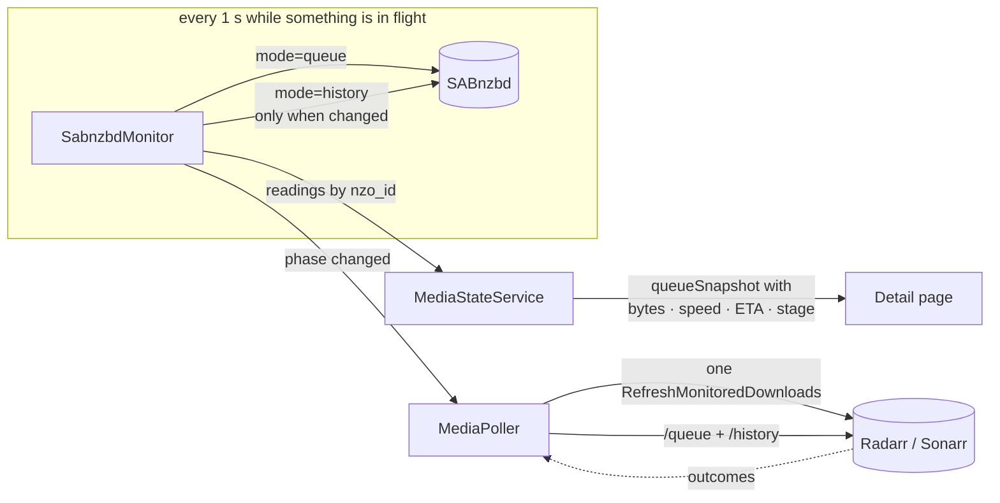
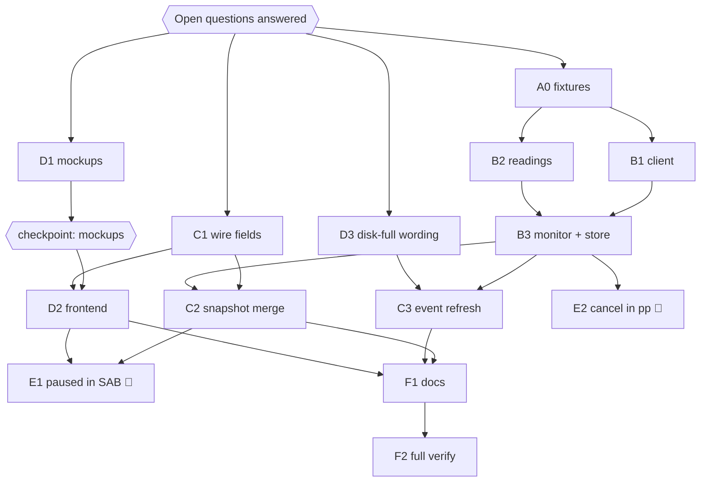

# Read SABnzbd directly — `apps/download`, `packages/utils`

## Overview

> Written for a human first. Everything below this section is written for whoever
> executes the plan. If a claim here needs more, it links to where the detail lives.

On 2026-09-29 a gap analysis compared our Radarr/Sonarr integration (plan 024) with
the source of the SABnzbd version prod runs, **5.1.3**. Radarr and Sonarr sit between us
and SABnzbd, and they drop or distort several things SABnzbd knows:

| #   | What the user sees today                                                         | What is really happening                                                                                                                                              |
| --- | -------------------------------------------------------------------------------- | --------------------------------------------------------------------------------------------------------------------------------------------------------------------- |
| 1   | "finishing up · All downloaded. Radarr imports it next." for 20 minutes          | SABnzbd is verifying, repairing or unpacking. Radarr maps every one of those stages to "Downloading".                                                                 |
| 2   | "Last download failed: Unpacking failed, write error or disk is full? `<unrar>`" | The **disk is full**. Radarr treats it as a bad release, blocklists it, and searches again into the same full disk.                                                   |
| 3   | Progress ticks every 5 s, and no speed or bytes for movies and shows             | Progress comes only from Radarr/Sonarr's `/queue`, which we force-refresh (3·F1). Each refresh costs two command rows, SABnzbd calls and an import retry in each app. |

This plan adds a **small read-only SABnzbd client** to the download app. SABnzbd becomes
the source of **live progress** (bytes, speed, ETA, post-processing stage). Radarr and
Sonarr stay the source of truth for **outcomes** (grabbed, imported, failed, removed),
as plan 024 set up.

| Change                                | In one sentence                                                                                                                                                   |
| ------------------------------------- | ----------------------------------------------------------------------------------------------------------------------------------------------------------------- |
| **Live progress from SABnzbd**        | A monitor polls SABnzbd once a second while it has something in flight, and the job shows bytes, speed and ETA from it.                                           |
| **Refresh on change, not on a timer** | `RefreshMonitoredDownloads` goes out only when SABnzbd reports a job changing phase. 3·F1's timed gate stays as the fallback when SABnzbd can't be read.          |
| **Post-processing is named**          | The 100 % state reads "Unpacking in SABnzbd · Repairing 45 %" instead of "Radarr imports it next".                                                                |
| **Disk full reads as disk full**      | Any SABnzbd failure whose text says the disk is full becomes "The NAS ran out of disk space…", in the failed error, the retry note and the NeedsAttention reason. |



**Shape:** one doc, **groups A–F, ~12 tasks, 7 waves**, orchestrated, on the existing
branch `jeremy/arr-gaps` next to plan 024. It lands in **the same squash merge** as 024
([Rollout](#rollout)).

**Key decisions.** Everything tagged **❓** was an open question. **On 2026-09-29 the
human took the recommended answer for all six**; see [Open questions](#open-questions).

- **SABnzbd is read, never written.** The client only knows `version`, `queue` and
  `history`, and it refuses any other mode. Deletes, retries and blocklists stay with
  Radarr/Sonarr. [Why](#sabnzbd-is-read-only)
- ❓ **Timed refresh → event refresh.** A SABnzbd phase change sends one refresh. 3·F1's
  gate runs only while SABnzbd is unconfigured or unreachable.
  [Why](#refresh-on-a-sabnzbd-phase-change)
- ❓ **Post-processing is a label and a detail line, not a new status.** The existing
  "finishing" handoff gets SABnzbd's stage. [Why](#post-processing-is-a-handoff-not-a-status)
- ❓ **Disk-full is reworded, not un-blocklisted.** [Why](#disk-full-is-reworded)
- ❓ **The client lives in `apps/download/src/sabnzbd/`**, copying the Emby client, not in
  `packages/media`. [Why](#where-the-client-lives)
- ❓ **The full SABnzbd API key goes in `.env.prod` only.** Dev leaves it unset, which
  turns the feature off. [Why](#the-api-key)

> **Accepted gaps:** status (Downloading, Paused, Importing, …) still comes from
> Radarr/Sonarr's `/queue`. Between refreshes it can lag SABnzbd by up to Radarr's own
> one-minute cycle, except that every SABnzbd phase change triggers a refresh. Items 7a–7c
> ([Optional](#group-e--optional-needs-a-yes-first)) are written up but not scheduled.

**Read next:** [Open questions](#open-questions) (answer these first) ·
[Design decisions](#design-decisions) for the why · [Task List](#task-list) for the
work · [Sequencing](#sequencing) for the order and human checkpoints ·
[Rollout](#rollout) · [Final report](#final-report).

---

## Open questions

> ✅ **Answered 2026-09-29: the recommended answer for every question.** For Q6 that
> means **E1 is in**, **E2 is deferred** (its recommendation was only "maybe", so it isn't
> built unasked), and **E3 is documentation only** (it goes into F1). The tasks below
> already match these answers.

| #   | Question                                                                               | Recommended                                                                                                                                             | Other options                                                                                                                                                           | Changes |
| --- | -------------------------------------------------------------------------------------- | ------------------------------------------------------------------------------------------------------------------------------------------------------- | ----------------------------------------------------------------------------------------------------------------------------------------------------------------------- | ------- |
| Q1  | Drop the timed `RefreshMonitoredDownloads` entirely, or keep a capped fallback?        | **Event refresh when SABnzbd is healthy; 3·F1's timed gate unchanged as the fallback** when SAB is unset or unreachable                                 | (b) Event refresh only, and delete 3·F1's gate. (c) Keep 3·F1 as is and use SABnzbd for display only.                                                                   | C3      |
| Q2  | Post-processing as a new job **status** or a **label/detail** on the existing handoff? | **Label + detail.** The `finishing` handoff chip reads "unpacking" and the detail line carries SAB's stage                                              | A new `post_processing` status. It touches every exhaustive status map, the shared schema, tdr-bot's `z.enum`, and the deploy order, only to say what a label says.     | C1, D2  |
| Q3  | Where does the SABnzbd client live?                                                    | **`apps/download/src/sabnzbd/`**, next to `emby/`                                                                                                       | `packages/media/src/sabnzbd` (it'd be the only hand-written, non-generated client there, and tdr-bot has no use for it).                                                | B1      |
| Q4  | How is the API key supplied?                                                           | **The full key in `apps/download/.env.prod`** (`SABNZBD_API_KEY`), copied from `sabnzbd.ini` by you or by a command that never echoes it. Unset in dev. | (b) A read-only proxy sidecar holds the key and forwards only `queue`/`history`. It limits the blast radius but adds a container. (c) No SAB client; ship 3 and 4 only. | B1, H2  |
| Q5  | On a disk-full failure, also undo Radarr/Sonarr's blocklist entry?                     | **No, just surface it.** The retry note tells the user to free space                                                                                    | Remove the blocklist entry via `DELETE /blocklist/{id}`. That writes to prod, and a re-search would grab the same release into the same full disk anyway.               | D3      |
| Q6  | Items 7a–7c: which, if any?                                                            | **7c yes** (cheap once the client exists, and it covers the disk-full _download_ pause). **7a maybe. 7b no**                                            | See [Group E](#group-e--optional-needs-a-yes-first).                                                                                                                    | E1–E3   |

---

## Branch and worktree

**This plan shares plan 024's branch and worktree.** It adds commits after 024's last
one and lands with it.

|          | Value                                                       |
| -------- | ----------------------------------------------------------- |
| Branch   | `jeremy/arr-gaps`                                           |
| Worktree | `/home/jeremy/.nexus-code/worktrees/lilnas/jeremy-arr-gaps` |
| Base     | `main` (024's base)                                         |

- The doc was written in the worktree, so there is nothing to move. **Commit it first**:
  `docs(download): add plan 025 for direct SABnzbd reads`.
- Already on the branch from the same analysis: `a84b2c7f` (SABnzbd router behind
  `lilnas-auth`, image pinned to `5.1.3-ls274`) and `49894bd1` (024 checkpoint 3's
  SAB-outage check).
- All of plan 024's [worktree rules](024-arr-integration-gaps.md#branch-and-worktree)
  apply unchanged: never check out in the main checkout, never merge/push/rename/delete
  the branch, and `/commit` with `in:<worktree path>`.

---

## How to work this plan

**Before task 1:** nothing. The [Open questions](#open-questions) are answered (all
recommended, 2026-09-29) and this doc is committed.

**Per task:**

1. Work in wave order ([Sequencing](#sequencing)). Never start a task before its
   dependencies are green.
2. Implement → write or update tests → run **only the touched spec files** plus lint
   and type-check for every touched package ([Context Pack](#repo--conventions)).
3. **`/commit`** with `in:<worktree path>`. One task, one commit (or a small coherent
   set).
4. Check the box and append the commit hash.

**Markers:**

| Marker              | Means                                                          |
| ------------------- | -------------------------------------------------------------- |
| `- [ ]`             | Not started                                                    |
| `- [x]` … `abc1234` | Done, with the commit that did it                              |
| ⚠️ **PARTIAL**      | Landed with scope narrowed — say what was left and why, inline |
| ⏭️ **DROPPED**      | Not doing it — say why. Never delete a task                    |
| 🚧 / ⏳             | Blocked. Do not implement                                      |

**When reality disagrees with this plan,** add a short **Findings** note under the task
and update the downstream tasks it invalidates.

---

## Instructions for the orchestrator agent

Plan 024's [orchestrator rules](024-arr-integration-gaps.md#instructions-for-the-orchestrator-agent)
apply word for word: **one session holds the wave**, every task goes to a sub-agent,
prompts are self-contained, `/commit` and heavy Jest runs are serialized, and you edit
only this plan. On top of those:

- ❌ **Never boot this branch's code** (dev or prod) before 024's
  [checkpoint 2](024-arr-integration-gaps.md#human-checkpoints) clears. Booting runs
  `ArrProfilesBootstrap`, which writes to prod Radarr/Sonarr.
- ❌ **No request to prod SABnzbd from any sub-agent.** Only the human, or you at a
  [human checkpoint](#human-checkpoints), may send read-only `version`/`queue`/`history`/`auth`
  GETs. Never any other mode.
- ❌ **Never print a secret**: not `sabnzbd.ini` keys or passwords, and no `.env.prod`
  value.
- ❌ Don't implement anything in [Group E](#group-e--optional-needs-a-yes-first) unless
  Q6 said yes to it.

---

## Design decisions

### SABnzbd is read-only

**Chosen:** the client exposes `getVersion`, `getQueue` and `getHistory`, nothing else.
A runtime guard throws for any other `mode`, so a later edit can't slip a write in by
accident.

**Why:**

- A delete in SABnzbd makes the item vanish from Radarr/Sonarr with no blocklist and no
  re-search. Retry gives the job a new `nzo_id` (`SAB/nzbqueue.py` retry path), so it
  reads as removed. `change_cat` breaks Radarr's category match.
- Radarr/Sonarr remain the only writers, so everything plan 024 built (history ingestion,
  `job_downloads`, cancel) keeps working untouched.
- The handoff allows pause, resume and priority directly in SAB. **Nothing in this plan
  needs them**; 7c only _reads_ a pause.

### Refresh on a SABnzbd phase change

❓ Q1. **Chosen (recommended):**

- When SABnzbd is readable, the poller **stops sending timed refreshes**.
- Instead, it sends **one** `RefreshMonitoredDownloads` to the app that owns a download
  when SABnzbd reports that download changing **phase**: `queued → downloading →
paused → post_processing → completed | failed`, in any order.
- At most one refresh per app per `EVENT_REFRESH_MIN_MS` (2 s). A burst of transitions
  collapses into the next allowed tick.
- **While SABnzbd is unset or unhealthy, 3·F1's gate runs exactly as it does now.**
  Unhealthy means `SAB_UNHEALTHY_AFTER` (3) consecutive failed reads. It becomes healthy
  again after one good read.

**Why:**

- A 2160p grab drove about 430 refreshes in 7 minutes before 3·F1, and 3·F1 still sends
  about one every 5 s while anything moves. With SAB progress, the only thing a refresh
  still buys is **Radarr noticing a phase change sooner** than its own one-minute cycle
  (`DownloadMonitoringService.cs`). The biggest one is completion → import. That is about
  5 refreshes per download.
- Radarr/Sonarr's queue status stays as fresh as it matters, because every SAB phase
  change triggers a refresh.
- Keeping 3·F1 as the fallback means a SAB outage, a bad key or dev (feature off) all
  behave exactly as the branch does today.

**Ruled out:**

- **(b) Delete 3·F1.** Without SAB, progress would freeze for up to a minute.
- **(c) Display only.** It keeps every refresh's cost for no reason.

**`importing` is not a SAB phase.** Radarr's import runs inside its own
`ProcessMonitoredDownloads`, which the completion refresh starts. 3·F1 kept refreshing
through a long import only to _see_ the import end, and history already settles that
outcome every 5 s (`HISTORY_POLL_MS`).

### Post-processing is a handoff, not a status

❓ Q2. **Chosen (recommended):** no new `DownloadJobStatus`.

- A job whose download SABnzbd reports in post-processing gets
  `queueSnapshot.stage = 'post_processing'` plus `stageDetail` (SAB's `action_line`, for
  example "Repairing: 45%" or "Unpacking: 02/15").
- The frontend's existing `finishing` handoff (`job-state.ts` `jobHandoff` /
  `handoffDetail`) uses it. The chip reads **unpacking** and the line reads
  "SABnzbd is unpacking it · Unpacking: 02/15. Radarr imports it after."
- **Without SAB data**, the `finishing` copy still changes, because 100 % while
  Downloading _is_ SAB post-processing (Radarr maps pp history rows to Downloading with
  `RemainingSize = 0`, `RAD/…/Sabnzbd.cs:154-158`). It becomes: "All downloaded.
  SABnzbd is checking and unpacking it; Radarr imports it after."

**Why:** plan 024 settled the same question for auto-retry the same way
([Auto-retry reuses searching](024-arr-integration-gaps.md#auto-retry-reuses-searching)).
A status touches every exhaustive map (`STATUS_TONES`, `STATUS_RANK`, admin filters,
`JOB_STATUS_LABELS`), the shared `z.enum` that an old tdr-bot rejects, and
`scripts/verify/mutate.ts`.

**Why SAB post-processing matters:** it's single-threaded. One slow repair holds every
finished job behind it, and each of those also reads 100 %.

### Disk-full is reworded

❓ Q5. **Chosen (recommended):** a pure classifier, `describeClientFailure(message)`, is
used everywhere a SABnzbd failure message reaches the user.

- It matches `/disk (is )?full|write error|no space left/i`.
- Its user text is **"The NAS ran out of disk space while SABnzbd was unpacking it."**,
  followed by the original message trimmed to the first sentence, in parentheses.
- It applies to:
  - `applyFailure` (`media-poller.service.ts` ~:1970). This covers the `Failed` error,
    and the `retryNote`, which then reads "Last download failed: the NAS ran out of disk
    space. Radarr is trying another release, which will fail the same way until space
    is freed."
  - `describeQueueItemError` (`queue-status.util.ts` ~:234). This covers the `warning`
    case below.

**Why it's needed:**

- Radarr/Sonarr map a SAB failure to _Warning_ only when `fail_message` **equals**
  "Unpacking failed, write error or disk is full?" (`RAD/…/Sabnzbd.cs:140-141`, the same
  in Sonarr v4).
- SAB's unrar paths append the unrar output (`SAB/newsunpack.py:820,848,898`). So a
  RAR disk-full becomes **Failed**, and Radarr blocklists a good release and re-searches.
- Only 7z emits the bare string (`:1047`). That one stays a queue `warning` and reaches
  NeedsAttention after 2 minutes, through `describeQueueItemError`.
- Other disk texts: "Unpacking failed, disk full" (`:826`) and "Repairing failed, Disk
  full" (`:1450`).
- Prod deletes failed jobs from SAB outright (`RemoveFailed=1`; the archive holds none,
  checked 2026-09-29), so **Radarr/Sonarr history is the only place the text survives**.
  This task needs no SAB client.

**Ruled out:** un-blocklisting (Q5 (b)). It's a prod write, and with auto-redownload on,
Radarr would re-grab into the same full disk. Freeing space is the fix, so the message
says so.

> The phrase "release failed" in the handoff does not exist in the code. What users see
> today is SAB's raw message as `job.error` under a `failed` chip (`attempt-list.tsx`
> ~:495), or inside the retry note.

### Where the client lives

❓ Q3. **Chosen (recommended):** `apps/download/src/sabnzbd/`, copying
`apps/download/src/emby/`: `sabnzbd.schema.ts`, `sabnzbd.service.ts`, `sabnzbd.module.ts`,
`__tests__/`.

**Why:**

- `packages/media` holds only **generated** OpenAPI clients. SAB has no spec.
- Only the download app reads SAB.
- The Emby client is the house pattern for a hand-written, zod-validated HTTP client:
  `fetch`, a 10 s timeout, schema parse, and errors that never carry the URL.

### The API key

❓ Q4. **Chosen (recommended):** `SABNZBD_URL` and `SABNZBD_API_KEY` in
`apps/download/.env.prod`. **Both are optional:** unset means the monitor never starts,
and the app behaves exactly as today.

Contract facts:

- SAB takes the key only as the `apikey` **query param**; there's no header
  (`SAB/interface.py:401`).
- `queue` and `history` need the **full** key. The NZB key only covers level-1 modes
  (`SAB/interface.py:415-417`, `SAB/api.py:1078-1131`).

**⚠️ Blast radius.** The full key is SAB admin: it can change config, add NZBs, and
delete jobs. The download app had an RCE in July (fixed 2026-08-26). If that happened
again, the attacker would also hold SAB admin. Mitigations in this plan:

- The mode allowlist (above).
- The key never appears in logs or errors. Error text names the `mode`, never the URL;
  `fetch` failures are rewrapped so undici's `cause` can't leak it.
- The key is not set in dev.

The stronger option is Q4 (b), a read-only proxy.

**Dev:** `lilnas-download-dev` sits on `lilnas_default` and **can reach prod SABnzbd**.
Leave the keys unset there. Every test mocks `fetch`.

### Things that already exist — don't rebuild them

- **`job_downloads`** persists job ↔ `downloadId` (`db/job-downloads.repo.ts`), and
  Radarr/Sonarr's `downloadId` **is** SAB's `nzo_id` (`RAD/…/Sabnzbd.cs:52,69,124`;
  checked against prod's latest grab). Queue items already carry `downloadId`
  (`PollableQueueItem`, `queue-status.util.ts:22`), so the monitor needs no new join.
- **3·F1's gate** (`requestQueueRefresh` ~:1575, `isQueueItemMoving`
  `queue-status.util.ts` ~:545). Keep it. It becomes the fallback.
- **The `finishing` handoff**: `jobHandoff`, `FINISHING_LABEL` and `handoffDetail` in
  `components/detail/job-state.ts` ~:360-401.
- **The throughput line is already drawn** in the mockups
  (`designs/src/data/movie-detail.mjs:37,94`, `'1.2 GB / 2.6 GB · 8.4 MB/s'`), but the
  app doesn't render it for movies or shows.
- **`formatBytes`, `formatSpeed`, `formatEta`** in `lib/format.ts` (:95, :123, :141),
  used by video progress. D2 reuses them.

### What stays untouched

- `DownloadJobStatus` and every exhaustive status map (Q2).
- The `jobs` table. Readings are memory-only, like `queueSnapshot`.
- History ingestion, `job_downloads`, cancel, adoption, and `ArrProfilesBootstrap`.
- `DownloadController`, `MediaDownloadService` and `MediaPollerService` constructors
  ([DI rule](#gotchas)).

---

## Shared Context Pack

> Copy the relevant parts into every sub-agent prompt. Pointers verified at `49894bd1`
> (2026-09-29). A plan ages; the code is the truth.

### Repo & conventions

Everything in plan 024's
[Repo & conventions](024-arr-integration-gaps.md#repo--conventions) holds. In short:

- **Jest:** own specs only, from the package dir, with
  `pnpm exec jest <paths> --maxWorkers=2`. The full `apps/download` suite runs **once,
  alone** (F2), with `--maxWorkers=4`. It nearly OOM'd prod on 2026-09-24.
- **Lint / type-check:** `pnpm lint` (eslint + prettier) and `pnpm type-check` from the
  package dir. `apps/download` type-checks against `packages/utils/dist`, so run
  `pnpm build` in `packages/utils` after changing it. ❌ Never `pnpm build` in
  `apps/download` or at the root.
- **Env:** `EnvKeys` map in `apps/download/src/env.ts`; placeholder values go in
  `apps/download/.env.example`. `env(key)` throws when unset with no default. **Optional
  keys need a default**, for example `env(EnvKeys.SABNZBD_URL, '')`.
- **Style:** backend comments use `-`, frontend comments use `—`. Use `cns()` for class
  lists, and no `any`. Commits look like `feat(download): …` / `feat(utils): …` /
  `docs(download): …`, with a why-body and the session's `Co-Authored-By` trailer.
- **Mockups:** `docs/features/download/designs/src/pages/*.pug` + `src/data/*.mjs`. Run
  `pnpm mockups` from the repo root. Generated `designs/*.html` are committed, never
  hand-edited.
- **Upstream source (read-only clones):**

  | Source          | Path                                    |
  | --------------- | --------------------------------------- |
  | SABnzbd 5.1.3   | `/tmp/sonarr-radarr-analysis/sabnzbd`   |
  | Radarr (≈6.4.4) | `/tmp/sonarr-radarr-analysis/radarr`    |
  | Sonarr v4       | `/tmp/sonarr-radarr-analysis/sonarr-v4` |

  If `/tmp` was cleaned, re-clone with `git clone --depth 1 --branch 5.1.3
https://github.com/sabnzbd/sabnzbd`.

### Layout (paths under `apps/download/src/` unless noted)

| File                                                                                         | What matters                                                                                                                                                                                                                                                                                                                                                                                      |
| -------------------------------------------------------------------------------------------- | ------------------------------------------------------------------------------------------------------------------------------------------------------------------------------------------------------------------------------------------------------------------------------------------------------------------------------------------------------------------------------------------------- |
| `emby/emby.service.ts`, `emby.schema.ts`, `emby.module.ts`, `__tests__/emby.service.test.ts` | **The pattern to copy.** Env read in the constructor, private `request(path, schema, params)`, `fetch` + `AbortSignal.timeout(10_000)`, `response.ok` check, `schema.parse`, errors without the URL. Tests `jest.spyOn(global, 'fetch')`.                                                                                                                                                         |
| `env.ts`, `../.env.example`                                                                  | `EnvKeys`; the `EMBY_*`, `RADARR_*` and `SONARR_*` blocks                                                                                                                                                                                                                                                                                                                                         |
| `media/media.module.ts`                                                                      | Providers and imports (`EmbyModule` is a plain import, :31-44). `MediaStateService` is provided at :60 and exported at :77                                                                                                                                                                                                                                                                        |
| `media/media-state.service.ts`                                                               | `setQueue` / `getQueue` :63-70, `queueItemsFor`, `annotate` :117, `annotateEpisodes` :145, `deriveShow` :192-215 (aggregate → `toQueueSnapshot`). **Writers push into it; it never injects anything** (doc :35-47)                                                                                                                                                                                |
| `media/queue-status.util.ts`                                                                 | `PollableQueueItem` :16-63 (`downloadId` :22), `toQueueSnapshot` :78-95, `isQueueSnapshotEqual` ~:97, `aggregateQueueItems` :162-221, `describeQueueItemError` :234-253, `deriveQueueItemState` :427-488, `STALL_MS` :526, `isQueueItemMoving` :545-567                                                                                                                                           |
| `media/media-poller.service.ts`                                                              | Constants :88-115 (`HISTORY_POLL_MS`, `QUEUE_REFRESH_MS`, `WATCHED_QUEUE_REFRESH_MS`, `QUEUE_REFRESH_SLACK_MS`); `queueProgress` :551, `queueRefreshedAt` :560; constructor :577-584; `poll()` :586-630; `pollSource` :647-730; `applyFailure` :1970-2031; `requestQueueRefresh` :1575-1602; `movingQueueItems` ~:1609; `isWatchedQueue` ~:1645; `applyUpdate` :3447-3527; `retryNote` :3681-3687 |
| `download-gateway/download.gateway.ts`                                                       | `watchedMediaIds()` :226-232                                                                                                                                                                                                                                                                                                                                                                      |
| `components/detail/job-state.ts`                                                             | `jobProgress` :264-294, `FINISHED_PCT` :337, `jobHandoff` ~:355-366, `FINISHING_LABEL` :374, `handoffDetail` :389-401                                                                                                                                                                                                                                                                             |
| `components/detail/attempt-list.tsx`                                                         | In-flight card: chip + `%` :365-372, note :374-376; `attemptAside` :415-436 (`~${timeLeft} left`); history row error :495-497                                                                                                                                                                                                                                                                     |
| `packages/utils/src/download/schema.ts`                                                      | `DownloadQueueSnapshotSchema` :99-103 (`progress`, `status`, `timeLeft`), used by `ManagedMediaBaseSchema.queueSnapshot` :459 and `EpisodeSchema.queueSnapshot` :1098                                                                                                                                                                                                                             |
| `docs/features/download/backend.md`                                                          | `### Full-queue polling, and when to refresh` :2497, `### One source for queueSnapshot` :2993, `### The queue refresh (plan 024 · 3·F1)` :4033-4060                                                                                                                                                                                                                                               |
| `docs/features/download/designs/src/`                                                        | `pages/movie-detail.pug` (`attemptInFlight` :124-148), `pages/show-detail.pug`, `data/movie-detail.mjs` (throughput :37, :94), `data/show-detail.mjs`                                                                                                                                                                                                                                             |

### SABnzbd 5.1.3 contract (verified in source; live where noted)

- **Base:** `http://sabnzbd:8080/api`. `lilnas-download-1` and `lilnas-sabnzbd-1` share
  `lilnas_default`. Always pass `output=json` and `apikey=<full key>`.
- **Errors:**
  - API errors come back as **HTTP 200** with `{"status": false, "error": "..."}`.
  - Auth and host rejections come back as **HTTP 403** with a plain-text body
    (`SAB/interface.py:101-106,198-203`).
  - Parse `SabApiError` before the success schema.
- **`mode=version`** (no key needed) → `{"version":"5.1.3"}` (live).
- **`mode=queue&limit=0`** (`SAB/api.py:1640-1754`, no queue lock):
  - Top level (live, idle queue): `status` ("Idle"/"Downloading"/"Paused"), `paused`
    (bool), `paused_all`, `kbpersec` ("0.00" string), `mb`/`mbleft` (strings),
    `timeleft` ("0:00:00"), `noofslots`/`noofslots_total` (numbers), `diskspace1`
    (string GB), `have_warnings` ("0"), `version`.
  - `slots[]` fields: `nzo_id`, `filename`, `cat` (**"None"** when unset), `status`,
    `priority` (string **or** int), `percentage` (floored int string that **can go
    backwards**), `mb`, `mbleft`, `timeleft` (`H:MM:SS` or `D:HH:MM:SS`), `labels`
    (translated strings such as "ENCRYPTED", "DUPLICATE"), `time_added`.
  - **No per-job speed and no `eta` field.** `timeleft` in the **unfiltered** queue is
    cumulative over queue order ÷ global speed, which is right for SAB's sequential
    downloads. **Never filter by `cat`**, because that makes it too optimistic.
  - ⚠️ No live slot has been seen yet (the queue was idle on 2026-09-29). A0 covers that.
- **`mode=history&nzo_ids=…&limit=N&last_history_update=K`** (`SAB/api.py:576-624,1946-2079`):
  - Unchanged since `K` → `{"history": false}`, with no DB work (**live-verified**).
    `last_history_update` is a **counter** (live value `9`), not a timestamp.
  - `limit=0` means `history_limit` (10 in prod), not "all". **Always pass an explicit
    limit.**
  - Post-processing rows come first, with `status` in {Queued, QuickCheck, Verifying,
    Repairing, Extracting, Moving, Running}. `action_line` holds live text such as
    "Unpacking: 02/15". A pp row's `completed` is always "now". Top-level `ppslots`
    counts them (live: `0`).
  - `stage_log[].actions` contain HTML (never render it). `category` can be null.
  - `bytes` is a number (live) and `completed` is epoch seconds (live).
  - Prod has Radarr/Sonarr `RemoveCompleted=1` and `RemoveFailed=1`. Completed jobs are
    **archived** once imported, so they're gone from the default view (live: default
    view empty) and need `archive=1&nzo_ids=`, which is **live-verified**: it found The
    Martian's `f8615a3a-…`. Failed jobs are **deleted** (live: none in the archive).
  - **Handoff gap:** at download → pp a job can briefly be in neither queue nor history
    (`SAB/assembler.py:329-330`). Allow `SAB_GONE_GRACE_TICKS` (2) before reading it as
    gone.
- **`nzo_id`:** a UUID4, stable across restart, the pp Fetching re-add and the queue →
  history move. It **changes on SAB "Retry"** (7b).
- **Global pause** (`queue.paused = true`) happens on disk full
  (`SAB/assembler.py:283-299`, "Disk full! Forcing Pause"), low space, quota, or a user
  pause. Radarr maps every slot to Paused then (`RAD/…/Sabnzbd.cs:77-83`), unless its
  priority is Force.
- **No push channel.** No websocket or SSE, and scripts/Apprise don't carry `nzo_id`.
  SAB's own UI polls at 1 Hz, so polling is the house style.

### Gotchas

- **DI rule (from 024):** ❌ do not inject a new provider into `DownloadController`,
  `MediaDownloadService` or `MediaPollerService`. Their testing modules construct them
  positionally (`media-poller.service.test.ts:249-266`). The poller reaches SAB data
  **through `MediaStateService`**, which it already injects. A new provider that nothing
  injects (the monitor) is fine.
- **Optional env.** `media/__tests__/media.module.test.ts:49-71` sets `process.env`
  explicitly. The SAB keys must default to `''` so that module test and dev boot keep
  working with them unset.
- **Never log the URL.** The key is a query param. `fetch` rejections carry the URL in
  `cause`; rewrap them as ``new Error(`SABnzbd ${mode} request failed`)``.
- **Numbers are strings** in `queue` (`mb`, `mbleft`, `kbpersec`, `percentage`). Use
  `z.coerce.number()`. `timeleft` parsing must accept both 3- and 4-part forms and
  return `null` on junk.
- **`percentage` goes backwards** (par2 held back, Fetching). Derive progress from
  `mb`/`mbleft` and never show SAB's `percentage`.
- **Readings are per `nzo_id`; jobs are per title.** A Sonarr season pack is one
  `nzo_id` behind many queue rows. `aggregateQueueItems` already sums once per
  `downloadId`, so merge SAB numbers **per `downloadId` before** aggregating.
- **`isQueueSnapshotEqual` decides whether a frame goes out.** New snapshot fields must
  be compared too, or speed changes won't broadcast.
- **The poller cron has no overlap guard**, and neither will the monitor's interval.
  Guard the monitor with an in-flight flag and skip a tick rather than stacking reads.

### Definition of Done

Include this **verbatim** in every delegation:

> **Done means:** implemented; tests written or updated following the package's existing
> conventions and passing; lint and type-check clean for every touched package;
> committed with `/commit`. Report back: files changed, exported names introduced, test
> summary, commit hash(es).

Addenda (also verbatim):

- ❌ Run only the spec files you touched or that cover what you changed:
  `pnpm exec jest <paths> --maxWorkers=2` from the package dir. Never the full suite.
- ❌ Do not run `pnpm build` in `apps/download` or at the repo root. Do run it in
  `packages/utils` when you changed that package.
- ❌ Do not boot the app, restart or rebuild any container, or send **any** request to
  SABnzbd, Radarr, Sonarr, Emby or MinIO. Tests mock `fetch` and the SDKs.
- ❌ Never print or commit a secret. `.env.example` gets placeholders only.
- ❌ Do not `/commit` until the orchestrator gives you the go-ahead; commit with
  `in:/home/jeremy/.nexus-code/worktrees/lilnas/jeremy-arr-gaps`.
- Mockup tasks: "tests" means `pnpm mockups` builds clean from the repo root and root
  `pnpm lint` passes prettier over `designs/src`.

---

## Task List

> Line numbers are at `49894bd1`. Search by symbol name; earlier tasks move them.

### Group A — Prep

- [x] **A0. SAB fixtures.** A committed fixture module, so every later test parses the
      same shapes. `67395416`.

  **Files:** create `apps/download/src/sabnzbd/__tests__/fixtures.ts`.
  - Build each fixture from SAB 5.1.3's `build_queue` / `build_history`
    (`SAB/api.py:1640-1754`, `:1946-2079`) and the live shapes in the
    [contract](#sabnzbd-513-contract-verified-in-source-live-where-noted).
  - Needed: idle queue; queue with one downloading and one queued slot; a globally
    paused queue; `{"history": false}`; history with a pp row (`Repairing`,
    `action_line`); an archived Completed row; a Failed row with an unrar disk-full
    message; the 403 text body; the `{"status": false}` error.
  - **Findings slot:** leave a `// TODO(H1): replace with a live capture` on the two
    active-slot fixtures. The first human checkpoint with an active download replaces
    them.

  **Tests:** none (data). It is verified by B1's and B2's specs.

  **Findings (A0, from SAB 5.1.3 source):**
  - **Path moved** to `sabnzbd/__tests__/fixtures/sabnzbd.fixtures.ts`: Jest's node
    project collects every `__tests__/**/*.ts` except `__tests__/fixtures/**`.
  - Exports: `SAB_MOVIE_NZO_ID`, `SAB_EPISODE_NZO_ID`, `SAB_MANUAL_NZO_ID`,
    `SAB_VERSION`, `SAB_QUEUE_IDLE`, `SAB_QUEUE_DOWNLOADING` (TODO(H1)),
    `SAB_QUEUE_PAUSED`, `SAB_HISTORY_UNCHANGED`, `SAB_HISTORY_PP_REPAIRING` (TODO(H1)),
    `SAB_HISTORY_ARCHIVED_COMPLETED`, `SAB_DISK_FULL_FAIL_MESSAGE`,
    `SAB_HISTORY_FAILED_DISK_FULL`, `SAB_FORBIDDEN_API_KEY_INCORRECT` / `_API_KEY_REQUIRED`
    / `_HOSTNAME` / `_EXTERNAL_ACCESS`, `SAB_API_ERROR`.
  - ⚠️ **No `Queued` slot while the downloader runs.** Every slot not paused on its own
    reports `Downloading` (`api.py:1713-1719`); `Queued` only shows while the whole queue
    is paused. Only queue order (`index`) tells the transferring job apart. **B2 amended.**
  - "API Key Incorrect" / "API Key Required" are **403 plain-text** bodies, not the
    `{status:false}` JSON (that's `report()` errors such as "not implemented"). The 403
    body is **empty** when `api_warnings` is off, so classify on the status code.
  - An int `priority` is always `0` (the fallback for Paused/Stop priorities).
  - The unrar disk-full text keeps a double space (`"…disk is full?  in the file …"`).
  - Many extra fields (queue `speed`, `size`, `diskspace2`, `quota*`, …; slot `index`,
    `mbmissing`, `direct_unpack`, …); history `series`/`meta`/`completeness` are null in DB
    rows. `looseObject` covers them.

### Group B — SABnzbd client and monitor

- [x] **B1. Client.** `SabnzbdService`, a thin zod-validated read-only client, plus env
      keys. `5101f4ff`. Exports: schema `parseSabDuration`, `Sab{QueueSlot,Queue,
  HistorySlot,History}` (+ `…Schema`), `SabVersionResponseSchema`,
      `SabQueueResponseSchema`, `SabHistoryResponseSchema`, `SabApiError(Schema)`; service
      `SAB_READ_MODES`, `SabReadMode`, `isSabReadMode`, `SabnzbdAuthError`,
      `SabnzbdApiError`, `SabHistoryQuery`, `SabnzbdService`; `SabnzbdModule`.

  **Findings:** disabled → every method throws "SABnzbd is not configured" without fetch
  (except `nzoIds: []`). `nzoIds: []` returns `{ last_history_update: lastUpdate ?? 0, … }`
  (SAB's counter starts at 1 and wraps to 1, so `0` always refetches). SAB applies `limit`
  after the `nzo_ids` filter; callers pass `limit >= nzoIds.length`. Null history
  `fail_message`/`action_line` → `''`, null `bytes` → `0`. Errors never set `cause`.

  **Files:** create `sabnzbd/sabnzbd.schema.ts`, `sabnzbd/sabnzbd.service.ts`,
  `sabnzbd/sabnzbd.module.ts`, `sabnzbd/__tests__/sabnzbd.service.test.ts`. Edit
  `env.ts` (add `SABNZBD_URL` and `SABNZBD_API_KEY`, with a comment on the full-key
  requirement) and `.env.example` (`SABNZBD_URL=http://localhost:8080`,
  `SABNZBD_API_KEY=key`).

  ```ts
  export const SAB_READ_MODES = ['version', 'queue', 'history'] as const
  class SabnzbdService {
    get enabled(): boolean // both env vars non-empty
    getVersion(): Promise<string>
    getQueue(): Promise<SabQueue> // mode=queue&limit=0, unfiltered
    getHistory(q: {
      nzoIds: string[]
      limit: number
      archive?: boolean
      lastUpdate?: number
    }): Promise<SabHistory | null> // null = unchanged
  }
  ```

  - Schemas: start from the handoff's zod 4 sketch
    (`/tmp/sonarr-radarr-analysis/sabnzbd-handoff.md` §5), re-checked against A0.
    `z.looseObject` for slots, `sabDuration` → seconds or `null`, `cat: "None"` → `null`.
  - `request(mode, params)` refuses a `mode` not in `SAB_READ_MODES` at runtime (throws).
  - Error handling:
    - It checks `response.ok`. A 403 throws `SabnzbdAuthError`, whose message says the
      key or host was rejected, not the body.
    - It parses `SabApiError` first and throws with SAB's `error` text.
    - It never puts the URL in an error.

  **Edge cases:** `limit` is always explicit (never 0); `nzoIds: []` makes no request
  and returns an empty history; `priority` accepts a string or a number.

  **Tests:**
  - Every A0 fixture parses.
  - A non-allowlisted mode throws before `fetch` is called.
  - 403 → `SabnzbdAuthError`.
  - `{status:false}` → an error with SAB's text.
  - A network failure's message contains neither the key nor the URL.
  - `{"history": false}` → `null`.
  - `enabled` is false with either var unset.

- [x] **B2. Readings.** A pure reducer from successive SAB reads to per-`nzo_id`
      readings and phase transitions. `e99a6a94`. Exports `SabQueueSlotRead`,
      `SabQueueRead`, `SabHistorySlotRead`, `SabHistoryRead`, `SabPhase`, `SabReading`,
      `SabTransition`, `SabReadInput`, `SabReadResult`, `SAB_GONE_GRACE_TICKS`,
      `SAB_SPEED_EWMA_ALPHA`, `reduceSabReads`.

  **Findings / judgment calls:**
  - Bytes are MiB (`MEBI = 2**20`). Force = `'Force'` or `2`. Unknown queue status →
    `queued`. Any history row not Completed/Failed → `post_processing`.
  - Speed is computed only in `downloading` (other phases `null`); re-entering starts over.
  - Terminal readings stay while a view lists them and are dropped silently the first tick
    they're absent. A `gone` reading is dropped the tick after.
  - A **non-null** history is the full picture: any pp id it doesn't list counts a miss.
    With `history: null`, an id that just left the queue still counts a miss, so **B3 must
    fetch history on the tick an id leaves the queue** (it does, by the active-set rule).
  - `action_line`: `<br>` → space, tags removed, whitespace collapsed.

  **Files:** create `sabnzbd/sab-readings.util.ts` and `__tests__/sab-readings.util.test.ts`.

  ```ts
  type SabPhase =
    | 'queued'
    | 'downloading'
    | 'paused'
    | 'post_processing'
    | 'completed'
    | 'failed'
    | 'gone'
  interface SabReading {
    nzoId: string
    phase: SabPhase
    totalBytes: number
    downloadedBytes: number
    speedBps: number | null // EWMA of Δ(mb - mbleft)/Δt, null until 2 samples
    etaSeconds: number | null // unfiltered slot timeleft; null when paused/pp
    stage: string | null // pp status, e.g. 'Repairing'
    stageDetail: string | null // action_line, plain text
    globallyPaused: boolean // queue.paused (7c reads it)
    failMessage: string | null
    seenAt: number
  }
  export function reduceSabReads(
    prev: ReadonlyMap<string, SabReading>,
    read: {
      queue: SabQueue
      history: SabHistory | null
      now: number
      missingTicks: ReadonlyMap<string, number>
    },
  ): {
    readings: Map<string, SabReading>
    transitions: { nzoId: string; from: SabPhase | null; to: SabPhase }[]
    missingTicks: Map<string, number>
  }
  ```

  - **Phase rules:**
    - Queue slot `Paused`, or `queue.paused` with priority ≠ Force → `paused`.
    - `Queued` / `Grabbing` / `Propagating` / `Checking` → `queued`.
    - `Downloading` / `Fetching` (extra par2) → `downloading`. `Deleted` slots are
      skipped, as Radarr does.
    - **Amended after A0:** only the **first** `Downloading`/`Fetching` slot in queue
      order (lowest `index`) is `downloading`; later ones are `queued` (SAB reports every
      unpaused slot as `Downloading` while it runs).
    - **Amended for E1:** the reading also carries `diskFreeGb: number | null` (queue
      `diskspace1`).
    - **Amended (orchestration):** B2 runs in parallel with B1, so it takes its input as
      minimal structural types of its own (`SabQueueRead`, `SabHistoryRead`); B1's parsed
      types must be assignable to them.
    - Status constants: `SAB/constants.py:168-184`.
    - A history row in the pp statuses → `post_processing`.
    - `Completed` → `completed`, `Failed` → `failed`.
    - Missing from both views for more than `SAB_GONE_GRACE_TICKS` (2) → `gone`. Until
      then it keeps its last reading.
  - **Speed:** EWMA with α = 0.3. Reset on any phase change. Never negative: when
    `mbleft` rises (par2 or Fetching), keep the last speed.
  - `stageDetail` strips HTML tags.

  **Tests:** each phase rule; the handoff gap (missing for 1–2 ticks is not `gone`, 3 is);
  speed smoothing and a backwards `mbleft`; a global pause with a Force slot; transitions
  emitted only on change; `D:HH:MM:SS` parsing.

- [x] **B3. Monitor + store.** `SabnzbdMonitorService` polls SAB while there's something
      to watch and pushes readings into `MediaStateService`. `dba6746b`. Exports
      `SabClientHealth` + the five store methods (media-state.service.ts; default health
      `'off'`), `SAB_POLL_MS`, `SAB_UNHEALTHY_AFTER`, `SabnzbdMonitorService` (public
      `@Interval tick()`).

  **Findings / judgment calls:**
  - The whole SAB queue goes into the reducer (a slot's phase depends on those ahead of
    it), and the results are filtered to the active set, so manual NZBs get no readings.
  - The cursor is sent only when the id list matches the one it came from (SAB's
    "unchanged" is global).
  - A tick with an empty active set asks nothing and leaves health as it is.
  - `ScheduleModule.forRoot()` lives in `YtdlpUpdateModule`; this is the codebase's first
    `@Interval`.

  **Files:** create `sabnzbd/sabnzbd-monitor.service.ts` and
  `__tests__/sabnzbd-monitor.service.test.ts`. Edit `media/media-state.service.ts` (store
  methods) and the module wiring. `SabnzbdMonitorService` is a provider in
  `MediaModule`, which imports `SabnzbdModule` for `SabnzbdService`, **and nothing
  injects it**.

  ```ts
  // MediaStateService additions (memory only, pushed by the monitor)
  setClientReadings(readings: ReadonlyMap<string, SabReading>, health: 'ok' | 'unhealthy' | 'off'): void
  clientReading(downloadId: string): SabReading | undefined
  clientHealth(): 'ok' | 'unhealthy' | 'off'
  pushClientTransitions(t: SabTransition[]): void
  takeClientTransitions(): SabTransition[]      // drains; the poller calls it (C3)
  ```

  - **Cadence:** `@Interval(SAB_POLL_MS)` (1 s) with an in-flight guard. It does nothing
    when `!sabnzbd.enabled`; health stays `'off'`.
  - **Active set:** the union of `downloadId`s across
    `mediaStateService.getQueue('radarr' | 'sonarr')`, plus ids still in `readings` that
    aren't terminal or gone.
    - Empty set → no request, and readings are cleared.
    - That way SAB is polled only while Radarr/Sonarr track something.
  - **Per tick:** 1. `getQueue()` (unfiltered). 2. `getHistory({ nzoIds: <active ids not in the queue>, limit: <that count + 5>,
lastUpdate })`, **skipped when every active id is in the queue**. Keep
    `last_history_update` from the last non-null answer. 3. Ids still missing get **one** `archive: true` lookup per id, and only after the
    grace ticks, to tell `completed` from `gone`.
  - **Health:** `SAB_UNHEALTHY_AFTER` (3) consecutive failures → `'unhealthy'`. One
    success → `'ok'`. Log a warning on each change, not on each failure.
  - A `SabnzbdAuthError` also logs one clear line ("SABNZBD_API_KEY rejected — needs
    the full API key, not the NZB key").
  - **Amended (orchestrator, after B2):**
    - On a tick with archive lookups, the step-2 history call drops the `lastUpdate`
      cursor and the archive rows are merged into it. B2 treats a non-null history as the
      full picture, so an archive-only history would count a miss for every other pp id.
    - While `'unhealthy'`, readings are cleared, so snapshots fall back to Radarr/Sonarr's
      numbers instead of freezing a stale speed.

  **Tests:**
  - Disabled → no `fetch`.
  - Empty active set → no request.
  - History skipped when everything is queued.
  - The `last_history_update` cursor passes through.
  - Unhealthy after 3 failures, and back after 1 success.
  - Transitions reach the store.
  - The in-flight guard skips an overlapping tick.
  - A `media.module.test.ts` boot with the SAB env unset still passes.

### Group C — Contracts and poller

- [x] **C1. Wire fields.** `DownloadQueueSnapshotSchema` gains optional live fields.
      `0eaf4e8a`. Exports `DownloadQueueStageSchema` (schema.ts) and `DownloadQueueStage`
      (types.ts); `stage: DownloadQueueStageSchema.optional()`. `packages/utils` rebuilt.

  **Files:** `packages/utils/src/download/schema.ts` (+ its spec); then `pnpm build` in
  `packages/utils`.

  ```ts
  export const DownloadQueueSnapshotSchema = z.object({
    progress: z.number().optional(),
    status: z.string().optional(),
    timeLeft: z.string().optional(),
    // plan 025 - present only while SABnzbd is readable
    downloadedBytes: z.number().optional(),
    totalBytes: z.number().optional(),
    speedBps: z.number().optional(),
    etaSeconds: z.number().optional(),
    stage: z
      .enum(['queued', 'downloading', 'paused', 'post_processing'])
      .optional(),
    stageDetail: z.string().optional(),
    clientPaused: z.boolean().optional(), // 7c; harmless if E1 is dropped
  })
  ```

  - All fields are optional, so an old tdr-bot strips them (`z.object` default) and the
    deploy order doesn't matter.
  - Doc comment: these come from SABnzbd and are absent when the feature is off.

  **Tests:** round-trips with and without the new fields; an unknown `stage` is
  rejected.

- [x] **C2. Snapshot merge.** `queueSnapshot` carries SAB's numbers when a reading exists
      for the item's `downloadId`. `829fd102`. Exports `ClientReadingLookup`,
      `PollableQueueItem.downloadIds?`; `toQueueSnapshot(item, reading?)`,
      `deriveManagedState(input, reading?)`, `deriveManagedStateFromItems(…, reading?)`,
      `toEpisodeStateEntries(…, reading?)` (media-state.util.ts).

  **Findings / judgment calls:**
  - **1 Hz holds with no new path.** `poll()` re-reads `/queue` and runs `applyUpdate` for
    every tracked job each second, so the snapshot sees fresh readings every tick. Job frames
    and media events both go out at 1 Hz while bytes move.
  - `aggregateQueueItems` doesn't take the lookup; it records `downloadIds` and
    `toQueueSnapshot` merges over them.
  - Partial readings (or a row with no `downloadId`) → the whole snapshot falls back.
  - Terminal readings still count bytes but add no stage. `totalBytes = 0` → Radarr's
    progress, no byte fields.
  - Extra call site: `library-watch.service.ts` passes the lookup too (it already injected
    `MediaStateService`).
  - `clientPaused` isn't set yet (E1), but `isQueueSnapshotEqual` already compares it.
  - The media-event digest compares raw `speedBps`, not the buckets. It doesn't matter in
    practice, since bytes move every tick anyway.

  **Files:** `media/queue-status.util.ts` (`toQueueSnapshot`, `isQueueSnapshotEqual`),
  `media/media-state.service.ts` (`deriveMovie`, `deriveShow`, `annotateEpisodes`), and
  their specs.

  ```ts
  export function toQueueSnapshot(
    item: PollableQueueItem,
    reading?: (downloadId: string) => SabReading | undefined,
  ): DownloadQueueSnapshot
  ```

  - With a reading:
    - `progress = downloadedBytes / totalBytes`, same clamp and rounding as today.
    - `timeLeft` is left as Radarr's string, so nothing that reads it breaks.
    - The new fields are filled from the reading.
    - `stage` is `post_processing` for that phase and otherwise the phase itself;
      `completed`, `failed` and `gone` add no stage.
  - **Aggregates (packs, several downloads):** merge per `downloadId` first.
    - Bytes are summed once per id (the same rule as `aggregateQueueItems` :176-177).
    - `speedBps` is summed.
    - `etaSeconds` is the maximum.
    - `stage` takes the least-advanced download.
    - `stageDetail` is kept only when exactly one download is in post-processing.
  - `isQueueSnapshotEqual` compares every new field. Round `speedBps` to 10 KB/s buckets
    first, so an EWMA jitter doesn't broadcast every tick.
  - Also pass the reading lookup where the **poller** builds a job's snapshot
    (`applyUpdate` → `aggregateQueueItems` → `toQueueSnapshot`). Read it through the
    poller's existing `mediaStateService`; no constructor change.

  **Tests:** a movie with and without a reading; a pack of three episodes on one
  `downloadId` (bytes not tripled); two downloads for one series (sums, max ETA, stage);
  equality ignores small speed jitter; the episode snapshot gets the per-episode merge.

- [x] **C3. Event refresh.** ❓ Q1. When SAB is `'ok'`, timed refreshes stop and phase
      transitions trigger them. `3e08a455`. Exports `EVENT_REFRESH_MIN_MS`; private
      `requestEventRefresh`, `sendQueueRefresh` (the old stamp + try/catch/warn, shared).

  **Findings:**
  - Ownership uses `getQueue(source)` read before this tick's `setQueue`, so it's the
    previous tick's queue. The other source's copy may be from either tick; that's fine for
    the "nobody owns it → drop" check.
  - One `take` per pass, then one `push` of what's kept, in order, with no `await` between.
  - A refused refresh is stamped first, logged, and its transitions count as spent (same as
    today's timed gate).
  - While SAB is `'ok'`, `movingQueueItems` is skipped, so the stall timers don't update;
    the first fallback tick after SAB goes unhealthy compares against stale entries and
    clears them.

  **Files:** `media/media-poller.service.ts` (`requestQueueRefresh` and a new
  `EVENT_REFRESH_MIN_MS = 2_000`) and its spec's `describe('queue refresh')`.
  - At the top of `requestQueueRefresh(source, refresh)`: - If `mediaStateService.clientHealth() !== 'ok'`, run 3·F1's gate **unchanged**. - Otherwise take this source's transitions. A transition belongs to a source when its
    `nzoId` is a `downloadId` in that source's previous-tick queue. - If there are any, and `now - queueRefreshedAt[source] >= EVENT_REFRESH_MIN_MS -
QUEUE_REFRESH_SLACK_MS`, send one refresh and stamp the time. Otherwise keep the
    transitions for the next tick.
  - Transitions whose id no source owns are dropped (an unowned SAB job).
  - The drain must not lose the other source's transitions: split by source, drain only
    this source's, and push the rest back (or take per source).
  - Update the class JSDoc, the `requestQueueRefresh` doc, and the
    [design-decision](#refresh-on-a-sabnzbd-phase-change) pointer.

  **Tests:**
  - SAB `'ok'` + a moving item and no transitions → **no** refresh (the timed gate is
    bypassed).
  - A transition → one refresh for its source only.
  - Two transitions within 2 s → one refresh now, and one after the limit.
  - SAB `'unhealthy'` or `'off'` → the existing 3·F1 cases still pass as they are.
  - A refused refresh is logged and doesn't back off (as today).

### Group D — What the user sees

- [x] **D1. Mockups.** Everything visible from this plan, drawn before the frontend
      changes. `2b2cef98`. Appendix `#plan-025-d` on both detail pages; data exports
      `SAB_THROUGHPUT`, `SAB_POST_PROCESSING`, `SAB_DISK_FULL_FAILED`,
      `SAB_DISK_FULL_SEARCHING`, `SAB_PAUSED`. ✅ **H0 cleared** by the human, as drawn:
      "Paused in SABnzbd" stays Cancel-only, and the main card is unchanged.

  **Findings:**
  - Shows get no Pause button in the real app, so the show page skips the app-paused card.
  - "Paused in SABnzbd" cards offer Cancel only (no Resume: this app didn't make that
    pause). Reviewer decision at H0.

  **Files:** `docs/features/download/designs/src/pages/{movie,show}-detail.pug`,
  `src/data/{movie,show}-detail.mjs`, and the built `designs/*.html`. Add a "Plan 025"
  appendix, following 024 · 2·B1's pattern (anchors `#sab-throughput-d`,
  `#sab-pp-d`, `#sab-disk-d`, `#sab-paused-d`).
  1. **In flight with throughput.** `1.2 GB / 2.6 GB · 8.4 MB/s · ~3 min left`. Reuse
     the existing throughput line.
  2. **Post-processing.** Chip "unpacking", 100 % bar, and the line "SABnzbd is
     unpacking it · Repairing: 45%. Radarr imports it after." Plus the no-SAB copy.
  3. **Disk full, both forms:** the `failed` card error, and a `searching` card with the
     retry note.
  4. **(Only if Q6 says yes to 7c.)** "Paused in SABnzbd" on a paused card.

  **Tests:** `pnpm mockups` builds clean; root `pnpm lint` passes.

- [x] **D2. Frontend.** The detail page renders throughput and the post-processing
      handoff. `ca5c36e3`. In `job-state.ts`: `JobProgress` gains the SAB fields;
      `queueTimeLeft`, `UNPACKING_LABEL`, `jobChipLabel(status, handoff, stage?)`,
      `finishingLabel(stage?)`, `HandoffStage`; `handoffDetail(handoff, type, sab?)`.

  **Findings / deviations:**
  - The time-left wording is `formatEta`'s `~3m left`, not the mockup's `~3 min left`.
  - The old finishing sentence was shared with the page header (`MediaStatus`). The header
    now also reads "unpacking" plus the SAB line in post-processing, through
    `mediaProgress` (`media-state.ts`) and `finishingLabel`. That was an unplanned but
    small scope extension, OK'd by the orchestrator. There's no throughput in the header.
  - Speed and ETA are hidden only for `stage === 'paused'` (`jobProgress`,
    `queueTimeLeft`). E1 adds `clientPaused` there.

  **Files:** `components/detail/job-state.ts` (`jobProgress`, `jobHandoff`,
  `FINISHING_LABEL`, `handoffDetail`), `components/detail/attempt-list.tsx`
  (`attemptAside` and the in-flight card), and their specs.
  - `jobProgress` passes through `downloadedBytes`, `totalBytes`, `speedBps`,
    `etaSeconds` and `stage`.
  - The in-flight card shows `<done> / <total> · <speed>` when the fields are present,
    using `formatBytes` / `formatSpeed` from `lib/format.ts`.
  - The `~<time> left` aside prefers `formatEta(etaSeconds)`.
  - **Handoff:**
    - `stage === 'post_processing'` → the chip reads **"unpacking"**, and the detail
      reads `SABnzbd is unpacking it · ${stageDetail}. ${importer} imports it after.`
      Drop `· ${stageDetail}` when it's absent.
    - No stage but 100 % Downloading (SAB off) → "All downloaded. SABnzbd is checking
      and unpacking it; ${importer} imports it after."
  - Frontend comments use `—`.

  **Edge cases:** `speedBps: 0` shows no speed rather than "0 B/s"; a paused stage shows
  no speed or ETA; video jobs are unchanged.

  **Tests:** `job-state` table tests for each handoff case; an `attempt-list` render with
  throughput, without it, and in post-processing.

- [x] **D3. Disk-full wording.** ❓ Q5. SAB disk-full failures read as disk space
      everywhere they reach the user. **Needs no SAB client.** `e32b9b44`. Exports
      `DISK_SPACE_ERROR`, `describeClientFailure`, `ClientFailure`.

  **Findings:**
  - The 7z `warning` path doesn't go through `describeQueueItemError`:
    `deriveQueueItemState`'s client-error branch returns `item.errorMessage` directly, so
    it runs the classifier too.
  - The parenthetical ends at the first `?`/`.` **at or after the disk phrase**, not the
    first in the string. Same result for every SAB text, and a filename like
    `Movie.2018.mkv: No space left on device.` doesn't get cut to `(Movie.)`.
  - `null`/`undefined` → `{ kind: 'other', text: '' }`. `applyFailure` keeps its own
    `Download failed in <App>` fallback. The link's `failReason` keeps SAB's raw text.

  **Files:** create `media/client-failure.util.ts` +
  `__tests__/client-failure.util.test.ts`; edit `media/media-poller.service.ts`
  (`applyFailure`, `retryNote`) and `media/queue-status.util.ts`
  (`describeQueueItemError`).

  ```ts
  export const DISK_SPACE_ERROR =
    'The NAS ran out of disk space while SABnzbd was unpacking it.'
  export function describeClientFailure(message: string | null | undefined): {
    kind: 'disk_space' | 'other'
    text: string
  } // 'other' returns the message unchanged
  ```

  - Match `/disk (is )?full|write error|no space left/i`.
  - For `disk_space`, the text is `DISK_SPACE_ERROR` plus ` (<original up to its first
"?" or ".">)`, which drops the unrar tail.
  - **`applyFailure`:** the `Failed` error is `describeClientFailure(event.message).text`.
    With a retry, the note becomes `Last download failed: the NAS ran out of disk space.
${App} is trying another release, which will fail the same way until space is
freed.` Keep the `RETRY_NOTE_PREFIX` so clearing on the next grab still works.
  - **`describeQueueItemError`:** run its result through the classifier. The 7z `warning`
    case then reaches NeedsAttention with the disk text.
  - Blocklist untouched (Q5).

  **Tests:**
  - Classifier table with every SAB disk text: `newsunpack.py:820` (with an unrar tail),
    `:826`, `:1047` (bare), `:1450`; a non-disk failure; `null`.
  - Poller: a `downloadFailed` history event with the unrar text, both with retry on
    (note) and off (error).
  - `queue-status`: the `SAB_UNPACK` warning row reads the disk text.

### Group E — Optional (needs a yes first)

> **Q6 answered 2026-09-29:** E1 is approved and scheduled. E2 is ⏭️ deferred and E3 is
> ⏭️ doc-only. Never implement E2 or E3.

- [x] **E1. "Paused in SABnzbd" (7c).** _Approved (Q6)._ `8af6570e` (utils:
      `clientDiskLow`) + `6d4c1452`. Exports `SAB_LOW_DISK_GB = 5`
      (queue-status.util.ts); `clientPauseNote(job)`, `CLIENT_PAUSED_NOTE`,
      `CLIENT_DISK_LOW_NOTE` (job-state.ts); `JobProgress.clientPaused?/clientDiskLow?`.

  **Findings:**
  - `clientPaused` = the merged stage is `paused` and a paused member is
    `globallyPaused`. A Force slot downloading through the pause, a slot paused on its own,
    and pp during a pause are all excluded.
  - `clientDiskLow` = `clientPaused` and the lowest known `diskFreeGb` is `< 5`. Both flags
    are omitted, not `false`.
  - The SAB note replaces `statusNote` under the chip while the pause holds. A
    `clientPaused` card hides Resume **and** Pause; Cancel stays.
  - Known gap: until Radarr's next refresh the chip can still read `downloading` next to
    "Paused in SABnzbd". The global pause is a SAB phase change, so C3's event refresh
    corrects it quickly.

  **Problem:** SAB's global pause (disk full, low space, quota, or a pause in SAB's UI)
  shows every job as `paused`, the same as a user pause.

  **Change:** when a job's reading has `globallyPaused`, set
  `queueSnapshot.clientPaused = true`. The card reads "Paused in SABnzbd" and, when SAB's
  `diskspace1` is under 5 GB, "Paused in SABnzbd — the download disk is almost full".

  **Files:** B2's reading already carries it, plus the snapshot merge (C2), `job-state.ts`
  and `attempt-list.tsx`. **Needs:** B3, C2, D2, D1 item 4. Carry `diskspace1` on the
  reading (a B2 amendment).

  **Orchestrator note:** B2 already carries it as `SabReading.diskFreeGb`. C1's snapshot has
  `clientPaused` but **no disk field**, so E1 also adds an optional
  `clientDiskLow?: boolean` to `DownloadQueueSnapshotSchema` in `packages/utils` (then
  rebuilds it). The UI gets the flag, not a threshold. `isQueueSnapshotEqual` compares it.

- [ ] ⏭️ **E2. Cancel during SAB post-processing (7a).** **DEFERRED:** the Q6
      recommendation was only "maybe", so it isn't built unasked. Revisit after 025 lands.
      Leave the box unchecked and report it under Deferred.

  **Problem:** SAB ignores a delete for a job in post-processing (`SAB/postproc.py:176-188`
  only deletes Failed, Completed, Downloading or Queued) but still answers success
  (`SAB/api.py:537-540`). Radarr re-tracks and imports the job. The branch already settles
  that late import as Completed.

  **Change:** when a cancel hits a download whose reading is `post_processing`, set the
  job's note to "SABnzbd is unpacking it and can't stop mid-way; the cancel takes effect
  when it finishes". Then re-issue the Radarr/Sonarr queue removal once the reading turns
  `completed`, before the import. This needs a pending-cancel record keyed by
  `downloadId`, and it touches plan 022's cancel flow (`media-download.service.ts`
  `cancelUpstream`), so it's a bigger change than it looks.

- [x] ⏭️ **E3. SAB "Retry" gives a new `nzo_id` (7b).** **DROPPED as code:** F1
      records it in `backend.md` instead. Check this box with F1's commit. `ba2bf5a6`.

  Radarr never retries in SAB itself. A manual SAB retry now needs the SAB UI, which is
  behind `lilnas-auth` since `a84b2c7f`. The old job reads as removed and the new download
  is adopted unowned; that's confusing but correct. Record it in `backend.md` and don't
  build anything.

### Group F — Verification & docs

- [x] **F1. Docs.** Record what shipped. `ba2bf5a6`. New `## SABnzbd live progress
    (plan 025)` (~:4076) with eight subsections; 3·F1 marked as the fallback;
      `pollMovies`/`pollShows` → `poll()` → `pollSource`; SAB fields listed under
      `### One source for queueSnapshot`. E3's note is under `### ⚠️ Known limits`.

  **Findings:**
  - Media events (`broadcastIfChanged`) compare the raw snapshot, so a moving EWMA speed
    sends a media frame even with no new bytes. Job frames bucket speed. Recorded under
    Known limits; open question.
  - `.env.example` has uncommented SAB placeholders, so a dev `.env` copied from it turns
    the monitor on (it'd fail and fall back to 3·F1). The doc says to leave them out of
    dev; open question.
  - In `docs/features/download/backend.md`, add `## SABnzbd live progress (plan 025)`:
    the contract summary, the read-only rule, the monitor's cadence and active set,
    readings → snapshot, event refresh and its 3·F1 fallback, disk-full wording, and the
    key's blast radius.
  - Update `### The queue refresh (plan 024 · 3·F1)` to say it's now the fallback, and
    fix the stale `pollMovies`/`pollShows` mention at `### Full-queue polling…`.
  - Commit: `docs(download): …`.

- [x] **F2. Full verification.** ✅ Green at `ba2bf5a6`, no fix needed:

  | Check                                         | Result                                                             |
  | --------------------------------------------- | ------------------------------------------------------------------ |
  | `apps/download` Jest, `--maxWorkers=4`, alone | 227 suites passed, 1 skipped · 6342 tests passed, 9 skipped · 27 s |
  | `apps/download` lint + type-check             | clean                                                              |
  | `packages/utils` lint + type-check            | clean                                                              |
  | `packages/utils` Jest, `--maxWorkers=2`       | 9/9 suites · 593/593 tests                                         |

  Memory stayed at 53 GB available throughout. Jest printed "A worker process has failed
  to exit gracefully" (an open handle somewhere; results unaffected, not traced).
  - `apps/download` full suite **once, alone**:
    `pnpm exec jest --maxWorkers=4`, with nothing else running.
  - `pnpm lint` and `pnpm type-check` in `apps/download` and `packages/utils`.
  - `packages/utils` Jest (its own suite, capped at 2).
  - Record the results under this task.
  - No commit unless a fix was needed. A fix goes back to its task's sub-agent.

---

## Sequencing



### Waves

All sub-agents share one worktree. **Parallel means disjoint files, a serialized
`/commit`, and at most one Jest run beyond own-spec runs.**

| Wave | Run                               | Why it works                                                                                                                                                                                                                            |
| ---- | --------------------------------- | --------------------------------------------------------------------------------------------------------------------------------------------------------------------------------------------------------------------------------------- |
| 1    | **A0 ∥ C1 ∥ D3 ∥ D1**             | A new fixture file · `packages/utils` · `client-failure.util` + `applyFailure` + `describeQueueItemError` · designs only                                                                                                                |
| 2    | **B1 ∥ B2**                       | Different new files in `sabnzbd/`. B1 also owns `env.ts` and `.env.example`                                                                                                                                                             |
| 3    | **B3**                            | Alone: `media-state.service.ts` + module wiring                                                                                                                                                                                         |
| —    | ⛔ **Checkpoint H0** (mockups)    | Gates D2 (and E1)                                                                                                                                                                                                                       |
| 4    | **C2 ∥ C3**                       | C2: `queue-status.util` snapshot functions + `media-state.service` derive methods. C3: `media-poller` `requestQueueRefresh` only. ⚠️ C2 also touches the poller's `applyUpdate` call site; if the hunks come near C3's, run **C2 → C3** |
| 5    | **D2**                            | Frontend only                                                                                                                                                                                                                           |
| 6    | **E1 / E2** (only those approved) | E1 after D2 (the same frontend files); E2 is poller + `media-download` cancel. Run them one after the other                                                                                                                             |
| 7    | **F1 → F2**                       | Docs, then the single full run                                                                                                                                                                                                          |

> ⚠️ **`media-poller.service.ts` is touched by D3, C2 (a call site) and C3**, in waves 1
> and 4. **`queue-status.util.ts` by D3 and C2.** Never run two of them at once.

### Dependency table

| Task | Depends on             | Parallel with   |
| ---- | ---------------------- | --------------- |
| A0   | Open questions         | C1, D3, D1      |
| B1   | A0                     | B2              |
| B2   | A0                     | B1              |
| B3   | B1, B2                 | —               |
| C1   | Open questions         | A0, D3, D1      |
| C2   | C1, B3                 | C3 (see caveat) |
| C3   | B3, D3 (same file)     | C2 (see caveat) |
| D1   | Open questions         | A0, C1, D3      |
| D2   | C1, H0                 | —               |
| D3   | Open questions         | A0, C1, D1      |
| E1   | C2, D2, Q6             | —               |
| E2   | B3, Q6                 | —               |
| E3   | Q6 (doc-only, into F1) | —               |
| F1   | C2, C3, D2 (+ E\*)     | —               |
| F2   | everything             | —               |

### Critical path

**A0 → B1 → B3 → C2 → F1 → F2**, with D2 waiting on the mockup checkpoint.

- **B3 is the task most likely to slip.** It's the only one with a timer, a cursor and
  health state. Brief it with B1's and B2's exported names verbatim.
- Ask for **H0 as soon as D1 lands**; D2 is the only thing waiting on it.

### Human checkpoints

The executor and orchestrator **cannot** do these; they stop and ask.

0. ~~**Before any task — answer the [Open questions](#open-questions).**~~ ✅ Cleared
   2026-09-29: every recommended answer taken.
1. ✅ **Cleared (mockups approved as drawn).** **H0, after D1 — approve the mockups:** throughput line, "unpacking" chip and copy,
   disk-full wording, and "Paused in SABnzbd" (if E1).
2. **H1, an active-slot capture (any time SAB has a job downloading).** Run the handoff's
   read-only checks: `mode=queue&limit=0` while a job downloads, and `mode=history` during
   a post-processing stage. Confirm the field types in A0's fixtures, and paste any
   difference as a Findings note on A0. Read the key into a shell variable; never echo
   it. **No write modes.**
3. **H2, supplying the key.** Put `SABNZBD_URL=http://sabnzbd:8080` and `SABNZBD_API_KEY`
   in `apps/download/.env.prod`. **You do this, or approve a command that copies it from
   `sabnzbd.ini` without printing it.** Never in dev. Needed only at deploy.
4. **Plan 024's checkpoints 2–4 still gate everything live.**
   - **Checkpoint 2** (the prod profile write) comes before any boot.
   - **Checkpoint 3** (live verification) gains four checks:
     - a downloading movie shows bytes, speed and ETA that tick every second;
     - Radarr's `/api/v3/command` shows only a handful of `RefreshMonitoredDownloads`
       per download, not one every 5 s;
     - a job in SAB post-processing reads "unpacking" with the stage;
     - with `SABNZBD_API_KEY` blanked, the app falls back to 3·F1 behaviour.
   - **Checkpoint 4** (prod deploy) needs H2 first.
5. **Not in this plan, but related: SAB runtime settings (item 2).** `pause_on_pwrar=2`,
   `fulldisk_autoresume=1`, and `sabnzbd` in `host_whitelist`. Prod config, changed only
   with your OK, through SAB's UI.

---

## Rollout

**This plan lands with plan 024**, through
[024's rollout gate](024-arr-integration-gaps.md#rollout). Nothing here merges, pushes
or deploys on its own.

- **Pre-merge checks:** 024's list, plus F2 green, every box here `[x]` / ⚠️ / ⏭️ with a
  reason, and H0 cleared.
- **Squash message:** 024's `feat(download): match Radarr/Sonarr's real behaviour (plan
024)` becomes `… (plans 024 + 025)`. The body adds a paragraph for 025 and the infra
  commit `a84b2c7f`.
- **Deploy order:**
  - H2 (the key in `.env.prod`) first.
  - The `sabnzbd` service must be recreated for `a84b2c7f`'s auth label and pinned image
    to take effect (`docker-compose up -d sabnzbd`). That's a SAB restart, which is
    **your call**, and it is also the checkpoint-3 restart test.
  - `download` + `tdr-bot` together, per 024.
- **If 025 doesn't finish intact:**
  - **D3 and the D2 copy change stand alone**; they need no SAB client.
  - If B/C stall, mark B1–C3 and E\* ⏭️ **DROPPED** with the reason, and land 024 + D3
    (+ D2 minus throughput) through the same gate.

---

## Final report

When every box is checked, report:

1. **Per-task outcome:** status, files changed, exported names, commit hashes.
2. **Test results:** per package (F2).
3. **Deviations** from this plan and why, including A0's findings after H1.
4. **Deferred:** outstanding human checkpoints (H0–H2, 024's 2–4, SAB settings), and
   everything 🚧 or ⏭️.
5. **Open questions** found during implementation.
6. **Branch state:** `jeremy/arr-gaps` at `<hash>`, N commits ahead of `main`, the
   worktree still live, pre-merge checks green.

Then **stop and ask for rollout approval** (shared with 024).
