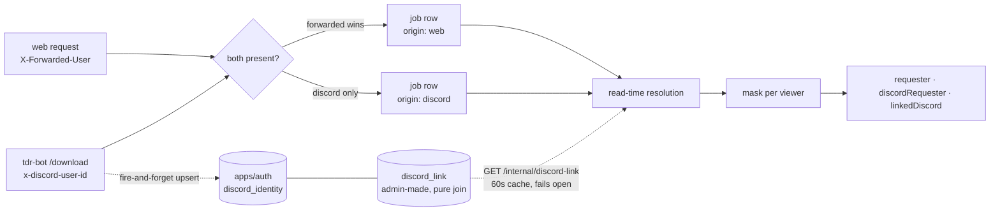

# Download App — Unified Media Experience Spec

_Formalized from voice notes, 2026-08-06._

_Frontend implemented — every page below shipped under
`docs/features/download/plans/013-frontend-rewrite.md`. Video download progress
(§2's pause/resume) shipped separately under
`docs/features/download/plans/015-video-download-progress.md`._

lilnas's download app is a single interface for acquiring and managing three kinds of media: **videos** (arbitrary URLs — YouTube, Instagram, TikTok, etc. — via yt-dlp), **movies** (via Radarr), and **shows** (via Sonarr). Downloads land on the lilnas server by default, not the requesting user's device — saving locally is a separate, explicit action (§9).

## Core Concepts

**Attribution model**

- Movies and shows are always attributed to the requesting user — no toggle, by design.
- Videos are the only media type with an optional per-download toggle to hide the requester's identity.
- A hidden attribution is hidden from other regular users only. **Admins can always see the true requester**, regardless of the toggle.
- Attribution renders as the requester's avatar everywhere the media appears — gallery, downloads-activity page, detail pages/cards — with a tooltip (or equivalent metadata) revealing who downloaded it.

**Dual attribution — a web identity and a Discord identity**

A job can arrive from two places carrying two different kinds of "who", and both are first-class.

- **Web.** Traefik's ForwardAuth middleware sets `X-Forwarded-User` / `X-Forwarded-User-Id`; `src/auth/forwarded-user.ts` reads them.
- **Discord.** `apps/tdr-bot`'s `/download` command sets `x-discord-user-id` / `x-discord-username`, plus an optional `x-discord-display-name`, via `DownloadClient.withDiscordIdentity()` — on the `createJob` call only, so the wait and cancel calls behind the same command stay unattributed. `src/auth/discord-user.ts` extracts them; `src/auth/optional-discord-user.decorator.ts` is the `@OptionalDiscordUser()` / `@OptionalDiscordDisplayName()` param-decorator pair the controller actually uses. tdr-bot never goes through Traefik — it reaches port 8081 container-to-container, and the Docker network is the trust boundary, exactly as for `/admin/check` and `/verify`.
- **The display name never reaches a job row.** It is roster enrichment forwarded to `apps/auth` (where it labels the admin link picker) and nothing else.

Which of the two a row carries is recorded on `jobs.origin` — `'web' | 'discord' | 'service'` — and the three column sets are **mutually exclusive at the database layer**: `jobs_origin_matches_requester` pins both halves of each arm (the columns that must be set _and_ the ones that must not), so a `web` row physically cannot also carry a Discord pair. `audit_log` has the same columns (`actor_discord_*`) under the same CHECK. `origin` is a DB column and an `AuditLogEntry` field; it is deliberately **not** on the `DownloadJob` wire shape, which says the same thing by which of `requester` / `discordRequester` is populated.

- **Precedence: a forwarded user always wins.** A request carrying both identities is attributed to the web one and the Discord pair is dropped with a warn — the CHECK means a row carrying both would throw, not mis-attribute. In practice the pair never arrives together (browser traffic reaches Traefik, tdr-bot reaches 8081 directly), so a hit is a signal that something upstream changed.
- **Every request carrying a Discord identity registers the observation with `apps/auth`** — fire-and-forget, never awaited, cannot fail the download — _including_ one where the forwarded user took precedence. That registration is the only thing that puts an account into the admin's picker, and it is what keeps its handle current.

**Linking a Discord account to a lilnas person — owned by `apps/auth`**

`apps/auth` owns both tables and the admin UI; `apps/download` only reads across the wire.

- `discord_identity` is a **roster of every Discord account this system has ever observed** — snowflake as the TEXT primary key, plus `username`, a nullable `displayName`, and first/last-seen timestamps. Every label on it is a cache, refreshed on each observation.
- `discord_link` is a **pure join** carrying no name at all: a lilnas `user.id` and a `discord_identity.discord_user_id`, both cascading, unique in **both** directions. Its foreign key to the roster is the database-level expression of the pick-from-a-list UI: **you may only link an account that has actually been seen.**
- **A handle is never typed by an admin.** The admin panel is two single-select lists — people without a link on one side, observed accounts without a link on the other — a Link button labelled with the pairing, and an existing-links table with Unlink. There is no text input for a snowflake or a username anywhere in it. A typed handle is a snapshot that rots; a typo would produce a link that silently matches nobody and looks correct.
- **A rename is a non-event.** Nothing keys off the handle, so a renamed user is picked up on their **next `/download` command**: the observation misses the roster's memo, re-registers, and the new handle is what every surface renders from then on. No reconciliation job, no re-link.
- `apps/download` reaches auth over two internal, Docker-network-only endpoints: `GET /internal/discord-link?discordUserId|userId|email=…`, which answers `{ identity, user }` with each half independently nullable, and `POST /internal/discord-identity`, an idempotent roster upsert. Port 8081 has no Traefik router and publishes no host port.
- _Known gap, by design:_ you **cannot pre-link someone who has never run `/download`** — the roster is built purely by observation, and there is nothing to pick from until it has been.

**Read-time resolution, in both directions, never written back**

Linking has to unify a person's _existing_ history retroactively, so nothing is stored: `jobs` keeps exactly what arrived, and resolution happens on the way out.

- **Forward** (`discordRequester` → `requester`): a Discord-submitted job by somebody who has since linked their account renders as that person.
- **Reverse** (`requester` → `linkedDiscord`): a **web** job by a linked person carries their Discord handle alongside the email.
- A linked Discord job therefore leaves all three fields populated on the wire; the UI reads them in a fixed order (masked → `requester` → `discordRequester`, with `linkedDiscord` an extra beside the email rather than a fourth branch).
- Because nothing is written back, **link and unlink are instantly and symmetrically visible across all history**, including jobs created before the link existed.
- An **unlinked but renamed** account displays under its _current_ handle, refreshed from the roster. The stored column keeps the historical name, and that is what renders if auth is unreachable.
- Resolution **fails open**: an auth outage (or an auth deploy that predates these routes) degrades to "unlinked" and never to an error. Answers are cached for 60s — negatives included, since "no link" is the common answer — and a thrown lookup for 10s.

**Masking covers all three identity fields**

The hiding rule itself is unchanged in shape — `type !== 'video' || !hiddenAttribution || isAdmin` — but it now gates **three** fields, not one. `requester` (the email), `discordRequester` (the account the job was submitted from) and `linkedDiscord` (the account belonging to whoever `requester` is) are **nulled together, through one gate**. Each names the uploader as squarely as the others, so hiding one while showing another would make the toggle a no-op for anyone with a Discord account.

- **Masking outranks resolution.** Resolution must run _before_ the mask and never after — refilling those fields afterwards would hand a non-admin exactly the identity `hiddenAttribution` exists to withhold.
- **Masking outranks disclosure.** A masked job renders `hidden` and nothing else: no handle, no snowflake, and no Discord mark anywhere in the DOM.
- The gallery's `lastRequester` / `lastDiscordRequester` pair is masked together by the same rule.

**Playback model**

- **Videos** are the only media type with an in-app playable experience.
- **Movies and shows** hand off to Emby instead: "Watch" navigates to the item in Emby once Emby has indexed the downloaded file. If Emby hasn't picked it up yet, the UI shows an "Indexing…" state rather than a Watch action.
- _Implementation note:_ built backend-only in Phase 6 (`apps/download/src/emby/`) — see `backend.md`. There was **no** prior implementation to port: the `theater` app never contained an `EmbyModule` (`feat/theater-app` is a bare scaffold), and no Emby source has ever existed anywhere in this repo's history, so don't go looking for one in git.

**Navigation model**

- Selecting any movie/show surface — a nav-bar or dedicated-search result (§3), a gallery card (§7), or the homepage's Recently Added card (§1) — always opens that title's detail page (§4 or §5). Downloading (or deleting, replacing, flagging a file) only ever happens from the detail page; no list or card surface exposes those actions directly.
- **Exception, video links only:** a raw video link has no Radarr/Sonarr-style release picker to choose from, so the nav-bar field surfaces a Download action directly, without a detail-page stop first. It still only _navigates_ — the download itself starts on the video's detail page (§8), same as every other media type.

**Entry-point model**

- The nav-bar field, present on every page, is the single entry point for both jobs: paste a video link, or search for a movie or show by title. The homepage carries no input of its own (§1).
- **On mobile**, the field competes with the doorplate, the live-download status, and the account avatar for a single row it can't fit into inline, so it collapses to a search icon. Tapping it expands the field to take over the bar full-width, in the exact same states described below; closing it, or a redirect firing, hands the bar back. Desktop has room for the field inline at all times — no collapse, no tap required.
- On every change, classify the current text as a **URL** or **not a URL**:
  - Parses as a URL (a bare `host/path` like `youtube.com/watch?v=…` counts — a scheme isn't required, an `https://` is assumed).
  - Anything else — including a URL-shaped string that still fails to parse a host — is not a URL.
- Classification is a client-side check only — a result never fires a network request from the field itself.
- **URL branch:** the icon swaps and a compact Download button appears inline, in the pill itself — no dropdown, no preview card. Clicking Download navigates to the video's detail page (§2, §8), where extraction and the download both start.
- **Anything else** is treated as a title search. Once it clears 2+ characters — the same threshold §3's search itself uses — a compact Search button appears inline, the same treatment as the Download button: icon tints, button appears in the pill, no dropdown, no results shown in the field itself. Pressing Enter does the same thing as clicking Search, so neither typing style is required. Either one navigates to the dedicated search page (§3) with results already loading.

## 1. Homepage

- Overview of the library: a glimpse of available videos, movies, and shows.
- Quick-access entry points to browse movies, browse shows, view your video library, or jump to downloads activity.
- No input lives on this page — pasting a link or searching a title both happen in the nav-bar field (Entry-point model, Core Concepts), present here and on every other page.
- Recently added items link to their detail page (§4, §5, or §8) exactly like a gallery or search result does — see the Navigation model under Core Concepts.

## 2. Video Downloads

1. User pastes a URL into the nav-bar field (Entry-point model, Core Concepts), reachable from every page.
2. Once the field recognizes the text as a link, a compact Download button appears inline — no preview, no separate resolving state (see Entry-point model). Clicking it navigates to the video's detail page (§8), where the download starts: yt-dlp extraction, metadata, progress, cancel, and **pause** controls all render there, with no separate status page to navigate to. If yt-dlp doesn't recognize the link, the detail page shows a "not recognized" state instead (§8).
3. On completion, the user can watch the video in-app or save it locally (§9).

**Pause/resume — verified feasible.** The app already spawns yt-dlp as a child process and cancel already calls `proc.kill()` (Node's default SIGTERM) without deleting any files — that's exactly the primitive pause needs. Confirmed live: throttled a download, sent SIGTERM at 123,625 of 614,433 bytes, then re-ran the identical yt-dlp command — it printed `Resuming download at byte 123625` and finished by transferring only the remaining ~20%, not re-fetching from zero. No flag changes needed; yt-dlp's default `--continue`/`.part` behavior already does this.

- _Implementation note:_ this needs a new `Paused` job status (distinct from `Cancelled`) and a `resumeVideoDownloadJob` counterpart to the existing `cancelVideoDownloadJob` that re-enters `download()` for the same job/working directory instead of finalizing it.
- _Caveat:_ verified against a simple progressive format (yt-dlp resolved `-f worst` to itag 18). The app doesn't currently force a format, so a default/best-quality YouTube grab may resolve to fragmented DASH streams, which resume via a different (also well-supported, but unverified here) per-fragment mechanism. Worth a quick confirmation against whatever format selection ships before calling this fully closed.

## 3. Movie & Show Discovery

- Search by title, year, cast, or genre — via the nav-bar search field, present on every page, and/or the dedicated search page. Both are entry points into the same search, not separate implementations; the homepage no longer participates (§1).
- Debounced (~300ms), requires 2+ characters before searching. Results interleave movies and shows in one list, each row tagged with its type, sorted however Radarr/Sonarr already rank them — no custom re-ranking. No matches after the debounce settles shows a plain "No matches for '<query>'" state, not an error.
- Filter by metadata: genre, release-date range, and other relevant facets — on the dedicated search page. Sort the results too (relevance, title, release date). The nav-bar field is a quick jump into the same search, not a second filtering or sorting surface.
- Selecting a result opens its detail page (§4 or §5), whether or not the title has been downloaded yet — the detail page itself already has to show both states (Download vs. Watch/Delete).

## 4. Show Detail Page

- Title, cast, and show-level metadata.
- Seasons, and the episodes within each season.
- Download a single episode, a full season, or the entire series.
- Delete (once downloaded) a single episode, a full season, or the entire series.
- **Watch** navigates to Emby once indexed; shows "Indexing…" otherwise (see Playback model).
- File selection/replacement and bad-file reporting per §6.

## 5. Movie Detail Page

- Same metadata surface as the show page — trailer, cover art, cast — but only one file to manage (no seasons/episodes).
- Download or delete the movie's single file.
- **Watch** navigates to Emby once indexed; shows "Indexing…" otherwise (see Playback model).
- File selection/replacement and bad-file reporting per §6.

## 6. File Selection, Replacement & Bad-File Reporting

Radarr and Sonarr both expose the list of available release files for a given movie or episode; the app surfaces this instead of locking users into one automatic choice.

- **Picking a file:** browse available releases for a movie/episode and choose which to download.
- **Replacing a bad download:** one flow — the user picks a new file, and the app deletes the old file and downloads the new one automatically. No manual delete step.
- **Reporting a bad file:** flagging a file as bad shows a "bad file" indicator in the UI and blocks that release from being auto-selected again if the item is deleted and re-downloaded — but **this block is enforced only inside the download app**. It doesn't touch Radarr/Sonarr's own selection logic, so a user going directly to Radarr's or Sonarr's UI can still grab the flagged release. Accepted as a known gap, by design.

## 7. Unified Gallery

- One gallery spanning all three media types.
- Filterable by date, uploader/author (where available), media type, and other relevant facets — mirroring §3's discovery filters.
- Each item links to its detail page; attribution avatars render per the Core Concepts model, and movie/show cards follow the same Emby/Indexing playback behavior.
- _Scope cut:_ the **uploader facet still groups by email**, so an unlinked Discord-only job produces no chip and stays out of that aggregate — widening the filter without widening the facet would only add an arm nothing in the UI can reach, and widening the facet means resolving links inside SQL aggregation. A card's own attribution still resolves normally (forward direction only — a gallery card has no `linkedDiscord` field to fill).

## 8. Video Detail Page

- Cover art/thumbnail, title, author.
- Link back to the original source post.
- Action to download the video, distinct from the local-save action in §9.
- Reached from the nav-bar field's Download button (Entry-point model, Core Concepts) with the download already under way — or, if yt-dlp doesn't recognize the link after all, a "not recognized" state here instead, pointing the user back at the nav bar to try a different link.

## 9. Local Downloads ("Save to Your Device")

Normal downloads land on the lilnas server, not the user's machine. A separate, explicit action lets a user pull a video, movie, or show file down to their own device — for offline viewing or to bypass the server entirely.

## 10. Downloads Activity Page

Visible to everyone: all downloads currently in progress, across all users, in real time. For videos with attribution hidden, regular users see that entry anonymized — **admins see the real attributing user inline on this same page**, not through a separate view.

A Discord-submitted job whose account nobody has linked yet renders as the handle plus a small Discord mark. The mark is a real button (click or tap, not a hover tooltip) that discloses the current handle and the raw snowflake, with the note that no lilnas account is linked yet. Once an admin links the account that row never reaches this branch again — the server resolves it into an email first. A masked row renders none of it, per the Core Concepts masking rule.

## 11. Admin Dashboard

Admin-only:

- System-wide insights/metrics on download activity.
- **Full download history:** every download that has ever happened, across every user, in every status — the whole job lifecycle (queued, downloading, paused, converting, importing, cleaning, cancelling, completed, failed, cancelled). This is the admin's own view, not §10 reused — §10 stays in-progress-only; this is the complete record. True attribution always visible, including videos toggled anonymous for everyone else.
- Per-user download history is a filter on that full view — scope it down to one user — not a separate capability.
- Aggregate stats (most active downloaders, usage trends, etc.). _Scope cut:_ the **leaderboard still ranks by email**, the same deferral §7's uploader facet carries — unlinked Discord-only jobs are absent from it.
- **Audit log:** full trail of user interactions with the download system, extensible to future services calling into the download API. Rows carry `origin` alongside `actor` and `discordActor`, so a `null` actor is legible as "a service did this" rather than "we lost track of who". Discord actors resolve to a lilnas person at read time like job rows do, but `origin` is **never rewritten** — how the action arrived is a fact about the past that linking an account cannot change. The cancel and delete routes accept the Discord headers too, for the audit row only — no job record is minted there, so `jobs.origin` is untouched — though tdr-bot does not currently send them on those calls.

## 12. User Profile Page

Clicking a user's avatar or name anywhere in the app opens that user's profile page. Today every identity render is a dead pixel — this section makes them lead somewhere.

**A computed view, not a stored entity.** There is no `users` table **in this app**: identity is the forwarded `email`/`userId` pair from Traefik's ForwardAuth headers, and every "who" fact — including §11's leaderboard — is derived at query time from the `jobs` table's requester columns. The profile page is therefore a computed view over the job log. There is no profile record to fetch by id, no `UsersService`, nothing to edit or delete — and a profile for an email with no jobs is simply empty, not a 404, because there's no entity to be missing. (`apps/auth` does have a `user` table — Better Auth writes a row on first Google sign-in — and that is the table `discord_link` points at. It is not reachable from here except through auth's internal lookup, which is why the profile is still addressed by email rather than by id.)

**One person, one history — across both surfaces.** For a requester with a linked Discord account, `GET /history` and `GET /profile` OR the linked snowflake onto the email scope, so their Discord-submitted and web-submitted jobs read as one list. The snowflake is always _derived_ from the scope's email or user id — there is no `?discordUserId=` query parameter, so the unification cannot be used to ask about somebody else's Discord account — and the attribution-oracle guard gates the Discord arm identically to the email one. It fails open: if auth cannot be reached the scope narrows back to the web history, which is exactly what an unlinked person's history is.

- **What it shows:** an identity header (avatar, email), per-user aggregate stats computed from `jobs` (lifetime totals by media type and by status, a downloads-per-day trend, first/last download timestamps), and that user's download history. The history is the **same mechanism §11 already defines** — `GET /history` scoped to one requester — embedded here, not a new history capability.
- **Who can open whose:** your own profile, always; **another user's profile requires admin** — the exact self-or-admin split `GET /history` already enforces (self-scope always allowed, another requester needs admin, else 403). Regular users do _not_ get a stripped-down "public profile" of others: the page's defining content is data the system already classifies as self-or-admin, and a public variant would duplicate what §7's uploader filter already provides (with the attribution-oracle guard) while adding a new oracle surface every future aggregate would have to defend. "What did this person download?" for a regular user remains the gallery, filtered by uploader.
- **Click entry points:** the requester cells in §10's activity table and §11's full-history table, §11's top-downloaders leaderboard rows, attribution avatars on gallery cards and detail pages, and the "Your account" avatar button in every page's app bar (→ own profile, always). A link renders only where the viewer is allowed through: for a regular user, only their own identity links — everyone else's avatar stays exactly as it looks today, just non-interactive — so the UI never offers a navigation the API would 403.
- **Hidden attribution never links.** A masked requester (dashed avatar, "hidden") has no identity to link to for the viewer it's masked from. Admins see true attribution inline everywhere (§10), so the same row is a real, linkable identity for them — consistent with the Core Concepts attribution model.
- **The aggregate chips filter the embedded history.** Each by-type and by-status chip is a toggle, checkbox-style: click "video · 41" and the history table below scopes to videos; click again to clear it. Multiple chips within a group can be active at once — the same multi-select idiom §7's uploader filter uses — and an active type selection combines with an active status selection with AND semantics (e.g. failed videos), matching how the job filter already composes the two server-side.
- Chip counts stay lifetime totals no matter what's selected — the label never recomputes to the filtered view, per the profile totals' all-time, never-windowed-or-scoped convention — and an active chip reads visually distinct (tonally filled/bordered, not the plain chip look) so the applied filters are legible at a glance.
- Zero rows for an active filter combination is its own "no downloads match these filters" state, distinct from the empty profile of a user with no jobs at all — one invites different filters, the other has nothing to filter yet.
- _Implementation note:_ the embedded history's `GET /history` query doesn't accept type/status parameters yet and needs that extension (the underlying job filter already supports both; the shape belongs in the plan doc, not here). No new access-control surface: filtering stays inside the same self-or-admin requester scoping the history already enforces.
