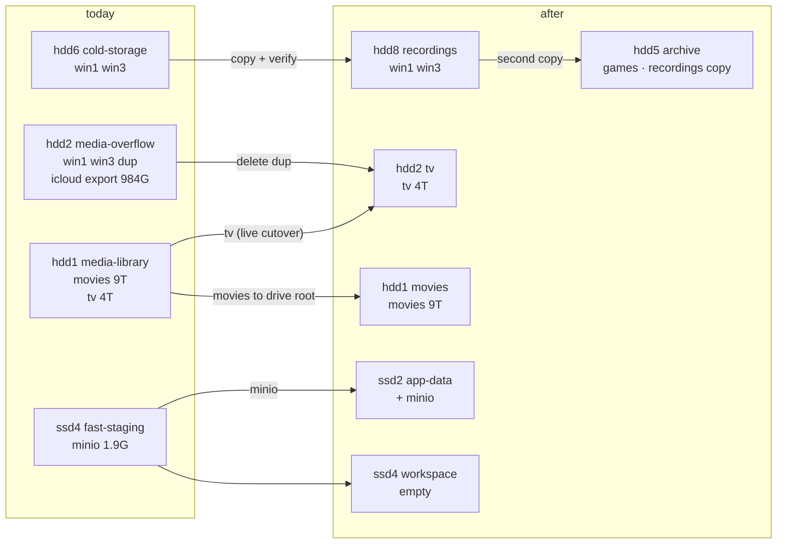
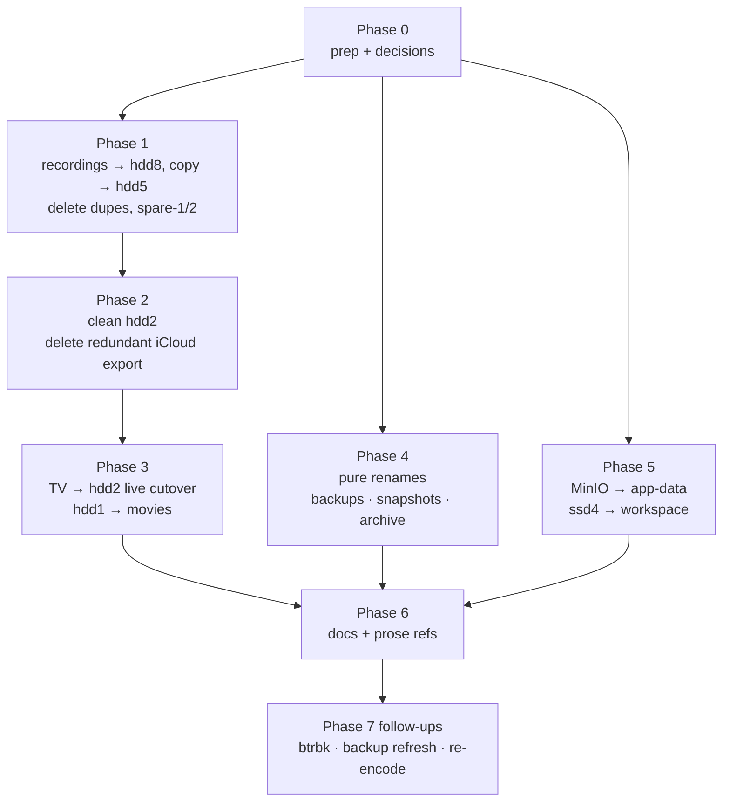

# Rename the semantic storage and put each dataset on the right drive — `/storage`, `infra/*.yml`, `apps/download/deploy*.yml`, `docs/semantic-storage.md`

## Overview

> Written for a human first. Everything below this section is written for whoever
> executes the plan. Nothing in this plan has been started; the server is exactly as
> described under "Current state".

Two Nexus sessions on 2026-09-29 ("Hard Drive Storage Usage Analysis" `eb39244d`, then
"Hard Drive Duplicate File Analysis" `c485adca`) looked at all twelve data drives and
found four problems with how `/storage` is laid out today:

| Problem                                   | Evidence                                                                                                                                                                        |
| ----------------------------------------- | ------------------------------------------------------------------------------------------------------------------------------------------------------------------------------- |
| **Names describe tiers, not contents**    | `backup-tier1` holds a photo backup, `media-overflow` holds gameplay recordings and an iCloud export, `cold-storage` holds the same recordings, `fast-staging` holds MinIO.     |
| **The docs are stale**                    | `docs/semantic-storage.md` marks `backup-tier1`, `media-overflow` and `cold-storage` "currently unused"; says MinIO data is in `app-data`; lists Immich paths that don't exist. |
| **2.4 TB is duplicated**                  | `win1` + `win3` recordings exist byte-identical on `hdd2` and `hdd6` (sampled-hash verified; `hdd6` has one extra file, `bogeys.prproj`).                                       |
| **Datasets sit on the wrong-sized drive** | `hdd1` (19T) is 71% full with movies + TV while `hdd2` (19T) is 18% full; the recordings sit on a 5.5T drive while three 22T drives are empty.                                  |

This plan renames every alias so the name says what is inside, moves three datasets onto
drives that fit them, deletes the duplicates, and updates the compose mounts and docs. It
also settles **how** we copy, verify, delete and flip mounts, so the same recipe works for
any later move.

### Target layout

| Alias (new)           | Drive  | Size | Contents after the plan                                                | Replaces           |
| --------------------- | ------ | ---- | ---------------------------------------------------------------------- | ------------------ |
| `/storage/movies`     | `hdd1` | 19T  | Movies only (~9T, ~49%)                                                | `media-library`    |
| `/storage/tv`         | `hdd2` | 19T  | TV only (~4T, moved from `hdd1`)                                       | `media-overflow`   |
| `/storage/backups`    | `hdd3` | 22T  | Plain copies of `photos` and `app-data` (photos already)               | `backup-tier1`     |
| `/storage/snapshots`  | `hdd4` | 22T  | btrfs snapshot history of `photos` + `app-data` (btrbk)                | `backup-tier2`     |
| `/storage/archive`    | `hdd5` | 22T  | Game-server backups, second copy of recordings, iCloud tooling scripts | `backup-archive`   |
| `/storage/spare-1`    | `hdd6` | 5.5T | Empty, after the recordings move                                       | `cold-storage`     |
| `/storage/spare-2`    | `hdd7` | 5.5T | Empty                                                                  | `expansion`        |
| `/storage/recordings` | `hdd8` | 22T  | Gameplay captures `win1` + `win3` (2.2T)                               | _(no alias today)_ |
| `/storage/photos`     | `ssd1` | 3.7T | unchanged                                                              | —                  |
| `/storage/app-data`   | `ssd2` | 1.9T | unchanged, **plus** MinIO data moved in from `ssd4`                    | —                  |
| `/storage/downloads`  | `ssd3` | 3.7T | unchanged                                                              | —                  |
| `/storage/workspace`  | `ssd4` | 3.7T | Fast working area (re-encoding the recordings, edits)                  | `fast-staging`     |

`/storage/files` is a real directory on the root NVMe (31M, served by copyparty). It is
not a drive alias and this plan leaves it alone.



### Decisions still open

All five were proposed in session `c485adca` and confirmed on 2026-09-29. Kept here so the
reasoning survives; nothing blocks Phase 0.

| Decision                           | Proposed                                                                                                                                                                                                    | Alternative | Needed by |
| ---------------------------------- | ----------------------------------------------------------------------------------------------------------------------------------------------------------------------------------------------------------- | ----------- | --------- |
| Name for the `hdd8` recordings     | **Decided 2026-09-29: `recordings`.** Names the data; rename to `cold-storage` only if other archived projects ever join it                                                                                 | —           | Phase 1   |
| Backup drive names                 | **Decided 2026-09-29: `backups` (hdd3), `archive` (hdd5).**                                                                                                                                                 | —           | Phase 4   |
| Unassigned 5.5T drives             | **Decided 2026-09-29: `spare-1` (hdd6), `spare-2` (hdd7).** Honest names; one `ln -sfn` renames either the day it gets a job                                                                                | —           | Phase 1   |
| Old iCloud export on `hdd2` (984G) | **Decided 2026-09-29: delete it.** All 13,108 files exist at the same path and size in `photos/icloud`, and `backups/photos` is a newer copy; only the ~30 KB of scripts are kept as `archive/icloud-tools` | —           | Phase 2   |
| Where MinIO data lives             | **Decided 2026-09-29: move to `app-data/minio` on `ssd2`.** It is app state, and `workspace` stays fully disposable                                                                                         | —           | Phase 5   |

## Current state (verified 2026-09-29)

All drives are single-device btrfs filesystems mounted at `/mnt/<dev>` via `/etc/fstab`
(top-level subvolume, zstd compression). Every `/storage/<alias>` is a **symlink to a
drive root**, owned by `jeremy:sudo`. No btrfs labels are set. No cron, systemd timer,
btrbk, Samba or NFS references any `/storage` or `/mnt` path — the only consumers are
the compose files below.

| Alias            | Drive  | Device           | Size | Used | Contents                                                                                                         | Live containers mounting it                               |
| ---------------- | ------ | ---------------- | ---- | ---- | ---------------------------------------------------------------------------------------------------------------- | --------------------------------------------------------- |
| `media-library`  | `hdd1` | `/dev/sdg1`      | 19T  | 13T  | `movies/` 9.0T (292 titles), `tv/` 4.0T (78 series), `downloads/` empty                                          | sonarr, radarr, emby, download, download-dev              |
| `media-overflow` | `hdd2` | `/dev/sdd1`      | 19T  | 3.2T | `win1/` 1.8T, `win3/` 462G (dupes), `icloud/` 984G + restore scripts, `lilnas-backups/` empty, `.pnpm-store/` 2M | none                                                      |
| `backup-tier1`   | `hdd3` | `/dev/sda1`      | 22T  | 2.1T | `photos/` 2.0T — manual Oct-2025 copy of `ssd1`, 363G behind                                                     | none                                                      |
| `backup-tier2`   | `hdd4` | `/dev/sdb1`      | 22T  | 0    | empty                                                                                                            | none                                                      |
| `backup-archive` | `hdd5` | `/dev/sdc1`      | 22T  | 4.4G | `minecraft-sevtech-backup-20250816.7z`, `palworld/`, `valheim/`                                                  | valheim (palworld when running)                           |
| `cold-storage`   | `hdd6` | `/dev/sde1`      | 5.5T | 2.2T | `win1/`, `win3/` — the copy to keep (has `bogeys.prproj`)                                                        | none                                                      |
| `expansion`      | `hdd7` | `/dev/sdf1`      | 5.5T | 0    | empty                                                                                                            | none                                                      |
| _(none)_         | `hdd8` | `/dev/sdh1`      | 22T  | 0    | empty                                                                                                            | none                                                      |
| `photos`         | `ssd1` | `/dev/nvme1n1p1` | 3.7T | 2.4T | `icloud/`, `icloud-mom/`, `google-photos/`, `home-movies/`, `immich/`, `insta-go-3/`                             | immich (server, ml, db)                                   |
| `app-data`       | `ssd2` | `/dev/nvme2n1p1` | 1.9T | 53G  | one dir per service                                                                                              | most services                                             |
| `downloads`      | `ssd3` | `/dev/nvme4n1p1` | 3.7T | 141G | `active/`, `completed/`                                                                                          | sonarr, radarr, sabnzbd                                   |
| `fast-staging`   | `ssd4` | `/dev/nvme3n1p1` | 3.7T | 1.9G | `minio/` — **live MinIO data** (docs wrongly say `app-data/minio-data`)                                          | storage (MinIO) — prod **and** dev compose share this dir |

### Facts that shape the strategy

- **Docker resolves the symlink when the container is created.** Inside `lilnas-sonarr-1`,
  `/tv` is a bind of `/dev/sdg1` (`hdd1`) directly — `docker inspect` shows the
  `/storage/...` string, but `/proc/<pid>/mountinfo` shows the real device. Repointing a
  symlink changes nothing for a running container; it must be **recreated**.
- **Sonarr and Radarr store container paths.** `RootFolders.Path` is `/tv/` and `/movies/`;
  every `Series.Path`/`Movies.Path` starts with those. Emby's libraries are configured
  against the same container paths. As long as the **container side** of every mount stays
  identical, no application needs reconfiguring.
- **The download app depends on that too.** `apps/download/deploy.yml` mounts the library
  at the same `/movies` and `/tv` container paths Radarr/Sonarr report, so path strings need
  no translation (`docs/features/download/backend.md`, ":ro library mounts"). Only the
  host side of those mounts changes.
- **Same-drive moves are free.** `mv` within a btrfs filesystem is a rename — moving
  `/mnt/hdd1/movies/*` to `/mnt/hdd1/` is instant regardless of size.
- **Cross-drive copies are hours.** HDD→HDD runs ~150–200 MB/s: 2.2T ≈ 3.5–4.5 h, 4T ≈ 6–8 h,
  984G ≈ 1.5–2 h. A full-checksum verify reads both sides and costs about the same again.
- **Nothing else references the old names.** `grep` across the repo (excluding
  `docs/archive`), `~/.config`, `/etc/systemd`, crontabs: the only functional references are
  in the compose files listed under "Compose mounts". Prose mentions exist in the download
  feature docs and code comments (listed in Phase 6).

## Conventions

These are the rules every phase follows.

- **One alias = one drive = one dataset, and the alias points at the drive root**
  (`/storage/<alias> -> /mnt/<dev>`), exactly as today. `/etc/fstab` is not touched; drives
  keep their `/mnt/hddN` identity. `archive` and `backups` are the two intentional
  exceptions that hold several named subfolders, because "many small archived things" _is_
  their dataset.
- **Container paths never change.** Only the host side of a `volumes:` line changes. This
  is what makes the whole plan app-config-free.
- **Names say what is inside**: lowercase, hyphenated, no tier numbers. Unassigned drives
  are `spare-N`, and get renamed the day they get a job (one `ln -sfn`).
- **The old alias is removed in the same phase**, right after `grep -rn <old-name>` over
  the repo and `docker ps` + `docker inspect` mounts both return nothing. No long-lived
  compatibility symlinks: a name that points at a drive whose layout changed underneath
  it is worse than a missing name.
- **Always operate on `/mnt/<dev>` paths when copying or deleting**, never through
  `/storage/<alias>` — `rm -rf /storage/x/` (trailing slash) follows the symlink into the
  drive, and `rm /storage/x` (no slash) removes the link. Use the unambiguous form.
- **Every long copy or verify runs through `scripts/storage-migrate.sh` in one detached
  tmux session** (see "Running the long copies"), never in a foreground shell that dies
  with the session. Its logs under `~/storage-migration/` are the durable record.

## Strategy: copying and moving

### Which tool

| Situation                                    | Tool                                                                             | Why                                                                                        |
| -------------------------------------------- | -------------------------------------------------------------------------------- | ------------------------------------------------------------------------------------------ |
| Move within one drive                        | `mv` (or `find -mindepth 1 -maxdepth 1 -exec mv -t DEST {} +` to catch dotfiles) | Rename, instant.                                                                           |
| Copy between drives                          | `ionice -c2 -n7 nice -n19 rsync -aHAX --info=progress2 --partial SRC/ DST/`      | Preserves perms/owners/xattrs/mtimes, resumable, low I/O priority so Emby keeps streaming. |
| Root-owned files (MinIO `files/`, `images/`) | Same rsync under `sudo`                                                          | `-a` can't preserve ownership otherwise.                                                   |
| btrfs `send/receive`                         | Not used                                                                         | Data lives on top-level subvolumes, not snapshots; rsync is simpler and drive-agnostic.    |

Trailing slashes matter: `rsync … /mnt/hdd6/ /mnt/hdd8/` puts `win1/` and `win3/` at
`/mnt/hdd8/win1`, not `/mnt/hdd8/hdd6/win1`.

### Running the long copies: one script, one tmux session

All the multi-hour copies and verifies are driven by **`scripts/storage-migrate.sh`**, run
once inside a **detached tmux session** so it survives the SSH/Nexus session that started
it. It runs the steps below strictly one after another — each reads what the previous one
wrote, and two rsyncs on the same HDD would only slow each other down — and exits when
they are all done or on the first failure.

```bash
# start (from the repo root); the shell stays open after the script exits so the final
# screen is still readable
tmux new-session -d -s storage-migrate -c /home/jeremy/lilnas
tmux send-keys -t storage-migrate 'scripts/storage-migrate.sh' Enter

tmux attach -t storage-migrate            # watch live; Ctrl-b d detaches, script keeps running
tmux capture-pane -pt storage-migrate | tail -20   # peek without attaching (also how Claude checks)
scripts/storage-migrate.sh status         # done / partial / pending per step, from any shell
tmux kill-session -t storage-migrate      # only if a copy must be abandoned; re-run resumes
```

| Step                     | Phase | Does                                                                  | ≈ time |
| ------------------------ | ----- | --------------------------------------------------------------------- | ------ |
| `copy-recordings-hdd8`   | 1     | `hdd6/{win1,win3}` → `hdd8/` (the new `recordings`)                   | 4 h    |
| `verify-recordings-hdd8` | 1     | full-checksum dry run, must be identical                              | 4 h    |
| `copy-recordings-hdd5`   | 1     | `hdd8/{win1,win3}` → `hdd5/recordings/` (reads hdd8, not hdd6)        | 4 h    |
| `verify-recordings-hdd5` | 1     | full-checksum dry run, must be identical                              | 4 h    |
| `copy-icloud-tools`      | 2     | the ~30 KB of scripts beside the iCloud export → `hdd5/icloud-tools/` | s      |
| `presync-tv`             | 3     | `hdd1/tv/` → `hdd2/` root while Sonarr/Emby stay live                 | 6–8 h  |

Two more steps exist but **never run by default**; they are invoked by name inside the
Phase 3 window: `final-sync-tv` (the catch-up sync with `--delete`, which refuses to run
while `hdd2` holds anything that is not a TV series) and `verify-tv`.

- **Resumable.** Every finished step leaves a marker in `~/storage-migration/<step>.done`
  and is skipped on the next run; rsync's `--partial` resumes a half-copied file. After a
  reboot, a kill, or a failure, the fix is to start the tmux session again with the same
  two commands. Naming a step on the command line runs it even if its marker exists
  (`scripts/storage-migrate.sh presync-tv` is how the second live pass in Phase 3 is done).
- **Safe.** It never deletes on a source drive; copies are additive and `.trash-*` is
  excluded everywhere. It refuses to run a step whose drives are not mounted (so an
  unmounted `/mnt/hdd8` can't silently fill the root NVMe) or lack the free space.
- **Durable record** — `~/storage-migration/<step>.log` (rsync output, exit status) and
  `<step>.diff` (verify output, **must be empty**). These outlive the tmux session and
  survive a reboot (not `/tmp`). tmux's own scrollback is lost with the session, which is
  why the logs exist.
- **Failures stop the chain.** rsync exit `23`/`24` mean files were skipped or vanished
  (`24` is normal for `presync-tv` if Sonarr upgraded an episode mid-copy: just re-run).

### Verification tiers

| Data class                                               | Verify with                                                                                                          | Passes when                       |
| -------------------------------------------------------- | -------------------------------------------------------------------------------------------------------------------- | --------------------------------- |
| Irreplaceable (recordings, iCloud export, MinIO, photos) | `rsync -rcn --delete -i SRC/ DST/ \| tee LOG` — full checksum, dry run                                               | `LOG` is **empty**                |
| Replaceable (TV, movies)                                 | `rsync -rn --delete -i SRC/ DST/ \| tee LOG` — size+mtime, dry run, plus play one episode from the new drive in Emby | `LOG` is empty and playback works |

`-c` reads every byte on both sides, so budget the same time as the copy. `--delete` in the
dry run also reports files that exist only on the destination, which catches a wrong
target directory.

### Cutting over a live dataset (TV is the only one)

Docker binds a volume when the container is **created**, so switching a consumer to a new
drive always means one recreate — a normal container restart, seconds long. That is the
only disruption in this plan that cannot be avoided; everything else is arranged so no
running service notices. Sonarr imports into `/tv` and Emby writes metadata alongside
episodes, so TV keeps changing during the copy; the recipe below makes the recreate window
the whole outage:

1. **Pre-sync while live**: the long rsync (hours). Nothing is stopped.
2. **Second incremental sync, still live**: same command again (minutes) — it carries
   over whatever was imported during step 1, so the final sync has almost nothing to do.
3. **Stop the consumers**: `docker-compose stop sonarr radarr emby download` plus
   `docker-compose -f docker-compose.dev.yml stop download` if the dev container is up.
   Optional: pause SABnzbd's queue beforehand so Sonarr has nothing to import in the window.
4. **Final sync**: `rsync -a --delete -i SRC/ DST/` — seconds.
5. **Verify** (replaceable tier).
6. **Same-drive renames** (instant), then **flip** symlink + compose edit together (see
   "Compose mounts").
7. **Recreate**: `docker-compose up -d sonarr radarr emby download`.
8. **Health-check** (per-service list under "Compose mounts").
9. **Quarantine the source**, delete later (see "Deleting").

Steps 3–7 take about as long as restarting the four containers. Anyone mid-stream in Emby
sees a hiccup; nothing else is affected. Quiet hours are enough; no announcement needed.

### Disruption budget

| Phase | Running containers affected                             | Outage                                                  |
| ----- | ------------------------------------------------------- | ------------------------------------------------------- |
| 1, 2  | none — nothing mounts hdd6, hdd8, hdd2, hdd5's new dirs | none                                                    |
| 3     | sonarr, radarr, emby, download (+ dev download)         | one restart, ~30 s, during quiet hours                  |
| 4     | valheim (`palworld` is stopped; compose edit only)      | one restart, ~10 s, when nobody is playing              |
| 5     | storage (MinIO)                                         | one restart, ~10 s (copy live first, final sync is 1 s) |
| 6     | none                                                    | none                                                    |

## Strategy: deleting

- **Order is copy → verify → flip → health-check → quarantine → delete.** Deletion is the
  last step of every phase, never earlier, because everything before it is reversible in
  seconds by pointing the symlink back.
- **Quarantine by rename, not by `rm`**: `mv /mnt/hdd2/win1 /mnt/hdd2/.trash-20260929/win1`.
  Instant, frees nothing yet, but takes the data out of every consumer's view. Dot-prefixed
  folders are ignored by Emby and by Radarr/Sonarr's root-folder scans — confirm on the
  first quarantine by triggering an Emby library scan; if a `.trash-*` folder shows up, delete
  immediately instead of quarantining.
- **Delete after the phase's health check has held for at least a day**:
  `rm -rf --one-file-system /mnt/hdd2/.trash-20260929`. Always the `/mnt` path, always
  `--one-file-system`.
- **Confirm the space came back** with `btrfs filesystem usage /mnt/hdd2` — btrfs frees
  extents asynchronously and `df` can lag for a minute.
- **Only delete what has two verified copies elsewhere if it is irreplaceable.** For the
  recordings that means `hdd2`'s and `hdd6`'s copies go only after **both** `hdd8` and
  `hdd5` pass the checksum verify.
- **Delete empty leftovers freely**: `/mnt/hdd1/downloads`, `/mnt/hdd2/lilnas-backups` (0
  bytes each) and `/mnt/hdd2/.pnpm-store` (2M) are junk and don't need quarantine.

## Strategy: compose mounts and symlinks

### Every line that changes

| File                           | Line | Today                                                         | After                                                  |
| ------------------------------ | ---- | ------------------------------------------------------------- | ------------------------------------------------------ |
| `infra/media.yml`              | 18   | `/storage/media-library/tv:/tv`                               | `/storage/tv:/tv`                                      |
| `infra/media.yml`              | 38   | `/storage/media-library/movies:/movies`                       | `/storage/movies:/movies`                              |
| `infra/media.yml`              | 78   | `/storage/media-library/tv:/tv`                               | `/storage/tv:/tv`                                      |
| `infra/media.yml`              | 79   | `/storage/media-library/movies:/movies`                       | `/storage/movies:/movies`                              |
| `apps/download/deploy.yml`     | 25   | `/storage/media-library/movies:/movies:ro`                    | `/storage/movies:/movies:ro`                           |
| `apps/download/deploy.yml`     | 26   | `/storage/media-library/tv:/tv:ro`                            | `/storage/tv:/tv:ro`                                   |
| `apps/download/deploy.dev.yml` | 129  | `/storage/media-library/movies:/movies:ro`                    | `/storage/movies:/movies:ro`                           |
| `apps/download/deploy.dev.yml` | 130  | `/storage/media-library/tv:/tv:ro`                            | `/storage/tv:/tv:ro`                                   |
| `infra/valheim.yml`            | 21   | `/storage/backup-archive/valheim:/config/backups`             | `/storage/archive/valheim:/config/backups`             |
| `infra/palworld.yml`           | 19   | `/storage/backup-archive/palworld/v2.7.1/:/palworld/backups/` | `/storage/archive/palworld/v2.7.1/:/palworld/backups/` |
| `infra/minecraft.yml`          | 2    | comment: `/storage/backup-archive/minecraft-…`                | `/storage/archive/minecraft-…`                         |
| `infra/shared.yml`             | 18   | `/storage/fast-staging/minio:/data`                           | `/storage/app-data/minio:/data`                        |
| `infra/shared.dev.yml`         | 16   | `/storage/fast-staging/minio:/data`                           | `/storage/app-data/minio:/data`                        |

Container-side paths are identical in every row — that is the whole point.

### Flipping

- **Create/repoint**: `ln -sfn /mnt/hdd8 /storage/recordings`. The `-n` matters: without it,
  if `/storage/recordings` already exists as a link to a directory, `ln` creates the new link
  _inside_ the target drive.
- **Remove an old alias**: `rm /storage/media-library` — no trailing slash.
- **Edit the compose file in the same step**, then `docker-compose up -d <services>` from the
  repo root. Because the host path string changed, Compose sees a config diff and recreates
  the container on its own.
- **Gotcha — repointing without renaming**: if a symlink's target changes but the compose
  string does not (e.g. a temporary compatibility link), Compose sees no diff and leaves the
  old bind in place. Use `docker-compose up -d --force-recreate <service>` in that case. This
  plan avoids the situation by always renaming.
- **Stopped services** (e.g. `palworld`, which is currently not running): edit the compose
  file only; they pick up the new path on their next start. Don't `up -d` a service just to
  recreate it.
- **The dev compose** has its own copy of the download mounts; recreate with
  `docker-compose -f docker-compose.dev.yml up -d download`.

### Health checks after a flip

| Service  | Check                                                                                                                     |
| -------- | ------------------------------------------------------------------------------------------------------------------------- |
| sonarr   | System → Health shows no "root folder missing"; open a series, files listed; `docker exec lilnas-sonarr-1 ls /tv \| head` |
| radarr   | Same, against `/movies`                                                                                                   |
| emby     | Library → scan completes; play one movie and one episode; no new "missing" items                                          |
| download | Open a show page and a movie page: file rows resolve; `docker exec lilnas-download-1 ls /tv /movies \| head`              |
| valheim  | `docker exec lilnas-valheim-1 ls /config/backups` shows existing backups                                                  |
| storage  | Container reports `healthy`; `files.lilnas.io` upload/download works; equations render (uses the `equations` bucket)      |
| any      | `grep -E ' /(tv\|movies\|data) ' /proc/$(docker inspect -f '{{.State.Pid}}' <ctr>)/mountinfo` names the **new** device    |

## Phases



Phases 1, 4 and 5 are independent of each other and can run in any order or in parallel.
Phase 3's **cutover** must wait for Phase 2 because `tv` points at `hdd2`'s **root**, and
Emby would index `win1/`, `win3/` and `icloud/` as TV shows if they were still there. The
`presync-tv` copy itself has no such dependency and runs as soon as Phase 1's steps finish.

### Phase 0 — Prep

- [x] Confirm the open decisions above — all five confirmed 2026-09-29.
- [ ] `mkdir -p ~/storage-migration && ls -l /storage > ~/storage-migration/00-symlinks-before.txt && df -h /mnt/hdd* /mnt/ssd* > ~/storage-migration/00-df-before.txt`
- [ ] Baseline grep, keep the output: `grep -rnE 'media-library|media-overflow|fast-staging|backup-tier|backup-archive|cold-storage|/storage/expansion' . --exclude-dir=node_modules --exclude-dir=.git --exclude-dir=archive > ~/storage-migration/00-refs-before.txt`
- [ ] Create a branch (`storage-rename`) for the compose + docs edits. Each phase ends with
      a commit so a half-done migration is visible in git.

### Phase 1 — Recordings to `hdd8`, second copy to `hdd5`, delete duplicates

Frees 2.4T on `hdd2` and 2.2T on `hdd6`; the recordings end with two verified copies on two
22T drives.

- [ ] Start the script in the `storage-migrate` tmux session (two commands under "Running the long copies"). Its first four steps are this phase: `copy-recordings-hdd8`, `verify-recordings-hdd8`, `copy-recordings-hdd5`, `verify-recordings-hdd5` (≈16 h total; it then continues into Phase 2's and Phase 3's copy steps on its own).
- [ ] When `status` shows all four `done` and both `~/storage-migration/verify-recordings-*.diff` are empty: `ln -sfn /mnt/hdd8 /storage/recordings`.
- [ ] Quarantine both old copies: `mkdir /mnt/hdd2/.trash-$(date +%Y%m%d) /mnt/hdd6/.trash-$(date +%Y%m%d)`; `mv /mnt/hdd2/win1 /mnt/hdd2/win3 /mnt/hdd2/.trash-*/`; `mv /mnt/hdd6/win1 /mnt/hdd6/win3 /mnt/hdd6/.trash-*/`.
- [ ] `ln -sfn /mnt/hdd6 /storage/spare-1 && rm /storage/cold-storage`; `ln -sfn /mnt/hdd7 /storage/spare-2 && rm /storage/expansion`.
- [ ] After ≥1 day: `rm -rf --one-file-system /mnt/hdd2/.trash-* /mnt/hdd6/.trash-*`; `btrfs filesystem usage` on both.
- [ ] Commit (docs-only at this point; no compose file references these aliases).

Rollback: until the last step, `ln -sfn /mnt/hdd6 /storage/cold-storage` restores the old
world; the data never left `hdd6`.

### Phase 2 — Clean `hdd2` so it can become `tv`

- [ ] What `/mnt/hdd2/icloud` is: an Oct–Dec 2024 `icloudpd` pull of the same iCloud account that feeds `/storage/photos/icloud` (its `sync-icloud.fish` targets `/mnt/ssd1/icloud` directly), plus a small `zx`/`@immich/sdk` toolkit for restoring trashed Immich assets and fixing dates. Path+size comparison on 2026-09-29: every one of its 13,108 files (1,056G) exists in `photos/icloud`; nothing is unique to it. It is a stale second copy, superseded by `backups/photos`.
- [ ] Keep the scripts: the script's `copy-icloud-tools` step (runs automatically after Phase 1's steps) puts them in `/mnt/hdd5/icloud-tools/`; confirm with `ls`.
- [ ] Re-run the comparison right before deleting (cheap, ~1 min): `diff <(cd /mnt/hdd2/icloud && find 20* -type f -printf '%p\t%s\n' | sort) <(cd /mnt/ssd1/icloud && find 20* -type f -printf '%p\t%s\n' | sort) | grep '^<'` → must print nothing.
- [ ] Quarantine `mv /mnt/hdd2/icloud /mnt/hdd2/.trash-*/`; delete junk outright: `rmdir /mnt/hdd2/lilnas-backups; rm -rf --one-file-system /mnt/hdd2/.pnpm-store`.
- [ ] `ls -A /mnt/hdd2` shows only `.trash-*`. After ≥1 day and Phase 1's deletes: `rm -rf --one-file-system /mnt/hdd2/.trash-*`.

### Phase 3 — TV to `hdd2`, `hdd1` becomes `movies`

The only phase that restarts running services (one ~30 s recreate). Do the pre-sync any
time; do steps 3–9 in one sitting during quiet hours. Steps 3–9 require Phase 2 finished, including its delete: `final-sync-tv` refuses to run
while anything that is not a TV series (including `.trash-*`) is still on `hdd2`.

- [ ] 1. Pre-sync live: the script's `presync-tv` step (its last default step, ≈6–8 h). It copies to `hdd2`'s root without `--delete`, so it is safe to run while `hdd2` still holds quarantined data.
- [ ] 2. Edit the eight `media-library` lines in `infra/media.yml`, `apps/download/deploy.yml`, `apps/download/deploy.dev.yml` per the table above (don't apply yet). Then, right before the window, `scripts/storage-migrate.sh presync-tv` **again**, still live (minutes) — this is what keeps the window short.
- [ ] 3. `docker-compose stop sonarr radarr emby download; docker-compose -f docker-compose.dev.yml stop download` (optionally pause SABnzbd's queue first).
- [ ] 4. Final sync: `scripts/storage-migrate.sh final-sync-tv` (seconds; refuses to run if anything non-TV is still on `hdd2` — Phase 2's `.trash-*` must already be deleted).
- [ ] 5. Verify (replaceable): `scripts/storage-migrate.sh verify-tv` → `~/storage-migration/verify-tv.diff` empty.
- [ ] 6. Reshape `hdd1` (all instant renames): `rmdir /mnt/hdd1/downloads`; `mkdir /mnt/hdd1/.trash-$(date +%Y%m%d) && mv /mnt/hdd1/tv /mnt/hdd1/.trash-*/`; `find /mnt/hdd1/movies -mindepth 1 -maxdepth 1 -exec mv -t /mnt/hdd1/ {} + && rmdir /mnt/hdd1/movies`. `movies/` was `2775`; run `chmod g+s /mnt/hdd1` if you want new titles to keep inheriting the `sudo` group.
- [ ] 7. Flip: `ln -sfn /mnt/hdd2 /storage/tv; ln -sfn /mnt/hdd1 /storage/movies; rm /storage/media-library /storage/media-overflow`
- [ ] 8. `docker-compose up -d sonarr radarr emby download; docker-compose -f docker-compose.dev.yml up -d download`
- [ ] 9. Health checks (sonarr, radarr, emby, download rows above) + the `mountinfo` check shows `/dev/sdd1` for `/tv` and `/dev/sdg1` for `/movies`.
- [ ] 10. After ≥1 day: `rm -rf --one-file-system /mnt/hdd1/.trash-*`; `hdd1` should read ~9T used.
- [ ] Commit the compose edits.

Rollback (any time before step 10): stop the four services, `ln -sfn /mnt/hdd1 /storage/media-library`, `mv /mnt/hdd1/.trash-*/tv /mnt/hdd1/tv`, move the movies back under `movies/`, `git checkout` the compose files, `up -d`. Ten minutes, no data lost.

### Phase 4 — Pure renames: `backups`, `snapshots`, `archive`

No data moves. Order within the phase doesn't matter.

- [ ] `ln -sfn /mnt/hdd3 /storage/backups && rm /storage/backup-tier1`
- [ ] `ln -sfn /mnt/hdd4 /storage/snapshots && rm /storage/backup-tier2`
- [ ] `ln -sfn /mnt/hdd5 /storage/archive`; edit `infra/valheim.yml:21`, `infra/palworld.yml:19`, `infra/minecraft.yml:2`; `docker-compose up -d valheim` (palworld is stopped — compose edit only); health-check valheim; then `rm /storage/backup-archive`.
- [ ] Commit.

### Phase 5 — MinIO to `app-data`, `ssd4` becomes `workspace`

MinIO's bucket data is application data and belongs beside the other services' state; that
also makes `workspace` genuinely disposable. Both prod and dev compose point at the **same**
MinIO directory today — this phase keeps that behaviour (it is pre-existing and out of scope
to fix here).

- [ ] Copy live first: `sudo rsync -aHAX --info=progress2 /mnt/ssd4/minio/ /mnt/ssd2/minio/` (1.9G, seconds; `sudo` because `files/` and `images/` are root-owned).
- [ ] `docker-compose stop storage` (and the dev MinIO if it is up); final sync: `sudo rsync -a --delete -i /mnt/ssd4/minio/ /mnt/ssd2/minio/` (≈1 s).
- [ ] Verify: `sudo rsync -rcn --delete -i /mnt/ssd4/minio/ /mnt/ssd2/minio/` → empty.
- [ ] Edit `infra/shared.yml:18` and `infra/shared.dev.yml:16` → `/storage/app-data/minio:/data`; `docker-compose up -d storage`.
- [ ] Health: container `healthy`; upload + download a file on `files.lilnas.io`; render an equation; `docker exec lilnas-storage-1 ls /data` lists the six bucket dirs.
- [ ] Quarantine `sudo mv /mnt/ssd4/minio /mnt/ssd4/.trash-$(date +%Y%m%d)-minio`; `ln -sfn /mnt/ssd4 /storage/workspace && rm /storage/fast-staging`.
- [ ] After ≥1 day: `sudo rm -rf --one-file-system /mnt/ssd4/.trash-*`.
- [ ] Commit.

### Phase 6 — Docs and prose references

- [ ] Rewrite `docs/semantic-storage.md`: the target-layout table becomes the source of
      truth (alias, drive, size, contents, backup class, consumers); fix the stale claims (MinIO
      location, Immich mount paths — `infra/immich.yml` mounts `photos/immich/upload` and the four
      original-library folders, not `library/upload/external`); refresh "Volume Mapping
      Reference" from the real compose files; replace the tier-based "Backup Strategy" with the
      `backups` / `snapshots` / `archive` roles; add a "History" note pointing at this plan.
- [ ] Update live prose that names `/storage/media-library`: `docs/features/download/backend.md:1390–1403`, `docs/features/download/local-verification.md:39,66`, comments in `apps/download/src/components/detail/delete-confirm.tsx:245,272`, `apps/download/src/app/actions/media-files.ts:358`, and the comment block above the mounts in `apps/download/deploy.dev.yml`. Leave historical plans (`007`, `013`, `023`) and test fixtures alone — the fixtures are mock strings, not real paths.
- [ ] Re-run the Phase 0 grep; the only hits left should be in `docs/archive/`, historical download plans, test fixtures and this file.
- [ ] Commit; merge `storage-rename` to `main`.

### Phase 7 — Follow-ups this plan reserves names for (separate plans)

- **`snapshots`**: btrbk from `photos` and `app-data` to `hdd4`. Design point to settle
  there: sources are top-level subvolumes (`subvol=/`), so either snapshot the top level or
  first move the data into a named subvolume.
- **`backups`**: refresh `hdd3/photos` (363G behind) and add an `app-data` copy on a timer.
- **`workspace`**: re-encode `recordings` to HEVC/AV1 (test one file first); the 60–190 GB
  captures should shrink 5–10×. Update both `recordings` and `archive/recordings` copies.
- **`/storage/files`** still lives on the root NVMe; decide whether it should move onto a
  data drive.

## Definition of done

- [ ] `ls -l /storage` shows exactly the twelve aliases in the target table plus `files/`, each pointing at the drive in that table; no old names remain.
- [ ] `hdd2`, `hdd6` hold no copy of `win1`/`win3`; `hdd8` and `hdd5/recordings` both passed a checksum verify.
- [ ] `hdd1` ≈ 9T used with titles at the drive root; `hdd2` ≈ 4T used with series at the drive root; Radarr/Sonarr/Emby/download all healthy with **unchanged** app configuration.
- [ ] MinIO serves from `/storage/app-data/minio`; `ssd4` is empty.
- [ ] Every row in the compose table above is applied and committed; the Phase 0 grep is clean apart from history.
- [ ] `docs/semantic-storage.md` describes the new layout and nothing it says is contradicted by `ls /mnt/*` or the compose files.
- [ ] No `.trash-*` directories remain on any drive.
