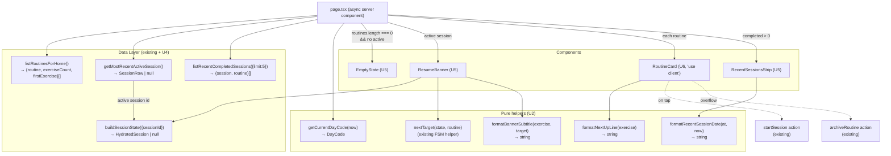

# feat: Swole home page — launchpad with resume banner, routine cards, and recent-sessions strip

## Overview

Replace the placeholder at `apps/swole/src/app/page.tsx` with a content-complete launchpad that covers the two primary entry points from the PRD (create a routine, start a session), catches an in-progress session before the user accidentally starts a second one, and provides a lightweight recent-sessions memory strip once history exists. The page is a Next.js 16 server component that reads via the existing `apps/swole/src/db/{routines,sessions}.ts` helpers, dispatches mutations through the existing `apps/swole/src/actions/` wrappers, and reuses the dark theme + nav chrome already in `apps/swole/src/app/layout.tsx`. No new dependencies — MUI, Tailwind, Drizzle, and `better-sqlite3` are already in `apps/swole/package.json`.

This is the first piece of Survivor 4 (the UI tier on top of Survivor 3's data layer). It ships in front of the routine builder, runner, and stats pages so each of those has a known entry point to navigate back to. Link targets that don't yet exist (`/routines/new`, `/routines/[id]`, `/session/[id]`) will 404 during interim deploys; that is acceptable while Survivor 4 is in flight.

---

## Problem Frame

`apps/swole/src/app/page.tsx` still ships the "workout tracker — coming soon" placeholder from the Survivor 1 scaffold. The PRD's two primary user flows both begin at home (F1 "From home, tap 'New Routine'", F2 "From home, pick any routine"), but home has no surface for them, no resume cue for an in-progress session, and no shape on a fresh deploy with zero routines. The data layer is in place and tested; the runner page does not yet exist. Until home actually behaves like a launchpad, the Survivor 3 work is unreachable to the user.

The origin requirements doc (`docs/brainstorms/2026-05-27-swole-home-requirements.md`) settled the product behavior: three conditional regions (resume banner, routines list with "+ New Routine", recent-sessions strip), a single CTA empty state, and a hard "no dashboard / no destructive controls above the fold" boundary. This plan turns those product decisions into ordered, file-by-file slices with explicit test scenarios for the new code paths.

---

## Requirements Trace

- R1. Replace placeholder at `apps/swole/src/app/page.tsx`; do not touch `apps/swole/src/app/layout.tsx`.
- R2. Render up to three regions top-to-bottom: resume banner (conditional), routines list with "+ New Routine" affordance (or empty state), recent-sessions strip (conditional).
- R3. Page is a server component; reads via `apps/swole/src/db/{routines,sessions}.ts`; mutations via `apps/swole/src/actions/`; no React Query, no client-only data fetching.
- R4. Mobile-first single-column layout; existing dark theme reused; no new theme tokens.
- R5. Only non-archived routines shown.
- R6. Each card surfaces name, days line, exercise count, type-aware "Next up" line, `Start session` button, and `⋯` overflow menu (Edit, Archive).
- R7. Today's day-of-week emphasized in the days line; alphabetical order unchanged.
- R8. Weighted "next up" weight read from `exercises.starting_weight`; `progressions` not consulted.
- R9. Routines ordered alphabetically by `routines.name`.
- R10. `Start session` calls `startSession({ routineId })` from `apps/swole/src/actions/sessions.ts`; on success route to `/session/[id]`; on `RoutineAlreadyHasActiveSession` / `RoutineArchived`, surface toast and stay on home.
- R11. Resume banner renders only when at least one session has `completed_at IS NULL`.
- R12. Banner position: above the routines list, persistent at all scroll positions on mobile.
- R13. Banner content: `Resume [routine name]` title, `[next exercise], set [n]/[total] · [target]` subtitle, `Resume →` link.
- R14. Banner derives position via `nextTarget(state, routine)` from `apps/swole/src/core/session-machine.ts`, with `state` from the Survivor 3 hydration path (`buildSessionState` in `apps/swole/src/db/hydration.ts`).
- R15. No destructive controls on the banner.
- R16. With multiple active sessions, show the one with the most recent `started_at`.
- R17. Recent strip renders only when at least one session has `completed_at IS NOT NULL`.
- R18. Strip position: below the routines list.
- R19. Strip shows 5 most recent completed sessions, ordered `completed_at DESC LIMIT 5`; row format `[short date] · [routine name]`.
- R20. Each row links to `/routines/[id]`.
- R21. Strip query joins only `sessions` to `routines` filtered on `completed_at IS NOT NULL`; no joins to `set_logs`, `exercises`, or `progressions`.
- R22. Zero non-archived routines and no active session → centered empty state replaces both list and strip. Active session on an archived routine (edge case) → banner still renders.
- R23. Empty state content: short headline, one-line hint, single primary button `Create your first routine` → `/routines/new`.
- R24. When at least one routine exists, a `+ New Routine` affordance is also present on home.

**Origin flows:** F1 (Launch a session from home), F2 (Resume an in-progress session from home), F3 (First-deploy empty state).
**Origin acceptance examples:** AE1 (covers R6, R8), AE2 (R6), AE3 (R6), AE4 (R6), AE5 (R7), AE6 (R13, R14), AE7 (R17), AE8 (R22, R23), AE9 (R10).

---

## Scope Boundaries

- No routine builder UI. `+ New Routine` and `Create your first routine` link to `/routines/new`, which does not yet exist.
- No runner UI. `Resume →` and `Start session` link to `/session/[id]`, which does not yet exist; interim 404s are acceptable.
- No stats pages. Recent-sessions rows link to `/routines/[id]`, which does not yet exist.
- No per-session detail page. The strip goes to per-routine stats, not per-session detail.
- No archived-routines management on home (no "Show archived" toggle).
- No abandon-session control on home.
- No theming work beyond reusing `apps/swole/src/app/layout.tsx` colors.
- No new dependencies. `apps/swole/package.json` already declares everything needed.
- No accessibility audit beyond reasonable tap-target sizing and semantic HTML.
- No PWA, install prompt, offline mode.
- No client-side data fetching libraries (React Query, SWR).
- No analytics or per-tap event instrumentation beyond the existing `/metrics` surface.
- No tests of MUI rendering details (color exactness, exact font sizes).
- No page-level rendering tests. Per the origin doc's Success Criteria, the page is thin glue over already-tested helpers; testing focuses on new pure formatters (U2) and new query functions (U4).

### Deferred to Follow-Up Work

- The routine-builder page at `/routines/new`: separate brainstorm + plan (Survivor 4 next slice).
- The runner page at `/session/[id]`: separate brainstorm + plan (Survivor 4 next slice). The home page links to this path with the expectation that the runner will consume the same hydrated `SessionState` produced here for the banner.
- The per-routine stats page at `/routines/[id]`: separate brainstorm + plan (Survivor 4 later slice). Recent-strip rows link here.
- Janitor for abandoned-but-not-completed sessions across multiple routines: deferred to a future cleanup pass. R16 explicitly shows only the most-recently-started active session; the others sit harmlessly in the DB.
- A `docs/solutions/` writeup on MUI + Tailwind composition inside a Next.js 16 server component (and on `revalidatePath` placement for home): `/ce-compound` follow-up once this PR lands.

---

## Context & Research

### Relevant Code and Patterns

- **`apps/swole/src/app/page.tsx`** — the placeholder this plan replaces. Currently renders a centered `<Typography>` "Swole — workout tracker — coming soon".
- **`apps/swole/src/app/layout.tsx`** — reused as-is. Provides the `<html><body><Providers><nav><a href="/">Swole</a></nav>{children}</Providers></body></html>` chrome with `bg-black text-white` Tailwind classes and the orange accent.
- **`apps/swole/src/theme.ts`** — MUI dark theme with `deepOrange` primary; reused without changes.
- **`apps/swole/src/components/Provider.tsx`** — wraps children in MUI `ThemeProvider` + `AppRouterCacheProvider`. U1 mounts the new `<ToastProvider>` here.
- **`apps/swole/src/db/routines.ts`** — exports `listRoutines`, `getRoutine`, `getRoutineWithExercises`. U4 extends this module with `listRoutinesForHome()` returning `{ routine, exerciseCount, firstExercise }[]` in a single query so the routine-card list does not N+1.
- **`apps/swole/src/db/sessions.ts`** — exports `getSession`, `listSessionsForRoutine`, `getActiveSession(id)`, `startSession`, `completeSession`. U4 extends this module with `getMostRecentActiveSession()` (no args; returns the single most-recently-started incomplete session across all routines) and `listRecentCompletedSessions({ limit })` (joins `sessions` ⨝ `routines` filtered `completed_at IS NOT NULL`).
- **`apps/swole/src/db/hydration.ts`** — `buildSessionState({ sessionId })` returns `{ session, routine, sessionState, progressions, failedSetLogIds }` or `null`. The resume banner reuses this directly to feed `nextTarget(state, routine)`.
- **`apps/swole/src/core/session-machine.ts`** — exports `nextTarget(state, routine): NextTarget | null` returning `{ weight?, reps?, duration?, exerciseIdx, setIdx }`. Type-dispatched by exercise kind. Used by the banner to compute "set 2/3 · 105 lb × 10" style subtitles.
- **`apps/swole/src/actions/sessions.ts`** — server action `startSession({ routineId })` already wraps `dbStartSession` and calls `revalidatePath('/')` + `revalidatePath('/session/[id]')`. U6 imports this directly from the routine-card client component.
- **`apps/swole/src/actions/routines.ts`** — server action `archiveRoutine({ id })` already wraps `dbArchiveRoutine` and calls `revalidatePath('/')` + `revalidatePath('/routines/[id]')`. U6's overflow menu uses this.
- **`apps/swole/src/db/errors.ts`** — `DataLayerError` subclasses (`RoutineAlreadyHasActiveSession`, `RoutineArchived`, `ArchiveBlockedByActiveSession`) carry a `kind` discriminator (`'conflict' | 'forbidden_transition' | ...`). U6 catches these and translates to toast messages.
- **`apps/swole/src/db/schema.ts`** — `DayCode` type (`'mon' | 'tue' | ...`) and `dayCodes` tuple. U2's formatters consume `DayCode[]` directly.
- **`apps/swole/src/db/types.ts`** — `RoutineRow`, `ExerciseRow`, `SessionRow` aliases over Drizzle's `$inferSelect`. U4's new queries return these.
- **`apps/yoink/src/components/toast-provider.tsx`** + **`apps/yoink/src/hooks/use-toast.ts`** — the established lilnas pattern for Snackbar+Alert toast notifications. U1 copies this near-verbatim into `apps/swole/src/components/toast-provider.tsx` and `apps/swole/src/hooks/use-toast.ts`. No new deps — MUI's `Snackbar` and `Alert` are already pulled in.
- **`apps/token/src/components/AppCard.tsx`** — reference for MUI `Card` + `CardContent` composition with a Tailwind/MUI mixed styling approach. U6's `RoutineCard` follows this shape but uses an explicit `Button` for the primary action (instead of a `CardActionArea` wrap) so the overflow menu doesn't accidentally swallow taps.
- **`apps/swole/src/db/__tests__/{routines,sessions}.spec.ts`** — test layout pattern. U4's new query tests follow the same `currentDb` + `createTestDb()` + `jest.mock('src/db/client')` setup.
- **`apps/swole/jest.config.js`** — accepts both adjacent `.spec.ts` and `__tests__/` layouts. U2 puts the formatter spec at `apps/swole/src/lib/__tests__/format.spec.ts` to match the existing `apps/swole/src/db/__tests__/` precedent. The `server-only` import is auto-mapped to an empty stub via `moduleNameMapper`.

### Institutional Learnings

- **`docs/solutions/architecture-patterns/pure-fsm-core-for-stateful-domain-logic-2026-05-27.md`** — confirms `nextTarget(state, routine)` is a pure derivation safe to call directly from a server component for the resume banner. Returns `null` when the session is complete; the banner guards this case by gating on `buildSessionState` returning non-null and `nextTarget` returning non-null.
- **`docs/solutions/conventions/begin-immediate-for-read-then-write-mutations-2026-05-27.md`** — the home page itself is read-only, but the Start/Archive actions it dispatches call mutating server actions whose discriminated `DataLayerError` subclasses must be caught and rendered as user-facing toasts rather than uncaught crashes. U6 wires this.

### External References

None gathered. Every layer this plan touches has multiple established patterns in-repo (Next.js server components in `apps/portal`, MUI Snackbar+Alert in `apps/yoink`, MUI Card in `apps/token`, Drizzle queries throughout `apps/swole/src/db/`). External research would add no practical value.

---

## Key Technical Decisions

- **Resume banner uses CSS `position: sticky` (Tailwind `sticky top-0 z-10`).** Resolves the R12 planning-time question. The brainstorm requires "persistent — visible at all scroll positions on mobile"; sticky on the banner element (not the nav) keeps the banner anchored when the user scrolls the routines list while letting the nav scroll away — natural behavior on mobile and zero JS. Rejected: MUI `AppBar` (over-chromed for one banner), MUI `Drawer` (semantically wrong — banner is not a panel).
- **Add `getMostRecentActiveSession()` to `apps/swole/src/db/sessions.ts`.** Resolves the R13/R14/R16 planning-time question. Returns at most one row (or null) — the single most-recently-started session with `completed_at IS NULL` across all routines, ordered `started_at DESC LIMIT 1`. The function is the one new "active session global lookup" the page needs; composing inline at the page level would scatter the query language and break the ADR-001 "no inline Drizzle in `page.tsx`" rule. Rejected: a `getAllActiveSessions()` returning an array (R16 explicitly says we only show one).
- **Single combined query `listRoutinesForHome()` returns `{ routine, exerciseCount, firstExercise }[]`.** Resolves the R6 "[N] exercises" + "Next up" planning-time question. One round-trip avoids N+1 across the routines list. Drizzle composition: subquery counting non-archived exercises per routine + correlated subquery fetching the first non-archived exercise by `orderInRoutine ASC LIMIT 1`. Routine ordering remains alphabetical by `routines.name` to match R9 and `listRoutines`'s existing default. Rejected: separate `listRoutines()` + per-routine `getRoutineWithExercises()` (N+1); adding `listRoutinesWithExerciseCounts()` plus a separate `getFirstExercise()` call per row (two passes when one will do).
- **Duration formatter: `time-based` → `${seconds}s`; `cardio` → `${Math.round(seconds/60)} min`.** Resolves the R6/AE3 planning-time question. Time-based exercises are short (plank, hold) and the `Ns` form reads naturally; cardio is long (1800s = 30 min) and `N min` matches AE4. Both formatters in `apps/swole/src/lib/format.ts`. A shared `formatDuration` helper will become natural once the runner UI lands and consumes these too; this PR ships the home-specific shapes and leaves the runner-side generalization to the next brainstorm.
- **`Start session` button stays enabled even on a routine with an active session; the action throws `RoutineAlreadyHasActiveSession` and the client catches it into a toast.** Resolves R10/AE9. Keeps the home query simple (no per-routine "active session?" join beyond what the banner already needs). The banner sitting persistently above the list already signals "you have a session in progress" — that's the primary cue. The toast on tap is a secondary safety net. Rejected: rendering the button disabled (requires correlating each card with the active-session-by-routine map, which adds branching for a marginal UX gain at N=1).
- **Recent-sessions date formatter: short weekday (`Wed`) if the session completed within the last 7 days; otherwise short month + day (`May 26`). Computed against the same `now` the page uses for the today-highlight.** Resolves the R19 planning-time question. Implementation in `apps/swole/src/lib/format.ts`, taking `(at: Date, now: Date) => string` for testability. Uses `Intl.DateTimeFormat('en-US', { weekday: 'short' })` and `Intl.DateTimeFormat('en-US', { month: 'short', day: 'numeric' })`.
- **Routine card uses MUI `Card` + `CardContent` with an explicit `Button` and `IconButton`+`Menu` for actions; the card itself is not wrapped in `CardActionArea`.** Resolves the R6 planning-time question. The whole card is not tappable — only the `Start session` button is. The overflow `⋯` is a distinct target that opens an MUI `Menu` with `Edit` and `Archive` items. Edit is a `<Link href={`/routines/${id}`}>`; Archive opens an MUI `Dialog` confirmation, then calls `archiveRoutine({ id })`.
- **`TZ=America/Los_Angeles` already set in `infra/.env.swole`; `getCurrentDayCode(now: Date = new Date())` computes the DayCode server-side via `now.getDay()` mapped to the schema's `DayCode` union.** Resolves the R7 planning-time question. The TZ env var is already present in `infra/.env.swole` (verified) and both `apps/swole/deploy.yml` and `apps/swole/deploy.dev.yml` consume that file via `env_file`. No deploy-file edits needed. Server-side computation is preferred over a client wrapper because it avoids a flash of "no highlight" on initial paint and aligns with the rest of the page being a server component. Pacific Time matches the user's location; a future move would update the env-file without code changes. Rejected: client-side via a small `'use client'` wrapper (extra component for one number); using `Intl.DateTimeFormat('en-US', { timeZone: 'America/Los_Angeles' })` (more code than necessary when the container's `TZ` does the same job).
- **`Edit` and `Archive` overflow items: `Edit` is a plain navigation link (`<Link href={`/routines/${id}`}>`); `Archive` opens an MUI `Dialog` confirmation before calling the server action.** R6 requires the overflow menu with these two items. Edit must navigate (the routine-builder page is where edits happen). Archive must confirm — it's a forbidden-transition source (`ArchiveBlockedByActiveSession`) and easy to mis-tap. The Dialog is a one-time render inside the client component; no global confirmation state needed.
- **The page guards each region independently — banner, routine list, and recent strip — rather than treating empty state as a "no routines" early-return.** The full-page `<EmptyState />` only renders when both routines are empty AND no active session exists. When an active session exists but no routines (R22's narrow "edge case" — currently unreachable through the supported API because `startSession` rejects archived routines and `archiveRoutine` blocks while a session is active), the banner renders alone with no routines list or strip. The R22 case is defensive; no separate mini-empty-state copy is introduced.
- **Page-level error boundary: existing Next.js default.** No custom `error.tsx` for this PR. Queries that throw (e.g., DB unavailable) bubble up to Next.js's default error page; in practice, the data-layer queries don't throw on empty results — they return `null` or `[]`. If a future need for a custom error boundary surfaces, it's a separate concern.

---

## Open Questions

### Resolved During Planning

- All 11 "Deferred to Planning" questions from the origin doc are resolved above under Key Technical Decisions.

### Deferred to Implementation

- Exact MUI `Menu` anchor element strategy (`anchorEl` state vs. controlled `MenuButton`). The Menu API takes either; pick whichever produces the cleanest TypeScript types on first attempt. Behavioral contract: tapping `⋯` opens a menu with two items; selecting `Edit` navigates; selecting `Archive` opens a confirmation Dialog.
- Exact spacing values (`gap-2` vs `gap-3`, `p-3` vs `p-4`) inside cards. Eyeball during implementation; the brainstorm's "single-column on phone, tap targets reachable with a thumb" is the only constraint.
- Exact text style for the degraded-banner subtitle line (italic vs muted color). U5 specifies a single italicized line as the default; tune at implementation if italic doesn't read well against the orange accent.

---

## High-Level Technical Design

> *This illustrates the intended data flow and is directional guidance for review, not implementation specification. The implementing agent should treat it as context, not code to reproduce.*

Notes:
- Solid arrows are render-time data dependencies (server-side, synchronous).
- Dotted arrows are user-initiated server actions dispatched from the client component (`RoutineCard`).
- The page never touches Drizzle directly — every read goes through `src/db/*` or `src/db/hydration.ts`. Every mutation goes through `src/actions/*`.

---

## Implementation Units

- U1. **Toast provider and `useToast` hook**

**Goal:** Mount a Snackbar-based toast surface on the swole app so client components (the routine card's Start and Archive flows) can surface `DataLayerError` results without breaking the page.

**Requirements:** R10, R15 (toast surface for action errors; no destructive controls inline).

**Dependencies:** None.

**Files:**
- Create: `apps/swole/src/components/toast-provider.tsx`
- Create: `apps/swole/src/hooks/use-toast.ts`
- Modify: `apps/swole/src/components/Provider.tsx` — wrap children with `<ToastProvider>` inside the existing `<ThemeProvider><AppRouterCacheProvider>` tree.

**Approach:**
- Copy the established lilnas pattern from `apps/yoink/src/components/toast-provider.tsx` + `apps/yoink/src/hooks/use-toast.ts`: MUI `Snackbar` + `Alert`, controlled by a `Toast | null` state and exposed via a `showToast(message, severity)` `ToastContextValue`.
- Anchor the snackbar `{ vertical: 'bottom', horizontal: 'center' }`, autoHide 5s.
- Mount inside `Provider.tsx` so the provider tree stays in one place. Both `ToastProvider` and the consumed `useToast` are `'use client'`.

**Patterns to follow:**
- `apps/yoink/src/components/toast-provider.tsx` for the provider shape.
- `apps/yoink/src/hooks/use-toast.ts` for the hook that throws when called outside the provider.

**Test scenarios:**
- Test expectation: none -- copy of an existing in-repo pattern with no logic of its own; verified by U6's manual smoke test of the toast firing on a `RoutineAlreadyHasActiveSession` error.

**Verification:**
- `pnpm --filter @lilnas/swole type-check` passes.
- The `<ToastProvider>` is reachable from any descendant of `<Providers>` via `useToast()` without throwing.
- No new dependencies in `apps/swole/package.json`.

---

- U2. **Pure formatters lib (`src/lib/format.ts`)**

**Goal:** Centralize the home page's display-formatting helpers so the routine card, banner, strip, and page can call typed functions instead of inlining string-building. Each function is pure and unit-testable.

**Requirements:** R6 (next-up line, days line), R7 (today highlight), R13 (banner subtitle), R19 (recent-session date format).

**Dependencies:** None (depends only on `src/core/session-machine.ts` types and `src/db/schema.ts`'s `DayCode`).

**Files:**
- Create: `apps/swole/src/lib/format.ts`
- Create: `apps/swole/src/lib/__tests__/format.spec.ts`

**Approach:**
- Export pure functions:
  - `getCurrentDayCode(now: Date = new Date()): DayCode` — maps `now.getDay()` (0=Sun..6=Sat) to the `DayCode` union (`'mon' | ...`). Relies on the container's `TZ` (set in U3) for correct local day-of-week.
  - `formatDayCodes(days: DayCode[], today: DayCode | null): Array<{ code: DayCode; label: string; isToday: boolean }>` — returns rendering tokens for the days line. Three-letter capitalized labels (`Mon`, `Tue`, ...). Preserves input order (caller passes the routine's `days` array as-is).
  - `formatTimeBasedDuration(seconds: number): string` — `${seconds}s`.
  - `formatCardioDuration(seconds: number): string` — `${Math.round(seconds / 60)} min`.
  - `formatNextUpLine(exercise: Exercise): string` — takes the FSM-side discriminated `Exercise` (post-`toExercise()` conversion from `src/db/mappers.ts`), NOT the raw `ExerciseRow`. The mapper narrows nullable columns; using it here gives TypeScript a clean discriminated union so the switch branches don't need null-guards or non-null assertions. The caller (`listRoutinesForHome` consumer in U7) converts each `firstExercise: ExerciseRow | null` via `toExercise(row)` before passing into the formatter. Type-dispatches on `exercise.type`:
    - `weighted`: `${name} · ${sets}×${targetReps} @ ${startingWeight} lb`
    - `bodyweight`: `${name} · ${sets}×${targetReps}`
    - `time-based`: `${name} · ${sets}×${formatTimeBasedDuration(durationSeconds)}`
    - `cardio`: `${name} · ${formatCardioDuration(durationSeconds)}`
  - `formatBannerSubtitle(exercise: Exercise, target: NextTarget): string` — type-dispatches on `exercise.type` (FSM-side type, not DB type):
    - `weighted`: `${exercise.name}, set ${target.setIdx + 1}/${exercise.sets} · ${target.weight} lb × ${target.reps}`
    - `bodyweight`: `${exercise.name}, set ${target.setIdx + 1}/${exercise.sets} · ${target.reps} reps`
    - `time-based`: `${exercise.name}, set ${target.setIdx + 1}/${exercise.sets} · ${formatTimeBasedDuration(target.duration!)}`
    - `cardio`: `${exercise.name}, set ${target.setIdx + 1}/1 · ${formatCardioDuration(target.duration!)}`
  - `formatRecentSessionDate(at: Date, now: Date): string` — if `now - at < 7 days`: short weekday via `Intl.DateTimeFormat('en-US', { weekday: 'short' })`; else short month + day via `Intl.DateTimeFormat('en-US', { month: 'short', day: 'numeric' })`.
  - `mapStartSessionError(err: unknown): { message: string; severity: 'warning' | 'error' }` — narrows `DataLayerError.kind`:
    - `'conflict'` (`RoutineAlreadyHasActiveSession`): `{ message: 'A session is already in progress for this routine — tap Resume above to continue.', severity: 'warning' }`
    - `'forbidden_transition'` (`RoutineArchived`): `{ message: 'This routine has been archived — restore it to start a session.', severity: 'error' }`
    - Anything else: `{ message: 'Could not start session. Try again.', severity: 'error' }`
  - `mapArchiveRoutineError(err: unknown): { message: string; severity: 'warning' | 'error' }` — narrows:
    - `'forbidden_transition'` (`ArchiveBlockedByActiveSession`): `{ message: "Can't archive this routine — a session is in progress. Resume and finish it first.", severity: 'warning' }`
    - Anything else: `{ message: 'Could not archive routine. Try again.', severity: 'error' }`
- All functions sit in `apps/swole/src/lib/` (sibling to `src/lib/logger.ts`). No `'use server'`, no `'use client'`, no `'server-only'` — they're pure utilities consumable from anywhere. Pulling the error-message mapping out of the routine card (U6) into this module keeps the React tree free of branching logic and makes the user-visible error copy testable in isolation.

**Patterns to follow:**
- `apps/swole/src/core/session-machine.ts` for the exhaustive `switch (exercise.type)` discriminated-union dispatch shape.
- `apps/swole/src/db/__tests__/{routines,sessions}.spec.ts` for the test layout — though these formatters need no test-db, just `describe`/`it`/`expect`.

**Test scenarios:**
- Happy path: Covers AE1. Given a weighted exercise `{ name: 'Bench Press', sets: 3, targetReps: 10, startingWeight: 105, increment: 5 }`, `formatNextUpLine` returns `'Bench Press · 3×10 @ 105 lb'` (no `+5` suffix).
- Happy path: Covers AE2. Given a bodyweight exercise `{ name: 'Pushups', sets: 3, targetReps: 15 }`, `formatNextUpLine` returns `'Pushups · 3×15'`.
- Happy path: Covers AE3. Given a time-based exercise `{ name: 'Plank', sets: 3, durationSeconds: 30 }`, `formatNextUpLine` returns `'Plank · 3×30s'`.
- Happy path: Covers AE4. Given a cardio exercise `{ name: 'Run', sets: 1, durationSeconds: 1800 }`, `formatNextUpLine` returns `'Run · 30 min'`.
- Happy path: Covers AE6. Given a weighted FSM exercise `{ name: 'Bench Press', sets: 3, targetReps: 10, ... }` and a `NextTarget` `{ weight: 105, reps: 10, exerciseIdx: 0, setIdx: 1 }`, `formatBannerSubtitle` returns `'Bench Press, set 2/3 · 105 lb × 10'`.
- Happy path: `formatBannerSubtitle` for a bodyweight exercise `{ name: 'Pushups', sets: 3, targetReps: 15 }` and target `{ reps: 15, exerciseIdx: 1, setIdx: 0 }` returns `'Pushups, set 1/3 · 15 reps'`.
- Happy path: `formatBannerSubtitle` for a time-based exercise `{ name: 'Plank', sets: 3, durationSeconds: 30 }` and target `{ duration: 30, exerciseIdx: 2, setIdx: 2 }` returns `'Plank, set 3/3 · 30s'`.
- Happy path: `formatBannerSubtitle` for a cardio exercise `{ name: 'Run', sets: 1, durationSeconds: 1800 }` and target `{ duration: 1800, exerciseIdx: 3, setIdx: 0 }` returns `'Run, set 1/1 · 30 min'`.
- Happy path: Covers AE5. `formatDayCodes(['mon', 'wed', 'fri'], 'mon')` returns `[{ code: 'mon', label: 'Mon', isToday: true }, { code: 'wed', label: 'Wed', isToday: false }, { code: 'fri', label: 'Fri', isToday: false }]`. Order preserved.
- Edge case: `formatDayCodes(['mon', 'wed', 'fri'], null)` returns all rows with `isToday: false`.
- Edge case: `formatDayCodes(['tue', 'thu'], 'mon')` returns both rows with `isToday: false` (today not in routine's days).
- Happy path: `getCurrentDayCode(new Date('2026-05-25T12:00:00-07:00'))` returns `'mon'` (Monday in PT). The test sets the input Date explicitly to avoid TZ flake.
- Edge case: `getCurrentDayCode(new Date('2026-05-31T12:00:00-07:00'))` returns `'sun'`.
- Happy path: `formatRecentSessionDate(at, now)` where `now - at = 3 days` returns the short weekday at `at` (e.g., `'Wed'`).
- Edge case: `formatRecentSessionDate(at, now)` where `now - at = 8 days` returns short month + day (e.g., `'May 19'`).
- Edge case: `formatRecentSessionDate(at, now)` where `at === now` (just-completed) returns the short weekday for today.
- Edge case: `formatTimeBasedDuration(0)` returns `'0s'`; `formatTimeBasedDuration(60)` returns `'60s'` (we keep the second-form even past a minute for consistency at home).
- Edge case: `formatCardioDuration(60)` returns `'1 min'`; `formatCardioDuration(0)` returns `'0 min'`; `formatCardioDuration(90)` returns `'2 min'` (rounded).
- Error path: `mapStartSessionError(new RoutineAlreadyHasActiveSession(7))` returns `{ message: /already in progress/, severity: 'warning' }`. Asserts on the regex so copy tweaks don't break the test.
- Error path: `mapStartSessionError(new RoutineArchived(7))` returns `severity: 'error'` with a message mentioning "archived".
- Error path: `mapStartSessionError(new Error('boom'))` returns the generic fallback `{ message: /Could not start session/, severity: 'error' }`.
- Error path: `mapStartSessionError(null)` and `mapStartSessionError(undefined)` return the generic fallback without throwing.
- Error path: `mapArchiveRoutineError(new ArchiveBlockedByActiveSession('Routine', 7))` returns `severity: 'warning'` with a message mentioning "session is in progress".
- Error path: `mapArchiveRoutineError(new Error('boom'))` returns the generic fallback `{ message: /Could not archive routine/, severity: 'error' }`.

**Verification:**
- `pnpm --filter @lilnas/swole test` includes the new spec file and all formatter scenarios pass.
- `pnpm --filter @lilnas/swole lint` and `type-check` pass.

---

- U3. **Verify `TZ=America/Los_Angeles` is present in `infra/.env.swole`**

**Goal:** Confirm the existing TZ env var is loaded into the swole container so server-side `new Date().getDay()` returns the user's local day-of-week. R7's today-highlight depends on this.

**Requirements:** R7.

**Dependencies:** None.

**Files:**
- None modified in the happy path. `infra/.env.swole` already contains `TZ=America/Los_Angeles` (verified at planning time). Both `apps/swole/deploy.yml` and `apps/swole/deploy.dev.yml` consume that file via `env_file: ../../infra/.env.swole`. If the line is missing on the deployment host (or in a teammate's local copy), add it to that file — not to the deploy YAMLs.

**Approach:**
- Read `infra/.env.swole` and confirm the `TZ=America/Los_Angeles` line is present.
- If absent: add it to `infra/.env.swole`. Do NOT duplicate it into the `environment:` block of either deploy file — the env-file is the canonical surface for this app's runtime knobs (mirrors the pattern used by other lilnas services like `me-token-tracker`, `download`, etc.).
- No app code change. Node.js's `Date` API picks up the container's `TZ` env var at startup.

**Patterns to follow:**
- The existing `env_file: ../../infra/.env.swole` reference in both `apps/swole/deploy.yml` and `apps/swole/deploy.dev.yml`.

**Test scenarios:**
- Test expectation: none -- runtime env config with no code paths. Verified at deploy time per Verification below.

**Verification:**
- `docker-compose -f docker-compose.dev.yml exec swole node -e "console.log(new Date().toString())"` prints a PDT/PST timestamp, not UTC.
- The U2 `getCurrentDayCode` formatter test passes (those tests pin specific Date inputs and don't rely on container TZ — but in production, the same function consumes `new Date()` and gets the right answer because of this env var).

---

- U4. **Home-page queries: `getMostRecentActiveSession`, `listRecentCompletedSessions`, `listRoutinesForHome`**

**Goal:** Provide the three new data-layer functions the home page needs, each shaped to its consumer so the page does not N+1 or write inline Drizzle.

**Requirements:** R3 (reads via existing `src/db/*` modules), R6 + R8 (routine list with first exercise + count), R9 (alphabetical order), R11 + R16 (single most-recent active session), R17 + R19 + R21 (5 most recent completed sessions joined to routines, no other joins).

**Dependencies:** None (extends existing `src/db/sessions.ts` and `src/db/routines.ts`).

**Files:**
- Modify: `apps/swole/src/db/sessions.ts` — add `getMostRecentActiveSession()` and `listRecentCompletedSessions({ limit })`.
- Modify: `apps/swole/src/db/routines.ts` — add `listRoutinesForHome()`.
- Modify: `apps/swole/src/db/__tests__/sessions.spec.ts` — append scenarios for both new sessions queries.
- Modify: `apps/swole/src/db/__tests__/routines.spec.ts` — append scenarios for `listRoutinesForHome`.

**Approach:**
- `getMostRecentActiveSession(): Promise<SessionRow | null>` — `db.select().from(sessions).where(isNull(sessions.completedAt)).orderBy(desc(sessions.startedAt), desc(sessions.id)).limit(1).get()`. Returns `null` when none. The `id DESC` tiebreaker matches the existing pattern in `apps/swole/src/db/setLogs.ts:146`.
- `listRecentCompletedSessions({ limit }: { limit: number }): Promise<Array<{ session: SessionRow; routine: RoutineRow }>>` — `db.select({ session: sessions, routine: routines }).from(sessions).innerJoin(routines, eq(sessions.routineId, routines.id)).where(isNotNull(sessions.completedAt)).orderBy(desc(sessions.completedAt), desc(sessions.id)).limit(limit).all()`. Per R21, no joins to `set_logs`, `exercises`, or `progressions`.
- `listRoutinesForHome(): Promise<Array<{ routine: RoutineRow; exerciseCount: number; firstExercise: ExerciseRow | null }>>` — two passes inside the helper:
  1. Fetch non-archived routines alphabetically: `db.select().from(routines).where(isNull(routines.archivedAt)).orderBy(asc(routines.name)).all()`.
  2. **Guard:** if the routines list is empty, return `[]` immediately. Drizzle's `inArray(col, [])` emits invalid `IN ()` SQL on some better-sqlite3 paths; the first-deploy empty-state flow (F3) hits this case on every fresh install and must not throw.
  3. For all returned routine IDs, fetch non-archived exercises ordered by `(routineId ASC, orderInRoutine ASC)` in a single `inArray(exercises.routineId, ids)` query.
  4. In the helper, group exercises by `routineId` in a `Map`, then for each routine compute `exerciseCount = group.length` and `firstExercise = group[0] ?? null`.
- The two-query approach (rather than a single grouped SQL with window functions) keeps the Drizzle composition readable and avoids better-sqlite3 quirks around correlated subqueries. At home's expected scale (≤ ~20 routines), this is two index-friendly queries.
- All three new functions live in the existing module files; no new file in `src/db/`.

**Patterns to follow:**
- `apps/swole/src/db/setLogs.ts:135-149` for the `orderBy(desc(...), desc(...))` + `limit(...)` shape.
- `apps/swole/src/db/routines.ts:51-65` (`getRoutineWithExercises`) for the "fetch routine, then exercises filtered by archived" pattern.
- `apps/swole/src/db/__tests__/sessions.spec.ts:40-46` for the `seedSession` helper pattern.

**Test scenarios:**

`getMostRecentActiveSession`:
- Happy path: Given two active sessions on two routines with `started_at` 10 min apart, returns the one with the later `started_at`.
- Happy path: Given one active session and two completed sessions, returns the active one.
- Edge case: Given zero active sessions (all `completed_at IS NOT NULL`), returns `null`.
- Edge case: Given zero sessions at all, returns `null`.
- Edge case: Given two active sessions seeded with identical `started_at` ms (synthetic), returns the one with the higher `id` (tiebreaker).
- Integration: After `startSession({ routineId })` is called, `getMostRecentActiveSession()` returns that row.
- Integration: After `completeSession({ sessionId })` on the only active session, `getMostRecentActiveSession()` returns `null`.

`listRecentCompletedSessions`:
- Happy path: Given seven completed sessions across two routines, `listRecentCompletedSessions({ limit: 5 })` returns five rows ordered by `completedAt DESC`, each carrying `{ session, routine }`.
- Happy path: Each returned row's `routine.id === session.routineId` (the join is correct).
- Edge case: Given zero completed sessions and three active ones, returns `[]`.
- Edge case: Given exactly five completed sessions, returns all five.
- Edge case: Given a completed session on an archived routine, the row is still returned (the archived state of the routine is not a filter — the strip is for memory).
- Edge case: Given two completed sessions with identical `completed_at` ms, the higher `id` ranks first (tiebreaker).

`listRoutinesForHome`:
- Happy path: Given three non-archived routines (`Push Day`, `Body Day`, `Mobility Day`) each with 4 exercises, returns three entries in alphabetical name order with `exerciseCount === 4` and `firstExercise` matching the lowest `orderInRoutine` non-archived exercise.
- Happy path: Covers AE1. The first exercise of a weighted routine is returned with its full row (so `toExercise` + `formatNextUpLine` can read `name`, `targetReps`, `startingWeight`).
- Edge case: Given zero non-archived routines (clean DB on first deploy), returns `[]` without throwing. Pin this with the same DB-empty fixture the first-deploy success criterion uses; the test exists specifically to lock the empty-array `inArray` guard.
- Edge case: Given a routine with zero exercises, the entry has `exerciseCount === 0` and `firstExercise === null`.
- Edge case: Given a routine with one archived exercise and one non-archived exercise, `exerciseCount === 1` and `firstExercise` is the non-archived one (the archived exercise is excluded from both count and first-exercise lookup).
- Edge case: Given an archived routine, it does not appear in the result.
- Edge case: Given a routine where the first non-archived exercise by `orderInRoutine` is order 5 (because orders 0-4 are archived), `firstExercise` is the order-5 exercise.

**Verification:**
- `pnpm --filter @lilnas/swole test` runs all three new query suites alongside the existing data-layer tests and passes.
- The new queries are exported from their respective modules and reachable via `import { ... } from 'src/db/sessions'` / `'src/db/routines'`.

---

- U5. **Server-rendered home subcomponents: `ResumeBanner`, `RecentSessionsStrip`, `EmptyState`**

**Goal:** Land the three read-only, server-rendered building blocks the page composes. Each is pure JSX — no client JS, no `useState`, no `useEffect`. Inputs are already-typed bundles from `src/db/*` and `src/db/hydration.ts`.

**Requirements:** R11–R16 (banner), R17–R21 (strip), R22–R23 (empty state), R12 (sticky banner).

**Dependencies:** U2 (formatters).

**Files:**
- Create: `apps/swole/src/components/home/ResumeBanner.tsx`
- Create: `apps/swole/src/components/home/RecentSessionsStrip.tsx`
- Create: `apps/swole/src/components/home/EmptyState.tsx`

**Approach:**
- `ResumeBanner.tsx` (no `'use client'`):
  - Props: `{ sessionId: number; routineName: string; target: NextTarget | null; exercise: Exercise | null; degraded?: boolean }`. The page (U7) computes `nextTarget(...)` once and passes the result and the corresponding `Exercise` (via `routine.exercises[target.exerciseIdx]`) as already-narrowed props. Keeping the banner decoupled from `HydratedSession` and the FSM means it has no logic to test beyond rendering the four fields it receives.
  - If `target === null || exercise === null`, render the banner with title only (no subtitle, no extra row) and the `Resume →` link. This is the defensive case (session technically complete but still flagged active, or the upstream hydration suppressed the subtitle due to skipped set logs — see U7 `failedSetLogIds` handling). Layout: drop the subtitle slot rather than rendering an empty line, so the banner height collapses by one line.
  - Otherwise, render:
    - Title: `Resume ${routineName}`
    - Subtitle: `formatBannerSubtitle(exercise, target)` from U2.
    - Primary action: Next.js `<Link href={\`/session/${sessionId}\`} prefetch={false}>` styled as an MUI `Button`. `prefetch={false}` because `/session/[id]` is an interim-404 route until the runner ships.
  - When `degraded === true` (passed by U7 when `failedSetLogIds.length > 0`), render the subtitle slot as a single italicized line: `Session has skipped logs — open to verify position.` This signals the user that the banner's position may not be accurate.
  - Styling: Tailwind `sticky top-0 z-10` + MUI `Paper elevation={3}` for raised feel, plus `mx-3 mt-3` outer margins to avoid full-bleed under the nav. No destructive controls per R15.
- `RecentSessionsStrip.tsx` (no `'use client'`):
  - Props: `{ rows: Array<{ session: SessionRow; routine: RoutineRow }>; now: Date }`. Renders an MUI `Divider` with the label `Recent sessions` (`<Divider textAlign="left">Recent sessions</Divider>`) followed by one row per entry. Each row is a `<Link href={\`/routines/${row.routine.id}\`} prefetch={false}>` with text `${formatRecentSessionDate(row.session.completedAt!, now)} · ${row.routine.name}`. `prefetch={false}` because `/routines/[id]` is an interim-404 route. Per R20, the link target is `/routines/[id]`, not `/session/[id]`.
  - `completedAt` is non-null by R17/R21's filter — the `!` assertion is safe here.
- `EmptyState.tsx` (no `'use client'`):
  - Props: none. Renders a centered region with a short headline (`No routines yet`), a one-line hint (`Create your first routine to start tracking workouts`), and a `<Link href="/routines/new" prefetch={false}>` styled as a primary MUI `Button`. `prefetch={false}` because `/routines/new` is an interim-404 route.
  - Layout: `flex flex-col items-center justify-center flex-auto gap-4 px-6 text-center`.

**Patterns to follow:**
- `apps/swole/src/app/page.tsx` (current placeholder) for the existing `flex-col items-center justify-center` centering shape — reuse for `EmptyState`.
- `apps/swole/src/db/hydration.ts:11-22` for the `HydratedSession` type the banner consumes.
- `apps/portal/src/components/AppList.tsx` for the "server component renders a list of links" simple shape.

**Test scenarios:**
- Test expectation: none -- per origin Success Criteria, the page is thin glue over already-tested helpers. The banner's formatting comes from U2 (tested), the strip's formatting comes from U2 (tested), and the empty state has no logic.
- Manual smoke verification (see Verification below).

**Verification:**
- `pnpm --filter @lilnas/swole type-check` passes.
- In a dev container with one active session, the banner renders with `Resume [Push Day]` and a subtitle matching AE6.
- In a dev container with zero routines and no active session, only `EmptyState` renders.
- In a dev container after completing one session, the strip renders one row with `[short weekday] · [routine name]`.

---

- U6. **Client-side `RoutineCard` with Start/Edit/Archive actions**

**Goal:** Render one card per non-archived routine. Provide the user's primary "Start session" path with proper error handling, plus an overflow menu wiring Edit + Archive to existing server actions.

**Requirements:** R5, R6 (card content), R7 (today highlight in days line), R10 + AE9 (Start session action + error toast), R24 (+ New Routine affordance lives elsewhere; this unit is only the card).

**Dependencies:** U1 (toast), U2 (formatters).

**Files:**
- Create: `apps/swole/src/components/home/RoutineCard.tsx` (`'use client'`)

**Approach:**
- Props: `{ routine: RoutineRow; exerciseCount: number; firstExercise: ExerciseRow | null; todayCode: DayCode | null }`.
- Render shape:
  - MUI `Card` (no `CardActionArea` wrap — see Key Technical Decisions).
  - `CardContent` with:
    - Header row: routine name (`Typography variant="h6"`) on the left, `IconButton` with `MoreVertIcon` on the right.
    - Days line: spans built from `formatDayCodes(routine.days, todayCode)`, with `isToday: true` rendered in `font-bold` and `text-orange-500` (matching the nav accent). Separator: ` · ` between labels.
    - Exercise count line: `${exerciseCount} ${exerciseCount === 1 ? 'exercise' : 'exercises'}`.
    - Next-up line: if `firstExercise` is non-null, render `formatNextUpLine(firstExercise)`; if null, omit the line.
    - Primary action: MUI `Button variant="contained"` full-width labeled `Start session`. `onClick` runs inside `startTransition(...)` from `useTransition()`:
      1. `const session = await startSession({ routineId: routine.id })` (server action from `src/actions/sessions.ts`)
      2. `router.push(\`/session/${session.id}\`)` (use the returned session's id — NOT the routine id)
      
      The button passes `disabled={isPending}` so the user cannot double-tap during the transition. On thrown error, call `mapStartSessionError(err)` from `src/lib/format.ts` (U2) and `showToast(message, severity)`. No navigation on error.
  - Overflow `Menu`:
    - Anchored to the `IconButton`.
    - `MenuItem` "Edit" → wrap in `<Link href={\`/routines/${routine.id}\`} prefetch={false}>`; navigates and closes the menu. `prefetch={false}` because `/routines/[id]` is an interim-404 route until the routine-builder ships.
    - `MenuItem` "Archive…" → opens a controlled MUI `Dialog` with "Archive [name]?" + Cancel/Archive buttons. On confirm, calls `archiveRoutine({ id: routine.id })` from `src/actions/routines.ts` inside a `useTransition`. The Dialog's Archive button passes `disabled={isPending}` while the action is in flight so the user cannot double-confirm. On success the page revalidates via the action's existing `revalidatePath('/')`. On thrown error, call `mapArchiveRoutineError(err)` from `src/lib/format.ts` and `showToast(message, severity)`.
- Use `cns()` from `@lilnas/utils/cns` for any conditional Tailwind class composition per the project's CLAUDE.md guidance.
- All branching logic (error narrowing, error copy) lives in tested helpers from U2; the card itself is glue between MUI primitives, the helpers, the server actions, and the toast hook.

**Patterns to follow:**
- `apps/token/src/components/AppCard.tsx` for the MUI `Card` + `CardContent` + `sx` styling baseline.
- `apps/yoink/src/app/(library)/movie/[id]/movie-detail-content.tsx` for the `useTransition` + `try { await action(...) } catch (err) { showToast(...) }` shape and the `useToast()` hook usage.
- `apps/swole/src/db/errors.ts` for the `DataLayerError.kind` discriminator the catch branches narrow on.

**Test scenarios:**
- Test expectation: none -- after the U2 refactor that pulled `mapStartSessionError` and `mapArchiveRoutineError` out of this component, the card has no branching logic left to test. The `startSession`/`archiveRoutine` server actions are tested at the data layer (`apps/swole/src/db/__tests__/sessions.spec.ts`, `routines.spec.ts`); the error→toast copy mapping is tested in U2's spec; the toast provider is exercised by U1's verification; MUI rendering details are explicitly out of scope per the origin doc's Scope Boundaries.
- Manual smoke verification (see Verification below) covers the end-to-end card behavior.

**Verification:**
- `pnpm --filter @lilnas/swole lint`, `type-check`, and `test` pass.
- Manual: With a routine that has an active session, tapping `Start session` on its card produces a warning toast and no navigation (AE9).
- Manual: Tapping `Start session` on a fresh routine routes to `/session/[id]` (which 404s during interim deploys — acceptable per Scope Boundaries).
- Manual: Tapping `⋯` → `Archive…` → confirming the dialog removes the card on the next render via `revalidatePath('/')`.

---

- U7. **Home page assembly (`apps/swole/src/app/page.tsx`)**

**Goal:** Wire the three queries, the hydration helper, the today-derivation, and the four components into the single page module the user sees at `/`. Honor R2's conditional rendering matrix.

**Requirements:** R1, R2, R3, R4, R22, R24. The page is the integration point that the rest of the units feed into; nearly every R is exercised here through composition.

**Dependencies:** U1 (toast must be mounted), U2 (formatters), U3 (TZ env for correct `new Date().getDay()`), U4 (queries), U5 (server subcomponents), U6 (`RoutineCard`).

**Files:**
- Modify: `apps/swole/src/app/page.tsx` — full rewrite (replacing the current placeholder).

**Approach:**
- Top of the file: `export const dynamic = 'force-dynamic'` so each visit re-queries SQLite (mirrors `apps/portal/src/app/page.tsx:3` — without this, Next.js's default static rendering would freeze the first snapshot at build time). The `revalidatePath('/')` calls in existing actions handle invalidation, but `force-dynamic` is the belt-and-suspenders that matches portal's precedent.
- `export default async function RootPage()`:
  1. `const now = new Date()`
  2. `const todayCode = getCurrentDayCode(now)`
  3. Run the three queries in parallel via `Promise.all([...])`:
     - `listRoutinesForHome()`
     - `getMostRecentActiveSession()`
     - `listRecentCompletedSessions({ limit: 5 })`
  4. If `activeSession` is non-null, derive the banner props:
     - `const hydrated = await buildSessionState({ sessionId: activeSession.id })`
     - Look up the routine name via `await getRoutine({ id: activeSession.routineId })` (NOT via the `listRoutinesForHome` result map — that filters archived routines, and the active session's routine may be archived in the defensive case. `getRoutine` is the single source of truth for the name regardless of archived state).
     - If `hydrated` is non-null:
       - `const target = nextTarget(hydrated.sessionState, hydrated.routine)`
       - `const exercise = target ? hydrated.routine.exercises[target.exerciseIdx] : null`
       - `const degraded = hydrated.failedSetLogIds.length > 0` — when true, `logger.warn({ msg: 'swole home: hydrated session has skipped set logs', sessionId, failedSetLogIds: hydrated.failedSetLogIds })` and pass `degraded={true}` to the banner so the subtitle slot signals the user instead of silently lying about position.
     - If `hydrated` is null (active session's row exists but `buildSessionState` returned null — e.g., session got completed between the two queries), treat as "no active session" — fall through to the no-banner branches.
  5. Render decision tree:
     - If `routines.length === 0 && !hydrated`: render only `<EmptyState />` inside the existing layout's `<children>` slot.
     - Else, render in this order with conditional wrappers:
       - If `hydrated`: `<ResumeBanner sessionId={activeSession.id} routineName={routineName} target={target} exercise={exercise} degraded={degraded} />` (the `sticky top-0 z-10` styling lives inside the component).
       - If `routines.length > 0`: `
{routines.map(({ routine, exerciseCount, firstExercise }) => <RoutineCard ... firstExercise={firstExercise ? toExercise(firstExercise) : null} todayCode={todayCode} />)}
` then `
<Link href="/routines/new" prefetch={false}>+ New Routine</Link>
` styled as a full-width MUI `Button variant="outlined"`. `prefetch={false}` because `/routines/new` is an interim-404 route.
       - The R22 edge case (`routines.length === 0 && hydrated`) renders only the banner — no list region, no recent strip, no extra empty-state copy. This case is unreachable through the supported API (data-layer invariants block it) and the brainstorm's R22 only requires that the banner "still render" without blank-screening.
       - If `completedSessions.length > 0`: `<RecentSessionsStrip rows={completedSessions} now={now} />`.
- Wrap the entire body in `
` so the regions stack with consistent spacing on mobile.
- No `'use client'` directive — the page is a server component. The single client interaction surface is `RoutineCard`, which is imported and rendered inside the server component.

**Patterns to follow:**
- `apps/portal/src/app/page.tsx` for the simple server-component page shape (`export const dynamic = 'force-dynamic'`, async default export, single composing render).
- `apps/swole/src/db/__tests__/hydration.spec.ts:88-96` for the contract that `buildSessionState` returns `null` on a completed or nonexistent session — handle defensively.

**Test scenarios:**
- Test expectation: none -- explicitly opt out per origin doc Success Criteria: "New tests for the page itself are not required; the page is thin glue over already-tested helpers." All sub-pieces (formatters U2, queries U4, FSM, hydration) are tested independently.
- Verification is via manual smoke per the origin's Success Criteria.

**Verification:**
- `pnpm --filter @lilnas/swole lint`, `type-check`, and `test` all pass; the existing data-layer test suite from Survivor 3 remains green.
- `docker-compose -f docker-compose.dev.yml up -d swole` on a clean database renders the empty state at `http://swole.localhost` (origin Success Criterion 1).
- After creating one routine, home repopulates with that routine visible and `+ New Routine` available (origin Success Criterion 1, second sentence).
- After starting one session and navigating to `/`, the resume banner appears at the top with correct routine name, exercise position, and target (origin Success Criterion 3, AE6).
- After completing one session, the resume banner is gone and the strip renders one row with the routine name (origin Success Criterion 2).
- The next swole brainstorm (routine builder, runner UI, stats) starts work without re-litigating home (origin Success Criterion 5).

---

## System-Wide Impact

- **Interaction graph:** The `startSession` and `archiveRoutine` server actions already call `revalidatePath('/')` (existing in `apps/swole/src/actions/sessions.ts` and `apps/swole/src/actions/routines.ts`), so each mutation triggers home to re-fetch on next render. No new cache-invalidation plumbing required. The `RoutineCard`'s `useTransition`-guarded `Start session` button prevents the rapid-double-tap race against `revalidatePath('/')` by disabling the button while `isPending`; the Archive confirmation Dialog uses the same pattern. When the routine-builder and runner pages land in subsequent brainstorms, their actions must call `revalidatePath('/')` too — this is already the pattern in the existing actions module.
- **Error propagation:** The discriminated `DataLayerError` from `apps/swole/src/db/errors.ts` is the contract. Server actions surface these unchanged; the routine-card client component narrows on `err.kind` to render targeted toasts. Generic `Error` falls through to the page-level Next.js error boundary or a generic toast.
- **State lifecycle risks:** Two main concerns:
  - The hydration path runs on every home render when an active session exists, including `getProgressionsForSession` and `getSetLogsForSession`. At the expected scale (1 active session × < 50 set logs), this is negligible. If a future plan extends home to show multiple active sessions (R16 explicitly defers this), the hydration cost will need batching.
  - The `revalidatePath('/')` calls in existing actions invalidate the entire home page route. There is no per-region cache; every action re-fetches all three queries. Acceptable at home's scale.
- **API surface parity:** No other surface today consumes home's three new queries (`getMostRecentActiveSession`, `listRecentCompletedSessions`, `listRoutinesForHome`). Future stats pages may want similar helpers — keep them in `src/db/sessions.ts` and `src/db/routines.ts` rather than splitting into a `src/db/home.ts` module so the data layer's module-per-table structure stays intact.
- **Integration coverage:** The cross-layer behaviors not covered by unit tests (since the page itself is intentionally untested) are:
  - "Mutating action → `revalidatePath('/')` → home re-renders": covered by the existing data-layer tests proving `revalidatePath` is invoked, plus manual verification on the dev container.
  - "Banner derivation from a real hydrated state": covered by `apps/swole/src/db/__tests__/hydration.spec.ts` proving `buildSessionState` matches the FSM, plus U2's tests of `formatBannerSubtitle` against `nextTarget` outputs.
- **Unchanged invariants:**
  - `apps/swole/src/app/layout.tsx` is not modified (R1). The nav, html/body classes, and Providers tree stay as-is except for the toast provider mount inside `Provider.tsx`.
  - `apps/swole/src/theme.ts` is not modified. No new theme tokens.
  - The data-layer module structure (`src/db/{routines,sessions,exercises,setLogs,progressions}.ts`) is preserved. U4 extends existing modules; it does not create new ones.
  - The existing FSM (`src/core/session-machine.ts`) is consumed but not modified.
  - The existing `revalidatePath('/')` calls in `src/actions/{routines,sessions}.ts` are the cache-invalidation contract; no new revalidations introduced here.

---

## Risks & Dependencies

| Risk | Mitigation |
|------|------------|
| `getCurrentDayCode` returns the wrong day if `TZ` is not set in the container (e.g., a future deploy file regression). | U3 sets `TZ` in both deploy files; U2's `getCurrentDayCode` tests pin specific Date inputs so a missing-env regression shows up in dev when manually testing the day-highlight. A note in the U2 source comment explains the dependency. |
| `buildSessionState` returns a session on an archived routine (active session pre-dates the archive), causing the routine lookup for the banner title to miss. | The active-session route uses `getRoutine({ id })` (not `listRoutinesForHome`'s archived-filtered result) as fallback. `buildSessionState` itself passes `includeArchived: true` to `getRoutineWithExercises`, so hydration succeeds. The banner renders the routine's real name even when home filters it from the cards. |
| Toast notifications mounted in a server-component-only page can't fire if no client component dispatches them. | The single client component (`RoutineCard`) is where toasts are dispatched. `ToastProvider` wraps `children` inside `Provider.tsx`, so any client descendant has access via `useToast()`. The empty-state and recent-strip server components never need toasts. |
| `revalidatePath('/')` after `startSession` followed by `router.push('/session/[id]')` could leave home in a stale-for-one-tick state if the user navigates back quickly. | Acceptable: Next.js 16's revalidation is synchronous-on-next-render, and the active session is also reflected by `getMostRecentActiveSession` returning the new row, so the home re-render after navigation shows the banner. |
| MUI `Snackbar` Z-index clashes with `position: sticky` resume banner. | `Snackbar` uses MUI's standard z-index (>= 1400 in the theme). `sticky top-0 z-10` on the banner uses Tailwind's `z-10` (= 10). No clash. |
| Routine list at very high N (50+) becomes slow because `listRoutinesForHome` fetches all rows. | Acceptable at v1 — the PRD is single-user. If a future user creates 50+ routines, add server-side pagination as a separate concern. Not blocking. |
| `firstExercise` for a brand-new routine with no exercises yet is `null`, so the next-up line is omitted. The card might look sparse. | This is the intended shape — a routine with zero exercises is a half-built routine; the user should land in the routine editor anyway. The card still renders name, days, `0 exercises`, and `Start session` (which would 404 the runner, but per scope is acceptable). |
| Hydration silently filters corrupt set_log rows (`failedSetLogIds`); without surfacing, the banner subtitle would lie about the user's actual set position. | U7 reads `hydrated.failedSetLogIds`; when non-empty, logs a `logger.warn` and passes `degraded={true}` to the banner. U5's banner then replaces the subtitle with a "session has skipped logs — open to verify position" line rather than rendering a stale "set 2/3" from truncated logs. Locks the failure into a user-visible signal. |
| `TZ` env var missing on the deployment host's `infra/.env.swole` (e.g., teammate's local copy hasn't been synced). | U3 explicitly verifies the line is present and adds it to `infra/.env.swole` (not the deploy YAMLs) if absent. The U2 `getCurrentDayCode` tests pin specific Date inputs so they pass regardless of container TZ — meaning a missing-env regression won't break CI but will be caught on manual smoke when the highlighted day looks wrong. Acceptable for an N=1 app. |

---

## Documentation / Operational Notes

- No CHANGELOG.md update required at this stage; the project does not maintain one yet.
- After this PR lands, capture a `docs/solutions/` entry covering:
  - MUI + Tailwind composition inside a Next.js 16 server component (when to use `sx` vs Tailwind classes).
  - The `position: sticky` mobile-first banner pattern.
  - The combined-query pattern in `listRoutinesForHome` (when to do one query vs N+1 vs JOIN+GROUP BY in Drizzle/SQLite).
  - Defer until after manual verification proves the patterns hold up.
- The link targets `/routines/new`, `/routines/[id]`, and `/session/[id]` will 404 during the interim period. Add a sentence to the PR description explicitly calling this out so reviewers don't file it as a bug.
- Manual smoke checklist for review (mirrors origin Success Criteria 1-4):
  - Empty state on a clean DB.
  - Routine cards populated after creating one routine via a direct DB insert (or via the future builder).
  - Resume banner after `startSession` is invoked (via test or curl to the server action — direct DB insert works).
  - Recent-strip after `completeSession`.

---

## Sources & References

- **Origin document:** [docs/brainstorms/2026-05-27-swole-home-requirements.md](../brainstorms/2026-05-27-swole-home-requirements.md)
- Related plans:
  - [docs/plans/2026-05-26-001-feat-swole-infra-foundation-plan.md](2026-05-26-001-feat-swole-infra-foundation-plan.md) (Survivor 1)
  - [docs/plans/2026-05-26-002-feat-swole-session-machine-plan.md](2026-05-26-002-feat-swole-session-machine-plan.md) (Survivor 2)
  - [docs/plans/2026-05-27-001-feat-swole-data-layer-plan.md](2026-05-27-001-feat-swole-data-layer-plan.md) (Survivor 3 — the data layer this plan consumes)
- Related code:
  - `apps/swole/src/app/page.tsx` (placeholder being replaced)
  - `apps/swole/src/app/layout.tsx` (unchanged chrome reused)
  - `apps/swole/src/db/{routines,sessions}.ts` (queries extended in U4)
  - `apps/swole/src/db/hydration.ts` (`buildSessionState` reused by the banner)
  - `apps/swole/src/core/session-machine.ts` (`nextTarget` reused by the banner)
  - `apps/swole/src/actions/{routines,sessions}.ts` (server actions consumed by the card)
  - `apps/swole/src/db/errors.ts` (`DataLayerError.kind` for toast narrowing)
  - `apps/yoink/src/components/toast-provider.tsx` + `apps/yoink/src/hooks/use-toast.ts` (toast pattern copied)
  - `apps/token/src/components/AppCard.tsx` (Card composition reference)
- Institutional learnings:
  - `docs/solutions/architecture-patterns/pure-fsm-core-for-stateful-domain-logic-2026-05-27.md`
  - `docs/solutions/conventions/begin-immediate-for-read-then-write-mutations-2026-05-27.md`
