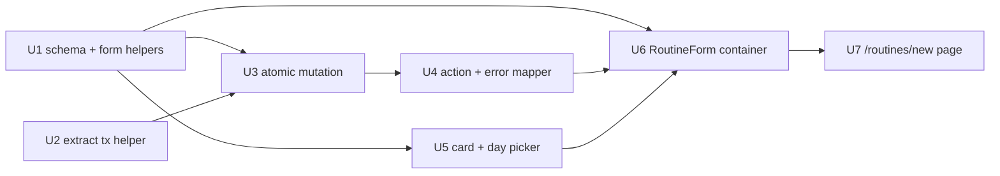

# feat: Swole Routine Builder (Create)

## Overview

Add the create flow at `/routines/new` for the `@lilnas/swole` app: a controlled
client form that authors a routine (name + optional day pills + 1..N inline
exercise cards across the four exercise types) and saves it **atomically** via a
new server action. This closes the load-bearing gap in Survivor 4 — the home
page's three entry points (`EmptyState` CTA, `+ New Routine`, `RoutineCard` Edit)
all link to routes that don't exist, so the app currently can't be used without
hand-seeding the database via `scripts/seed-home.mjs`.

The work introduces the app's **first zod usage** (a discriminated-union schema
that is the single validation source of truth for both the client gate and the
server mutation), a new atomic `createRoutineWithExercises` data-layer mutation
that mirrors the existing `createExercise` transaction discipline, and a
reuse-ready `RoutineForm` controlled component so the deferred `/routines/[id]`
edit page comes mostly free later — only the create wiring ships here.

No schema changes. No new dependencies. No theme changes.

---

## Problem Frame

Survivor 4 shipped a home page whose entry points dead-end: `EmptyState`
(`apps/swole/src/components/home/EmptyState.tsx`) and the `+ New Routine` button
(`apps/swole/src/app/page.tsx`) link to `/routines/new`; `RoutineCard`'s overflow
`Edit` links to `/routines/[id]`. The `apps/swole/src/app/` tree has no
`routines/` directory at all. The data layer exposes `createRoutine({name, days})`
and `createExercise(...)`, but there is **no UI to author a routine**, and a
routine with zero exercises is non-functional (the home card renders no "next up"
line and `Start session` has nothing to run).

This plan scopes the **create** flow only: a name, an optional day schedule, and
one or more exercises, saved in a single all-or-nothing transaction so a mid-way
failure can never leave a half-built routine. The builder is built reuse-friendly
(controlled `initialValues` + submit-action prop) so the deferred edit page is
cheap later, but only the create wiring ships now.

See origin: `docs/brainstorms/2026-05-28-swole-routine-builder-requirements.md`.

---

## Requirements Trace

- R1. Page at `apps/swole/src/app/routines/new/page.tsx` — thin server component rendering the client builder; layout chrome reused as-is. → **U7**
- R2. Builder is a client component; the single write goes through a new server action in `apps/swole/src/actions/routines.ts`. ADR-001 path: no inline Drizzle in the page, no React Query, no client data fetching. → **U4, U6, U7**
- R3. On success, route to `/` (home); a `Cancel` affordance also returns to `/` without writing. → **U6**
- R4. Mobile-first, single-column; reuse the dark/orange theme and `cns()`; no new theme tokens; thumb-reachable primary actions. → **U5, U6**
- R5. Name is a required text field, trimmed; empty/whitespace blocks submit and mirrors the `ValidationError` `createRoutine` throws. → **U1, U3, U6**
- R6. Days is an optional Mon-first multi-select of the seven day codes, styled to match the home day-token look; zero days persists `days: []`. → **U1, U5, U6, U3**
- R7. Exercises are a vertical list of inline cards with remove + up/down reorder; submit-time list position becomes `orderInRoutine`. → **U5, U6, U3**
- R8. Each card leads with a type selector and shows exactly the fields the type requires (weighted/bodyweight/time-based/cardio). → **U5, U1**
- R9. Switching a card's type preserves still-applicable values and clears the rest. → **U1, U5**
- R10. New card defaults to `weighted` with sets/reps/increment pre-filled and starting weight blank; defaults editable and planning-tunable. → **U1**
- R11. Numeric fields accept positive integers with per-type constraints mirroring the exercises CHECK constraint. → **U1**
- R12. `Create routine` enabled only when name is non-empty **and** every present card is valid for its type (≥1 card required); days optional. → **U1, U6**
- R13. Invalid/partial cards surface inline, field-level errors (on blur and on submit attempt). → **U1, U5, U6**
- R14. Validation runs client-side and is re-enforced server-side. Server-side zod (`safeParse` in U3) is the **load-bearing guard for numeric positivity** (the CHECK does not bound reps/weight/increment/duration — see Context); the exercises CHECK backstops type-conditional NULL presence + cardio `sets = 1` + `sets >= 1`; the DB-layer `ValidationError` guards the name. → **U1, U3**
- R15. Routine + all exercises created in one all-or-nothing transaction; a failure persists nothing. → **U3**
- R16. Each weighted exercise seeds its `initial` progression inside the same transaction, identical to `createExercise`'s rule. → **U2, U3**
- R17. Exercises persist with `orderInRoutine` = submit-time list position (0-indexed, contiguous). → **U3, U6**
- R18. A new server action wraps the mutation, calls `revalidatePath('/')`, and surfaces a tagged error the form maps via a new `mapCreateRoutineError` helper. → **U4**
- R19. The builder is a controlled component accepting `initialValues` + a submit-action prop, so a future edit page can reuse it; only create wiring ships now. → **U6**

**Origin flows:** F1 (Build and save a routine — covers R1, R3, R5, R6, R7, R8, R12, R15, R16, R17, R18), F2 (Correct an invalid card before saving — covers R3, R12, R13, R14).
**Origin acceptance examples:** AE1 (covers R8, R11), AE2 (R9), AE3 (R9), AE4 (R15, R16, R17), AE5 (R12, R13), AE6 (R15), AE7 (R6, R12).
**Origin actors:** single user (N=1, "this is Jeremy"); Traefik forward-auth is the only gate, no per-row authorization (carried from origin Dependencies/Assumptions).

---

## Scope Boundaries

Carried from origin — explicit non-goals for this work:

- No edit-page wiring; loading initial values, archiving/reordering existing exercises is a separate brainstorm.
- No drag-and-drop reorder — up/down controls only.
- No archived-routine restore, no "show archived" anything.
- No templates, "duplicate exercise", or "copy from another routine".
- No exercise-name library or autocomplete; names are free text.
- No unsaved-changes navigation guard in v1; `Cancel` is explicit, browser-back may drop input.
- No unit choice — weight is lb only; durations stored as `durationSeconds`. No per-exercise notes, rest timers, supersets, RPE, or tempo.
- No rep ranges — `target_reps` is a single integer.
- No runner or stats work; downstream pages the created routine links into may 404 during interim deploys.
- No new dependencies, no theme changes; compose existing MUI + Tailwind primitives.
- No client-side data-fetching libraries.
- **Integer-only numerics** (consequence of the existing `integer` columns + R11): 2.5 lb increments and fractional reps are intentionally unsupported. Changing this would require an `integer → real` migration, which is out of scope.

### Deferred to Follow-Up Work

- `/routines/[id]` edit page: not built. The form is made reuse-ready (R19 — `initialValues` + `submitAction` props); a separate plan wires the edit route, loads existing values, and reconciles existing-exercise archive/reorder against the data layer's `updateExercise` / `archiveExercise` / `reorderExercises`.

---

## Context & Research

### Relevant Code and Patterns

- **Transaction model to mirror** — `createExercise` in `apps/swole/src/db/exercises.ts`: `db.transaction(tx => {...}, { behavior: 'immediate' })`, **synchronous** callback, **`tx.*` only** (a stray `db.*` commits unconditionally — documented footgun), `exerciseValues(args)` flattens the discriminated union and nulls unused columns to satisfy the CHECK, weighted seeds the `initial` progression; wrapped in `try/catch → logMutationError(op, args, err) → rethrow`.
- **Tx-passable-helper precedent** — `activeSessionCountForRoutine(executor, routineId)` in `apps/swole/src/db/exercises.ts` (typed `Executor = { select: typeof db.select }`) is the established pattern for a helper callable with both `db` and `tx`; the proposed `insertExerciseWithInitialProgression(tx, …)` follows it.
- **Name validation contract** — `createRoutine` / `createExercise` throw `ValidationError('… must be non-empty')` on `args.name.trim() === ''`. Errors live in `apps/swole/src/db/errors.ts` (`DataLayerError` + `kind` discriminator).
- **`CreateExerciseArgs` discriminated union** — `apps/swole/src/db/exercises.ts`: four variants; cardio's `sets` is the **literal `1`** (mirrors the CHECK). The new zod schema mirrors this variant-for-variant minus `routineId`/`orderInRoutine`.
- **Schema + CHECK** — `apps/swole/src/db/schema.ts`: `routines.days` is `text({mode:'json'}).$type<DayCode[]>().notNull()` (accepts `[]`); the `exercise_type_fields_match` CHECK enforces type-conditional NULL presence and cardio `sets = 1`; `exercise_sets_positive` enforces `sets >= 1`. **The CHECK does NOT bound reps/weight/increment/duration positivity** — zod is the sole guard for those.
- **Server action pattern** — `apps/swole/src/actions/routines.ts` (`'use server'`): each action `await`s the pure `db*` mutation, calls `revalidatePath(...)`, returns the row, and **throws on error** (no Result wrapper). The header comment is load-bearing: never call `db/routines.ts` from a request scope — revalidate side effects live in the action layer (#25).
- **Error-mapper location** — `mapStartSessionError` / `mapArchiveRoutineError` live in `apps/swole/src/lib/format.ts` (NOT `actions/`), returning `ErrorToast = { message: string; severity: 'warning' | 'error' }`. `mapCreateRoutineError` belongs here.
- **Client submit-lifecycle pattern** — `apps/swole/src/components/home/RoutineCard.tsx`: `useTransition` + `try { await action(); router.push(...) } catch (err) { const {message,severity} = mapXxxError(err); showToast(message, severity) }`, with controls `disabled` while the transition is pending. `useToast()` (`apps/swole/src/hooks/use-toast.ts`) → `showToast(message, severity?)`.
- **Day-token markup to match (R6)** — `RoutineCard`: `cns('rounded-md px-2 py-0.5 text-xs font-medium', isToday ? 'bg-orange-500 text-white' : 'bg-neutral-800 text-neutral-300')`. Mon-first codes come from `dayCodes` (exported from `schema.ts`); labels from `DAY_LABELS` (currently module-private in `format.ts` — must be exported, see U5). Card container styling to echo: `rounded-xl border bg-neutral-900/80 p-5`.
- **MUI+Tailwind convention** — MUI components styled with `!`-prefixed Tailwind utilities (`className="!mt-1 !font-semibold"`); plain Tailwind on layout `div`/`span`. `LinkBehavior` in `apps/swole/src/theme.tsx` makes MUI `<Button href>` render `next/link` for free.
- **Formatters / duration units** — `apps/swole/src/lib/format.ts`: `formatTimeBasedDuration(s) → '${s}s'`, `formatCardioDuration(s) → '${Math.round(s/60)} min'`. Drives the input-units decision: time-based entered in **seconds**, cardio in **minutes** (×60 on normalize).
- **Test harness** — `apps/swole/src/db/__tests__/*.spec.ts`: `jest.mock('src/db/client', () => ({ get db() { return currentDb } }))`, `createTestDb()` (`apps/swole/src/db/test-db.ts`) is in-memory sqlite with **real migrations + real CHECK/FK** (atomicity is genuinely exercised), per-test `beforeEach`/`afterEach`, local `seed*` helpers, assertions via `await expect(fn()).rejects.toThrow(/regex/)`. `exercises.spec.ts` has the atomicity-rollback precedent (FK to a missing routine → assert zero rows).

### Institutional Learnings

- `docs/solutions/conventions/begin-immediate-for-read-then-write-mutations-2026-05-27.md` (module `swole/db`) — every paired/multi-row write must use `db.transaction(cb, { behavior: 'immediate' })`; bare `db.transaction(cb)` (DEFERRED) is forbidden; **all calls inside the callback must use `tx`**. Names `createExercise` as the model to mirror. **Directly governs U2/U3.**
- `docs/solutions/architecture-patterns/pure-fsm-core-for-stateful-domain-logic-2026-05-27.md` (module `swole/session-machine`) — the discriminated-union + TypeScript-narrowing pattern and the "same rule must hold in UI and persistence, keep it in one place" principle apply to the shared zod schema. **Caveat (load-bearing):** "Don't apply [an FSM] when the form is trivial / the UI is the only consumer" — the builder uses plain controlled React state + extracted pure helpers, **not** an FSM. References `apps/swole/docs/adr/001-data-flow.md`.
- `apps/swole/docs/adr/001-data-flow.md` — ADR-001: Next.js-only, **server actions are the transactional boundary**, Drizzle in server actions (writes) / server components (reads), no NestJS REST, no React Query / `revalidatePath` for cache invalidation. The new action is the mutation entry point.

### Gaps (no learnings — lean on codebase patterns)

Next.js server-action `revalidatePath` gotchas, controlled multi-card form state, client/server validation parity, MUI+Tailwind/`cns()`, and client toast patterns are undocumented in `docs/solutions/`. Worth a `/ce-compound` capture after this lands.

---

## Key Technical Decisions

- **Atomic single-transaction create** (origin Key Decision). New `createRoutineWithExercises({ name, days, exercises })` in `apps/swole/src/db/routines.ts` inserts the routine, its exercises (with `orderInRoutine` = list position), and each weighted exercise's `initial` progression in one `BEGIN IMMEDIATE` transaction. Rejected: client-side `createRoutine` + N×`createExercise` (can half-create, N+1 round-trips, multiple `revalidatePath`).
- **Extract `insertExerciseWithInitialProgression(tx, args)`** into `apps/swole/src/db/exercises.ts`; `createExercise` refactors to call it, and the new mutation calls it per exercise. Rationale: R16 requires the weighted→initial rule be **identical** to `createExercise`; the `activeSessionCountForRoutine(executor, …)` precedent shows the codebase already extracts tx-passable helpers to avoid duplication (#12). (Resolves origin deferred Q on the helper.)
- **Single zod discriminated-union schema as validation source of truth** — `apps/swole/src/lib/routine-form.ts` (neutral module, no `server-only`/`'use client'` banner so both layers import it). Feeds (a) the client save-gate + inline errors, (b) the mutation's args typing, (c) the mutation's server-side `safeParse` re-enforcement. Because the SQLite CHECK does **not** bound numeric positivity (only NULL-presence + cardio `sets = 1` + `sets >= 1`), the server-side `safeParse` is the **sole, load-bearing** guard for reps/weight/increment/duration ≥ 1 — not redundant defense-in-depth. Any future write path must not assume a DB-level net exists for those fields. (Resolves origin deferred Q on schema location — `src/lib/` chosen over a new `src/validation/`: it pairs with the formatters/mappers it sits beside, lower friction, no competing convention.)
- **Two form data shapes** — `ExerciseCardState` (raw strings + a stable client id, for controlled inputs) ↔ `ExerciseDraft` (canonical numbers, validated). A pure `normalizeCard` converts state→draft (empty string → "missing", **not** `0`; cardio minutes→seconds), then `safeParse`. Keeps unit conversion and string-parsing in one testable seam.
- **Duration input units** (origin deferred Q) — time-based entered in seconds (stored as-is), cardio entered in minutes (×60 on normalize). Matches `formatTimeBasedDuration` / `formatCardioDuration`. Integer minutes only; `0` rejected.
- **New-card defaults** (origin deferred Q, R10) — `weighted`, sets `3`, target reps `10`, increment `5`, starting weight **blank**. Mirrors the test-suite seed defaults; tunable.
- **Days picker = custom pills** (origin deferred Q) reusing the exact home day-token `cns(...)` classes over a `<button>`/MUI `ButtonBase`, rendered Mon-first by iterating `dayCodes`. Rejected MUI `ToggleButtonGroup` (brings its own styling to override). Selection persists **canonicalized to week order** (`dayCodes.filter(d => selected.has(d))`) so home pill rendering (which renders in array order) stays Mon-first.
- **Type selector = MUI `Select`** (dropdown), matching the visual sketch's `[ weighted ▾ ]`. Chosen over `ToggleButtonGroup` (four inline segments would crowd the card header on mobile alongside the reorder/remove controls). Style its menu to the dark theme with `!`-prefixed Tailwind as elsewhere.
- **Reorder = up/down `IconButton`s** (origin scope) — up disabled on the first card, down on the last; disabled icons get a distinctly dimmed style (e.g. `!text-neutral-700`) so they don't read as tappable on the dark background; no drag dependency.
- **Card state keyed by stable client id**, not list index, so reorder/remove move a card's values **and** its error state with it.
- **Save gate = name non-empty AND ≥1 card AND every present card valid** (R12 + F2 "nothing is written until the form is fully valid"). Invalid cards **block**; they are never silently dropped. A freshly-added card is invalid (blank weight) and blocks until filled or removed.
- **`mapCreateRoutineError`** (origin deferred Q) distinguishes `ValidationError` → a "check the highlighted fields" message from a generic `'Could not create routine. Try again.'`, severity `'error'`. Create has no active-session/conflict path. A raw CHECK violation (should-never-happen given client+server zod) falls to the generic branch.
- **No unsaved-changes guard in v1** (origin scope) — accepted default. An in-flight submit completes server-side regardless of navigation; home's `revalidatePath('/')` reflects it.

---

## Open Questions

### Resolved During Planning

- **Schema location?** → `apps/swole/src/lib/routine-form.ts` (see Key Decisions).
- **Extract the shared progression helper?** → Yes — `insertExerciseWithInitialProgression(tx, args)` (see Key Decisions).
- **Days-picker primitive & Mon-first?** → Custom pills reusing home day-token classes, iterate `dayCodes`; persist canonicalized to week order.
- **Duration input units?** → time-based seconds, cardio minutes (×60); integer-only; `0` rejected.
- **New-card defaults?** → weighted; sets 3 / reps 10 / increment 5; starting weight blank.
- **Numeric bounds (CHECK doesn't guard reps/weight/duration)?** → zod enforces positive integers (≥1) for sets/reps/startingWeight/increment/durationSeconds; cardio `sets` literal `1`. (R11.)
- **Partial-card gate semantics (analyzer flagged ambiguous)?** → Resolved by **F2**: every present card must be valid; invalid cards block, never silently dropped.
- **Double-submit?** → `Create` disabled while the `useTransition` is pending (no DB name-uniqueness added). (Analyzer M1.)
- **Server error recovery?** → On failure: re-enable, preserve all input, do **not** navigate, surface `mapCreateRoutineError` toast. (Analyzer M2.)
- **`cardio → weighted` sets after force-to-1?** → Carries the current value (`1`) forward per R9; field is shown editable. (Analyzer N3.)
- **Name trimming on persist?** → Trim before insert in the new mutation (store `name.trim()`), avoiding leading-space artifacts in home's alphabetical sort. `createRoutine` currently stores raw; the minor divergence is acceptable and could be unified later. (Analyzer M8.)
- **Toast copy / tagged errors for `mapCreateRoutineError`?** → `ValidationError` vs generic; copy in Key Decisions.
- **Unsaved-changes guard?** → None in v1.

### Deferred to Implementation

- Exact zod issue-path → inline-field-error key mapping in `normalizeCard` (depends on the final zod 4 error shape).
- Whether the `ExerciseDraft → CreateExerciseArgs` mapping needs a per-type `switch` helper to satisfy the discriminated union (likely yes, due to TS union-spread widening) — settle when wiring U3.
- Whether `z.enum(dayCodes)` accepts the `readonly` tuple directly or needs a spread — settle at U1 against zod 4.1.12.
- Sanity ceiling on exercise count: none enforced (N=1 scale); verify ~30 cards submit atomically rather than adding a cap. (Analyzer N9.)
- Numeric `TextField` `inputMode`/`type` choices (e.g. `inputMode="numeric"` with `type="text"` to keep full control over string state) — presentational, settle at U5. (The type-selector primitive is **decided**: MUI `Select`, matching the sketch's `▾` — see Key Technical Decisions.)

---

## Output Structure

    apps/swole/src/
      app/
        routines/
          new/
            page.tsx                      # U7 — thin server component
      actions/
        routines.ts                       # U4 — add createRoutineWithExercises action
      db/
        exercises.ts                      # U2 — extract insertExerciseWithInitialProgression
        routines.ts                       # U3 — add createRoutineWithExercises mutation
        __tests__/
          exercises.spec.ts               # U2 — helper/refactor coverage (existing file)
          routines.spec.ts                # U3 — new mutation coverage (existing file)
      lib/
        routine-form.ts                   # U1 — zod schema + pure form helpers (NEW)
        format.ts                         # U4 — add mapCreateRoutineError; U5 — export DAY_LABELS
        __tests__/
          routine-form.spec.ts            # U1 — schema + helper tests (NEW)
          format.spec.ts                  # U4 — mapCreateRoutineError tests (existing file)
      components/
        routines/                         # NEW directory
          RoutineForm.tsx                 # U6 — controlled container (reuse seam)
          ExerciseCard.tsx                # U5 — presentational card
          DayPicker.tsx                   # U5 — Mon-first pills

This is a scope declaration, not a constraint — the implementer may adjust (e.g.
fold `DayPicker` into `RoutineForm`) if implementation reveals a cleaner layout.
The per-unit **Files** sections remain authoritative.

---

## High-Level Technical Design

> *This illustrates the intended approach and is directional guidance for review, not implementation specification. The implementing agent should treat it as context, not code to reproduce.*

**Data flow — string inputs to persisted rows:**

```
ExerciseCardState[]                 (U6 RoutineForm React state: raw strings + stable id)
   │  applyTypeSwitch on type change (U1)        ── preserve/clear per R9 matrix
   │  per-field onChange/onBlur                  ── controlled inputs (U5 ExerciseCard)
   ▼
normalizeCard(state) per card (U1)  ── strings→ints, empty→"missing", cardio min→sec
   │                                   → { ok, draft } | { ok:false, errors }   (R13 inline errors)
   ▼
save gate (U1): name.trim() && cards≥1 && cards.every(normalizeCard ok)   (R12 / F2)
   ▼  on submit (U6): build RoutineFormValues { name, days(canonical), exercises: ExerciseDraft[] }
   ▼  useTransition → await createRoutineWithExercises(values)            (U4 action: 'use server' + revalidatePath('/'))
   ▼
db mutation (U3): routineFormSchema.safeParse → ValidationError on fail   (R14 server re-enforce)
   ▼  db.transaction(tx => { ... }, { behavior:'immediate' })            (R15 atomic; learning: tx.* only)
   ├─ tx.insert(routines).values({ name:trim, days }).returning().get()
   └─ for each draft, index i:
        insertExerciseWithInitialProgression(                            (U2 shared helper)
          tx, toCreateExerciseArgs(draft, routineId, orderInRoutine=i))  (R17 contiguous; R16 weighted→initial)
   ▼  CHECK backstops NULL-presence + cardio sets=1 + sets≥1; server safeParse is the sole guard for numeric positivity (R14)
   ▼  any throw inside the tx → whole tx rolls back (R15); rollback is tested by an injected in-tx throw, not a CHECK violation (AE6 — see U3)
   ▼  success → router.push('/')   |   error → mapCreateRoutineError → showToast, preserve input (M2)
```

**Type-switch field-preservation matrix (R9 — `applyTypeSwitch`, pinned by AE2/AE3/N3/N4):**

| From → To | name | sets | targetReps | startingWeight | increment | duration |
|---|---|---|---|---|---|---|
| any → weighted | keep | keep (cardio's `1` carries) | keep | clear→blank | clear→default | clear |
| any → bodyweight | keep | keep | keep | clear | clear | clear |
| any → time-based | keep | keep | clear | clear | clear | keep |
| any → cardio | keep | **force 1** | clear | clear | clear | keep |

Rules: `name` always kept; `sets` kept except → cardio (forced `1`); `targetReps` survives only across weighted↔bodyweight; `duration` survives only across time-based↔cardio. Cleared values are dropped from `CardState` (not hidden) so repeated switching never resurrects them (N4). Stale inline errors on now-hidden fields clear on switch (N5).

---

## Implementation Units

Dependency graph:



Suggested order: U1 → U2 → U3 → U4 → U5 → U6 → U7. U2 is a behavior-preserving refactor that unblocks U3; U1 unblocks both the mutation and the UI.

---

- U1. **Shared validation schema + pure form helpers**

**Goal:** Create the single source of truth for routine-form validation and the pure, testable logic the React layer is glue over: the zod discriminated-union schema, the two data shapes, defaults, type-switch, normalization, the save-gate predicate, and the day canonicalizer.

**Requirements:** R5, R6, R8, R9, R10, R11, R12, R13, R14

**Dependencies:** None (first zod usage in the app)

**Files:**
- Create: `apps/swole/src/lib/routine-form.ts`
- Test: `apps/swole/src/lib/__tests__/routine-form.spec.ts`

**Approach:**
- `exerciseDraftSchema = z.discriminatedUnion('type', [...])` — four variants mirroring `CreateExerciseArgs` minus `routineId`/`orderInRoutine`, in **canonical units**: weighted `{ name, sets≥1, targetReps≥1, startingWeight≥1, increment≥1 }`, bodyweight `{ name, sets≥1, targetReps≥1 }`, time-based `{ name, sets≥1, durationSeconds≥1 }`, cardio `{ name, sets: z.literal(1), durationSeconds≥1 }`. All numerics positive integers (`z.number().int().min(1)`); `name` `z.string().trim().min(1)`.
- `routineFormSchema = z.object({ name: z.string().trim().min(1), days: z.array(z.enum(dayCodes)), exercises: z.array(exerciseDraftSchema).min(1) })`. Export inferred `RoutineFormValues`, `ExerciseDraft`.
- `ExerciseCardState` type — `{ id, type, name, sets, targetReps, startingWeight, increment, duration }` (all strings except `id`/`type`); a single `duration` string interpreted per type at normalize.
- `createEmptyCard(): ExerciseCardState` — weighted defaults (sets `'3'`, reps `'10'`, increment `'5'`, weight `''`); `id` from a module counter or `crypto.randomUUID()`.
- `applyTypeSwitch(card, newType): ExerciseCardState` — the R9 matrix; cardio forces `sets='1'`.
- `normalizeCard(card): { ok: true; draft: ExerciseDraft } | { ok: false; errors: Partial<Record<field, string>> }` — parse strings→ints (empty → missing, never `0`), cardio `duration` minutes ×60 → seconds, time-based `duration` seconds as-is, then `exerciseDraftSchema.safeParse`; map zod issues → per-field error strings.
- `isRoutineFormValid({ name, cards }): boolean` — the R12/F2 gate: `name.trim() !== '' && cards.length >= 1 && cards.every(c => normalizeCard(c).ok)`.
- `canonicalizeDays(selected: Set<DayCode>): DayCode[]` — `dayCodes.filter(d => selected.has(d))` (Mon-first).
- `toCreateExerciseArgs(draft, routineId, orderInRoutine): CreateExerciseArgs` — per-type switch to satisfy the discriminated union (see Deferred to Implementation).

**Patterns to follow:** `CreateExerciseArgs` discriminated union (`apps/swole/src/db/exercises.ts`); `dayCodes`/`DayCode` from `apps/swole/src/db/schema.ts`; import ordering per the flat eslint config.

**Client-bundle safety:** this module is imported by the client `RoutineForm` (U6), so import `CreateExerciseArgs` with **`import type`** (it is a `type`, so the import erases at compile time) to avoid dragging `db/exercises.ts` — which carries `import 'server-only'` + `better-sqlite3` — into the client bundle. `dayCodes` is a value import from `db/schema.ts`, which is bundler-safe (only `drizzle-orm/sqlite-core`, no `server-only`/Node APIs). Keep this module free of any `server-only`/`'use client'` banner so both layers can import it.

**Test scenarios:**
- Happy path: each of the four `exerciseDraftSchema` variants accepts a fully-valid draft. *Covers AE1 (cardio canonical shape).*
- Edge: cardio draft with `sets` ≠ 1 is rejected (`z.literal(1)`). *Covers AE1.*
- Error path: weighted draft missing `startingWeight` → `safeParse` fails with a `startingWeight` issue. *Covers AE5.*
- Error path: `targetReps`/`startingWeight`/`increment`/`durationSeconds` = `0` or negative → rejected (zod is the only guard — CHECK doesn't bound these). *Analyzer M3.*
- Error path: decimal (`2.5`) and non-numeric (`"abc"`) numeric input → rejected; empty string → "missing/required", distinctly from `0`. *Analyzer M3.*
- Edge: `normalizeCard` cardio `duration="30"` → `durationSeconds=1800`; `duration="0"` → rejected; time-based `duration="45"` → `durationSeconds=45`. *Analyzer M4.*
- Happy path: `applyTypeSwitch` weighted{name,sets=3,reps=10,weight=95,inc=5} → bodyweight keeps name/sets/reps, clears weight/increment. *Covers AE2.*
- Happy path: same card → cardio keeps name, forces sets=1, clears reps/weight/increment, duration empty. *Covers AE3.*
- Edge: cardio(sets=1) → weighted leaves sets='1' (current value carried), shows sets field. *Analyzer N3.*
- Edge: weighted(weight=95) → bodyweight → weighted leaves weight blank (no resurrection); reps does not survive a trip through cardio. *Analyzer N4.*
- Happy/edge: `isRoutineFormValid` flips — empty/whitespace name → false; zero cards → false; one valid card → true; one valid + one partial card → false; valid card made invalid → false. *Covers AE5; analyzer M5.*
- Happy path: `canonicalizeDays({fri,mon})` → `['mon','fri']`; empty set → `[]`. *Covers AE7; analyzer N10.*

**Verification:** `pnpm --filter @lilnas/swole test` passes the new suite; `type-check` confirms `ExerciseDraft`/`RoutineFormValues` infer correctly and `toCreateExerciseArgs` returns an assignable `CreateExerciseArgs`.

---

- U2. **Extract `insertExerciseWithInitialProgression` tx helper**

**Goal:** Factor the "insert one exercise + seed its `initial` progression if weighted" rule out of `createExercise` into a tx-passable helper, so the new mutation (U3) reuses the exact R16 rule instead of duplicating it. Behavior-preserving.

**Requirements:** R16

**Dependencies:** None

**Files:**
- Modify: `apps/swole/src/db/exercises.ts`
- Modify (tests): `apps/swole/src/db/__tests__/exercises.spec.ts`

**Approach:**
- Add `insertExerciseWithInitialProgression(tx, args: CreateExerciseArgs): ExerciseRow` — `tx.insert(exercises).values(exerciseValues(args)).returning().get()`, then if `args.type === 'weighted'` insert the `initial` progression (`startingWeight`, `reason: 'initial'`), return the inserted row.
- **Type the `tx` param precisely — do not widen to `any`/`unknown`** (that would defeat the `tx.*`-only footgun protection). The existing `Executor = { select: typeof db.select }` covers only `.select`; this helper needs `.insert`. Extend it to `Executor = { select: typeof db.select; insert: typeof db.insert }` (and leave `activeSessionCountForRoutine` working unchanged, since it only uses `.select`), **or** type the param as the Drizzle transaction callback parameter type directly. Both `db` and `tx` structurally satisfy the extended `Executor` (verified: drizzle 0.45.1 `BaseSQLiteDatabase<'sync', …>` exposes the same `insert`), so the helper stays callable from both handles.
- Refactor `createExercise` to keep its name-check + `db.transaction(tx => insertExerciseWithInitialProgression(tx, args), { behavior: 'immediate' })` + `try/catch → logMutationError`.

**Execution note:** Behavior-preserving refactor — the existing `createExercise` tests are the characterization net; keep them green before and after, then add a direct helper test.

**Patterns to follow:** `activeSessionCountForRoutine(executor, …)` tx-passable-helper precedent; the existing `createExercise` body and `exerciseValues` (`apps/swole/src/db/exercises.ts`).

**Test scenarios:**
- Happy path: existing `createExercise` tests (weighted seeds one `initial` progression; bodyweight/time-based/cardio seed none) still pass unchanged.
- Happy path: `insertExerciseWithInitialProgression(tx, weightedArgs)` inside a test transaction inserts the exercise and exactly one `initial` progression with matching `startingWeight` and null `sessionId`.
- Edge: same helper with a non-weighted args inserts the exercise and **no** progression row.
- Error path: the helper with a CHECK-violating arg (`badArgs as never`, e.g. a `weighted` row missing `startingWeight`) run inside a `db.transaction` rejects with `/CHECK/` and leaves zero `exercises`/`progressions` rows — proving the constraint fires at the insert seam (mirrors the existing `exercises.spec.ts` `as never` CHECK precedent). This is the constraint-level rollback proof that U3's public mutation can't reach (its `safeParse` is stricter). *Covers AE6 / R14, R15.*

**Verification:** `exercises.spec.ts` passes; no behavior change observable from `createExercise` callers.

---

- U3. **`createRoutineWithExercises` atomic mutation**

**Goal:** The core atomic write — insert the routine, all exercises (`orderInRoutine` = list position), and each weighted exercise's `initial` progression in one `BEGIN IMMEDIATE` transaction; re-enforce validation server-side; roll back entirely on any failure.

**Requirements:** R5, R6, R14, R15, R16, R17

**Dependencies:** U1 (schema + `toCreateExerciseArgs`), U2 (helper)

**Files:**
- Modify: `apps/swole/src/db/routines.ts`
- Modify (tests): `apps/swole/src/db/__tests__/routines.spec.ts`

**Approach:**
- `createRoutineWithExercises(args: RoutineFormValues): Promise<RoutineRow>` (keep the `async`/`Promise<T>` convention per the file header #34).
- Top: `routineFormSchema.safeParse(args)` → on failure throw `ValidationError` (R14 server re-enforcement; gives `mapCreateRoutineError` a tagged error). Also trim name; reject whitespace-only with `ValidationError` (mirrors `createRoutine`, analyzer M8).
- `db.transaction(tx => { ... }, { behavior: 'immediate' })` — **`tx.*` only** (learning footgun): insert routine `{ name: name.trim(), days }` → `routineId`; loop `args.exercises` with index `i`, calling `insertExerciseWithInitialProgression(tx, toCreateExerciseArgs(draft, routineId, i))`; return the routine row.
- Wrap in `try/catch → logMutationError('createRoutineWithExercises', args, err) → throw`.
- **Rollback-test reachability (resolves adversarial finding):** because `safeParse` runs *before* the transaction opens and the schema is *stricter* than the CHECK (zod requires `≥1` on numeric fields the CHECK doesn't bound, and mirrors the CHECK on shape), **no realistic input can pass `safeParse` and then trip the CHECK inside the tx**. The R15 all-or-nothing guarantee is therefore tested by forcing an *in-transaction throw* (e.g. spy `insertExerciseWithInitialProgression` to throw on the Nth call), not by injecting a CHECK-violating exercise through the public function. A separate direct test at the helper/tx seam (U2) drives a real CHECK violation via an `as never` cast (mirroring the existing `exercises.spec.ts` `as never` precedent) to prove the constraint itself fires and rolls back.

**Execution note:** Start with the AE6 atomicity (full-rollback) test red — drive it by forcing an in-transaction throw (per the reachability note above), then the AE4 happy-path test. The rollback contract is the unit's highest-risk guarantee, so verify it fails for the *right* reason (mid-tx throw → rollback), not because `safeParse` rejected the input before the tx ever opened.

**Patterns to follow:** `createExercise` tx structure and error handling (`apps/swole/src/db/exercises.ts`); `createRoutine` name validation (`apps/swole/src/db/routines.ts`); `exercises.spec.ts` `describe('atomicity', …)` block; `createTestDb()` harness.

**Test scenarios:**
- Happy path: cards `[weighted, weighted, cardio]` → exactly one `routines` row; three `exercises` rows with `orderInRoutine` 0,1,2; two `initial` progressions (weighted); cardio row `sets = 1`. *Covers AE4 / R15, R16, R17.*
- Integration: `orderInRoutine` is derived from submit-time list position and is contiguous after the client removed/reordered cards (e.g. a 2-exercise routine persists 0,1, not 0,2). *Analyzer M6 / R17.*
- Error path: a forced mid-transaction failure (spy `insertExerciseWithInitialProgression` to throw on the 2nd/3rd call, after the routine + earlier exercises have inserted) → the whole transaction rolls back; **zero** rows in `routines`, `exercises`, and `progressions`. This proves all-or-nothing across multiple inserts (R15) and is reachable because the throw happens *inside* the tx, after `safeParse` has passed. *Covers AE6 / R15.*
- (The constraint-level rollback proof — a real CHECK violation rolling back — lives in **U2**'s helper-seam test, since the public mutation's stricter `safeParse` can't reach a CHECK violation. See U2 test scenarios.)
- Error path: whitespace-only `name` → `ValidationError`, nothing written. *Covers R5; analyzer M8.*
- Error path: empty `exercises` array → `ValidationError` (schema `.min(1)`), nothing written.
- Happy path: zero days → routine persists `days: []`. *Covers AE7 / R6.*
- Edge: a weighted + a bodyweight + a time-based card each persist with the correct type-specific columns set and the rest NULL (CHECK satisfied via `exerciseValues`). *Covers R11, R14.*

**Verification:** `routines.spec.ts` passes including the rollback assertions; the Survivor 3 data-layer suite remains green.

---

- U4. **Create server action + `mapCreateRoutineError`**

**Goal:** The `'use server'` wrapper that is the mutation's request-scope entry point (with `revalidatePath('/')`), and the error→toast mapper the form uses.

**Requirements:** R2, R3, R18

**Dependencies:** U3

**Files:**
- Modify: `apps/swole/src/actions/routines.ts`
- Modify: `apps/swole/src/lib/format.ts`
- Modify (tests): `apps/swole/src/lib/__tests__/format.spec.ts`

**Approach:**
- In `actions/routines.ts`: `createRoutineWithExercises(args: RoutineFormValues): Promise<RoutineRow>` → `await dbCreateRoutineWithExercises(args)`; `revalidatePath('/')`; return the row. Thin, throws on error (no Result wrapper), matching the sibling actions and the #25 header contract.
- In `format.ts`: `mapCreateRoutineError(err: unknown): ErrorToast` — `err instanceof ValidationError` → `{ message: 'Check the highlighted fields and try again.', severity: 'error' }`; fallthrough `{ message: 'Could not create routine. Try again.', severity: 'error' }`. **Add** `ValidationError` to the `src/db/errors` import in `format.ts` — the file currently imports `DataLayerError`, `ArchiveBlockedByActiveSession`, `RoutineAlreadyHasActiveSession`, `RoutineArchived` but **not** `ValidationError` (alternatively, match on `err instanceof DataLayerError && err.kind === 'validation'` to avoid a new import).

**Patterns to follow:** existing `createRoutine`/`archiveRoutine` actions; `mapStartSessionError`/`mapArchiveRoutineError` shape and `ErrorToast` type (`apps/swole/src/lib/format.ts`).

**Test scenarios:**
- Happy path: `mapCreateRoutineError(new ValidationError('x'))` → validation message, `severity: 'error'`.
- Error path: `mapCreateRoutineError(new Error('boom'))` and a non-Error value → generic message, `severity: 'error'`.

**Verification:** `format.spec.ts` passes; `type-check` confirms the action's arg/return types line up with `RoutineFormValues`/`RoutineRow`.

---

- U5. **Day picker + exercise card (presentational components)**

**Goal:** The controlled, presentational building blocks: a Mon-first `DayPicker` (toggle pills matching the home day-token look) and an `ExerciseCard` (type selector + type-conditional fields + per-field errors + reorder/remove controls). State and logic live in U6/U1; these render and emit callbacks.

**Requirements:** R4, R6, R7, R8, R9, R13

**Dependencies:** U1 (`ExerciseCardState`, field-error shape, `DAY_LABELS`)

**Files:**
- Create: `apps/swole/src/components/routines/DayPicker.tsx`
- Create: `apps/swole/src/components/routines/ExerciseCard.tsx`
- Modify: `apps/swole/src/lib/format.ts` (export `DAY_LABELS`, currently module-private)

**Approach:**
- `DayPicker` (`'use client'`): props `{ selected: Set<DayCode>; onToggle(code) }`. Render `dayCodes.map(...)` as `<ButtonBase>`/`<button>` pills with `cns('rounded-md px-2 py-0.5 text-xs font-medium', selected.has(code) ? 'bg-orange-500 text-white' : 'bg-neutral-800 text-neutral-300')` + `aria-pressed`. Mon-first by construction.
- `ExerciseCard` (`'use client'`): props `{ card, errors, isFirst, isLast, onChange(patch), onTypeChange(type), onMoveUp, onMoveDown, onRemove }`. Header: type selector (MUI `Select`) + up/down `IconButton`s (up disabled when `isFirst`, down when `isLast`) + remove `IconButton`. Disabled up/down icons get a dimmed style (e.g. `!text-neutral-700`) distinct from the active `!text-neutral-400` so they don't read as tappable. Body: render exactly the type's fields (R8) via a `switch (card.type)`; cardio shows no sets field. Cardio duration field labeled "Duration (min)", time-based "Duration (sec)" (see U6). Each numeric field is a controlled `TextField` (`inputMode="numeric"`) showing `errors[field]` as `helperText`/`error` on blur/submit. Echo the home card container styling (`rounded-xl border bg-neutral-900/80 p-5`); MUI styled with `!`-prefixed Tailwind.
- **Focus affordance:** forward a ref (or accept an `autoFocusName` prop) so U6 can move focus to the name field when a card is added (the focus-management decision lives in U6).

**Patterns to follow:** day-token markup and `useToast`/`IconButton`/`!`-Tailwind conventions in `apps/swole/src/components/home/RoutineCard.tsx`; `LinkBehavior` is irrelevant here (no nav). `cns` from `@lilnas/utils/cns`.

**Test scenarios:**
- Test expectation: none — presentational glue over U1's tested helpers; the success criteria explicitly waive form-rendering tests ("the form is glue over tested helpers and a tested mutation"). Field-conditional rendering (AE1's "cardio shows only name + duration") and error display are validated via U1 logic + U6 verification.

**Verification:** `lint` + `type-check` pass; manual check that the type selector swaps fields per R8 and pills match the home look (covered end-to-end in U7 verification).

---

- U6. **`RoutineForm` controlled container (reuse seam)**

**Goal:** The stateful builder: holds the card array + name + selected days, wires add/remove/reorder/type-switch through U1's helpers, enforces the save gate, and on submit normalizes → calls the injected `submitAction` → routes home (or toasts on error, preserving input). Controlled via `initialValues` + `submitAction` props so the future edit page reuses it (R19).

**Requirements:** R2, R3, R4, R5, R6, R7, R9, R12, R13, R17, R19

**Dependencies:** U1, U4, U5

**Files:**
- Create: `apps/swole/src/components/routines/RoutineForm.tsx`

**Approach:**
- `'use client'`. Props: `{ initialValues: { name: string; days: DayCode[]; cards: ExerciseCardState[] }; submitAction: (values: RoutineFormValues) => Promise<RoutineRow>; submitLabel?: string }`. `submitLabel` defaults to `'Create routine'` inside the form so the create page (U7) need not pass it — it exists only so the future edit page can pass `'Save changes'` (the load-bearing reuse seam is `initialValues` + `submitAction`; `submitLabel` is a zero-cost convenience, not required by any current caller).
- State: `name`, `selectedDays: Set<DayCode>`, `cards: ExerciseCardState[]`, a `submitAttempted` flag (gates whether untouched-field errors show), and `touched` tracking for blur-level errors (R13). Card mutations operate by stable `id` (analyzer N7).
- Handlers: `addCard` (append `createEmptyCard()`), `removeCard(id)`, `moveCard(id, dir)`, `changeType(id, type)` → `applyTypeSwitch`, `patchCard(id, patch)`. Type-switch clears stale errors on now-hidden fields (analyzer N5).
- Derived: per-card `errors` from `normalizeCard` (shown on blur or after submit attempt); `canSubmit = isRoutineFormValid({ name, cards })` (R12/F2).
- Submit (mirror `RoutineCard`): `useTransition`; on click set `submitAttempted`, guard `canSubmit`; build `RoutineFormValues { name, days: canonicalizeDays(selectedDays), exercises: cards.map(normalize→draft) }` with `orderInRoutine` implied by array order (R17); `try { await submitAction(values); router.push('/') } catch (err) { showToast(...mapCreateRoutineError(err)) }`. `Create` and per-card controls `disabled` while pending (analyzer M1/M2 — no navigate on error, input preserved).
- `Cancel`: `router.push('/')`, no write (R3). No unsaved-changes guard (v1).

**Interaction states & layout (design decisions — resolve design-review gaps):**
- **Header / Cancel placement (R3, R4):** a **non-sticky** header row at the top of the form — title "New routine" left, `Cancel` (text button) right — matching the visual sketch; the form scrolls beneath it. Non-sticky is sufficient at the expected ~4–6 exercises and avoids z-index coordination with the layout nav; a sticky header is a later enhancement if forms grow long. `Create routine` is a full-width button at the **end** of the content (thumb-reachable), with `+ Add exercise` (full-width, dashed — mirroring the home `+ New Routine` button) directly above it and below the last card.
- **Name-field error timing (R5, R13):** the name field follows the **same** timing as cards — its required-error shows on blur or after a submit attempt, never on first render (an empty name on a freshly-opened form must not show red immediately).
- **Focus management (R7, a11y):** on `+ Add exercise`, move focus to the new card's name field (saves a tap on mobile); on `removeCard`, move focus to the previous card's remove control (or the `+ Add exercise` button if none remain) so focus is never lost to `<body>` (WCAG 2.4.3).
- **Empty-exercises state (R7, R12):** removing the last card is allowed; when `cards.length === 0`, render a short helper line in the exercises region (e.g. "Add at least one exercise to save") and keep `Create` disabled — so the disabled button has a visible explanation rather than an empty gap. (U7 seeds one card, so this is only reached if the user removes it.)
- **Cardio duration field label:** label the cardio duration input "Duration (min)" and the time-based input "Duration (sec)" so the unit each expects is unambiguous (cardio is ×60'd on normalize; time-based stored as-is).

**Execution note:** All branch-y logic (gate, normalize, type-switch) is imported from U1 — keep this component thin glue so the success-criteria waiver on form-rendering tests holds.

**Patterns to follow:** `useTransition` + `router.push` + `catch → mapXxxError → showToast` + `disabled={isPending}` from `apps/swole/src/components/home/RoutineCard.tsx`; `useToast` from `apps/swole/src/hooks/use-toast.ts`.

**Test scenarios:**
- Test expectation: none required (per success criteria — form is glue). The gate, type-switch, and normalization it orchestrates are unit-tested in U1; the atomic write in U3; the error mapper in U4. Submit-lifecycle behavior (disable-while-pending M1, re-enable/preserve/toast on error M2, reorder preserving per-card state N7) is verified manually in U7.

**Verification:** `lint` + `type-check` pass; the form enables `Create` only when name + ≥1 valid card (R12), routes to `/` on success (R3), and keeps input + toasts on a forced error (M2).

---

- U7. **`/routines/new` page wiring**

**Goal:** The route. A thin server component that renders `RoutineForm` with empty create defaults and the create server action — closing the home dead-ends.

**Requirements:** R1, R2, R3

**Dependencies:** U6, U4

**Files:**
- Create: `apps/swole/src/app/routines/new/page.tsx`

**Approach:**
- Server component (no `'use client'`). Render `<RoutineForm initialValues={{ name: '', days: [], cards: [createEmptyCard()] }} submitAction={createRoutineWithExercises} />`, importing `createRoutineWithExercises` from `src/actions/routines` (a `'use server'` action passed as a prop to the client component — allowed in Next App Router). `submitLabel` is omitted (defaults to "Create routine" in the form). Reuse layout chrome as-is (R1). The "New routine" header + `Cancel` affordance are rendered by `RoutineForm` (U6 — non-sticky header row), so this page is pure wiring.
- Start with a single empty card so the user lands ready to fill (R10), consistent with the visual sketch. (If a server→client hydration id mismatch surfaces from `createEmptyCard()`'s id being generated server-side, the form may instead accept `cards: []` and seed its first card on mount — settle at implementation.)

**Patterns to follow:** `apps/swole/src/app/page.tsx` server-component shape and the `EmptyState`/`+ New Routine` link targets; `LinkBehavior` gives any MUI `<Button href>` Next routing for free.

**Test scenarios:**
- Test expectation: none — thin server-component wiring. Covered by the Success Criteria end-to-end check (home CTA → `/routines/new` → create → home shows the card with correct next-up line; `Start session` succeeds).

**Verification (end-to-end, from origin Success Criteria):** on a fresh dev deploy (`docker-compose -f docker-compose.dev.yml up -d swole`) against a clean DB, the empty-state CTA opens `/routines/new`; creating a routine with a name + a few exercises returns home with the correct name, days, exercise count, and next-up line; a forced mid-create error leaves zero new rows in `swole.db`; `pnpm --filter @lilnas/swole lint`, `type-check`, and `test` all pass.

---

## System-Wide Impact

- **Interaction graph:** The new action calls `revalidatePath('/')`; home (`apps/swole/src/app/page.tsx`, `force-dynamic`) re-queries via `listRoutinesForHome` and renders the new `RoutineCard`. `RoutineCard`'s existing `Start session` then has a runnable routine. No home changes needed (Survivor 4 already targets `/routines/new`).
- **Error propagation:** db mutation throws `ValidationError` (or a raw CHECK/FK error on the should-never-happen path) → action re-throws → client `catch` → `mapCreateRoutineError` → `showToast`. No error is swallowed. Server-side `safeParse` is the load-bearing validation guard (the CHECK does not bound numeric positivity — R14); the CHECK + FK constraints backstop type-conditional NULL presence and referential integrity.
- **State lifecycle risks:** Atomic single transaction (R15) means no orphan routine / partial exercise set. No active-session interaction on create (unlike archive/reorder), so no `RoutineAlreadyHasActiveSession`/`ArchiveBlockedByActiveSession` path. Double-submit guarded by `disabled`-while-pending (no DB name-uniqueness added).
- **API surface parity:** `createExercise` and `createRoutineWithExercises` now share `insertExerciseWithInitialProgression` (R16) — the weighted→initial rule has one implementation, so future changes to it can't drift between the two callers.
- **Integration coverage:** The atomic write, order contiguity, and full-rollback are proven by U3's data-layer tests against `createTestDb()` (real CHECK/FK), not mocks.
- **Unchanged invariants:** No schema migration; `routines`/`exercises`/`progressions` columns and the CHECK are untouched. `createRoutine` and `createExercise`'s external behavior are unchanged (U2 is a behavior-preserving refactor). The data-layer R19 invariant ("latest progression's `starting_weight` equals `exercises.starting_weight`") holds for newly created weighted exercises because the helper seeds the `initial` progression with the same `startingWeight`.

---

## Risks & Dependencies

| Risk | Mitigation |
|------|------------|
| `ExerciseDraft → CreateExerciseArgs` mapping widens the discriminated union under TS spread, breaking type-safety | Use a per-type `switch` in `toCreateExerciseArgs` (U1) rather than object spread; `type-check` gate confirms assignability. |
| First zod usage in the app — `z.enum(dayCodes)` / `z.literal(1)` / error-shape assumptions wrong for zod 4.1.12 | Settle the exact zod 4 API at U1 with the schema's own tests as the proof; `zod` is already a declared dependency. |
| Client/server validation drift (gate passes but server rejects, or vice versa) | Single schema (`routine-form.ts`) used by both the client gate and the server `safeParse`; the CHECK backstops shape/NULL-presence + `sets≥1` (server `safeParse` is the sole guard for numeric positivity); U3 tests the server path independently. |
| Silent data loss if partial cards were dropped on submit | Gate requires **every** present card valid (F2); invalid cards block with inline errors, never dropped. |
| `tx.*`-only footgun (a stray `db.*` in the callback commits unconditionally) | Documented learning + mirror `createExercise` exactly; U2 concentrates the insert logic in one reviewed helper. |
| Card state keyed by index smears values/errors on reorder | Key by stable client `id` (U1 `createEmptyCard` assigns it; U6 mutates by id). |
| Leading-space names sort oddly in home's alphabetical list | Trim name before insert in the new mutation (U3). |

**Dependencies / prerequisites:** Survivors 1–4 merged (scaffold, FSM, data layer, home) — confirmed present. `zod 4.1.12` already declared. No schema changes, no new packages.

---

## Documentation / Operational Notes

- No runbook/monitoring changes. After this lands, capture a `/ce-compound` learning for the undocumented seams (Next.js server-action `revalidatePath`, controlled multi-card form state + validation parity, the two-shape `CardState`↔`Draft` normalize pattern) — flagged as gaps by the learnings search.
- `scripts/seed-home.mjs` remains usable but is no longer the only way to author a routine; no change required.

---

## Sources & References

- **Origin document:** [docs/brainstorms/2026-05-28-swole-routine-builder-requirements.md](docs/brainstorms/2026-05-28-swole-routine-builder-requirements.md)
- ADR: `apps/swole/docs/adr/001-data-flow.md`
- Learnings: `docs/solutions/conventions/begin-immediate-for-read-then-write-mutations-2026-05-27.md`, `docs/solutions/architecture-patterns/pure-fsm-core-for-stateful-domain-logic-2026-05-27.md`
- Key code: `apps/swole/src/db/exercises.ts` (`createExercise`, `exerciseValues`, `activeSessionCountForRoutine`), `apps/swole/src/db/routines.ts` (`createRoutine`), `apps/swole/src/db/schema.ts` (CHECK constraint, `dayCodes`), `apps/swole/src/lib/format.ts` (mappers, day helpers, duration formatters), `apps/swole/src/components/home/RoutineCard.tsx` (submit-lifecycle + day-token markup), `apps/swole/src/actions/routines.ts` (action pattern), `apps/swole/src/db/test-db.ts` + `apps/swole/src/db/__tests__/exercises.spec.ts` (test harness + atomicity precedent)
