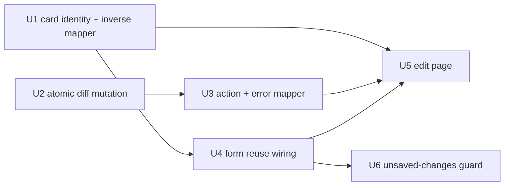

# feat: Swole routine editing (edit existing routine)

## Overview

`RoutineCard`'s overflow menu links `Edit → /routines/[id]`, but that route does
not exist — tapping `Edit` 404s. This plan ships the edit flow: a server page at
`apps/swole/src/app/routines/[id]/page.tsx` that loads an existing routine into
the **already-built** `RoutineForm` (verbatim, no fork), lets the user change
everything the builder can author, and persists the loaded-vs-submitted diff in
one all-or-nothing `BEGIN IMMEDIATE` transaction via a new
`updateRoutineWithExercises` mutation + server action.

Three behaviors are net-new versus create: removal is **soft** (archive, never
delete — past `set_logs`/`progressions` reference exercises via
`onDelete: restrict`); editing is **blocked** while a session is active (page
guard + in-transaction re-check); and the page **guards against losing unsaved
changes**.

The data + actions layer this builds on already exists and is tested
(`getRoutineWithExercises`, `updateExercise` with its `manual_edit` progression
rule, `archiveExercise`, `insertExerciseWithInitialProgression`, the
`ActionResult` envelope, the `DataLayerError` hierarchy). The genuinely new
machinery is the **diff** and the two **guards**.

---

## Problem Frame

A routine is immutable once created — a typo'd name, a wrong starting weight, an
extra set, or a swapped exercise can only be fixed by hand-editing `swole.db`.
The `Edit` affordance is a live dead-end. This is the next load-bearing gap,
exactly as `/routines/new` was before the builder shipped.

The chosen model (see origin: `docs/brainstorms/2026-05-29-swole-routine-edit-requirements.md`)
reuses the create form so editing looks and behaves identically to building, and
applies the difference between the loaded state and the submitted state in a
single transaction. This was chosen over (a) granular live edits on a detail
page (diverges from create's UX, leaves the reuse seam unused) and (b)
archive-all + recreate-all (mints fresh exercise rows each save, orphaning
`set_logs` and breaking progression continuity — fatal for a progression
tracker).

---

## Requirements Trace

- R1. Page at `apps/swole/src/app/routines/[id]/page.tsx` — server component loading `getRoutineWithExercises({ id })`, mapping rows to the form's card model, rendering `RoutineForm` with `submitLabel="Save changes"`. Invalid / non-existent id → not-available handling (see **Key Technical Decisions** — resolved to `redirect('/')`, deviating from the origin's literal `notFound()`).
- R2. `RoutineForm` reused as-is — `initialValues` / `submitAction` / `submitLabel` seam, drag-reorder, add/remove, per-card validation, save gate. No edit-specific fork. *(New optional props that default to create's behavior are permitted; a forked component is not.)*
- R3. Successful save → `router.push('/')`; explicit `Cancel` → `/`. Mirrors create.
- R4. Each non-archived `ExerciseRow` maps to an `ExerciseCardState`, inverting create-time normalization (numbers→strings; **cardio `durationSeconds`÷60 → minutes**; time-based `durationSeconds` → seconds) so a loaded card round-trips **losslessly for create-authored rows** (durations are always multiples of 60). A legacy non-multiple-of-60 cardio row re-saves to the nearest minute on any save (see U1).
- R5. Each loaded card carries its **DB exercise id**; an added card carries none. Identity drives the save diff. *(Structural — enables R12.)*
- R6. A weighted card's starting weight loads from canonical `exercises.startingWeight` (kept equal to the latest progression — verified invariant). Always the current baseline.
- R7. Archived exercises are excluded (load reads non-archived only). No show/restore affordance.
- R8. The exercise-type selector is **locked on existing cards** (those with a DB id); only added cards may choose a type.
- R9. Removing a card with a DB id archives that exercise (`archivedAt` set; `set_logs`/`progressions` intact). Removing a card with no DB id drops it. No hard delete; no extra confirm beyond the unsaved-changes guard.
- R10. Save gate unchanged: name non-empty **and** ≥1 valid exercise. Cannot save down to zero exercises.
- R11. Changing a weighted exercise's starting weight records a `manual_edit` progression, silently.
- R12. New `updateRoutineWithExercises` applies the full diff in one `BEGIN IMMEDIATE` transaction: update name/days; update changed existing cards (+ `manual_edit` progression on a weighted weight change); insert new cards (+ `initial` progression for weighted); archive existing exercises absent from the payload; set `order_in_routine` for every surviving + new exercise to its final list index. All-or-nothing.
- R13. The mutation re-enforces `routineFormSchema.safeParse` server-side and reuses `insertExerciseWithInitialProgression` + `updateExercise`'s manual-edit rule, so a bypassed client can't write invalid rows and weighted→progression rules aren't re-derived divergently.
- R14. New `updateRoutineWithExercises` server action wraps the mutation, returns the `ActionResult` envelope, and revalidates both `/` and `/routines/[id]`. The form maps a failure to a toast via a `mapCreateRoutineError` sibling.
- R15. Active session present → page renders a blocked state (banner directing the user to finish/abandon the in-progress session; no save possible).
- R16. The active-session check is re-enforced **inside** the mutation: if a session became active between load and save, the entire save refuses and the form surfaces a conflict toast.
- R17. The edit page warns before discarding unsaved edits (`Cancel`, browser back, tab close); a pristine form navigates freely. New vs create (which deliberately had no guard).

**Origin actors:** A single solo user ("Jeremy"); Traefik forward-auth is the only gate, no per-row authorization.
**Origin flows:** F1 (edit a routine and save — happy path), F2 (attempt to edit during an active session — blocked path), F3 (leave with unsaved changes — escape path).
**Origin acceptance examples:** AE1 (R12, R9 — full diff in one tx), AE2 (R11, R6 — weight change → one `manual_edit`; no change → none), AE3 (R8 — type lock on existing, free on added), AE4 (R9 — drop added vs archive existing, history intact), AE5 (R10 — zero-exercise save disabled), AE6 (R15 — blocked banner), AE7 (R12 — full rollback on failure), AE8 (R4 — cardio 1800s ↔ 30 min round-trip).

---

## Scope Boundaries

- No archived-**exercise** show/restore; no `unarchiveExercise`. Archived exercises disappear from the editor.
- No editing/restoring an archived **routine**. `/routines/[id]` for an archived routine is treated as not-available (resolved to `redirect('/')`).
- No type change on an existing exercise — replace via archive + add.
- No hard delete anywhere (FKs `onDelete: restrict`).
- No editing while a session is active — the page is blocked, not partially editable.
- `/routines/[id]` is an edit form only — no detail/stats/history view, no `Start session`/`Archive` controls (those stay on the home card).
- No editing past session data or set logs (immutable snapshots).
- No dedicated weight-progression management UI — the `manual_edit` write is silent.
- Carried from the builder, unchanged: no templates/duplicate/copy, no name autocomplete, lb-only weight, single integer `target_reps`, no notes/rest timers/supersets/RPE/tempo.

---

## Context & Research

### Relevant Code and Patterns

- **Create page model** — `apps/swole/src/app/routines/new/page.tsx` (14-line server component rendering `RoutineForm` with `initialValues`/`submitAction`). The edit page mirrors it but is `async` (awaits `params`, loads the routine) and exports `dynamic = 'force-dynamic'` (the app's SQLite-page convention, used by `apps/swole/src/app/page.tsx` and `apps/swole/src/app/session/[id]/page.tsx`; `new/page.tsx` omits it only because it loads no data).
- **The mutation model** — `createRoutineWithExercises` in `apps/swole/src/db/routines.ts`: `routineFormSchema.safeParse(args)` → `ValidationError`; `db.transaction(tx => {…}, { behavior: 'immediate' })`; insert routine; loop `insertExerciseWithInitialProgression(tx, toCreateExerciseArgs(draft, id, i))` with `i` as `order_in_routine`. The new mutation follows this skeleton.
- **Shared form** — `apps/swole/src/components/routines/RoutineForm.tsx`: props `initialValues {name, days, cards}`, `submitAction: (values) => Promise<ActionResult<RoutineRow>>`, `submitLabel?`. `handleSubmit` (172-198) builds `exercises = cards.map(normalizeCard→draft)`, awaits `submitAction(values)`, maps failure via `mapCreateRoutineError`, on success `router.push('/')`. `handleCancel` (200-202) is a bare `router.push('/')` — **no guard today**. Title at line 225 reads "Edit routine" for any non-`'Create routine'` label.
- **Card model + normalization** — `apps/swole/src/lib/routine-form.ts`: `ExerciseCardState` (all-string fields, **no `dbId`**), `createEmptyCard()`, `normalizeCard` (cardio mins×60 → seconds; time-based passthrough), `toCreateExerciseArgs(draft, routineId, orderInRoutine)` (already order-parameterized — reusable in the diff loop), `isRoutineFormValid`.
- **Data-layer building blocks** — `apps/swole/src/db/exercises.ts`: `updateExercise` (records `manual_edit` progression only when `existing.type === 'weighted' && args.startingWeight !== undefined && args.startingWeight !== existing.startingWeight`), `UpdateExerciseArgs` (**no `type` field** — type is immutable in place), `insertExerciseWithInitialProgression(executor, args)` (executor-parameterized; seeds `initial` progression for weighted only), `archiveExercise`, and `activeSessionCountForRoutine(executor, routineId): number` (synchronous; takes an `Executor` so it works with `db` or `tx`).
- **Active-session detection** — there is **no per-routine active-session row read today**. `getMostRecentActiveSession()` in `apps/swole/src/db/sessions.ts` is **argument-less** and returns the most-recent active session across *all* routines (the home page calls it bare) — it is **not** routine-scoped. `activeSessionCountForRoutine(executor, routineId): number` gives a per-routine count but not the row. Because the page block (R15) needs the active session *row* for the routine being edited (to link "Resume workout"), U5 adds a small `getActiveSessionForRoutine(routineId)` read. "Active" = `sessions.completedAt IS NULL`; a partial unique index `one_active_session_per_routine` DB-enforces ≤1 active session per routine, so the read returns at most one row.
- **Error + action plumbing** — `DataLayerError` base + `kind` discriminator (`validation | not_found | conflict | forbidden_transition | hydration`) in `apps/swole/src/db/errors.ts`; `ArchiveBlockedByActiveSession` (kind `forbidden_transition`) is the template for a new edit-blocked error. `ActionResult<T>` in `apps/swole/src/actions/sessions.ts:14-16`. `updateRoutine`'s action already revalidates both `/` and `/routines/${id}` (the R14 pair). `mapCreateRoutineError` + siblings (`mapArchiveRoutineError`, which switches on `'ArchiveBlockedByActiveSession'`) live in `apps/swole/src/lib/format.ts`.
- **Testing** — Jest 29 + ts-jest, `testEnvironment: node`, in-memory SQLite per test via `createTestDb()` (`apps/swole/src/db/test-db.ts`); `jest.mock('src/db/client', () => ({ get db() { return currentDb } }))`. Rollback tests `jest.spyOn(...).mockImplementation` to throw on the Nth call, then assert tables empty (`apps/swole/src/db/__tests__/routines.spec.ts`). Progression assertions modeled in `apps/swole/src/db/__tests__/exercises.spec.ts`. Cross-layer invariant at `apps/swole/src/db/__tests__/__integration__/prd-walkthrough.spec.ts`.

### Institutional Learnings

- **`docs/solutions/conventions/begin-immediate-for-read-then-write-mutations-2026-05-27.md`** (high relevance). The new diff is a textbook read-then-write *and* a paired write — both triggers for `{ behavior: 'immediate' }`. Load-bearing rules: (1) every DB access inside the callback goes through `tx`, never the outer `db` — a stray `db.*` commits unconditionally and bypasses rollback; (2) the active-session guard belongs **inside** the tx (mirrors `archiveRoutine`), not before it, so a `startSession` can't slip in between check and write; (3) ship with concurrency/atomicity tests; (4) domain conflicts surface as tagged `DataLayerError` subclasses, which the action envelopes by `kind`.
- **`docs/solutions/architecture-patterns/pure-fsm-core-for-stateful-domain-logic-2026-05-27.md`** (medium relevance). Don't touch the session FSM. Respect the active-session invariant (why mid-session editing is blocked) and the latest-progression == `exercises.startingWeight` invariant — the diff's weight edits must go through the same progression write path `updateExercise` uses, not a bare `UPDATE`.

### External References

- **Next.js 16.2 navigation guards** (researched against docs v16.2.6, May 2026). There is **no first-party app-wide navigation-blocking API**; the Pages-Router `router.events` abort pattern remains removed with no replacement. `<Link onNavigate>` (v15.3.0) can `preventDefault()` but only synchronously and only for `<Link>` clicks (not programmatic `router.push`, not back/forward). The robust guard composes: guarded Cancel handler (clean — we own it), `beforeunload` for tab-close/refresh (best-effort, browser-native dialog; use a `useRef` to dodge React 19 Strict-Mode stale closures), and `popstate` + `history.pushState` sentinel for browser back (best-effort). See R17 and U6.

---

## Key Technical Decisions

- **Card identity = optional `dbId` on `ExerciseCardState` (resolves R5 deferred-Q).** Co-locating identity with the card means it rides through `arrayMove` reorder automatically; a parallel id-map would have to track reordering separately. `createEmptyCard()` leaves `dbId` undefined, so create's empty-card path is untouched.
- **Mutation args = `RoutineFormValues` + a parallel `cardIds` list (resolves R12 deferred-Q).** `updateRoutineWithExercises({ routineId, values, cardIds })` where `cardIds: ReadonlyArray<number | null>` is index-aligned to `values.exercises` (`null` = added card). The form's `submitAction` type widens to `(values, cardIds?) => …`; create's `(values) => …` action stays assignable (TS allows fewer-param functions), so create needs no change. The edit page binds `routineId` into the action.
- **Reuse, don't re-derive: extract a `tx`-taking update core (resolves R12/R13 helper-Q).** `updateExercise` and `archiveExercise` each open their own `IMMEDIATE` tx, so they can't be called from inside the diff's tx (no nesting). Extract `applyExerciseUpdate(tx, args: UpdateExerciseArgs)` — the body of `updateExercise` minus the tx-open, carrying the `manual_edit` progression rule — and make `updateExercise` a thin wrapper around it. The diff calls `applyExerciseUpdate(tx, …)` for changed existing cards and the already-executor-parameterized `insertExerciseWithInitialProgression(tx, …)` for new cards. Archive is an inline `tx.update(exercises).set({ archivedAt })` (trivial, no rule to share). Routine name/days update is inline in the tx (can't call `updateRoutine` — nested tx).
- **New `EditBlockedByActiveSession` error + `mapUpdateRoutineError` mapper (resolves R14/R16 taxonomy-Q).** A new `DataLayerError` subclass with `kind = 'forbidden_transition'`, mirroring `ArchiveBlockedByActiveSession`. The action envelopes it to `code: 'EditBlockedByActiveSession'`. A new `mapUpdateRoutineError` sibling in `format.ts` maps codes to toasts. The form gains an optional `mapError?` prop defaulting to `mapCreateRoutineError`; edit passes `mapUpdateRoutineError`. Keeps the form unforked (R2).
- **Type lock via a `dbId`-derived prop (R8).** `ExerciseCard` gains a `typeLocked?: boolean` prop disabling the type `<Select>`; `RoutineForm` passes `typeLocked={card.dbId != null}`. Identical logic in create (no card has a `dbId` → never locked) and edit (loaded cards locked, added cards free) — no fork.
- **Block = standalone blocked state, not a disabled form (R15).** When the new `getActiveSessionForRoutine(routineId)` read returns a session, the page renders the blocked state **inline** (banner + "Resume workout" link to `/session/${id}` + "Back to home") and does **not** render the editable form. Honors the origin's "block the page" decision and avoids threading a disabled-state through the shared form; "Save changes disabled" is satisfied trivially (no save button exists in that state). The blocked branch is a few lines of JSX with exactly one caller, so it stays inline in the page — extract a `RoutineEditBlocked` component only if a second caller ever appears.
- **Not-available routine → `redirect('/')` (resolves R1 deferred-Q; deviates from origin's literal `notFound()`).** `notFound()` has **zero precedent** in swole and would require a new `not-found.tsx` (or Next's generic 404); the sibling `apps/swole/src/app/session/[id]/page.tsx` returns a friendly component instead. Home lists only non-archived routines and is the natural hub, so invalid-id, not-found, and archived-routine all `redirect('/')`. *(Low-risk, one-line branch — flip to `notFound()` during review if a hard 404 is preferred.)*
- **Inverse mapper in `routine-form.ts`; legacy cardio uses `Math.round` (resolves R4 deferred-Q).** `toExerciseCardState(row)` lives beside `normalizeCard`/`toCreateExerciseArgs` as their inverse. Cardio `duration = String(Math.round(row.durationSeconds / 60))` (mirrors `formatCardioDuration`'s rounding) so the minutes field always shows a clean integer that passes the gate. A legacy `durationSeconds` not divisible by 60 (impossible via create, which only stores multiples) re-saves to the nearest minute — an accepted edge.
- **Unsaved-changes guard gated behind a prop (R17).** A new `guardUnsavedChanges?: boolean` prop (default `false`) preserves create's deliberate no-guard behavior; edit passes `true`. "Dirty" = current `{ name.trim(), canonicalized days, ordered cards (fields + dbId) }` differs from a snapshot taken on mount, **including reorder**.

---

## Open Questions

### Resolved During Planning

- *How does the card model carry identity?* → optional `dbId` on `ExerciseCardState` (see Key Decisions).
- *Mutation args shape + shared helper?* → `RoutineFormValues` + parallel `cardIds`; extract `applyExerciseUpdate(tx, …)`.
- *Edit-during-session error taxonomy?* → new `EditBlockedByActiveSession` (kind `forbidden_transition`) + `mapUpdateRoutineError`.
- *How does the page detect the active session, and does the banner link to resume?* → a new per-routine read `getActiveSessionForRoutine(routineId)` (the existing `getMostRecentActiveSession()` is global/argument-less and would block on an unrelated routine's session); banner links to `/session/${id}` (Resume workout).
- *Unsaved-changes mechanism + "dirty" definition?* → guarded Cancel + `beforeunload` + `popstate` sentinel; dirty = any field/order differs from mount snapshot.
- *Inverse mapper location + legacy cardio handling?* → extend `routine-form.ts`; `Math.round` for non-multiple-of-60.
- *Invalid/archived routine response?* → `redirect('/')` (deviates from origin's `notFound()`).

### Deferred to Implementation

- Exact change-detection granularity in the diff: passing all editable fields to `applyExerciseUpdate` for every existing card (simplest; an otherwise-unchanged card gets a harmless `updatedAt` bump, consistent with the codebase's unconditional-bump convention; the `manual_edit` rule still fires only on a real weight change) vs computing a per-field diff to skip no-op updates. Resolve when touching the real rows; the visual-sketch "no field write if unchanged" is directional, the AE-bearing guarantee is "no spurious progression."
- Whether the `popstate` back-button sentinel is worth its edge-case complexity for a solo-user app, or whether `beforeunload` + guarded `Cancel` is enough for v1. **Default: omit the `popstate` sentinel in v1 — ship guarded `Cancel` + `beforeunload` only, and revisit only if manual testing shows the back button bypassing the `beforeunload` dialog.** Decide while wiring U6 against real browser behavior.
- Exact `EditBlockedByActiveSession` constructor shape (`(routineId)` vs `(entity, id)`) — settle against the `ArchiveBlockedByActiveSession`/`ReorderBlockedByActiveSession` signatures when editing `errors.ts`.

---

## High-Level Technical Design

> *This illustrates the intended approach and is directional guidance for review, not implementation specification. The implementing agent should treat it as context, not code to reproduce.*

**The diff (`updateRoutineWithExercises`).** Reproduces the origin's save-diff matrix:

| Submitted card | Matching DB exercise | Operation on save |
|---|---|---|
| has `dbId`, fields changed | exists, non-archived | `applyExerciseUpdate(tx, …)` (+ `manual_edit` progression if weighted weight changed) |
| has `dbId`, fields unchanged | exists | (per deferred-Q) still assigned final `order_in_routine` |
| no `dbId` (added) | — | `insertExerciseWithInitialProgression(tx, …)` (+ `initial` progression if weighted) |
| — | exists, non-archived, **absent** from `cardIds` | `archivedAt = now` (soft delete; history preserved) |
| every surviving + new | — | `order_in_routine` ← final list index, contiguous from 0 |

```
updateRoutineWithExercises({ routineId, values, cardIds }):
  safeParse(values) with routineFormSchema  -> else throw ValidationError      # R13
  db.transaction(behavior: 'immediate'):                                       # the learning
    if activeSessionCountForRoutine(tx, routineId) > 0: throw EditBlockedByActiveSession   # R16, inside tx
    existing = tx.select non-archived exercises where routineId, by order
    submittedIds = set(cardIds where not null)
    validate every non-null cardId ∈ existing.ids  -> else throw conflict (stale edit)
    update routines.name/days/updatedAt (inline)                               # can't call updateRoutine (nested tx)
    for i, (draft, cardId) in enumerate(zip(values.exercises, cardIds)):
      if cardId is null: insertExerciseWithInitialProgression(tx, toCreateExerciseArgs(draft, routineId, i))
      else:              applyExerciseUpdate(tx, { id: cardId, ...editableFields(draft), orderInRoutine: i })
    for ex in existing where ex.id ∉ submittedIds: tx.update set archivedAt = now
    return routine row
  # all-or-nothing: any throw rolls back the whole save (R12 / AE7)
```

**Unit dependency graph** (U1 and U2 are independent and can land in either order):



---

## Implementation Units

- U1. **Card identity seam + inverse row→card mapper**

**Goal:** Give `ExerciseCardState` a DB-id field and add the inverse of `normalizeCard`/`toCreateExerciseArgs`, so an `ExerciseRow` loads into a form card that round-trips losslessly for create-authored rows (legacy cardio durations not divisible by 60 re-save to the nearest minute — an accepted edge).

**Requirements:** R4, R5, R6, R7

**Dependencies:** None

**Files:**
- Modify: `apps/swole/src/lib/routine-form.ts`
- Test: `apps/swole/src/lib/__tests__/routine-form.spec.ts`

**Approach:**
- Add optional `dbId?: number` to `ExerciseCardState`. Leave `createEmptyCard()` untouched (undefined `dbId`). Have `applyTypeSwitch` preserve `dbId` defensively (it's only ever called on unlocked/added cards, but carrying it through is harmless).
- Add `toExerciseCardState(row: ExerciseRow): ExerciseCardState`: fresh `crypto.randomUUID()` for the React key, `dbId = row.id`, stringify numbers; weighted → `startingWeight`/`increment` from row; time-based → `duration = String(row.durationSeconds)`; cardio → `duration = String(Math.round(row.durationSeconds / 60))`; clear inapplicable fields to `''` (match `applyTypeSwitch` shape).

**Patterns to follow:** `normalizeCard` / `toCreateExerciseArgs` (the forward direction); `createEmptyCard` field shape.

**Test scenarios:**
- Happy path: weighted row → card with `dbId` set, `startingWeight`/`increment`/`sets`/`targetReps` stringified; the card normalizes back to a draft equal to the row's stored values.
- Happy path: bodyweight and time-based rows round-trip (`duration` for time-based = seconds string).
- Covers AE8. Cardio `durationSeconds = 1800` → card `duration = "30"`; `normalizeCard` of that card → `durationSeconds = 1800`.
- Edge case: legacy cardio `durationSeconds = 1810` → `Math.round(1810/60) = "30"` (clean integer, passes the gate); re-normalizing yields `1800` (documented near-impossible drift).
- Edge case: `createEmptyCard()` has `dbId === undefined`; `toExerciseCardState` always sets a numeric `dbId`.

**Verification:** A loaded card list maps cleanly and round-trips; existing `routine-form.spec.ts` cases still pass with the optional field added.

---

- U2. **Atomic `updateRoutineWithExercises` mutation + extracted update core + blocked-session error**

**Goal:** The genuinely new machinery — apply the loaded-vs-submitted diff in one `BEGIN IMMEDIATE` transaction, reusing existing weighted→progression rules, with the active-session guard re-enforced inside the tx.

**Requirements:** R8 (server-side type immutability), R9, R11, R12, R13, R16

**Dependencies:** None (pure data layer; testable in isolation)

**Execution note:** Test-first for the diff — the eight acceptance examples and atomicity are the contract. Characterization-first for the `applyExerciseUpdate` extraction: the existing `exercises.spec.ts` cases for `updateExercise`/`archiveExercise` must pass **unchanged** after the refactor.

**Files:**
- Modify: `apps/swole/src/db/routines.ts` (add `updateRoutineWithExercises`)
- Modify: `apps/swole/src/db/exercises.ts` (extract `applyExerciseUpdate(tx, args)`; make `updateExercise` a thin wrapper)
- Modify: `apps/swole/src/db/errors.ts` (add `EditBlockedByActiveSession`)
- Test: `apps/swole/src/db/__tests__/routines.spec.ts`
- Test: `apps/swole/src/db/__tests__/exercises.spec.ts`

**Approach:**
- Extract `applyExerciseUpdate(tx, args: UpdateExerciseArgs)` = current `updateExercise` body minus the tx-open (re-read existing, build patch, write with `updatedAt`, and the `manual_edit` progression branch). `updateExercise` becomes `db.transaction(tx => applyExerciseUpdate(tx, args), { behavior: 'immediate' })`.
- `updateRoutineWithExercises({ routineId, values, cardIds })`: `routineFormSchema.safeParse(values)` → `ValidationError`; assert `cardIds.length === values.exercises.length` → `ValidationError` (defends the index-alignment invariant server-side, since `safeParse` validates `values` but not `cardIds` — without it a bypassed client with mismatched lengths zips a draft against `undefined`; R13); open `IMMEDIATE` tx; **first** throw `EditBlockedByActiveSession` if `activeSessionCountForRoutine(tx, routineId) > 0`; re-read non-archived exercises; validate every non-null `cardId` is among them (else conflict/rollback — stale edit); inline-update routine name/days/`updatedAt`; loop the index-aligned `(draft, cardId)` pairs calling `insertExerciseWithInitialProgression(tx, toCreateExerciseArgs(draft, routineId, i))` for `null` ids and `applyExerciseUpdate(tx, { id, …editable, orderInRoutine: i })` otherwise; archive every re-read exercise whose id is absent from the submitted set. Return the routine row.
- Every DB access through `tx` — audit for stray `db.*` before merge (per the BEGIN IMMEDIATE learning).
- Add `EditBlockedByActiveSession extends DataLayerError` with `kind = 'forbidden_transition'`, modeled on `ArchiveBlockedByActiveSession`.

**Patterns to follow:** `createRoutineWithExercises` (tx skeleton, `safeParse`, insert loop); `updateExercise` (the `manual_edit` rule, now in `applyExerciseUpdate`); `archiveRoutine` (in-tx active-session count → throw); `reorderExercises` (permutation/id validation); `ArchiveBlockedByActiveSession` (error shape).

**Test scenarios:**
- Covers AE1. Load [weighted Bench, bodyweight Pushups, cardio Treadmill]; submit rename + Bench `sets 3→4` + remove Pushups + add time-based Plank + reorder Treadmill first → one tx: `routines.name` updated; Bench `sets=4`, **no** new progression; Pushups `archivedAt` set; Plank inserted; `order_in_routine` = 0,1,2 over [Treadmill, Bench, Plank].
- Covers AE2 / R11. Bench weight `100→110` → `exercises.startingWeight = 110` + exactly one new `manual_edit` progression with `startingWeight = 110`; latest-progression == exercise invariant holds. Same-weight save → no new progression row.
- Covers AE4 / R9. Removing an added (no-`dbId`) card writes nothing; removing an existing card sets `archivedAt`, and an `includeArchived` query still finds it + its set-log history.
- Covers AE7 / R12. Force a mid-tx failure (`jest.spyOn(insertExerciseWithInitialProgression).mockImplementation` throw on the new-card insert) → assert routine name, exercise fields, archive flags, inserts, and order are **all** unchanged from before the attempt.
- Error path / R16. Seed an active session, then call the mutation → throws `EditBlockedByActiveSession`; assert nothing written.
- Error path / R13. Call with a payload that bypasses client validation (e.g. empty `name`, or zero exercises) → `ValidationError`, nothing written.
- Error path. Submit a `cardId` not in the routine's current non-archived set (simulated concurrent archive) → conflict, full rollback.
- Error path / R13. Mismatched-length `cardIds` (length ≠ `values.exercises.length`) → `ValidationError`, nothing written.
- Integration. After a mixed edit, re-`getRoutineWithExercises` returns exactly the surviving + new exercises in submitted order; `prd-walkthrough`-style invariant (latest progression `startingWeight` == `exercises.startingWeight`) holds for every weighted survivor.
- Characterization. Existing `updateExercise` and `archiveExercise` specs pass unchanged after the `applyExerciseUpdate` extraction.

**Verification:** New diff suites pass; existing `exercises.spec.ts`/`routines.spec.ts` pass unchanged; a forced failure leaves `swole.db` byte-for-byte as before the attempt.

---

- U3. **`updateRoutineWithExercises` server action + `mapUpdateRoutineError`**

**Goal:** Wrap the mutation in the `ActionResult` envelope with the right revalidation, and map failure codes to toasts.

**Requirements:** R14, R16 (surfacing)

**Dependencies:** U2

**Files:**
- Modify: `apps/swole/src/actions/routines.ts` (add `updateRoutineWithExercises` action)
- Modify: `apps/swole/src/lib/format.ts` (add `mapUpdateRoutineError`)
- Test: `apps/swole/src/lib/__tests__/format.spec.ts` *(create if absent; mirror existing mapper coverage)*

**Approach:**
- Envelope-style action (mirror `createRoutineWithExercises`/`archiveRoutine`): `try { row = await updateRoutineWithExercises(...); revalidatePath('/'); revalidatePath(`/routines/${routineId}`); return { ok: true, row } } catch (err) { if (err instanceof DataLayerError) return { ok: false, kind: err.kind, code: err.constructor.name }; throw err }`. Signature carries `routineId` so the edit page can bind it.
- `mapUpdateRoutineError(result: ActionError): ErrorToast` — `'ValidationError'` → "Check the highlighted fields and try again." (error); `'EditBlockedByActiveSession'` → "This routine has a workout in progress — finish or abandon it first." (warning); `'NotFoundError'` → "This routine no longer exists." (warning); default → "Could not save changes. Try again." (error).

**Patterns to follow:** `createRoutineWithExercises` action (envelope + revalidate pair); `updateRoutine` action (revalidates both `/` and `/routines/${id}`); `mapArchiveRoutineError` (code switch).

**Test scenarios:**
- Happy path: `mapUpdateRoutineError` returns the validation message/severity for `'ValidationError'`.
- Happy path: `'EditBlockedByActiveSession'` → the warning message/severity.
- Edge case: `'NotFoundError'` → the not-found warning.
- Edge case: an unknown code → the generic error fallback.
- *(Action wiring — revalidate paths + envelope shape — verified via type-check and U2's mutation tests; thin server actions are not separately unit-tested in this app.)*

**Verification:** Mapper unit tests pass; `pnpm --filter @lilnas/swole type-check` confirms the action's envelope and `submitAction` compatibility.

---

- U4. **Reuse `RoutineForm` for edit — `cardIds`, `mapError` prop, type lock**

**Goal:** Make the shared form carry identity through to the action and lock the type selector on existing cards — without forking the component.

**Requirements:** R2, R8 (client), R3

**Dependencies:** U1

**Files:**
- Modify: `apps/swole/src/components/routines/RoutineForm.tsx`
- Modify: `apps/swole/src/components/routines/ExerciseCard.tsx`
- Test: `apps/swole/src/lib/__tests__/routine-form.spec.ts` *(for any extracted pure helper, e.g. `cardIds` derivation)*

**Approach:**
- Widen `submitAction` to `(values: RoutineFormValues, cardIds?: ReadonlyArray<number | null>) => Promise<ActionResult<RoutineRow>>`. In `handleSubmit`, build `cardIds = cards.map(c => c.dbId ?? null)` (same `cards` order as `exercises`, so index-aligned) and pass it to `submitAction`. Create's action stays assignable, no change needed.
- Add `mapError?: (result: ActionError) => ErrorToast` prop defaulting to `mapCreateRoutineError`; swap the call at `RoutineForm.tsx:192` from `mapCreateRoutineError(result)` to `mapError(result)`, keeping the existing `mapCreateRoutineError` import as the default value. (`ActionError` is currently a non-exported alias in `format.ts` — export it so the prop type and `mapUpdateRoutineError`'s signature can reference it.)
- Add `typeLocked?: boolean` to `ExerciseCard`; disable the type `<Select>` when set, and surface *why* with a tooltip or helper text on the disabled control — e.g. "Exercise type can't be changed — remove this exercise and add a new one." (Without it, the disabled selector reads as broken; the copy mirrors the scope boundary "replace via archive + add.") In `RoutineForm`, pass `typeLocked={card.dbId != null}`.
- *Optional cleanup (not required for correctness):* the form's header title currently keys off the magic string `submitLabel === 'Create routine'` (line 225), so `submitLabel="Save changes"` yields "Edit routine" by accident rather than design. Consider an explicit `mode?: 'create' | 'edit'` prop (default `'create'`) and switching the title on `mode` — strictly additive, removes the fragile coupling.

**Patterns to follow:** existing `RoutineForm` submit/transition flow; `ExerciseCard` prop-threading; the `submitLabel` default-prop pattern (additive, non-forking).

**Test scenarios:**
- Happy path: `cardIds` derivation maps `[{dbId:7},{},{dbId:9}]` → `[7, null, 9]`, aligned to the exercises array.
- Edge case: a create-flow form (all cards lack `dbId`) yields `cardIds` of all `null`; create behavior is unchanged.
- Covers AE3. An existing card (`dbId` set) renders the type `<Select>` disabled; an added card (`createEmptyCard`) renders it enabled. *(Component-level — via React Testing Library if the suite supports it; otherwise verify the `typeLocked={card.dbId != null}` wiring by inspection + manual check.)*
- Edge case: `mapError` defaults to `mapCreateRoutineError` when the prop is omitted (create path).

**Verification:** Create flow behaves identically (manual smoke + existing tests); edit form passes `cardIds`, disables type on loaded cards, and routes failures through `mapUpdateRoutineError`.

---

- U5. **Edit page `routines/[id]` — load, map, block, route**

**Goal:** The server page: parse the id, load the routine + exercises, branch on active session, render the populated form (or the blocked state), and bind the edit action.

**Requirements:** R1, R3, R7, R15

**Dependencies:** U1, U3, U4

**Files:**
- Create: `apps/swole/src/app/routines/[id]/page.tsx`
- Modify: `apps/swole/src/db/sessions.ts` (add `getActiveSessionForRoutine(routineId): Promise<SessionRow | null>`)
- Test: `apps/swole/src/db/__tests__/sessions.spec.ts` (the new read); the page itself — see test expectation below

**Approach:**
- `export const dynamic = 'force-dynamic'`. `async function Page({ params }: { params: Promise<{ id: string }> })`; `const { id } = await params; const routineId = Number(id)`; guard `if (!Number.isInteger(routineId) || routineId <= 0) redirect('/')`.
- `const data = await getRoutineWithExercises({ id: routineId })`; if `null` or `data.routine.archivedAt != null` → `redirect('/')`.
- `const active = await getActiveSessionForRoutine(routineId)` (new per-routine read — **not** the global argument-less `getMostRecentActiveSession()`); if present → render the blocked state **inline**: heading "Workout in progress", body "Finish or abandon the active workout before editing this routine.", a primary "Resume workout" link → `/session/${active.id}`, and a secondary "Back to home" link → `/`. **Do not** render the form.
- Otherwise build `initialValues = { name, days, cards: data.exercises.map(toExerciseCardState) }` (exercises are already non-archived, satisfying R7) and render `<RoutineForm initialValues={…} submitLabel="Save changes" submitAction={boundAction} mapError={mapUpdateRoutineError} guardUnsavedChanges />`, where `boundAction = updateRoutineWithExercisesAction.bind(null, routineId)`. Next's server-action argument binding produces a server-action reference that crosses the server→client boundary cleanly — an inline arrow closure over a server action does not. The action's signature is therefore `(routineId, values, cardIds)`.

**Patterns to follow:** `apps/swole/src/app/routines/new/page.tsx` (form shell, `py-6` wrapper); `apps/swole/src/app/session/[id]/page.tsx` (`await params`, `Number(id)` + integer guard, friendly not-available branch, `dynamic` export).

**Test scenarios:**
- Covers AE6 / R15. With a seeded active session, the page renders the blocked state and no form. *(See test expectation.)*
- Happy path: a valid non-archived routine renders the form pre-filled with mapped cards and the "Save changes" label.
- Edge case: non-numeric id, non-existent id, and archived routine each `redirect('/')`.
- The new `getActiveSessionForRoutine(routineId)` read returns that routine's active (incomplete) session row, and `null` when it has none — **even if another routine has an active session** (the failure mode the global `getMostRecentActiveSession()` would cause). Test in `sessions.spec.ts` alongside the existing active-session reads.
- Test expectation: the loader + branch logic is the testable surface. If practical, extract a pure `buildEditInitialValues(routine, exercises)` (or test `toExerciseCardState` mapping in U1) and assert the active-session/archived/invalid branches via a thin integration test; full server-component rendering is otherwise verified by manual smoke (the app has no server-component render-test precedent).

**Verification:** From home, `Edit` opens a populated `/routines/[id]`; an active session shows the blocked banner; bad/archived ids land on home.

---

- U6. **Unsaved-changes guard**

**Goal:** Warn before discarding unsaved edits on `Cancel`, browser back, or tab close; stay silent on a pristine form and on a successful save.

**Requirements:** R17

**Dependencies:** U4

**Files:**
- Create: `apps/swole/src/hooks/use-unsaved-changes-guard.ts`
- Modify: `apps/swole/src/components/routines/RoutineForm.tsx`
- Test: `apps/swole/src/hooks/__tests__/use-unsaved-changes-guard.spec.ts` *(or co-locate the pure dirty-diff test in `routine-form.spec.ts`)*

**Approach:**
- Add `guardUnsavedChanges?: boolean` prop (default `false`) to `RoutineForm`. When `false`, behavior is exactly as today (create keeps no guard).
- Compute `isDirty` by comparing the current `{ name.trim(), canonicalizeDays(selectedDays), cards }` against a snapshot captured on mount (e.g. `useRef(initialValues)`); dirtiness includes reorder and any per-card field/`dbId` change. Factor the comparison into a pure `isFormDirty(snapshot, current)` for unit testing.
- `useUnsavedChangesGuard({ isDirty, enabled })`: registers `beforeunload` (with `e.preventDefault()`) only while `enabled && isDirty`, using a `useRef`-held handler to avoid React 19 Strict-Mode stale closures; optionally wires the `popstate` + `history.pushState` sentinel for browser back (best-effort — see deferred-Q on whether to ship it for v1).
- Guard `handleCancel`: when dirty, open a MUI confirm `<Dialog>` — title "Discard changes?", body "Your changes will be lost.", confirm button "Discard" (destructive styling), dismiss button "Keep editing"; on confirm clear dirty + `router.push('/')`; on dismiss stay. When pristine, navigate immediately.
- On successful save, clear the dirty state **before** `router.push('/')` so the guard never fires on the success navigation.

**Patterns to follow:** existing `src/hooks/use-toast.ts` (hook shape); MUI `Dialog` usage elsewhere in the app; the Next.js 16 guidance in **External References** (Cancel clean, `beforeunload`/`popstate` best-effort).

**Test scenarios:**
- Happy path: `isFormDirty` returns `false` for an unmodified snapshot and `true` when name, a day, a card field, or card order changes.
- Edge case: reordering cards (same set, different order) is detected as dirty.
- Happy path: a guarded `Cancel` on a dirty form opens the confirm; on a pristine form navigates immediately.
- Integration: a successful save clears dirty before navigation, so no `beforeunload`/confirm fires on the redirect to `/`.
- Test expectation: the pure `isFormDirty` and the clear-before-nav logic are unit-tested; `beforeunload`/`popstate` DOM wiring is best-effort and verified by manual check (no repo precedent for testing browser-unload behavior).

**Verification:** Dirty navigation prompts (Cancel, tab close); a pristine form and a successful save are silent; create flow is unaffected (guard off by default).

---

## System-Wide Impact

- **Interaction graph:** `RoutineForm` becomes shared by create *and* edit — additive optional props only, no fork (R2). Extracting `applyExerciseUpdate` reshapes `updateExercise`/`archiveExercise` into thin wrappers; their existing tests pin behavior. The diff writes `progressions`, the same surface the session FSM persists into — it must respect the latest-progression invariant by reusing `updateExercise`'s rule (R6/R11), never a bare `UPDATE`.
- **Error propagation:** new `EditBlockedByActiveSession` (`forbidden_transition`) travels mutation → action envelope (`code`) → `mapUpdateRoutineError` → toast. The in-tx guard (R16) is the real correctness gate; the page block (R15) is UX.
- **State lifecycle risks:** soft-delete archive preserves `set_logs`/`progressions` (FKs `onDelete: restrict`); the whole diff is one `IMMEDIATE` tx (all-or-nothing). Re-reading inside the tx + the stale-`cardId` conflict check defend against a concurrent archive/`startSession` between load and save. **Double-submit / pending:** the existing form already disables the submit button and inputs during the transaction (`disabled={!canSubmit || isPending}` via `useTransition`), so no new pending handling is needed and a synchronous double-tap can't fire a second save — reused as-is. **Concurrent field edits** (another tab changes a weight between load and save) are *not* detected — the diff is last-write-wins, acceptable for a solo single-user app and distinct from the concurrent-archive case the stale-`cardId` check covers.
- **API surface parity:** widening `submitAction` to a two-arg type is source-compatible with create's one-arg action (TS fewer-param assignability) — confirm with `type-check`. The granular per-operation action wrappers (`archiveExercise`, `reorderExercises`, etc.) go unused by the edit page; that's acceptable.
- **Integration coverage:** the diff's correctness (insert + update + archive + reorder in one tx, with progression rules) is unit-mocks-can't-prove territory — covered by the in-DB diff suite (U2) and the round-trip/invariant assertions.
- **Unchanged invariants:** past `sessions`/`set_logs`/`progressions` remain immutable; `exercises.type` stays immutable in place (no `type` in `UpdateExerciseArgs`); the latest-progression == `exercises.startingWeight` invariant holds; create's no-guard, no-lock behavior is preserved (both gated behind `dbId` presence / a default-off prop). **`order_in_routine` collisions are benign:** the diff renumbers survivors+new contiguously 0..n while archived rows keep their old order values (which may overlap the new range) — safe because `(routine_id, order_in_routine)` has **no** unique constraint and every read filters `archivedAt IS NULL` then orders by it. Do not add such a uniqueness constraint without first renumbering archived rows.

---

## Risks & Dependencies

| Risk | Mitigation |
|------|------------|
| A stray outer-`db.*` call inside the new tx commits unconditionally and breaks rollback | Route every access through `tx`; audit before merge; the AE7 rollback test catches a leak |
| Extracting `applyExerciseUpdate` regresses `updateExercise`/`archiveExercise` | Characterization: existing `exercises.spec.ts` must pass unchanged (Execution note on U2) |
| App Router back-button interception is best-effort (no first-party API in Next 16.2) | Cancel + `beforeunload` cover the common paths; correctness is the server-side R16 guard; ship `popstate` only if its edges are worth it (deferred-Q) |
| Widening `submitAction` subtly breaks create's typing | Rely on TS fewer-param assignability; `type-check` in CI; keep create's action one-arg |
| Concurrent archive/`startSession` between page load and save | Re-read inside the tx + active-session guard inside the tx + stale-`cardId` conflict → full rollback |
| Legacy cardio `durationSeconds` not divisible by 60 re-saves to nearest minute | `Math.round` on load; documented near-impossible edge (create only stores multiples of 60) |
| **Dependency:** the routine builder + data/actions layer are merged and tested | Verified present; this work builds on them (no changes to the FSM) |

---

## Documentation / Operational Notes

- No migrations, env vars, or deploy changes — pure app code within `apps/swole`.
- After this lands, the Next.js App Router unsaved-changes/`beforeunload` guard and the server-component load + `redirect` flow are good `/ce-compound` candidates (undocumented in `docs/solutions/` today, and the next swole feature will hit the same questions).
- Success gate: `pnpm --filter @lilnas/swole lint`, `type-check`, and `test` all pass; the new mutation + diff have tests; existing data-layer suites pass unchanged.

---

## Sources & References

- **Origin document:** [docs/brainstorms/2026-05-29-swole-routine-edit-requirements.md](docs/brainstorms/2026-05-29-swole-routine-edit-requirements.md)
- Mutation model: `apps/swole/src/db/routines.ts` (`createRoutineWithExercises`), `apps/swole/src/db/exercises.ts` (`updateExercise`, `insertExerciseWithInitialProgression`, `activeSessionCountForRoutine`)
- Form seam: `apps/swole/src/components/routines/RoutineForm.tsx`, `apps/swole/src/components/routines/ExerciseCard.tsx`, `apps/swole/src/lib/routine-form.ts`
- Plumbing: `apps/swole/src/actions/routines.ts`, `apps/swole/src/actions/sessions.ts` (`ActionResult`), `apps/swole/src/lib/format.ts`, `apps/swole/src/db/errors.ts`, `apps/swole/src/db/sessions.ts` (`getActiveSessionForRoutine` — new per-routine read; `getMostRecentActiveSession()` is the global, argument-less precedent)
- Page precedent: `apps/swole/src/app/routines/new/page.tsx`, `apps/swole/src/app/session/[id]/page.tsx`
- Learnings: `docs/solutions/conventions/begin-immediate-for-read-then-write-mutations-2026-05-27.md`, `docs/solutions/architecture-patterns/pure-fsm-core-for-stateful-domain-logic-2026-05-27.md`
- External: Next.js 16.2 `<Link onNavigate>` / `useRouter` docs (navigation-guard limitations) — https://nextjs.org/docs/app/api-reference/components/link
