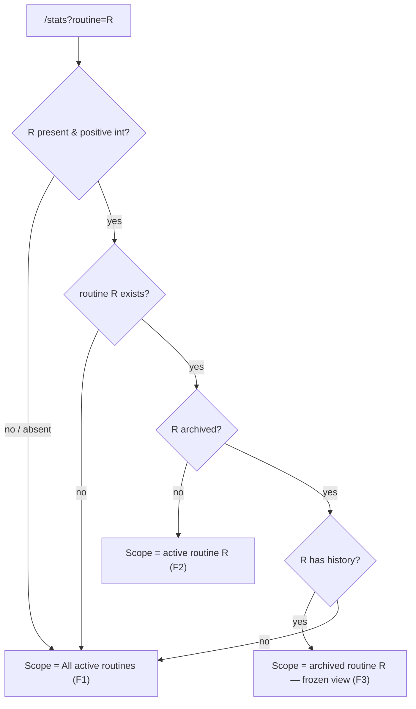
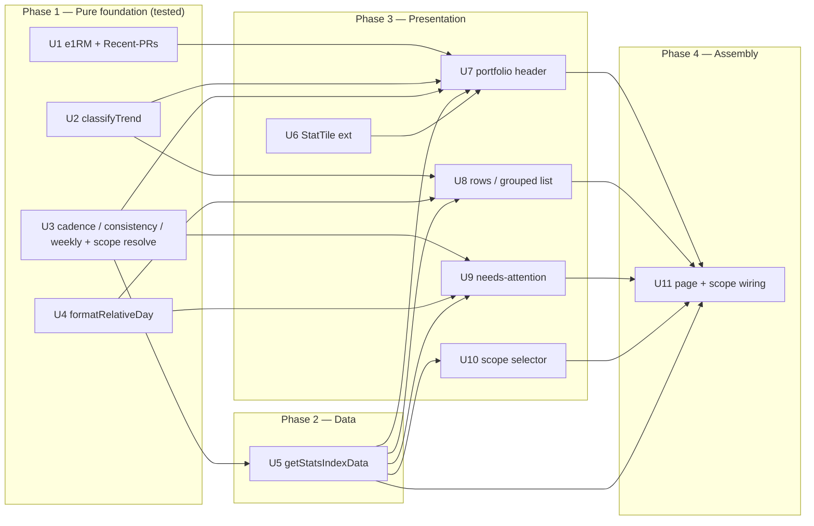

# feat: Swole Stats Overview (portfolio header, data-rich rows, needs-attention, routine scope)

## Overview

Turn the Swole Stats index (`apps/swole/src/app/stats/page.tsx`) from a navigation-only flat list into a **retrospective overview**: a four-tile portfolio header, a "Needs attention" section, data-rich routine-grouped rows (last-performed + weighted weight/trend), and a routine **scope selector** (All / per-active-routine / Archived) reflected in the URL as `?routine=<id>`.

All correctness lives in **pure, tested helpers** (`lib/stats.ts`, `lib/format.ts`) fed by one **batched, no-N+1 server-only read** (`getStatsIndexData`) that mirrors `listRoutinesForHome`. The page stays a `force-dynamic` server component under ADR-001 (no inline Drizzle, no client fetch). It is read-only — **no schema change, no migration, no new dependency**. The session runner is unbuilt on this branch, so the cold-start path is the primary visible state today; the design degrades gracefully and needs **zero stats-code change when the runner lands**.

---

## Problem Frame

Answering "where am I on Bench, and is anything slipping?" today costs ~30 tap-in / tap-back navigations because the index shows only name + type badge. This slice makes the page answer "how's my training going?" at a glance, **without duplicating** the two surfaces that already exist: **Home** owns the operational surface (resume, "today", launch CTAs); the **per-exercise detail page** owns the full charts/journals. Stats stays retrospective and summarizing. This deliberately revisits the prior slice's "no aggregate dashboard" non-goal (an intentional evolution) while keeping the PRD's no-daily-streak stance. (see origin: `docs/brainstorms/2026-05-29-swole-stats-overview-requirements.md`)

---

## Requirements Trace

Origin requirements R1–R24 map to implementation units as follows:

- R1 (batched no-N+1 read, scope-aware, `inArray([])` guards) → **U5**
- R2 (pure tested helpers + relative-time formatter; `sessionVolume` NOT built) → **U1, U2, U3, U4**
- R3 (e1RM Epley, excludes `Failed`/`Decrement`) → **U1**
- R4 (`classifyTrend` ↑/▬/↓ from `starting_weight` over trailing 4 weeks) → **U2**
- R5 (stays `/stats`, server component, `force-dynamic`, no new theme tokens) → **U11**
- R6 (top-to-bottom: selector → header → needs-attention → grouped list; no detail/home duplication) → **U11**
- R7 (scope selector: All + active + Archived-with-history; URL `?routine=`; route segment stays exercise-only) → **U10, U11**
- R8 (model C: All aggregates + needs-attention are active-only; archived shows frozen history) → **U5, U7, U9, U11**
- R9 (grouped list = active only by default; archived reachable via selector) → **U5, U8, U11**
- R10 (four scope-aware tiles reusing `StatTile`) → **U6, U7**
- R11 (Sessions this week, last 7d + delta vs prior 7d) → **U3, U7**
- R12 (Recent PRs: weighted exercises with new best e1RM in 30d) → **U1, U7**
- R13 (Lifts progressing: weighted exercises with ↑ trend) → **U2, U7**
- R14 (Overall consistency: completed ÷ expected over 4 weeks, capped 100%) → **U3, U7**
- R15 (cold-start: header always renders, tiles degrade to `—`/`0` + one caption) → **U7, U11**
- R16 (every row gains last-performed "Xd ago" / `—`; all types) → **U4, U8**
- R17 (weighted rows also show current weight + trend arrow; non-weighted do not) → **U2, U8**
- R18 (explicit arrow/delta, never an auto-scaled per-row sparkline) → **U8**
- R19 (needs-attention: top 2–3 overdue by cadence) → **U3, U9**
- R20 (needs-attention considers all exercise types) → **U9**
- R21 (never-performed surfaced as separate "Not started yet") → **U9**
- R22 (section self-hides entirely when nothing qualifies) → **U9, U11**
- R23 (honor "delete = archive"; read retained data; do not implement archive) → **U5**
- R24 (archived-with-history in selector, excluded from All, detail still renders) → **U5, U10, U11**

Success criteria (origin "Success Criteria"): glanceable headline without drilling in; archived history never lost and never pollutes the active portfolio; every progress aggregate ignores `Failed`/`Decrement`; not an N+1; cold-start is intentional and runner-ready; `lint` / `type-check` / `test` pass with new helper unit tests.

**Origin flows:** F1 (survey the whole gym at a glance), F2 (scope to one routine), F3 (look back at an archived routine), F4 (open on a fresh/cold-start build).
**Origin acceptance examples:** AE1 (R3/R12 e1RM PR excludes Failed), AE2 (R4/R13/R17 trend ↑ + progressing), AE3 (R14 consistency 6/8 = 75%), AE4 (R19/R21 overdue ordering + not-started), AE5 (R16/R17 bodyweight vs weighted row), AE6 (R8/R24 model C archived), AE7 (R15/R22 zero-session build), AE8 (R1 bounded queries + archive-reload no throw).

---

## Scope Boundaries

### Deferred for later

_Carried from origin — product/version sequencing; built eventually, not in this slice._

- Idea #4 — whole-practice consistency heatmap (GitHub-style). The "Overall consistency" tile is the only consistency surface in v1.
- Idea #5 — recent-PRs spotlight strip. Tile B is a count only; no per-PR cards.
- Idea #6 — reorganize the list by momentum/status. Routine grouping stays the list's structure.
- Per-session view (`/stats/session/<id>`).
- A dedicated per-routine route (`/stats/routine/<id>` or `/routines/<id>`). Routine scoping is a filter on `/stats`.
- Routine-vs-routine comparison (side-by-side trends).
- PRs / trend for non-weighted types (bodyweight rep-PRs, time-based longest hold). Weighted-only in v1.
- `sessionVolume` / any volume metric, per-row sparklines, daily streak counter, all-time vanity totals, leaderboards, single 0–100 "strength score".
- Renaming "Stats" to "Overview"/"Training".

### Outside this product's identity

_Carried from origin — positioning the overview must not drift into._

- The overview is **retrospective**; it does not become a second launchpad. No resume banner, no "today" highlighting, no "Start session" CTA — those belong to **home**.
- No full charts/journals inline — those belong to the **detail page**.

### Deferred to Follow-Up Work

_Plan-local implementation deferrals (this plan's scope, sequenced out)._

- `/ce-compound` write-ups warranted after this lands (no code in this plan): the server-component `searchParams` URL-state pattern (first in swole), a swole-theme reference doc, and a swole testing-conventions doc. (see Documentation / Operational Notes.)
- Setting `TZ=America/Los_Angeles` in `infra/.env.swole` if not already present — an infra/env concern, not application code (see Risks).

---

## Context & Research

### Relevant Code and Patterns

- **Batched no-N+1 read to mirror:** `listRoutinesForHome` (`apps/swole/src/db/routines.ts:84-128`) — parent query → **`if (ids.length === 0) return []` guard before every `inArray`** (`:92-95`) → child query by `inArray` → group in a `Map` in one pass. Two-query-and-group is deliberately preferred over window SQL at this scale.
- **Per-exercise reads to generalize via `inArray`:** `getSetLogsForExercise` (`apps/swole/src/db/setLogs.ts:46-66`, `innerJoin(sessions)` filtered to `isNotNull(sessions.completedAt)`), `getProgressionsForExercise` (`apps/swole/src/db/progressions.ts:19-28`, ordered `asc(effectiveFrom), asc(id)` — oldest-first).
- **Archived-history-is-valid precedent:** `listRecentCompletedSessions` (`apps/swole/src/db/sessions.ts:77-88`) deliberately does **not** filter archived routines.
- **Scope helpers:** `listRoutines({ includeArchived })` (`routines.ts:19-30`), `listExercisesForRoutine({ routineId, includeArchived })` (`exercises.ts:64-76`).
- **Existing pure-helper conventions** (`apps/swole/src/lib/stats.ts`): consumes `*Row` types only, no `server-only`, no DB import; per-function empty sentinels (`heaviestLogged → null` strict `>`; `successRate → '—'`; `weightTrendDomain` guards zero-height); `lastResult` tie-breaks by `id` ascending. `shouldRenderWeightChart` needs ≥2 points. These set the style/return-shape conventions for the new helpers.
- **Existing formatters** (`apps/swole/src/lib/format.ts`): `formatWeight(w) → "105 lb"`; `formatRecentSessionDate(at, now)` (short weekday < 7d else "May 19" — **not** a relative "Xd ago"); `getCurrentDayCode(now)` (TZ-dependent); `SEVEN_DAYS_MS` constant; module-level `Intl.DateTimeFormat` constants (the style any new formatter should follow).
- **Components / UI:** `StatTile` (`apps/swole/src/components/stats/StatTile.tsx`, props `{ label, value, hero? }`); the current `stats/page.tsx` N+1 list shell (`rounded-xl border border-neutral-800 bg-neutral-900/40`, rows are `Button href={/stats/${id}}` + `ExerciseTypeBadge`); the detail page (`stats/[exerciseId]/page.tsx`) uses `notFound()` on invalid `params` (the only invalid-param precedent); section-header convention is `text-xs font-semibold uppercase tracking-wider text-neutral-400` + a `h-px flex-1 bg-neutral-800` divider rule.
- **Scope-selector references (not in swole):** yoink's `apps/yoink/src/components/filter-toggle.tsx` (responsive `ToggleButtonGroup` desktop / MUI `Select` mobile, `'use client'`, `router.replace('/?q=…', { scroll: false })`). Swole already uses MUI `Menu`/`MenuItem` in `RoutineCard`. `cns()` from `@lilnas/utils/cns`.
- **Schema facts** (`apps/swole/src/db/schema.ts`, verified): `routines.days` = JSON `DayCode[]`, **non-null but no length CHECK** (so `[]` is creatable); `routines.archivedAt` / `exercises.archivedAt` nullable = soft-delete; `exercises.type` ∈ `weighted|bodyweight|time-based|cardio`; `exercises.startingWeight` non-null only for weighted (CHECK `exercise_type_fields_match`); `sessions.completedAt` nullable (null = active, non-null = completed; **no status column**); `setLogs.action` ∈ `Increment|Stay|Decrement|Complete|Hold|Done|Skipped|Failed` (`setLogActionEnum`), `setLogs.weight` & `actualReps` nullable; `progressions.startingWeight` non-null, `effectiveFrom` non-null, `reason` ∈ `initial|session_progression|manual_edit`.

### Institutional Learnings

- **The documented `Failed`-bug class** — `docs/solutions/architecture-patterns/pure-fsm-core-for-stateful-domain-logic-2026-05-27.md`: a post-commit P1 found `classifyPostSession` (`apps/swole/src/core/session-machine.ts:374-432`) ignored `Failed` logs, so a fully-failed session classified like a clean one. **Lesson (verbatim intent): matrix-cover the inputs to every public function, not just the dominant one** — across all set-log actions, explicitly including `Failed` and `Decrement`. Directly governs U1 (e1RM) and U2 (trend). Keep each derived rule in **one** place.
- **ADR-001 — Data Flow** (`apps/swole/docs/adr/001-data-flow.md`, Accepted 2026-05-26): reads via Drizzle behind `server-only` `db/*` helpers, consumed by server components; writes only in `'use server'` actions; no NestJS REST, no React Query, invalidation via `revalidatePath`. Binds U5 (read) + U11 (page).
- **`inArray([])` empty-guard** (documented in `docs/plans/2026-05-27-002-feat-swole-home-page-plan.md`, U4): `inArray(col, [])` emits invalid `IN ()` on some better-sqlite3 paths; guard the empty case before every `inArray`, and add a dedicated test that locks it. This feature multiplies the empty-`inArray` entry points (routines, exercises, weighted set-logs, weighted progressions) → guard each.
- **TZ / day-bucketing** (`docs/plans/2026-05-27-002...`, U2/U3): `getCurrentDayCode` relies on container `TZ`. Bucket in JS inside pure helpers (keeps them testable), key off session `completedAt`, and **pin explicit `Date` inputs in tests** (CI runs UTC; dev container runs PT). Production correctness needs `TZ=America/Los_Angeles` in `infra/.env.swole`.
- **Read-only → no transaction ceremony** (`docs/solutions/conventions/begin-immediate-for-read-then-write-mutations-2026-05-27.md`): `BEGIN IMMEDIATE` governs mutations only; do **not** wrap the new reads in transactions. Data-layer functions still return `Promise<T>` (async signature) even though better-sqlite3 is synchronous — match that.

### External References

None used. The codebase has strong, directly-applicable local patterns for every dimension; the requirements author references this codebase at file/line/bug-class granularity; the one novel surface (server-component `searchParams`) is already proven in-repo via the `params: Promise<…>` convention in `stats/[exerciseId]/page.tsx` at Next 16.2.2. Epley is specified inline (R3).

### Stale-doc warnings (do not be misled)

- The `src/db/queries/` + `src/db/mutations/` split proposed in `docs/plans/2026-05-27-001-feat-swole-data-layer-plan.md` **did not ship**. The live layout is flat per-table modules (`apps/swole/src/db/{routines,exercises,sessions,setLogs,progressions}.ts`). Add the new read as a flat module `apps/swole/src/db/stats.ts`.
- `listRoutinesForHome` returns `{ exerciseCount, firstExercise }`, not full exercise lists — it is the **pattern** to mirror, not a function to reuse.

---

## Key Technical Decisions

These resolve the origin's seven "Deferred to Planning" questions and the ten edge-case gaps from flow analysis. Each is a defensible planning call the reviewer can veto; two intentionally deviate from the ASCII sketch (flagged ⚠).

1. **One read, `getStatsIndexData(rawRoutineParam)`, in `apps/swole/src/db/stats.ts`.** It fetches routines (active + archived-with-history), resolves scope via a pure helper, then issues a bounded set of `inArray`-guarded child queries. PR/e1RM data is derived from the **same fetched weighted set-logs** (no separate aggregate service); set-log **detail is fetched only for weighted exercises**; last-performed for all types comes from a cheap `MAX(completedAt) GROUP BY exerciseId` aggregate (avoids over-fetching non-weighted set-logs). (Origin Q[R1]; flow gap D-3.)
2. **Scope = query param `?routine=<id>` (Approach 1), control = a grouped dropdown.** A dropdown (MUI `Select`/`Menu` with an "Archived" `ListSubheader`) scales to arbitrary routine counts and supports the grouped Archived section, where segmented chips/tabs do not. Rendered as a thin `'use client'` island that calls `router.replace('/stats?routine=<id>', { scroll: false })` (clears the param for "All"); the server component reads the param from its `searchParams` prop. Sticky-scope on drill-in/back relies on browser history (the scoped URL is in history); row links stay `/stats/[exerciseId]`. (Origin Q[R7].)
3. **⚠ Unresolvable `?routine=` silently falls back to the All-routines view** — covers non-numeric, ≤0, nonexistent, and archived-without-history (the selector never emits the last, but a stale/shared/hand-edited URL can). `notFound()` stays reserved for the exercise **path** route only. Keeps the page "intentional, never broken." (Flow gap SS-1.)
4. **"Completed session" = `completedAt IS NOT NULL`** (session-level). Sessions-this-week and the consistency numerator count at this session level (an all-`Skipped` completed session still counts). **Last-performed is narrower:** it is the max `completedAt` among sessions that logged a set for that exercise (the `set_logs` join), so an exercise skipped within an otherwise-completed session does not advance its recency. The prior slice's per-set `classifyConsistency` (hit/partial/done/skipped) is a heatmap concept and is **not** used by this slice's consistency tile. (Flow gap D-1; review FYI A5.)
5. **e1RM PR baseline = best eligible e1RM strictly before the 30-day window; a PR requires beating it (`>`).** Eligible set = weighted, `action ∉ {Failed, Decrement}`, `weight ≠ null`, `actualReps > 0`. **Young-exercise rule (review 2A):** when no eligible set predates the window but ≥2 eligible sets exist *inside* it, use the **earliest in-window** eligible e1RM as the baseline so a genuine in-window improvement still counts — this matters because the runner-just-landed primary state has every exercise's whole history <30 days old. **A true first-ever single log is still NOT a Recent PR** (a lone baseline is not a record). Recent-PRs tile counts **exercises** with ≥1 such PR. (Origin Q[R1]; flow gaps D-2/T-3; review 2A.) AE1 holds given Bench has prior history below the 203 e1RM.
6. **`classifyTrend` window = half-open `[now − 28d, now]`; baseline = `starting_weight` in effect at window start** (latest progression with `effectiveFrom < now − 28d`; else the earliest in-window/initial progression). Trend = `sign(current − baseline)` → ↑ / ▬ / ↓; a single in-window point with no prior → ▬; non-weighted types are not classified. This makes a plateaued-but-heavy lift read ▬ (no in-window movement) and a recent +5 read ↑. (Origin Q[R4]; flow gap T-2.) Satisfies AE2.
7. **Sessions-this-week shows a signed delta** (▲ +N / ▬ 0 / ▼ −N); prior-week-zero → ▲ +N (up from zero, no special "new" string). R11's "non-negative number" describes the **count** (week-over-week, not all-time); the **delta** is signed. (Origin Q[R10]; flow gap TILE-1.)
8. **`StatTile` gains two optional presentational props** — `trend?: 'up' | 'flat' | 'down'` (renders the arrow glyph) and `delta?: string` (e.g. `"+2"`) — rendered in the accent treatment (orange for up, neutral otherwise). Cleaner than pre-formatting glyphs into `value`; the only flagged component change; numbers come from tested helpers, glyph/color stays presentational. **Accessibility (review 6A): the glyph is `aria-hidden` with a visually-hidden (`sr-only`) sibling ("trending up/flat/down"), and the direction is included in the tile's `aria-label` — color is never the sole signal.** **Layout (review 8A): in the four-tile header the `hero` variant keeps its larger type but drops `col-span-2` so the grid renders a true 2×2 on mobile** (the existing `col-span-2 sm:col-span-1` would otherwise yield a 1-wide-hero + 3-stacked layout, not the 2×2 the sketch shows). (Origin Q[R10]; review 6A/8A.)
9. **Needs-attention: cap 3; overdue score = `daysSince ÷ expectedInterval` where `expectedInterval = maxScheduledGap(days)`** — the largest week-wrapped gap between scheduled weekdays, **not** `7 / sessionsPerWeek` (review 4A: the average understates clustered splits — a mon/tue/wed routine's real gap is the 5-day Wed→Mon, so the day-count model false-flags every on-cadence weekend). A lift qualifies when score > `OVERDUE_INTERVAL_MULTIPLIER` (**k = 2**, a named constant); sort by score descending, tie-break by `id` ascending. Under max-gap + k = 2, normal rotation never nags (mon/thu 2×/wk → maxGap 4 → 8d threshold; 1×/wk → maxGap 7 → 14d; mon/tue/wed → maxGap 5 → 10d threshold vs the 5-day on-cadence weekend) yet AE4 still flags both cases (OHP maxGap ≈ 4 @24d → score ≈ 6; Deadlift maxGap 7 @17d → score ≈ 2.4 — both > 2, OHP sorts first). Both selection and sort use this score. (Origin Q[R4/R19]; flow gap NA-2; review 4A.)
10. **Consistency denominator is clamped to routine age; empty/degenerate denominators → `—`, never `NaN`/`0%`.** Expected = `Σ over in-scope active routines of days.length × min(4, weeksSince(routine.createdAt))` (review 1A: a fixed 4-week denominator charges a 10-day-old routine for 2.6 weeks it never existed — `4/12 = 33%` when the honest figure is ~100%; the clamp matters because young routines are the primary post-runner state). Expected = 0 (empty scope, or the only in-scope routine has `days: []`) → the tile shows `—`. A routine with `days: []` is excluded from cadence/overdue (no schedule to be overdue against) but its exercises still appear in rows with "Xd ago". Guard div-by-zero explicitly in the pure helpers (mirrors `weightTrendDomain`'s zero-guard). (Flow gaps NA-1/T-1; review 1A.)
11. **Three render states, gated _per current scope_ (review 3C/P1f).** (a) **Cold-start** — ≤1 completed session: the three derived tiles (Recent PRs, Lifts progressing, Overall consistency) render `—`, the caption shows, Sessions-this-week shows its honest count (`0`/`1`), needs-attention is hidden (matches the cold-start sketch). (b) **Transitional** — >1 session but the in-scope routines have <4 weeks of history: tiles compute and show their **honest** values (no blanking), but a lightweight caption ("Still building your 4-week trends") persists so an honest `0 PRs` / `▬ flat` reads as "not enough history yet," not "no progress" — this is the window the runner-just-landed design serves, and Recent PRs / Lifts-progressing legitimately read low until ~4 weeks accrue. (c) **Steady-state** — ≥4 weeks of history: tiles compute normally, caption gone (an honest `0` is fine). (Origin Q[R15]; flow gap TILE-2; review 3C/P1f.)
12. **Archived scope (model C, frozen):** keep all four tiles for layout stability but render Lifts-progressing and Overall-consistency as `—` (forward-looking suppressed / no forward schedule); Sessions-this-week and Recent PRs compute retrospectively (naturally low/0 for an old archive). **The cold-start gate (Decision 11) does not apply under archived scope** (review 5A): an archived routine with exactly 1 completed session follows this decision, not the `—`-everything cold-start path — a frozen-history view has no "complete a few more sessions" affordance, so the gate is meaningless there. Needs-attention is hidden entirely. Weighted rows show **last-known weight + "Xd ago" only — no trend arrow** (`classifyTrend` is not invoked under archived scope). "Current weight" = the exercise's frozen final `startingWeight`. (Origin Q[R8]; flow gaps SS-2/NA-3; review 5A.)
13. **⚠ Relative-time format split by surface.** Rows (`formatRelativeDay`, R16): `Today` / `Yesterday` / `Nd ago` (2–13 days) / `Nw ago` (≥14 days, floored weeks) / a date (≥~8 weeks) / `—` when never logged — honoring R16's "longer windows in weeks" (so the sketch's literal "24d ago" row becomes "3w ago"). Needs-attention keeps **precise bare days** ("24d", "17d") inline, because the overdue magnitude is the signal (matches the needs-attention sketch and R19). (Origin Q[R2/R16]; flow gap ROW-1.)
14. **Aggregate windows use rolling-ms** (`last 7d`, `prior 7d`, `30d`, `28d`), matching `formatRecentSessionDate`'s `SEVEN_DAYS_MS` convention and avoiding midnight-boundary disagreements; relative-day **labels** use calendar-day deltas (Today/Yesterday). Both bucket on session `completedAt` under container `TZ`. The two never represent the same number, so the slight boundary difference is not a user-visible contradiction. (Flow gaps TZ-1/ROW-1.)
15. **Helpers return typed values/sentinels; the component maps to `—`** (mirrors the existing `?? '—'` pattern). The `—`-vs-`0` decision is owned at the tile boundary, not buried per-helper. (Flow gap H-1.)
16. **Read-only feature: no schema change, no migration, no new dependency, no new theme token.** Retention is already enforced by `onDelete: 'restrict'` FKs (R23) — this plan only decides what the surfaces *show*.

---

## Open Questions

### Resolved During Planning

- The seven origin "Deferred to Planning" questions resolve as: [R1 read shape/scope] → Decision 1; [R7 scope mechanism] → Decision 2; [R2/R16 relative-time] → Decision 13; [R4/R19 trend window + cadence] → Decisions 6 and 9; [R8 archived tiles] → Decision 12; [R10 StatTile prop] → Decision 8; [R6 tile grid + selector placement] → Decision 8 (true 2×2 grid) + the R6 layout order (selector above the header). Only fine responsive-class tuning remains (below).
- All ten flow-analysis gaps (SS-1, D-1, NA-1/T-1, T-2, D-2/T-3, TILE-1, NA-2, SS-2/NA-3, TILE-2, ROW-1/TZ-1) → Key Technical Decisions 3, 4, 10, 6, 5, 7, 9, 12, 11, 13/14.
- "Not started yet" overflow (flow gap NA-4): the needs-attention section renders when (≥1 overdue **or** ≥1 never-started) **and** not cold-start (>1 completed session in scope). The "Not started yet" line lists up to 3 names + "+N more". On a fresh/cold-start build the whole section is hidden (F4).

### Deferred to Implementation

- Exact helper/function names and file-internal organization within `lib/stats.ts` (e.g. whether `resolveStatsScope` lives in `stats.ts` or a sibling) — settle when writing the tests.
- Final Drizzle composition for the `MAX(completedAt) GROUP BY exerciseId` last-performed aggregate and the weighted-only joins (exact `sql`/`max()`/`groupBy` usage) — confirm against better-sqlite3 once touching real queries.
- Whether the scope-selector island uses MUI `Select` + `ListSubheader` vs `Menu` + grouped `MenuItem` — pick whichever renders cleaner on mobile during U10.
- Fine responsive-class tuning of the (now-decided, Decision 8) true-2×2 tile grid — refine visually during U7.

---

## High-Level Technical Design

> *The diagrams and tables below illustrate the intended approach and are directional guidance for review, not implementation specification. The implementing agent should treat them as context, not code to reproduce.*

### Scope resolution (resolves the unresolvable-`?routine=` gate, Decision 3)



### Implementation-unit dependency graph



### Derivation contract table (captures Decisions 4–11)

| Helper (pure, `lib/stats.ts` unless noted) | Input | Output | Key edge-case rules |
|---|---|---|---|
| `estimatedOneRepMax(weight, reps)` | numbers | number | Epley `weight × (1 + reps/30)`. Caller passes only eligible sets. |
| `countExercisesWithRecentPR(weightedLogs, now)` | `{setLog, session}[]`, Date | number | eligible = weighted ∧ `action ∉ {Failed,Decrement}` ∧ `weight≠null` ∧ `actualReps>0`; baseline = best eligible e1RM **before** the 30d window, **else** (no pre-window set) the **earliest in-window** eligible e1RM when ≥2 in-window eligible sets exist; PR = an in-window eligible e1RM **strictly >** baseline; a lone first-ever set → not a PR; counts exercises. |
| `classifyTrend(progressions, now)` | `ProgressionRow[]`, Date | `'up'\|'flat'\|'down'` | window `[now−28d, now]`; baseline = startingWeight at window start (latest `effectiveFrom < now−28d`, else earliest in-window); `sign(current − baseline)`; single point/no prior → `flat`. |
| `sessionsPerWeek(days)` | `DayCode[]` | number | `days.length`; `[]` → 0. Used for the "trains N×/wk" label only. |
| `maxScheduledGap(days)` | `DayCode[]` | number | largest week-wrapped gap (days) between scheduled weekdays — `['mon','tue','wed']` → 5, `['mon','thu']` → 4, single day → 7. Drives the overdue interval (review 4A). |
| `expectedSessions(routines, now, weeks=4)` | `{days, createdAt}[]`, Date | number | `Σ days.length × min(weeks, weeksSince(createdAt))` (age-clamped, review 1A); 0 when no scheduled days. |
| `consistencyPct(completed, expected)` | numbers | `number\|null` | `expected===0` → `null` (→ `—`); else `min(100, round(completed/expected×100))`. |
| `sessionsThisWeek(sessions, now)` | `SessionRow[]`, Date | `{count, delta}` | count = completed in `(now−7d, now]`; delta = `count − completed in (now−14d, now−7d]` (signed). |
| `overdueScore(lastPerformedAt, days, now)` | `Date\|null`, `DayCode[]`, Date | `number\|null` | `null` when never performed **or** `days=[]`; else `daysSince ÷ maxScheduledGap(days)`. |
| `selectNeedsAttention(items, now)` | per-exercise `{lastPerformedAt, days, …}` | `{overdue[], notStarted[]}` | overdue = `score > 2`, sort score desc then `id` asc, cap 3; notStarted = never performed. |
| `resolveStatsScope(rawParam, routines)` | `string\|undefined`, routine list w/ `archived`+`hasHistory` | `{kind:'all'} \| {kind:'active', id} \| {kind:'archived', id}` | non-int/≤0/nonexistent/archived-without-history → `all`; active → `active`; archived-with-history → `archived`. |

### Batched-read query plan (U5, directional)

```
getStatsIndexData(rawRoutineParam):
  allRoutines = listRoutines({ includeArchived: true })            # small, bounded
  archivedWithHistory = archived routines appearing in any completed session
  scope = resolveStatsScope(rawRoutineParam, allRoutines+flags)    # pure, tested (SS-1)
  routineIds = routines selected by scope                          # all-active | [one]
  if routineIds.length === 0: return EMPTY                         # empty-scope guard
  exercises = exercises where inArray(routineId, routineIds)
              and (active scope: isNull(archivedAt)) | (archived scope: includeArchived)
  if exercises.length === 0: return { …, exercises: [] }           # guard
  exerciseIds = all; weightedIds = exercises.filter(weighted)
  sessions    = completed sessions where inArray(routineId, routineIds)        # weekly + consistency
  lastPerformed = MAX(sessions.completedAt) GROUP BY setLogs.exerciseId
                  where inArray(setLogs.exerciseId, exerciseIds) ∧ completed    # all types
  if weightedIds.length:                                                        # guard
    weightedSetLogs = set-logs ⋈ completed sessions where inArray(exerciseId, weightedIds)  # PRs
    progressions    = where inArray(exerciseId, weightedIds)                    # trend + current wt
  group via Maps in one pass; return shaped result + scope + archivedWithHistory list
```

Bounded query count regardless of exercise count (satisfies AE8); every `inArray` preceded by an empty-guard (the home-page-plan lesson).

---

## Implementation Units

### Phase 1 — Pure foundation (tested)

- U1. **e1RM + Recent-PRs derivation**

**Goal:** Epley e1RM and the "new best in 30d" detection that powers the Recent PRs tile, correctly excluding `Failed`/`Decrement`.

**Requirements:** R2, R3, R12. **Covers AE1.**

**Dependencies:** None.

**Files:**
- Modify: `apps/swole/src/lib/stats.ts`
- Test: `apps/swole/src/lib/__tests__/stats.spec.ts`

**Approach:**
- `estimatedOneRepMax(weight, reps)` = `weight × (1 + reps / 30)` (Decision 5).
- `countExercisesWithRecentPR(weightedLogs, now)`: group by exercise; eligible = weighted ∧ `action ∉ {Failed, Decrement}` ∧ `weight ≠ null` ∧ `actualReps > 0`; baseline = max eligible e1RM with `completedAt < now − 30d`, **else the earliest in-window eligible e1RM when ≥2 in-window eligible sets exist** (review 2A); count exercises whose in-window max eligible e1RM strictly exceeds baseline; a lone first-ever set does not count.
- Bucket by rolling-ms on `session.completedAt` (Decision 14).

**Execution note:** Test-first; **matrix-cover all set-log actions including `Failed` and `Decrement`** (the documented `classifyPostSession`-ignored-`Failed` bug class). A failed heavy attempt must never read as a PR.

**Patterns to follow:** existing `heaviestLogged` (strict `>`, `*Row` input shape `Array<{ setLog, session }>`); pinned-instant `Date`s + `make*` factories in `stats.spec.ts`.

**Test scenarios:**
- Happy path: `estimatedOneRepMax(185, 3)` ≈ 203; `estimatedOneRepMax(100, 1)` = 100 (1-rep identity).
- AE1: an in-window 185×3 set above the pre-window baseline counts the exercise; a later 200×1 logged `Failed` (higher raw e1RM) does **not** change the count.
- Edge: exercise whose only in-window eligible sets tie the baseline → not a PR (strict `>`).
- Edge: first-ever logged exercise — a single in-window set, no pre-window history → not a PR.
- Review 2A: an exercise whose entire history is two in-window sessions (100×5 then 110×5, no pre-window set) → counts as a PR (earliest-in-window baseline).
- Error/exclusion: an exercise with only `Failed`/`Decrement` (or null-weight) sets in-window → contributes 0, no throw, no `NaN`.
- Edge: `Decrement` back-off set with high weight is excluded from eligibility.
- Edge: empty input → 0.

---

- U2. **Trend classification (`classifyTrend`)**

**Goal:** ↑/▬/↓ from `starting_weight` direction over a trailing 4-week window for the Lifts-progressing tile and weighted row arrows.

**Requirements:** R2, R4, R13, R17. **Covers AE2.**

**Dependencies:** None.

**Files:**
- Modify: `apps/swole/src/lib/stats.ts`
- Test: `apps/swole/src/lib/__tests__/stats.spec.ts`

**Approach:** Decision 6 — window `[now − 28d, now]`; baseline = the progression `startingWeight` in effect at window start (latest with `effectiveFrom < now − 28d`, else earliest in-window/initial); return `sign(current − baseline)` as `'up' | 'flat' | 'down'`. Progressions are oldest-first (as the data layer returns them). A `'down'` corresponds to a decrement.

**Execution note:** Test-first; cover the window boundary and the single-point case explicitly.

**Patterns to follow:** `buildWeightTrendPoints` (oldest-first progression handling); `ProgressionRow` shape; pinned-instant test dates.

**Test scenarios:**
- AE2 happy: progressions 90 → 95 inside the window → `'up'`.
- AE2 flat: unchanged for 4+ weeks (baseline == current) → `'flat'`.
- Edge: a plateaued-but-heavy lift whose last change predates the window → baseline = current → `'flat'` (not `'up'`).
- Edge: a decrement in-window (95 → 90) → `'down'`.
- Edge: single in-window progression, no prior → `'flat'`.
- Edge: oscillation up-then-down ending below baseline → `'down'` (endpoint comparison, not peak).
- Boundary: a progression exactly at `now − 28d` is treated as the half-open window's baseline edge (documented inclusive/exclusive choice locked by a test).

---

- U3. **Cadence, consistency, weekly-session, and scope-resolution helpers**

**Goal:** the session-window and cadence machinery the consistency tile, the Sessions-this-week tile, the needs-attention section, and scope resolution all consume.

**Requirements:** R2, R8, R11, R14, R19. **Covers AE3, AE4.**

**Dependencies:** None.

**Files:**
- Modify: `apps/swole/src/lib/stats.ts`
- Test: `apps/swole/src/lib/__tests__/stats.spec.ts`

**Approach:** implement `sessionsPerWeek`, `maxScheduledGap`, `expectedSessions` (Decision 10 — age-clamped `Σ days.length × min(4, weeksSince(createdAt))`), `consistencyPct` (`expected===0 → null`, cap 100), `sessionsThisWeek` (Decision 7 — signed delta), `overdueScore` + `selectNeedsAttention` (Decision 9 — score = `daysSince ÷ maxScheduledGap(days)`, threshold `OVERDUE_INTERVAL_MULTIPLIER = 2`, cap 3, tie-break `id` asc), and `resolveStatsScope` (Decision 3). All bucket on `completedAt` via rolling-ms.

**Execution note:** Test-first; pin `Date` inputs; explicitly cover empty-`days` and empty-scope (div-by-zero) paths.

**Patterns to follow:** `lastResult` id-ascending tie-break; `successRate`'s `—`/null empty handling; pinned-instant dates.

**Test scenarios:**
- AE3: routine ≥4 weeks old, scope expected = 8 (2×/wk × 4), completed = 6 → `consistencyPct` = 75.
- Review 1A: routine created 10 days ago (3×/wk), 4 completed → expected clamps to `3 × min(4, ~1.4) ≈ 4`, `consistencyPct` ≈ 93–100 (not 33).
- Consistency cap: completed > expected → 100, not >100.
- Divide-by-zero: `expected = 0` (empty scope, or only routine has `days: []`) → `consistencyPct` returns `null` (no `NaN`).
- Sessions-this-week: 5 this week vs 3 prior → `{count: 5, delta: +2}`; prior week 0 → `delta = +count`; this week < prior → negative delta.
- AE4 selection/sort (max-gap): OHP (mon/thu, maxGap 4, 24d, score ≈ 6) and Deadlift (1×/wk, maxGap 7, 17d, score ≈ 2.4) both qualify (> 2); OHP sorts first.
- Review 4A: a mon/tue/wed routine (maxGap 5) exercise last done 5 days ago on an on-cadence weekend → score 1.0, **not** flagged.
- Cap: >3 overdue → exactly 3 returned, highest scores; ties broken by `id` asc.
- `overdueScore`: never-performed → `null`; `days: []` → `null` (excluded from overdue).
- `resolveStatsScope`: `undefined`/`"abc"`/`"-1"`/`"0"`/`"999"`(nonexistent)/archived-without-history → `{kind:'all'}`; active id → `{kind:'active'}`; archived-with-history id → `{kind:'archived'}`.

---

- U4. **Relative-time formatter (`formatRelativeDay`)**

**Goal:** the row "Xd ago" label.

**Requirements:** R2, R16. **Covers AE5 (the "Xd ago" half).**

**Dependencies:** None.

**Files:**
- Modify: `apps/swole/src/lib/format.ts`
- Test: `apps/swole/src/lib/__tests__/format.spec.ts`

**Approach:** Decision 13 — `Today` (same local calendar day) / `Yesterday` (1) / `Nd ago` (2–13) / `Nw ago` (≥14, floored weeks) / a date (≥~8 weeks) via the existing `Intl` date formatter. Never-logged `—` is the caller's concern, distinct from "Today". Module-level `Intl.DateTimeFormat` constant, matching `formatRecentSessionDate`.

**Execution note:** Test-first; pin both `at` and `now` to explicit mid-day instants (TZ stability).

**Patterns to follow:** `formatRecentSessionDate` / `formatJournalSessionDate` style and `SEVEN_DAYS_MS`-style constants.

**Test scenarios:**
- Happy: same day → "Today"; 1 day → "Yesterday"; 3 days → "3d ago"; 16 days → "2w ago"; 60 days → a date string.
- Boundary: exactly 13 days → "Xd"; exactly 14 days → "Xw" (locked).
- Edge: a session earlier **today** → "Today" (not "0d ago").
- TZ: a late-evening instant near local midnight classifies by local calendar day (pinned dates assert no off-by-one).

---

### Phase 2 — Data layer

- U5. **Batched server-only read `getStatsIndexData`**

**Goal:** one no-N+1, scope-aware read returning everything the header, rows, needs-attention, and selector consume — active-only aggregates (model C) with archived-frozen support.

**Requirements:** R1, R8, R9, R23, R24. **Covers AE6, AE8.**

**Dependencies:** U3 (`resolveStatsScope`).

**Files:**
- Create: `apps/swole/src/db/stats.ts` (flat module, `import 'server-only'`, `async` returning `Promise<…>`)
- Test: `apps/swole/src/db/__tests__/stats.spec.ts`

**Approach:** the directional query plan above — fetch routines (active + archived-with-history), resolve scope, then `inArray`-guarded child queries (exercises; completed sessions by routineId; `MAX(completedAt) GROUP BY exerciseId` for last-performed across all types; weighted-only set-logs and progressions); group in `Map`s. Active scope filters archived; archived scope reads the one archived routine's exercises (`includeArchived`). Return the resolved scope and the archived-with-history list (for U10). Every `inArray` preceded by an empty-guard.

**Execution note:** Mirror the `routines.spec.ts` harness (`jest.mock('src/db/client')`, `createTestDb()` `:memory:`, `seed*` insert helpers). Add the dedicated empty-guard test (the home-page-plan lesson). Do **not** wrap in a transaction (read-only).

**Patterns to follow:** `listRoutinesForHome` (`routines.ts:84-128`) two-query-and-group + `:92-95` empty-guard; `getSetLogsForExercise` completed-only join; `getProgressionsForExercise` oldest-first ordering.

**Test scenarios:**
- Bounded queries: 4 routines / ~25 exercises issues a small fixed query count (not ~25–50) — assert via spy/count or by shape (AE8).
- Empty-guard: clean DB / archived-only-scope / a routine with zero exercises → returns an empty-shaped result without throwing (no `IN ()`).
- Model C (AE6): archiving a routine drops its exercises from the All-scope aggregates on reload, without error.
- Scope = active routine → only that routine's active exercises + its sessions.
- Scope = archived-with-history → that routine's (incl. archived) exercises, completed sessions retained, surfaced as frozen.
- Weighted split: set-log detail fetched only for weighted ids; non-weighted last-performed still present via the aggregate.
- Archived-with-history flag: an archived routine with ≥1 completed session is flagged; a history-free archived routine is not (and is absent from the selector list).

---

### Phase 3 — Presentation (components; correctness lives in U1–U5)

- U6. **`StatTile` delta/trend extension**

**Goal:** let tiles render a signed delta and a trend arrow without breaking existing usage.

**Requirements:** R10.

**Dependencies:** None.

**Files:**
- Modify: `apps/swole/src/components/stats/StatTile.tsx`

**Approach:** add optional `trend?: 'up' | 'flat' | 'down'` (arrow glyph) and `delta?: string` (e.g. `"+2"`), rendered in the accent treatment (orange for `up`, neutral otherwise), `cns()` for classes, no new theme token. **Accessibility (Decision 8 / review 6A):** the glyph span is `aria-hidden`, paired with a visually-hidden (`sr-only`) sibling carrying "trending up/flat/down", and the tile's `aria-label` states value + direction (color is never the sole signal). In the four-tile header the `hero` variant drops `col-span-2` for a true 2×2. Existing `{ label, value, hero }` calls (notably `SummaryHeader`) must compile and render unchanged.

**Test expectation:** none — presentational prop addition with no logic. Verify existing `SummaryHeader` usage is visually unchanged (lint, type-check, build).

**Patterns to follow:** current `StatTile` classes (`rounded-xl border border-neutral-800 bg-neutral-900/80 p-4`; hero `text-2xl text-orange-500`); `cns()` from `@lilnas/utils/cns`.

**Verification:** `type-check` passes; `SummaryHeader` renders identically; a tile with `trend="up" delta="+2"` shows `▲ +2` in orange and announces "…, trending up" to a screen reader.

---

- U7. **Portfolio summary header (4 tiles)**

**Goal:** the scope-aware four-tile header with cold-start degradation and the single caption.

**Requirements:** R6, R10, R11, R12, R13, R14, R15, R8 (archived tile rule). **Covers AE3, AE7.**

**Dependencies:** U1, U2, U3, U5, U6.

**Files:**
- Create: `apps/swole/src/components/stats/StatsHeader.tsx`
- (consumes the U1–U3 helpers + U5 data; renders four `StatTile`s)

**Approach:** Sessions this week (`hero`, signed delta) · Recent PRs · Lifts progressing (trend arrow) · Overall consistency, in a **true 2×2** `grid grid-cols-2` (Decision 8 — `hero` drops `col-span-2`). Three render states (Decision 11): cold-start (≤1 session) → derived tiles `—` + caption; transitional (>1 session, <4 weeks history) → honest values + a persistent "building trends" caption; steady-state (≥4 weeks) → caption gone. Archived scope (Decision 12): Lifts-progressing + Consistency → `—`; the cold-start gate does not apply. Map helper sentinels to `—` here (Decision 15).

**Test expectation:** none — glue; tile values come from tested helpers (U1–U3). Verify via seed-script manual check + build.

**Patterns to follow:** existing `SummaryHeader` grid (`grid grid-cols-2 gap-3 sm:grid-cols-3`); section-header convention.

**Verification:** with seeded data the four tiles match hand-computed values; on a zero-session DB they show `0`/`—` + the cold-start caption; a <4-week-old routine with sessions shows honest values + the "building trends" caption; under archived scope the two forward tiles show `—` regardless of session count.

---

- U8. **Data-rich rows + routine-grouped list**

**Goal:** every row gains last-performed; weighted rows add current weight + trend arrow; non-weighted show only badge + "Xd ago"; archived rows omit the arrow.

**Requirements:** R6, R9, R16, R17, R18, R8/R12 (archived row rule). **Covers AE5.**

**Dependencies:** U2, U4, U5.

**Files:**
- Modify: `apps/swole/src/app/stats/page.tsx` (the list region) and/or create `apps/swole/src/components/stats/ExerciseStatRow.tsx` + a grouped-list component.

**Approach:** keep the existing list shell + `ExerciseTypeBadge` + `Button href={/stats/${id}}` row; append a right-aligned cluster: `formatRelativeDay(lastPerformedAt, now)` or `—`; weighted rows additionally `formatWeight(currentWeight)` + arrow from `classifyTrend` (Decision 6) — **suppressed under archived scope** (Decision 12). The trend arrow carries the same `aria-hidden` glyph + `sr-only` direction treatment as the tiles (review 6A). Explicit arrow/delta, never a sparkline (R18).

**Test expectation:** none — presentational; trend/weight/recency come from tested helpers (U2, U4). Verify via seed-script.

**Patterns to follow:** current `stats/page.tsx` list shell (`divide-y divide-neutral-900 … rounded-xl border border-neutral-800 bg-neutral-900/40`); `formatWeight`; `cns()`.

**Verification:** AE5 — a bodyweight row shows `bodyweight · 5d ago` (no weight/arrow); a weighted row shows `135 lb ▲ · 3d ago`; a never-logged row shows `—`; archived-scope weighted rows show weight + "Xd ago" with no arrow.

---

- U9. **"Needs attention" section**

**Goal:** the top ≤3 overdue lifts (cadence-judged) + a separate "Not started yet" line, self-hiding when nothing qualifies; active scope only.

**Requirements:** R6, R19, R20, R21, R22, R8 (archived suppression). **Covers AE4.**

**Dependencies:** U3, U4, U5.

**Files:**
- Create: `apps/swole/src/components/stats/NeedsAttention.tsx`

**Approach:** consume `selectNeedsAttention` (U3). Overdue line: `"<name> — <Nd> (trains N×/wk)"` (bare precise days, Decision 13). "Not started yet" lists ≤3 names + "+N more" (Decision NA-4). Render only when not cold-start (>1 completed session in scope) and (overdue ∨ not-started) non-empty; hidden entirely under archived scope and on cold-start (F4).

**Test expectation:** none — glue; ordering/selection/threshold come from tested `selectNeedsAttention` (U3). Verify via seed-script.

**Patterns to follow:** section-header convention (`text-xs … uppercase … text-neutral-400` + `h-px flex-1 bg-neutral-800`); `cns()`.

**Verification:** AE4 — OHP (24d) above Deadlift (17d); Face Pull (never logged) under "Not started yet", not in the overdue list; section absent when everything is on-cadence or on a zero-session build.

---

- U10. **Routine scope selector (client island)**

**Goal:** the All / per-active-routine / Archived-section control that drives `?routine=`.

**Requirements:** R7, R24. **Covers F2, AE6 (selection).**

**Dependencies:** U5 (routine list incl. archived-with-history).

**Files:**
- Create: `apps/swole/src/components/stats/ScopeSelector.tsx` (`'use client'`)

**Approach:** Decision 2 — a grouped dropdown (MUI `Select` + `ListSubheader` "Archived", or `Menu` + grouped items): "All routines" (default) + active routines + archived-with-history. On change, `router.replace('/stats?routine=<id>', { scroll: false })` (or `/stats` for All) via `next/navigation`. No data fetching in the client (ADR-001). Reflects the current scope from props. **Pending state (review 9, should-have):** wrap the navigation in `useTransition` and show a subtle pending affordance (disable the selector / dim the tiles while `isPending`) so the `force-dynamic` re-fetch isn't silent. Acceptable to defer for v1 — the single-user LAN re-fetch is near-instant — but it's a cheap, idiomatic add.

**Test expectation:** none — thin client island; the resolution logic it drives (`resolveStatsScope`) is tested in U3. Verify URL updates + back/forward via manual check.

**Patterns to follow:** yoink `filter-toggle.tsx` (responsive `'use client'` + `router.replace(..., { scroll: false })`); swole `RoutineCard` MUI `Menu` usage; `cns()`.

**Verification:** selecting "Push Day" navigates to `/stats?routine=<id>` and re-scopes; "All" clears the param; an archived routine appears under "Archived"; browser back restores the prior scope.

---

### Phase 4 — Assembly

- U11. **Page assembly + scope wiring**

**Goal:** rewrite `stats/page.tsx` to read `searchParams`, resolve scope, call the batched read, and render selector → header → needs-attention → grouped list in R6 order, with cold-start and archived-banner handling.

**Requirements:** R5, R6, R7, R8, R9, R15, R22, R24. **Covers F1–F4, AE6, AE7, AE8.**

**Dependencies:** U5, U6, U7, U8, U9, U10.

**Files:**
- Modify: `apps/swole/src/app/stats/page.tsx`

**Approach:** keep `export const dynamic = 'force-dynamic'`; add `searchParams: Promise<{ routine?: string }>` (await it, parallel to `[exerciseId]/page.tsx`'s `params`). Call `getStatsIndexData(routineParam)` (it resolves scope internally, Decision 3 — unresolvable → All). Render the four sections top-to-bottom. **Archived banner (review 7A):** under archived scope, render a full-width bar directly beneath the scope selector, reusing the section-header treatment (neutral surface, orange accent, no new token) with copy like "Archived — viewing frozen history". It is the primary signal that the tiles/rows are frozen, so it must read clearly as distinct from live data. No resume/"today"/launch CTAs, no inline full charts/journals. Empty-state (no routines) keeps the existing "Create a routine" affordance.

**Test expectation:** none at the page level (swole convention: no page-render tests). All branching logic (`resolveStatsScope`, cold-start gate inputs, selection) is in tested helpers (U3) and the read (U5). Verify via the seed script across scopes.

**Patterns to follow:** `app/page.tsx` (force-dynamic + `Promise.all` read + empty-state gate); `[exerciseId]/page.tsx` (awaiting the `Promise`-wrapped route input); the current `stats/page.tsx` empty-state.

**Verification:**
- F1: `/stats` (All) renders header + needs-attention + grouped rows with real data.
- F2: `/stats?routine=<active>` re-scopes every surface; "All" restores.
- F3: `/stats?routine=<archived-with-history>` shows frozen rows + retrospective tiles under an "Archived" banner, needs-attention hidden, no row arrows.
- F4/AE7: zero-session build → degraded tiles + caption, needs-attention absent, `—` rows; nothing broken.
- AE8: archive-then-reload drops the routine from All without error.
- Unresolvable `?routine=abc|0|999` → renders All (no crash, no `notFound`).
- `lint`, `type-check`, `test`, `build` pass.

---

## System-Wide Impact

- **Interaction graph:** the page is the only consumer of `getStatsIndexData`; the new `?routine=` query param is the only new (internal) contract. The scope-selector island is the only client component added; everything else is server-rendered.
- **Error propagation:** an unresolvable `?routine=` resolves to All (never throws); empty `inArray` is guarded at every stage; div-by-zero is guarded in helpers (→ `—`). `notFound()` remains exclusive to the exercise path route.
- **State lifecycle risks:** read-only — no writes, no cache mutation; `force-dynamic` re-queries each visit so a stale scoped URL re-resolves freshly.
- **API surface parity:** none — no shared/exported API, no other surface needs the same change.
- **Integration coverage:** the U5 `:memory:` tests prove the batched read end-to-end (scope resolution + empty-guards + model-C active-only aggregation + archive-reload) — the cross-layer behavior unit-level helper tests can't prove.
- **Accessibility:** trend arrows expose `aria-hidden` glyphs + `sr-only` direction text + a direction-bearing `aria-label` (Decision 8 / U6 / U8); color is never the sole signal. No other a11y surface changes.
- **Unchanged invariants (blast-radius assurance):**
  - The per-exercise detail page `apps/swole/src/app/stats/[exerciseId]/page.tsx` is **unchanged** (R9); archived-exercise detail still renders.
  - **Home** (`app/page.tsx`) is unchanged; the overview borrows none of its operational surface.
  - The dynamic route segment stays exercise-only — `/stats/9` is unambiguously exercise 9; routine scope is never a path segment (R7).
  - `StatTile`'s existing `{ label, value, hero }` contract is preserved (new props optional); existing `SummaryHeader` usage must render identically.
  - No new theme token, no new dependency, **no schema change, no migration** — retention is already FK-enforced (`onDelete: 'restrict'`, R23).

---

## Risks & Dependencies

| Risk | Mitigation |
|------|------------|
| `inArray([])` emits invalid `IN ()` on empty scope/exercises/weighted sets (multiple new entry points) | Replicate `listRoutinesForHome:92-95`'s empty-guard before **every** `inArray`; dedicated U5 empty-guard test. |
| A progress aggregate counts a `Failed`/`Decrement` set (the documented `classifyPostSession` bug class) | U1/U2 exclude them by contract; test-first matrix coverage across **all** set-log actions. |
| Divide-by-zero / `NaN%` on empty `days` or empty scope (no DB CHECK forbids `days: []`) | `consistencyPct` returns `null` (→ `—`) when `expected===0`; `overdueScore` returns `null` for `days: []`; explicit tests. |
| Stale/shared `?routine=` to a since-archived or nonexistent routine | `resolveStatsScope` silently falls back to All (tested); `notFound()` reserved for the exercise path route. |
| TZ-dependent "this week"/"days since" flake | Bucket in JS in pure helpers on `completedAt`, rolling-ms; pin `Date` inputs in tests; ensure `TZ=America/Los_Angeles` in `infra/.env.swole` (infra follow-up). |
| `StatTile` change regresses existing `SummaryHeader` | New props optional; verify existing usage unchanged at type-check/build. |
| Cold-start is the *primary* visible state (runner unbuilt) | Designed to degrade (Decisions 11/12); manual verification uses `apps/swole/scripts/seed-home.mjs` for realistic data; **no stats-code change needed when the runner lands**. |
| Consistency deflated for routines younger than 4 weeks (the primary post-runner state) | Age-clamp the denominator to `min(4, weeksSince(createdAt))` (Decision 10 / review 1A); test a <4-week routine. |
| Needs-attention nags every week on clustered schedules (e.g. mon/tue/wed) | Use `maxScheduledGap(days)`, not `7/days.length`, as the overdue interval (Decision 9 / review 4A); test an on-cadence weekend. |
| Recent PRs / Lifts-progressing read `0`/flat through the first ~4 weeks of real data | Earliest-in-window PR baseline (Decision 5) + persistent "building trends" caption in the transitional state (Decision 11 / review 2A/3C). |
| Trend signalled by glyph + color only (screen-reader / color-blind gap) | `aria-hidden` glyph + `sr-only` direction text + `aria-label` (Decision 8 / review 6A). |

**Dependencies / assumptions:** the data layer (`apps/swole/src/db/{routines,exercises,sessions,setLogs,progressions}.ts`) exists and is tested on `jeremy/stats-page`; the seed script provides realistic boundary fixtures; forward-auth at Traefik is the only auth gate (no per-row checks).

---

## Documentation / Operational Notes

- **Infra:** confirm `TZ=America/Los_Angeles` is set in `infra/.env.swole` (consumed by `deploy.yml` / `deploy.dev.yml`) so local-day bucketing is correct in production. No app code change.
- **`/ce-compound` candidates after this lands** (currently undocumented patterns): (1) the server-component `searchParams` URL-state pattern — first in swole, including the unresolvable-param fallback; (2) a swole dark/orange theme reference doc; (3) a swole testing-conventions doc (pure-helpers + `:memory:` query tests; components untested). These are notes, not work in this plan.
- **Manual verification:** run `apps/swole/scripts/seed-home.mjs` to populate realistic data, then exercise F1–F4 + AE5/AE6 across scopes.

---

## Sources & References

- **Origin document:** [docs/brainstorms/2026-05-29-swole-stats-overview-requirements.md](../brainstorms/2026-05-29-swole-stats-overview-requirements.md)
- Batched-read pattern + `inArray([])` lesson + TZ guidance: `docs/plans/2026-05-27-002-feat-swole-home-page-plan.md`
- Live data-layer + component/testing conventions (and the queries/mutations-split-didn't-ship warning): `docs/plans/2026-05-29-001-feat-swole-exercise-stats-plan.md`, `docs/plans/2026-05-27-001-feat-swole-data-layer-plan.md`
- Documented `Failed`-bug class + pure-core architecture: `docs/solutions/architecture-patterns/pure-fsm-core-for-stateful-domain-logic-2026-05-27.md`
- Read-only / no-transaction convention: `docs/solutions/conventions/begin-immediate-for-read-then-write-mutations-2026-05-27.md`
- Data-flow architecture: `apps/swole/docs/adr/001-data-flow.md`
- Key code: `apps/swole/src/db/routines.ts` (`listRoutinesForHome`), `apps/swole/src/db/{setLogs,progressions,sessions,exercises}.ts`, `apps/swole/src/db/schema.ts`, `apps/swole/src/lib/{stats,format}.ts`, `apps/swole/src/components/stats/StatTile.tsx`, `apps/swole/src/app/stats/page.tsx`, `apps/swole/src/app/stats/[exerciseId]/page.tsx`, `apps/swole/scripts/seed-home.mjs`
- Scope-selector reference (other app): `apps/yoink/src/components/filter-toggle.tsx`
