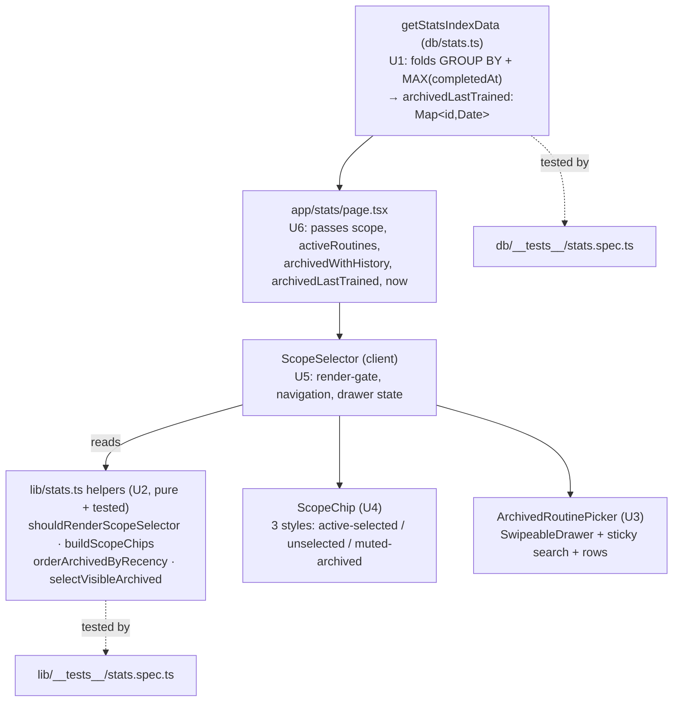

# feat: Swole Scope Selector Redesign (active chip rail + archived search-first picker)

## Overview

Replace the stats page's single flat MUI `Select` (`apps/swole/src/components/stats/ScopeSelector.tsx`) — which lists "All" → active → an "Archived" subheader → every archived-with-history routine, all alphabetical — with two surfaces that match the data's asymmetry:

1. An **always-visible wrapping `Chip` rail**: `All` (first) + the active routines, one tap to navigate, height bounded by *active* count.
2. A **search-first bottom-sheet picker** (`SwipeableDrawer`) for archived-with-history routines, defaulted to a ~10 most-recently-trained slice, typing filters the full set client-side.

The crux that makes this robust in *this* codebase: **swole has no component test surface** (no jsdom/RTL — only `lib/__tests__` pure-helper tests and `db/__tests__` real-SQLite data-layer tests). So every decision — the recency sort, the recency-cap/search filter, the render-condition, and the archived-chip splice — is extracted into **pure, unit-tested helpers in `lib/stats.ts`** and **one folded data-layer aggregate in `db/stats.ts`**. The three components (`ScopeSelector`, `ScopeChip`, `ArchivedRoutinePicker`) become thin wiring over tested logic.

It is read-only: **no schema change, no migration, no new dependency** (`Chip`/`SwipeableDrawer` ship with the installed MUI 7.3.4). Navigation stays `router.replace` + `useTransition`; the URL (`?routine=<id>`) stays authoritative; `resolveStatsScope` and the "frozen history" banner are reused as-is. (see origin: `docs/brainstorms/2026-05-29-swole-scope-selector-redesign-requirements.md`)

---

## Problem Frame

The current control treats two opposite populations as peers: **active** (small, stable, frequently switched — ~1–6) and **archived-with-history** (unbounded, rarely accessed, relevance-decaying). Because the menu is alphabetical, relevance and order are uncorrelated — a routine archived last week sits below a two-year-old one — and the control's height grows with *lifetime* routine count. One-handed in the gym, the athlete scrolls past stale archived routines to reach today's. This redesign splits the asymmetry: active becomes a bounded inline rail; archived is demoted behind a recency-ordered, search-first picker. The same moves (recency order, split, capped search) calm the realistic ≈5–15 archived case, not only the 200+ stress ceiling. (see origin Problem Frame.)

---

## Requirements Trace

Origin requirements R1–R15 map to implementation units as follows:

- R1 (always-visible rail: `All` + active as MUI `Chip`s, filled=selected / outlined=unselected, one-tap navigate) → **U2** (`buildScopeChips`), **U4** (`ScopeChip`), **U5** (`ScopeSelector`)
- R2 (chips wrap to additional lines, no horizontal scroll, no hidden off-edge items) → **U5** (flex-wrap container)
- R3 (single trailing "View archived (N)…" affordance; absent when N=0) → **U5**
- R4 (bottom-sheet `Drawer`, archived-only — no "All"/active duplication) → **U3**
- R5 (sticky thumb-reachable search field + large touch-target rows) → **U3**
- R6 (no-query → ~10 most-recently-trained; typing filters the full archived set, client-side, instant) → **U2** (`selectVisibleArchived`), **U3**
- R7 (each archived row = name + muted `formatRelativeDay` last-trained label) → **U1** (`archivedLastTrained` aggregate), **U3**
- R8 (dismiss via swipe-down + backdrop + Back/Esc; selecting navigates and closes) → **U3**, **U5**
- R9 (archived ordered by `MAX(completedAt)` newest-first; active stays alphabetical) → **U1** (aggregate), **U2** (`orderArchivedByRecency`)
- R10 (archived deep-link splice: transient muted selected chip at the **end** of the rail) → **U2** (`buildScopeChips`), **U4** (muted style), **U5**
- R11 (spliced chip exists only while that archived routine is scope; vanishes on next render) → **U2**, **U5**
- R12 (visibility table — when the selector renders + what is selected) → **U2** (`shouldRenderScopeSelector` + `buildScopeChips`), **U5**
- R13 ("All" = active-only rollup; archived excluded) → **U2** (`buildScopeChips` never splices archived into All), **U6** (data scoping unchanged)
- R14 ("All" → `/stats`; routine → `/stats?routine=<id>`; `router.replace` + `useTransition` pending state; URL authoritative) → **U5**
- R15 (`resolveStatsScope` fail-safe unchanged; existing archived banner still renders below header) → **U5** (consumes `scope`), **U6** (page)

**Origin actors:** A1 (User — the single athlete viewing training stats).
**Origin flows:** F1 (switch among active routines — common case), F2 (reach an archived routine via the search-first picker), F3 (land on an archived-scoped URL — deep link / Back).
**Origin acceptance examples:** AE1 (R1/R13 — All + 3 active, no archived), AE2 (R10/R11 — archived deep-link splices muted chip; selecting active removes it), AE3 (R6 — 40 archived: no-query ~10, "leg" filters all matches), AE4 (R12 — 1 active/0 archived hides selector; appears at 2nd routine or 1st archived-with-history), AE5 (R9 — newest-first with relative-day labels).

Success criteria (origin "Success Criteria"): switching to an active routine is one tap with no scroll-past-archived regardless of archived count; finding an archived routine is a glance or a short type; the inline control's height is a function of active count only; the data need (per-routine last-trained) and fail-safe/banner integration are wired; `lint` / `type-check` / `test` pass with new helper + data-layer unit tests.

---

## Scope Boundaries

_Carried from origin — these stay out of this change._

- **No virtualization and no server-side/async search.** Client filtering of even 200 names is instant; the recency cap bounds the default view. (Virtualization only earns its cost past ~300 rendered options and conflicts with grouping; async search only past thousands.)
- **No generic/reusable picker primitive extracted.** Build the archived picker well-factored but **stats-local** (`apps/swole/src/components/stats/`); extract a shared primitive only when a second consumer (exercise picker / history filter) actually lands, designed against two real call sites.
- **No persisted/inferred default scope.** Cold-default stays "All" (ideation survivor #6 is out for v1).
- **No routine revisions/versioning** (the upstream R8 idea). That is a data-model change, not a selector change.
- **Active-routine ordering is unchanged** (stays stable/alphabetical); recency reordering applies to archived only.
- **"All" semantics unchanged** (active-only rollup).

### Deferred to Follow-Up Work

- **Component test infrastructure (jsdom + React Testing Library) is not introduced here.** swole currently has zero component tests; adding RTL is a larger, separate lift than this feature. The mitigation in this plan is architectural — push all logic into the already-tested `lib/`/`db/` surfaces and keep components thin. If interaction-level regression coverage is later wanted, it is its own task. (See Risks.)

---

## Context & Research

### Relevant Code and Patterns

- `apps/swole/src/components/stats/ScopeSelector.tsx` — the flat `Select` being replaced; reuse its `router.replace` + `useTransition` + `ALL_VALUE`/`/stats` navigation glue verbatim.
- `apps/swole/src/db/stats.ts` — `getStatsIndexData`. **Step 2** (lines ~64–85) already runs `selectDistinct({ routineId })` over completed sessions of archived routines to build `archivedWithHistorySet`. **Step 7** (lines ~171–195) is the exact `sql<number | null>\`max(${sessions.completedAt})\`` → `new Date(ms)` raw-SQL aggregate pattern to mirror.
- `apps/swole/src/lib/stats.ts` — pure helpers home: `resolveStatsScope`, `StatsScope`, `classifyTrend`, `selectNeedsAttention` (note its minimal structural-input style, e.g. `{ days, createdAt }[]` and the `NeedsAttentionItem` shape — mirror that for the new helpers).
- `apps/swole/src/lib/format.ts` — `formatRelativeDay(at, now)` emits "Today" / "Yesterday" / "Nd ago" / "Nw ago" / "May 19"; reused as-is for row labels (R7).
- `apps/swole/src/db/schema.ts` — `sessions` carries `routineId` (notNull) + `completedAt` (`timestamp_ms`, nullable). Per-routine last-trained is a direct `GROUP BY routineId, MAX(completedAt) WHERE completedAt IS NOT NULL` — **no join** (simpler than `lastPerformedByExercise`, which joins `setLogs`→`sessions`).
- `apps/swole/src/components/home/RoutineCard.tsx` — the **closest in-repo precedent** for a wrapping token rail: `flex flex-wrap gap-1.5`, `rounded-md px-2 py-0.5`, selected `bg-orange-500 text-white`, unselected `bg-neutral-800 text-neutral-300`. Also the canonical client-component shape (`'use client'`, `useTransition`, `useRouter`, MUI `Dialog`/`Menu`). Mirror its dark-theme accent tokens for the chip rail.
- `apps/swole/src/components/stats/ExerciseStatRow.tsx` — full-width `Button` row pattern with `cns()` + `!`-prefixed Tailwind overrides on MUI; mirror for the picker rows. Also the `import type { … }` convention (recent commit `4c9ad2d` fixed a type-modifier import here — keep type-only imports correct).
- `apps/swole/src/theme.tsx` — MUI dark theme, `primary: deepOrange` (#ff5722). **Note the nuance:** the stats UI's accent is Tailwind `orange-500` (#f97316), used throughout (`text-orange-500`, `bg-orange-500`, RoutineCard day-tokens). Style the rail with **Tailwind `orange-500` tokens via `cns()`** (matching the surrounding stats accent), not MUI `color="primary"`, to stay visually consistent with the page.
- `apps/swole/src/components/Provider.tsx` — `ThemeProvider` + `AppRouterCacheProvider` already wrap the app; no provider work needed.

### Test Convention (decisive)

- **No `@testing-library`, no jsdom** anywhere in `apps/swole` (verified — no matches; jest runs node env). The only tested surfaces are:
  - `apps/swole/src/lib/__tests__/stats.spec.ts` — pure helpers, minimal factory fixtures, `describe` per helper, `NOW` pinned to a fixed instant.
  - `apps/swole/src/db/__tests__/stats.spec.ts` — `getStatsIndexData` against a real SQLite test DB (`createTestDb`, `seedRoutine`/`seedExercise`/`seedSession`/`seedSetLog`).
- **Consequence:** all feature logic must live in `lib/stats.ts` (U2) and `db/stats.ts` (U1). The components (U3–U6) carry no unit-test surface in this app and are verified manually/visually.

### Institutional Learnings

- `docs/solutions/` has only two swole-**backend** learnings (pure-FSM core; `BEGIN IMMEDIATE` for read-then-write) — neither touches this UI work. The one transferable norm: **the repo pushes correctness into pure, framework-free, exhaustively unit-tested modules.** This plan follows that exactly.
- No UI/selector learning exists yet — this redesign is strong `/ce-compound` material once built (the MUI bottom-sheet pattern, the `useTransition` + `router.replace` + URL-as-source-of-truth navigation, the dark-theme chip tokens are all undocumented).

---

## Key Technical Decisions

- **Maximize the tested surface; keep components thin.** Because swole has no component tests, the recency sort, recency-cap/search filter, render-condition, and chip-splice are pure helpers in `lib/stats.ts`; the last-trained data is a tested data-layer aggregate. Components only map tested output to MUI elements. This is the single most load-bearing decision (drives the unit boundaries).
- **Fold the last-trained aggregate into the existing archived-history query (Q1).** Replace Step 2's `selectDistinct({ routineId })` with `select({ routineId, lastTrainedMs: max(completedAt) }).groupBy(routineId)`. The same query yields both `archivedWithHistorySet` (group presence) and `archivedLastTrained: Map<number, Date>` (the MAX). One query, **no N+1**, mirrors the `lastPerformedByExercise` raw-SQL pattern. Return it as a companion `Map<number, Date>` (parity with `lastPerformedByExercise`), **not** a sort in SQL — newest-first ordering is a pure, tested `lib/stats.ts` helper, keeping the map reusable for both order (R9) and row labels (R7).
- **Active rail = MUI `Chip` styled with Tailwind `orange-500` tokens (Q3).** Selected active = filled `bg-orange-500 text-white`; unselected = outlined `border-neutral-700 text-neutral-200`. **Muted archived spliced chip** = translucent accent surface (`bg-orange-500/10`) + **full-opacity** foreground (`text-orange-200`, `border-orange-500/40`) + a leading `ArchiveOutlined` icon. This is distinct from both the solid-orange active-selected chip and the neutral outlined chips, legible on `neutral-900`, and **deliberately avoids the opacity-dimming anti-pattern** (ideation R2) — only the *background* is translucent, never the text. Mirrors the existing translucent-surface convention (archived banner `bg-neutral-900/60`, RoutineCard `ring-orange-500/20`).
- **Archived picker = `SwipeableDrawer` (anchor bottom), open-only-programmatically (Q2).** `SwipeableDrawer` gives swipe-down + backdrop tap + Esc + focus-trap + body-scroll-lock natively (it is a Modal). Configure `disableSwipeToOpen` + `disableDiscovery` (open only via the affordance, never edge-swipe). Esc satisfies R8's back/escape path natively. Hardware/browser **Back** is an additional dismissal via a lightweight `history.pushState` marker on open + `popstate` listener that calls `onClose`; its *exact wiring* is deferred to implementation (runtime-dependent against Next 16's router), but Back is required by R8 — resolve it or raise a blocker, do not silently drop it. Swipe/backdrop/Esc are guaranteed by the component regardless.
- **"View archived (N)…" is a trailing inline item in the same flex-wrap container as the chips (Q4)** — a low-emphasis text `Button` (not a chip), so it flows after the last chip and wraps to its own line naturally when the rail wraps. Rejected "its own line below the rail" (separates it from the chips, adds vertical space). Absent when N=0 (R3).
- **Recency cap = 10 (Q5).** Against the realistic ≤~15 archived, 10 shows most of the list without typing and is ~a screenful of large rows; the cap only bites past 10 (the slice is a no-op below). Named `ARCHIVED_RECENT_CAP` in `lib/stats.ts` — a one-line tune.
- **Pass `scope: StatsScope` (not `currentRoutineId`) to `ScopeSelector`.** `buildScopeChips` must distinguish archived vs active scope to splice correctly; `scope` is already a serializable plain object. This removes the `currentRoutineId` derivation in `page.tsx`.
- **Restructure the header layout for wrapping.** The current `flex items-start justify-between` row (h1 beside a compact `Select`) can't host a wrapping full-width rail on a phone. Stack them: `<h1>Stats</h1>` on its row, the rail full-width below it, banner below that (the outer `flex flex-col gap-4` already stacks).

---

## Open Questions

### Resolved During Planning

- **Q1 — data-layer shape for per-routine last-trained:** Extend `getStatsIndexData`'s return with a companion `archivedLastTrained: Map<number, Date>` (parity with `lastPerformedByExercise`), folded into the existing archived-history query (`GROUP BY` + `MAX`). Newest-first ordering is a pure `lib/stats.ts` helper, **not** SQL.
- **Q2 — Drawer dismiss + focus/scroll-lock:** `SwipeableDrawer` (bottom, open-only-programmatically) → swipe + backdrop + Esc + focus-trap + scroll-lock native (Esc covers R8's back/escape path); browser/hardware Back is an additional required path via a `pushState` marker + `popstate` listener — resolve-or-blocker, not droppable.
- **Q3 — muted archived chip tokens:** translucent `bg-orange-500/10` surface + full-opacity `text-orange-200` / `border-orange-500/40` + leading archive icon. Not opacity-dimming.
- **Q4 — "View archived (N)…" placement:** trailing inline text `Button` in the same flex-wrap container; wraps naturally; absent at N=0.
- **Q5 — recency cap:** 10, named `ARCHIVED_RECENT_CAP`, trivially tunable.

### Deferred to Implementation

- **Exact `SwipeableDrawer` Back-button history wiring** and its edge cases (double-close, navigate-while-open, interaction with `router.replace`) — genuinely runtime-dependent on Next 16 App Router history behavior; verify by observing it. This defers only the *wiring*, not the requirement: R8 requires hardware/browser Back, so if the edge cases cannot be resolved cleanly, raise a blocker rather than dropping it. The native gestures (swipe/backdrop/Esc) remain guaranteed by the component regardless.
- **`Map<number, Date>` + `Date` cross-RSC serialization** for the `archivedLastTrained` prop. Expected to work (React 19 Flight serializes `Map`/`Date`; `RoutineRow` `Date` fields already cross into the client `ScopeSelector` today). Fallback if a constraint surfaces: pass `Array<{ id: number; lastTrainedMs: number }>` and rebuild the `Map` client-side. Confirm during U6.
- **Sheet max-height + search position.** Plan places the sticky search at the sheet's top (per the origin layout sketch) with a modest `max-height` (~70vh) and internally scrolling rows. If one-handed reach-testing shows the search sits too high, flipping it to the sheet bottom is a trivial flex-direction tweak — decide against the running app.

---

## High-Level Technical Design

> *This illustrates the intended approach and is directional guidance for review, not implementation specification. The implementing agent should treat it as context, not code to reproduce.*

**Data → helpers → components flow:**



**The rail model (`buildScopeChips`) — preserves exactly-one-selected across all R12 states:**

```text
ScopeChip = { key, routineId|null, label, kind: 'all'|'active'|'archived', selected, href }

buildScopeChips(active, archivedWithHistory, scope):
  chips = [ { kind:'all', label:'All', href:'/stats', selected: scope.kind==='all' } ]
  for r in active:                       # input order = alphabetical (data layer)
    chips += { kind:'active', routineId:r.id, label:r.name,
               href:`/stats?routine=${r.id}`,
               selected: scope.kind==='active' && scope.id===r.id }
  if scope.kind==='archived':            # transient splice at END (R10/R11)
    r = archivedWithHistory.find(id===scope.id)   # invariant: present (resolveStatsScope ⇒ hasHistory)
    if r: chips += { kind:'archived', routineId:r.id, label:r.name,
                     href:`/stats?routine=${r.id}`, selected:true }
  return chips
# exactly-one-selected: 'all'→All only; 'active'→one active only; 'archived'→splice only
```

**Picker visible-rows derivation (`selectVisibleArchived`) — cap bites only without a query:**

```text
selectVisibleArchived(orderedArchived, query, cap):   # orderedArchived = newest-first (orderArchivedByRecency)
  q = query.trim().toLowerCase()
  if q === '':  return orderedArchived.slice(0, cap)         # ~10 recent (R6 default)
  return orderedArchived.filter(r => r.name.toLowerCase().includes(q))   # full set, NOT capped (R6 typing)
```

---

## Implementation Units

- U1. **Data layer: `archivedLastTrained` aggregate**

**Goal:** Give the selector a per-archived-routine `MAX(completedAt)` so the picker can order newest-first (R9) and label rows (R7), without a new query or N+1.

**Requirements:** R7, R9 (data need); AE5 (data).

**Dependencies:** None.

**Files:**
- Modify: `apps/swole/src/db/stats.ts`
- Test: `apps/swole/src/db/__tests__/stats.spec.ts`

**Approach:**
- In Step 2, replace `selectDistinct({ routineId: sessions.routineId })` with `select({ routineId: sessions.routineId, lastTrainedMs: sql<number | null>\`max(${sessions.completedAt})\` }).groupBy(sessions.routineId)`, keeping the same `WHERE inArray(routineId, archivedIds) AND completedAt IS NOT NULL`.
- Declare `const archivedLastTrained = new Map<number, Date>()` alongside `archivedWithHistorySet`; in the row loop, `archivedWithHistorySet.add(row.routineId)` and, when `lastTrainedMs !== null`, `archivedLastTrained.set(row.routineId, new Date(row.lastTrainedMs))`. (Group presence ⇒ ≥1 completed session ⇒ MAX is non-null, so map keys == `archivedWithHistory` ids.)
- Add `/** MAX(completedAt) per archived-with-history routine — recency order (R9) + row labels (R7). */ archivedLastTrained: Map<number, Date>` to `StatsIndexData`, and include it in **all three** return shapes (the two early-return guards + the final return). The empty-`archivedRoutineList` path leaves the map empty.

**Patterns to follow:**
- The Step 7 `lastPerformedByExercise` raw-SQL `max()` → `new Date(ms)` block in the same file (lines ~171–195) — same `sql<number | null>` idiom and null-guard.

**Test scenarios:** (extend `apps/swole/src/db/__tests__/stats.spec.ts`; group the new assertions in a `describe('archived last-trained aggregate')` block)
- Happy path: archived routine with two completed sessions → `archivedLastTrained.get(id)` equals the later `completedAt`. **Covers AE5 / R9.**
- Edge: archived routine with one completed + one incomplete (`completedAt: null`) session → map holds the completed one (the `IS NOT NULL` filter excludes the null).
- Edge: active (non-archived) routine → **not** present in `archivedLastTrained` (archived-only).
- Invariant: the key set of `archivedLastTrained` equals the id set of `archivedWithHistory` (e.g., seed 2 archived-with-history + 1 archived-without-session → map has exactly the 2).
- Edge: clean DB → `archivedLastTrained.size === 0` (add to the existing empty-guard assertions).
- Edge (early-return path): an archived routine *with* history exists, but scope resolves to a routine with no exercises (hits the `exerciseList.length === 0` early return) → the returned object still includes a populated `archivedLastTrained`. Guards against an early-return shape that forgets the new field.

**Verification:**
- `pnpm --filter @lilnas/swole test` passes including the new `describe`; existing `getStatsIndexData` tests stay green; `type-check` passes with the widened `StatsIndexData`.

---

- U2. **Pure helpers + `ScopeChip` type in `lib/stats.ts`**

**Goal:** Encode every selector decision as pure, unit-tested functions: render-gate, rail model (with splice), recency order, and the recency-cap/search filter.

**Requirements:** R1, R6, R9, R10, R11, R12, R13, R14 (href shape); AE1–AE5 (logic).

**Dependencies:** None (uses `StatsScope` from the same file; `RoutineRow` from `src/db/types`).

**Files:**
- Modify: `apps/swole/src/lib/stats.ts`
- Test: `apps/swole/src/lib/__tests__/stats.spec.ts`

**Approach:**
- Export `type ScopeChip = { key: string; routineId: number | null; label: string; kind: 'all' | 'active' | 'archived'; selected: boolean; href: string }`.
- Export `const ARCHIVED_RECENT_CAP = 10`.
- `shouldRenderScopeSelector(activeCount: number, archivedWithHistoryCount: number): boolean` → `activeCount >= 2 || archivedWithHistoryCount >= 1` (R12).
- `buildScopeChips(active, archivedWithHistory, scope)` → `ScopeChip[]` per the design sketch: `All` first; active in input order; splice the one archived chip at the end only when `scope.kind === 'archived'`. Use minimal structural inputs (`{ id: number; name: string }[]`) like the existing `selectNeedsAttention` shape. `key` = `'all'` or `String(id)` (note: an archived id never collides with an active id in the rail because the archived chip appears only when no active chip shares that scope).
- `orderArchivedByRecency(archived: RoutineRow[], lastTrained: Map<number, Date>): RoutineRow[]` → copy, sort by `lastTrained.get(id)` descending; tie-break by `name` ascending (stable, matches active alpha intuition); routines missing from the map sort last (defensive — shouldn't occur).
- `selectVisibleArchived(orderedArchived: RoutineRow[], query: string, cap: number): RoutineRow[]` → per the design sketch: trimmed-empty query → `slice(0, cap)`; otherwise case-insensitive substring match on `name`, uncapped.

**Patterns to follow:**
- Existing `lib/stats.ts` helpers: pure, no side effects, minimal structural inputs, `describe`-per-helper tests with pinned `NOW`.

**Test scenarios:** (extend `apps/swole/src/lib/__tests__/stats.spec.ts`)
- `shouldRenderScopeSelector`: `(0,0)→false`, `(1,0)→false`, `(2,0)→true`, `(1,1)→true`, `(0,1)→true`, `(3,0)→true`. **Covers AE4 / R12.**
- `buildScopeChips` scope=all: `[All(selected), ...active(unselected)]`, no archived chip; All href `'/stats'`, active hrefs `/stats?routine=<id>`. **Covers AE1 / R1, R13, R14.**
- `buildScopeChips` scope=active id: All unselected, the matching active chip selected, others unselected, no archived chip. **Covers R12 "Active scoped".**
- `buildScopeChips` scope=archived id: All + active all unselected + exactly one `kind:'archived'` chip, selected, **last** in the array. **Covers AE2 / R10.**
- `buildScopeChips` exactly-one-selected invariant holds across all three scope kinds (assert exactly one `selected` chip).
- `buildScopeChips` AE2 follow-through: re-running with scope=active (the previously-archived case now navigated away) yields **no** archived chip. **Covers AE2 / R11.**
- `buildScopeChips` defensive: scope=archived whose id is absent from `archivedWithHistory` → no archived chip appended (documents the relied-upon `resolveStatsScope` invariant).
- `orderArchivedByRecency`: newest-first by map date; equal-date tie → name ascending; missing-from-map → last; empty input → `[]`. **Covers AE5 / R9.**
- `selectVisibleArchived`: empty query → first `cap` of ordered; empty query with fewer than `cap` → all; whitespace-only query → treated as empty (recent slice); non-empty query → all case-insensitive matches and **bypasses the cap** (e.g., 40 items, 12 match "leg" → all 12); no match → `[]`; cap boundary (exactly `cap` → all `cap`; `cap+1` → `cap`). **Covers AE3 / R6.**

**Verification:**
- `pnpm --filter @lilnas/swole test` green; new helpers are exported and consumed only by U3–U6.

---

- U3. **`ArchivedRoutinePicker` component (bottom-sheet `SwipeableDrawer`)**

**Goal:** The archived-only, search-first picker: sticky thumb-reachable search, large recency-labelled rows, all dismiss paths, selection navigates + closes.

**Requirements:** R4, R5, R6, R7, R8; F2.

**Dependencies:** U2 (`selectVisibleArchived`, `ARCHIVED_RECENT_CAP`). Soft: U1 (the `archivedLastTrained` map type).

**Files:**
- Create: `apps/swole/src/components/stats/ArchivedRoutinePicker.tsx`

**Approach:**
- `'use client'`. Props: `{ open: boolean; onClose: () => void; orderedArchived: RoutineRow[]; archivedLastTrained: Map<number, Date>; now: Date; onSelect: (id: number) => void; disabled: boolean }`.
- `SwipeableDrawer` `anchor="bottom"`, `disableSwipeToOpen`, `disableDiscovery`, required `onOpen` noop, `onClose={onClose}`; paper styled `max-height: ~70vh`, rounded top corners, `bg-neutral-900`.
- Internal `const [query, setQuery] = useState('')`; reset to `''` when `open` transitions false→true. `const visible = useMemo(() => selectVisibleArchived(orderedArchived, query, ARCHIVED_RECENT_CAP), [orderedArchived, query])`.
- Sticky search `TextField`/`InputBase` at the sheet top (`position: sticky; top: 0; bg-neutral-900`), leading search icon, `placeholder="Search archived routines"`, `aria-label`. **No unconditional `autoFocus`** — on a bottom sheet it pops the mobile keyboard on open, compressing the viewport and pushing the recent-slice rows (the glance-and-tap default, R6) off-screen, which fights the thumb-reach rationale for choosing a sheet. Focus the field only on `pointer: fine` (desktop — a post-open `matchMedia('(pointer: fine)')` check) or on user tap, matching Slack/iOS/Google-Maps bottom-sheets.
- Rows: scroll container (`overflow-y:auto`) of full-width `Button` rows (mirror `ExerciseStatRow`): name left, `formatRelativeDay(archivedLastTrained.get(r.id) ?? now, now)` muted right, min-height ~56px; `onClick={() => onSelect(r.id)}`; `disabled`.
- Empty state when `visible.length === 0` and `query` non-empty: "No archived routines match '<query>'." (The query-empty + zero-rows state is unreachable: U5's N=0 guard means the "View archived" affordance — and therefore the picker — exists only when ≥1 archived-with-history routine does, so no separate empty-state UI is needed.)
- Back-button: `useEffect` gated on `open` — `history.pushState` a marker, add a `popstate` listener calling `onClose`, clean up on close (consume the pushed entry if closing by another path). Flag the exact behavior for runtime verification (see Deferred to Implementation).

**Patterns to follow:**
- `ExerciseStatRow.tsx` full-width `Button` row + `cns()` `!`-overrides; `RoutineCard.tsx` client-component + MUI modal-family usage.

**Test scenarios:** Test expectation: none — swole has no component test surface (no jsdom/RTL). All branching logic (visible-rows, cap, filter) lives in U2 and is unit-tested there. Verified manually (see Verification).

**Verification:**
- Against the running app (`pnpm --filter @lilnas/swole dev`): opening with no query shows ≤10 newest-first rows with relative-day labels; typing "leg" filters to all matches (uncapped); swipe-down, backdrop tap, and Esc each close it; selecting a row fires `onSelect` and closes. `lint` + `type-check` pass.

---

- U4. **`ScopeChip` component (3-style single chip)**

**Goal:** Render one `ScopeChip` model as a themed MUI `Chip` — active-selected (filled orange), unselected (outlined neutral), or muted-archived (translucent-tinted, distinct, legible).

**Requirements:** R1, R10; F1, F3.

**Dependencies:** U2 (`ScopeChip` type).

**Files:**
- Create: `apps/swole/src/components/stats/ScopeChip.tsx`

**Approach:**
- Props: `{ chip: ScopeChip; onSelect: (href: string) => void; disabled: boolean }`.
- Render `@mui/material/Chip` with `label={chip.label}`. Style by `chip.kind` + `chip.selected` via `cns()` `!`-overrides (Tailwind `orange-500` tokens, **not** MUI `color="primary"`):
  - active + selected: `variant="filled"`, `!bg-orange-500 !text-white`.
  - active/all + unselected: `variant="outlined"`, `!border-neutral-700 !text-neutral-200 !bg-transparent`.
  - archived: `variant="outlined"`, `icon={<ArchiveOutlinedIcon/>}`, `!border-orange-500/40 !bg-orange-500/10 !text-orange-200` with the icon tinted `orange-300` — translucent surface, full-opacity text (no opacity-dimming).
  - All variants: `~40px` min height (`!min-h-[40px]` / `!py-2`) — MUI's 32px `Chip` default is below the one-handed touch-target floor that is this design's deciding lens.
- Interactivity: active/all chips get `clickable`, `aria-pressed={chip.selected}`, `disabled`, and fire `onClick={() => onSelect(chip.href)}` **only when `!chip.selected`** — re-tapping the already-selected chip is a no-op, avoiding a redundant `router.replace` and a confusing pending-dim flash on an accidental gym double-tap. The archived chip is **display-only** (no `onClick`) — it marks "you are here (frozen)" and R11 removes it when another chip is chosen. Because an MUI `Chip` is focusable by default, give the archived chip `aria-disabled="true"`, `aria-label="<name> — currently viewing archived routine (read-only)"`, and `tabIndex={-1}` so assistive tech conveys its read-only "current scope" role instead of landing on a silent no-op (the muted visual style alone does not reach a screen reader).

**Patterns to follow:**
- RoutineCard day-token styling (`bg-orange-500 text-white` / neutral) as the accent reference; `cns()` `!`-override idiom from `ExerciseStatRow`.

**Test scenarios:** Test expectation: none — presentational, no component test surface in this app. The chip's selected/kind inputs come from `buildScopeChips` (U2, tested). Verified visually.

**Verification:**
- Visual: the three styles are mutually distinguishable on the dark theme and the archived chip's text is full-contrast (not dimmed). `lint` + `type-check` pass.

---

- U5. **Rewrite `ScopeSelector` (orchestrator)**

**Goal:** Compose the rail + "View archived (N)…" affordance + picker; gate rendering; own navigation and drawer state; preserve the `useTransition` pending dim.

**Requirements:** R1, R2, R3, R8, R10, R11, R12, R14; F1, F2, F3.

**Dependencies:** U2, U3, U4.

**Files:**
- Modify: `apps/swole/src/components/stats/ScopeSelector.tsx`

**Approach:**
- `'use client'`. Props change to `{ activeRoutines: RoutineRow[]; archivedWithHistory: RoutineRow[]; archivedLastTrained: Map<number, Date>; scope: StatsScope; now: Date }` (replacing `currentRoutineId` with `scope`).
- Early-return `null` when `!shouldRenderScopeSelector(activeRoutines.length, archivedWithHistory.length)` (R12 / AE4).
- `const chips = useMemo(() => buildScopeChips(activeRoutines, archivedWithHistory, scope), …)`; `const orderedArchived = useMemo(() => orderArchivedByRecency(archivedWithHistory, archivedLastTrained), …)`.
- `useRouter` + `useTransition` reused verbatim; `handleSelect(href)` → `startTransition(() => router.replace(href, { scroll: false }))` (R14). `const [pickerOpen, setPickerOpen] = useState(false)`.
- Layout: one `flex flex-wrap items-center gap-2` container (R2 — wraps, no horizontal scroll), `role="group"`, `aria-label="Scope — select routine"`, dimmed via `opacity` when `isPending` (matches today). Map `chips` → `<ScopeChip>`; then, when `archivedWithHistory.length > 0`, render the trailing "View archived ({archivedWithHistory.length})…" low-emphasis text `Button` (R3) that opens the picker (Q4 — same container, wraps naturally).
- Mount `<ArchivedRoutinePicker open={pickerOpen} onClose={() => setPickerOpen(false)} orderedArchived={orderedArchived} archivedLastTrained={archivedLastTrained} now={now} disabled={isPending} onSelect={(id) => { setPickerOpen(false); handleSelect(\`/stats?routine=${id}\`) }} />` (R8 — select navigates + closes).

**Patterns to follow:**
- The current `ScopeSelector` navigation glue; `RoutineCard` client-component state + `useTransition` shape.

**Test scenarios:** Test expectation: none — orchestration/wiring, no component test surface. The decisions it consumes (`shouldRenderScopeSelector`, `buildScopeChips`) are unit-tested in U2. Verified via the AE walkthroughs below.

**Verification (manual AE walkthroughs against the running app):**
- AE1 (R1/R13): 3 active, 0 archived → rail `All`(selected) · Push · Pull · Legs; no "View archived"; tapping a chip navigates in one tap with pending dim.
- AE2 (R10/R11): open `/stats?routine=<archived "Push v1">` → rail shows All + active + muted "Push v1"(selected) at the end; tap "Pull" → navigates and the muted chip is gone after re-render.
- AE4 (R12): 1 active/0 archived → selector absent; with a 2nd active routine (or the 1st archived-with-history) it appears.
- R2: with ≥4 active chips on a narrow viewport, chips wrap to a second line (no horizontal scroll, no clipped items); the affordance wraps with them.
- R8/R14: selecting an archived row navigates + closes the sheet; URL reflects scope; `resolveStatsScope` still drives the rendered scope.
- `lint` + `type-check` pass.

---

- U6. **Integrate in `page.tsx` (props + header layout)**

**Goal:** Feed the selector the new data and restructure the header so the wrapping rail has full width; keep the fail-safe + banner.

**Requirements:** R12, R14, R15.

**Dependencies:** U1 (provides `archivedLastTrained`), U5 (new props).

**Files:**
- Modify: `apps/swole/src/app/stats/page.tsx`

**Approach:**
- Destructure `archivedLastTrained` from `getStatsIndexData`'s result; remove the `currentRoutineId` derivation (line ~76).
- Restructure the header: render `<h1>Stats</h1>` on its own row, then `<ScopeSelector activeRoutines={activeRoutines} archivedWithHistory={archivedWithHistory} archivedLastTrained={archivedLastTrained} scope={scope} now={now} />` full-width below it (drop the `flex items-start justify-between` wrapper). The existing archived "frozen history" banner stays in the same `flex flex-col gap-4` block below the selector (R15). `ScopeSelector` self-hides via the U2 gate, so the h1 stands alone when there's no real choice.
- Confirm `archivedLastTrained` (Map) + `now` (Date) cross the RSC→client boundary; if a serialization constraint surfaces, apply the array fallback noted in Deferred to Implementation.

**Patterns to follow:**
- Current `page.tsx` header block and prop-passing to `StatsHeader`/`NeedsAttention`.

**Test scenarios:** Test expectation: none — a server-component wiring + layout change with no extracted logic. The data it forwards is covered by U1; the selector behavior by U2's helpers. Verified by the U5 AE walkthroughs + the existing `db/__tests__/stats.spec.ts`.

**Verification:**
- The page renders with the rail full-width under the heading; banner still appears for archived scope; archived deep-link reload does not throw (existing `getStatsIndexData` archive-reload coverage stays green). `lint` + `type-check` + `test` pass for `@lilnas/swole`.

---

## System-Wide Impact

- **Interaction graph:** `getStatsIndexData` is read by `app/stats/page.tsx` only; widening its return is additive (new field), so other readers are unaffected. `ScopeSelector`'s prop change (`currentRoutineId` → `scope`, plus `archivedLastTrained`, `now`) is confined to its single mount in `page.tsx`.
- **Error propagation:** Unchanged. `resolveStatsScope` still fails safe to `all` for invalid/stale/archived-without-history ids (R15); the page never throws `notFound()`. The selector renders only valid chips derived from the resolved scope.
- **State lifecycle risks:** The archived splice is **derived state**, not stored — it exists for exactly one render where `scope.kind==='archived'` and disappears on the next navigation (R11), so there is no stale-chip cleanup concern. Drawer `query` state resets on open.
- **API surface parity:** No public API/route change. The route segment stays exercise-only; scope stays a `?routine=` filter on `/stats`. No other selector consumes these helpers (single call site), consistent with the "no generic primitive yet" boundary.
- **Integration coverage:** The only cross-layer behavior unit tests cannot prove is the live drawer dismissal + the Map/Date RSC serialization — both are enumerated as manual verification (U3/U5/U6) and deferred-to-implementation checks.
- **Unchanged invariants:** "All" stays active-only (R13, data scoping in `getStatsIndexData` untouched); active ordering stays alphabetical; the "frozen history" banner, `force-dynamic`, server-component page shape, and the no-schema/no-migration/no-dependency posture all hold.

---

## Risks & Dependencies

| Risk | Mitigation |
|------|------------|
| New components (U3–U6) have **no automated test coverage** (no jsdom/RTL in swole). | Architecture pushes all logic into U1 (data layer) + U2 (pure helpers), both fully unit-tested; components are thin wiring. Manual AE walkthroughs enumerated in U5. Introducing RTL is explicitly out of scope (Deferred to Follow-Up Work). |
| `SwipeableDrawer` browser/hardware **Back** dismissal is fiddly against Next 16's router history. | Swipe + backdrop + Esc are guaranteed natively (Esc satisfies R8's back/escape path). Hardware/browser Back is a `pushState`+`popstate` enhancement whose exact wiring is verified at implementation time; R8 requires it, so if the edge cases cannot be resolved cleanly, raise a blocker rather than shipping without it. |
| `Map`/`Date` may not cross the RSC→client boundary as assumed. | High confidence it does (React 19 Flight; `RoutineRow` `Date`s already cross into the client `ScopeSelector` today). Documented array-of-`{id,lastTrainedMs}` fallback if not. |
| First MUI `Chip`/`SwipeableDrawer` usage in swole — theming drift. | Style via the established Tailwind `orange-500`/neutral tokens + `cns()` `!`-overrides (RoutineCard day-token precedent), not bespoke MUI palette work. No theme change. |
| Stricter render-gate (hides at 1 active/0 archived) changes current behavior. | Intended (R12/AE4); covered by `shouldRenderScopeSelector` unit tests; the h1 always renders so the header never looks broken. |

**Dependencies:** None external. Reuses installed MUI 7.3.4 (`Chip`, `SwipeableDrawer`, `@mui/icons-material/ArchiveOutlined`), `formatRelativeDay`, `resolveStatsScope`/`StatsScope`, and the existing `getStatsIndexData` read. No new package, schema, or migration.

---

## Documentation / Operational Notes

- No runbook/ops impact (read-only, no infra change).
- Strong `/ce-compound` candidate once shipped — the first swole UI-layer learnings: the MUI bottom-sheet (`SwipeableDrawer`) picker pattern, the `useTransition` + `router.replace` + URL-as-source-of-truth navigation, and the dark-theme chip tokens are all currently undocumented in `docs/solutions/`.

---

## Sources & References

- **Origin document:** [docs/brainstorms/2026-05-29-swole-scope-selector-redesign-requirements.md](docs/brainstorms/2026-05-29-swole-scope-selector-redesign-requirements.md)
- **Ideation (rationale + rejected alternatives):** [docs/ideation/2026-05-29-swole-scope-selector-scalability-ideation.md](docs/ideation/2026-05-29-swole-scope-selector-scalability-ideation.md)
- **Predecessor plan (established the helpers + read this extends):** [docs/plans/2026-05-29-002-feat-swole-stats-overview-plan.md](docs/plans/2026-05-29-002-feat-swole-stats-overview-plan.md)
- Key code: `apps/swole/src/db/stats.ts` (`getStatsIndexData`), `apps/swole/src/lib/stats.ts` (`resolveStatsScope`, helpers), `apps/swole/src/lib/format.ts` (`formatRelativeDay`), `apps/swole/src/components/stats/ScopeSelector.tsx` (replaced), `apps/swole/src/components/home/RoutineCard.tsx` (rail/token precedent), `apps/swole/src/app/stats/page.tsx` (mount + banner).
