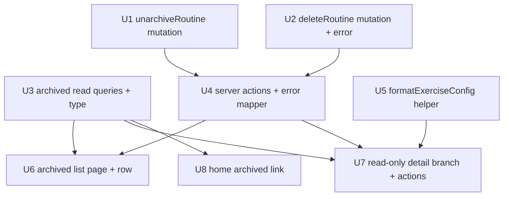

# feat: Swole archived routine management (view, restore, delete)

## Overview

Archiving a routine in the Swole app is currently a one-way door: `archiveRoutine`
sets `routines.archivedAt`, but there is no way back. There is no `unarchiveRoutine`
or `deleteRoutine`, `/routines/[id]` redirects archived routines to home, and a
zero-history archived routine surfaces in **no** UI at all. The archive confirm
dialog even promises "You can restore later from the routine page" — an
unfulfillable promise today.

This plan makes archive reversible and gives archived routines a home. It adds:

1. A home **"Archived routines (N)"** link (total count, absent at 0).
2. A new **`/routines/archived`** list page showing **all** archived routines,
   including zero-history ones that are invisible today.
3. A **read-only branch** of `/routines/[id]` for archived routines (replacing
   today's redirect), with a "View stats" link when the routine has history.
4. An **`unarchiveRoutine`** mutation + action — unconditional, no confirm,
   available inline on each list row and on the detail.
5. A **`deleteRoutine`** mutation + action — permanent delete, gated to
   **zero-completed-session** routines only, in one `BEGIN IMMEDIATE` transaction
   that respects the schema's `onDelete: 'restrict'` FK constraints.

The single highest-leverage outcome is **reversibility**. Everything else is in
service of that. No schema migration is required — both mutations operate on
existing columns and tables.

---

## Problem Frame

The Swole app is a single-lifter fitness tracker built on a preserve-everything
invariant: soft-archive everywhere, FK `restrict`, stats derived from set logs.
Archiving was intentionally shipped as write-only — the routine-edit brainstorm
deferred restore/delete (`docs/brainstorms/2026-05-29-swole-routine-edit-requirements.md:149`).
This plan fills that gap (see origin: `docs/brainstorms/2026-06-02-swole-archive-routine-ui-requirements.md`).

The reversibility hole has three concrete symptoms, all verified in code:

- **No restore exists** — confirmed absent in `apps/swole/src/db/routines.ts` and
  `apps/swole/src/actions/routines.ts`.
- **The routine page is a dead end** — `apps/swole/src/app/routines/[id]/page.tsx:27`
  conflates "not found" and "archived" into a single `redirect('/')`.
- **Zero-history archived routines are invisible** — the only archived surface
  today is the stats `ArchivedRoutinePicker` (`apps/swole/src/components/stats/ArchivedRoutinePicker.tsx`),
  which lists archived-**with-history** only, read-only.

The asymmetry is deliberate by design: **Restore** is safe, common, and reversible
(one tap, inline, no confirm); **Delete** is irreversible (detail-only, confirmed,
and bounded to junk routines with no logged history).

---

## Requirements Trace

- R1. Home shows an "Archived routines (N)" link near "+ New Routine", N = total
  archived count (with or without history); absent when N = 0. → U3, U8
- R2. The link opens `/routines/archived` listing **all** archived routines,
  including zero-completed-session ones. → U3, U6
- R3. List ordered newest-first by last-trained (reuse `orderArchivedByRecency`);
  never-trained routines sort last. → U3, U6
- R4. Each row shows name, muted last-trained relative-day label (or "Never
  trained"), exercise count, and an inline **Restore** action; tapping the row
  elsewhere opens the read-only detail. → U6
- R5. `/routines/[id]` for an archived routine renders a **read-only** view
  instead of redirecting; no form, no save. → U7
- R6. Detail shows name + "Archived" badge + "archived {relative day}" line;
  read-only day pills; read-only exercise list (name, type badge, config summary).
  → U5, U7
- R7. When the routine has ≥1 completed session, the detail shows a "View stats"
  link to `/stats?routine=<id>`; absent when no history. → U3, U7
- R8. **Restore** and **Delete** actions pinned at the bottom of the detail. → U7
- R9. Restore is **unconditional** (clears `archivedAt`); available inline (R4)
  and on the detail (R8). → U1, U4, U6, U7
- R10. Restore needs **no confirmation**; success shows a "Restored {name}" toast;
  the routine reappears on home and rejoins active stats scope. → U1, U4, U6, U7
- R11. Restore needs no special-casing: names are non-unique, an archived routine
  has no active session, and edit-removed exercises stay archived (restore
  un-archives the routine only). → U1
- R12. Permanent delete allowed **only** for archived routines with **zero
  completed sessions**; otherwise Delete is disabled/hidden with a one-line reason.
  → U2, U3, U7
- R13. Delete lives **only on the detail page**, never inline on list rows. → U7
- R14. Deleting a zero-history routine removes the routine and its exercises (and
  their initial progressions) in one transaction; success → toast → back to list.
  → U2, U4
- R15. Delete requires a simple confirm dialog ("Delete {name}? This can't be
  undone."); no typed-name ceremony. → U4, U7
- R16. Zero archived → home link absent and `/routines/archived` shows a plain
  "No archived routines" empty state; after the last archived routine is restored
  or deleted, the link disappears and the page falls to that empty state. → U6, U8
- R17. Home "Archived routines (N)" (total) and stats "View archived (N)…"
  (history-only) are intentionally distinct surfaces with distinct counts; the
  differing N is accepted. → U3 (total count), honored by leaving stats untouched

**Origin flows:** F1 (Restore an archived routine), F2 (Browse an archived
routine's frozen config), F3 (Permanently delete a junk routine), F4 (Delete is
gated for a routine with history).

**Origin acceptance examples:** AE1 (covers R2, R3, R4), AE2 (covers R9, R10),
AE3 (covers R12, R13, R14, R15), AE4 (covers R12), AE5 (covers R5, R6, R7),
AE6 (covers R16).

---

## Scope Boundaries

- **No cascade delete of history-bearing routines.** Delete is
  zero-completed-sessions only; routines with logged history stay archivable-only
  forever. Nuking history is a separate future decision.
- **No bulk actions** (multi-select restore/delete). One routine at a time.
- **No archived-exercise restore or management.** Routine-level only;
  edit-removed exercises stay archived.
- **No editing an archived routine.** The detail is strictly read-only; restore
  first, then edit via the existing flow.
- **No undo toast / soft-delete for permanent Delete.** The confirm dialog is the
  only guard — acceptable because R12 bounds delete to no-history routines.
- **No change** to the existing stats `ArchivedRoutinePicker` (history-only,
  view-only) or to the archive trigger on the home card.
- **No new theme tokens, rest timer, notes, or telemetry** beyond `/metrics`.
- **No schema migration.** Both mutations use existing columns/tables.
- **No new component-test infrastructure.** The swole repo does not unit-test
  `.tsx` (Jest is node-env, coverage excludes `.tsx`); this plan does not add a
  DOM renderer. UI is verified via lint/type-check + manual browser passes. The
  feature-bearing *logic* is deliberately pushed out of the components into tested
  units (adversarial review): the Delete-enable gate is `!hasCompletedSession` driven
  by the tested `existsCompletedSessionForRoutine` (U3); the `NotFound`-benign and
  history-blocked toast mapping is tested via `mapDeleteRoutineError` /
  `mapUnarchiveRoutineError` (U4); the exercise summary is tested via
  `formatExerciseConfig` (U5). Only the presentational wiring (confirm→fire
  sequencing, layout) is manual-only — and that is the part a DOM test would add
  little confidence to.

---

## Context & Research

### Relevant Code and Patterns

- **`apps/swole/src/db/routines.ts`** — `archiveRoutine` (lines ~254–296) is the
  mutation template: `db.transaction(tx => {...}, { behavior: 'immediate' })`,
  existence check → `NotFoundError`, in-tx guard, `async`-returning-sync
  convention, `logMutationError` on catch, returns `RoutineRow`. **All access
  inside the callback must use `tx`, never `db`** (a stray `db.*` commits even on
  rollback). `listRoutinesForHome` (lines ~81–141) shows the two-query
  exercise-count pattern with the **`inArray(col, [])` empty-array guard** to
  replicate. `getRoutineWithExercises({ id, includeArchived })` (lines ~64–79) is
  the read used by the detail.
- **`apps/swole/src/db/schema.ts`** — `routines.archivedAt` is nullable
  `timestamp_ms` (line ~46). All child FKs are `onDelete: 'restrict'`:
  `exercises.routineId` (61), `sessions.routineId` (98), `setLogs.sessionId` (120),
  `setLogs.exerciseId` (123), `progressions.exerciseId` (149),
  `progressions.sessionId` (nullable, 150). `exercises.increment` (68) is non-null
  for weighted (CHECK `exercise_type_fields_match`, 79–87). `pragmas.ts` sets
  `foreign_keys = ON` after connect — RESTRICT is enforced.
- **`apps/swole/src/actions/routines.ts`** — `archiveRoutine` action wrapper
  (lines ~77–90) is the template: wraps the db mutation, calls `revalidatePath`,
  returns the `ActionResult<T>` discriminated envelope
  (`{ ok: true, row } | { ok: false, kind, code }`, defined in
  `apps/swole/src/actions/sessions.ts:14`); `code = err.constructor.name`.
- **`apps/swole/src/app/routines/[id]/page.tsx`** — server component,
  `force-dynamic`. Line 27 `if (!data || data.routine.archivedAt != null) redirect('/')`
  is the redirect to split. The active-session in-page branch (lines ~32–59) is
  the structural model for the read-only branch.
- **`apps/swole/src/app/page.tsx`** — "+ New Routine" `<Button>` at lines 111–118,
  inside the `flex flex-col gap-4` wrapper, inside the `routines.length > 0` block.
  EmptyState early-returns at line 82 (`routines.length === 0 && !banner`). Data
  is loaded via `Promise.all` (lines ~73–76).
- **`apps/swole/src/components/home/RoutineCard.tsx`** — the Archive confirm
  dialog (lines ~208–229, `color="warning"`) is the model for the Delete dialog;
  toast via `useToast()` → `showToast(message, severity)`; action call inside
  `useTransition` branching on `result.ok`.
- **`apps/swole/src/components/routines/RoutineForm.tsx`** — the discard-changes
  dialog (lines ~406–434, `color="error"` + dark `PaperProps`) is the destructive-
  dialog styling reference. The **editable** path — must NOT be mounted for archived.
- **`apps/swole/src/components/stats/ArchivedRoutinePicker.tsx`** — out of scope to
  change, but its row styling (`<Button fullWidth>` rows in a divided `<ul>`) is the
  visual reference for the new list rows.
- **Helpers:** `orderArchivedByRecency` (`apps/swole/src/lib/stats.ts:727`, pure,
  newest-first, missing-last, name tie-break — directly satisfies R3);
  `formatRelativeDay` (`apps/swole/src/lib/format.ts:330`, caller handles the null
  case); `formatDayCodes(days, today)` (`format.ts:~50`, pass `today=null` for
  archived pills); `formatNextUpLine` / `formatTimeBasedDuration` /
  `formatCardioDuration` / `formatWeight` (`format.ts`); `<ExerciseTypeBadge>`
  (`apps/swole/src/components/stats/ExerciseTypeBadge.tsx`); `toExercise(row)`
  (`apps/swole/src/db/mappers.ts`).
- **Stats:** the "All" rollup filters `archivedAt === null`
  (`apps/swole/src/db/stats.ts:~63`), so restore auto-rejoins and delete of a
  zero-history routine never affected it. `/stats?routine=<id>` resolves to the
  frozen view only when archived **and** has history
  (`resolveStatsScope`, `apps/swole/src/lib/stats.ts:585`), which is why R7 gates
  the link on history.
- **Tests:** Jest 29 + ts-jest, node env, in-memory SQLite per test
  (`apps/swole/src/db/test-db.ts` — `createTestDb` calls `applyPragmas`, so
  `foreign_keys = ON` in tests and the `restrict` tests are real, not false-passing).
  Data-layer tests in `apps/swole/src/db/__tests__/routines.spec.ts` with
  `seedRoutine`/`seedExercise` helpers and `jest.spyOn` injected-failure rollback
  tests. Pure-helper tests in
  `apps/swole/src/lib/__tests__/`. **Server actions and `.tsx` are not unit-tested
  by convention** (verified: zero `from 'src/actions'` imports in specs; coverage
  excludes `.tsx`).

### Institutional Learnings

- **`docs/solutions/conventions/begin-immediate-for-read-then-write-mutations-2026-05-27.md`**
  (high relevance) — both new mutations are read-then-write and must use
  `{ behavior: 'immediate' }`. `deleteRoutine`'s gate has the same TOCTOU shape as
  `archiveRoutine`'s active-session guard (a concurrent `completeSession` could
  land a session between the count and the delete). Make `unarchiveRoutine`
  **idempotent** (re-read inside the tx, short-circuit when already active),
  mirroring `completeSession`.
- **`docs/solutions/conventions/type-guards-over-nonnull-assertions-on-db-rows-2026-05-30.md`**
  (medium) — the archived-list query returns rows where `archivedAt` is known
  non-null but typed `Date | null`. Bake the guarantee into a named type
  (`ArchivedRoutineSummary` with `archivedAt: Date`) rather than `archivedAt!`.
- **`docs/solutions/ui-bugs/drawer-history-marker-repush-on-keystroke-2026-05-30.md`**
  (high, for any back-trapping UI) — a component named `ArchivedRoutinePicker`
  already exists under `components/stats/`; new components live under
  `components/routines/` with distinct names to avoid confusion. If the Delete
  confirm dialog ever traps hardware Back via `history.pushState`, apply the
  ref-for-callback + `popped`-flag pattern. (The MUI `<Dialog>` model used by the
  Archive dialog does **not** push history, so this likely does not bite.)
- **`docs/solutions/architecture-patterns/pure-fsm-core-for-stateful-domain-logic-2026-05-27.md`**
  (medium) — "matrix-cover the inputs to **every** public function." For
  `deleteRoutine`, test every gate and FK branch (zero-history happy path,
  has-completed-sessions rejection, any-session rejection, exercises-with-
  progressions, non-existent id, mid-tx rollback), and make the new
  delete-blocked error a typed `DataLayerError` subclass.

### External References

None — the swole codebase has strong, recent local patterns for every layer this
plan touches (transactions, server actions, components, tests), including a
documented learning covering the exact transaction pattern.

---

## Key Technical Decisions

These resolve the six questions the origin doc deferred to planning, plus the
research-driven safety choices.

- **Branch `/routines/[id]` in place; `notFound()` for missing, read-only render
  for archived** (resolves deferred R5). Split line 27 into `if (!data) notFound()`
  and an archived branch that renders a read-only detail instead of redirecting —
  mirroring the existing active-session in-page branch. Keep the presentation
  server-rendered; extract a small `'use client'` actions component for
  Restore/Delete. *Rationale:* the route already owns "this routine," the archive
  dialog already points users here, and a separate route would duplicate loading.
- **`deleteRoutine` deletes children leaf-first inside `BEGIN IMMEDIATE` and
  re-checks the invariant by counting ALL sessions in-tx** (resolves deferred R14).
  Order: `progressions` → `exercises` → `routines`. Count **all** sessions (not
  just completed) and throw `RoutineHasHistory` if `> 0`. *Rationale:* FK
  `restrict` requires manual leaf-first ordering; counting all sessions guarantees
  no FK abort, and for an archived routine "any session" ≡ "any completed session"
  (archive blocks active sessions). The in-tx re-check closes the TOCTOU race.
- **Keep `orderArchivedByRecency` unchanged; never-trained tie-break stays
  by name** (resolves deferred R3). R3 only mandates never-trained-last, which the
  helper already does. *Rationale:* minimal change to a tested helper; the
  requirement is met as written.
- **Inline Restore = a dedicated trailing `IconButton` (`UnarchiveIcon`), not a
  ⋮ menu; the row body is a `Link` to the detail** (resolves deferred R4/R9).
  *Rationale:* Restore is the single common action, so an icon button beats a
  menu; making it a **sibling** of the Link (with `stopPropagation`) avoids nesting
  interactive elements (invalid HTML) and matches the sketch's ⤺. This differs
  intentionally from the home card's ⋮ menu, which carries multiple actions.
- **Add a small pure `formatExerciseConfig(exercise)` helper (no name prefix) and
  pair it with `<ExerciseTypeBadge>`** (resolves deferred R6). `formatNextUpLine`
  bakes in the name and omits the `(+increment)` suffix; the detail needs name +
  type badge + `sets×reps @ weight (+inc)` as composable pieces. *Rationale:* clean
  reuse, matches the sketch ("Bench Press · weighted · 3×5 @ 135 (+5)").
- **Home link copy "Archived routines (N)", directly below "+ New Routine", and
  also surfaced when every routine is archived** (resolves deferred R1 + a code-
  discovered edge case). *Rationale:* matches the sketch; and because home
  early-returns `<EmptyState>` when there are zero **active** routines, the link
  must also render in that path when N > 0 — otherwise a lifter who archived their
  only routine cannot reach `/routines/archived`, breaking the core recovery flow.
  **Resolution (adversarial review):** pass `archivedCount` into `EmptyState` and
  render the link **alongside** EmptyState's existing "Create your first routine"
  CTA — do **not** take the "guard the early return" path, which would fall through
  to a page with no create affordance (the `+ New Routine` button is gated behind
  `routines.length > 0`). The all-archived home must keep both a forward path
  (create) and the recovery path (archived list).
- **Restore uses `useTransition` + `revalidatePath` (toast after resolve), not
  `useOptimistic`.** *Rationale:* matches the only precedent in the codebase
  (`RoutineCard`); AE2's "row leaves the list" is satisfied by revalidation. True
  pre-resolve optimistic UI would be net-new infra. *Note (adversarial review):* the
  origin R10 says the toast shows "optimistically"; this plan deliberately
  reinterprets that as toast-on-resolve because revalidation is fast at single-user
  scale and it matches the sole precedent — a traceable decision, not a silent drop.
- **Block delete when history exists (carried from origin); home total-count link
  stays distinct from the history-only stats count (R17).** *Rationale:* preserves
  the app's preserve-everything invariant; aligning the two counts would either
  pollute stats with no-history routines or hide recoverable ones from management.

---

## Open Questions

### Resolved During Planning

- *(deferred R5)* Edit vs read-only branching, and missing vs archived id → in-place
  branch in `page.tsx`; `notFound()` for missing, read-only render for archived
  (Key Decision 1).
- *(deferred R14)* `deleteRoutine` child-delete order and in-tx invariant re-check →
  `progressions` → `exercises` → `routines`, count all sessions in `BEGIN IMMEDIATE`
  (Key Decision 2).
- *(deferred R3)* Never-trained tie-break → keep `orderArchivedByRecency` as-is
  (name tie-break); R3 satisfied (Key Decision 3).
- *(deferred R4/R9)* Inline Restore affordance → trailing `IconButton`, row body is
  a sibling `Link` (Key Decision 4).
- *(deferred R6)* Shared read-only exercise renderer → add `formatExerciseConfig`
  helper + `<ExerciseTypeBadge>` (Key Decision 5).
- *(design review)* Delete control when history exists → **disabled-visible** (not
  hidden) with a fixed inline reason "Logged history can't be deleted" beside the
  button, so the action bar height is stable whether or not Delete is available (U7).
- *(design/adversarial review)* Restore-from-**detail** navigation → always
  `router.push('/')` after success (F1: "reappears on home"); paired with a browser
  check that the restored routine actually appears on home (force-dynamic + push must
  reflect the just-committed write). Restore-from-**row** stays on the list and lets
  revalidation drop the row (U6/U7).
- *(deferred R1, editorial)* Link copy/placement → "Archived routines (N)" below
  "+ New Routine", also shown in the all-archived empty-home path (Key Decision 6).

### Deferred to Implementation

- Exact `formatExerciseConfig` weighted string — whether to keep the "lb" suffix
  (to match `formatNextUpLine`'s "135 lb") and the precise `(+5)` rendering. Trivial;
  decide while writing the helper + its spec.
- Whether to also `revalidatePath('/stats')` on restore/delete. Include `'/'`,
  `` `/routines/${id}` ``, and `'/routines/archived'`; `'/stats'` is optional since
  it is `force-dynamic`. Decide in U4.

---

## High-Level Technical Design

> *The following illustrates the intended approach and is directional guidance for
> review, not implementation specification. The implementing agent should treat it
> as context, not code to reproduce.*

### `/routines/[id]` branching (R5) — three modes from one loaded row

| Loaded state | Today | After this plan |
|---|---|---|
| `data == null` (id genuinely missing) | `redirect('/')` | `notFound()` → 404 (add a minimal `not-found.tsx`, see U7) |
| active session for routine (incl. the defensive archived+active case) | in-page "Workout in progress" branch (reached only after the archived redirect) | **checked first** — in-page "Workout in progress" branch, so a stranded active session still routes to the runner |
| `data.routine.archivedAt != null` (archived, no active session) | `redirect('/')` | render read-only `ArchivedRoutineDetail` |
| otherwise (active, editable) | `RoutineForm mode="edit"` | unchanged |

**Branch ordering (adversarial review):** check for an active session **before** rendering the archived read-only detail. Today the archived-redirect (`page.tsx:27`) runs first, but because it redirected home — where the `ResumeBanner` surfaces the session — a stranded active session still reached the runner. The read-only branch removes that redirect, so it must check the active session first to preserve the recovery path for the defensive "archived routine with an active session" case (which `page.tsx:42` already documents as real). Archive normally blocks active sessions, so this is a guard, not a common path.

### `deleteRoutine` transaction shape (R12/R14) — two guards + leaf-first inside `BEGIN IMMEDIATE`

```
deleteRoutine({ id }):
  db.transaction(tx => {
    existing = tx.select routine where id        // → NotFoundError if absent
    if existing.archivedAt == null: throw RoutineNotArchived(id)   // ★ guard against deleting a LIVE routine
    sessionCount = tx.count(*) sessions where routineId = id        // ALL sessions, not just completed
    if sessionCount > 0: throw RoutineHasHistory(id)                // FK-safe gate + closes TOCTOU
    exerciseIds = tx.select ids from exercises where routineId = id // includes edit-archived (no archivedAt filter)
    if exerciseIds non-empty:
      tx.delete progressions where exerciseId in exerciseIds   // sweeps ALL reasons (initial + manual_edit, sessionId NULL)
      tx.delete exercises    where routineId  = id             // all, incl soft-archived edit-dropped rows
    tx.delete routines       where id = id                     // parent last
  }, { behavior: 'immediate' })
  // every access via tx; on any throw the whole tx rolls back
```

**Two guards are load-bearing, for different reasons (data-integrity review):**

1. **`archivedAt` guard (`RoutineNotArchived`) — the data-loss backstop.** The
   zero-session gate alone does **not** encode "archived only": a freshly-created
   routine also has zero sessions, so without this check `deleteRoutine` would
   permanently delete a live routine. This guard is the actual enforcement of R12's
   "archived routines only," not a nicety.
2. **All-sessions gate (`RoutineHasHistory`) — the FK-safety proof.** Two tables
   point at `routines`: `exercises` and `sessions`. The delete order only touches
   the `exercises`/`progressions` subtree; the `sessions → routines` edge (and
   transitively all `set_logs`, which require a non-null `sessionId`) is proven
   empty by this count. Counting **all** sessions (not completed-only) makes the
   delete self-evidently FK-safe in isolation. For an archived routine the two
   counts are provably equal — `startSession` refuses archived routines
   (`apps/swole/src/db/sessions.ts:~121`), `archiveRoutine` refuses while an active
   session exists (`routines.ts:~272`), and the `one_active_session_per_routine`
   partial unique index (`schema.ts:108`) caps active sessions at ≤1 — so an
   archived routine has no active session, hence all its sessions are completed.

The leaf-first order (`progressions` → `exercises` → `routines`) then satisfies the
only remaining `restrict` subtree. **Neither mechanism alone is sufficient** — a
future `deleteRoutineWithHistory` that reused only the leaf-first order would
FK-abort on the `sessions` edge. The final `DELETE routines` is itself a fail-safe
backstop: if a session row somehow existed, it would FK-abort and roll back the
whole transaction rather than orphan anything.

---

## Implementation Units

Dependency graph (leaves run first; `U4`, `U6`, `U7`, `U8` are fan-in points):



---

- U1. **`unarchiveRoutine` data-layer mutation**

**Goal:** Clear `routines.archivedAt` so an archived routine becomes active again,
idempotently and inside a transaction.

**Requirements:** R9, R10, R11

**Dependencies:** None

**Files:**
- Modify: `apps/swole/src/db/routines.ts`
- Test: `apps/swole/src/db/__tests__/routines.spec.ts`

**Approach:**
- Mirror `archiveRoutine`: `async`, `db.transaction(tx => {...}, { behavior: 'immediate' })`,
  `tx`-only access, `logMutationError('unarchiveRoutine', args, err)` on catch,
  return the updated `RoutineRow`.
- Existence check → `NotFoundError('Routine', id)`.
- **Idempotent:** if `existing.archivedAt == null`, return `existing` unchanged (no
  write, no error) — mirrors `completeSession`'s short-circuit.
- Otherwise `tx.update(routines).set({ archivedAt: null, updatedAt: new Date() })`
  (bump `updatedAt` like every other mutation).
- Touch only `routines` — do **not** touch `exercises` (R11: edit-removed exercises
  stay archived).
- **Integrity caveat (data-integrity review):** restore is safe with no collision
  check **only because `routines.name` has no unique constraint** (verified — restore
  can return a routine whose name matches a live one without error). If a future
  product rule requires unique active-routine names, `unarchiveRoutine` becomes a
  constraint surface and would need an in-tx name-collision guard (mirroring
  `archiveRoutine`'s in-tx guard) with a tagged error — never a raw `SQLITE_CONSTRAINT`.

**Patterns to follow:** `archiveRoutine` (`apps/swole/src/db/routines.ts:~254`);
idempotent short-circuit in `completeSession` (`apps/swole/src/db/sessions.ts:~148`).

**Test scenarios:**
- Happy path — *Covers AE2 (data half).* Given an archived routine, when
  `unarchiveRoutine` runs, `archivedAt` is null on the returned row and the routine
  is again returned by `listRoutines()` (active-only default) and `listRoutinesForHome()`.
- Edge (idempotent) — given an already-active routine, returns the row unchanged,
  `archivedAt` stays null, no throw, no `updatedAt` churn beyond the no-op.
- Edge (R11) — given an archived routine with one edit-archived (still-archived)
  exercise, after restore that exercise remains archived; only the routine is
  un-archived.
- Error path — given a non-existent id, throws `NotFoundError`; nothing changes.

**Verification:** `routines.spec.ts` passes; a restored routine reappears in
home/active queries; restoring is a safe no-op when already active.

---

- U2. **`deleteRoutine` data-layer mutation + `RoutineNotArchived` / `RoutineHasHistory` errors**

**Goal:** Permanently delete an **archived**, zero-session routine and its children
in one transaction — refusing any non-archived routine (data-loss backstop) and any
routine that has sessions (FK-safety + history preservation).

**Requirements:** R12, R14

**Dependencies:** None

**Files:**
- Modify: `apps/swole/src/db/routines.ts`
- Modify: `apps/swole/src/db/errors.ts` (add `RoutineNotArchived` + `RoutineHasHistory` tagged errors)
- Test: `apps/swole/src/db/__tests__/routines.spec.ts`

**Approach:**
- Follow the two-guard transaction shape in the High-Level Technical Design above.
- Add two `DataLayerError` subclasses, **both with `kind: 'forbidden_transition'`**
  (an existing literal in the `DataLayerErrorKind` union at `errors.ts:11` — no union
  expansion needed), each carrying the routine id; these serialize via `code`/`kind`:
  - **`RoutineNotArchived`** — thrown when `existing.archivedAt == null`. This is the
    enforcement of R12's "archived only" and the guard against permanently deleting a
    **live** routine (a fresh routine also has zero sessions, so the session gate
    alone does not prevent this — verified data-loss hole).
  - **`RoutineHasHistory`** — thrown when the in-tx all-sessions count is `> 0`.
- Order inside `BEGIN IMMEDIATE`: existence check → `NotFoundError`; **`archivedAt`
  guard → `RoutineNotArchived`**; all-sessions count → `RoutineHasHistory`; collect
  exercise ids with **no `archivedAt` filter** (must include soft-archived
  edit-dropped exercises, else `exercises → routines` FK-aborts the final delete);
  delete `progressions` (by exercise id, sweeps **all** reasons — `initial` and
  `manual_edit`, both `sessionId NULL` for a zero-session routine) → `exercises` (by
  routine id) → `routines`. Guard the exercise-id `inArray` against the empty list.
- **Testability (feasibility review):** the existing rollback test spies an
  *imported module helper* (`insertExerciseWithInitialProgression`); inline
  `tx.delete(...)` chains have no such seam. Extract the child deletes into an
  importable helper (e.g. `deleteRoutineChildren(tx, routineId, exerciseIds)`) so the
  atomicity test can `jest.spyOn` it to inject a mid-transaction failure, matching the
  established rollback-test pattern rather than spying a Drizzle method.
- Return `void` (sufficient for the action).

**Execution note:** Implement test-first for the two guards, the FK-ordered deletes,
and the rollback path — this is the irreversible, FK-constrained unit; the learnings
doc calls for atomicity coverage and matrix-covering every public-function branch.

**Patterns to follow:** `archiveRoutine`'s transaction + in-tx guard
(`apps/swole/src/db/routines.ts:~254`, `~272`); `startSession`'s archived-refusal
(`apps/swole/src/db/sessions.ts:~121`); tagged errors in
`apps/swole/src/db/errors.ts`; injected-failure rollback tests in
`routines.spec.ts` (`jest.spyOn` on a child mutation).

**Test scenarios:**
- Happy path — *Covers AE3 (data half).* Given an **archived** routine with zero
  sessions and a weighted exercise carrying **both** an `initial` and a `manual_edit`
  progression (both `sessionId NULL`), delete removes the routine, the exercise, and
  **all** its progressions; `getRoutine` returns null and
  `listRoutines({ includeArchived: true })` no longer includes it.
- Error path (**critical data-loss guard**) — given a **non-archived** routine with
  zero sessions (e.g., freshly created), throws `RoutineNotArchived` and deletes
  **nothing**. Without this guard a live routine would be permanently deleted.
- Edge — given an archived routine that also has a soft-archived (edit-dropped)
  exercise, that exercise is deleted too (the child delete has no `archivedAt` filter).
- Edge (mixed types / no progressions) — given an archived routine with a
  `cardio` exercise (zero progressions) beside a `weighted` one, delete removes both
  exercises; the empty `progressions` match for the cardio exercise is a no-op, not
  an error.
- Edge — given an archived zero-session routine with **no** exercises, delete removes
  just the routine (empty-`inArray` guard does not error).
- Error path — *Covers AE4 (data half).* Given an archived routine with ≥1
  **completed** session, throws `RoutineHasHistory`; the routine, exercises,
  sessions, and set logs all remain.
- Error path (FK backstop) — pre-insert a session row and attempt the `DELETE
  routines` directly (bypassing the gate) → raises a foreign-key constraint error;
  asserts the `sessions → routines` `restrict` edge is the real backstop, not assumed.
- Error path — given a non-existent id, throws `NotFoundError`.
- Integration / atomicity — inject a mid-transaction failure (`jest.spyOn` on the
  extracted `deleteRoutineChildren` helper) → full rollback; routine and all children
  remain (proves `BEGIN IMMEDIATE` rollback + leaf-first ordering against `restrict`).
- Sibling isolation — two archived zero-session routines; deleting routine A leaves
  routine B's exercises and progressions byte-identical (snapshot before/after).
- Harness sanity — assert `PRAGMA foreign_keys` returns `1` in the test DB so the
  `restrict` tests are real (verified: `createTestDb` calls `applyPragmas`,
  `apps/swole/src/db/test-db.ts:22`; keep the assertion as a regression guard).

**Verification:** `routines.spec.ts` passes including the rollback and FK-backstop
tests; on the happy path a post-delete `PRAGMA foreign_key_check` returns **zero
rows** and global orphan checks (`progressions`/`set_logs` with no parent) are empty;
live and history-bearing routines are never deleted.

---

- U3. **Archived read queries + `ArchivedRoutineSummary` type**

**Goal:** Provide the data the new surfaces need: the management list, the home
count, and the per-routine history flag — all returning archived-narrowed types.

**Requirements:** R1, R2, R3, R7, R12, R17

**Dependencies:** None

**Files:**
- Modify: `apps/swole/src/db/routines.ts`
- Test: `apps/swole/src/db/__tests__/routines.spec.ts`

**Approach:**
- `listArchivedRoutinesForManagement(): Promise<ArchivedRoutineSummary[]>` — select
  routines where `isNotNull(archivedAt)`; second query for non-archived exercise
  counts (mirror `listRoutinesForHome`'s two-query + `inArray([])` guard); per
  routine compute `lastTrained = MAX(sessions.completedAt)` (null if none) and
  `hasHistory = lastTrained != null`. Exercise count = non-archived exercises
  (consistent with what restore brings back).
- `ArchivedRoutineSummary` type with **`archivedAt: Date`** (not `Date | null`),
  plus `routine`, `exerciseCount`, `lastTrained: Date | null`, `hasHistory: boolean`.
  Bake the query guarantee into the type (type-guard learning) — no `archivedAt!`.
- `countArchivedRoutines(): Promise<number>` — `count(*)` where `isNotNull(archivedAt)`
  (total, incl zero-history; this is the R1/R17 "total" count, distinct from the
  stats history-only count).
- `existsCompletedSessionForRoutine({ id }): Promise<boolean>` — a `COUNT(*) … LIMIT
  1 > 0` over sessions where `routineId = id AND completedAt IS NOT NULL` (drives R7
  "View stats" and the R12 delete-gate display on the detail). Return a **boolean**,
  not a count — R7/R12 only ask "has any?" (scope review). Define it over the **same**
  predicate the stats page uses for `archivedWithHistorySet` (`stats.ts:69-103`,
  completed-session membership) so the detail's "View stats" link and
  `resolveStatsScope`'s frozen-view gate agree; otherwise the link could resolve to a
  silent "All" fallback (adversarial review). A test pins this equivalence (below).
- Ordering is applied by the page (U6) via `orderArchivedByRecency`, which is
  already tested — these queries return the data, not the final order.

**Patterns to follow:** `listRoutinesForHome` two-query + empty-guard
(`apps/swole/src/db/routines.ts:~81`); history aggregation in
`apps/swole/src/db/stats.ts:~69`.

**Test scenarios:**
- Happy path — *Covers AE1 (data half).* Given 3 archived routines (2 with completed
  sessions at different dates, 1 never trained) and 1 active routine,
  `listArchivedRoutinesForManagement` returns exactly the 3 archived, each with the
  correct `exerciseCount`, `lastTrained` (Date or null), and `hasHistory`; the
  active routine is excluded.
- Edge — a routine with 3 active + 1 edit-archived exercise reports `exerciseCount = 3`.
- Edge — no archived routines → returns `[]`; an archived routine with 0 exercises is
  included without an `inArray([])` error.
- Type — `ArchivedRoutineSummary.archivedAt` is a `Date` (runtime: assert non-null
  for every returned row).
- `countArchivedRoutines` — returns the total incl zero-history; 0 when none;
  excludes active routines.
- `existsCompletedSessionForRoutine` — `true` when the routine has ≥1 completed
  session; `false` for a never-trained routine and when only incomplete sessions
  exist.
- History-gate equivalence — for the same seed, `existsCompletedSessionForRoutine(id)`
  agrees with membership in the stats `archivedWithHistorySet` (so R7's link never
  lands on a silent "All" fallback).

**Verification:** `routines.spec.ts` passes; counts and flags match seeded data;
archived-narrowed type compiles without assertions.

---

- U4. **Server actions (`unarchiveRoutine`, `deleteRoutine`) + `mapDeleteRoutineError`**

**Goal:** Expose the two mutations to client components with revalidation and the
standard error envelope, plus the toast-mapping for delete failures.

**Requirements:** R9, R10, R14, R15

**Dependencies:** U1, U2

**Files:**
- Modify: `apps/swole/src/actions/routines.ts`
- Modify: `apps/swole/src/lib/format.ts` (add `mapDeleteRoutineError`)
- Test: `apps/swole/src/lib/__tests__/format.spec.ts` (mapper only)

**Approach:**
- `unarchiveRoutine(args): Promise<ActionResult<RoutineRow>>` — call the db mutation,
  `revalidatePath('/')`, `` revalidatePath(`/routines/${args.id}`) ``,
  `revalidatePath('/routines/archived')`; return the envelope. Only failure is
  `NotFoundError`.
- `deleteRoutine(args): Promise<ActionResult<void>>` — call the db mutation,
  revalidate the same three paths; the wrapper maps `DataLayerError`s
  (`RoutineHasHistory`, `RoutineNotArchived`, `NotFoundError`) into the
  `{ ok: false, kind, code }` envelope generically. The success branch is
  `{ ok: true, row: undefined }` (`ActionResult<void>` — no precedent exists, so pin
  it; callers only branch on `result.ok`).
- **Double-delete (data-integrity / scope review):** `deleteRoutine` cannot be
  row-idempotent the way `completeSession` is (the row is gone), so a second call (two
  tabs, or a race past the disabled button) throws `NotFoundError`. The action wrapper
  passes the `not_found` envelope through unchanged; the **UI-side mapper** absorbs it
  as a benign "already gone" (matching the established `mapArchiveRoutineError`
  pattern — do not put absorb-logic in the action wrapper, which would break the
  generic envelope contract).
- `mapDeleteRoutineError(result)` in `format.ts` — mirror `mapArchiveRoutineError`:
  return `{ message, severity }`, `'error'` severity for `RoutineHasHistory`
  ("Routines with logged history can't be deleted."), a benign/neutral outcome for
  `NotFound` (already deleted — neutral toast or none), a defensive message for
  `RoutineNotArchived` (should not occur from the UI, which only offers Delete on
  archived routines), and a generic fallback.
- `mapUnarchiveRoutineError(result)` in `format.ts` (design review) — the only failure
  is `NotFoundError` (the row vanished, e.g. deleted in another tab); map it to a
  benign "already gone" outcome and a generic fallback for anything unexpected. U6
  references this as the row's failure mapper.

**Patterns to follow:** `archiveRoutine` action wrapper
(`apps/swole/src/actions/routines.ts:~77`); `mapArchiveRoutineError`
(`apps/swole/src/lib/format.ts:~137`).

**Test scenarios:**
- `mapDeleteRoutineError` — a `RoutineHasHistory` result maps to the history message
  with `severity: 'error'`; a `RoutineNotArchived` result maps to its defensive
  message; a `NotFound` result maps to a benign "already deleted" outcome (not a
  scary error); an unknown kind hits the generic fallback.
- `mapUnarchiveRoutineError` — a `NotFound` result maps to a benign "already gone"
  outcome; an unknown kind hits the generic fallback.
- Action wrappers — *Test expectation: none (automated).* Per repo convention server
  actions are not unit-tested (the wrappers are thin: call mutation, revalidate,
  return envelope). Covered indirectly by U1/U2 (data) and the manual flows in
  U6/U7; verified via `type-check`.

**Verification:** `format.spec.ts` passes; calling either action revalidates home,
the detail, and the archived list; failures surface as toasts via the mapper.

---

- U5. **`formatExerciseConfig` pure helper**

**Goal:** Render an exercise's config summary (`3×5 @ 135 lb (+5)` / `3×5` / `3×60s`
/ `30 min`) without the name prefix, for the read-only detail's exercise list.

**Requirements:** R6

**Dependencies:** None

**Files:**
- Modify: `apps/swole/src/lib/format.ts`
- Test: `apps/swole/src/lib/__tests__/format.spec.ts`

**Approach:**
- `formatExerciseConfig(exercise: Exercise): string`, switching on `exercise.type`,
  reusing `formatTimeBasedDuration` / `formatCardioDuration` / `formatWeight`.
  Weighted includes the `(+increment)` suffix (the column is non-null for weighted).
  No name prefix — the detail renders the name and `<ExerciseTypeBadge>` separately.
- Takes the FSM `Exercise` union (convert rows with `toExercise`), like the home page.

**Patterns to follow:** `formatNextUpLine` (`apps/swole/src/lib/format.ts:68`) — same
switch shape, minus the `name · ` prefix, plus the increment.

**Test scenarios:**
- weighted → `3×5 @ 135 lb (+5)` (sets×reps @ weight, increment suffix).
- bodyweight → `3×5`.
- time-based → `3×60s`.
- cardio → `30 min` (duration only; sets is always 1).
- No leading exercise name in any case (distinguishing it from `formatNextUpLine`).

**Verification:** `format.spec.ts` passes for all four exercise types.

---

- U6. **Archived list page + `ArchivedRoutineRow` component**

**Goal:** The `/routines/archived` page — all archived routines, newest-first,
each with an inline Restore and a tap-to-detail target, plus the empty state.

**Requirements:** R2, R3, R4, R9, R10, R16

**Dependencies:** U3, U4

**Files:**
- Create: `apps/swole/src/app/routines/archived/page.tsx` (server component,
  `force-dynamic`)
- Create: `apps/swole/src/components/routines/ArchivedRoutineRow.tsx` (`'use client'`)

**Approach:**
- Page: fetch `listArchivedRoutinesForManagement()`. **Ordering (feasibility
  review):** `orderArchivedByRecency` takes `RoutineRow[]`, but the query returns
  `ArchivedRoutineSummary[]`, so the page must (1) build the `Map<id, Date>` from each
  summary's non-null `lastTrained`, (2) pass `summaries.map(s => s.routine)` into the
  helper, then (3) re-associate each ordered row back to its summary for the
  count/label/`hasHistory`. When the list is empty, render a plain "No archived
  routines" empty state (R16). Mirror the root layout container and the
  `ArchivedRoutinePicker` row styling. Render an `<h1>` "Archived routines" heading and
  a back link to home — use a plain Next `<Link href="/">`, **not** the stats
  `BackLink` (it is hardcoded to `router.push('/stats')`, feasibility review).
- Row: a flex container with `min-h-[56px]` (matches `ArchivedRoutinePicker`); the
  body is a Next `<Link href={`/routines/${id}`}>` showing the name, exercise count,
  and a muted label
  (`lastTrained ? formatRelativeDay(lastTrained, now) : 'Never trained'`). A trailing
  `IconButton` (`UnarchiveIcon`) is a **sibling** of the Link (not nested), with
  `aria-label={`Restore ${name}`}` and enough padding for a ≥44px tap target (design
  review). Its `onClick` calls `unarchiveRoutine` inside `useTransition`,
  `stopPropagation` to avoid navigating, and `disabled={isPending}` to block
  double-taps on a row about to disappear (design review). On `ok`,
  `showToast('Restored ' + name, 'success')` (revalidation drops the row); on failure,
  toast via `mapUnarchiveRoutineError`.

**Patterns to follow:** `ArchivedRoutinePicker` row markup
(`apps/swole/src/components/stats/ArchivedRoutinePicker.tsx:~141`); `RoutineCard`'s
`useTransition` + `useToast` action pattern (`apps/swole/src/components/home/RoutineCard.tsx:~93`);
`cns()` for all class composition.

**Test scenarios:** *Test expectation: none (automated)* — routes/`.tsx` are not
unit-tested in this repo (node-env Jest, coverage excludes `.tsx`); the page reuses
tested helpers (`orderArchivedByRecency`, `formatRelativeDay`) and tested data (U3).
Verify manually in the browser:
- *Covers AE1.* 3 archived routines render newest-first, never-trained last and
  labeled "Never trained", each with its exercise count, an inline Restore, and the
  row body navigating to the detail.
- *Covers AE2.* Tapping Restore shows no confirm, shows "Restored {name}", the row
  leaves the list, and the routine reappears on home.
- *Covers AE6 (page half).* Restoring the last archived routine leaves
  `/routines/archived` showing "No archived routines".

**Verification:** `lint` + `type-check` pass; AE1/AE2/AE6 hold in the browser;
inline Restore does not navigate to the detail.

---

- U7. **Read-only archived detail branch + detail/actions components**

**Goal:** Replace the archived redirect at `/routines/[id]` with a read-only detail
(name, badge, day pills, exercise list, conditional "View stats"), plus pinned
Restore/Delete actions with the history-gated Delete and its confirm dialog.

**Requirements:** R5, R6, R7, R8, R9, R10, R12, R13, R15

**Dependencies:** U3, U4, U5

**Files:**
- Modify: `apps/swole/src/app/routines/[id]/page.tsx` (split line 27; add archived
  branch; fetch `existsCompletedSessionForRoutine`)
- Create: `apps/swole/src/app/routines/[id]/not-found.tsx` (minimal styled 404 — see
  approach)
- Create: `apps/swole/src/components/routines/ArchivedRoutineDetail.tsx` (read-only
  presentation; may be server-rendered)
- Create: `apps/swole/src/components/routines/ArchivedRoutineDetailActions.tsx`
  (`'use client'` — Restore + Delete, confirm dialog)

**Approach:**
- Page: replace `if (!data || data.routine.archivedAt != null) redirect('/')` with:
  `if (!data) notFound()`; then **check the active session first** (preserve today's
  recovery path — see HLD "Branch ordering"); then, when `data.routine.archivedAt !=
  null`, render `ArchivedRoutineDetail`; else the existing editable `RoutineForm`
  branch. Fetch `existsCompletedSessionForRoutine({ id })` to drive the "View stats"
  link (R7) and the Delete gate (R12).
- `not-found.tsx` (feasibility review): the repo has no `not-found.tsx`, so a bare
  `notFound()` renders Next's default unstyled 404 — a visible downgrade from today's
  redirect-home. Add a minimal segment `not-found.tsx` ("Routine not found" + a link
  home) consistent with the dark theme, so the new 404 path is intentional, not raw.
- `ArchivedRoutineDetail`: routine name + an "Archived" badge + "archived
  {formatRelativeDay(archivedAt, now)}"; read-only day pills via
  `formatDayCodes(days, null)` (no today highlight); a read-only exercise list
  rendering name + `<ExerciseTypeBadge>` + `formatExerciseConfig(toExercise(row))`;
  a "View stats →" link to `/stats?routine=<id>` only when `hasCompletedSession`
  (R7). Never mount `RoutineForm` (R5).
- `ArchivedRoutineDetailActions`: pinned at the bottom (R8). **Restore** always
  available — `unarchiveRoutine` in a transition, `disabled={isPending}`,
  `aria-label`; on `ok`, toast + `router.push('/')` (verify in the browser that the
  restored routine appears on home — force-dynamic + push must reflect the committed
  write; adversarial review). **Delete** rendered **disabled-visible** when
  `hasCompletedSession` (not hidden — keeps the action-bar height stable), with the
  fixed inline reason "Logged history can't be deleted" beside it (R12/F4, design
  review). When enabled, clicking opens a confirm dialog ("Delete {name}? This can't
  be undone.", R15) styled like the discard dialog (`color="error"`, dark paper); the
  confirm button is `disabled={isPending}` during the `deleteRoutine` transition (no
  double-fire); on `ok`, toast + `router.push('/routines/archived')`; on failure,
  toast via `mapDeleteRoutineError` (which absorbs `NotFound` as benign).

**Patterns to follow:** the active-session in-page branch
(`apps/swole/src/app/routines/[id]/page.tsx:~32`); day-pill markup in `RoutineCard`
(`apps/swole/src/components/home/RoutineCard.tsx:~152`); the discard-changes dialog
(`apps/swole/src/components/routines/RoutineForm.tsx:~406`); `useTransition` +
`useToast` + `useRouter`; `cns()` throughout.

**Test scenarios:** *Test expectation: none (automated)* — routes/`.tsx` are not
unit-tested in this repo; behavioral logic lives in tested helpers (`formatExerciseConfig`,
`formatDayCodes`) and tested data (the history flag from U3, the delete gate enforced
in U2). Verify manually:
- *Covers AE5.* An archived routine **with** history renders the read-only view
  (name, "Archived" badge, day pills, exercise list) plus a "View stats" link; one
  **without** history renders the same view minus the link; neither shows an edit form.
- *Covers AE3.* A zero-history routine's Delete is enabled; tapping shows "Delete
  {name}? This can't be undone."; confirming removes the routine and returns to
  `/routines/archived`.
- *Covers AE4.* A history-bearing routine's Delete is disabled with a one-line
  reason; Restore remains available; there is no path to hard-delete it.
- Edge — direct-navigating to a genuinely non-existent id renders the 404
  (`notFound()`), not a redirect to home.

**Verification:** `lint` + `type-check` pass; AE3/AE4/AE5 hold in the browser;
restore-from-detail lands on home with the restored routine **visible on first paint**
(no manual refresh); a non-existent id renders the styled `not-found.tsx`; the editable
and active-session branches behave exactly as before for non-archived routines.

---

- U8. **Home "Archived routines (N)" link**

**Goal:** Surface the entry point to `/routines/archived` on home, present whenever
N > 0 — including when every routine is archived.

**Requirements:** R1, R16

**Dependencies:** U3 (only `countArchivedRoutines` — can land before the full list query)

**Files:**
- Modify: `apps/swole/src/app/page.tsx`
- Modify: `apps/swole/src/components/home/EmptyState.tsx` (accept optional `archivedCount` + render the link)

**Approach:**
- Add `countArchivedRoutines()` to the page's `Promise.all`.
- Render an "Archived routines (N)" link directly below the "+ New Routine" button
  (inside the `flex flex-col gap-4` wrapper), only when `N > 0` (R1/R16). Keep the
  link styling low-key (a text link, not a card), per the sketch.
- **Edge case (adversarial review):** the page early-returns `<EmptyState />` when
  `routines.length === 0 && !banner` (line 82), and `+ New Routine` lives inside the
  `routines.length > 0` block. So when every routine is archived, **pass
  `archivedCount` into `EmptyState`** and render the link **alongside** its existing
  "Create your first routine" CTA. Do **not** take the "guard the early return" path —
  it would drop both the EmptyState guidance and the create affordance, leaving a bare
  link. The all-archived home must keep both create and recovery paths.

**Patterns to follow:** the existing `Promise.all` data load and the "+ New Routine"
`<Button>` block (`apps/swole/src/app/page.tsx:73`, `:111`); `cns()` for classes.

**Test scenarios:** *Test expectation: none (automated)* — route/`.tsx`; the count is
covered by U3. Verify manually:
- The "Archived routines (N)" link appears below "+ New Routine" when N > 0 and is
  absent when N = 0.
- *Covers AE6 (home half).* After restoring/deleting the last archived routine, the
  link disappears.
- With **all** routines archived (zero active), the link still renders on the
  otherwise-empty home and navigates to `/routines/archived`.

**Verification:** `lint` + `type-check` pass; the link respects N > 0 across both the
normal and all-archived home states.

---

## System-Wide Impact

- **Interaction graph:** `unarchiveRoutine` is the inverse of the existing,
  unchanged `archiveRoutine` (home card). `listRoutinesForHome` and the stats "All"
  rollup both filter `isNull(archivedAt)`, so restore auto-rejoins them and delete of
  a zero-history routine never touched them. Actions fan `revalidatePath` to `'/'`,
  `'/routines/archived'`, and `` `/routines/${id}` ``.
- **Error propagation:** `DataLayerError` → `ActionResult` envelope (`kind`/`code`,
  since `instanceof` does not survive RSC serialization) → `map*Error` → `useToast`.
  The new `RoutineHasHistory` must round-trip through this envelope.
- **State lifecycle risks:** `deleteRoutine` is all-or-nothing in `BEGIN IMMEDIATE`.
  The gate's TOCTOU against a concurrent `startSession`/`completeSession` is closed by
  **mutual exclusion on the SQLite write lock** — all session-mutators are also
  `IMMEDIATE`, so none can commit a session row between the in-tx count and the
  delete (verified: `startSession`, `completeSession`, `appendSetLog`,
  `commitProgressionDecision` all use `behavior: 'immediate'`). `immediate` is the
  correct isolation (in WAL, `exclusive` is equivalent). This write-lock argument holds
  under the current single-connection `better-sqlite3` deployment; under the
  anticipated libSQL/Turso swap (`routines.ts:144`) it must be re-derived from that
  backend's isolation, though the final `DELETE routines` FK-abort remains a
  backend-independent backstop if a session ever existed. `unarchiveRoutine` is
  idempotent. `deleteRoutine` is **not** row-idempotent (the row is gone) — a second
  call throws `NotFoundError`, which the UI-side mapper treats as benign "already gone".
  No partial writes, no orphaned children.
- **API surface parity:** Restore exists in **two** places (list row + detail) — both
  call the same action and must behave identically. Delete is detail-only (R13).
- **Integration coverage:** FK-`restrict` ordering and rollback are proven by the
  injected-failure data-layer test (U2); "delete removes exercises + progressions" is
  proven in `routines.spec.ts`. UI flows (AE1–AE6) are proven by manual browser passes
  since the repo has no DOM test renderer.
- **Unchanged invariants:** `archiveRoutine`, the home-card Archive trigger, the stats
  `ArchivedRoutinePicker` (history-only, view-only), and the stats "All" rollup are
  **not** changed. The preserve-everything invariant (no hard-delete of logged
  history) is preserved by R12's zero-session gate. No schema migration.

---

## Risks & Dependencies

| Risk | Mitigation |
|------|------------|
| **`deleteRoutine` permanently deletes a live routine** (the zero-session gate also passes for a freshly-created routine) | **`archivedAt` guard → `RoutineNotArchived`** before any delete; dedicated test that a non-archived zero-session routine deletes nothing (U2) |
| `deleteRoutine` violates an FK `restrict` (wrong child order) | Delete `progressions` → `exercises` → `routines`; session gate proves the `sessions`/`set_logs` subtree empty; injected-failure rollback + FK-backstop tests assert atomicity and ordering (U2) |
| TOCTOU: a session lands between the gate check and the delete | All session-mutators are `IMMEDIATE`, so they serialize on the write lock; count **all** sessions in-tx → `RoutineHasHistory`; `DELETE routines` FK-abort is the backstop (Key Decision 2) |
| All routines archived → home `EmptyState` hides the archived link | U8 surfaces the link in the empty-home path when N > 0 |
| Read-only detail accidentally renders edit affordances | Separate `ArchivedRoutineDetail`; `RoutineForm` is never mounted for archived (R5) |
| `archivedAt` nullable type leaks `Date \| null` into archived views | `ArchivedRoutineSummary` guarantees `archivedAt: Date` (type-guard learning, U3) |
| Naming confusion with the existing stats `ArchivedRoutinePicker` | New components live under `components/routines/` with distinct names; stats picker untouched |
| Inline Restore nests interactive elements (invalid HTML) | Restore `IconButton` is a sibling of the row `Link`, with `stopPropagation` (Key Decision 4) |

**Dependencies/assumptions (verified):** `routines.archivedAt`, `archiveRoutine`, and
the home-card trigger exist; no `unarchiveRoutine`/`deleteRoutine` exist; all child FKs
are `onDelete: 'restrict'` with `foreign_keys = ON`; `orderArchivedByRecency` and
`formatRelativeDay` are reusable; archiving does not archive exercises.

---

## Documentation / Operational Notes

- No migration, no new env vars, no telemetry beyond the existing `/metrics`.
- The archive dialog copy ("You can restore later from the routine page") becomes
  **true** with this plan — no edit required.
- After landing, capture two reusable learnings via `/ce-compound`: the
  `deleteRoutine` FK-leaf-first ordering + in-tx all-sessions gate, and the read-only
  branch pattern for `/routines/[id]` (the learnings researcher flagged both as
  worth documenting).
- Success criteria: `pnpm --filter @lilnas/swole lint`, `type-check`, and `test` pass;
  existing routine/stats/home suites pass unchanged.

---

## Sources & References

- **Origin document:** [docs/brainstorms/2026-06-02-swole-archive-routine-ui-requirements.md](docs/brainstorms/2026-06-02-swole-archive-routine-ui-requirements.md)
- Prior brainstorm (the deferral this plan fills): `docs/brainstorms/2026-05-29-swole-routine-edit-requirements.md:149`
- Data layer: `apps/swole/src/db/routines.ts`, `apps/swole/src/db/schema.ts`, `apps/swole/src/db/errors.ts`, `apps/swole/src/db/stats.ts`
- Actions: `apps/swole/src/actions/routines.ts`, `apps/swole/src/actions/sessions.ts` (`ActionResult`)
- Routes/components: `apps/swole/src/app/page.tsx`, `apps/swole/src/app/routines/[id]/page.tsx`, `apps/swole/src/components/home/RoutineCard.tsx`, `apps/swole/src/components/routines/RoutineForm.tsx`, `apps/swole/src/components/stats/ArchivedRoutinePicker.tsx`, `apps/swole/src/components/stats/ExerciseTypeBadge.tsx`
- Helpers: `apps/swole/src/lib/stats.ts` (`orderArchivedByRecency`), `apps/swole/src/lib/format.ts` (`formatRelativeDay`, `formatNextUpLine`, `formatDayCodes`), `apps/swole/src/db/mappers.ts` (`toExercise`)
- Learnings: `docs/solutions/conventions/begin-immediate-for-read-then-write-mutations-2026-05-27.md`, `docs/solutions/conventions/type-guards-over-nonnull-assertions-on-db-rows-2026-05-30.md`, `docs/solutions/ui-bugs/drawer-history-marker-repush-on-keystroke-2026-05-30.md`, `docs/solutions/architecture-patterns/pure-fsm-core-for-stateful-domain-logic-2026-05-27.md`
- Tests: `apps/swole/src/db/__tests__/routines.spec.ts`, `apps/swole/src/lib/__tests__/format.spec.ts`, `apps/swole/src/lib/__tests__/stats.spec.ts`
