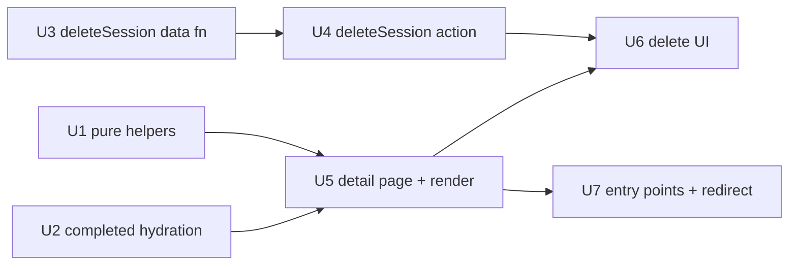

# feat: Session detail page — read-only completed-session retrospective

## Overview

A completed workout session in `apps/swole` has no viewable page today. The home
"Recent sessions" strip mislinks each session to the routine *editor*
(`/routines/{id}`), `/session/[id]` shows a neutral "session not active" message
once a session is completed, and the `/complete` celebration auto-redirects home
and is never revisitable.

This plan adds a **read-only, immutable retrospective** of one completed session.
It reuses the `/session/[id]` route, which branches: *active* → the existing
runner (unchanged), *completed* → a new detail page. The `/complete` flow lands
here instead of redirecting home, and the two mislinked entry points are
retargeted. The only mutation is a guarded `deleteSession` — blocked when the
session earned a `session_progression`, mirroring the existing "undo blocked by
committed progression" rule.

No new mutation surface is added to completed-session logs; the existing
immutability invariants (`SessionAlreadyCompleted`, `UndoBlockedBySessionCompleted`)
stay intact.

---

## Problem Frame

Per the origin requirements doc (`apps/swole/docs/brainstorms/session-detail-page-requirements.md`),
there is no way to look back at a single finished workout in full:

- The per-exercise stats journal (`/stats/[exerciseId]`) answers *"how has this
  exercise progressed?"* — not *"how did this whole workout go?"*
- `/session/[id]` returns `null` from `buildSessionState` for any non-active
  session and falls into the neutral `SessionNotActive` message
  (`apps/swole/src/app/session/[id]/page.tsx:22-26`).
- The recent-sessions strip links to `/routines/{routine.id}` — a dead-end editor
  (`apps/swole/src/components/home/RecentSessionsStrip.tsx:26`).

The goal is the permanent record you land on after finishing, and return to from
history.

---

## Requirements Trace

- R1. Tapping a recent session (home strip) or a journal date header (stats) opens
  its full retrospective — no more routine-editor dead-end.
- R2. Every set from a completed session is visible, correctly formatted per
  exercise type (weighted / bodyweight / time-based / cardio), with hit/shortfall
  coloring reused from `formatSetRow`.
- R3. Finishing a workout lands on this same revisitable page (not home).
- R4. Deleting an accidental (no-progression) session works; deleting a session
  that earned a `session_progression` is blocked with a clear message.
- R5. No new mutation surface on completed-session logs; existing immutability
  invariants stay intact.
- R6. Header shows routine name, date (absolute + relative), session duration
  (`completedAt − startedAt`), and totals (# exercises touched, # sets, total
  weighted volume).
- R7. Body is grouped by exercise in routine order; archived exercises still
  render (read-only).
- R8. All states render correctly: no sets logged, degraded hydration
  (`failedSetLogIds` non-empty), archived routine/exercise, active id (runner
  unchanged), unknown / non-integer id (neutral message).

<!-- Origin doc is a Standard brainstorm (decisions table + states/scope), not an
     Actors/Flows/Acceptance-Examples document. No A/F/AE sub-blocks to carry forward. -->

---

## Scope Boundaries

- Per-set or per-session editing — **immutable by decision**.
- Progression / starting-weight recomputation from edits.
- Share, export, or "repeat this workout."
- Heatmap-cell and per-routine-history entry points (deferred; revisit later).
- Per-session PR detection in the header.
- Changing the active-session runner or the `/complete` progression-prompt logic
  (only the terminal redirect changes).

---

## Context & Research

### Relevant Code and Patterns

**Route + runner**
- `apps/swole/src/app/session/[id]/page.tsx` — the branch point. Currently:
  non-integer/≤0 → `SessionNotActive`; `buildSessionState` null → `SessionNotActive`.
  `params` is a `Promise` (Next 16 async params) — `searchParams` will be too.
- `apps/swole/src/components/session/SessionRunner.tsx` — active UI, **unchanged**.
- `apps/swole/src/components/session/SessionNotActive.tsx` — reused for the
  unknown-id branch.

**Hydration + data layer (Drizzle / better-sqlite3, SQLite)**
- `apps/swole/src/db/hydration.ts` — `buildSessionState({ sessionId })` composes
  `getActiveSession` (null if completed) + `getRoutineWithExercises({ includeArchived: true })`
  + `getSetLogsForSession` + `getProgressionsForSession`, with a per-row
  `try/catch` populating `failedSetLogIds`. **Active-only; do not change its
  default** — `/complete` page and the home banner depend on active semantics.
- `apps/swole/src/db/sessions.ts` — `getSession` (completion-agnostic, `:20`),
  `getActiveSession` (`:46`), `listRecentCompletedSessions` (`:93`).
- `apps/swole/src/db/setLogs.ts` — `getSetLogsForSession` (completion-agnostic,
  ordered `loggedAt, id`); the committed-progression guard in `undoLastSetLog`
  (`:176-188`) is the exact shape the delete guard mirrors.
- `apps/swole/src/db/routines.ts` — `getRoutine` (name, `:59`),
  `getRoutineWithExercises({ id, includeArchived? })` (`:76`, orders by
  `orderInRoutine`); `deleteRoutine` (`:422-457`) is the guard+transaction template.
- `apps/swole/src/db/progressions.ts` — `getProgressionsForSession` filters
  `WHERE sessionId = ?` (verified `:39-48`); `session_progression` rows are written
  with the earning session's id (`:101-108`).

**Formatting (all in `apps/swole/src/lib/format.ts`, NOT `stats.ts`)**
- `formatSetRow(setLog: SetLogRow, exercise: ExerciseRow): SetRowParts` (`:432`) —
  takes **raw DB rows**, returns `{ kind:'plain' } | { kind:'shortfall' }`. Render
  pattern to copy: `apps/swole/src/components/stats/HistoryJournal.tsx:42-62`.
- `formatExerciseConfig(exercise: Exercise): string` (`:68`) — takes the **FSM
  `Exercise`** type; map a row via `toExercise` (`apps/swole/src/db/mappers.ts:59`).
- `formatJournalSessionDate` (`:406`), `formatRelativeDay(at, now)` (`:372`),
  `formatWeight` (`:352`).

**Mutation envelope**
- `ActionResult<T> = { ok: true; row: T } | { ok: false; kind: DataLayerErrorKind; code: string }`
  (`apps/swole/src/actions/sessions.ts:14-16`); `kind` ∈
  `validation | not_found | conflict | forbidden_transition | hydration`
  (`apps/swole/src/db/errors.ts`); `code` is the error class name.
- `deleteRoutine` action + `mapDeleteRoutineError` (`apps/swole/src/lib/format.ts:161-178`)
  and `ArchivedRoutineDetailActions.tsx` (confirm → call → `if (!result.ok)` map+toast;
  `ok` → `router.push`) are the templates for the delete action and UI.

**Tests (Jest + ts-jest, co-located `__tests__/`)**
- Data-fn pattern: `jest.mock('src/db/client', …)` + per-test `createTestDb()`
  (`apps/swole/src/db/test-db.ts`); guards via `await expect(fn).rejects.toThrow(/…/)`.
- Action pattern adds `jest.mock('next/cache', …)`.
- Guard-test exemplar to clone for `deleteSession`:
  `apps/swole/src/db/__tests__/setLogs.spec.ts:322-337` (refusal + children-untouched,
  plus the negative case). Atomicity exemplar:
  `apps/swole/src/db/__tests__/routines.spec.ts:557-588`.

### Institutional Learnings

- **Two delete guards are independent invariants** (auto-memory
  `swole-delete-needs-archived-guard.md`): `deleteRoutine` guards on `archivedAt`
  (state/product rule) *separately* from the zero-history FK gate, because a fresh
  routine also has zero history. For `deleteSession` the analogue is a **state
  guard (`completedAt != null`)** distinct from the **FK-safety guard (no
  `session_progression` row)**. Do not let "no progression" stand in for "this
  session is in a deletable state." → drives **Key Decision 3**.
- **`BEGIN IMMEDIATE` for read-then-write mutations**
  (`docs/solutions/conventions/begin-immediate-for-read-then-write-mutations-2026-05-27.md`):
  wrap `deleteSession` in `db.transaction(cb, { behavior: 'immediate' })`; every DB
  access via `tx` (a stray outer-`db` call commits unconditionally and bypasses
  rollback); re-read the progression guard *inside* the tx so it can't race a
  concurrent commit. → drives **Key Decision 4**.
- **Pure FSM core / historically-missed inputs**
  (`docs/solutions/architecture-patterns/pure-fsm-core-for-stateful-domain-logic-2026-05-27.md`):
  reuse shared derivations rather than re-implementing display rules; and verify
  `Failed` / `Skipped` set logs render — `classifyPostSession` once shipped ignoring
  `Failed` logs. → drives **R2 test scenarios** and **Key Decision 2**.
- **Type guards over `!`/`as` on nullable rows**
  (`docs/solutions/conventions/type-guards-over-nonnull-assertions-on-db-rows-2026-05-30.md`):
  encode "completed" in the return type (`completedAt: Date`), mirroring the
  existing `CompletedSessionLogEntry`; keep shared grouping helpers generic
  (`<S extends SessionRow>`) so the narrowed type survives. → drives **Key Decision 1**.

### External References

- None. External research was skipped: strong local patterns exist for every
  surface this plan touches, and there is no high-risk external contract (local
  SQLite read + a guarded delete; no auth, payments, or third-party APIs).

---

## Key Technical Decisions

1. **Add a sibling `buildCompletedSessionState`, do not flag `buildSessionState`.**
   A new function keeps the active path (and its `/complete`-page and home-banner
   consumers) byte-for-byte unchanged, and lets the completed read return a type
   that encodes `completedAt: Date`. Avoids a boolean-trap parameter. *(learning:
   type-guards; researcher flag #4)*
2. **Render from raw `SetLogRow[]` + `ExerciseRow[]`, not the FSM `sessionState`.**
   `formatSetRow` consumes raw rows (the FSM `SetLog` is incompatible); this matches
   `HistoryJournal` exactly and reuses the shortfall coloring without conversion.
   `formatExerciseConfig` is fed a row mapped via `toExercise`. *(researcher flag #2)*
3. **`deleteSession` carries two independent guards:** state guard
   `completedAt != null` (else `SessionNotCompleted`) **and** FK-safety guard
   "no `session_progression` row references this session" (else
   `SessionHasProgression`). The state guard means the live runner's session can
   never be deleted out from under it; the accidental-session path is already
   covered (start → finish-early → completed no-progression session → deletable).
   *(learning: two-guard rule)*
4. **`deleteSession` runs under `BEGIN IMMEDIATE`,** all access via `tx`, guard
   re-read inside the tx, leaf-first delete (`set_logs` → `sessions`). The
   `progressions.sessionId` FK (`restrict`) is the *true* structural backstop; the
   reason-filtered guard (U3 step 3) is co-extensive with it only by the
   current-write-path invariant (U3), so U4 maps an unexpected FK-abort to a typed
   error rather than a 500. *(learning: BEGIN IMMEDIATE; pattern: `deleteRoutine`)*
5. **Degraded-hydration parity via a shared row-validation helper.** Extract the
   per-row validation that produces `failedSetLogIds` so both `buildSessionState`
   and `buildCompletedSessionState` detect malformed rows identically; the detail
   page renders the valid rows and shows a degraded notice when
   `failedSetLogIds.length > 0`. *(R8; mirror the runner)*
6. **One-time "Session complete" accent via a `?finished=1` search param.** The
   `/complete` redirect appends it; the detail page shows a subtle trophy accent
   (reuse `EmojiEventsOutlinedIcon` + `!text-orange-400` from `CompleteRunner`) only
   when present. Stateless and revisit-safe — entries from home/stats omit the
   param and land plainly. No blocking animation. *(open question 1, settled)*
7. **Weighted volume only** in the header (`Σ weight × actualReps` over weighted
   sets). Set/exercise counts cover the non-weighted types. *(open question 2,
   settled)*
8. **Page-level `getSession` branch** distinguishes the three cases explicitly
   (unknown → `SessionNotActive`; active → runner; completed → detail). The extra
   single-PK read is negligible under `force-dynamic`. *(researcher flag #6)*
9. **New pure helpers** (`weightedVolume`, `formatSessionDuration`,
   `groupSetLogsByExercise`, plus view predicates `classifySessionView` /
   `canDeleteSession`) — none exist today. Extracting them makes the page's logic
   unit-testable, leaving the page/components as thin rendering shells. *(repo
   testing philosophy; FSM-core learning)*
10. **Hide the delete affordance when the session has a progression** (UX), but the
    server guard is authoritative (defense-in-depth). For a completed session
    `hasProgression` is stable (no new progressions can be committed post-completion),
    so the race is effectively nil; the action still maps `SessionHasProgression`
    to a toast if it ever fires.

---

## Open Questions

### Resolved During Planning

- **First-arrival accent (origin open Q1):** Yes — subtle one-time trophy accent,
  driven by `?finished=1` from the `/complete` redirect; plain on all other entries;
  no blocking animation. *(Key Decision 6)*
- **Volume for non-weighted types (origin open Q2):** Weighted volume only; counts
  cover the rest. *(Key Decision 7)*
- **Should `deleteSession` also guard session state?** Yes — guard
  `completedAt != null`. Surfaced by the two-guard learning; doesn't change product
  behavior (UI only ever deletes completed sessions) but prevents deleting a live
  session via a hand-called action. *(Key Decision 3)*

### Deferred to Implementation

- Exact `revalidatePath` set after delete (`/` is required for the recent strip;
  `/stats` and `/stats/[exerciseId]` likely, but pages are `force-dynamic` so this
  is mostly belt-and-suspenders). Mirror `deleteRoutine`'s revalidation set.
- Whether an existing elapsed-time formatter can be reused before authoring
  `formatSessionDuration`.
- Exact confirm-dialog mechanism — reuse the MUI dialog/confirm pattern already in
  `ArchivedRoutineDetailActions.tsx`.
- Whether the degraded notice reuses `DegradedStrip` (dismissible client island) or
  renders a static server-side equivalent — the *copy* is fixed in U5; only the
  component mechanism is open.
- Display formatting of the volume number (thousands separator vs. plain
  `formatWeight`).
- Whether to extend `prd-walkthrough.spec.ts` or add a focused integration spec for
  the completed-read + delete path (see U2 / U3 / U5 test scenarios).

---

## High-Level Technical Design

> *This illustrates the intended approach and is directional guidance for review,
> not implementation specification. The implementing agent should treat it as
> context, not code to reproduce.*

**Route-branch decision matrix** (`apps/swole/src/app/session/[id]/page.tsx`):

| `id` input            | session row (`getSession`)     | Render                          |
|-----------------------|--------------------------------|---------------------------------|
| non-integer or ≤ 0    | (not queried)                  | `SessionNotActive`              |
| valid int             | `null` (not found)             | `SessionNotActive`              |
| valid int             | `completedAt == null` (active) | `SessionRunner` (**unchanged**) |
| valid int             | `completedAt` set (completed)  | `SessionDetail` (new)           |

**Hydration composition** — `buildCompletedSessionState({ sessionId })` reuses the
same four-query shape as `buildSessionState`, swapping `getActiveSession` →
`getSession` and returning raw rows tuned for `formatSetRow`:

    getSession ─┬─ null or completedAt == null ─→ return null
                └─ completed ─→ getRoutineWithExercises({ includeArchived: true })
                               + getSetLogsForSession   (validate rows → failedSetLogIds)
                               + getProgressionsForSession
                               → { session: CompletedSessionRow, routine, exercises,
                                   setLogs (valid), progressions, failedSetLogIds }

**Implementation-unit dependency graph:**

U1, U2, U3 are independent and can land in parallel.

---

## Implementation Units

- U1. **Pure display helpers + view predicates**

**Goal:** Author the pure, unit-tested functions the detail page derives from, so
the page/components stay thin rendering shells.

**Requirements:** R2, R6, R7, R8

**Dependencies:** None

**Files:**
- Modify: `apps/swole/src/lib/stats.ts` (add `weightedVolume`, `groupSetLogsByExercise`)
- Modify: `apps/swole/src/lib/format.ts` (add `formatSessionDuration`)
- Create: `apps/swole/src/lib/session-detail.ts` (`classifySessionView`, `canDeleteSession`)
- Test: `apps/swole/src/lib/__tests__/stats.spec.ts` (extend)
- Test: `apps/swole/src/lib/__tests__/format.spec.ts` (extend)
- Test: `apps/swole/src/lib/__tests__/session-detail.spec.ts` (create)

**Approach:**
- `weightedVolume(setLogs: SetLogRow[]): number` — sum `weight * actualReps` over
  rows where both are non-null (naturally selects weighted sets that recorded work;
  bodyweight/time-based/cardio carry null `weight`; skipped weighted sets carry null
  `actualReps`).
- `groupSetLogsByExercise(setLogs, exercises): Array<{ exercise: ExerciseRow; logs: SetLogRow[] }>`
  — iterate `exercises` (already `orderInRoutine`), attach each exercise's logs in
  chronological order; **omit exercises with zero logs** (drives "# exercises
  touched"). Keep the signature generic enough that archived exercise rows (passed
  in via `includeArchived`) are included.
- `formatSessionDuration(startedAt: Date, completedAt: Date): string` — `"47m"`,
  `"1h 12m"`, sub-minute `"52s"`; guard zero/negative → `"0m"`.
- `classifySessionView(session: SessionRow | null): 'unknown' | 'active' | 'completed'`.
- `canDeleteSession(progressions: ProgressionRow[]): boolean` —
  `!progressions.some(p => p.reason === 'session_progression')`.

**Patterns to follow:** existing `heaviestLogged` / `estimatedOneRepMax` /
`groupSetLogsBySession` in `stats.ts`; `formatWeight` / `formatRelativeDay` in
`format.ts`. Keep helpers generic per the type-guards learning (no `!`/`as`).

**Test scenarios:**
- Happy (`weightedVolume`): 3 weighted sets (100×10, 100×8, 105×10) → 2850.
- Happy (`weightedVolume`): a weighted **Failed** set with `weight` + `actualReps`
  (100×6) is included. *(FSM-core learning: exercise the historically-missed input.)*
- Edge (`weightedVolume`): empty input → 0; bodyweight/time-based/cardio rows
  (null `weight`) → 0; weighted row with null `actualReps` (skipped) → excluded;
  mixed weighted + bodyweight → only weighted summed.
- Happy (`groupSetLogsByExercise`): logs interleaved across two exercises return
  grouped in **routine order** (not log order).
- Edge (`groupSetLogsByExercise`): exercise with zero logs omitted; archived
  exercise row with logs still included; empty input → `[]`.
- Happy (`formatSessionDuration`): 47 min → `"47m"`; 1h12m → `"1h 12m"`.
- Edge (`formatSessionDuration`): < 1 min → seconds; `completedAt == startedAt`
  → `"0m"`; negative delta guarded.
- Happy (`classifySessionView`): null → `'unknown'`; `completedAt == null` →
  `'active'`; `completedAt` set → `'completed'`.
- Happy/Edge (`canDeleteSession`): a `session_progression` row → `false`; only
  `initial`/`manual_edit` (or empty) → `true`.

**Verification:** `pnpm test` passes for the three spec files; helpers are pure
(no I/O, no `server-only` import).

---

- U2. **Completed-capable session hydration (`buildCompletedSessionState`)**

**Goal:** A completed-session read composed from existing data functions, returning
raw rows tuned for `formatSetRow` and preserving degraded-hydration parity.

**Requirements:** R2, R6, R7, R8

**Dependencies:** None

**Files:**
- Modify: `apps/swole/src/db/hydration.ts` (add `buildCompletedSessionState`; extract
  shared per-row validation used by both hydration functions)
- Modify: `apps/swole/src/db/types.ts` (add `CompletedSessionRow = SessionRow & { completedAt: Date }`)
- Test: `apps/swole/src/db/__tests__/hydration.spec.ts` (extend)

**Approach:**
- Fetch via `getSession`; return `null` when not found **or** `completedAt == null`
  (not completed). Otherwise compose `getRoutineWithExercises({ includeArchived: true })`
  + `getSetLogsForSession` + `getProgressionsForSession`.
- **Preserve `includeArchived: true`** — load-bearing so logs referencing a
  later-archived exercise still resolve (hydration never silently drops logs).
- Validate each set-log row with the **same** logic `buildSessionState` uses
  (extract a shared internal helper) so `failedSetLogIds` is identical across both
  paths; return only valid raw `SetLogRow[]` for display.
- Return `{ session: CompletedSessionRow, routine: RoutineRow, exercises: ExerciseRow[]
  (orderInRoutine), setLogs: SetLogRow[] (valid), progressions: ProgressionRow[],
  failedSetLogIds: number[] }`. Do **not** build the FSM `sessionState` — the page
  renders from raw rows.
- **Leave `buildSessionState` (active) unchanged**; its pinned "returns null for
  completed" behavior stays valid.

**Execution note:** Add the completed-read test alongside the change; keep the
existing active-path tests green.

**Patterns to follow:** `buildSessionState` composition + `failedSetLogIds`
try/catch (`hydration.ts`); the `CompletedSessionLogEntry` query-guaranteed-type
precedent for encoding `completedAt: Date`.

**Test scenarios:**
- Happy: completed session with logs → bundle with `session.completedAt` a `Date`,
  raw `setLogs`, `exercises` in routine order, `failedSetLogIds: []`.
- Edge: active session → `null`; unknown id → `null`.
- Edge: completed session referencing an **archived** exercise → exercise present
  in `exercises`, its logs returned. *(R7)*
- Edge: completed session with zero logs (finished early) → bundle with empty
  `setLogs`.
- Error/degraded: a malformed set-log row → its id in `failedSetLogIds`, excluded
  from `setLogs`, rest of the bundle intact. *(R8; mirror the runner)*
- Invariant: `buildSessionState` still returns `null` for a completed session
  (existing pinned test unchanged).
- Integration: FSM round-trip — apply actions, persist via `appendSetLog`, complete
  the session, then `buildCompletedSessionState` returns the logged sets.

**Verification:** `hydration.spec.ts` passes; active-path specs unchanged; a
completed session referencing an archived exercise hydrates without dropping logs.

---

- U3. **`deleteSession` data function (guarded, transactional) + error classes**

**Goal:** A transactional, doubly-guarded delete of a completed no-progression
session and its set logs.

**Requirements:** R4, R5

**Dependencies:** None

**Files:**
- Modify: `apps/swole/src/db/sessions.ts` (add `deleteSession`)
- Modify: `apps/swole/src/db/errors.ts` (add `SessionNotCompleted`, `SessionHasProgression`,
  both `kind: 'forbidden_transition'`)
- Test: `apps/swole/src/db/__tests__/sessions.spec.ts` (extend)

**Approach:**
- `db.transaction(tx => { … }, { behavior: 'immediate' })`. Inside, **all access via
  `tx`**:
  1. Read the session → `NotFoundError('Session', id)` if absent.
  2. State guard: `completedAt == null` → throw `SessionNotCompleted`.
  3. FK-safety guard: count `progressions` where `sessionId == id AND reason ==
     'session_progression'`; if > 0 → throw `SessionHasProgression`. (Re-read inside
     the tx so it can't race a concurrent commit.)
  4. Leaf-first delete: `tx.delete(setLogs).where(eq(sessionId))` then
     `tx.delete(sessions).where(eq(id))`.
- The `progressions.sessionId` FK (`restrict`) is the structural backstop.
- **Load-bearing invariant:** step 3's reason-filtered guard is co-extensive with
  that FK *only because* `commitProgressionDecision` is the sole writer of a non-null
  `sessionId` (always `reason='session_progression'`); the `initial`/`manual_edit`
  writers omit `sessionId`. State this in a code comment so a future writer that sets
  `sessionId` with another reason knows the guard must be widened — otherwise
  `tx.delete(sessions)` FK-aborts (mapped defensively in U4).
- Follow the catch/log/rethrow envelope at the data layer
  (`commitProgressionDecision` / `deleteRoutine`): only typed `DataLayerError`
  subclasses are meaningful; everything else rethrows.

**Execution note:** Guard-first — this is an irreversible delete. Write the refusal
tests (including children-untouched on refusal) and the atomicity test alongside the
implementation.

**Patterns to follow:** `deleteRoutine` guard + `{ behavior: 'immediate' }` +
leaf-first delete (`routines.ts:422-457`); the committed-progression count in
`undoLastSetLog` (`setLogs.ts:176-188`); the `RoutineNotArchived` / `RoutineHasHistory`
error-class shape (`errors.ts`).

**Test scenarios:**
- Happy: completed session, no progression → session row and its `set_logs` deleted
  (`getSession` → null; `getSetLogsForSession` → `[]`).
- Error: completed session with a `session_progression` row → rejects
  (`SessionHasProgression`); **session row and set_logs untouched**. *(clone
  `setLogs.spec.ts:322-335`)*
- Negative (reason-discrimination — keep it non-vacuous): seed a `session_progression`
  row for a **different** session **plus** `initial`/`manual_edit` rows (null
  `sessionId`) for this session → this session still deletes. Do **not** clone
  `setLogs.spec.ts:337` literally: its `sessionId=null` rows never exercise
  reason-discrimination, and a `{reason:'initial', sessionId}` row for this session
  would FK-abort `tx.delete(sessions)` — non-`session_progression` rows must keep a
  null `sessionId`.
- Error: active session (`completedAt == null`) → rejects (`SessionNotCompleted`);
  untouched.
- Error: unknown id → rejects (`NotFoundError`).
- Atomicity: a forced mid-transaction failure leaves no partial delete (orphan
  set_logs or half-deleted session). *(mirror `routines.spec.ts:557-588`)*

**Verification:** `sessions.spec.ts` passes including the refusal + atomicity cases;
no path can delete a session that earned a progression or an active session.

---

- U4. **`deleteSession` server action + error mapper**

**Goal:** A Next-aware action wrapper returning the `ActionResult` envelope, plus a
UI-facing error mapper.

**Requirements:** R4

**Dependencies:** U3

**Files:**
- Modify: `apps/swole/src/actions/sessions.ts` (add `deleteSession` action)
- Modify: `apps/swole/src/lib/format.ts` (add `mapDeleteSessionError`)
- Test: `apps/swole/src/db/__tests__/` or `apps/swole/src/actions/__tests__/sessions.spec.ts`
  (action; `jest.mock('next/cache', …)`)
- Test: `apps/swole/src/lib/__tests__/format.spec.ts` (mapper; extend)

**Approach:**
- Action: `'use server'`; `try { await deleteSession(args); revalidatePath('/'); …;
  return { ok: true, row: undefined } } catch (err) { if (err instanceof
  DataLayerError) return { ok: false, kind: err.kind, code: err.constructor.name };
  throw err }`. Revalidate `/` (and `/stats` per deferred decision).
- **Defensive FK-abort mapping:** before the generic rethrow, detect a SQLite
  foreign-key constraint failure (`SQLITE_CONSTRAINT_FOREIGNKEY`) and map it to a
  typed `DataLayerError` (e.g. `SessionHasProgression`) so a future guard/FK
  divergence surfaces as a clean toast, not a 500 to `error.tsx`. Unreachable today
  per the U3 invariant; it's a backstop.
- `mapDeleteSessionError(result): { message: string; severity }` mirroring
  `mapDeleteRoutineError`:
  - `SessionHasProgression` → "This session recorded a progression and can't be
    deleted."
  - `SessionNotCompleted` → "Only completed sessions can be deleted."
  - `NotFoundError` → "Session not found."

**Patterns to follow:** `deleteRoutine` action (`actions/routines.ts:112-126`) and
`mapDeleteRoutineError` (`format.ts:161-178`); `ActionResult` shape
(`actions/sessions.ts:14-16`).

**Test scenarios:**
- Happy: deletable session → `{ ok: true }`; `revalidatePath('/')` called.
- Error: progression present → `{ ok: false, kind: 'forbidden_transition', code:
  'SessionHasProgression' }`.
- Error: active session → `{ ok: false, kind: 'forbidden_transition', code:
  'SessionNotCompleted' }`.
- Error: unknown id → `{ ok: false, kind: 'not_found', code: 'NotFoundError' }`.
- Invariant: a non-`DataLayerError` rethrows (not swallowed into the envelope).
- Mapper: each `code` → expected `{ message, severity }`.

**Verification:** action specs pass with `next/cache` mocked; mapper unit tests
cover every code path.

---

- U5. **Session detail page branching + `SessionDetail` render**

**Goal:** Branch `/session/[id]` to a read-only retrospective for completed
sessions and render header + body + states + one-time accent.

**Requirements:** R2, R3, R6, R7, R8

**Dependencies:** U1, U2

**Files:**
- Modify: `apps/swole/src/app/session/[id]/page.tsx` (add `searchParams`; `getSession`
  → `classifySessionView` branch; active path unchanged; completed →
  `buildCompletedSessionState` → `SessionDetail`)
- Create: `apps/swole/src/components/session/SessionDetail.tsx` (server presentational)
- Test: `apps/swole/src/db/__tests__/__integration__/` (focused completed-read render
  contract — see scenarios)

**Approach:**
- Page: keep the non-integer/≤0 guard. Then `const session = await getSession({ id });
  switch (classifySessionView(session))` — `'unknown'` → `SessionNotActive`;
  `'active'` → existing `buildSessionState` + `SessionRunner` path (verbatim);
  `'completed'` → `buildCompletedSessionState` (defensive `null` → `SessionNotActive`)
  → `SessionDetail`. Read `searchParams` (a `Promise`) for `finished === '1'`.
- `SessionDetail` props: the completed bundle + `routineName` + derived
  `volume`/counts + `showAccent`. Header: name, `formatJournalSessionDate(completedAt)`
  + `formatRelativeDay(completedAt, now)`, `formatSessionDuration`, `# exercises`
  (`groupSetLogsByExercise(...).length`), `# sets` (`setLogs.length`),
  `weightedVolume`. Body: `groupSetLogsByExercise` → per exercise:
  `formatExerciseConfig(toExercise(exerciseRow))` + each `formatSetRow(row, exerciseRow)`
  rendered with the shortfall/plain branch copied from `HistoryJournal.tsx:42-62`.
- States: empty `setLogs` → "No sets logged this session." (header still renders);
  `failedSetLogIds.length > 0` → a degraded notice with detail-page-specific copy
  ("Some sets from this session couldn't be loaded and aren't shown." — **not** the
  runner's "your position may be off," which is meaningless on a read-only page),
  rest renders; archived routine/exercise → renders read-only (data already
  supports it).
- One-time accent: when `finished === '1'`, render a subtle trophy header flourish
  (`EmojiEventsOutlinedIcon` + `!text-orange-400`), no blocking animation.
- Back affordance: a back/home control in the header (mirror `SessionNotActive`'s
  "Back to home" `<Button href="/">`) — entries from home/stats otherwise have no
  in-app return path.
- Embed `<SessionDetailActions>` (U6) in the footer region.

**Technical design:** *(directional)* the page is a `switch` over
`classifySessionView`; `SessionDetail` is a presentational server component over
tested derivations — no business logic lives in JSX.

**Patterns to follow:** `HistoryJournal.tsx` (set-row render + shortfall coloring);
existing page structure in `session/[id]/page.tsx`; `cns()` for class composition
per repo convention.

**Test scenarios:**
- Integration: a seeded completed session → the page's data path
  (`buildCompletedSessionState` + `groupSetLogsByExercise` + `weightedVolume`)
  yields the expected `# exercises` / `# sets` / volume and per-exercise grouped
  rows, including a `Failed` set rendered as a shortfall. *(R2, R6, R7 — automatable
  via the data contract.)*
- Integration: a completed session referencing an archived exercise renders that
  exercise's block. *(R7)*
- Manual (rendering): the four route states (non-integer → neutral; unknown →
  neutral; active → runner; completed → detail) render correctly. *(R8)*
- Manual: empty-session, degraded (`failedSetLogIds`), and accent
  (`?finished=1` shows; bare URL omits) states. *(R8, R3)*

Note: the testable logic was deliberately extracted to U1/U2 (`pure helpers` +
hydration); `SessionDetail` itself is presentational and the repo has no React
component-test harness, so its rendering is verified via the integration data
contract above + manual browser check.

**Verification:** the integration spec asserts header counts/volume and grouped
body for a known session; a manual pass confirms all four route states and the
empty/degraded/accent renders.

---

- U6. **`SessionDetailActions` delete UI (confirm + result handling)**

**Goal:** A guarded delete affordance with confirmation, error toasts, and
success redirect.

**Requirements:** R4

**Dependencies:** U4, U5

**Files:**
- Create: `apps/swole/src/components/session/SessionDetailActions.tsx` (`'use client'`)
- Test: covered by `canDeleteSession` (U1) + the action specs (U4); UI flow verified
  manually (no component-test harness)

**Approach:**
- Compute `canDeleteSession(progressions)` (from U1). When `false`, render no delete
  button — show a small caption ("This session recorded a progression and can't be
  deleted."). When `true`, render a delete button → confirm dialog →
  `deleteSession({ sessionId })`.
- On `!result.ok`: `mapDeleteSessionError(result)` → `showToast(message, severity)`
  (`useToast`). On `ok`: `router.push('/')`.
- Disable the delete button and the dialog's confirm button while the action is
  in-flight (mirror `ArchivedRoutineDetailActions`' `useTransition` / `isPending`) to
  prevent a double-submit; close the dialog and redirect on success.
- Server guard remains authoritative; the rare race (progression committed between
  render and click — effectively impossible for a completed session) surfaces as the
  `SessionHasProgression` toast.

**Patterns to follow:** `ArchivedRoutineDetailActions.tsx` (confirm → action →
`if (!result.ok)` map+toast; `ok` → `router.push`); `useToast`
(`apps/swole/src/hooks/use-toast.ts`).

**Test scenarios:**
- Covered (U1): `canDeleteSession` gates the affordance (progression → hidden +
  caption; none → button shown).
- Covered (U4): action success/error envelopes and mapped messages.
- Manual: confirm-then-delete redirects home; cancel aborts; a session with a
  progression shows the caption, not the button.

**Verification:** deleting a no-progression session returns home; a
progression-bearing session offers no delete button (and the action would refuse if
called).

---

- U7. **Entry points + complete-flow redirect**

**Goal:** Point the recent strip and stats journal at the new page, and land the
`/complete` flow here.

**Requirements:** R1, R3

**Dependencies:** U5

**Files:**
- Modify: `apps/swole/src/components/home/RecentSessionsStrip.tsx` (link `/routines/{routine.id}`
  → `/session/{session.id}`)
- Modify: `apps/swole/src/components/stats/HistoryJournal.tsx` (wrap the date header
  in `<Link href={/session/{session.id}}>`)
- Modify: `apps/swole/src/components/session/CompleteRunner.tsx` (both `router.push('/')`
  sites → `router.push('/session/{sessionId}?finished=1')`)

**Approach:**
- Recent strip (`:26`): `session.id` is already in the row data; swap the href.
- Journal (`:32-35`): the date header is a plain `
`; `session.id` is available on
  the group; wrap in `next/link`.
- `CompleteRunner` (`:52` and `:67`): both terminal redirects gain the
  `?finished=1` param so first arrival shows the one-time accent. For the zero-prompt
  path (`:64-69`), also drop the 1500ms celebration dwell and navigate immediately —
  the detail page now carries the trophy accent, so keeping the dwell would
  double-celebrate (and conflicts with KD6's "no blocking animation"); the prompt
  path (`:52`) already navigates as soon as the last progression commits.

**Patterns to follow:** existing `next/link` usage in the strip; the established
`router.push` calls in `CompleteRunner`.

**Test scenarios:**
- Manual / integration: a recent-strip tap opens the retrospective (not the routine
  editor). *(R1)*
- Manual / integration: a journal date-header tap opens that session's page. *(R1)*
- Manual: finishing a workout (both the prompt path and the zero-prompt path) lands
  on `/session/{id}?finished=1` with the accent. *(R3)*
- If a `CompleteRunner` test exists, assert both redirects target the session URL.

**Verification:** all three entry points reach the detail page; the `/complete` flow
no longer returns home.

---

## System-Wide Impact

- **Interaction graph:** `/session/[id]` now serves two render modes (runner /
  detail); the `/complete` redirect target changes; the home strip and stats journal
  links are retargeted. `buildSessionState` (active) and the `/complete` page are
  deliberately untouched.
- **Error propagation:** `deleteSession` → `ActionResult` envelope → `mapDeleteSessionError`
  → toast; success → client redirect to `/`. Typed `DataLayerError` subclasses only;
  others rethrow to `error.tsx`.
- **State lifecycle risks:** delete is transactional (`IMMEDIATE`), leaf-first
  (`set_logs` → session), guarded on completed-state + no-progression, with the FK
  `restrict` backstop. Irreversible — guard- and atomicity-tested.
- **API surface parity:** `deleteSession` mirrors `deleteRoutine`'s envelope and
  two-guard structure; `mapDeleteSessionError` mirrors `mapDeleteRoutineError`.
- **Integration coverage:** completed read with an archived exercise (U2/U5);
  delete refusal when a progression exists (U3) — both have automatable coverage.
- **Unchanged invariants:** `buildSessionState` active semantics; `appendSetLog` /
  `undoLastSetLog` rejection on completed sessions (`SessionAlreadyCompleted`,
  `UndoBlockedBySessionCompleted`); the one-active-session-per-routine partial index;
  no per-set/session editing surface.

---

## Risks & Dependencies

| Risk | Mitigation |
|------|------------|
| Changing `buildSessionState` would break `/complete` and the home banner (active-only consumers). | Add a sibling `buildCompletedSessionState`; leave the active function unchanged (Key Decision 1). |
| Deleting a live (active) session out from under the runner. | State guard `completedAt != null` → `SessionNotCompleted` (Key Decision 3). |
| Deleting a session that earned a progression (data loss / orphaned canonical write). | FK-safety guard + `progressions` FK `restrict` backstop; refusal test asserts children untouched (U3). |
| Partial delete on mid-transaction failure. | `BEGIN IMMEDIATE`, all access via `tx`, leaf-first order; atomicity test mirrors `routines.spec.ts:557-588` (U3, Key Decision 4). |
| Malformed set-log rows on read break the page. | Shared row validation → `failedSetLogIds`; valid rows still render with a degraded notice (Key Decision 5, U2/U5). |
| Type confusion: `formatSetRow` wants rows, `formatExerciseConfig` wants the FSM `Exercise`. | Render from raw rows; map per-exercise via `toExercise` (Key Decision 2). |

---

## Documentation / Operational Notes

- No schema migration, no new env vars, no deployment changes — additive code only.
- Once `deleteSession` lands, consider a `/ce-compound` capture generalizing the
  two-guard delete rule (state predicate + FK-safety predicate) beyond `deleteRoutine`,
  per the auto-memory note.

---

## Sources & References

- **Origin document:** `apps/swole/docs/brainstorms/session-detail-page-requirements.md`
- Route/runner: `apps/swole/src/app/session/[id]/page.tsx`,
  `apps/swole/src/components/session/SessionRunner.tsx`,
  `apps/swole/src/components/session/CompleteRunner.tsx`
- Hydration/data: `apps/swole/src/db/hydration.ts`, `apps/swole/src/db/sessions.ts`,
  `apps/swole/src/db/setLogs.ts`, `apps/swole/src/db/progressions.ts`,
  `apps/swole/src/db/routines.ts`
- Formatting: `apps/swole/src/lib/format.ts`,
  `apps/swole/src/components/stats/HistoryJournal.tsx`
- Mutation envelope/template: `apps/swole/src/actions/sessions.ts`,
  `apps/swole/src/actions/routines.ts`, `apps/swole/src/db/errors.ts`,
  `apps/swole/src/components/routines/ArchivedRoutineDetailActions.tsx`
- Learnings: `docs/solutions/conventions/begin-immediate-for-read-then-write-mutations-2026-05-27.md`,
  `docs/solutions/architecture-patterns/pure-fsm-core-for-stateful-domain-logic-2026-05-27.md`,
  `docs/solutions/conventions/type-guards-over-nonnull-assertions-on-db-rows-2026-05-30.md`,
  auto-memory `swole-delete-needs-archived-guard.md`
