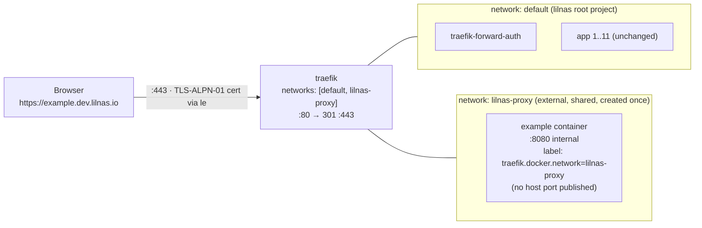

# feat: Expose external dev compose projects via a shared lilnas-proxy network

## Overview

Introduce a documented convention so that **any** Docker Compose project running on the NAS host — including ones *outside* the `~/dev/lilnas` monorepo — can be reached at `https://<name>.dev.lilnas.io` by (1) joining a shared external Docker network (`lilnas-proxy`) and (2) carrying the same Traefik label set every lilnas app already uses.

The implementation is deliberately tiny on the platform side — **attach the production Traefik to a new shared network** — and packages the convention as a **`lilnas` Claude plugin** whose `expose` skill (`/lilnas:expose`) guides an operator through joining the network and applying the labels, alongside a thin human-facing doc and a runnable example. There is no stateful CLI, no Traefik file provider, no host-port publishing, and no host-gateway wiring; the skill is agent-readable knowledge and a guided authoring workflow, not a route-owning daemon. `docker compose up` / `down` remains the entire lifecycle, driven by Traefik's existing Docker provider.

This supersedes the CLI/file-provider design from the `feat/lilnas-expose` branch. Those artifacts (a ~316-line bash CLI, a bats suite, `redirect.yml`, file-provider + host-gateway lines) **never landed on this branch** — research confirms `feat/lilnas-expose-docker` is already clean of them — so cleanup here is verification, not deletion (see origin: `docs/brainstorms/2026-06-24-lilnas-expose-compose-requirements.md`).

---

## Problem Frame

A dev-mode service in a Compose project outside the monorepo (e.g. `~/dev/example`, service `example` on container port `8080`) has no clean way to get an externally reachable URL through the existing Traefik proxy. Today the only options are bad: hand-roll Traefik labels and guess at cross-project networking, or stand up the superseded `lilnas-expose` CLI.

The platform already has every primitive needed — Traefik's Docker provider (`--providers.docker=true`, `exposedByDefault=false`), the `le` TLS-ALPN-01 resolver, the `forward-auth` OAuth middleware, and a `*.lilnas.io` wildcard DNS record that also resolves `*.dev.lilnas.io`. The only missing piece is a **shared network** that lets Traefik discover and route containers from *other* compose projects, plus a documented label convention. This plan supplies exactly that.

It serves one actor: the NAS operator/developer who wants to reach an in-progress dev server from another device or hand a teammate a link.

---

## Requirements Trace

- R1. A named external Docker network `lilnas-proxy` exists and the production Traefik is attached to it, so containers from other compose projects on the host are discoverable and routable by the existing Docker provider. — **U1**
- R2. The production HTTP→HTTPS redirect in `infra/proxy.yml` stays intact (it is the original entrypoint-level redirect; no swap to revert on this branch). — **U1 (verify)**
- R3. Dev routes are served by the existing `le` (TLS-ALPN-01) resolver — no new resolver, no DNS API, no wildcard cert. — **U1, U2**
- R4. A project exposes a service by attaching it to `lilnas-proxy` and adding the standard Traefik label set (Host rule on `websecure` + `tls.certresolver=le` + `loadbalancer.server.port`), identical in shape to every `apps/*/deploy.yml`, **plus** `traefik.docker.network=lilnas-proxy`. — **U2**
- R5. The exposed service does **not** publish a host port; Traefik reaches it over the shared network at its container-internal port. — **U2**
- R6. `<name>` is operator-chosen (defaulting to the service name) and must be a valid DNS label (RFC 1123). The `/lilnas:expose` skill validates it at authoring time (rejecting invalid or reserved names — the active host-hijack guard); there is no compose-runtime enforcement. — **U2**
- R7. *(Origin: documentation + copy-paste example, not an installed command.)* **Amended during planning (2026-06-25):** the convention is delivered as a **`lilnas` Claude plugin** (`/lilnas:expose`) plus a human-facing doc and a runnable example. A plugin skill is agent-readable knowledge + a guided authoring workflow — it owns no route lifecycle and runs no daemon, so it does not reintroduce the stateful CLI / lingering-route problem the origin rejected (see Key Technical Decisions; origin doc carries a dated forward-pointer). — **U2, U3**
- R8. `docker compose up` makes a route live within ~1s (Docker provider hot-reload); `docker compose down` removes it automatically. — **U2 (verify)**
- R9. Currently-exposed dev routes are observable via the existing Traefik dashboard (`traefik.lilnas.io`); no bespoke listing tool. — **U2 (verify)**
- R10. Routes are HTTPS (`https://<name>.dev.lilnas.io`) with a per-host cert issued automatically on first request. — **U2 (verify)**
- R11. Routes are public by default; a project may gate its route behind OAuth by adding the `forward-auth` middleware label. — **U2**
- R12. Existing production (`*.lilnas.io`) and dev (`*.localhost`) routes are unaffected; this adds a network and a convention and changes no existing service's labels. — **U1 (design), verify**

**Origin actors:** A1 (NAS operator / developer — the single user who exposes a project and reaches it from another device).
**Origin flows:** F1 (one-time platform setup), F2 (expose a project), F3 (tear down).
**Origin acceptance examples:** AE1 (covers R4, R5, R8, R10), AE2 (covers R8, R9), AE3 (covers R2, R12), AE4 (covers R11).

---

## Scope Boundaries

- **No stateful CLI / no file provider / no host-gateway.** This supersedes the `feat/lilnas-expose` bash tool, file provider, host-gateway wiring, and `redirect.yml` — all dropped, none present on this branch. The convention *is* packaged as an installable `lilnas` Claude plugin (`/lilnas:expose`), which is distinct from the rejected CLI: the skill owns no route lifecycle and runs no daemon — `docker compose up`/`down` stays the entire lifecycle. (This amends origin R7; see Key Technical Decisions.)
- **Same-host only.** The external compose project must run on the NAS Docker host alongside Traefik. This is not a tunnel for laptops or remote machines; `lilnas-proxy` spans one host.
- **HTTPS per-host only.** No `*.dev.lilnas.io` wildcard cert in v1; DNS-01 is deferred.
- **Public by default.** No authentication unless a project opts into `forward-auth`.
- **No automatic name-collision detection — and collisions are not benign.** Traefik does not treat two routers sharing a `Host()` as a conflict when their router names differ: the longer rule wins (e.g. an external route adding `` PathPrefix(`/`) ``), and on equal-length rules the alphabetically-earlier router name wins — silently, with no warning (verified v3.7.5). So an external project on `lilnas-proxy` can shadow an existing `*.lilnas.io`/`*.dev.lilnas.io` host (including `traefik.lilnas.io` / `auth.lilnas.io`). This is managed by the naming guard documented in U2 (reserved hostnames + a mandatory router-name prefix for external routers, and/or pinned production `priority`), not by Traefik. See Risks.
- **Production exposure unchanged.** `*.lilnas.io` services keep their existing labels; this convention is dev-only.
- **No edits to monorepo app dev-server configs.** The HMR/WebSocket guidance (Vite/Next) is documentation for *external* projects. The repo's own `apps/*/vite.config.ts` and Next configs are **not** modified — exposing an in-monorepo dev server is out of scope and would touch existing services (R12).

### Deferred to Follow-Up Work

- **Wildcard DNS-01 upgrade path** — if per-host issuance or LE rate limits ever bite, delegate `dev.lilnas.io` to a DNS-01-friendly provider so wildcard issuance never touches the production zone. Future iteration only.
- **Delete the stale `feat/lilnas-expose` git branch** — an operator git operation, outside this plan's code scope. Noted so the superseded design is not accidentally merged later.
- **Migrate existing skills into the `lilnas` plugin** — `lilnas-code-review` (→ `lilnas:code-review`) and future repo skills are a natural fit for the new plugin; out of scope here, done separately.

---

## Context & Research

### Relevant Code and Patterns

- `infra/proxy.yml` — production Traefik. `traefik` service (lines 2–45) currently has **no `networks:` key**, so it rides the merged project's implicit `default` network alongside all 11 apps. Docker provider is on (`--providers.docker=true`, `--providers.docker.exposedByDefault=false`); the `le` resolver uses `--certificatesresolvers.le.acme.tlschallenge=true`; the HTTP→HTTPS redirect is entrypoint-level (lines 11–12) and original. The `traefik-forward-auth` service (lines 47–62) defines the `forward-auth` middleware via Docker-provider labels (reached by Traefik over `default` at `http://traefik-forward-auth:4181`).
- `apps/token/deploy.yml`, `apps/portal/deploy.yml`, `apps/equations/deploy.yml` — canonical production label set to mirror: `traefik.enable=true`, `traefik.http.routers.<n>.rule=Host(...)`, `.entrypoints=websecure`, `.tls.certresolver=le`, optional `.middlewares=forward-auth`, `traefik.http.services.<n>.loadbalancer.server.port=8080`. **No `traefik.docker.network` label is used anywhere today** (every existing app is on exactly one network, so it isn't needed for them).
- `docker-compose.yml` — composes the stack with the `include:` directive; top-level `networks:` declared in an included file (`infra/proxy.yml`) merge into the root project. Note: `infra/proxy.yml` is included **only** by production `docker-compose.yml`, not by `docker-compose.dev.yml` (which uses `infra/proxy.dev.yml`) — so this change is inherently production-only.
- Traefik dashboard at `traefik.lilnas.io` (gated by `forward-auth`) already lists all routers — satisfies R9 with no new work.

### Institutional Learnings

- `docs/solutions/` contains 8 learnings, **all scoped to the `swole` app** (FSM, sqlite, Recharts). None touch Traefik, Docker networking, TLS/ACME, forward-auth, or dev-server-behind-proxy. There is no prior art to mirror — the authoritative source is the live config above. (This absence is itself signal: strongly consider `/ce-compound` after this lands to capture the first infrastructure/Traefik learning.)

### External References

- **Traefik v3 multi-network selection (verified against v3.7.5 source, `pkg/provider/docker/config.go` → `getIPAddress`):** when a container is on 2+ networks and no network is configured, Traefik picks via Go map iteration — **non-deterministic**, flapping per config rebuild. The per-service label `traefik.docker.network=<name>` forces a deterministic pick. Value must be the literal external network name (no project prefix). Docs: <https://doc.traefik.io/traefik/reference/routing-configuration/other-providers/docker/>.
- **Provider-level `--providers.docker.network` is unsafe here:** it becomes the default for *every* container, including the 11 single-network apps, stranding any not on `lilnas-proxy` (warnings today, breakage the moment any app joins a second network). Per-service label is the surgical choice → preserves R12.
- **TLS-ALPN-01** is served entirely by Traefik on `:443` and is backend-independent — cross-network backend topology does not interfere with cert issuance. Docs: <https://doc.traefik.io/traefik/reference/install-configuration/tls/certificate-resolvers/acme/>.
- **Vite 7.1.9 HMR behind a cross-origin TLS proxy** (installed version confirmed): needs `server.host: '0.0.0.0'`, `server.allowedHosts: ['.dev.lilnas.io']`, and `server.hmr: { protocol: 'wss', host: '<name>.dev.lilnas.io', clientPort: 443 }`. The host-header check is **not** skipped (Vite serves plain HTTP behind Traefik), so `allowedHosts` is required (CVE-2025-24010). `server.hmr` is the correct namespace for v7 — v8 moves these to `server.ws`. Docs: <https://vite.dev/config/server-options>.
- **Next.js 15.5.4 HMR** (installed version confirmed): needs only `allowedDevOrigins: ['dev.lilnas.io', '*.dev.lilnas.io']` (introduced in the 15.2.x line; applies to both Turbopack and Webpack). HMR WebSocket coordinates derive from the page origin, so no client-port knob is needed. A real domain sidesteps the `*.localhost` pitfall. Docs: <https://nextjs.org/docs/app/api-reference/config/next-config-js/allowedDevOrigins>.

---

## Key Technical Decisions

- **Shared external network, created once out-of-band.** `lilnas-proxy` is declared `external: true` wherever it is referenced and created with a one-time `docker network create lilnas-proxy`. Rationale: matches R1's "external network" language and F1's "one-time platform setup"; lifecycle is independent of any single compose project (a `docker compose down` on the lilnas stack cannot delete it and strand external projects); avoids Compose's project-name prefixing so the network's literal name is stably `lilnas-proxy` (required by the `traefik.docker.network` label). Alternative considered — letting the lilnas stack own/create it with an explicit `name:` — was rejected because it couples network existence to the platform project and makes `down` messy.
- **`traefik.docker.network=lilnas-proxy` is REQUIRED on every exposed external service, not optional.** Resolves the origin's deferred question. An exposed container sits on both `lilnas-proxy` and its own project network; without the label Traefik's network pick is non-deterministic (verified v3.7.5 behavior) and routing intermittently 502s.
- **Do NOT set the provider-level `--providers.docker.network`.** It would strand the existing 11 single-network apps. The per-service label is surgical and changes nothing about how Traefik reaches existing apps → preserves R12.
- **The `traefik` service's `networks:` list must include BOTH `default` and `lilnas-proxy`.** Adding a `networks:` key with only `lilnas-proxy` would detach Traefik from the `default` network and take down all 11 existing apps. This is the single highest-risk detail in the plan.
- **Attach to the PRODUCTION Traefik (`infra/proxy.yml`) only.** The feature targets `*.dev.lilnas.io` + the `le` resolver, which live in the production proxy. The dev proxy (`infra/proxy.dev.yml`, localhost-only, no TLS) is untouched.
- **Use `forward-auth` (Docker-provider middleware), not `forward-auth@file`.** Verified: the middleware is defined on the `traefik-forward-auth` service via labels and referenced as `middlewares=forward-auth` across the repo. (`forward-auth@file` appears only in prose such as `CLAUDE.md`; the live middleware is the Docker-provider `forward-auth` — use that.)
- **HMR handling lives in the `expose` skill.** When the skill detects a Vite or Next dev server in the *target* project, it writes the `wss` / `allowedHosts` / `allowedDevOrigins` config into that external project; the monorepo's own app configs are never edited (see Scope Boundaries).
- **Cleanup is a no-op on this branch.** The superseded CLI/file-provider/host-gateway/`redirect.yml` artifacts are absent on `feat/lilnas-expose-docker`; the plan verifies their absence rather than deleting anything.
- **Deliver as a `lilnas` Claude plugin (`/lilnas:expose`) — amends origin R7.** Origin R7 specified "documentation + copy-paste example, not an installed command"; per user direction the delivery form is now a plugin-namespaced skill. This is **not** the rejected `lilnas-expose` CLI — that was a stateful bash tool (`start`/`stop`/`list`) routing host ports via the Traefik file provider + host-gateway and leaving lingering routes to clean up. A plugin skill is agent-readable knowledge + a guided authoring workflow: no daemon, no route-lifecycle ownership, no file provider; `docker compose up`/`down` stays the entire lifecycle. The `lilnas:` namespace is the *qualified plugin form* — confirmed real in this harness's skill registry (e.g. `compound-engineering:ce-plan`, `figma:figma-use`) — so a `lilnas` plugin + `expose` skill is addressable as `lilnas:expose`; a bare project skill has no plugin namespace and could only be `/lilnas-expose` (the simpler alternative, weighed and rejected for the namespace + cross-repo user-scope install in U3). The exact typed invocation (`/lilnas:expose` vs flat `/expose`) and the skill's `name` are confirmed empirically at build (U2 verification). Upside: the guards (gate-by-default, reserved/invalid-`<name>` rejection) and the HMR config become **active skill behaviors on the guided path** — which *reduces* (not eliminates) the operator-recall risk: the hand-authored / human-doc path has no runtime enforcement, so the U3 human doc must stay normatively equal (same reserved-name list, gated example). **One-way door:** once user-scope installs exist and the deferred `lilnas-code-review` migration lands, the `lilnas` plugin name, the marketplace id, and the `/lilnas:<skill>` namespace become a committed contract — renaming later breaks installed users and `CLAUDE.md` pointers.

---

## Open Questions

### Resolved During Planning

- **Exact network wiring?** → `lilnas-proxy` declared `external: true` in `infra/proxy.yml`; created once via `docker network create lilnas-proxy`; `traefik` service joins `[default, lilnas-proxy]`; each external service carries `traefik.docker.network=lilnas-proxy`. No provider-level default network.
- **Is the `traefik.docker.network` label needed when a service is also on its own project network?** → Yes, required (verified non-deterministic pick otherwise).
- **HMR/WebSocket over HTTPS?** → Vite needs `allowedHosts` + explicit `server.hmr` (wss/host/clientPort 443); Next needs `allowedDevOrigins`. Documented per-framework in U2.
- **Where/how to ship the example & convention?** → Bundled in the `lilnas` plugin: the `expose` skill at `plugins/lilnas/skills/expose/` (with `examples/docker-compose.yml`), plus a thin human doc `docs/lilnas-expose.md` and a `CLAUDE.md` pointer (U3).
- **Cleanup of superseded artifacts?** → None present on this branch; verified, no deletion needed.
- **Where to declare the `lilnas-proxy` network block?** → In `infra/proxy.yml` (top-level, co-located with the Traefik service). Empirically equivalent to declaring it in the root `docker-compose.yml` under Compose `include:` merge semantics (verified via `docker compose config`); the root declaration remains a fallback only if a merge surprise ever arises.
- **Delivery form & invocation?** → A `lilnas` Claude plugin with an `expose` skill, addressed via the qualified plugin form `lilnas:expose` (the colon form is real in this harness — cf. `compound-engineering:ce-plan`). A bare skill could only be `/lilnas-expose` (no plugin namespace). Amends origin R7 (recorded in Key Technical Decisions; dated forward-pointer in the origin doc). The exact typed invocation (`/lilnas:expose` vs flat `/expose`) is verified empirically in U2.
- **Where does the plugin live & how is it installed?** → Source committed in-repo under `plugins/lilnas/` with a repo-root `.claude-plugin/marketplace.json` (marketplace name `lilnas-marketplace`, `source: ./plugins/lilnas`). User-scope install: one-time `/plugin marketplace add ~/dev/lilnas` per machine, then `/plugin install lilnas@lilnas-marketplace`. **User-scope installs are point-in-time snapshots** (cached, commit-pinned) — repo edits need an explicit `/plugin` update/reinstall to propagate. Project-scope auto-enable inside lilnas (committed `.claude/settings.json` `enabledPlugins`) still needs the one-time per-machine `marketplace add`; treat zero-setup project activation as verify-then-rely, not guaranteed.
- **Plugin scope now?** → Just the `expose` skill. Migrating `lilnas-code-review` → `lilnas:code-review` into the same plugin is deferred (see Scope Boundaries → Deferred to Follow-Up).

### Deferred to Implementation

- Final prose length and section ordering of `docs/lilnas-expose.md` (content is specified in U2; wording is an implementation detail).
- Whether to also add a pointer from the root `README.md` in addition to `CLAUDE.md` (low-stakes; decide while editing).
- Confirmation of the example image (`traefik/whoami` is the intended demonstrable service) and the example filename (`docker-compose.yml` to match repo idiom).
- Exact `plugin.json` / `marketplace.json` field schemas and the in-repo plugin/marketplace directory layout — confirm against current Claude Code plugin docs at implementation time.

### Deferred (Future / Out of Scope)

- Wildcard DNS-01 upgrade path (see Scope Boundaries → Deferred to Follow-Up Work).

---

## Output Structure

> New directories/files this plan introduces (scope declaration — the implementer may refine the layout against current plugin-doc conventions). The per-unit **Files** lists remain authoritative.

    plugins/
      lilnas/
        .claude-plugin/
          plugin.json                 # name: lilnas
        skills/
          expose/
            SKILL.md                  # /lilnas:expose — guided convention workflow
            reference/                # label set, reserved names, HMR snippets, caveats
            examples/
              docker-compose.yml      # traefik/whoami, gated-by-default fixture
    .claude-plugin/
      marketplace.json                # marketplace 'lilnas-marketplace' → source ./plugins/lilnas
    .claude/
      settings.json                   # optional: enabledPlugins for project-scope auto-enable (U3)
    docs/
      lilnas-expose.md                # thin human doc: install steps + gated example, links to skill reference
    infra/
      proxy.yml                       # U1: + lilnas-proxy external network (modified)

---

## High-Level Technical Design

> *This illustrates the intended approach and is directional guidance for review, not implementation specification. The implementing agent should treat it as context, not code to reproduce.*

**Network topology** — Traefik straddles two networks; existing apps are untouched on `default`; external projects join `lilnas-proxy`:



**Canonical per-project convention** (directional shape — the docs in U2 carry the authoritative copy):

```yaml
# In the external project's compose file:
networks:
  lilnas-proxy:
    external: true            # created once: docker network create lilnas-proxy

services:
  example:
    # no `ports:` — Traefik reaches it over lilnas-proxy at the internal port (R5)
    networks:
      - default               # own project network (reach sibling services)
      - lilnas-proxy          # reach / be reached by Traefik
    labels:
      - traefik.enable=true
      - traefik.docker.network=lilnas-proxy     # REQUIRED: pin the routing network
      - traefik.http.routers.example.rule=Host(`example.dev.lilnas.io`)
      - traefik.http.routers.example.entrypoints=websecure
      - traefik.http.routers.example.tls.certresolver=le
      - traefik.http.services.example.loadbalancer.server.port=8080
      # gated by default (R11) — the /lilnas:expose skill emits this; comment out to go public:
      - traefik.http.routers.example.middlewares=forward-auth
```

---

## Implementation Units

- U1. **Attach the production Traefik to a shared `lilnas-proxy` external network**

**Goal:** Add the `lilnas-proxy` external network and attach the production Traefik to it, so the Docker provider can discover and route containers from other compose projects on the host — without disturbing the 11 existing apps.

**Requirements:** R1, R2 (verify), R3, R12.

**Dependencies:** None. (A one-time `docker network create lilnas-proxy` is a deploy-time platform-setup step, documented in U2 and exercised in verification; it is not a code change.)

**Files:**
- Modify: `infra/proxy.yml`
- Test: none (Docker Compose infrastructure config — no automated test surface in this repo; verified operationally below)

**Approach:**
- Add a top-level `networks:` block declaring `lilnas-proxy` with `external: true`.
- Add a `networks:` key to the `traefik` service listing **both** `default` and `lilnas-proxy`. **Listing only `lilnas-proxy` would detach Traefik from the `default` network and break all 11 existing app routes** — the list must contain `default`.
- Do **not** add a `networks:` key to `traefik-forward-auth` (Traefik reaches it over `default`; external routes invoke it via the `forward-auth` middleware, not direct network access).
- Do **not** set `--providers.docker.network` (would strand existing single-network apps).
- Leave the entrypoint-level HTTP→HTTPS redirect (lines 11–12), the `le` resolver, ports, volumes, and all existing labels exactly as-is.
- Because `infra/proxy.yml` is included only by production `docker-compose.yml`, this is automatically production-only; `infra/proxy.dev.yml` is untouched.

**Technical design:** *(directional — see the `networks:` / service snippet in High-Level Technical Design; the authoritative edit is the two additions above.)*

**Patterns to follow:**
- The existing `traefik` service definition in `infra/proxy.yml` (preserve its structure; add only the two network additions).
- `external: true` network declaration is a standard Compose pattern; no in-repo precedent exists because no networks are declared today — this introduces the first.

**Test scenarios:**
- Test expectation: none — Docker Compose infrastructure config with no behavioral code and no test harness. Correctness is proven by the operational verification outcomes below, which map directly to the origin Acceptance Examples.

**Verification:**
- **Baseline first (before editing `infra/proxy.yml`):** capture the current router set and reachability — the Traefik dashboard router list (or a `docker compose config` dump of router labels) plus an HTTP-status matrix (`curl` status code per `*.lilnas.io` host). This makes "unchanged" falsifiable instead of eyeballed.
- After `docker network create lilnas-proxy` and bringing up the stack, `docker network inspect lilnas-proxy` shows the `traefik` container attached.
- **Covers AE3 / R12:** diff against the baseline — every pre-existing router is still present (exact match, modulo intentionally added routes), all `*.lilnas.io` production routes resolve exactly as before, an HTTP request to any production host still returns `301` to HTTPS, and the `traefik.lilnas.io` dashboard loads (behind OAuth). Do not rely on "looks the same as before" — compare to the captured baseline so a silently dropped router is caught.
- **Covers R2:** `infra/proxy.yml` still carries the original entrypoint-level redirect (lines 11–12); no `--providers.file.*`, host-gateway/`extra_hosts`, or `redirect.yml` were introduced.
- The `traefik` container is simultaneously reachable on `default` (existing apps still routed) and `lilnas-proxy` (ready for external projects). **Standalone check (no U2 dependency):** bring up a throwaway `traefik/whoami` container attached only to `lilnas-proxy` carrying the canonical labels (host e.g. `smoke.dev.lilnas.io`), confirm it resolves over HTTPS with a cert, then remove it — proving the cross-network path without depending on U2's deliverable. The full AE1 scenario lives in U2.

---

- U2. **Author the `lilnas` plugin and its `expose` skill (`/lilnas:expose`)**

**Goal:** Package the convention as a `lilnas` Claude plugin whose `expose` skill takes an operator from "I have a compose project" to "it's live at `https://<name>.dev.lilnas.io`," with the review-hardened guards (gate-by-default, reserved/invalid-name rejection, HMR config) built in as behavior rather than prose. The human doc + bundled example (U3) preserve the non-Claude path.

**Requirements:** R3, R4, R5, R6, R8, R9, R10, R11 (R7 amended — delivery is now a plugin; see U3 and Key Technical Decisions).

**Dependencies:** U1 (the skill's happy path only routes once Traefik is on `lilnas-proxy`; the skill can be authored in parallel but is verified against U1).

**Files:**
- Create: `plugins/lilnas/.claude-plugin/plugin.json` (plugin manifest — `name: lilnas`)
- Create: `plugins/lilnas/skills/expose/SKILL.md` (the `expose` skill, addressed `lilnas:expose` — frontmatter `name: expose`, a `description` that triggers on "expose this project / dev server at `dev.lilnas.io`", **`disable-model-invocation: true`** (the skill mutates external files + runs `docker compose up`, so only the operator triggers it), and scoped **`allowed-tools`** (Read/Glob/Grep for detection + Edit/Write for config + Bash for `docker network create` / `compose up`))
- Create: `plugins/lilnas/skills/expose/examples/docker-compose.yml` (bundled `traefik/whoami` template — `forward-auth` **active by default**, unique router-name prefix, no host port, commented Vite/Next HMR variant)
- Create: `plugins/lilnas/skills/expose/reference/` (label set, reserved hostnames, per-framework HMR snippets, caveats — split so `SKILL.md` stays lean)
- Test: none (skill instructions + manifest; verified operationally)

**Approach:** The `expose` skill performs a guided workflow — locate the target project's compose file and service (container must bind `0.0.0.0`); pick `<name>` (default = service name) and **validate RFC 1123 + reject reserved hostnames** (`traefik`, `auth`, every `*.lilnas.io` service) — the active host-hijack/R6 guard; ensure the one-time `docker network create lilnas-proxy`; inject the `lilnas-proxy` join + the canonical labels with the `forward-auth` gate **active by default in the emitted config** (the canonical label set itself stays public-by-default per R11; the skill adds the gate), the required `traefik.docker.network`, a unique router-name prefix, and **no host port**; if a Vite/Next dev server is detected, write the `wss`/`allowedHosts`/`allowedDevOrigins` config into that external project (after reading its installed framework version to pick `server.hmr` for Vite 7 vs `server.ws` for Vite 8); then run `docker compose up` (operator-confirmed) and point at the dashboard. The skill's bundled `reference/` content is the **single source of truth** for the convention — the U3 human doc summarizes and links to it, never re-specifies it. It must cover, in order:
1. **One-time platform setup (F1):** `docker network create lilnas-proxy` and the note that it must pre-exist (because it is `external: true`, both the lilnas stack and external projects expect it; a missing network makes `docker compose up` fail fast with a self-explaining "network declared as external, but could not be found" error).
2. **The per-project convention (F2):** the `networks:` join + the canonical Traefik label set, including the **required** `traefik.docker.network=lilnas-proxy` and **why** it is required (deterministic backend selection). State explicitly that **no host port is published** (R5).
3. **Naming & host-rule safety (R6):** document that `<name>` is operator-chosen (defaults to the service name) and must be a valid DNS label per RFC 1123 (lowercase alphanumeric + hyphens, no leading/trailing hyphen, ≤63 chars) — **documented guidance only; no runtime validation is provided.** Reserve and forbid hostnames that collide with production routers (`traefik`, `auth`, and every `*.lilnas.io` service name) and explain why: any container on `lilnas-proxy` can register a router, and Traefik silently lets the longer rule (or the alphabetically-earlier router name on a tie) win a duplicated `Host()` with no conflict warning — so a careless `<name>` can shadow a production route. Mandate a unique router-name prefix for external routers (e.g. `dev-<name>`) and/or recommend pinning explicit higher `priority` on production routers as the guard.
4. **Transport (R10):** HTTPS via the `le` TLS-ALPN-01 resolver; per-host cert issued on first request; mention LE rate limits (~50 new certs/week per registered domain) and that reusing a hostname reuses its cert.
5. **Access control (R11) — lead with the exposure warning:** open the guide with a prominent warning block stating that every exposed route is public on the internet at `https://<name>.dev.lilnas.io` with **no authentication** unless gated, and that dev servers are typically unhardened (debug endpoints, seed data, source maps, no rate limiting). Recommend gating anything with data or debug surfaces by default. Show `traefik.http.routers.<name>.middlewares=forward-auth` (the Docker-provider `forward-auth`, not `forward-auth@file`) as the gate, and ship the example with it **active by default** so the safe path is the default and removal is the deliberate opt-out.
6. **Lifecycle & visibility (R8, R9):** `up`/`down` is the whole lifecycle (~1s hot-reload via the Docker provider, no Traefik restart); routes are observable on the `traefik.lilnas.io` dashboard.
7. **HMR / WebSocket over HTTPS (the dev-server footgun):** the framework-agnostic root cause (browser dials `wss://<host>:443`, dev server defaults to `ws://localhost:<internal-port>`) plus the verified per-framework fixes — Vite (`server.host`, `server.allowedHosts: ['.dev.lilnas.io']`, `server.hmr` with `protocol: 'wss'` / `host` / `clientPort: 443`; note v8's `server.ws` rename) and Next (`allowedDevOrigins`). Frame these as guidance for the *external* project's own config.
8. **Caveats:** same-host only; container must bind `0.0.0.0` on the declared internal port; the DNS note (if any explicit record is added under `dev`, the `*.lilnas.io` wildcard stops covering `*.dev.lilnas.io` and an explicit `*.dev` wildcard must be added).

**Preconditions, safety & refusals (the skill must enforce these before writing or running anything):**
- **Confirm before mutating:** show the operator a diff of the compose / HMR-config changes and require explicit confirmation; run `docker compose up` only on confirmation, never autonomously (reinforced by `disable-model-invocation`).
- **Never touch the lilnas production stack:** refuse to target `infra/proxy.yml` or any `apps/*/deploy.yml`; operate only on an operator-supplied external project path.
- **Merge, don't clobber:** if the target compose already declares a top-level `networks:` key, merge `lilnas-proxy` in rather than overwriting; never strip a service's existing networks (the same `default`-omission outage class as U1, now in the external project).
- **Disambiguate the target:** if the compose defines more than one service, require the operator to name which service is exposed.
- **Fail safe on non-conforming targets:** refuse with a clear message when no recognizable compose file is found or the runtime is not Docker Compose.

**Patterns to follow:**
- `.claude/skills/lilnas-code-review/SKILL.md` — the existing repo skill's structure, frontmatter, and voice (this plugin's `expose` skill mirrors it).
- Mirror the label shape from `apps/token/deploy.yml` / `apps/portal/deploy.yml` so the convention is visibly "the same thing every lilnas app already does," differing only in the `.dev.lilnas.io` host and the added `traefik.docker.network` label.
- Match existing `docs/` prose style (e.g. `docs/semantic-storage.md`) for the U3 human doc.

**Test scenarios:**
- Test expectation: none — skill instructions + plugin manifest, no behavioral code or test harness. Correctness is proven by the operational verification below (the bundled `traefik/whoami` example is the AE1/AE2/AE4 fixture).

**Verification:**
- **Plugin loads & invocation confirmed:** with the marketplace added and the plugin installed (U3), the skill appears under the `lilnas` plugin and the **actual typed invocation is confirmed** (expect `lilnas:expose`; if the registry surfaces it as flat `/expose`, either rename the skill to `lilnas-expose` or document the real form — do not sign off on an unverified `/lilnas:expose`).
- **Covers AE1 / R4, R5, R8, R10:** running `/lilnas:expose` against a fresh external `traefik/whoami` project (outside the monorepo) writes the `lilnas-proxy` join + gated labels (no host port) and, after `docker compose up`, makes `https://whoami.dev.lilnas.io` reachable within ~1s with a valid cert on first hit; authenticating through `forward-auth` reaches the whoami output.
- **Covers AE2 / R8, R9:** `docker compose down` removes the route within ~1s and the Traefik dashboard drops the router.
- **Covers AE4 / R11:** the skill emits the gate by default; removing `forward-auth` makes the route public, restoring it requires OAuth again.
- The skill refuses a reserved or RFC-1123-invalid `<name>` (active host-hijack + R6 guard).

---

- U3. **Distribute the plugin (in-repo marketplace) + human-facing doc**

**Goal:** Make `/lilnas:expose` installable at user scope (available from any project, not just lilnas) and provide a non-Claude path for humans and teammates.

**Requirements:** R7 (amended delivery form).

**Dependencies:** U2.

**Files:**
- Create: `.claude-plugin/marketplace.json` (repo-root marketplace — name `lilnas-marketplace`, listing the `lilnas` plugin with `source: ./plugins/lilnas` (relative, per observed manifests))
- Create: `docs/lilnas-expose.md` (thin human-facing doc — install steps + the **gated** copy-paste example + a link to the skill's `reference/`; **normatively equal to the skill on the reserved-name list and the gated default**, with a callout that hand-authoring has no runtime enforcement so the operator owns the rules; does not re-specify the full convention)
- Create (optional): `.claude/settings.json` — committed `enabledPlugins` entry so the plugin auto-enables inside lilnas *after* the one-time per-machine `marketplace add` (the local-marketplace registration itself is machine-specific and not committed)
- Modify: `CLAUDE.md` (pointer to `lilnas:expose` and `docs/lilnas-expose.md` near the proxy/infra guidance)
- Test: none (manifests + docs)

**Approach:**
- `marketplace.json` (name `lilnas-marketplace`) lists the `lilnas` plugin; the lilnas repo becomes its own (local) marketplace.
- Documented user-scope install (per machine): `/plugin marketplace add ~/dev/lilnas` → `/plugin install lilnas@lilnas-marketplace`. **The install is a point-in-time snapshot** (cached, commit-pinned) — later repo changes need an explicit `/plugin` update/reinstall to take effect; the in-repo source is authoritative for the *next* install, not for already-installed copies.
- **Project-scope activation inside lilnas** still requires the one-time per-machine `marketplace add`; a committed `.claude/settings.json` (`enabledPlugins`) can then auto-enable it without a separate `/plugin install`. Verify this actually activates before relying on it — do not promise zero-setup project activation.
- `docs/lilnas-expose.md` is a **thin summary + install steps + gated example that links to the skill's `reference/`** (the single source of truth); it does not duplicate the full convention, avoiding doc-vs-skill drift.
- **Deferred to implementation:** confirm the exact `plugin.json` / `marketplace.json` field schema and the in-repo layout against current Claude Code plugin docs (incl. whether a direct local-path `/plugin install` avoids needing the marketplace wrapper at all).

**Patterns to follow:**
- An existing marketplace/plugin manifest for schema shape (e.g. the compound-engineering plugin's `.claude-plugin/`).
- `docs/semantic-storage.md` prose style for the human doc.

**Test scenarios:**
- Test expectation: none — manifests + documentation.

**Verification:**
- After `/plugin marketplace add ~/dev/lilnas` + `/plugin install lilnas@lilnas-marketplace`, the `expose` skill is invocable from a directory **outside** lilnas (proves user-scope install), and the actual invocation form is confirmed (per U2).
- **Covers R7 (amended):** a reader following only `docs/lilnas-expose.md` (no Claude) can expose a project end-to-end — including the reserved-name rules, the gated default, and the Vite/Next HMR config — proving the hand-authored path is guarded by documentation parity.

---

## System-Wide Impact

- **Interaction graph:** The `traefik` service gains a second network; its Docker provider begins discovering labeled containers from other compose projects. The `forward-auth` middleware is reused (opt-in) by external routes via the middleware label — no new auth infra. No existing app's labels or networks change.
- **Error propagation:** Missing `docker network create` → `docker compose up` fails fast with a clear external-network error (good failure). Missing `traefik.docker.network` label on an external service → intermittent `502`s from non-deterministic network selection (documented as required). Omitting `default` from Traefik's `networks:` list → **all 11 existing routes go down** (highest-risk failure; called out in U1 and Risks).
- **State lifecycle risks:** Routes appear/disappear with their container via Docker provider hot-reload (~1s); nothing lingers after `down` (no file/route artifact to clean). Certs persist in `/storage/app-data/letsencrypt/acme.json` (shared volume) and survive restarts; hostname reuse reuses the existing cert.
- **API surface parity:** The label convention is identical in shape to every `apps/*/deploy.yml`, differing only by the `.dev.lilnas.io` host and the `traefik.docker.network` label — minimizing cognitive load and divergence.
- **Integration coverage:** Cross-project routing is only provable by bringing up a real external project; the `traefik/whoami` example is that fixture (AE1).
- **Unchanged invariants:** the entrypoint-level HTTP→HTTPS redirect; the 11 existing apps on the `default` network; the `le` resolver and its storage; `traefik.lilnas.io` / `auth.lilnas.io`; the dev `*.localhost` proxy (`infra/proxy.dev.yml`). The plan must leave all of these byte-for-byte unchanged except for the two additive edits in U1.
- **Tooling surface:** introduces the repo's first Claude plugin (`lilnas`) + an in-repo marketplace (`lilnas-marketplace`), installable at user scope (per-machine `marketplace add` + `/plugin install`) and optionally auto-enabled at project scope via committed `.claude/settings.json`. No production or runtime code path depends on the plugin — it only authors compose config inside *other* projects; the platform change is U1's `infra/proxy.yml` edit alone.

---

## Risks & Dependencies

| Risk | Mitigation |
|------|------------|
| Adding `networks:` to the `traefik` service without re-listing `default` detaches it from the 11 existing apps → full production outage. | U1 approach + Key Decisions call this out explicitly; verification confirms an existing `*.lilnas.io` route still works after the edit. |
| An external project on `lilnas-proxy` shadows an existing `*.lilnas.io`/`*.dev.lilnas.io` host (e.g. `auth.lilnas.io`) — Traefik silently picks the longer rule, or the alphabetically-earlier router name on a tie, with no conflict warning (verified v3.7.5). | `docs/lilnas-expose.md` documents reserved hostnames (`traefik`, `auth`, every production service name), mandates a unique router-name prefix for external routers, and/or recommends pinning explicit higher `priority` on production routers. Accepted as a known trust-boundary limit of the open shared network under the single-operator threat model. |
| External service omits `traefik.docker.network=lilnas-proxy` → intermittent 502s (non-deterministic network pick, verified v3.7.5). | Label is part of the canonical set in `docs/lilnas-expose.md` with an explicit "required, and why" note. |
| `lilnas-proxy` not created before `up` → `docker compose up` fails. | One-time `docker network create lilnas-proxy` documented as platform setup (F1); the failure is self-explaining. |
| Let's Encrypt rate limit (~50 new certs/week per registered domain) when minting many new dev subdomains. | Documented; reusing a hostname reuses its cert; wildcard DNS-01 is the deferred upgrade path. |
| DNS regression: adding any explicit record under `dev` causes the `*.lilnas.io` wildcard to stop covering `*.dev.lilnas.io`. | Documented as a caveat in `docs/lilnas-expose.md` (carried from origin assumptions). |
| HMR silently fails for proxied Vite/Next dev servers (wrong ws URL / host-header rejection). | Per-framework, version-verified config snippets in the guide; framed for the external project's own config. |
| Provider-level network default accidentally introduced later. | Key Decision explicitly forbids `--providers.docker.network`; U1 leaves it unset. |
| `/lilnas:expose` not installed → unavailable. | U3 documents the per-machine `/plugin marketplace add` + `/plugin install lilnas@lilnas-marketplace` flow; project-scope auto-enable (committed `.claude/settings.json`) is a verified convenience, not relied on as a guarantee. |
| User-scope install is a point-in-time snapshot → operators run a stale skill (with stale guards) after repo changes. | U3 + Operational Notes state installs are cached/commit-pinned and require an explicit `/plugin` update/reinstall; the in-repo source is authoritative only for the next install and the project-scope path. |
| Hand-authored compose path bypasses the skill's active guards (gate-by-default, reserved-name rejection). | The U3 human doc is normatively equal (same reserved-name list, gated example) with an explicit "no runtime enforcement — you own the rules" callout; the silent-shadow + public-by-default risks above remain documented for that path. |
| `plugin.json` / `marketplace.json` schema drift vs current Claude Code → the plugin fails to load. | U3 confirms the schema against current plugin docs; verification requires the skill to actually load and the real invocation form to be confirmed before sign-off. |

**Dependencies / Assumptions** (carried from origin, verified):
- `*.dev.lilnas.io` already resolves to the NAS public IP via the existing `*.lilnas.io` wildcard — no DNS change needed.
- The external compose project runs on the same NAS Docker host as Traefik.
- Ports 80/443 are publicly reachable on the NAS.
- The exposed container listens on `0.0.0.0` at its declared internal port.

---

## Documentation / Operational Notes

- The `/lilnas:expose` plugin skill is the primary deliverable (U2); `docs/lilnas-expose.md` (U3) is the human-facing source of truth for non-Claude users, and `CLAUDE.md` gains a pointer to both.
- **Plugin install (one-time per machine):** `/plugin marketplace add ~/dev/lilnas` then `/plugin install lilnas@lilnas-marketplace` makes the `expose` skill available at user scope. The install is a **point-in-time snapshot** (cached, commit-pinned) — repo changes do **not** propagate until you run an explicit `/plugin` update/reinstall. Project-scope use inside lilnas still needs the one-time `marketplace add`; a committed `.claude/settings.json` can then auto-enable it.
- **Operational rollout:** the only production change is the additive edit to `infra/proxy.yml` plus a one-time `docker network create lilnas-proxy`. Re-deploy the proxy with the stack's normal update flow. Re-deploying **recreates the Traefik container**, briefly interrupting *all* routes (web, websecure, dashboard, OAuth) for a few seconds — this is expected, not the R12 regression under test, and in-flight ACME challenges retry automatically. Watch that existing `*.lilnas.io` routes and the dashboard recover and stay healthy immediately after.
- **Post-merge:** strongly consider `/ce-compound` to capture the first infrastructure/Traefik learning under `docs/solutions/` (cross-project proxy routing, the `lilnas-proxy` contract, the `traefik.docker.network` requirement, HMR-behind-proxy) — future expose-style work currently has nothing to reference.

---

## Sources & References

- **Origin document:** [docs/brainstorms/2026-06-24-lilnas-expose-compose-requirements.md](../brainstorms/2026-06-24-lilnas-expose-compose-requirements.md)
- Code: `infra/proxy.yml` (Traefik), `docker-compose.yml` (`include:`), `apps/token/deploy.yml` / `apps/portal/deploy.yml` (canonical labels)
- Traefik v3 Docker provider / network selection: <https://doc.traefik.io/traefik/reference/routing-configuration/other-providers/docker/>
- Traefik ACME / TLS-ALPN-01: <https://doc.traefik.io/traefik/reference/install-configuration/tls/certificate-resolvers/acme/>
- Vite server options (HMR / allowedHosts): <https://vite.dev/config/server-options>
- Next.js `allowedDevOrigins`: <https://nextjs.org/docs/app/api-reference/config/next-config-js/allowedDevOrigins>
- Vite dev-server advisory (allowedHosts rationale): <https://github.com/advisories/GHSA-vg6x-rcgg-rjx6>
- Claude Code plugins & marketplaces (`plugin.json` / `marketplace.json` schema, `/plugin` install flow) — confirm current schema at implementation
- Existing repo skill pattern: `.claude/skills/lilnas-code-review/SKILL.md`
