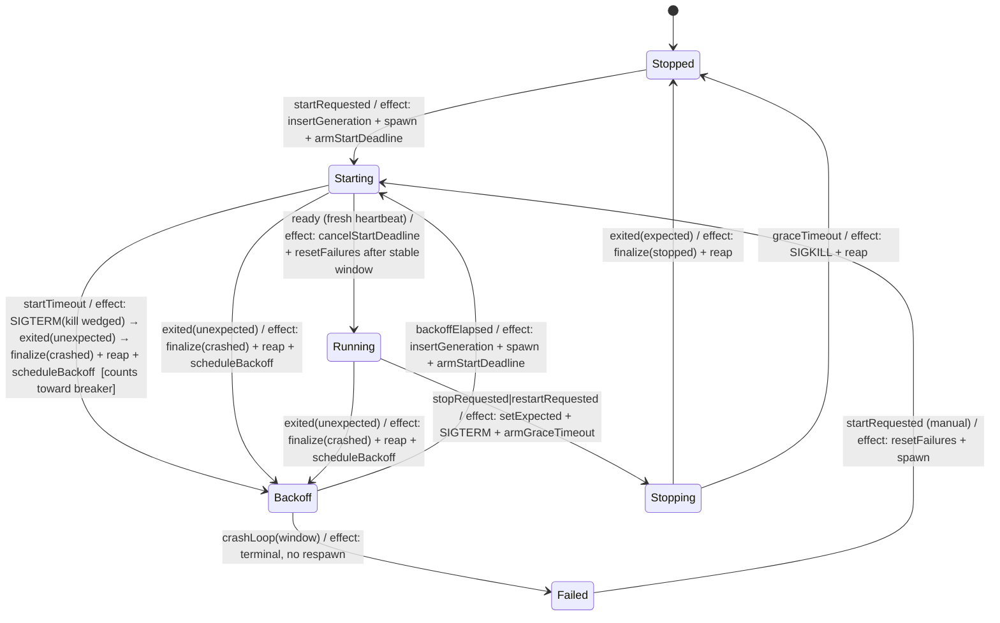
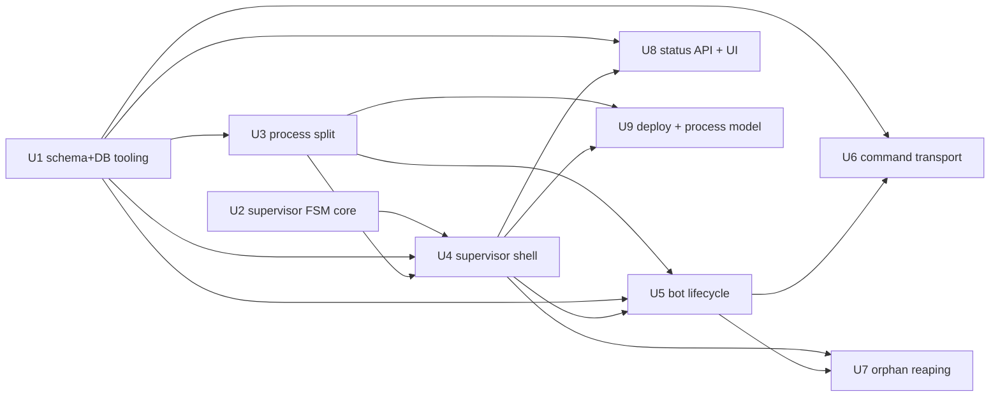

# feat: tdr-code Phase A — two-process architecture & shared substrate

## Overview

This is **Phase A** of the `@lilnas/tdr-code` web admin console (the hard unblocker; nothing else in the
build works until it lands). It splits the single NestJS process into a **main server** (control plane:
Next.js UI + REST API + SQLite owner + bot supervisor) and a **Discord ACP bot** (data plane: discord.js
gateway + `SessionManagerService` + `claude` agents) that share one SQLite WAL database. The main server
spawns, supervises, and auto-restarts the bot; the bot writes a supervisor-stamped **generation id** and a
heartbeat so the system can tell "up / starting / offline / never-seen," reconcile crashes, target a single
channel for teardown over a polled command table, and reap orphaned `claude` process trees.

Phase A is locked to **scope option A①** (full A1–A9 with a *minimal* status UI — not a dashboard) and
**transport option B①** (polled `commands` table). Whichever phase lands first owns the **cross-phase
contracts**; this plan locks them: the full schema map (directional), the generation/epoch primitive, the
command transport, and the auth boundary posture (keep Traefik `forward-auth` in place; the auth cutover is
Phase D).

This plan covers **A1–A9** from the feature landscape
(`docs/research/2026-06-28-tdr-code-web-ui-feature-landscape.md`). Phases B (observability/history),
C (config/git-identity), and D (auth) are deferred to their own plans.

> **Deepened 2026-06-29** — an architecture + data-integrity pass hardened the cross-process correctness
> invariants the single-process code currently gets "for free" from event-loop ordering. The load-bearing
> additions: generation rows are **write-once-after-terminal**; PGIDs move to a `claude_process` **child
> table** (not a JSON column); reconciliation is **liveness-aware** (never two live bots); the FSM gains a
> **start-timeout** state; the command table is a **validated trust boundary**; and **lifecycle decisions key
> off the OS `exit` signal, not heartbeat staleness**.

---

## Problem Frame

Today `apps/tdr-code/` is a single NestJS process that only handles Discord events. Nothing is observable or
recoverable from outside Discord: live agent state and per-channel streaming state are in-memory, nothing is
persisted (`src/db/schema.ts` is an empty stub), there are no HTTP controllers, and the Next.js frontend is a
stub. There is no restart button that survives a wedged process, no crash auto-recovery, and no way to see
whether the bot is even up.

The decisive fix (carried from the origin brainstorm and feature landscape) is a **two-process split sharing
one SQLite database**: a control plane that stays up precisely when the bot is sick, supervises the bot, and
owns durable data; and a restartable data-plane child where "bad state" (wedged gateway, leaked sessions)
accumulates. SQLite is the coupling; a small **polled command table** is the one refinement research added,
because SQLite alone cannot carry control→bot *commands* (per-channel teardown).

Phase A builds that substrate and the first thin vertical slice (a bot-status endpoint + minimal page) to
prove the whole stack end-to-end. It deliberately does **not** build the history, event-feed, config, git, or
auth surfaces — those are later phases that attach to the seams this phase establishes.

---

## Requirements Trace

Requirements this plan must satisfy (from origin `docs/brainstorms/2026-06-27-tdr-code-web-ui-requirements.md`):

- R1. The system runs as two processes: a main server (UI + REST API + SQLite owner + supervisor) and a
  Discord ACP bot (gateway + session manager + `claude` agents).
- R2. The main server spawns and supervises the bot: kill/respawn on demand, auto-restart on unexpected exit.
- R3. The main server and UI remain available (durable data readable) while the bot is down or restarting,
  and the UI indicates bot status ("bot offline, last seen …").
- R4. Both processes share one SQLite database as the system of record; durable data survives bot restarts.
  `pnpm start` launches the main server, which brings up the bot as its managed child; Traefik/nginx
  continues to route to the main server.
- R11 *(transport only)*. From the UI, an operator can tear down a single channel's agent session without
  affecting other channels. **Phase A builds the transport + dispatch; the UI button is B11 (Phase B).**
- R12. From the UI, an operator can restart the whole bot; a graceful restart tears down sessions (reaping
  `claude` process trees) before exit, then the main server respawns it; transitions are reflected in the
  event feed. **Phase A builds the restart + reaping mechanism; the UI button and event-feed rows are B11/B
  (Phase B).**

**Origin actors:** A1 (Operator/admin), A2 (Main server / control plane), A3 (Discord ACP bot / data plane),
A4 (claude agent session).
**Origin flows:** F1 (recover a stuck session — *transport+mechanism here, UI in B*), F4 (restart the bot
after it wedges — *mechanism here, UI button in B*).
**Origin acceptance examples:** AE1 (covers R3 — *offline-indicator half here; last-known-sessions half in
B*), AE2 (covers R12 — *restart+reap mechanism here; UI trigger in B*).

Deferred requirements (named so nothing is silently dropped): R5–R10 → Phase B; R13–R16 → Phase C;
R17–R19 → Phase D; R20 is a permanent non-goal (no agent-driving from the web).

---

## Scope Boundaries

In Phase A but deliberately minimal or excluded:

- **Minimal status UI only.** A single status indicator page (online / starting / offline-last-seen /
  offline-failed / never-seen) plus the frontend shell (React Query provider). **Not** a dashboard, live
  session list, history, or event feed — those are Phase B.
- **No live session / turn / transcript persistence.** Phase A creates only `bot_generation`, `commands`, and
  `claude_process`. The `sessions` / `turns` / `turn_content` / `events` / `live_status` tables are designed in
  the full schema map (below) but **created in Phase B**.
- **No config editing, no git identity, no encryption.** Phase C. `SessionManagerService` keeps reading its
  settings from `env()` at construction (the config re-read path is Phase C / R13).
- **No app-owned auth.** Traefik `forward-auth` stays in front of the whole host through Phase A; the first
  controllers are gated by it. App-owned Better Auth + forward-auth removal is Phase D.
- **No app-level recovery for the main server itself.** If the main server dies, recovery is manual at the
  tmux pane (origin scope boundary). On its return, **liveness-aware reconciliation** (U4) adopts or reaps any
  bot child that outlived it.
- **No retention/pruning for `bot_generation` / `commands` / `claude_process`.** Rows accumulate (mirrors the
  origin's deferred transcript-pruning). Acceptable: rows are tiny and growth is bounded by restart/teardown
  frequency. **Forward hook:** a bounded `DELETE FROM commands WHERE consumed_at < now-N` and a keep-last-N for
  `bot_generation` can land in Phase B alongside transcript pruning.
- **No `PR_SET_CHILD_SUBREAPER` / container-per-bot.** Orphan reaping uses recorded PGIDs (A7); the container
  boundary is the documented clean alternative if the bot is ever containerized later.

### Deferred to Follow-Up Work

- **Phase B** (`sessions`/`turns`/`turn_content`/`events`/`live_status`, ACP→SQLite writer, live view,
  history, event feed, lifecycle-control UI B11): separate plan. Attaches to the `ACP_EVENT_HANDLERS` seam,
  the generation id, and the command transport this phase establishes.
- **Phase C** (config table + re-read path, git identity, SSH encryption): separate plan.
- **Phase D** (Better Auth + Discord, guild gate, deny-by-default guards, forward-auth cutover): separate
  plan. Its guards must later apply to every controller added in A/B/C.

---

## Context & Research

### Relevant Code and Patterns

- **DB substrate (wired, empty):** `src/db/database.module.ts` already opens better-sqlite3 with
  `journal_mode=WAL`, `synchronous=NORMAL`, `foreign_keys=ON`, `busy_timeout=5000` and runs a boot-time
  Drizzle `migrate()` resolving `process.cwd()/src/db/migrations` (Turbopack-safe). `src/db/schema.ts` is an
  empty stub (`export {}`). `drizzle.config.ts` + `src/db/migrations/` already exist; `db:generate`/`db:push`
  scripts are present.
- **Single process today:** `src/main.ts` → `src/bootstrap.ts` boots one `AppModule`
  (`src/app.module.ts`: DatabaseModule, LoggerModule, NecordModule, ScheduleModule, DiscordModule).
  `bootstrap.ts` installs `SIGTERM`/`SIGINT` → `app.close()` with an 8s force-exit backstop, listens on
  `BACKEND_PORT` (8082). `next.config.js` rewrites `/api/*` → `localhost:8082`.
- **Clean split seam:** `src/agent/agent.module.ts` is *only* the `ACP_EVENT_HANDLERS` token export — there
  is **no AgentModule class**. `src/discord/discord.module.ts` provides `DiscordHandlerService`,
  `SessionManagerService`, `StopButtonService`, `ClearCommandService`, and binds
  `ACP_EVENT_HANDLERS → DiscordHandlerService` via `useExisting`. So **everything Discord/agent lives in
  `DiscordModule`** → moves wholesale to the bot process.
- **Repo `@Interval` convention:** the repo's idiomatic recurring timer is `@Interval` from `@nestjs/schedule`
  (`apps/lidarr/.../download-poller.service.ts`, `apps/yoink/.../download-poller.service.ts`), which requires
  `ScheduleModule.forRoot()` in the **owning** module. The bot owns the heartbeat (U5) and command poller (U6),
  so `ScheduleModule` must live in `BotModule` (corrected from the naive "Schedule in main server only").
- **Lifecycle machinery to reuse (don't rebuild):** `SessionManagerService` (`src/agent/session-manager.service.ts`)
  spawns `claude` children `detached: true`, exposes `teardown(channelId)` / `killProcessTree()`
  (negative-PID SIGTERM→SIGKILL), `onApplicationShutdown()` tears down all sessions, and holds the
  `turnCounter` (C4) and the C1–C3 race invariants. `DiscordHandlerService.onApplicationShutdown()` clears
  typing intervals. The shipped **Stop button** (`src/discord/stop-button.service.ts`) validates
  `Number.isInteger(turnId)` and asserts `rawChannelId === interaction.channelId` before calling `cancel` —
  the validation discipline the command transport (U6) must match.
- **Patterns to mirror:**
  - DB layer → `apps/swole/src/db/{pragmas,client,migrate,test-db,schema}.ts` (functions-over-classes,
    `:memory:` `createTestDb()`, `process.cwd()` migration path, pragma order is load-bearing; `migrate.ts`
    **re-asserts `foreign_keys=ON` after migrate** because the migrator can toggle it off mid-flow).
  - Pure FSM → `apps/swole/src/core/session-machine.ts` (`applyAction(state, action)`, zero I/O, exhaustive
    matrix tests in plain Jest).
  - Child-process spawn + SIGTERM → `packages/cli/src/commands/dev.ts` (`spawn('pnpm', …)`, parent SIGTERM →
    `child.kill('SIGTERM')`, await child exit).
  - Bootstrap → `apps/yoink/src/bootstrap.ts` (helmet + cookie-parser + `enableShutdownHooks` + explicit
    SIGTERM resource cleanup).
  - Thin REST controller → `apps/download/src/download/download.controller.ts` (`createZodDto` from
    `nestjs-zod`, service delegation, structured logging).
  - Frontend → `apps/yoink` query-provider (React Query 5.90.2, already a dep here but unused); `cns()` from
    `@lilnas/utils/cns` for all class composition (CLAUDE.md mandate); Tailwind v4 already wired.
  - Deploy WAL extras → `apps/swole/deploy.yml` (`stop_grace_period: 30s`, `/storage/app-data/<app>` volume +
    `chown 1000:1000`, `/api/health` `SELECT 1` probe, `/metrics` ip-allowlist deny router).

### Institutional Learnings

- `docs/solutions/conventions/begin-immediate-for-read-then-write-mutations-2026-05-27.md` — use
  `db.transaction(cb, { behavior: 'immediate' })` for every read-then-write; all calls inside go through `tx`,
  never the outer `db`. **Correction (load-bearing for this plan):** the doc's "contention is invisible" cost
  model assumes a single process and **does not hold** for Phase A's two writers (main server + bot). The
  mitigation already ships — `busy_timeout=5000` in `database.module.ts` — and **must be set on both process
  connections** or cross-process `BEGIN IMMEDIATE` throws `SQLITE_BUSY` instead of blocking. Keep transactions
  short. **Corollary surfaced in deepening:** prefer write shapes that avoid read-modify-write entirely
  (blind INSERT/UPDATE) — a JSON-array column mutated by two processes loses updates even *with* `IMMEDIATE`
  unless each reader re-reads inside the same tx. This is why PGIDs become a child table (U1/D-Finding-1).
- `docs/solutions/architecture-patterns/pure-fsm-core-for-stateful-domain-logic-2026-05-27.md` — model the
  supervisor as a pure core; pass `now`/elapsed/attempt-count **as arguments** (no wall-clock or randomness
  inside). Its own P1 caveat: matrix-cover **every** public function (backoff calc + crash-loop predicate +
  the new start-timeout path), not just the dominant transition fn.
- `docs/solutions/conventions/atomicity-tests-must-reach-the-write-phase-2026-06-03.md` — rollback tests must
  pass all guards → perform a real write → inject the fault *after* it. Smell test: "would this still pass if
  I deleted the transaction wrapper?" The schema CHECK constraints added in U1 also give a *natural*
  constraint-violation seam for these tests. tdr-code runs **CommonJS ts-jest** (no `"type":"module"`), so
  namespace-spy fault injection works (the ESM-vacuity trap does not apply here).
- `docs/solutions/conventions/type-guards-over-nonnull-assertions-on-db-rows-2026-05-30.md` — the
  conditionally-present generation columns (`pid`/`last_heartbeat_at` only while running; `ended_at`/`exit_code`
  only after exit) get discriminated subtypes + type guards (`isRunningGeneration(row)`), never `row.pid!`.
- `docs/solutions/ui-bugs/drawer-history-marker-repush-on-keystroke-2026-05-30.md` (generalized) — every
  long-lived handle (child process, heartbeat/poll/liveness intervals, child `exit`/`error` listeners, the
  start-deadline timer) is created **once per key** (per generation/spawn), never overwritten without release,
  and torn down on **every** exit path. Orphan reaping: exactly **one reaper per generation**, and
  graceful/crash/breaker-trip/server-shutdown all route through it.
- `docs/solutions/architecture-patterns/expose-external-compose-via-lilnas-proxy-2026-06-25.md` — if/when
  Traefik routing changes: set `traefik.docker.network=lilnas-proxy` on multi-network containers; avoid
  silent `Host()` shadowing and the reserved name `tdr-bot` (this app is `tdr-code`); use bare `forward-auth`
  (not `@file`) in Docker-provider labels.

### External References

External research for Phase A's two relevant topics (Node child-process supervision; multi-process SQLite WAL)
is already consolidated in `docs/research/2026-06-28-tdr-code-web-ui-feature-landscape.md` (versions confirmed
June 2026). No net-new external research was run. Key carried facts: WAL supports one writer + concurrent
readers across processes on a **local** FS (no NFS); better-sqlite3 is synchronous so the busy handler blocks
the event loop (keep writes short; busy-waits delay the bot's own heartbeat — see Key Decisions); detached
children are killable via `process.kill(-pid)`.

---

## Key Technical Decisions

- **Scope = A① (full A1–A9, minimal UI).** Substrate + a thin status page + frontend shell. The UI is a single
  indicator, not a dashboard; rich read surfaces are Phase B. *(User-confirmed.)*
- **Transport = B① (polled `commands` table).** Per-channel teardown rides a generation-scoped command table
  the bot polls and consumes via `BEGIN IMMEDIATE`. Whole-bot restart rides SIGTERM (supervisor → child).
  Preserves the origin's "SQLite is the coupling" decision; lowest machinery; a crashed bot never drains the
  table (acceptable — tearing down a dead bot is moot). *(User-confirmed; resolves research Decision 1.)*
- **The `commands` table is a trust boundary, not just transport.** The bot dispatches privileged action
  (`teardown_channel` → `teardown(target)`) from rows anything with DB access can write, in front of a
  skip-permissions agent and *before* Phase D's auth lands. So the dispatcher is **deny-by-default**: `type` is
  validated against a closed zod enum, `target` is schema-validated for its shape (a teardown target must be a
  Discord snowflake), only allowlisted `(type, target-shape)` pairs dispatch, and an unknown/invalid command is
  recorded as an anomaly, not silently consumed. This inherits the same deny-by-default posture the
  research mandates for `/api/*`, from the first command type onward. **Phase-A reality (be honest about scope):**
  the durable `events` sink is Phase B, so in Phase A anomaly recording is **log-only** (structured log fields
  the monitoring stack can index) — frame U6's validation as defense-in-depth, not a complete alerting boundary.
  The validated dispatch path has no UI caller until B11, so it is exercised only by tests + manual DB inserts in
  Phase A. The enum is **expected to grow** (e.g., Phase C's potential git-write-lock signal — research
  Decision 2); document the extension path (add enum value + target schema + migration) so "locked contract"
  does not over-promise stability.
- **Bot spawn passes an explicit, allowlisted env — never the full `process.env`.** `spawn` defaults to
  inheriting the parent environment; the main server holds secrets (and Phase C will add an encryption master
  key) that must **not** flow into the bot and its `--dangerously-skip-permissions` `claude` tree. The supervisor
  constructs an explicit `env` containing only what the bot needs (`BOT_GENERATION_ID`, `DATABASE_PATH`,
  `DISCORD_API_TOKEN`, `DISCORD_GUILD_ID`, `CLAUDE_COMMAND`, `CLAUDE_CWD`, interval knobs, `NODE_ENV`, `PATH`).
  This is a named invariant so later phases cannot widen the set by adding main-server-only secrets.
- **Command delivery is at-most-once (documented contract).** A command is marked `consumed` at claim time,
  before dispatch. If the bot crashes mid-dispatch the teardown is lost and not retried — acceptable because
  `teardown` is idempotent and the operator can re-issue from the UI (B11), and tearing down an already-gone
  session is a no-op. (If a future command must not be lost, upgrade to a `pending → claimed → done|failed`
  lifecycle.)
- **Spawn, not fork.** The supervisor uses `child_process.spawn` of the compiled bot entry (matching the
  existing detached-`claude` pattern and the SQLite-only coupling). Rejected `fork`: its IPC channel would
  become a second coupling and dies exactly when the child wedges — the failure we are designing around.
  The bot is spawned **non-detached** (so the main server receives its `exit`), while the bot keeps spawning
  `claude` grandchildren **detached** (unchanged). *Consequence (see liveness-aware reconciliation): a
  non-detached child does **not** die automatically if the parent is SIGKILLed.*
- **Supervisor-stamped generation id.** The main server inserts the `bot_generation` row (`status='starting'`)
  *before* spawning, passes the integer id to the bot via `BOT_GENERATION_ID` env, and finalizes the row on
  child exit. The bot transitions it to `running` on gateway-ready, heartbeats it, and stamps the id on its
  own writes (Phase B). Generation creation/finalization stays in the control plane that owns the spawn moment.
- **Generation rows are write-once-after-terminal.** Terminal states (`stopped`/`crashed`/`failed`) are a
  latch: `finalize` is guarded `WHERE ended_at IS NULL` (finalize-once); the bot's `running` flip is guarded
  `WHERE status='starting'`; heartbeats are guarded `WHERE status='running'`. A late write from a dying bot
  therefore affects **zero rows** and cannot resurrect a finalized generation (which would otherwise read as a
  false "online"). This makes the cross-process ordering an explicit DB predicate rather than the
  emergent-event-loop ordering the single-process C1–C4 invariants rely on. The status computation (U8) gates
  on `ended_at IS NULL`, not heartbeat freshness alone.
- **PGIDs live in a `claude_process` child table, not a JSON column.** Spawn = blind INSERT, exit = blind
  UPDATE (`SET exited_at WHERE pgid=…`), reap = `SELECT pgid WHERE generation_id=? AND exited_at IS NULL`.
  This removes the cross-process read-modify-write lost-update class entirely (two `claude` spawns + a
  supervisor read racing on one JSON blob could drop a PGID → an orphaned skip-permissions `claude` tree
  surviving force-kill, the exact A7/R12 failure). The FK to `bot_generation` (with `foreign_keys=ON`) makes a
  PGID unable to outlive its generation.
- **Liveness-aware reconciliation — never two live bots, never signal the wrong process.** On main-server boot,
  the sweep does **not** blindly mark prior `starting`/`running` generations `crashed`. Because the bot is a
  non-detached child that survives a SIGKILLed parent, a manual tmux restart could otherwise spawn a *second* bot
  on the same gateway + DB + shared cwd. Two correctness rules govern the reap decision: **(1) PID-liveness is
  authoritative over heartbeat** — if `process.kill(pid, 0)` succeeds, reap the survivor before spawning a
  replacement *regardless of heartbeat freshness* (a busy-stalled but live bot can present a stale heartbeat;
  treating it as dead would spawn a second bot). Only an `ESRCH` (pid gone) classifies a row as crashed-and-safe.
  **(2) Verify PID identity before signaling** — a recorded pid can be OS-recycled onto an unrelated process
  after a crash+reboot; before SIGTERM, confirm the live pid is actually the bot (compare the OS process
  start-time against the generation's `started_at`, or a nonce the bot writes into its own row). If identity
  can't be confirmed, do **not** signal — finalize `crashed` and rely on the orphan having no DB writer. Reaping
  a confirmed survivor is SIGTERM→SIGKILL→reap its `claude_process` PGIDs.
- **Liveness decisions key off the OS `exit` signal; heartbeat staleness drives display only.** The
  authoritative kill/respawn trigger is the child `exit` event (plus the FSM start-timeout). Heartbeat
  staleness is used for the **status display** (R3), never to decide a kill — because better-sqlite3's
  synchronous `busy_timeout` wait can delay the bot's own heartbeat by up to `busy_timeout`, so staleness is a
  noisy liveness proxy. The staleness threshold is therefore `heartbeatInterval + busy_timeout + margin`, not a
  naive 3×.
- **Integer-autoincrement-style generation id (plain `INTEGER PRIMARY KEY`, no `AUTOINCREMENT`).** Monotonic
  rowid, trivially "latest," natural for the `(generation, counter)` turn-identity scheme Phase B will adopt to
  fix the `turnCounter`-resets-to-0 collision. (Phase A leaves `turnCounter` untouched.) 64-bit rowid →
  wraparound is not a real concern; no defensive complexity.
- **Migration ownership = main server only.** `DatabaseModule` gains a `forRoot({ migrate })` option. The main
  server migrates on boot; the bot opens connection + pragmas only. The supervisor spawns the bot **after** the
  main server's DB is migrated, so the bot never races missing tables (ordering guarantee, no distributed
  migration lock needed).
- **`synchronous=NORMAL` (inherited) is an accepted durability tradeoff.** Under WAL, NORMAL can drop the last
  few committed transactions on OS crash / power loss (not on app crash). Acceptable here: generation/command
  rows are operational state that self-heals via reconciliation + heartbeat; nothing in Phase A is data a power
  event must not lose. Revisit to `FULL` only if a lost `finalize` is shown to matter.
- **Bot has no HTTP server.** The bot boots via `NestFactory.createApplicationContext(BotModule)` (full DI +
  lifecycle hooks, no listener). Only the main server listens on 8082; `next.config.js`'s `/api/*` rewrite is
  unchanged (still → main server).
- **Pure FSM supervisor core + impure shell.** All lifecycle rules (states incl. **start-timeout**, backoff,
  crash-loop window, expected-vs-crash classification) live in a pure module returning **effects as data**; the
  service performs spawn/kill/timers/DB writes. Time and attempt count are injected.
- **A SIGTERM/stop stamps a `stopping` sentinel at send-time, not at exit.** Whenever the supervisor sends
  SIGTERM (operator stop, restart, or start-timeout kill), it immediately transitions the generation to
  `stopping` (guarded `WHERE ended_at IS NULL`) — *before* the child exits. This closes the race where a bot
  whose graceful handler is mid-flight finally fires Discord `ready` during the SIGTERM grace window: with the
  row already `stopping`, the bot's `markRunning` (`WHERE status='starting'`) and heartbeat
  (`WHERE status='running'`) both affect zero rows, so it cannot present a transient false "online." Belt-and-
  suspenders: the bot's `ready` handler also checks a shutdown-requested flag before `markRunning` or accepting
  any new turn, so a bot under SIGTERM never spawns fresh `claude` work the reaper then races.
- **One reaper per generation — knowable PGIDs, no innocent kills.** A single reaping function reads the
  generation's live `claude_process` PGIDs and runs on every bot-termination path (graceful self-reap, force-kill
  by supervisor, crash, breaker-trip, main-server shutdown). Idempotent. Three safety rules the storage shape
  alone does not provide: **(a) record before killable** — `recordSpawn` must persist the PGID synchronously with
  no `await` between `spawn()` returning and the INSERT, or a bot SIGKILLed in that gap leaves a true orphan the
  reaper never sees (record-then-spawn ordering, not the child table, is what makes a PGID knowable). **(b) Guard
  against PGID reuse** — a force-killed bot can leave un-`markExited` rows whose PGID the OS later recycles;
  before `process.kill(-pgid, 'SIGKILL')`, treat any `claude_process` row older than a bounded TTL (well under
  the host PID-recycle horizon) as already-dead and `markExited` it *without* killing. Reap promptly on the
  bot-`exit` event to keep the window small. **(c) Force-kill backstop** — independent of recorded PGIDs, on a
  force-kill the supervisor also walks the bot's own process-group descendants, so a PGID that was never recorded
  is still reaped.
- **Auth posture: keep forward-auth.** The first controllers (`/api/bot/status`, `/api/health`) are gated by
  the existing Traefik `forward-auth`. No app-owned guard yet. The deny-by-default app guard is Phase D and
  must then cover these routes.

---

## Open Questions

### Resolved During Planning

- **Command transport (research Decision 1)?** → B① polled `commands` table. *(User-confirmed.)*
- **Phase A UI scope?** → A① minimal status page + frontend shell. *(User-confirmed.)*
- **Two-writer WAL safety?** → Yes, on a local FS with `busy_timeout` on both connections; keep transactions
  short; `BEGIN IMMEDIATE` for read-then-write; avoid read-modify-write columns (PGID child table).
  `synchronous=NORMAL` power-loss tradeoff documented and accepted.
- **fork vs spawn / IPC?** → spawn (decoupled, survives a wedged child). See Key Decisions.
- **Migration race between two writers?** → none: main server migrates before spawning the bot.
- **Jest ESM atomicity-test vacuity?** → not applicable; tdr-code is CommonJS ts-jest.
- **How does the supervisor avoid two live bots after a manual restart?** → liveness-aware reconciliation
  (`process.kill(pid,0)` + fresh heartbeat → adopt-or-reap before spawn). See Key Decisions / U4.
- **Can a dying bot resurrect a finalized generation (false "online")?** → no: write-once terminal latch
  (guarded `WHERE` clauses) + status gates on `ended_at IS NULL`. See Key Decisions / U1 / U8.
- **Failed (breaker tripped) vs offline in the UI?** → surface `failed` distinctly ("supervisor gave up —
  needs manual start"); the data exists (`status='failed'`) and the operator needs to know a crash did *not*
  self-heal (origin Success Criteria). Cheap; folded into U8.
- **Dev supervision posture?** → **`SUPERVISE_BOT=false` in dev** (bot runs standalone via `run-p`, like today),
  with a single flag-gated smoke test that exercises the supervisor's spawn→crash→respawn path once. Avoids the
  two-restart-authorities hazard of spawning `nest start -w` under the supervisor; prod always supervises. The
  QA-coverage cost (auto-restart not exercised in normal dev) is bought back by the smoke test. Structural guard
  in both modes: the bot refuses to adopt a `BOT_GENERATION_ID` whose row is terminal or `running` with a
  different `pid` (U5).
- **Can a late `ready` / heartbeat present a false "online" during shutdown?** → no: the supervisor stamps
  `stopping` at SIGTERM-send (before exit), so guarded bot writes no-op; the bot's `ready` handler also checks a
  shutdown flag. See Key Decisions / U4 / U5.
- **Can reconciliation signal the wrong process or spawn a second bot?** → no: pid-liveness is authoritative over
  heartbeat for the reap decision, and PID identity (start-time/nonce) is verified before any signal. See Key
  Decisions / U4.

### Deferred to Implementation

- **Necord under `createApplicationContext`.** Verify Necord connects and fires its `ready` event under a
  non-HTTP application context; if it requires a full HTTP app, fall back to `NestFactory.create(BotModule)`
  without `app.listen()`. *(Runtime behavior — confirm during U3.)*
- **Heartbeat / poll / staleness constants.** Defaults: heartbeat ~5s, command poll ~1.5s, supervisor liveness
  poll ~2s, **start-timeout ~30s**, staleness threshold = `heartbeat + busy_timeout + margin` (~12–15s),
  stable-window reset ~30s, SIGTERM grace before SIGKILL ~10s. Tune against observed behavior; expose via env.
- **`SQLITE_BUSY` policy in the command poller.** Default: rely on `busy_timeout` to block briefly; if it still
  throws, log + retry next tick.
- **Timer mechanism (`@Interval` vs raw `unref()`'d `setInterval`).** Pick one in U3 and use it uniformly
  (heartbeat, command poll, supervisor liveness, start-deadline). `@Interval` needs `ScheduleModule` in the
  owning module; raw timers need explicit `onModuleDestroy` + shutdown-path clearing.
- **R8 ACP↔JSONL probe.** Not Phase A (it's the first Phase B step), but the `cwd`/`sessionId` linkage columns
  live in the Phase B schema; the directional map below reserves them.

---

## Output Structure

New and modified files (the per-unit **Files** lists are authoritative; this is the shape at a glance):

    apps/tdr-code/src/
      db/
        schema.ts                       # MOD: bot_generation + commands + claude_process; types; guards; CHECK/NOT NULL/FK
        database.module.ts              # MOD: forRoot({ migrate }) — main migrates, bot does not
        test-db.ts                      # NEW: :memory: createTestDb() (mirror swole; re-assert foreign_keys ON post-migrate)
        bot-generation.repo.ts          # NEW: generation lifecycle fns (shared by both processes; guarded WHERE)
        command.repo.ts                 # NEW: enqueue + atomic BEGIN IMMEDIATE claim (shared)
        claude-process.repo.ts          # NEW: PGID insert/exit/select-live (shared)
        migrations/0000_*.sql           # NEW: generated by `pnpm db:generate`
      supervisor/
        supervisor-machine.ts           # NEW: pure FSM core (states incl. start-timeout, backoff, crash-loop)
        supervisor.service.ts           # NEW: impure shell — spawn/kill/respawn, liveness poll, start-deadline timer
        reaper.ts                       # NEW: one-reaper-per-generation; reads live claude_process PGIDs
        supervisor.module.ts            # NEW
        __tests__/                      # NEW: supervisor-machine, supervisor.service, reaper specs
      commands/
        command-poller.service.ts       # NEW: bot-side poll → validate → dispatch teardown_channel
        __tests__/                      # NEW: command-poller spec (repo spec lives under db/__tests__)
      bot/
        bot-status.service.ts           # NEW: pure status computation (rows + now → status, gates on ended_at)
        bot-status.controller.ts        # NEW: GET /bot/status
        bot-status.dto.ts               # NEW: nestjs-zod createZodDto
        health.controller.ts            # NEW: GET /health (SELECT 1)
        __tests__/                      # NEW: bot-status.service spec, controller spec
      discord/
        bot-lifecycle.service.ts        # NEW: gateway-ready → running, heartbeat, graceful shutdown, PGID report
        discord.module.ts              # MOD: add BotLifecycleService + CommandPollerService
        __tests__/                      # MOD/NEW: bot-lifecycle spec
      agent/
        session-manager.service.ts      # MOD: report claude PGIDs (claude_process) on spawn/exit; accept generation id
      app.module.ts                     # MOD → main-server module (DB[migrate] + Schedule? + Supervisor + controllers)
      bot.module.ts                     # NEW: bot module (DB[no-migrate] + ScheduleModule + Necord + Discord)
      bootstrap.ts                      # MOD: main-server bootstrap (helmet, cookie-parser, enableShutdownHooks)
      main.ts                           # MOD: boot main server
      bot-main.ts                       # NEW: bot entry
      bot-bootstrap.ts                  # NEW: bot bootstrap (createApplicationContext, SIGTERM graceful)
      env.ts                            # MOD: BOT_GENERATION_ID, DATABASE_PATH, SUPERVISE_BOT, interval/threshold knobs
      app/
        providers.tsx                   # NEW: React Query provider (from yoink)
        layout.tsx                      # MOD: wrap providers
        page.tsx                        # MOD: minimal status page
    apps/tdr-code/
      deploy.yml                        # MOD: WAL extras (stop_grace_period, storage volume, healthcheck), keep forward-auth
      deploy/nginx.conf                 # (verify routing unchanged post-split)
      package.json                      # MOD: start:bot/dev:bot interim → supervisor owns spawn

> **Note (boundary):** `bot-generation.repo.ts`, `command.repo.ts`, and `claude-process.repo.ts` are
> process-agnostic shared DB-layer functions and live under `src/db/` (not `supervisor/`), because both the
> main server and the bot import them. The supervisor's *reaper* and FSM stay under `supervisor/`.

---

## High-Level Technical Design

> *This illustrates the intended approach and is directional guidance for review, not implementation
> specification. The implementing agent should treat it as context, not code to reproduce.*

### Two-process topology after Phase A

```mermaid
flowchart TB
  subgraph Host["Host — tmux: pnpm start (run-p main + frontend)"]
    FE["Next.js (8080)<br/>status page + RQ provider"]
    Main["Main server (8082)<br/>NestFactory.create(AppModule)<br/>DB[migrate] · SupervisorService · controllers"]
    Bot["Bot (no HTTP)<br/>createApplicationContext(BotModule)<br/>DB[no-migrate] · Schedule · Necord · DiscordModule"]
    Claude["claude trees (detached, per channel)"]
    DB[("SQLite WAL — busy_timeout both sides<br/>bot_generation · commands · claude_process")]
  end
  FE -->|/api/* rewrite| Main
  Main -->|spawn(node dist/bot-main), env BOT_GENERATION_ID| Bot
  Main -->|insert/finalize generation (guarded) · enqueue commands · liveness poll · reap| DB
  Bot -->|running/heartbeat (guarded) · poll+claim+validate commands · INSERT/UPDATE claude_process| DB
  Bot -->|spawn detached · ACP| Claude
  Main -.->|SIGTERM restart / SIGKILL+reap live PGIDs| Bot
```

### Supervisor lifecycle (pure FSM core — effects returned as data)



- `applyEvent(state, event, ctx) -> { state, effects[] }` is pure. `ctx` carries `now`, `attempt`,
  `lastStableAt`, configured delays/thresholds (incl. `startTimeoutMs`). `effects` are data
  (`{ kind: 'spawn' }`, `{ kind: 'scheduleBackoff', ms }`, `{ kind: 'reap', generationId }`,
  `{ kind: 'finalize', status }`, `{ kind: 'armStartDeadline', ms }`).
- Backoff = capped exponential + jitter, computed from `attempt` + `now` (both injected). Crash-loop = N
  unexpected exits within window T ⇒ `Failed`. **`startTimeout`-induced exits feed `isCrashLoop` identically to
  crashes**, so a wedge-on-boot loop also trips the breaker rather than looping forever.

### Generation + PGID storage (directional)

`bot_generation`: `id` (int pk), `started_at`, `status`
(`starting|running|stopping|stopped|crashed|failed`, CHECK-constrained), `pid?`, `last_heartbeat_at?`,
`ended_at?`, `exit_code?`. Terminal latch: `ended_at` set once; bot writes guarded `WHERE status=…`.
Discriminated subtypes + guards: `isRunningGeneration` (pid + last_heartbeat present), `isEnded` (ended_at
present).

`claude_process`: `id` (int pk), `generation_id` (FK → bot_generation, `ON DELETE CASCADE`, NOT NULL),
`pgid` (NOT NULL), `channel_id?`, `spawned_at`, `exited_at?`. Partial index on `(generation_id) WHERE
exited_at IS NULL` for the reaper's "still-live PGIDs" query.

### Lifecycle-vs-display principle

```
child `exit` event (OS, authoritative)  ──▶ lifecycle decision (finalize / backoff / respawn / reap)
FSM start-timeout (no `ready` in time)  ──▶ lifecycle decision (kill wedged child → crash path)
heartbeat freshness (noisy under busy)  ──▶ status DISPLAY only (R3); never a kill decision
```

### Status computation (R3, pure — gates on `ended_at IS NULL`)

**Server-side computation** (pure, from the latest generation row + `now`):

| Condition | Status |
|---|---|
| no rows | `never-seen` |
| not ended (`ended_at IS NULL`) & `status=running` & `now - last_heartbeat_at <= staleThreshold` | `online` |
| not ended & `status in (starting, stopping)` (or running with no heartbeat yet, within start grace) | `starting` |
| latest `status=failed` (breaker tripped, terminal) | `offline-failed` (supervisor gave up; needs manual start) + `lastSeenAt` |
| ended (`stopped`/`crashed`) OR running-but-heartbeat-stale | `offline` (+ `lastSeenAt`) |

`staleThreshold = heartbeatInterval + busy_timeout + margin`.

**Client-side display states** (the page renders one of: the server status above, or one of two control-plane
states the server cannot report about itself):

| Client condition | Display |
|---|---|
| first poll in flight (no response yet) | `loading` ("checking status…") — never one of the server states |
| poll fails (main server / control plane unreachable) | `unknown` ("can't reach server") — **distinct from `offline`**; `offline` means the supervisor reported the bot down, `unknown` means the UI itself may be down. Carries no `lastSeenAt`. |

---

## Implementation Units

Grouped into three delivery phases (see [Phased Delivery](#phased-delivery)). Dependency graph:



---

- U1. **Schema foundation + two-writer DB tooling**

**Goal:** Populate `schema.ts` with the three Phase A tables (`bot_generation`, `commands`, `claude_process`),
lock the full directional schema map as the cross-phase contract, encode the write-once terminal + integrity
constraints, make migration main-server-only, generate the first migration, and add a `:memory:` test-db
helper. Establishes the shared-SQLite system of record (R4) and the generation/epoch primitive's storage (A3).

**Requirements:** R4; foundation for R3, R11, R12.

**Dependencies:** None.

**Files:**
- Modify: `apps/tdr-code/src/db/schema.ts` (the three tables; CHECK on status/type enums; NOT NULL on always-
  present columns; FK `commands.generation_id` and `claude_process.generation_id` → `bot_generation.id`
  `ON DELETE CASCADE`; partial index `claude_process(generation_id) WHERE exited_at IS NULL`; index
  `commands(generation_id, status)`; exported row types + discriminated subtypes + type guards)
- Modify: `apps/tdr-code/src/db/database.module.ts` (`forRoot({ migrate }: { migrate: boolean })`; migrate only
  when true; pragmas unchanged on both variants)
- Create: `apps/tdr-code/src/db/bot-generation.repo.ts`, `apps/tdr-code/src/db/command.repo.ts`,
  `apps/tdr-code/src/db/claude-process.repo.ts` (shared, process-agnostic; guarded writes; `BEGIN IMMEDIATE`
  where read-then-write)
- Create: `apps/tdr-code/src/db/test-db.ts` (`createTestDb()` → `:memory:` + pragmas + migrate; **re-assert
  `foreign_keys=ON` after migrate** per swole's `migrate.ts`; returns `{ db, close }`)
- Create: `apps/tdr-code/src/db/migrations/0000_*.sql` (via `pnpm --filter @lilnas/tdr-code db:generate`)
- Test: `apps/tdr-code/src/db/__tests__/schema.spec.ts`,
  `apps/tdr-code/src/db/__tests__/bot-generation.repo.spec.ts`,
  `apps/tdr-code/src/db/__tests__/command.repo.spec.ts`,
  `apps/tdr-code/src/db/__tests__/claude-process.repo.spec.ts`

**Approach:**
- Tables per the directional sketch in the High-Level design. Plain `INTEGER PRIMARY KEY` (no `AUTOINCREMENT`).
- **Write-once terminal latch** lives in `bot-generation.repo`: `finalize(id, status, …)` →
  `WHERE id=? AND ended_at IS NULL`; `markRunning(id, pid)` → `WHERE id=? AND status='starting'`;
  `heartbeat(id)` → `WHERE id=? AND status='running'`. Each returns rows-affected so callers can detect a lost
  race. `BEGIN IMMEDIATE` only where a read precedes the write; pure blind updates use the default.
- `claude-process.repo`: `recordSpawn(generationId, pgid, channelId)` = blind INSERT; `markExited(pgid,
  generationId)` = blind UPDATE; `livePgids(generationId)` = `SELECT … WHERE exited_at IS NULL`. No JSON, no
  read-modify-write.
- `command.repo`: `enqueue(...)` = blind INSERT; `claimPending(generationId)` = `BEGIN IMMEDIATE` select
  pending for this generation + mark consumed + return (atomic).
- `database.module.ts` keeps the existing pragmas (already correct, incl. `busy_timeout=5000`); only the
  `migrate()` call becomes conditional on the injected option. Both processes still open the same file.
- CHECK constraints on every enum column double as a natural fault-injection seam for the atomicity tests in
  U4/U6 (atomicity-tests learning).
- Lock the **full schema map** (below) as a comment/doc block so later phases extend without churn.

**Technical design:** *(directional)* Full cross-phase map — create only the first three now:

| Table | Phase | Key columns |
|---|---|---|
| `bot_generation` | **A** | id, started_at, status(CHECK), pid?, last_heartbeat_at?, ended_at?, exit_code? — terminal write-once |
| `commands` | **A** | id, generation_id→bot_generation(CASCADE), type(CHECK), target?, status(CHECK pending/consumed), created_at, consumed_at? |
| `claude_process` | **A** | id, generation_id→bot_generation(CASCADE), pgid, channel_id?, spawned_at, exited_at? — index WHERE exited_at IS NULL |
| `sessions` | B | id, channel_id, generation_id, triggering_user_id, acp_session_id, cwd, created_at, ended_at?, end_reason? |
| `turns` | B | id, session_id, turn_index, user_id, started_at, ended_at?, stop_reason?, status |
| `turn_content` | B | id, turn_id, seq, kind, payload(json), created_at |
| `events` | B | id, generation_id, session_id?, channel_id?, type, level, context(json), created_at |
| `live_status` | B | channel_id(pk), generation_id, triggering_user_id, prompting, queue_depth, last_activity_at, last_heartbeat_at |
| `config` | C | cwd, idle timeout, max sessions, claude command/args |
| `git_identity` | C | discord_user_id(pk), name, email, ssh_key_ciphertext, ssh_key_iv, ssh_key_auth_tag, key_version, fingerprint, updated_at |
| `user`/`session`/`account`/`verification` | D | Better Auth shapes, same file, drizzle-kit managed |

**Patterns to follow:** `apps/swole/src/db/{pragmas,schema,migrate,test-db}.ts` (incl. the post-migrate
`foreign_keys=ON` re-assert); type-guards-over-nonnull learning.

**Test scenarios:**
- Happy path: `createTestDb()` applies migrations; insert a `bot_generation` row and read it back with correct
  types; `foreign_keys` is ON after migrate (so the FK test below is non-vacuous).
- Happy path: `command.repo.enqueue` + query by `(generation_id, status)`; `claude-process.repo.recordSpawn` +
  `livePgids` returns it; `markExited` removes it from `livePgids`.
- Edge case: `isRunningGeneration` narrows `pid`/`last_heartbeat_at` non-null only when running; `isEnded`
  narrows `ended_at`.
- Edge case (write-once): `finalize` then `heartbeat` on the same row → heartbeat affects **0 rows**, status
  stays terminal (test fails if the `WHERE status='running'` guard is removed).
- Edge case (CHECK): inserting an out-of-domain `status`/`type` is rejected by the CHECK constraint.
- Edge case (FK/CASCADE): a `commands`/`claude_process` row with a non-existent `generation_id` fails the FK;
  deleting a `bot_generation` cascades its children.
- Integration: a `migrate:false` connection sees tables created by a `migrate:true` connection on the same
  temp-file db (two-writer sanity).
- Verification: `pnpm --filter @lilnas/tdr-code db:generate` produces a migration; `type-check` + `lint` pass.

**Verification:** Schema compiles; migration generated and applied by `createTestDb()`; guards narrow; CHECK +
FK + write-once guards enforced.

---

- U2. **Supervisor FSM pure core**

**Goal:** A pure, framework-free transition function for the bot lifecycle — states (incl. **start-timeout**),
backoff, crash-loop window, expected-vs-crash classification — returning effects as data. The deterministic
heart of R2.

**Requirements:** R2.

**Dependencies:** None.

**Files:**
- Create: `apps/tdr-code/src/supervisor/supervisor-machine.ts`
- Test: `apps/tdr-code/src/supervisor/__tests__/supervisor-machine.spec.ts`

**Approach:**
- `applyEvent(state, event, ctx) -> { state, effects[] }`, pure; states and effects per the High-Level design,
  including the `Starting → Backoff` start-timeout edge (kill the wedged child, classify the resulting exit as
  unexpected, schedule backoff).
- Pure helpers: `backoffDelay(attempt, ctx)` (capped exponential + bounded jitter) and
  `isCrashLoop(history, now, ctx)` (N unexpected exits within window T, where **start-timeouts count as
  unexpected**). Time/attempt injected via `event`/`ctx` — never read inside.
- Effects are inert data; the U4 shell interprets them. No `child_process`, no timers, no DB.

**Execution note:** Write the `(state × event)` matrix first; it must fail if any transition or
classification is wrong. Matrix-cover `backoffDelay`, `isCrashLoop`, **and** the start-timeout path too — the
FSM learning's P1 caveat is that an exhaustive transition matrix still missed a secondary function.

**Technical design:** *(directional)* `type SupervisorState = { phase; attempt; lastStableAt?; expectedStop }`;
`type Event = StartRequested | Spawned | Ready | ExitObserved{code, expected} | StartTimeout | StopRequested |
RestartRequested | BackoffElapsed | GraceTimeout`. See the state diagram above.

**Patterns to follow:** `apps/swole/src/core/session-machine.ts`; pure-fsm-core learning.

**Test scenarios:**
- Happy path: `Stopped + startRequested → Starting` with `spawn` + `insertGeneration` + `armStartDeadline`
  effects.
- Happy path: `Starting + ready → Running` (cancels start-deadline); after stable window, attempt counter
  resets.
- Error path: `Starting + startTimeout → Backoff` (kill wedged child → crash path); repeated start-timeouts
  trip the crash-loop breaker → `Failed`.
- Error path: `Running + exited(unexpected) → Backoff` with `finalize(crashed)` + `reap` + `scheduleBackoff`.
- Edge case: `Stopping + exited(expected) → Stopped` (no respawn); `Stopping + graceTimeout → Stopped` with
  `SIGKILL` + `reap`.
- Edge case: crash-during-stopping and stop-during-backoff resolve deterministically (matrix-covered).
- Error path: N unexpected exits (crash and/or start-timeout) within window → `Failed` (terminal); `Failed +
  startRequested (manual) → Starting`.
- Edge case: `backoffDelay` grows exponentially, is capped, jitter within bounds; `isCrashLoop` true at the Nth
  unexpected exit within T, false when spaced beyond T.

**Verification:** Full matrix green; no wall-clock/random inside the core (grep shows none).

---

- U3. **Process split: main-server entry + bot entry + module split**

**Goal:** Split the single `AppModule` into a main-server module (DB[migrate] + Logger, ready for
controllers/supervisor) and a `BotModule` (DB[no-migrate] + Logger + **ScheduleModule** + Necord + Discord).
Add a non-HTTP bot entry. Establishes R1's two processes (launched in parallel here; the supervisor takes over
spawning in U4).

**Requirements:** R1; foundation for R4.

**Dependencies:** U1.

**Files:**
- Modify: `apps/tdr-code/src/app.module.ts` (becomes the **main-server** module: `DatabaseModule.forRoot({
  migrate: true })`, LoggerModule; drops Necord/Discord; `ScheduleModule` only if the supervisor's timers use
  `@Interval` — decide per the timer-mechanism question)
- Create: `apps/tdr-code/src/bot.module.ts` (`DatabaseModule.forRoot({ migrate: false })`, LoggerModule,
  **`ScheduleModule.forRoot()`**, NecordModule, DiscordModule)
- Modify: `apps/tdr-code/src/bootstrap.ts` (main-server bootstrap; adopt yoink's helmet + cookie-parser +
  `enableShutdownHooks`; keep the 8s force-exit backstop; listen on 8082)
- Modify: `apps/tdr-code/src/main.ts` (boot main server — unchanged entry shape)
- Create: `apps/tdr-code/src/bot-main.ts` (bot entry: dotenv + source-map + `bootstrapBot()`)
- Create: `apps/tdr-code/src/bot-bootstrap.ts` (`createApplicationContext(BotModule)`, `enableShutdownHooks`,
  SIGTERM/SIGINT → `app.close()` + force-exit backstop)
- Modify: `apps/tdr-code/package.json` (add `start:bot` = `node dist/bot-main`, `dev:bot` = bot watch; interim
  `start`/`dev` run main + bot + frontend via `run-p`; add deps `helmet` + `cookie-parser` +
  `@types/cookie-parser` consumed by the main-server bootstrap)
- Test: `apps/tdr-code/src/__tests__/bot-bootstrap.spec.ts`, `apps/tdr-code/src/__tests__/main-server.module.spec.ts`

**Approach:**
- NecordModule + DiscordModule move wholesale to `BotModule` (the clean seam: `DiscordModule` already owns all
  Discord/agent providers). `ScheduleModule` goes to `BotModule` because the bot owns the heartbeat (U5) and
  command poller (U6).
- **Decide the timer mechanism once** here (`@Interval` from `@nestjs/schedule` vs raw `unref()`'d
  `setInterval`) and use it uniformly across U4/U5/U6; if raw, each owner clears its timer in `onModuleDestroy`
  + the shutdown path (drawer-history learning).
- Bot boots via `createApplicationContext` (no HTTP). If Necord requires a full HTTP app under that context,
  fall back to `NestFactory.create(BotModule)` without `listen()` (deferred-to-implementation check).
- `next.config.js` rewrite unchanged (→ 8082 main server).
- **Interim launch:** both processes are still started by `run-p` here; U4 removes the bot from `run-p` once the
  supervisor owns the spawn. The bot does **not** read a generation id yet (that arrives in U5).

**Execution note:** Land the split with the bot still launched standalone (parallel script) and verify each
process boots independently before introducing supervision in U4 — this de-risks the split from the supervisor.

**Patterns to follow:** `apps/yoink/src/bootstrap.ts`; existing `src/bootstrap.ts` SIGTERM + force-exit shape;
the `@Interval` poller convention.

**Test scenarios:**
- Happy path: main-server module compiles/instantiates with **no** Necord/Discord providers bound.
- Happy path: bot context resolves `SessionManagerService` and `DiscordHandlerService` (DI graph intact under
  `createApplicationContext`); `ScheduleModule` is available in `BotModule`.
- Edge case: bot context exposes no HTTP server / does not bind a port.
- Integration: both bootstraps register SIGTERM/SIGINT handlers and call `app.close()` (NestJS shutdown hooks
  fire `onApplicationShutdown`).
- Verification: `pnpm --filter @lilnas/tdr-code build` produces both `dist/main` and `dist/bot-main`;
  type-check + lint pass.

---

- U4. **Bot supervisor service (impure shell) + generation lifecycle + liveness-aware reconciliation**

**Goal:** Wrap the U2 FSM in a `SupervisorService` that spawns/kills/respawns/auto-restarts the bot child,
stamps and finalizes `bot_generation` (write-once), runs the FSM's effects (spawn/backoff/reap/finalize),
tracks readiness via a liveness poll + start-deadline timer, and reconciles prior generations **liveness-aware**
on startup (never two live bots). Delivers R2, the generation primitive (A3), and crash reconciliation (A6).
Removes the bot from `run-p` — the main server now owns its lifecycle (R4).

**Requirements:** R2, R3 (status data), R12 (restart mechanism); A3, A6.

**Dependencies:** U1, U2, U3.

**Files:**
- Create: `apps/tdr-code/src/supervisor/supervisor.service.ts` (impure shell)
- Create: `apps/tdr-code/src/supervisor/supervisor.module.ts`
- Modify: `apps/tdr-code/src/app.module.ts` (import SupervisorModule)
- Modify: `apps/tdr-code/package.json` (`start`/`dev` drop the bot from `run-p` — main + frontend only; honor
  `SUPERVISE_BOT` for the dev posture decision)
- Modify: `apps/tdr-code/src/env.ts` (supervisor knobs: SIGTERM grace, liveness poll, **start-timeout**,
  stable-window, backoff caps, `SUPERVISE_BOT`)
- Test: `apps/tdr-code/src/supervisor/__tests__/supervisor.service.spec.ts`

**Approach:**
- On `onModuleInit`: run **liveness-aware reconciliation** over prior `starting`/`running`/`stopping`
  generations. **Phase A reconciliation covers only `bot_generation`** — the research A6's `live_status`/`turns`
  sweep is Phase B work that attaches to this same on-boot hook (design the hook to call a list of registered
  sweeps so Phase B extends it without modifying U4). For each prior generation: if `process.kill(pid, 0)`
  succeeds, **verify identity** (OS process start-time vs the row's `started_at`, or a bot-written nonce) and, if
  confirmed live, **reap the survivor** (SIGTERM→SIGKILL→reap its `claude_process` PGIDs) before proceeding —
  **PID-liveness is authoritative over heartbeat freshness** (a busy-stalled live bot must not be mis-classified
  dead → second bot). Only `ESRCH` (pid gone) or unconfirmable-identity rows are finalized `crashed` without
  signaling. Then `startRequested`. Never two live bots on one gateway/DB.
- Spawn flow (FSM `spawn` effect): insert generation (`starting`), `spawn('node', ['dist/bot-main'])`
  (non-detached) with an **explicit allowlisted `env`** (`BOT_GENERATION_ID`, `DATABASE_PATH`,
  `DISCORD_API_TOKEN`, `DISCORD_GUILD_ID`, `CLAUDE_COMMAND`, `CLAUDE_CWD`, interval knobs, `NODE_ENV`, `PATH`) —
  **never** the full `process.env` (keeps main-server-only secrets out of the skip-permissions agent), record
  `pid`; **arm the start-deadline timer**; wire `exit`/`error` listeners **once per spawn** (drawer-history) →
  feed FSM `ExitObserved`. If `spawn` itself throws (ENOENT etc.), immediately finalize the just-inserted
  generation via the FSM error/exit path (no orphan `starting` row).
- Liveness: an interval reads the current generation's heartbeat; fresh + `status='running'` → FSM `Ready`
  (cancels the start-deadline); after the stable window, the FSM resets the attempt counter. **Heartbeat
  staleness never triggers a kill** — only the `exit` event and the start-deadline do (lifecycle-vs-display
  principle).
- Start-deadline: if no `Ready` within `startTimeoutMs`, fire FSM `StartTimeout` → **stamp `stopping`**
  (`WHERE ended_at IS NULL`) → SIGTERM the wedged child → its exit flows the unexpected path (counts toward the
  breaker).
- Stop/restart: set the expected-stop flag, **stamp `stopping` at SIGTERM-send time** (so a late `ready`/
  heartbeat from the dying bot no-ops and cannot present a false "online"), arm grace timer → SIGKILL on timeout;
  on exit, finalize (`stopped`, guarded `WHERE ended_at IS NULL`) and reap.
- Auto-restart: unexpected exit → finalize (`crashed`) → FSM `Backoff` → respawn; crash loop → `Failed`
  (terminal, surfaced via status).
- `enableShutdownHooks` on the main server: on its own shutdown, stop the bot (expected) and reap.
- **Dev posture:** honor `SUPERVISE_BOT` — in dev default `false` (bot runs standalone via `run-p`); a
  flag-gated smoke test exercises the supervisor's spawn→crash→respawn path once. Prod always supervises.

**Execution note:** Write the reconciliation atomicity test to **reach the write phase** (pass guards →
perform the stale-row finalize → inject a post-write fault → assert rollback), per the atomicity-tests
learning. Extract the first write as an executor-parameterized helper so the namespace spy intercepts it
(CommonJS ts-jest — spies work here).

**Patterns to follow:** `packages/cli/src/commands/dev.ts` (spawn + SIGTERM await); `SessionManagerService`
killProcessTree shape; U2 FSM; begin-immediate, atomicity-tests, type-guards, drawer-history learnings.

**Test scenarios:**
- Happy path: `onModuleInit` reconciliation with no prior rows → inserts a `starting` generation and spawns the
  child with `BOT_GENERATION_ID` env; start-deadline armed.
- Happy path: liveness sees a fresh heartbeat → FSM `running` (start-deadline cancelled); after stable window,
  attempt counter resets to 0.
- Error path: child exits unexpectedly → generation `crashed` (guarded finalize), respawn scheduled per backoff.
- Error path: `spawn` throws (missing entry) → the just-inserted generation is finalized, not left `starting`.
- Edge case: start-timeout (spawned, alive, never ready) → SIGTERM wedged child → crash path; repeated
  start-timeouts trip the breaker → `Failed`.
- Edge case: explicit stop sets expected flag → generation `stopped`, **no** respawn.
- Edge case (drawer-history): a child emitting `exit` twice (or `error` then `exit`) triggers exactly **one**
  respawn — listeners bound once per generation.
- Integration (liveness-aware reconciliation): a prior `running` generation whose `pid` is alive + identity
  confirmed is **reaped before** a replacement spawns (never two live bots); a stale-and-dead (`ESRCH`) prior
  generation is finalized `crashed`.
- Edge case (pid-authoritative): a prior generation whose `pid` is alive + identity confirmed but heartbeat is
  **stale** is reaped (not finalized-crashed) — staleness does not override pid-liveness for the reap decision.
- Edge case (identity guard): a prior generation whose recorded `pid` is alive but whose OS start-time /
  nonce does **not** match is finalized `crashed` and **not signaled** (no SIGTERM to the recycled pid).
- Edge case (env allowlist): the spawned child's `env` contains only the allowlisted keys — a sentinel secret
  set on the parent (`process.env`) is **not** present in the bot's env.
- Edge case (stop sentinel): after SIGTERM-send the generation is `stopping`; a `markRunning`/heartbeat issued
  by the dying bot in the grace window affects **0 rows** (no false "online").
- Integration (atomicity): reconciliation finalize rolls back on an injected post-write fault (test fails if
  the transaction wrapper is removed).
- Covers AE2 (mechanism): restart while child is "running" → expected stop → fresh generation `running`, main
  server process never exits.
- Verification: backoff/start-deadline timing observed via injected clock (no real sleeps in unit tests).

---

- U5. **Bot lifecycle: readiness, heartbeat, graceful shutdown, PGID reporting**

**Goal:** The bot side of the generation primitive: read `BOT_GENERATION_ID` (refuse a terminal/mismatched-pid
id), mark `running` on Discord gateway-ready (guarded), heartbeat on a cadence (guarded; stop if it loses the
write-once race), install a graceful SIGTERM path (stop new turns → abort in-flight → teardown all sessions
reaping `claude` → finalize generation → exit), and record `claude` PGIDs to `claude_process` for supervisor
reaping. Completes R2's graceful half and R3's heartbeat source; feeds R12/A7.

**Requirements:** R2 (graceful), R3 (heartbeat), R12 (graceful teardown); A3, A7 (PGID source).

**Dependencies:** U1, U3, U4.

**Files:**
- Create: `apps/tdr-code/src/discord/bot-lifecycle.service.ts` (readiness + heartbeat interval + shutdown
  ordering + generation finalize; guarded writes via `bot-generation.repo`)
- Modify: `apps/tdr-code/src/agent/session-manager.service.ts` (accept/read generation id; on `claude` spawn
  `claude-process.repo.recordSpawn(pgid)`, on exit `markExited(pgid)`)
- Modify: `apps/tdr-code/src/discord/discord.module.ts` (provide `BotLifecycleService`)
- Modify: `apps/tdr-code/src/bot-bootstrap.ts` (ordered graceful shutdown drives `BotLifecycleService`)
- Test: `apps/tdr-code/src/discord/__tests__/bot-lifecycle.service.spec.ts`

**Approach:**
- On boot, validate `BOT_GENERATION_ID`: if its row is already terminal, or `running` with a different `pid`,
  treat as fatal misconfiguration and exit (catches the dev stale-env-id bug structurally, both `SUPERVISE_BOT`
  modes).
- Necord `ready` event → **first check a shutdown-requested flag**; if shutdown is in flight, do nothing (don't
  `markRunning`, don't accept turns). Otherwise `markRunning(id, pid)` (guarded `WHERE status='starting'`). The
  flag + the supervisor's `stopping` sentinel together close the ready-after-SIGTERM race from both sides.
- Heartbeat interval created **once** in `onModuleInit`, cleared in `onModuleDestroy` **and** the shutdown path
  (every path — drawer-history). Each heartbeat is guarded `WHERE status='running'`; **if it affects zero rows
  the supervisor has finalized/stopping this generation — stop the heartbeat loop and log** (the bot lost the
  race).
- PGID reporting: `SessionManagerService.createSession` spawns a detached `claude`, then **synchronously**
  `recordSpawn(pgid)` (blind INSERT) with **no `await` between `spawn()` returning and the INSERT** — so a bot
  SIGKILLed right after spawn still has the PGID persisted and reapable (record-before-killable; better-sqlite3
  is synchronous, so this is a plain sequential call, no yield); `proc.exit` → `markExited` (blind UPDATE). These
  writes stay **outside** the `executePrompt` synchronous span so the **C1 invariant** (no event-loop yield
  between `connection.prompt` resuming and the finally-drain) is preserved.
- **Single graceful-shutdown owner.** The bot-bootstrap SIGTERM handler calls one
  `BotLifecycleService.shutdown()` that performs the ordered sequence imperatively — set shutdown flag → stop
  accepting new prompts → abort in-flight → `teardown()` all sessions (existing killProcessTree; `markExited`
  each PGID) → finalize generation (`stopped`, guarded) → exit, with the existing force-exit backstop.
  `SessionManagerService.onApplicationShutdown` is made **idempotent / guarded** so the concurrent NestJS hook
  cannot race the explicit sequence (a second teardown of an already-torn-down session is a no-op); the explicit
  `shutdown()` is the single authority for ordering.

**Execution note:** Verify the heartbeat/PGID writes do not introduce an `await` into the `executePrompt`
critical span (C1). Add a regression test that the prompt span stays synchronous.

**Patterns to follow:** existing `SessionManagerService.onApplicationShutdown`/`teardown`/`killProcessTree`;
existing `bootstrap.ts` SIGTERM; drawer-history (handle once / torn down every path); begin-immediate.

**Test scenarios:**
- Happy path: gateway `ready` → `markRunning` sets `running` + `pid`; first heartbeat written.
- Happy path: heartbeat updates `last_heartbeat_at` on cadence (injected clock/timer).
- Edge case (write-once): a heartbeat issued after the supervisor finalized the generation affects 0 rows →
  the bot stops its heartbeat loop and logs (does not resurrect the row).
- Edge case (boot guard): a `BOT_GENERATION_ID` pointing at a terminal/mismatched-pid row → fatal exit.
- Edge case (ready during shutdown): a `ready` event after the shutdown flag is set → no `markRunning`, no turns
  accepted.
- Edge case (record-before-killable): `recordSpawn` runs synchronously immediately after `spawn()` with no
  intervening `await` — the `claude_process` row exists before any yield (so a kill right after spawn is still
  reapable).
- Edge case: heartbeat interval cleared on `onModuleDestroy` and on SIGTERM shutdown (no leaked timer).
- Integration (single owner ordering): `shutdown()` finalizes the generation `stopped` **only after** teardown +
  `markExited` complete; `SessionManagerService.onApplicationShutdown` firing concurrently is idempotent (a
  second teardown of an already-torn-down session is a no-op, does not re-order or double-finalize).
- Integration: spawning a `claude` inserts a `claude_process` row; the `claude` exiting marks it exited; two
  concurrent spawns both persist (no lost insert — child-table, not JSON).
- Regression (C1): no event-loop **yield** (microtask boundary) occurs between `connection.prompt` resolving and
  the finally-drain — assert the span stays synchronous, not merely "no `await` token in source"; new DB calls on
  the prompt path are synchronous (no Promise-returning repo wrappers).
- Covers AE2 (mechanism, bot side): mid-turn in two channels, on SIGTERM both `claude` trees are reaped and the
  generation is finalized.

---

- U6. **Command transport: validated polled teardown command table**

**Goal:** Build B①'s control→bot transport as a **validated trust boundary**: the main server enqueues
generation-scoped commands; the bot polls, atomically claims (`BEGIN IMMEDIATE`), **validates** type+target
deny-by-default, and dispatches `teardown_channel` → `SessionManagerService.teardown`. Delivers R11's mechanism
(the UI button is B11). Whole-bot restart continues to ride SIGTERM (U4), not this table.

**Requirements:** R11 (transport + dispatch).

**Dependencies:** U1, U5.

**Files:**
- Modify: `apps/tdr-code/src/db/command.repo.ts` (already created in U1: `enqueue`, `claimPending` — claim
  excludes rows whose generation is finalized)
- Create: `apps/tdr-code/src/commands/command-poller.service.ts` (bot-side interval poll → validate → dispatch;
  zod schema for `(type, target)`)
- Modify: `apps/tdr-code/src/discord/discord.module.ts` (provide `CommandPollerService`)
- Modify: `apps/tdr-code/src/env.ts` (command poll interval knob)
- Test: `apps/tdr-code/src/commands/__tests__/command-poller.service.spec.ts` (repo claim atomicity tested in
  U1's `command.repo.spec.ts`)

**Approach:**
- `claimPending` runs `BEGIN IMMEDIATE`: select `pending` rows **for this generation whose generation is not
  finalized**, mark them `consumed` (`consumed_at`), return them — atomic so a command is dispatched at most
  once (at-most-once contract per Key Decisions).
- **Deny-by-default validation before dispatch:** `type` is parsed against a closed zod enum; `target` is
  schema-validated for its shape (a `teardown_channel` target must match a Discord snowflake). Only allowlisted
  `(type, target-shape)` pairs dispatch. An unknown/invalid command is marked consumed **and recorded as an
  anomaly** — never silently swallowed (an unknown type in a control channel guarding a skip-permissions agent is
  a security signal). **Phase-A anomaly recording is log-only** (structured fields the monitoring stack indexes);
  the durable `events`-table row lands in B when that table exists. Frame this validation as defense-in-depth,
  not a complete alerting boundary.
- The `commands.type` zod enum is **expected to grow** (e.g., a Phase C git-write-lock signal — research
  Decision 2). Document the extension path (add enum value + target schema + migration) so the "locked contract"
  framing does not over-promise stability.
- Poller interval created once / torn down every path (drawer-history). Latency ~ poll interval (fine vs R5's
  "within a few seconds"). On `SQLITE_BUSY`, rely on `busy_timeout`; if it still throws, log + retry next tick.
- `enqueue` is built + unit-tested now; the **UI** caller is B11 (Phase B) — so in Phase A the full validated
  dispatch path is exercised only by tests + manual DB inserts. That is acceptable: the contract must exist now,
  the hardening is cheap, and locking the trust posture from the first command type is intentional.

**Execution note:** Write the validation tests first (malformed target / unknown type) and the claim atomicity
test (in U1) so both the trust-boundary and the at-most-once behavior are pinned before the dispatcher exists.

**Patterns to follow:** the shipped `stop-button.service.ts` validation discipline (snowflake/channel asserts);
`createZodDto`/zod (download); begin-immediate, atomicity-tests, drawer-history learnings.

**Test scenarios:**
- Happy path: `enqueue(teardown_channel, channel)` → poller claims it → `SessionManagerService.teardown(channel)`
  called once.
- Edge case (validation): a command with a malformed/empty `target` is rejected without calling `teardown` and
  recorded as an anomaly.
- Error path (validation): an unknown `type` is recorded as an anomaly and marked consumed (not re-polled
  forever, not dispatched).
- Edge case: a consumed command is not re-dispatched; a command for a different/finalized generation is not
  claimed.
- Edge case: poller interval cleared on shutdown (no leaked timer).

**Verification:** Enqueue→poll→validate→teardown works end-to-end against a temp-file db shared by two
connections; invalid commands never reach `teardown`.

---

- U7. **Orphan reaping by supervisor**

**Goal:** When the supervisor force-kills a wedged bot (SIGKILL after grace) — or on any termination path — the
detached `claude` trees the bot spawned are reaped from the generation's **live `claude_process` PGIDs**.
Exactly one reaper per generation, routed through by every termination path. Delivers A7 / R12's escape path.

**Requirements:** R12 (reap orphaned trees on force-restart); A7.

**Dependencies:** U4, U5.

**Files:**
- Create: `apps/tdr-code/src/supervisor/reaper.ts` (`reapGeneration(generationId)` — `claude-process.repo.
  livePgids(generationId)` → `process.kill(-pgid, 'SIGKILL')` each → `markExited`, idempotent)
- Modify: `apps/tdr-code/src/supervisor/supervisor.service.ts` (route every exit path through `reapGeneration`)
- Test: `apps/tdr-code/src/supervisor/__tests__/reaper.spec.ts` (+ additions to supervisor.service.spec)

**Approach:**
- Reap **promptly on the bot-`exit` event** (and on every other termination path) to keep the PGID-reuse window
  small. `reapGeneration` reads `livePgids(generationId)` (only not-yet-exited rows), so the sweep is naturally
  complete and idempotent; killing an already-dead group is swallowed.
- **Guard against PGID reuse before `process.kill(-pgid, 'SIGKILL')`:** a force-killed bot can leave un-`markExited`
  rows whose PGID the OS later recycles onto an unrelated group. Treat any `claude_process` row whose `spawned_at`
  is older than a bounded TTL (set well under the host PID-recycle horizon) as already-dead — `markExited` it
  **without** killing. Only fresh rows are signaled.
- **Force-kill backstop independent of recorded PGIDs:** on a force-kill, also walk the bot's own process-group
  descendants and SIGKILL them — this reaps a `claude` whose PGID was never recorded (e.g., bot SIGKILLed in the
  spawn↔record window, which U5's synchronous-record minimizes but cannot make impossible under SIGKILL).
- One reaper function, invoked from a single place in the FSM-effect handler, so all paths converge
  (drawer-history "one owner, every path"). The child-table model removes the JSON append-after-reap race; the
  TTL guard + process-group backstop cover the residual stale-PGID and unrecorded-PGID cases.

**Execution note:** Write the "reaper runs exactly once per generation across all exit paths" test first; it
should fail if any exit path bypasses `reapGeneration` or if it double-reaps.

**Patterns to follow:** `SessionManagerService.killProcessTree` (negative-PID SIGKILL, swallow-if-dead);
drawer-history (one reaper, every path).

**Test scenarios:**
- Happy path: force-kill path reaps each live PGID via `process.kill(-pgid, 'SIGKILL')` and marks them exited.
- Edge case: graceful exit (bot already `markExited` its PGIDs) → `livePgids` empty → sweep is a no-op.
- Edge case: empty/no `claude_process` rows → reaper does nothing, no throw.
- Edge case (PGID-reuse TTL): a not-yet-exited row whose `spawned_at` is older than the TTL is `markExited`
  **without** a `process.kill` call (no signal sent to a possibly-recycled group).
- Integration (force-kill backstop): a `claude` whose PGID was never recorded (killed in the spawn↔record
  window) is still reaped by the process-group descendant walk on force-kill.
- Integration: across graceful / crash / breaker-trip / server-shutdown, `reapGeneration` runs exactly once per
  generation.
- Error path: killing an already-dead PGID is swallowed (no crash).

**Verification:** No orphaned `claude` groups survive a simulated force-kill (PGID kill calls asserted via spy).

---

- U8. **Bot-status API + frontend shell + minimal status page**

**Goal:** The first vertical slice: a `/api/bot/status` controller computing online/starting/offline/
offline-failed/never-seen from the generation row (gating on `ended_at IS NULL`), a `/api/health` `SELECT 1`
probe, the React Query provider (frontend shell), and a minimal status page that polls and renders the
indicator. Delivers R3's UI half (A8) end-to-end through the nginx→main-server route.

**Requirements:** R3.

**Dependencies:** U1, U4.

**Files:**
- Create: `apps/tdr-code/src/bot/bot-status.service.ts` (pure: latest generation row + `now` → status DTO,
  gating on `ended_at IS NULL`; distinguishes `failed`)
- Create: `apps/tdr-code/src/bot/bot-status.controller.ts` (`GET /bot/status`)
- Create: `apps/tdr-code/src/bot/bot-status.dto.ts` (`createZodDto` from a zod schema)
- Create: `apps/tdr-code/src/bot/health.controller.ts` (`GET /health` → `SELECT 1`)
- Modify: `apps/tdr-code/src/app.module.ts` (register controllers)
- Create: `apps/tdr-code/src/app/providers.tsx` (React Query provider, copied from yoink)
- Modify: `apps/tdr-code/src/app/layout.tsx` (wrap children in providers)
- Modify: `apps/tdr-code/src/app/page.tsx` (minimal status indicator; polls `/api/bot/status`)
- Test: `apps/tdr-code/src/bot/__tests__/bot-status.service.spec.ts`,
  `apps/tdr-code/src/bot/__tests__/bot-status.controller.spec.ts`

**Approach:**
- Status computation is **pure** (latest row + now → status) per the table in the High-Level design; it gates
  on `ended_at IS NULL` (so a terminal row with a stale-but-fresh-looking heartbeat still reads `offline`),
  and surfaces `failed` distinctly ("supervisor gave up — needs manual start"). Freshness threshold =
  `heartbeat + busy_timeout + margin` (env). Unit-tested without HTTP.
- Thin controller + service delegation + zod DTO (download pattern). Structured logging.
- Controllers are gated by the existing Traefik `forward-auth` (no app guard yet — Phase D). The status page is
  a **single indicator**, not a dashboard; use `cns()` for class composition (CLAUDE.md mandate). React Query
  polls on an interval and renders the client-side display states from the High-Level table: **`loading`**
  ("checking status…") before the first response, and **`unknown`** ("can't reach server") on fetch error —
  **distinct from `offline`** (which means the supervisor reported the bot down, carries `lastSeenAt`).
  Conflating the two would tell the operator "bot offline, last seen never" when the control plane itself is
  unreachable. `unknown` still satisfies AE1's "console loads, doesn't error" half.
- `/api/health` returns 200 only if `SELECT 1` succeeds (for U9's deploy healthcheck).

**Patterns to follow:** `apps/download/src/download/download.controller.ts` (thin + createZodDto);
`apps/yoink` query-provider; `apps/swole` `/api/health` `SELECT 1`; `@lilnas/utils/cns`.

**Test scenarios:**
- Happy path: latest generation not-ended + `running` + fresh heartbeat → `online`.
- Edge case (write-once interplay): a terminal (`crashed`/`stopped`) row that happens to carry a fresh
  `last_heartbeat_at` still computes `offline` (gates on `ended_at`, not heartbeat alone).
- Edge case: `running` but heartbeat older than threshold → `offline` with `lastSeenAt`.
- Edge case: latest `starting` → `starting`; latest `failed` → `offline-failed` with `lastSeenAt`.
- Edge case: no generation rows → `never-seen`.
- Happy path: controller returns the DTO shape; `/health` returns 200 when `SELECT 1` succeeds.
- Edge case (client): before the first poll resolves the page shows `loading` ("checking status…"), not any
  server state.
- Edge case (client): a failed poll renders `unknown` ("can't reach server"), **distinct** from `offline` and
  carrying no `lastSeenAt`.
- Covers AE1 (partial): with no running generation, the endpoint returns offline/never-seen and the page
  renders the offline indicator without erroring.
- Integration: page polls the endpoint and updates the indicator (React Query); a fetch error renders `unknown`,
  not `offline`.

**Verification:** `pnpm --filter @lilnas/tdr-code build` (frontend + backend) succeeds; the page renders a live
status indicator behind the nginx→main-server route.

---

- U9. **Deploy & process model: pnpm start, WAL deploy extras, keep forward-auth**

**Goal:** Finalize the prod/dev process model and deployment: `pnpm start` runs the main server (which spawns
the bot) + frontend; `deploy.yml` gains swole's WAL extras; nginx keeps routing to the main server; the Traefik
`forward-auth` label stays (cutover is Phase D). Delivers A9 / R4's deploy half.

**Requirements:** R4, R1/R3 (deploy posture).

**Dependencies:** U3, U4.

**Files:**
- Modify: `apps/tdr-code/deploy.yml` (`stop_grace_period: 30s`; `/storage/app-data/tdr-code` volume +
  `chown 1000:1000` note; `/api/health` healthcheck; keep `forward-auth` label; set
  `traefik.docker.network=lilnas-proxy`; optional `/metrics` ip-allowlist deny if metrics land later)
- Modify: `apps/tdr-code/deploy/nginx.conf` (verify routing: frontend 8080 → `/api/*` rewrite → main 8082;
  unchanged unless the split requires it)
- Modify: `apps/tdr-code/package.json` (final `start` = `run-p start:main start:frontend`; `dev` likewise; the
  bot is spawned by the supervisor, not `run-p`, unless `SUPERVISE_BOT=false` in dev)
- Modify: `apps/tdr-code/src/env.ts` (`DATABASE_PATH` default → the storage volume in prod)
- Verify: `next.config.js` rewrite still targets the main server (unchanged)

**Approach:**
- Keep the nginx→`host.docker.internal` bridge (tdr-code is the only host-process app). Point `DATABASE_PATH`
  at `/storage/app-data/tdr-code/data.db` in prod; document the one-time `chown 1000:1000` **plus `chmod 700`
  on the directory** (and set `umask 0077` in the main-server bootstrap before opening the DB) so the WAL files
  (`data.db`/`-wal`/`-shm`) are not world-readable on a shared host — operational now, but Phase C adds SSH-key
  ciphertext to this same file.
- The healthcheck hits `/api/health` (U8). `stop_grace_period: 30s` lets the main server SIGTERM the bot, reap,
  and close the WAL handle cleanly on `docker-compose down`.
- **forward-auth stays** — Phase A's controllers are gated by it; the app-owned guard + forward-auth removal is
  Phase D (cutover ordering matters).

**Test scenarios:** `Test expectation: none — deploy/config wiring.` Validated by the deploy smoke checks below
rather than unit tests.

**Verification (smoke):** `pnpm start` brings up the main server which spawns the bot child; killing the bot
PID triggers supervised auto-restart; `tdr-code.lilnas.io` loads behind `forward-auth` and shows bot status;
`/api/health` is green; the WAL `data.db`/`-wal` files appear in the storage volume; `docker-compose down`
shuts down within the grace period without orphaned `claude` groups.

---

## System-Wide Impact

- **Interaction graph:** The `ACP_EVENT_HANDLERS` seam is unchanged in Phase A (Phase B composes a multiplexer
  there). `SessionManagerService.teardown` gains two new callers (command poller U6, graceful shutdown U5) and a
  new side effect (PGID rows via `claude-process.repo`). `bootstrap` SIGTERM logic is now split across two
  processes (main server + bot), each with its own shutdown ordering.
- **Error propagation:** Bot crash → main-server FSM (driven by the OS `exit` signal) → finalize(crashed) +
  reap + backoff/breaker → status reflects it. Cross-process DB contention → `busy_timeout` blocks briefly
  (both connections) → on persistent `SQLITE_BUSY`, poller logs + retries. **Lifecycle decisions never key off
  heartbeat staleness** (only `exit` + start-timeout), so a busy-wait-delayed heartbeat cannot trigger a false
  kill.
- **State lifecycle risks:** Stale/dead `bot_generation` rows on either process restart → **liveness-aware**
  reconciliation (U4) adopts-or-reaps live survivors and finalizes only dead ones (never two live bots).
  Generation terminal states are **write-once** (guarded `WHERE`), so a dying bot cannot resurrect a finalized
  row. Orphaned `claude` trees on force-kill → one-reaper sweep over live `claude_process` PGIDs (U7). WAL
  `-wal` growth under two writers is driven by **long-lived read snapshots** pinning checkpoint reclamation
  (autocheckpoint is on by default and runs on both connections); Phase A keeps reads short, and if `-wal`
  grows the checkpoint watcher belongs on the **main server** — Phase B read surfaces must use short
  `.get()`-style reads, not held cursors.
- **API surface parity:** First two controllers (`/bot/status`, `/health`). Both must be covered by Phase D's
  deny-by-default guard when it lands; until then they rely on Traefik `forward-auth`. The **command table is a
  parallel privileged surface** (control→bot) and carries its own deny-by-default validation (U6).
- **Data classification / PII boundary:** `bot_generation`, `commands`, and `claude_process` carry only
  operational identifiers (channel snowflakes, PGIDs, timestamps) — no message content or personal data. The
  PII boundary starts at Phase B's `turn_content` and Phase C's `git_identity`; Phase A reviewers can treat
  these tables as non-PII.
- **Integration coverage:** Two-writer SQLite on one local file (temp-file tests, not mocks); spawn-after-migrate
  ordering; write-once latch under finalize/heartbeat races; reaping across all exit paths; the validated
  command transport end-to-end across two connections.
- **Unchanged invariants:** The C1–C4 race invariants from the shipped `stop-clear` / `typing-images` work must
  survive — **no `await` added to the `executePrompt` synchronous span** (heartbeat/PGID/command writes happen
  outside it), and `turnCounter` stays service-global. The generation id is the new primitive that Phase B will
  use to fix the cross-restart `turnCounter`-resets-to-0 collision; Phase A does not change `turnCounter`
  semantics. The existing `teardown`/`killProcessTree` is reused, not rewritten.

---

## Risk Analysis & Mitigation

| Risk | Likelihood | Impact | Mitigation |
|------|-----------|--------|------------|
| PGID read-modify-write (JSON) loses updates across bot spawn/exit + supervisor read → orphaned `claude` tree survives force-kill | Med | High | PGIDs are a `claude_process` child table: spawn=INSERT, exit=blind UPDATE, reap=SELECT-where-not-exited (U1/U7) |
| Dying bot resurrects a finalized generation (heartbeat/ready after finalize) → false "online" | Med | Med | Write-once latch (guarded `WHERE`); supervisor stamps `stopping` at SIGTERM-send + bot `ready` checks shutdown flag; status gates on `ended_at` (U1/U4/U5/U8) |
| Main server killed without SIGTERMing its non-detached child → bot survives; restart spawns a 2nd bot, OR a recycled pid gets signaled | Med | High | Liveness-aware reconciliation: pid-liveness authoritative over heartbeat for the reap decision; verify pid identity (start-time/nonce) before signaling; reap survivor before spawn (U4) |
| Bot spawned, alive, never becomes ready (wedged gateway / DI stall) → FSM stuck in `Starting` forever | Med | High | FSM start-timeout: start-deadline timer → SIGTERM wedged child → crash path; start-timeouts feed the breaker (U2/U4) |
| Command table abused as a privileged control channel (skip-permissions agent, pre-auth) | Low | High | Deny-by-default validation: zod-enum `type` + snowflake `target`; unknown = anomaly (log-only in Phase A; durable events row in B), not silent (U6) |
| Bot spawn inherits full parent env → main-server secrets (incl. Phase C master key) reach the skip-permissions agent | Med | High | Spawn with an explicit allowlisted `env`, never `process.env`; named invariant (Key Decisions / U4) |
| Reaper SIGKILLs an innocent group via a stale/OS-recycled PGID | Low | High | TTL guard (`markExited` rows older than the recycle horizon without killing) + reap promptly on exit; verify before signaling (U7) |
| `claude` spawned in the spawn↔record window escapes reaping (true orphan skip-permissions tree) | Low | High | Record PGID synchronously with no await after `spawn()`; supervisor process-group-descendant backstop on force-kill (U5/U7) |
| Concurrent `onApplicationShutdown` hooks race the ordered teardown→finalize → generation finalized before reaping completes | Med | Med | Single `BotLifecycleService.shutdown()` owns ordering; SessionManager hook made idempotent on the graceful path (U5) |
| Cross-process `SQLITE_BUSY` under two writers | Med | Med | `busy_timeout=5000` on **both** connections; `BEGIN IMMEDIATE` for read-then-write; short transactions; avoid read-modify-write columns; poller retries on persistent busy |
| `busy_timeout` stall delays the bot's own heartbeat → false-offline / spurious kill | Med | Med | Lifecycle decisions key off the OS `exit` signal, not heartbeat; staleThreshold = heartbeat + busy_timeout + margin (Key Decisions/U8) |
| Bot wedges, ignores SIGTERM | Med | High | Grace timer → SIGKILL; supervisor reaps live `claude_process` PGIDs (U7) |
| Double exit/error emit → double respawn | Low | High | Listeners bound once per generation; FSM expected-flag; drawer-history rule + test (U4) |
| `spawn` throws after generation insert → orphan `starting` row | Low | Low | Failed spawn finalizes the just-inserted generation via the FSM error path (U4) |
| Dev watch-mode (`nest start -w`) under supervision → two restart authorities / stale env generation id | Med | High | Resolved: `SUPERVISE_BOT=false` in dev (standalone bot) + flag-gated supervisor smoke test; bot refuses terminal/mismatched-pid id (U4/U5) |
| WAL files world-readable on a shared host (SSH ciphertext lands here in Phase C) | Low | Med | `chmod 700` dir / `umask 0077` before DB open, alongside `chown 1000:1000` (U9) |
| Bot opens DB before tables exist | Low | High | Main server migrates before spawning the bot (ordering guarantee); bot opens `migrate:false` |
| Command consumed-before-dispatch → bot crash drops the teardown silently | Low | Low | At-most-once contract documented; `teardown` idempotent + operator-re-issuable (B11); upgrade to claimed→done only if needed |
| OS/power-loss drops the last few commits under `synchronous=NORMAL` | Low | Low | Operational data self-heals via reconciliation; documented tradeoff; `FULL` available if a lost finalize matters |
| Unbounded growth of `bot_generation`/`commands`/`claude_process` | Low | Low | Named deferral (Scope Boundaries); rows tiny; Phase B pruning hook (`consumed_at < now-N`, keep-last-N) |
| WAL file growth under two writers (long-lived readers pin checkpoint) | Low | Low | Keep reads short; checkpoint watcher on the main server if `-wal` grows; Phase B reads use short `.get()`s |
| Necord won't boot under `createApplicationContext` | Low | Med | Fallback to `NestFactory.create(BotModule)` without `listen()` (deferred check in U3) |
| Main server dies (no self-recovery) | Low | High | Out of scope (origin boundary) — manual tmux restart; liveness-aware reconciliation handles its return |
| Atomicity tests pass vacuously | Low | Med | CommonJS ts-jest (namespace spies work) + CHECK-constraint fault seams; write tests that reach the write phase |

---

## Phased Delivery

### Phase A.1 — Data & FSM substrate (no behavior change to the running bot)
- U1 (schema + DB tooling + repos), U2 (supervisor FSM pure core). Both are independently testable and land
  first.

### Phase A.2 — Two-process split & supervision
- U3 (split, both processes via interim `run-p`), U4 (supervisor owns spawn + generation + liveness-aware
  reconciliation), U5 (bot readiness/heartbeat/graceful shutdown/PGID), U7 (orphan reaping). This is where the
  architecture becomes real; verify restart + auto-recovery + never-two-bots end-to-end here.

### Phase A.3 — Control & surfaces
- U6 (validated command transport), U8 (status API + UI), U9 (deploy + process model).

---

## Documentation / Operational Notes

- **Runbook delta:** `pnpm start` now launches the main server (which spawns the bot as a managed child) +
  frontend; the bot is no longer a top-level `run-p` process. A wedged bot auto-restarts; a wedged **main
  server** is recovered manually at the tmux pane, and on return its reconciliation reaps any surviving bot.
- **One-time host setup (prod):** `sudo chown 1000:1000 /storage/app-data/tdr-code` **and `chmod 700
  /storage/app-data/tdr-code`** before first boot (WAL file ownership + not world-readable), mirroring swole;
  the bootstrap sets `umask 0077` before opening the DB.
- **forward-auth unchanged** in Phase A — do not remove the label; the auth cutover is Phase D.
- **Dev posture (resolved):** dev runs `SUPERVISE_BOT=false` (bot standalone via `run-p`); a flag-gated smoke
  test exercises the supervisor's spawn→crash→respawn path once so auto-restart is still covered. Prod always
  supervises.
- **Post-Phase-A `/ce-compound` candidates:** there is currently **no** documented learning for cross-process
  SQLite contention or Node child-process supervision in `docs/solutions/`. After this lands, capture (1) the
  two-writer WAL + `busy_timeout` + write-once-latch model, (2) the supervisor FSM + effects-as-data +
  start-timeout shape, (3) the one-reaper-per-generation + child-table-PGID lifecycle, and (4) liveness-aware
  reconciliation (never two live bots).

---

## Sources & References

- **Origin document:** [docs/brainstorms/2026-06-27-tdr-code-web-ui-requirements.md](docs/brainstorms/2026-06-27-tdr-code-web-ui-requirements.md)
- **Feature landscape / research (cross-phase contracts, consolidated external research):**
  [docs/research/2026-06-28-tdr-code-web-ui-feature-landscape.md](docs/research/2026-06-28-tdr-code-web-ui-feature-landscape.md)
- **Sibling plans (shipped machinery / race invariants to honor):**
  `docs/plans/2026-06-27-001-feat-tdr-code-stop-clear-plan.md`,
  `docs/plans/2026-06-27-002-feat-tdr-code-typing-images-plan.md`
- **Current code:** `apps/tdr-code/src/{main,bootstrap,app.module,env}.ts`,
  `apps/tdr-code/src/db/{database.module,schema}.ts`, `apps/tdr-code/src/agent/{session-manager.service,
  agent.module}.ts`, `apps/tdr-code/src/discord/{discord.module,stop-button.service}.ts`,
  `apps/tdr-code/{next.config.js,package.json,drizzle.config.ts,deploy.yml,deploy/nginx.conf}`
- **Patterns to mirror:** `apps/swole/src/db/{pragmas,client,migrate,test-db,schema}.ts`,
  `apps/swole/src/core/session-machine.ts`, `apps/swole/deploy.yml`, `packages/cli/src/commands/dev.ts`,
  `apps/yoink/src/bootstrap.ts`, `apps/download/src/download/download.controller.ts`,
  `apps/lidarr/src/downloads/download-poller.service.ts` (the `@Interval` convention), `packages/utils/src/cns.ts`
- **Institutional learnings:** `docs/solutions/conventions/begin-immediate-for-read-then-write-mutations-2026-05-27.md`,
  `docs/solutions/architecture-patterns/pure-fsm-core-for-stateful-domain-logic-2026-05-27.md`,
  `docs/solutions/conventions/atomicity-tests-must-reach-the-write-phase-2026-06-03.md`,
  `docs/solutions/conventions/type-guards-over-nonnull-assertions-on-db-rows-2026-05-30.md`,
  `docs/solutions/ui-bugs/drawer-history-marker-repush-on-keystroke-2026-05-30.md`,
  `docs/solutions/architecture-patterns/expose-external-compose-via-lilnas-proxy-2026-06-25.md`
- **External (consolidated in research doc):** WiseLibs/better-sqlite3 WAL docs, nodejs.org child_process/process
  docs, Node graceful-shutdown patterns (2026)
