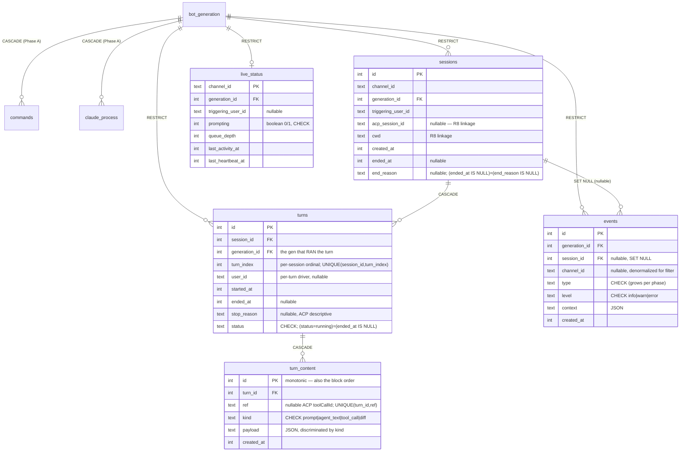

# feat: tdr-code Phase B B1 — persistence schema

## Overview

This plan lands **B1** from the Phase B feature catalog: the durable persistence schema for the
tdr-code web admin console's observability and history surfaces — five new SQLite tables
(`sessions`, `turns`, `turn_content`, `events`, `live_status`) plus their Drizzle migrations,
row/JSON/enum types, discriminated-union view types, type guards, and a schema-integrity test
suite.

B1 is the **cross-phase schema contract for Phase B**. Per the feature landscape, "design the full
schema map here" — the shapes locked now are consumed by every later B unit (writers B2–B5, readers
B8–B12) and extended (not migrated) by Phase C (`config`, `git_identity`) and Phase D (Better Auth
tables) in the same SQLite file via the same drizzle-kit pipeline.

This is a **schema-only** unit. It defines the persistable shapes and proves their integrity in
isolation; it does **not** write rows from the live bot path (B2–B5) or read them into the UI/API
(B8–B12). See [Scope Boundaries](#scope-boundaries) and [Key Technical Decisions](#key-technical-decisions)
for why the data-access repos are deferred to the writer units.

Phase A is complete (`67f592a docs(tdr-code): mark Phase A plan as completed`). It already shipped
the DB substrate B1 builds on: `database.module.ts` (`forRoot({ migrate })`, WAL pragmas,
`process.cwd()`-based migration folder), `test-db.ts` (`createTestDb()`), the drizzle-kit pipeline
(`db:generate`), migration `0000_crazy_vulture`, the `bot_generation` epoch primitive, and the
established schema/repo conventions. B1 reuses all of it unchanged.

---

## Problem Frame

Today nothing about the bot is persisted — live agent sessions and per-channel streaming state live
only in memory (`apps/tdr-code/src/agent/session-manager.service.ts`), and `schema.ts` carries only
the three Phase A operational tables. The console's "see & recover" half (R5–R10) needs a durable
system of record the main server can read even while the bot is down: per-turn transcripts (R6),
session history browsable by channel/time (R7), the linkage to reconcile against claude's own JSONL
(R8), a structured event/error feed (R9–R10), and a poll-fresh live-status snapshot (R5).

B1 is the structural foundation for all of that. Getting the shapes right *once* is the whole point:
the feature landscape repeatedly stresses designing the full schema up front so later phases "extend
without migration churn." A wrong column or FK here propagates churn across ~25–30 downstream units.

*(See origin: `docs/brainstorms/2026-06-27-tdr-code-web-ui-requirements.md`; feature landscape:
`docs/research/2026-06-28-tdr-code-web-ui-feature-landscape.md`.)*

---

## Requirements Trace

- R6. The bot persists a durable per-turn transcript: user prompts, agent message text, tool calls
  (title/kind/status), and diffs. → `sessions` + `turns` + `turn_content` shapes (U1).
- R7. The UI lets an operator browse past sessions and read full transcripts after a session ends,
  organized by channel and time. → schema *affordance* (channel/time indices on `sessions`,
  ordered `turn_content`); the UI/API is B9 (deferred).
- R9. The bot records structured events — session created/evicted, turn started/completed/cancelled/
  errored (with error context), bot restarts. → `events` shape (U2).
- R10. The UI shows a filterable event/error feed, each entry linkable to its session/channel. →
  schema *affordance* (filter/link indices + nullable `session_id`/`channel_id` on `events`); the UI
  is B10 (deferred).
- R5. The UI shows currently active sessions, poll-fresh, degrading to last-known + offline. →
  `live_status` shape (U2); the upsert/heartbeat cadence is B5 and the reader is B8 (deferred).
- R8 / AE4. Each session records the linkage to locate claude's on-disk JSONL for reconciliation. →
  `sessions.acp_session_id` + `sessions.cwd` columns (U1); the feasibility probe is B6 and the
  reconciliation flow is B7 (deferred).

**Origin actors:** A1 (operator — reads history/live/events via later UI units), A2 (main server —
reads this schema), A3 (Discord ACP bot — writes this schema in B2–B5).
**Origin flows:** F2 (read a past session's transcript) — primary; F1 (see live activity) —
`live_status` foundation.
**Origin acceptance examples:** AE4 (covers R8) — B1 lands the linkage columns the reconciliation in
B7 needs; full AE4 verification is deferred to B7.

---

## Scope Boundaries

- **Schema only.** B1 creates the five table definitions, their migrations, types, guards, and
  constraint tests. No live-path writes, no UI, no API.
- **Create only the five Phase B tables.** The full cross-phase map (Phase C `config`/`git_identity`,
  Phase D Better Auth) is *documented* in the `schema.ts` comment block and validated for
  forward-compatibility, but those tables are created by their own phases.
- **No transcript retention/pruning policy** (carried from origin). Rows accumulate. The FK
  `onDelete` semantics are *designed* so a future transcript prune is a single `DELETE FROM sessions`
  that cascades `turns` + `turn_content` (the aggregate) — but **note the asymmetry**: that prune does
  **not** touch `bot_generation` (RESTRICT — the audit epoch is intentionally never pruned), and it
  leaves the session's `events` behind with `session_id` nulled (SET NULL) + `channel_id` retained. A
  pruned session is therefore an irreversible transcript tombstone, not a reversible operation. No
  pruning lands in B1.
- **No reconciliation logic.** B1 ships the columns/indices (`generation_id`, `ended_at`) that the
  future session-reconciliation sweep needs; the sweep itself is a later B unit.

### Deferred to Follow-Up Work

- **Data-access repos** (`sessions.repo`, `turns.repo`, `turn-content.repo`, `events.repo`,
  `live-status.repo`): the insert/append/guarded-update/upsert/query primitives → land with the
  writer features that call them (B2 ACP→SQLite writer, B3 transcript persistence, B4 session
  lifecycle, B5 live-status + heartbeat). Rationale in [Key Technical Decisions](#key-technical-decisions).
  *(If you prefer the Phase A bundling — repos in the schema unit — this is a one-line scope change;
  see [Open Questions](#open-questions).)*
- **R8 JSONL feasibility probe** (does the ACP `newSession` id equal the on-disk JSONL filename?) →
  B6. Runtime spike, not planning; does not gate B1's linkage columns.
- **Live-path writers** (B2–B5), **read UI/API** (B8–B12), **reconciliation flow** (B7).

---

## Context & Research

> Grounded directly against the codebase and the pre-consolidated research doc
> (`docs/research/2026-06-28-tdr-code-web-ui-feature-landscape.md`, "Consolidated research findings"),
> which already settled the external questions (better-sqlite3 WAL multi-process, Drizzle/SQLite
> patterns, JSON columns). No new external research or flow analysis was warranted for a pure
> schema-extension unit built on established patterns.

### Relevant Code and Patterns

- **`apps/tdr-code/src/db/schema.ts`** (Phase A) — the conventions B1 mirrors exactly:
  - Plain `integer().primaryKey()` (no `AUTOINCREMENT`) — see Phase A decision (monotonic rowid,
    trivial "latest," 64-bit, no wraparound). *App-internal consistency overrides swole's autoincrement.*
  - snake_case columns via `text('col_name')` / `integer('col_name', { mode: 'timestamp_ms' })`.
  - Enums as `text({ enum: XS })` **plus** a separate `check('..._check', sql\`... IN (...)\`)`.
  - Exported `XXX_STATUSES` const tuples + derived `XxxStatus` types; `$inferSelect` `XxxRow` types.
  - Discriminated subtypes + type guards co-located in `schema.ts` (`isRunningGeneration`,
    `isEndedGeneration`) — honors the type-guards learning.
  - FK via `.references(() => t.id, { onDelete: ... })`; `index(...)` for query paths.
- **`apps/tdr-code/src/db/database.module.ts`** — reused unchanged (WAL pragmas, `forRoot({ migrate })`,
  `resolveMigrationsFolder()` via `process.cwd()`; re-asserts `foreign_keys=ON` after migrate).
- **`apps/tdr-code/src/db/test-db.ts`** — `createTestDb()` (`:memory:` + pragmas + migrate +
  `foreign_keys=ON` re-assert). B1 tests use it directly.
- **`apps/tdr-code/src/db/__tests__/schema.spec.ts`** — the constraint-test precedent (raw Drizzle
  inserts proving CHECK/FK/CASCADE/guards, all via `createTestDb()`). B1 extends this style.
- **`apps/swole/src/db/schema.ts`** — JSON columns (`text({ mode: 'json' }).$type<T>().notNull()`),
  multi-kind CHECK constraints, and the partial unique index `one_active_session_per_routine`
  (`WHERE completed_at IS NULL`). **`apps/swole/src/db/types.ts`** — `isCompletedSession` guard pattern.

### Institutional Learnings

- `docs/solutions/conventions/type-guards-over-nonnull-assertions-on-db-rows-2026-05-30.md` — model
  conditionally-present columns as discriminated subtypes + guards (active/ended session,
  running/terminal turn, kind-discriminated `turn_content` payload); never `row.col!`.
- `docs/solutions/conventions/begin-immediate-for-read-then-write-mutations-2026-05-27.md` — relevant
  to the *repos* (deferred): read-then-write mutations use `{ behavior: 'immediate' }`; its
  "concurrency is invisible" cost model does **not** hold under two processes (per the WAL research).
- `docs/solutions/conventions/atomicity-tests-must-reach-the-write-phase-2026-06-03.md` — for the
  writer units' atomicity tests (deferred); B1's CHECK constraints are the fault-injection seam.

### External References

All consolidated in the feature landscape's "Multi-process SQLite WAL (R4, R5)" and "Monorepo
patterns to mirror" sections — no re-research needed. Versions in use: `drizzle-orm ^0.45.1`,
`drizzle-kit ^0.31.9`, `better-sqlite3 ^12.10.0`.

---

## Key Technical Decisions

1. **Scope = schema-only; repos deferred to the writer units (B2–B5).** B1 lands tables + migrations
   + types/guards + constraint tests; the data-access primitives ship with the features that call
   them. *Rationale:* (a) the catalog names B1 "Persistence schema" and B2–B5 explicitly as the write
   paths; (b) repo signatures are *shaped by* writer decisions (incremental vs batch append, upsert
   cadence, heartbeat) — building them now risks the exact churn "design the schema once" avoids;
   (c) schema integrity is fully testable in isolation via raw Drizzle inserts (the Phase A
   `schema.spec.ts` precedent). *Considered alternative:* Phase A's U1 bundled schema + all repos +
   tooling in one unit — but it did so because the *tooling* was net-new; that tooling now exists, so
   the only question is "repos with schema or with writers," and the writer-coupling argument wins.
   Flagged for redirection in [Open Questions](#open-questions).

2. **Turn identity = DB-assigned PK + per-session `turn_index` ordinal.** The `id integer primaryKey()`
   is the durable, globally-unique turn identity; `turn_index` is a 1-based per-session display ordinal
   **supplied by the writer from an in-memory per-session counter** (not a DB `max+1` read — that would
   be a write-time read-then-write; see Decision 9), with `UNIQUE(session_id, turn_index)` asserting it.
   This resolves the "in-memory `turnCounter` resets to 0 on restart → collides with cross-restart
   persistence" problem cleanly: the DB id never collides, and a fresh session restarts its
   `turn_index` at 1. The live service-global `turnCounter` / `currentTurnId` (ACP-level, in-memory —
   confirmed service-global in `session-manager.service.ts`) is **unrelated** to DB identity; the
   writer maps a live ACP turn onto a DB `turns` row. This *selects* the "DB-assigned" option the
   cross-phase contract already offered ("DB-assigned turn ids **or** `(generation, counter)`") — it is
   not overturning a Phase A lock (Phase A shipped no turn table). Nothing downstream needs the
   composite tuple: reconciliation keys on `generation_id` (now stamped directly — Decision 3), event
   linking on `session_id`, B9 browse on `turn_index` within a session.

3. **`generation_id` stamped *directly* on every bot-written row the contract names** — `sessions`,
   `turns`, `live_status`, `events` (only `turn_content` reaches it via `turn`→`session`, since it is
   never swept). The feature landscape's "Bot generation / epoch id" section is explicit: the id is
   "stamped on every row the bot writes (`sessions`, `turns`, `live_status`, `events`)." **`turns`
   carries its own `generation_id`** (notNull, FK→`bot_generation` RESTRICT) + a partial index
   `WHERE ended_at IS NULL`, so the crash-reconciliation sweep closes dangling running turns with a
   **direct, indexed, unambiguous** predicate (`WHERE status='running' AND generation_id != :live`)
   rather than an unindexed full-scan join to `sessions`. This also removes a real ambiguity: a turn's
   generation is the one that *ran* it, which is not necessarily its session's *birth* generation —
   stamping it directly is the only unambiguous source. Indexed on each table for the sweep.

4. **FK `onDelete` — a deliberate three-way principle (documented once):**
   - **CASCADE within the transcript aggregate** (`turns`→`sessions`, `turn_content`→`turns`): a
     future prune is a single `DELETE FROM sessions`; these rows are meaningless without their parent.
   - **RESTRICT for history→operational references** (`sessions`→`bot_generation`,
     `turns`→`bot_generation`, `events`→`bot_generation`, `live_status`→`bot_generation`): a
     `bot_generation` delete must not cascade-wipe durable history. This intentionally makes
     `bot_generation` **un-prunable forever** (it is the audit epoch) — a future transcript prune is
     `DELETE FROM sessions`, which cascades the aggregate but never touches `bot_generation`. Matches
     swole's history-FK stance.
   - **SET NULL for `events`→`sessions`**: an event outlives a pruned session, keeping `channel_id`
     for context (`events.session_id` is nullable).
   - *Contrast:* Phase A's `commands`/`claude_process`→`bot_generation` use CASCADE because they are
     ephemeral operational children that *should* die with their generation. The unifying rule:
     CASCADE = "fragment of its parent," RESTRICT = "durable audit," SET NULL = "outlives an optional
     parent." Pruning itself is deferred, but the FKs are designed to support it.

5. **JSON columns via `text({ mode: 'json' }).$type<T>()`** (swole precedent) for
   `turn_content.payload` and `events.context` — tdr-code's first JSON columns. `turn_content.payload`
   is typed as a discriminated union keyed by the `kind` column. JSON internals are **opaque to
   SQLite** (no indexing into payload) — acceptable, because the event feed filters on typed columns,
   not JSON, and a kind↔payload CHECK would re-introduce the migration churn the opaque column avoids
   (rejected). Per-kind payload *field shapes* are refine-able without a migration, so B1 locks the
   `kind` enum + the column and B3 finalizes fields from the ACP event types
   (`apps/tdr-code/src/agent/agent.types.ts`). Two safety requirements follow from that
   write-after-lock skew: (a) the payload accessor must be a **validating narrower** keyed on `kind`
   (a real discriminated parse, not a bare `as` cast), and readers (B9/B10) must render an
   unrecognized/old payload as an "unknown block" rather than throw — one bad historical row must not
   break a whole transcript view (type-guards learning); (b) a **compile-time exhaustiveness pin** ties
   the `kind` CHECK tuple to the payload-union discriminants so they cannot drift (swole's
   `setLogActionEnum` precedent). **Tool-call identity lives in a typed `turn_content.ref` column, not
   in the opaque payload** — see Decision 9.

6. **Enum + CHECK on every closed enum** (`turns.status`, `turn_content.kind`, `sessions.end_reason`,
   `events.level`, `events.type`, `live_status.prompting`) plus positivity CHECKs (`turn_index >= 1`,
   `queue_depth >= 0`), matching Phase A's `bot_generation`/`commands` convention with the documented
   extension path (add value + migration). `events.type` is closed-but-grows-per-phase; the
   migration-per-new-type friction is accepted for typo-safety + schema consistency, with a
   **sanctioned relaxation on a concrete tripwire**: drop the `type` CHECK (keep the `text({ enum })`
   TS type) the first time an event type must be added *without* a migration, or by the third phase
   that adds types. The B-seed set includes not only R9's session/turn types but the
   **already-waiting Phase A producers** whose durable sink was deferred to Phase B — `bot_restart`
   and `command_anomaly` (Phase A U6's "log-only" anomaly recording) — plus `turn_interrupted` (the
   reconciliation sweep) — so B's deferred wiring does not add them as day-one migrations.

7. **R8 linkage columns persisted regardless of probe outcome.** `sessions.acp_session_id` (nullable)
   + `sessions.cwd` (notNull) are cheap, reversible, and required by R8/AE4. The feasibility probe
   (B6 — does the ACP `newSession` id equal the on-disk JSONL filename?) is **runtime, not planning**,
   and does not gate B1; persisting the linkage is correct either way.

8. **No hard "one active session per channel" *unique* index in B1.** A partial *unique* index
   `WHERE ended_at IS NULL` (the swole pattern) would turn a bot crash into a **wedged channel** —
   the dangling prior-generation session would reject the new session's insert until the (not-yet-built)
   session-reconciliation sweep closes it. B1 ships a **non-unique** partial index for fast
   active-session lookup plus the `generation_id`/`ended_at` columns the sweep needs; the
   *unique-index hardening* is deferred to the unit that lands session reconciliation (which can then
   rely on Phase A's "reconcile-before-spawn" ordering guarantee). **Consequence:** until then,
   "one active session per channel" is a **writer invariant** (B4), not a DB guarantee — so the
   active-session reader (B8) must pick the newest-open session deterministically
   (`ORDER BY created_at DESC, id DESC`) and treat any extra open row as a reconciliation signal. The
   active-lookup partial index therefore carries `created_at` for an index-ordered read.

9. **`turn_content` is append + in-place tool-call update, keyed by a typed `ref`.** The ACP seam
   (`apps/tdr-code/src/agent/agent.types.ts`) delivers tool calls as a **create-then-update** stream:
   `onToolCall(channelId, toolCallId, …, status)` then `onToolCallUpdate(channelId, toolCallId,
   status, …)` flips the **same** `toolCallId` to a terminal status. R6 requires persisting tool-call
   `status`, so the writer must update the row it created. B1 therefore gives `turn_content` a
   **nullable `ref` text column** (the ACP `toolCallId`; null for `prompt`/`agent_text`/`diff`) and a
   **UNIQUE partial index `(turn_id, ref) WHERE ref IS NOT NULL`** — one row per tool call, indexed for
   the status update. Without this the first writer (B3) would have to match on opaque JSON
   (contradicting Decision 5) or migrate the column mid-phase (the exact churn this plan prevents).
   **No `seq` column:** block order is the monotonic `id` (single sequential per-channel writer →
   insertion order == id order), so there is **no write-time `max(seq)+1` read**.
   `prompt`/`agent_text`/`diff` are blind INSERTs; `tool_call` is INSERT-then-indexed-single-row-UPDATE
   — both `await`-free, both leaving partial-but-readable rows on a mid-turn crash.
   **Writer invariants this schema assumes (owned by B3/B4, stated here so they aren't rediscovered
   mid-phase):** (i) *attribution at emit time* — the bot's per-channel queue drains via a
   non-`await`ed `executePrompt(...).catch()` (`session-manager.service.ts`), so turn N's trailing
   events can arrive after turn N+1 has opened; the writer must bind each content block / tool-call
   update to the turn that **emitted** it (a handle captured at emit time), not to the channel's
   currently-open turn. Within a single turn, `id` order still equals arrival order, so per-turn reads
   (`WHERE turn_id=? ORDER BY id`) are correct regardless of cross-turn interleave — but only if
   attribution is right. (ii) *`toolCallId` is ACP-**session**-scoped* (one ACP session spans many
   turns) and the content handlers carry only `channelId` — so the writer resolves `ref`→`turn_id`
   from the emitting turn; `UNIQUE(turn_id, ref)` is the correct *per-turn* identity, but whether the
   in-memory channel→turn map suffices (vs. persisting `turns.acp_turn_id` now, or scoping uniqueness
   to `(session_id, ref)`) is a flagged decision — see Open Questions. (iii) *restart re-seed* — if a
   bot restart re-opens a not-yet-`ended` session, the writer must seed its `turn_index` counter from
   `MAX(turn_index)` for that session or `UNIQUE(session_id, turn_index)` rejects the collision.
   (iv) *interrupted tool calls are not corrupt* — a `tool_call` row whose turn was closed
   `interrupted` (its `onToolCallUpdate` never arrived) legitimately keeps a non-terminal status;
   readers (B9) render it as "left in-flight," not an error.

10. **All `live_status` mutations are generation-guarded.** `live_status` is the one genuinely
    *shared-mutable* B-table: the bot upserts it (B5) and main-server reconciliation may clear stale
    prior-generation rows. To prevent a two-process lost update on the single `channel_id` PK row,
    every mutation is generation-guarded (bot upsert `WHERE generation_id <= :gen`; reconciliation
    clear `WHERE generation_id < :gen`), mirroring Phase A's write-once latch and the `claude_process`
    "avoid read-modify-write" reasoning. No new column — `generation_id` already carries this. The
    guard is a writer contract (B5 + reconciliation), stated here so the separately-deferred units
    both honor it.

11. **Secret-bearing content at rest is an accepted, documented risk in B1 — no redaction column
    yet.** `turn_content.payload` and `events.context` persist raw agent output, tool-call inputs, and
    diffs, which can contain secrets the skip-permissions agent saw (env dumps, key/token reads, git
    credentials). The origin defers retention/pruning, so these rows accumulate in **plaintext**. B1's
    posture: the SQLite file is treated as **secret-material** — gated by Traefik `forward-auth`
    through Phase B and by app-owned auth from Phase D, with file-level `umask`/ownership from Phase A;
    at-rest *encryption* is disk-theft-only (research threat model) and is Phase C scope. Whether to
    add a B1 affordance for future scrubbing (a nullable `redacted_at` / `sensitivity` marker on
    `turn_content`/`events`) vs. accepting a later migration is a **flagged decision** — see Open
    Questions; B1 does not add it speculatively. Recorded in Risks & Dependencies so it is not silently
    inherited.

---

## Open Questions

### Resolved During Planning

- **Repos in B1 or with writers?** → With writers (B2–B5). Decision 1. *(Recommended; redirectable —
  see below.)*
- **Turn identity scheme?** → DB-assigned PK + per-session `turn_index`. Decision 2.
- **FK delete semantics?** → CASCADE (aggregate) / RESTRICT (history→operational) / SET NULL
  (events→sessions). Decision 4.
- **JSON payload typing?** → `text({ mode: 'json' }).$type<union>()`, payload fields refine-able in
  B3. Decision 5.
- **`events.type` — CHECK or open text?** → CHECK now (consistency), with a sanctioned later
  relaxation. Decision 6.
- **Enforce one-active-session-per-channel at the DB?** → Not in B1 (would wedge a crashed channel);
  non-unique ordered index now, unique hardening with reconciliation. Decision 8.
- **`turn_content` ordering + tool-call status updates?** → Order by monotonic `id` (no `seq`);
  tool-call identity in a typed `ref` column with a UNIQUE partial index for in-place status updates.
  Decision 9.
- **Does `turns` carry `generation_id` directly?** → Yes — direct stamp + partial index (the contract
  mandates it; makes the dangling-turn sweep a direct indexed predicate). Decision 3.
- **Two-writer `live_status` safety?** → Generation-guarded mutations (write-once-latch pattern).
  Decision 10.

### Deferred to Implementation

- **R8 reconciliation feasibility** (B6): whether the ACP `sessionId` maps to claude's on-disk JSONL
  filename. Determines B7's shape; B1's linkage columns stand either way.
- **`sessions.end_reason` taxonomy refinement**: B1 seeds `evicted` / `teardown` / `interrupted`; B4
  (session lifecycle) owns the exact lifecycle→reason mapping and may add a value (+ migration).
- **`live_status` terminal representation**: whether reconciliation deletes prior-generation rows or
  the reader derives "offline/last-seen" from `generation_id` + `last_heartbeat_at`. B1's shape
  supports both; the B-reconciliation/B8 reader decides.
- **`turn_content.payload` per-kind field shapes**: finalized in B3 from the ACP event types
  (non-migration change — opaque JSON column).
- **Whether to bundle repos into B1** (Phase A style) vs. defer (recommended). One-line scope change;
  decide at the post-plan menu.
- **Tool-call attribution robustness (decide at B3, possibly pull into B1):** `toolCallId` is
  ACP-**session**-scoped and the content handlers carry only `channelId`, while the queue drains
  non-`await`ed — so a late `onToolCallUpdate` could be mis-attributed if the writer keys off the
  channel's currently-open turn. The conservative B1 stance keeps `UNIQUE(turn_id, ref)` + an
  in-memory channel→turn map and documents the emit-time-attribution invariant (Decision 9). If that
  map proves unreliable, the additive schema seams are **persist `turns.acp_turn_id`** (recover the
  mapping across restarts) or **scope uniqueness to `(session_id, ref)`** — both cheaper in B1 than as
  B3 churn. *Flagged for the user / B3.*
- **Secret-at-rest scrubbing affordance (decide now vs migrate later):** whether to add a nullable
  `redacted_at` / `sensitivity` marker to `turn_content`/`events` in B1 (so a future scrub needs no
  migration) or accept the later migration. B1's default is defer (Decision 11). *Flagged for the user.*
- **`events.channel_id` consistency** is a writer invariant (B2/B4 copy the session's `channel_id` when
  `session_id` is non-null); SQLite can't cheaply CHECK it, so it cannot be a B1 DB constraint —
  confirm the writer units assert it.

---

## High-Level Technical Design

> *This illustrates the intended approach and is directional guidance for review, not implementation
> specification. The implementing agent should treat it as context, not code to reproduce. Final
> column names/types follow the Phase A `schema.ts` conventions exactly.*

### Entity-relationship shape (Phase A + new Phase B tables)



### Directional column/constraint sketch (new tables only)

| Table | Columns (type · null? · notes) | Constraints / indices |
|---|---|---|
| `sessions` | `id` int PK · `channel_id` text · `generation_id` int→`bot_generation` RESTRICT · `triggering_user_id` text · `acp_session_id` text? · `cwd` text · `created_at` ts · `ended_at` ts? · `end_reason` text? `{evicted,teardown,interrupted}` | CHECK `end_reason`; **CHECK `(ended_at IS NULL)=(end_reason IS NULL)`**; idx `(channel_id, created_at)` (browse R7); idx `(generation_id)` (reconcile); **non-unique** partial idx `(channel_id, created_at) WHERE ended_at IS NULL` (active lookup) |
| `turns` | `id` int PK · `session_id` int→`sessions` CASCADE · **`generation_id` int→`bot_generation` RESTRICT** · `turn_index` int · `user_id` text **?** · `started_at` ts · `ended_at` ts? · `stop_reason` text? (descriptive) · `status` text `{running,completed,cancelled,errored,interrupted}` | CHECK `status`; **CHECK `(status='running')=(ended_at IS NULL)`**; **CHECK `turn_index >= 1`**; **UNIQUE `(session_id, turn_index)`**; partial idx `(generation_id) WHERE ended_at IS NULL` (dangling-turn sweep) |
| `turn_content` | `id` int PK · `turn_id` int→`turns` CASCADE · **`ref` text?** (ACP `toolCallId`) · `kind` text `{prompt,agent_text,tool_call,diff}` · `payload` json($type union) · `created_at` ts | CHECK `kind`; **UNIQUE partial `(turn_id, ref) WHERE ref IS NOT NULL`**; idx `(turn_id)` (read in `id` order). *No `seq`.* |
| `events` | `id` int PK · `generation_id` int→`bot_generation` RESTRICT · `session_id` int?→`sessions` SET NULL · `channel_id` text? · `type` text (closed enum, grows) · `level` text `{info,warn,error}` · `context` json · `created_at` ts | CHECK `type`, CHECK `level`; idx `(created_at)`, `(channel_id, created_at)`, `(session_id)`, `(type)`. *A global event (null `session_id` AND null `channel_id`) is valid.* |
| `live_status` | `channel_id` text PK · `generation_id` int→`bot_generation` RESTRICT · `triggering_user_id` text? · `prompting` int(bool) · `queue_depth` int · `last_activity_at` ts · `last_heartbeat_at` ts | CHECK `prompting IN (0,1)`; **CHECK `queue_depth >= 0`**; idx `(generation_id)` (reconcile). Bounded by `maxConcurrentSessions` (~5 rows) → no `last_activity_at` index |

> **Deltas from the feature-landscape schema map.** B1 is the locking unit, so these shapes supersede
> the *directional* table in `docs/research/2026-06-28-tdr-code-web-ui-feature-landscape.md` for three
> columns: `turns` **gains** `generation_id` (the landscape's "Bot generation / epoch id" prose
> mandates stamping it on every bot-written row; only its table omitted it); `turn_content` **drops**
> `seq` (ordering is monotonic `id` — Decision 9) and **gains** `ref` (the ACP `toolCallId`).
> Downstream B2–B12 / C / D planners should treat B1 as authoritative for these tables.

### Discriminated view types (directional)

```text
ActiveSession  = SessionRow & { endedAt: null }
EndedSession   = SessionRow & { endedAt: Date; endReason: SessionEndReason }
isActiveSession / isEndedSession   (guards on endedAt)

RunningTurn    = TurnRow & { status: 'running'; endedAt: null }
TerminalTurn   = TurnRow & { endedAt: Date; status: 'completed'|'cancelled'|'errored'|'interrupted' }
isRunningTurn / isTerminalTurn             // sound because CHECK (status='running')=(ended_at IS NULL)

TurnContentPayload =                       // discriminant = the `kind` column; tool-call identity = the `ref` column
  | { kind: 'prompt';     ... }            // text + optional image blocks (typing-images)
  | { kind: 'agent_text'; text: string }
  | { kind: 'tool_call';  title; toolKind; status }   // R6: title / kind / status; updated in place via `ref`
  | { kind: 'diff';       ... }            // exact fields finalized in B3 from ACP event types
// payload accessor = a VALIDATING narrower keyed on `kind` (not a cast); readers render unknown/old shapes, never throw.
```

---

## Implementation Units

- U1. **Transcript persistence schema (`sessions`, `turns`, `turn_content`)**

**Goal:** Add the three transcript-aggregate tables to `schema.ts` with enums + CHECKs, FKs (CASCADE
within the aggregate; RESTRICT to `bot_generation`), indices, the R8 linkage columns, JSON-typed
`turn_content.payload`, row types, discriminated view types + guards; generate migration `0001`;
refresh the cross-phase full-map comment. Establishes the R6/R7 + AE4 foundation.

**Requirements:** R6; R7 (affordance); R8/AE4 (linkage columns).

**Dependencies:** None (Phase A substrate exists).

**Files:**
- Modify: `apps/tdr-code/src/db/schema.ts` (add `sessions`, `turns`, `turn_content`; `SESSION_END_REASONS`,
  `TURN_STATUSES`, `TURN_CONTENT_KINDS` tuples + types; `TurnContentPayload` union; row types +
  `isActiveSession`/`isEndedSession`/`isRunningTurn`/`isTerminalTurn` guards; update the full-map
  comment to reflect locked B-table shapes + C/D forward-compat notes)
- Create: `apps/tdr-code/src/db/migrations/0001_*.sql` (via `pnpm --filter @lilnas/tdr-code db:generate`)
- Test: `apps/tdr-code/src/db/__tests__/schema-transcript.spec.ts`

**Approach:**
- Mirror Phase A `schema.ts` conventions exactly: plain `integer().primaryKey()`, snake_case columns,
  `text({ enum })` + separate `check()`, `timestamp_ms` integers, co-located guards.
- `turns`: carries its own `generation_id` (notNull, FK→`bot_generation` RESTRICT) + partial index
  `WHERE ended_at IS NULL` (Decision 3, dangling-turn sweep). `status` includes the non-terminal
  `running` so `isRunningTurn`/`isTerminalTurn` mirror `bot_generation`; a **CHECK
  `(status='running')=(ended_at IS NULL)`** makes those guards sound. `turn_index` is caller-supplied
  from an in-memory per-session counter (no `max+1` read) with **UNIQUE `(session_id, turn_index)`** +
  **CHECK `turn_index >= 1`**. `user_id` is **nullable** — a reconciliation-closed/`interrupted` or
  idle-evicted turn has no live driver to record (Decision 2; arch review). `stop_reason` is the
  ACP-reported descriptive reason (free text, **not** CHECK-constrained — distinct from the controlled
  `status` enum); B3 finalizes its values.
- `sessions`: **CHECK `(ended_at IS NULL)=(end_reason IS NULL)`** makes `isEndedSession` sound; the
  active-lookup partial index is `(channel_id, created_at) WHERE ended_at IS NULL` so the reader picks
  newest-open deterministically (Decision 8). `acp_session_id` nullable, `cwd` notNull (R8 linkage).
- `turn_content`: **append + in-place tool-call update** (Decision 9). Each block its own row; order by
  monotonic `id` (no `seq`). Nullable `ref` carries the ACP `toolCallId`; **UNIQUE partial
  `(turn_id, ref) WHERE ref IS NOT NULL`** = one row per tool call, indexed for the status update.
  `prompt`/`agent_text`/`diff` = blind INSERT; `tool_call` = INSERT then indexed single-row UPDATE.
  Mid-turn crash still leaves partial-but-readable rows.
- `payload` via `text('payload', { mode: 'json' }).$type<TurnContentPayload>()`, union keyed by `kind`;
  a compile-time exhaustiveness pin ties the `kind` tuple to the union (swole `setLogActionEnum`); B3
  finalizes per-kind fields (non-migration change).
- Caller-injected timestamps (no `$defaultFn`) — matches Phase A repos, keeping future writer tests
  deterministic.

**Technical design:** See [High-Level Technical Design](#high-level-technical-design) ERD + sketch
(directional).

**Patterns to follow:** `apps/tdr-code/src/db/schema.ts` (Phase A tables + guards); `apps/swole/src/db/schema.ts`
(JSON columns, `UNIQUE`, partial index); `apps/swole/src/db/types.ts` (`isCompletedSession`);
type-guards learning.

**Test scenarios:**
- Happy path: `createTestDb()` applies `0001`; insert+read a `session`, a `turn`, and one
  `turn_content` of each `kind`; types round-trip; `foreign_keys` is ON post-migrate.
- Happy path (JSON): a `tool_call` payload persists and reads back as `{ title, toolKind, status }`
  through the validating narrower; a `prompt` payload round-trips. *(Covers R6.)*
- Happy path (tool-call update): an `onToolCall` INSERT (status `pending`, a given `ref`) followed by
  an `onToolCallUpdate`-shaped UPDATE found via `(turn_id, ref)` flips the **same single row** to
  `completed` — proving the create-then-update contract resolves to one updatable row. *(Covers R6.)*
- Integration (interrupted tool call): a `tool_call` row INSERTed `pending` whose turn is then closed
  `interrupted` (no update arrives) stays readable with its non-terminal status — confirming readers
  treat it as "left in-flight," not corrupt (Decision 9 invariant iv).
- Edge case (unknown payload kind): a `turn_content` row written with an unrecognized `kind` (an
  old/future shape) reads back through the validating narrower as an "unknown block" rather than
  throwing — one bad/old row cannot break a transcript view (Decision 5).
- Edge case (guards): `isActiveSession`/`isEndedSession` narrow `ended_at`/`end_reason`;
  `isRunningTurn`/`isTerminalTurn` narrow `status`/`ended_at` — no `!`/`as`.
- Edge case (correlation CHECK): a `session` with `ended_at` set but `end_reason` null is rejected
  (and vice-versa); a `turn` with `status='running'` + non-null `ended_at`, and a terminal `turn` with
  null `ended_at`, are rejected — so the guards can never mis-narrow a bad row.
- Edge case (enum/positivity CHECK): out-of-domain `turns.status`, `turn_content.kind`,
  `sessions.end_reason` are rejected; `turn_index < 1` is rejected.
- Edge case (UNIQUE): a duplicate `turns(session_id, turn_index)` is rejected; a second `turn_content`
  with the same `(turn_id, ref)` is rejected; two `ref IS NULL` blocks in one turn are both allowed
  (partial-index scope).
- Error path (FK): a `turn` with a non-existent `session_id` or `generation_id`, and a `turn_content`
  with a non-existent `turn_id`, are rejected (non-vacuous — `foreign_keys` re-asserted).
- Integration (CASCADE): deleting a `session` deletes its `turns` and transitively its
  `turn_content`; deleting a `turn` deletes its `turn_content`.
- Integration (RESTRICT): deleting a `bot_generation` that has a `session` *or* a `turn` is rejected.
- Integration (reconciliation affordance): a dangling `turn` (`status='running'`, `ended_at` null)
  from one `generation_id` is found by `WHERE status='running' AND generation_id != :live` (the
  partial index serves it); closing it sets `status='interrupted'` + `ended_at` (satisfying the
  correlation CHECK).
- Integration (linkage): a `session` persists `acp_session_id` + `cwd` and reads them back.
  *(Covers AE4 — schema affordance; full reconciliation is B7.)*
- Integration (nullable driver): a `turn` with `user_id` null is accepted (reconciliation-closed turn).
- Integration (active lookup): the `(channel_id, created_at) WHERE ended_at IS NULL` partial index
  exists in `sqlite_master` and the newest-open lookup plan uses it.
- Verification: `db:generate` produces `0001_*.sql`; the migration journal advances to idx 1; the
  compile-time exhaustiveness pin errors if a `kind` is added to the tuple without a payload-union arm;
  `type-check` + `lint` pass.

**Verification:** Schema compiles; `0001` generated and applied by `createTestDb()`; guards narrow;
CHECK/FK/CASCADE/RESTRICT/UNIQUE enforced; type-check + lint pass.

---

- U2. **Observability schema (`events`, `live_status`)**

**Goal:** Add the event-feed and live-status tables with enums + CHECKs, FKs (RESTRICT to
`bot_generation`; SET NULL for `events`→`sessions`), filter/link/reconcile indices, JSON `context`,
the boolean `prompting`, row types + any guards; generate migration `0002`; finalize the full-map
comment. Establishes the R9/R10 + R5 foundation.

**Requirements:** R9; R10 (affordance); R5 (affordance).

**Dependencies:** U1 (`events.session_id` references `sessions`).

**Files:**
- Modify: `apps/tdr-code/src/db/schema.ts` (add `events`, `live_status`; `EVENT_TYPES`,
  `EVENT_LEVELS` tuples + types; row types; JSON `EventContext` type)
- Create: `apps/tdr-code/src/db/migrations/0002_*.sql` (via `db:generate`)
- Test: `apps/tdr-code/src/db/__tests__/schema-observability.spec.ts`

**Approach:**
- `events.type` seeded with R9's set — `session_created`, `session_evicted`, `turn_started`,
  `turn_completed`, `turn_cancelled`, `turn_errored`, `bot_restart` — **plus the already-waiting
  Phase A producers** whose durable sink was deferred to Phase B: `command_anomaly` (Phase A U6's
  log-only anomaly recording) and `turn_interrupted` (the reconciliation sweep). CHECK'd; grows per
  phase with the concrete relaxation tripwire (Decision 6).
- `events.level` `{info,warn,error}` CHECK'd; `events.context` JSON (`$type<EventContext>()`) holds
  error context (R9 "with error context") and structured fields, read via a validating narrower.
- `events.session_id` nullable + SET NULL (events outlive a pruned session); `channel_id` nullable
  text, denormalized so a non-session-scoped event still filters by channel. **A bot-global event
  (`bot_restart`, `command_anomaly`) has *both* `session_id` and `channel_id` null — this is valid**,
  and B10's feed filter must treat "no channel" as a first-class value, not a data bug. **Writer
  invariant:** when `session_id` is non-null the writer copies that session's `channel_id` (a
  session-scoped event must agree with its session's channel); SQLite can't cheaply CHECK a subquery,
  so B2/B4 own this — a mismatch would silently mis-file the event into another channel's feed.
- `live_status.channel_id` is the PK (the upsert target for B5); `prompting` via
  `integer({ mode: 'boolean' })` + CHECK `IN (0,1)`; **CHECK `queue_depth >= 0`**; `generation_id` +
  `last_heartbeat_at` are the liveness primitives the B8 reader derives "offline/last-seen" from. No
  terminal column — the shape supports both delete-on-reconcile and derive-from-generation (deferred).
  **All mutations are generation-guarded** (Decision 10) — `live_status` is the one shared-mutable
  B-table (bot upsert + main-server reconciliation clear). Bounded by `maxConcurrentSessions`
  (~5 rows) → **no `last_activity_at` index** (premature against a single-digit table).
- Indices for the feed (B10) and reconciliation: `events(created_at)`, `events(channel_id, created_at)`,
  `events(session_id)`, `events(type)`; `live_status(generation_id)`.

**Technical design:** See [High-Level Technical Design](#high-level-technical-design) (directional).

**Patterns to follow:** Phase A `commands` (closed enum + CHECK + extension-path comment);
`apps/swole/src/db/schema.ts` (JSON column, boolean-via-integer); type-guards learning.

**Test scenarios:**
- Happy path: `createTestDb()` applies `0001`+`0002`; insert+read an `event` of each `type` and a
  `live_status` row; types round-trip. *(Covers R9.)*
- Happy path (JSON): an error `event` persists `context` (e.g., `{ message, stack }`) and reads it
  back typed.
- Happy path (boolean): `live_status.prompting` round-trips as a TS `boolean`.
- Happy path (global event): a `bot_restart` event with `session_id` null **and** `channel_id` null is
  accepted and read back. *(Covers R10 — global events are valid.)*
- Edge case (CHECK): out-of-domain `events.type`, `events.level`, `live_status.prompting` (e.g. `2`),
  and `live_status.queue_depth < 0` are rejected.
- Error path (FK): an `event` with a non-existent `generation_id`, and a `live_status` with a
  non-existent `generation_id`, are rejected.
- Integration (SET NULL): deleting a `session` referenced by an `event` nulls `events.session_id`
  while the event survives with its `channel_id`. *(Covers R10 link-survives-prune affordance.)*
- Integration (RESTRICT): deleting a `bot_generation` with an `event` or `live_status` row is rejected.
- Integration (upsert target + generation guard): a second write on the same `live_status.channel_id`
  resolves via `ON CONFLICT(channel_id) DO UPDATE`; a generation-guarded clear
  (`WHERE generation_id < :live`) affects a stale-generation row but **zero** rows for the live
  generation — pinning the write-once-latch shape for the two-writer case (Decision 10).
- Integration (two-writer sanity): a `migrate:false` connection on the same temp-file DB sees
  `events`/`live_status` after a `migrate:true` connection migrates (mirrors Phase A's two-writer test).
- Verification: `db:generate` produces `0002_*.sql`; journal advances to idx 2; type-check + lint pass.

**Verification:** Schema compiles; `0002` generated and applied; CHECK/FK/SET-NULL/RESTRICT enforced;
upsert-target conflict observed; two-writer sanity holds; type-check + lint pass.

---

## System-Wide Impact

- **Interaction graph:** This is the cross-phase schema contract. Direct consumers: B2 (ACP→SQLite
  writer) on the `ACP_EVENT_HANDLERS` seam, B3 (`turn_content` incremental writes), B4 (`sessions`/
  `turns` lifecycle), B5 (`live_status` upsert + heartbeat); readers B8–B12. Phase C adds
  `config`/`git_identity`; Phase D adds Better Auth tables — all to the same file via the same
  drizzle-kit pipeline.
- **Forward-compatibility (C/D):** `sessions.triggering_user_id` and `turns.user_id` are **raw Discord
  snowflakes** (text, no FK to a not-yet-existing table). They are the join keys Phase C's
  `git_identity.discord_user_id` (PK) and Phase D's `account.accountId` will use. B1 must keep them
  un-FK'd snowflake strings so C/D attach without migration churn — an FK now would reject
  turns/sessions for users who never logged in or configured git. `turns.user_id` (per-turn driver,
  may differ from the session creator) is what C7's per-turn git identity keys on, and is **nullable**:
  a reconciliation-closed `interrupted` turn (no live driver) simply has no git attribution, which is
  correct (it did no git work).
- **Error propagation:** Schema-only — CHECK/FK violations surface as `SqliteError` to future writer
  callers; the writer units own translating them.
- **State lifecycle / reconciliation:** `turns` carries its own `generation_id` (+ partial index) so
  the future session-reconciliation sweep closes prior-generation dangling `turns` as `interrupted`
  with a **direct, indexed** predicate (`WHERE status='running' AND generation_id != :live`) — not an
  unindexed join to `sessions` (whose `generation_id` is the session's *birth* generation, not the
  turn's running generation). `generation_id` + `last_heartbeat_at` on `live_status` drive the
  "mark/clear stale" half (the A6 "live_status/turns half" deferred until this schema exists). The
  main-server reconciliation write cannot race the live bot: the swept generation is already dead, and
  the generation-guarded predicate (Decision 10) makes the write affect zero current-generation rows.
- **Two-writer `live_status`:** the one genuinely shared-mutable B-table (bot upsert + main-server
  reconciliation clear). All mutations are generation-guarded (Decision 10) — the same write-once-latch
  discipline Phase A applies to `bot_generation` and the read-modify-write avoidance behind
  `claude_process` — so a single `channel_id` PK row cannot lose an update across the two processes.
- **Hot-path safety (C1–C4):** a *writer* (B2–B5) concern, not B1 — but B1's shapes are chosen so the
  writer can stay `await`-free in the turn hot path: `turn_content` blocks order by monotonic `id`
  (no `max(seq)+1` read), `prompt`/`agent_text`/`diff` are blind INSERTs and a `tool_call` status flip
  is an indexed single-row UPDATE via `ref`; `turn_index` comes from an in-memory counter (no read);
  `live_status` is a single generation-guarded upsert. No read-then-write is forced by the schema.
- **Migration coexistence:** `0001`/`0002` apply on top of Phase A's `0000` on the live two-writer
  DB; only the main server migrates (Phase A decision), the bot opens connection + pragmas only.
- **Unchanged invariants:** Phase A's `bot_generation`/`commands`/`claude_process` tables, their
  repos, the write-once latch behavior, and `database.module.ts`/`test-db.ts` are **untouched**. B1
  is purely additive (new tables + new migrations).

---

## Risks & Dependencies

| Risk | Mitigation |
|------|------------|
| A B-writer discovers a missing column/index, forcing schema churn | Design the full shape now (this plan); the deepening pass already caught two such gaps (`turns.generation_id`, `turn_content.ref`) and folded them in. Remaining *index* additions are cheap migrations; the locked *contract* is table shapes/FKs/enums. |
| JSON `payload`/`context` opaque to SQL filtering | Intentional — the feed (B10) filters on typed columns (`type`, `level`, `channel_id`, `created_at`), never JSON internals. Documented. |
| JSON payload version skew — B3 finalizes per-kind fields *after* B1 locks the column, so old rows won't match new union shapes | Payload accessor is a **validating narrower** keyed on `kind`; readers render an unrecognized/old shape as an "unknown block" rather than throw (Decision 5). One bad/old row cannot break a transcript view. |
| Tool-call status can't be updated in place (create-then-update ACP stream) | Typed `turn_content.ref` (ACP `toolCallId`) + UNIQUE partial index resolves the update target in B1, not as B3 churn (Decision 9). |
| Two-process lost update on the shared `live_status` row | All mutations generation-guarded (Decision 10); a U2 test pins the write-once-latch behavior. |
| Secret-bearing agent output (tool I/O, diffs) accumulates in plaintext `payload`/`context` with no retention | Documented posture (Decision 11): the DB file is secret-material, gated by forward-auth (Phase B) then app auth (Phase D); encryption is Phase C (disk-theft-only); a scrub-affordance column is a flagged decision, not silently dropped. |
| Late ACP tool-call update mis-attributed to the wrong turn (session-scoped `toolCallId` + non-`await`ed queue drain) | Emit-time-attribution writer invariant documented (Decision 9, invariants i/ii); `acp_turn_id` or `(session_id, ref)` flagged as the additive schema seam if the in-memory channel→turn map proves unreliable. |
| `events.type` CHECK creates migration friction across phases | Documented extension path (add value + migration); sanctioned later relaxation (drop the `type` CHECK, keep the TS enum) if churn proves painful. |
| FK `onDelete` chosen wrong → silent history loss or wedged deletes | Explicit three-way principle (Decision 4) + dedicated CASCADE/RESTRICT/SET-NULL tests in U1/U2. |
| Premature unique "one active session per channel" wedges a crashed channel | Deferred to the reconciliation unit (Decision 8); B1 ships a non-unique partial index only. |
| Repo deferral leaves B1 "untestable end-to-end" | Schema integrity is fully tested in isolation via raw Drizzle (Phase A precedent); end-to-end is the writer units' verification. |

**Dependency:** Phase A complete and merged (it is — `67f592a`). No external prerequisites.

---

## Documentation / Operational Notes

- Update the cross-phase full-map comment block at the top of `apps/tdr-code/src/db/schema.ts` so the
  five B tables read as **locked** (not "anticipated"), and C/D remain documented-but-not-created.
- The `events.type` seed includes the deferred Phase A producers (`command_anomaly`, `bot_restart`)
  and the reconciliation `turn_interrupted` type, so wiring those sinks later needs no migration.
- No deploy/runtime change: B1 is additive schema. The migrations run on the main server's boot
  `migrate()` (Phase A path); the WAL deploy extras and storage volume already exist.
- No new dependencies (`drizzle-orm`/`drizzle-kit`/`better-sqlite3` already present).

---

## Sources & References

- **Origin document:** [`docs/brainstorms/2026-06-27-tdr-code-web-ui-requirements.md`](../brainstorms/2026-06-27-tdr-code-web-ui-requirements.md)
  (R5–R10, AE4, F1/F2, A1–A3).
- **Feature landscape (master catalog + consolidated research):**
  [`docs/research/2026-06-28-tdr-code-web-ui-feature-landscape.md`](../research/2026-06-28-tdr-code-web-ui-feature-landscape.md)
  (B1 row; full schema map; WAL/Drizzle research).
- **Phase A plan (precedent + locked decisions):**
  [`docs/plans/2026-06-29-001-feat-tdr-code-two-process-substrate-plan.md`](2026-06-29-001-feat-tdr-code-two-process-substrate-plan.md)
  (U1 schema-foundation; generation-id, integer-PK, migration-ownership decisions).
- **Current code:** `apps/tdr-code/src/db/schema.ts`, `database.module.ts`, `test-db.ts`,
  `__tests__/schema.spec.ts`, `migrations/0000_crazy_vulture.sql`; `apps/tdr-code/drizzle.config.ts`
  (package root — `out: './src/db/migrations'`); `apps/tdr-code/src/agent/agent.types.ts` (ACP event
  shapes B3 will map into `turn_content.payload`).
- **Patterns to mirror:** `apps/swole/src/db/schema.ts`, `apps/swole/src/db/types.ts`.
- **Institutional learnings:** `docs/solutions/conventions/type-guards-over-nonnull-assertions-on-db-rows-2026-05-30.md`,
  `begin-immediate-for-read-then-write-mutations-2026-05-27.md`,
  `atomicity-tests-must-reach-the-write-phase-2026-06-03.md`.
