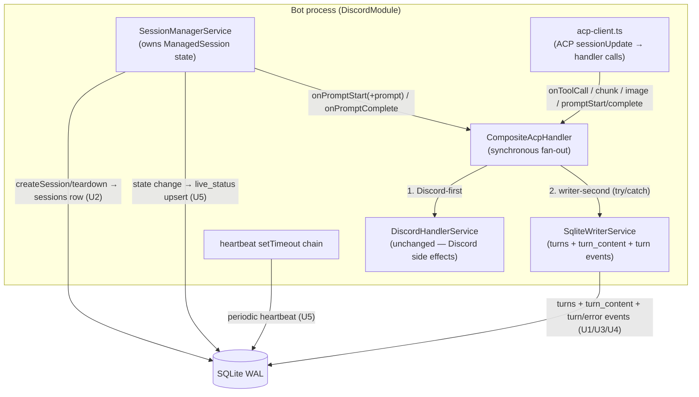

# feat: tdr-code Phase B B2–B5 — live-path SQLite writers

## Overview

This plan lands **B2–B5** from the Phase B feature catalog: the **live-path writers** that persist
Discord agent activity into the SQLite system-of-record so the web console's "see & recover" surfaces
(R5–R10) have data to read. Four coupled features plus their deferred data-access repos:

- **B2** — a composite ACP event handler on the `ACP_EVENT_HANDLERS` seam that fans every event to
  **both** the existing `DiscordHandlerService` **and** a new SQLite writer, synchronously.
- **B3** — incremental per-turn transcript persistence: `turns` rows (open/close) and `turn_content`
  blocks (prompt, agent text, tool calls, diffs), written as they happen so a mid-turn crash leaves
  partial-but-readable data.
- **B4** — session lifecycle rows: a `sessions` row created when the bot spawns a `claude` session and
  closed at teardown, carrying the R8 linkage columns (`acp_session_id`, `cwd`).
- **B5** — `live_status` upserts (channel, user, prompting/idle, queue depth, last activity) plus a
  periodic heartbeat, generation-guarded for two-process safety.

These are exactly the writer units that the **B1 schema plan deferred its repos to**
(`docs/plans/2026-06-30-001-feat-tdr-code-phase-b-persistence-schema-plan.md`: *"the insert/append/
guarded-update/upsert/query primitives → land with the writer features that call them"*). This plan
therefore owns `sessions.repo`, `turns.repo`, `turn-content.repo`, `events.repo`, and
`live-status.repo`.

This is the **write half** of Phase B. It does **not** build any HTTP controller, page, or read query
(the read surfaces are B8–B12), the JSONL feasibility probe (B6), or the reconciliation flow (B7).

---

## Problem Frame

Today the bot persists **nothing** about agent activity — live sessions and per-channel streaming
state live only in memory (`apps/tdr-code/src/agent/session-manager.service.ts`,
`apps/tdr-code/src/discord/discord-handler.service.ts`). The console's "see & recover" half (R5–R10)
needs the bot (actor A3) to write a durable record the main server (A2) can read even while the bot is
down: a poll-fresh live snapshot (R5), per-turn transcripts (R6/R7), session linkage for
reconciliation (R8), and a structured event/error feed (R9/R10).

B1 landed the **shapes** (five tables, types, guards, constraints — merged at `ff13dfb`, `2026-06-30`).
This plan lands the **writers** that fill them from the live, race-sensitive turn loop — without
perturbing the C1–C4 cancel/drain invariants the sibling `stop-clear` and `typing-images` features
depend on, and correctly across the two-process WAL boundary Phase A established.

*(See origin: `docs/brainstorms/2026-06-27-tdr-code-web-ui-requirements.md`; feature landscape:
`docs/research/2026-06-28-tdr-code-web-ui-feature-landscape.md`.)*

---

## Requirements Trace

- R5. The UI shows currently active sessions (channel, triggering user, prompting/idle, queue depth,
  last activity, age), poll-fresh, degrading to last-known + offline. → **U5** writes `live_status`
  (state-change upserts + heartbeat). The reader is B8 (deferred).
- R6. The bot persists a durable per-turn transcript: user prompts, agent message text, tool calls
  (title/kind/status), diffs. → **U3** (`turns`) + **U4** (`turn_content`).
- R7. The UI lets an operator browse past sessions and read full transcripts by channel/time. →
  **U2/U3/U4** produce the browsable rows (the channel/time indices ship in B1); the UI/API is B9.
- R8 / AE4. Each session records the linkage to locate claude's on-disk JSONL. → **U2** persists
  `sessions.acp_session_id` + `sessions.cwd`. The feasibility probe is B6; the reconciliation flow is
  B7 (both deferred).
- R9. The bot records structured events — session created/evicted, turn started/completed/cancelled/
  errored (with error context), bot restarts. → **U1** (events.repo + the already-waiting Phase A
  producers `bot_restart`/`command_anomaly`), **U2** (session events), **U3** (turn events).
- R10. The UI shows a filterable event/error feed linkable to session/channel. → events written by
  U1/U2/U3 carry the `session_id`/`channel_id` link columns; the feed UI is B10 (deferred).

**Origin actors:** A3 (Discord ACP bot — **the writer these units embody**); A2 (main server — reads
this data later, and owns the deferred `bot_restart` producer in the supervisor); A4 (claude session —
the source of the transcript content the writer captures via ACP events).
**Origin flows:** F2 (read a past session's transcript) — U2/U3/U4 produce its data; F1 (see live
activity & recover) — U5 produces its live data; F4 (restart the bot) — the writers' generation
stamping + the `bot_restart` event support its UI/feed reflection.
**Origin acceptance examples:** AE4 (covers R8) — U2 lands the linkage columns the B7 reconciliation
needs; full AE4 verification is deferred to B7. (AE3 is R16 git-blocking = Phase C; AE1/AE2/AE5/AE6 are
other phases.)

---

## Scope Boundaries

- **Write path only.** This plan persists data from the live bot path. It builds **no** HTTP
  controller, API route, page, or read query (those are B8–B12).
- **The five Phase B repos, scoped to writer needs.** Each repo lands with the writer that defines its
  signature, exposing only the primitives that writer calls (insert/append/guarded-update/upsert plus the
  minimal reads the writer itself needs — e.g. the one-time `maxTurnIndex` counter seed). A small number
  of reads with *named deferred consumers* are also built (`getActiveSession`, `findDanglingTurns`,
  `clearStaleByGeneration` — for the boot-reconciliation sweep + B8), but **not** read primitives whose
  only consumer is the UI with no writer caller (e.g. `listLive` ships in B8, not here — doc-review F8).
  The rich read/query surface for the UI is added by B8–B12.
- **No reconciliation logic and no JSONL probe.** U2 writes the linkage columns; the B6 probe and B7
  reconciliation flow are out of scope. The *boot-time* "close orphaned sessions / clear stale
  live_status" sweep is noted as a seam for the reconciliation unit, not built here (see Deferred).
- **No retention/pruning** (carried from origin). Rows accumulate; secret-bearing content persists in
  plaintext per B1's accepted posture (gated by forward-auth through Phase B).
- **No new global config wiring** (R13 = Phase C); writers read existing `env()` / Phase A config as
  today.

### Deferred to Follow-Up Work

- **Boot-time B-reconciliation sweep** (close prior-generation dangling `turns` as `interrupted`; clear
  stale `live_status`): belongs in `SupervisorService.reconcileOnBoot` (main server, already owns the
  migrated DB and runs before the bot spawns). U3/U5 ship the columns/indices + the generation-guarded
  primitives it needs; the sweep itself is a later B unit (the A6 "live_status/turns half" the landscape
  defers until this schema exists).
- **Read UI/API** (B8–B12), **JSONL feasibility probe** (B6), **reconciliation flow** (B7).
- **Tool-call cross-turn attribution hardening** (`turns.acp_turn_id` or `(session_id, ref)`
  uniqueness): B1's additive seams if the in-memory `channel→turn` map proves unreliable; this plan
  ships the conservative map + documents the emit-time-attribution invariant (see U4 / Decision 7).

---

## Context & Research

> Grounded against the **current code** of `jeremy/tdr-code` via a repo-research pass (initial snapshot
> `0126edc`) and a deepening feasibility pass that confirmed HEAD has advanced to `7464585` with B1
> merged (`ff13dfb`) — the feature landscape is 2 days stale and Phase A + B1 have since shipped. External
> research was
> **skipped**: the codebase has strong local patterns for every layer this plan touches (Phase A repos,
> swole's data layer, the heartbeat/reconciliation idioms, the C1–C4 invariants), and the WAL /
> Drizzle / better-sqlite3 external findings are already consolidated in the feature landscape's
> "Consolidated research findings." The risks here are codebase-internal (hot-path races, two-process
> coordination), not external-docs gaps.

### Relevant Code and Patterns

- **The ACP event seam** — `apps/tdr-code/src/agent/agent.types.ts` (`AcpEventHandlers`: `onToolCall`,
  `onToolCallUpdate`, `onAgentMessageChunk`, `onAgentMessageImage`, `onPromptStart(channelId, turnId)`,
  `onPromptComplete(channelId, stopReason)`); `apps/tdr-code/src/discord/discord.module.ts:16-18` binds
  `ACP_EVENT_HANDLERS` via `{ provide, useExisting: DiscordHandlerService }` — **the single line B2
  swaps to a composite**. The token (`apps/tdr-code/src/agent/agent.module.ts`) is consumed in exactly
  one place: `SessionManagerService` ctor → `createAcpClient(channelId, this.handlers)`. Swapping the
  binding is transparent to the session manager and ACP client.
- **`apps/tdr-code/src/agent/acp-client.ts`** — where each ACP `sessionUpdate` becomes a handler call
  (the data actually available at the source: `title`/`kind`/`status`/`diffs`/`rawInput` for tool
  calls; `text` for message chunks; `data`/`mimeType` for images).
- **`apps/tdr-code/src/agent/session-manager.service.ts`** — `ManagedSession` (no DB row id yet — U2
  adds `sessionRowId`); `executePrompt` (the **C1 hot-path region**: no `await` between `onPromptStart`
  and the `finally`-drain); `createSession` (PGID persisted synchronously via `recordSpawn` right after
  spawn — **the template for U2's session-row insert**); `teardown` (the **single chokepoint** for all
  session-end paths — idle/LRU/error/shutdown — where U2 closes the row); service-global `turnCounter`
  (C4); `this.generationId` (Phase A, used to stamp ownership).
- **`apps/tdr-code/src/discord/discord-handler.service.ts`** — the current handler: stateful,
  side-effecting, `void`-return; tracks `channel→currentTurnId` itself (seeded by `onPromptStart`).
  **The SQLite writer mirrors this self-tracking**, as an independent sibling (not a subclass). The C1
  comment on `onPromptComplete` (must stay synchronous) is the constraint the composite inherits.
- **Phase A repos** — `apps/tdr-code/src/db/bot-generation.repo.ts`, `claude-process.repo.ts`,
  `command.repo.ts`: **free functions taking `db: Db`**, caller-injected `Date` timestamps (no
  `$defaultFn`), blind guarded `UPDATE … WHERE …` returning `result.changes` over read-modify-write;
  `db.transaction(cb, { behavior: 'immediate' })` only where genuinely read-then-write
  (`command.repo.ts` claim). `apps/tdr-code/src/db/database.module.ts` (`@Global`, `DB` token,
  `Db` type), `test-db.ts` (`createTestDb()` → `:memory:` + pragmas + real migrations).
- **Heartbeat + reconciliation templates** — `apps/tdr-code/src/discord/bot-lifecycle.service.ts`
  `armHeartbeat()` (self-rescheduling `setTimeout` chain, `BOT_HEARTBEAT_MS ?? 5000`, stops when
  `changes === 0`) — **U5's heartbeat clones this**; `apps/tdr-code/src/supervisor/supervisor.service.ts`
  `reconcileOnBoot()` — where the deferred B-reconciliation sweep attaches.
- **Two-process boot** — main server (`bootstrap.ts` → `AppModule`, migrates) vs bot
  (`bot-bootstrap.ts` → `BotModule`, `migrate:false`); the writer + session/live-status code is
  **bot-side** (`DiscordModule` providers). SIGTERM handler (`bot-bootstrap.ts`) is the shutdown
  ordering authority: `markShutdownRequested` → `sessionManager.onApplicationShutdown()` (tears down
  sessions) → `finalizeGeneration`.
- **`apps/swole/src/db/`** — JSON columns, create-then-update + partial unique index, `isCompletedSession`
  guard; the data-layer style B1 already mirrored.

### Institutional Learnings

- `docs/solutions/conventions/begin-immediate-for-read-then-write-mutations-2026-05-27.md` — `IMMEDIATE`
  + idempotent re-read for read-then-write; **every** DB call inside a tx callback must use `tx`, never
  the captured `db`. **Caveat (this plan):** its "concurrency is invisible" cost model assumes a single
  writer; B2–B5 is two processes + a hot loop, so `IMMEDIATE` would *genuinely* contend and a synchronous
  blocked busy-handler stalls the event loop on the C1 hot path. **This plan therefore designs writes as
  single-statement guarded upserts/updates (no read-then-write on the hot path)** so `IMMEDIATE` is not
  needed there — see Decision 5.
- `docs/solutions/conventions/atomicity-tests-must-reach-the-write-phase-2026-06-03.md` — atomicity
  tests must pass guards, perform a real write, then inject a fault *after* the write; prefer a natural
  `UNIQUE`/`FK`/`CHECK` as the fault source (U4's `UNIQUE(turn_id, ref)`, U5's generation-guard).
  Verify Jest module mode (CJS vs ESM) before relying on spy-the-seam.
- `docs/solutions/conventions/type-guards-over-nonnull-assertions-on-db-rows-2026-05-30.md` — model the
  tool-call created→completed lifecycle and running/terminal turn as discriminated unions + guards
  (B1 ships `isRunningTurn`/`isTerminalTurn`, the `TurnContentPayload` union); writers/readers consume
  them, never `row.col!`.
- `docs/solutions/architecture-patterns/pure-fsm-core-for-stateful-domain-logic-2026-05-27.md` — keep
  the **ACP-event → table-action mapping** (and the `stopReason → turn.status` derivation) a pure,
  exhaustively-tested function, separate from the SQLite write. Append-only transcript rows make
  partial-write recovery trivial. Matrix-cover *every* event, not just the dominant one.
- `docs/solutions/ui-bugs/drawer-history-marker-repush-on-keystroke-2026-05-30.md` (generalized) —
  install the heartbeat timer **once per bot lifetime**, read fresh state via a stable reference at
  fire time, and pair every `setTimeout` with a guarded teardown on **every** exit path; regression-test
  that exactly one timer is created and none leak.

### External References

All consolidated in the feature landscape (`docs/research/2026-06-28-tdr-code-web-ui-feature-landscape.md`):
"Multi-process SQLite WAL (R4, R5)", "Node child-process supervision", "Monorepo patterns to mirror".
No re-research warranted. Versions in use: `drizzle-orm ^0.45.1`, `drizzle-kit ^0.31.9`,
`better-sqlite3 ^12.10.0`, `@nestjs/schedule 6.0.1`.

---

## Key Technical Decisions

1. **The composite handler is synchronous; the SQLite writer's event methods never `await` (C1).**
   `onPromptComplete` is invoked *synchronously inside* `executePrompt` immediately before the detached
   `finally`-queue-drain (`session-manager.service.ts`); the C1 invariant forbids any `await` in that
   span. better-sqlite3 is synchronous, so a SQLite write *is* C1-safe — but it must stay a plain
   synchronous call. The composite (`CompositeAcpHandler`) calls each child handler synchronously and
   returns `void`; the writer's methods are synchronous. **The composite itself must never be written
   `async`** — an `async` composite returns a `Promise` the synchronous caller at `executePrompt`
   ignores, turning a child throw into an `unhandledRejection` and making the "synchronous" guarantee a
   lie; the composite is the new code most likely to be written `async` by reflex, so this is an
   explicit invariant on it, not just the writer. *Rationale:* this is the dominant hot-path constraint;
   making any event method `async` reopens the cancel-vs-drain race the sibling features closed. A
   dedicated lint/review note guards against `await` in the writer + composite, and tests assert each
   method returns `void` (not a `Promise`).

2. **The composite fans to `[DiscordHandlerService, SqliteWriterService]`, both children added to
   `DiscordModule.providers`; the writer is its own independent sibling (not a subclass).** Replace
   `useExisting: DiscordHandlerService` (`discord.module.ts:16-18`) with a `useFactory` (or a small
   `CompositeAcpHandler` provider) that `inject:`s both and returns an `AcpEventHandlers` calling both
   in order, Discord-first (preserve existing user-visible behavior), writer-second, each in its own
   `try/catch` so **a writer fault never breaks Discord output** (persistence is best-effort relative to
   the user's chat experience; a failed write is logged, not thrown into the hot path). The try/catch is
   genuinely *per child*, so the **mirror also holds — a throwing Discord handler must not starve the
   writer** (Discord-first ordering makes the writer the more-likely-starved party; a test pins this).
   *Rationale:* the handler is stateful and side-effecting; composition keeps the two concerns
   independent and the swap transparent to the one consumer (`SessionManagerService`).

2b. **A swallowed write is not silent — it emits a `transcript_write_failed` event so the gap is
   operator-visible.** Decision 2 protects C1 by catching writer faults, but R6 promises a *"durable"*
   transcript, and the planned reconciliation backstop (R8/AE4 vs claude's JSONL) is **B7 — itself an
   unverified assumption** (the B6 probe may show ACP claude does not write a mappable JSONL). So a
   swallowed write would otherwise be invisible until a human happens to cross-check. On catch, the
   composite writes an `events` row (`level:'error'`, `type:'transcript_write_failed'`, `context` = the
   error + channel/turn) via `events.repo`. **This is itself a SQLite write that can also fail**, so it
   is wrapped such that a double-fault degrades to log-only and one failed INSERT never becomes a retry
   storm. **No hot-path retry** — a synchronous retry is the event-loop stall Decision 5 avoids, and an
   async retry reintroduces the `await` C1 forbids; the door is closed deliberately. JSONL reconciliation
   is a *verification aid*, not the integrity backstop.

   **`transcript_write_failed` is a new `events.type` value and REQUIRES a migration (doc-review
   finding).** B1's `events_type_check` CHECK constraint hard-codes the accepted set (`session_created`
   … `command_anomaly`) and does **not** include `transcript_write_failed`; without extending it the
   event INSERT throws `SQLITE_CONSTRAINT` → double-fault → log-only, so the mitigation would be
   **dead on arrival**. U1 therefore (a) adds `transcript_write_failed` to `EVENT_TYPES` in `schema.ts`,
   (b) ships a drizzle-kit migration (`0003_*`) extending the CHECK (SQLite = recreate-table), run by the
   main server's boot `migrate()` before the bot is spawned — exactly the "concrete tripwire" B1 Decision
   6 sanctioned. **This makes the plan NOT strictly code-only** — see the corrected Migration-coexistence
   note. Two `events.type` producers thus arrive here: the Phase-A-deferred `bot_restart`/`command_anomaly`
   (already in B1's CHECK) need no migration; `transcript_write_failed` does.
   **Secret-scrub (doc-review finding):** the `context` written here must carry only the error
   class/code + safe identifiers (`channelId`, `turnId`, table, op) — **never** the raw `SqliteError`
   message or statement text, which can echo the very `turn_content` payload (prompt/tool-input/diff
   secrets) the failed write was carrying. The same scrub applies to the catch-site log call (Decision 2).

3. **The session manager passes `sessionRowId` to the writer *through* the extended `onPromptStart`;
   the writer does NO DB read on the hot path to learn its session.** The ACP event seam carries
   `channelId` but not the DB `sessions.id`; the writer needs it to FK `turns`. Injecting
   `SessionManagerService` would create a DI cycle (`SessionManagerService` → `ACP_EVENT_HANDLERS` →
   composite → `SqliteWriterService`). The cleanest fix is to put `sessions.id` **on the seam that is
   already being widened for the prompt payload (Decision 4)**: `onPromptStart(channelId, turnId,
   context)` where `context = { sessionRowId, prompt: { text, images } }`. `ManagedSession` already
   carries `sessionRowId` (U2), and the call site (`executePrompt`) already has it in scope — so the
   data flows along the seam with **no new DI edge and no hot-path DB read**, eliminating the map-vs-DB
   divergence risk a per-turn `getActiveSession` re-read would create (a mid-process reconciliation or a
   residual open row could otherwise silently re-point the writer to the wrong session). *Considered and
   rejected:* (a) re-reading `getActiveSession` every turn — contradicts Decision 6's seed-once cadence
   and is the divergence bug just described; (b) `forwardRef(SessionManagerService)` — resolves the cycle
   but is a smell and still couples the two. `getActiveSession` (newest-open via the partial index,
   `ORDER BY created_at DESC, id DESC`) is still built in `sessions.repo` as the primitive the deferred
   reconciliation sweep + the B8 reader need — but **no writer in this plan calls it on the hot path**.

4. **`onPromptStart` is extended to carry the prompt payload (`text` + images) — alongside
   `sessionRowId` (Decision 3) — so the writer can persist the R6 user-prompt block.** The seam delivers
   tool/agent/diff content but **not** the user's prompt (it lives only in `executePrompt`'s args).
   Extending `onPromptStart(channelId, turnId, context)` is an additive change to the one firing site
   (`session-manager.service.ts:154`) + the interface + the existing `DiscordHandlerService` (which
   ignores the new arg, exactly as it already ignores everything but `turnId`). The write happens
   *before* the `await connection.prompt` — strictly inside the C1-safe synchronous span. *Considered
   alternative:* have `SessionManagerService` persist the prompt block directly (it owns the text) —
   rejected to keep all `turn_content` writes in the writer.

   **Persistence boundary = data locality, not "cohesion."** The honest framing (which resolves an
   apparent contradiction with U2, where the session manager *does* write `sessions` + session events):
   the **writer owns the ACP-observable transcript stream** (`turns`, `turn_content`, turn events); the
   **session manager owns lifecycle + live state** (`sessions`, `live_status`, their events) because it
   is the only place that *has* that data at the right moment (queue depth / prompting transitions never
   reach the ACP seam — Decision 8); **`events.repo` is the shared seam** written from four sites
   (writer, session manager, supervisor, command-poller). Ownership follows who holds the data when it
   must be written — not a single "persistence service." With `sessionRowId` on the seam (Decision 3),
   the writer needs no DB read to know its session, so the "writer owns all `turn_content`" boundary is
   fully clean.

4b. **One source for `generation_id`, with a shared null-guard.** The writer reads
   `BOT_GENERATION_ID` from the env once (the established Phase A pattern — `session-manager.service.ts`,
   `command-poller.service.ts`, `bot-lifecycle.service.ts` all do this), and **both** the writer
   (`turns`) and the session manager (`sessions`, `live_status`) follow the same guard the session
   manager already uses: **skip the write when `generationId` is null** (the FK is NOT NULL). Stating
   the guard once prevents `turns` and `sessions` from disagreeing on generation stamping — the
   reconciliation key.

5. **All hot-path writes are single-statement guarded mutations — no read-then-write, so no `IMMEDIATE`
   on the hot path.** `turn_content` blocks are blind `INSERT`s; a tool-call status flip is an indexed
   single-row `UPDATE … WHERE turn_id=? AND ref=?`; `live_status` is a single
   `INSERT … ON CONFLICT(channel_id) DO UPDATE … WHERE generation_id <= :gen`; `turns`/`sessions`
   open/close are blind `INSERT` / guarded `UPDATE`. *Rationale:* the begin-immediate learning's cost
   model breaks under two processes — a synchronous `IMMEDIATE` that blocks on the busy-handler stalls
   the event loop on the C1 hot path. Single guarded statements avoid the read-then-write that would
   *require* `IMMEDIATE`. `busy_timeout=5000` (already set in both processes) + WAL + this plan's low
   write volume make transient `SQLITE_BUSY` acceptable and rare; writes are kept short. **The one read
   that exists** — seeding the per-session `turn_index` counter from `MAX(turn_index)` — happens **once
   per session-open, not per turn**, is not raced (turns are serialized per channel), and is backstopped
   by `UNIQUE(session_id, turn_index)`; it needs no transaction.

   **Busy-timeout posture (raised in deepening — re-rated Med risk).** `busy_timeout=5000` (both
   processes) means a *contended* synchronous write blocks the entire bot event loop for up to 5s, and
   during that block nothing else runs — including the `cancel()` / Stop button the sibling stop-clear
   feature depends on. Contention is **not** purely theoretical: this plan adds the main server's
   existing Phase A supervisor writes (spawn/exit/reap/`reconcileOnBoot`) and the deferred reconciliation
   sweep as cross-process writers on the same WAL file, racing the bot's hot-path `turn_content` INSERTs.
   *Posture:* keep the global `busy_timeout=5000` for correctness, but the hot-path writer's failure mode
   is **fail-soft, not freeze** — combined with Decision 2/2b (best-effort + `transcript_write_failed`
   event), a write that cannot acquire the lock degrades to a logged + evented gap rather than a
   multi-second loop freeze. Evaluate at implementation whether a *shorter* per-connection `busy_timeout`
   for the bot's hot-path writes (fail fast into the best-effort path) beats the bounded stall; the
   worst case accepted today is a bounded stall, surfaced as a named risk.

   **Caveat the fail-soft guarantee is conditional (doc-review finding).** The `transcript_write_failed`
   event (Decision 2b) writes to the *same* WAL file under the *same* contention that dropped the block —
   so under *sustained* cross-process contention the event INSERT also fails (double-fault → log-only),
   and the operator-visible breadcrumb evaporates exactly when loss is worst. The evented-gap guarantee
   therefore holds for *isolated* write failures, not a contention storm. Mitigation to evaluate at
   implementation: buffer dropped-block breadcrumbs in memory and flush opportunistically, or carry a
   drop counter on the heartbeat (U5) so contention-driven loss is still observable at the console rather
   than log-only.

6. **`turn_index` comes from an in-memory per-session counter, seeded from `MAX(turn_index)` on first
   `onPromptStart` for a channel.** This satisfies B1 Decision 2 (DB-assigned PK + per-session ordinal,
   no per-turn `max+1` read) and the restart re-seed invariant (B1 Decision 9 invariant iii): a bot
   restart re-opening a not-yet-ended session reseeds the counter from the DB so
   `UNIQUE(session_id, turn_index)` cannot reject a collision. The writer holds
   `channelId → { sessionRowId, currentTurnRowId, turnIndexCounter }`, seeded on first use and cleared
   when the session ends.

7. **Emit-time attribution via the `channel→currentTurnRowId` map, mirroring `DiscordHandlerService`.**
   The content handlers carry only `channelId`; the writer binds each block/tool-update to the channel's
   currently-open turn (set in `onPromptStart`, the same trick the Discord handler uses). Within a
   single ACP connection the C1 synchronous-drain ordering means a turn's events arrive before the next
   turn's `onPromptStart`. B1 Decision 9 invariant (ii) flags that a *late* `onToolCallUpdate` could in
   principle be mis-attributed; the conservative stance here keeps the map + `UNIQUE(turn_id, ref)` and
   documents the invariant, flagging `acp_turn_id` / `(session_id, ref)` as B1's additive hardening seam
   if the map proves unreliable (deferred, see Scope).

8. **`live_status` is driven from `SessionManagerService` state transitions, not the ACP event seam.**
   `prompting`, `queue_depth`, `activeUserId`, `lastActivity` all live on `ManagedSession` and change in
   `prompt()`/`executePrompt`/the drain — places the event seam does **not** observe (queue changes
   never reach a handler). So B5's upserts hang off the session-manager state changes directly (it
   already injects `DB`), via **one private `syncLiveStatus(session)` helper** called at each transition
   (the transitions are scattered across ~7 assignment points in 3 methods — `prompt()` push, the
   `prompting` flips at executePrompt top/catch/finally, the drain shift — so the helper centralizes the
   single generation-guarded upsert even though the call sites are many; the `finally` is the safe anchor
   for the drain transition so the row reflects the *settled* per-turn state). The upsert is
   `INSERT … ON CONFLICT(channel_id) DO UPDATE SET …, generation_id = :gen WHERE generation_id <= :gen`
   — the **`SET` must include `generation_id`** so a channel surviving a bot restart is re-stamped to the
   live generation (else the stamp drifts and the staleness derivation below mis-classifies it). On clean
   session end the row is removed; otherwise B5 writes **no** terminal row (B1 defers terminal
   representation).

8b. **The two-process `live_status` safety rests on two invariants this plan must hold and ship.**
   (i) **Single bot connection** — the "synchronous = serialized" safety holds only because the bot uses
   exactly the one `DB` provider connection; no second SQLite connection (or worker-thread connection)
   may be opened in-process. **This is load-bearing enough to enforce, not just assert (doc-review
   finding):** make the `DB` factory a true singleton that throws if a second better-sqlite3 handle to the
   live path is opened in-process (or add a boot/test assertion), converting the prose invariant into a
   guard the way Phase A made the write-once latch a DB constraint rather than a convention. (ii) **Generation dominates heartbeat for offline derivation** — the B8
   reader (deferred) must treat a `live_status` row whose `generation_id` is not the live generation as
   **offline regardless of `last_heartbeat_at`**, *not* keyed on heartbeat-staleness alone. This is
   shipped as a reader contract the way B1 shipped writer invariants i–iv, because a finalized-generation
   row can legitimately carry a recent heartbeat (see 8c).

8c. **U5's heartbeat timer is torn down by the `bot-bootstrap` SIGTERM authority, NOT `onModuleDestroy`.**
   The SIGTERM sequence is `markShutdownRequested → sessionManager.onApplicationShutdown() →
   finalizeGeneration`, and `app.close()` (which fires `onModuleDestroy`) runs *after* `finalizeGeneration`.
   If U5's heartbeat were cleared only via `onModuleDestroy`, it could **fire once more after the
   generation is finalized** — and because the upsert guard is `generation_id <= :gen`, that late
   heartbeat *succeeds*, stamping a fresh `last_heartbeat_at` on a dead generation (the exact
   orphaned-row-with-fresh-heartbeat case 8b(ii) defends against). So U5's timer must be cleared in the
   shutdown authority (alongside `markShutdownRequested`, mirroring `BotLifecycleService.stopHeartbeat`),
   **before** `finalizeGeneration` — not in a NestJS lifecycle hook that runs during `app.close()`.

9. **The deferred Phase A event producers get their durable sink here.** B1 seeded `bot_restart` and
   `command_anomaly` into `events.type` for exactly this. U1 wires the already-existing log-only sites
   (`supervisor.service.ts` restart, `command-poller.service.ts` anomaly) to also write an `events` row
   via `events.repo`, closing R9's "bot restarts" requirement. (`bot_restart` is main-server-side;
   `events.repo` is shared by both processes.)

10. **The ACP-event → table-action mapping is a pure, exhaustively-tested function.** The
    `stopReason → turn.status` derivation and the `(event, payload) → turn_content kind/ref` mapping live
    in a pure module (no NestJS/Drizzle imports), consumed by the writer. *Rationale:* shrinks the
    race-sensitive surface and lets transition correctness be matrix-tested without SQLite or a live turn
    (pure-FSM learning).

    **The matrix must include the bot-SYNTHETIC stopReasons, not just ACP-reported ones (doc-review
    finding).** `teardown` fires `onPromptComplete(channelId, 'aborted')` on *every* prompting session
    ended via idle-timeout / LRU-evict-while-prompting / `/clear` / shutdown, and the `executePrompt`
    catch fires `onPromptComplete(channelId, 'error')` — neither is a real ACP reason. The `turns.status`
    enum (B1) is `{running, completed, cancelled, errored, interrupted}` with **`interrupted` reserved
    for the reconciliation sweep** (crash-orphaned turns), so the live mapping is: ACP normal completion →
    `completed`; user-cancel **and** the synthetic `'aborted'` (idle/LRU/clear/shutdown) → `cancelled`;
    `'error'` → `errored`; unknown reason → `errored` + a warn event. The finer "why it ended"
    distinction (idle vs LRU vs shutdown) lives in the **session's `end_reason`** (U2), not in
    `turns.status`. The pure-map test must cover `'aborted'` and `'error'` as named inputs (they are
    reached on the common non-happy paths, not edges).

---

## Open Questions

### Resolved During Planning

- **B1 landed or pending?** → **Landed and merged** (`ff13dfb`, `7464585`, 2026-06-30) — confirmed by
  the deepening feasibility pass; all five tables + migrations `0001_brainy_fixer`/`0002_dear_speed_demon`
  exist and match every shape this plan assumes. This plan builds directly on it; the earlier "must land
  first" framing is retired. See Dependencies / Prerequisites.
- **Who owns the deferred repos?** → This plan (B1 deferred them to the writers). Each repo lands with
  its primary writer unit, scoped to that writer's primitives.
- **How does the turn writer learn the DB session id without a DI cycle?** → the session manager passes
  `sessionRowId` through the extended `onPromptStart`; **no hot-path DB read** (Decision 3) — strictly
  better than the per-turn `getActiveSession` re-read considered earlier (which contradicted the
  seed-once cadence and risked map-vs-DB divergence).
- **How is the R6 user-prompt block captured (not on the seam)?** → extend `onPromptStart` to carry the
  prompt payload (Decision 4), in the same `context` object as `sessionRowId`.
- **Jest module mode for spy-the-seam atomicity tests?** → **CJS via ts-jest** (confirmed: no `useESM`,
  CommonJS output) → `jest.spyOn(repoModule, 'fn')` works for post-write fault injection. Most repo
  tests use real `createTestDb()` + natural `UNIQUE`/`FK`/`CHECK` faults and need no spies.
- **`IMMEDIATE` on the hot path?** → No — single-statement guarded mutations avoid read-then-write
  (Decision 5).
- **Where does `live_status` get its data?** → session-manager state transitions + a heartbeat timer
  (Decision 8), not the ACP seam.
- **Live-status terminal representation on shutdown?** → none written; remove on session teardown while
  the bot lives, leave on bot death for generation-staleness offline derivation (Decision 8 / F5).
- **`'aborted'`/`'error'` synthetic stopReason → `turns.status`?** → `'aborted'`→`cancelled`,
  `'error'`→`errored`, `interrupted` reserved for the sweep (Decision 10 / F2).
- **Does `transcript_write_failed` need a migration?** → Yes — migration `0003` widens the
  `events_type_check` CHECK; the plan is not strictly code-only (Decision 2b / F1).

### Deferred to Implementation

- **`bot_restart` emission mechanism (F7):** the supervisor FSM emits `spawn` on several transitions
  including initial boot; the implementer decides the discrimination (fire on non-initial spawn /
  `attempt > 0`, possibly via a dedicated FSM effect in `supervisor-machine.ts`) and which `generation_id`
  the event stamps (the freshly-inserted replacement). Specified as a constraint in U1, mechanism left to
  implementation.
- **Contention-driven drop observability (F9):** whether to add an in-memory dropped-block counter
  surfaced on the heartbeat (so sustained-contention loss is visible at the console even when the
  `transcript_write_failed` event also fails) vs. accepting log-only. Evaluate alongside the hot-path
  `busy_timeout` refinement (Decision 5).

- **Tool-call cross-turn attribution robustness** (B1 invariant ii): conservative map + documented
  invariant now; `acp_turn_id` / `(session_id, ref)` is the additive seam if it proves unreliable.
  Decide at U4 (or pull into B1 if discovered there).
- **`sessions.end_reason` exact lifecycle→reason mapping**: U2 owns mapping teardown paths (idle /
  LRU-evict / error / shutdown / explicit teardown) onto B1's seeded `evicted`/`teardown`/`interrupted`;
  may add a value (+ migration) if a path doesn't fit.
- **`stop_reason` (descriptive) vs `status` (enum) values**: U3 finalizes the ACP-reported `stop_reason`
  free-text values it observes; `status` is the controlled enum.
- **`turn_content.payload` per-kind field shapes**: finalized here (U4) from the ACP event types
  (`agent.types.ts`) — a non-migration change against B1's opaque JSON column.
- **Crash-exit session-row close (U2)**: whether to close the `sessions` row in the `proc.on('exit')` /
  `proc.on('error')` paths (which bypass `teardown`) or rely on the deferred boot-reconciliation sweep —
  see U2. A self-crashing claude otherwise leaves the row open until the sweep.
- **Hot-path `busy_timeout` tuning**: whether a shorter per-connection timeout (fail fast into the
  best-effort path) beats the bounded 5s stall — evaluate at implementation (Decision 5).

---

## Output Structure

    apps/tdr-code/src/
    ├── agent/
    │   ├── agent.types.ts            (modify: extend onPromptStart with {sessionRowId, prompt})
    │   ├── session-manager.service.ts (modify: U2 session rows, U5 live_status + heartbeat)
    │   └── acp-event-mapping.ts      (create: U1/U3 — pure event→table-action mapping)
    ├── discord/
    │   ├── discord.module.ts         (modify: U1 — swap seam binding to composite)
    │   ├── composite-acp-handler.ts  (create: U1 — synchronous fan-out)
    │   └── sqlite-writer.service.ts  (create: U1 shell; U3/U4 fill transcript persistence)
    └── db/
        ├── schema.ts                 (modify: U1 — add 'transcript_write_failed' to EVENT_TYPES + CHECK)
        ├── migrations/0003_*.sql     (create: U1 — widen events_type_check; via db:generate)
        ├── events.repo.ts            (create: U1)
        ├── sessions.repo.ts          (create: U2)
        ├── turns.repo.ts             (create: U3)
        ├── turn-content.repo.ts      (create: U4)
        ├── live-status.repo.ts       (create: U5)
        └── __tests__/
            ├── events.repo.spec.ts            (create: U1)
            ├── composite-acp-handler.spec.ts  (create: U1)
            ├── sessions.repo.spec.ts          (create: U2)
            ├── turns.repo.spec.ts             (create: U3)
            ├── turn-content.repo.spec.ts      (create: U4)
            ├── live-status.repo.spec.ts       (create: U5)
            └── sqlite-writer.service.spec.ts  (create: U3/U4 — turn round-trip)

> Scope declaration, not a constraint — the implementer may adjust (e.g. co-locate the pure mapping, or
> split the writer service spec) if implementation reveals a better layout. Per-unit `**Files:**` are
> authoritative.

---

## High-Level Technical Design

> *This illustrates the intended approach and is directional guidance for review, not implementation
> specification. The implementing agent should treat it as context, not code to reproduce. Final names/
> types follow the Phase A repo + B1 schema conventions exactly.*

### Where each writer attaches



### Turn lifecycle → writes (the B3 hot path)

```mermaid
sequenceDiagram
  participant SM as SessionManager
  participant SW as SqliteWriter
  participant DB as SQLite
  Note over SM: executePrompt — C1 synchronous span begins
  SM->>SW: onPromptStart(channelId, turnId, {sessionRowId, prompt})
  Note over SW: sessionRowId from the seam — NO hot-path DB read
  SW->>DB: INSERT turns (sessionRowId; turn_index from in-mem counter, gen-stamped)
  SW->>DB: INSERT turn_content {kind:'prompt'}  (blind)
  Note over SW: store channel→currentTurnRowId
  loop during await connection.prompt
    SM-->>SW: onToolCall(ref, ...)      → INSERT turn_content {tool_call, ref, pending}
    SM-->>SW: onToolCallUpdate(ref, ...) → UPDATE …WHERE turn_id,ref (indexed, 1 row)
    SM-->>SW: onAgentMessageChunk/Image  → INSERT turn_content {agent_text|image}
  end
  SM->>SW: onPromptComplete(channelId, stopReason)
  SW->>DB: UPDATE turns SET status, ended_at  (stopReason→status, pure map)
  SW->>DB: INSERT events {turn_completed|cancelled|errored}
  Note over SM: finally-drain runs synchronously — no await introduced
```

### ACP event → table action (decision matrix; the pure mapping of Decision 10)

| Handler call | Table / action | Key columns | Notes |
|---|---|---|---|
| `onPromptStart(ch, turnId, {sessionRowId, prompt})` | `turns` INSERT + `turn_content` INSERT | `session_id`=sessionRowId, `turn_index`, `generation_id`; `kind:'prompt'` | sessionRowId from seam (no read); seed counter on first use; store currentTurnRowId |
| `onAgentMessageChunk(ch, text)` | `turn_content` INSERT | `kind:'agent_text'` | blind append (order by `id`) |
| `onAgentMessageImage(ch, data, mime)` | `turn_content` INSERT | `kind:'agent_text'`/image payload | per typing-images block shape |
| `onToolCall(ch, ref, title, kind, status, diffs)` | `turn_content` INSERT | `kind:'tool_call'`, `ref`=toolCallId | status `pending` |
| `onToolCallUpdate(ch, ref, status, diffs)` | `turn_content` UPDATE | `WHERE turn_id=? AND ref=?` | indexed single-row flip; if 0 rows → log (late/cross-turn) |
| `onPromptComplete(ch, stopReason)` | `turns` UPDATE + `events` INSERT | `status` via pure map (synthetic `'aborted'`→`cancelled`, `'error'`→`errored`; `interrupted` reserved for sweep); `turn_*` event | clears currentTurnRowId |
| `createSession` (SM) | `sessions` INSERT + `events` INSERT | `acp_session_id`, `cwd`, `generation_id`; `session_created` | synchronous, post-spawn (U2) |
| `teardown` (SM, all paths) | `sessions` UPDATE + `events` INSERT | `ended_at`, `end_reason`; `session_evicted` | single chokepoint (U2) |
| SM state change / heartbeat | `live_status` upsert | `ON CONFLICT … WHERE generation_id <= :gen` | gen-guarded single statement (U5) |

---

## Implementation Units

- U1. **Composite ACP handler + SQLite writer foundation + `events.repo`**

**Goal:** Swap the `ACP_EVENT_HANDLERS` binding to a synchronous composite that fans every event to both
`DiscordHandlerService` and a new `SqliteWriterService` shell; land `events.repo` and wire the
already-waiting Phase A event producers (`bot_restart`, `command_anomaly`) to it. Establishes the B2
mechanism + the R9 event sink without perturbing Discord or C1.

**Requirements:** R9 (events sink + bot_restart/command_anomaly producers + `transcript_write_failed`);
B2 mechanism for R6/R10.

**Dependencies:** B1 (landed at `ff13dfb`). None within this plan.

**Files:**
- Create: `apps/tdr-code/src/discord/composite-acp-handler.ts` (synchronous `AcpEventHandlers` fan-out,
  Discord-first then writer-second, each child in its own try/catch; on a writer-side catch, emit a
  `transcript_write_failed` event — itself wrapped so a double-fault degrades to log-only, Decision 2b)
- Create: `apps/tdr-code/src/discord/sqlite-writer.service.ts` (`@Injectable` shell: injects `DB` +
  generation id; holds the `channelId → { sessionRowId, currentTurnRowId, turnIndexCounter }` map; event
  methods present as synchronous no-ops, filled by U3/U4)
- Create: `apps/tdr-code/src/db/events.repo.ts` (`insertEvent(db, {...})`; minimal reads the writer needs)
- Modify: `apps/tdr-code/src/db/schema.ts` (add `transcript_write_failed` to `EVENT_TYPES` + extend the
  `events_type_check` CHECK string — Decision 2b) and **Create:** `apps/tdr-code/src/db/migrations/0003_*.sql`
  (via `db:generate`; SQLite recreate-table to widen the CHECK)
- Modify: `apps/tdr-code/src/discord/discord.module.ts` (replace `useExisting` with the composite
  factory; add `SqliteWriterService` to providers)
- Modify: `apps/tdr-code/src/supervisor/supervisor.service.ts` (emit `bot_restart` — **net-new emission,
  not wiring a log line**: the FSM has no single "restart site"; fire from the `spawn` effect handler
  *only for a non-initial spawn* (`attempt > 0` / not first boot) so initial boot does not emit, stamping
  the freshly-inserted generation; list `supervisor-machine.ts` too if a dedicated restart effect is
  cleaner — F7) and `apps/tdr-code/src/commands/command-poller.service.ts` (emit `command_anomaly` at the
  existing log-only anomaly site)
- Test: `apps/tdr-code/src/db/__tests__/events.repo.spec.ts`,
  `apps/tdr-code/src/discord/__tests__/composite-acp-handler.spec.ts`

**Approach:**
- Composite is a thin object/provider implementing `AcpEventHandlers`; each method calls both children
  **synchronously** and returns `void` (Decision 1 — the composite is never `async`). Discord-first
  preserves user-visible ordering; **each child in its own try/catch** so a writer fault never breaks
  Discord *and* a Discord fault never starves the writer (Decision 2). On a writer-side catch, emit a
  `transcript_write_failed` event via `events.repo`, wrapped so a double-fault is log-only with no retry
  (Decision 2b).
- `SqliteWriterService` injects `@Inject(DB) Db` and reads the generation id once the Phase A way
  (`process.env[BOT_GENERATION_ID]`), guarding writes on non-null (Decision 4b). The context map + its
  seeding/clearing helpers land here; the actual turn/content writes are U3/U4.
- `events.repo` mirrors the Phase A repo style (free function, caller-injected `Date`, blind INSERT).
  Extend `EVENT_TYPES` + the `events_type_check` CHECK for `transcript_write_failed` and generate
  migration `0003` (Decision 2b) — without it the failure-event INSERT throws and the mitigation is
  dead on arrival.
- Wire `command_anomaly` (Decision 9) at the existing command-poller log site — 1–2 lines. `bot_restart`
  is **net-new emission logic**, not a 1-line wiring: the supervisor FSM emits `spawn` on multiple
  transitions including initial boot, so guard the emission to non-initial spawns (F7).
- **Secret-scrub at the catch site (F10):** the `transcript_write_failed` `context` and the fallback log
  carry only error class/code + `channelId`/`turnId`/table/op — never the raw `SqliteError` message or
  statement text (which can echo the failed write's secret-bearing payload).

**Patterns to follow:** `discord-handler.service.ts` (the seam consumer it composes with); Phase A
`bot-generation.repo.ts`/`command.repo.ts` (free-function repo style); `discord.module.ts` provider
wiring.

**Test scenarios:**
- Happy path (fan-out): a stub composite over two spies dispatches each `AcpEventHandlers` method to
  **both** children, in Discord-first order, synchronously (assert call order + that no method returns a
  Promise). *(Covers the B2 mechanism.)*
- Integration (Discord non-regression): driving the composite leaves `DiscordHandlerService`'s observable
  behavior identical to calling it directly (same calls, same args).
- Error path (writer fault isolation): a `SqliteWriterService` method that throws does **not** prevent
  the `DiscordHandlerService` call from completing (fault caught + logged), and a `transcript_write_failed`
  event is emitted. *(Covers Decision 2b — gaps are operator-visible.)*
- Error path (Discord fault isolation — the mirror): a `DiscordHandlerService` method that throws does
  **not** prevent the `SqliteWriterService` call from running (Discord-first ordering makes the writer the
  more-likely-starved party, so this guard is required, not symmetric-for-symmetry).
- Error path (double-fault): when the `transcript_write_failed` event write *itself* throws, it degrades
  to log-only — no throw into the hot path, no retry loop.
- Happy path (events.repo): `createTestDb()` → `insertEvent` of an `info`/`warn`/`error` row round-trips;
  a global event (`session_id` null **and** `channel_id` null, e.g. `bot_restart`) is accepted. *(Covers R9.)*
- Happy path (new enum value): after migration `0003`, an `insertEvent` with `type:'transcript_write_failed'`
  is **accepted** (proving the CHECK was widened — without `0003` this row is rejected, which is the
  dead-on-arrival failure mode). *(Covers Decision 2b.)*
- Error path (scrub): the `transcript_write_failed` `context` produced on a simulated write fault contains
  only error code + `channelId`/`turnId`/table/op — and does **not** contain the raw error message or any
  payload text (F10).
- Error path (FK): `insertEvent` with a non-existent `generation_id` is rejected (`foreign_keys` re-asserted).
- Integration (producers): the supervisor restart path writes a `bot_restart` event; the command-poller
  anomaly path writes a `command_anomaly` event. *(Covers R9 "bot restarts".)*
- `Execution note:` Verify the seam swap against the existing discord-handler tests first — the composite
  must be a transparent drop-in.

**Verification:** Composite dispatches synchronously to both children; Discord tests still pass;
migration `0003` generated + applied and a `transcript_write_failed` row is accepted (proving the CHECK
widened); an events row lands for each producer; the failure-path `context`/log carry no raw error
message or payload; type-check + lint pass.

---

- U2. **Session lifecycle rows + `sessions.repo`**

**Goal:** Create a `sessions` row when the bot establishes a `claude` session (stamped with generation
id + the R8 linkage columns) and close it at teardown on every exit path; emit `session_created` /
`session_evicted` events. Establishes the F2/R7 session record + the AE4 linkage affordance.

**Requirements:** R6 (session rows anchor the transcript); R7 (browsable session record); R8/AE4
(linkage columns); R9 (session events).

**Dependencies:** U1 (`events.repo`, writer foundation). B1 landed.

**Files:**
- Create: `apps/tdr-code/src/db/sessions.repo.ts` (`insertSession(db, {...}) → row`;
  `closeSession(db, { id, endedAt, endReason }) → changes` blind guarded `UPDATE … WHERE ended_at IS NULL`;
  `getActiveSession(db, channelId) → row | undefined` newest-open via the partial index — built here as
  the primitive the deferred sweep + B8 reader need; **not on the writer hot path**, Decision 3)
- Modify: `apps/tdr-code/src/agent/session-manager.service.ts` (insert the row + store `sessionRowId` on
  `ManagedSession`; pass `sessionRowId` into `onPromptStart` — Decision 3; close the row mapping the path
  to an `end_reason`; emit the two events)
- Test: `apps/tdr-code/src/db/__tests__/sessions.repo.spec.ts` (+ session-manager session-row assertions —
  see the test-harness note below)

**Approach:**
- `ManagedSession` gains `sessionRowId: number`, passed into `onPromptStart` so the writer needs no
  hot-path DB read (Decision 3). **Apply the Decision 4b null-guard:** skip the `sessions` INSERT (and
  the session events) when `generationId` is null — the FK is NOT NULL — mirroring the existing
  `recordSpawn` guard (`if (this.generationId != null …)`).
- **Insert the row *after* `connection.newSession` resolves** (the same window the `ManagedSession` is
  built, already `await`ed *before* the prompt hot path), so `acp_session_id` + `cwd` land in the
  *initial* INSERT — no backfill UPDATE. *Trade-off:* this misses sessions that die *during*
  `initialize`/`newSession` (unlike `recordSpawn`, which fires pre-init to survive a SIGKILL); if R8
  needs those early-death rows, insert at `recordSpawn` time and backfill `acp_session_id`. Both are
  schema-valid (`acp_session_id` nullable) — pick per which failure window matters (deferred refinement).
- **`teardown` is NOT the only session-end path** (deepening finding). `teardown` covers the intentional
  paths (idle/LRU/error/shutdown — all funnel through it), but `proc.on('exit')` and `proc.on('error')`
  in `session-manager.service.ts` delete the session from the in-memory map *directly*, bypassing
  `teardown` — so a self-crashing claude leaves the `sessions` row **open** until the deferred
  boot-reconciliation sweep. **Decide (flagged):** either close the row in the `proc.on('exit')`/`error`
  paths too (with an `interrupted`-style reason), or consciously rely on the deferred sweep and document
  that crash-exits leave rows open until boot. The plan does not silently assume `teardown` catches all
  paths. `closeSession` is a blind guarded `UPDATE … WHERE ended_at IS NULL`, so a double-close
  (teardown + a later sweep) is an idempotent no-op.
- `getActiveSession` returns the newest-open row (`ORDER BY created_at DESC, id DESC`); tolerates >1 open
  row (treats extras as a reconciliation signal, per B1 Decision 8). Built here, but the writers in this
  plan do not call it on the hot path (Decision 3).
- **Test-harness note (deepening + doc-review finding):** **both** session-manager test files —
  `session-manager.service.spec.ts` **and** `session-manager.service.test.ts` — construct the service with
  a one-arg ctor hack and a *mock*-DB stub (`{ insert, update, select: jest.fn() }`), neither of which
  satisfies a real session-row round-trip. U2/U5 session-manager assertions must inject a **real**
  `createTestDb()` DB (`{ provide: DB, useValue: db }`) and assert against actual rows (the repo-spec
  precedent). Budget for converting **both** files.

**Patterns to follow:** `recordSpawn`/`markExited` in `claude-process.repo.ts` + their call sites in
`session-manager.service.ts` (synchronous post-spawn write; guarded UPDATE; caller-injected timestamps).

**Test scenarios:**
- Happy path: `createSession` inserts an open `sessions` row stamped with the generation id; `teardown`
  closes it with `ended_at` + an `end_reason`. *(Covers R6 anchor.)*
- Happy path (linkage): the row persists `acp_session_id` + `cwd` and reads them back. *(Covers AE4 —
  schema affordance; full reconciliation is B7.)*
- Edge case (newest-open): with two open rows for a channel (simulated crash residue), `getActiveSession`
  returns the newest deterministically.
- Edge case (idempotent close): calling `closeSession` twice affects 1 row then 0 (no error) — a
  double-teardown path cannot corrupt the row.
- Integration (all teardown paths): idle-timer, LRU-evict, prompt-error, and shutdown teardown each
  close the session row (drive each path; assert the row is closed with the expected `end_reason`).
- Integration (crash-exit path): a `proc.on('exit')`/`proc.on('error')` that bypasses `teardown` either
  closes the row (if the chosen design closes it there) or leaves it open for the sweep — assert the
  decided behavior explicitly, so the bypass is covered rather than assumed away.
- Integration (events): `createSession` emits `session_created`; `teardown` emits `session_evicted`,
  each linked to the session/channel. *(Covers R9/R10 link affordance.)*
- Error path (FK): `insertSession` with a non-existent `generation_id` is rejected.

**Verification:** A session row opens on spawn and closes on every teardown path with the right reason +
linkage columns; `getActiveSession` is deterministic; events emitted; type-check + lint pass.

---

- U3. **Turn lifecycle rows + `turns.repo`**

**Goal:** Open a `turns` row on `onPromptStart` (DB-assigned PK + per-session `turn_index` from an
in-memory counter, generation-stamped) and close it on `onPromptComplete` with a status derived from
the ACP `stopReason`; emit `turn_started` / `turn_completed` / `turn_cancelled` / `turn_errored`
events. The B3 turn-level half.

**Requirements:** R6 (per-turn record); R9 (turn events).

**Dependencies:** U1 (writer shell + events.repo), U2 (`sessions` rows to FK; `sessionRowId` on
`ManagedSession` to pass on the seam). B1 landed.

**Files:**
- Create: `apps/tdr-code/src/db/turns.repo.ts` (`insertTurn(db, {...}) → row`;
  `closeTurn(db, { id, status, endedAt }) → changes`; `maxTurnIndex(db, sessionId) → number` for the
  one-time counter seed; `findDanglingTurns(db, liveGenerationId)` — the reconciliation affordance,
  exposed but swept by a later unit)
- Create: `apps/tdr-code/src/agent/acp-event-mapping.ts` (pure `stopReason → TurnStatus` + the event-type
  mapping; no NestJS/Drizzle imports — Decision 10)
- Modify: `apps/tdr-code/src/agent/agent.types.ts` (extend `onPromptStart(channelId, turnId, context)`
  where `context = { sessionRowId, prompt: { text, images } }` — Decisions 3 + 4)
- Modify: `apps/tdr-code/src/agent/session-manager.service.ts` (pass `{ sessionRowId, prompt }` into
  `onPromptStart` — `sessionRowId` from `ManagedSession`, both in scope at the call site) and
  `apps/tdr-code/src/discord/sqlite-writer.service.ts` (open/close turns; seed + maintain
  `turnIndexCounter`; store/clear `currentTurnRowId`; emit turn events)
- Modify: `apps/tdr-code/src/discord/discord-handler.service.ts` (accept — and ignore — the extended
  `onPromptStart` arg, exactly as it already ignores all but `turnId`)
- Test: `apps/tdr-code/src/db/__tests__/turns.repo.spec.ts`,
  `apps/tdr-code/src/agent/__tests__/acp-event-mapping.spec.ts`

**Approach:**
- On `onPromptStart`: take `sessionRowId` **from the seam context** (Decision 3 — no `getActiveSession`
  read); if no in-memory counter for that session, seed it from `maxTurnIndex` (Decision 6); `insertTurn`
  with `turn_index = ++counter`, `generation_id` from the writer's once-read env value (Decision 4b,
  null-guarded), `status:'running'`, `started_at`; store `currentTurnRowId`.
- On `onPromptComplete`: `closeTurn` with `status = mapStopReason(stopReason)` + `ended_at`; emit the
  matching event; clear `currentTurnRowId`. `closeTurn` is a guarded `UPDATE`.
- **`mapStopReason` handles the bot-synthetic reasons explicitly (Decision 10 / doc-review finding):**
  ACP normal completion → `completed`; user-cancel **and** synthetic `'aborted'` (idle/LRU/`/clear`/
  shutdown teardown) → `cancelled`; `'error'` → `errored`; unknown → `errored` + warn event.
  `interrupted` is **reserved for the reconciliation sweep** (not produced live). The idle-vs-LRU-vs-
  shutdown nuance lives in the session `end_reason` (U2), not in `turns.status`.
- All writes single-statement, `await`-free (Decision 5).

**Patterns to follow:** B1 `isRunningTurn`/`isTerminalTurn` guards + the `(status='running')=(ended_at
IS NULL)` CHECK (closeTurn must satisfy it); `bot-generation.repo.ts` guarded-UPDATE style; the
pure-FSM learning.

**Test scenarios:**
- Happy path: `onPromptStart` opens a `running` turn with `turn_index=1`; `onPromptComplete('end_turn')`
  closes it `completed` with `ended_at`. *(Covers R6.)*
- Happy path (ordinal): two turns in one session get `turn_index` 1 then 2; a turn in a *different*
  session restarts at 1.
- Edge case (restart re-seed): with an existing not-yet-ended session carrying turns up to index N
  (simulated), the writer's first `onPromptStart` after a cold start seeds the counter from
  `maxTurnIndex` and inserts N+1 — `UNIQUE(session_id, turn_index)` is not violated (Decision 6 / B1
  invariant iii).
- Edge case (status map, incl. synthetic): the pure `mapStopReason` maps ACP completion → `completed`,
  user-cancel **and** `'aborted'` → `cancelled`, `'error'` → `errored`, unknown → `errored` + warn —
  every branch covered, with `'aborted'`/`'error'` asserted by name (they hit on the common
  idle/LRU/shutdown/error teardown paths, not edges).
- Error path (prompt error): `onPromptComplete('error')` closes the turn `errored` and emits
  `turn_errored` with error context. *(Covers R9 "errored with error context".)*
- Edge case (correlation CHECK): `closeTurn` always sets `ended_at` with a terminal status (never leaves
  `running` + `ended_at`, never terminal + null `ended_at`) — assert the CHECK can't be violated by the
  writer.
- Integration (events): `turn_started` on open, the matching terminal event on close, each linked to the
  session/channel.
- Edge case (missing session context): `onPromptStart` with a `sessionRowId` that no longer resolves to
  an open row (defensive — should not happen since U2 inserts before any prompt) logs and skips without
  throwing into the hot path.

**Verification:** Turns open/close with correct status + ordinal across sessions and a restart; the pure
map is exhaustive; turn events emitted; no `await` added to the hot path; type-check + lint pass.

---

- U4. **Transcript content blocks + `turn-content.repo`**

**Goal:** Persist the `turn_content` blocks for each turn — the user prompt, agent text/images, tool
calls (create-then-update by `ref`), and diffs — incrementally, so a mid-turn crash leaves
partial-but-readable data. The B3 content half; finalizes the `payload` per-kind field shapes.

**Requirements:** R6 (prompts, agent text, tool calls with title/kind/status, diffs).

**Dependencies:** U3 (turn rows + `currentTurnRowId`). B1 landed.

**Files:**
- Create: `apps/tdr-code/src/db/turn-content.repo.ts` (`appendBlock(db, {...})` blind INSERT for
  prompt/agent_text/diff; `insertToolCall(db, {...})` INSERT `pending`; `updateToolCall(db, { turnId,
  ref, status, ... }) → changes` indexed single-row guarded UPDATE; read-in-`id`-order helper for tests)
- Modify: `apps/tdr-code/src/discord/sqlite-writer.service.ts` (fill the content handlers:
  prompt block in `onPromptStart`; `agent_text` in `onAgentMessageChunk`/`onAgentMessageImage`;
  tool-call INSERT in `onToolCall`, in-place UPDATE in `onToolCallUpdate`; diff blocks)
- Modify: `apps/tdr-code/src/db/schema.ts` (only if the `TurnContentPayload` per-kind field shapes need
  finalizing from the ACP event types — a non-migration `$type<>` change, per B1 Decision 5)
- Test: `apps/tdr-code/src/db/__tests__/turn-content.repo.spec.ts`,
  `apps/tdr-code/src/discord/__tests__/sqlite-writer.service.spec.ts` (full turn round-trip)

**Approach:**
- `onPromptStart` writes the `prompt` block (text + image refs, from the Decision-4 payload).
- `onAgentMessageChunk`/`onAgentMessageImage` append `agent_text` blocks (blind INSERT; order by `id`).
  Match the `typing-images` block shape for images.
- **Stale/no-current-turn guard for the blind-INSERT handlers (doc-review finding F3).** The blind
  INSERTs (`agent_text`, image, diff) key on `currentTurnRowId`, which is cleared on `onPromptComplete`.
  A late chunk arriving after the turn closed (e.g. trailing agent text after a `cancel()`/teardown
  `onPromptComplete`, or within a synchronous drain where `onPromptStart(N+1)` already re-set the map)
  would otherwise blind-INSERT against a null `turn_id` (FK violation → noisy `transcript_write_failed`)
  or mis-attribute to the next turn. **Mirror `DiscordHandlerService`'s `clearedTurnId` watermark:** when
  `currentTurnRowId` is null (turn closed) or a turn-close watermark is set, **drop the block + log** —
  do not INSERT. This is the blind-INSERT analog of the tool-call 0-row guard; the tool-call UPDATE path
  is already covered by `(turn_id, ref)` matching.
- `onToolCall` INSERTs a `tool_call` block (`ref` = ACP `toolCallId`, status `pending`, title/kind/diffs
  in payload). `onToolCallUpdate` does a guarded `UPDATE … WHERE turn_id=? AND ref=?` flipping status +
  diffs (the `UNIQUE(turn_id, ref) WHERE ref IS NOT NULL` index serves it). If the UPDATE affects 0 rows
  (late/cross-turn update — B1 invariant ii), log and skip; do not throw.
- All writes single-statement, `await`-free; a mid-turn crash leaves every already-written block readable
  (append-only). The `payload` accessor is a validating narrower keyed on `kind` (B1 Decision 5);
  consumers render an unknown/old shape as an "unknown block," never throw.

**Patterns to follow:** swole create-then-update + partial unique index; B1 `TurnContentPayload` union +
the validating-narrower discipline; type-guards learning.

**Test scenarios:**
- Happy path (round-trip): a full turn writes a `prompt`, an `agent_text`, a `tool_call`, and a `diff`
  block; reading `WHERE turn_id=? ORDER BY id` returns them in arrival order. *(Covers R6.)*
- Happy path (tool create-then-update): `onToolCall(ref, pending)` then `onToolCallUpdate(ref,
  completed)` resolves to **one** row flipped to `completed` (assert a single row, terminal status).
- Edge case (interrupted tool call): a `tool_call` INSERTed `pending` whose turn is closed without an
  update stays readable with its non-terminal status — readers treat it as "left in-flight," not corrupt
  (B1 invariant iv).
- Edge case (incremental/partial): after writing prompt + one tool_call but *before* `onPromptComplete`,
  the already-written blocks are readable (simulating a mid-turn crash). *(Covers R6 "incremental".)*
- Edge case (late/cross-turn update): an `onToolCallUpdate` whose `(turn_id, ref)` matches no row
  affects 0 rows, is logged, and does not throw (B1 invariant ii conservative stance).
- Edge case (late blind-INSERT — F3): an `onAgentMessageChunk` (or image/diff) arriving after
  `onPromptComplete` cleared `currentTurnRowId` is **dropped + logged**, not INSERTed against a null or
  next-turn `turn_id` — mirroring the Discord handler's cleared-turn watermark.
- Edge case (unknown payload kind): a block with an unrecognized `kind` reads back through the validating
  narrower as an "unknown block" rather than throwing (B1 Decision 5).
- Edge case (UNIQUE): a second `tool_call` with the same `(turn_id, ref)` is rejected; two `ref IS NULL`
  blocks in one turn are both allowed.
- Integration (atomicity, if a multi-row write is introduced): seed past guards, let a real write land,
  inject a fault via the natural `UNIQUE(turn_id, ref)`, assert no partial corruption (atomicity-tests
  learning; verify Jest module mode before any spy-the-seam).
- Integration (writer round-trip via the service): driving the `SqliteWriterService` through a simulated
  turn (`onPromptStart`→tool events→`onPromptComplete`) produces a turn + its blocks correctly attributed
  to that turn via the `currentTurnRowId` map.

**Verification:** A turn's full transcript persists incrementally and reads back ordered; tool calls
resolve to one updatable row; partial/interrupted/unknown rows stay readable; no `await` on the hot path;
type-check + lint pass.

---

- U5. **Live-status upserts + heartbeat + `live-status.repo`**

**Goal:** Maintain the `live_status` snapshot (channel, triggering user, prompting/idle, queue depth,
last activity) via generation-guarded upserts driven from session-manager state transitions, plus a
periodic heartbeat, with idempotent timer teardown on every exit path. The R5 live-view data source.

**Requirements:** R5 (live activity snapshot, poll-fresh, degrades to offline).

**Dependencies:** U1 (writer/generation conventions). B1 landed. Independent of U2–U4 (touches the
session manager — recommend landing after U2 to avoid edit churn).

**Files:**
- Create: `apps/tdr-code/src/db/live-status.repo.ts` (`upsertLiveStatus(db, {...})`
  `INSERT … ON CONFLICT(channel_id) DO UPDATE SET …, generation_id = :gen WHERE generation_id <= :gen`
  — the `SET` **must** re-stamp `generation_id` so a channel surviving a restart is re-stamped to the
  live generation (Decision 8); `heartbeat(db, generationId, at) → changes`; `removeLiveStatus(db,
  channelId)`; `clearStaleByGeneration(db, liveGenerationId)` — the reconciliation primitive, exposed for
  the later sweep). **No `listLive` here (doc-review finding F8):** no writer in this plan reads it; its
  only consumer is the deferred B8 reader, which owns the exact columns/filters/sort — so it ships in B8,
  not on this write-path repo (unlike `getActiveSession`/`findDanglingTurns`/`clearStaleByGeneration`,
  which name their deferred consumers and are needed by the sweep).
- Modify: `apps/tdr-code/src/agent/session-manager.service.ts` (a private `syncLiveStatus(session)` helper
  centralizing the single upsert, called at **every** transition incl. `cancel()` and the
  `no_image_support` early-teardown; remove the row on session teardown; arm the heartbeat timer) and the
  bot shutdown path so the timer is cleared by the SIGTERM authority (see below)
- Test: `apps/tdr-code/src/db/__tests__/live-status.repo.spec.ts` (+ session-manager state-transition
  assertions with a **real `createTestDb()` DB injected** — see U2 test-harness note; a timer-lifecycle
  test; a dead-generation-heartbeat test)

**Approach:**
- **One `syncLiveStatus(session)` helper** reads the current `ManagedSession` fields and issues the single
  generation-guarded upsert (null-guarded on `generationId`, Decision 4b); call it at each transition. The
  authoritative transition set (re-audited per doc-review F4 — the prose "~7 points in 3 methods" is *not*
  exhaustive): `prompt()` queue push; the `prompting` flips at executePrompt top/catch/finally; the drain
  shift; `activeUserId`/`lastActivity`; **`cancel()` after `session.queue = []`** (a `queue_depth` N→0
  transition the original enumeration missed — otherwise the live view shows phantom queued work after a
  Stop); and the **`no_image_support` early-teardown branch** in `prompt()`. The `finally` is the safe
  anchor for the drain transition (so the row reflects the *settled* per-turn state, not an intermediate).
  Hot-path calls (executePrompt top/finally, drain, `cancel()`) are inside / adjacent to the C1–C2 span →
  synchronous, `await`-free (Decision 5/8); a `cancel()` upsert is a better-sqlite3 write that does not
  violate C2's await-free guard.
- The upsert **`SET`s `generation_id = :gen`** on conflict (Decision 8) so a surviving channel is
  re-stamped; without it the stamp drifts and the offline derivation mis-classifies the row.
- **Heartbeat timer teardown rides the SIGTERM authority, not `onModuleDestroy` (deepening finding,
  Decision 8c).** Clone `BotLifecycleService.armHeartbeat` (one self-rescheduling `setTimeout`,
  `BOT_HEARTBEAT_MS ?? 5000`, stop-on-`changes===0`, null-safe `stopHeartbeat` = the "already cleared?"
  guard). **But clear it in the bot's shutdown sequence *before* `finalizeGeneration`** (mirroring how
  `markShutdownRequested` stops the lifecycle heartbeat) — relying on `onModuleDestroy` clears it during
  `app.close()`, which runs *after* `finalizeGeneration`, letting one more heartbeat stamp a fresh
  `last_heartbeat_at` on a dead generation (which the `<= :gen` guard would accept).
- **Removal boundary (doc-review finding F5):** the confusing "clean vs unclean end" framing resolves
  cleanly via the generation contract. **`removeLiveStatus(channelId)` on session teardown while the bot
  is alive** (idle / LRU / error / explicit / `/clear` — the channel is no longer active, so its live row
  is gone; the next @mention starts fresh). **On bot death/shutdown, leave the rows** — the generation
  goes dead and the B8 reader derives "offline / last-seen" for *all* of them via the generation contract
  below. This is exactly R5/AE1's "degrade to last-known + offline when the bot is down" (a *bot*-down
  condition, not a per-session-end one), so no per-session terminal row is needed. `teardown` knows the
  `end_reason`, so the removal decision rides that, not an undefined "clean" notion.
- **The B8 reader contract (ship it, Decision 8b):** a row whose `generation_id` is not the live
  generation is **offline regardless of `last_heartbeat_at`** (generation dominates heartbeat).
  `clearStaleByGeneration` is shipped for the later boot sweep but not invoked here.
- **Single-connection invariant (Decision 8b):** the two-process safety holds only because the bot uses
  exactly the one `DB` connection; no second in-process connection may be opened.
- Generation-guard (`WHERE generation_id <= :gen`) prevents a two-process lost update on the single
  `channel_id` PK row (B1 Decision 10 / the write-once-latch discipline).

**Patterns to follow:** `bot-lifecycle.service.ts` `armHeartbeat` (timer idiom + `changes===0` stop);
Phase A guarded-write / write-once-latch repos; timer-lifecycle learning.

**Test scenarios:**
- Happy path: a prompt-start upserts `prompting=true` with the right user/queue/activity; prompt-complete
  upserts `prompting=false`; a queue push raises `queue_depth`. *(Covers R5.)*
- Happy path (heartbeat): the heartbeat advances `last_heartbeat_at` for the live generation's rows.
- Edge case (generation guard): an upsert/clear with a *stale* generation
  (`WHERE generation_id < :gen`) affects a stale row but **zero** live-generation rows — pinning the
  write-once-latch shape for the two-writer case (B1 Decision 10).
- Edge case (re-stamp on conflict): an upsert from generation N over an existing row stamped N-1 updates
  the row **and** sets `generation_id = N` — proving a surviving channel is re-stamped (Decision 8); a
  later guard comparison then behaves correctly.
- Edge case (queue_depth/prompting CHECK): `queue_depth < 0` and `prompting` not in `{0,1}` are rejected.
- Integration (cancel clears phantom queue — F4): a `cancel()` while `queue_depth > 0` upserts
  `queue_depth = 0` (and `prompting` reflects the in-flight prompt) — the live view does not show stale
  queued work after a Stop.
- Edge case (removal boundary — F5): a session teardown while the bot is alive removes the channel's
  `live_status` row; on bot death the rows are left and read as offline via the generation contract.
- Integration (timer lifecycle): over many state transitions exactly **one** heartbeat timer exists;
  clearing it via the shutdown path is a no-op-safe single clear; a double-teardown does not double-clear
  or throw (timer-lifecycle learning).
- Integration (no heartbeat after finalize — Decision 8c): once the generation is finalized and the timer
  is cleared by the shutdown authority, no further heartbeat lands; a row left behind reads as offline by
  the generation-dominates-heartbeat contract (8b) even if its `last_heartbeat_at` is recent.
- Integration (two-writer sanity): a `migrate:false` connection on the same temp-file DB observes the
  bot's upserts; a main-server-style `clearStaleByGeneration` on a dead generation leaves live rows
  untouched.
- Error path (FK): `upsertLiveStatus` with a non-existent `generation_id` is rejected.

**Verification:** `live_status` reflects state changes and heartbeats, is generation-guarded against the
two-writer race, and the heartbeat timer is created once and cleaned up on every exit path; type-check +
lint pass.

---

## System-Wide Impact

- **Interaction graph:** The B2 seam swap is the highest-blast-radius change — `ACP_EVENT_HANDLERS` is
  consumed by `SessionManagerService` → `createAcpClient`, and feeds the live Discord experience. The
  composite must be a transparent drop-in: Discord behavior unchanged, writer faults isolated. Direct
  consumers of this plan's output: the B8–B12 read surfaces (live view, transcript browse, event feed,
  lifecycle controls) and the later B-reconciliation sweep.
- **C1–C4 preservation (the dominant risk):** `onPromptComplete` runs synchronously inside
  `executePrompt` immediately before the detached `finally`-drain; the composite + writer event methods
  **must not introduce any `await`**. better-sqlite3 writes are synchronous and C1-safe; an `async`
  method or an `await`ed write is not. `cancel()` (C2) and the service-global `turnCounter` (C4) are
  untouched — the writer's `turn_index` is a *separate* per-session ordinal, not the live `turnCounter`.
- **`onPromptStart` signature change:** additive — carries `{ sessionRowId, prompt }` (Decisions 3 + 4);
  the one firing site updates and `DiscordHandlerService` ignores the new arg. No other call site. This
  means the writer needs **no hot-path DB read** to know its session (no per-turn `getActiveSession`),
  removing the map-vs-DB divergence risk.
- **Two-writer `live_status`:** the one genuinely shared-mutable table (bot upserts; main-server
  reconciliation clears later). All mutations generation-guarded *and* re-stamp `generation_id` on
  conflict (Decision 8) so a single PK row cannot lose an update or drift its stamp across processes.
  Safety rests on the bot using exactly one SQLite connection (Decision 8b single-connection invariant).
  `events`/`turns`/`turn_content`/`sessions` are bot-write-only in this plan (the main server only reads,
  until the deferred sweep).
- **Error propagation:** writer faults are caught per-child in the composite, logged, **and emit a
  `transcript_write_failed` event** (Decision 2b) so the durability gap is operator-visible rather than
  silent. Repo-level CHECK/FK violations surface as `SqliteError` to the writer, which logs + events and
  continues. `SQLITE_BUSY` on a contended write blocks the synchronous hot path for up to
  `busy_timeout=5000` ms — re-rated **Med** likelihood because this plan adds cross-process write
  contention (supervisor writes + the deferred sweep); the failure posture is fail-soft into the
  best-effort/evented path, and a shorter hot-path timeout is a flagged refinement (Decision 5).
- **State lifecycle / shutdown ordering:** the SIGTERM sequence is `markShutdownRequested →
  sessionManager.onApplicationShutdown() (tears down sessions, closing `sessions` rows + removing
  `live_status`) → finalizeGeneration`, and `app.close()` runs *after* finalize. **U5's heartbeat timer
  must be cleared by this shutdown authority before `finalizeGeneration`, not via `onModuleDestroy`**
  (which fires during `app.close()`, too late — Decision 8c), or a late heartbeat stamps a dead
  generation. Crash-exit paths (`proc.on('exit')`/`error`) bypass `teardown` and leave `sessions` rows
  open (U2 flag). Running turns left open by an unclean exit become the later sweep's `interrupted`
  candidates (U3 ships `findDanglingTurns` + the partial index; the sweep is deferred).
- **Cross-cutting — the write half ships integrity IOUs against the unbuilt read/reconcile half.**
  Several correctness guarantees are satisfied by deferring to later, unbuilt, or unverified units:
  durability leans on B7 reconciliation (whose feasibility is the unverified B6 probe — Decision 2b
  mitigates with `transcript_write_failed` events so gaps are at least visible); the `live_status` offline
  derivation leans on the B8 reader honoring the generation-dominates-heartbeat contract (Decision 8b);
  dangling `turns`/`sessions` cleanup leans on the deferred boot sweep (U3 `findDanglingTurns`, U5
  `clearStaleByGeneration`). Each deferral is individually reasonable, but Phase B's *end-to-end*
  correctness depends on that chain landing — the riskiest link being B6/B7. Surfaced so it is an
  acknowledged sequencing risk, not a surprise.
- **Migration coexistence:** **one new migration** — `0003_*` widens the `events_type_check` CHECK for
  `transcript_write_failed` (Decision 2b / doc-review F1); B1's `0001_brainy_fixer`/`0002_dear_speed_demon`
  are merged. Everything else is code-only against B1's tables. Only the main server migrates (Phase A),
  so `0003` runs on its boot `migrate()` **before the bot is spawned** — the bot must not emit a
  `transcript_write_failed` event against an un-migrated DB. The bot opens connection + pragmas only.
- **Unchanged invariants:** Phase A's `bot_generation`/`commands`/`claude_process` tables + repos, the
  supervisor FSM, `database.module.ts`/`test-db.ts`, and the C1–C4 race invariants are untouched. The
  Discord user-facing behavior is unchanged (the writer only *observes* the existing event stream).

---

## Risks & Dependencies

| Risk | Likelihood | Impact | Mitigation |
|------|-----------|--------|------------|
| Seam swap regresses Discord behavior or C1 | Med | High | Composite is Discord-first, synchronous, transparent drop-in; U1 runs against existing discord-handler tests; writer faults caught not thrown |
| An `await` sneaks into a writer/composite event method → reopens cancel-vs-drain race | Med | High | Decision 1 makes synchronicity explicit; all writes single-statement better-sqlite3 (synchronous); review/lint note; tests assert methods return `void`, not Promise |
| Contended synchronous write blocks the event loop (incl. `cancel()`) for up to `busy_timeout=5000` ms | **Med** | Med | This plan adds cross-process write contention (supervisor writes + the deferred sweep), so not "Low." Single-statement guarded writes (no `IMMEDIATE`); **fail-soft posture** — a write that can't get the lock degrades to the best-effort/`transcript_write_failed` path rather than freezing; shorter hot-path `busy_timeout` flagged as a refinement (Decision 5) |
| Swallowed best-effort write silently loses "durable" (R6) transcript data | Med | Med | Decision 2b: a swallowed write emits a `transcript_write_failed` event (double-fault → log-only, no retry) so the gap is operator-visible; JSONL reconciliation (B7) is a verification aid, not the backstop — and is itself unverified (B6) |
| `transcript_write_failed` event INSERT rejected by an un-widened CHECK → mitigation dead on arrival | Med | High | doc-review F1: U1 ships migration `0003` widening `events_type_check` + adds the enum value; it must run on the main server before the bot emits. Plus: under *sustained* contention the event INSERT shares the dropped block's lock, so the breadcrumb can also fail — consider an in-memory drop counter on the heartbeat (Decision 5 caveat) |
| Synthetic `'aborted'` stopReason mis-mapped to `turns.status` | Med | Med | doc-review F2: `mapStopReason` handles `'aborted'`→`cancelled`, `'error'`→`errored` explicitly (`interrupted` reserved for the sweep); the idle/LRU/shutdown nuance lives in session `end_reason`; pure-map test asserts the synthetic reasons by name |
| Late `agent_text`/image blind-INSERT FK-violates or mis-attributes to the next turn | Low | Med | doc-review F3: blind-INSERT handlers mirror the Discord cleared-turn watermark — drop+log when `currentTurnRowId` is null/closed; U4 test covers a late chunk |
| Stale `live_status` after Stop (`cancel()` not synced) shows phantom queue depth | Med | Low | doc-review F4: `syncLiveStatus` is called from `cancel()` (after the queue clear) and the `no_image_support` teardown; transition set re-audited as authoritative |
| Secrets leak into `transcript_write_failed` context / catch-site logs | Low | Med | doc-review F10: persist/log only error code/class + `channelId`/`turnId`/table/op — never the raw `SqliteError` message or statement text (which can echo the failed write's payload) |
| U5 heartbeat fires after generation finalize → fresh heartbeat on a dead generation | Med | Med | Clear the timer in the SIGTERM authority *before* `finalizeGeneration`, not `onModuleDestroy` (Decision 8c); upsert re-stamps `generation_id`; B8 offline-predicate treats non-live generation as offline regardless of heartbeat (Decision 8b) |
| Late/cross-turn `onToolCallUpdate` mis-attributed | Low | Med | Emit-time `channel→currentTurnRowId` map + `UNIQUE(turn_id, ref)`; 0-row update logged not thrown; `acp_turn_id`/`(session_id, ref)` flagged as B1's additive seam (deferred) |
| Two-process lost update on the shared `live_status` row | Med | Med | All mutations generation-guarded + re-stamp `generation_id` (Decision 8/10); rests on the single-connection invariant (Decision 8b); a U5 test pins the write-once-latch behavior |
| Heartbeat timer leak / double-arm across restarts | Med | Med | One timer per bot lifetime, stable-ref fresh state, guarded teardown via the shutdown authority; regression test asserts exactly one timer (timer-lifecycle learning) |
| Crash-exit (`proc.on('exit')`/`error`) bypasses `teardown` → `sessions` row left open | Med | Low | U2 flag: either close the row in those paths or rely on the deferred boot sweep (documented, not assumed); idempotent `closeSession` makes a later sweep-close safe |
| `turn_index` collision after a restart re-opens a session | Low | Med | Seed the in-memory counter from `MAX(turn_index)` on first `onPromptStart` (Decision 6); `UNIQUE(session_id, turn_index)` is the backstop |
| Secret-bearing agent output persists in plaintext (tool I/O, diffs) | — | Med | Inherited B1 posture: DB is secret-material, gated by forward-auth through Phase B, app auth from Phase D; encryption is Phase C; no new exposure here |
| Phase B end-to-end correctness depends on unbuilt B6/B7/B8 (durability, offline derivation, sweep) | Med | Med | Acknowledged sequencing risk (System-Wide Impact); this plan ships the primitives + contracts those units consume and surfaces gaps via events meanwhile |

### Dependencies / Prerequisites

- **B1 (persistence schema) — landed and merged** (`ff13dfb`, `7464585`, 2026-06-30). All five tables,
  row types, the `TurnContentPayload` union, and the `isRunningTurn`/`isTerminalTurn`/`isActiveSession`/
  `isEndedSession` guards exist in `apps/tdr-code/src/db/schema.ts`; migrations `0001_brainy_fixer`
  (sessions/turns/turn_content) + `0002_dear_speed_demon` (events/live_status) are in
  `apps/tdr-code/src/db/migrations/`, so `createTestDb()` already builds all five tables. This plan builds
  directly on it. *(The plan was first drafted against the older `0126edc` snapshot where B1 was still
  pending; the deepening feasibility pass confirmed the merge and retired the "must land first" risk.)*
- **Phase A** complete and merged (`67f592a`) — the generation id, two-process boot, `DB` token,
  `createTestDb()`, heartbeat/reconciliation idioms, and repo conventions this plan builds on.
- No new external dependencies (`drizzle-orm`/`better-sqlite3`/`@nestjs/schedule` already present).

---

## Documentation / Operational Notes

- No deploy/runtime change beyond **one new migration** (`0003_*`, widening the `events_type_check` CHECK
  for `transcript_write_failed` — Decision 2b / doc-review F1), which runs on the main server's boot
  `migrate()` (Phase A path) before the bot is spawned. Otherwise these are code-only writers against
  B1's schema; the WAL deploy extras and storage volume already exist.
- After this plan, capture a `/ce-compound` learning on **two-process WAL hot-path writing** — the
  begin-immediate corpus assumes a single writer; the single-statement-guarded-write approach (and why
  it avoids `IMMEDIATE` on the hot path) is net-new institutional knowledge worth recording.
- The deferred B-reconciliation sweep (close dangling turns, clear stale `live_status`) and the read
  surfaces (B8–B12) are the natural next plans; U3/U5 ship the primitives they need.

---

## Sources & References

- **Origin document:** [`docs/brainstorms/2026-06-27-tdr-code-web-ui-requirements.md`](../brainstorms/2026-06-27-tdr-code-web-ui-requirements.md)
  (R5–R10, AE4, F1/F2/F4, A1–A4).
- **Feature landscape (master catalog + consolidated research):**
  [`docs/research/2026-06-28-tdr-code-web-ui-feature-landscape.md`](../research/2026-06-28-tdr-code-web-ui-feature-landscape.md)
  (B2–B5 rows; integration seams; WAL/Node-supervision/monorepo research).
- **B1 schema plan (the locked contract this plan writes against):**
  [`docs/plans/2026-06-30-001-feat-tdr-code-phase-b-persistence-schema-plan.md`](2026-06-30-001-feat-tdr-code-phase-b-persistence-schema-plan.md)
  (table shapes, FK semantics, `TurnContentPayload`, writer invariants i–iv, generation-guarded
  `live_status`).
- **Phase A plan (precedent + substrate):**
  [`docs/plans/2026-06-29-001-feat-tdr-code-two-process-substrate-plan.md`](2026-06-29-001-feat-tdr-code-two-process-substrate-plan.md).
- **Current code (verified at HEAD `7464585`, B1 merged at `ff13dfb`):** `apps/tdr-code/src/agent/agent.types.ts`,
  `agent/acp-client.ts`, `agent/session-manager.service.ts`, `discord/discord.module.ts`,
  `discord/discord-handler.service.ts`, `discord/bot-lifecycle.service.ts`,
  `commands/command-poller.service.ts`, `supervisor/supervisor.service.ts`, `db/database.module.ts`,
  `db/test-db.ts`, `db/bot-generation.repo.ts`, `db/claude-process.repo.ts`, `db/command.repo.ts`.
- **Patterns to mirror:** `apps/swole/src/db/schema.ts`, `apps/swole/src/db/types.ts`.
- **Institutional learnings:** `docs/solutions/conventions/begin-immediate-for-read-then-write-mutations-2026-05-27.md`,
  `atomicity-tests-must-reach-the-write-phase-2026-06-03.md`,
  `type-guards-over-nonnull-assertions-on-db-rows-2026-05-30.md`,
  `docs/solutions/architecture-patterns/pure-fsm-core-for-stateful-domain-logic-2026-05-27.md`,
  `docs/solutions/ui-bugs/drawer-history-marker-repush-on-keystroke-2026-05-30.md`.
