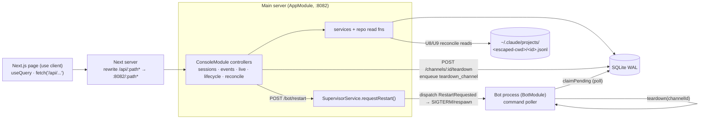
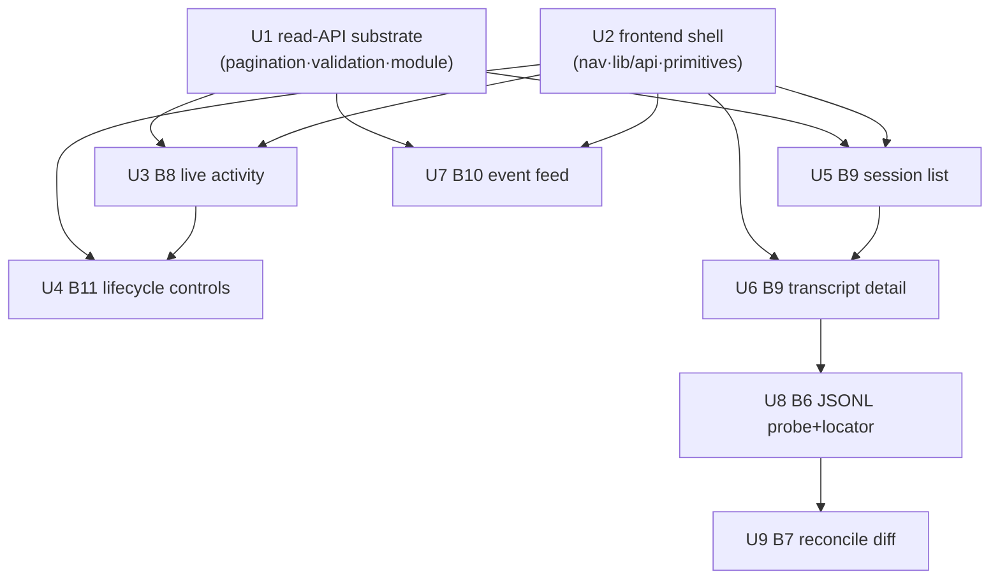

# feat: tdr-code Phase B read & recover surfaces (B6–B12)

## Overview

Phase B's write half is shipped: the SQLite schema (B1) and the live-path writers
(B2–B5) persist sessions, turns, transcript content, events, and live-status as the bot
runs. This plan builds **the read & recover half** — the REST read API and the Next.js
admin pages that let an operator *see* what every channel's agent is doing now, *read*
what it did before, *spot* errors, *recover* a wedged channel, *restart* the bot, and
*verify* the captured transcript against claude's own JSONL.

Concretely, B6–B12:

- **B8** Live activity view — poll-fresh active-channel list, degrades to last-known + offline.
- **B11** Lifecycle controls — tear down one channel; restart the whole bot.
- **B9** Transcript browse — list past sessions by channel/time; read a full transcript.
- **B10** Event/error feed — filterable, linkable to session/channel.
- **B6** JSONL linkage probe + path locator — verify the reconciliation assumption.
- **B7** Reconciliation flow — diff a persisted transcript against claude's on-disk JSONL.
- **B12** Empty/edge states — never-seen vs offline vs online; empty lists (woven through).

It is almost entirely **net-new read code on top of a stable substrate**: the repos today
hold only writers + test-only readers and explicitly defer reader surfaces to "B8" (see
`apps/tdr-code/src/db/turns.repo.ts`, `live-status.repo.ts`). No schema change is needed.
Phase A's command transport (`commands` table + poller) and supervisor FSM
(`RestartRequested`) already exist — B11 is wiring, not new machinery.

---

## Problem Frame

Today tdr-code is observable and controllable **only from inside Discord**. The bot writes
a durable record to SQLite (Phase B B1–B5), but nothing reads it: the main-server process
(`apps/tdr-code/src/app.module.ts`) exposes only `GET /bot/status` (A8) and `GET /health`.
The Next.js frontend (`apps/tdr-code/src/app/page.tsx`) is a single bot-status polling
widget with no navigation, no history, no event feed, and no recovery controls.

This plan closes that gap by adding the operator console's read surfaces and recovery
controls. It is the third of three Phase B plans (after `…-phase-b-persistence-schema-plan.md`
and `…-phase-b-writers-plan.md`) and the natural next deliverable after Phase A: the read
surfaces are mostly additive and lower-risk, and they make the substrate that already
exists actually useful (see origin: `docs/research/2026-06-28-tdr-code-web-ui-feature-landscape.md`,
"Sequencing & dependencies").

**Two-process boundary (load-bearing).** The **main server** (`AppModule`, port 8082) owns
the DB and serves all HTTP; the **bot** (`BotModule`, an application *context* with no HTTP
listener) writes data and drains commands. Therefore: **every read endpoint and the
restart/teardown endpoints live in the main server**, which keeps the console up and
readable even while the bot is down (R3/AE1). Teardown reaches the bot indirectly by
enqueuing a `teardown_channel` row the bot's poller claims.

---

## Requirements Trace

> Numbering follows the origin brainstorm. R1–R4 (process architecture & deployment) are
> realized by Phase A; this plan traces R3 (its UI half) + R5–R12 and the unnumbered B12.

- R3. Main server + UI remain available (durable data readable) while the bot is down, with a
  bot-status indicator — the UI half. → U3 (degrade-to-last-known + offline banner; AE1)
- R5. Live activity view: channel, triggering user, prompting/idle, queue depth, last
  activity, session age; poll-fresh; degrades to last-known + offline. → U3
- R6. (already persisted by B2–B5) Read the durable per-turn transcript. → U6
- R7. Browse past sessions by channel/time; read full transcripts after a session ends. → U5, U6
- R8. Record + use the linkage to locate claude's on-disk JSONL for reconciliation. → U8, U9
- R9. (already recorded by B2–B5) Structured events. → consumed by U7
- R10. Filterable event/error feed, each entry linkable to its session/channel. → U7
- R11. Tear down a single channel's session without affecting others. → U4
- R12. Restart the whole bot; transitions reflected in UI + event feed. → U4
- (B12, no R) Distinguish never-seen / offline-last-seen / online; empty lists. → U2, U3, U5, U7

**Origin actors:** A1 (operator/admin — the console user), A2 (main server — serves this
API), A3 (bot — target of teardown/restart, source of the persisted data), A4 (claude
session — JSONL ground truth for U8/U9).
**Origin flows:** F1 (see live activity & recover a stuck session → U3 + U4), F2 (read a
past session's transcript → U5 + U6 + optional U9), F4 (restart the bot after it wedges → U4).
**Origin acceptance examples:** AE1 (console loads with last-known + "bot offline" when the
bot is down → U3), AE4 (persisted transcript reconciles against claude's JSONL → U9).

---

## Scope Boundaries

- **No agent driving from the web** (R20 non-goal carried from origin) — these are
  observe/control surfaces only; no prompt input, no web chat.
- **No auth in this plan.** Phase D owns Better Auth + deny-by-default guards. Through A/B/C
  the app stays behind Traefik `forward-auth` (origin sequencing). This plan adds the
  console's first *mutating* endpoints under that same trust boundary — see Risks and
  System-Wide Impact. **Do not** remove forward-auth here.
- **No config or git-identity surfaces** — those are Phase C (C1–C9). This plan does not
  read or write the `config` / `git_identity` tables.
- **No schema migrations.** B1 locked the schema; this plan only adds read queries. If a
  read genuinely needs a new index, that is an exception to call out, not the default.
- **No transcript retention/pruning** (origin non-goal). Transcripts accumulate.
- **No raw log viewer** (origin non-goal) — "logging" is the structured event feed (U7).
- **No real-time push** — the live view polls (origin decision: "shared SQLite, UI polls").
  A bot-side WebSocket is a possible later add, not here.

### Deferred to Follow-Up Work

- **Phase D guard coverage of these routes**: the deny-by-default guards (D6) must enumerate
  every endpoint this plan adds. Tracked as a Phase D dependency, implemented there.
- **Boot-reconciliation sweep** (mark prior-generation live_status terminated, close
  dangling turns): the repo affordances exist (`clearStaleByGeneration`, `findDanglingTurns`)
  but the sweep itself was deferred by Phase A/B-writers. The B8 reader compensates by
  deriving offline from freshness (U3); the durable sweep remains a separate unit.

---

## Context & Research

### Relevant Code and Patterns

- **HTTP controller + DTO + service (mirror this):** `apps/tdr-code/src/bot/bot-status.controller.ts`
  (thin `@Controller` → service), `bot-status.dto.ts` (**plain Zod schema + `z.infer`** — not
  `nestjs-zod` `createZodDto`), `bot-status.service.ts` (`@Inject(DB)`, derives status from a
  row, `staleThresholdMs()` = heartbeat + busy_timeout + margin). `health.controller.ts` is a
  second controller example.
- **Frontend (mirror this):** `apps/tdr-code/src/app/page.tsx` — `'use client'`, `useQuery`
  with `refetchInterval`, raw `fetch('/api/...')`, `cns()` from `@lilnas/utils/cns`,
  status→label/color maps, Tailwind. `app/providers.tsx` = the React Query provider (RQ
  5.90.2). `app/layout.tsx` wraps children in `QueryProvider` and has **no nav shell yet**.
  Stack: Next 15.5.4 (App Router, `output: 'standalone'`), React 19.2, zod 4.1, Tailwind v4.
  `next.config.js` rewrites `/api/:path*` → `http://localhost:8082/:path*` (**strips `/api`**).
- **Repo read surface (extend these):** `apps/tdr-code/src/db/{sessions,turns,turn-content,events,live-status}.repo.ts`
  — free functions taking `db` first; today writers + test-only readers (`blocksByTurn`,
  `allLiveStatus`) with comments deferring production readers to this plan. `schema.ts`
  exports row types, discriminated subtypes + type guards (`isRunningGeneration`,
  `isActiveSession`, `isTerminalTurn`), and `narrowTurnContentPayload(payload, columnKind)`
  (returns `null` for bad rows — one bad row must not break a transcript view).
- **Read indexes already present:** `sessions_channel_created_idx` (B9 browse),
  `events_created_at_idx` / `events_channel_created_idx` / `events_type_idx` / `events_session_idx`
  (B10 filters), `live_status` PK = `channel_id` (B8). Integer PKs are monotonic → keyset
  pagination on `id` is natural and drift-free.
- **B11 transport (already built):** `command.repo.ts` `enqueue(db, {generationId, type:'teardown_channel', target: channelId, …})`; the bot's `commands/command-poller.service.ts`
  claims (`claimPending`, BEGIN IMMEDIATE, generation-guarded) and calls
  `sessionManager.teardown(channelId)`. `supervisor/supervisor-machine.ts` already has a
  `RestartRequested` event (+ `pendingRestart` flag) handling Running/Starting/Backoff, and
  `StartRequested` handling Stopped/Failed; `supervisor.service.ts` has a private `dispatch()`
  and a comment marking `getPhase()` as the seam "for testing + future REST controller."
- **B6 linkage (already built):** `agent/session-manager.service.ts` (~L416–449) inserts the
  `sessions` row *after* `newSession` resolves, persisting `acpSessionId` + `cwd`. The probe
  (does the ACP session id equal claude's on-disk JSONL filename?) and the path locator are
  what remain.
- **DB test harness:** `apps/tdr-code/src/db/test-db.ts` (`createTestDb()` → `:memory:`),
  used by every `src/db/__tests__/*.repo.spec.ts`. Jest backend setup at
  `src/__tests__/setup.ts`. Prefer `.spec.ts` for new files.

### Institutional Learnings

- `docs/solutions/conventions/type-guards-over-nonnull-assertions-on-db-rows-2026-05-30.md`
  — model multi-state rows as discriminated unions + type guards, never `row.col!`. Applies
  squarely to U6 (multi-kind `turn_content`) and U7/U3 (event/live rows): use
  `narrowTurnContentPayload` and the existing schema guards.
- `docs/solutions/logic-errors/archived-routine-session-missing-set-logs-2026-06-02.md` —
  an "empty/never-performed" render can mask a *missing-rows* data gap. For B12, keep
  never-seen / offline-with-last-known / genuinely-empty as **distinct** states; don't
  collapse a data gap into a benign "no activity." Also: prefer named destructuring over
  positional row indices when mapping wide rows to DTOs.
- `docs/solutions/logic-errors/consistency-percent-window-mismatch-2026-05-30.md` — a
  fallback/clamp must not silently absorb a wrong value. For U3, drive freshness off **one**
  shared cutoff constant (reuse `bot-status.service.ts`'s `staleThresholdMs` shape) and make
  the degrade-to-last-known path observable, not a silent catch-all.
- `docs/solutions/integration-issues/recharts-categorical-axis-same-day-collapse-2026-05-30.md`
  — carry raw instants (epoch/ISO) through controller → DTO → cache; format only at the leaf
  component. Any keyset cursor must key on the raw `id`/instant, never a formatted string.
- `docs/solutions/conventions/begin-immediate-for-read-then-write-mutations-2026-05-27.md` —
  read-then-write mutations (U4 teardown enqueue resolves the live generation then inserts)
  use `{ behavior: 'immediate' }`; `command.repo.enqueue` is a single INSERT so it's fine,
  but resolving "current generation then enqueue" should be one short transaction.

### External References

External research is already consolidated in
`docs/research/2026-06-28-tdr-code-web-ui-feature-landscape.md` ("Consolidated research
findings"). The directly relevant items: multi-process SQLite WAL (set `busy_timeout` in
both processes — already done; keep write transactions short — this plan's writes are only
the teardown enqueue), the ACP→JSONL reconciliation findings (escaped-cwd dir is
deterministic `/`→`-`, `.`→`-`; filename uuid == internal sessionId for *interactive*
claude; the **ACP** equality is unverified → U8 probe), and the monorepo REST/frontend
patterns (thin controller + service; copy yoink's query provider — already done).

---

## Key Technical Decisions

- **All new controllers in the main server (`AppModule`), grouped by a `ConsoleModule`.**
  The bot has no HTTP listener and must stay the restartable data plane. A new
  `apps/tdr-code/src/console/console.module.ts` declares the read/mutate controllers +
  services and is imported by `AppModule`; it imports `SupervisorModule` for restart
  (NestJS dedups the module → `SupervisorService` stays a singleton). **DI constraint:**
  `ConsoleModule` must obtain `SupervisorService` *only* via `imports: [SupervisorModule]` —
  never list it in `providers` (that would spin a second supervisor + second bot child).
  `BotStatusService` (needed by U3's offline banner) is currently a non-exported provider in
  `AppModule`; since it is stateless, re-provide it in `ConsoleModule` (or promote it to an
  exported provider) — decide in U1. URL paths are resource-named (`/sessions`, `/events`,
  `/live`, `/bot/restart`, `/channels/:id/teardown`) — no `/console` URL prefix; the module
  is DI grouping only. (Grounded by the architecture + repo-research deepening passes.)
- **Bind the main-server HTTP listener to `127.0.0.1` (loopback) — security hardening landed
  in this plan, not deferred to D.** Topology (verified): the main server, Next, and bot all
  run as **host processes**; the *only* container is the nginx proxy, which reaches them via
  `host.docker.internal` (host-gateway). So `bootstrap.ts`'s `app.listen(port)` binds 8082 on
  the host's non-loopback interfaces, reachable by other host processes, the host LAN, and
  containers via host-gateway — `forward-auth` (a Traefik middleware on the public router in
  front of nginx) does not cover any of that. This plan adds the app's first *mutating*
  endpoints (restart/teardown) and a *raw-transcript* read (reconcile); exposing those
  unauthenticated on those interfaces is a real privilege jump from A8's read-only state.
  The request path is unaffected by a loopback bind — browser → Traefik → nginx →
  `host.docker.internal:8080` (Next) → Next rewrites `/api` → `localhost:8082` (main server,
  same host). **The one required deploy change is the healthcheck:** today the nginx container
  probes `host.docker.internal:8082/health`, which a loopback bind makes unreachable from the
  container. Repoint it to probe **`host.docker.internal:8080/api/health`** — that reaches the
  main server's `/health` through Next's rewrite (still exercising the main-server event loop,
  the probe's purpose) and is not behind Traefik forward-auth (which sits in front of nginx,
  not on the nginx→host bridge). **Caveat to verify in U1:** confirm nginx does not proxy any
  route *directly* to `:8082` (it proxies to `:8080`); if it does, that path also needs
  repointing. Keep forward-auth and Phase D guards on top. (Surfaced + corrected by the
  security/feasibility/adversarial deepening passes; chosen over a shared-secret header.)
- **Lean on the bot's existing events for the mutation audit trail — do not write a new
  HTTP-time event** (corrected by the deepening review). A restart is already audited by the
  supervisor's `bot_restart` event (emitted on respawn); a real teardown is already audited by
  the bot's `session_evicted` event (emitted on eviction, with `sessionId`). Writing a *second*
  event at HTTP-enqueue time would double-count in the U7 feed, be session-less (only
  `channelId` is known at enqueue), be type-incorrect (teardown ≠ restart), and a dedicated
  `teardown_requested` type collides with the no-migration scope boundary. The one residual gap
  — a teardown **stranded** before claim (its generation dies) — is traced by its persisted
  `pending` `commands` row, not an event (a "list stranded commands" surface is possible future
  work). This honestly scopes the mutation-feedback "accepted, not confirmed" contract: the feed
  shows the *outcome* events; the command row is the request's durable trace.
- **DTOs = plain Zod schema + `z.infer`** (mirror `bot-status.dto.ts`), not `nestjs-zod`.
  DTO files must stay **framework-neutral** (pure zod, no Nest decorators) because the
  frontend imports the inferred types (`page.tsx` already imports `bot-status.dto`).
  **No `ValidationPipe` exists** in this app (verified — `bootstrap.ts` wires only helmet +
  cookie-parser); `@Query()` params arrive as raw strings/`undefined` with **no coercion**.
  So the U1 `query-params` helper must do the `safeParse` *and* coerce (`limit`→number) by
  hand and throw `BadRequestException` from `@nestjs/common`, mirroring the deny-by-default
  `safeParse` idiom in `command-poller.service.ts`. No global pipe is introduced.
- **Keyset pagination on `id` DESC**, response shape `{ items: T[]; nextCursor: number | null }`.
  Cursor = the last item's integer `id`; `nextCursor` is `null` when the page is the last.
  Chosen over offset/limit because integer PKs are monotonic (no offset drift under
  concurrent inserts) and there is no in-repo offset precedent to mirror. Applies to U5
  (sessions) and U7 (events). U3 (live) and U6 (one transcript) are bounded → no pagination.
- **Timestamps as raw instants end-to-end.** Controllers/DTOs emit ISO-8601 strings (or
  epoch ms); React Query caches the instant; components format at the leaf (`RelativeTime`).
  Cursors key on raw `id`, never a formatted value.
- **Raw-JSON responses, NestJS exceptions, no envelope — but a sanitized error-mapping
  contract.** Mirrors `bot-status` and yoink: lists return `{items,nextCursor}`, detail
  returns the object, missing → `NotFoundException` (404), bad params → `BadRequestException`
  (400), bot-offline teardown → 409. No `{ok,kind,code}` wrapper. **"No envelope" governs the
  *success* shape only — it is not an absence of error handling, and this error-mapping
  contract applies to every new endpoint (U3–U9), not just reconcile.** Locator/FS/parse
  failures (U8/U9) especially must map to a bare 404/400 with **no filesystem path, no `errno`,
  no raw message** in the body (those leak the home dir / cwd layout and act as a
  session-existence oracle); raw detail is server-logged only. Everything unhandled → opaque
  500. (Security deepening pass.)
- **B11 restart maps phase → FSM event, reports phase, and is guarded.**
  `SupervisorService.requestRestart()` (thin public wrapper over the private `dispatch`):
  Running/Starting/Backoff → `RestartRequested`; Stopped/Failed → `StartRequested` (bring a
  crash-broken bot back, resetting the crash-loop count); **Stopping → 409 "transition in
  progress, retry"** (the FSM drops the event, so fire-and-forget would silently lose the
  operator's intent); **`SUPERVISE_BOT=false` (dev) → 409 "not supervised"** (else it would
  spawn a bot child despite supervision being disabled and collide with a manually-run bot).
  The endpoint returns the resulting `getPhase()`. The FSM machinery is unchanged. *Known
  limitation:* an operator restart racing an as-yet-unobserved crash re-labels that crash as
  an expected `stopped` and skips crash-loop accounting — note it (it slightly degrades the
  audit trail the feed surfaces) rather than fixing the FSM here. (Architecture deepening pass.)
- **B11 teardown resolves the live generation from the DB**, not supervisor in-memory state:
  `latestGeneration(db)` + `isRunningGeneration` → enqueue for that generation. If no live
  generation → 409 "bot offline." It **enqueues a `teardown_channel` command only** — it must
  not import `SessionManagerService` (bot-process-only). Two semantics to state plainly: (1)
  during `Starting` (the row is not `isRunningGeneration` until the bot's Discord `ready` fires)
  teardown returns a **retryable 409 `bot-starting`**, distinct from 409 `bot-offline` (no/ended
  generation), so an operator recovering mid-restart isn't told "offline" while the bot is
  visibly coming up; (2) **at-most-once *claim*, not confirmed execution** — the poller marks
  the row `consumed` on *claim*, before `teardown` runs, and a teardown enqueued just before
  that generation crashes is **stranded** (the next generation's poller only claims its own
  rows), its durable trace being the `pending` command row. So the UI contract is "accepted,"
  not "confirmed"; the bot's `session_evicted` event (on real eviction) and the live view
  converging are the observable signals. (Architecture deepening pass.)
- **B8 freshness uses the *extracted* staleness function, not a copied constant.**
  `staleThresholdMs()` is today a **private, un-exported function** in `bot-status.service.ts`
  (reads `BOT_HEARTBEAT_MS` + margins lazily). U1 extracts it to `src/bot/staleness.ts` (kept
  lazy so per-test env overrides still work) and refactors `bot-status.service.ts` to import
  it; U3's live service imports the same. Per-channel: `last_heartbeat_at` older than the
  threshold ⇒ stale/offline. Global: derive "bot offline" from the same `BotStatusService`
  verdict so banner and per-row state agree (one source of truth). Degrade-to-last-known is
  observable (logged when a row is shown stale), not a silent catch-all. (Repo-research pass
  corrected the "reuse the constant" framing.)
- **B7 reconciliation is on-demand (manual trigger), gated on the B6 probe, and returns a
  computed diff — not raw JSONL echoed wholesale.** `GET /sessions/:id/reconcile` reads
  claude's JSONL via the (hardened) locator and diffs it against the persisted transcript. The
  raw JSONL is **strictly more sensitive** than the curated `turn_content` projection (it holds
  full tool I/O, file contents, and secrets the `--dangerously-skip-permissions` agent saw), so
  the response surfaces the *diff vs. the DB projection* (`matched` / `missingInDb` /
  `extraInDb` / `mismatched`), not a dump of raw lines. If the probe (U8) shows ACP id ≠ on-disk filename, or
  the file is absent, reconcile returns a structured **"cannot reconcile"** verdict (with
  reason), never a 500. Chosen over a background job (no scheduler in the main server; on-demand
  matches F2's "optionally reconcile" step and avoids FS reads on every transcript view).
  (Security deepening pass.)
- **Frontend: client-component `useQuery` polling, Tailwind + `cns()`** — mirror the existing
  `page.tsx`. **No MUI, no server actions** (those are swole-isms; swole has no HTTP backend).
  A nav shell + shared UI primitives + a typed `lib/api.ts` are added in U2.

---

## Open Questions

### Resolved During Planning

- **B7 scope (build vs defer)?** → Build it now (Option A): U8 probe + locator, U9 full
  on-demand reconcile diff + UI, with graceful "cannot reconcile" degradation if the probe
  fails. (User decision.)
- **Pagination strategy?** → Keyset on `id` DESC, `{items,nextCursor}` (see Decisions).
- **Where do controllers live / which process?** → Main server `AppModule` via `ConsoleModule`
  (see Decisions). Mutations reach the bot via the existing command table.
- **Restart from a Failed (crash-loop-broken) bot?** → `requestRestart()` dispatches
  `StartRequested` for Stopped/Failed (the FSM resets `attempt` on Failed→Starting).
- **Validation approach for query params?** → Per-endpoint `zod.safeParse` (with manual
  coercion — no pipe exists) → 400, matching `command-poller`'s idiom.
- **Stopgap auth for the new mutating + raw-transcript endpoints before Phase D?** → Bind the
  listener to `127.0.0.1` now (U1). Next reaches it via `localhost:8082`; only the healthcheck
  repoints. Chosen over a shared-secret header (no secret to manage; forward-compatible with D).

### Deferred to Implementation

- **Does the ACP `newSession` id equal claude's on-disk JSONL filename?** This is the B6
  probe (U8). Run it as U8's first step against a real ACP session. The plan does not assume
  the answer; U9 degrades if it's false. (Per planning rules, no runtime probing at plan time.)
- **Exact JSONL line schema** (which NDJSON record types map to prompt/agent_text/tool_call):
  finalized in U9 from the actual file format once U8 confirms the file is locatable.
- **Whether very large transcripts/JSONL need streaming or a size cap** in U6/U9: decide from
  observed sizes during implementation; a defensive cap is noted in Risks.
- **`turnCount` on the session-list DTO** (nice-to-have): include via a cheap `COUNT` subquery
  if it doesn't regress the list query; otherwise omit. Decide when writing U5's query.
- **Per-route rate-limiting on the mutations** (restart loop can trip the supervisor crash-loop
  breaker → `failed`): not added in this plan; tracked for Phase D D6 alongside the guards. The
  loopback bind + the bot's existing outcome events are the interim mitigations. (Security
  deepening pass.)
- **CSRF posture once Phase D adds cookie auth**: these `POST` mutations are CSRF-safe now (no
  ambient credential), but D's cookie session makes them CSRF-exposed — D must cover them, and
  reconcile must remain a side-effect-free `GET`. Flagged so the cutover doesn't silently
  introduce a gap (`cookie-parser` is already wired). (Security deepening pass.)

---

## Output Structure

New files (repo-relative, under `apps/tdr-code/`). Existing files modified are noted per unit.

    src/console/
      console.module.ts            # U1 — declares controllers/services; imported by AppModule
      pagination.ts                # U1 — cursor codec + {items,nextCursor} types
      query-params.ts              # U1 — shared zod query-param schemas + safeParse→400 helper
      live.controller.ts          # U3 — GET /live
      live.service.ts             # U3
      live.dto.ts                 # U3
      lifecycle.controller.ts     # U4 — POST /bot/restart, POST /channels/:id/teardown
      lifecycle.dto.ts            # U4
      sessions.controller.ts      # U5/U6 — GET /sessions, GET /sessions/:id
      sessions.service.ts         # U5/U6
      sessions.dto.ts             # U5/U6
      events.controller.ts        # U7 — GET /events
      events.service.ts           # U7
      events.dto.ts               # U7
      reconcile.controller.ts     # U8/U9 — GET /sessions/:id/jsonl-status, /reconcile
      reconcile.service.ts        # U8/U9
      reconcile.dto.ts            # U8/U9
      jsonl-locator.ts            # U8 — pure (cwd, acpSessionId) → on-disk path
      __tests__/                  # *.spec.ts for the above
    src/bot/
      staleness.ts                 # U1 — extracted staleThresholdMs() (shared by bot-status + live)
    src/app/
      lib/api.ts                   # U2 — typed fetch wrappers (prefix /api) + query-key constants
      components/                  # U2 — StatusDot, RelativeTime, EmptyState, ErrorState, LoadingState, NavShell, BotStatusWidget
      page.tsx                     # U3 — dashboard (refactors existing widget; + live table + controls)
      sessions/page.tsx            # U5 — session list
      sessions/[id]/page.tsx       # U6 — transcript detail (+ U9 reconcile panel)
      sessions/[id]/not-found.tsx  # U6
      events/page.tsx              # U7 — event feed

    Modified: src/app.module.ts (import ConsoleModule),
              src/bot/bot-status.service.ts (import extracted staleThresholdMs),
              src/db/{sessions,turns,turn-content,events,live-status}.repo.ts (read fns),
              src/supervisor/supervisor.service.ts (public requestRestart()),
              src/bootstrap.ts (bind listener to 127.0.0.1 — U1 hardening),
              src/app/layout.tsx (wrap NavShell inside QueryProvider),
              deploy.yml (repoint nginx healthcheck → host.docker.internal:8080/api/health — U1).

---

## High-Level Technical Design

> *This illustrates the intended approach and is directional guidance for review, not
> implementation specification. The implementing agent should treat it as context, not code
> to reproduce.*

**Request path — reads (B8/B9/B10) and the two-process boundary for mutations (B11):**



**Keyset pagination contract (U1, used by U5/U7):**

```text
GET /sessions?channel=<id>&cursor=<int|absent>&limit=<1..100>
  → query: WHERE (channel filters) AND (cursor ? id < cursor : true) ORDER BY id DESC LIMIT limit+1
  → take `limit` rows; nextCursor = (limit+1 rows fetched) ? rows[limit-1].id : null
  → { items: [...mapped DTOs...], nextCursor }
Cursor is the raw integer id of the last returned row. Invalid cursor (non-int) → 400.
```

**B8 live-activity state derivation (U3) — single freshness source:**

```text
botOffline = BotStatusService.getStatus() ∈ {offline, offline-failed, never-seen}
for each live_status row (running generation):
  stale = now - last_heartbeat_at > staleThresholdMs       # same constant as A8
  state = botOffline ? 'last-known (bot offline)'
        : stale      ? 'stale'
        : prompting  ? 'working' : 'idle'
empty list + botOffline      → "Bot offline — no last-known activity" (B12 never/offline)
empty list + bot online      → "No active sessions" (B12 genuinely-empty)
```

**B7 reconciliation verdict (U9) — gated, degrades not throws:**

```text
GET /sessions/:id/reconcile
  locate = jsonl-locator(cwd, acpSessionId)
  if acpSessionId is null        → { verdict: 'cannot-reconcile', reason: 'no-acp-id' }
  if probeKnownBroken            → { verdict: 'cannot-reconcile', reason: 'acp-id-not-filename' }
  if !fs.existsSync(locate.path) → { verdict: 'cannot-reconcile', reason: 'file-missing' }   // no path in body
  else parse NDJSON, diff vs persisted blocks →
       { verdict: 'reconciled', matched, missingInDb[], extraInDb[], mismatched[] }
```

---

## Implementation Units

Grouped into three phases for clarity. U-IDs are stable across edits.



### Phase 1 — Foundation

- U1. **Read-API substrate (pagination, validation, ConsoleModule)**

**Goal:** The shared backend substrate every read endpoint sits on: a keyset-cursor codec,
the `{items,nextCursor}` contract, a query-param parse+coerce helper, the extracted staleness
function, the loopback listener-bind hardening, and an empty `ConsoleModule` wired into
`AppModule`.

**Requirements:** Enabling for R7, R10 (pagination); security hardening for R11/R12.

**Dependencies:** None.

**Files:**
- Create: `apps/tdr-code/src/console/pagination.ts` (cursor on integer `id`;
  `Paginated<T> = { items: T[]; nextCursor: number | null }`; `paginate(rows, limit)`)
- Create: `apps/tdr-code/src/console/query-params.ts` (zod schemas for `cursor` (optional
  positive int), `limit` (1..100, default 50); `parseQuery(schema, raw)` that **coerces**
  string query values and throws `BadRequestException` — there is no `ValidationPipe`)
- Create: `apps/tdr-code/src/console/console.module.ts` (imports `SupervisorModule`;
  controllers/providers added by later units; decide `BotStatusService` provenance —
  re-provide here or export from `AppModule`)
- Create: `apps/tdr-code/src/bot/staleness.ts` (extract the private `staleThresholdMs()` from
  `bot-status.service.ts`, kept lazy on env)
- Modify: `apps/tdr-code/src/bot/bot-status.service.ts` (import the extracted function)
- Modify: `apps/tdr-code/src/app.module.ts` (import `ConsoleModule`)
- Modify: `apps/tdr-code/src/bootstrap.ts` (`app.listen(port, '127.0.0.1')`)
- Modify: `apps/tdr-code/deploy.yml` (repoint the nginx healthcheck from
  `host.docker.internal:8082/health` to `host.docker.internal:8080/api/health` — reaches the
  main server's `/health` via Next's rewrite, surviving the loopback bind)
- Test: `apps/tdr-code/src/console/__tests__/{pagination,query-params}.spec.ts`;
  extend `apps/tdr-code/src/bot/__tests__/bot-status.service.spec.ts` (still green after extract)

**Approach:**
- Cursor is the raw integer `id` (keep it a number; no timestamp formatting — learnings).
- `paginate(rows, limit)`: caller fetches `limit+1`; if over, drop the extra and set
  `nextCursor = rows[limit-1].id`, else `null`.
- `parseQuery` centralizes safeParse + **manual coercion** (`@Query` yields strings/undefined)
  → `BadRequestException`, so every controller validates identically. No pipe is registered.
- **Staleness extract is a prerequisite** for U3 — land it here, refactor the existing caller,
  and confirm `bot-status.service.spec.ts` (which overrides the env vars per-test) stays green,
  proving the function still reads env lazily.
- **Loopback bind** removes 8082 from the host's non-loopback interfaces (main server is a host
  process; only nginx is containerized, reaching it via host-gateway). Verify nginx proxies the
  app only via Next (`:8080`), not directly to `:8082`, then repoint the healthcheck to
  `host.docker.internal:8080/api/health` and confirm it passes from inside the nginx container.

**Patterns to follow:** `command-poller.service.ts` deny-by-default `safeParse`;
`bot-status.dto.ts` zod usage; existing module wiring in `app.module.ts`.

**Test scenarios:**
- Happy path: `paginate` with exactly `limit` rows → `nextCursor: null`; with `limit+1` →
  `nextCursor` = id of the `limit`-th row, items length = `limit`.
- Edge case: empty rows → `{ items: [], nextCursor: null }`. `limit+1` rows where two share the
  same `created_at` but distinct `id` → keyset stable (ordered by `id`).
- Edge case: `query-params` — `limit` arrives as the string `"20"` → coerced to number 20;
  missing cursor → undefined (first page); `limit` absent → default; `limit` above max / `0` /
  negative → 400; `cursor` non-numeric → 400.
- Edge case: after extracting `staleThresholdMs`, a `bot-status.service.spec` case that
  overrides `BOT_HEARTBEAT_MS` still changes the verdict (proves lazy env read survived).
- Verification note: no endpoint yet; correctness is proven by the codec/helper specs.

**Verification:** `pnpm test` green; `bot-status` behavior unchanged after the extract;
`ConsoleModule` imports cleanly; the server no longer answers on the host's non-loopback
interfaces for 8082 (only `localhost`), and the repointed healthcheck still passes from inside
the nginx container.

---

- U2. **Frontend console shell (nav, typed API client, shared UI primitives)**

**Goal:** The frontend foundation: a nav shell, a typed `lib/api.ts` fetch layer + query-key
constants, and shared UI primitives — so each surface page is thin and consistent.

**Requirements:** Enabling for R5, R7, R10; B12 (shared empty/offline/error components).

**Dependencies:** U1 (mirrors the `{items,nextCursor}` shape in fetch types).

**Files:**
- Create: `apps/tdr-code/src/app/lib/api.ts` (typed `fetchJson<T>(path)` that prefixes `/api`
  and throws on `!res.ok`; `queryKeys` constants — `['live']`, `['sessions',…]`,
  `['session', id]`, `['events',…]`). The `paginatedFetch` helper lands in U5 (its first
  consumer) — U2/U3/U4 do bounded reads, so building it here is generality-before-consumer.
- Create: `apps/tdr-code/src/app/components/nav-shell.tsx` (`'use client'` header/sidebar
  with links: Live `/`, Sessions `/sessions`, Events `/events`)
- Create: `apps/tdr-code/src/app/components/` — `status-dot.tsx`, `relative-time.tsx`
  (formats a raw ISO/epoch at the leaf), `empty-state.tsx`, `error-state.tsx`,
  `loading-state.tsx`, `bot-status-widget.tsx` (extracted from `page.tsx`)
- Modify: `apps/tdr-code/src/app/layout.tsx` (wrap children in `NavShell`, **inside** the
  existing `QueryProvider`)

**Approach:**
- `lib/api.ts` is the single place that knows the `/api` prefix and the response shapes;
  pages never hand-roll `fetch`. Mirrors yoink's `api.client` shape but lightweight.
- Extract the existing `page.tsx` bot-status dot/label/colors into `BotStatusWidget` +
  `StatusDot` so U3 reuses them on the dashboard.
- `RelativeTime` takes a raw instant and formats — keeps timestamps un-formatted in cache.
- **UI conventions note (referenced by U3–U9):** the plan specifies *interaction-state
  decisions* (loading/empty/error tri-state, mutation feedback, filter constraints), not pixel
  layout. Finer visual choices — table column order, offline-banner placement, transcript
  block layout, load-more vs. infinite-scroll, `droppedBlocks` display, cross-surface nav links
  — follow the existing `page.tsx` + swole/yoink App Router precedent and are implementer
  discretion. **Filter inputs must constrain to valid values** (enum dropdowns for type/level;
  only submit a fully-formed snowflake for channel) so the strict server validation doesn't
  return 400 on every partial keystroke.

**Patterns to follow:** existing `page.tsx` (`cns()`, Tailwind, status maps), `providers.tsx`.

**Test scenarios:**
- `Test expectation: none for the shell chrome` — presentational; verified manually by
  running the app (nav renders, links route).
- Happy path (lib/api): `fetchJson` resolves JSON on 200; throws on 404/500 (unit-testable
  with a mocked `fetch`). Include one spec for `fetchJson` error-throwing since downstream
  `useQuery` error states depend on it.

**Verification:** App runs; nav appears on every route; the dashboard still shows bot status
via the extracted widget (no visual regression from current `page.tsx`).

---

### Phase 2 — Observe & recover surfaces

- U3. **B8 — Live activity view (API + UI)**

**Goal:** Show currently active channels (channel, triggering user, prompting/idle, queue
depth, last activity, age) poll-fresh; degrade to last-known + an offline banner when the
bot is down (AE1).

**Requirements:** R5; F1; AE1; B12 (tri-state).

**Dependencies:** U1, U2.

**Files:**
- Create: `apps/tdr-code/src/console/live.controller.ts` (`GET /live`),
  `live.service.ts`, `live.dto.ts`
- Modify: `apps/tdr-code/src/db/live-status.repo.ts` (add `listLive(db, generationId)` — the
  reader the file comment defers to this plan; it supersedes the test-only `allLiveStatus`, so
  update/remove that comment)
- Modify: `apps/tdr-code/src/app/page.tsx` (dashboard: bot-status widget + live table)
- Test: `apps/tdr-code/src/console/__tests__/live.service.spec.ts`,
  `apps/tdr-code/src/db/__tests__/live-status.repo.spec.ts` (extend)

**Approach:**
- `listLive(db, generationId)` selects `live_status` rows for **one** generation id. The
  service resolves which: `latestGeneration(db)` → if `isRunningGeneration` use its id (online
  path); else still use `latestGeneration().id` (offline path → those rows are the last-known
  set) and flag the result `botOffline`. Reading rows for a *single* generation id is what
  keeps stale earlier-generation rows from surfacing as current — important because the
  boot-reconciliation sweep that would delete them is deferred (Scope Boundaries). If
  `latestGeneration` is null → never-seen (empty + never state). Document this two-path
  resolution explicitly so the offline case isn't an under-defined "return recent rows."
- `LiveActivityService` composes `BotStatusService.getStatus()` (global) + per-row staleness
  by importing the extracted `staleThresholdMs()` from `src/bot/staleness.ts` (U1) — never a
  copied formula. Compute `ageMs = now - created_at` (session age) by joining the session row,
  or expose `last_activity_at`/`created_at` from live_status where available.
- DTO emits raw ISO instants; the UI formats via `RelativeTime`.
- UI: `/` becomes the dashboard — `BotStatusWidget` on top, then a live table polling every
  ~3–5s (`refetchInterval`). Each row shows the derived state; degrade-to-last-known shows an
  offline banner and "last seen" per A8.

**Patterns to follow:** `bot-status.service.ts` (staleness derivation), `page.tsx` (polling).

**Test scenarios:**
- Covers AE1. Bot offline (no running generation): `GET /live` returns last-known rows +
  a global offline flag; service marks every row last-known. UI shows offline banner + rows.
- Happy path: one running channel, fresh heartbeat, `prompting=true` → state `working`,
  correct user/queue/age. Idle (`prompting=false`, fresh) → `idle`.
- Edge case (B12): bot online, zero live rows → `genuinely-empty` ("No active sessions");
  bot offline, zero rows → `never/offline` ("Bot offline — no last-known activity"). These
  are distinct verdicts, not the same empty string.
- Edge case: row with `last_heartbeat_at` older than `staleThresholdMs` while bot is online
  → `stale` (not silently shown as fresh); the degrade is logged (observable).
- Edge case: a `live_status` row stamped with a prior generation (restart overlap) is not
  shown as current for the new generation.

**Verification:** Dashboard lists active channels and refreshes within a few seconds; killing
the bot flips it to last-known + offline without the page erroring.

---

- U4. **B11 — Lifecycle controls (teardown channel, restart bot) (API + UI)**

**Goal:** From the console, tear down one channel's session (R11/F1) and restart the whole
bot (R12/F4); reflect transitions in the UI and (already) the event feed.

**Requirements:** R11, R12; F1, F4.

**Dependencies:** U2 (mutation UI primitives), U3 (teardown buttons live in the live table;
restart on the dashboard).

**Files:**
- Create: `apps/tdr-code/src/console/lifecycle.controller.ts`
  (`POST /bot/restart`, `POST /channels/:channelId/teardown` — uses `command.repo.enqueue` +
  `latestGeneration`; does **not** import `SessionManagerService` and writes **no** HTTP-time
  event), `lifecycle.dto.ts`
- Modify: `apps/tdr-code/src/supervisor/supervisor.service.ts` (public
  `requestRestart(): SupervisorPhase` → maps phase to `RestartRequested`/`StartRequested`;
  returns 409-signalling result for `Stopping` and when `SUPERVISE_BOT=false`)
- Modify: `apps/tdr-code/src/app/page.tsx` / live table (restart button + per-row teardown
  via `useMutation` + invalidate `['live']`)
- Test: `apps/tdr-code/src/supervisor/__tests__/supervisor.service.spec.ts` (extend),
  `apps/tdr-code/src/console/__tests__/lifecycle.controller.spec.ts`

**Approach:**
- **Teardown:** validate `channelId` is a Discord snowflake (reuse the snowflake zod from
  `command-poller`); resolve the latest generation. Distinguish two precondition responses so
  the operator isn't misled during a restart: no generation at all / ended → 409
  `{ error: 'bot-offline' }`; a generation exists but is not yet `isRunningGeneration` (still
  `Starting`) → 409 `{ error: 'bot-starting', retryable: true }`; running → `enqueue(db,
  {generationId, type:'teardown_channel', target: channelId, createdAt})`, return 202. **It
  must not import `SessionManagerService`** (bot-process-only) — the bot's poller drains it and
  emits its own `session_evicted` on eviction (no HTTP-time event; see Decisions). Contract is
  **"accepted," not "confirmed"**: the poller marks the row `consumed` on claim, and a teardown
  enqueued just before that generation crashes is **stranded** (next generation's poller won't
  claim it) — traced by the persisted `pending` command row. The live view converging is the
  operator's success signal.
- **Restart:** `requestRestart()` (thin wrapper over the private `dispatch`) reads
  `getPhase()`: Running/Starting/Backoff → `dispatch(RestartRequested)`; Stopped/Failed →
  `dispatch(StartRequested)`; **Stopping → 409 `{ error: 'transition-in-progress' }`**
  (the FSM drops the event, so a fake 202 would lose the operator's intent);
  **`SUPERVISE_BOT=false` → 409 `{ error: 'not-supervised' }`**. Return the new `getPhase()`
  (202) — note this is "intent accepted" (often `Stopping`), not "restart complete." The
  `bot_restart` event is already emitted by the spawn path (the restart's audit trail).
- UI (mutation feedback — plan-level, since the "accepted not confirmed" contract is visible
  here): both actions use `useMutation` → invalidate `['live']` + bot-status. A **409 surfaces
  inline on the action** (e.g. an error message by the button), never a silent no-op, and
  `retryable` 409s (`bot-starting`, `transition-in-progress`) prompt "retry shortly." **Confirm
  dialogs** are distinct: teardown names the channel and warns its active session is killed;
  restart warns **all** channels are interrupted. After teardown the row shows a **pending**
  state until the live poll drops it; if it persists past a bounded timeout (~2× poll), show
  "request sent — not yet confirmed" so the operator doesn't re-enqueue a second stranded
  command. Finer visual layout follows the existing `page.tsx`/precedent (see U2 note).

**Execution note:** Add the `requestRestart` phase-mapping test first (pure-ish, drives the
public API shape) before wiring the controller.

**Patterns to follow:** `command.repo.enqueue`, `command-poller` snowflake schema +
deny-by-default; `supervisor-machine` event semantics; `page.tsx` for the client mutation UI.

**Test scenarios:**
- Covers R11. Teardown with a valid snowflake + running generation → enqueues exactly one
  `teardown_channel` row for that generation; returns 202.
- Error path: teardown with a generation that is still `Starting` (not `isRunningGeneration`)
  → 409 `bot-starting` (retryable), no row; with no/ended generation → 409 `bot-offline`, no
  row; invalid snowflake → 400, no row.
- Covers R12. `requestRestart` from Running → dispatches `RestartRequested` (assert resulting
  phase `Stopping` + `pendingRestart`); from Failed → `StartRequested` (phase `Starting`,
  attempt reset); from **Stopping → controller returns 409 `transition-in-progress`, no
  dispatch** (phase unchanged).
- Error path: restart with `SUPERVISE_BOT=false` → 409 `not-supervised`, no dispatch.
- Integration: teardown enqueue → a stubbed poller `claimPending` returns the row exactly
  once (generation-guarded); a finalized generation yields no claim (proves the dead-bot
  enqueue is inert / stranded as a `pending` row — the documented "accepted not confirmed"
  semantics).

**Verification:** Clicking "tear down" on a live channel removes it within the poll interval
and leaves other channels untouched; "restart bot" cycles the bot (status: online →
starting → online) with the dashboard staying up; an event row appears for the restart.

---

- U5. **B9 — Transcript browse: session list (API + UI)**

**Goal:** Browse past (and active) sessions by channel and time, paginated.

**Requirements:** R7; F2; B12 (empty list).

**Dependencies:** U1 (pagination), U2 (shell).

**Files:**
- Create: `apps/tdr-code/src/console/sessions.controller.ts` (`GET /sessions`),
  `sessions.service.ts`, `sessions.dto.ts`
- Modify: `apps/tdr-code/src/db/sessions.repo.ts` (add `listSessions(db, {channelId?, cursor?,
  limit})` — keyset on `id` DESC, optional channel filter using `sessions_channel_created_idx`)
- Create: `apps/tdr-code/src/app/sessions/page.tsx`
- Test: `apps/tdr-code/src/db/__tests__/sessions.repo.spec.ts` (extend),
  `apps/tdr-code/src/console/__tests__/sessions.controller.spec.ts`

**Approach:**
- `listSessions` returns `limit+1` rows ordered by `id` DESC, optional `channel_id` filter;
  service maps to `SessionListItemDto` (id, channelId, triggeringUserId, createdAt ISO,
  endedAt ISO|null, endReason, optional `turnCount`) and applies `paginate`.
- UI: `/sessions` — channel filter input, paginated list, each row links to
  `/sessions/[id]`; "load more" follows `nextCursor`; empty list → `EmptyState`.

**Patterns to follow:** U1 `paginate`/`parseQuery`; `bot-status.controller` shape; `page.tsx`
client fetch.

**Test scenarios:**
- Happy path: insert N sessions across two channels; `GET /sessions` (no filter) returns
  newest-first, page size honored, `nextCursor` set; `?channel=X` returns only X's.
- Edge case: pagination boundary — exactly `limit` → `nextCursor: null`; `limit+1` →
  cursor returns the next page with no overlap and no gap (assert disjoint id sets).
- Edge case: two sessions with identical `created_at`, distinct `id` → keyset ordering stable
  across the page boundary (no duplicate/skip).
- Edge case (B12): no sessions → `{items:[], nextCursor:null}`; UI shows empty state.
- Error path: `?cursor=abc` → 400; `?limit=999` → 400.

**Verification:** `/sessions` lists sessions newest-first, filters by channel, pages through
without dupes; each row links to its transcript.

---

- U6. **B9 — Transcript detail (full transcript) (API + UI)**

**Goal:** Read one session's full persisted transcript — turns with their ordered content
blocks (prompt / agent_text / tool_call / diff).

**Requirements:** R6, R7; F2.

**Dependencies:** U2, U5 (list links here).

**Files:**
- Create: `GET /sessions/:id` in `sessions.controller.ts`; extend `sessions.service.ts`,
  `sessions.dto.ts`
- Modify: `apps/tdr-code/src/db/sessions.repo.ts` (add `getSessionById(db, id)` — **net-new**;
  only `getActiveSession`-by-channel exists today), `apps/tdr-code/src/db/turns.repo.ts` (add
  `listTurnsBySession(db, sessionId)` ORDER BY `turn_index`),
  `apps/tdr-code/src/db/turn-content.repo.ts` (add `listBlocksByTurns(db, turnIds[])` batch
  reader ordered by `id` — generalizes the existing single-turn `blocksByTurn`; have one
  delegate to the other rather than duplicating)
- Create: `apps/tdr-code/src/app/sessions/[id]/page.tsx`,
  `apps/tdr-code/src/app/sessions/[id]/not-found.tsx`
- Test: `apps/tdr-code/src/db/__tests__/turns.repo.spec.ts`,
  `turn-content.repo.spec.ts` (extend), `sessions.controller.spec.ts` (extend)

**Approach:**
- `getSessionTranscript(sessionId)`: load session (404 via `NotFoundException` if absent),
  its turns (by `turn_index`), and all blocks for those turns; group blocks under turns,
  ordered by `id` (insertion order). Run every block through `narrowTurnContentPayload(payload,
  row.kind)`; **drop (and count) un-narrowable rows** (surface a `droppedBlocks` count) so one
  bad row can't break the view.
- **Read consistency:** wrap the three reads (session, turns, blocks) in one
  `db.transaction(…, { behavior: 'deferred' })` so they share a single WAL snapshot — the bot
  can commit between separate autocommit reads and yield an internally-inconsistent view.
  better-sqlite3 is synchronous, so there is no `await` inside the transaction (keep it so).
- **Eventually-consistent in-flight reads** are acceptable and expected: a `running` turn shows
  a partial, growing block set and a `tool_call` may be at an intermediate `status` (created-
  then-updated in place). The UI polling converges; state this rather than trying to freeze it.
- **Bound the payload:** `turn_content.payload` holds full prompt/agent text and diff
  `oldText`/`newText` blobs that can be large; the synchronous driver blocks the event loop for
  the page's deserialization. One session is bounded, but note a defensive cap (and consider
  excluding/truncating very large diff bodies in the list-level view).
- DTO: `{ session, turns: [{ ...turn, content: [DiscriminatedBlock] }], droppedBlocks }`,
  timestamps as ISO.
- UI: render each turn (index, user, status, stop reason, timings) and each block by kind —
  prompt (+ image markers), agent_text, tool_call (title/kind/status), diff (path + new/old).
  Loading skeleton; `not-found` page for a missing id.

**Patterns to follow:** `narrowTurnContentPayload` + schema type guards (learnings:
type-guards-over-nonnull); `blocksByTurn` ordering (`ORDER BY id`).

**Test scenarios:**
- Happy path: a session with 2 turns, mixed block kinds → DTO preserves turn order
  (`turn_index`) and block order (`id`); each block correctly narrowed by kind.
- Integration (assert row counts): every persisted turn appears with exactly its persisted
  blocks (no block dropped, none attributed to the wrong turn) — guards the missing-rows trap.
- Edge case: a `turn_content` row with a malformed payload → narrower returns null → block is
  dropped and a `droppedBlocks` count is surfaced (transcript still renders).
- Edge case: a running (not-yet-closed) turn → renders with `status: running`, no `endedAt`.
- Error path: `GET /sessions/:id` for a non-existent id → 404; non-numeric id → 400.

**Verification:** Opening a session from `/sessions` renders the full transcript in order,
with each block kind rendered appropriately; a bad/garbled block doesn't blank the page.

---

- U7. **B10 — Event/error feed (API + UI)**

**Goal:** A filterable event/error feed (by type, level, channel), paginated, each entry
linkable to its session/channel.

**Requirements:** R9 (consume), R10; F1 (recover context).

**Dependencies:** U1, U2.

**Files:**
- Create: `apps/tdr-code/src/console/events.controller.ts` (`GET /events`),
  `events.service.ts`, `events.dto.ts`
- Modify: `apps/tdr-code/src/db/events.repo.ts` (add `listEvents(db, {type?, level?, channelId?,
  cursor?, limit})` — keyset on `id` DESC using `events_type_idx`/`events_channel_created_idx`)
- Create: `apps/tdr-code/src/app/events/page.tsx`
- Test: `apps/tdr-code/src/db/__tests__/events.repo.spec.ts` (extend),
  `apps/tdr-code/src/console/__tests__/events.controller.spec.ts`

**Approach:**
- `listEvents` filters by any combination of `type` (validated against `EVENT_TYPES`),
  `level` (`EVENT_LEVELS`), `channelId`; keyset on `id` DESC; maps to `EventDto`
  (id, type, level, channelId, sessionId, context, createdAt ISO).
- UI: `/events` — filter controls (type/level/channel), paginated list; each row links to
  `/sessions/:sessionId` when `sessionId` is present; `level` drives a color (reuse status
  color idiom). Bot-global events (null session/channel) render without a link.

**Patterns to follow:** U1 pagination; `EVENT_TYPES`/`EVENT_LEVELS` enums from `schema.ts`;
`page.tsx` filter+fetch.

**Test scenarios:**
- Happy path: mixed events → unfiltered feed newest-first, paginated. `?type=turn_errored`,
  `?level=error`, `?channel=X`, and a combination each return only matching rows.
- Edge case: invalid `?type=nope` / `?level=loud` → 400 (validated against the enums).
- Edge case (same-timestamp): two events with equal `created_at`, distinct `id` → stable
  keyset order across the page boundary.
- Edge case: an event with null `sessionId`/`channelId` (e.g. `bot_restart`) → DTO has nulls;
  UI renders it without a broken link.
- Edge case (B12): no events → empty state, not an error.

**Verification:** `/events` shows the feed, filters narrow it correctly, error-level rows are
visually distinct, and rows link to their session.

---

### Phase 3 — Reconciliation (B6 + B7, Option A)

- U8. **B6 — JSONL linkage probe + path locator (API + verification)**

**Goal:** Verify the reconciliation assumption (ACP `newSession` id == claude's on-disk JSONL
filename) and provide a pure path locator; expose per-session JSONL status.

**Requirements:** R8 (linkage half).

**Dependencies:** U6 (attaches to the session detail surface).

**Files:**
- Create: `apps/tdr-code/src/console/jsonl-locator.ts` (pure
  `jsonlPath(cwd, acpSessionId): string` — escaped-cwd `/`→`-`, `.`→`-`, under
  `~/.claude/projects/<escaped-cwd>/<acpSessionId>.jsonl`, `HOME` from env)
- Create: `apps/tdr-code/src/console/reconcile.controller.ts`
  (`GET /sessions/:id/jsonl-status`), `reconcile.service.ts`, `reconcile.dto.ts`
- Test: `apps/tdr-code/src/console/__tests__/jsonl-locator.spec.ts`,
  `reconcile.service.spec.ts`

**Approach:**
- **Treat `acpSessionId` as untrusted input, not a trusted persisted value.** It is
  *agent-authored* — `result.sessionId` returned by the `--dangerously-skip-permissions`
  claude process and stored verbatim (`session-manager.service.ts`), and pre-Phase-D the DB
  write path is itself intra-network reachable. The locator must: reject `acpSessionId` that
  isn't a strict charset match (`^[A-Za-z0-9_-]+$` / UUID shape — no separators, no `.`/`..`,
  no NUL); build the path; then `path.resolve()` and **assert the result stays under the
  canonical `~/.claude/projects` root** (trailing-separator `startsWith`) before any `fs` call;
  reject (404, no path in the body) otherwise. `cwd` is a **different trust level** — it comes
  from the operator-set `CLAUDE_CWD` env var (not agent-authored), so it does not need
  charset-rejection; the required control for it is the same `path.resolve` + confinement
  assert (not a charset reject, which would break legitimate mixed-case/hyphenated dir names).
  (Security deepening pass.)
- `jsonlPath` is pure and unit-tested against the documented escaping (no FS, no disk write).
- `jsonl-status` endpoint: load the session; validate + compute the path from `(cwd,
  acpSessionId)`; return `{ acpSessionId, exists, reason? }` — **the response body must NOT
  include `path` or `cwd`** (echoing them leaks the home dir / cwd layout, violating the
  error-mapping contract; the computed path stays server-side, logged only). `acpSessionId`
  null → `{ exists:false, reason:'no-acp-id' }`.
- **The probe** is U8's verification activity, not a shipped feature: spawn/observe one real
  ACP session (or use an existing persisted session) and confirm a file exists at the
  computed path. Record the verdict in the plan's follow-up notes / an event. This verdict
  gates U9's diff vs. its degraded path.

**Execution note:** Run the probe **first** (~5 min): pick a real session's persisted
`(acpSessionId, cwd)`, compute `jsonlPath`, and check the file on disk. If the ACP id is the
filename, build U9's diff as designed. If it is **not**, record the verdict; U9 renders
`cannot-reconcile / acp-id-not-filename` and AE4 (exact reconciliation) is deferred to a
follow-up (the cwd + created_at time-window locator is the candidate fallback — do not build it
speculatively). Do not build U9's diff before the verdict is known.

**Patterns to follow:** landscape "ACP → claude JSONL reconciliation" findings; pure-function
+ unit-test style of `supervisor-machine`.

**Test scenarios:**
- Happy path: `jsonlPath('/home/u/work', 'abc-123')` → `~/.claude/projects/-home-u-work/abc-123.jsonl`
  with `/`→`-` and `.`→`-` applied to the cwd; respects `HOME`.
- Edge case: cwd containing `.` (e.g. `/a/.config`) escapes to `-a--config`; trailing slash
  handled deterministically.
- Edge case: `jsonl-status` for a session with null `acpSessionId` → `{exists:false,
  reason:'no-acp-id'}`; for a present-but-missing file → `{exists:false}` — assert the response
  body contains **no** `path`/`cwd` field.
- Error path (traversal): `acpSessionId` of `../../etc/passwd`, an absolute path, or a value
  containing `/`/NUL → rejected by the charset check, **no `fs` call made**, resolved path
  never escapes `~/.claude/projects`; error body carries no filesystem path.
- Verification note: the probe itself is a manual/integration check recorded as U8's first
  step; the shipped code (locator + status endpoint) is covered by the specs above.

**Verification:** `GET /sessions/:id/jsonl-status` reports the computed path and whether the
file exists; the probe outcome is recorded and U9's branch is chosen accordingly.

---

- U9. **B7 — Reconciliation flow (diff API + UI)**

**Goal:** On demand, diff a session's persisted transcript against claude's on-disk JSONL and
render the result; degrade cleanly to "cannot reconcile" when the linkage/file is unavailable.

**Requirements:** R8; F2; AE4.

**Dependencies:** U8 (locator + probe verdict), U6 (session detail surface).

**Files:**
- Create: `GET /sessions/:id/reconcile` in `reconcile.controller.ts`; extend
  `reconcile.service.ts`, `reconcile.dto.ts`
- Modify: `apps/tdr-code/src/app/sessions/[id]/page.tsx` (a "Verify against claude's record"
  panel)
- Test: `apps/tdr-code/src/console/__tests__/reconcile.service.spec.ts` (extend, with fixture
  JSONL)

**Approach:**
- `reconcile(sessionId)`: resolve `(acpSessionId, cwd)` via the **hardened** U8 locator; if no
  acp id / probe-known-broken / file missing → return a `cannot-reconcile` verdict with a
  specific reason (never throw 500; no path/`errno` in the body — error-mapping contract).
  Otherwise read the JSONL and diff against the persisted blocks → structured
  `{ verdict:'reconciled', matched, missingInDb[], extraInDb[], mismatched[] }`.
- **Egress the computed diff, not raw JSONL lines.** The raw file holds full tool I/O, file
  contents, and secrets the agent saw — strictly more sensitive than the curated `turn_content`
  projection. The response surfaces the comparison result (which units match / differ), not a
  dump of raw lines. (Security deepening pass.)
- **Untrusted-input parser:** the JSONL is agent-authored and may be mid-write. Parse
  line-by-line, **skip** malformed/blank/truncated-final lines (mirror
  `narrowTurnContentPayload`'s "one bad row must not break the view" discipline), **zod-narrow**
  each parsed record before using fields, enforce a **bounded read size + max response size**
  (memory-DoS guard, compounds the unauth surface). `GET` must be side-effect-free (no
  reconciliation row written) so it stays CSRF-safe at the Phase D cookie cutover.
- Must not hold a DB read snapshot open across the file I/O (the FS read is the async part).
- The exact JSONL record→block mapping is finalized here from the real file format (U8
  confirms locatability first).
- UI: a panel on `/sessions/[id]` that calls reconcile on demand and renders matches/mismatches;
  `cannot-reconcile` shows the reason (no-acp-id / acp-id-not-filename / file-missing), not an
  error toast.

**Execution note:** Build against a captured fixture JSONL (from the U8 probe session) so the
diff logic is unit-tested deterministically; gate the real-FS read behind the U8 verdict.

**Patterns to follow:** U8 locator; `narrowTurnContentPayload` for the persisted side;
degrade-not-throw verdict shape (Decisions).

**Test scenarios:**
- Covers AE4. Fixture where JSONL and persisted transcript match → `verdict:'reconciled'`,
  empty `missingInDb`/`extraInDb`/`mismatched`.
- Happy path (discrepancy detectable): JSONL has a tool call absent from the DB → it appears
  in `missingInDb`; a DB block absent from JSONL → `extraInDb`; differing text → `mismatched`.
- Error/degrade path: session with null `acpSessionId` → `cannot-reconcile / no-acp-id`;
  file missing on disk → `cannot-reconcile / file-missing` (HTTP 200, **no path in body**).
- Edge case: malformed JSONL line → skipped (counted), reconcile still completes; oversized
  file → capped with a surfaced note.
- Error path: `GET /sessions/:id/reconcile` for non-existent session → 404.

**Verification:** On a real session whose JSONL exists, the panel shows a clean match or a
concrete discrepancy list; on a session without linkage, it shows a clear "cannot reconcile"
reason instead of erroring.

---

- **Interaction graph:** New read controllers only *read* the tables the bot writes. The one
  write path is U4 teardown enqueue (main server writes `commands`), already an established
  two-writer pattern (Phase A). Restart drives the existing supervisor FSM; no new states.
- **Concurrency model — the real risk is the synchronous driver, not WAL contention**
  (corrected by the architecture deepening pass). WAL readers take a consistent snapshot and
  **never block** the bot's writes, so "busy_timeout on reads" is not the concern. The actual
  concerns: (1) better-sqlite3 is **synchronous**, so a large read (a `turn_content` page with
  big diff blobs) blocks the *entire main-server event loop* for its deserialization — so every
  list endpoint needs a **hard `LIMIT`** and `turn_content.payload` must be treated as
  potentially large; (2) any endpoint composing a view from **multiple queries** (U6: session +
  turns + blocks) must wrap them in one `DEFERRED` snapshot transaction (no `await` inside) or
  the bot can commit mid-request and yield an inconsistent view; (3) the U4 teardown **write**
  can lose the write-lock race with the bot's `BEGIN IMMEDIATE` poller and spin the event loop
  up to `busy_timeout` (~5s) — acceptable because teardown is rare/operator-initiated; (4) the
  new HTTP-driven readers are a new class of WAL reader — keep read transactions short so they
  don't pin WAL growth.
- **Mutation feedback contract** (architecture deepening pass): restart and teardown are
  **fire-and-forget into asynchronous machinery** — the FSM dispatch, and a `commands` row
  drained on the next poll tick (~1.5s) and marked `consumed` on *claim*, not on successful
  teardown. So the API returns **"accepted," not "confirmed."** The UI shows an optimistic/
  pending transition and relies on the `['live']`/bot-status polls converging. The audit trail
  is the bot's existing **outcome** events (`session_evicted` on real teardown, `bot_restart`
  on respawn); a teardown **stranded** before claim (its generation crashes) leaves no event —
  its durable trace is the persisted `pending` `commands` row. The UI's bounded "request sent —
  not yet confirmed" state (U4) makes the stranded case visible so the operator doesn't
  re-enqueue.
- **Error propagation:** Read failures → HTTP 4xx/5xx → `useQuery` error → `ErrorState`.
  Reconcile FS/parse failures degrade to a `cannot-reconcile` verdict (200) with no path leak.
  Teardown/restart preconditions → 409 (bot-offline / bot-starting / transition-in-progress /
  not-supervised), surfaced inline on the action (retryable variants prompt a retry). **Cascade to watch:** `/health` shares the main-server event
  loop; a heavy console read that stalls the loop can fail the healthcheck → the orchestrator
  restarts the main server → `onModuleDestroy` SIGTERMs the bot child. Hard `LIMIT`s are the
  mitigation; note the coupling.
- **State lifecycle risks:** prior-generation `live_status` rows must not show as current (U3
  filters to the running generation / marks last-known). Keyset pagination must be stable when
  rows share a `created_at` (cursor on `id`). **Transcript reads are eventually-consistent for
  in-flight turns** — a `running` turn shows a partial block set and a mid-flight `tool_call`
  may be at an intermediate `status`; acceptable, polling converges (the read-side mirror of the
  live-status freshness story). An operator restart racing an unobserved crash mis-labels that
  crash as a clean `stopped` and skips crash-loop accounting — a known audit-trail limitation.
- **API surface parity / Phase D:** this plan adds `GET /live`, `GET /sessions`,
  `GET /sessions/:id`, `GET /sessions/:id/jsonl-status`, `GET /sessions/:id/reconcile`,
  `GET /events`, `POST /bot/restart`, `POST /channels/:id/teardown`. **Phase D's deny-by-default
  guards (D6) must enumerate these *plus* the pre-existing `GET /bot/status` and `GET /health`**,
  and apply **per-route** (not per-prefix) guards — note `/bot/status` (read) and `/bot/restart`
  (mutation) now share the `/bot` prefix across two controllers with very different sensitivity.
  The loopback bind (U1) is the interim boundary; carry the `bot-status.controller.ts`
  trust-boundary comment on every new controller. `reconcile` is the most sensitive route (raw
  agent transcript content) and is loopback-only until D.
- **Integration coverage:** U4 (teardown enqueue → poller claim → silent-strand boundary), U6
  (turn↔blocks grouping + snapshot consistency), and U9 (JSONL↔DB diff) are the cross-layer
  behaviors unit mocks alone won't prove — each has an integration-style scenario above.
- **Unchanged invariants:** no schema change; the bot's write path (B2–B5), the C1 no-`await`
  invariant, and the command-poller/supervisor semantics are untouched. This plan is
  read-plus-one-enqueue (+ a public restart wrapper + a loopback bind); it does not alter how
  data is produced.

---

## Risks & Dependencies

| Risk | Mitigation |
|------|------------|
| **First mutating endpoints (restart, teardown) + the raw-transcript reconcile read are reachable on :8082 on the host's non-loopback interfaces (host process; reachable by host LAN + containers via host-gateway) before Phase D auth.** | **Bind the listener to `127.0.0.1` in U1** (Next reaches it via `localhost:8082` on the host; repoint the nginx healthcheck to `:8080/api/health`) — removes the host-interface surface. Keep forward-auth + the trust-boundary comment; list every route as mandatory Phase D D6 coverage. |
| Reconcile egresses **raw agent transcript content** (tool I/O, file contents, secrets the skip-permissions agent saw) — strictly more sensitive than the curated `turn_content`. | Loopback-only (above); return the **computed diff vs. the DB projection**, not raw JSONL lines; mandatory D6 deny-by-default; state the sensitivity in System-Wide Impact. |
| Path traversal — `acpSessionId` is **agent-authored** (`result.sessionId`) and the pre-D DB write path is intra-network, so "persisted ⇒ safe" is false. | U8 locator: strict charset on `acpSessionId` (reject separators/`..`/abs/NUL), `path.resolve` + confinement assert under `~/.claude/projects` before any `fs` read; same care for `cwd`. |
| Unauthenticated restart/teardown = DoS/griefing; a restart loop can trip the supervisor crash-loop breaker → `failed` (denies legitimate Discord users). | Loopback bind narrows the attacker set; the bot's existing `bot_restart`/`session_evicted` outcome events provide the trace (no HTTP-time event); per-route rate-limit tracked for D6 (Open Questions). |
| No-envelope error responses leak filesystem paths / `errno` / stack traces (ENOENT on reconcile is a session-existence oracle revealing the home dir). | Error-mapping contract (Decisions): 400/404 opaque, no path/`errno`/raw message in the body; raw detail server-logged only; unhandled → opaque 500. |
| Reconcile JSONL is **untrusted input** (agent-authored, possibly mid-write) — parser crash / memory-DoS. | Per-line resilient parse (skip bad/truncated lines like `narrowTurnContentPayload`); zod-narrow each record; bounded read + max response size; `GET` side-effect-free. |
| Synchronous driver: a large `turn_content`/event page blocks the whole main-server event loop (and can cascade: stalled `/health` → main-server restart → bot child killed). | Hard `LIMIT` on every list endpoint; treat `turn_content.payload` as potentially large (truncate big diffs in list views); composite reads use one `DEFERRED` snapshot, no `await` inside. |
| Operator restart racing an unobserved bot crash mis-finalizes the generation as `stopped` and skips crash-loop accounting (degrades the audit trail the feed surfaces). | Documented known limitation (no FSM change here); the respawn still emits `bot_restart`, so "a restart happened" is traced — only the crash *classification* is lost. |
| The B6 probe fails (ACP id ≠ on-disk filename) → U9's primary diff path is unusable, so **AE4 (exact reconciliation) is probe-contingent**. | U8 runs the probe first and records the verdict; if it fails, U9 returns `cannot-reconcile / acp-id-not-filename` (never breaks), R8's linkage + status half still ships, and AE4 is **deferred to a follow-up** (a cwd + created_at time-window locator is the candidate fallback — not built speculatively here). |
| Keyset pagination edge cases (same timestamp, deletions) cause dupes/skips. | Cursor keys on monotonic `id`, not `created_at`; explicit same-timestamp test in U5/U7. |
| Frontend has no established test harness (page.tsx is untested; jest excludes `src/app/**`). | Concentrate automated tests on the backend (repos/services/controllers); verify UI by running the app. Adding RTL/jsdom is out of scope. |
| `requestRestart()` is a no-op when `SUPERVISE_BOT=false` (dev) — would otherwise spawn a bot despite supervision being off. | U4 returns 409 `not-supervised` in that mode; restart-during-`Stopping` returns 409 `transition-in-progress` rather than a misleading success. |
| Dependency: U4 relies on Phase A's command poller + supervisor (built) and U3's live table for placement. | All present in `main`; U4 sequenced after U3. |
| `staleThresholdMs` is private/un-exported; copying it would drift from A8. | U1 extracts it to `src/bot/staleness.ts` (kept lazy on env), refactors the A8 caller, and U3 imports the same function. |

---

## Documentation / Operational Notes

- **No new env vars required.** Reuses `BACKEND_PORT`, `BOT_HEARTBEAT_*` (staleness),
  `CLAUDE_CWD`/`HOME` (locator), `SUPERVISE_BOT` (restart guard). If a reconcile size cap
  becomes configurable, add one `EnvKeys` entry with a sane default.
- **Deploy (one required change):** the listener now binds `127.0.0.1` (U1), so the Docker
  healthcheck in `deploy.yml` must stop probing `host.docker.internal:8082` — repoint it to the
  Next/public path or a host-loopback probe. The nginx→`host.docker.internal:8080`→`localhost:8082`
  request bridge is otherwise unchanged. New pages are static App-Router routes in the standalone build.
- **Lint/build conventions the units must honor** (repo-research pass): `simple-import-sort`
  group order (side-effect → `node:` → packages → `src/…` → relative) is `error`;
  `no-relative-import-paths` is `error` — cross-folder imports use `src/…`, not `../`; Prettier
  (no semicolons, single quotes, trailing commas) must pass; DTO files stay framework-neutral
  (pure zod) since the frontend imports them; new tests use `.spec.ts`; the frontend has no jest
  project (`src/app/**` excluded), so keep UI units test-free.
- **Post-merge:** run `/ce-compound` to capture the net-new patterns this plan establishes
  (keyset pagination + `{items,nextCursor}`, the polling/degrade-to-last-known live view, the
  JSONL reconciliation approach, and the B12 never/offline/empty tri-state) — the
  `docs/solutions/` base currently has nothing on read-API/UI conventions for this app.

---

## Sources & References

- **Origin (requirements):** `docs/brainstorms/2026-06-27-tdr-code-web-ui-requirements.md`
- **Master landscape / consolidated research:** `docs/research/2026-06-28-tdr-code-web-ui-feature-landscape.md`
- **Prior Phase B plans:** `docs/plans/2026-06-30-001-feat-tdr-code-phase-b-persistence-schema-plan.md`,
  `docs/plans/2026-06-30-002-feat-tdr-code-phase-b-writers-plan.md`;
  **Phase A:** `docs/plans/2026-06-29-001-feat-tdr-code-two-process-substrate-plan.md`
- **Key current files:** `apps/tdr-code/src/app.module.ts`, `src/bootstrap.ts`,
  `src/bot/bot-status.{controller,service,dto}.ts`, `src/bot/health.controller.ts`,
  `src/db/schema.ts` + `src/db/*.repo.ts`, `src/db/test-db.ts`,
  `src/supervisor/supervisor-machine.ts` + `supervisor.service.ts`,
  `src/commands/command-poller.service.ts`, `src/db/command.repo.ts`,
  `src/agent/session-manager.service.ts`, `src/app/{layout,page,providers}.tsx`,
  `next.config.js`
- **Patterns to mirror:** `apps/yoink/` (query provider, typed fetch client),
  `apps/swole/src/app/` (App Router list/detail/empty/not-found structure — adapt to
  Tailwind+cns, not MUI), `packages/utils/src/cns.ts`
- **Institutional:** `docs/solutions/conventions/type-guards-over-nonnull-assertions-on-db-rows-2026-05-30.md`,
  `docs/solutions/logic-errors/archived-routine-session-missing-set-logs-2026-06-02.md`,
  `docs/solutions/logic-errors/consistency-percent-window-mismatch-2026-05-30.md`,
  `docs/solutions/integration-issues/recharts-categorical-axis-same-day-collapse-2026-05-30.md`,
  `docs/solutions/conventions/begin-immediate-for-read-then-write-mutations-2026-05-27.md`
